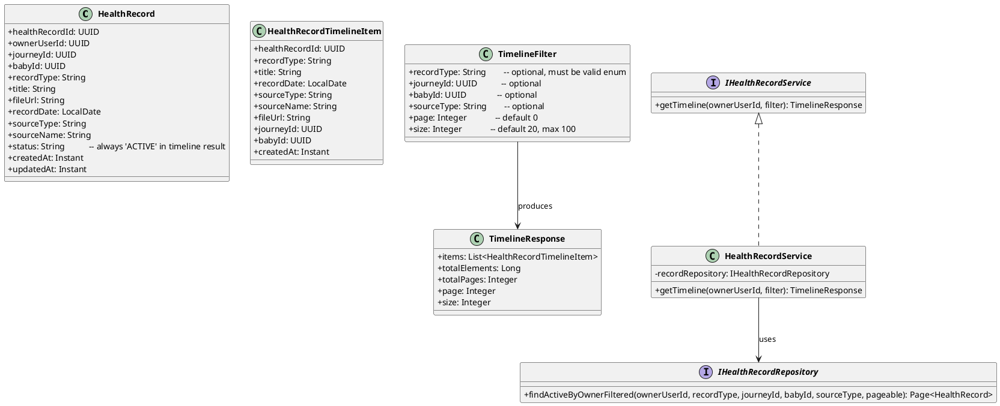
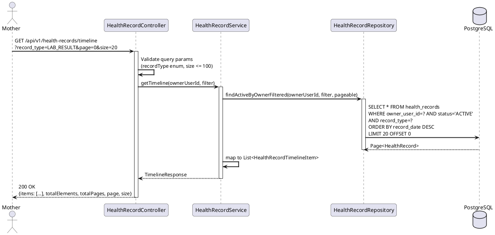
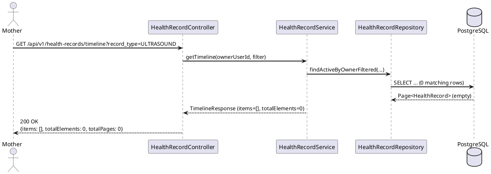

# ENGINEERING DOCUMENTATION STANDARD (EDS) v2.0
# Technical Design Specification — UC-42 View Health Record Timeline

| Field | Value |
|-------|-------|
| **Document ID** | `CB-HEALTH-IMP-004` |
| **Version** | `1.0` |
| **Date** | `2026-06-26` |
| **Status** | `Draft` |
| **Document Owner** | `TV2 - Bách` |
| **Author** | `AI Agent` |
| **Reviewed by** | `[Tech Lead]` |
| **DPO Sign-off** | `[ ] Pending` |
| **Approved by** | `[Principal Architect]` |
| **Last Review** | `2026-06-26` |
| **Based on EDS** | `v2.0` |

---

## CHANGELOG

| Ngày | Người thực hiện | Nội dung thay đổi |
|------|-----------------|-------------------|
| 2026-06-26 | AI Agent | Tạo tài liệu lần đầu cho UC-42 View Health Record Timeline |

---

## MỤC LỤC

1. [Tổng quan Module](#1-tổng-quan-module)
2. [Ma trận Truy vết](#2-ma-trận-truy-vết)
3. [Architecture Decision Records](#3-architecture-decision-records)
4. [Non-Functional Requirements & SLA](#4-non-functional-requirements--sla)
5. [Static Modeling](#5-static-modeling)
6. [Dynamic Modeling](#6-dynamic-modeling)
7. [Domain Event Catalog](#7-domain-event-catalog)
8. [Interface Specification](#8-interface-specification)
9. [API Specification](#9-api-specification)
10. [Bảng mã lỗi](#10-bảng-mã-lỗi)
11. [Quy trình Triển khai](#11-quy-trình-triển-khai)
12. [Rollback & Incident Runbook](#12-rollback--incident-runbook)
13. [Kịch bản Kiểm thử](#13-kịch-bản-kiểm-thử)
14. [Phương pháp Xác minh](#14-phương-pháp-xác-minh)
15. [Mẫu thử thực tế](#15-mẫu-thử-thực-tế)
16. [Authorization Matrix](#16-authorization-matrix)
17. [AI Prompt Constraints (CASE 2.0)](#17-ai-prompt-constraints-case-20)

---

## 1. Tổng quan Module

| Field | Value |
|-------|-------|
| **Module Name** | `ViewHealthRecordTimeline` |
| **Bounded Context** | `health` |
| **UC ID** | `UC-42` |
| **SRS Reference** | `3.3.1.19` |
| **Primary Actor** | `Mother (ROLE_MOTHER)` |
| **Platform** | `Mobile App` |
| **Data Classification** | `Sensitive-PII` |
| **Compliance Scope** | `BR-RBAC, BR-PRIVACY, PDPA` |
| **Upstream Dependencies** | `auth, UC-39 AddHealthRecord, UC-40 UpdateHealthRecord, UC-41 ArchiveHealthRecord` |
| **Downstream Consumers** | `Mobile UI timeline view, expert consultation (read-only)` |

**Mô tả:** Cho phép Mother xem danh sách health records theo dạng timeline — sắp xếp theo `record_date` giảm dần (mới nhất trước). Hỗ trợ filtering theo `record_type`, `journey_id`, `baby_id`, và `source_type`. Chỉ hiển thị records có `status = 'ACTIVE'` (records ARCHIVED bị ẩn). Hỗ trợ pagination. Đây là read-only endpoint — không thay đổi state.

---

## 2. Ma trận Truy vết

| Requirement ID | Loại | Mô tả | Thành phần Code | Compliance Target | ADR liên quan |
|----------------|------|-------|-----------------|-------------------|---------------|
| UC-42 | Use Case | Mother xem timeline health records | `HealthRecordController.getTimeline()` | BR-RBAC | ADR-HEALTH-007 |
| BR-RBAC | Business Rule | Chỉ trả về records của chính caller (owner_user_id = JWT sub) | JPA query filter | PDPA | ADR-HEALTH-007 |
| BR-PRIVACY | Business Rule | Không expose records của user khác | `ownerUserId` luôn từ JWT | PDPA | — |
| UC-42-BR-001 | Business Rule | Chỉ trả về records có status='ACTIVE' | WHERE status='ACTIVE' trong query | Data hygiene | ADR-HEALTH-007 |
| UC-42-BR-002 | Business Rule | Sắp xếp theo record_date DESC (mới nhất trước) | ORDER BY record_date DESC | UX | — |
| UC-42-BR-003 | Business Rule | Hỗ trợ filter: record_type, journey_id, baby_id, source_type | Query params trên GET endpoint | Feature | ADR-HEALTH-007 |
| UC-42-BR-004 | Business Rule | Hỗ trợ pagination (page, size) | Spring Pageable | Performance | — |
| UC-42-BR-005 | Business Rule | Read-only — không emit audit event | Không có write operation | PDPA efficiency | — |

---

## 3. Architecture Decision Records

### ADR-HEALTH-007 — Query filter ACTIVE only; ownerUserId từ JWT

| Field | Value |
|-------|-------|
| **Status** | `Accepted` |
| **Deciders** | `AI Agent — Tech Design` |
| **Date** | `2026-06-26` |

#### Bối cảnh (Context)
Timeline là view quan trọng — nếu include ARCHIVED records hay records của user khác, sẽ vi phạm BR-HEALTH-ARCHIVE (ẩn archived) và BR-RBAC (chỉ xem của mình). Query phải enforce cả hai ở tầng Repository.

#### Các phương án đã xem xét

| Phương án | Mô tả | Ưu điểm | Nhược điểm |
|-----------|-------|----------|------------|
| A | Filter tại Service layer sau khi fetch all | Linh hoạt | Tốn bộ nhớ, không scale |
| B | Filter trong JPA query với `WHERE owner_user_id=? AND status='ACTIVE'` | Hiệu quả, an toàn | Cần viết custom query |
| C | Spring Data Specification / QueryDSL | Flexible dynamic query | Complexity cao hơn cần thiết |

#### Quyết định
Chọn **Phương án B** — JPA query với `WHERE owner_user_id = :ownerUserId AND status = 'ACTIVE'` cộng optional filters. Sử dụng Spring Data `@Query` hoặc Specification tùy implementation. Index `idx_health_records_owner_user_id` đã có trong V1 schema.

#### Hệ quả

**Tích cực:**
- Hiệu quả — filter xảy ra tại DB
- Không thể leak records của user khác qua query bug

**Tiêu cực / Trade-offs:**
- Dynamic filter (optional params) cần Specification hoặc nhiều `@Query` overloads

**Compliance Impact:**
- Đảm bảo BR-RBAC — ownerUserId hardcoded từ JWT vào WHERE clause

---

### ADR-HEALTH-008 — Pagination mặc định (page=0, size=20) và max size=100

| Field | Value |
|-------|-------|
| **Status** | `Accepted` |
| **Date** | `2026-06-26` |

#### Quyết định
Default page size = 20; tối đa 100 để tránh large payload. Client mobile không cần tất cả records cùng lúc. Response bao gồm `totalElements`, `totalPages`, `page`, `size`.

---

## 4. Non-Functional Requirements & SLA

### 4.1. Performance & Availability

| Category | Requirement | Target SLA | Measurement Method |
|----------|-------------|------------|--------------------|
| Latency (p99) | GET timeline | `< 300ms` (indexed query) | k6 load test |
| Availability | Uptime | `99.9%` | Uptime monitor |
| Throughput | Concurrent reads | `500 req/s` | Load test |

### 4.2. Data Integrity & Retention

| Category | Requirement | Compliance Basis |
|----------|-------------|------------------|
| Isolation | Query luôn filter `owner_user_id` từ JWT | PDPA |
| Correctness | ARCHIVED records không xuất hiện trong timeline | BR-HEALTH-ARCHIVE, UC-41 |

### 4.3. Security

| Category | Requirement |
|----------|-------------|
| Access control | GET chỉ trả về records của caller |
| Read-only | Không có side effects |

### 4.4. Scalability

> Index `idx_health_records_owner_user_id` và `idx_health_records_journey_id` trong V1 schema đảm bảo query performance. Với 1000+ records/user, phân trang là bắt buộc.

---

## 5. Static Modeling

### 5.1. Class Diagram



### 5.2. Data Structure

> Không cần migration mới. Query sử dụng bảng `health_records` đã có:

```sql
-- Không có Flyway migration mới cho UC-42.
-- V1__init_schema.sql đã có đủ:
--
-- TABLE: health_records
--   health_record_id  uuid PK
--   owner_user_id     uuid NOT NULL (indexed: idx_health_records_owner_user_id)
--   journey_id        uuid (indexed: idx_health_records_journey_id)
--   baby_id           uuid (indexed: idx_health_records_baby_id)
--   record_type       varchar(50)
--   title             varchar(255)
--   file_url          text
--   record_date       date
--   source_type       varchar(30)
--   source_name       varchar(200)
--   status            varchar(20)   -- filter: status = 'ACTIVE'
--   created_at        timestamptz
--   updated_at        timestamptz
--
-- QUERY PATTERN (UC-42):
SELECT *
FROM health_records
WHERE owner_user_id = :ownerUserId
  AND status = 'ACTIVE'
  AND (:recordType IS NULL OR record_type = :recordType)
  AND (:journeyId IS NULL OR journey_id = :journeyId)
  AND (:babyId IS NULL OR baby_id = :babyId)
  AND (:sourceType IS NULL OR source_type = :sourceType)
ORDER BY record_date DESC, created_at DESC
LIMIT :size OFFSET :offset;
```

---

## 6. Dynamic Modeling

### 6.1. Sequence Diagram — Happy Path



### 6.2. Sequence Diagram — Empty Result (no records)



### 6.3. State Machine

> Not applicable — UC-42 là read-only, không thay đổi trạng thái bất kỳ entity nào.

---

## 7. Domain Event Catalog

### 7.1. Events Published

| Event Name | Trigger | Publisher | Subscriber(s) | Async? |
|------------|---------|-----------|---------------|--------|
| Not applicable | Read-only operation — không phát event | — | — | — |

### 7.2. Events Consumed

| Event Name | Source | Handler | Action |
|------------|--------|---------|--------|
| Not applicable | — | — | UC-42 không consume events |

> **Lý do:** UC-42 là pure read (GET) — emit audit event cho mỗi lần xem timeline sẽ tạo quá nhiều noise trong audit log và không có giá trị compliance. Chỉ write operations cần audit.

---

## 8. Interface Specification

```java
// TimelineFilter.java
// @version 1.0
public class TimelineFilter {
    @Pattern(regexp = "ULTRASOUND|LAB_RESULT|PRESCRIPTION|VACCINATION_FORM|EXAMINATION_RESULT|NOTE")
    private String recordType;       // optional

    private UUID journeyId;          // optional
    private UUID babyId;             // optional

    @Size(max = 30)
    private String sourceType;       // optional

    @Min(0)
    private Integer page = 0;        // default 0

    @Min(1) @Max(100)
    private Integer size = 20;       // default 20, max 100
    // getters / setters
}

// HealthRecordTimelineItem.java
public class HealthRecordTimelineItem {
    private UUID      healthRecordId;
    private String    recordType;
    private String    title;
    private LocalDate recordDate;
    private String    sourceType;
    private String    sourceName;
    private String    fileUrl;
    private UUID      journeyId;
    private UUID      babyId;
    private Instant   createdAt;
    // getters
}

// TimelineResponse.java
public class TimelineResponse {
    private List<HealthRecordTimelineItem> items;
    private long    totalElements;
    private int     totalPages;
    private int     page;
    private int     size;
    // getters
}

// IHealthRecordService.java (extension)
// @version 1.0
public interface IHealthRecordService {
    /**
     * Get paginated timeline of ACTIVE health records for the authenticated user.
     * Results ordered by record_date DESC, then created_at DESC.
     * @param ownerUserId from JWT — never from request param
     * @param filter optional query filters
     * @return paginated timeline
     */
    TimelineResponse getTimeline(UUID ownerUserId, TimelineFilter filter);
}
```

### 8.2. Repository Interface

```java
// IHealthRecordRepository.java (extension)
// @version 1.0
public interface IHealthRecordRepository extends JpaRepository<HealthRecord, UUID> {

    @Query("""
        SELECT r FROM HealthRecord r
        WHERE r.ownerUserId = :ownerUserId
          AND r.status = 'ACTIVE'
          AND (:recordType IS NULL OR r.recordType = :recordType)
          AND (:journeyId IS NULL OR r.journeyId = :journeyId)
          AND (:babyId IS NULL OR r.babyId = :babyId)
          AND (:sourceType IS NULL OR r.sourceType = :sourceType)
        ORDER BY r.recordDate DESC, r.createdAt DESC
        """)
    Page<HealthRecord> findActiveByOwnerFiltered(
        @Param("ownerUserId") UUID ownerUserId,
        @Param("recordType") String recordType,
        @Param("journeyId") UUID journeyId,
        @Param("babyId") UUID babyId,
        @Param("sourceType") String sourceType,
        Pageable pageable
    );
}
```

---

## 9. API Specification

### 9.1. Endpoints Table

| Method | Path | Auth Level | Required Roles | Rate Limit | Idempotent? |
|--------|------|------------|----------------|------------|-------------|
| `GET` | `/api/v1/health-records/timeline` | JWT Bearer | `ROLE_MOTHER` | 300/min | Yes |

### 9.2. Request / Response Schemas

#### `GET /api/v1/health-records/timeline`

**Query Parameters (all optional):**

| Parameter | Type | Default | Description |
|-----------|------|---------|-------------|
| `record_type` | String | null | Filter by record type (ULTRASOUND, LAB_RESULT, etc.) |
| `journey_id` | UUID | null | Filter by mother journey |
| `baby_id` | UUID | null | Filter by baby profile |
| `source_type` | String | null | Filter by source type (CLINIC, HOME, etc.) |
| `page` | Integer | 0 | Page number (0-indexed) |
| `size` | Integer | 20 | Page size (1–100) |

**Example Request:**
```
GET /api/v1/health-records/timeline?record_type=LAB_RESULT&page=0&size=10
Authorization: Bearer [JWT_MOTHER_TOKEN]
```

**Response — 200 OK (Happy Path):**
```json
{
  "items": [
    {
      "healthRecordId": "550e8400-e29b-41d4-a716-446655440010",
      "recordType": "LAB_RESULT",
      "title": "Blood Test Q2 2026",
      "recordDate": "2026-06-20",
      "sourceType": "CLINIC",
      "sourceName": "FV Hospital",
      "fileUrl": null,
      "journeyId": "journey-uuid-001",
      "babyId": null,
      "createdAt": "2026-06-20T08:00:00.000Z"
    },
    {
      "healthRecordId": "550e8400-e29b-41d4-a716-446655440009",
      "recordType": "LAB_RESULT",
      "title": "Blood Test Q1 2026",
      "recordDate": "2026-03-15",
      "sourceType": "CLINIC",
      "sourceName": "Vinmec Hospital",
      "fileUrl": "https://storage.example.com/file.pdf",
      "journeyId": "journey-uuid-001",
      "babyId": null,
      "createdAt": "2026-03-15T10:00:00.000Z"
    }
  ],
  "totalElements": 2,
  "totalPages": 1,
  "page": 0,
  "size": 10
}
```

**Response — 200 OK (Empty):**
```json
{
  "items": [],
  "totalElements": 0,
  "totalPages": 0,
  "page": 0,
  "size": 20
}
```

**Response — 400 Bad Request (invalid filter):**
```json
{
  "error": {
    "code": "HEALTH-001",
    "message": "Validation failed",
    "details": [
      { "field": "record_type", "message": "Invalid record type value" }
    ]
  }
}
```

---

## 10. Bảng mã lỗi

| Code | HTTP Status | Message (EN) | Message (VI) | Trigger Condition |
|------|-------------|--------------|--------------|-------------------|
| `HEALTH-001` | 400 | Validation failed | Dữ liệu không hợp lệ | Invalid `record_type` enum hoặc `size > 100` |
| `HEALTH-005` | 500 | Internal error | Lỗi hệ thống | DB query error không mong đợi |
| `IAM-001` | 401 | Authentication required | Yêu cầu xác thực | Không có JWT / JWT hết hạn |
| `IAM-002` | 403 | Insufficient permissions | Không đủ quyền | Role không phải MOTHER |

> **Lưu ý:** Timeline trả về 200 với `items: []` khi không có records — không phải 404.

---

## 11. Quy trình Triển khai

### 11.1. Prerequisites

- [ ] ADR-HEALTH-007 và ADR-HEALTH-008 đã được Accepted
- [ ] `HealthRecord` entity từ UC-39 đã tồn tại
- [ ] Không cần Flyway migration mới

### 11.2. Pre-Migration Checklist

> Không applicable — read-only endpoint, không có schema thay đổi.

### 11.3. Implementation Steps

#### Chặng 1 — Repository Method

```java
// IHealthRecordRepository.java
@Query("""
    SELECT r FROM HealthRecord r
    WHERE r.ownerUserId = :ownerUserId
      AND r.status = 'ACTIVE'
      AND (:recordType IS NULL OR r.recordType = :recordType)
      AND (:journeyId IS NULL OR r.journeyId = :journeyId)
      AND (:babyId IS NULL OR r.babyId = :babyId)
      AND (:sourceType IS NULL OR r.sourceType = :sourceType)
    ORDER BY r.recordDate DESC, r.createdAt DESC
    """)
Page<HealthRecord> findActiveByOwnerFiltered(
    @Param("ownerUserId") UUID ownerUserId,
    @Param("recordType") String recordType,
    @Param("journeyId") UUID journeyId,
    @Param("babyId") UUID babyId,
    @Param("sourceType") String sourceType,
    Pageable pageable
);
```

#### Chặng 2 — Service Method

```java
// HealthRecordService.java
@Transactional(readOnly = true)
public TimelineResponse getTimeline(UUID ownerUserId, TimelineFilter filter) {
    Pageable pageable = PageRequest.of(
        filter.getPage(),
        Math.min(filter.getSize(), 100)  // enforce max 100
    );

    Page<HealthRecord> page = recordRepository.findActiveByOwnerFiltered(
        ownerUserId,
        filter.getRecordType(),
        filter.getJourneyId(),
        filter.getBabyId(),
        filter.getSourceType(),
        pageable
    );

    List<HealthRecordTimelineItem> items = page.getContent()
        .stream()
        .map(mapper::toTimelineItem)
        .collect(Collectors.toList());

    return new TimelineResponse(
        items,
        page.getTotalElements(),
        page.getTotalPages(),
        page.getNumber(),
        page.getSize()
    );
}
```

#### Chặng 3 — Controller

```java
// HealthRecordController.java
@GetMapping("/timeline")
@PreAuthorize("hasRole('MOTHER')")
public ResponseEntity<TimelineResponse> getTimeline(
        @Valid TimelineFilter filter,
        @AuthenticationPrincipal UserPrincipal principal) {
    return ResponseEntity.ok(
        healthRecordService.getTimeline(principal.getUserId(), filter)
    );
}
```

#### Chặng 4 — Verification

```bash
# Happy path — filter by LAB_RESULT
curl -X GET "https://[host]/api/v1/health-records/timeline?record_type=LAB_RESULT" \
  -H "Authorization: Bearer [JWT_MOTHER_TOKEN]"
# Expected: 200, items array with only LAB_RESULT records, all status=ACTIVE

# Verify ARCHIVED records not included
curl -X GET "https://[host]/api/v1/health-records/timeline" \
  -H "Authorization: Bearer [JWT_MOTHER_TOKEN]"
# Expected: no items with status=ARCHIVED in response
```

### 11.4. Deployment Checklist

- [ ] Health check endpoint trả về 200
- [ ] Timeline trả về ACTIVE records chỉ
- [ ] ARCHIVED records không xuất hiện
- [ ] Records của user khác không xuất hiện
- [ ] Pagination hoạt động đúng

---

## 12. Rollback & Incident Runbook

### 12.1. Điều kiện kích hoạt Rollback

| Điều kiện | Ngưỡng | Người quyết định |
|-----------|--------|------------------|
| ARCHIVED records xuất hiện trong timeline | Bất kỳ 1 case | Tech Lead ngay lập tức |
| Records của user khác xuất hiện | Bất kỳ 1 case | Tech Lead + DPO ngay lập tức |
| Latency p99 > 2s | Trong 10 phút | On-call Engineer |

### 12.2. Rollback Procedure

```bash
# Read-only endpoint — không có migration, chỉ revert code
git checkout -- src/main/java/com/carebridge/backend/health/service/HealthRecordService.java
git checkout -- src/main/java/com/carebridge/backend/health/controller/HealthRecordController.java
git checkout -- src/main/java/com/carebridge/backend/health/repository/IHealthRecordRepository.java

kubectl rollout undo deployment/carebridge-api
```

### 12.3. Notification Protocol

| Thời điểm | Người nhận | Kênh |
|-----------|------------|------|
| Data leak phát hiện | DPO + Tech Lead | Ngay lập tức — Slack + Email |

---

## 13. Kịch bản Kiểm thử

```gherkin
Feature: View Health Record Timeline (UC-42)
  Background:
    Given test data classification: SYNTHETIC
    And Mother authenticated with JWT (ACC-001, ROLE_MOTHER)

  Scenario: Happy path — get all ACTIVE records, sorted by date DESC
    Given records: HR-001 (date=2026-06-20, ACTIVE), HR-002 (date=2026-05-10, ACTIVE), HR-003 (date=2026-06-26, ARCHIVED)
    All owned by ACC-001
    When GET /api/v1/health-records/timeline
    Then response status 200
    And response items contain HR-001 and HR-002 (in order: HR-001 before HR-002 — date DESC)
    And response items do NOT contain HR-003 (ARCHIVED)
    And totalElements = 2

  Scenario: Filter by record_type=LAB_RESULT
    Given records: HR-001 (LAB_RESULT, ACTIVE), HR-002 (ULTRASOUND, ACTIVE)
    When GET /api/v1/health-records/timeline?record_type=LAB_RESULT
    Then response items contain only HR-001
    And totalElements = 1

  Scenario: Filter by journey_id
    Given records: HR-001 (journeyId=J-001), HR-002 (journeyId=J-002)
    When GET /api/v1/health-records/timeline?journey_id=J-001
    Then response items contain only HR-001

  Scenario: Filter by baby_id
    Given records: HR-001 (babyId=BABY-001), HR-002 (babyId=null)
    When GET /api/v1/health-records/timeline?baby_id=BABY-001
    Then response items contain only HR-001

  Scenario: No records → empty response (not 404)
    Given no ACTIVE records for ACC-001
    When GET /api/v1/health-records/timeline
    Then response status 200
    And response body contains items=[] and totalElements=0

  Scenario: Another user's records not visible
    Given ACC-999 has ACTIVE records HR-X01, HR-X02
    When ACC-001 GET /api/v1/health-records/timeline
    Then response items do NOT contain HR-X01 or HR-X02

  Scenario: Pagination — page=0, size=1
    Given 3 ACTIVE records for ACC-001
    When GET /api/v1/health-records/timeline?page=0&size=1
    Then response items has 1 item (most recent by date)
    And totalElements = 3, totalPages = 3

  Scenario: size > 100 → 400
    When GET /api/v1/health-records/timeline?size=200
    Then response status 400, error code HEALTH-001

  Scenario: Invalid record_type → 400
    When GET /api/v1/health-records/timeline?record_type=INVALID
    Then response status 400, error code HEALTH-001

  Scenario: No JWT → 401
    When GET /api/v1/health-records/timeline without Authorization header
    Then response status 401
```

---

## 14. Phương pháp Xác minh

### 14.1. Database Inspection

```sql
-- Verify query only returns ACTIVE records for owner
SELECT health_record_id, status, owner_user_id, record_date
FROM health_records
WHERE owner_user_id = '[ACC-001-uuid]'
  AND status = 'ACTIVE'
ORDER BY record_date DESC;
-- Compare with API response items (should match)

-- Verify ARCHIVED records NOT in result
SELECT COUNT(*)
FROM health_records
WHERE owner_user_id = '[ACC-001-uuid]'
  AND status = 'ARCHIVED';
-- This count should NOT appear in API response totalElements

-- Verify no cross-user data
SELECT DISTINCT owner_user_id FROM health_records WHERE owner_user_id != '[ACC-001-uuid]';
-- None of these should appear in ACC-001's timeline response
```

### 14.2. Log / Audit Verification

```bash
# Verify read-only — no audit events emitted for GET
kubectl logs -l app=carebridge-api | grep '"eventType":"HealthRecord' | head -20
# Expected: No HealthRecord events during timeline GET calls

# Verify no N+1 query problem
kubectl logs -l app=carebridge-api | grep "select.*health_records" | wc -l
# Expected: 1 SELECT per request (not N selects)
```

---

## 15. Mẫu thử thực tế

### 15.1. Happy Path

```bash
# Get full timeline
curl -X GET "https://[host]/api/v1/health-records/timeline" \
  -H "Authorization: Bearer [JWT_MOTHER_TOKEN]"
```

**Expected Response (200):**
```json
{
  "items": [
    {
      "healthRecordId": "uuid-hr-001",
      "recordType": "LAB_RESULT",
      "title": "Blood Test Q2 2026",
      "recordDate": "2026-06-20",
      "sourceType": "CLINIC",
      "sourceName": "FV Hospital",
      "fileUrl": null,
      "journeyId": "uuid-journey-001",
      "babyId": null,
      "createdAt": "2026-06-20T08:00:00.000Z"
    }
  ],
  "totalElements": 1,
  "totalPages": 1,
  "page": 0,
  "size": 20
}
```

### 15.2. Filter by type and paginate

```bash
# Filter LAB_RESULT, page 0, size 5
curl -X GET "https://[host]/api/v1/health-records/timeline?record_type=LAB_RESULT&page=0&size=5" \
  -H "Authorization: Bearer [JWT_MOTHER_TOKEN]"
```

### 15.3. Error Paths

```bash
# Invalid record_type → 400
curl -X GET "https://[host]/api/v1/health-records/timeline?record_type=INVALID" \
  -H "Authorization: Bearer [JWT_MOTHER_TOKEN]"
```

**Expected Response (400):**
```json
{
  "error": {
    "code": "HEALTH-001",
    "message": "Validation failed",
    "details": [{ "field": "record_type", "message": "Invalid record type value" }]
  }
}
```

```bash
# No JWT → 401
curl -X GET "https://[host]/api/v1/health-records/timeline"
```

**Expected Response (401):**
```json
{
  "error": {
    "code": "IAM-001",
    "message": "Authentication required"
  }
}
```

---

## 16. Authorization Matrix

| Endpoint | `GUEST` | `MOTHER` | `EXPERT` | `ADMIN` |
|----------|---------|----------|----------|---------|
| `GET /api/v1/health-records/timeline` | ❌ | ✅ Own only | ❌ | ✅ (with ownerUserId param) |

**Chú thích:**
- MOTHER: chỉ nhìn thấy records của chính mình (ownerUserId từ JWT)
- EXPERT: không có quyền GET timeline (phải qua consultation flow riêng nếu cần)
- ADMIN: có thể cần ownerUserId param riêng — ngoài scope UC-42

---

## 17. AI Prompt Constraints (CASE 2.0)

### 17.1 Constraint Summary Table

| # | Constraint | Source | Last Verified |
|---|-----------|--------|---------------|
| C1 | Query PHẢI có `WHERE status = 'ACTIVE'` — không bao giờ trả ARCHIVED records | UC-42-BR-001, ADR-HEALTH-007 | 2026-06-26 |
| C2 | `ownerUserId` PHẢI lấy từ JWT SecurityContext — KHÔNG từ query param | BR-RBAC, ADR-HEALTH-007 | 2026-06-26 |
| C3 | ORDER BY record_date DESC, created_at DESC | UC-42-BR-002 | 2026-06-26 |
| C4 | Pagination max size = 100, default = 20 | ADR-HEALTH-008 | 2026-06-26 |
| C5 | Không emit audit event cho GET (read-only) | UC-42-BR-005 | 2026-06-26 |
| C6 | Empty result = 200 với `items: []`, KHÔNG phải 404 | UC-42-BR-001 | 2026-06-26 |
| C7 | @Transactional(readOnly = true) cho Service method | Performance | 2026-06-26 |

### 17.2 Constraint Injection Block

```
[CONSTRAINT BLOCK — Module: ViewHealthRecordTimeline (CB-HEALTH-IMP-004)]
Theo TDS CB-HEALTH-IMP-004 và ADR liên quan:

1. JPA query PHẢI có WHERE status='ACTIVE' — không bao giờ trả records với status='ARCHIVED' — UC-42-BR-001, ADR-HEALTH-007
2. ownerUserId từ JWT SecurityContext (@AuthenticationPrincipal), KHÔNG từ request query param — BR-RBAC, ADR-HEALTH-007
3. ORDER BY record_date DESC, created_at DESC — UC-42-BR-002
4. Max size = 100; enforce `Math.min(filter.getSize(), 100)` trong Service — ADR-HEALTH-008
5. Không emit AuditService events — đây là read-only GET — UC-42-BR-005
6. Empty result → 200 {items: [], totalElements: 0}, KHÔNG phải 404 — UC-42-BR-001
7. @Transactional(readOnly = true) trên Service method để tối ưu Hibernate

[CONTEXT BLOCK]
- Bounded Context: health
- Data Classification: Sensitive-PII
- Compliance: BR-RBAC, BR-PRIVACY, PDPA
- Schema: V1__init_schema.sql — health_records với indexes idx_health_records_owner_user_id, idx_health_records_journey_id
- Error codes: §10 Error Codes Table
- Auth matrix: §16 Authorization Matrix

[TASK BLOCK]
Implement HealthRecordService.getTimeline() + IHealthRecordRepository.findActiveByOwnerFiltered() thỏa mãn constraints trên.
Output phải tuân thủ §8 Interface Specification.
Tests phải cover §13 Test Scenarios.
```

### 17.3 Constraint Quality Checklist

- [x] Mỗi constraint traceable về ADR hoặc BR cụ thể
- [x] Không có constraint generic
- [x] Constraint block có ≥ 3 constraints cụ thể
- [x] Constraint block reference §8 Interface
- [x] Constraint block reference §16 Auth Matrix

### 17.4 Anti-Pattern Detection

| AP-ID | Anti-Pattern | Dấu hiệu | Hành động |
|-------|-------------|-----------|----------|
| AP-AI-001 | Unconstrained Gen | Query không có `status='ACTIVE'` filter | Reject — vi phạm C1 |
| AP-AI-003 | Implicit Decision | ownerUserId từ query param thay vì JWT | Reject — vi phạm C2, BR-RBAC |
| AP-AI-004 | Layer Violation | Pagination logic trong Controller | Reject — phải nằm trong Service |
| AP-AI-005 | Hallucinated Contract | Query join `health_record_files` (không tồn tại trong V1) | Reject — verify V1 schema |

---

## PHỤ LỤC

### A. Glossary

| Thuật ngữ | Định nghĩa |
|-----------|------------|
| Timeline | Danh sách health records sắp xếp theo thời gian, mới nhất trước |
| record_date | Ngày ghi lại kết quả (date field trong DB) — khác với createdAt (thời điểm tạo record) |
| ownerUserId | `owner_user_id` trong DB — UUID Mother sở hữu record |
| Pagination | Phân trang — trả về subset các records theo page và size |
| ACTIVE | Trạng thái duy nhất xuất hiện trong timeline |
| ARCHIVED | Trạng thái soft-deleted — bị ẩn khỏi timeline |

### B. Tài liệu tham chiếu

| Document | Path |
|----------|------|
| EDS v2.0 Template | `08_References/Template/PHASE-3_TDS.md` |
| V1 Schema | `05_Development/CareBridgeAPI/src/main/resources/db/migration/V1__init_schema.sql` |
| UC-39 TDS | `04_Implement/UC39_AddHealthRecord/UC39_AddHealthRecord_TDS.md` |
| UC-41 TDS | `04_Implement/UC41_DeleteOrArchiveHealthRecord/UC41_DeleteOrArchiveHealthRecord_TDS.md` |

---

*EDS v2.1 — Tích hợp CASE 2.0 AI Prompt Constraints (§17).*
