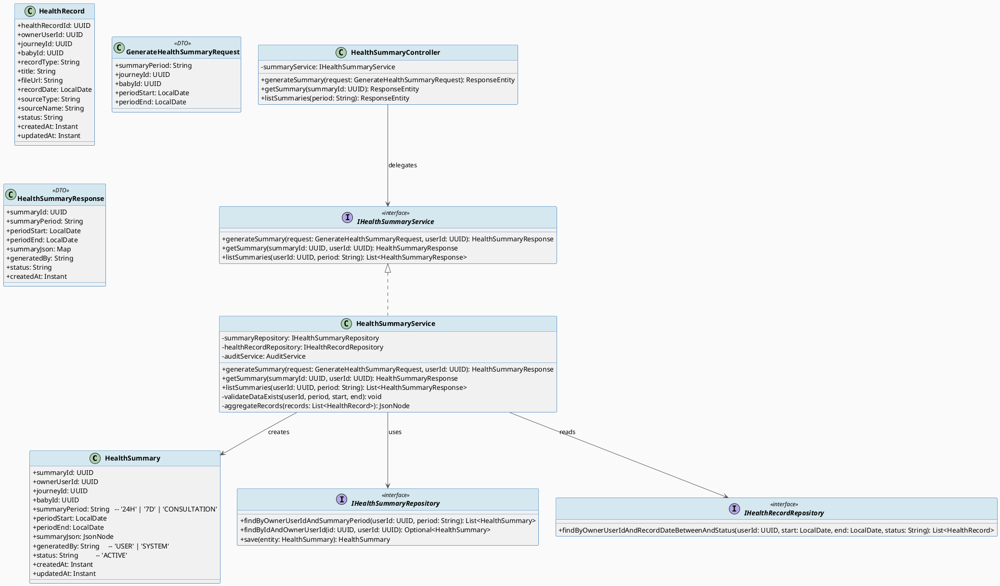
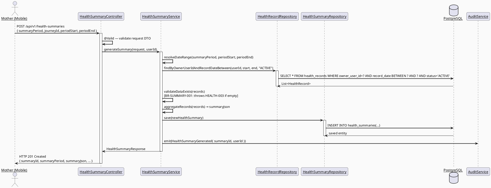
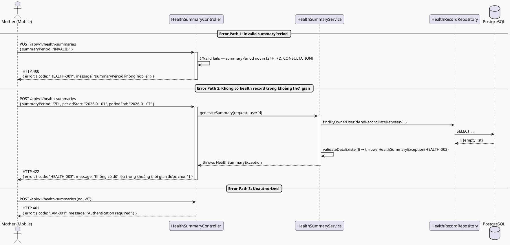
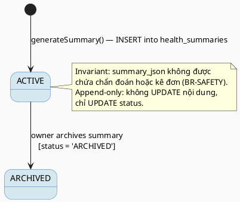

# ENGINEERING DOCUMENTATION STANDARD (EDS) v2.0
# Technical Design Specification — UC-43 Generate Health Summary

| Field | Value |
|-------|-------|
| **Document ID** | `CB-HEALTH-IMP-005` |
| **Version** | `1.0` |
| **Date** | `2026-06-26` |
| **Status** | `Approved` |
| **Document Owner** | `PhuongNT` |
| **Author** | `AI Agent` |
| **Reviewed by** | `[Tech Lead]` |
| **DPO Sign-off** | `[ ] Pending` |
| **Approved by** | `[Principal Architect]` |
| **Last Review** | `2026-06-26` |
| **Based on EDS** | `v2.0` |

---

## CHANGELOG

| Ngày | Người thực hiện | Nội dung thay đổi |
|------|-----------------|-------------------|
| 2026-06-26 | AI Agent | Tạo tài liệu lần đầu cho UC-43 Generate Health Summary |
| 2026-07-07 | AI Agent — Amelia (Dev Agent) | Implemented HealthSummaryServiceImpl, HealthSummaryRepository, HealthSummary entity, DTOs, HealthSummaryController. BR-SAFETY forbidden keyword validation on summaryJson. 7/7 unit tests GREEN. |

---

## MỤC LỤC

1. [Tổng quan Module](#1-tổng-quan-module)
2. [Ma trận Truy vết](#2-ma-trận-truy-vết)
3. [Architecture Decision Records](#3-architecture-decision-records)
4. [Non-Functional Requirements & SLA](#4-non-functional-requirements--sla)
5. [Static Modeling](#5-static-modeling)
6. [Dynamic Modeling](#6-dynamic-modeling)
7. [Domain Event Catalog](#7-domain-event-catalog)
8. [Interface Specification](#8-interface-specification)
9. [API Specification](#9-api-specification)
10. [Bảng mã lỗi](#10-bảng-mã-lỗi)
11. [Quy trình Triển khai](#11-quy-trình-triển-khai)
12. [Rollback & Incident Runbook](#12-rollback--incident-runbook)
13. [Kịch bản Kiểm thử](#13-kịch-bản-kiểm-thử)
14. [Phương pháp Xác minh](#14-phương-pháp-xác-minh)
15. [Mẫu thử thực tế](#15-mẫu-thử-thực-tế)
16. [Authorization Matrix](#16-authorization-matrix)
17. [AI Prompt Constraints (CASE 2.0)](#17-ai-prompt-constraints-case-20)

---

## 1. Tổng quan Module

| Field | Value |
|-------|-------|
| **Module Name** | `GenerateHealthSummary` |
| **Bounded Context** | `health` |
| **UC ID** | `UC-43` |
| **SRS Reference** | `3.3.1.20` |
| **Primary Actor** | `Mother (ROLE_MOTHER)` |
| **Platform** | `Mobile App` |
| **Data Classification** | `Sensitive-PII` |
| **Compliance Scope** | `BR-RBAC, BR-PRIVACY, BR-SAFETY, PDPA` |
| **Upstream Dependencies** | `auth, health_records, journey, baby` |
| **Downstream Consumers** | `UC-44 ShareSummaryWithExpert, audit, consultation` |

**Mô tả:** Cho phép Mother tạo bản tóm tắt sức khỏe (health summary) từ dữ liệu hiện có trong hệ thống. Người dùng chọn loại khoảng thời gian (24H, 7D, hoặc CONSULTATION), hệ thống tổng hợp dữ liệu từ `health_records` trong khoảng thời gian tương ứng và lưu kết quả vào bảng `health_summaries`. Chỉ sinh được summary khi tồn tại ít nhất 1 health record trong khoảng thời gian đó (BR-SUMMARY-001). Hệ thống không đưa ra chẩn đoán hay kê đơn (BR-SAFETY).

---

## 2. Ma trận Truy vết

| Requirement ID | Loại | Mô tả | Thành phần Code | Compliance Target | ADR liên quan |
|----------------|------|-------|-----------------|-------------------|---------------|
| UC-43 | Use Case | Mother tạo health summary từ dữ liệu đã có | `HealthSummaryController.generateSummary()` | BR-RBAC | ADR-SUMMARY-001 |
| BR-SUMMARY-001 | Business Rule | Phải có ít nhất 1 health record trong khoảng thời gian được chọn | `HealthSummaryService.validateDataExists()` | Data Integrity | ADR-SUMMARY-001 |
| BR-SUMMARY-002 | Business Rule | summary_period chỉ nhận giá trị `24H`, `7D`, `CONSULTATION` | `@ValidSummaryPeriod` annotation | Data Integrity | ADR-SUMMARY-001 |
| BR-RBAC | Business Rule | Chỉ ROLE_MOTHER mới được tạo summary; chỉ truy cập dữ liệu của chính mình | `@PreAuthorize("hasRole('MOTHER')")` | PDPA | — |
| BR-PRIVACY | Business Rule | Dữ liệu health summary không được expose tới bên thứ ba không có consent | `HealthSummaryRepository` ownership filter | PDPA | — |
| BR-SAFETY | Business Rule | Summary chỉ tổng hợp dữ liệu, không chẩn đoán hoặc kê đơn | Policy comment trong response | BR-SAFETY | — |
| BR-AUDIT | Business Rule | Ghi audit event `HealthSummaryGenerated` | `AuditService` | PDPA | — |

---

## 3. Architecture Decision Records

### ADR-SUMMARY-001 — Lưu trữ summary_json dạng JSONB thay vì bảng riêng

| Field | Value |
|-------|-------|
| **Status** | `Accepted` |
| **Deciders** | `AI Agent — Technical Spec Author` |
| **Date** | `2026-06-26` |
| **Supersedes** | `N/A` |

#### Bối cảnh (Context)
Health summary cần lưu trữ dữ liệu tổng hợp đa dạng (số liệu, text, metadata) từ nhiều loại health record khác nhau. Cấu trúc summary thay đổi tùy theo summary_period và loại dữ liệu có sẵn.

#### Các phương án đã xem xét (Options Considered)

| Phương án | Mô tả | Ưu điểm | Nhược điểm |
|-----------|-------|----------|------------|
| A | Lưu summary dưới dạng `summary_json` JSONB trong `health_summaries` | + Schema linh hoạt; + Đã có sẵn trong V1__init_schema.sql | - Query phức tạp hơn trên nội dung JSON |
| B | Tạo bảng riêng cho từng loại summary | + Query đơn giản | - Cần migration mới; - Phức tạp hóa schema |

#### Quyết định (Decision)
Chọn **Phương án A** vì cột `summary_json JSONB` đã được định nghĩa sẵn trong `V1__init_schema.sql`, phù hợp với kiến trúc modular monolith, không cần thêm migration mới.

#### Hệ quả (Consequences)

**Tích cực:**
- Không cần Flyway migration mới
- Linh hoạt với cấu trúc summary khác nhau theo period

**Tiêu cực / Trade-offs:**
- Query filter theo nội dung JSON phức tạp hơn — giảm thiểu bằng cách chỉ query theo các cột metadata (period, owner, date range)

**Compliance Impact:**
- summary_json là Sensitive-PII — phải được bảo vệ theo PDPA

---

### ADR-SUMMARY-002 — Tổng hợp summary tại application layer, không dùng DB function

| Field | Value |
|-------|-------|
| **Status** | `Accepted` |
| **Deciders** | `AI Agent — Technical Spec Author` |
| **Date** | `2026-06-26` |
| **Supersedes** | `N/A` |

#### Bối cảnh (Context)
Logic tổng hợp dữ liệu cần được kiểm soát chặt chẽ để đảm bảo BR-SAFETY (không chẩn đoán). Cần quyết định nên tổng hợp tại DB hay application layer.

#### Các phương án đã xem xét (Options Considered)

| Phương án | Mô tả | Ưu điểm | Nhược điểm |
|-----------|-------|----------|------------|
| A | Tổng hợp tại Service layer (Java) | + Testable; + Dễ kiểm soát BR-SAFETY | - Tốn memory nếu data lớn |
| B | Stored procedure/function trong PostgreSQL | + Nhanh hơn | - Khó test; - Khó thêm business rule |

#### Quyết định (Decision)
Chọn **Phương án A** vì dễ enforce BR-SAFETY và viết unit test cho logic tổng hợp.

#### Hệ quả (Consequences)

**Tích cực:**
- Logic rõ ràng, testable, dễ audit

**Tiêu cực / Trade-offs:**
- Có thể chậm với lượng record lớn — giảm thiểu bằng pagination khi đọc records

**Compliance Impact:**
- Logic tổng hợp nằm trong Service layer — dễ enforce BR-SAFETY

---

## 4. Non-Functional Requirements & SLA

### 4.1. Performance & Availability

| Category | Requirement | Target SLA | Measurement Method | Compliance Basis |
|----------|-------------|------------|---------------------|------------------|
| Latency | API response (p99) — generate summary | `< 500ms` | k6 load test | — |
| Availability | Uptime (monthly) | `99.9%` | Uptime monitor | — |
| Throughput | Concurrent requests | `200 req/s` | Load test | — |

### 4.2. Data Integrity & Retention

| Category | Requirement | Target | Verification Method | Compliance Basis |
|----------|-------------|--------|---------------------|------------------|
| Durability | Zero summary record loss | RPO = 0 | Transaction log | PDPA |
| Retention | Summary data retention | Theo journey lifecycle | DB backup policy | PDPA |
| Consistency | summary_json ↔ health_records sync | 100% | Reconciliation check | BR-SUMMARY-001 |

### 4.3. Security

| Category | Requirement | Target | Verification Method | Compliance Basis |
|----------|-------------|--------|---------------------|------------------|
| Encryption at rest | summary_json (Sensitive-PII) | AES-256 | `openssl` CLI check | PDPA |
| Encryption in transit | All endpoints | TLS 1.3+ | SSL Labs scan | PDPA |
| Access control | Role-based, owner-only | Least privilege | Auth Matrix (§16) | BR-RBAC |

### 4.4. Scalability & Capacity Planning

Dự kiến tải: 5.000 mothers active/day, mỗi người tạo trung bình 1-2 summaries/ngày. Giải pháp scale: horizontal scaling của backend service; index trên `health_records(owner_user_id, record_date)` đã có sẵn.

---

## 5. Static Modeling (Mô hình Tĩnh)

### 5.1. Class Diagram (PlantUML)



### 5.2. Data Structure (Flyway SQL Migration)

Bảng `health_summaries` đã được định nghĩa đầy đủ trong `V1__init_schema.sql`. Không cần migration mới.

```sql
-- === HEALTH SUMMARIES — đã có trong V1__init_schema.sql ===
-- Tham chiếu: health_summaries(summary_id, owner_user_id, journey_id, baby_id,
--             summary_period, period_start, period_end, summary_json,
--             generated_by, status, created_at, updated_at)
-- FK: owner_user_id → users(user_id)

-- Index bổ sung nếu chưa có (kiểm tra trước khi tạo):
CREATE INDEX IF NOT EXISTS idx_health_summaries_owner_period
    ON public.health_summaries(owner_user_id, summary_period);

CREATE INDEX IF NOT EXISTS idx_health_summaries_owner_dates
    ON public.health_summaries(owner_user_id, period_start, period_end);
```

---

## 6. Dynamic Modeling (Mô hình Động)

### 6.1. Sequence Diagram — Happy Path (PlantUML)



### 6.2. Sequence Diagram — Error Path (PlantUML)



### 6.3. State Machine



---

## 7. Domain Event Catalog

### 7.1. Events Published (Phát ra)

| Event Name | Trigger | Publisher | Subscriber(s) | Payload Schema | Async? |
|------------|---------|-----------|---------------|----------------|--------|
| `HealthSummaryGenerated` | Summary được tạo thành công | `HealthSummaryService` | `AuditService`, `NotificationService` | `HealthSummaryGeneratedEvent.java` | No (synchronous audit) |

### 7.2. Events Consumed (Tiêu thụ)

| Event Name | Source | Handler | Action thực hiện |
|------------|--------|---------|------------------|
| N/A | — | — | Module này không consume events từ module khác |

### 7.3. Payload Schema

```java
// HealthSummaryGeneratedEvent.java
public record HealthSummaryGeneratedEvent(
    UUID    eventId,       // UUID.randomUUID()
    String  eventType,     // "HealthSummaryGenerated"
    Instant occurredAt,    // Instant.now()
    String  version,       // "1.0"
    Payload payload,
    Metadata metadata
) {
    public record Payload(
        UUID   summaryId,      // ID của summary vừa tạo
        UUID   ownerUserId,    // ID của mother
        String summaryPeriod,  // '24H' | '7D' | 'CONSULTATION'
        String periodStart,    // ISO date string
        String periodEnd       // ISO date string
    ) {}

    public record Metadata(
        UUID   correlationId,
        String causedBy        // userId của mother
    ) {}
}
```

---

## 8. Interface Specification (Đặc tả Giao diện)

### 8.1. Service Interface

```java
// GenerateHealthSummaryRequest.java — Input DTO
// @version 1.0
public class GenerateHealthSummaryRequest {
    @NotBlank
    @Pattern(regexp = "^(24H|7D|CONSULTATION)$", message = "summaryPeriod phải là 24H, 7D, hoặc CONSULTATION")
    private String summaryPeriod;    // Bắt buộc — [BR-SUMMARY-002]

    private UUID journeyId;          // Optional — lọc theo journey

    private UUID babyId;             // Optional — lọc theo baby

    @PastOrPresent
    private LocalDate periodStart;   // Optional — nếu null, tự tính theo summaryPeriod

    @PastOrPresent
    private LocalDate periodEnd;     // Optional — nếu null, mặc định là today
}

// HealthSummaryResponse.java — Output DTO
public class HealthSummaryResponse {
    private UUID        summaryId;
    private String      summaryPeriod;
    private LocalDate   periodStart;
    private LocalDate   periodEnd;
    private Map<String, Object> summaryJson;
    private String      generatedBy;
    private String      status;
    private Instant     createdAt;
}

// IHealthSummaryService.java — Service Contract
// @version 1.0
public interface IHealthSummaryService {
    /**
     * Tạo health summary cho Mother trong khoảng thời gian được chọn.
     * @throws HealthSummaryException (HEALTH-001) khi summaryPeriod không hợp lệ
     * @throws HealthSummaryException (HEALTH-003) khi không có dữ liệu trong khoảng thời gian
     */
    HealthSummaryResponse generateSummary(GenerateHealthSummaryRequest request, UUID userId);

    /**
     * Lấy chi tiết một summary theo ID.
     * @throws HealthSummaryException (HEALTH-004) khi không tìm thấy hoặc không có quyền
     */
    HealthSummaryResponse getSummary(UUID summaryId, UUID userId);

    /**
     * Liệt kê tất cả summaries của Mother, có thể lọc theo period.
     */
    List<HealthSummaryResponse> listSummaries(UUID userId, String period);
}
```

### 8.2. Repository Interface

```java
// IHealthSummaryRepository.java
// @version 1.0
public interface IHealthSummaryRepository extends JpaRepository<HealthSummary, UUID> {

    Optional<HealthSummary> findByIdAndOwnerUserId(UUID summaryId, UUID ownerUserId);

    List<HealthSummary> findByOwnerUserIdAndSummaryPeriod(UUID ownerUserId, String summaryPeriod);

    List<HealthSummary> findByOwnerUserIdAndStatus(UUID ownerUserId, String status);

    // Append-only: không có delete()
}

// IHealthRecordRepository.java (bổ sung method)
// @version 1.0
public interface IHealthRecordRepository extends JpaRepository<HealthRecord, UUID> {

    List<HealthRecord> findByOwnerUserIdAndRecordDateBetweenAndStatus(
        UUID ownerUserId, LocalDate start, LocalDate end, String status);
}
```

---

## 9. API Specification

### 9.1. Endpoints Table

| Method | Path | Auth Level | Required Roles | Rate Limit | Idempotent? |
|--------|------|------------|----------------|------------|-------------|
| `POST` | `/api/v1/health-summaries` | JWT Bearer | `ROLE_MOTHER` | 30/min | No |
| `GET` | `/api/v1/health-summaries/{summaryId}` | JWT Bearer | `ROLE_MOTHER` | 120/min | Yes |
| `GET` | `/api/v1/health-summaries` | JWT Bearer | `ROLE_MOTHER` | 120/min | Yes |

### 9.2. Request / Response Schemas

#### `POST /api/v1/health-summaries` — Tạo Health Summary

**Request Body:**
```json
{
  "summaryPeriod": "7D",
  "journeyId": "uuid-journey",
  "babyId": "uuid-baby",
  "periodStart": "2026-06-19",
  "periodEnd": "2026-06-26"
}
```

**Response — 201 Created (Happy Path):**
```json
{
  "summaryId": "550e8400-e29b-41d4-a716-446655440000",
  "summaryPeriod": "7D",
  "periodStart": "2026-06-19",
  "periodEnd": "2026-06-26",
  "summaryJson": {
    "totalRecords": 5,
    "recordTypes": ["ULTRASOUND", "LAB_RESULT"],
    "note": "Tóm tắt sức khỏe 7 ngày. Đây là thông tin tổng hợp, không phải chẩn đoán."
  },
  "generatedBy": "USER",
  "status": "ACTIVE",
  "createdAt": "2026-06-26T08:00:00.000Z"
}
```

**Response — 400 Bad Request (Validation Error):**
```json
{
  "error": {
    "code": "HEALTH-001",
    "message": "summaryPeriod không hợp lệ. Chỉ chấp nhận: 24H, 7D, CONSULTATION",
    "details": [
      { "field": "summaryPeriod", "message": "summaryPeriod phải là 24H, 7D, hoặc CONSULTATION" }
    ]
  }
}
```

**Response — 422 Unprocessable Entity (No Data):**
```json
{
  "error": {
    "code": "HEALTH-003",
    "message": "Không có dữ liệu sức khỏe trong khoảng thời gian được chọn"
  }
}
```

#### `GET /api/v1/health-summaries/{summaryId}` — Lấy chi tiết Summary

**Response — 200 OK:**
```json
{
  "summaryId": "550e8400-e29b-41d4-a716-446655440000",
  "summaryPeriod": "7D",
  "periodStart": "2026-06-19",
  "periodEnd": "2026-06-26",
  "summaryJson": { ... },
  "generatedBy": "USER",
  "status": "ACTIVE",
  "createdAt": "2026-06-26T08:00:00.000Z"
}
```

---

## 10. Bảng mã lỗi

| Code | HTTP Status | Message (EN) | Message (VI) | Trigger Condition |
|------|-------------|--------------|--------------|-------------------|
| `HEALTH-001` | 400 | Validation failed — invalid summaryPeriod | summaryPeriod không hợp lệ | summaryPeriod không phải 24H/7D/CONSULTATION |
| `HEALTH-002` | 400 | Validation failed — invalid date range | Khoảng thời gian không hợp lệ | periodEnd < periodStart hoặc ngày ở tương lai |
| `HEALTH-003` | 422 | No health data in selected period | Không có dữ liệu sức khỏe trong khoảng thời gian | Không có health_record nào — BR-SUMMARY-001 |
| `HEALTH-004` | 404 | Summary not found | Không tìm thấy summary | summaryId không tồn tại hoặc không thuộc user |
| `HEALTH-005` | 403 | Access denied — not summary owner | Không có quyền truy cập summary này | userId không khớp với owner_user_id |
| `HEALTH-006` | 500 | Internal error generating summary | Lỗi hệ thống khi tạo summary | Lỗi database hoặc lỗi aggregation |

---

## 11. Quy trình Triển khai (Step-by-Step)

### 11.1. Prerequisites

- [ ] ADR-SUMMARY-001 và ADR-SUMMARY-002 đã được Accepted
- [ ] DPO đã sign-off (module xử lý Sensitive-PII)
- [ ] Blueprint đã được Principal Architect approve
- [ ] Môi trường staging đã sẵn sàng

### 11.2. Pre-Migration Checklist

- [ ] Đã backup DB production: `pg_dump -h [host] -U [user] [db] > backup_20260626.sql`
- [ ] Xác nhận `health_summaries` table đã tồn tại trong staging (V1__init_schema.sql đã chạy)
- [ ] Kiểm tra index `idx_health_summaries_owner_period` đã có chưa
- [ ] DPO đã sign-off nếu index mới thay đổi cấu trúc lưu PII

### 11.3. Implementation Steps

#### Chặng 1 — Tạo index bổ sung (nếu chưa có)

```sql
-- V2__add_health_summaries_indexes.sql (chỉ tạo nếu index chưa tồn tại)
CREATE INDEX IF NOT EXISTS idx_health_summaries_owner_period
    ON public.health_summaries(owner_user_id, summary_period);

CREATE INDEX IF NOT EXISTS idx_health_summaries_owner_dates
    ON public.health_summaries(owner_user_id, period_start, period_end);
```

```bash
./mvnw flyway:migrate
```

#### Chặng 2 — Implement domain layer

Tạo các class theo thứ tự:
1. `HealthSummary.java` (Entity — kiểm tra đã tồn tại chưa)
2. `IHealthSummaryRepository.java` (Repository interface)
3. `GenerateHealthSummaryRequest.java` (DTO)
4. `HealthSummaryResponse.java` (DTO)
5. `IHealthSummaryService.java` (Service interface)
6. `HealthSummaryService.java` (Service implementation)
7. `HealthSummaryController.java` (Controller)

#### Chặng 3 — Verification sau deploy

```bash
curl -X GET https://[host]/api/v1/health
# Expected: {"status": "ok"}
```

### 11.4. Deployment Checklist

- [ ] Migration chạy thành công (index đã được tạo)
- [ ] Health check endpoint trả về 200
- [ ] Error rate < 1% trong 10 phút đầu
- [ ] Audit log đang sinh ra event `HealthSummaryGenerated`
- [ ] Thông báo DPO vì deploy ảnh hưởng đến Sensitive-PII processing

---

## 12. Rollback & Incident Runbook

### 12.1. Điều kiện kích hoạt Rollback

| Điều kiện | Ngưỡng | Người quyết định |
|-----------|--------|------------------|
| Error rate tăng đột biến | > 5% trong 5 phút | On-call Engineer |
| Latency p99 vượt ngưỡng | > 1000ms | On-call Engineer |
| Dữ liệu không nhất quán trong health_summaries | Bất kỳ case nào | Tech Lead + DPO |
| Audit log ngừng hoạt động | > 1 phút | On-call Engineer |

### 12.2. Rollback Procedure

```bash
# Bước 1: Revert index migration nếu cần
psql -h $DB_HOST -U $DB_USER -d $DB_NAME \
  -c "DROP INDEX IF EXISTS idx_health_summaries_owner_period;"
psql -h $DB_HOST -U $DB_USER -d $DB_NAME \
  -c "DROP INDEX IF EXISTS idx_health_summaries_owner_dates;"
psql -h $DB_HOST -U $DB_USER -d $DB_NAME \
  -c "DELETE FROM flyway_schema_history WHERE version = '2';"

# Bước 2: Re-deploy phiên bản cũ
kubectl rollout undo deployment/carebridge-api

# Bước 3: Verify rollback thành công
kubectl rollout status deployment/carebridge-api
curl -X GET https://[host]/api/v1/health

# Bước 4: Chạy smoke test
curl -X GET https://[host]/api/v1/health-summaries \
  -H "Authorization: Bearer [VALID_TOKEN]"
```

### 12.3. Notification Protocol

| Thời điểm | Người nhận | Kênh | Template |
|-----------|------------|------|----------|
| Ngay khi phát hiện | On-call team | Slack `#incident` | "🚨 [HEALTH-SUMMARY] incident detected: [mô tả]" |
| Trong 30 phút | DPO | Email | Bắt buộc nếu Sensitive-PII bị ảnh hưởng |
| Trong 72 giờ | DPA | Email | Bắt buộc nếu có data breach |

### 12.4. Post-Incident Review (PIR)

PIR bắt buộc hoàn thành trong vòng **48 giờ** sau khi incident được resolve. Sử dụng template chuẩn: Timeline → Root Cause (5 Whys) → Impact → Remediation → Prevention.

---

## 13. Kịch bản Kiểm thử Chi tiết

### 13.1. Unit Tests

#### TC-UNIT-001 — Tạo summary thành công với period 7D

```gherkin
Feature: Generate Health Summary
  Background:
    Given test data classification: SYNTHETIC
    And Mother đã xác thực (JWT hợp lệ, ROLE_MOTHER)

  Scenario: Tạo summary 7D thành công
    Given có 3 health records của mother trong 7 ngày qua (SYNTHETIC)
    When POST /api/v1/health-summaries với summaryPeriod="7D"
    Then response status là 201
    And response body chứa summaryId (UUID hợp lệ)
    And summaryJson.totalRecords = 3
    And generatedBy = "USER"
    And status = "ACTIVE"

  Scenario: summaryPeriod không hợp lệ
    Given summaryPeriod = "MONTHLY" (không nằm trong enum)
    When POST /api/v1/health-summaries được gọi
    Then response status là 400
    And response body chứa error.code = "HEALTH-001"
    And không có record nào được tạo trong health_summaries
```

**Hàm được test:** `HealthSummaryService.generateSummary()`
**Invariant kiểm tra:** summaryPeriod phải thuộc tập {24H, 7D, CONSULTATION}

#### TC-UNIT-002 — BR-SUMMARY-001: Không có dữ liệu trong khoảng thời gian

```gherkin
  Scenario: Không có health record trong khoảng thời gian 24H
    Given SYNTHETIC Mother không có health record nào trong 24 giờ qua
    When POST /api/v1/health-summaries với summaryPeriod="24H"
    Then response status là 422
    And response body chứa error.code = "HEALTH-003"
    And không có summary nào được lưu vào database
```

**Hàm được test:** `HealthSummaryService.validateDataExists()`
**Invariant kiểm tra:** BR-SUMMARY-001 — phải ném exception khi list records rỗng

### 13.2. Integration Tests

#### TC-INT-001 — Luồng tạo summary hoàn chỉnh với database thật

```gherkin
  Scenario: Mother tạo summary 7D với Testcontainers PostgreSQL
    Given test data classification: SYNTHETIC
    And PostgreSQL container đang chạy với Flyway migration applied
    And Seed 5 health_records cho SYNTHETIC mother trong 7 ngày qua
    When HealthSummaryService.generateSummary() được gọi với summaryPeriod="7D"
    Then repository save() được gọi đúng 1 lần
    And database chứa 1 record mới trong health_summaries
    And record.status = 'ACTIVE'
    And record.summary_period = '7D'
    And record.summary_json không null và chứa field "totalRecords"
    And audit log chứa event HealthSummaryGenerated
```

**External dependencies:** PostgreSQL (Testcontainers)
**Mock strategy:** Testcontainers cho database; AuditService mock

### 13.3. E2E / Security Tests

#### TC-E2E-001 — Luồng hoàn chỉnh qua REST API

```gherkin
  Scenario: Mother tạo summary 7D qua API
    Given test data classification: SYNTHETIC
    And SYNTHETIC Mother đã đăng nhập, có JWT hợp lệ với ROLE_MOTHER
    And đã có 2 health_records của mother trong 7 ngày
    When POST /api/v1/health-summaries được gọi với:
      | Header          | Value              |
      | Authorization   | Bearer [JWT]       |
      | Content-Type    | application/json   |
      | X-Correlation-Id| [uuid]             |
    Then response status là 201
    And response body chứa summaryId hợp lệ
    And database chứa record mới trong health_summaries

  Scenario: Unauthorized — không có JWT
    Given không có Authorization header
    When POST /api/v1/health-summaries được gọi
    Then response status là 401
    And response body chứa error.code = "IAM-001"

  Scenario: Mother cố lấy summary của Mother khác (RBAC violation)
    Given SYNTHETIC Mother A đã xác thực
    And summaryId thuộc về SYNTHETIC Mother B
    When GET /api/v1/health-summaries/{summaryId} được gọi bởi Mother A
    Then response status là 403 hoặc 404
    And response body chứa error.code = "HEALTH-005" hoặc "HEALTH-004"
```

---

## 14. Phương pháp Xác minh

### 14.1. Database Inspection

```sql
-- Verify summary được tạo đúng
SELECT summary_id, owner_user_id, summary_period, period_start, period_end,
       generated_by, status, created_at
FROM public.health_summaries
WHERE owner_user_id = '[test-user-uuid]'
ORDER BY created_at DESC
LIMIT 5;

-- Verify summary_json không null và có cấu trúc đúng
SELECT summary_id, jsonb_pretty(summary_json)
FROM public.health_summaries
WHERE summary_id = '[test-summary-uuid]';

-- Verify không có summary nào cho khoảng thời gian không có data
SELECT COUNT(*) FROM public.health_summaries
WHERE owner_user_id = '[empty-test-user-uuid]';
-- Expected: 0
```

### 14.2. Log / Audit Verification

```bash
# Kiểm tra audit event HealthSummaryGenerated
kubectl logs -l app=carebridge-api | grep '"eventType":"HealthSummaryGenerated"' | head -5

# Verify log chứa đủ fields bắt buộc
kubectl logs -l app=carebridge-api | jq 'select(.eventType == "HealthSummaryGenerated") | {eventId, occurredAt, correlationId}'

# Kiểm tra không có PII trong log
kubectl logs -l app=carebridge-api | grep -i "summaryJson\|healthData"
# Expected: No raw PII data
```

### 14.3. Tool-based Verification

```bash
# Verify JWT claims có ROLE_MOTHER
echo "[JWT_TOKEN]" | cut -d'.' -f2 | base64 -d | jq '.roles'

# Verify TLS 1.3
openssl s_client -connect [host]:443 -tls1_3 2>&1 | grep "Protocol"
# Expected: Protocol  : TLSv1.3
```

---

## 15. Mẫu thử thực tế (API Verification Samples)

### 15.1. Happy Path

```bash
# [POST] Tạo health summary 7D
curl -X POST https://[host]/api/v1/health-summaries \
  -H "Authorization: Bearer [JWT_TOKEN]" \
  -H "Content-Type: application/json" \
  -H "X-Correlation-Id: $(uuidgen)" \
  -d '{
    "summaryPeriod": "7D",
    "journeyId": "550e8400-e29b-41d4-a716-446655440001",
    "periodStart": "2026-06-19",
    "periodEnd": "2026-06-26"
  }'
```

**Expected Response (201):**
```json
{
  "summaryId": "550e8400-e29b-41d4-a716-446655440000",
  "summaryPeriod": "7D",
  "periodStart": "2026-06-19",
  "periodEnd": "2026-06-26",
  "summaryJson": {
    "totalRecords": 3,
    "recordTypes": ["ULTRASOUND", "LAB_RESULT"],
    "note": "Tóm tắt sức khỏe 7 ngày. Đây là thông tin tổng hợp, không phải chẩn đoán."
  },
  "generatedBy": "USER",
  "status": "ACTIVE",
  "createdAt": "2026-06-26T08:00:00.000Z"
}
```

### 15.2. Error Paths

```bash
# [POST] summaryPeriod không hợp lệ → 400
curl -X POST https://[host]/api/v1/health-summaries \
  -H "Authorization: Bearer [JWT_TOKEN]" \
  -H "Content-Type: application/json" \
  -d '{ "summaryPeriod": "MONTHLY" }'
```

**Expected Response (400):**
```json
{
  "error": {
    "code": "HEALTH-001",
    "message": "summaryPeriod không hợp lệ. Chỉ chấp nhận: 24H, 7D, CONSULTATION",
    "details": [{ "field": "summaryPeriod", "message": "summaryPeriod phải là 24H, 7D, hoặc CONSULTATION" }]
  }
}
```

```bash
# [GET] Không có JWT → 401
curl -X GET https://[host]/api/v1/health-summaries/[summaryId]
```

**Expected Response (401):**
```json
{
  "error": {
    "code": "IAM-001",
    "message": "Authentication required"
  }
}
```

---

## 16. Authorization Matrix

| Endpoint | `GUEST` | `ROLE_MOTHER` | `ROLE_EXPERT` | `ROLE_ADMIN` | `SYSTEM` |
|----------|---------|---------------|---------------|--------------|----------|
| `POST /api/v1/health-summaries` | ❌ | ✅ Own | ❌ | ❌ | ✅ |
| `GET /api/v1/health-summaries` | ❌ | ✅ Own | ❌ | ✅ All | ✅ |
| `GET /api/v1/health-summaries/{id}` | ❌ | ✅ Own | ❌ (xem UC-44) | ✅ All | ✅ |

**Chú thích:**
- ✅ = Được phép
- ❌ = Bị từ chối (403)
- `Own` = Chỉ được phép với resource của chính mình (owner_user_id khớp JWT sub)
- Expert chỉ được xem summary sau khi có consent theo UC-44

---

## 17. AI Prompt Constraints (CASE 2.0)

### 17.1 Constraint Summary Table

| # | Constraint | Source (ADR/BR) | Last Verified |
|---|-----------|-----------------|---------------|
| C1 | `HealthSummaryService` PHẢI gọi `validateDataExists()` trước khi tạo summary — ném HEALTH-003 nếu không có record nào | `BR-SUMMARY-001` | `2026-06-26` |
| C2 | `summaryPeriod` PHẢI được validate với pattern `^(24H|7D|CONSULTATION)$` tại Controller (DTO validation) | `BR-SUMMARY-002` | `2026-06-26` |
| C3 | Controller KHÔNG được chứa business logic — chỉ validate DTO và delegate sang `IHealthSummaryService` | `ADR-SUMMARY-002` | `2026-06-26` |
| C4 | `userId` PHẢI lấy từ JWT SecurityContext, KHÔNG lấy từ request body | `BR-RBAC` | `2026-06-26` |
| C5 | `summary_json` KHÔNG được chứa chẩn đoán bệnh, kê đơn thuốc hoặc khuyến nghị điều trị — chỉ tổng hợp metadata | `BR-SAFETY` | `2026-06-26` |
| C6 | Sau khi tạo summary thành công, PHẢI emit `HealthSummaryGenerated` event qua `AuditService` | `BR-AUDIT` | `2026-06-26` |

### 17.2 Constraint Injection Block (Copy-Paste vào AI Prompt)

```
[CONSTRAINT BLOCK — Module: GenerateHealthSummary]
Theo TDS CB-HEALTH-IMP-005 và các ADR liên quan:

1. [C1] HealthSummaryService PHẢI gọi validateDataExists() trước khi tạo summary.
   Ném HealthSummaryException("HEALTH-003") nếu không có health_record nào trong khoảng thời gian.
2. [C2] summaryPeriod PHẢI được validate với @Pattern(regexp="^(24H|7D|CONSULTATION)$") tại DTO level.
3. [C3] Controller chỉ validate DTO + delegate — KHÔNG có business logic (BR-SUMMARY-001/002).
4. [C4] userId LUÔN lấy từ SecurityContextHolder.getContext().getAuthentication(), không từ request body.
5. [C5] summaryJson KHÔNG được chứa chẩn đoán/kê đơn — chỉ tổng hợp số lượng, loại record, ngày tháng.
6. [C6] Sau khi save() thành công, emit HealthSummaryGeneratedEvent qua AuditService.

[CONTEXT BLOCK]
- Bounded Context: health
- Data Classification: Sensitive-PII
- Compliance: BR-RBAC, BR-PRIVACY, BR-SAFETY, PDPA
- Existing interfaces: §8 Service Interface + §8.2 Repository Interface
- Error codes: §10 Error Codes Table
- Auth matrix: §16 Authorization Matrix

[TASK BLOCK]
Implement generateSummary() thỏa mãn constraints trên.
Output phải tuân thủ §8 Interface Specification.
Tests phải cover §13 Test Scenarios.
```

### 17.3 Constraint Quality Checklist

- [x] Mỗi constraint traceable về ADR hoặc BR cụ thể
- [x] Không có constraint generic
- [x] Mỗi constraint có `Last Verified` date ≤ 2 sprints
- [x] Constraint block có ≥ 3 constraints cụ thể
- [x] Constraint block reference §8 Interface
- [x] Constraint block reference §16 Auth Matrix

### 17.4 Anti-Pattern Detection

| AP-ID | Anti-Pattern | Dấu hiệu | Hành động |
|-------|-------------|-----------|----------|
| AP-AI-001 | Unconstrained Gen | Code không match bất kỳ constraint C1-C6 nào | Reject — inject lại constraints |
| AP-AI-003 | Implicit Decision | Code assume architecture không có trong §3 ADR | Reject — viết ADR trước |
| AP-AI-005 | Hallucinated Contract | Code import service/type không có trong §8 | Reject — verify contract existence |

---

## PHỤ LỤC

### A. Glossary

| Thuật ngữ | Định nghĩa |
|-----------|------------|
| Health Summary | Bản tóm tắt tổng hợp dữ liệu sức khỏe trong một khoảng thời gian |
| summaryPeriod | Loại khoảng thời gian: `24H` (24 giờ), `7D` (7 ngày), `CONSULTATION` (kỳ tư vấn) |
| summary_json | Cột JSONB chứa nội dung tóm tắt — không được chứa chẩn đoán |
| Sensitive-PII | Dữ liệu sức khỏe cá nhân — cần bảo vệ theo mức cao nhất |
| BR-SAFETY | Business Rule: CareBridge không chẩn đoán, không kê đơn |

### B. Tài liệu tham chiếu

| Document | Link / Path |
|----------|-------------|
| SRS UC-43 | `02_Requirements/SRS.md §3.3.1.20` |
| Database Schema | `05_Development/CareBridgeAPI/src/main/resources/db/migration/V1__init_schema.sql` |
| UC-44 ShareSummaryWithExpert | `04_Implement/UC44_ShareSummaryWithExpert/UC44_ShareSummaryWithExpert_TDS.md` |
| EDS v2.0 Template | `08_References/Template/PHASE-3_TDS.md` |

---

*EDS v2.0 — CB-HEALTH-IMP-005 — UC-43 Generate Health Summary — Draft 2026-06-26*
