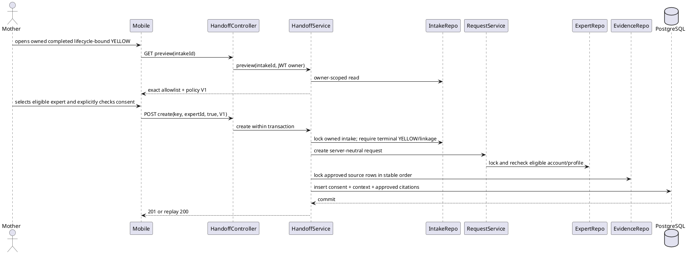
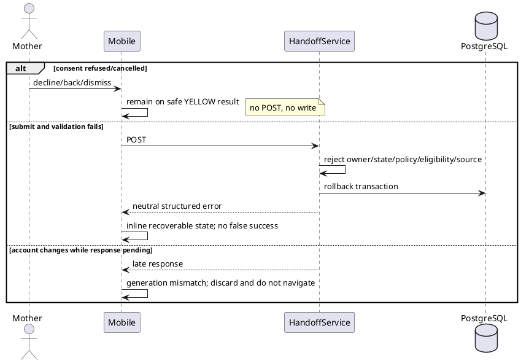
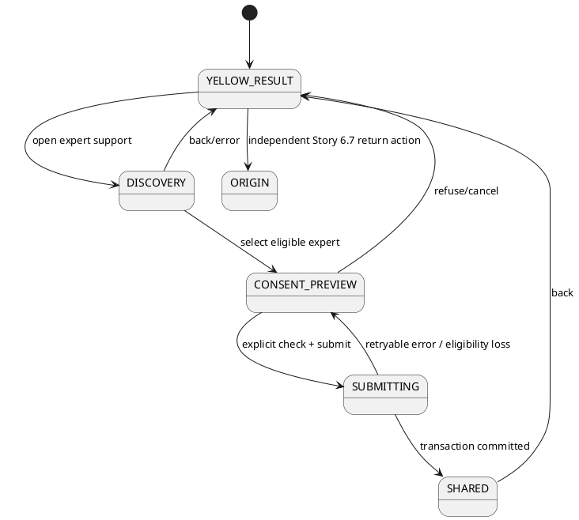

# ENGINEERING DOCUMENTATION STANDARD (EDS) v2.0
# Technical Design Specification — UC-44 Share Summary with Expert

| Field | Value |
|---|---|
| **Document ID** | `CB-CONSULT-IMP-044-S68` |
| **Version** | `1.0` |
| **Date** | `2026-07-23` |
| **Status** | `Approved` |
| **Document Owner** | `CareBridge Consultation Domain Lead` |
| **Author** | `Codex — Implementation Agent` |
| **Reviewed by** | `Independent Specification Verifier — PASS, no High/Medium findings` |
| **Implementation review** | `bmad-code-review — APPROVE, no unresolved High/Medium findings` |
| **DPO Sign-off** | `[ ] Pending — production release gate` |
| **Approved by** | `Product authority — explicit conditional pre-approval satisfied 2026-07-23` |
| **Last Review** | `2026-07-23` |
| **Based on EDS** | `v2.0 / PHASE-3_TDS.md` |

---

## CHANGELOG

| Date | Author | Change |
|---|---|---|
| 2026-07-23 | Codex — Implementation Agent | Created Story 6.8 TDS from the mandatory Phase 3 skeleton using `.agents/workflows/create-specs.md`. |
| 2026-07-23 | Product authority | Confirmed the 242-UC scope is authoritative; experimental 121-UC material is excluded from implementation criteria. |
| 2026-07-23 | Independent Specification Verifier / Product authority | Resolved 2 High and 5 Medium findings; final PASS with no High/Medium blockers; conditional approval applied. |
| 2026-07-23 | Backend/PostgreSQL implementation review | Reopened schema synchronization clause: executable `V1` predates required consultation/intake/evidence tables, so duplicate DDL would break fresh Flyway. Defined a safe forward-owned schema sentinel pending independent re-review. |
| 2026-07-23 | Independent Specification Verifier / Product authority | Schema correction PASS with no High/Medium blockers; conditional approval restored. |
| 2026-07-23 | Backend/PostgreSQL runtime review | Reopened the sentinel location after proving that even a comment changes the applied V1 Flyway checksum. V1 was restored byte-for-byte; ownership metadata moved outside Flyway pending independent re-review. |
| 2026-07-23 | Independent Specification Verifier / Product authority | Applied-checksum correction and pinned canonical V1 digest PASS; no High/Medium blockers; conditional approval restored. |
| 2026-07-23 | Codex — Implementation Agent / Independent Code Reviewer | Synchronized final implementation and verification evidence: Expert accepted-queue detail navigation fixed and independently re-reviewed `APPROVE`; Backend 210 unique green tests; consultation focused 11/11 and full Mobile 364/364 green; final APK build/hash; OV01-MAN-024 PASS with sanitized database evidence. Production release/deployment gates remain open and outside this Story execution. |

---

## TABLE OF CONTENTS

1. Module Overview
2. Traceability Matrix
3. Architecture Decision Records
4. Non-Functional Requirements & SLA
5. Static Modeling
6. Dynamic Modeling
7. Domain Event Catalog
8. Interface Specification
9. API Specification
10. Error Codes
11. Step-by-Step Implementation
12. Rollback & Incident Runbook
13. Detailed Test Scenarios
14. Verification Methods
15. API Verification Samples
16. Authorization Matrix
17. AI Prompt Constraints

---

## 1. Module Overview

Story 6.8 extends the authoritative 242-UC `UC-44 Share Summary with Expert` function for an owned, completed, lifecycle-bound YELLOW triage result. A Mother may discover a currently verified and eligible expert, view an exact server-derived minimum-context preview, explicitly consent, and create or idempotently replay one lightweight consultation request plus one immutable context share. A terminal YELLOW without canonical journey/origin linkage remains in safe guidance and is not eligible for this handoff. The feature does not implement paid booking, pricing, payment, video/voice calling, expert-verification administration, or Story 6.9 content policy.

| Field | Value |
|---|---|
| **Module Name** | `Consented YELLOW Triage Expert Handoff` |
| **UC ID** | `UC-44 Share Summary with Expert` |
| **Story / Gap** | `Story 6.8 / FR52 / OV01-GAP-08` |
| **Bounded Context** | `consultation.context`, integrating `triage`, `expert`, `consent`, and `journey` read boundaries |
| **Platforms** | `Spring Boot Backend + Flutter Mother/Expert Mobile` |
| **Data Classification** | `Sensitive-PII internally; minimum pseudonymous clinical context externally` |
| **Compliance Scope** | `CareBridge BR-PRIVACY / minimum necessary / explicit consent; formal legal/DPO release approval remains pending` |
| **Upstream Dependencies** | `Story 6.7 intake lifecycle binding; TriageService owner-scoped result; evidence_sources; expert directory; consent_grants; consultation_requests` |
| **Downstream Consumers** | `Mother handoff UI; Expert consultation request detail; consultation notifications after commit` |

### 1.1 In scope

- Both terminal YELLOW surfaces: inline conversation result and routed/deep-link result.
- Verified/eligible directory filtering and submit-time revalidation.
- Server-authored preview and exact consent allowlist.
- Atomic request, consent receipt, context share, and approved-source snapshot.
- Participant-only expert-context read.
- Idempotency, concurrency, rollback, account-switch and late-response safety.
- Story 6.6 GREEN/RED and Story 6.7 continuation/timeline regressions.

### 1.2 Out of scope

- Paid `consultation_bookings`, pricing bands, VNPay, refunds, settlement, appointment-slot reservation, Zego/video/voice sessions.
- Changing expert verification administration or trust workflows.
- Copying a full health summary, health record, raw symptoms, notes, or raw AI output.
- Broad redesign of generic expert/consultation features.
- Story 6.9 approved-content/checklist enforcement.

### 1.3 Source authority and legacy evidence

- Authoritative: user clarification, 242-UC `02_Requirements/SRS/3_Functional_Specification.md §3.3.1.21`, `04_Implement/implement_artifacts/function-spec-task-allocation.md`, Epic 6/FR52/OV01-GAP-08, approved Story 6.8 decisions, current schema/code.
- Experimental 121-UC documents are not implementation or acceptance oracles.
- `04_Implement/UC44_ShareSummaryWithExpert/`, `ExpertConsultationRequests/`, and `MotherExpertDiscoveryInbox/` are evidence only. Their booking/full-summary assumptions do not define this story's target design.

---

## 2. Traceability Matrix

| Requirement ID | Type | Requirement | Implemented component | Compliance / safety target | ADR | Current evidence |
|---|---|---|---|---|---|---|
| UC-44 | Use Case | Mother shares permitted summary/context with an expert | `TriageExpertHandoffController`, context service/repositories, Flutter handoff flow | Role, purpose, consent, minimum necessary | ADR-S68-001/002 | Backend 49/49 context/schema/PostgreSQL; Mobile 47/47 focused plus consultation navigation 11/11; OV01-MAN-024 PASS |
| FR52 | Functional Requirement | YELLOW offers verified-expert routing with explicit minimum-context consent | Preview/create APIs, verified directory, consent sheet | Explicit consent, verified recipient | ADR-S68-002 | Backend 49/49; Mobile 47/47 and canonical eligibility 18/18 |
| S68-AC1 | Acceptance | Real YELLOW CTA; no placeholders; no non-YELLOW handoff | Both triage result surfaces | Safety routing integrity | ADR-S68-004 | Mobile focused 47/47; full regression 364/364; GREEN/RED Android smoke PASS |
| S68-AC2 | Acceptance | Current verified/eligible expert only | `ExpertProfileRepository`, handoff policy | Fail closed / TOCTOU | ADR-S68-003 | Backend policy/race coverage within 49/49; canonical JSON eligibility gate 18/18 |
| S68-AC3 | Acceptance | Exact unchecked consent; refusal has zero side effects | Preview DTO, consent sheet, create validator | Consent evidence | ADR-S68-002 | Backend context gate 49/49; Mobile focused 47/47; Android refusal/offline/eligibility-loss database proof PASS |
| S68-AC4 | Acceptance | Traceable immutable minimum snapshot; approved citations only | Context tables and participant DTO | Data minimization / provenance | ADR-S68-001/002 | Backend PostgreSQL/participant/citation coverage within 49/49; Mobile focused 47/47 |
| S68-AC5 | Acceptance | Exact-once, rollback, account isolation | DB constraints, service transaction, Flutter generations/timeouts | Integrity / confidentiality | ADR-S68-003/004 | Backend concurrency/rollback/race coverage within 49/49; Mobile timeout gate 15/15 |
| S68-AC6 | Acceptance | Continuation and accessible recovery preserved | Typed route; no continuation acknowledgement | WCAG 2.1 AA / Story 6.7 | ADR-S68-004 | Mobile focused 47/47 and full 364/364; Android Back/restart/return-to-origin smoke PASS |
| S68-AC7 | Acceptance | Automated/manual/graph/independent evidence | Named tests; OV01-MAN-024 | Definition of done | all | Automated and manual evidence complete; independent review APPROVE; graph mapping limitations disclosed |
| BR-PRIVACY | Business Rule | Consent, purpose, minimum necessary | Fixed allowlist; `ConsentGrant` | Privacy-by-design | ADR-S68-002 | Backend 49/49 plus Mobile 47/47; targeted analyzer zero issues |
| BR-RBAC | Business Rule | Mother creates; participants read | Spring Security + domain checks | Least privilege / IDOR | ADR-S68-003 | Controller/service/PostgreSQL participant coverage within Backend 49/49 |
| BR-CONSULTATION | Business Rule | Consultation lifecycle remains auditable | Existing request lifecycle and after-commit notifications | No parallel booking lifecycle | ADR-S68-001 | Affected Backend regressions 161/161; unfiltered package baseline remains red outside Story 6.8 |

---

## 3. Architecture Decision Records (ADR)

### ADR-S68-001 — Compose the existing request with a dedicated context-share aggregate

| Field | Value |
|---|---|
| **Status** | `Accepted` |
| **Deciders** | `Product authority, Consultation Domain Lead, Privacy reviewer` |
| **Date** | `2026-07-23` |
| **Supersedes** | Legacy UC44 booking/full-health-summary design for the Story 6.8 slice only |

#### Context

`consultation_requests` is a real lightweight request lifecycle with strong idempotency and expert locking, but it contains free-text topic/description and no triage/consent provenance. Legacy UC44 is coupled to paid booking and full health summaries, which exceeds Story 6.8.

#### Options Considered

| Option | Description | Benefits | Costs |
|---|---|---|---|
| A | Copy triage fields/JSON into `consultation_requests` | Few tables | Mixes privacy boundary with generic request; raw-data risk |
| B | Reuse paid booking/full health summary | Existing legacy spec | Scope creep; wrong lifecycle; excessive data |
| C | Reuse request by composition and add immutable context tables | Preserves proven idempotency/lifecycle; isolates sensitive data | New migration and participant read API |

#### Decision

Choose C. `TriageExpertHandoffService` joins the existing request transaction and persists one action-specific consent plus immutable context/citation snapshots. Generic consultation remains backward compatible.

The adapter invokes the mandatory existing generic request contract with deterministic server-neutral values:

- `topic = "YELLOW triage expert support"`;
- `description = "Consented minimum YELLOW triage context is available in the protected context view."`;
- `preferredWindowStart = null`;
- `preferredWindowEnd = null`.

These four values are part of same-intent comparison, never contain risk summary, symptoms, citations, identifiers, or routing data, and cannot be overridden by Mobile input.

#### Consequences

- Positive: no parallel consultation lifecycle; exact context provenance; smaller blast radius.
- Trade-off: cross-domain transaction must be tested for rollback and after-commit notification behavior.
- Compliance: raw triage fields stay in the triage source; context is purpose-specific and allowlisted.

### ADR-S68-002 — Server-derived fixed allowlist and action-specific consent

| Field | Value |
|---|---|
| **Status** | `Accepted` |
| **Deciders** | `Product authority, Privacy reviewer` |
| **Date** | `2026-07-23` |

#### Context

A client-authored `TriageResult` could be stale, forged, excessive, or belong to a previous account. Existing generic consent does not prove approval of this exact recipient/snapshot.

#### Options Considered

| Option | Description | Benefits | Costs |
|---|---|---|---|
| A | Client posts selected fields | Flexible | Trusts client; leak/integrity risk |
| B | Generic standing consent | Simple | No action/recipient/snapshot evidence |
| C | Server preview + fixed policy version + per-handoff consent | Exact and auditable | Requires preview and policy-version conflict handling |

#### Decision

Choose C. Policy `YELLOW_EXPERT_CONTEXT_V1` contains only:

1. `riskLevel` fixed to `YELLOW`;
2. canonical `stage`;
3. sanitized `riskSummary` (maximum 500 characters, derived from server result);
4. approved registry metadata: `evidenceSourceId`, `organization`, canonical HTTPS `baseUrl`, and non-null `reviewedAt`.

`riskSummary` is derived only from the server-owned `TriageResultResponse.summary`; it never falls back to `possibleConcern`, `recommendedAction`, raw answers, or raw AI. The canonical sanitizer:

1. normalizes to Unicode NFC;
2. converts Unicode whitespace to one ASCII space, discards ISO control/format code points, collapses repeated spaces, and trims;
3. returns `HANDOFF-008` with zero writes if the result is blank;
4. measures PostgreSQL-compatible Unicode code points; if the result exceeds 500, keeps the first 499 code points and appends one U+2026 ellipsis, without splitting a surrogate pair.

Flutter renders the value as plain text. It does not interpret HTML/Markdown.

Citation identity comes from the authoritative registry, not from opaque `sourceId`, `sourceVersion`, `lastReviewed`, title, or status fields inside the triage citation map. For each citation URL, the resolver requires an absolute HTTPS URI with no user-info, normalizes the host to lowercase ASCII, removes one trailing dot and a leading `www.`, then builds all label-boundary suffix candidates. An exact registry-domain match wins; otherwise the longest matching domain wins. Equal-length ambiguity fails closed for that citation. Candidate rows are locked in stable UUID order and revalidated as `status=APPROVED`, `reviewedAt != null`, stage-applicable, and with a valid canonical HTTPS registry `baseUrl`. Results are deduplicated by registry UUID and ordered by first citation occurrence. The snapshot uses only registry UUID, organization, normalized registry base URL, and reviewed timestamp; the client citation title, deep-link path/query/fragment, version, excerpt, and review claims are never copied.

`recommendedAction`, symptoms, normalized data, red flags, claims, evidence/excerpts, notes, IDs used for ownership/routing, continuation tokens, and raw AI output are excluded. The existing `ConsentGrant` fields are set exactly to `dataType=EXPERT_SHARED_DATA`, `purpose=SHARE`, `recipient=<expertProfileId UUID string>`, `scope="riskLevel,stage,riskSummary,approvedCitationMetadata"`, `policyVersion=YELLOW_EXPERT_CONTEXT_V1`, and `evidenceKey=<clientRequestId>`, with expiry aligned with the consultation request. There is no `operation` field. Mother refusal/cancel produces no row or success audit.

### ADR-S68-003 — One transaction, ordered locks, and database exact-once constraints

| Field | Value |
|---|---|
| **Status** | `Accepted` |
| **Deciders** | `Backend Lead, Database Lead, Security reviewer` |
| **Date** | `2026-07-23` |

#### Context

Retries can create a request without consent/context; expert trust and citation approval can change between discovery and commit.

#### Decision

- Outer `@Transactional` create flow.
- Fast replay lookup by `(owner_user_id, idempotency_key)` before locks; same intent returns the existing aggregate, changed intent returns `HANDOFF-009`.
- Lock intake by `(id,userId)`, then call existing request creation which locks expert, then lock evidence-source rows in stable UUID order. All competing paths must use the same intake → expert → evidence order.
- Recheck the aggregate immediately after the intake lock. After `IConsultationRequestService.create` returns, always reload context by `(owner,key)` and by returned request ID before inserting consent/context. The existing conflict-safe consultation insert waits for a competing outer transaction; therefore its loser observes the winner's committed context on this reload. Same intent replays with HTTP 200, changed intake/expert/policy returns `HANDOFF-009`, and a pre-existing generic request with the same key but no Story 6.8 context is a key collision and returns `HANDOFF-009`. Never let a unique-constraint exception become the replay contract.
- Persist request, `ConsentGrant`, context share, and citations before commit. Existing events/audits join the transaction; AFTER_COMMIT subscribers run only after success.
- Unique constraints: context per consultation request, consent per context, `(owner,idempotency_key)`, and `(owner,intake,expert)`; unique citation source per context.
- Any error rolls back synchronous writes. No exception swallowing.

#### Consequences

- Concurrent same intent yields one created and one replay response.
- Intentional sharing of the same intake to a different expert requires a new explicit consent and is permitted; accidental duplicate sharing to the same expert is blocked.
- Expert/account eligibility and source approval are checked at commit-time.

### ADR-S68-004 — Typed account-bound Mobile handoff; continuation remains independent

| Field | Value |
|---|---|
| **Status** | `Accepted` |
| **Deciders** | `Mobile Lead, UX reviewer, Security reviewer` |
| **Date** | `2026-07-23` |

#### Decision

Both YELLOW surfaces push a typed `/triage/expert-handoff` route using `extra` containing only `intakeSessionId`. The route rejects malformed/missing input. Preview, directory, submit, and detail capture account ID plus request generation and discard stale responses. Logout/account switch clears pending state. Back returns to the same result; the flow never resolves or acknowledges Story 6.7 continuation.

Visual/behavioral rules come from `bmad-ux`, `ui-skill-system`, and `03_Design/UI_UX/carebridge_design_system/DESIGN.md`: warm background `#F6F1EC`, terracotta `#C98C7B`, deep-brown text, 32px sheet/card radius, 48px pill actions, readable 16px body, focus/TalkBack/live-region support, and no color-only meaning.

---

## 4. Non-Functional Requirements & SLA

No approved source defines a numeric endpoint SLA, retention duration, throughput, or availability target specifically for UC44/Story 6.8. Such numbers are `Open` and must not be invented. The implementation must nevertheless record latency and error evidence in local verification.

### 4.1 Performance & Availability

| Category | Requirement | Target | Verification | Basis |
|---|---|---|---|---|
| Query shape | Directory, replay, context read remain bounded and indexed | No unbounded reads | SQL plan/repository tests | architecture pagination rule |
| Mobile responsiveness | Loading state appears immediately; duplicate submit disabled | Functional, not numeric | Widget tests/manual | UX/UI system |
| Availability | Safe retry without duplicate side effects | Exact-once recovery | concurrency/integration tests | S68-AC5 |

### 4.2 Data Integrity & Retention

| Category | Requirement | Target | Verification | Basis |
|---|---|---|---|---|
| Cardinality | Same key/intent | exactly 1 request + 1 consent + 1 context | PostgreSQL tests/query | S68-AC5 |
| Atomicity | Any pre-commit failure | zero partial rows/notifications | injected-failure integration test | ADR-S68-003 |
| Mutation | Context/citations | append-only | trigger tests | audit/privacy invariant |
| Retention | Context evidence | `Open — no approved duration` | DPO release decision | no invented legal claim |

### 4.3 Security and Privacy

| Category | Requirement | Target | Verification | Basis |
|---|---|---|---|---|
| Authentication | All endpoints JWT protected | 100% | MockMvc security tests | AGENTS/project context |
| Authorization | Mother creates; participants read; neutral IDOR | 100% | controller/integration tests | BR-RBAC |
| Consent | Exact recipient/scope/policy, unrevoked/unexpired for Expert read | fail closed | service tests | FR52/BR-PRIVACY |
| Minimization | Forbidden raw fields absent in API/DB/log/evidence | zero occurrences | structural/log/SQL tests | S68-AC3/4 |
| Account isolation | Late account-A response never affects B | zero leaks/navigation | widget tests | S68-AC5 |

### 4.4 Scalability & Capacity Planning

- Use indexed owner/key, request, intake/expert, and citation relations.
- Page the expert directory using existing maximum size 50.
- Citation snapshot count is bounded by the citations present in one validated triage result; the service deduplicates by evidence source and URL.
- No cache or new infrastructure is introduced. Firebase is not used by the handoff transaction; existing consultation notification subscribers remain unchanged.

---

## 5. Static Modeling

### 5.1 Class Diagram (PlantUML)

```plantuml
@startuml UC44_Story68_ClassDiagram
class TriageExpertHandoffController
interface ITriageExpertHandoffService {
  + preview(intakeId, ownerId): HandoffPreviewResponse
  + create(intakeId, ownerId, request): HandoffCreateResult
  + getContext(requestId, viewerId): HandoffContextResponse
}
class TriageExpertHandoffService
class TriageExpertHandoffPolicy
class ConsultationContextShare
class ConsultationContextCitation
interface ConsultationContextShareRepository
interface ConsultationContextCitationRepository
interface IConsultationRequestService
interface IIntakeSessionRepository
interface ExpertProfileRepository
interface EvidenceSourceRepository
interface ConsentGrantRepository

TriageExpertHandoffController --> ITriageExpertHandoffService
TriageExpertHandoffService ..|> ITriageExpertHandoffService
TriageExpertHandoffService --> TriageExpertHandoffPolicy
TriageExpertHandoffService --> IConsultationRequestService
TriageExpertHandoffService --> IIntakeSessionRepository
TriageExpertHandoffService --> ExpertProfileRepository
TriageExpertHandoffService --> EvidenceSourceRepository
TriageExpertHandoffService --> ConsentGrantRepository
TriageExpertHandoffService --> ConsultationContextShareRepository
TriageExpertHandoffService --> ConsultationContextCitationRepository
ConsultationContextShare "1" *-- "0..*" ConsultationContextCitation
@enduml
```



### 5.2 Data Structure and Migration

Create `V20260723090000__create_consented_triage_expert_handoffs.sql` after Story 6.7's `V20260722210000`. Do not edit an applied migration.

Implementation inspection found that this repository's `V1__init_schema.sql` is an executable historical Flyway migration, not a standalone final-schema baseline: it runs before `V2` and before later migrations that create `intake_sessions`, `evidence_sources`, and `consultation_requests`. Executable Story 6.8 DDL in `V1` would therefore reference missing tables; copying prerequisite tables into `V1` would make their already-applied later `CREATE TABLE` migrations fail. Editing those applied migrations or Flyway history is prohibited.

Runtime validation additionally proved that even a comment-only edit to V1 changes its recorded Flyway checksum and can block existing database startup. Therefore V1 must remain byte-for-byte unchanged. The final safe schema-sync correction is:

1. `V20260723090000` is the sole executable owner of the Story 6.8 objects and the only place where their DDL is materialized.
2. Keep `V1__init_schema.sql` byte-for-byte unchanged. This explicit no-change action supersedes the normal V1 materialization rule because both executable DDL and comments are unsafe applied-migration edits in this repository.
3. Add non-executable ownership manifest `src/main/resources/db/schema/story-6-8-forward-schema-ownership.md`, naming both context tables, `V20260723090000`, prerequisite-order rationale, and the rule that V1/applied migrations must not change. The manifest pins the pre-Story V1 canonical digest: normalize CRLF/CR to LF, encode UTF-8 without BOM, then SHA-256 must equal `EF0D1B28017BF32681924DED4AAF92D75427B5E5B8377B4A14F685A72CD62054`.
4. A test must assert the current canonical V1 digest against that independent pin before any migration action. It must then build a fresh PostgreSQL database through the complete Flyway history and assert the final Story 6.8 schema. A compatibility test migrates to the pre-Story target and then validates/migrates with Story 6.8 to prove existing recorded checksums remain valid. A source test pairs the external manifest with the forward migration and asserts Story 6.8 DDL occurs exactly once across executable migrations. `V1`-only versus final-schema parity is explicitly not a valid oracle because V1 already omits later domain tables.
5. Any future repository baseline-squash must fold all prerequisite and Story 6.8 objects together in one reviewed operation; that maintenance is outside Story 6.8.

Planned core DDL (exact names may be mechanically adjusted only if an existing constraint name conflicts):

```sql
CREATE UNIQUE INDEX uq_consultation_requests_integrity
  ON consultation_requests (id, requester_user_id, expert_profile_id, client_request_id);

CREATE UNIQUE INDEX uq_consent_grants_integrity
  ON consent_grants (id, user_id, evidence_key);

CREATE UNIQUE INDEX uq_intake_handoff_integrity
  ON intake_sessions
    (id, user_id, journey_id, origin_dashboard, origin_reference_id,
     stage, risk_level, status);

CREATE TABLE consultation_context_shares (
  context_share_id UUID PRIMARY KEY DEFAULT gen_random_uuid(),
  consultation_request_id UUID NOT NULL UNIQUE,
  owner_user_id UUID NOT NULL,
  intake_session_id UUID NOT NULL,
  expert_profile_id UUID NOT NULL,
  consent_grant_id BIGINT NOT NULL UNIQUE,
  idempotency_key UUID NOT NULL,
  journey_id UUID NOT NULL,
  origin_dashboard VARCHAR(30) NOT NULL,
  origin_reference_id UUID NOT NULL,
  triage_stage VARCHAR(20) NOT NULL,
  risk_level VARCHAR(10) NOT NULL,
  intake_status VARCHAR(20) NOT NULL,
  risk_summary VARCHAR(500) NOT NULL,
  share_policy_version VARCHAR(60) NOT NULL,
  created_at TIMESTAMPTZ NOT NULL DEFAULT NOW(),
  CONSTRAINT uq_context_owner_key UNIQUE (owner_user_id, idempotency_key),
  CONSTRAINT uq_context_intake_expert UNIQUE (owner_user_id, intake_session_id, expert_profile_id),
  CONSTRAINT fk_context_request_integrity FOREIGN KEY
    (consultation_request_id, owner_user_id, expert_profile_id, idempotency_key)
    REFERENCES consultation_requests
      (id, requester_user_id, expert_profile_id, client_request_id) ON DELETE RESTRICT,
  CONSTRAINT fk_context_intake_snapshot FOREIGN KEY
    (intake_session_id, owner_user_id, journey_id, origin_dashboard,
     origin_reference_id, triage_stage, risk_level, intake_status)
    REFERENCES intake_sessions
      (id, user_id, journey_id, origin_dashboard, origin_reference_id,
       stage, risk_level, status) ON DELETE RESTRICT,
  CONSTRAINT fk_context_journey_owner FOREIGN KEY (journey_id, owner_user_id)
    REFERENCES mother_journeys (journey_id, owner_user_id) ON DELETE RESTRICT,
  CONSTRAINT fk_context_expert FOREIGN KEY (expert_profile_id)
    REFERENCES expert_profiles (expert_profile_id) ON DELETE RESTRICT,
  CONSTRAINT fk_context_consent_integrity FOREIGN KEY
    (consent_grant_id, owner_user_id, idempotency_key)
    REFERENCES consent_grants (id, user_id, evidence_key) ON DELETE RESTRICT,
  CONSTRAINT chk_context_yellow CHECK (risk_level = 'YELLOW'),
  CONSTRAINT chk_context_completed CHECK (intake_status = 'COMPLETED'),
  CONSTRAINT chk_context_origin CHECK (origin_dashboard IN ('MOTHER_JOURNEY','BABY_PROFILE')),
  CONSTRAINT chk_context_stage CHECK
    (triage_stage IN ('PRECONCEPTION','PREGNANCY','POSTPARTUM','INFANT','TODDLER')),
  CONSTRAINT chk_context_summary CHECK (length(btrim(risk_summary)) BETWEEN 1 AND 500),
  CONSTRAINT chk_context_policy CHECK (share_policy_version = 'YELLOW_EXPERT_CONTEXT_V1')
);

CREATE TABLE consultation_context_citations (
  citation_snapshot_id UUID PRIMARY KEY DEFAULT gen_random_uuid(),
  context_share_id UUID NOT NULL,
  evidence_source_id UUID NOT NULL,
  organization VARCHAR(255) NOT NULL,
  source_url VARCHAR(1000) NOT NULL,
  source_status_at_share VARCHAR(30) NOT NULL,
  reviewed_at TIMESTAMPTZ NOT NULL,
  ordinal SMALLINT NOT NULL,
  created_at TIMESTAMPTZ NOT NULL DEFAULT NOW(),
  CONSTRAINT fk_context_citation_share FOREIGN KEY (context_share_id)
    REFERENCES consultation_context_shares (context_share_id) ON DELETE RESTRICT,
  CONSTRAINT fk_context_citation_source FOREIGN KEY (evidence_source_id)
    REFERENCES evidence_sources (id) ON DELETE RESTRICT,
  CONSTRAINT uq_context_citation_source UNIQUE (context_share_id, evidence_source_id, source_url),
  CONSTRAINT chk_context_citation_approved CHECK (source_status_at_share = 'APPROVED'),
  CONSTRAINT chk_context_citation_https CHECK (source_url LIKE 'https://%'),
  CONSTRAINT chk_context_citation_ordinal CHECK (ordinal >= 0)
);
```

Add indexes for `(owner_user_id, created_at DESC)`, `(expert_profile_id, created_at DESC)`, and participant request lookup. Add update/delete rejection triggers to both new tables. `ConsentGrant` remains revocable; immutable share rows preserve evidence but Expert read revalidates consent and current expert eligibility.

The composite intake FK is intentional: it makes a row impossible unless owner, journey, origin dashboard/reference, stage, risk, and completed state are the values of the same intake snapshot. The separate journey-owner FK additionally proves that the journey belongs to the owner. Migration tests must prove every mismatched component fails at the database boundary.

### 5.3 Ownership and exposure

- Internal-only: owner, intake, journey, origin dashboard/reference, consent ID, expert ID, idempotency key.
- Expert-visible: risk `YELLOW`, stage, summary, and citation bibliographic metadata only.
- Never persisted in new tables: symptoms, raw AI response, normalized symptoms/details, red flags, claims, evidence/excerpts, notes, recommended action, continuation token, arbitrary route.

---

## 6. Dynamic Modeling

### 6.1 Happy Path (PlantUML)



### 6.2 Error / refusal path



### 6.3 State Machine

The context share is append-only, not a mutable business state machine. The UI process state is:



Invariants: no `SHARED` before commit; no create from non-YELLOW; no prior-account response transition; continuation is not consumed by handoff.

---

## 7. Domain Event Catalog

### 7.1 Events Published

| Event | Trigger | Publisher | Subscribers | Payload | Async? |
|---|---|---|---|---|---|
| Existing `ConsultationRequestDomainEvent(REQUEST_CREATED)` | New generic request row | `ConsultationRequestServiceImpl` | Existing notification/audit consumers | Existing request ID/actor metadata only | Existing behavior; subscribers after commit where configured |

No new health-context event is published. This avoids broadcasting sensitive context. Audit details contain event type, policy version, and opaque resource IDs only—never the summary or citations.

### 7.2 Events Consumed

Not applicable. The handoff is synchronous and explicitly user-triggered; it does not consume triage completion events.

### 7.3 Payload Schema

Not applicable for a new event. The existing event contract remains unchanged.

---

## 8. Interface Specification

### 8.1 Service Interface

```java
public interface ITriageExpertHandoffService {
    HandoffPreviewResponse preview(UUID intakeSessionId, UUID ownerUserId);
    HandoffCreateResult create(
        UUID intakeSessionId,
        UUID ownerUserId,
        CreateTriageExpertHandoffRequest request);
    HandoffContextResponse getContext(UUID consultationRequestId, UUID viewerUserId);
}

public record CreateTriageExpertHandoffRequest(
    @NotNull UUID clientRequestId,
    @NotNull UUID expertProfileId,
    @AssertTrue Boolean consentAccepted,
    @NotBlank @Pattern(regexp="YELLOW_EXPERT_CONTEXT_V1") String consentPolicyVersion
) {}
```

`HandoffPreviewResponse` and `HandoffContextResponse` contain only policy version, risk `YELLOW`, stage, summary, and safe citation metadata. The preview includes human-readable `sharedFields` and `excludedFields` arrays sourced from the fixed server policy; these labels do not contain patient data.

### 8.2 Repository Interfaces

```java
public interface ConsultationContextShareRepository
        extends JpaRepository<ConsultationContextShare, UUID> {
    Optional<ConsultationContextShare> findByOwnerUserIdAndIdempotencyKey(UUID owner, UUID key);
    Optional<ConsultationContextShare> findByConsultationRequestId(UUID requestId);
}

public interface ConsultationContextCitationRepository
        extends JpaRepository<ConsultationContextCitation, UUID> {
    List<ConsultationContextCitation> findByContextShareIdOrderByOrdinal(UUID shareId);
}
```

Extend existing repositories only with narrowly scoped methods:

- `EvidenceSourceRepository.findDomainCandidatesForUpdate(...)`, using normalized label-boundary domain candidates, stable UUID locking, and post-lock approval/review/stage/base-URL validation defined in ADR-S68-002.
- `ConsentGrantRepository.findByUserIdAndEvidenceKey(...)` for replay verification.
- expert directory query includes `users.enabled=true`, `users.locked=false`, and no active suspension.

---

## 9. API Specification

### 9.1 Endpoints

| Method | Path | Auth | Role | Rate limit | Idempotent |
|---|---|---|---|---|---|
| GET | `/api/v1/triage/intake/{intakeSessionId}/expert-handoff-preview` | JWT | MOTHER | Existing authenticated API policy; no invented numeric limit | Yes |
| POST | `/api/v1/triage/intake/{intakeSessionId}/expert-handoffs` | JWT | MOTHER | Existing authenticated API policy | Yes by owner + clientRequestId |
| GET | `/api/v1/consultation-requests/{requestId}/triage-context` | JWT | MOTHER or EXPERT participant | Existing authenticated API policy | Yes |

### 9.2 Schemas

#### Preview 200

```json
{
  "data": {
    "intakeSessionId": "00000000-0000-0000-0000-000000000101",
    "consentPolicyVersion": "YELLOW_EXPERT_CONTEXT_V1",
    "riskLevel": "YELLOW",
    "stage": "POSTPARTUM",
    "riskSummary": "A short server-sanitized summary.",
    "citations": [
      {
        "evidenceSourceId": "00000000-0000-0000-0000-000000000201",
        "organization": "Approved health authority",
        "baseUrl": "https://approved.example",
        "reviewedAt": "2026-07-01T00:00:00Z"
      }
    ],
    "sharedFields": ["YELLOW risk", "Lifecycle stage", "Risk summary", "Approved source metadata"],
    "excludedFields": ["Raw answers or symptoms", "Normalized symptoms", "Red flags", "Claims", "Health notes", "AI payload", "Identifiers or tokens", "Route or origin data", "Pending or unreviewed sources", "Surplus health data"]
  }
}
```

The preview must not expose journey/origin/owner/token fields. `intakeSessionId` is already the caller's route resource identifier and remains owner-authorized.

#### Create request

```json
{
  "clientRequestId": "00000000-0000-0000-0000-000000000301",
  "expertProfileId": "00000000-0000-0000-0000-000000000401",
  "consentAccepted": true,
  "consentPolicyVersion": "YELLOW_EXPERT_CONTEXT_V1"
}
```

No unknown context field is accepted; Jackson unknown-property handling for this DTO must reject or a structural test must prove ignored fields cannot affect persistence. Success is `201` for a new aggregate and `200` for same-intent replay.

#### Create response — 201 new / 200 replay

Both statuses return the same non-null envelope and immutable context identity. Only `replayed` and HTTP status differ:

```json
{
  "data": {
    "consultationRequestId": "00000000-0000-0000-0000-000000000501",
    "requestStatus": "PENDING",
    "replayed": false,
    "sharedAt": "2026-07-23T00:00:00Z",
    "context": {
      "riskLevel": "YELLOW",
      "stage": "POSTPARTUM",
      "riskSummary": "A short server-sanitized summary.",
      "citations": [
        {
          "evidenceSourceId": "00000000-0000-0000-0000-000000000201",
          "organization": "Approved health authority",
          "baseUrl": "https://approved.example",
          "reviewedAt": "2026-07-01T00:00:00Z"
        }
      ]
    }
  }
}
```

For `201`, `replayed=false`; for a same-intent `200`, `replayed=true`. `consultationRequestId`, `requestStatus`, `sharedAt`, and `context` are non-null. `citations` is a non-null array and may be empty when the sanitized summary itself is safe and no citation passes the current registry gate. A replay returns the original `sharedAt`, request ID, and immutable context; it does not rebuild the snapshot. No context-share, consent, owner, intake, journey, origin, idempotency, or token identifier is serialized.

#### Participant context 200

The participant response uses the same `consultationRequestId`, `requestStatus`, `sharedAt`, and `context` fields as the create response but omits `replayed`, which is meaningful only to the create call. All are non-null except that `citations` may be an empty array. It omits intake, owner, journey, origin, consent, idempotency, token, and routing identifiers from Expert output.

---

## 10. Error Codes

| Code | HTTP | EN | VI | Trigger |
|---|---:|---|---|---|
| `HANDOFF-001` | 400 | Invalid handoff request | Yêu cầu chia sẻ không hợp lệ | DTO/unknown fields/false consent |
| `HANDOFF-002` | 404 | Handoff source not found | Không tìm thấy dữ liệu chia sẻ | missing/foreign intake; neutral IDOR |
| `HANDOFF-003` | 409 | Intake is not eligible for expert handoff | Kết quả chưa thể chuyển chuyên gia | non-terminal/non-YELLOW/missing lifecycle linkage |
| `HANDOFF-004` | 409 | Expert is no longer available | Chuyên gia hiện không còn phù hợp | profile/account no longer eligible |
| `HANDOFF-005` | 409 | Consent policy changed | Nội dung đồng ý đã thay đổi | stale policy version |
| `HANDOFF-006` | 404 | Shared context not found | Không tìm thấy nội dung được chia sẻ | outsider/unknown request; neutral IDOR |
| `HANDOFF-007` | 403 | Shared context is no longer available | Nội dung chia sẻ không còn hiệu lực | Expert read after consent expiry/revoke or trust loss |
| `HANDOFF-008` | 422 | No approved context is available | Chưa có nội dung đã duyệt để chia sẻ | canonical server summary is null/blank after sanitation; citations alone cannot substitute |
| `HANDOFF-009` | 409 | Idempotency key conflicts with another intent | Khóa gửi lại không khớp yêu cầu trước | changed intake/expert/policy |
| `HANDOFF-010` | 500 | Handoff could not be completed | Chưa thể hoàn tất chia sẻ | unexpected transactional failure; no internal detail |

---

## 11. Step-by-Step Implementation

### 11.1 Prerequisites

- [x] Story 6.8 decisions explicitly pre-approved.
- [x] Story artifact independent review has no High/Medium findings.
- [x] This TDS and Test-Spec independent review has no High/Medium findings.
- [ ] DPO/legal production release sign-off remains pending and is not a local implementation blocker unless release policy says otherwise.
- [x] Story 6.6/6.7 dependencies are present in the current dirty working tree.

### 11.2 Pre-Migration Checklist

- [x] RED migration/integration tests existed and failed for the intended missing tables/constraints before production patches (5/5 reached schema assertions).
- [x] The disposable PostgreSQL 16 verification applied the complete 99-migration history, including the Story 6.7 dependencies before `V20260723090000`.
- [x] `V1__init_schema.sql` is byte-identical to HEAD; normalized-LF UTF-8 SHA-256 is `EF0D1B28017BF32681924DED4AAF92D75427B5E5B8377B4A14F685A72CD62054`; external manifest/forward-owner pairing is green.
- [x] Verification used disposable/local infrastructure only; no production database operation was authorized or performed.

### 11.3 Implementation Steps

1. [x] Added RED Backend/PostgreSQL/Mobile tests and captured intended failure evidence.
2. [x] Added the forward migration and external schema-ownership manifest while leaving V1 unchanged; fresh/upgrade/checksum/constraint/index/trigger/owner/concurrency coverage is green in the 49-test Backend context gate.
3. [x] Added the isolated consultation-context domain/repositories/policy/DTO/service/controller.
4. [x] Added expert account eligibility to directory and submit/accept-time checks.
5. [x] Implemented preview, create/replay, and participant read while preserving generic consultation contracts; affected Backend regressions are 161/161 green.
6. [x] Added the typed Flutter handoff route/models/service/screen/consent sheet and both YELLOW CTAs.
7. [x] Added account-generation guards, bounded eight-second handoff/directory timeouts, participant detail rendering, and Expert accepted-queue navigation to the allowlisted request detail.
8. [x] Completed automated verification and independent review with the evidence in §13–14.
9. [x] Completed Android OV01-MAN-024 and final manual evidence synchronization; production release gates remain explicitly outside this Story execution.

### 11.4 Deployment Checklist

Not executed in this task. Production deployment is explicitly prohibited. Release checklist remains:

- [ ] DPO/legal approval where required.
- [ ] Migration verified in target staging.
- [ ] Secrets/logging review and sanitized telemetry confirmed.
- [ ] Rollback/forward-fix plan approved.
- [x] OV01-MAN-024 evidence approved for Story completion.

---

## 12. Rollback & Incident Runbook

### 12.1 Triggers

| Condition | Threshold | Decision owner |
|---|---|---|
| Any cross-account context exposure | one confirmed case | Security + DPO + Tech Lead |
| Raw forbidden field in API/DB/log | one confirmed case | Security + Privacy reviewer |
| Duplicate aggregate under same key | one confirmed case | Backend/DB lead |
| Expert accepted while ineligible | one confirmed case | Expert/Consultation lead |

### 12.2 Procedure

Flyway migrations are forward-only. Do not delete production evidence or edit Flyway history. Preferred response:

1. Disable the YELLOW handoff feature/route at application rollout level if available; preserve safe YELLOW guidance and return-to-origin.
2. Roll back application binaries to the last compatible version while leaving additive tables intact.
3. Revoke Expert read access through service policy if privacy is affected.
4. Apply a reviewed forward migration for schema correction; never run the template's destructive `DROP ... CASCADE` against production.
5. Re-run sanitized cardinality and privacy checks.

### 12.3 Notification Protocol

Actual production incident channels/names are not documented; `Open`. Notify the on-call engineering owner, Security, Product, and DPO according to the approved incident policy. Do not invent legal deadlines in this TDS.

### 12.4 Post-Incident Review

Record timeline, root cause, affected aggregate counts, any data exposure, containment, correction, and prevention. Evidence must not contain raw health context or tokens.

---

## 13. Detailed Test Scenarios

Detailed cases live in the companion Test-Spec. Required condition groups:

- Unit: preview policy, fixed allowlist/exclusions, status/ownership/lifecycle checks, expert/account eligibility, consent version, citation approval, participant authorization, idempotent intent comparison.
- Controller: roles, DTO validation, neutral IDOR, 201/200 replay contract.
- PostgreSQL integration: full fresh-history verification, pre-Story-to-current Flyway checksum compatibility, external-manifest/forward-migration pairing, unchanged V1 and no duplicate executable DDL, composite FKs, append-only triggers, exact-one cardinality, concurrent key, trust/source races, rollback and after-commit behavior.
- Flutter: inline+routed YELLOW, typed route, consent unchecked/refusal, request body minimization, account switch/late response, Back/continuation, accessibility/text scale/goldens.
- Regression: generic consultation, directory, consent, Story 6.6 RED, Story 6.7 GREEN/YELLOW continuation/timeline.

Test condition references: `S68-TC-COND-001` through `S68-TC-COND-020` in the companion document.

Current implementation evidence:

| Verification group | Result | Evidence |
|---|---:|---|
| Backend context/schema/PostgreSQL | 8 suites / 49 tests green | `_bmad-output/implementation-artifacts/evidence/story-6-8/green/automated-verification.md` |
| Affected Backend regressions | 22 suites / 161 tests green | Same evidence; 30 unique suites / 210 unique Backend tests total |
| Mobile focused/affected | 47/47 green | Same evidence |
| Expert queue/detail navigation | 11/11 green | `test/features/consultation/consultation_request_mobile_test.dart` plus focused consultation suite |
| Canonical `consultationEligible` patch | 18/18 green | Same evidence |
| Timeout/directory-timeout patch | 15/15 green | Same evidence |
| Full Mobile regression | 364/364 green | Same evidence |
| Independent implementation review | `APPROVE`; no unresolved High/Medium | `_bmad-output/implementation-artifacts/evidence/story-6-8/review/final-review.md` |
| Android OV01-MAN-024 | **PASS** | `_bmad-output/test-artifacts/story-6-8-manual/manual-run-summary.md` and `db-evidence.md` |

---

## 14. Verification Methods

### 14.1 Database Inspection

Use synthetic IDs and counts only:

```sql
SELECT
  COUNT(DISTINCT cr.id) AS request_count,
  COUNT(DISTINCT cg.id) AS consent_count,
  COUNT(DISTINCT cs.context_share_id) AS context_count
FROM consultation_context_shares cs
JOIN consultation_requests cr ON cr.id = cs.consultation_request_id
JOIN consent_grants cg ON cg.id = cs.consent_grant_id
WHERE cs.idempotency_key = :synthetic_key;
-- approved retry expected: 1 / 1 / 1; refusal or eligibility loss: 0 / 0 / 0
```

Structural forbidden-column check must show no new table column for symptoms, raw AI, notes, claims, evidence blob, recommended action, continuation token, or route.

### 14.2 Log / Audit Verification

- Verify success audit/event contains only event type, opaque aggregate IDs, policy version, and timestamps.
- Search local test logs for forbidden field names and synthetic secret markers; expected zero.
- Never print request bodies, JWTs, continuation tokens, raw summaries tied to real users, or raw citations in evidence.

### 14.3 Tool Verification

- Backend: context/schema/PostgreSQL 49/49 and affected regressions 161/161 are green (210 unique tests). The unfiltered `mvnw clean package` compiled 1,334 production and 442 test sources but **failed** in 17 unrelated dirty-baseline classes; it is not represented as successful and those modules were not edited to conceal the baseline.
- Mobile: focused/affected 47/47, final consultation queue/detail suite 11/11, canonical eligibility 18/18, timeout 15/15, and full `flutter test` 364/364 are green. Targeted `dart analyze` reports zero issues; final two-file format check made zero changes. Full `flutter analyze` retains two pre-existing unused-import warnings in clean, unrelated `family_member_home_screen.dart`.
- APK: `flutter build apk --debug` succeeded for `05_Development/CareBridgeMobileApp/build/app/outputs/flutter-apk/app-debug.apk`; size `254428175` bytes; SHA-256 `2B1942FF374F959422A6B9817AEF36FACCA2988F0D3866CCABF3CC8BEB4B7066`.
- Graph: refreshed after the final patch; explicit `detect_changes`, two-hop impact, affected-flow, and `tests_for` queries ran. The broad dirty worktree is reported as high risk, and new untracked Story nodes are absent, so affected flows are reported as zero and graph `tests_for` cannot resolve the new handoff nodes. The named direct suites above are the authoritative coverage evidence for this limitation.
- Independent review: final `bmad-code-review` verdict is `APPROVE` with no unresolved High/Medium findings.
- Android: OV01-MAN-024 is PASS with sanitized XML and count-only database evidence covering refusal, offline, eligibility loss, exactly-once retry, minimal Expert detail, account switch, restart/return, GREEN, and RED.

---

## 15. API Verification Samples

Examples use placeholders only; do not paste real tokens or health data into shell history/evidence.

### 15.1 Happy Path

```http
GET /api/v1/triage/intake/{synthetic-intake-id}/expert-handoff-preview
Authorization: Bearer [REDACTED]
```

```http
POST /api/v1/triage/intake/{synthetic-intake-id}/expert-handoffs
Authorization: Bearer [REDACTED]
Content-Type: application/json

{
  "clientRequestId": "00000000-0000-0000-0000-000000000301",
  "expertProfileId": "00000000-0000-0000-0000-000000000401",
  "consentAccepted": true,
  "consentPolicyVersion": "YELLOW_EXPERT_CONTEXT_V1"
}
```

Expected: 201 new with `replayed=false`, or 200 same-intent replay with `replayed=true`, using the exact non-null response schema in §9.2 and the original request ID/sharedAt/immutable context on replay.

### 15.2 Error Paths

- `consentAccepted=false` → 400 `HANDOFF-001`, zero rows.
- GREEN/RED/foreign intake → neutral 404/409, zero rows.
- stale policy → 409 `HANDOFF-005`, zero rows.
- same key/different expert → 409 `HANDOFF-009`, no new rows.
- outsider context read → neutral 404 `HANDOFF-006`.

---

## 16. Authorization Matrix

| Endpoint / data | Guest | Mother owner | Assigned Expert | Other authenticated user | Admin/System |
|---|---|---|---|---|---|
| Preview owned YELLOW | No | Yes | No | No | No implicit override |
| Create/replay handoff | No | Yes | No | No | No implicit override |
| Read context as Mother | No | Own request | No | No | No implicit override |
| Read context as Expert | No | No | Yes only while consent and current eligibility valid | No | No implicit override |
| Internal linkage fields | No | Not in API | Not in API | No | No endpoint in this story |

All outsider/missing resource reads use a neutral not-found response. Roles alone never bypass ownership/participant policy.

---

## 17. AI Prompt Constraints (CASE 2.0)

### 17.1 Constraint Summary

| # | Constraint | Source | Last Verified |
|---|---|---|---|
| C1 | Accept no client-authored clinical context; derive it from the owned locked intake | ADR-S68-002 | 2026-07-23 |
| C2 | Persist/share only YELLOW, stage, sanitized summary, and approved citation metadata | FR52 / ADR-S68-002 | 2026-07-23 |
| C3 | Reuse existing consultation request idempotency/expert lock inside one outer transaction | ADR-S68-001/003 | 2026-07-23 |
| C4 | Fail closed for non-YELLOW, foreign owner, stale policy, ineligible account/expert, or unapproved source with zero partial side effects | S68-AC2/3/5 | 2026-07-23 |
| C5 | Pass only intake ID in typed Mobile route extra; generation-bind all async responses; never consume continuation | ADR-S68-004 | 2026-07-23 |
| C6 | Do not implement booking/payment/video/verification admin/Story 6.9 | Scope §1.2 | 2026-07-23 |
| C7 | Story 6.8 DDL is executable only in V20260723090000; applied V1 remains byte-identical; ownership metadata lives in the external schema manifest | Schema §5.2 checksum correction | 2026-07-23 |

### 17.2 Constraint Injection Block

```text
[CONSTRAINT BLOCK — UC44 Story 6.8]
1. Derive the snapshot server-side from an owner-scoped locked terminal YELLOW intake.
2. The expert-visible allowlist is exactly: YELLOW, stage, <=500-char sanitized summary, approved citation metadata.
3. Never copy symptoms, notes, raw AI, normalized data, red flags, claims/evidence/excerpts, recommendedAction, owner/journey/origin IDs, tokens, or routes.
4. Reuse IConsultationRequestService and its expert row lock/idempotency inside an atomic transaction with consent/context/citations.
5. Same intent replays; changed intent conflicts; any failure rolls back all writes and notifications.
6. Mobile uses typed extra with intake ID only and rejects account-generation mismatches.
7. Follow §8 interfaces, §9 API, §10 errors, and §16 authorization exactly.
```

### 17.3 Quality Checklist

- [x] Constraints are specific and traceable.
- [x] Existing interfaces and authorization are referenced.
- [x] Scope exclusions are explicit.
- [x] Independent spec review confirms no High/Medium omissions.
- [x] Implementation, named automated suites, Android OV01-MAN-024, and independent review prove every constraint.

### 17.4 Anti-Pattern Detection

| AP-ID | Anti-pattern | Signal | Action |
|---|---|---|---|
| AP-AI-001 | Unconstrained generation | Client DTO includes context fields | Reject |
| AP-AI-002 | Green-from-birth tests | New behavior test passes before production patch | Rewrite test |
| AP-AI-003 | Implicit decision | New field/state/dependency absent from ADR/TDS | Stop and update approved design |
| AP-AI-004 | Layer violation | Controller performs policy/transaction work | Move to service/policy |
| AP-AI-005 | Hallucinated contract | Non-existent service/table/command | Verify against code/schema |

---

## APPENDIX

### A. Glossary

| Term | Definition |
|---|---|
| Handoff | Explicitly consented creation of a lightweight consultation request plus minimum YELLOW context snapshot |
| Context share | Immutable participant-authorized snapshot separate from the raw intake |
| Action-specific consent | Consent tied to one owner, expert recipient, allowlist policy, and idempotency evidence key |
| Replay | Same owner/key/intent returning the already committed aggregate without new side effects |

### B. References

- `02_Requirements/SRS/3_Functional_Specification.md §3.3.1.21` — authoritative UC-44.
- `04_Implement/implement_artifacts/function-spec-task-allocation.md` — 242-UC Function allocation.
- `_bmad-output/planning-artifacts/{epics,prd,architecture,ux}.md` — Story 6.8 / FR52 invariants.
- `_bmad-output/implementation-artifacts/ov01-gap-tracking.yaml` — OV01-GAP-08.
- `_bmad-output/implementation-artifacts/6-8-route-yellow-triage-to-verified-expert-with-consented-context.md` — approved story contract.
- Full approved Flyway history — executable schema oracle; the external Story 6.8 schema-ownership manifest documents forward ownership, while applied `V1__init_schema.sql` remains unchanged and is not a standalone final-schema oracle.
- `04_Implement/UC44_ShareSummaryWithExpert/`, `ExpertConsultationRequests/`, `MotherExpertDiscoveryInbox/` — legacy/supporting evidence only.
- `08_References/Template/PHASE-3_TDS.md` — mandatory skeleton.

---

*CB-CONSULT-IMP-044-S68 v1.0 — Approved for local implementation, including the independently verified applied-checksum correction. Production DPO/legal and deployment approval are not represented as complete.*
