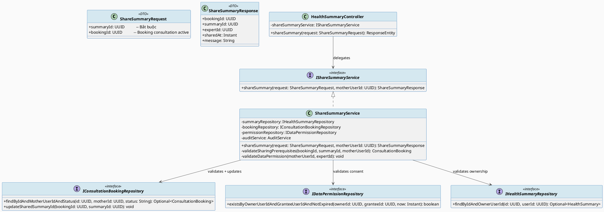
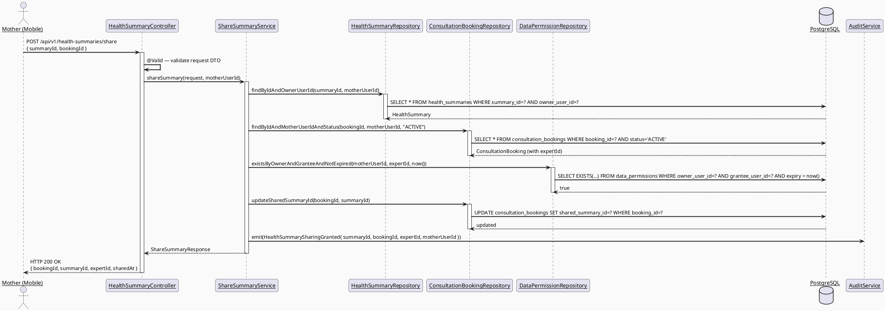
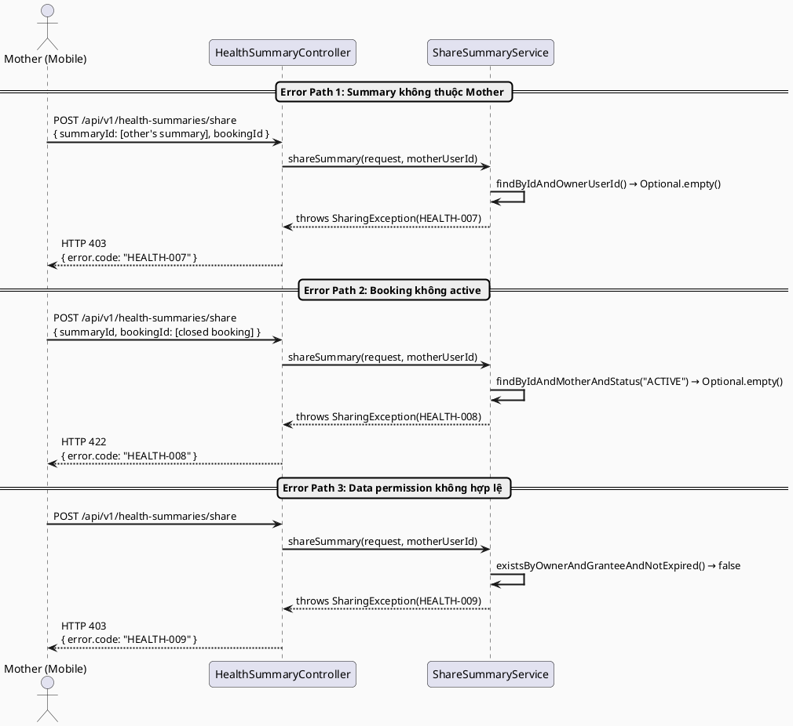
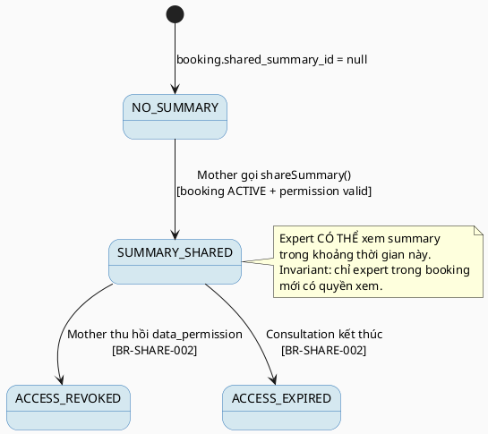

# ENGINEERING DOCUMENTATION STANDARD (EDS) v2.0
# Technical Design Specification — UC-44 Share Summary with Expert

| Field | Value |
|-------|-------|
| **Document ID** | `CB-HEALTH-IMP-006` |
| **Version** | `1.0` |
| **Date** | `2026-06-26` |
| **Status** | `Draft` |
| **Document Owner** | `PhuongNT` |
| **Author** | `AI Agent` |
| **Reviewed by** | `[Tech Lead]` |
| **DPO Sign-off** | `[ ] Pending` *(bắt buộc — module PII với consent data)* |
| **Approved by** | `[Principal Architect]` |
| **Last Review** | `2026-06-26` |
| **Based on EDS** | `v2.0` |

---

## CHANGELOG

| Ngày | Người thực hiện | Nội dung thay đổi |
|------|-----------------|-------------------|
| 2026-06-26 | AI Agent | Tạo tài liệu lần đầu cho UC-44 Share Summary with Expert |

---

## MỤC LỤC

1. [Tổng quan Module](#1-tổng-quan-module)
2. [Ma trận Truy vết](#2-ma-trận-truy-vết)
3. [Architecture Decision Records](#3-architecture-decision-records)
4. [Non-Functional Requirements & SLA](#4-non-functional-requirements--sla)
5. [Static Modeling](#5-static-modeling)
6. [Dynamic Modeling](#6-dynamic-modeling)
7. [Domain Event Catalog](#7-domain-event-catalog)
8. [Interface Specification](#8-interface-specification)
9. [API Specification](#9-api-specification)
10. [Bảng mã lỗi](#10-bảng-mã-lỗi)
11. [Quy trình Triển khai](#11-quy-trình-triển-khai)
12. [Rollback & Incident Runbook](#12-rollback--incident-runbook)
13. [Kịch bản Kiểm thử](#13-kịch-bản-kiểm-thử)
14. [Phương pháp Xác minh](#14-phương-pháp-xác-minh)
15. [Mẫu thử thực tế](#15-mẫu-thử-thực-tế)
16. [Authorization Matrix](#16-authorization-matrix)
17. [AI Prompt Constraints (CASE 2.0)](#17-ai-prompt-constraints-case-20)

---

## 1. Tổng quan Module

| Field | Value |
|-------|-------|
| **Module Name** | `ShareSummaryWithExpert` |
| **Bounded Context** | `health` |
| **UC ID** | `UC-44` |
| **SRS Reference** | `3.3.1.21` |
| **Primary Actor** | `Mother (ROLE_MOTHER)` |
| **Platform** | `Mobile App` |
| **Data Classification** | `Sensitive-PII` |
| **Compliance Scope** | `BR-RBAC, BR-PRIVACY, BR-SHARE-001, BR-SHARE-002, PDPA` |
| **Upstream Dependencies** | `auth, health_summaries (UC-43), consultation_bookings, data_permissions` |
| **Downstream Consumers** | `Expert consultation view, audit` |

**Mô tả:** Cho phép Mother chia sẻ một health summary hoặc health record với Expert (bác sĩ/chuyên gia tư vấn) trong phạm vi một booking tư vấn đang hoạt động. Việc chia sẻ được ghi nhận bằng cách cập nhật `shared_summary_id` trong `consultation_bookings` và xác thực rằng có `data_permissions` hợp lệ giữa Mother và Expert (BR-SHARE-001). Expert chỉ được truy cập cho đến khi tư vấn kết thúc hoặc quyền bị thu hồi (BR-SHARE-002).

---

## 2. Ma trận Truy vết

| Requirement ID | Loại | Mô tả | Thành phần Code | Compliance Target | ADR liên quan |
|----------------|------|-------|-----------------|-------------------|---------------|
| UC-44 | Use Case | Mother chia sẻ summary với Expert trong booking | `HealthSummaryController.shareSummary()` | BR-PRIVACY | ADR-SHARE-001 |
| BR-SHARE-001 | Business Rule | Chia sẻ yêu cầu active consultation booking VÀ valid data_permissions entry | `ShareSummaryService.validateSharingPrerequisites()` | PDPA | ADR-SHARE-001 |
| BR-SHARE-002 | Business Rule | Expert access hết hạn khi consultation kết thúc hoặc permission bị thu hồi | `DataPermissionValidator` | PDPA | ADR-SHARE-001 |
| BR-RBAC | Business Rule | Chỉ ROLE_MOTHER mới được chia sẻ; chỉ chia sẻ summary của chính mình | `@PreAuthorize` + ownership check | PDPA | — |
| BR-PRIVACY | Business Rule | Không chia sẻ dữ liệu khi thiếu consent hoặc permission hết hạn | `DataPermissionValidator.isValid()` | PDPA | ADR-SHARE-001 |
| BR-AUDIT | Business Rule | Ghi audit event `HealthSummarySharingGranted` | `AuditService` | PDPA | — |

---

## 3. Architecture Decision Records

### ADR-SHARE-001 — Liên kết sharing qua shared_summary_id trong consultation_bookings

| Field | Value |
|-------|-------|
| **Status** | `Accepted` |
| **Deciders** | `AI Agent — Technical Spec Author` |
| **Date** | `2026-06-26` |
| **Supersedes** | `N/A` |

#### Bối cảnh (Context)
Cần cơ chế ghi nhận rằng Mother đã chia sẻ một health summary với Expert trong context của một consultation booking cụ thể. Schema V1__init_schema.sql đã có FK `consultation_bookings.shared_summary_id → health_summaries(summary_id)`.

#### Các phương án đã xem xét (Options Considered)

| Phương án | Mô tả | Ưu điểm | Nhược điểm |
|-----------|-------|----------|------------|
| A | UPDATE `consultation_bookings.shared_summary_id` = summaryId | + Schema đã có sẵn; + Đơn giản; + Audit rõ ràng theo booking | - Chỉ lưu được 1 summary per booking |
| B | Tạo bảng `shared_summaries` riêng | + Nhiều summary per booking | - Cần migration mới; - Phức tạp không cần thiết |

#### Quyết định (Decision)
Chọn **Phương án A** vì `shared_summary_id` FK đã được định nghĩa trong schema. Nếu cần share nhiều summaries, sẽ mở ADR mới.

#### Hệ quả (Consequences)

**Tích cực:**
- Không cần migration mới
- Liên kết sharing rõ ràng theo booking context

**Tiêu cực / Trade-offs:**
- Chỉ 1 summary được link vào booking — đủ cho MVP

**Compliance Impact:**
- Sharing được kiểm soát qua booking scope — rõ ràng về consent boundary (PDPA)

---

### ADR-SHARE-002 — Double-gate validation: booking status + data_permissions

| Field | Value |
|-------|-------|
| **Status** | `Accepted` |
| **Deciders** | `AI Agent — Technical Spec Author` |
| **Date** | `2026-06-26` |
| **Supersedes** | `N/A` |

#### Bối cảnh (Context)
BR-SHARE-001 yêu cầu cả hai điều kiện: active booking VÀ valid permission. Cần đảm bảo cả hai được check trước khi thực hiện sharing.

#### Quyết định (Decision)
`ShareSummaryService.validateSharingPrerequisites()` phải check tuần tự: (1) booking tồn tại và active, (2) data_permissions tồn tại và chưa hết hạn giữa mother và expert.

#### Hệ quả (Consequences)

**Tích cực:**
- BR-SHARE-001 được enforce đầy đủ
- Từng điều kiện có error code riêng → dễ debug

**Tiêu cực / Trade-offs:**
- 2 DB queries cho validation — chấp nhận được với volume hiện tại

**Compliance Impact:**
- Double-gate ngăn sharing ngoài consent scope (PDPA)

---

## 4. Non-Functional Requirements & SLA

### 4.1. Performance & Availability

| Category | Requirement | Target SLA | Measurement Method | Compliance Basis |
|----------|-------------|------------|---------------------|------------------|
| Latency | API response (p99) — share action | `< 300ms` | k6 load test | — |
| Availability | Uptime (monthly) | `99.9%` | Uptime monitor | — |
| Throughput | Concurrent requests | `100 req/s` | Load test | — |

### 4.2. Data Integrity & Retention

| Category | Requirement | Target | Verification Method | Compliance Basis |
|----------|-------------|--------|---------------------|------------------|
| Durability | Sharing audit không được mất | RPO = 0 | Transaction log | PDPA |
| Retention | Audit log sharing events | 7 năm | DB backup policy | PDPA |
| Consistency | booking.shared_summary_id ↔ health_summaries sync | 100% | FK constraint | BR-SHARE-001 |

### 4.3. Security

| Category | Requirement | Target | Verification Method | Compliance Basis |
|----------|-------------|--------|---------------------|------------------|
| Encryption at rest | PII health data | AES-256 | `openssl` CLI check | PDPA |
| Encryption in transit | All endpoints | TLS 1.3+ | SSL Labs scan | PDPA |
| Access control | RBAC + consent gate | Least privilege | Auth Matrix (§16) | BR-RBAC, BR-PRIVACY |

### 4.4. Scalability & Capacity Planning

Volume dự kiến: 1.000 sharing actions/ngày trong peak hours. Giải pháp: index trên `consultation_bookings(booking_id, status)` và `data_permissions(owner_user_id, grantee_user_id)`.

---

## 5. Static Modeling (Mô hình Tĩnh)

### 5.1. Class Diagram (PlantUML)



### 5.2. Data Structure (Flyway SQL Migration)

Tất cả bảng đã có trong `V1__init_schema.sql`. Thao tác sharing là UPDATE `consultation_bookings.shared_summary_id`. Không cần migration mới.

```sql
-- === KHÔNG CẦN MIGRATION MỚI ===
-- consultation_bookings.shared_summary_id UUID FK → health_summaries(summary_id)
-- data_permissions: grantee_user_id, owner_user_id, expiry fields

-- Index bổ sung nếu chưa có:
CREATE INDEX IF NOT EXISTS idx_data_permissions_owner_grantee
    ON public.data_permissions(owner_user_id, grantee_user_id);

CREATE INDEX IF NOT EXISTS idx_consultation_bookings_status
    ON public.consultation_bookings(booking_id, status);
```

---

## 6. Dynamic Modeling (Mô hình Động)

### 6.1. Sequence Diagram — Happy Path (PlantUML)



### 6.2. Sequence Diagram — Error Path (PlantUML)



### 6.3. State Machine



---

## 7. Domain Event Catalog

### 7.1. Events Published (Phát ra)

| Event Name | Trigger | Publisher | Subscriber(s) | Payload Schema | Async? |
|------------|---------|-----------|---------------|----------------|--------|
| `HealthSummarySharingGranted` | Share thành công | `ShareSummaryService` | `AuditService`, `ExpertNotificationService` | `HealthSummarySharingGrantedEvent.java` | No (audit sync) |

### 7.2. Events Consumed (Tiêu thụ)

| Event Name | Source | Handler | Action thực hiện |
|------------|--------|---------|------------------|
| `DataPermissionRevoked` | `DataPermissionModule (UC-18)` | `ShareSummaryEventHandler` | Cập nhật trạng thái access nếu permission bị thu hồi |
| `ConsultationEnded` | `ConsultationModule` | `ShareSummaryEventHandler` | Mark access as expired (BR-SHARE-002) |

### 7.3. Payload Schema

```java
// HealthSummarySharingGrantedEvent.java
public record HealthSummarySharingGrantedEvent(
    UUID    eventId,
    String  eventType,     // "HealthSummarySharingGranted"
    Instant occurredAt,
    String  version,       // "1.0"
    Payload payload,
    Metadata metadata
) {
    public record Payload(
        UUID   summaryId,      // Summary được chia sẻ
        UUID   bookingId,      // Booking context
        UUID   expertId,       // Expert nhận quyền xem
        UUID   motherUserId,   // Mother chia sẻ
        Instant sharedAt       // Thời điểm chia sẻ
    ) {}

    public record Metadata(
        UUID   correlationId,
        String causedBy        // motherUserId
    ) {}
}
```

---

## 8. Interface Specification (Đặc tả Giao diện)

### 8.1. Service Interface

```java
// ShareSummaryRequest.java — Input DTO
// @version 1.0
public class ShareSummaryRequest {
    @NotNull(message = "summaryId là bắt buộc")
    private UUID summaryId;    // ID của summary cần chia sẻ

    @NotNull(message = "bookingId là bắt buộc")
    private UUID bookingId;    // ID của consultation booking đang active
}

// ShareSummaryResponse.java — Output DTO
public class ShareSummaryResponse {
    private UUID    bookingId;
    private UUID    summaryId;
    private UUID    expertId;
    private Instant sharedAt;
    private String  message;   // "Đã chia sẻ tóm tắt sức khỏe với chuyên gia"
}

// IShareSummaryService.java — Service Contract
// @version 1.0
public interface IShareSummaryService {
    /**
     * Chia sẻ health summary với Expert trong context của consultation booking.
     * @throws SharingException (HEALTH-007) khi summary không thuộc mother
     * @throws SharingException (HEALTH-008) khi booking không active
     * @throws SharingException (HEALTH-009) khi data_permission không hợp lệ hoặc hết hạn
     */
    ShareSummaryResponse shareSummary(ShareSummaryRequest request, UUID motherUserId);
}
```

### 8.2. Repository Interface

```java
// IConsultationBookingRepository.java
// @version 1.0
public interface IConsultationBookingRepository extends JpaRepository<ConsultationBooking, UUID> {

    Optional<ConsultationBooking> findByIdAndMotherUserIdAndStatus(
        UUID bookingId, UUID motherUserId, String status);

    @Modifying
    @Query("UPDATE ConsultationBooking b SET b.sharedSummaryId = :summaryId WHERE b.bookingId = :bookingId")
    void updateSharedSummaryId(@Param("bookingId") UUID bookingId, @Param("summaryId") UUID summaryId);
}

// IDataPermissionRepository.java
// @version 1.0
public interface IDataPermissionRepository extends JpaRepository<DataPermission, UUID> {

    @Query("SELECT COUNT(p) > 0 FROM DataPermission p WHERE p.ownerUserId = :ownerId " +
           "AND p.granteeUserId = :granteeId AND (p.expiryAt IS NULL OR p.expiryAt > :now)")
    boolean existsByOwnerUserIdAndGranteeUserIdAndNotExpired(
        @Param("ownerId") UUID ownerId,
        @Param("granteeId") UUID granteeId,
        @Param("now") Instant now);
}
```

---

## 9. API Specification

### 9.1. Endpoints Table

| Method | Path | Auth Level | Required Roles | Rate Limit | Idempotent? |
|--------|------|------------|----------------|------------|-------------|
| `POST` | `/api/v1/health-summaries/share` | JWT Bearer | `ROLE_MOTHER` | 30/min | No |
| `GET` | `/api/v1/health-summaries/{summaryId}/sharing-status` | JWT Bearer | `ROLE_MOTHER` | 60/min | Yes |

### 9.2. Request / Response Schemas

#### `POST /api/v1/health-summaries/share` — Chia sẻ Summary với Expert

**Request Body:**
```json
{
  "summaryId": "550e8400-e29b-41d4-a716-446655440000",
  "bookingId": "660f9511-f30c-52e5-b827-557766551111"
}
```

**Response — 200 OK (Happy Path):**
```json
{
  "bookingId": "660f9511-f30c-52e5-b827-557766551111",
  "summaryId": "550e8400-e29b-41d4-a716-446655440000",
  "expertId": "770a0622-g41d-63f6-c938-668877662222",
  "sharedAt": "2026-06-26T08:00:00.000Z",
  "message": "Đã chia sẻ tóm tắt sức khỏe với chuyên gia thành công"
}
```

**Response — 403 Forbidden (Summary không thuộc Mother):**
```json
{
  "error": {
    "code": "HEALTH-007",
    "message": "Không có quyền chia sẻ summary này"
  }
}
```

**Response — 422 Unprocessable Entity (Booking không active):**
```json
{
  "error": {
    "code": "HEALTH-008",
    "message": "Không có lịch tư vấn đang hoạt động với bookingId này"
  }
}
```

**Response — 403 Forbidden (Data permission không hợp lệ):**
```json
{
  "error": {
    "code": "HEALTH-009",
    "message": "Chưa cấp quyền chia sẻ dữ liệu với chuyên gia này. Vui lòng cấp quyền trước (UC-17)."
  }
}
```

---

## 10. Bảng mã lỗi

| Code | HTTP Status | Message (EN) | Message (VI) | Trigger Condition |
|------|-------------|--------------|--------------|-------------------|
| `HEALTH-001` | 400 | Validation failed | Dữ liệu không hợp lệ | Request thiếu summaryId hoặc bookingId |
| `HEALTH-004` | 404 | Summary not found | Không tìm thấy summary | summaryId không tồn tại |
| `HEALTH-007` | 403 | Access denied — not summary owner | Không có quyền chia sẻ summary này | summary.owner_user_id ≠ motherUserId |
| `HEALTH-008` | 422 | No active booking found | Không có lịch tư vấn đang hoạt động | Booking không tồn tại hoặc status ≠ ACTIVE |
| `HEALTH-009` | 403 | Data permission invalid or expired | Quyền chia sẻ không hợp lệ hoặc hết hạn | data_permissions không tồn tại hoặc hết hạn |
| `HEALTH-010` | 500 | Internal error during sharing | Lỗi hệ thống khi chia sẻ | DB error khi UPDATE consultation_bookings |

---

## 11. Quy trình Triển khai (Step-by-Step)

### 11.1. Prerequisites

- [ ] ADR-SHARE-001 và ADR-SHARE-002 đã được Accepted
- [ ] DPO đã sign-off (module xử lý Sensitive-PII + consent data)
- [ ] UC-43 (GenerateHealthSummary) đã được implement và healthy
- [ ] UC-17 (GrantDataPermission) đã được implement để có data_permissions
- [ ] Blueprint đã được Principal Architect approve

### 11.2. Pre-Migration Checklist

- [ ] Xác nhận `consultation_bookings.shared_summary_id` column tồn tại trong staging
- [ ] Xác nhận `data_permissions` table tồn tại trong staging
- [ ] Kiểm tra FK constraint `consultation_bookings.shared_summary_id → health_summaries(summary_id)`
- [ ] Backup DB production trước khi thêm index mới

### 11.3. Implementation Steps

#### Chặng 1 — Tạo index bổ sung (nếu chưa có)

```sql
-- V3__add_sharing_indexes.sql
CREATE INDEX IF NOT EXISTS idx_data_permissions_owner_grantee
    ON public.data_permissions(owner_user_id, grantee_user_id);

CREATE INDEX IF NOT EXISTS idx_consultation_bookings_mother_status
    ON public.consultation_bookings(mother_user_id, status);
```

```bash
./mvnw flyway:migrate
```

#### Chặng 2 — Implement domain layer

Tạo các class theo thứ tự:
1. `ShareSummaryRequest.java` (DTO)
2. `ShareSummaryResponse.java` (DTO)
3. `IShareSummaryService.java` (Service interface)
4. `ShareSummaryService.java` (Service implementation — double-gate validation)
5. Bổ sung `shareSummary()` endpoint vào `HealthSummaryController.java`

#### Chặng 3 — Verification sau deploy

```bash
curl -X GET https://[host]/api/v1/health
# Expected: {"status": "ok"}
```

### 11.4. Deployment Checklist

- [ ] Migration chạy thành công
- [ ] Health check 200
- [ ] Error rate < 1% trong 10 phút đầu
- [ ] Audit log emit `HealthSummarySharingGranted` event
- [ ] DPO được thông báo (PII + consent data affected)

---

## 12. Rollback & Incident Runbook

### 12.1. Điều kiện kích hoạt Rollback

| Điều kiện | Ngưỡng | Người quyết định |
|-----------|--------|------------------|
| Error rate tăng đột biến | > 5% trong 5 phút | On-call Engineer |
| Data leak (Expert xem summary không có permission) | 1 case | Tech Lead + DPO |
| Latency p99 vượt ngưỡng | > 600ms | On-call Engineer |
| Audit log ngừng | > 1 phút | On-call Engineer |

### 12.2. Rollback Procedure

```bash
# Bước 1: Revert index migration
psql -h $DB_HOST -U $DB_USER -d $DB_NAME \
  -c "DROP INDEX IF EXISTS idx_data_permissions_owner_grantee;"
psql -h $DB_HOST -U $DB_USER -d $DB_NAME \
  -c "DROP INDEX IF EXISTS idx_consultation_bookings_mother_status;"
psql -h $DB_HOST -U $DB_USER -d $DB_NAME \
  -c "DELETE FROM flyway_schema_history WHERE version = '3';"

# Bước 2: Re-deploy phiên bản cũ
kubectl rollout undo deployment/carebridge-api

# Bước 3: Verify
kubectl rollout status deployment/carebridge-api
curl -X GET https://[host]/api/v1/health

# Bước 4: Clear shared_summary_id nếu có data không nhất quán
# (thực hiện cẩn thận sau khi xác nhận rollback thành công)
psql -h $DB_HOST -U $DB_USER -d $DB_NAME \
  -c "UPDATE consultation_bookings SET shared_summary_id = NULL WHERE updated_at > '[rollback-timestamp]'::timestamptz;"
```

### 12.3. Notification Protocol

| Thời điểm | Người nhận | Kênh | Template |
|-----------|------------|------|----------|
| Ngay khi phát hiện | On-call team | Slack `#incident` | "🚨 [HEALTH-SHARE] incident: [mô tả]" |
| Trong 15 phút | DPO | Email | **BẮT BUỘC** — module xử lý consent data |
| Trong 72 giờ | DPA | Email | Nếu có data exposure — PDPA Art. 37 |

### 12.4. Post-Incident Review (PIR)

PIR bắt buộc trong **48 giờ**. Đặc biệt phải phân tích: liệu có trường hợp Expert xem data mà không có permission không?

---

## 13. Kịch bản Kiểm thử Chi tiết

### 13.1. Unit Tests

#### TC-UNIT-001 — Chia sẻ summary thành công

```gherkin
Feature: Share Summary with Expert
  Background:
    Given test data classification: SYNTHETIC
    And SYNTHETIC Mother đã xác thực (JWT ROLE_MOTHER)

  Scenario: Chia sẻ summary thành công
    Given SYNTHETIC Mother có summary (owner)
    And SYNTHETIC consultation booking đang ACTIVE
    And SYNTHETIC data_permissions hợp lệ giữa Mother và Expert
    When POST /api/v1/health-summaries/share được gọi
    Then response status là 200
    And response chứa expertId và sharedAt
    And consultation_bookings.shared_summary_id được cập nhật
    And audit event HealthSummarySharingGranted được emit

  Scenario: Summary không thuộc Mother → 403
    Given summaryId thuộc về SYNTHETIC Mother khác
    When POST /api/v1/health-summaries/share được gọi
    Then response status là 403
    And error.code = "HEALTH-007"
    And consultation_bookings KHÔNG bị cập nhật
```

#### TC-UNIT-002 — Booking không active → 422

```gherkin
  Scenario: Booking đã kết thúc
    Given SYNTHETIC booking với status = "COMPLETED"
    When POST /api/v1/health-summaries/share được gọi
    Then response status là 422
    And error.code = "HEALTH-008"

  Scenario: Data permission hết hạn → 403
    Given data_permissions.expiry_at < now()
    When POST /api/v1/health-summaries/share được gọi
    Then response status là 403
    And error.code = "HEALTH-009"
```

**Hàm được test:** `ShareSummaryService.validateSharingPrerequisites()`
**Invariant kiểm tra:** BR-SHARE-001 — phải có đủ cả 2 điều kiện (booking active VÀ permission valid)

### 13.2. Integration Tests

#### TC-INT-001 — Luồng sharing với DB thật

```gherkin
  Scenario: Mother chia sẻ summary với Expert — Testcontainers
    Given test data classification: SYNTHETIC
    And PostgreSQL container + Flyway migration
    And Seed: SYNTHETIC Mother, Expert, booking ACTIVE, data_permissions hợp lệ, health_summary
    When ShareSummaryService.shareSummary() được gọi
    Then consultation_bookings.shared_summary_id = summaryId trong DB
    And audit event được emit
    And response.expertId khớp với booking.expert_id
```

**External dependencies:** PostgreSQL (Testcontainers)
**Mock strategy:** AuditService mock; DB thật với seed data

### 13.3. E2E / Security Tests

#### TC-E2E-001 — Luồng hoàn chỉnh qua REST API

```gherkin
  Scenario: Mother chia sẻ summary qua API
    Given test data classification: SYNTHETIC
    And tất cả prerequisites đã được seed
    When POST /api/v1/health-summaries/share với JWT hợp lệ
    Then HTTP 200
    And DB: consultation_bookings.shared_summary_id được set

  Scenario: Expert cố chia sẻ summary (sai role)
    Given Expert đã đăng nhập (ROLE_EXPERT)
    When POST /api/v1/health-summaries/share
    Then HTTP 403 — ROLE_MOTHER required

  Scenario: Replay attack — chia sẻ với booking đã kết thúc
    Given Booking vừa COMPLETED
    When POST /api/v1/health-summaries/share với bookingId cũ
    Then HTTP 422 với HEALTH-008
```

---

## 14. Phương pháp Xác minh

### 14.1. Database Inspection

```sql
-- Verify shared_summary_id được update đúng
SELECT booking_id, shared_summary_id, status, updated_at
FROM public.consultation_bookings
WHERE booking_id = '[test-booking-uuid]';

-- Verify data_permissions hợp lệ trước khi share
SELECT * FROM public.data_permissions
WHERE owner_user_id = '[mother-uuid]'
  AND grantee_user_id = '[expert-uuid]'
  AND (expiry_at IS NULL OR expiry_at > NOW());

-- Verify summary ownership
SELECT summary_id, owner_user_id FROM public.health_summaries
WHERE summary_id = '[test-summary-uuid]';
```

### 14.2. Log / Audit Verification

```bash
# Kiểm tra audit event HealthSummarySharingGranted
kubectl logs -l app=carebridge-api | grep '"eventType":"HealthSummarySharingGranted"' | head -5

# Verify không có PII trong log
kubectl logs -l app=carebridge-api | grep -i "summaryJson\|healthData\|medicalRecord"
# Expected: No raw PII data
```

### 14.3. Tool-based Verification

```bash
# Verify JWT claims — ROLE_MOTHER required
echo "[JWT_TOKEN]" | cut -d'.' -f2 | base64 -d | jq '.roles'
# Expected: ["ROLE_MOTHER"]

# Verify TLS 1.3
openssl s_client -connect [host]:443 -tls1_3 2>&1 | grep "Protocol"
```

---

## 15. Mẫu thử thực tế (API Verification Samples)

### 15.1. Happy Path

```bash
# [POST] Chia sẻ summary với Expert
curl -X POST https://[host]/api/v1/health-summaries/share \
  -H "Authorization: Bearer [MOTHER_JWT_TOKEN]" \
  -H "Content-Type: application/json" \
  -H "X-Correlation-Id: $(uuidgen)" \
  -d '{
    "summaryId": "550e8400-e29b-41d4-a716-446655440000",
    "bookingId": "660f9511-f30c-52e5-b827-557766551111"
  }'
```

**Expected Response (200):**
```json
{
  "bookingId": "660f9511-f30c-52e5-b827-557766551111",
  "summaryId": "550e8400-e29b-41d4-a716-446655440000",
  "expertId": "770a0622-g41d-63f6-c938-668877662222",
  "sharedAt": "2026-06-26T08:00:00.000Z",
  "message": "Đã chia sẻ tóm tắt sức khỏe với chuyên gia thành công"
}
```

### 15.2. Error Paths

```bash
# [POST] Booking không active → 422
curl -X POST https://[host]/api/v1/health-summaries/share \
  -H "Authorization: Bearer [MOTHER_JWT_TOKEN]" \
  -H "Content-Type: application/json" \
  -d '{ "summaryId": "valid-uuid", "bookingId": "completed-booking-uuid" }'
```

**Expected Response (422):**
```json
{
  "error": {
    "code": "HEALTH-008",
    "message": "Không có lịch tư vấn đang hoạt động với bookingId này"
  }
}
```

```bash
# [POST] Không có JWT → 401
curl -X POST https://[host]/api/v1/health-summaries/share \
  -H "Content-Type: application/json" \
  -d '{ "summaryId": "uuid", "bookingId": "uuid" }'
```

**Expected Response (401):**
```json
{
  "error": {
    "code": "IAM-001",
    "message": "Authentication required"
  }
}
```

---

## 16. Authorization Matrix

| Endpoint | `GUEST` | `ROLE_MOTHER` | `ROLE_EXPERT` | `ROLE_ADMIN` | `SYSTEM` |
|----------|---------|---------------|---------------|--------------|----------|
| `POST /api/v1/health-summaries/share` | ❌ | ✅ Own summary + active booking + valid permission | ❌ | ❌ | ✅ |
| `GET /api/v1/health-summaries/{id}/sharing-status` | ❌ | ✅ Own | ✅ Shared to them via booking | ✅ All | ✅ |

**Chú thích:**
- `Own summary + active booking + valid permission` = triple-gate (ownership + booking status + data_permissions)
- Expert chỉ được xem summary nếu `consultation_bookings.shared_summary_id` = summaryId VÀ booking còn ACTIVE

---

## 17. AI Prompt Constraints (CASE 2.0)

### 17.1 Constraint Summary Table

| # | Constraint | Source (ADR/BR) | Last Verified |
|---|-----------|-----------------|---------------|
| C1 | `ShareSummaryService` PHẢI validate tuần tự: (1) summary ownership, (2) booking ACTIVE, (3) data_permission valid — ném lỗi riêng cho từng gate | `BR-SHARE-001`, `ADR-SHARE-002` | `2026-06-26` |
| C2 | Controller KHÔNG được chứa business logic — chỉ validate DTO và delegate sang `IShareSummaryService` | `ADR-SHARE-002` | `2026-06-26` |
| C3 | `motherUserId` PHẢI lấy từ JWT SecurityContext, KHÔNG từ request body | `BR-RBAC` | `2026-06-26` |
| C4 | Sau khi UPDATE `consultation_bookings.shared_summary_id` thành công, PHẢI emit `HealthSummarySharingGranted` event | `BR-AUDIT` | `2026-06-26` |
| C5 | `IDataPermissionRepository.existsByOwnerUserIdAndGranteeUserIdAndNotExpired()` PHẢI check `expiry_at > now()` — KHÔNG bỏ qua điều kiện thời gian | `BR-SHARE-002` | `2026-06-26` |
| C6 | Repository method `findByIdAndMotherUserIdAndStatus()` PHẢI filter `status='ACTIVE'` — KHÔNG dùng `findById()` đơn thuần | `BR-SHARE-001` | `2026-06-26` |

### 17.2 Constraint Injection Block

```
[CONSTRAINT BLOCK — Module: ShareSummaryWithExpert]
Theo TDS CB-HEALTH-IMP-006 và các ADR liên quan:

1. [C1] ShareSummaryService PHẢI validate 3 gates tuần tự:
   - Gate 1: summary.owner_user_id == motherUserId → HEALTH-007 nếu fail
   - Gate 2: booking.status == 'ACTIVE' && booking.mother_user_id == motherUserId → HEALTH-008 nếu fail
   - Gate 3: data_permissions valid và chưa hết hạn → HEALTH-009 nếu fail
2. [C2] Controller chỉ validate DTO + delegate — KHÔNG có business logic.
3. [C3] motherUserId LUÔN lấy từ SecurityContextHolder, không từ request body.
4. [C4] Sau UPDATE shared_summary_id thành công, emit HealthSummarySharingGrantedEvent qua AuditService.
5. [C5] DataPermission query PHẢI include điều kiện `expiry_at IS NULL OR expiry_at > NOW()`.
6. [C6] Booking query PHẢI filter theo status='ACTIVE'.

[CONTEXT BLOCK]
- Bounded Context: health
- Data Classification: Sensitive-PII
- Compliance: BR-RBAC, BR-PRIVACY, BR-SHARE-001, BR-SHARE-002, PDPA
- Existing interfaces: §8 Service Interface + §8.2 Repository Interface
- Error codes: §10 Error Codes Table
- Auth matrix: §16 Authorization Matrix

[TASK BLOCK]
Implement shareSummary() thỏa mãn constraints trên.
Output phải tuân thủ §8 Interface Specification.
Tests phải cover §13 Test Scenarios.
```

### 17.3 Constraint Quality Checklist

- [x] Mỗi constraint traceable về ADR hoặc BR cụ thể
- [x] Không có constraint generic
- [x] Mỗi constraint có `Last Verified` date ≤ 2 sprints
- [x] Constraint block có ≥ 3 constraints cụ thể
- [x] Constraint block reference §8 Interface
- [x] Constraint block reference §16 Auth Matrix

### 17.4 Anti-Pattern Detection

| AP-ID | Anti-Pattern | Dấu hiệu | Hành động |
|-------|-------------|-----------|----------|
| AP-AI-001 | Unconstrained Gen | Code bỏ qua triple-gate validation | Reject |
| AP-AI-003 | Implicit Decision | Code dùng `findById()` thay vì `findByIdAndOwnerUserId()` | Reject |
| AP-AI-005 | Hallucinated Contract | Code import `DataPermissionService` không có trong §8 | Reject |

---

## PHỤ LỤC

### A. Glossary

| Thuật ngữ | Định nghĩa |
|-----------|------------|
| Data Permission | Bản ghi trong `data_permissions` ghi nhận Mother cấp quyền cho Expert xem dữ liệu |
| Consultation Booking | Phiên tư vấn đã đặt lịch — context để chia sẻ summary |
| Triple-gate validation | 3 điều kiện phải thỏa mãn: ownership + booking active + permission valid |
| shared_summary_id | FK trong `consultation_bookings` trỏ tới summary được chia sẻ |

### B. Tài liệu tham chiếu

| Document | Link / Path |
|----------|-------------|
| SRS UC-44 | `02_Requirements/SRS.md §3.3.1.21` |
| UC-43 TDS | `04_Implement/UC43_GenerateHealthSummary/UC43_GenerateHealthSummary_TDS.md` |
| UC-17 TDS (GrantDataPermission) | `04_Implement/UC17_GrantDataPermission/` |
| Database Schema | `05_Development/CareBridgeAPI/src/main/resources/db/migration/V1__init_schema.sql` |
| EDS v2.0 Template | `08_References/Template/PHASE-3_TDS.md` |

---

*EDS v2.0 — CB-HEALTH-IMP-006 — UC-44 Share Summary with Expert — Draft 2026-06-26*
