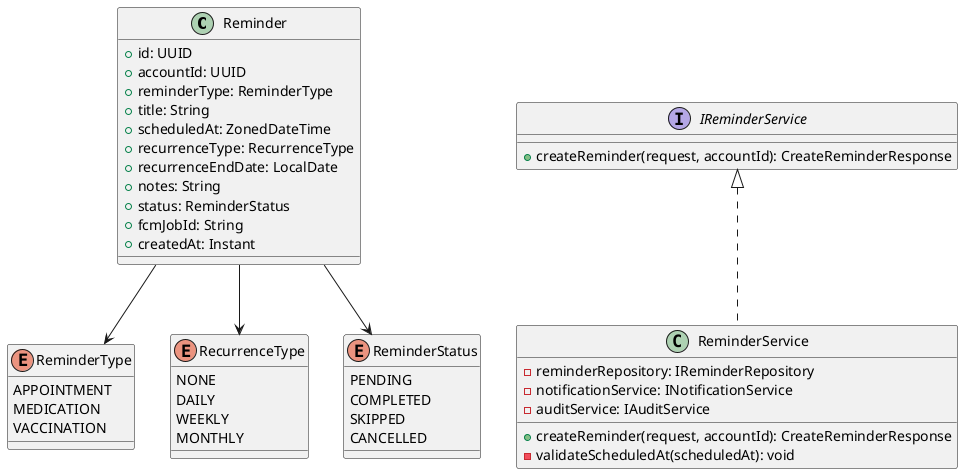
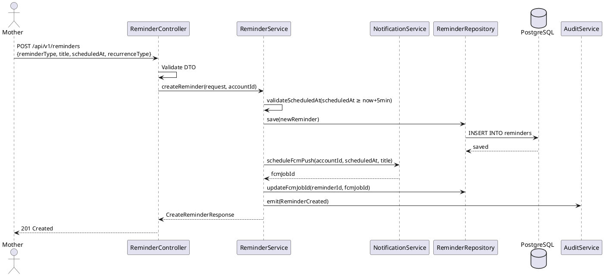
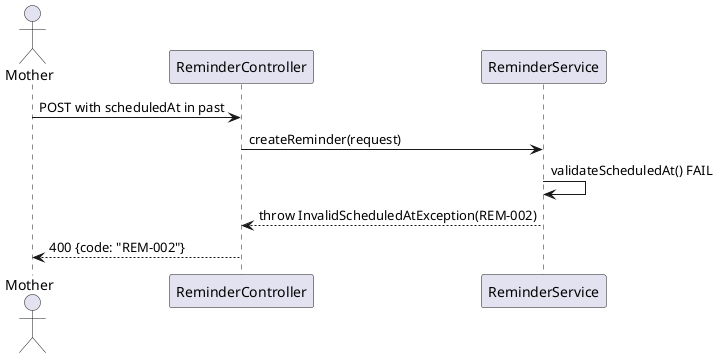
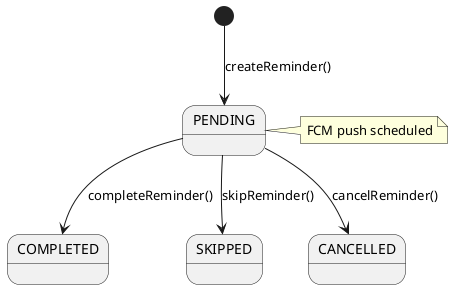

# ENGINEERING DOCUMENTATION STANDARD (EDS) v2.0
# Technical Design Specification — UC-45 Create Appointment Reminder

| Field | Value |
|-------|-------|
| **Document ID** | `CB-REM-IMP-001` |
| **Version** | `1.0` |
| **Date** | `2026-06-26` |
| **Status** | `Draft` |
| **Document Owner** | `PhuongNT` |
| **Author** | `AI Agent` |
| **Reviewed by** | `[Tech Lead]` |
| **DPO Sign-off** | `[ ] Pending` |
| **Approved by** | `[Principal Architect]` |
| **Last Review** | `2026-06-26` |
| **Based on EDS** | `v2.0` |

---

## CHANGELOG

| Ngày | Người thực hiện | Nội dung thay đổi |
|------|-----------------|-------------------|
| 2026-06-26 | AI Agent | Tạo tài liệu lần đầu cho UC-45 Create Appointment Reminder |

---

## MỤC LỤC

1. [Tổng quan Module](#1-tổng-quan-module)
2. [Ma trận Truy vết](#2-ma-trận-truy-vết)
3. [Architecture Decision Records](#3-architecture-decision-records)
4. [Non-Functional Requirements & SLA](#4-non-functional-requirements--sla)
5. [Static Modeling](#5-static-modeling)
6. [Dynamic Modeling](#6-dynamic-modeling)
7. [Domain Event Catalog](#7-domain-event-catalog)
8. [Interface Specification](#8-interface-specification)
9. [API Specification](#9-api-specification)
10. [Bảng mã lỗi](#10-bảng-mã-lỗi)
11. [Quy trình Triển khai](#11-quy-trình-triển-khai)
12. [Rollback & Incident Runbook](#12-rollback--incident-runbook)
13. [Kịch bản Kiểm thử](#13-kịch-bản-kiểm-thử)
14. [Phương pháp Xác minh](#14-phương-pháp-xác-minh)
15. [Mẫu thử thực tế](#15-mẫu-thử-thực-tế)
16. [Authorization Matrix](#16-authorization-matrix)
17. [AI Prompt Constraints](#17-ai-prompt-constraints-case-20)

---

## 1. Tổng quan Module

| Field | Value |
|-------|-------|
| **Module Name** | `CreateAppointmentReminder` |
| **Bounded Context** | `reminder` |
| **UC ID** | `UC-45` |
| **SRS Reference** | `3.3.1.22` |
| **Primary Actor** | `Mother (ROLE_MOTHER)` |
| **Secondary Actors** | `Firebase Cloud Messaging` |
| **Platform** | `Mobile App` |
| **Data Classification** | `PII` |
| **Compliance Scope** | `BR-RBAC, BR-PRIVACY` |
| **Upstream Dependencies** | `auth, notification (FCM)` |
| **Downstream Consumers** | `reminder detail (UC-212), notification delivery, audit` |

**Mô tả:** Mother tạo nhắc nhở lịch hẹn cho các cuộc hẹn: khám định kỳ, tái khám, siêu âm, xét nghiệm, hoặc câu hỏi chuyên gia. Hệ thống lưu reminder với time/recurrence config, schedule FCM push notification, và emit audit event.

---

## 2. Ma trận Truy vết

| Requirement ID | Loại | Mô tả | Thành phần Code | Compliance Target | ADR liên quan |
|----------------|------|-------|-----------------|-------------------|---------------|
| UC-45 | Use Case | Mother tạo appointment reminder | `ReminderController.createReminder()` | BR-RBAC | ADR-REM-001 |
| BR-REM-001 | Business Rule | reminderType = APPOINTMENT | `@ValidReminderType` | Data Integrity | ADR-REM-001 |
| BR-REM-002 | Business Rule | scheduledAt phải ở tương lai ≥ 5 phút | `ReminderService.validateScheduledAt()` | Data Integrity | — |
| BR-REM-003 | Business Rule | recurrenceType: NONE, DAILY, WEEKLY, MONTHLY | `@ValidRecurrence` | Data Integrity | — |
| BR-REM-004 | Business Rule | FCM token phải tồn tại cho device | `NotificationService.validateFcmToken()` | — | ADR-REM-001 |
| BR-REM-005 | Business Rule | Ghi audit event `ReminderCreated` | `AuditService` | PDPA | — |

---

## 3. Architecture Decision Records

### ADR-REM-001 — Firebase FCM làm Push Notification cho Reminders

| Field | Value |
|-------|-------|
| **Status** | `Accepted` |
| **Date** | `2026-06-26` |

#### Quyết định
Dùng Firebase Cloud Messaging (FCM) cho push notification. Khi tạo reminder, `NotificationService` schedule FCM message tại `scheduledAt`. Nếu FCM token không có hoặc invalid, reminder vẫn được lưu nhưng warning được trả về trong response.

---

## 4. Non-Functional Requirements & SLA

| Category | Requirement | Target |
|----------|-------------|--------|
| Latency (p99) | API response | `< 300ms` |
| FCM scheduling | Delay từ create đến first push | `≤ 1 phút` |
| Availability | Uptime | `99.9%` |

---

## 5. Static Modeling

### 5.1. Class Diagram



### 5.2. Data Structure

```sql
-- V23__create_reminders.sql
CREATE TYPE reminder_type_enum AS ENUM ('APPOINTMENT', 'MEDICATION', 'VACCINATION');
CREATE TYPE recurrence_type_enum AS ENUM ('NONE', 'DAILY', 'WEEKLY', 'MONTHLY');
CREATE TYPE reminder_status_enum AS ENUM ('PENDING', 'COMPLETED', 'SKIPPED', 'CANCELLED');

CREATE TABLE reminders (
  id                    UUID                  PRIMARY KEY DEFAULT gen_random_uuid(),
  account_id            UUID                  NOT NULL,
  reminder_type         reminder_type_enum    NOT NULL,
  title                 VARCHAR(255)          NOT NULL,
  scheduled_at          TIMESTAMPTZ           NOT NULL,
  recurrence_type       recurrence_type_enum  NOT NULL DEFAULT 'NONE',
  recurrence_end_date   DATE,
  notes                 TEXT,
  status                reminder_status_enum  NOT NULL DEFAULT 'PENDING',
  fcm_job_id            VARCHAR(255),                            -- FCM message ID
  created_at            TIMESTAMPTZ           NOT NULL DEFAULT NOW(),
  updated_at            TIMESTAMPTZ           NOT NULL DEFAULT NOW(),
  created_by            UUID                  NOT NULL,

  CONSTRAINT fk_reminder_account FOREIGN KEY (account_id) REFERENCES accounts(id)
);

CREATE INDEX idx_reminder_account_id ON reminders(account_id);
CREATE INDEX idx_reminder_scheduled_at ON reminders(scheduled_at);
CREATE INDEX idx_reminder_status ON reminders(status);
```

---

## 6. Dynamic Modeling

### 6.1. Sequence Diagram — Happy Path



### 6.2. Error Path — Past scheduled time



### 6.3. State Machine — Reminder Status



---

## 7. Domain Event Catalog

| Event Name | Trigger | Publisher | Subscriber(s) | Async? |
|------------|---------|-----------|---------------|--------|
| `ReminderCreated` | Reminder saved | `ReminderService` | `AuditService` | No |
| `ReminderDue` | scheduledAt reached | `NotificationService` | `ReminderService, FCM` | Yes |

---

## 8. Interface Specification

```java
// CreateReminderRequest.java
public class CreateReminderRequest {
    @NotNull
    private ReminderType reminderType; // must be APPOINTMENT

    @NotBlank @Size(max = 255)
    private String title;

    @NotNull
    @Future
    private ZonedDateTime scheduledAt;  // ≥ now + 5 minutes

    @NotNull
    private RecurrenceType recurrenceType;

    private LocalDate recurrenceEndDate; // required if recurrenceType != NONE

    @Size(max = 1000)
    private String notes;
}

// CreateReminderResponse.java
public class CreateReminderResponse {
    private UUID id;
    private String reminderType;
    private String title;
    private ZonedDateTime scheduledAt;
    private String recurrenceType;
    private String status;
    private Instant createdAt;
}

// IReminderService.java
public interface IReminderService {
    /**
     * @throws InvalidScheduledAtException (REM-002) when scheduledAt < now + 5min
     */
    CreateReminderResponse createReminder(CreateReminderRequest request, UUID accountId);
}
```

---

## 9. API Specification

| Method | Path | Auth Level | Required Roles | Rate Limit |
|--------|------|------------|----------------|------------|
| `POST` | `/api/v1/reminders` | JWT Bearer | `ROLE_MOTHER` | 20/min |

**Request:**
```json
{
  "reminderType": "APPOINTMENT",
  "title": "OB-GYN Checkup Week 28",
  "scheduledAt": "2026-07-15T09:00:00+07:00",
  "recurrenceType": "NONE",
  "notes": "Bring ultrasound results"
}
```

**Response 201:**
```json
{
  "id": "uuid-v4",
  "reminderType": "APPOINTMENT",
  "title": "OB-GYN Checkup Week 28",
  "scheduledAt": "2026-07-15T09:00:00+07:00",
  "recurrenceType": "NONE",
  "status": "PENDING",
  "createdAt": "2026-06-26T00:00:00.000Z"
}
```

---

## 10. Bảng mã lỗi

| Code | HTTP Status | Message (EN) | Trigger Condition |
|------|-------------|--------------|-------------------|
| `REM-001` | 400 | Validation failed | Missing required fields |
| `REM-002` | 400 | Scheduled time too soon | scheduledAt < now + 5 min |
| `REM-003` | 400 | Recurrence end date required | recurrenceType != NONE but no end date |
| `REM-004` | 403 | Insufficient permissions | Non-MOTHER role |
| `REM-005` | 500 | Internal error | DB or FCM error |

---

## 11. Quy trình Triển khai

1. Flyway `V23__create_reminders.sql`
2. `Reminder` entity với enum mappings
3. `IReminderRepository` + `INotificationService` interface
4. `ReminderService.createReminder()` với FCM scheduling
5. `ReminderController.POST /api/v1/reminders`

---

## 12. Rollback & Incident Runbook

```bash
psql -h $DB_HOST -U $DB_USER -d $DB_NAME \
  -c "DROP TABLE IF EXISTS reminders CASCADE;"
psql -h $DB_HOST -U $DB_USER -d $DB_NAME \
  -c "DELETE FROM flyway_schema_history WHERE version = '23';"
```

---

## 13. Kịch bản Kiểm thử

```gherkin
Feature: Create Appointment Reminder
  Scenario: Happy path
    Given Mother authenticated, scheduledAt 1 hour in future
    When POST /api/v1/reminders with APPOINTMENT type
    Then 201, reminder in DB with status PENDING
    And FCM job scheduled
    And audit log contains ReminderCreated

  Scenario: scheduledAt in past → 400
    When POST with scheduledAt 1 day ago
    Then response 400, error REM-002

  Scenario: Recurrence without end date → 400
    When POST with recurrenceType=DAILY and no recurrenceEndDate
    Then response 400, error REM-003
```

---

## 14. Phương pháp Xác minh

```sql
SELECT id, reminder_type, title, scheduled_at, status, fcm_job_id
FROM reminders WHERE account_id = '[uuid]';
```

---

## 15. Mẫu thử thực tế

```bash
curl -X POST https://[host]/api/v1/reminders \
  -H "Authorization: Bearer [JWT_MOTHER_TOKEN]" \
  -H "Content-Type: application/json" \
  -d '{"reminderType":"APPOINTMENT","title":"OB-GYN","scheduledAt":"2026-07-15T09:00:00+07:00","recurrenceType":"NONE"}'
```

---

## 16. Authorization Matrix

| Endpoint | `GUEST` | `MOTHER` | `EXPERT` | `ADMIN` |
|----------|---------|----------|----------|---------|
| `POST /api/v1/reminders` | ❌ | ✅ Own | ❌ | ✅ All |
| `GET /api/v1/reminders/:id` | ❌ | ✅ Own | ❌ | ✅ All |

---

## 17. AI Prompt Constraints (CASE 2.0)

### 17.1 Constraint Summary Table

| # | Constraint | Source | Last Verified |
|---|-----------|--------|---------------|
| C1 | validateScheduledAt() PHẢI reject thời gian < now + 5 phút | BR-REM-002 | 2026-06-26 |
| C2 | FCM scheduling là synchronous call trong createReminder() | ADR-REM-001 | 2026-06-26 |
| C3 | Emit ReminderCreated event sau save | BR-PRIVACY | 2026-06-26 |
| C4 | accountId từ JWT — không từ body | BR-RBAC | 2026-06-26 |
| C5 | ROLE_MOTHER only — EXPERT không được tạo reminder | BR-RBAC | 2026-06-26 |

### 17.2 Constraint Injection Block

```
[CONSTRAINT BLOCK — Module: CreateAppointmentReminder (CB-REM-IMP-001)]
1. validateScheduledAt() PHẢI reject thời gian < now + 5 phút — BR-REM-002
2. FCM scheduling là synchronous call trong createReminder() — ADR-REM-001
3. Emit ReminderCreated event sau save thành công — BR-PRIVACY
4. accountId từ JWT SecurityContext, KHÔNG từ request body — BR-RBAC
5. @PreAuthorize("hasRole('MOTHER')") — EXPERT không được tạo reminder — BR-RBAC

[CONTEXT BLOCK]
- Bounded Context: reminder
- Data Classification: Internal
- Error codes: §10 Error Codes Table
- Auth matrix: §16 Authorization Matrix
```

### 17.3 Constraint Quality Checklist

- [x] Mỗi constraint traceable về ADR hoặc BR cụ thể
- [x] Không có constraint generic
- [x] Constraint block có ≥ 3 constraints cụ thể

### 17.4 Anti-Pattern Detection

| AP-ID | Anti-Pattern | Dấu hiệu | Hành động |
|-------|-------------|-----------|----------|
| AP-AI-001 | Unconstrained Gen | Code không match constraint C1-C5 | Reject — inject lại constraints |
| AP-AI-003 | Implicit Decision | Code assume architecture không có ADR | Reject — viết ADR trước |
| AP-AI-005 | Hallucinated Contract | Code import không có trong §8 | Reject — verify contract |

---

## PHỤ LỤC

### A. Glossary (Thuật ngữ)

| Thuật ngữ | Định nghĩa |
|-----------|------------|
| Reminder | Nhắc nhở lịch hẹn — có thể lặp lại (daily, weekly) hoặc one-time |
| RecurrenceType | Loại lặp lại (NONE, DAILY, WEEKLY, MONTHLY) |
| FCM Scheduling | Lên lịch gửi push notification qua Firebase Cloud Messaging |

### B. Tài liệu tham chiếu

| Document | Path |
|----------|------|
| EDS v2.0 Template | `08_References/Template/PHASE-3_TDS.md` |

---

*EDS v2.1 — Tích hợp CASE 2.0 AI Prompt Constraints (§17).*
