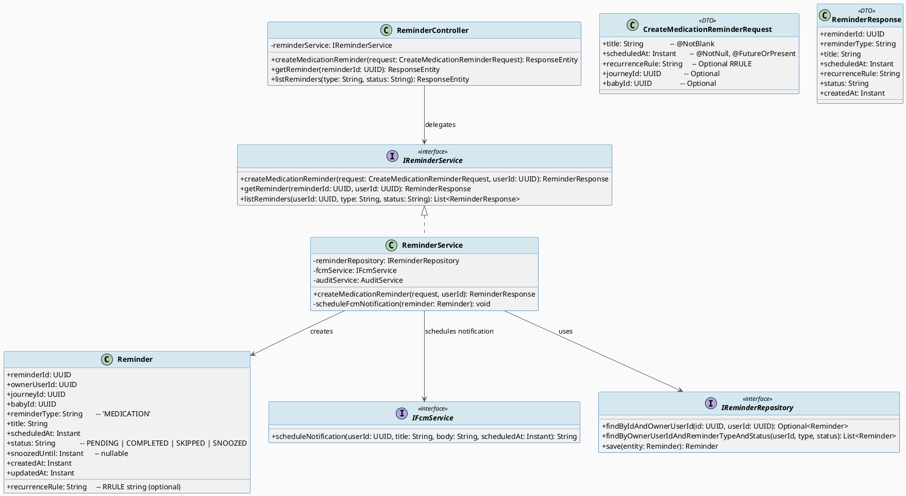
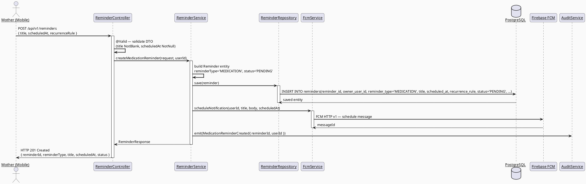
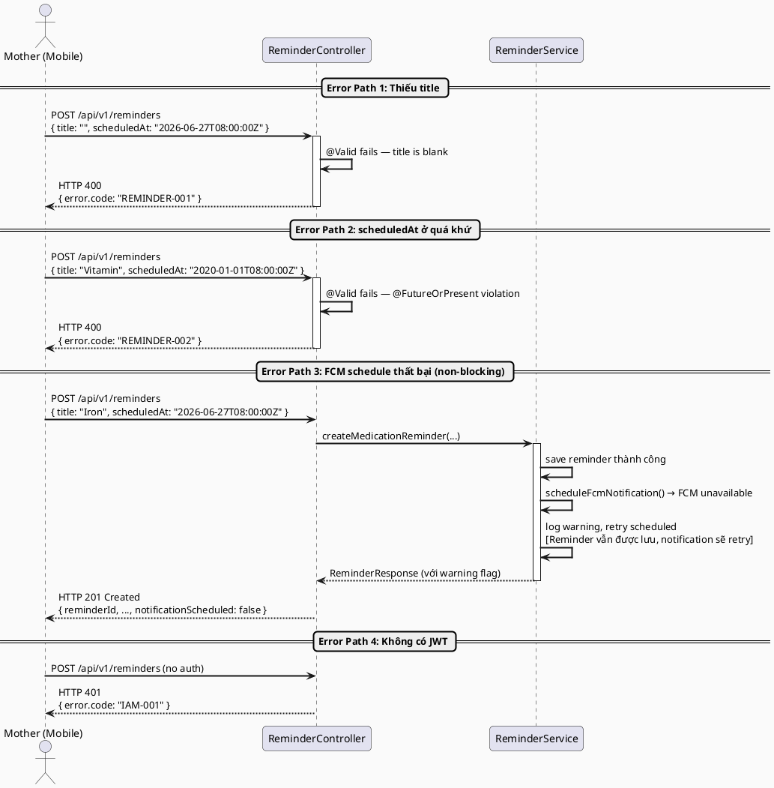
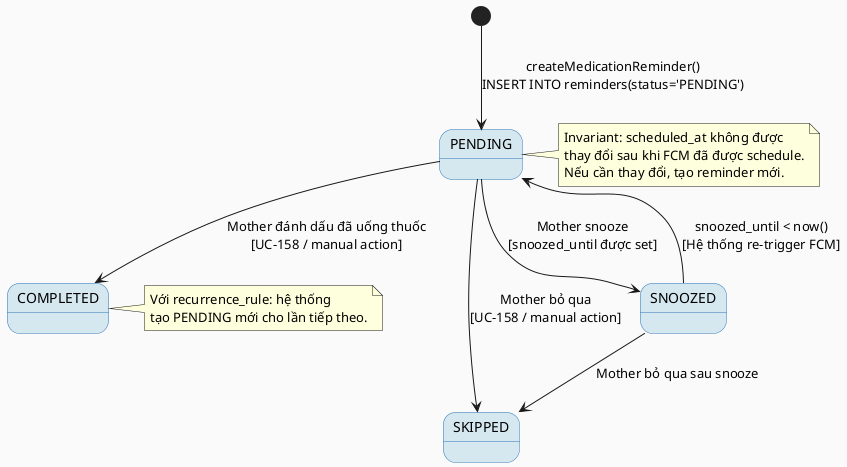

# ENGINEERING DOCUMENTATION STANDARD (EDS) v2.0
# Technical Design Specification — UC-46 Create Medication Reminder

| Field | Value |
|-------|-------|
| **Document ID** | `CB-REMINDER-IMP-001` |
| **Version** | `1.0` |
| **Date** | `2026-06-26` |
| **Status** | `Draft` |
| **Document Owner** | `PhuongNT` |
| **Author** | `AI Agent` |
| **Reviewed by** | `[Tech Lead]` |
| **DPO Sign-off** | `[ ] Pending` |
| **Approved by** | `[Principal Architect]` |
| **Last Review** | `2026-06-26` |
| **Based on EDS** | `v2.0` |

---

## CHANGELOG

| Ngày | Người thực hiện | Nội dung thay đổi |
|------|-----------------|-------------------|
| 2026-06-26 | AI Agent | Tạo tài liệu lần đầu cho UC-46 Create Medication Reminder |

---

## MỤC LỤC

1. [Tổng quan Module](#1-tổng-quan-module)
2. [Ma trận Truy vết](#2-ma-trận-truy-vết)
3. [Architecture Decision Records](#3-architecture-decision-records)
4. [Non-Functional Requirements & SLA](#4-non-functional-requirements--sla)
5. [Static Modeling](#5-static-modeling)
6. [Dynamic Modeling](#6-dynamic-modeling)
7. [Domain Event Catalog](#7-domain-event-catalog)
8. [Interface Specification](#8-interface-specification)
9. [API Specification](#9-api-specification)
10. [Bảng mã lỗi](#10-bảng-mã-lỗi)
11. [Quy trình Triển khai](#11-quy-trình-triển-khai)
12. [Rollback & Incident Runbook](#12-rollback--incident-runbook)
13. [Kịch bản Kiểm thử](#13-kịch-bản-kiểm-thử)
14. [Phương pháp Xác minh](#14-phương-pháp-xác-minh)
15. [Mẫu thử thực tế](#15-mẫu-thử-thực-tế)
16. [Authorization Matrix](#16-authorization-matrix)
17. [AI Prompt Constraints (CASE 2.0)](#17-ai-prompt-constraints-case-20)

---

## 1. Tổng quan Module

| Field | Value |
|-------|-------|
| **Module Name** | `CreateMedicationReminder` |
| **Bounded Context** | `reminder` |
| **UC ID** | `UC-46` |
| **SRS Reference** | `3.3.1.23` |
| **Primary Actor** | `Mother (ROLE_MOTHER)` |
| **Secondary Actor** | `Firebase Cloud Messaging (FCM)` |
| **Platform** | `Mobile App` |
| **Data Classification** | `PII` |
| **Compliance Scope** | `BR-RBAC, BR-REMINDER-001, BR-REMINDER-002, BR-REMINDER-003, BR-SAFETY` |
| **Upstream Dependencies** | `auth, Firebase FCM, journey, baby` |
| **Downstream Consumers** | `UC-158 ReceiveReminderNotification, reminder list view (UC-212), audit` |

**Mô tả:** Cho phép Mother tạo nhắc nhở uống thuốc hoặc vitamin dựa trên hướng dẫn sẵn có (không kê đơn). Người dùng nhập tiêu đề nhắc nhở (`title`), thời điểm nhắc nhở (`scheduled_at`), và tùy chọn quy tắc lặp lại (`recurrence_rule` dạng iCal RRULE). Hệ thống lưu reminder vào bảng `reminders` với `reminder_type='MEDICATION'` và lên lịch gửi push notification qua Firebase Cloud Messaging (BR-REMINDER-003). Hệ thống KHÔNG kê đơn thuốc và KHÔNG đề xuất loại thuốc (BR-SAFETY).

---

## 2. Ma trận Truy vết

| Requirement ID | Loại | Mô tả | Thành phần Code | Compliance Target | ADR liên quan |
|----------------|------|-------|-----------------|-------------------|---------------|
| UC-46 | Use Case | Mother tạo reminder uống thuốc/vitamin | `ReminderController.createReminder()` | BR-RBAC | ADR-REMINDER-001 |
| BR-REMINDER-001 | Business Rule | reminder_type='MEDICATION'; bắt buộc title và scheduled_at | `@NotBlank title`, `@NotNull scheduledAt` | Data Integrity | ADR-REMINDER-001 |
| BR-REMINDER-002 | Business Rule | recurrence_rule là optional RRULE string | `@ValidRRule` (optional) | Data Integrity | ADR-REMINDER-001 |
| BR-REMINDER-003 | Business Rule | Reminder trigger push notification qua FCM | `FcmService.schedulePushNotification()` | — | ADR-REMINDER-002 |
| BR-SAFETY | Business Rule | Hệ thống KHÔNG kê đơn thuốc, KHÔNG đề xuất | Policy — chỉ lưu thông tin user nhập | — | — |
| BR-RBAC | Business Rule | Chỉ ROLE_MOTHER; chỉ tạo/xem reminder của mình | `@PreAuthorize` + userId from JWT | — | — |
| BR-AUDIT | Business Rule | Ghi audit event `MedicationReminderCreated` | `AuditService` | — | — |

---

## 3. Architecture Decision Records

### ADR-REMINDER-001 — Lưu recurrence_rule dạng iCal RRULE string

| Field | Value |
|-------|-------|
| **Status** | `Accepted` |
| **Deciders** | `AI Agent — Technical Spec Author` |
| **Date** | `2026-06-26` |
| **Supersedes** | `N/A` |

#### Bối cảnh (Context)
Reminder có thể lặp lại theo nhiều pattern khác nhau (hằng ngày, mỗi 8 giờ, theo tuần…). Cần cách biểu diễn linh hoạt mà không tạo ra quá nhiều columns.

#### Các phương án đã xem xét (Options Considered)

| Phương án | Mô tả | Ưu điểm | Nhược điểm |
|-----------|-------|----------|------------|
| A | `recurrence_rule VARCHAR(100)` — iCal RRULE string | + Chuẩn quốc tế; + Đã có trong V1__init_schema.sql; + Flexible | - Cần parse thêm ở client/service |
| B | Tách thành các columns: `repeat_frequency`, `repeat_interval`, `repeat_days` | + Dễ query | - Cần migration mới; - Ít linh hoạt |

#### Quyết định (Decision)
Chọn **Phương án A** vì `recurrence_rule VARCHAR(100)` đã được định nghĩa trong `V1__init_schema.sql`. RRULE string dạng `FREQ=DAILY;INTERVAL=1` đủ biểu diễn mọi pattern cần thiết.

#### Hệ quả (Consequences)

**Tích cực:**
- Không cần migration mới
- Standard format, nhiều library hỗ trợ (iCal4j)

**Tiêu cực / Trade-offs:**
- Client cần biết format RRULE — cần document rõ trong API spec
- Validation RRULE string phức tạp hơn simple integer

**Compliance Impact:**
- N/A — recurrence_rule không chứa PII

---

### ADR-REMINDER-002 — FCM push notification được schedule bởi backend service

| Field | Value |
|-------|-------|
| **Status** | `Accepted` |
| **Deciders** | `AI Agent — Technical Spec Author` |
| **Date** | `2026-06-26` |
| **Supersedes** | `N/A` |

#### Bối cảnh (Context)
Reminder cần trigger push notification đúng giờ. Cần quyết định ai chịu trách nhiệm schedule: backend hay mobile client.

#### Các phương án đã xem xét (Options Considered)

| Phương án | Mô tả | Ưu điểm | Nhược điểm |
|-----------|-------|----------|------------|
| A | Backend schedule FCM message (scheduled send) | + Đáng tin cậy; + App không cần mở | - Cần FCM HTTP v1 API với scheduled delivery |
| B | Mobile app tự đặt local notification | + Không cần backend FCM | - Chỉ hoạt động khi app cài đặt; - Mất reminder nếu reinstall |

#### Quyết định (Decision)
Chọn **Phương án A** — backend service chịu trách nhiệm gửi FCM push notification theo `scheduled_at`. Tích hợp Firebase Admin SDK.

#### Hệ quả (Consequences)

**Tích cực:**
- Reliable, không phụ thuộc vào app state

**Tiêu cực / Trade-offs:**
- Phụ thuộc vào FCM availability — cần retry logic
- FCM scheduled message có giới hạn — cần xem xét với recurrence

**Compliance Impact:**
- Token thiết bị (FCM token) là PII — phải lưu trữ an toàn; không log

---

## 4. Non-Functional Requirements & SLA

### 4.1. Performance & Availability

| Category | Requirement | Target SLA | Measurement Method | Compliance Basis |
|----------|-------------|------------|---------------------|------------------|
| Latency | API response (p99) — create reminder | `< 300ms` | k6 load test | — |
| FCM delivery | Push notification delivery | `< 5 phút sau scheduled_at` | FCM delivery report | — |
| Availability | Uptime (monthly) | `99.9%` | Uptime monitor | — |

### 4.2. Data Integrity & Retention

| Category | Requirement | Target | Verification Method | Compliance Basis |
|----------|-------------|--------|---------------------|------------------|
| Durability | Reminder không được mất | RPO = 0 | Transaction log | — |
| Retention | Reminder data retention | Theo account lifecycle | DB backup policy | — |
| Consistency | reminders ↔ FCM schedule sync | Best effort + retry | FCM callback | BR-REMINDER-003 |

### 4.3. Security

| Category | Requirement | Target | Verification Method | Compliance Basis |
|----------|-------------|--------|---------------------|------------------|
| Encryption at rest | FCM device token | Encrypted column | `openssl` CLI check | PDPA |
| Encryption in transit | All endpoints + FCM | TLS 1.3+ | SSL Labs scan | PDPA |
| Access control | RBAC | Least privilege | Auth Matrix (§16) | BR-RBAC |

### 4.4. Scalability & Capacity Planning

Dự kiến: 10.000 reminders tạo/ngày (trung bình 2/mother/day × 5.000 mothers). Index đã định nghĩa trong schema: `idx_reminders_owner_user_id`, `idx_reminders_scheduled_at`, `idx_reminders_status`.

---

## 5. Static Modeling (Mô hình Tĩnh)

### 5.1. Class Diagram (PlantUML)



### 5.2. Data Structure (Flyway SQL Migration)

Bảng `reminders` đã được định nghĩa đầy đủ trong `V1__init_schema.sql` với các indexes. Không cần migration mới.

```sql
-- === REMINDERS — đã có trong V1__init_schema.sql ===
-- reminders(reminder_id, owner_user_id, journey_id, baby_id,
--           reminder_type, title, scheduled_at, recurrence_rule,
--           status, snoozed_until, created_at, updated_at)
-- Indexes đã có:
--   idx_reminders_owner_user_id ON reminders(owner_user_id)
--   idx_reminders_scheduled_at  ON reminders(scheduled_at)
--   idx_reminders_status        ON reminders(status)
-- FKs: owner_user_id → users, journey_id → mother_journeys, baby_id → baby_profiles

-- Không cần migration mới cho UC-46
-- Nếu cần thêm index compound, tạo V4__ migration:
CREATE INDEX IF NOT EXISTS idx_reminders_owner_type_status
    ON public.reminders(owner_user_id, reminder_type, status);
```

---

## 6. Dynamic Modeling (Mô hình Động)

### 6.1. Sequence Diagram — Happy Path (PlantUML)



### 6.2. Sequence Diagram — Error Path (PlantUML)



### 6.3. State Machine



---

## 7. Domain Event Catalog

### 7.1. Events Published (Phát ra)

| Event Name | Trigger | Publisher | Subscriber(s) | Payload Schema | Async? |
|------------|---------|-----------|---------------|----------------|--------|
| `MedicationReminderCreated` | Reminder được tạo thành công | `ReminderService` | `AuditService`, `FcmService` | `MedicationReminderCreatedEvent.java` | No (FCM schedule synchronous) |

### 7.2. Events Consumed (Tiêu thụ)

| Event Name | Source | Handler | Action thực hiện |
|------------|--------|---------|------------------|
| `ReminderNotificationDelivered` | `Firebase FCM callback` | `FcmCallbackHandler` | Log delivery confirmation |
| `ReminderNotificationFailed` | `Firebase FCM callback` | `FcmCallbackHandler` | Retry scheduling |

### 7.3. Payload Schema

```java
// MedicationReminderCreatedEvent.java
public record MedicationReminderCreatedEvent(
    UUID    eventId,
    String  eventType,     // "MedicationReminderCreated"
    Instant occurredAt,
    String  version,       // "1.0"
    Payload payload,
    Metadata metadata
) {
    public record Payload(
        UUID    reminderId,       // ID của reminder vừa tạo
        UUID    ownerUserId,      // ID của mother
        String  title,            // Tiêu đề nhắc nhở
        Instant scheduledAt,      // Thời điểm nhắc nhở
        String  recurrenceRule    // RRULE string (nullable)
    ) {}

    public record Metadata(
        UUID   correlationId,
        String causedBy           // motherUserId
    ) {}
}
```

---

## 8. Interface Specification (Đặc tả Giao diện)

### 8.1. Service Interface

```java
// CreateMedicationReminderRequest.java — Input DTO
// @version 1.0
public class CreateMedicationReminderRequest {
    @NotBlank(message = "Tiêu đề nhắc nhở là bắt buộc")
    @Size(max = 255, message = "Tiêu đề không được vượt quá 255 ký tự")
    private String title;                  // Bắt buộc — BR-REMINDER-001

    @NotNull(message = "Thời điểm nhắc nhở là bắt buộc")
    @FutureOrPresent(message = "Thời điểm nhắc nhở phải là hiện tại hoặc tương lai")
    private Instant scheduledAt;           // Bắt buộc — BR-REMINDER-001

    @Size(max = 100, message = "recurrenceRule không được vượt quá 100 ký tự")
    private String recurrenceRule;         // Optional — RRULE string, BR-REMINDER-002

    private UUID journeyId;                // Optional
    private UUID babyId;                   // Optional
}

// ReminderResponse.java — Output DTO
public class ReminderResponse {
    private UUID    reminderId;
    private String  reminderType;          // "MEDICATION"
    private String  title;
    private Instant scheduledAt;
    private String  recurrenceRule;
    private String  status;                // "PENDING"
    private Instant createdAt;
    private boolean notificationScheduled; // FCM schedule thành công hay không
}

// IReminderService.java — Service Contract
// @version 1.0
public interface IReminderService {
    /**
     * Tạo medication reminder cho Mother.
     * reminder_type luôn = 'MEDICATION' — không cần truyền vào.
     * @throws ReminderException (REMINDER-001) khi title blank
     * @throws ReminderException (REMINDER-002) khi scheduledAt ở quá khứ
     * @throws ReminderException (REMINDER-003) khi recurrenceRule không hợp lệ
     */
    ReminderResponse createMedicationReminder(CreateMedicationReminderRequest request, UUID userId);

    /**
     * Lấy chi tiết reminder theo ID.
     * @throws ReminderException (REMINDER-004) khi không tìm thấy
     */
    ReminderResponse getReminder(UUID reminderId, UUID userId);

    /**
     * Liệt kê reminders của Mother.
     */
    List<ReminderResponse> listReminders(UUID userId, String type, String status);
}

// IFcmService.java — FCM Service Contract
// @version 1.0
public interface IFcmService {
    /**
     * Schedule FCM push notification cho user tại thời điểm scheduledAt.
     * @return FCM messageId nếu thành công, null nếu fail (non-blocking)
     */
    String scheduleNotification(UUID userId, String title, String body, Instant scheduledAt);
}
```

### 8.2. Repository Interface

```java
// IReminderRepository.java
// @version 1.0
public interface IReminderRepository extends JpaRepository<Reminder, UUID> {

    Optional<Reminder> findByIdAndOwnerUserId(UUID reminderId, UUID ownerUserId);

    List<Reminder> findByOwnerUserIdAndReminderTypeAndStatus(
        UUID ownerUserId, String reminderType, String status);

    List<Reminder> findByOwnerUserIdOrderByScheduledAtAsc(UUID ownerUserId);

    // Append-only: không có delete() — chỉ UPDATE status
    // Dùng @Modifying + @Query để update status
    @Modifying
    @Query("UPDATE Reminder r SET r.status = :status, r.updatedAt = :now WHERE r.reminderId = :id AND r.ownerUserId = :userId")
    int updateStatus(@Param("id") UUID id, @Param("userId") UUID userId,
                     @Param("status") String status, @Param("now") Instant now);
}
```

---

## 9. API Specification

### 9.1. Endpoints Table

| Method | Path | Auth Level | Required Roles | Rate Limit | Idempotent? |
|--------|------|------------|----------------|------------|-------------|
| `POST` | `/api/v1/reminders` | JWT Bearer | `ROLE_MOTHER` | 60/min | No |
| `GET` | `/api/v1/reminders/{reminderId}` | JWT Bearer | `ROLE_MOTHER` | 120/min | Yes |
| `GET` | `/api/v1/reminders` | JWT Bearer | `ROLE_MOTHER` | 120/min | Yes |
| `PATCH` | `/api/v1/reminders/{reminderId}/status` | JWT Bearer | `ROLE_MOTHER` | 60/min | Yes |

### 9.2. Request / Response Schemas

#### `POST /api/v1/reminders` — Tạo Medication Reminder

**Request Body:**
```json
{
  "title": "Uống sắt 60mg buổi sáng",
  "scheduledAt": "2026-06-27T07:00:00.000Z",
  "recurrenceRule": "FREQ=DAILY;INTERVAL=1",
  "journeyId": "550e8400-e29b-41d4-a716-446655440001",
  "babyId": null
}
```

**Response — 201 Created (Happy Path):**
```json
{
  "reminderId": "660f9511-f30c-52e5-b827-557766551111",
  "reminderType": "MEDICATION",
  "title": "Uống sắt 60mg buổi sáng",
  "scheduledAt": "2026-06-27T07:00:00.000Z",
  "recurrenceRule": "FREQ=DAILY;INTERVAL=1",
  "status": "PENDING",
  "createdAt": "2026-06-26T08:00:00.000Z",
  "notificationScheduled": true
}
```

**Response — 400 Bad Request (Thiếu title):**
```json
{
  "error": {
    "code": "REMINDER-001",
    "message": "Tiêu đề nhắc nhở là bắt buộc",
    "details": [
      { "field": "title", "message": "Tiêu đề nhắc nhở không được để trống" }
    ]
  }
}
```

**Response — 400 Bad Request (scheduledAt ở quá khứ):**
```json
{
  "error": {
    "code": "REMINDER-002",
    "message": "Thời điểm nhắc nhở phải là hiện tại hoặc tương lai"
  }
}
```

**Response — 400 Bad Request (recurrenceRule không hợp lệ):**
```json
{
  "error": {
    "code": "REMINDER-003",
    "message": "recurrenceRule không đúng định dạng RRULE (ví dụ: FREQ=DAILY;INTERVAL=1)"
  }
}
```

#### `GET /api/v1/reminders` — Liệt kê Reminders

**Query Parameters:**
- `type` (optional): `MEDICATION` | `VACCINATION` | `APPOINTMENT`
- `status` (optional): `PENDING` | `COMPLETED` | `SKIPPED` | `SNOOZED`

**Response — 200 OK:**
```json
[
  {
    "reminderId": "660f9511-f30c-52e5-b827-557766551111",
    "reminderType": "MEDICATION",
    "title": "Uống sắt 60mg buổi sáng",
    "scheduledAt": "2026-06-27T07:00:00.000Z",
    "recurrenceRule": "FREQ=DAILY;INTERVAL=1",
    "status": "PENDING",
    "createdAt": "2026-06-26T08:00:00.000Z",
    "notificationScheduled": true
  }
]
```

---

## 10. Bảng mã lỗi

| Code | HTTP Status | Message (EN) | Message (VI) | Trigger Condition |
|------|-------------|--------------|--------------|-------------------|
| `REMINDER-001` | 400 | Validation failed — title required | Tiêu đề nhắc nhở là bắt buộc | title blank hoặc null — BR-REMINDER-001 |
| `REMINDER-002` | 400 | Validation failed — scheduledAt must be future or present | scheduledAt phải là hiện tại hoặc tương lai | scheduledAt ở quá khứ — BR-REMINDER-001 |
| `REMINDER-003` | 400 | Validation failed — invalid recurrenceRule | recurrenceRule không đúng định dạng RRULE | RRULE string không parse được — BR-REMINDER-002 |
| `REMINDER-004` | 404 | Reminder not found | Không tìm thấy nhắc nhở | reminderId không tồn tại hoặc không thuộc user |
| `REMINDER-005` | 403 | Access denied — not reminder owner | Không có quyền truy cập nhắc nhở này | userId không khớp owner_user_id |
| `REMINDER-006` | 500 | Internal error creating reminder | Lỗi hệ thống khi tạo nhắc nhở | DB error hoặc unhandled exception |

---

## 11. Quy trình Triển khai (Step-by-Step)

### 11.1. Prerequisites

- [ ] ADR-REMINDER-001 và ADR-REMINDER-002 đã được Accepted
- [ ] Firebase Admin SDK credentials đã được cấu hình trong staging
- [ ] `reminders` table xác nhận tồn tại (V1__init_schema.sql đã chạy)
- [ ] Blueprint đã được Principal Architect approve
- [ ] FCM device token storage đã được thiết kế (nằm ngoài scope UC-46 — assume users table có fcm_token column)

### 11.2. Pre-Migration Checklist

- [ ] Xác nhận `reminders` table với tất cả columns và indexes đã có
- [ ] Xác nhận Firebase Admin SDK jar dependency trong `pom.xml`
- [ ] Test FCM connection từ staging environment
- [ ] Backup DB production trước khi thêm index compound (nếu cần)

### 11.3. Implementation Steps

#### Chặng 1 — Index bổ sung (nếu chưa có)

```sql
-- V4__add_reminders_compound_index.sql
CREATE INDEX IF NOT EXISTS idx_reminders_owner_type_status
    ON public.reminders(owner_user_id, reminder_type, status);
```

```bash
./mvnw flyway:migrate
```

#### Chặng 2 — Implement domain layer

Tạo các class theo thứ tự:
1. `Reminder.java` (Entity — kiểm tra đã tồn tại chưa)
2. `IReminderRepository.java` (Repository interface)
3. `CreateMedicationReminderRequest.java` (DTO)
4. `ReminderResponse.java` (DTO)
5. `IFcmService.java` (FCM Service interface)
6. `FcmServiceImpl.java` (Firebase Admin SDK integration)
7. `IReminderService.java` (Service interface)
8. `ReminderService.java` (Service implementation)
9. `ReminderController.java` (Controller)

#### Chặng 3 — FCM Integration

```java
// FcmServiceImpl.java — snippet
@Service
public class FcmServiceImpl implements IFcmService {

    private final FirebaseMessaging firebaseMessaging;

    @Override
    public String scheduleNotification(UUID userId, String title, String body, Instant scheduledAt) {
        try {
            Message message = Message.builder()
                .setNotification(Notification.builder().setTitle(title).setBody(body).build())
                .setToken(getFcmToken(userId))  // Lấy FCM token từ users table
                .build();
            // Note: FCM scheduling phụ thuộc vào Firebase Admin SDK version
            return firebaseMessaging.send(message);
        } catch (FirebaseMessagingException e) {
            log.warn("FCM schedule failed for userId={}, will retry: {}", userId, e.getMessage());
            return null;
        }
    }
}
```

#### Chặng 4 — Verification sau deploy

```bash
curl -X GET https://[host]/api/v1/health
# Expected: {"status": "ok"}
```

### 11.4. Deployment Checklist

- [ ] Migration chạy thành công
- [ ] Health check 200
- [ ] Test FCM push notification trên staging với SYNTHETIC device token
- [ ] Error rate < 1% trong 10 phút đầu
- [ ] Audit log emit `MedicationReminderCreated` event

---

## 12. Rollback & Incident Runbook

### 12.1. Điều kiện kích hoạt Rollback

| Điều kiện | Ngưỡng | Người quyết định |
|-----------|--------|------------------|
| Error rate tăng đột biến | > 5% trong 5 phút | On-call Engineer |
| FCM delivery failure rate | > 20% trong 10 phút | On-call Engineer |
| DB error khi INSERT reminders | > 1% | On-call Engineer |
| Reminder data không nhất quán | Bất kỳ case | Tech Lead |

### 12.2. Rollback Procedure

```bash
# Bước 1: Revert compound index (nếu đã tạo)
psql -h $DB_HOST -U $DB_USER -d $DB_NAME \
  -c "DROP INDEX IF EXISTS idx_reminders_owner_type_status;"
psql -h $DB_HOST -U $DB_USER -d $DB_NAME \
  -c "DELETE FROM flyway_schema_history WHERE version = '4';"

# Bước 2: Re-deploy phiên bản cũ
kubectl rollout undo deployment/carebridge-api

# Bước 3: Verify
kubectl rollout status deployment/carebridge-api
curl -X GET https://[host]/api/v1/health
```

### 12.3. Notification Protocol

| Thời điểm | Người nhận | Kênh | Template |
|-----------|------------|------|----------|
| Ngay khi phát hiện | On-call team | Slack `#incident` | "🚨 [REMINDER] incident: [mô tả]" |
| Trong 30 phút | DPO | Email | Nếu PII (FCM token) bị ảnh hưởng |

### 12.4. Post-Incident Review (PIR)

PIR bắt buộc trong 48 giờ nếu FCM tokens bị expose hoặc reminders không được deliver.

---

## 13. Kịch bản Kiểm thử Chi tiết

### 13.1. Unit Tests

#### TC-UNIT-001 — Tạo medication reminder thành công

```gherkin
Feature: Create Medication Reminder
  Background:
    Given test data classification: SYNTHETIC
    And SYNTHETIC Mother đã xác thực (JWT ROLE_MOTHER)

  Scenario: Tạo reminder hằng ngày thành công
    Given title = "Uống sắt 60mg" (SYNTHETIC)
    And scheduledAt = tomorrow 07:00 (tương lai)
    And recurrenceRule = "FREQ=DAILY;INTERVAL=1"
    When POST /api/v1/reminders được gọi
    Then response status là 201
    And response.reminderId là UUID hợp lệ
    And response.reminderType = "MEDICATION"
    And response.status = "PENDING"
    And repository.save() được gọi 1 lần với reminderType='MEDICATION'
    And fcmService.scheduleNotification() được gọi 1 lần

  Scenario: Tạo reminder không lặp lại (recurrenceRule = null)
    Given title = "Vitamin D" (SYNTHETIC), recurrenceRule = null
    When POST /api/v1/reminders được gọi
    Then response status là 201
    And response.recurrenceRule = null
    And reminder được lưu với recurrence_rule = null
```

#### TC-UNIT-002 — Validation errors

```gherkin
  Scenario: title rỗng → 400 REMINDER-001
    Given title = ""
    When POST /api/v1/reminders được gọi
    Then HTTP 400, error.code = "REMINDER-001"
    And repository.save() KHÔNG được gọi

  Scenario: scheduledAt ở quá khứ → 400 REMINDER-002
    Given scheduledAt = "2020-01-01T08:00:00Z"
    When POST /api/v1/reminders được gọi
    Then HTTP 400, error.code = "REMINDER-002"

  Scenario: recurrenceRule không hợp lệ → 400 REMINDER-003
    Given recurrenceRule = "INVALID_RULE"
    When POST /api/v1/reminders được gọi
    Then HTTP 400, error.code = "REMINDER-003"
```

**Hàm được test:** `ReminderService.createMedicationReminder()`
**Invariant kiểm tra:** reminderType PHẢI = 'MEDICATION' — không nhận từ request

### 13.2. Integration Tests

#### TC-INT-001 — Luồng tạo reminder với DB thật

```gherkin
  Scenario: Tạo reminder với Testcontainers PostgreSQL
    Given test data classification: SYNTHETIC
    And PostgreSQL container + Flyway migration applied
    When ReminderService.createMedicationReminder() được gọi với SYNTHETIC data
    Then 1 record mới trong reminders table
    And record.reminder_type = 'MEDICATION'
    And record.status = 'PENDING'
    And record.owner_user_id = SYNTHETIC_MOTHER_ID
    And FcmService.scheduleNotification() được mock và verify gọi đúng 1 lần
```

**External dependencies:** PostgreSQL (Testcontainers), FcmService (mock)
**Mock strategy:** Testcontainers cho DB; FcmService mock để không call Firebase thật

### 13.3. E2E / Security Tests

#### TC-E2E-001 — Luồng hoàn chỉnh qua REST API

```gherkin
  Scenario: Mother tạo reminder qua API
    Given SYNTHETIC Mother JWT ROLE_MOTHER
    When POST /api/v1/reminders với body hợp lệ
    Then HTTP 201
    And DB: record tồn tại trong reminders

  Scenario: Unauthorized — không có JWT
    When POST /api/v1/reminders không có Authorization header
    Then HTTP 401, error.code = "IAM-001"

  Scenario: Mother cố lấy reminder của Mother khác (RBAC)
    Given SYNTHETIC Mother A xác thực
    And reminderId thuộc SYNTHETIC Mother B
    When GET /api/v1/reminders/{reminderId}
    Then HTTP 403 hoặc 404
    And error.code = "REMINDER-005" hoặc "REMINDER-004"
```

---

## 14. Phương pháp Xác minh

### 14.1. Database Inspection

```sql
-- Verify reminder được tạo đúng
SELECT reminder_id, owner_user_id, reminder_type, title, scheduled_at,
       recurrence_rule, status, created_at
FROM public.reminders
WHERE owner_user_id = '[test-user-uuid]'
ORDER BY created_at DESC
LIMIT 5;

-- Verify reminder_type luôn = 'MEDICATION' cho UC-46
SELECT COUNT(*) FROM public.reminders
WHERE owner_user_id = '[test-user-uuid]'
  AND reminder_type != 'MEDICATION';
-- Expected: 0 (tất cả reminders từ UC-46 phải là MEDICATION)

-- Verify indexes đang hoạt động
EXPLAIN SELECT * FROM reminders
WHERE owner_user_id = '[uuid]' AND reminder_type = 'MEDICATION' AND status = 'PENDING';
-- Expected: Index Scan using idx_reminders_owner_type_status
```

### 14.2. Log / Audit Verification

```bash
# Kiểm tra audit event MedicationReminderCreated
kubectl logs -l app=carebridge-api | grep '"eventType":"MedicationReminderCreated"' | head -5

# Verify FCM token KHÔNG xuất hiện trong log
kubectl logs -l app=carebridge-api | grep -i "fcmToken\|deviceToken\|pushToken"
# Expected: No output

# Kiểm tra FCM schedule log
kubectl logs -l app=carebridge-api | grep '"eventType":"MedicationReminderCreated"' \
  | jq '{reminderId: .payload.reminderId, scheduledAt: .payload.scheduledAt}'
```

### 14.3. Tool-based Verification

```bash
# Verify JWT claims — ROLE_MOTHER
echo "[JWT_TOKEN]" | cut -d'.' -f2 | base64 -d | jq '.roles'

# Verify TLS 1.3 (FCM connection cũng phải qua TLS)
openssl s_client -connect fcm.googleapis.com:443 -tls1_3 2>&1 | grep "Protocol"

# Test FCM connection từ staging
curl -X POST https://fcm.googleapis.com/v1/projects/[PROJECT_ID]/messages:send \
  -H "Authorization: Bearer [FCM_ACCESS_TOKEN]" \
  -H "Content-Type: application/json" \
  -d '{ "message": { "token": "[TEST_DEVICE_TOKEN]", "notification": { "title": "Test" } } }'
```

---

## 15. Mẫu thử thực tế (API Verification Samples)

### 15.1. Happy Path

```bash
# [POST] Tạo medication reminder hằng ngày
curl -X POST https://[host]/api/v1/reminders \
  -H "Authorization: Bearer [MOTHER_JWT_TOKEN]" \
  -H "Content-Type: application/json" \
  -H "X-Correlation-Id: $(uuidgen)" \
  -d '{
    "title": "Uống sắt 60mg buổi sáng",
    "scheduledAt": "2026-06-27T07:00:00.000Z",
    "recurrenceRule": "FREQ=DAILY;INTERVAL=1",
    "journeyId": "550e8400-e29b-41d4-a716-446655440001"
  }'
```

**Expected Response (201):**
```json
{
  "reminderId": "660f9511-f30c-52e5-b827-557766551111",
  "reminderType": "MEDICATION",
  "title": "Uống sắt 60mg buổi sáng",
  "scheduledAt": "2026-06-27T07:00:00.000Z",
  "recurrenceRule": "FREQ=DAILY;INTERVAL=1",
  "status": "PENDING",
  "createdAt": "2026-06-26T08:00:00.000Z",
  "notificationScheduled": true
}
```

### 15.2. Error Paths

```bash
# [POST] Thiếu title → 400
curl -X POST https://[host]/api/v1/reminders \
  -H "Authorization: Bearer [MOTHER_JWT_TOKEN]" \
  -H "Content-Type: application/json" \
  -d '{ "scheduledAt": "2026-06-27T07:00:00.000Z" }'
```

**Expected Response (400):**
```json
{
  "error": {
    "code": "REMINDER-001",
    "message": "Tiêu đề nhắc nhở là bắt buộc",
    "details": [{ "field": "title", "message": "Tiêu đề nhắc nhở không được để trống" }]
  }
}
```

```bash
# [GET] Không có JWT → 401
curl -X GET https://[host]/api/v1/reminders
```

**Expected Response (401):**
```json
{
  "error": {
    "code": "IAM-001",
    "message": "Authentication required"
  }
}
```

---

## 16. Authorization Matrix

| Endpoint | `GUEST` | `ROLE_MOTHER` | `ROLE_EXPERT` | `ROLE_ADMIN` | `SYSTEM` |
|----------|---------|---------------|---------------|--------------|----------|
| `POST /api/v1/reminders` | ❌ | ✅ Own | ❌ | ❌ | ✅ |
| `GET /api/v1/reminders` | ❌ | ✅ Own | ❌ | ✅ All | ✅ |
| `GET /api/v1/reminders/{id}` | ❌ | ✅ Own | ❌ | ✅ All | ✅ |
| `PATCH /api/v1/reminders/{id}/status` | ❌ | ✅ Own | ❌ | ✅ All | ✅ |

**Chú thích:**
- `Own` = Chỉ được phép với reminder của chính mình (owner_user_id khớp JWT sub)
- Expert KHÔNG có quyền xem reminder của Mother — reminder là private health data

---

## 17. AI Prompt Constraints (CASE 2.0)

### 17.1 Constraint Summary Table

| # | Constraint | Source (ADR/BR) | Last Verified |
|---|-----------|-----------------|---------------|
| C1 | `ReminderService.createMedicationReminder()` PHẢI hardcode `reminderType='MEDICATION'` — KHÔNG nhận từ request body | `BR-REMINDER-001` | `2026-06-26` |
| C2 | `title` PHẢI `@NotBlank`, `scheduledAt` PHẢI `@NotNull @FutureOrPresent` — validate tại DTO level | `BR-REMINDER-001` | `2026-06-26` |
| C3 | `recurrenceRule` là optional — nếu có, PHẢI validate là RRULE format hợp lệ (không để raw string lưu thẳng mà không validate) | `BR-REMINDER-002` | `2026-06-26` |
| C4 | Sau khi `save()` thành công, PHẢI gọi `IFcmService.scheduleNotification()` — failure của FCM KHÔNG rollback reminder (log warning, non-blocking) | `BR-REMINDER-003`, `ADR-REMINDER-002` | `2026-06-26` |
| C5 | `userId` PHẢI lấy từ JWT SecurityContext — KHÔNG từ request body | `BR-RBAC` | `2026-06-26` |
| C6 | Controller KHÔNG được chứa business logic — chỉ validate DTO + delegate sang `IReminderService` | `ADR-REMINDER-001` | `2026-06-26` |
| C7 | `summary_json` hoặc bất kỳ field nào KHÔNG được chứa gợi ý thuốc hay chẩn đoán (BR-SAFETY) | `BR-SAFETY` | `2026-06-26` |

### 17.2 Constraint Injection Block

```
[CONSTRAINT BLOCK — Module: CreateMedicationReminder]
Theo TDS CB-REMINDER-IMP-001 và các ADR liên quan:

1. [C1] ReminderService PHẢI set reminderType='MEDICATION' tại service layer, KHÔNG nhận từ request.
2. [C2] DTO: title @NotBlank, scheduledAt @NotNull @FutureOrPresent — validate trước khi call service.
3. [C3] recurrenceRule: nếu không null, validate là RRULE format (FREQ=...) — ném REMINDER-003 nếu invalid.
4. [C4] Sau save() thành công: gọi IFcmService.scheduleNotification(). FCM failure → log warn + set notificationScheduled=false, KHÔNG throw exception, KHÔNG rollback reminder.
5. [C5] userId LUÔN từ SecurityContextHolder, không từ request body.
6. [C6] Controller = validate DTO + delegate. Không có if/else business logic trong controller.
7. [C7] Reminder title/body KHÔNG chứa gợi ý dùng thuốc từ hệ thống — chỉ lưu text do Mother nhập.

[CONTEXT BLOCK]
- Bounded Context: reminder
- Data Classification: PII
- Compliance: BR-RBAC, BR-REMINDER-001, BR-REMINDER-002, BR-REMINDER-003, BR-SAFETY
- Existing interfaces: §8 Service Interface + §8.2 Repository Interface
- Error codes: §10 Error Codes Table
- Auth matrix: §16 Authorization Matrix

[TASK BLOCK]
Implement createMedicationReminder() thỏa mãn constraints trên.
Output phải tuân thủ §8 Interface Specification.
Tests phải cover §13 Test Scenarios.
```

### 17.3 Constraint Quality Checklist

- [x] Mỗi constraint traceable về ADR hoặc BR cụ thể
- [x] Không có constraint generic
- [x] Mỗi constraint có `Last Verified` date ≤ 2 sprints
- [x] Constraint block có ≥ 3 constraints cụ thể
- [x] Constraint block reference §8 Interface
- [x] Constraint block reference §16 Auth Matrix

### 17.4 Anti-Pattern Detection

| AP-ID | Anti-Pattern | Dấu hiệu | Hành động |
|-------|-------------|-----------|----------|
| AP-AI-001 | Unconstrained Gen | Code cho phép reminderType từ request | Reject — C1 violation |
| AP-AI-003 | Implicit Decision | Code block FCM failure và rollback reminder | Reject — C4 violation |
| AP-AI-005 | Hallucinated Contract | Code inject `FirebaseMessaging` trực tiếp thay vì `IFcmService` | Reject — C6 violation |

---

## PHỤ LỤC

### A. Glossary

| Thuật ngữ | Định nghĩa |
|-----------|------------|
| RRULE | RFC 5545 iCalendar Recurrence Rule — chuỗi định nghĩa quy tắc lặp lại (vd: `FREQ=DAILY;INTERVAL=1`) |
| FCM | Firebase Cloud Messaging — dịch vụ push notification của Google |
| PENDING | Trạng thái ban đầu của reminder — đang chờ đến giờ nhắc |
| SNOOZED | Trạng thái reminder bị tạm hoãn bởi user |
| BR-SAFETY | Hệ thống KHÔNG kê đơn, KHÔNG chẩn đoán, KHÔNG gợi ý loại thuốc |

### B. Tài liệu tham chiếu

| Document | Link / Path |
|----------|-------------|
| SRS UC-46 | `02_Requirements/SRS.md §3.3.1.23` |
| UC-158 TDS (ReceiveReminderNotification) | `04_Implement/UC158_ReceiveReminderNotification/` |
| UC-212 TDS (ViewReminderDetail) | `04_Implement/UC212_ViewReminderDetail/` |
| Database Schema | `05_Development/CareBridgeAPI/src/main/resources/db/migration/V1__init_schema.sql` |
| Firebase Admin SDK | `https://firebase.google.com/docs/admin/setup` |
| RFC 5545 iCalendar RRULE | `https://datatracker.ietf.org/doc/html/rfc5545#section-3.3.10` |
| EDS v2.0 Template | `08_References/Template/PHASE-3_TDS.md` |

---

*EDS v2.0 — CB-REMINDER-IMP-001 — UC-46 Create Medication Reminder — Draft 2026-06-26*
