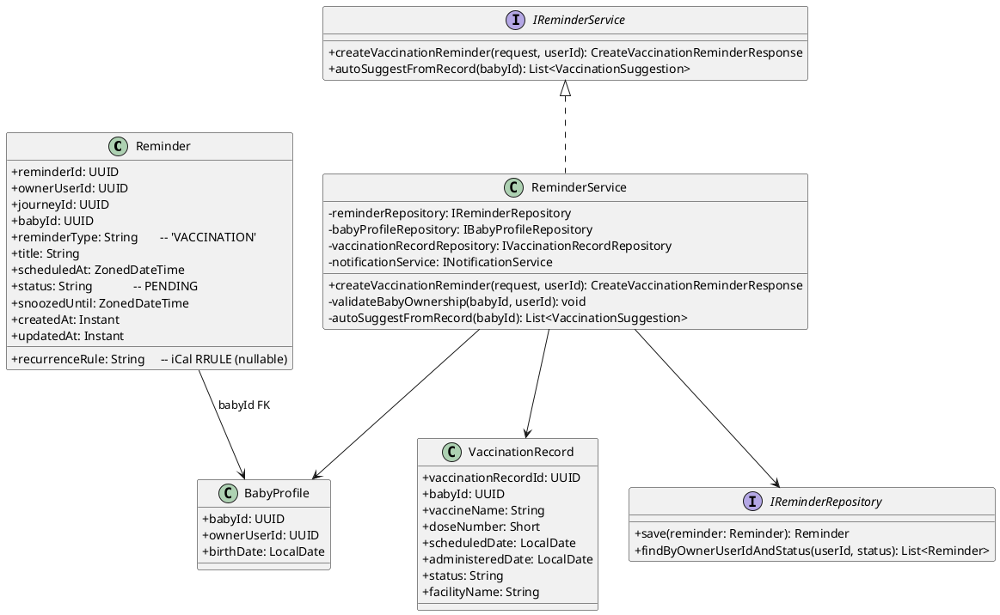
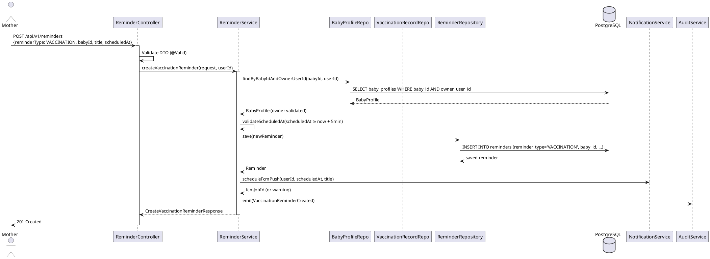
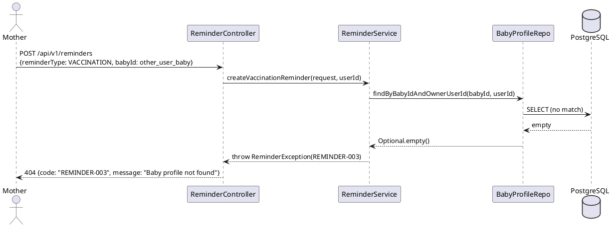
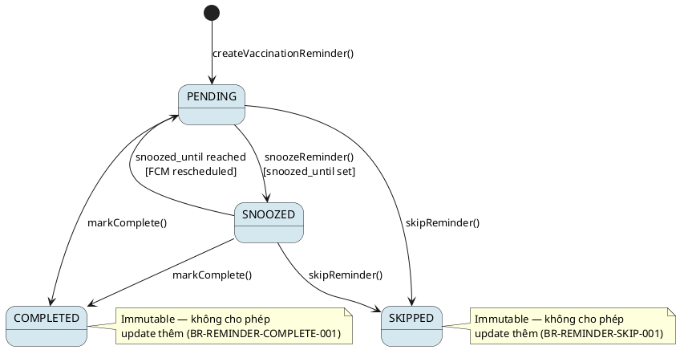

# ENGINEERING DOCUMENTATION STANDARD (EDS) v2.0
# Technical Design Specification — UC-47 Create Vaccination Reminder

| Field | Value |
|-------|-------|
| **Document ID** | `CB-REMINDER-IMP-002` |
| **Version** | `1.0` |
| **Date** | `2026-06-26` |
| **Status** | `Draft` |
| **Document Owner** | `PhuongNT` |
| **Author** | `AI Agent` |
| **Reviewed by** | `[Tech Lead]` |
| **DPO Sign-off** | `[ ] Pending` |
| **Approved by** | `[Principal Architect]` |
| **Last Review** | `2026-06-26` |
| **Based on EDS** | `v2.0` |

---

## CHANGELOG

| Ngày | Người thực hiện | Nội dung thay đổi |
|------|-----------------|-------------------|
| 2026-06-26 | AI Agent | Tạo tài liệu lần đầu cho UC-47 Create Vaccination Reminder |

---

## MỤC LỤC

1. [Tổng quan Module](#1-tổng-quan-module)
2. [Ma trận Truy vết](#2-ma-trận-truy-vết)
3. [Architecture Decision Records](#3-architecture-decision-records)
4. [Non-Functional Requirements & SLA](#4-non-functional-requirements--sla)
5. [Static Modeling](#5-static-modeling)
6. [Dynamic Modeling](#6-dynamic-modeling)
7. [Domain Event Catalog](#7-domain-event-catalog)
8. [Interface Specification](#8-interface-specification)
9. [API Specification](#9-api-specification)
10. [Bảng mã lỗi](#10-bảng-mã-lỗi)
11. [Quy trình Triển khai](#11-quy-trình-triển-khai)
12. [Rollback & Incident Runbook](#12-rollback--incident-runbook)
13. [Kịch bản Kiểm thử](#13-kịch-bản-kiểm-thử)
14. [Phương pháp Xác minh](#14-phương-pháp-xác-minh)
15. [Mẫu thử thực tế](#15-mẫu-thử-thực-tế)
16. [Authorization Matrix](#16-authorization-matrix)
17. [AI Prompt Constraints (CASE 2.0)](#17-ai-prompt-constraints-case-20)

---

## 1. Tổng quan Module

| Field | Value |
|-------|-------|
| **Module Name** | `CreateVaccinationReminder` |
| **Bounded Context** | `reminder` |
| **UC ID** | `UC-47` |
| **SRS Reference** | `3.3.1.24` |
| **Primary Actor** | `Mother (ROLE_MOTHER)` |
| **Secondary Actors** | `Firebase Cloud Messaging` |
| **Platform** | `Mobile App` |
| **Data Classification** | `PII` |
| **Compliance Scope** | `BR-RBAC, BR-VAC-001, BR-VAC-002, BR-VAC-003, BR-SAFETY` |
| **Upstream Dependencies** | `auth, baby_profiles, vaccination_records, notification (FCM)` |
| **Downstream Consumers** | `reminder detail (UC-212), today tasks (UC-49), notification delivery, audit` |

**Mô tả:** Mother tạo nhắc nhở tiêm chủng cho em bé dựa theo lịch tiêm chủng quốc gia (EPI) hoặc ngày đặt lịch từ `vaccination_records`. Hệ thống tạo reminder với `reminder_type = 'VACCINATION'`, liên kết `baby_id`, lên lịch FCM push notification tại `scheduled_at`, và ghi audit event. CareBridge **không** tự kê đơn hoặc chỉ định vaccine — chỉ nhắc theo lịch tham chiếu.

---

## 2. Ma trận Truy vết

| Requirement ID | Loại | Mô tả | Thành phần Code | Compliance Target | ADR liên quan |
|----------------|------|-------|-----------------|-------------------|---------------|
| UC-47 | Use Case | Mother tạo vaccination reminder | `ReminderController.createReminder()` | BR-RBAC | ADR-REM-VAC-001 |
| BR-VAC-001 | Business Rule | reminder_type phải là `VACCINATION`; phải liên kết baby_id hợp lệ | `ReminderService.validateVaccinationReminder()` | Data Integrity | ADR-REM-VAC-001 |
| BR-VAC-002 | Business Rule | Lịch tiêm dựa theo ngày sinh của baby (EPI schedule) | `VaccinationScheduleService.getSuggestedDate()` | BR-SAFETY | — |
| BR-VAC-003 | Business Rule | Auto-suggest scheduledAt từ `vaccination_records.scheduled_date` nếu tồn tại | `ReminderService.autoSuggestFromRecord()` | Data Integrity | — |
| BR-RBAC | Business Rule | Mother chỉ truy cập reminder của chính mình | `ReminderService` (owner check) | Data Privacy | — |
| BR-SAFETY | Business Rule | Hệ thống không chẩn đoán hoặc kê đơn vaccine | Tất cả response chỉ chứa reminder, không có diagnosis | PDPA | ADR-REM-VAC-001 |

---

## 3. Architecture Decision Records

### ADR-REM-VAC-001 — VACCINATION reminder phải liên kết baby_id; hệ thống không tự kê vaccine

| Field | Value |
|-------|-------|
| **Status** | `Accepted` |
| **Deciders** | `AI Agent — Tech Lead` |
| **Date** | `2026-06-26` |

#### Bối cảnh

Reminder tiêm chủng là thông tin y tế nhạy cảm liên quan đến trẻ em. Cần đảm bảo (1) reminder luôn gắn với baby profile hợp lệ (data integrity), và (2) hệ thống chỉ đóng vai trò nhắc nhở, không đưa ra khuyến nghị y tế.

#### Các phương án đã xem xét

| Phương án | Mô tả | Ưu điểm | Nhược điểm |
|-----------|-------|----------|------------|
| A | Tạo reminder tự do, không yêu cầu baby_id | Đơn giản hơn | Không trace được baby; vi phạm BR-VAC-001 |
| B | Bắt buộc baby_id + validate qua baby_profiles; không kê đơn | Đảm bảo traceability + safety | Phức tạp hơn một chút |

#### Quyết định

Chọn **Phương án B** — bắt buộc `baby_id` hợp lệ thuộc sở hữu của mother; hệ thống không bao giờ trả về recommendation y tế.

#### Hệ quả

**Tích cực:**
- Toàn vẹn dữ liệu: mọi vaccination reminder đều trace được đến baby profile.
- An toàn y tế: CareBridge không vi phạm BR-SAFETY.

**Tiêu cực / Trade-offs:**
- Mother phải tạo baby profile trước — giảm thiểu bằng onboarding flow.

**Compliance Impact:**
- Tuân thủ PDPA về dữ liệu sức khỏe trẻ em.

---

## 4. Non-Functional Requirements & SLA

### 4.1. Performance & Availability

| Category | Requirement | Target SLA |
|----------|-------------|------------|
| Latency (p99) | API response | `< 300ms` |
| FCM scheduling | Delay từ create đến first push | `≤ 1 phút` |
| Availability | Uptime | `99.9%` |

### 4.2. Data Integrity & Retention

| Category | Requirement | Target |
|----------|-------------|--------|
| Durability | Không mất reminder sau khi tạo | RPO = 0 |
| Consistency | baby_id luôn hợp lệ | FK constraint |

### 4.3. Security

| Category | Requirement | Target |
|----------|-------------|--------|
| Access control | Mother chỉ tạo reminder cho baby của mình | BR-RBAC |
| Encryption in transit | Tất cả endpoints | TLS 1.3+ |

### 4.4. Scalability & Capacity Planning

Dự kiến tải: mỗi baby có ~10 vaccination reminder trong 2 năm đầu. Scale theo số lượng active mother users trên nền tảng.

---

## 5. Static Modeling

### 5.1. Class Diagram



### 5.2. Data Structure (Flyway SQL Migration)

Schema đã tồn tại trong `V1__init_schema.sql`. Không cần migration mới.

```sql
-- Tham chiếu từ V1__init_schema.sql (source of truth)
-- reminders table:
--   reminder_id     uuid         NOT NULL DEFAULT gen_random_uuid()
--   owner_user_id   uuid         NOT NULL  → FK users
--   journey_id      uuid                   → FK mother_journeys (nullable)
--   baby_id         uuid                   → FK baby_profiles (bắt buộc cho VACCINATION)
--   reminder_type   varchar(50)  NOT NULL  → phải là 'VACCINATION'
--   title           varchar(255) NOT NULL
--   scheduled_at    timestamptz  NOT NULL
--   recurrence_rule varchar(100)           → iCal RRULE (nullable)
--   status          varchar(20)  NOT NULL DEFAULT 'PENDING'
--   snoozed_until   timestamptz            (nullable)
--   created_at      timestamptz  NOT NULL DEFAULT now()
--   updated_at      timestamptz  NOT NULL DEFAULT now()

-- vaccination_records table (dùng để auto-suggest):
--   vaccination_record_id uuid    NOT NULL DEFAULT gen_random_uuid()
--   baby_id               uuid    NOT NULL → FK baby_profiles
--   vaccine_name          varchar(200) NOT NULL
--   dose_number           smallint
--   scheduled_date        date
--   status                varchar(20) NOT NULL DEFAULT 'SCHEDULED'
```

> **Lưu ý:** `baby_id` là bắt buộc (NOT NULL logic tại application layer) khi `reminder_type = 'VACCINATION'`.

---

## 6. Dynamic Modeling

### 6.1. Sequence Diagram — Happy Path



### 6.2. Sequence Diagram — Error Path (baby không thuộc sở hữu)



### 6.3. State Machine — Reminder Status



> **Invariant bất biến:**
> - `COMPLETED` và `SKIPPED` là trạng thái cuối — không thể chuyển sang trạng thái khác.
> - `reminder_type` không được thay đổi sau khi tạo.
> - `baby_id` không được thay đổi sau khi tạo.

---

## 7. Domain Event Catalog

### 7.1. Events Published

| Event Name | Trigger | Publisher | Subscriber(s) | Async? |
|------------|---------|-----------|---------------|--------|
| `VaccinationReminderCreated` | Reminder saved với type VACCINATION | `ReminderService` | `AuditService, NotificationService` | No |

### 7.2. Events Consumed

| Event Name | Source | Handler | Action |
|------------|--------|---------|--------|
| `ReminderDue` | `NotificationService (FCM scheduler)` | `ReminderService` | Gửi push notification đến Mother |

### 7.3. Payload Schema

```java
// VaccinationReminderCreated.java
public record VaccinationReminderCreated(
    UUID    eventId,
    String  eventType,     // "VaccinationReminderCreated"
    Instant occurredAt,
    String  version,       // "1.0"
    Payload payload,
    Metadata metadata
) {
    public record Payload(
        UUID   reminderId,
        UUID   ownerUserId,
        UUID   babyId,
        String title,
        Instant scheduledAt
    ) {}

    public record Metadata(
        UUID   correlationId,
        String causedBy      // userId
    ) {}
}
```

---

## 8. Interface Specification

### 8.1. Service Interface

```java
// CreateVaccinationReminderRequest.java
// @version 1.0
public class CreateVaccinationReminderRequest {

    @NotNull
    private ReminderType reminderType; // phải là VACCINATION

    @NotNull
    private UUID babyId;               // baby phải thuộc sở hữu của mother

    @NotBlank @Size(max = 255)
    private String title;

    @NotNull
    @Future
    private ZonedDateTime scheduledAt; // ≥ now + 5 phút

    @Size(max = 100)
    private String recurrenceRule;     // iCal RRULE — nullable

    // optional: gợi ý từ vaccination_records
    private UUID vaccinationRecordId;
}

// CreateVaccinationReminderResponse.java
public class CreateVaccinationReminderResponse {
    private UUID    reminderId;
    private UUID    babyId;
    private String  reminderType;    // "VACCINATION"
    private String  title;
    private ZonedDateTime scheduledAt;
    private String  recurrenceRule;
    private String  status;          // "PENDING"
    private Instant createdAt;
    private Boolean fcmScheduled;    // true nếu FCM job đã được đặt
}

// IReminderService.java (method bổ sung)
// @version 1.0
public interface IReminderService {
    /**
     * Tạo vaccination reminder cho baby.
     * @throws ReminderException (REMINDER-003) khi babyId không thuộc ownerUserId
     * @throws ReminderException (REMINDER-002) khi scheduledAt < now + 5 phút
     * @throws ReminderException (REMINDER-001) khi dữ liệu đầu vào không hợp lệ
     */
    CreateVaccinationReminderResponse createVaccinationReminder(
        CreateVaccinationReminderRequest request, UUID ownerUserId);

    /**
     * Gợi ý thời gian tiêm từ vaccination_records.scheduled_date.
     */
    List<VaccinationSuggestion> autoSuggestFromRecord(UUID babyId, UUID ownerUserId);
}
```

### 8.2. Repository Interface

```java
// IReminderRepository.java
// @version 1.0
public interface IReminderRepository extends JpaRepository<Reminder, UUID> {
    Optional<Reminder> findByReminderIdAndOwnerUserId(UUID reminderId, UUID ownerUserId);
    List<Reminder> findByOwnerUserIdAndReminderTypeAndStatus(
        UUID ownerUserId, String reminderType, String status);
}

// IBabyProfileRepository.java (existing — dùng để validate ownership)
public interface IBabyProfileRepository extends JpaRepository<BabyProfile, UUID> {
    Optional<BabyProfile> findByBabyIdAndOwnerUserId(UUID babyId, UUID ownerUserId);
}
```

---

## 9. API Specification

### 9.1. Endpoints Table

| Method | Path | Auth Level | Required Roles | Rate Limit | Idempotent? |
|--------|------|------------|----------------|------------|-------------|
| `POST` | `/api/v1/reminders` | JWT Bearer | `ROLE_MOTHER` | 20/min | No |
| `GET` | `/api/v1/reminders/vaccination/suggestions` | JWT Bearer | `ROLE_MOTHER` | 60/min | Yes |

### 9.2. Request / Response Schemas

#### `POST /api/v1/reminders` — Tạo vaccination reminder

**Request Body:**
```json
{
  "reminderType": "VACCINATION",
  "babyId": "550e8400-e29b-41d4-a716-446655440001",
  "title": "Tiêm vắc-xin 5 trong 1 — Mũi 1",
  "scheduledAt": "2026-07-20T08:00:00+07:00",
  "recurrenceRule": null,
  "vaccinationRecordId": "550e8400-e29b-41d4-a716-446655440010"
}
```

**Response — 201 Created:**
```json
{
  "reminderId": "550e8400-e29b-41d4-a716-446655440099",
  "babyId": "550e8400-e29b-41d4-a716-446655440001",
  "reminderType": "VACCINATION",
  "title": "Tiêm vắc-xin 5 trong 1 — Mũi 1",
  "scheduledAt": "2026-07-20T08:00:00+07:00",
  "recurrenceRule": null,
  "status": "PENDING",
  "createdAt": "2026-06-26T00:00:00.000Z",
  "fcmScheduled": true
}
```

**Response — 400 Bad Request:**
```json
{
  "error": {
    "code": "REMINDER-001",
    "message": "Dữ liệu không hợp lệ",
    "details": [
      { "field": "babyId", "message": "babyId is required for VACCINATION reminders" }
    ]
  }
}
```

**Response — 404 Not Found:**
```json
{
  "error": {
    "code": "REMINDER-003",
    "message": "Baby profile not found or not owned by user"
  }
}
```

#### `GET /api/v1/reminders/vaccination/suggestions` — Gợi ý từ vaccination_records

**Query Params:** `?babyId={uuid}`

**Response — 200 OK:**
```json
{
  "suggestions": [
    {
      "vaccineName": "Vắc-xin 5 trong 1",
      "doseNumber": 1,
      "suggestedDate": "2026-07-20",
      "vaccinationRecordId": "550e8400-e29b-41d4-a716-446655440010"
    }
  ]
}
```

---

## 10. Bảng mã lỗi

| Code | HTTP Status | Message (EN) | Message (VI) | Trigger Condition |
|------|-------------|--------------|--------------|-------------------|
| `REMINDER-001` | 400 | Validation failed | Dữ liệu không hợp lệ | Missing required fields hoặc reminderType không phải VACCINATION |
| `REMINDER-002` | 400 | Scheduled time too soon | Thời gian đặt lịch quá gần | scheduledAt < now + 5 phút |
| `REMINDER-003` | 404 | Baby profile not found | Không tìm thấy hồ sơ em bé | babyId không tồn tại hoặc không thuộc owner |
| `REMINDER-004` | 403 | Insufficient permissions | Không đủ quyền | Non-MOTHER role |
| `REMINDER-005` | 500 | Internal error | Lỗi hệ thống | DB hoặc FCM error không mong đợi |

---

## 11. Quy trình Triển khai

### 11.1. Prerequisites

- [ ] ADR-REM-VAC-001 đã được Accepted
- [ ] `V1__init_schema.sql` xác nhận `reminders` và `vaccination_records` tables tồn tại
- [ ] Firebase FCM credentials đã được cấu hình trong environment

### 11.2. Pre-Migration Checklist

- [ ] Không cần Flyway migration mới (schema đã có trong V1)
- [ ] Xác nhận FK `baby_id → baby_profiles` tồn tại

### 11.3. Implementation Steps

#### Chặng 1 — Entity & Repository

```java
// Reminder.java (entity dùng schema hiện có)
// Trường baby_id ánh xạ tới column baby_id — BẮT BUỘC khi type = VACCINATION

// IBabyProfileRepository — đã tồn tại; thêm method findByBabyIdAndOwnerUserId nếu chưa có
```

#### Chặng 2 — Service

```java
// ReminderService.createVaccinationReminder()
// 1. Validate request DTO
// 2. Validate babyId ownership (baby_profiles.owner_user_id == ownerUserId)
// 3. Validate scheduledAt >= now + 5min
// 4. Build và save Reminder entity (type=VACCINATION, status=PENDING)
// 5. Schedule FCM push (async — không block save)
// 6. Emit VaccinationReminderCreated event
// 7. Return response DTO
```

#### Chặng 3 — Controller

```java
// ReminderController.java
// POST /api/v1/reminders  → delegate tới createVaccinationReminder nếu type=VACCINATION
// GET /api/v1/reminders/vaccination/suggestions?babyId=...
```

#### Chặng 4 — Verification sau deploy

```bash
curl -X GET https://[host]/actuator/health
# Expected: {"status":"UP"}
```

### 11.4. Deployment Checklist

- [ ] Unit tests xanh: `./mvnw test -pl :carebridge-api -Dtest=VaccinationReminderServiceTest`
- [ ] Integration test xanh với Testcontainers
- [ ] Health check endpoint trả về 200
- [ ] FCM scheduling hoạt động trong staging environment

---

## 12. Rollback & Incident Runbook

### 12.1. Điều kiện kích hoạt Rollback

| Điều kiện | Ngưỡng | Người quyết định |
|-----------|--------|------------------|
| Error rate tăng đột biến | > 5% trong 5 phút | On-call Engineer |
| Latency p99 vượt ngưỡng | > 600ms | On-call Engineer |
| FCM schedule failure rate | > 10% trong 10 phút | Tech Lead |

### 12.2. Rollback Procedure

```bash
# Không có migration mới → chỉ rollback code
kubectl rollout undo deployment/carebridge-api
kubectl rollout status deployment/carebridge-api
curl -X GET https://[host]/actuator/health
```

### 12.3. Notification Protocol

| Thời điểm | Người nhận | Kênh |
|-----------|------------|------|
| Ngay khi phát hiện | On-call team | Slack `#incident` |
| Trong 30 phút | DPO (nếu PII bị ảnh hưởng) | Email |

### 12.4. Post-Incident Review

Hoàn thành PIR trong vòng 48 giờ. Điều tra root cause 5 Whys.

---

## 13. Kịch bản Kiểm thử

### 13.1. Unit Tests

```gherkin
Feature: Create Vaccination Reminder

  Background:
    Given test data classification: SYNTHETIC
    And Mother authenticated với userId = "user-001"
    And BabyProfile tồn tại với babyId = "baby-001" owned by "user-001"

  Scenario: Happy path — tạo vaccination reminder thành công
    Given vaccinationRecord "vac-001" thuộc baby-001 có scheduledDate = 2026-07-20
    When POST /api/v1/reminders với reminderType=VACCINATION, babyId=baby-001, scheduledAt=2026-07-20T08:00+07:00
    Then response status 201
    And reminder được lưu với status=PENDING, type=VACCINATION, baby_id=baby-001
    And FCM notification được schedule tại scheduledAt
    And audit log chứa VaccinationReminderCreated

  Scenario: babyId không thuộc owner → 404
    Given BabyProfile "baby-999" thuộc user khác
    When POST /api/v1/reminders với babyId=baby-999
    Then response status 404
    And error code = "REMINDER-003"

  Scenario: scheduledAt trong quá khứ → 400
    When POST với scheduledAt = 1 ngày trước
    Then response status 400
    And error code = "REMINDER-002"

  Scenario: reminderType không phải VACCINATION → 400
    When POST với reminderType = "APPOINTMENT"
    Then response status 400 (endpoint này chỉ chấp nhận VACCINATION flow)

  Scenario: babyId null → 400
    When POST với babyId = null
    Then response status 400
    And details chứa field "babyId"
```

### 13.2. Integration Tests

```gherkin
  Scenario: Full flow với Testcontainers PostgreSQL
    Given test data classification: SYNTHETIC
    And PostgreSQL container running với Flyway migration applied
    And seed: User "user-001", BabyProfile "baby-001", VaccinationRecord "vac-001"
    When ReminderService.createVaccinationReminder() được gọi
    Then reminders table chứa 1 row mới với reminder_type='VACCINATION', baby_id='baby-001'
    And row status = 'PENDING'
```

### 13.3. Security Tests

```gherkin
  Scenario: Unauthorized — không có JWT
    When POST /api/v1/reminders không có Authorization header
    Then response status 401

  Scenario: ROLE không phải MOTHER
    Given user với ROLE_EXPERT
    When POST /api/v1/reminders
    Then response status 403, error code REMINDER-004

  Scenario: Mother cố tạo reminder cho baby của user khác
    Given babyId thuộc user khác
    When POST với babyId đó
    Then response status 404, error code REMINDER-003
    And DB không có record mới
```

---

## 14. Phương pháp Xác minh

### 14.1. Database Inspection

```sql
-- Verify reminder tồn tại sau khi tạo
SELECT reminder_id, owner_user_id, baby_id, reminder_type, status, scheduled_at
FROM reminders
WHERE reminder_id = '[uuid]';
-- Expected: 1 row, reminder_type='VACCINATION', status='PENDING'

-- Verify baby_id ownership
SELECT b.baby_id, b.owner_user_id
FROM reminders r
JOIN baby_profiles b ON r.baby_id = b.baby_id
WHERE r.reminder_id = '[uuid]';
-- Expected: owner_user_id khớp với userId của mother
```

### 14.2. Log / Audit Verification

```bash
kubectl logs -l app=carebridge-api | grep '"eventType":"VaccinationReminderCreated"' | head -5
kubectl logs -l app=carebridge-api | grep -i "password\|secret\|ssn"
# Expected: No output (no PII leak)
```

### 14.3. Tool-based Verification

```bash
# Verify TLS
openssl s_client -connect [host]:443 -tls1_3 2>&1 | grep "Protocol"
# Expected: Protocol  : TLSv1.3
```

---

## 15. Mẫu thử thực tế

### 15.1. Happy Path

```bash
curl -X POST https://[host]/api/v1/reminders \
  -H "Authorization: Bearer [JWT_MOTHER_TOKEN]" \
  -H "Content-Type: application/json" \
  -H "X-Correlation-Id: $(uuidgen)" \
  -d '{
    "reminderType": "VACCINATION",
    "babyId": "550e8400-e29b-41d4-a716-446655440001",
    "title": "Tiêm vắc-xin 5 trong 1 — Mũi 1",
    "scheduledAt": "2026-07-20T08:00:00+07:00",
    "recurrenceRule": null
  }'
```

**Expected Response (201):**
```json
{
  "reminderId": "uuid-v4",
  "babyId": "550e8400-e29b-41d4-a716-446655440001",
  "reminderType": "VACCINATION",
  "title": "Tiêm vắc-xin 5 trong 1 — Mũi 1",
  "scheduledAt": "2026-07-20T08:00:00+07:00",
  "status": "PENDING",
  "createdAt": "2026-06-26T00:00:00.000Z",
  "fcmScheduled": true
}
```

### 15.2. Error Paths

```bash
# babyId không hợp lệ → 404
curl -X POST https://[host]/api/v1/reminders \
  -H "Authorization: Bearer [JWT_MOTHER_TOKEN]" \
  -H "Content-Type: application/json" \
  -d '{"reminderType": "VACCINATION", "babyId": "00000000-0000-0000-0000-000000000000", "title": "Test", "scheduledAt": "2026-07-20T08:00:00+07:00"}'
```

**Expected Response (404):**
```json
{
  "error": {
    "code": "REMINDER-003",
    "message": "Baby profile not found or not owned by user"
  }
}
```

---

## 16. Authorization Matrix

| Endpoint | `GUEST` | `ROLE_MOTHER` | `ROLE_EXPERT` | `ROLE_ADMIN` | `SYSTEM` |
|----------|---------|---------------|---------------|--------------|----------|
| `POST /api/v1/reminders` (VACCINATION) | ❌ | ✅ Own | ❌ | ✅ All | ✅ |
| `GET /api/v1/reminders/vaccination/suggestions` | ❌ | ✅ Own | ❌ | ✅ All | ✅ |

**Chú thích:**
- `Own` = Chỉ được phép với reminder và baby profile của chính mình
- ❌ = Bị từ chối (403 hoặc 401)

---

## 17. AI Prompt Constraints (CASE 2.0)

### 17.1 Constraint Summary Table

| # | Constraint | Source | Last Verified |
|---|-----------|--------|---------------|
| C1 | `reminder_type` PHẢI là `'VACCINATION'`; không chấp nhận giá trị khác trong flow này | BR-VAC-001 | 2026-06-26 |
| C2 | `baby_id` là bắt buộc; PHẢI validate `baby_profiles.owner_user_id == ownerUserId` trước khi save | BR-VAC-001, BR-RBAC | 2026-06-26 |
| C3 | Hệ thống KHÔNG ĐƯỢC trả về khuyến nghị y tế; chỉ nhắc nhở theo lịch tham chiếu | BR-SAFETY | 2026-06-26 |
| C4 | `ownerUserId` PHẢI lấy từ JWT claim, không nhận từ request body | BR-RBAC | 2026-06-26 |
| C5 | Business logic nằm hoàn toàn trong `ReminderService`; Controller chỉ validate DTO và map response | CLAUDE.md Architecture | 2026-06-26 |

### 17.2 Constraint Injection Block

```
[CONSTRAINT BLOCK — Module: CreateVaccinationReminder]
Theo TDS CB-REMINDER-IMP-002 và các ADR liên quan:

1. reminder_type PHẢI được set = 'VACCINATION' — không nhận giá trị khác.
2. baby_id là bắt buộc; phải validate baby_profiles.owner_user_id == JWT userId trước khi save.
3. Hệ thống không trả về khuyến nghị y tế — chỉ lưu và nhắc nhở theo scheduledAt do mother cung cấp.
4. ownerUserId lấy từ JWT claim (SecurityContext), không bao giờ từ request body.
5. Business logic (validate, save, schedule FCM) nằm trong ReminderService — Controller chỉ validate DTO.

[CONTEXT BLOCK]
- Bounded Context: reminder
- Data Classification: PII
- Compliance: BR-RBAC, BR-VAC-001, BR-SAFETY
- Existing interfaces: §8 Service Interface + §8.2 Repository Interface
- Error codes: §10 Error Codes Table
- Auth matrix: §16 Authorization Matrix

[TASK BLOCK]
Implement createVaccinationReminder() thỏa mãn constraints trên.
Output phải tuân thủ §8 Interface Specification.
Tests phải cover §13 Test Scenarios.
```

### 17.3 Constraint Quality Checklist

- [x] Mỗi constraint traceable về ADR hoặc BR cụ thể
- [x] Không có constraint generic
- [x] Mỗi constraint có Last Verified date ≤ 2 sprints
- [x] Constraint block có ≥ 5 constraints cụ thể
- [x] Constraint block reference §8 Interface
- [x] Constraint block reference §16 Auth Matrix

### 17.4 Anti-Pattern Detection

| AP-ID | Anti-Pattern | Dấu hiệu | Hành động |
|-------|-------------|-----------|----------|
| AP-AI-001 | Unconstrained Gen | Code không check baby ownership | Reject — thêm validateBabyOwnership() |
| AP-AI-003 | Implicit Decision | Code tự quyết FCM scheduling mà không theo ADR-REM-VAC-001 | Reject — follow ADR |
| AP-AI-005 | Hallucinated Contract | Code import service không có trong §8 | Reject — verify contract |

---

## PHỤ LỤC

### A. Glossary

| Thuật ngữ | Định nghĩa |
|-----------|------------|
| EPI Schedule | Expanded Programme on Immunization — Lịch tiêm chủng mở rộng quốc gia Việt Nam |
| FCM | Firebase Cloud Messaging — dịch vụ push notification |
| VACCINATION reminder | Nhắc nhở tiêm chủng; reminder_type='VACCINATION' trong DB |
| Baby Profile | Hồ sơ em bé trong bảng `baby_profiles` |
| BR-SAFETY | Quy tắc: CareBridge không chẩn đoán, không kê đơn, không trì hoãn emergency routing |

### B. Tài liệu tham chiếu

| Document | Path |
|----------|------|
| Database Schema | `05_Development/CareBridgeAPI/src/main/resources/db/migration/V1__init_schema.sql` |
| UC-45 TDS (Appointment Reminder) | `04_Implement/UC45_CreateAppointmentReminder/UC45_CreateAppointmentReminder_TDS.md` |
| UC-46 TDS (Medication Reminder) | `04_Implement/UC46_CreateMedicationReminder/` |
| SRS | `01_Requirements/SRS.md` §3.3.1.24 |
