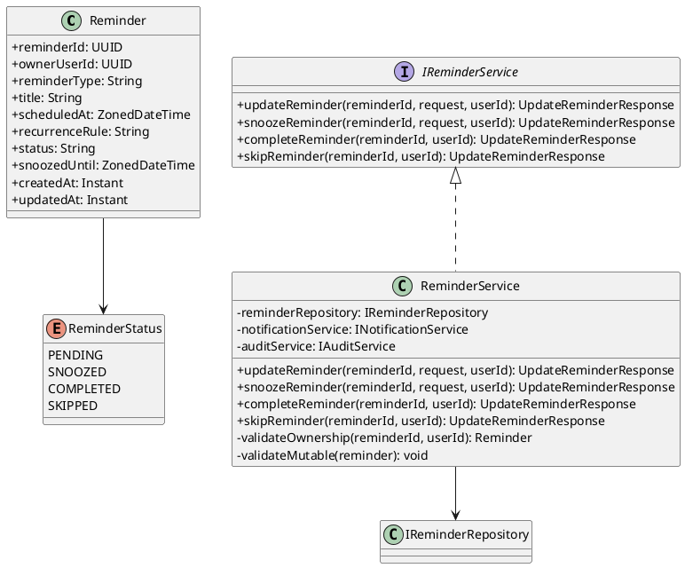
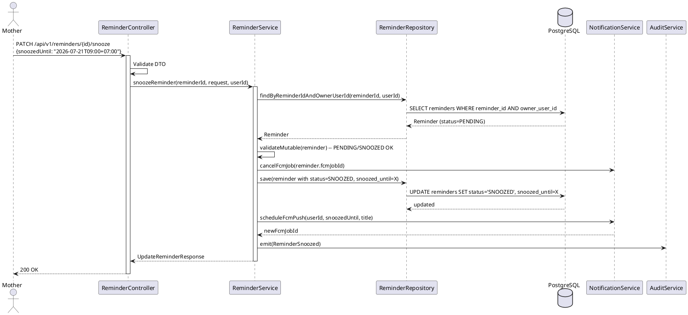
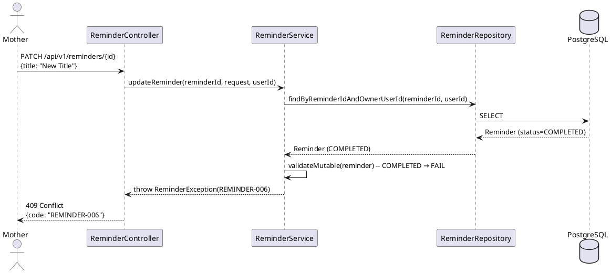
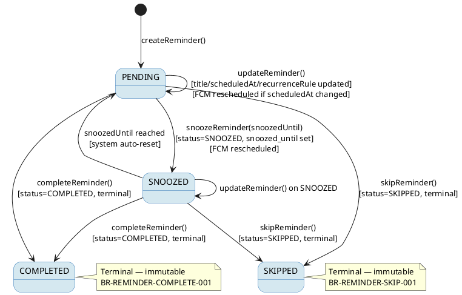

# ENGINEERING DOCUMENTATION STANDARD (EDS) v2.0
# Technical Design Specification — UC-48 Update or Snooze Reminder

| Field | Value |
|-------|-------|
| **Document ID** | `CB-REMINDER-IMP-003` |
| **Version** | `1.0` |
| **Date** | `2026-06-26` |
| **Status** | `Implemented` |
| **Document Owner** | `PhuongNT` |
| **Author** | `AI Agent` |
| **Reviewed by** | `[Tech Lead]` |
| **DPO Sign-off** | `[ ] Pending` |
| **Approved by** | `[Principal Architect]` |
| **Last Review** | `2026-06-26` |
| **Based on EDS** | `v2.0` |

---

## CHANGELOG

| Ngày | Người thực hiện | Nội dung thay đổi |
|------|-----------------|-------------------|
| 2026-06-26 | AI Agent | Tạo tài liệu lần đầu cho UC-48 Update or Snooze Reminder |
| 2026-07-05 | AI Agent — Amelia (Dev Agent) | Implemented: updateReminder(), snoozeReminder(), completeReminder(), skipReminder() in ReminderServiceImpl; ADR-REM-STATE-001 terminal-state guard (REM-007/409); REM-005/REM-008 snooze validation; FCM job cancel on state transitions; PATCH endpoints /reminders/{id}, /snooze, /complete, /skip; 11/11 unit tests GREEN |

---

## MỤC LỤC

1. [Tổng quan Module](#1-tổng-quan-module)
2. [Ma trận Truy vết](#2-ma-trận-truy-vết)
3. [Architecture Decision Records](#3-architecture-decision-records)
4. [Non-Functional Requirements & SLA](#4-non-functional-requirements--sla)
5. [Static Modeling](#5-static-modeling)
6. [Dynamic Modeling](#6-dynamic-modeling)
7. [Domain Event Catalog](#7-domain-event-catalog)
8. [Interface Specification](#8-interface-specification)
9. [API Specification](#9-api-specification)
10. [Bảng mã lỗi](#10-bảng-mã-lỗi)
11. [Quy trình Triển khai](#11-quy-trình-triển-khai)
12. [Rollback & Incident Runbook](#12-rollback--incident-runbook)
13. [Kịch bản Kiểm thử](#13-kịch-bản-kiểm-thử)
14. [Phương pháp Xác minh](#14-phương-pháp-xác-minh)
15. [Mẫu thử thực tế](#15-mẫu-thử-thực-tế)
16. [Authorization Matrix](#16-authorization-matrix)
17. [AI Prompt Constraints (CASE 2.0)](#17-ai-prompt-constraints-case-20)

---

## 1. Tổng quan Module

| Field | Value |
|-------|-------|
| **Module Name** | `UpdateOrSnoozeReminder` |
| **Bounded Context** | `reminder` |
| **UC ID** | `UC-48` |
| **SRS Reference** | `3.3.1.25` |
| **Primary Actor** | `Mother (ROLE_MOTHER)` |
| **Secondary Actors** | `Firebase Cloud Messaging` |
| **Platform** | `Mobile App` |
| **Data Classification** | `PII` |
| **Compliance Scope** | `BR-RBAC, BR-REMINDER-UPDATE-001, BR-REMINDER-SNOOZE-001, BR-REMINDER-COMPLETE-001, BR-REMINDER-SKIP-001` |
| **Upstream Dependencies** | `auth, reminders, notification (FCM)` |
| **Downstream Consumers** | `UC-49 ViewTodayTasks, UC-212 ViewReminderDetail, notification delivery, audit` |

**Mô tả:** Mother có thể thực hiện các thao tác sau trên reminder đang ở trạng thái `PENDING` hoặc `SNOOZED`:
1. **Update** — thay đổi `title`, `scheduled_at`, hoặc `recurrence_rule`
2. **Snooze** — tạm hoãn reminder, đặt `status=SNOOZED`, `snoozed_until`, và reschedule FCM
3. **Complete** — đánh dấu hoàn thành, `status=COMPLETED`
4. **Skip** — bỏ qua, `status=SKIPPED`

Reminder ở trạng thái `COMPLETED` hoặc `SKIPPED` là **immutable** — không cho phép thay đổi bất kỳ field nào.

---

## 2. Ma trận Truy vết

| Requirement ID | Loại | Mô tả | Thành phần Code | Compliance Target | ADR liên quan |
|----------------|------|-------|-----------------|-------------------|---------------|
| UC-48 | Use Case | Mother update/snooze/complete/skip reminder | `ReminderController.updateReminder()` | BR-RBAC | ADR-REM-STATE-001 |
| BR-REMINDER-UPDATE-001 | Business Rule | Chỉ update PENDING/SNOOZED; COMPLETED/SKIPPED là immutable | `ReminderService.validateMutable()` | Data Integrity | ADR-REM-STATE-001 |
| BR-REMINDER-SNOOZE-001 | Business Rule | Snooze → status=SNOOZED, snoozed_until set, FCM reschedule | `ReminderService.snoozeReminder()` | — | ADR-REM-STATE-001 |
| BR-REMINDER-COMPLETE-001 | Business Rule | Complete → status=COMPLETED (terminal) | `ReminderService.completeReminder()` | — | ADR-REM-STATE-001 |
| BR-REMINDER-SKIP-001 | Business Rule | Skip → status=SKIPPED (terminal) | `ReminderService.skipReminder()` | — | ADR-REM-STATE-001 |
| BR-RBAC | Business Rule | Mother chỉ update reminder của chính mình | owner check trong Service | Data Privacy | — |

---

## 3. Architecture Decision Records

### ADR-REM-STATE-001 — COMPLETED và SKIPPED là trạng thái terminal, immutable

| Field | Value |
|-------|-------|
| **Status** | `Accepted` |
| **Deciders** | `AI Agent — Tech Lead` |
| **Date** | `2026-06-26` |

#### Bối cảnh

Reminder tiêm chủng, thuốc, lịch hẹn sau khi được đánh dấu COMPLETED hoặc SKIPPED phản ánh hành động thực tế của người dùng. Cho phép thay đổi sau đó sẽ gây mâu thuẫn lịch sử chăm sóc và có thể ảnh hưởng đến audit trail y tế.

#### Các phương án đã xem xét

| Phương án | Mô tả | Ưu điểm | Nhược điểm |
|-----------|-------|----------|------------|
| A | Cho phép undo COMPLETED/SKIPPED | Linh hoạt hơn | Ảnh hưởng audit trail; phức tạp logic |
| B | COMPLETED và SKIPPED là immutable terminal states | Audit trail rõ ràng; đơn giản | Cần tạo reminder mới nếu muốn re-schedule |

#### Quyết định

Chọn **Phương án B** — `COMPLETED` và `SKIPPED` là immutable. Nếu cần re-schedule, Mother tạo reminder mới.

#### Hệ quả

**Tích cực:**
- Audit trail y tế toàn vẹn
- Logic đơn giản, không có transition ngược

**Tiêu cực / Trade-offs:**
- UX: Mother không thể "undo" — giảm thiểu bằng confirmation dialog trước khi complete/skip

---

### ADR-REM-FCM-002 — Snooze phải reschedule FCM notification

| Field | Value |
|-------|-------|
| **Status** | `Accepted` |
| **Date** | `2026-06-26` |

#### Quyết định

Khi snooze, service PHẢI: (1) cancel FCM job cũ, (2) schedule FCM job mới tại `snoozed_until`. Nếu FCM cancel/reschedule fail, reminder vẫn được update nhưng warning được log và trả về trong response.

---

## 4. Non-Functional Requirements & SLA

### 4.1. Performance & Availability

| Category | Requirement | Target SLA |
|----------|-------------|------------|
| Latency (p99) | API response | `< 300ms` |
| FCM reschedule | Delay từ snooze đến new push | `≤ 1 phút` |
| Availability | Uptime | `99.9%` |

### 4.2. Data Integrity & Retention

| Category | Requirement | Target |
|----------|-------------|--------|
| Immutability | COMPLETED/SKIPPED không thể thay đổi | Application-layer enforce |
| Consistency | status ↔ FCM job đồng bộ | Transactional |

### 4.3. Security

| Category | Requirement | Target |
|----------|-------------|--------|
| Access control | Mother chỉ update reminder của mình | BR-RBAC |
| Encryption in transit | Tất cả endpoints | TLS 1.3+ |

---

## 5. Static Modeling

### 5.1. Class Diagram



### 5.2. Data Structure

Schema đã tồn tại trong `V1__init_schema.sql`. Không cần migration mới.

```sql
-- Tham chiếu từ V1__init_schema.sql (source of truth)
-- reminders table:
--   reminder_id     uuid         NOT NULL  -- PK
--   owner_user_id   uuid         NOT NULL  -- FK users; dùng để validate ownership
--   reminder_type   varchar(50)  NOT NULL  -- không thay đổi sau khi tạo
--   title           varchar(255) NOT NULL  -- có thể update nếu PENDING/SNOOZED
--   scheduled_at    timestamptz  NOT NULL  -- có thể update nếu PENDING/SNOOZED
--   recurrence_rule varchar(100)           -- có thể update nếu PENDING/SNOOZED
--   status          varchar(20)  NOT NULL DEFAULT 'PENDING'
--       valid values: PENDING, SNOOZED, COMPLETED, SKIPPED
--   snoozed_until   timestamptz            -- set khi status → SNOOZED
--   updated_at      timestamptz  NOT NULL DEFAULT now()  -- set khi update
```

---

## 6. Dynamic Modeling

### 6.1. Sequence Diagram — Happy Path: Snooze



### 6.2. Sequence Diagram — Error Path: Update immutable reminder



### 6.3. State Machine — Reminder Status



> **Invariants bất biến:**
> - `COMPLETED` và `SKIPPED` không thể chuyển sang bất kỳ trạng thái nào khác.
> - `reminder_type` và `owner_user_id` không bao giờ được thay đổi.
> - Mọi thay đổi `scheduled_at` phải reschedule FCM.

---

## 7. Domain Event Catalog

### 7.1. Events Published

| Event Name | Trigger | Publisher | Subscriber(s) | Async? |
|------------|---------|-----------|---------------|--------|
| `ReminderUpdated` | title/scheduledAt/recurrenceRule changed | `ReminderService` | `AuditService` | No |
| `ReminderSnoozed` | status → SNOOZED | `ReminderService` | `AuditService, NotificationService` | No |
| `ReminderCompleted` | status → COMPLETED | `ReminderService` | `AuditService` | No |
| `ReminderSkipped` | status → SKIPPED | `ReminderService` | `AuditService` | No |

### 7.2. Payload Schema

```java
// ReminderStatusChanged.java (dùng cho SNOOZED, COMPLETED, SKIPPED)
public record ReminderStatusChanged(
    UUID    eventId,
    String  eventType,    // "ReminderSnoozed" | "ReminderCompleted" | "ReminderSkipped"
    Instant occurredAt,
    String  version,      // "1.0"
    Payload payload,
    Metadata metadata
) {
    public record Payload(
        UUID   reminderId,
        UUID   ownerUserId,
        String previousStatus,
        String newStatus,
        Instant snoozedUntil  // null nếu không phải SNOOZED
    ) {}

    public record Metadata(
        UUID   correlationId,
        String causedBy
    ) {}
}
```

---

## 8. Interface Specification

### 8.1. Service Interface

```java
// UpdateReminderRequest.java
// @version 1.0
public class UpdateReminderRequest {
    @Size(max = 255)
    private String title;           // optional — update nếu cung cấp

    private ZonedDateTime scheduledAt;  // optional — phải ≥ now+5min nếu cung cấp

    @Size(max = 100)
    private String recurrenceRule;  // optional — iCal RRULE
}

// SnoozeReminderRequest.java
public class SnoozeReminderRequest {
    @NotNull
    private ZonedDateTime snoozedUntil; // phải ở tương lai
}

// UpdateReminderResponse.java
public class UpdateReminderResponse {
    private UUID    reminderId;
    private String  reminderType;
    private String  title;
    private ZonedDateTime scheduledAt;
    private ZonedDateTime snoozedUntil; // null nếu không SNOOZED
    private String  status;
    private Instant updatedAt;
    private Boolean fcmRescheduled;     // true nếu FCM được reschedule
}

// IReminderService.java
// @version 1.0
public interface IReminderService {
    /**
     * Update title/scheduledAt/recurrenceRule cho reminder PENDING hoặc SNOOZED.
     * @throws ReminderException (REMINDER-003) khi reminder không tồn tại hoặc không thuộc owner
     * @throws ReminderException (REMINDER-006) khi reminder đã COMPLETED hoặc SKIPPED
     * @throws ReminderException (REMINDER-002) khi scheduledAt < now + 5 phút
     */
    UpdateReminderResponse updateReminder(UUID reminderId, UpdateReminderRequest request, UUID userId);

    /**
     * Snooze reminder — đặt status=SNOOZED, snoozed_until, reschedule FCM.
     * @throws ReminderException (REMINDER-003) khi không tìm thấy hoặc không phải owner
     * @throws ReminderException (REMINDER-006) khi đã COMPLETED hoặc SKIPPED
     */
    UpdateReminderResponse snoozeReminder(UUID reminderId, SnoozeReminderRequest request, UUID userId);

    /**
     * Đánh dấu hoàn thành — status=COMPLETED (terminal).
     * @throws ReminderException (REMINDER-006) khi đã COMPLETED hoặc SKIPPED
     */
    UpdateReminderResponse completeReminder(UUID reminderId, UUID userId);

    /**
     * Bỏ qua — status=SKIPPED (terminal).
     * @throws ReminderException (REMINDER-006) khi đã COMPLETED hoặc SKIPPED
     */
    UpdateReminderResponse skipReminder(UUID reminderId, UUID userId);
}
```

### 8.2. Repository Interface

```java
// IReminderRepository.java
// @version 1.0
public interface IReminderRepository extends JpaRepository<Reminder, UUID> {
    Optional<Reminder> findByReminderIdAndOwnerUserId(UUID reminderId, UUID ownerUserId);
    // Không dùng delete() — append-only audit trail
}
```

---

## 9. API Specification

### 9.1. Endpoints Table

| Method | Path | Auth Level | Required Roles | Rate Limit | Idempotent? |
|--------|------|------------|----------------|------------|-------------|
| `PATCH` | `/api/v1/reminders/{id}` | JWT Bearer | `ROLE_MOTHER` | 60/min | Yes (idempotent per state) |
| `PATCH` | `/api/v1/reminders/{id}/snooze` | JWT Bearer | `ROLE_MOTHER` | 60/min | Yes |
| `PATCH` | `/api/v1/reminders/{id}/complete` | JWT Bearer | `ROLE_MOTHER` | 60/min | Yes |
| `PATCH` | `/api/v1/reminders/{id}/skip` | JWT Bearer | `ROLE_MOTHER` | 60/min | Yes |

### 9.2. Request / Response Schemas

#### `PATCH /api/v1/reminders/{id}` — Update reminder

**Request Body:**
```json
{
  "title": "Tiêm vắc-xin 5 trong 1 — Mũi 1 (đã đổi giờ)",
  "scheduledAt": "2026-07-21T09:00:00+07:00",
  "recurrenceRule": null
}
```

**Response — 200 OK:**
```json
{
  "reminderId": "uuid-v4",
  "reminderType": "VACCINATION",
  "title": "Tiêm vắc-xin 5 trong 1 — Mũi 1 (đã đổi giờ)",
  "scheduledAt": "2026-07-21T09:00:00+07:00",
  "snoozedUntil": null,
  "status": "PENDING",
  "updatedAt": "2026-06-26T10:00:00.000Z",
  "fcmRescheduled": true
}
```

#### `PATCH /api/v1/reminders/{id}/snooze` — Snooze

**Request Body:**
```json
{
  "snoozedUntil": "2026-07-21T09:00:00+07:00"
}
```

**Response — 200 OK:**
```json
{
  "reminderId": "uuid-v4",
  "status": "SNOOZED",
  "snoozedUntil": "2026-07-21T09:00:00+07:00",
  "updatedAt": "2026-06-26T10:00:00.000Z",
  "fcmRescheduled": true
}
```

**Response — 409 Conflict (update COMPLETED reminder):**
```json
{
  "error": {
    "code": "REMINDER-006",
    "message": "Cannot modify a completed or skipped reminder"
  }
}
```

---

## 10. Bảng mã lỗi

| Code | HTTP Status | Message (EN) | Message (VI) | Trigger Condition |
|------|-------------|--------------|--------------|-------------------|
| `REMINDER-001` | 400 | Validation failed | Dữ liệu không hợp lệ | Missing/invalid fields |
| `REMINDER-002` | 400 | Scheduled time too soon | Thời gian quá gần | scheduledAt < now + 5 phút |
| `REMINDER-003` | 404 | Reminder not found | Không tìm thấy nhắc nhở | reminderId không tồn tại hoặc không thuộc owner |
| `REMINDER-004` | 403 | Insufficient permissions | Không đủ quyền | Non-MOTHER role |
| `REMINDER-005` | 500 | Internal error | Lỗi hệ thống | DB hoặc FCM error không mong đợi |
| `REMINDER-006` | 409 | Reminder is immutable | Nhắc nhở đã kết thúc, không thể chỉnh sửa | status là COMPLETED hoặc SKIPPED |
| `REMINDER-007` | 400 | Snooze time must be in future | Thời gian hoãn phải ở tương lai | snoozedUntil ≤ now |

---

## 11. Quy trình Triển khai

### 11.1. Prerequisites

- [ ] ADR-REM-STATE-001 và ADR-REM-FCM-002 đã được Accepted
- [ ] Schema V1__init_schema.sql xác nhận `reminders` table với column `snoozed_until` tồn tại
- [ ] `createReminder` (UC-45/46/47) đã implement và stable

### 11.2. Pre-Migration Checklist

- [ ] Không cần migration mới (schema V1 đã có `snoozed_until`, `status`)

### 11.3. Implementation Steps

#### Chặng 1 — Service Methods

```java
// ReminderService.java — 4 public methods:
// 1. updateReminder()  → validate ownership + mutable + scheduledAt → save + reschedule FCM
// 2. snoozeReminder()  → validate ownership + mutable + snoozedUntil > now → save SNOOZED + reschedule FCM
// 3. completeReminder() → validate ownership + mutable → save COMPLETED (terminal)
// 4. skipReminder()     → validate ownership + mutable → save SKIPPED (terminal)
```

#### Chặng 2 — Controller

```java
// ReminderController.java
// PATCH /api/v1/reminders/{id}          → updateReminder()
// PATCH /api/v1/reminders/{id}/snooze   → snoozeReminder()
// PATCH /api/v1/reminders/{id}/complete → completeReminder()
// PATCH /api/v1/reminders/{id}/skip     → skipReminder()
```

#### Chặng 3 — Verification

```bash
curl -X GET https://[host]/actuator/health
# Expected: {"status":"UP"}
```

### 11.4. Deployment Checklist

- [ ] Unit tests xanh
- [ ] Integration tests xanh
- [ ] State machine invariants được verify qua tests

---

## 12. Rollback & Incident Runbook

### 12.1. Điều kiện kích hoạt Rollback

| Điều kiện | Ngưỡng | Người quyết định |
|-----------|--------|------------------|
| Error rate tăng đột biến | > 5% trong 5 phút | On-call Engineer |
| FCM reschedule failure | > 10% | Tech Lead |
| Reminder status bị corrupt | Bất kỳ case nào | Tech Lead |

### 12.2. Rollback Procedure

```bash
# Không có migration mới → chỉ rollback code
kubectl rollout undo deployment/carebridge-api
kubectl rollout status deployment/carebridge-api
curl -X GET https://[host]/actuator/health
```

### 12.3. Notification Protocol

| Thời điểm | Người nhận | Kênh |
|-----------|------------|------|
| Ngay khi phát hiện | On-call team | Slack `#incident` |

---

## 13. Kịch bản Kiểm thử

### 13.1. Unit Tests

```gherkin
Feature: Update or Snooze Reminder

  Background:
    Given test data classification: SYNTHETIC
    And Mother authenticated với userId = "user-001"
    And Reminder "rem-001" thuộc "user-001" với status=PENDING

  Scenario: Update title và scheduledAt thành công
    When PATCH /api/v1/reminders/rem-001 với title mới và scheduledAt tương lai
    Then response 200
    And reminder trong DB có title mới, scheduledAt mới, status=PENDING
    And FCM được reschedule
    And audit log chứa ReminderUpdated

  Scenario: Snooze reminder thành công
    When PATCH /api/v1/reminders/rem-001/snooze với snoozedUntil = now+2h
    Then response 200, status=SNOOZED, snoozed_until set
    And FCM cũ bị cancel, FCM mới được schedule tại snoozedUntil

  Scenario: Complete reminder
    When PATCH /api/v1/reminders/rem-001/complete
    Then response 200, status=COMPLETED

  Scenario: Skip reminder
    When PATCH /api/v1/reminders/rem-001/skip
    Then response 200, status=SKIPPED

  Scenario: Update COMPLETED reminder → 409
    Given reminder "rem-002" có status=COMPLETED
    When PATCH /api/v1/reminders/rem-002 với title mới
    Then response 409, error code = "REMINDER-006"
    And DB không thay đổi

  Scenario: Update SKIPPED reminder → 409
    Given reminder "rem-003" có status=SKIPPED
    When PATCH /api/v1/reminders/rem-003/snooze
    Then response 409, error code = "REMINDER-006"

  Scenario: Reminder không thuộc owner → 404
    Given "rem-999" thuộc user-999
    When PATCH /api/v1/reminders/rem-999 với JWT của user-001
    Then response 404, error code = "REMINDER-003"

  Scenario: snoozedUntil trong quá khứ → 400
    When PATCH /snooze với snoozedUntil = 1 ngày trước
    Then response 400, error code = "REMINDER-007"

  Scenario: Update SNOOZED reminder → success
    Given reminder "rem-004" với status=SNOOZED
    When PATCH /api/v1/reminders/rem-004 với title mới
    Then response 200, status vẫn là SNOOZED
```

### 13.2. Integration Tests

```gherkin
  Scenario: Full snooze flow với Testcontainers
    Given test data classification: SYNTHETIC
    And PostgreSQL container với Flyway migration applied
    And reminder "rem-001" status=PENDING đã được tạo
    When snoozeReminder() được gọi với snoozedUntil = now+2h
    Then reminders table: status='SNOOZED', snoozed_until set, updated_at refreshed
```

### 13.3. Security Tests

```gherkin
  Scenario: Unauthorized → 401
    When PATCH /api/v1/reminders/{id} không có JWT
    Then response 401

  Scenario: ROLE_EXPERT cố update reminder của mother → 403
    Given JWT với ROLE_EXPERT
    When PATCH /api/v1/reminders/{id}
    Then response 403, error code REMINDER-004

  Scenario: Mother A cố update reminder của Mother B → 404
    Given "rem-B" thuộc user-B
    When user-A gọi PATCH /api/v1/reminders/rem-B
    Then response 404 (không leak existence)
```

---

## 14. Phương pháp Xác minh

### 14.1. Database Inspection

```sql
-- Verify snooze
SELECT reminder_id, status, snoozed_until, updated_at
FROM reminders
WHERE reminder_id = '[uuid]';
-- Expected: status='SNOOZED', snoozed_until IS NOT NULL

-- Verify complete terminal state
SELECT reminder_id, status, updated_at
FROM reminders
WHERE reminder_id = '[uuid]';
-- Expected: status='COMPLETED', không bị overwrite nếu update lại

-- Verify COMPLETED immutability
UPDATE reminders SET status='PENDING' WHERE reminder_id = '[uuid]';
-- Application layer nên throw REMINDER-006 trước khi đến đây
```

### 14.2. Log / Audit Verification

```bash
kubectl logs -l app=carebridge-api | grep '"eventType":"ReminderSnoozed"' | head -5
kubectl logs -l app=carebridge-api | grep '"eventType":"ReminderCompleted"' | head -5
kubectl logs -l app=carebridge-api | grep -i "password\|secret"
# Expected: No output
```

---

## 15. Mẫu thử thực tế

### 15.1. Snooze Happy Path

```bash
curl -X PATCH https://[host]/api/v1/reminders/[reminder-id]/snooze \
  -H "Authorization: Bearer [JWT_MOTHER_TOKEN]" \
  -H "Content-Type: application/json" \
  -d '{"snoozedUntil": "2026-07-21T09:00:00+07:00"}'
```

**Expected Response (200):**
```json
{
  "reminderId": "uuid-v4",
  "status": "SNOOZED",
  "snoozedUntil": "2026-07-21T09:00:00+07:00",
  "updatedAt": "2026-06-26T10:00:00.000Z",
  "fcmRescheduled": true
}
```

### 15.2. Complete Happy Path

```bash
curl -X PATCH https://[host]/api/v1/reminders/[reminder-id]/complete \
  -H "Authorization: Bearer [JWT_MOTHER_TOKEN]"
```

**Expected Response (200):**
```json
{
  "reminderId": "uuid-v4",
  "status": "COMPLETED",
  "updatedAt": "2026-06-26T10:05:00.000Z"
}
```

### 15.3. Error Path — Immutable

```bash
curl -X PATCH https://[host]/api/v1/reminders/[completed-reminder-id] \
  -H "Authorization: Bearer [JWT_MOTHER_TOKEN]" \
  -H "Content-Type: application/json" \
  -d '{"title": "New Title"}'
```

**Expected Response (409):**
```json
{
  "error": {
    "code": "REMINDER-006",
    "message": "Cannot modify a completed or skipped reminder"
  }
}
```

---

## 16. Authorization Matrix

| Endpoint | `GUEST` | `ROLE_MOTHER` | `ROLE_EXPERT` | `ROLE_ADMIN` | `SYSTEM` |
|----------|---------|---------------|---------------|--------------|----------|
| `PATCH /api/v1/reminders/{id}` | ❌ | ✅ Own | ❌ | ✅ All | ✅ |
| `PATCH /api/v1/reminders/{id}/snooze` | ❌ | ✅ Own | ❌ | ✅ All | ✅ |
| `PATCH /api/v1/reminders/{id}/complete` | ❌ | ✅ Own | ❌ | ✅ All | ✅ |
| `PATCH /api/v1/reminders/{id}/skip` | ❌ | ✅ Own | ❌ | ✅ All | ✅ |

**Chú thích:** `Own` = Chỉ được phép với reminder của chính mình

---

## 17. AI Prompt Constraints (CASE 2.0)

### 17.1 Constraint Summary Table

| # | Constraint | Source | Last Verified |
|---|-----------|--------|---------------|
| C1 | `COMPLETED` và `SKIPPED` là trạng thái terminal — PHẢI throw `REMINDER-006` khi bất kỳ update nào được gọi | BR-REMINDER-COMPLETE-001, BR-REMINDER-SKIP-001 | 2026-06-26 |
| C2 | Ownership PHẢI được validate: `findByReminderIdAndOwnerUserId()` — nếu không có → 404, không phải 403 | BR-RBAC | 2026-06-26 |
| C3 | Snooze PHẢI cancel FCM job cũ VÀ schedule FCM job mới tại `snoozed_until` | BR-REMINDER-SNOOZE-001, ADR-REM-FCM-002 | 2026-06-26 |
| C4 | `ownerUserId` PHẢI lấy từ JWT claim, không từ request body | BR-RBAC | 2026-06-26 |
| C5 | `reminder_type` và `owner_user_id` KHÔNG được thay đổi sau khi tạo | ADR-REM-STATE-001 | 2026-06-26 |

### 17.2 Constraint Injection Block

```
[CONSTRAINT BLOCK — Module: UpdateOrSnoozeReminder]
Theo TDS CB-REMINDER-IMP-003 và các ADR liên quan:

1. COMPLETED và SKIPPED là terminal states — ném REMINDER-006 (HTTP 409) khi bị update/snooze/complete/skip.
2. Validate ownership bằng findByReminderIdAndOwnerUserId() — not found hoặc wrong owner → REMINDER-003 (404).
3. Snooze phải cancel FCM job cũ và schedule FCM job mới tại snoozedUntil.
4. ownerUserId lấy từ JWT SecurityContext, không bao giờ từ request body.
5. reminder_type và owner_user_id là immutable sau khi tạo — không có setter cho các field này.

[CONTEXT BLOCK]
- Bounded Context: reminder
- Data Classification: PII
- Compliance: BR-REMINDER-UPDATE-001, BR-REMINDER-SNOOZE-001, BR-REMINDER-COMPLETE-001, BR-REMINDER-SKIP-001
- Existing interfaces: §8 Service Interface + §8.2 Repository Interface
- Error codes: §10 Error Codes Table
- Auth matrix: §16 Authorization Matrix

[TASK BLOCK]
Implement updateReminder(), snoozeReminder(), completeReminder(), skipReminder() thỏa mãn constraints trên.
Output phải tuân thủ §8 Interface Specification.
Tests phải cover §13 Test Scenarios.
```

### 17.3 Constraint Quality Checklist

- [x] Mỗi constraint traceable về BR/ADR cụ thể
- [x] Không có constraint generic
- [x] Constraint block reference §8 Interface
- [x] Constraint block reference §16 Auth Matrix

### 17.4 Anti-Pattern Detection

| AP-ID | Anti-Pattern | Dấu hiệu | Hành động |
|-------|-------------|-----------|----------|
| AP-AI-001 | Unconstrained Gen | Code không check trạng thái immutable | Reject — thêm validateMutable() |
| AP-AI-003 | Implicit Decision | Code cho phép thay đổi reminder_type | Reject — field phải read-only |
| AP-AI-005 | Hallucinated Contract | Import FCMScheduler không có trong §8 | Reject — dùng INotificationService |

---

## PHỤ LỤC

### A. Glossary

| Thuật ngữ | Định nghĩa |
|-----------|------------|
| Immutable state | Trạng thái không thể thay đổi: COMPLETED, SKIPPED |
| Snooze | Tạm hoãn reminder — status → SNOOZED, snoozed_until được set |
| Terminal state | Trạng thái cuối cùng trong state machine — không thể chuyển sang trạng thái khác |
| FCM reschedule | Hủy notification cũ và đặt notification mới |

### B. Tài liệu tham chiếu

| Document | Path |
|----------|------|
| Database Schema | `05_Development/CareBridgeAPI/src/main/resources/db/migration/V1__init_schema.sql` |
| UC-47 TDS | `04_Implement/UC47_CreateVaccinationReminder/UC47_CreateVaccinationReminder_TDS.md` |
| SRS | `01_Requirements/SRS.md` §3.3.1.25 |
