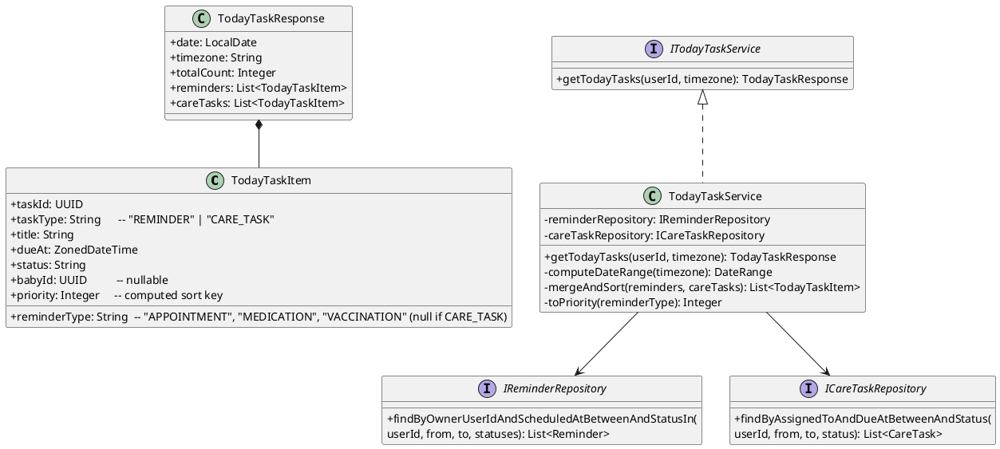
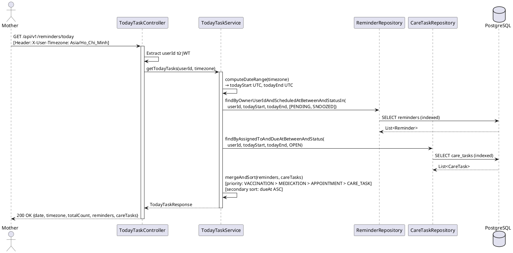
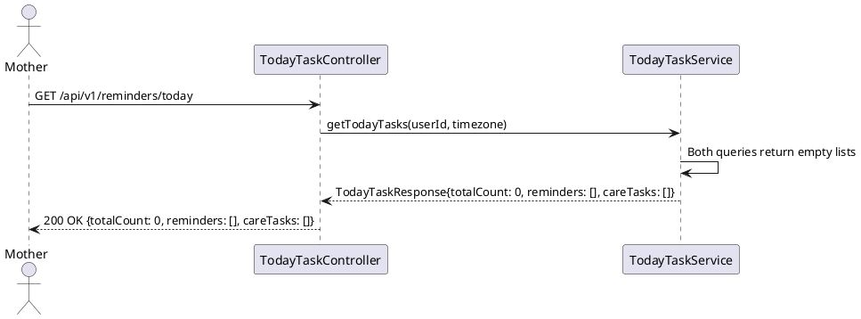

# ENGINEERING DOCUMENTATION STANDARD (EDS) v2.0
# Technical Design Specification — UC-49 View Today Tasks

| Field | Value |
|-------|-------|
| **Document ID** | `CB-REMINDER-IMP-004` |
| **Version** | `1.0` |
| **Date** | `2026-06-26` |
| **Status** | `Draft` |
| **Document Owner** | `PhuongNT` |
| **Author** | `AI Agent` |
| **Reviewed by** | `[Tech Lead]` |
| **DPO Sign-off** | `[ ] Pending` |
| **Approved by** | `[Principal Architect]` |
| **Last Review** | `2026-06-26` |
| **Based on EDS** | `v2.0` |

---

## CHANGELOG

| Ngày | Người thực hiện | Nội dung thay đổi |
|------|-----------------|-------------------|
| 2026-06-26 | AI Agent | Tạo tài liệu lần đầu cho UC-49 View Today Tasks |

---

## MỤC LỤC

1. [Tổng quan Module](#1-tổng-quan-module)
2. [Ma trận Truy vết](#2-ma-trận-truy-vết)
3. [Architecture Decision Records](#3-architecture-decision-records)
4. [Non-Functional Requirements & SLA](#4-non-functional-requirements--sla)
5. [Static Modeling](#5-static-modeling)
6. [Dynamic Modeling](#6-dynamic-modeling)
7. [Domain Event Catalog](#7-domain-event-catalog)
8. [Interface Specification](#8-interface-specification)
9. [API Specification](#9-api-specification)
10. [Bảng mã lỗi](#10-bảng-mã-lỗi)
11. [Quy trình Triển khai](#11-quy-trình-triển-khai)
12. [Rollback & Incident Runbook](#12-rollback--incident-runbook)
13. [Kịch bản Kiểm thử](#13-kịch-bản-kiểm-thử)
14. [Phương pháp Xác minh](#14-phương-pháp-xác-minh)
15. [Mẫu thử thực tế](#15-mẫu-thử-thực-tế)
16. [Authorization Matrix](#16-authorization-matrix)
17. [AI Prompt Constraints (CASE 2.0)](#17-ai-prompt-constraints-case-20)

---

## 1. Tổng quan Module

| Field | Value |
|-------|-------|
| **Module Name** | `ViewTodayTasks` |
| **Bounded Context** | `reminder / care-task` |
| **UC ID** | `UC-49` |
| **SRS Reference** | `3.3.1.26` |
| **Primary Actor** | `Mother (ROLE_MOTHER)` |
| **Secondary Actors** | `Firebase Cloud Messaging` |
| **Platform** | `Mobile App` |
| **Data Classification** | `PII` |
| **Compliance Scope** | `BR-RBAC, BR-TODAY-001` |
| **Upstream Dependencies** | `auth, reminders, care_tasks, care_groups` |
| **Downstream Consumers** | `Mobile App Today screen, notification delivery` |
| **Access Frequency** | `Frequent (multiple times/day per user)` |

**Mô tả:** Mother xem danh sách tổng hợp ("Today Tasks") gồm:
1. **Reminders** hôm nay: `scheduled_at BETWEEN today 00:00:00 AND today 23:59:59` (timezone của user), bao gồm mọi `reminder_type` (APPOINTMENT, MEDICATION, VACCINATION), chỉ lấy PENDING và SNOOZED.
2. **Care Tasks** hôm nay: `care_tasks.due_at BETWEEN today 00:00:00 AND today 23:59:59`, status = OPEN.

Kết quả được sắp xếp theo thứ tự ưu tiên: thời gian (`scheduled_at`/`due_at` tăng dần), nhóm VACCINATION/MEDICATION/APPOINTMENT trước care tasks.

---

## 2. Ma trận Truy vết

| Requirement ID | Loại | Mô tả | Thành phần Code | Compliance Target | ADR liên quan |
|----------------|------|-------|-----------------|-------------------|---------------|
| UC-49 | Use Case | Mother xem today tasks | `TodayTaskController.getTodayTasks()` | BR-RBAC | ADR-TODAY-001 |
| BR-TODAY-001 | Business Rule | Aggregate reminders (scheduled_at today) + care_tasks (due_at today) | `TodayTaskService.aggregateTodayTasks()` | Data Integrity | ADR-TODAY-001 |
| BR-RBAC | Business Rule | Mother chỉ thấy reminder/task của chính mình | owner_user_id filter | Data Privacy | — |
| BR-TODAY-SORT | Business Rule | Sort by time asc; reminders trước care_tasks | `TodayTaskService.sortTasks()` | UX | ADR-TODAY-001 |

---

## 3. Architecture Decision Records

### ADR-TODAY-001 — Aggregation trong Application Layer, không dùng DB JOIN phức tạp

| Field | Value |
|-------|-------|
| **Status** | `Accepted` |
| **Deciders** | `AI Agent — Tech Lead` |
| **Date** | `2026-06-26` |

#### Bối cảnh

"Today Tasks" cần gộp dữ liệu từ 2 bảng khác nhau (`reminders` và `care_tasks`) với logic sort phức tạp (priority + time). Có hai phương án: JOIN ở DB layer hoặc aggregate ở application layer.

#### Các phương án đã xem xét

| Phương án | Mô tả | Ưu điểm | Nhược điểm |
|-----------|-------|----------|------------|
| A | SQL UNION ALL + ORDER BY tại DB | 1 query | Khó đọc, khó test, coupling cao |
| B | 2 queries song song + merge/sort trong Service | Dễ test từng part riêng; linh hoạt | 2 queries (nhưng cả 2 đều có index support) |

#### Quyết định

Chọn **Phương án B** — 2 queries riêng biệt, merge và sort trong `TodayTaskService`. Mỗi query có index trên `owner_user_id` + `scheduled_at`/`due_at`.

#### Hệ quả

**Tích cực:**
- Dễ test service logic riêng biệt
- Dễ thêm filtering theo loại task sau này

**Tiêu cực / Trade-offs:**
- 2 round-trip DB thay vì 1 — chấp nhận được vì cả 2 query đều lightweight (indexed, date range hôm nay)

### ADR-TODAY-002 — Timezone dựa theo UTC offset từ request header, fallback UTC+7

| Field | Value |
|-------|-------|
| **Status** | `Accepted` |
| **Date** | `2026-06-26` |

#### Quyết định

Dùng `X-User-Timezone` header (ví dụ: `Asia/Ho_Chi_Minh`) để xác định "today" của user. Fallback `UTC+7` nếu header không có. Tính toán `today 00:00:00` và `today 23:59:59` trong timezone đó, rồi convert sang UTC cho DB query.

---

## 4. Non-Functional Requirements & SLA

### 4.1. Performance & Availability

| Category | Requirement | Target SLA |
|----------|-------------|------------|
| Latency (p99) | API response (2 queries + merge) | `< 400ms` |
| Availability | Uptime | `99.9%` |
| Throughput | Concurrent requests | `200 req/s` |

### 4.2. Data Integrity & Retention

| Category | Requirement | Target |
|----------|-------------|--------|
| Consistency | Reminders và care_tasks phản ánh DB real-time | No caching (frequent access) |
| Timezone | "Today" tính đúng theo timezone của user | ADR-TODAY-002 |

### 4.3. Security

| Category | Requirement | Target |
|----------|-------------|--------|
| Access control | Mother chỉ xem task của mình | BR-RBAC |
| Encryption in transit | Tất cả endpoints | TLS 1.3+ |

### 4.4. Scalability & Capacity Planning

UC-49 là endpoint frequency cao (nhiều lần/ngày/user). Cả 2 query đều có index trên `owner_user_id` + time column. Nếu cần cache: short-TTL (30 giây) với key = `userId:today`.

---

## 5. Static Modeling

### 5.1. Class Diagram



### 5.2. Data Structure

Schema đã tồn tại trong `V1__init_schema.sql`. Không cần migration mới.

```sql
-- Tham chiếu từ V1__init_schema.sql

-- reminders:
--   reminder_id, owner_user_id, reminder_type, title, scheduled_at, status
--   INDEX idx_reminder_owner_user_id (owner_user_id)
--   INDEX idx_reminder_scheduled_at (scheduled_at)
--   INDEX idx_reminder_status (status)

-- care_tasks:
--   care_task_id, care_group_id, assigned_by, assigned_to, title, due_at, status
--   Cần index: assigned_to + due_at (nếu chưa có, DBA cần tạo)

-- Query 1: Reminders hôm nay
SELECT reminder_id, reminder_type, title, scheduled_at, status, baby_id
FROM reminders
WHERE owner_user_id = :userId
  AND scheduled_at BETWEEN :todayStart AND :todayEnd
  AND status IN ('PENDING', 'SNOOZED')
ORDER BY scheduled_at ASC;

-- Query 2: Care tasks hôm nay
SELECT care_task_id, title, due_at, status
FROM care_tasks
WHERE assigned_to = :userId
  AND due_at BETWEEN :todayStart AND :todayEnd
  AND status = 'OPEN'
ORDER BY due_at ASC;
```

> **Lưu ý:** `checklist_items` là admin-managed content templates, không phải user-specific tasks. UC-49 **không** include checklist_items trực tiếp — chúng được hiển thị qua care_tasks hoặc nhóm riêng nếu có UC khác liên kết.

---

## 6. Dynamic Modeling

### 6.1. Sequence Diagram — Happy Path



### 6.2. Sequence Diagram — Empty Today (No tasks)



### 6.3. State Machine

Not applicable — UC-49 là read-only query, không có state transition.

---

## 7. Domain Event Catalog

### 7.1. Events Published

Not applicable — UC-49 là read-only. Không phát ra domain events.

### 7.2. Events Consumed

| Event Name | Source | Handler | Action |
|------------|--------|---------|--------|
| `ReminderCreated` | `ReminderService` | — (indirect) | Data tự động xuất hiện trong today tasks response |
| `ReminderSnoozed` | `ReminderService` | — (indirect) | SNOOZED reminders vẫn xuất hiện trong today tasks |

> UC-49 là query layer — nó đọc trạng thái hiện tại của DB, không subscribe event trực tiếp.

---

## 8. Interface Specification

### 8.1. Service Interface

```java
// TodayTaskResponse.java
// @version 1.0
public class TodayTaskResponse {
    private LocalDate    date;        // "today" theo timezone của user
    private String       timezone;    // "Asia/Ho_Chi_Minh"
    private Integer      totalCount;  // reminders.size() + careTasks.size()
    private List<TodayTaskItem> reminders;   // sorted by priority + dueAt
    private List<TodayTaskItem> careTasks;   // sorted by dueAt
}

// TodayTaskItem.java
public class TodayTaskItem {
    private UUID         taskId;
    private String       taskType;      // "REMINDER" | "CARE_TASK"
    private String       reminderType;  // "VACCINATION" | "MEDICATION" | "APPOINTMENT" | null
    private String       title;
    private ZonedDateTime dueAt;        // scheduledAt for reminders, due_at for care_tasks
    private String       status;        // "PENDING" | "SNOOZED" | "OPEN"
    private UUID         babyId;        // null if not a VACCINATION reminder or CARE_TASK
}

// ITodayTaskService.java
// @version 1.0
public interface ITodayTaskService {
    /**
     * Lấy danh sách tổng hợp tasks hôm nay cho mother.
     * Bao gồm reminders (PENDING/SNOOZED, scheduled_at today) + care_tasks (OPEN, due_at today).
     * Sắp xếp: VACCINATION > MEDICATION > APPOINTMENT > CARE_TASK, secondary: dueAt ASC.
     *
     * @param userId    từ JWT claim
     * @param timezone  từ X-User-Timezone header; fallback "Asia/Ho_Chi_Minh"
     * @return TodayTaskResponse — không bao giờ null; trả về empty lists nếu không có tasks
     */
    TodayTaskResponse getTodayTasks(UUID userId, String timezone);
}
```

### 8.2. Repository Interface

```java
// IReminderRepository.java (bổ sung method)
// @version 1.0
public interface IReminderRepository extends JpaRepository<Reminder, UUID> {
    List<Reminder> findByOwnerUserIdAndScheduledAtBetweenAndStatusIn(
        UUID ownerUserId,
        ZonedDateTime scheduledAtFrom,
        ZonedDateTime scheduledAtTo,
        List<String> statuses
    );
}

// ICareTaskRepository.java (method dùng cho UC-49)
public interface ICareTaskRepository extends JpaRepository<CareTask, UUID> {
    List<CareTask> findByAssignedToAndDueAtBetweenAndStatus(
        UUID assignedTo,
        ZonedDateTime dueAtFrom,
        ZonedDateTime dueAtTo,
        String status
    );
}
```

---

## 9. API Specification

### 9.1. Endpoints Table

| Method | Path | Auth Level | Required Roles | Rate Limit | Idempotent? |
|--------|------|------------|----------------|------------|-------------|
| `GET` | `/api/v1/reminders/today` | JWT Bearer | `ROLE_MOTHER` | 120/min | Yes |

### 9.2. Request / Response Schemas

#### `GET /api/v1/reminders/today` — Lấy today tasks

**Request Headers:**
```
Authorization: Bearer [JWT_TOKEN]
X-User-Timezone: Asia/Ho_Chi_Minh
```

**Response — 200 OK:**
```json
{
  "date": "2026-06-26",
  "timezone": "Asia/Ho_Chi_Minh",
  "totalCount": 3,
  "reminders": [
    {
      "taskId": "uuid-rem-001",
      "taskType": "REMINDER",
      "reminderType": "VACCINATION",
      "title": "Tiêm vắc-xin 5 trong 1 — Mũi 1",
      "dueAt": "2026-06-26T08:00:00+07:00",
      "status": "PENDING",
      "babyId": "uuid-baby-001"
    },
    {
      "taskId": "uuid-rem-002",
      "taskType": "REMINDER",
      "reminderType": "MEDICATION",
      "title": "Uống sắt và canxi buổi sáng",
      "dueAt": "2026-06-26T09:00:00+07:00",
      "status": "SNOOZED",
      "babyId": null
    }
  ],
  "careTasks": [
    {
      "taskId": "uuid-task-001",
      "taskType": "CARE_TASK",
      "reminderType": null,
      "title": "Cân nặng em bé tuần 12",
      "dueAt": "2026-06-26T15:00:00+07:00",
      "status": "OPEN",
      "babyId": null
    }
  ]
}
```

**Response — 200 OK (không có tasks):**
```json
{
  "date": "2026-06-26",
  "timezone": "Asia/Ho_Chi_Minh",
  "totalCount": 0,
  "reminders": [],
  "careTasks": []
}
```

---

## 10. Bảng mã lỗi

| Code | HTTP Status | Message (EN) | Message (VI) | Trigger Condition |
|------|-------------|--------------|--------------|-------------------|
| `REMINDER-004` | 403 | Insufficient permissions | Không đủ quyền | Non-MOTHER role |
| `REMINDER-005` | 500 | Internal error | Lỗi hệ thống | DB query error |
| `REMINDER-008` | 400 | Invalid timezone | Timezone không hợp lệ | X-User-Timezone không phải IANA timezone |

---

## 11. Quy trình Triển khai

### 11.1. Prerequisites

- [ ] `reminders` table tồn tại với index `idx_reminder_owner_user_id`, `idx_reminder_scheduled_at`
- [ ] `care_tasks` table tồn tại; DBA xác nhận index trên `(assigned_to, due_at)` nếu chưa có
- [ ] UC-47 và UC-48 đã implement (reminders phải tồn tại trước)

### 11.2. Pre-Migration Checklist

- [ ] Không cần Flyway migration mới (V1 schema đầy đủ)
- [ ] Nếu cần index: `CREATE INDEX CONCURRENTLY idx_care_task_assigned_to_due_at ON care_tasks(assigned_to, due_at);`

### 11.3. Implementation Steps

#### Chặng 1 — Repository Methods

```java
// Thêm method vào IReminderRepository và ICareTaskRepository
// (Spring Data JPA derivation — không cần @Query nếu method name đủ rõ)
```

#### Chặng 2 — TodayTaskService

```java
// TodayTaskService.getTodayTasks():
// 1. Parse timezone từ header (fallback Asia/Ho_Chi_Minh)
// 2. Compute todayStart / todayEnd trong timezone đó → convert to UTC
// 3. Query reminders (PENDING, SNOOZED, scheduled_at in range, owner = userId)
// 4. Query care_tasks (OPEN, due_at in range, assigned_to = userId)
// 5. Map to TodayTaskItem list
// 6. Sort: primary = priority(reminderType), secondary = dueAt ASC
// 7. Build và return TodayTaskResponse
```

#### Chặng 3 — Controller

```java
// TodayTaskController.java
// GET /api/v1/reminders/today
// Extract userId từ JWT SecurityContext
// Extract X-User-Timezone header (default "Asia/Ho_Chi_Minh")
// Delegate tới TodayTaskService.getTodayTasks()
```

### 11.4. Deployment Checklist

- [ ] Unit tests xanh
- [ ] Integration tests xanh
- [ ] Response time < 400ms dưới load test với 100 concurrent users

---

## 12. Rollback & Incident Runbook

### 12.1. Điều kiện kích hoạt Rollback

| Điều kiện | Ngưỡng | Người quyết định |
|-----------|--------|------------------|
| Error rate tăng đột biến | > 5% trong 5 phút | On-call Engineer |
| Latency p99 vượt ngưỡng | > 800ms | On-call Engineer |
| Dữ liệu sai timezone | Bất kỳ report nào | Tech Lead |

### 12.2. Rollback Procedure

```bash
# Không có migration mới → rollback code only
kubectl rollout undo deployment/carebridge-api
kubectl rollout status deployment/carebridge-api
```

---

## 13. Kịch bản Kiểm thử

### 13.1. Unit Tests

```gherkin
Feature: View Today Tasks

  Background:
    Given test data classification: SYNTHETIC
    And Mother "user-001" authenticated
    And timezone = "Asia/Ho_Chi_Minh"
    And "today" = 2026-06-26 (fixed clock for test)

  Scenario: Happy path — có reminders và care tasks hôm nay
    Given reminders:
      - "rem-001" type=VACCINATION, scheduledAt=2026-06-26T08:00+07:00, status=PENDING
      - "rem-002" type=MEDICATION, scheduledAt=2026-06-26T09:00+07:00, status=SNOOZED
    And care_tasks:
      - "task-001" due_at=2026-06-26T15:00+07:00, status=OPEN, assigned_to=user-001
    When GET /api/v1/reminders/today
    Then response 200
    And totalCount = 3
    And reminders có 2 item, sorted: VACCINATION (08:00) trước MEDICATION (09:00)
    And careTasks có 1 item

  Scenario: Không có tasks hôm nay → empty lists
    Given không có reminders hoặc care_tasks hôm nay
    When GET /api/v1/reminders/today
    Then response 200, totalCount=0, reminders=[], careTasks=[]

  Scenario: Reminder ngày mai không xuất hiện
    Given reminder "rem-tomorrow" scheduledAt=2026-06-27T08:00+07:00, status=PENDING
    When GET /api/v1/reminders/today
    Then totalCount = 0 (reminder ngày mai không được include)

  Scenario: Reminder COMPLETED/SKIPPED không xuất hiện
    Given reminder "rem-done" scheduledAt=2026-06-26T08:00+07:00, status=COMPLETED
    When GET /api/v1/reminders/today
    Then reminders = [] (COMPLETED không hiển thị)

  Scenario: Sort priority — VACCINATION trước MEDICATION trước APPOINTMENT
    Given 3 reminders hôm nay (cùng giờ):
      - type=APPOINTMENT, scheduledAt=2026-06-26T08:00+07:00
      - type=VACCINATION, scheduledAt=2026-06-26T08:00+07:00
      - type=MEDICATION, scheduledAt=2026-06-26T08:00+07:00
    When GET /api/v1/reminders/today
    Then thứ tự: VACCINATION → MEDICATION → APPOINTMENT

  Scenario: Timezone fallback — không có X-User-Timezone header
    When GET /api/v1/reminders/today không có timezone header
    Then hệ thống dùng "Asia/Ho_Chi_Minh" làm fallback

  Scenario: Mother không thấy care_tasks của user khác
    Given "task-002" assigned_to=user-999
    When user-001 gọi GET /api/v1/reminders/today
    Then task-002 không xuất hiện trong response
```

### 13.2. Integration Tests

```gherkin
  Scenario: Full aggregation với Testcontainers
    Given PostgreSQL container với V1 migration applied
    And seed: user-001, reminder "rem-001" (PENDING, today), care_task "task-001" (OPEN, today)
    When TodayTaskService.getTodayTasks(userId, "Asia/Ho_Chi_Minh") được gọi
    Then response.totalCount = 2
    And response.reminders[0].taskId = "rem-001"
    And response.careTasks[0].taskId = "task-001"
```

### 13.3. Security Tests

```gherkin
  Scenario: Unauthorized → 401
    When GET /api/v1/reminders/today không có JWT
    Then response 401

  Scenario: ROLE_EXPERT → 403
    Given JWT với ROLE_EXPERT
    When GET /api/v1/reminders/today
    Then response 403, error code REMINDER-004

  Scenario: Invalid timezone → 400
    When GET /api/v1/reminders/today với header X-User-Timezone: "INVALID/TIMEZONE"
    Then response 400, error code REMINDER-008
```

---

## 14. Phương pháp Xác minh

### 14.1. Database Inspection

```sql
-- Verify reminders của today (UTC+7)
SELECT reminder_id, reminder_type, title, scheduled_at, status
FROM reminders
WHERE owner_user_id = 'user-001-uuid'
  AND scheduled_at >= '2026-06-26 00:00:00+07:00'
  AND scheduled_at <= '2026-06-26 23:59:59+07:00'
  AND status IN ('PENDING', 'SNOOZED')
ORDER BY scheduled_at;

-- Verify care_tasks của today
SELECT care_task_id, title, due_at, status
FROM care_tasks
WHERE assigned_to = 'user-001-uuid'
  AND due_at >= '2026-06-26 00:00:00+07:00'
  AND due_at <= '2026-06-26 23:59:59+07:00'
  AND status = 'OPEN';
```

### 14.2. Log / Audit Verification

```bash
# UC-49 là read-only — không có domain events, không cần audit log verification
# Kiểm tra không có PII leak
kubectl logs -l app=carebridge-api | grep "GET /api/v1/reminders/today" | tail -20
kubectl logs -l app=carebridge-api | grep -i "password\|secret"
# Expected: No output
```

---

## 15. Mẫu thử thực tế

### 15.1. Happy Path

```bash
curl -X GET https://[host]/api/v1/reminders/today \
  -H "Authorization: Bearer [JWT_MOTHER_TOKEN]" \
  -H "X-User-Timezone: Asia/Ho_Chi_Minh"
```

**Expected Response (200):**
```json
{
  "date": "2026-06-26",
  "timezone": "Asia/Ho_Chi_Minh",
  "totalCount": 2,
  "reminders": [
    {
      "taskId": "uuid-rem-001",
      "taskType": "REMINDER",
      "reminderType": "VACCINATION",
      "title": "Tiêm vắc-xin 5 trong 1",
      "dueAt": "2026-06-26T08:00:00+07:00",
      "status": "PENDING",
      "babyId": "uuid-baby-001"
    }
  ],
  "careTasks": [
    {
      "taskId": "uuid-task-001",
      "taskType": "CARE_TASK",
      "reminderType": null,
      "title": "Theo dõi cân nặng em bé",
      "dueAt": "2026-06-26T15:00:00+07:00",
      "status": "OPEN",
      "babyId": null
    }
  ]
}
```

### 15.2. Error Path — Unauthorized

```bash
curl -X GET https://[host]/api/v1/reminders/today
```

**Expected Response (401):**
```json
{
  "error": {
    "code": "IAM-001",
    "message": "Authentication required"
  }
}
```

---

## 16. Authorization Matrix

| Endpoint | `GUEST` | `ROLE_MOTHER` | `ROLE_EXPERT` | `ROLE_ADMIN` | `SYSTEM` |
|----------|---------|---------------|---------------|--------------|----------|
| `GET /api/v1/reminders/today` | ❌ | ✅ Own | ❌ | ✅ All | ✅ |

**Chú thích:**
- `Own` = Chỉ thấy reminder và care_task của chính mình
- ROLE_EXPERT không truy cập today tasks của mother — giao tiếp qua consultation flow

---

## 17. AI Prompt Constraints (CASE 2.0)

### 17.1 Constraint Summary Table

| # | Constraint | Source | Last Verified |
|---|-----------|--------|---------------|
| C1 | "Today" PHẢI được tính theo timezone của user (header `X-User-Timezone`, fallback `Asia/Ho_Chi_Minh`); KHÔNG dùng UTC làm "today" | ADR-TODAY-002 | 2026-06-26 |
| C2 | Chỉ include reminders với `status IN ('PENDING', 'SNOOZED')`; COMPLETED/SKIPPED không hiển thị | BR-TODAY-001 | 2026-06-26 |
| C3 | Chỉ include care_tasks với `status = 'OPEN'` và `assigned_to = userId` | BR-TODAY-001, BR-RBAC | 2026-06-26 |
| C4 | Sort priority: VACCINATION (1) > MEDICATION (2) > APPOINTMENT (3) > CARE_TASK (4); secondary sort: dueAt ASC | BR-TODAY-SORT | 2026-06-26 |
| C5 | `userId` PHẢI lấy từ JWT claim, không từ request parameter | BR-RBAC | 2026-06-26 |

### 17.2 Constraint Injection Block

```
[CONSTRAINT BLOCK — Module: ViewTodayTasks]
Theo TDS CB-REMINDER-IMP-004 và các ADR liên quan:

1. "Today" phải tính theo X-User-Timezone header (fallback Asia/Ho_Chi_Minh) — không dùng server UTC.
2. Chỉ include reminders có status IN ('PENDING', 'SNOOZED') — COMPLETED/SKIPPED bị loại.
3. Chỉ include care_tasks có status = 'OPEN' và assigned_to = JWT userId.
4. Sort: priority(VACCINATION=1, MEDICATION=2, APPOINTMENT=3, CARE_TASK=4), secondary: dueAt ASC.
5. userId lấy từ JWT SecurityContext, không bao giờ từ query parameter.

[CONTEXT BLOCK]
- Bounded Context: reminder / care-task
- Data Classification: PII
- Access Pattern: frequent (multiple times/day) — không cache lâu
- Existing interfaces: §8 Service Interface + §8.2 Repository Interface
- Error codes: §10 Error Codes Table
- Auth matrix: §16 Authorization Matrix

[TASK BLOCK]
Implement getTodayTasks() thỏa mãn constraints trên.
Output phải tuân thủ §8 Interface Specification.
Tests phải cover §13 Test Scenarios bao gồm timezone, sort order, và empty state.
```

### 17.3 Constraint Quality Checklist

- [x] Mỗi constraint traceable về BR/ADR cụ thể
- [x] Không có constraint generic
- [x] Constraint block reference §8 Interface
- [x] Constraint block reference §16 Auth Matrix

### 17.4 Anti-Pattern Detection

| AP-ID | Anti-Pattern | Dấu hiệu | Hành động |
|-------|-------------|-----------|----------|
| AP-AI-001 | Unconstrained Gen | Code dùng UTC làm "today" thay vì user timezone | Reject — fix timezone computation |
| AP-AI-003 | Implicit Decision | Code include COMPLETED reminders | Reject — filter status IN ('PENDING', 'SNOOZED') |
| AP-AI-005 | Hallucinated Contract | Import ChecklistItemRepository để lấy checklist_items | Reject — UC-49 không include checklist_items trực tiếp |

---

## PHỤ LỤC

### A. Glossary

| Thuật ngữ | Định nghĩa |
|-----------|------------|
| Today Tasks | Danh sách tổng hợp reminders + care_tasks đến hạn hôm nay của mother |
| TodayTaskItem | DTO đại diện cho một task item (reminder hoặc care_task) trong today list |
| IANA Timezone | Chuẩn đặt tên timezone quốc tế (VD: `Asia/Ho_Chi_Minh`) |
| DateRange | Khoảng thời gian: `{from: today 00:00:00, to: today 23:59:59}` tính theo timezone user |

### B. Tài liệu tham chiếu

| Document | Path |
|----------|------|
| Database Schema | `05_Development/CareBridgeAPI/src/main/resources/db/migration/V1__init_schema.sql` |
| UC-47 TDS | `04_Implement/UC47_CreateVaccinationReminder/UC47_CreateVaccinationReminder_TDS.md` |
| UC-48 TDS | `04_Implement/UC48_UpdateOrSnoozeReminder/UC48_UpdateOrSnoozeReminder_TDS.md` |
| SRS | `01_Requirements/SRS.md` §3.3.1.26 |
