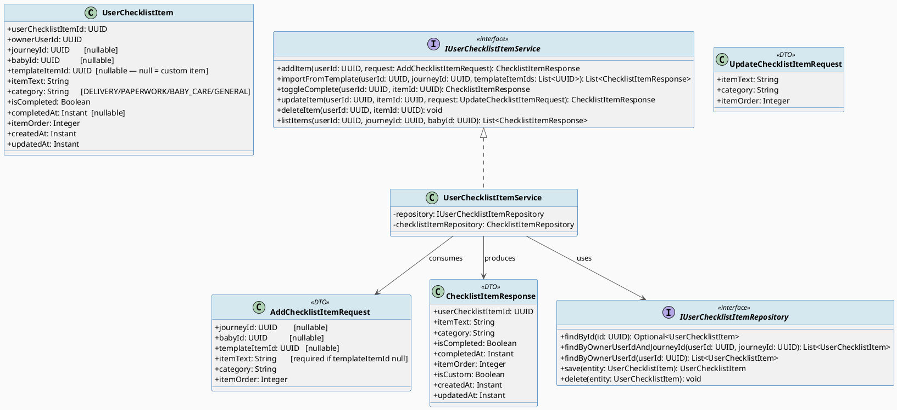
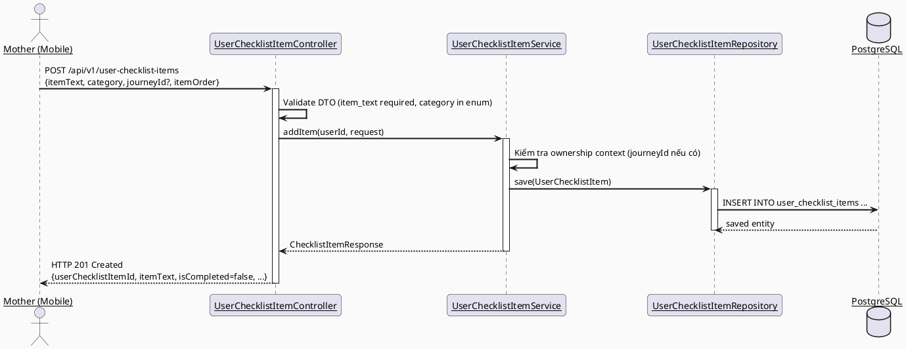
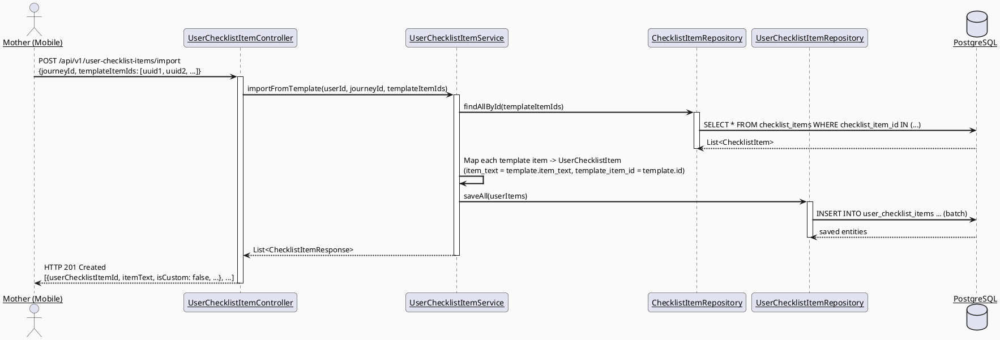
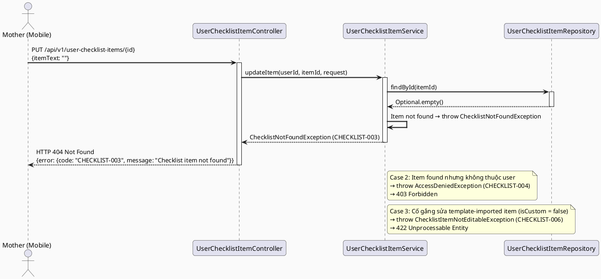
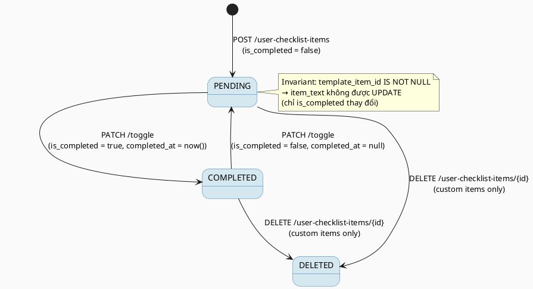

# ENGINEERING DOCUMENTATION STANDARD (EDS) v2.0
# Quy chuẩn Tài liệu Kỹ thuật và Đặc tả Hiện thực hóa

| Field | Value |
|-------|-------|
| **Document ID** | `CB-CHECKLIST-IMP-001` |
| **Version** | `1.0` |
| **Date** | `2026-06-26` |
| **Status** | `Approved` |
| **Document Owner** | `AI Agent` |
| **Author** | `AI Agent — Spec Generator` |
| **Reviewed by** | `[ ] Tech Lead — Pending` |
| **DPO Sign-off** | `[ ] Pending` |
| **Approved by** | `[ ] Principal Architect — Pending` |
| **Last Review** | `2026-06-26` |
| **Based on EDS** | `v2.0` |

---

## CHANGELOG

> **Policy 4.4 — Immutable History:** Không bao giờ xóa thông tin cũ. Mọi thay đổi phải ghi vào bảng này.

| Ngày | Người thực hiện | Nội dung thay đổi |
|------|-----------------|-------------------|
| 2026-06-26 | AI Agent — Spec Generator | Tạo tài liệu lần đầu cho UC50 Manage Preparation Checklist |
| 2026-07-07 | AI Agent — Amelia (Dev Agent) | Implemented UserChecklistItemServiceImpl (addItem, importFromTemplate, listItems, toggleComplete, updateItem, deleteItem). C2 guard: template items cannot have itemText/category changed. V3 migration already existed — no new migration needed. 7/7 unit tests GREEN. |

---

## MỤC LỤC

1. [Tổng quan Module](#1-tổng-quan-module)
2. [Ma trận Truy vết (Traceability Matrix)](#2-ma-trận-truy-vết-traceability-matrix)
3. [Architecture Decision Records (ADR)](#3-architecture-decision-records-adr)
4. [Non-Functional Requirements & SLA](#4-non-functional-requirements--sla)
5. [Static Modeling (Mô hình Tĩnh)](#5-static-modeling-mô-hình-tĩnh)
6. [Dynamic Modeling (Mô hình Động)](#6-dynamic-modeling-mô-hình-động)
7. [Domain Event Catalog](#7-domain-event-catalog)
8. [Interface Specification (Đặc tả Giao diện)](#8-interface-specification-đặc-tả-giao-diện)
9. [API Specification](#9-api-specification)
10. [Bảng mã lỗi (Error Codes)](#10-bảng-mã-lỗi-error-codes)
11. [Quy trình Triển khai (Step-by-Step)](#11-quy-trình-triển-khai-step-by-step)
12. [Rollback & Incident Runbook](#12-rollback--incident-runbook)
13. [Kịch bản Kiểm thử Chi tiết](#13-kịch-bản-kiểm-thử-chi-tiết)
14. [Phương pháp Xác minh](#14-phương-pháp-xác-minh)
15. [Mẫu thử thực tế (API Verification Samples)](#15-mẫu-thử-thực-tế-api-verification-samples)
16. [Bảng tổng hợp phân quyền (Authorization Matrix)](#16-bảng-tổng-hợp-phân-quyền-authorization-matrix)
17. [AI Prompt Constraints (CASE 2.0)](#17-ai-prompt-constraints-case-20)

---

## 1. Tổng quan Module

> UC50 — Manage Preparation Checklist cho phép bà mẹ (Mother) tự quản lý danh sách chuẩn bị cá nhân của mình trong hành trình thai kỳ / hậu sản. Người dùng có thể thêm mục tùy chỉnh, nhập mục từ template do admin quản lý, đánh dấu hoàn thành / chưa hoàn thành, chỉnh sửa và xóa mục tùy chỉnh.
>
> **Lưu ý quan trọng — Schema Gap:** V1__init_schema.sql KHÔNG có bảng user-level checklist. Các bảng `checklist_templates` và `checklist_items` là nội dung do admin quản lý (read-only với người dùng). Một Flyway migration mới (`V{n}__add_user_checklist_items.sql`) phải được tạo để hỗ trợ UC50.

| Field | Value |
|-------|-------|
| **Module Name** | `UserChecklistItem` |
| **Bounded Context** | `CareJourney — Preparation` |
| **Data Classification** | `Internal` |
| **Compliance Scope** | `N/A` |
| **Upstream Dependencies** | `AuthModule (JWT), MotherJourney, BabyProfile, ChecklistTemplates (read-only ref)` |
| **Downstream Consumers** | `UC49_ViewTodayTasks (có thể tham chiếu checklist items)` |

---

## 2. Ma trận Truy vết (Traceability Matrix)

| Requirement ID | Loại (BR/ADR/US) | Mô tả yêu cầu | Thành phần Code | Compliance Target | ADR liên quan |
|----------------|------------------|---------------|-----------------|-------------------|---------------|
| BR-CHECKLIST-001 | Business Rule | Mother có thể thêm mục tùy chỉnh HOẶC nhập từ checklist_templates | `UserChecklistItemService.addItem()` | — | ADR-001 |
| BR-CHECKLIST-002 | Business Rule | Mục có thể đánh dấu hoàn thành / chưa hoàn thành (toggle) | `UserChecklistItemService.toggleComplete()` | — | — |
| BR-CHECKLIST-003 | Business Rule | Mục tùy chỉnh có thể chỉnh sửa và xóa | `UserChecklistItemService.updateItem()`, `deleteItem()` | — | — |
| BR-CHECKLIST-004 | Business Rule | Mục từ template hiển thị item_text từ template nhưng track completion per user | `UserChecklistItemService.importFromTemplate()` | — | ADR-001 |
| BR-RBAC | Business Rule | Mother chỉ được truy cập checklist items của chính mình | `UserChecklistItemService` (ownership check) | — | — |
| US-UC50-001 | User Story | Bà mẹ thêm mục chuẩn bị tùy chỉnh vào danh sách | `POST /api/v1/user-checklist-items` | — | — |
| US-UC50-002 | User Story | Bà mẹ nhập mục từ template admin | `POST /api/v1/user-checklist-items/import` | — | ADR-001 |
| US-UC50-003 | User Story | Bà mẹ đánh dấu mục hoàn thành / chưa hoàn thành | `PATCH /api/v1/user-checklist-items/{id}/toggle` | — | — |
| US-UC50-004 | User Story | Bà mẹ chỉnh sửa nội dung mục tùy chỉnh | `PUT /api/v1/user-checklist-items/{id}` | — | — |
| US-UC50-005 | User Story | Bà mẹ xóa mục tùy chỉnh | `DELETE /api/v1/user-checklist-items/{id}` | — | — |
| US-UC50-006 | User Story | Bà mẹ xem danh sách checklist của mình | `GET /api/v1/user-checklist-items` | — | — |
| SRS-3.3.1.27 | User Story | SRS reference cho UC50 | Toàn bộ module | — | — |
| ADR-001 | Decision | Dùng bảng `user_checklist_items` riêng thay vì gắn vào `checklist_items` của admin | `UserChecklistItemRepository` | — | — |

---

## 3. Architecture Decision Records (ADR)

### ADR-001 — Tạo bảng `user_checklist_items` riêng biệt thay vì tái dùng `checklist_items`

| Field | Value |
|-------|-------|
| **Status** | `Accepted` |
| **Deciders** | `AI Agent — Spec Generator` |
| **Date** | `2026-06-26` |
| **Supersedes** | `N/A` |

#### Bối cảnh (Context)

Schema V1 có `checklist_templates` và `checklist_items` là nội dung admin-managed (read-only). Không có bảng nào cho phép user lưu trạng thái hoàn thành cá nhân hoặc thêm mục tùy chỉnh. UC50 yêu cầu khả năng per-user, per-journey tracking.

#### Các phương án đã xem xét (Options Considered)

| Phương án | Mô tả | Ưu điểm | Nhược điểm |
|-----------|-------|----------|------------|
| A | Thêm cột `user_id`, `is_completed` vào `checklist_items` | Không cần bảng mới | - Phá vỡ admin-content model; - Mixing user data với content data; - N users × M items → bloat |
| B | Tạo bảng `user_checklist_items` riêng với FK tùy chọn về `checklist_items` | + Clean separation; + Hỗ trợ custom items (template_item_id = null); + Mỗi user có bản ghi riêng | - Cần Flyway migration mới |

#### Quyết định (Decision)

Chọn **Phương án B** vì clean domain separation giữa admin content và user personal data. Custom items (không có template) được hỗ trợ tự nhiên khi `template_item_id = NULL`.

#### Hệ quả (Consequences)

**Tích cực:**
- Admin content không bị ảnh hưởng khi user thêm/sửa/xóa checklist item của mình.
- Hỗ trợ đầy đủ custom items và template-imported items trong cùng một bảng.
- RBAC đơn giản: `owner_user_id = currentUserId` là điều kiện duy nhất.

**Tiêu cực / Trade-offs:**
- Cần migration `V{n}__add_user_checklist_items.sql` — cần review và chạy trên staging trước.
- Nếu admin cập nhật `checklist_items.item_text`, user items không tự động sync (chấp nhận được vì user có bản ghi riêng).

**Compliance Impact:**
- N/A — dữ liệu checklist là Internal, không phải PII.

### ADR-002 — Cho phép xóa mục tùy chỉnh (không áp dụng append-only)

| Field | Value |
|-------|-------|
| **Status** | `Accepted` |
| **Deciders** | `AI Agent — Spec Generator` |
| **Date** | `2026-06-26` |
| **Supersedes** | `N/A` |

#### Bối cảnh (Context)

Dữ liệu checklist item của user là nội dung cá nhân phi-PII (tên mục chuẩn bị, trạng thái). Không có yêu cầu audit trail bắt buộc. Người dùng có quyền xóa mục tùy chỉnh của mình.

#### Quyết định (Decision)

Cho phép `DELETE` vật lý đối với custom items (`template_item_id IS NULL`). Template-imported items chỉ được remove (xóa bản ghi user), không ảnh hưởng template gốc. Append-only không áp dụng.

#### Hệ quả (Consequences)

**Tích cực:**
- UX đơn giản, user có toàn quyền với checklist cá nhân.

**Tiêu cực / Trade-offs:**
- Không có lịch sử xóa — chấp nhận được vì không có yêu cầu audit cho checklist.

---

## 4. Non-Functional Requirements & SLA

### 4.1. Performance & Availability

| Category | Requirement | Target SLA | Measurement Method | Compliance Basis |
|----------|-------------|------------|---------------------|------------------|
| Latency | API response GET list (p99) | `< 300ms` | k6 load test | — |
| Latency | API response POST/PUT/DELETE (p99) | `< 300ms` | k6 load test | — |
| Availability | Uptime (monthly) | `99.9%` | Uptime monitor | — |
| Throughput | Concurrent requests | `200 req/s` | Load test | — |

### 4.2. Data Integrity & Retention

| Category | Requirement | Target | Verification Method | Compliance Basis |
|----------|-------------|--------|---------------------|------------------|
| Durability | Không mất dữ liệu checklist khi server restart | RPO = 0 | Transaction log | — |
| Ownership | Mỗi item thuộc về đúng owner | 100% | Query filter test | BR-RBAC |

### 4.3. Security

| Category | Requirement | Target | Verification Method | Compliance Basis |
|----------|-------------|--------|---------------------|------------------|
| Access control | Role-based, owner-only | Least privilege | Auth Matrix (§16) | BR-RBAC |
| Encryption in transit | All endpoints | TLS 1.3+ | SSL Labs scan | — |

### 4.4. Scalability & Capacity Planning

> Dự kiến: ~5,000 active mothers, mỗi người ~20–50 checklist items. Tổng ~250,000 rows/year. Giải pháp: index trên `(owner_user_id, journey_id)`, horizontal scaling nếu cần.

---

## 5. Static Modeling (Mô hình Tĩnh)

### 5.1. Class Diagram (PlantUML)



### 5.2. Data Structure (Flyway SQL Migration)

> **Schema Gap Resolution:** V1__init_schema.sql không có bảng user-level checklist. Tạo Flyway migration mới.

Tạo file: `src/main/resources/db/migration/V2__add_user_checklist_items.sql`

```sql
-- === UC50 MANAGE PREPARATION CHECKLIST — USER CHECKLIST ITEMS ===
-- Gap: V1 chỉ có checklist_templates và checklist_items (admin content).
-- Migration này thêm bảng user_checklist_items để track checklist cá nhân của Mother.

CREATE TABLE public.user_checklist_items (
    user_checklist_item_id  uuid         NOT NULL DEFAULT gen_random_uuid(),
    owner_user_id           uuid         NOT NULL,           -- FK -> users(user_id)
    journey_id              uuid,                             -- FK -> mother_journeys(journey_id), nullable
    baby_id                 uuid,                             -- FK -> baby_profiles(baby_id), nullable
    template_item_id        uuid,                             -- FK -> checklist_items(checklist_item_id), null = custom item
    item_text               varchar(500) NOT NULL,            -- Text hiển thị (copy từ template hoặc do user nhập)
    category                varchar(50)  NOT NULL DEFAULT 'GENERAL', -- DELIVERY, PAPERWORK, BABY_CARE, GENERAL
    is_completed            boolean      NOT NULL DEFAULT false,
    completed_at            timestamptz,                      -- Null nếu chưa hoàn thành
    item_order              integer      NOT NULL DEFAULT 0,  -- Thứ tự hiển thị trong danh sách
    created_at              timestamptz  NOT NULL DEFAULT now(),
    updated_at              timestamptz  NOT NULL DEFAULT now(),

    CONSTRAINT user_checklist_items_pkey PRIMARY KEY (user_checklist_item_id),
    CONSTRAINT fk_user_checklist_items_user
        FOREIGN KEY (owner_user_id) REFERENCES public.users(user_id),
    CONSTRAINT fk_user_checklist_items_journey
        FOREIGN KEY (journey_id) REFERENCES public.mother_journeys(journey_id),
    CONSTRAINT fk_user_checklist_items_baby
        FOREIGN KEY (baby_id) REFERENCES public.baby_profiles(baby_id),
    CONSTRAINT fk_user_checklist_items_template
        FOREIGN KEY (template_item_id) REFERENCES public.checklist_items(checklist_item_id),
    CONSTRAINT chk_user_checklist_items_category
        CHECK (category IN ('DELIVERY', 'PAPERWORK', 'BABY_CARE', 'GENERAL'))
);

-- Index để truy vấn danh sách theo owner + journey
CREATE INDEX idx_user_checklist_items_owner_user_id
    ON public.user_checklist_items(owner_user_id);

CREATE INDEX idx_user_checklist_items_owner_journey
    ON public.user_checklist_items(owner_user_id, journey_id);

CREATE INDEX idx_user_checklist_items_owner_baby
    ON public.user_checklist_items(owner_user_id, baby_id);

COMMENT ON TABLE public.user_checklist_items IS
    'Personal preparation checklist items per Mother user. Supports custom items (template_item_id IS NULL) and template-imported items.';

COMMENT ON COLUMN public.user_checklist_items.template_item_id IS
    'NULL = custom item added by user. Non-null = imported from checklist_items template.';
```

> **Quy tắc đặt tên:** Tất cả column dùng snake_case. Version migration sẽ được xác nhận với DBA trước khi apply.

---

## 6. Dynamic Modeling (Mô hình Động)

### 6.1. Sequence Diagram — Happy Path: Thêm mục tùy chỉnh (PlantUML)



### 6.2. Sequence Diagram — Happy Path: Nhập từ Template (PlantUML)



### 6.3. Sequence Diagram — Error Path (PlantUML)



### 6.4. State Machine — Trạng thái của ChecklistItem



> **Invariant bất biến:** Template-imported items (`template_item_id IS NOT NULL`) không được phép chỉnh sửa `item_text` hay `category`. Chỉ custom items mới được cập nhật đầy đủ.

---

## 7. Domain Event Catalog

### 7.1. Events Published (Phát ra)

| Event Name | Trigger | Publisher | Subscriber(s) | Payload Schema | Async? |
|------------|---------|-----------|---------------|----------------|--------|
| `ChecklistItemAdded` | User thêm mục mới | `UserChecklistItemService` | `NotificationService` (tùy chọn) | `ChecklistItemAdded.java` | No (sync) |
| `ChecklistItemCompleted` | User đánh dấu hoàn thành | `UserChecklistItemService` | `ProgressTracker` (tương lai) | `ChecklistItemCompleted.java` | No (sync) |

### 7.2. Events Consumed (Tiêu thụ)

| Event Name | Source | Handler | Action thực hiện |
|------------|--------|---------|------------------|
| Không applicable cho v1.0 | — | — | — |

### 7.3. Payload Schema

```java
// ChecklistItemCompleted.java
public record ChecklistItemCompleted(
    UUID    eventId,                // UUID.randomUUID()
    String  eventType,              // "ChecklistItemCompleted"
    Instant occurredAt,             // Instant.now()
    String  version,                // "1.0"
    Payload payload,
    Metadata metadata
) {
    public record Payload(
        UUID    userChecklistItemId, // ID của item vừa hoàn thành
        UUID    ownerUserId,         // User sở hữu
        UUID    journeyId,           // Journey context (nullable)
        String  itemText,            // Text của item
        Instant completedAt          // Thời điểm hoàn thành
    ) {}

    public record Metadata(
        UUID   correlationId,
        String causedBy              // userId
    ) {}
}
```

---

## 8. Interface Specification (Đặc tả Giao diện)

### 8.1. Service Interface

```java
// AddChecklistItemRequest.java — Input DTO
// @version 1.0
public class AddChecklistItemRequest {
    @Size(max = 500)
    private String itemText;          // Required nếu templateItemId null; bỏ trống nếu import template

    private UUID journeyId;           // Optional — gắn với journey

    private UUID babyId;              // Optional — gắn với baby profile

    private UUID templateItemId;      // Optional — null = custom item

    @Pattern(regexp = "DELIVERY|PAPERWORK|BABY_CARE|GENERAL")
    private String category;          // Default: GENERAL

    private Integer itemOrder;        // Default: 0
}

// ImportFromTemplateRequest.java
// @version 1.0
public class ImportFromTemplateRequest {
    @NotNull
    private UUID journeyId;

    @NotEmpty
    private List<UUID> templateItemIds;  // IDs từ checklist_items table
}

// UpdateChecklistItemRequest.java — Input DTO (chỉ cho custom items)
// @version 1.0
public class UpdateChecklistItemRequest {
    @NotBlank
    @Size(max = 500)
    private String itemText;

    @Pattern(regexp = "DELIVERY|PAPERWORK|BABY_CARE|GENERAL")
    private String category;

    private Integer itemOrder;
}

// ChecklistItemResponse.java — Output DTO
// @version 1.0
public class ChecklistItemResponse {
    private UUID    userChecklistItemId;
    private String  itemText;
    private String  category;
    private boolean isCompleted;
    private Instant completedAt;
    private int     itemOrder;
    private boolean isCustom;         // true nếu template_item_id IS NULL
    private UUID    templateItemId;   // null nếu custom
    private Instant createdAt;
    private Instant updatedAt;
}

// IUserChecklistItemService.java — Service Contract
// @version 1.0
public interface IUserChecklistItemService {
    /**
     * Thêm một mục tùy chỉnh hoặc template-based vào checklist của user.
     * @throws IllegalArgumentException (CHECKLIST-001) khi itemText trống và templateItemId null
     * @throws ResourceNotFoundException (CHECKLIST-007) khi templateItemId không tồn tại
     */
    ChecklistItemResponse addItem(UUID userId, AddChecklistItemRequest request);

    /**
     * Nhập nhiều mục từ template vào checklist của user trong một journey.
     * @throws ResourceNotFoundException (CHECKLIST-007) khi có templateItemId không tồn tại
     */
    List<ChecklistItemResponse> importFromTemplate(UUID userId, ImportFromTemplateRequest request);

    /**
     * Toggle trạng thái hoàn thành của một checklist item.
     * @throws ResourceNotFoundException (CHECKLIST-003) khi item không tồn tại
     * @throws AccessDeniedException (CHECKLIST-004) khi user không phải owner
     */
    ChecklistItemResponse toggleComplete(UUID userId, UUID itemId);

    /**
     * Cập nhật nội dung mục tùy chỉnh.
     * @throws ResourceNotFoundException (CHECKLIST-003) khi item không tồn tại
     * @throws AccessDeniedException (CHECKLIST-004) khi user không phải owner
     * @throws BusinessRuleException (CHECKLIST-006) khi cố chỉnh sửa template-imported item
     */
    ChecklistItemResponse updateItem(UUID userId, UUID itemId, UpdateChecklistItemRequest request);

    /**
     * Xóa một checklist item (cả custom và template-imported).
     * @throws ResourceNotFoundException (CHECKLIST-003) khi item không tồn tại
     * @throws AccessDeniedException (CHECKLIST-004) khi user không phải owner
     */
    void deleteItem(UUID userId, UUID itemId);

    /**
     * Lấy danh sách checklist items của user, có thể lọc theo journeyId hoặc babyId.
     */
    List<ChecklistItemResponse> listItems(UUID userId, UUID journeyId, UUID babyId);
}
```

### 8.2. Repository Interface

```java
// IUserChecklistItemRepository.java
// @version 1.0
public interface IUserChecklistItemRepository extends JpaRepository<UserChecklistItem, UUID> {

    Optional<UserChecklistItem> findByUserChecklistItemIdAndOwnerUserId(UUID itemId, UUID userId);

    List<UserChecklistItem> findByOwnerUserIdOrderByItemOrderAsc(UUID userId);

    List<UserChecklistItem> findByOwnerUserIdAndJourneyIdOrderByItemOrderAsc(UUID userId, UUID journeyId);

    List<UserChecklistItem> findByOwnerUserIdAndBabyIdOrderByItemOrderAsc(UUID userId, UUID babyId);
}
```

---

## 9. API Specification

### 9.1. Endpoints Table

| Method | Path | Auth Level | Required Roles | Rate Limit | Idempotent? |
|--------|------|------------|----------------|------------|-------------|
| `POST` | `/api/v1/user-checklist-items` | JWT Bearer | `ROLE_MOTHER` | 60/min | No |
| `POST` | `/api/v1/user-checklist-items/import` | JWT Bearer | `ROLE_MOTHER` | 30/min | No |
| `GET` | `/api/v1/user-checklist-items` | JWT Bearer | `ROLE_MOTHER` | 300/min | Yes |
| `PATCH` | `/api/v1/user-checklist-items/{id}/toggle` | JWT Bearer | `ROLE_MOTHER` | 120/min | Yes |
| `PUT` | `/api/v1/user-checklist-items/{id}` | JWT Bearer | `ROLE_MOTHER` | 60/min | Yes |
| `DELETE` | `/api/v1/user-checklist-items/{id}` | JWT Bearer | `ROLE_MOTHER` | 60/min | Yes |

### 9.2. Request / Response Schemas

#### `POST /api/v1/user-checklist-items` — Thêm mục tùy chỉnh

**Request Body:**
```json
{
  "itemText": "Chuẩn bị túi đi sinh",
  "category": "DELIVERY",
  "journeyId": "uuid-journey",
  "itemOrder": 1
}
```

**Response — 201 Created:**
```json
{
  "userChecklistItemId": "uuid-v4",
  "itemText": "Chuẩn bị túi đi sinh",
  "category": "DELIVERY",
  "isCompleted": false,
  "completedAt": null,
  "itemOrder": 1,
  "isCustom": true,
  "templateItemId": null,
  "createdAt": "2026-06-26T00:00:00.000Z",
  "updatedAt": "2026-06-26T00:00:00.000Z"
}
```

**Response — 400 Bad Request:**
```json
{
  "error": {
    "code": "CHECKLIST-001",
    "message": "Nội dung mục không được để trống khi không nhập từ template",
    "details": [
      { "field": "itemText", "message": "itemText is required when templateItemId is null" }
    ]
  }
}
```

#### `POST /api/v1/user-checklist-items/import` — Nhập từ Template

**Request Body:**
```json
{
  "journeyId": "uuid-journey",
  "templateItemIds": ["uuid-template-item-1", "uuid-template-item-2"]
}
```

**Response — 201 Created:**
```json
[
  {
    "userChecklistItemId": "uuid-v4-1",
    "itemText": "Chuẩn bị hồ sơ nhập viện",
    "category": "PAPERWORK",
    "isCompleted": false,
    "completedAt": null,
    "itemOrder": 0,
    "isCustom": false,
    "templateItemId": "uuid-template-item-1",
    "createdAt": "2026-06-26T00:00:00.000Z",
    "updatedAt": "2026-06-26T00:00:00.000Z"
  }
]
```

#### `GET /api/v1/user-checklist-items` — Lấy danh sách

**Query params:** `journeyId` (optional), `babyId` (optional)

**Response — 200 OK:**
```json
[
  {
    "userChecklistItemId": "uuid-v4",
    "itemText": "Chuẩn bị túi đi sinh",
    "category": "DELIVERY",
    "isCompleted": true,
    "completedAt": "2026-06-25T10:00:00.000Z",
    "itemOrder": 1,
    "isCustom": true,
    "templateItemId": null,
    "createdAt": "2026-06-20T00:00:00.000Z",
    "updatedAt": "2026-06-25T10:00:00.000Z"
  }
]
```

#### `PATCH /api/v1/user-checklist-items/{id}/toggle` — Toggle hoàn thành

**Response — 200 OK:**
```json
{
  "userChecklistItemId": "uuid-v4",
  "itemText": "Chuẩn bị túi đi sinh",
  "isCompleted": true,
  "completedAt": "2026-06-26T08:00:00.000Z",
  "updatedAt": "2026-06-26T08:00:00.000Z"
}
```

---

## 10. Bảng mã lỗi (Error Codes)

| Code | HTTP Status | Message (EN) | Message (VI) | Trigger Condition |
|------|-------------|--------------|--------------|-------------------|
| `CHECKLIST-001` | 400 | Validation failed: itemText required | Nội dung mục không được để trống | itemText null/blank khi templateItemId null |
| `CHECKLIST-002` | 400 | Invalid category value | Giá trị phân loại không hợp lệ | category không thuộc enum cho phép |
| `CHECKLIST-003` | 404 | Checklist item not found | Không tìm thấy mục checklist | ID không tồn tại trong DB |
| `CHECKLIST-004` | 403 | Access denied: not item owner | Không có quyền truy cập mục này | owner_user_id != currentUserId |
| `CHECKLIST-005` | 500 | Internal error | Lỗi hệ thống | Unexpected DB/service error |
| `CHECKLIST-006` | 422 | Cannot edit template-imported item | Không thể sửa mục nhập từ template | Cố UPDATE item_text của template-sourced item |
| `CHECKLIST-007` | 404 | Template item not found | Không tìm thấy mục template | templateItemId không tồn tại trong checklist_items |

---

## 11. Quy trình Triển khai (Step-by-Step)

### 11.1. Prerequisites

- [ ] ADR-001 và ADR-002 đã được Accepted
- [ ] DPO Sign-off: N/A (không phải PII module)
- [ ] Blueprint đã được Principal Architect approve
- [ ] Môi trường staging đã sẵn sàng

### 11.2. Pre-Migration Checklist

- [ ] Đã backup DB production: `pg_dump -h [host] -U [user] [db] > backup_20260626.sql`
- [ ] Migration `V2__add_user_checklist_items.sql` đã chạy thành công trên staging ≥ 24 giờ
- [ ] Rollback script đã được test trên staging (xem §12)

### 11.3. Implementation Steps

#### Chặng 1 — Tạo Flyway migration

Tạo file: `src/main/resources/db/migration/V2__add_user_checklist_items.sql`

```sql
-- (Nội dung đã khai báo đầy đủ trong §5.2)
```

Chạy migration:

```bash
./mvnw flyway:migrate
```

> ⚠️ **Chú ý:** Kiểm tra version number với DBA. Nếu có migration khác đã dùng V2, tăng lên V3, V4, v.v.

#### Chặng 2 — Tạo Entity, Repository, Service, Controller

Tạo các class theo package structure:

```
com.carebridge.backend.checklist/
├── controller/
│   └── UserChecklistItemController.java
├── service/
│   ├── IUserChecklistItemService.java
│   └── UserChecklistItemServiceImpl.java
├── repository/
│   └── UserChecklistItemRepository.java
├── entity/
│   └── UserChecklistItem.java
├── dto/
│   ├── AddChecklistItemRequest.java
│   ├── ImportFromTemplateRequest.java
│   ├── UpdateChecklistItemRequest.java
│   └── ChecklistItemResponse.java
└── mapper/
    └── UserChecklistItemMapper.java
```

#### Chặng 3 — Verification sau deploy

```bash
# Kiểm tra health
curl -X GET https://[host]/api/v1/health
# Expected: {"status": "ok"}

# Verify table tồn tại
psql -h $DB_HOST -U $DB_USER -d $DB_NAME \
  -c "SELECT COUNT(*) FROM information_schema.tables WHERE table_name = 'user_checklist_items';"
# Expected: count = 1
```

### 11.4. Deployment Checklist

- [ ] Migration chạy thành công
- [ ] Health check endpoint trả về 200
- [ ] Error rate < 1% trong 10 phút đầu
- [ ] GET /api/v1/user-checklist-items trả về 200 với empty list cho user mới

---

## 12. Rollback & Incident Runbook

### 12.1. Điều kiện kích hoạt Rollback (Trigger Conditions)

| Điều kiện | Ngưỡng | Người quyết định |
|-----------|--------|------------------|
| Error rate tăng đột biến | > 5% trong 5 phút | On-call Engineer |
| Latency p99 vượt ngưỡng | > 2x baseline (> 600ms) | On-call Engineer |
| Dữ liệu không nhất quán | Bất kỳ case nào | Tech Lead |
| Migration fail trên production | Ngay khi phát hiện | Tech Lead |

### 12.2. Rollback Procedure

```bash
# Bước 1: Revert migration thủ công
psql -h $DB_HOST -U $DB_USER -d $DB_NAME \
  -c "DROP TABLE IF EXISTS public.user_checklist_items CASCADE;"
psql -h $DB_HOST -U $DB_USER -d $DB_NAME \
  -c "DELETE FROM flyway_schema_history WHERE version = '2';"

# Bước 2: Re-deploy phiên bản cũ
kubectl rollout undo deployment/carebridge-api

# Bước 3: Verify rollback thành công
kubectl rollout status deployment/carebridge-api
curl -X GET https://[host]/api/v1/health

# Bước 4: Chạy smoke test
curl -X GET https://[host]/api/v1/health
# Expected: 200 OK
```

### 12.3. Notification Protocol

| Thời điểm | Người nhận | Kênh | Template |
|-----------|------------|------|----------|
| Ngay khi phát hiện | On-call team | Slack `#incident` | "INCIDENT [carebridge-api] checklist migration failed: [mô tả]" |

### 12.4. Post-Incident Review (PIR)

- **Timeline:** Ghi lại từng bước theo thứ tự thời gian
- **Root Cause:** 5 Whys analysis
- **Impact:** Số users ảnh hưởng, thời gian downtime
- **Remediation:** Bước đã thực hiện
- **Prevention:** Action items tránh tái diễn

---

## 13. Kịch bản Kiểm thử Chi tiết

> **Policy:** Mọi test data phải dùng SYNTHETIC data. Tuyệt đối không dùng PII thật.

### 13.1. Unit Tests

#### TC-UNIT-001 — Thêm mục tùy chỉnh thành công

```gherkin
Feature: Thêm mục checklist tùy chỉnh
  Background:
    Given test data classification: SYNTHETIC
    And user MOTHER_001 đã đăng nhập với JWT hợp lệ

  Scenario: Thêm mục tùy chỉnh hợp lệ
    Given itemText = "Chuẩn bị túi đi sinh", category = "DELIVERY"
    When UserChecklistItemService.addItem(MOTHER_001, request) được gọi
    Then trả về ChecklistItemResponse với isCompleted = false
    And isCustom = true
    And templateItemId = null
    And repository.save() được gọi đúng 1 lần

  Scenario: itemText trống khi templateItemId null → lỗi CHECKLIST-001
    Given itemText = null, templateItemId = null
    When UserChecklistItemService.addItem(MOTHER_001, request) được gọi
    Then ném IllegalArgumentException với error code CHECKLIST-001
    And repository.save() không được gọi
```

**Hàm được test:** `UserChecklistItemServiceImpl.addItem()`
**Invariant kiểm tra:** itemText phải có giá trị khi templateItemId null

#### TC-UNIT-002 — Toggle hoàn thành

```gherkin
  Scenario: Toggle PENDING → COMPLETED
    Given user_checklist_item tồn tại với is_completed = false
    When UserChecklistItemService.toggleComplete(MOTHER_001, itemId) được gọi
    Then trả về item với isCompleted = true và completedAt != null

  Scenario: Toggle COMPLETED → PENDING
    Given user_checklist_item tồn tại với is_completed = true
    When UserChecklistItemService.toggleComplete(MOTHER_001, itemId) được gọi
    Then trả về item với isCompleted = false và completedAt = null
```

#### TC-UNIT-003 — Ownership check

```gherkin
  Scenario: User cố toggle item của người khác → CHECKLIST-004
    Given item thuộc về MOTHER_002
    When MOTHER_001 gọi toggleComplete(MOTHER_001, itemId_của_MOTHER_002)
    Then ném AccessDeniedException với error code CHECKLIST-004
```

#### TC-UNIT-004 — Cập nhật template-imported item bị chặn

```gherkin
  Scenario: Cố edit item có templateItemId != null → CHECKLIST-006
    Given item với templateItemId = uuid-template-001
    When UserChecklistItemService.updateItem(MOTHER_001, itemId, {itemText: "..."}) được gọi
    Then ném BusinessRuleException với error code CHECKLIST-006
    And repository.save() không được gọi
```

### 13.2. Integration Tests

#### TC-INT-001 — Thêm và truy vấn checklist item end-to-end

```gherkin
  Scenario: Thêm mục và verify trong DB
    Given test data classification: SYNTHETIC
    And database đang chạy với seed user MOTHER_001
    When UserChecklistItemService.addItem() được gọi với {itemText: "Mua tã", category: "BABY_CARE"}
    Then repository.save() được gọi đúng 1 lần
    And DB chứa record với item_text = "Mua tã" và is_completed = false
    And GET /api/v1/user-checklist-items trả về list chứa item vừa tạo
```

**External dependencies:** PostgreSQL (Testcontainers)
**Mock strategy:** Testcontainers PostgreSQL container

### 13.3. E2E / Security Tests

#### TC-E2E-001 — Luồng hoàn chỉnh qua API

```gherkin
  Scenario: Mother thêm và hoàn thành checklist item
    Given test data classification: SYNTHETIC
    And MOTHER_001 đã đăng nhập, có JWT hợp lệ
    When POST /api/v1/user-checklist-items với {itemText: "Mua sữa", category: "GENERAL"}
    Then response status là 201
    And response body chứa userChecklistItemId
    When PATCH /api/v1/user-checklist-items/{id}/toggle được gọi
    Then response status là 200
    And response body chứa isCompleted = true

  Scenario: Unauthorized access — không có JWT
    When GET /api/v1/user-checklist-items được gọi không có Authorization header
    Then response status là 401

  Scenario: Cross-user access — MOTHER_002 cố xóa item của MOTHER_001
    Given MOTHER_001 tạo item_001
    And MOTHER_002 đã đăng nhập với JWT hợp lệ
    When DELETE /api/v1/user-checklist-items/{item_001_id} được gọi bởi MOTHER_002
    Then response status là 403
    And response body chứa error code CHECKLIST-004
```

---

## 14. Phương pháp Xác minh

### 14.1. Database Inspection

```sql
-- Verify bảng tồn tại sau migration
SELECT table_name FROM information_schema.tables
WHERE table_schema = 'public' AND table_name = 'user_checklist_items';

-- Verify record được tạo đúng
SELECT user_checklist_item_id, owner_user_id, item_text, is_completed, created_at
FROM public.user_checklist_items
WHERE owner_user_id = '[mother-user-uuid]'
ORDER BY item_order ASC;

-- Verify toggle: completedAt được set khi is_completed = true
SELECT user_checklist_item_id, is_completed, completed_at
FROM public.user_checklist_items
WHERE user_checklist_item_id = '[item-uuid]';

-- Verify FK constraints hoạt động
INSERT INTO public.user_checklist_items (owner_user_id, item_text)
VALUES ('00000000-0000-0000-0000-000000000099', 'test');
-- Expected: ERROR — foreign key violation (user không tồn tại)
```

### 14.2. Log / Audit Verification

```bash
# Kiểm tra service đang xử lý request đúng
kubectl logs -l app=carebridge-api | grep '"UserChecklistItemService"' | tail -20

# Kiểm tra không có PII trong log
kubectl logs -l app=carebridge-api | grep -i "password\|secret\|ssn"
# Expected: No output
```

### 14.3. Tool-based Verification

```bash
# Verify TLS
openssl s_client -connect [host]:443 -tls1_3 2>&1 | grep "Protocol"
# Expected: Protocol  : TLSv1.3

# Verify JWT claims đúng role
echo "[JWT_TOKEN]" | cut -d'.' -f2 | base64 -d | jq '.roles'
# Expected: contains "ROLE_MOTHER"
```

---

## 15. Mẫu thử thực tế (API Verification Samples)

### 15.1. Happy Path

```bash
# Thêm mục tùy chỉnh
curl -X POST https://[host]/api/v1/user-checklist-items \
  -H "Authorization: Bearer [JWT_TOKEN]" \
  -H "Content-Type: application/json" \
  -H "X-Correlation-Id: $(uuidgen)" \
  -d '{
    "itemText": "Chuẩn bị túi đi sinh",
    "category": "DELIVERY",
    "journeyId": "uuid-journey-001",
    "itemOrder": 1
  }'
```

**Expected Response (201):**
```json
{
  "userChecklistItemId": "550e8400-e29b-41d4-a716-446655440000",
  "itemText": "Chuẩn bị túi đi sinh",
  "category": "DELIVERY",
  "isCompleted": false,
  "completedAt": null,
  "itemOrder": 1,
  "isCustom": true,
  "templateItemId": null,
  "createdAt": "2026-06-26T00:00:00.000Z",
  "updatedAt": "2026-06-26T00:00:00.000Z"
}
```

```bash
# Toggle hoàn thành
curl -X PATCH https://[host]/api/v1/user-checklist-items/550e8400-e29b-41d4-a716-446655440000/toggle \
  -H "Authorization: Bearer [JWT_TOKEN]" \
  -H "X-Correlation-Id: $(uuidgen)"
```

**Expected Response (200):**
```json
{
  "userChecklistItemId": "550e8400-e29b-41d4-a716-446655440000",
  "isCompleted": true,
  "completedAt": "2026-06-26T08:00:00.000Z"
}
```

### 15.2. Error Paths

```bash
# itemText trống → 400
curl -X POST https://[host]/api/v1/user-checklist-items \
  -H "Authorization: Bearer [JWT_TOKEN]" \
  -H "Content-Type: application/json" \
  -d '{"category": "GENERAL"}'
```

**Expected Response (400):**
```json
{
  "error": {
    "code": "CHECKLIST-001",
    "message": "Nội dung mục không được để trống khi không nhập từ template",
    "details": [{ "field": "itemText", "message": "itemText is required when templateItemId is null" }]
  }
}
```

```bash
# Không có JWT → 401
curl -X GET https://[host]/api/v1/user-checklist-items
```

**Expected Response (401):**
```json
{
  "error": {
    "code": "IAM-001",
    "message": "Authentication required"
  }
}
```

---

## 16. Bảng tổng hợp phân quyền (Authorization Matrix)

| Endpoint | `GUEST` | `MOTHER` | `EXPERT` | `ADMIN` | `SYSTEM` |
|----------|---------|----------|----------|---------|----------|
| `GET /api/v1/user-checklist-items` | ❌ | ✅ Own | ❌ | ❌ | ✅ All |
| `POST /api/v1/user-checklist-items` | ❌ | ✅ | ❌ | ❌ | ✅ |
| `POST /api/v1/user-checklist-items/import` | ❌ | ✅ | ❌ | ❌ | ✅ |
| `PATCH /api/v1/user-checklist-items/{id}/toggle` | ❌ | ✅ Own | ❌ | ❌ | ✅ |
| `PUT /api/v1/user-checklist-items/{id}` | ❌ | ✅ Own (custom only) | ❌ | ❌ | ✅ |
| `DELETE /api/v1/user-checklist-items/{id}` | ❌ | ✅ Own | ❌ | ❌ | ✅ |

**Chú thích:**
- ✅ = Được phép
- ❌ = Bị từ chối (403)
- `Own` = Chỉ được phép với resource của chính mình (`owner_user_id = currentUserId`)

---

## 17. AI Prompt Constraints (CASE 2.0)

### 17.1 Constraint Summary Table

| # | Constraint | Source (ADR/BR) | Last Verified |
|---|-----------|-----------------|---------------|
| C1 | Service PHẢI kiểm tra `ownerUserId == currentUserId` trước mọi thao tác đọc/ghi/xóa | `BR-RBAC` | `2026-06-26` |
| C2 | KHÔNG được phép UPDATE `item_text` hoặc `category` khi `template_item_id IS NOT NULL` | `BR-CHECKLIST-004`, `ADR-002` | `2026-06-26` |
| C3 | Toggle sử dụng cùng endpoint `PATCH /toggle` — không có endpoint riêng cho complete và uncomplete | `BR-CHECKLIST-002` | `2026-06-26` |
| C4 | userId lấy từ JWT principal — không nhận từ request body | `ADR-001`, `BR-RBAC` | `2026-06-26` |
| C5 | Controller không chứa business logic — chỉ validate DTO và gọi Service | CLAUDE.md Architecture Rules | `2026-06-26` |
| C6 | `item_text` khi import từ template phải copy từ `checklist_items.item_text`, không để user override | `BR-CHECKLIST-004` | `2026-06-26` |

### 17.2 Constraint Injection Block (Copy-Paste vào AI Prompt)

```
[CONSTRAINT BLOCK — Module: UserChecklistItem]
Theo TDS CB-CHECKLIST-IMP-001 và các ADR liên quan:

1. (C1) Service PHẢI kiểm tra ownerUserId == currentUserId (từ JWT) trước mọi thao tác. Vi phạm → throw AccessDeniedException với code CHECKLIST-004.
2. (C2) KHÔNG được UPDATE item_text hoặc category nếu template_item_id IS NOT NULL. Vi phạm → throw BusinessRuleException với code CHECKLIST-006.
3. (C3) Toggle hoàn thành dùng một endpoint PATCH /toggle — logic toggle (true↔false) nằm trong Service, không trong Controller.
4. (C4) userId = SecurityContextHolder.getContext().getAuthentication().getName() — KHÔNG nhận từ request body hay path param.
5. (C5) Controller chỉ validate DTO (@Valid) và delegate sang IUserChecklistItemService — không có if/else business logic.
6. (C6) Khi importFromTemplate, item_text = checklistItem.getItemText() từ DB — không cho phép override.

[CONTEXT BLOCK]
- Bounded Context: CareJourney — Preparation
- Data Classification: Internal
- Compliance: N/A
- Existing interfaces: §8 Service Interface + §8.2 Repository Interface
- Error codes: §10 Error Codes Table
- Auth matrix: §16 Authorization Matrix
- Schema: user_checklist_items (xem §5.2 migration)

[TASK BLOCK]
Implement UserChecklistItemService thỏa mãn constraints trên.
Output phải tuân thủ §8 Interface Specification.
Tests phải cover §13 Test Scenarios.
```

### 17.3 Constraint Quality Checklist

- [x] Mỗi constraint traceable về ADR hoặc BR cụ thể
- [x] Không có constraint generic
- [x] Mỗi constraint có `Last Verified` date ≤ 2 sprints
- [x] Constraint block có ≥ 3 constraints cụ thể (có 6)
- [x] Constraint block reference §8 Interface
- [x] Constraint block reference §16 Auth Matrix

### 17.4 Anti-Pattern Detection

| AP-ID | Anti-Pattern | Dấu hiệu | Hành động |
|-------|-------------|-----------|----------|
| AP-AI-001 | Unconstrained Gen | Code không check ownerUserId | Reject — inject lại C1 |
| AP-AI-003 | Implicit Decision | Code tạo bảng khác thay vì `user_checklist_items` | Reject — viết ADR trước |
| AP-AI-005 | Hallucinated Contract | Code import service không có trong §8 | Reject — verify contract existence |

---

## PHỤ LỤC

### A. Glossary (Thuật ngữ)

| Thuật ngữ | Định nghĩa |
|-----------|------------|
| Custom Item | Mục checklist do user tự tạo (`template_item_id IS NULL`) |
| Template-imported Item | Mục checklist nhập từ `checklist_items` (`template_item_id IS NOT NULL`) |
| Toggle | Hành động đổi `is_completed` từ false → true hoặc từ true → false |
| Journey | `mother_journeys` record — hành trình thai kỳ / hậu sản của Mother |
| Schema Gap | Thiếu bảng cần thiết trong V1__init_schema.sql cho UC50 |

### B. Tài liệu tham chiếu

| Document | Link / Path |
|----------|-------------|
| V1 Schema (nguồn sự thật DB) | `05_Development/CareBridgeAPI/src/main/resources/db/migration/V1__init_schema.sql` |
| SRS UC50 | `01_Requirements/SRS.md §3.3.1.27` |
| EDS v2.0 Template | `08_References/Template/PHASE-3_TDS.md` |
| TDD Template | `08_References/Template/PHASE-4_Test-Spec.md` |
| CLAUDE.md Architecture Rules | `d:\SEP490\CareBridge_SEP490_G79\CLAUDE.md` |
