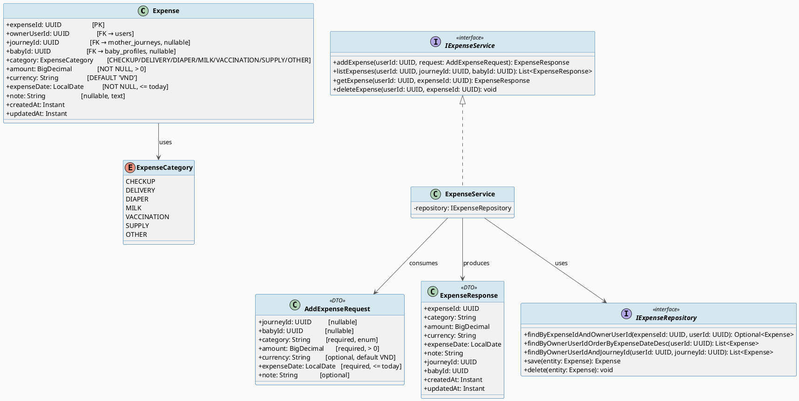
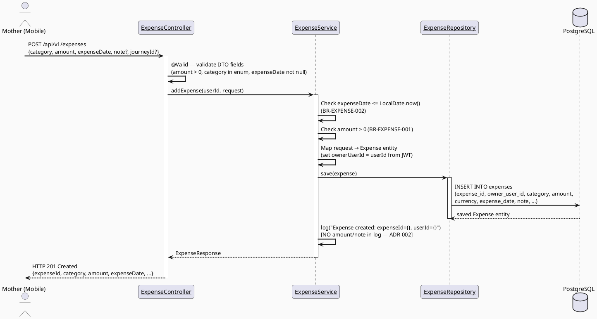
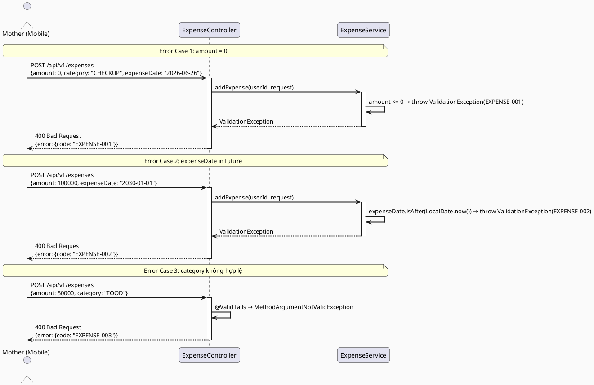
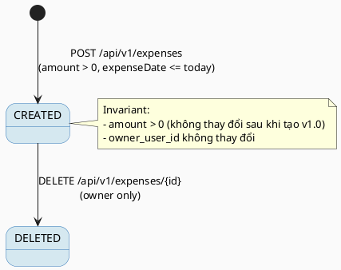

# ENGINEERING DOCUMENTATION STANDARD (EDS) v2.0
# Quy chuẩn Tài liệu Kỹ thuật và Đặc tả Hiện thực hóa

| Field | Value |
|-------|-------|
| **Document ID** | `CB-EXPENSE-IMP-001` |
| **Version** | `1.0` |
| **Date** | `2026-06-26` |
| **Status** | `Draft` |
| **Document Owner** | `AI Agent` |
| **Author** | `AI Agent — Spec Generator` |
| **Reviewed by** | `[ ] Tech Lead — Pending` |
| **DPO Sign-off** | `[ ] Pending — bắt buộc (PII module: personal financial data)` |
| **Approved by** | `[ ] Principal Architect — Pending` |
| **Last Review** | `2026-06-26` |
| **Based on EDS** | `v2.0` |

---

## CHANGELOG

> **Policy 4.4 — Immutable History:** Không bao giờ xóa thông tin cũ. Mọi thay đổi phải ghi vào bảng này.

| Ngày | Người thực hiện | Nội dung thay đổi |
|------|-----------------|-------------------|
| 2026-06-26 | AI Agent — Spec Generator | Tạo tài liệu lần đầu cho UC51 Add Expense |

---

## MỤC LỤC

1. [Tổng quan Module](#1-tổng-quan-module)
2. [Ma trận Truy vết (Traceability Matrix)](#2-ma-trận-truy-vết-traceability-matrix)
3. [Architecture Decision Records (ADR)](#3-architecture-decision-records-adr)
4. [Non-Functional Requirements & SLA](#4-non-functional-requirements--sla)
5. [Static Modeling (Mô hình Tĩnh)](#5-static-modeling-mô-hình-tĩnh)
6. [Dynamic Modeling (Mô hình Động)](#6-dynamic-modeling-mô-hình-động)
7. [Domain Event Catalog](#7-domain-event-catalog)
8. [Interface Specification (Đặc tả Giao diện)](#8-interface-specification-đặc-tả-giao-diện)
9. [API Specification](#9-api-specification)
10. [Bảng mã lỗi (Error Codes)](#10-bảng-mã-lỗi-error-codes)
11. [Quy trình Triển khai (Step-by-Step)](#11-quy-trình-triển-khai-step-by-step)
12. [Rollback & Incident Runbook](#12-rollback--incident-runbook)
13. [Kịch bản Kiểm thử Chi tiết](#13-kịch-bản-kiểm-thử-chi-tiết)
14. [Phương pháp Xác minh](#14-phương-pháp-xác-minh)
15. [Mẫu thử thực tế (API Verification Samples)](#15-mẫu-thử-thực-tế-api-verification-samples)
16. [Bảng tổng hợp phân quyền (Authorization Matrix)](#16-bảng-tổng-hợp-phân-quyền-authorization-matrix)
17. [AI Prompt Constraints (CASE 2.0)](#17-ai-prompt-constraints-case-20)

---

## 1. Tổng quan Module

> UC51 — Add Expense cho phép bà mẹ (Mother) ghi nhận chi phí liên quan đến hành trình thai kỳ / chăm sóc em bé, bao gồm: khám thai (CHECKUP), sinh nở (DELIVERY), tã (DIAPER), sữa (MILK), vắc-xin (VACCINATION), vật tư (SUPPLY), và khác (OTHER). Bảng `expenses` đã tồn tại trong V1__init_schema.sql — không cần migration mới.
>
> **Lưu ý bảo mật:** Dữ liệu chi tiêu cá nhân là PII tài chính. DPO sign-off bắt buộc trước khi deploy.

| Field | Value |
|-------|-------|
| **Module Name** | `Expense` |
| **Bounded Context** | `CareJourney — Financial Tracking` |
| **Data Classification** | `PII` — Dữ liệu tài chính cá nhân |
| **Compliance Scope** | `PDPA / Luật Bảo vệ Người tiêu dùng` |
| **Upstream Dependencies** | `AuthModule (JWT), MotherJourney, BabyProfile` |
| **Downstream Consumers** | `UC24_ViewMotherJourneyDashboard (expense summary), báo cáo tài chính (tương lai)` |

---

## 2. Ma trận Truy vết (Traceability Matrix)

| Requirement ID | Loại (BR/ADR/US) | Mô tả yêu cầu | Thành phần Code | Compliance Target | ADR liên quan |
|----------------|------------------|---------------|-----------------|-------------------|---------------|
| BR-EXPENSE-001 | Business Rule | amount phải > 0 | `ExpenseService.addExpense()` — validation | — | — |
| BR-EXPENSE-002 | Business Rule | expense_date không được ở tương lai | `ExpenseService.addExpense()` — date check | — | ADR-001 |
| BR-EXPENSE-003 | Business Rule | category phải là 1 trong: CHECKUP, DELIVERY, DIAPER, MILK, VACCINATION, SUPPLY, OTHER | `AddExpenseRequest` — @Pattern validation | — | — |
| BR-EXPENSE-004 | Business Rule | currency mặc định là VND | `Expense` entity — default value | — | — |
| BR-RBAC | Business Rule | Mother chỉ được truy cập expenses của chính mình | `ExpenseService` — ownership check | — | — |
| BR-PRIVACY | Business Rule | Expense data là PII tài chính — không log plaintext | `ExpenseService`, logging config | PDPA | ADR-002 |
| US-UC51-001 | User Story | Bà mẹ thêm chi phí mới với đầy đủ thông tin | `POST /api/v1/expenses` | — | — |
| SRS-3.3.1.28 | User Story | SRS reference cho UC51 | Toàn bộ module | — | — |
| ADR-001 | Decision | Validate expense_date server-side, không tin client date | `ExpenseService` | — | — |
| ADR-002 | Decision | Không log amount hoặc note plaintext trong application log | Logging config + Service | PDPA | — |

---

## 3. Architecture Decision Records (ADR)

### ADR-001 — Validate expense_date server-side (không tin client timestamp)

| Field | Value |
|-------|-------|
| **Status** | `Accepted` |
| **Deciders** | `AI Agent — Spec Generator` |
| **Date** | `2026-06-26` |
| **Supersedes** | `N/A` |

#### Bối cảnh (Context)

BR-EXPENSE-002 yêu cầu expense_date không được ở tương lai. Mobile client có thể gửi ngày sai (do clock skew, timezone). Cần validate server-side.

#### Các phương án đã xem xét (Options Considered)

| Phương án | Mô tả | Ưu điểm | Nhược điểm |
|-----------|-------|----------|------------|
| A | Validate chỉ ở client (Flutter) | + Nhanh (no round trip) | - Bypass dễ dàng; - Clock skew client không tin cậy |
| B | Validate server-side trong Service layer | + Tin cậy; + Bắt buộc với mọi client | - Cần so sánh với server's LocalDate.now() |

#### Quyết định (Decision)

Chọn **Phương án B** — Server-side validation trong `ExpenseService.addExpense()`. So sánh `request.getExpenseDate()` với `LocalDate.now()` trên server. Nếu `expenseDate.isAfter(LocalDate.now())` → throw exception với code `EXPENSE-002`.

#### Hệ quả (Consequences)

**Tích cực:**
- Không thể bypass validation từ mobile client.
- Dữ liệu luôn nhất quán về nghiệp vụ.

**Tiêu cực / Trade-offs:**
- Timezone phải được xử lý nhất quán (Server dùng UTC, client gửi date dạng `yyyy-MM-dd`).

**Compliance Impact:**
- N/A trực tiếp, nhưng hỗ trợ data integrity.

### ADR-002 — Không log PII tài chính trong application log

| Field | Value |
|-------|-------|
| **Status** | `Accepted` |
| **Deciders** | `AI Agent — Spec Generator` |
| **Date** | `2026-06-26` |
| **Supersedes** | `N/A` |

#### Bối cảnh (Context)

`amount`, `note`, `category` là dữ liệu tài chính cá nhân. Logging plaintext trong application logs vi phạm PDPA và gây rủi ro data leak nếu log system bị compromise.

#### Quyết định (Decision)

Service chỉ log `expenseId` và `userId` (không log `amount`, `note`). Sử dụng log format: `"Expense created: expenseId={}, userId={}"`.

#### Hệ quả (Consequences)

**Tích cực:**
- Giảm rủi ro PII exposure qua logs.

**Tiêu cực / Trade-offs:**
- Debug khó hơn khi cần trace giá trị amount — chấp nhận vì ưu tiên privacy.

**Compliance Impact:**
- Tuân thủ PDPA yêu cầu không log sensitive financial data.

---

## 4. Non-Functional Requirements & SLA

### 4.1. Performance & Availability

| Category | Requirement | Target SLA | Measurement Method | Compliance Basis |
|----------|-------------|------------|---------------------|------------------|
| Latency | POST /expenses (p99) | `< 300ms` | k6 load test | — |
| Latency | GET /expenses (p99) | `< 300ms` | k6 load test | — |
| Availability | Uptime (monthly) | `99.9%` | Uptime monitor | — |
| Throughput | Concurrent requests | `300 req/s` | Load test | — |

### 4.2. Data Integrity & Retention

| Category | Requirement | Target | Verification Method | Compliance Basis |
|----------|-------------|--------|---------------------|------------------|
| Durability | Không mất dữ liệu expense | RPO = 0 | Transaction log | PDPA |
| Retention | Expense records | Tối thiểu 5 năm | DB backup policy | Luật Kế toán VN |
| Consistency | amount = giá trị user nhập, không bị round | 100% | Unit test numeric precision | — |

### 4.3. Security

| Category | Requirement | Target | Verification Method | Compliance Basis |
|----------|-------------|--------|---------------------|------------------|
| Encryption in transit | All endpoints | TLS 1.3+ | SSL Labs scan | PDPA |
| Access control | owner-only | Least privilege | Auth Matrix (§16) | PDPA |
| PII non-logging | amount, note không xuất hiện trong log | 0 occurrences | Log grep audit | PDPA |

### 4.4. Scalability & Capacity Planning

> Dự kiến: ~5,000 active mothers, trung bình ~50 expense records/người/năm. Tổng ~250,000 records/year. Index `idx_expenses_owner_user_id` đã có trong V1 schema. Horizontal scaling nếu cần.

---

## 5. Static Modeling (Mô hình Tĩnh)

### 5.1. Class Diagram (PlantUML)



### 5.2. Data Structure (Flyway SQL Migration)

> **Schema Note:** Bảng `expenses` đã tồn tại trong V1__init_schema.sql. KHÔNG cần migration mới cho UC51. Chỉ cần implement Java layer.

Bảng hiện tại từ V1 (tham chiếu):

```sql
-- Đã có trong V1__init_schema.sql — KHÔNG tạo lại
CREATE TABLE public.expenses (
    expense_id    uuid        NOT NULL DEFAULT gen_random_uuid(),
    owner_user_id uuid        NOT NULL,                    -- FK → users(user_id)
    journey_id    uuid,                                    -- FK → mother_journeys, nullable
    baby_id       uuid,                                    -- FK → baby_profiles, nullable
    category      varchar(80),                             -- 'CHECKUP','DELIVERY','DIAPER','MILK','VACCINATION','SUPPLY','OTHER'
    amount        numeric     NOT NULL,                    -- > 0 (validate in Service)
    currency      varchar(10) NOT NULL DEFAULT 'VND',
    expense_date  date        NOT NULL,                    -- <= today (validate in Service)
    note          text,                                    -- nullable
    created_at    timestamptz NOT NULL DEFAULT now(),
    updated_at    timestamptz NOT NULL DEFAULT now()
);

-- Index đã có:
CREATE INDEX idx_expenses_owner_user_id ON public.expenses(owner_user_id);

-- FKs đã có trong V1 (tham chiếu):
-- expenses.owner_user_id → users(user_id)
-- expenses.journey_id → mother_journeys(journey_id)
-- expenses.baby_id → baby_profiles(baby_id)
```

> **Không cần Flyway migration mới.** Bảng đã đầy đủ trong V1.

---

## 6. Dynamic Modeling (Mô hình Động)

### 6.1. Sequence Diagram — Happy Path: Thêm chi phí (PlantUML)



### 6.2. Sequence Diagram — Error Path (PlantUML)



### 6.3. State Machine

> Expense không có phức tạp state machine. Lifecycle đơn giản: CREATED → (deleted nếu user muốn). Không có trạng thái trung gian.



---

## 7. Domain Event Catalog

### 7.1. Events Published (Phát ra)

| Event Name | Trigger | Publisher | Subscriber(s) | Payload Schema | Async? |
|------------|---------|-----------|---------------|----------------|--------|
| `ExpenseRecorded` | Mother thêm chi phí mới | `ExpenseService` | `JourneyDashboardService` (summary update) | `ExpenseRecorded.java` | No (sync) |

### 7.2. Events Consumed (Tiêu thụ)

| Event Name | Source | Handler | Action thực hiện |
|------------|--------|---------|------------------|
| Không applicable cho v1.0 | — | — | — |

### 7.3. Payload Schema

```java
// ExpenseRecorded.java
public record ExpenseRecorded(
    UUID    eventId,       // UUID.randomUUID()
    String  eventType,     // "ExpenseRecorded"
    Instant occurredAt,    // Instant.now()
    String  version,       // "1.0"
    Payload payload,
    Metadata metadata
) {
    public record Payload(
        UUID       expenseId,    // ID của expense vừa tạo
        UUID       ownerUserId,  // User sở hữu
        UUID       journeyId,    // nullable
        String     category,     // CHECKUP / DELIVERY / ... (không log amount — ADR-002)
        LocalDate  expenseDate
        // NOTE: amount và note KHÔNG được đưa vào event payload (PII — ADR-002)
    ) {}

    public record Metadata(
        UUID   correlationId,
        String causedBy          // userId
    ) {}
}
```

---

## 8. Interface Specification (Đặc tả Giao diện)

### 8.1. Service Interface

```java
// AddExpenseRequest.java — Input DTO
// @version 1.0
public class AddExpenseRequest {
    private UUID journeyId;           // Optional

    private UUID babyId;              // Optional

    @NotNull
    @Pattern(regexp = "CHECKUP|DELIVERY|DIAPER|MILK|VACCINATION|SUPPLY|OTHER",
             message = "category must be one of: CHECKUP, DELIVERY, DIAPER, MILK, VACCINATION, SUPPLY, OTHER")
    private String category;

    @NotNull
    @DecimalMin(value = "0", inclusive = false, message = "amount must be greater than 0")
    @Digits(integer = 15, fraction = 2)
    private BigDecimal amount;

    @Size(max = 10)
    private String currency;          // Default: VND (set in Service if null)

    @NotNull
    private LocalDate expenseDate;    // Validated server-side: <= today

    @Size(max = 2000)
    private String note;              // Optional
}

// ExpenseResponse.java — Output DTO
// @version 1.0
public class ExpenseResponse {
    private UUID       expenseId;
    private String     category;
    private BigDecimal amount;
    private String     currency;
    private LocalDate  expenseDate;
    private String     note;
    private UUID       journeyId;
    private UUID       babyId;
    private Instant    createdAt;
    private Instant    updatedAt;
}

// IExpenseService.java — Service Contract
// @version 1.0
public interface IExpenseService {
    /**
     * Ghi nhận một chi phí mới cho Mother.
     * @throws ValidationException (EXPENSE-001) khi amount <= 0
     * @throws ValidationException (EXPENSE-002) khi expenseDate ở tương lai
     * @throws ValidationException (EXPENSE-003) khi category không hợp lệ
     */
    ExpenseResponse addExpense(UUID userId, AddExpenseRequest request);

    /**
     * Lấy danh sách chi phí của user, có thể lọc theo journeyId hoặc babyId.
     */
    List<ExpenseResponse> listExpenses(UUID userId, UUID journeyId, UUID babyId);

    /**
     * Lấy chi tiết một expense.
     * @throws ResourceNotFoundException (EXPENSE-004) khi không tồn tại
     * @throws AccessDeniedException (EXPENSE-005) khi không phải owner
     */
    ExpenseResponse getExpense(UUID userId, UUID expenseId);

    /**
     * Xóa một expense.
     * @throws ResourceNotFoundException (EXPENSE-004) khi không tồn tại
     * @throws AccessDeniedException (EXPENSE-005) khi không phải owner
     */
    void deleteExpense(UUID userId, UUID expenseId);
}
```

### 8.2. Repository Interface

```java
// IExpenseRepository.java
// @version 1.0
public interface IExpenseRepository extends JpaRepository<Expense, UUID> {

    Optional<Expense> findByExpenseIdAndOwnerUserId(UUID expenseId, UUID userId);

    List<Expense> findByOwnerUserIdOrderByExpenseDateDesc(UUID userId);

    List<Expense> findByOwnerUserIdAndJourneyIdOrderByExpenseDateDesc(UUID userId, UUID journeyId);

    List<Expense> findByOwnerUserIdAndBabyIdOrderByExpenseDateDesc(UUID userId, UUID babyId);

    // Dùng để tính tổng chi phí theo journey (tương lai — không implement trong UC51 v1.0)
    // @Query("SELECT SUM(e.amount) FROM Expense e WHERE e.ownerUserId = :userId AND e.journeyId = :journeyId")
    // BigDecimal sumAmountByOwnerAndJourney(@Param("userId") UUID userId, @Param("journeyId") UUID journeyId);
}
```

---

## 9. API Specification

### 9.1. Endpoints Table

| Method | Path | Auth Level | Required Roles | Rate Limit | Idempotent? |
|--------|------|------------|----------------|------------|-------------|
| `POST` | `/api/v1/expenses` | JWT Bearer | `ROLE_MOTHER` | 60/min | No |
| `GET` | `/api/v1/expenses` | JWT Bearer | `ROLE_MOTHER` | 300/min | Yes |
| `GET` | `/api/v1/expenses/{id}` | JWT Bearer | `ROLE_MOTHER` | 300/min | Yes |
| `DELETE` | `/api/v1/expenses/{id}` | JWT Bearer | `ROLE_MOTHER` | 30/min | Yes |

### 9.2. Request / Response Schemas

#### `POST /api/v1/expenses` — Thêm chi phí mới

**Request Body:**
```json
{
  "category": "CHECKUP",
  "amount": 250000,
  "currency": "VND",
  "expenseDate": "2026-06-25",
  "note": "Khám thai tuần 28",
  "journeyId": "uuid-journey-001"
}
```

**Response — 201 Created:**
```json
{
  "expenseId": "uuid-v4",
  "category": "CHECKUP",
  "amount": 250000,
  "currency": "VND",
  "expenseDate": "2026-06-25",
  "note": "Khám thai tuần 28",
  "journeyId": "uuid-journey-001",
  "babyId": null,
  "createdAt": "2026-06-26T00:00:00.000Z",
  "updatedAt": "2026-06-26T00:00:00.000Z"
}
```

**Response — 400 Bad Request (amount <= 0):**
```json
{
  "error": {
    "code": "EXPENSE-001",
    "message": "Số tiền phải lớn hơn 0",
    "details": [
      { "field": "amount", "message": "amount must be greater than 0" }
    ]
  }
}
```

**Response — 400 Bad Request (expenseDate trong tương lai):**
```json
{
  "error": {
    "code": "EXPENSE-002",
    "message": "Ngày chi tiêu không được ở tương lai"
  }
}
```

**Response — 400 Bad Request (category không hợp lệ):**
```json
{
  "error": {
    "code": "EXPENSE-003",
    "message": "Phân loại chi phí không hợp lệ",
    "details": [
      { "field": "category", "message": "category must be one of: CHECKUP, DELIVERY, DIAPER, MILK, VACCINATION, SUPPLY, OTHER" }
    ]
  }
}
```

#### `GET /api/v1/expenses` — Lấy danh sách

**Query params:** `journeyId` (optional), `babyId` (optional)

**Response — 200 OK:**
```json
[
  {
    "expenseId": "uuid-v4",
    "category": "MILK",
    "amount": 350000,
    "currency": "VND",
    "expenseDate": "2026-06-20",
    "note": "Mua sữa công thức",
    "journeyId": null,
    "babyId": "uuid-baby-001",
    "createdAt": "2026-06-20T05:00:00.000Z",
    "updatedAt": "2026-06-20T05:00:00.000Z"
  }
]
```

---

## 10. Bảng mã lỗi (Error Codes)

| Code | HTTP Status | Message (EN) | Message (VI) | Trigger Condition |
|------|-------------|--------------|--------------|-------------------|
| `EXPENSE-001` | 400 | Amount must be greater than 0 | Số tiền phải lớn hơn 0 | amount <= 0 |
| `EXPENSE-002` | 400 | Expense date cannot be in the future | Ngày chi tiêu không được ở tương lai | expenseDate > LocalDate.now() server |
| `EXPENSE-003` | 400 | Invalid expense category | Phân loại chi phí không hợp lệ | category không thuộc enum |
| `EXPENSE-004` | 404 | Expense not found | Không tìm thấy chi phí | expenseId không tồn tại |
| `EXPENSE-005` | 403 | Access denied: not expense owner | Không có quyền truy cập chi phí này | owner_user_id != currentUserId |
| `EXPENSE-006` | 500 | Internal error | Lỗi hệ thống | Unexpected DB/service error |

---

## 11. Quy trình Triển khai (Step-by-Step)

### 11.1. Prerequisites

- [ ] ADR-001 và ADR-002 đã được Accepted
- [ ] **DPO đã sign-off** (module PII — data tài chính cá nhân)
- [ ] Blueprint đã được Principal Architect approve
- [ ] Môi trường staging đã sẵn sàng

### 11.2. Pre-Migration Checklist

> Không cần migration mới — bảng `expenses` đã tồn tại trong V1.

- [ ] Xác nhận bảng `expenses` tồn tại trên staging: `SELECT COUNT(*) FROM information_schema.tables WHERE table_name = 'expenses';`
- [ ] Xác nhận index `idx_expenses_owner_user_id` tồn tại

### 11.3. Implementation Steps

#### Chặng 1 — Tạo Entity JPA mapping

Bảng `expenses` đã có trong DB. Chỉ cần tạo `@Entity` class map với bảng.

```
com.carebridge.backend.expense/
├── controller/
│   └── ExpenseController.java
├── service/
│   ├── IExpenseService.java
│   └── ExpenseServiceImpl.java
├── repository/
│   └── ExpenseRepository.java
├── entity/
│   ├── Expense.java
│   └── ExpenseCategory.java     (enum)
├── dto/
│   ├── AddExpenseRequest.java
│   └── ExpenseResponse.java
└── mapper/
    └── ExpenseMapper.java
```

#### Chặng 2 — Implement Service với validation

```java
// Trong ExpenseServiceImpl.addExpense():
// 1. Validate amount > 0 (BR-EXPENSE-001)
if (request.getAmount().compareTo(BigDecimal.ZERO) <= 0) {
    throw new ValidationException("EXPENSE-001", "Amount must be greater than 0");
}
// 2. Validate expenseDate <= today (BR-EXPENSE-002, ADR-001)
if (request.getExpenseDate().isAfter(LocalDate.now())) {
    throw new ValidationException("EXPENSE-002", "Expense date cannot be in the future");
}
// 3. Set currency default (BR-EXPENSE-004)
String currency = StringUtils.hasText(request.getCurrency()) ? request.getCurrency() : "VND";
// 4. Set ownerUserId từ JWT (BR-RBAC)
expense.setOwnerUserId(userId);
```

#### Chặng 3 — Verification sau deploy

```bash
# Kiểm tra health
curl -X GET https://[host]/api/v1/health
# Expected: {"status": "ok"}

# Verify bảng expenses tồn tại và có data (smoke test)
psql -h $DB_HOST -U $DB_USER -d $DB_NAME \
  -c "SELECT COUNT(*) FROM public.expenses;"
```

### 11.4. Deployment Checklist

- [ ] Health check endpoint trả về 200
- [ ] DPO đã nhận thông báo deploy PII module
- [ ] Error rate < 1% trong 10 phút đầu
- [ ] Log audit: không có amount/note plaintext trong application log
- [ ] POST /api/v1/expenses với valid data trả về 201

---

## 12. Rollback & Incident Runbook

### 12.1. Điều kiện kích hoạt Rollback (Trigger Conditions)

| Điều kiện | Ngưỡng | Người quyết định |
|-----------|--------|------------------|
| Error rate tăng đột biến | > 5% trong 5 phút | On-call Engineer |
| Latency p99 vượt ngưỡng | > 600ms | On-call Engineer |
| PII data leak phát hiện | Bất kỳ case nào | Tech Lead + DPO |
| amount/note xuất hiện trong log | Bất kỳ case nào | Tech Lead + DPO |

### 12.2. Rollback Procedure

```bash
# Bước 1: Không có migration mới → chỉ cần rollback code
kubectl rollout undo deployment/carebridge-api

# Bước 2: Verify rollback thành công
kubectl rollout status deployment/carebridge-api
curl -X GET https://[host]/api/v1/health

# Bước 3: Kiểm tra log không có PII
kubectl logs -l app=carebridge-api | grep -i "amount\|note\|currency" | head -20
# Expected: Không có giá trị cụ thể — chỉ có field names trong schema logs
```

### 12.3. Notification Protocol

| Thời điểm | Người nhận | Kênh | Template |
|-----------|------------|------|----------|
| Ngay khi phát hiện | On-call team | Slack `#incident` | "INCIDENT [carebridge-api] expense service: [mô tả]" |
| Trong 30 phút | DPO | Email | "PII module incident: expenses service affected. Details: [mô tả không có PII data]" |
| Trong 72 giờ | DPA | Email | Bắt buộc nếu có data breach (PDPA) |

### 12.4. Post-Incident Review (PIR)

- **Timeline:** Diễn biến từng bước theo thứ tự thời gian
- **Root Cause:** 5 Whys analysis
- **Impact:** Số users ảnh hưởng, thời gian downtime, PII exposure?
- **Remediation:** Bước đã thực hiện
- **Prevention:** Action items tránh tái diễn

---

## 13. Kịch bản Kiểm thử Chi tiết

> **Policy:** Mọi test data phải dùng SYNTHETIC data. TUYỆT ĐỐI KHÔNG dùng PII thật (số tiền thật, ghi chú thật của user).

### 13.1. Unit Tests

#### TC-UNIT-001 — Thêm expense hợp lệ thành công

```gherkin
Feature: Thêm chi phí hợp lệ
  Background:
    Given test data classification: SYNTHETIC
    And user MOTHER_001 đã đăng nhập với JWT hợp lệ

  Scenario: Thêm expense CHECKUP hợp lệ
    Given amount = 250000, category = "CHECKUP", expenseDate = hôm nay
    When ExpenseService.addExpense(MOTHER_001, request) được gọi
    Then trả về ExpenseResponse với expenseId != null
    And currency = "VND"
    And ownerUserId = MOTHER_001 (set từ JWT, không từ request)
    And repository.save() được gọi đúng 1 lần

  Scenario: currency null → default VND
    Given amount = 100000, category = "DIAPER", currency = null
    When ExpenseService.addExpense(MOTHER_001, request) được gọi
    Then ExpenseResponse.getCurrency() == "VND"
```

**Hàm được test:** `ExpenseServiceImpl.addExpense()`
**Invariant kiểm tra:** currency default = VND khi không được cung cấp

#### TC-UNIT-002 — amount <= 0 → EXPENSE-001

```gherkin
  Scenario: amount = 0 → EXPENSE-001
    Given amount = 0, category = "MILK"
    When ExpenseService.addExpense(MOTHER_001, request)
    Then ném ValidationException với code EXPENSE-001
    And repository.save() không được gọi

  Scenario: amount âm → EXPENSE-001
    Given amount = -1000
    When ExpenseService.addExpense(MOTHER_001, request)
    Then ném ValidationException với code EXPENSE-001
```

#### TC-UNIT-003 — expenseDate trong tương lai → EXPENSE-002

```gherkin
  Scenario: expenseDate = ngày mai → EXPENSE-002
    Given expenseDate = LocalDate.now().plusDays(1)
    When ExpenseService.addExpense(MOTHER_001, request)
    Then ném ValidationException với code EXPENSE-002
    And repository.save() không được gọi

  Scenario: expenseDate = hôm nay → thành công
    Given expenseDate = LocalDate.now()
    When ExpenseService.addExpense(MOTHER_001, request)
    Then không có exception, trả về ExpenseResponse hợp lệ
```

**Invariant kiểm tra:** Server date được dùng để so sánh (không tin client date)

#### TC-UNIT-004 — Ownership check khi getExpense

```gherkin
  Scenario: MOTHER_002 cố lấy expense của MOTHER_001 → EXPENSE-005
    Given expense EXPENSE_001 thuộc MOTHER_001
    And repository.findByExpenseIdAndOwnerUserId(EXPENSE_001, MOTHER_002) trả về empty
    When ExpenseService.getExpense(MOTHER_002, EXPENSE_001)
    Then ném AccessDeniedException với code EXPENSE-005
```

### 13.2. Integration Tests

#### TC-INT-001 — Thêm expense và verify trong DB

```gherkin
  Scenario: Tạo expense và verify DB
    Given test data classification: SYNTHETIC
    And database đang chạy với seed user MOTHER_001
    When POST /api/v1/expenses với {amount: 250000, category: "CHECKUP", expenseDate: "2026-06-25"}
    Then response status là 201
    And DB chứa record với amount = 250000 và category = 'CHECKUP'
    And record.owner_user_id = MOTHER_001
    And record.currency = 'VND'
```

**External dependencies:** PostgreSQL (Testcontainers)
**Mock strategy:** Testcontainers PostgreSQL container

### 13.3. E2E / Security Tests

#### TC-E2E-001 — Luồng hoàn chỉnh

```gherkin
  Scenario: Mother thêm và truy vấn expense
    Given MOTHER_001 đã đăng nhập với JWT hợp lệ
    When POST /api/v1/expenses với body hợp lệ
    Then response status là 201, có expenseId
    When GET /api/v1/expenses
    Then response chứa expense vừa tạo

  Scenario: Không có JWT → 401
    When POST /api/v1/expenses không có Authorization header
    Then response status là 401

  Scenario: Cross-user: MOTHER_002 cố xóa expense của MOTHER_001
    Given EXPENSE_001 thuộc MOTHER_001
    And MOTHER_002 đã đăng nhập
    When DELETE /api/v1/expenses/{EXPENSE_001} bởi MOTHER_002
    Then response status là 403, error code EXPENSE-005

  Scenario: Audit log không chứa amount
    Given MOTHER_001 tạo expense {amount: 999999}
    When kiểm tra application log
    Then log KHÔNG chứa "999999" (ADR-002 — no PII in log)
```

---

## 14. Phương pháp Xác minh

### 14.1. Database Inspection

```sql
-- Verify bảng expenses tồn tại (từ V1)
SELECT table_name FROM information_schema.tables
WHERE table_schema = 'public' AND table_name = 'expenses';

-- Verify expense được tạo đúng
SELECT expense_id, owner_user_id, category, amount, currency, expense_date, created_at
FROM public.expenses
WHERE owner_user_id = '[mother-user-uuid]'
ORDER BY expense_date DESC;

-- Verify constraint: amount không được <= 0 (DB không có CHECK constraint — đây là Service-layer rule)
-- Test bằng unit test TC-UNIT-002

-- Verify index tồn tại
SELECT indexname FROM pg_indexes
WHERE tablename = 'expenses' AND indexname = 'idx_expenses_owner_user_id';
```

### 14.2. Log / Audit Verification

```bash
# Kiểm tra log không chứa amount/note (PDPA — ADR-002)
kubectl logs -l app=carebridge-api | grep -E '"amount":|"note":' | head -10
# Expected: No output (PII không được log)

# Kiểm tra log format đúng (chỉ chứa expenseId và userId)
kubectl logs -l app=carebridge-api | grep '"Expense created"' | head -5
# Expected format: {"message":"Expense created","expenseId":"uuid","userId":"uuid"}

# Verify không có PII trong log
kubectl logs -l app=carebridge-api | grep -i "250000\|khám thai"
# Expected: No output
```

### 14.3. Tool-based Verification

```bash
# Verify TLS
openssl s_client -connect [host]:443 -tls1_3 2>&1 | grep "Protocol"
# Expected: Protocol  : TLSv1.3

# Verify JWT role claims
echo "[JWT_TOKEN]" | cut -d'.' -f2 | base64 -d | jq '.roles'
# Expected: ["ROLE_MOTHER"]
```

---

## 15. Mẫu thử thực tế (API Verification Samples)

### 15.1. Happy Path

```bash
# Thêm expense khám thai
curl -X POST https://[host]/api/v1/expenses \
  -H "Authorization: Bearer [JWT_TOKEN]" \
  -H "Content-Type: application/json" \
  -H "X-Correlation-Id: $(uuidgen)" \
  -d '{
    "category": "CHECKUP",
    "amount": 250000,
    "currency": "VND",
    "expenseDate": "2026-06-25",
    "note": "Khám thai tuần 28",
    "journeyId": "uuid-journey-001"
  }'
```

**Expected Response (201):**
```json
{
  "expenseId": "550e8400-e29b-41d4-a716-446655440000",
  "category": "CHECKUP",
  "amount": 250000,
  "currency": "VND",
  "expenseDate": "2026-06-25",
  "note": "Khám thai tuần 28",
  "journeyId": "uuid-journey-001",
  "babyId": null,
  "createdAt": "2026-06-26T00:00:00.000Z",
  "updatedAt": "2026-06-26T00:00:00.000Z"
}
```

### 15.2. Error Paths

```bash
# amount = 0 → 400 EXPENSE-001
curl -X POST https://[host]/api/v1/expenses \
  -H "Authorization: Bearer [JWT_TOKEN]" \
  -H "Content-Type: application/json" \
  -d '{"category": "MILK", "amount": 0, "expenseDate": "2026-06-25"}'
```

**Expected Response (400):**
```json
{
  "error": {
    "code": "EXPENSE-001",
    "message": "Số tiền phải lớn hơn 0",
    "details": [{ "field": "amount", "message": "amount must be greater than 0" }]
  }
}
```

```bash
# expenseDate trong tương lai → 400 EXPENSE-002
curl -X POST https://[host]/api/v1/expenses \
  -H "Authorization: Bearer [JWT_TOKEN]" \
  -H "Content-Type: application/json" \
  -d '{"category": "CHECKUP", "amount": 100000, "expenseDate": "2030-01-01"}'
```

**Expected Response (400):**
```json
{
  "error": {
    "code": "EXPENSE-002",
    "message": "Ngày chi tiêu không được ở tương lai"
  }
}
```

```bash
# Không có JWT → 401
curl -X GET https://[host]/api/v1/expenses
```

**Expected Response (401):**
```json
{
  "error": {
    "code": "IAM-001",
    "message": "Authentication required"
  }
}
```

---

## 16. Bảng tổng hợp phân quyền (Authorization Matrix)

| Endpoint | `GUEST` | `MOTHER` | `EXPERT` | `ADMIN` | `SYSTEM` |
|----------|---------|----------|----------|---------|----------|
| `POST /api/v1/expenses` | ❌ | ✅ | ❌ | ❌ | ✅ |
| `GET /api/v1/expenses` | ❌ | ✅ Own | ❌ | ❌ | ✅ All |
| `GET /api/v1/expenses/{id}` | ❌ | ✅ Own | ❌ | ❌ | ✅ All |
| `DELETE /api/v1/expenses/{id}` | ❌ | ✅ Own | ❌ | ❌ | ✅ |

**Chú thích:**
- ✅ = Được phép
- ❌ = Bị từ chối (403)
- `Own` = Chỉ được phép với resource của chính mình (`owner_user_id = currentUserId`)

**Lưu ý PII:** ADMIN không có quyền trực tiếp đọc expense cá nhân của user (Privacy by Design — PDPA). Chỉ SYSTEM (background jobs, audit) có full access với logging đầy đủ.

---

## 17. AI Prompt Constraints (CASE 2.0)

### 17.1 Constraint Summary Table

| # | Constraint | Source (ADR/BR) | Last Verified |
|---|-----------|-----------------|---------------|
| C1 | Service PHẢI kiểm tra `ownerUserId == currentUserId` (từ JWT) trước mọi read/delete | `BR-RBAC` | `2026-06-26` |
| C2 | amount PHẢI > 0 — validate trong Service layer (không chỉ DTO) | `BR-EXPENSE-001` | `2026-06-26` |
| C3 | expenseDate PHẢI <= `LocalDate.now()` trên SERVER — không tin client date | `BR-EXPENSE-002`, `ADR-001` | `2026-06-26` |
| C4 | currency default = "VND" nếu request không cung cấp | `BR-EXPENSE-004` | `2026-06-26` |
| C5 | KHÔNG log `amount`, `note` trong application log — chỉ log `expenseId` và `userId` | `BR-PRIVACY`, `ADR-002` | `2026-06-26` |
| C6 | userId lấy từ `SecurityContextHolder` / JWT principal — KHÔNG nhận từ request body | `BR-RBAC` | `2026-06-26` |
| C7 | Controller chỉ validate DTO (@Valid) và gọi IExpenseService — không có business logic | CLAUDE.md Architecture Rules | `2026-06-26` |

### 17.2 Constraint Injection Block (Copy-Paste vào AI Prompt)

```
[CONSTRAINT BLOCK — Module: Expense]
Theo TDS CB-EXPENSE-IMP-001 và các ADR liên quan:

1. (C1) Service PHẢI kiểm tra ownerUserId == userId (từ JWT) trước mọi thao tác. Vi phạm → throw AccessDeniedException EXPENSE-005.
2. (C2) amount PHẢI > 0 — validate trong ExpenseService, không chỉ trong DTO annotation. Nếu <= 0 → throw ValidationException EXPENSE-001.
3. (C3) expenseDate PHẢI <= LocalDate.now() trên SERVER — sử dụng LocalDate.now() trong Service, không nhận server date từ client. Vi phạm → throw ValidationException EXPENSE-002.
4. (C4) currency = request.getCurrency() nếu không null/blank, ELSE "VND". Set trong Service trước khi gọi repository.
5. (C5) KHÔNG log amount, note, hay bất kỳ financial PII nào. Log format: log.info("Expense created: expenseId={}, userId={}", id, userId). KHÔNG log amount.
6. (C6) userId = SecurityContextHolder.getContext().getAuthentication().getName() — KHÔNG từ request body.
7. (C7) ExpenseController chỉ có @Valid + service.method() — không có if/else business logic.

[CONTEXT BLOCK]
- Bounded Context: CareJourney — Financial Tracking
- Data Classification: PII (financial data)
- Compliance: PDPA
- Existing interfaces: §8 Service Interface + §8.2 Repository Interface
- Error codes: §10 Error Codes Table (EXPENSE-001 đến EXPENSE-006)
- Auth matrix: §16 Authorization Matrix
- Schema: expenses table đã có trong V1 — không cần migration mới

[TASK BLOCK]
Implement ExpenseServiceImpl thỏa mãn constraints trên.
Output phải tuân thủ §8 Interface Specification.
Tests phải cover §13 Test Scenarios.
KHÔNG tạo migration mới — bảng expenses đã có trong V1__init_schema.sql.
```

### 17.3 Constraint Quality Checklist

- [x] Mỗi constraint traceable về ADR hoặc BR cụ thể
- [x] Không có constraint generic
- [x] Mỗi constraint có `Last Verified` date ≤ 2 sprints
- [x] Constraint block có ≥ 3 constraints cụ thể (có 7)
- [x] Constraint block reference §8 Interface
- [x] Constraint block reference §16 Auth Matrix

### 17.4 Anti-Pattern Detection

| AP-ID | Anti-Pattern | Dấu hiệu | Hành động |
|-------|-------------|-----------|----------|
| AP-AI-001 | Unconstrained Gen | Code không validate amount server-side | Reject — inject lại C2 |
| AP-AI-003 | Implicit Decision | Code tạo migration mới cho bảng expenses | Reject — bảng đã có trong V1 |
| AP-AI-004 | Layer Violation | Controller chứa `if (amount <= 0)` | Reject — inject lại C7 |
| AP-AI-005 | Hallucinated Contract | Code log `expense.getAmount()` | Reject — vi phạm ADR-002 |

---

## PHỤ LỤC

### A. Glossary (Thuật ngữ)

| Thuật ngữ | Định nghĩa |
|-----------|------------|
| PII | Personally Identifiable Information — dữ liệu định danh cá nhân (ở đây: dữ liệu tài chính) |
| PDPA | Personal Data Protection Act — Luật bảo vệ dữ liệu cá nhân áp dụng |
| amount | Số tiền chi tiêu, kiểu `numeric` trong DB, `BigDecimal` trong Java |
| expense_date | Ngày chi tiêu — phải là ngày quá khứ hoặc hôm nay, kiểu `date` trong DB |
| owner_user_id | UUID của Mother user sở hữu expense — không được phép thay đổi sau khi tạo |
| currency | Đơn vị tiền tệ — mặc định VND |

### B. Tài liệu tham chiếu

| Document | Link / Path |
|----------|-------------|
| V1 Schema (nguồn sự thật DB) | `05_Development/CareBridgeAPI/src/main/resources/db/migration/V1__init_schema.sql` |
| SRS UC51 | `01_Requirements/SRS.md §3.3.1.28` |
| EDS v2.0 Template | `08_References/Template/PHASE-3_TDS.md` |
| TDD Template | `08_References/Template/PHASE-4_Test-Spec.md` |
| CLAUDE.md Architecture Rules | `d:\SEP490\CareBridge_SEP490_G79\CLAUDE.md` |
