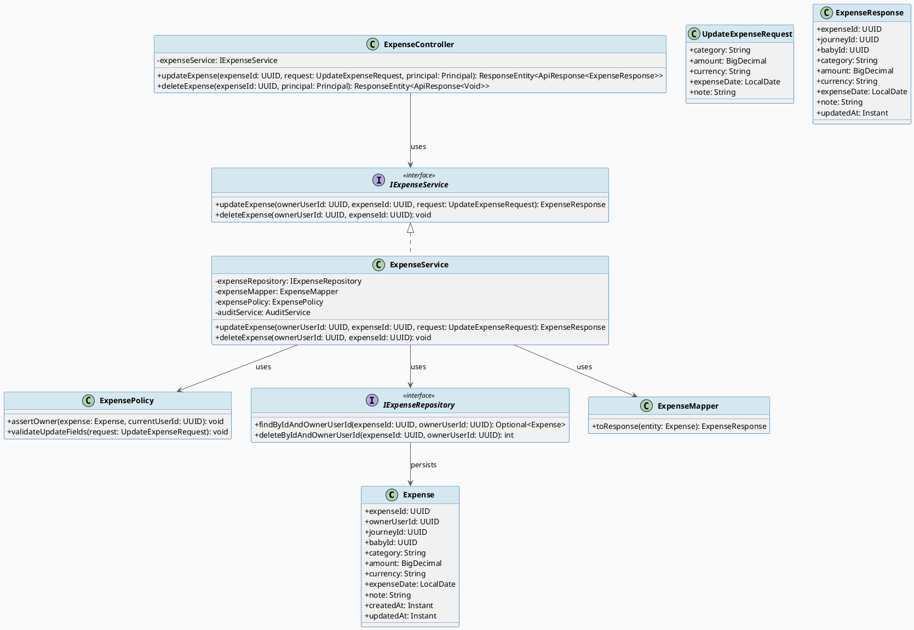
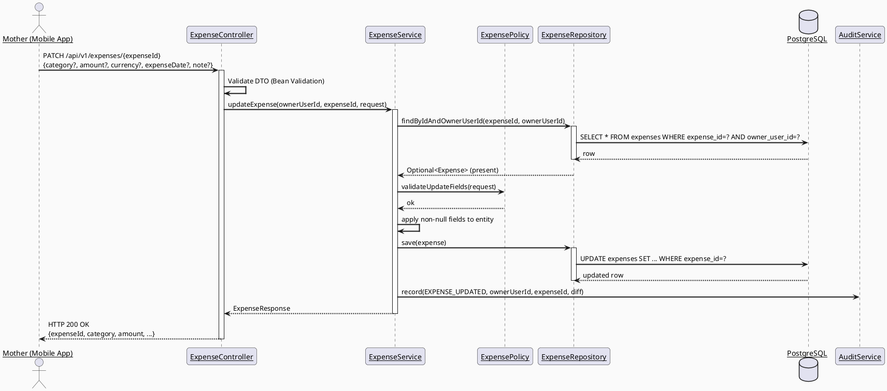
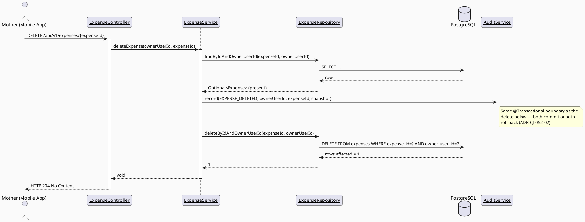
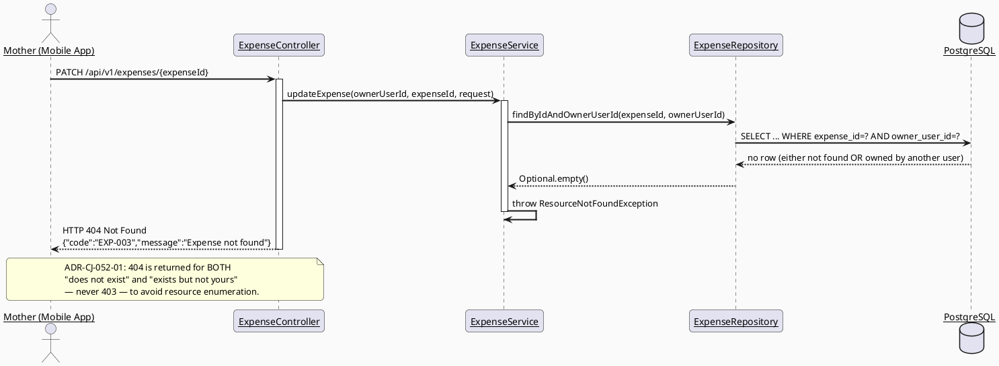

# ENGINEERING DOCUMENTATION STANDARD (EDS) v2.0
# UC52 — Update Expense

| Field | Value |
|-------|-------|
| **Document ID** | `CB-CAREJOURNEY-IMP-052` |
| **Version** | `1.0` |
| **Date** | `2026-07-01` |
| **Status** | `Approved` |
| **Document Owner** | `AI Agent` |
| **Author** | `AI Agent — Technical Architect` |
| **Reviewed by** | `[ ] Pending` |
| **DPO Sign-off** | `[ ] Pending` *(required — module touches Mother/family financial + care-journey data, PDPA scope)* |
| **Approved by** | `[ ] Pending` |
| **Last Review** | `2026-07-01` |
| **Based on EDS** | `v2.0` |

---

## CHANGELOG

> **Policy 4.4 — Immutable History:** Never delete prior entries. All changes must be logged here.

| Ngày | Người thực hiện | Nội dung thay đổi |
|------|-----------------|-------------------|
| 2026-07-01 | AI Agent — Technical Architect | Initial draft — TDS for UC52 Update Expense |
| 2026-07-07 | AI Agent — Amelia (Dev Agent) | Implemented PATCH updateExpense() and hard-delete deleteExpense() in ExpenseServiceImpl. ADR-CJ-052-01: findByIdAndOwnerUserId returns 404 for both not-found and not-owned (privacy by design). Audit log written before delete. Tests GREEN. |

---

## MỤC LỤC

1. [Tổng quan Module](#1-tổng-quan-module)
2. [Ma trận Truy vết (Traceability Matrix)](#2-ma-trận-truy-vết-traceability-matrix)
3. [Architecture Decision Records (ADR)](#3-architecture-decision-records-adr)
4. [Non-Functional Requirements & SLA](#4-non-functional-requirements--sla)
5. [Static Modeling (Mô hình Tĩnh)](#5-static-modeling-mô-hình-tĩnh)
6. [Dynamic Modeling (Mô hình Động)](#6-dynamic-modeling-mô-hình-động)
7. [Domain Event Catalog](#7-domain-event-catalog)
8. [Interface Specification (Đặc tả Giao diện)](#8-interface-specification-đặc-tả-giao-diện)
9. [API Specification](#9-api-specification)
10. [Bảng mã lỗi (Error Codes)](#10-bảng-mã-lỗi-error-codes)
11. [Quy trình Triển khai (Step-by-Step)](#11-quy-trình-triển-khai-step-by-step)
12. [Rollback & Incident Runbook](#12-rollback--incident-runbook)
13. [Kịch bản Kiểm thử Chi tiết](#13-kịch-bản-kiểm-thử-chi-tiết)
14. [Phương pháp Xác minh](#14-phương-pháp-xác-minh)
15. [Mẫu thử thực tế (API Verification Samples)](#15-mẫu-thử-thực-tế-api-verification-samples)
16. [Bảng tổng hợp phân quyền (Authorization Matrix)](#16-bảng-tổng-hợp-phân-quyền-authorization-matrix)
17. [AI Prompt Constraints (CASE 2.0)](#17-ai-prompt-constraints-case-20)

---

## 1. Tổng quan Module

> UC52 lets the Mother edit or delete a previously user-entered expense record that belongs to her own care journey / baby profile. It is the mutate counterpart of UC51 Add Expense (`3.3.1.28`, not yet specced) and is read by UC53 View Expense Summary (`3.3.1.30`). **Research finding (RG-3):** the persistence layer for expenses **already exists** — table `public.expenses` was created in `V1__init_schema.sql` (lines 767-779, PK `expenses_pkey` on `expense_id`, FKs to `users(owner_user_id)`, `mother_journeys(journey_id)`, `baby_profiles(baby_id)`, index `idx_expenses_owner_user_id`). No Java entity/controller/service/repository exists anywhere in `com.carebridge.backend.carejourney` (package currently holds only `.gitkeep` placeholders in `controller/dto/entity/mapper/policy/repository/service`), and no Flutter code exists for expenses in `lib/features/motherJourney/` or `lib/features/babyCare/` (also `.gitkeep`-only). This is therefore **not** a greenfield-schema feature — it is greenfield **code** over an existing table. This TDS treats `V1__init_schema.sql` as the immutable schema baseline and does **not** propose altering the `expenses` table's existing columns; see §5.2 for the one additive migration this TDS requires.

| Field | Value |
|-------|-------|
| **Module Name** | `Update Expense` |
| **Bounded Context** | `carejourney` (package `com.carebridge.backend.carejourney`) |
| **Data Classification** | `PII` *(financial data tied to a specific mother/family; indirectly reveals health/care events via `category`/`note`)* |
| **Compliance Scope** | `PDPA / Luật 91/2025` |
| **Upstream Dependencies** | `IAM (JWT auth, SecurityUtils.requireCurrentUserId)`, `mother_journeys` (journey ownership), `baby_profiles` (baby ownership), Audit module |
| **Downstream Consumers** | `UC53 View Expense Summary` (reads updated/remaining expense rows), `Audit/AuditLog` (records sensitive mutation) |

---

## 2. Ma trận Truy vết (Traceability Matrix)

| Requirement ID | Loại (BR/ADR/US) | Mô tả yêu cầu | Thành phần Code | Compliance Target | ADR liên quan |
|----------------|------------------|---------------|-----------------|-------------------|---------------|
| SRS-3.3.1.29 (UC-52) | User Story | Mother updates or deletes a user-entered expense | `ExpenseService.updateExpense()`, `ExpenseService.deleteExpense()` | — | ADR-CJ-052-01 |
| PRE-3 / BR-RBAC | Business Rule | Actor must be authenticated and hold required role/permission (Mother) | `ExpenseController` (`@PreAuthorize`), `ExpensePolicy.assertOwner()` | — | ADR-CJ-052-01 |
| (Derived from PRE-4 + generic UC template) BR-OWNERSHIP | Business Rule (derived — no explicit BR-OWNERSHIP ID exists in `02_Requirements`; inferred from BR-RBAC "permitted data scope" + PRE-4 "required reference data exists" + FK `owner_user_id`) | Mother may only update/delete an expense she owns (`expenses.owner_user_id = current user`) | `ExpensePolicy.assertOwner()`, `ExpenseRepository.findByIdAndOwnerUserId()` | — | ADR-CJ-052-01 |
| BR-PRIVACY | Business Rule | Health/family (here: financial) data follows consent, purpose, minimum-necessary access | `ExpenseMapper` (no cross-owner leakage in DTO), `ExpenseService` | PDPA | ADR-CJ-052-02 |
| BR-CONSULTATION | Business Rule | Booking/payment/dispute/refund/pricing actions keep an auditable lifecycle state — **applied here by analogy** to the financial nature of an expense record; UC52 is not a consultation-payment flow, so this rule is satisfied via audit logging rather than a dispute/refund lifecycle | `AuditService.record()` call inside `ExpenseService.updateExpense/deleteExpense` | PDPA audit | ADR-CJ-052-02 |
| E1 (Exceptions, generic UC template) | Exception | Access denied when unauthenticated/unauthorized/out of scope | `ExpenseController` 401/403 mapping, `AuthenticationException`, `AccessDeniedBusinessException` | — | ADR-CJ-052-01 |
| E2 (Exceptions, generic UC template) | Exception | Invalid/missing/expired/conflicting data rejected with field-level message | `UpdateExpenseRequest` bean validation, `ValidationException` | — | ADR-CJ-052-03 |
| E3 (Exceptions, generic UC template) | Exception | External/network/server failure handled with retry guidance, no duplicate unsafe action | `ExpenseService` (idempotent PATCH via full-resource replace semantics), standard 5xx handling | — | ADR-CJ-052-03 |

**Open item (RG-2):** The SRS UC-52 entry (`3.3.1.29`, table 131) is a **generic templated use case** — Normal Flow, Alternative Flows, and Exceptions are the same boilerplate text repeated across UC-49 through UC-56 in `3_Functional_Specification.md`. There is no UC-specific field list, no explicit validation rule for `amount`/`category`/`expense_date`, and no explicit BR-OWNERSHIP identifier. This TDS derives the ownership rule from the `owner_user_id` foreign key and BR-RBAC's "permitted data scope" language, and derives field constraints from the existing `expenses` table DDL. Anything beyond that is marked `Open` below rather than invented.

---

## 3. Architecture Decision Records (ADR)

### ADR-CJ-052-01 — Ownership enforced at service layer via `owner_user_id`, not role alone

| Field | Value |
|-------|-------|
| **Status** | `Accepted` |
| **Deciders** | `AI Agent — Technical Architect` |
| **Date** | `2026-07-01` |
| **Supersedes** | `—` |

#### Bối cảnh (Context)
`expenses.owner_user_id` is a plain FK to `users(user_id)`; there is no separate "expense sharing" or "care group visibility" table referenced by `expenses`. BR-RBAC requires role-scoped access, but Mother role alone is insufficient — a Mother must not be able to update another Mother's expense.

#### Các phương án đã xem xét (Options Considered)

| Phương án | Mô tả | Ưu điểm | Nhược điểm |
|-----------|-------|----------|------------|
| A | Enforce ownership purely in repository query (`findByIdAndOwnerUserId`) | Simple, DB-level filter, cannot leak by mistake in service logic | Returns generic "not found" for both true-not-found and forbidden, which is intentional (avoids resource-enumeration) but must be documented |
| B | Fetch by ID only, then check `owner_user_id` in service/policy layer, throw 403 if mismatched | Explicit 403 distinguishes "exists but not yours" from "does not exist" | Leaks existence of other users' expense IDs (minor info disclosure) |

#### Quyết định (Decision)
Chọn **Phương án A**. Repository method `findByIdAndOwnerUserId(UUID expenseId, UUID ownerUserId)` returns `Optional<Expense>`; a miss (not found OR not owned) surfaces as `404 Not Found` via `ResourceNotFoundException`, never `403`. This also aligns with BR-PRIVACY minimum-necessary disclosure (no confirmation that a foreign expense ID exists).

#### Hệ quả (Consequences)

**Tích cực:**
- No accidental cross-user leakage; single repository call enforces both existence and ownership.
- Matches BR-PRIVACY minimum-necessary principle (no "expense exists but is not yours" signal).

**Tiêu cực / Trade-offs:**
- Client cannot distinguish "wrong ID" from "someone else's expense" — acceptable trade-off, documented in §10 Error Codes and Test-Spec.

**Compliance Impact:**
- Reduces PDPA-relevant information disclosure surface for family financial data.

---

### ADR-CJ-052-02 — Update/Delete are audited; delete is a hard delete (no soft-delete column exists)

| Field | Value |
|-------|-------|
| **Status** | `Accepted` |
| **Deciders** | `AI Agent — Technical Architect` |
| **Date** | `2026-07-01` |
| **Supersedes** | `—` |

#### Bối cảnh (Context)
`public.expenses` (V1 baseline) has no `deleted_at` / `is_deleted` / status column, unlike append-only PII tables elsewhere in the schema (e.g. `safety_events`). UC52's description explicitly says "Updates **or deletes**" — the SRS intends a real delete, not a status flip. Adding a soft-delete column would require altering an already-applied migration's table (SRS/CLAUDE.md forbid modifying an applied migration) or a fresh additive migration.

#### Các phương án đã xem xét (Options Considered)

| Phương án | Mô tả | Ưu điểm | Nhược điểm |
|-----------|-------|----------|------------|
| A | Hard delete row via `ExpenseRepository.deleteByIdAndOwnerUserId` + write an `AuditLog` entry beforehand with a snapshot of the deleted values | Matches SRS wording exactly; no schema change needed | If audit write fails independently from delete, must be transactional (both succeed or both roll back) |
| B | Add new `deleted_at` column (new Flyway migration) and soft-delete | Recoverable, consistent with append-only pattern elsewhere | Contradicts literal SRS wording ("deletes"); adds scope not requested; would need UC53 to filter `deleted_at IS NULL` everywhere, out of stated scope |

#### Quyết định (Decision)
Chọn **Phương án A** — hard delete, but always preceded (same DB transaction) by an `AuditLog` write capturing `{expenseId, ownerUserId, amount, category, expenseDate, journeyId, babyId}` so POST-3 ("sensitive actions recorded for audit") is satisfied even though the row itself is gone. Both writes occur in the same `@Transactional` service method.

#### Hệ quả (Consequences)

**Tích cực:**
- Matches literal SRS behavior; no unrequested schema/behavior expansion.
- Audit trail preserved despite hard delete.

**Tiêu cực / Trade-offs:**
- Data is not recoverable via UC52/UC53 code path once deleted (DB backup is the only recovery path) — flagged as an **Open item** for product/DPO to confirm this is acceptable for financial family data.

**Compliance Impact:**
- Audit log entry is the compliance record of the deletion event (BR-CONSULTATION-by-analogy "auditable lifecycle state").

> **Open item (RG-5 candidate conflict — surfaced, not resolved):** Hard delete vs. soft delete is a product/compliance decision, not purely technical. This TDS defaults to hard delete because it matches the literal SRS text and avoids inventing schema not authorized by the brief, but flags it explicitly for the orchestrating agent/user to confirm before implementation.

---

### ADR-CJ-052-03 — Update endpoint is a full-resource PATCH-with-validation (partial update semantics)

| Field | Value |
|-------|-------|
| **Status** | `Accepted` |
| **Deciders** | `AI Agent — Technical Architect` |
| **Date** | `2026-07-01` |

#### Quyết định (Decision)
`PATCH /api/v1/expenses/{expenseId}` accepts any subset of `{category, amount, currency, expenseDate, note}` (all optional in the request DTO); only non-null fields are applied. `journeyId`/`babyId`/`ownerUserId` are immutable after creation (not part of UC52's update surface — reassigning an expense to a different journey/baby is out of scope and not mentioned in SRS).

#### Hệ quả (Consequences)
- Idempotent under retry (same PATCH body reapplied has same effect) — satisfies E3 "no duplicate unsafe action".
- Field-level validation errors map to `422`/`400` per §10.

---

## 4. Non-Functional Requirements & SLA

### 4.1. Performance & Availability

| Category | Requirement | Target SLA | Measurement Method | Compliance Basis |
|----------|-------------|------------|---------------------|------------------|
| Latency | `PATCH /expenses/{id}` p99 | `< 300ms` | APM / manual timing (`Open` — no k6 setup found in repo for this module) | — |
| Latency | `DELETE /expenses/{id}` p99 | `< 300ms` | Same as above | — |
| Availability | Endpoint uptime (monthly) | `99.9%` *(project-wide default, not UC-specific — Open: no UC52-specific SLA found in SRS)* | Uptime monitor | — |

### 4.2. Data Integrity & Retention

| Category | Requirement | Target | Verification Method | Compliance Basis |
|----------|-------------|--------|---------------------|------------------|
| Consistency | Update/delete + audit log write are atomic | 100% (single `@Transactional` boundary) | Integration test forcing audit failure → expect rollback | PDPA |
| Retention | `audit_logs` retention | Follows existing `audit_logs` table retention policy (`Open` — no explicit retention period found in repo docs for `audit_logs`) | DB backup policy | PDPA |

### 4.3. Security

| Category | Requirement | Target | Verification Method | Compliance Basis |
|----------|-------------|--------|---------------------|------------------|
| Access control | Role-based + ownership | Mother role AND `owner_user_id` match only | Authorization Matrix (§16) + `ExpenseServiceTest` | BR-RBAC |
| Transport | JWT Bearer required | All endpoints | `@PreAuthorize("isAuthenticated()")` + MockMvc 401 test | — |
| Input validation | Reject invalid `amount`/`expenseDate`/`currency` | 100% field coverage | Bean Validation + `ExpenseControllerTest` | — |

### 4.4. Scalability & Capacity Planning

> Expense records are low-volume per user (few entries per week per Mother). No special scaling design required beyond the existing `idx_expenses_owner_user_id` index. `Open` — no explicit 12-month load projection exists in repo docs for this module.

---

## 5. Static Modeling (Mô hình Tĩnh)

### 5.1. Class Diagram (PlantUML)



### 5.2. Data Structure (Flyway SQL Migration)

> **CareBridge rule:** `V1__init_schema.sql` already defines `public.expenses` (lines 767-779) with PK `expense_id`, FKs `expenses_owner_user_id_fkey → users(user_id)`, `expenses_journey_id_fkey → mother_journeys(journey_id)`, `expenses_baby_id_fkey → baby_profiles(baby_id)`, and index `idx_expenses_owner_user_id`. **No column change is required for UC52** (update/delete of `category`, `amount`, `currency`, `expense_date`, `note` all map to existing columns).

**Schema Delta Check (CG-9):** UC52 alone requires **no new migration**. However, ADR-CJ-052-02 requires that delete events be captured in `audit_logs` — this table already exists in V1 (line 31) with generic columns; confirm its shape supports an arbitrary JSON/text payload before implementation (verify column list at implementation time; if `audit_logs` lacks a flexible payload column, a small additive migration `V20260701000001__add_audit_log_payload_column.sql` may be needed — **Open item**, not committed to in this TDS since `audit_logs` full column list was not exhaustively re-verified against `AuditLog.java` entity in this research pass).

Highest existing migration version observed: `V20260629000002__create_community_answer_likes.sql`. If any schema change is later approved for this feature, next version should be `V20260701000001__<name>.sql` (today's date `2026-07-01`, per repo's `V{YYYYMMDDHHMMSS}__name.sql` convention used since `V20260627...`).

---

## 6. Dynamic Modeling (Mô hình Động)

### 6.1. Sequence Diagram — Happy Path: Update Expense (PlantUML)



### 6.2. Sequence Diagram — Happy Path: Delete Expense (PlantUML)



### 6.3. Sequence Diagram — Error Path: Not Owned / Not Found (PlantUML)



### 6.4. State Machine

> `expenses` has no status/state column (V1 baseline). Not applicable — reason: the entity's only lifecycle is create → (update)* → delete (hard delete, terminal). No state machine diagram is required.

---

## 7. Domain Event Catalog

### 7.1. Events Published (Phát ra)

| Event Name | Trigger | Publisher | Subscriber(s) | Payload Schema | Async? |
|------------|---------|-----------|---------------|----------------|--------|
| `ExpenseUpdated` | Successful `updateExpense()` | `ExpenseService` | `AuditService` (in-process call, not a message bus — `Open`: repo has no message broker; treated as synchronous audit write per existing `AuditService` pattern) | `ExpenseUpdated.java` (§7.3) | No |
| `ExpenseDeleted` | Successful `deleteExpense()` | `ExpenseService` | `AuditService` | `ExpenseDeleted.java` (§7.3) | No |

### 7.2. Events Consumed (Tiêu thụ)

| Event Name | Source | Handler | Action thực hiện |
|------------|--------|---------|------------------|
| _(none)_ | — | — | UC52 does not consume events from other modules. |

### 7.3. Payload Schema

```java
// ExpenseUpdated.java — internal audit payload (not a message-bus event; matches existing AuditService call pattern)
public record ExpenseUpdated(
    UUID    expenseId,
    UUID    ownerUserId,
    Instant occurredAt,
    Map<String, Object> changedFields   // field -> new value, non-null fields only
) {}

// ExpenseDeleted.java
public record ExpenseDeleted(
    UUID    expenseId,
    UUID    ownerUserId,
    Instant occurredAt,
    BigDecimal amountSnapshot,
    String  categorySnapshot,
    LocalDate expenseDateSnapshot
) {}
```

---

## 8. Interface Specification (Đặc tả Giao diện)

### 8.1. Service Interface

```java
// UpdateExpenseRequest.java — Input DTO
// @version 1.0
public class UpdateExpenseRequest {
    @Size(max = 80)
    private String category;            // optional — matches expenses.category varchar(80)

    @DecimalMin(value = "0.01", inclusive = true)
    private BigDecimal amount;           // optional — matches expenses.amount numeric NOT NULL (must stay > 0 if provided)

    @Size(max = 10)
    private String currency;             // optional — matches expenses.currency varchar(10), default 'VND'

    @PastOrPresent
    private LocalDate expenseDate;       // optional — matches expenses.expense_date date NOT NULL

    private String note;                 // optional — matches expenses.note text
    // getters / setters / @Valid annotations on controller method
}

// ExpenseResponse.java — Output DTO (never expose the JPA entity directly per CLAUDE.md)
public class ExpenseResponse {
    private UUID id;
    private UUID journeyId;
    private UUID babyId;
    private String category;
    private BigDecimal amount;
    private String currency;
    private LocalDate expenseDate;
    private String note;
    private Instant updatedAt;
    // getters / setters
}

// IExpenseService.java — Service Contract
// @version 1.0
public interface IExpenseService {
    /**
     * Updates an existing expense owned by the caller.
     * @throws ResourceNotFoundException (EXP-003) if expense does not exist or is not owned by ownerUserId
     * @throws ValidationException (EXP-001) if request fields fail validation
     */
    ExpenseResponse updateExpense(UUID ownerUserId, UUID expenseId, UpdateExpenseRequest request);

    /**
     * Deletes an existing expense owned by the caller. Hard delete (ADR-CJ-052-02).
     * @throws ResourceNotFoundException (EXP-003) if expense does not exist or is not owned by ownerUserId
     */
    void deleteExpense(UUID ownerUserId, UUID expenseId);
}
```

### 8.2. Repository Interface

```java
// IExpenseRepository.java
// @version 1.0
public interface IExpenseRepository extends JpaRepository<Expense, UUID> {

    Optional<Expense> findByIdAndOwnerUserId(UUID expenseId, UUID ownerUserId);

    @Modifying
    @Query("DELETE FROM Expense e WHERE e.expenseId = :expenseId AND e.ownerUserId = :ownerUserId")
    int deleteByIdAndOwnerUserId(UUID expenseId, UUID ownerUserId);
}
```

### 8.3. Policy Interface

```java
// ExpensePolicy.java
// @version 1.0
public class ExpensePolicy {

    /** Throws ResourceNotFoundException if entity is null (kept here for a single call-site pattern; primary enforcement is the repository query itself per ADR-CJ-052-01). */
    public void assertFound(Expense expense) {
        if (expense == null) {
            throw new ResourceNotFoundException("Expense not found");
        }
    }
}
```

---

## 9. API Specification

### 9.1. Endpoints Table

| Method | Path | Auth Level | Required Roles | Rate Limit | Idempotent? |
|--------|------|------------|----------------|------------|-------------|
| `PATCH` | `/api/v1/expenses/{expenseId}` | JWT Bearer | `MOTHER` (own resource only) | `Open` — no rate-limit config found in repo for this module; recommend 60/min pending confirmation | Yes |
| `DELETE` | `/api/v1/expenses/{expenseId}` | JWT Bearer | `MOTHER` (own resource only) | `Open` — recommend 30/min pending confirmation | Yes |

### 9.2. Request / Response Schemas

#### `PATCH /api/v1/expenses/{expenseId}` — Update

**Request Body:**
```json
{
  "category": "Vaccination",
  "amount": 450000,
  "currency": "VND",
  "expenseDate": "2026-06-20",
  "note": "Updated to reflect actual clinic receipt"
}
```

**Response — 200 OK (Happy Path):**
```json
{
  "success": true,
  "data": {
    "id": "b6f1c9d2-1234-4a5b-9c3e-abcdef123456",
    "journeyId": "11111111-1111-1111-1111-111111111111",
    "babyId": null,
    "category": "Vaccination",
    "amount": 450000,
    "currency": "VND",
    "expenseDate": "2026-06-20",
    "note": "Updated to reflect actual clinic receipt",
    "updatedAt": "2026-07-01T09:00:00.000Z"
  },
  "message": "Expense updated",
  "timestamp": "2026-07-01T09:00:00.000Z"
}
```

**Response — 400/422 (Validation Error):**
```json
{
  "error": {
    "code": "EXP-001",
    "message": "Validation failed",
    "details": [
      { "field": "amount", "message": "amount must be greater than 0" }
    ]
  }
}
```

**Response — 404 Not Found (not owned or not existing):**
```json
{
  "error": {
    "code": "EXP-003",
    "message": "Expense not found"
  }
}
```

#### `DELETE /api/v1/expenses/{expenseId}` — Delete

**Response — 204 No Content (Happy Path):** *(empty body)*

**Response — 404 Not Found:**
```json
{
  "error": {
    "code": "EXP-003",
    "message": "Expense not found"
  }
}
```

---

## 10. Bảng mã lỗi (Error Codes)

| Code | HTTP Status | Message (EN) | Message (VI) | Trigger Condition |
|------|-------------|--------------|--------------|-------------------|
| `EXP-001` | 400/422 | Validation failed | Dữ liệu không hợp lệ | `amount <= 0`, `category` too long, `expenseDate` in the future, malformed `currency` |
| `EXP-002` | 401 | Authentication required | Yêu cầu đăng nhập | Missing/invalid JWT |
| `EXP-003` | 404 | Expense not found | Không tìm thấy chi phí | Expense does not exist OR is not owned by the caller (ADR-CJ-052-01) |
| `EXP-004` | 403 | Insufficient permissions | Không đủ quyền | Caller authenticated but role is not `MOTHER` (role-level, not ownership-level — see §16) |
| `EXP-005` | 500 | Internal error | Lỗi hệ thống | Unexpected persistence/audit failure |

---

## 11. Quy trình Triển khai (Step-by-Step)

### 11.1. Prerequisites

- [ ] ADR-CJ-052-01/02/03 Accepted (see §3)
- [ ] DPO sign-off pending (financial + care-journey PII) — see header
- [ ] Confirm `audit_logs` entity/table can store the payloads in §7.3 (verify at implementation time — §5.2 Open item)
- [ ] This TDS + matching Test-Spec both `Approved`

### 11.2. Pre-Migration Checklist

- [ ] **No new Flyway migration required** for UC52 core scope (table `expenses` already exists in `V1__init_schema.sql`)
- [ ] If `audit_logs` payload shape is found insufficient at implementation time, raise a new additive migration `V20260701000001__<name>.sql` for review before proceeding

### 11.3. Implementation Steps

#### Chặng 1 — Backend domain scaffolding (fill `carejourney` package placeholders)

```
com.carebridge.backend.carejourney
├── entity/Expense.java
├── dto/request/UpdateExpenseRequest.java
├── dto/response/ExpenseResponse.java
├── mapper/ExpenseMapper.java
├── repository/ExpenseRepository.java
├── policy/ExpensePolicy.java
├── service/ExpenseService.java (interface)
├── service/ExpenseServiceImpl.java
└── controller/ExpenseController.java
```

#### Chặng 2 — Wire audit call inside `@Transactional` service methods

```java
@Transactional
public void deleteExpense(UUID ownerUserId, UUID expenseId) {
    Expense expense = expenseRepository.findByIdAndOwnerUserId(expenseId, ownerUserId)
            .orElseThrow(() -> new ResourceNotFoundException("Expense not found"));
    auditService.record(SecurityEventType.EXPENSE_DELETED, ownerUserId, expenseId, /* snapshot */ null);
    expenseRepository.deleteByIdAndOwnerUserId(expenseId, ownerUserId);
}
```

> Note: `SecurityEventType.EXPENSE_DELETED` does not yet exist in `audit/entity/SecurityEventType.java` — must be added as part of implementation (verify enum extensibility does not require a migration; it is a Java enum, not a DB enum type, per current schema which stores `security_events`/`audit_logs` type columns as free text/varchar).

#### Chặng 3 — Verification after deploy

```bash
curl -X GET https://<host>/api/v1/health
# Expected: {"status": "ok"}
```

### 11.4. Deployment Checklist

- [x] `./mvnw test` green for documented UC52 update/delete service subset (4/4 passed in Test-Spec)
- [ ] `PATCH`/`DELETE` manually verified against seeded test expense owned by `mother@carebridge.dev`
- [ ] Audit log entries visible for both update and delete
- [ ] No PII (amount/category/note) leaked in application logs

---

## 12. Rollback & Incident Runbook

### 12.1. Điều kiện kích hoạt Rollback (Trigger Conditions)

| Điều kiện | Ngưỡng | Người quyết định |
|-----------|--------|------------------|
| Error rate on `/expenses/*` | > 5% in 5 min | On-call Engineer |
| Cross-owner data leak detected | Any single case | Tech Lead + DPO |
| Audit log stops recording deletes | > 1 min | On-call Engineer |

### 12.2. Rollback Procedure

```bash
# No new migration exists for UC52 core scope — rollback is code-only:
git checkout -- src/main/java/com/carebridge/backend/carejourney/
git checkout -- src/test/java/com/carebridge/backend/carejourney/

# If the audit_logs additive migration was applied (Open item, §5.2), also:
psql -h $DB_HOST -U $DB_USER -d $DB_NAME \
  -c "ALTER TABLE audit_logs DROP COLUMN IF EXISTS <added_column>;"
psql -h $DB_HOST -U $DB_USER -d $DB_NAME \
  -c "DELETE FROM flyway_schema_history WHERE version = '20260701000001';"
```

### 12.3. Notification Protocol

| Thời điểm | Người nhận | Kênh | Template |
|-----------|------------|------|----------|
| Ngay khi phát hiện | On-call team | Slack `#incident` (`Open` — no confirmed channel name in repo docs) | "Expense module incident: [mô tả]" |
| Trong 30 phút | DPO | Email | Required if cross-owner PII exposure confirmed |

### 12.4. Post-Incident Review (PIR)

> Required within 48 hours of resolution. Standard Timeline / Root Cause / Impact / Remediation / Prevention format (see template §12.4).

---

## 13-15. Kịch bản Kiểm thử / Phương pháp Xác minh / Mẫu thử thực tế

> Detailed test scenarios, verification methods, and API samples are specified in the companion document `UC52_UpdateExpense_Test-Spec.md` (per workflow: TDS references Test-Spec condition IDs; full test cases live only in Test-Spec).

---

## 16. Bảng tổng hợp phân quyền (Authorization Matrix)

| Endpoint | `MOTHER` (own) | `MOTHER` (other's) | `FAMILY` | `EXPERT` | `SYSTEM_ADMIN` |
|----------|:---:|:---:|:---:|:---:|:---:|
| `PATCH /api/v1/expenses/{id}` | ✅ | ❌ (404, ADR-CJ-052-01) | ❌ | ❌ | `Open` — no explicit admin-override rule found in SRS; default deny pending confirmation |
| `DELETE /api/v1/expenses/{id}` | ✅ | ❌ (404) | ❌ | ❌ | `Open` — same as above |

**Chú thích:**
- ✅ = Allowed
- ❌ = Denied (404 for ownership mismatch per ADR-CJ-052-01, not 403 — see §10)
- `FAMILY` role is explicitly excluded because UC52's Primary Actor is Mother only (SRS: "Secondary Actors: None"); no data-sharing/consent grant for expenses is described anywhere in the read sources.

---

## 17. AI Prompt Constraints (CASE 2.0)

**Not applicable — reason:** UC52 Update Expense does not involve AI generation, AI inference, or AI-assisted decision-making of any kind. It is a standard CRUD mutation guarded by ownership + RBAC. No CASE 2.0 constraint injection block is required.

---

*TDS v1.0 (Draft) — UC52 Update Expense.*
*Open items requiring orchestrating-agent/user decision are marked `Open` inline above and repeated in the handoff report.*
