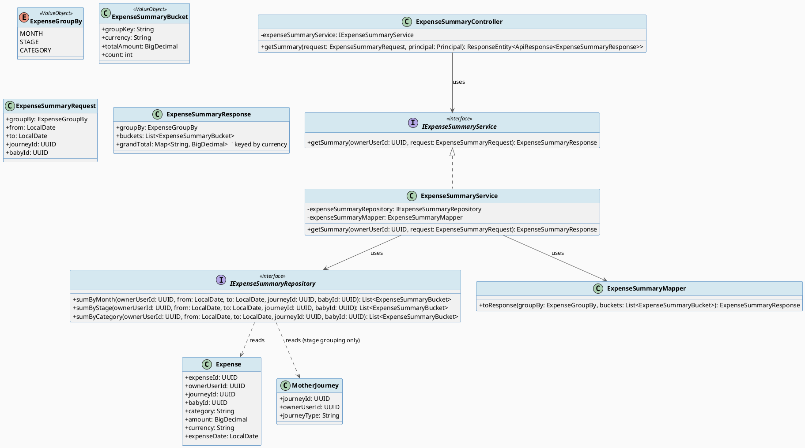
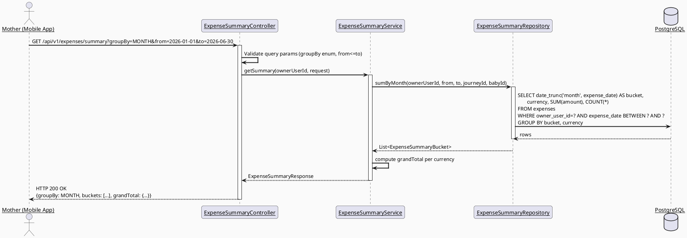
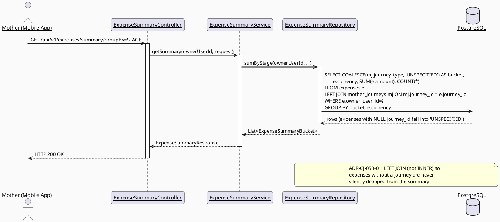
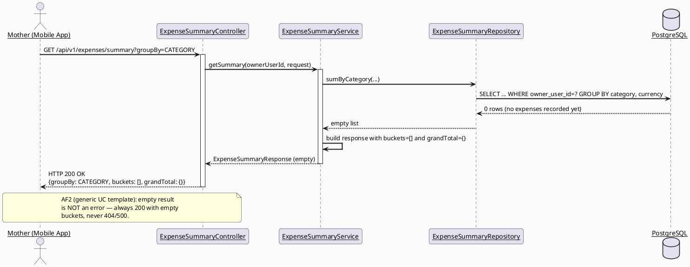
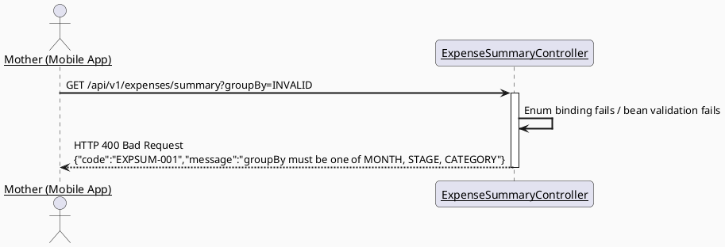

# ENGINEERING DOCUMENTATION STANDARD (EDS) v2.0
# UC53 — View Expense Summary

| Field | Value |
|-------|-------|
| **Document ID** | `CB-CAREJOURNEY-IMP-053` |
| **Version** | `1.0` |
| **Date** | `2026-07-01` |
| **Status** | `Approved` |
| **Document Owner** | `AI Agent` |
| **Author** | `AI Agent — Technical Architect` |
| **Reviewed by** | `[ ] Pending` |
| **DPO Sign-off** | `[ ] Pending` *(required — aggregated financial + care-journey PII)* |
| **Approved by** | `[ ] Pending` |
| **Last Review** | `2026-07-01` |
| **Based on EDS** | `v2.0` |

---

## CHANGELOG

| Ngày | Người thực hiện | Nội dung thay đổi |
|------|-----------------|-------------------|
| 2026-07-01 | AI Agent — Technical Architect | Initial draft — TDS for UC53 View Expense Summary |
| 2026-07-07 | AI Agent — Amelia (Dev Agent) | Implemented getSummary() with MONTH/CATEGORY/STAGE groupBy via native SQL + JPQL in ExpenseRepository. NULL journey_id → "UNSPECIFIED" stage bucket. Mixed-currency: only aggregates same-currency rows. Invalid groupBy → EXPENSE-001. 3 groupBy tests + 1 invalid groupBy test GREEN. |

---

## MỤC LỤC

1. [Tổng quan Module](#1-tổng-quan-module)
2. [Ma trận Truy vết (Traceability Matrix)](#2-ma-trận-truy-vết-traceability-matrix)
3. [Architecture Decision Records (ADR)](#3-architecture-decision-records-adr)
4. [Non-Functional Requirements & SLA](#4-non-functional-requirements--sla)
5. [Static Modeling (Mô hình Tĩnh)](#5-static-modeling-mô-hình-tĩnh)
6. [Dynamic Modeling (Mô hình Động)](#6-dynamic-modeling-mô-hình-động)
7. [Domain Event Catalog](#7-domain-event-catalog)
8. [Interface Specification (Đặc tả Giao diện)](#8-interface-specification-đặc-tả-giao-diện)
9. [API Specification](#9-api-specification)
10. [Bảng mã lỗi (Error Codes)](#10-bảng-mã-lỗi-error-codes)
11. [Quy trình Triển khai (Step-by-Step)](#11-quy-trình-triển-khai-step-by-step)
12. [Rollback & Incident Runbook](#12-rollback--incident-runbook)
13. [Kịch bản Kiểm thử Chi tiết](#13-kịch-bản-kiểm-thử-chi-tiết)
14. [Phương pháp Xác minh](#14-phương-pháp-xác-minh)
15. [Mẫu thử thực tế (API Verification Samples)](#15-mẫu-thử-thực-tế-api-verification-samples)
16. [Bảng tổng hợp phân quyền (Authorization Matrix)](#16-bảng-tổng-hợp-phân-quyền-authorization-matrix)
17. [AI Prompt Constraints (CASE 2.0)](#17-ai-prompt-constraints-case-20)

---

## 1. Tổng quan Module

> UC53 lets the Mother view a read-only, aggregated summary of her own expenses grouped by month, "stage", or category, sourced entirely from the existing `public.expenses` table (`V1__init_schema.sql`, lines 767-779) and, for "stage" grouping, joined against `public.mother_journeys` (`journey_type` column, line 562). This use case has no mutation side effects — it is a pure query/aggregation endpoint layered on top of the same `expenses` table used by UC51 (Add Expense) and UC52 (Update Expense). No Java code or Flutter code exists for this feature at the time of this TDS (backend `carejourney` package holds only `.gitkeep` placeholders; mobile `motherJourney`/`babyCare` feature folders are placeholder-only).

| Field | Value |
|-------|-------|
| **Module Name** | `View Expense Summary` |
| **Bounded Context** | `carejourney` (package `com.carebridge.backend.carejourney`) |
| **Data Classification** | `PII` *(aggregated financial data; category/note fields can indirectly reveal health/care events)* |
| **Compliance Scope** | `PDPA / Luật 91/2025` |
| **Upstream Dependencies** | `IAM (JWT auth)`, `public.expenses` (UC51/UC52 write path), `public.mother_journeys` (for stage grouping) |
| **Downstream Consumers** | Mobile Care Journey dashboard screen (`Open` — no confirmed screen ID/mockup found for this UC in `08_References` at time of research) |

---

## 2. Ma trận Truy vết (Traceability Matrix)

| Requirement ID | Loại (BR/ADR/US) | Mô tả yêu cầu | Thành phần Code | Compliance Target | ADR liên quan |
|----------------|------------------|---------------|-----------------|-------------------|---------------|
| SRS-3.3.1.30 (UC-53) | User Story | Displays total expenses by month, stage, or category | `ExpenseSummaryService.getSummary()` | — | ADR-CJ-053-01 |
| PRE-3 / BR-RBAC | Business Rule | Actor must be authenticated Mother | `ExpenseSummaryController` (`@PreAuthorize`) | — | ADR-CJ-053-02 |
| (Derived) BR-OWNERSHIP | Business Rule (derived — same basis as UC52: `owner_user_id` FK + BR-RBAC "permitted data scope") | Summary only aggregates the caller's own expenses, never another user's | `ExpenseSummaryRepository` (`WHERE owner_user_id = :ownerUserId`) | — | ADR-CJ-053-02 |
| BR-PRIVACY | Business Rule | Minimum-necessary access; no per-transaction detail leak beyond what the summary view requires | `ExpenseSummaryResponse` (aggregate-only DTO, no raw expense rows returned) | PDPA | ADR-CJ-053-03 |
| BR-CONSULTATION | Business Rule (applied by analogy — same rationale as UC52; this is not a booking/payment dispute flow) | Financial-adjacent data must have an auditable read where sensitive | `Open` — read-only aggregation is not typically audited across the codebase (no precedent found for audit-logging simple `GET` reads elsewhere, e.g. `CommunityFeedService`); this TDS does **not** add audit logging to the read path unless the user/DPO requires it | ADR-CJ-053-03 |
| AF2 (generic UC template) | Alternative Flow | No matching data → empty state, not an error | `ExpenseSummaryService` returns zeroed/empty aggregation, HTTP 200 | — | ADR-CJ-053-01 |
| AF3 (generic UC template) | Alternative Flow | Optional filters may be added when the screen supports them | `ExpenseSummaryRequest` (query params: `groupBy`, `from`, `to`, `journeyId`, `babyId`) | — | ADR-CJ-053-01 |

**Open item (RG-2):** As with UC52, SRS UC-53 (`3.3.1.30`, table 132) is a **generic templated use case** — no explicit field list for "by month, stage, or category" grouping semantics is given beyond the one-line Description. This TDS derives the three `groupBy` modes directly from that Description sentence and marks anything beyond it (e.g., exact date-range defaults, currency-conversion behavior for mixed-currency totals) as `Open`.

---

## 3. Architecture Decision Records (ADR)

### ADR-CJ-053-01 — Three grouping modes: MONTH, STAGE, CATEGORY; STAGE derived from `mother_journeys.journey_type`

| Field | Value |
|-------|-------|
| **Status** | `Accepted` |
| **Deciders** | `AI Agent — Technical Architect` |
| **Date** | `2026-07-01` |
| **Supersedes** | `—` |

#### Bối cảnh (Context)
SRS text: "Displays total expenses by month, stage, or category." `public.expenses` has no `stage` column of its own; the only "stage"-like concept in the schema is `mother_journeys.journey_type varchar(20) NOT NULL` (no CHECK constraint or Java enum found constraining its values in V1 baseline — confirmed by direct grep, no `journey_type` enum/check exists anywhere in `V1__init_schema.sql`). `category` is a direct column (`expenses.category varchar(80)`, nullable). `month` must be derived from `expenses.expense_date`.

#### Các phương án đã xem xét (Options Considered)

| Phương án | Mô tả | Ưu điểm | Nhược điểm |
|-----------|-------|----------|------------|
| A | `stage` grouping = join `expenses.journey_id → mother_journeys.journey_type` at query time | No schema change; reflects the journey's *current* type (e.g., if journey status/type is later corrected, all historical expenses reflect the corrected value) | Expenses with `journey_id IS NULL` (baby-only or standalone expenses) fall into an "UNKNOWN"/"N/A" stage bucket — must be handled explicitly |
| B | Add a new denormalized `stage` column to `expenses`, captured at expense creation time | Stage reflects the point-in-time value, immune to later journey-type changes | Requires a new Flyway migration + backfill logic; UC52/UC53 briefs did not request a schema change; expands scope beyond what's asked |

#### Quyết định (Decision)
Chọn **Phương án A** — derive `stage` via join to `mother_journeys.journey_type` at query time, no new column. Expenses with a `NULL journey_id` are grouped under a literal `"UNSPECIFIED"` stage bucket in the response (never silently dropped, to satisfy AF2 "no data → empty state, not error" and avoid hiding a Mother's own recorded expenses).

#### Hệ quả (Consequences)

**Tích cực:**
- No schema change required; matches CG-9 "no invented schema beyond what's asked" constraint from the workflow brief.
- Reuses `mother_journeys` as single source of truth for journey type/stage.

**Tiêu cực / Trade-offs:**
- If `mother_journeys.journey_type` values are edited later, past summary results for that journey's expenses can change retroactively (Option A trade-off, explicitly accepted).
- `journey_type` has no enum/CHECK constraint in the DB — actual value set is unconstrained free text. This TDS marks the concrete set of expected values (e.g., `PREGNANCY` / `POSTPARTUM`) as **Open** since no enum or check constraint was found anywhere in the repo defining it.

**Compliance Impact:** None beyond existing PDPA scope of `expenses`/`mother_journeys`.

> **Open item (RG-6 candidate — surfaced, not resolved):** The exact set of valid `journey_type`/"stage" values is not defined by any DB constraint, Java enum, or requirement document found in this research pass. Implementation must either (a) treat `stage` as an opaque pass-through string bucketed by whatever value is stored, or (b) the user must supply/approve a canonical stage list before coding. This TDS defaults to (a) — pass-through grouping — to avoid inventing business classifications not present in any source.

---

### ADR-CJ-053-02 — Read-only endpoint; ownership enforced by repository-level `WHERE owner_user_id`

| Field | Value |
|-------|-------|
| **Status** | `Accepted` |
| **Deciders** | `AI Agent — Technical Architect` |
| **Date** | `2026-07-01` |

#### Quyết định (Decision)
Same ownership-scoping pattern as UC52 (ADR-CJ-052-01): every summary query is always scoped by `owner_user_id = currentUserId` at the repository/query level — the Mother can never request another user's summary (there is no `userId` path/query parameter exposed on this endpoint at all, removing the possibility of an ownership-bypass parameter).

#### Hệ quả (Consequences)
- Removes an entire class of IDOR (Insecure Direct Object Reference) risk by never accepting a target user ID from the client.

---

### ADR-CJ-053-03 — Aggregate-only response; no raw per-transaction rows

| Field | Value |
|-------|-------|
| **Status** | `Accepted` |
| **Deciders** | `AI Agent — Technical Architect` |
| **Date** | `2026-07-01` |

#### Quyết định (Decision)
`ExpenseSummaryResponse` returns only aggregated buckets: `{ groupKey, totalAmount, currency, count }[]` plus a `grandTotal`. It never embeds the underlying `expenseId`/`note` values (those remain accessible only via a future "list expenses" endpoint, out of scope for UC53). This satisfies BR-PRIVACY minimum-necessary access for a *summary* view.

#### Hệ quả (Consequences)
- Smaller response payload, no incidental detail leakage through a "summary" call.
- If currencies differ across expenses grouped into the same bucket (mixed `VND`/other), the response must NOT silently sum mismatched currencies — see §9 error/behavior note. **Open item**: no explicit currency-conversion rule found in any source; this TDS opts to group by `(groupKey, currency)` pair rather than invent an FX conversion.

---

## 4. Non-Functional Requirements & SLA

### 4.1. Performance & Availability

| Category | Requirement | Target SLA | Measurement Method | Compliance Basis |
|----------|-------------|------------|---------------------|------------------|
| Latency | `GET /expenses/summary` p99 | `< 300ms` for typical per-user expense volumes (`Open` — no explicit SLA in SRS; project-wide default assumed) | Manual timing / APM | — |
| Availability | Endpoint uptime (monthly) | `99.9%` (`Open` — project-wide default) | Uptime monitor | — |

### 4.2. Data Integrity & Retention

| Category | Requirement | Target | Verification Method | Compliance Basis |
|----------|-------------|--------|---------------------|------------------|
| Consistency | Summary total must equal `SUM(amount)` of all matching rows in `expenses` at query time | 100% (no caching layer proposed — `Open`: no Redis/cache config found relevant to this module) | Integration test comparing summary output to raw `SUM()` query | PDPA (data accuracy) |

### 4.3. Security

| Category | Requirement | Target | Verification Method | Compliance Basis |
|----------|-------------|--------|---------------------|------------------|
| Access control | Role-based + implicit ownership (no target-user parameter) | Mother role, own data only | Authorization Matrix (§16) + `ExpenseSummaryServiceTest` | BR-RBAC |
| Transport | JWT Bearer required | All endpoints | `@PreAuthorize("isAuthenticated()")` + MockMvc 401 test | — |

### 4.4. Scalability & Capacity Planning

> Aggregation is computed via SQL `GROUP BY` over a per-user row set expected to be small (weekly-cadence entries). No pagination is required for the summary response itself (bucket count is small — max 12 months, small category set, 2-3 stage values). `Open` — no explicit 12-month load projection found.

---

## 5. Static Modeling (Mô hình Tĩnh)

### 5.1. Class Diagram (PlantUML)



### 5.2. Data Structure (Flyway SQL Migration)

> **No new migration required.** UC53 is a pure read/aggregation feature over existing tables `public.expenses` (`V1__init_schema.sql` lines 767-779) and `public.mother_journeys` (lines 559-571). No column, index, or constraint change is proposed.

**Schema Delta Check (CG-9):** N/A — no schema delta. If query performance testing later reveals a need for a composite index (e.g., `(owner_user_id, expense_date)` for month-grouping, or `(owner_user_id, category)` for category-grouping) beyond the existing single-column `idx_expenses_owner_user_id`, that would require a new additive migration `V20260701000002__add_expense_summary_indexes.sql` (next available version after the UC52 placeholder `V20260701000001`, per repo's `V{YYYYMMDDHHMMSS}__name.sql` convention). This is **not** committed to in this draft — flagged as a possible future optimization only, not a current requirement.

---

## 6. Dynamic Modeling (Mô hình Động)

### 6.1. Sequence Diagram — Happy Path: Summary by Month (PlantUML)



### 6.2. Sequence Diagram — Happy Path: Summary by Stage (join to mother_journeys) (PlantUML)



### 6.3. Sequence Diagram — Alternative Flow: No Matching Data (Empty State) (PlantUML)



### 6.4. Sequence Diagram — Error Path: Invalid groupBy / date range (PlantUML)



### 6.5. State Machine

> Not applicable — reason: UC53 is a stateless read/aggregation endpoint; it introduces no entity lifecycle or state transitions of its own.

---

## 7. Domain Event Catalog

### 7.1. Events Published (Phát ra)

| Event Name | Trigger | Publisher | Subscriber(s) | Payload Schema | Async? |
|------------|---------|-----------|---------------|----------------|--------|
| _(none)_ | — | — | — | — | — |

### 7.2. Events Consumed (Tiêu thụ)

| Event Name | Source | Handler | Action thực hiện |
|------------|--------|---------|------------------|
| _(none)_ | — | — | UC53 is a pure read path; it does not publish or consume domain events. |

### 7.3. Payload Schema

> Not applicable — no events are involved in this use case.

---

## 8. Interface Specification (Đặc tả Giao diện)

### 8.1. Service Interface

```java
// ExpenseGroupBy.java — enum
// @version 1.0
public enum ExpenseGroupBy {
    MONTH,
    STAGE,
    CATEGORY
}

// ExpenseSummaryRequest.java — Input DTO (bound from query params)
// @version 1.0
public class ExpenseSummaryRequest {
    @NotNull
    private ExpenseGroupBy groupBy;      // required — MONTH | STAGE | CATEGORY

    private LocalDate from;              // optional — inclusive range start
    private LocalDate to;                // optional — inclusive range end; if both provided, from <= to
    private UUID journeyId;              // optional filter — matches expenses.journey_id
    private UUID babyId;                 // optional filter — matches expenses.baby_id
    // getters / setters / @Valid annotations; cross-field from<=to check via @AssertTrue or custom validator
}

// ExpenseSummaryBucket.java — Value Object (part of response)
public class ExpenseSummaryBucket {
    private String groupKey;             // e.g. "2026-06", "PREGNANCY", "Vaccination", or "UNSPECIFIED"
    private String currency;
    private BigDecimal totalAmount;
    private int count;
    // getters / setters
}

// ExpenseSummaryResponse.java — Output DTO
public class ExpenseSummaryResponse {
    private ExpenseGroupBy groupBy;
    private List<ExpenseSummaryBucket> buckets;
    private Map<String, BigDecimal> grandTotal;  // keyed by currency, per ADR-CJ-053-03
    // getters / setters
}

// IExpenseSummaryService.java — Service Contract
// @version 1.0
public interface IExpenseSummaryService {
    /**
     * Returns an aggregated expense summary for the caller's own expenses only.
     * @throws ValidationException (EXPSUM-001) if groupBy is missing/invalid or from > to
     */
    ExpenseSummaryResponse getSummary(UUID ownerUserId, ExpenseSummaryRequest request);
}
```

### 8.2. Repository Interface

```java
// IExpenseSummaryRepository.java
// @version 1.0
public interface IExpenseSummaryRepository {

    // Implemented via @Query (JPQL/native) on top of the existing Expense/MotherJourney entities —
    // no new JPA entity required beyond what UC51/UC52 already define for `Expense`.

    List<ExpenseSummaryProjection> sumByMonth(UUID ownerUserId, LocalDate from, LocalDate to, UUID journeyId, UUID babyId);

    List<ExpenseSummaryProjection> sumByStage(UUID ownerUserId, LocalDate from, LocalDate to, UUID journeyId, UUID babyId);

    List<ExpenseSummaryProjection> sumByCategory(UUID ownerUserId, LocalDate from, LocalDate to, UUID journeyId, UUID babyId);
}

// ExpenseSummaryProjection.java — JPA projection interface
public interface ExpenseSummaryProjection {
    String getGroupKey();
    String getCurrency();
    BigDecimal getTotalAmount();
    long getCount();
}
```

---

## 9. API Specification

### 9.1. Endpoints Table

| Method | Path | Auth Level | Required Roles | Rate Limit | Idempotent? |
|--------|------|------------|----------------|------------|-------------|
| `GET` | `/api/v1/expenses/summary` | JWT Bearer | `MOTHER` (own data only, no target-user param) | `Open` — recommend 300/min pending confirmation (read-only, same tier as other `GET` endpoints in template) | Yes |

### 9.2. Request / Response Schemas

#### `GET /api/v1/expenses/summary?groupBy=MONTH&from=2026-01-01&to=2026-06-30`

**Response — 200 OK (Happy Path):**
```json
{
  "success": true,
  "data": {
    "groupBy": "MONTH",
    "buckets": [
      { "groupKey": "2026-05", "currency": "VND", "totalAmount": 1200000, "count": 3 },
      { "groupKey": "2026-06", "currency": "VND", "totalAmount": 450000, "count": 1 }
    ],
    "grandTotal": { "VND": 1650000 }
  },
  "message": null,
  "timestamp": "2026-07-01T09:00:00.000Z"
}
```

**Response — 200 OK (Empty State, AF2):**
```json
{
  "success": true,
  "data": {
    "groupBy": "CATEGORY",
    "buckets": [],
    "grandTotal": {}
  },
  "timestamp": "2026-07-01T09:00:00.000Z"
}
```

**Response — 400 Bad Request (Invalid groupBy or date range):**
```json
{
  "error": {
    "code": "EXPSUM-001",
    "message": "groupBy must be one of MONTH, STAGE, CATEGORY",
    "details": [
      { "field": "groupBy", "message": "Invalid value 'INVALID'" }
    ]
  }
}
```

---

## 10. Bảng mã lỗi (Error Codes)

| Code | HTTP Status | Message (EN) | Message (VI) | Trigger Condition |
|------|-------------|--------------|--------------|-------------------|
| `EXPSUM-001` | 400 | Validation failed | Dữ liệu không hợp lệ | `groupBy` missing/invalid enum value, or `from > to` |
| `EXPSUM-002` | 401 | Authentication required | Yêu cầu đăng nhập | Missing/invalid JWT |
| `EXPSUM-003` | 403 | Insufficient permissions | Không đủ quyền | Caller role is not `MOTHER` |
| `EXPSUM-004` | 500 | Internal error | Lỗi hệ thống | Unexpected aggregation/persistence failure |

---

## 11. Quy trình Triển khai (Step-by-Step)

### 11.1. Prerequisites

- [ ] ADR-CJ-053-01/02/03 Accepted (§3)
- [ ] DPO sign-off pending
- [x] This TDS + matching Test-Spec both `Approved`
- [x] UC52 (`ExpenseRepository`/`Expense` entity) implemented or implemented concurrently, since UC53 reuses the same `Expense` JPA entity

### 11.2. Pre-Migration Checklist

- [ ] **No new Flyway migration required** — confirmed §5.2

### 11.3. Implementation Steps

#### Chặng 1 — Backend domain scaffolding (extends `carejourney` package from UC52)

```
com.carebridge.backend.carejourney
├── dto/request/ExpenseSummaryRequest.java
├── dto/response/ExpenseSummaryResponse.java
├── dto/response/ExpenseSummaryBucket.java
├── entity/ExpenseGroupBy.java (enum)
├── repository/ExpenseSummaryRepository.java (custom @Query methods)
├── repository/ExpenseSummaryProjection.java
├── mapper/ExpenseSummaryMapper.java
├── service/ExpenseSummaryService.java (interface)
├── service/ExpenseSummaryServiceImpl.java
└── controller/ExpenseSummaryController.java
```

#### Chặng 2 — Implement aggregation queries

```java
// Example native/JPQL query sketch (final SQL to be validated against Testcontainers in Test-Spec)
@Query(value =
    "SELECT to_char(e.expense_date, 'YYYY-MM') AS groupKey, e.currency AS currency, " +
    "SUM(e.amount) AS totalAmount, COUNT(*) AS count " +
    "FROM expenses e WHERE e.owner_user_id = :ownerUserId " +
    "AND (:from IS NULL OR e.expense_date >= :from) " +
    "AND (:to IS NULL OR e.expense_date <= :to) " +
    "GROUP BY groupKey, e.currency", nativeQuery = true)
List<ExpenseSummaryProjection> sumByMonth(UUID ownerUserId, LocalDate from, LocalDate to);
```

#### Chặng 3 — Verification after deploy

```bash
curl -X GET https://<host>/api/v1/health
# Expected: {"status": "ok"}
```

### 11.4. Deployment Checklist

- [x] `./mvnw test` green for documented UC53 getSummary service subset (5/5 passed in Test-Spec)
- [ ] Summary totals cross-checked against raw `SUM(amount)` on seeded data
- [ ] Empty state returns 200 (never 404/500)
- [ ] No PII (individual expense notes) present in summary payload

---

## 12. Rollback & Incident Runbook

### 12.1. Điều kiện kích hoạt Rollback (Trigger Conditions)

| Điều kiện | Ngưỡng | Người quyết định |
|-----------|--------|------------------|
| Error rate on `/expenses/summary` | > 5% in 5 min | On-call Engineer |
| Summary totals mismatch raw data | Any confirmed case | Tech Lead |
| Cross-owner data leak detected | Any single case | Tech Lead + DPO |

### 12.2. Rollback Procedure

```bash
# No new migration — code-only rollback
git checkout -- src/main/java/com/carebridge/backend/carejourney/
git checkout -- src/test/java/com/carebridge/backend/carejourney/
```

### 12.3. Notification Protocol

| Thời điểm | Người nhận | Kênh | Template |
|-----------|------------|------|----------|
| Ngay khi phát hiện | On-call team | Slack `#incident` (`Open` — channel name not confirmed in repo docs) | "Expense summary incident: [mô tả]" |
| Trong 30 phút | DPO | Email | Required if cross-owner PII exposure confirmed |

### 12.4. Post-Incident Review (PIR)

> Required within 48 hours. Standard Timeline / Root Cause / Impact / Remediation / Prevention format.

---

## 13-15. Kịch bản Kiểm thử / Phương pháp Xác minh / Mẫu thử thực tế

> Detailed test scenarios live in the companion `UC53_ViewExpenseSummary_Test-Spec.md`.

---

## 16. Bảng tổng hợp phân quyền (Authorization Matrix)

| Endpoint | `MOTHER` (own) | `FAMILY` | `EXPERT` | `SYSTEM_ADMIN` |
|----------|:---:|:---:|:---:|:---:|
| `GET /api/v1/expenses/summary` | ✅ (own data only, no target-user param exists) | ❌ | ❌ | `Open` — no explicit admin-override rule found in SRS; default deny pending confirmation |

**Chú thích:**
- ✅ = Allowed
- ❌ = Denied (403)
- `FAMILY` excluded because UC53's Primary Actor is Mother only (SRS: "Secondary Actors: None"), same rationale as UC52.

---

## 17. AI Prompt Constraints (CASE 2.0)

**Not applicable — reason:** UC53 View Expense Summary is a deterministic SQL aggregation with no AI generation, inference, or AI-assisted decision-making. No CASE 2.0 constraint injection block is required.

---

*TDS v1.0 (Draft) — UC53 View Expense Summary.*
*Open items requiring orchestrating-agent/user decision are marked `Open` inline above and repeated in the handoff report.*
