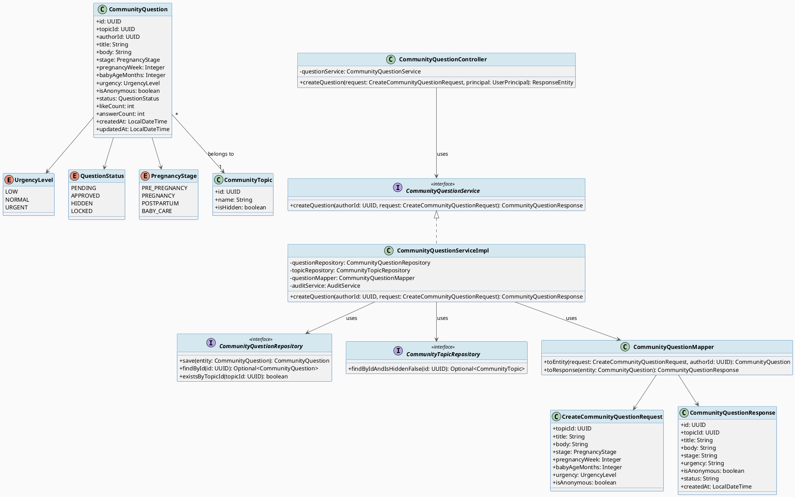
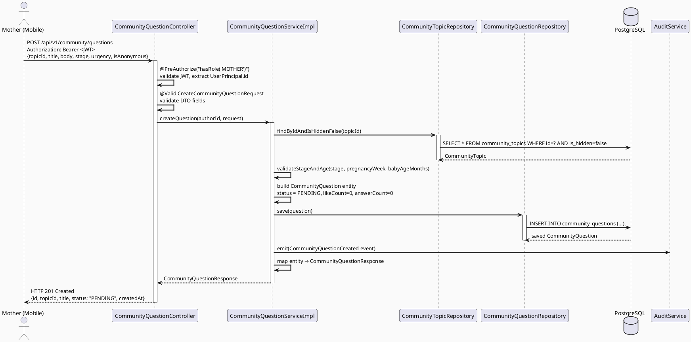
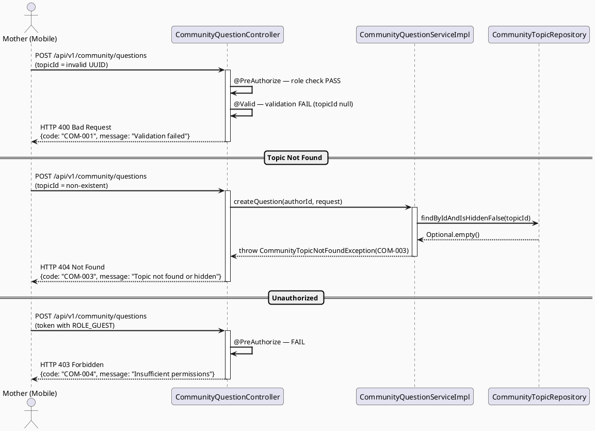
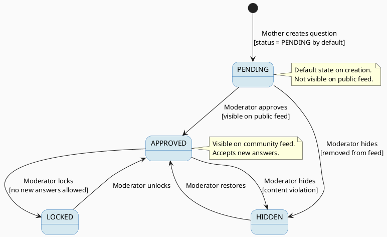

# ENGINEERING DOCUMENTATION STANDARD (EDS) v2.0
# Technical Design Specification — UC-54 Create Community Question

| Field              | Value                                   |
| ------------------ | --------------------------------------- |
| **Document ID**    | `CB-COMMUNITY-IMP-001`                  |
| **Version**        | `1.0`                                   |
| **Date**           | `2026-06-23`                            |
| **Status**         | `Implemented ✅`                         |
| **Document Owner** | `HuyND`                                 |
| **Author**         | `AI Agent — Winston (System Architect)` |
| **Reviewed by**    | `[Tech Lead]`                           |
| **DPO Sign-off**   | `[ ] Pending`                           |
| **Approved by**    | `[Principal Architect]`                 |
| **Last Review**    | `2026-06-23`                            |
| **Based on EDS**   | `v2.0`                                  |

---

## CHANGELOG

| Ngày       | Người thực hiện    | Nội dung thay đổi                                                                                                     |
| ---------- | ------------------ | --------------------------------------------------------------------------------------------------------------------- |
| 2026-06-23 | AI Agent — Winston | Tạo tài liệu lần đầu cho UC-54 Create Community Question                                                              |
| 2026-06-24 | AI Agent — Amelia  | Implement hoàn chỉnh: entity/enums, repository, DTO, mapper, service, controller, migration V5, 24 test cases — GREEN |

---

## MỤC LỤC

1. [Tổng quan Module](#1-tổng-quan-module)
2. [Ma trận Truy vết (Traceability Matrix)](#2-ma-trận-truy-vết-traceability-matrix)
3. [Architecture Decision Records (ADR)](#3-architecture-decision-records-adr)
4. [Non-Functional Requirements & SLA](#4-non-functional-requirements--sla)
5. [Static Modeling (Mô hình Tĩnh)](#5-static-modeling-mô-hình-tĩnh)
6. [Dynamic Modeling (Mô hình Động)](#6-dynamic-modeling-mô-hình-động)
7. [Domain Event Catalog](#7-domain-event-catalog)
8. [Interface Specification (Đặc tả Giao diện)](#8-interface-specification-đặc-tả-giao-diện)
9. [API Specification](#9-api-specification)
10. [Bảng mã lỗi (Error Codes)](#10-bảng-mã-lỗi-error-codes)
11. [Quy trình Triển khai (Step-by-Step)](#11-quy-trình-triển-khai-step-by-step)
12. [Rollback & Incident Runbook](#12-rollback--incident-runbook)
13. [Kịch bản Kiểm thử Chi tiết](#13-kịch-bản-kiểm-thử-chi-tiết)
14. [Phương pháp Xác minh](#14-phương-pháp-xác-minh)
15. [Mẫu thử thực tế (API Verification Samples)](#15-mẫu-thử-thực-tế-api-verification-samples)
16. [Bảng tổng hợp phân quyền (Authorization Matrix)](#16-bảng-tổng-hợp-phân-quyền-authorization-matrix)
17. [AI Prompt Constraints (CASE 2.0)](#17-ai-prompt-constraints-case-20)

---

## 1. Tổng quan Module

| Field                     | Value                                                                    |
| ------------------------- | ------------------------------------------------------------------------ |
| **Module Name**           | `CreateCommunityQuestion`                                                |
| **Bounded Context**       | `community`                                                              |
| **UC ID**                 | `UC-54`                                                                  |
| **SRS Reference**         | `3.3.1.31`                                                               |
| **Primary Actor**         | `Mother (ROLE_MOTHER — authenticated)`                                   |
| **Platform**              | `Mobile App (Flutter)`                                                   |
| **Data Classification**   | `Internal`                                                               |
| **Compliance Scope**      | `BR-RBAC, BR-PRIVACY`                                                    |
| **Upstream Dependencies** | `security (JWT auth), identity (User profile), community.CommunityTopic` |
| **Downstream Consumers**  | `community (feed, search), audit (AuditLog)`                             |

**Mô tả:** Cho phép bà mẹ đã đăng nhập đăng câu hỏi lên cộng đồng kèm chủ đề (topic), giai đoạn thai kỳ/sau sinh, tuổi thai (tuần) hoặc tuổi bé (tháng), và mức độ khẩn cấp. Câu hỏi được tạo với trạng thái `PENDING` và chờ moderator duyệt.

---

## 2. Ma trận Truy vết (Traceability Matrix)

| Requirement ID | Loại          | Mô tả yêu cầu                         | Thành phần Code                                    | Compliance Target | ADR liên quan |
| -------------- | ------------- | ------------------------------------- | -------------------------------------------------- | ----------------- | ------------- |
| UC-54          | Use Case      | Bà mẹ đăng câu hỏi cộng đồng          | `CommunityQuestionController.createQuestion()`     | BR-RBAC           | ADR-COM-001   |
| BR-RBAC        | Business Rule | Chỉ ROLE_MOTHER mới được đăng câu hỏi | `@PreAuthorize("hasRole('MOTHER')")`               | RBAC              | ADR-COM-001   |
| BR-PRIVACY     | Business Rule | Hỗ trợ đăng câu hỏi ẩn danh           | `CommunityQuestionService.maskAuthorIfAnonymous()` | Privacy           | ADR-COM-002   |
| BR-COM-001     | Business Rule | Câu hỏi mới luôn ở trạng thái PENDING | `CommunityQuestion.status = PENDING`               | Moderation        | ADR-COM-003   |
| BR-COM-002     | Business Rule | Phải có topicId hợp lệ                | `CommunityQuestionService.validateTopic()`         | Data integrity    | —             |
| BR-COM-003     | Business Rule | title không rỗng, tối đa 255 ký tự    | `@NotBlank @Size(max=255)`                         | —                 | —             |
| BR-COM-004     | Business Rule | body không rỗng, tối đa 5000 ký tự    | `@NotBlank @Size(max=5000)`                        | —                 | —             |

---

## 3. Architecture Decision Records (ADR)

### ADR-COM-001 — RBAC: Chỉ ROLE_MOTHER được tạo câu hỏi cộng đồng

| Field          | Value                      |
| -------------- | -------------------------- |
| **Status**     | `Accepted`                 |
| **Deciders**   | `HuyND — System Architect` |
| **Date**       | `2026-06-23`               |
| **Supersedes** | `—`                        |

#### Bối cảnh (Context)
Community Q&A là không gian hỗ trợ dành riêng cho bà mẹ. Chỉ người dùng đã xác thực và có vai trò MOTHER mới được phép đăng câu hỏi để đảm bảo chất lượng nội dung và an toàn cộng đồng.

#### Các phương án đã xem xét (Options Considered)

| Phương án | Mô tả                     | Ưu điểm                              | Nhược điểm                        |
| --------- | ------------------------- | ------------------------------------ | --------------------------------- |
| A         | Chỉ ROLE_MOTHER           | Kiểm soát chất lượng, đúng nghiệp vụ | Hạn chế mở rộng sang vai trò khác |
| B         | Bất kỳ authenticated user | Mở rộng hơn                          | Khó kiểm soát nội dung            |

#### Quyết định (Decision)
Chọn **Phương án A** — chỉ ROLE_MOTHER được tạo câu hỏi vì phù hợp với bounded context và giảm rủi ro nội dung không phù hợp.

#### Hệ quả (Consequences)
**Tích cực:**
- Nội dung cộng đồng đồng nhất, đúng chủ đề mẹ và bé

**Tiêu cực / Trade-offs:**
- Expert hoặc partner không thể tự đăng câu hỏi — có thể xử lý qua UC-109 Manage Topics

**Compliance Impact:**
- Phù hợp BR-RBAC — role-based access control cho community content

---

### ADR-COM-002 — Anonymous Question: Ẩn authorId trong response

| Field        | Value                      |
| ------------ | -------------------------- |
| **Status**   | `Accepted`                 |
| **Deciders** | `HuyND — System Architect` |
| **Date**     | `2026-06-23`               |

#### Bối cảnh (Context)
BR-PRIVACY yêu cầu hỗ trợ ẩn danh. Khi `isAnonymous=true`, hiển thị "Mẹ ẩn danh" thay vì tên thật trong response, nhưng DB vẫn lưu `authorId` để audit.

#### Quyết định (Decision)
Chọn **lưu authorId đầy đủ trong DB**, nhưng `CommunityQuestionMapper` trả `authorDisplay = "Mẹ ẩn danh"` khi `isAnonymous=true`.

#### Hệ quả (Consequences)
**Tích cực:**
- Vẫn trace được tác giả cho mục đích audit và moderation

**Compliance Impact:**
- Đảm bảo BR-PRIVACY: không lộ PII ra public API khi người dùng chọn ẩn danh

---

### ADR-COM-003 — Question Status: Mặc định PENDING, require moderator approval

| Field        | Value                      |
| ------------ | -------------------------- |
| **Status**   | `Accepted`                 |
| **Deciders** | `HuyND — System Architect` |
| **Date**     | `2026-06-23`               |

#### Quyết định (Decision)
Mọi câu hỏi mới tạo đều có `status = PENDING`. Moderator phải approve trước khi hiện trên feed công khai.

---

## 4. Non-Functional Requirements & SLA

### 4.1. Performance & Availability

| Category     | Requirement              | Target SLA  | Measurement Method | Compliance Basis |
| ------------ | ------------------------ | ----------- | ------------------ | ---------------- |
| Latency      | API response (p99)       | `< 300ms`   | k6 load test       | —                |
| Availability | Uptime (monthly)         | `99.9%`     | Uptime monitor     | —                |
| Throughput   | Concurrent POST requests | `200 req/s` | Load test          | —                |

### 4.2. Data Integrity & Retention

| Category   | Requirement                   | Target  | Verification Method | Compliance Basis |
| ---------- | ----------------------------- | ------- | ------------------- | ---------------- |
| Durability | Zero record loss              | RPO = 0 | Transaction log     | —                |
| Retention  | community_questions retention | 3 năm   | DB backup policy    | BR-PRIVACY       |

### 4.3. Security

| Category              | Requirement      | Target                 | Verification Method | Compliance Basis |
| --------------------- | ---------------- | ---------------------- | ------------------- | ---------------- |
| Encryption in transit | All endpoints    | TLS 1.3+               | SSL Labs scan       | GDPR Art. 32     |
| Access control        | ROLE_MOTHER only | JWT + @PreAuthorize    | Auth Matrix (§16)   | BR-RBAC          |
| Input sanitization    | No XSS/injection | Server-side validation | OWASP ZAP           | OWASP Top 10     |

### 4.4. Scalability & Capacity Planning

Dự kiến tải: 10,000 bà mẹ active, 500 câu hỏi/ngày. Giải pháp scale: horizontal scaling Spring Boot, PostgreSQL connection pooling (HikariCP), index trên `topic_id` và `status`.

---

## 5. Static Modeling (Mô hình Tĩnh)

### 5.1. Class Diagram (PlantUML)



### 5.2. JPA Entity (Java)

```java
package com.carebridge.backend.community.entity;

import jakarta.persistence.*;
import lombok.*;
import org.hibernate.annotations.CreationTimestamp;
import org.hibernate.annotations.UpdateTimestamp;

import java.time.LocalDateTime;
import java.util.UUID;

@Entity
@Table(name = "community_questions", indexes = {
    @Index(name = "idx_community_questions_topic_id", columnList = "topic_id"),
    @Index(name = "idx_community_questions_author_id", columnList = "author_id"),
    @Index(name = "idx_community_questions_status", columnList = "status"),
    @Index(name = "idx_community_questions_stage", columnList = "stage")
})
@Getter @Setter @NoArgsConstructor @AllArgsConstructor @Builder
public class CommunityQuestion {

    @Id
    @GeneratedValue(strategy = GenerationType.UUID)
    @Column(name = "id", updatable = false, nullable = false)
    private UUID id;

    @Column(name = "topic_id", nullable = false)
    private UUID topicId;

    @Column(name = "author_id", nullable = false)
    private UUID authorId;

    @Column(name = "title", nullable = false, length = 255)
    private String title;

    @Column(name = "body", nullable = false, columnDefinition = "TEXT")
    private String body;

    @Enumerated(EnumType.STRING)
    @Column(name = "stage", nullable = false, length = 30)
    private PregnancyStage stage;

    @Column(name = "pregnancy_week")
    private Integer pregnancyWeek;

    @Column(name = "baby_age_months")
    private Integer babyAgeMonths;

    @Enumerated(EnumType.STRING)
    @Column(name = "urgency", nullable = false, length = 20)
    private UrgencyLevel urgency;

    @Column(name = "is_anonymous", nullable = false)
    private boolean isAnonymous;

    @Enumerated(EnumType.STRING)
    @Column(name = "status", nullable = false, length = 20)
    @Builder.Default
    private QuestionStatus status = QuestionStatus.PENDING;

    @Column(name = "like_count", nullable = false)
    @Builder.Default
    private int likeCount = 0;

    @Column(name = "answer_count", nullable = false)
    @Builder.Default
    private int answerCount = 0;

    @CreationTimestamp
    @Column(name = "created_at", updatable = false)
    private LocalDateTime createdAt;

    @UpdateTimestamp
    @Column(name = "updated_at")
    private LocalDateTime updatedAt;
}
```

```java
package com.carebridge.backend.community.entity;

public enum UrgencyLevel { LOW, NORMAL, URGENT }
public enum QuestionStatus { PENDING, APPROVED, HIDDEN, LOCKED }
public enum PregnancyStage { PRE_PREGNANCY, PREGNANCY, POSTPARTUM, BABY_CARE }
```

---

## 6. Dynamic Modeling (Mô hình Động)

### 6.1. Sequence Diagram — Happy Path (PlantUML)



### 6.2. Sequence Diagram — Error Path (PlantUML)



### 6.3. State Machine — CommunityQuestion Status



---

## 7. Domain Event Catalog

### 7.1. Events Published (Phát ra)

| Event Name                 | Trigger                     | Publisher                      | Subscriber(s)  | Payload Schema | Async?          |
| -------------------------- | --------------------------- | ------------------------------ | -------------- | -------------- | --------------- |
| `CommunityQuestionCreated` | Câu hỏi được tạo thành công | `CommunityQuestionServiceImpl` | `AuditService` | See §7.3       | No (sync audit) |

### 7.2. Events Consumed (Tiêu thụ)

| Event Name | Source | Handler | Action thực hiện                     |
| ---------- | ------ | ------- | ------------------------------------ |
| —          | —      | —       | Module này không consume event ngoài |

### 7.3. Payload Schema

```java
// CommunityQuestionCreatedEvent.java
public record CommunityQuestionCreatedEvent(
    String eventId,          // UUID — deduplicate
    String eventType,        // "CommunityQuestionCreated"
    String occurredAt,       // ISO 8601
    String version,          // "1.0"
    Payload payload,
    Metadata metadata
) {
    public record Payload(
        UUID questionId,
        UUID topicId,
        UUID authorId,
        boolean isAnonymous,
        String urgency,
        String stage
    ) {}

    public record Metadata(
        String correlationId,
        String causedBy       // authorId
    ) {}
}
```

---

## 8. Interface Specification (Đặc tả Giao diện)

### 8.1. Service Interface

```java
package com.carebridge.backend.community.service;

import com.carebridge.backend.community.dto.request.CreateCommunityQuestionRequest;
import com.carebridge.backend.community.dto.response.CommunityQuestionResponse;
import java.util.UUID;

/**
 * Service contract for creating community questions.
 * @version 1.0
 */
public interface CommunityQuestionService {

    /**
     * Creates a new community question in PENDING status.
     * @param authorId UUID of the authenticated MOTHER user
     * @param request  validated CreateCommunityQuestionRequest DTO
     * @return CommunityQuestionResponse with id, status=PENDING, createdAt
     * @throws com.carebridge.backend.community.exception.CommunityTopicNotFoundException (COM-003) when topicId is invalid or hidden
     * @throws com.carebridge.backend.common.exception.ValidationException (COM-001) when stage/age combination is invalid
     */
    CommunityQuestionResponse createQuestion(UUID authorId, CreateCommunityQuestionRequest request);
}
```

### 8.2. Repository Interface

```java
package com.carebridge.backend.community.repository;

import com.carebridge.backend.community.entity.CommunityQuestion;
import org.springframework.data.jpa.repository.JpaRepository;
import org.springframework.stereotype.Repository;
import java.util.UUID;

/**
 * @version 1.0
 */
@Repository
public interface CommunityQuestionRepository extends JpaRepository<CommunityQuestion, UUID> {
    // Inherited: save(), findById(), existsById()
    // Query methods added in subsequent UCs
}
```

```java
package com.carebridge.backend.community.repository;

import com.carebridge.backend.community.entity.CommunityTopic;
import org.springframework.data.jpa.repository.JpaRepository;
import org.springframework.stereotype.Repository;
import java.util.Optional;
import java.util.UUID;

@Repository
public interface CommunityTopicRepository extends JpaRepository<CommunityTopic, UUID> {
    Optional<CommunityTopic> findByIdAndIsHiddenFalse(UUID id);
}
```

### 8.3. Request/Response DTOs

```java
package com.carebridge.backend.community.dto.request;

import com.carebridge.backend.community.entity.PregnancyStage;
import com.carebridge.backend.community.entity.UrgencyLevel;
import jakarta.validation.constraints.*;
import lombok.Data;
import java.util.UUID;

@Data
public class CreateCommunityQuestionRequest {

    @NotNull(message = "topicId is required")
    private UUID topicId;

    @NotBlank(message = "title is required")
    @Size(min = 5, max = 255, message = "title must be between 5 and 255 characters")
    private String title;

    @NotBlank(message = "body is required")
    @Size(min = 10, max = 5000, message = "body must be between 10 and 5000 characters")
    private String body;

    @NotNull(message = "stage is required")
    private PregnancyStage stage;

    @Min(value = 1, message = "pregnancyWeek must be >= 1")
    @Max(value = 42, message = "pregnancyWeek must be <= 42")
    private Integer pregnancyWeek;   // nullable — only for PREGNANCY stage

    @Min(value = 0, message = "babyAgeMonths must be >= 0")
    @Max(value = 72, message = "babyAgeMonths must be <= 72")
    private Integer babyAgeMonths;   // nullable — only for BABY_CARE/POSTPARTUM

    @NotNull(message = "urgency is required")
    private UrgencyLevel urgency;

    @NotNull(message = "isAnonymous is required")
    private Boolean isAnonymous;
}
```

---

## 9. API Specification

### 9.1. Endpoints Table

| Method | Path                          | Auth Level | Required Roles | Rate Limit | Idempotent? |
| ------ | ----------------------------- | ---------- | -------------- | ---------- | ----------- |
| `POST` | `/api/v1/community/questions` | JWT Bearer | `ROLE_MOTHER`  | 30/min     | No          |

### 9.2. Request / Response Schemas

#### `POST /api/v1/community/questions` — Tạo câu hỏi cộng đồng

**Request Headers:**
```
Authorization: Bearer <JWT_TOKEN>
Content-Type: application/json
X-Correlation-Id: <uuid>
```

**Request Body:**
```json
{
  "topicId": "3fa85f64-5717-4562-b3fc-2c963f66afa6",
  "title": "Thai nhi 28 tuần đạp nhiều ban đêm có bình thường không?",
  "body": "Mình đang thai 28 tuần, bé đạp rất nhiều vào ban đêm từ 10pm đến 2am khiến mình khó ngủ. Có mẹ nào trải qua tình trạng này không? Có cần đi khám không ạ?",
  "stage": "PREGNANCY",
  "pregnancyWeek": 28,
  "babyAgeMonths": null,
  "urgency": "NORMAL",
  "isAnonymous": false
}
```

**Response — 201 Created (Happy Path):**
```json
{
  "id": "550e8400-e29b-41d4-a716-446655440000",
  "topicId": "3fa85f64-5717-4562-b3fc-2c963f66afa6",
  "title": "Thai nhi 28 tuần đạp nhiều ban đêm có bình thường không?",
  "body": "Mình đang thai 28 tuần, bé đạp rất nhiều...",
  "stage": "PREGNANCY",
  "urgency": "NORMAL",
  "isAnonymous": false,
  "status": "PENDING",
  "createdAt": "2026-06-23T10:00:00.000Z"
}
```

**Response — 400 Bad Request (Validation Error):**
```json
{
  "error": {
    "code": "COM-001",
    "message": "Validation failed",
    "details": [
      { "field": "title", "message": "title is required" },
      { "field": "topicId", "message": "topicId is required" }
    ]
  }
}
```

**Response — 403 Forbidden (Wrong Role):**
```json
{
  "error": {
    "code": "COM-004",
    "message": "Insufficient permissions — ROLE_MOTHER required"
  }
}
```

**Response — 404 Not Found (Topic):**
```json
{
  "error": {
    "code": "COM-003",
    "message": "Community topic not found or is hidden"
  }
}
```

---

## 10. Bảng mã lỗi (Error Codes)

| Code      | HTTP Status | Message (EN)                  | Message (VI)                        | Trigger Condition                                     |
| --------- | ----------- | ----------------------------- | ----------------------------------- | ----------------------------------------------------- |
| `COM-001` | 400         | Validation failed             | Dữ liệu không hợp lệ                | title/body/topicId vi phạm validation                 |
| `COM-002` | 409         | Resource conflict             | Xung đột tài nguyên                 | (reserved for future)                                 |
| `COM-003` | 404         | Topic not found or hidden     | Chủ đề không tồn tại hoặc đã bị ẩn  | topicId không tồn tại hoặc topic bị hidden            |
| `COM-004` | 403         | Insufficient permissions      | Không đủ quyền truy cập             | Không có ROLE_MOTHER hoặc chưa đăng nhập              |
| `COM-005` | 500         | Internal server error         | Lỗi hệ thống                        | Lỗi không xác định từ server                          |
| `COM-006` | 400         | Invalid stage/age combination | Kết hợp giai đoạn/tuổi không hợp lệ | pregnancyWeek set khi stage=BABY_CARE, hoặc ngược lại |

---

## 11. Quy trình Triển khai (Step-by-Step)

### 11.1. Prerequisites

- [ ] ADR-COM-001, ADR-COM-002, ADR-COM-003 đã được Accepted
- [ ] Blueprint đã được Principal Architect approve
- [ ] Môi trường staging đã sẵn sàng với PostgreSQL

### 11.2. Pre-Migration Checklist

- [ ] Đã backup DB: `pg_dump -h [host] -U carebridge carebridge_db > backup_20260623.sql`
- [ ] Migration V001 (community_topics) đã chạy thành công trước
- [ ] Rollback script đã test trên staging

### 11.3. Implementation Steps

#### Chặng 1 — Database Migration

```sql
-- V002__create_community_questions.sql
CREATE TABLE community_questions (
    id UUID PRIMARY KEY DEFAULT gen_random_uuid(),
    topic_id UUID NOT NULL REFERENCES community_topics(id),
    author_id UUID NOT NULL REFERENCES users(id),
    title VARCHAR(255) NOT NULL,
    body TEXT NOT NULL,
    stage VARCHAR(30) NOT NULL CHECK (stage IN ('PRE_PREGNANCY','PREGNANCY','POSTPARTUM','BABY_CARE')),
    pregnancy_week SMALLINT CHECK (pregnancy_week BETWEEN 1 AND 42),
    baby_age_months SMALLINT CHECK (baby_age_months BETWEEN 0 AND 72),
    urgency VARCHAR(20) NOT NULL CHECK (urgency IN ('LOW','NORMAL','URGENT')),
    is_anonymous BOOLEAN NOT NULL DEFAULT FALSE,
    status VARCHAR(20) NOT NULL DEFAULT 'PENDING' CHECK (status IN ('PENDING','APPROVED','HIDDEN','LOCKED')),
    like_count INT NOT NULL DEFAULT 0,
    answer_count INT NOT NULL DEFAULT 0,
    created_at TIMESTAMPTZ NOT NULL DEFAULT NOW(),
    updated_at TIMESTAMPTZ NOT NULL DEFAULT NOW()
);

CREATE INDEX idx_community_questions_topic_id ON community_questions(topic_id);
CREATE INDEX idx_community_questions_author_id ON community_questions(author_id);
CREATE INDEX idx_community_questions_status ON community_questions(status);
CREATE INDEX idx_community_questions_stage ON community_questions(stage);
```

#### Chặng 2 — Backend Implementation

```
Thứ tự implement:
1. entity/CommunityQuestion.java (enums: UrgencyLevel, QuestionStatus, PregnancyStage)
2. repository/CommunityQuestionRepository.java
3. dto/request/CreateCommunityQuestionRequest.java
4. dto/response/CommunityQuestionResponse.java
5. mapper/CommunityQuestionMapper.java
6. service/CommunityQuestionService.java (interface)
7. service/CommunityQuestionServiceImpl.java
8. controller/CommunityQuestionController.java
```

#### Chặng 3 — Verification sau deploy

```bash
curl -X GET https://[host]/api/v1/health
# Expected: {"status": "ok"}

curl -X POST https://[host]/api/v1/community/questions \
  -H "Authorization: Bearer [MOTHER_JWT]" \
  -H "Content-Type: application/json" \
  -d '{"topicId":"...","title":"Test","body":"Test body content here","stage":"PREGNANCY","pregnancyWeek":20,"urgency":"NORMAL","isAnonymous":false}'
# Expected: 201 with status=PENDING
```

### 11.4. Deployment Checklist

- [ ] Migration V002 chạy thành công
- [ ] Health check endpoint trả về 200
- [ ] POST /api/v1/community/questions trả về 201 với token MOTHER
- [ ] POST /api/v1/community/questions trả về 403 với token không có MOTHER role
- [ ] Audit log sinh ra event CommunityQuestionCreated

---

## 12. Rollback & Incident Runbook

### 12.1. Điều kiện kích hoạt Rollback

| Điều kiện                 | Ngưỡng            | Người quyết định |
| ------------------------- | ----------------- | ---------------- |
| Error rate tăng đột biến  | > 5% trong 5 phút | On-call Engineer |
| Latency p99 vượt ngưỡng   | > 600ms           | On-call Engineer |
| Dữ liệu không nhất quán   | Bất kỳ case nào   | Tech Lead        |
| Audit log ngừng hoạt động | > 1 phút          | On-call Engineer |

### 12.2. Rollback Procedure

```bash
# Bước 1: Revert migration
psql -h [host] -U carebridge carebridge_db -c "DROP TABLE IF EXISTS community_questions;"

# Bước 2: Re-deploy phiên bản cũ
kubectl rollout undo deployment/carebridge-api

# Bước 3: Verify rollback thành công
kubectl rollout status deployment/carebridge-api
curl -X GET https://[host]/api/v1/health

# Bước 4: Smoke test
curl -X POST https://[host]/api/v1/community/questions \
  -H "Authorization: Bearer [MOTHER_JWT]" \
  -H "Content-Type: application/json" \
  -d '{"topicId":"...","title":"Smoke test","body":"Smoke test body","stage":"PREGNANCY","urgency":"NORMAL","isAnonymous":false}'
```

### 12.3. Notification Protocol

| Thời điểm          | Người nhận   | Kênh              | Template                                                  |
| ------------------ | ------------ | ----------------- | --------------------------------------------------------- |
| Ngay khi phát hiện | On-call team | Slack `#incident` | "INCIDENT [COMMUNITY] question creation failing: [mô tả]" |
| Trong 30 phút      | Tech Lead    | Slack/Email       | Chi tiết lỗi + impact                                     |

### 12.4. Post-Incident Review (PIR)

Hoàn thành PIR document trong vòng 48 giờ sau khi resolve.

---

## 13. Kịch bản Kiểm thử Chi tiết

### 13.1. Unit Tests

#### TC-UNIT-001 — Tạo câu hỏi thành công với đầy đủ thông tin

```gherkin
Feature: UC-54 Create Community Question
  Background:
    Given test data classification: SYNTHETIC
    And CommunityTopicRepository mock returns valid topic for topicId "topic-001"

  Scenario: Happy path — MOTHER tạo câu hỏi với đầy đủ thông tin hợp lệ
    Given authenticated user với ROLE_MOTHER, authorId = "author-001"
    And request có topicId="topic-001", title="Test question", body="Test body 10+ chars",
        stage=PREGNANCY, pregnancyWeek=20, urgency=NORMAL, isAnonymous=false
    When CommunityQuestionServiceImpl.createQuestion() được gọi
    Then CommunityQuestionRepository.save() được gọi đúng 1 lần
    And entity được lưu có status = PENDING
    And entity được lưu có authorId = "author-001"
    And response.status = "PENDING"
    And response.id không null

  Scenario: Ẩn danh — isAnonymous=true không lộ authorId trong response
    Given request có isAnonymous=true
    When createQuestion() được gọi
    Then entity.authorId = "author-001" (vẫn lưu đầy đủ trong DB)
    And response không chứa authorId field (hoặc chứa null)
```

**Hàm được test:** `CommunityQuestionServiceImpl.createQuestion()`
**Invariant kiểm tra:** status luôn = PENDING khi tạo mới; authorId luôn được lưu vào DB

#### TC-UNIT-002 — Validation lỗi khi topic bị hidden

```gherkin
  Scenario: Topic bị hidden — service throw exception
    Given CommunityTopicRepository.findByIdAndIsHiddenFalse() trả về Optional.empty()
    When createQuestion() được gọi với topicId="hidden-topic"
    Then CommunityTopicNotFoundException được ném ra
    And error code = COM-003
    And CommunityQuestionRepository.save() KHÔNG được gọi
```

### 13.2. Integration Tests

#### TC-INT-001 — End-to-end tạo câu hỏi qua API

```gherkin
  Scenario: MOTHER gọi POST API, câu hỏi xuất hiện trong DB
    Given test data classification: SYNTHETIC
    And database có seed: community_topics với id="topic-test-001", is_hidden=false
    And authenticated MOTHER JWT token
    When POST /api/v1/community/questions được gọi với valid request body
    Then response status = 201
    And community_questions table có record mới với status='PENDING'
    And record có author_id = <JWT subject>
    And audit_logs có event CommunityQuestionCreated

  Scenario: Title quá ngắn — validation tại controller
    Given MOTHER JWT token
    When POST /api/v1/community/questions với title = "Hi" (< 5 chars)
    Then response status = 400
    And response.error.code = "COM-001"
    And community_questions table KHÔNG có record mới
```

### 13.3. Security Tests

#### TC-SEC-001 — ROLE_GUEST không được tạo câu hỏi

```gherkin
  Scenario: User không có ROLE_MOTHER bị từ chối
    Given test data classification: SYNTHETIC
    And user có JWT với ROLE_GUEST (không có ROLE_MOTHER)
    When POST /api/v1/community/questions được gọi
    Then response status = 403
    And response.error.code = "COM-004"
    And community_questions table KHÔNG thay đổi

  Scenario: Request không có JWT bị từ chối
    Given không có Authorization header
    When POST /api/v1/community/questions được gọi
    Then response status = 401

  Scenario: XSS injection trong title bị sanitize
    Given MOTHER JWT token hợp lệ
    And request body có title = "<script>alert('xss')</script>Test title"
    When POST /api/v1/community/questions được gọi
    Then response status = 201 (hoặc 400 nếu reject)
    And stored title KHÔNG chứa executable script tags
```

---

## 14. Phương pháp Xác minh

### 14.1. Database Inspection

```sql
-- Verify câu hỏi được tạo với status PENDING
SELECT id, title, status, author_id, topic_id, is_anonymous, created_at
FROM community_questions
WHERE id = '[uuid]';

-- Verify topic reference hợp lệ
SELECT cq.id, ct.name as topic_name
FROM community_questions cq
JOIN community_topics ct ON cq.topic_id = ct.id
WHERE cq.id = '[uuid]';

-- Verify không có auto-approve (status phải là PENDING)
SELECT COUNT(*) FROM community_questions WHERE status != 'PENDING' AND created_at > NOW() - INTERVAL '1 hour';
-- Expected: 0 (cho câu hỏi mới tạo)
```

### 14.2. Log / Audit Verification

```bash
# Kiểm tra audit event được emit
kubectl logs -l app=carebridge-api | grep '"eventType":"CommunityQuestionCreated"' | head -5

# Verify không có authorId trong public log khi isAnonymous=true
kubectl logs -l app=carebridge-api | grep "CommunityQuestionCreated" | grep -v "authorId"
```

---

## 15. Mẫu thử thực tế (API Verification Samples)

### 15.1. Happy Path

```bash
# POST — Tạo câu hỏi cộng đồng
curl -X POST https://[host]/api/v1/community/questions \
  -H "Authorization: Bearer [MOTHER_JWT_TOKEN]" \
  -H "Content-Type: application/json" \
  -H "X-Correlation-Id: $(uuidgen)" \
  -d '{
    "topicId": "3fa85f64-5717-4562-b3fc-2c963f66afa6",
    "title": "Thai nhi 28 tuần đạp nhiều ban đêm có bình thường không?",
    "body": "Mình đang thai 28 tuần, bé đạp rất nhiều vào ban đêm. Các mẹ có ai gặp tình trạng này không?",
    "stage": "PREGNANCY",
    "pregnancyWeek": 28,
    "urgency": "NORMAL",
    "isAnonymous": false
  }'
```

**Expected Response (201):**
```json
{
  "id": "550e8400-e29b-41d4-a716-446655440000",
  "topicId": "3fa85f64-5717-4562-b3fc-2c963f66afa6",
  "title": "Thai nhi 28 tuần đạp nhiều ban đêm có bình thường không?",
  "body": "Mình đang thai 28 tuần...",
  "stage": "PREGNANCY",
  "urgency": "NORMAL",
  "isAnonymous": false,
  "status": "PENDING",
  "createdAt": "2026-06-23T10:00:00.000Z"
}
```

### 15.2. Error Paths

```bash
# Thiếu title → 400
curl -X POST https://[host]/api/v1/community/questions \
  -H "Authorization: Bearer [MOTHER_JWT_TOKEN]" \
  -H "Content-Type: application/json" \
  -d '{"topicId":"...","body":"Body only","stage":"PREGNANCY","urgency":"NORMAL","isAnonymous":false}'
```

```bash
# Không có JWT → 401
curl -X POST https://[host]/api/v1/community/questions \
  -H "Content-Type: application/json" \
  -d '{"topicId":"...","title":"Test","body":"Test body content","stage":"PREGNANCY","urgency":"NORMAL","isAnonymous":false}'
```

---

## 16. Bảng tổng hợp phân quyền (Authorization Matrix)

| Endpoint                           | `GUEST` | `MOTHER` | `EXPERT` | `MODERATOR` | `ADMIN` |
| ---------------------------------- | ------- | -------- | -------- | ----------- | ------- |
| `POST /api/v1/community/questions` | ❌       | ✅        | ❌        | ❌           | ✅       |

**Chú thích:**
- ✅ = Được phép
- ❌ = Bị từ chối (403)

---

## 17. AI Prompt Constraints (CASE 2.0)

### 17.1 Constraint Summary Table

| #   | Constraint                                                                                                         | Source (ADR/BR)           | Last Verified |
| --- | ------------------------------------------------------------------------------------------------------------------ | ------------------------- | ------------- |
| C1  | `CommunityQuestionServiceImpl.createQuestion()` PHẢI set `status = PENDING` — KHÔNG để AI tự quyết status mặc định | `ADR-COM-003`             | `2026-06-23`  |
| C2  | KHÔNG được return authorId trong response khi `isAnonymous=true` — mapper PHẢI mask                                | `ADR-COM-002, BR-PRIVACY` | `2026-06-23`  |
| C3  | `@PreAuthorize("hasRole('MOTHER')")` phải xuất hiện tại controller method — KHÔNG check role trong service         | `ADR-COM-001, BR-RBAC`    | `2026-06-23`  |
| C4  | authorId lấy từ `UserPrincipal` trong JWT — KHÔNG nhận authorId từ request body                                    | `ADR-COM-001`             | `2026-06-23`  |
| C5  | `CommunityTopicRepository.findByIdAndIsHiddenFalse()` PHẢI được gọi trước khi save — reject hidden topics          | `BR-COM-002`              | `2026-06-23`  |

### 17.2 Constraint Injection Block

```
[CONSTRAINT BLOCK — Module: CreateCommunityQuestion]
Theo TDS CB-COMMUNITY-IMP-001 và các ADR liên quan:

1. CommunityQuestionServiceImpl.createQuestion() PHẢI set status = PENDING. Không có auto-approve.
2. Khi isAnonymous=true, CommunityQuestionMapper PHẢI trả response KHÔNG chứa authorId. DB PHẢI lưu đầy đủ authorId.
3. @PreAuthorize("hasRole('MOTHER')") phải đặt tại controller method createQuestion(). Service không kiểm tra role.
4. authorId được extract từ UserPrincipal (JWT subject). Không nhận từ request body.
5. Trước khi save, PHẢI gọi CommunityTopicRepository.findByIdAndIsHiddenFalse(topicId). Nếu empty → throw CommunityTopicNotFoundException với code COM-003.

[CONTEXT BLOCK]
- Bounded Context: community
- Data Classification: Internal
- Compliance: BR-RBAC, BR-PRIVACY
- Existing interfaces: §8 Service Interface + §8.2 Repository Interface
- Error codes: §10 Error Codes Table
- Auth matrix: §16 Authorization Matrix

[TASK BLOCK]
Implement CommunityQuestionServiceImpl.createQuestion() và CommunityQuestionController.createQuestion() thỏa mãn constraints trên.
Output phải tuân thủ §8 Interface Specification.
Tests phải cover §13 Test Scenarios.
```

### 17.3 Constraint Quality Checklist

- [x] Mỗi constraint traceable về ADR hoặc BR cụ thể
- [x] Không có constraint generic
- [x] Mỗi constraint có `Last Verified` date ≤ 2 sprints
- [x] Constraint block có ≥ 5 constraints cụ thể
- [x] Constraint block reference §8 Interface
- [x] Constraint block reference §16 Auth Matrix

### 17.4 Anti-Pattern Detection

| AP-ID     | Anti-Pattern          | Dấu hiệu                              | Hành động            |
| --------- | --------------------- | ------------------------------------- | -------------------- |
| AP-AI-001 | Unconstrained Gen     | Code không set status=PENDING         | Reject — inject C1   |
| AP-AI-003 | Implicit Decision     | Code auto-approve câu hỏi             | Reject — ADR-COM-003 |
| AP-AI-005 | Hallucinated Contract | Code import service không có trong §8 | Reject — verify §8   |

---

## PHỤ LỤC

### A. Glossary (Thuật ngữ)

| Thuật ngữ | Định nghĩa |
|-----------|------------|
| PregnancyStage | Giai đoạn thai kỳ/chăm sóc bé — dùng để phân loại câu hỏi cộng đồng |
| UrgencyLevel | Mức độ khẩn cấp của câu hỏi (LOW, NORMAL, URGENT) |
| QuestionStatus | Trạng thái duyệt câu hỏi (PENDING, APPROVED, HIDDEN, LOCKED) |

### B. Tài liệu tham chiếu

| Document | Path |
|----------|------|
| EDS v2.0 Template | `08_References/Template/PHASE-3_TDS.md` |

---

*EDS v2.1 — Tích hợp CASE 2.0 AI Prompt Constraints (§17).*
