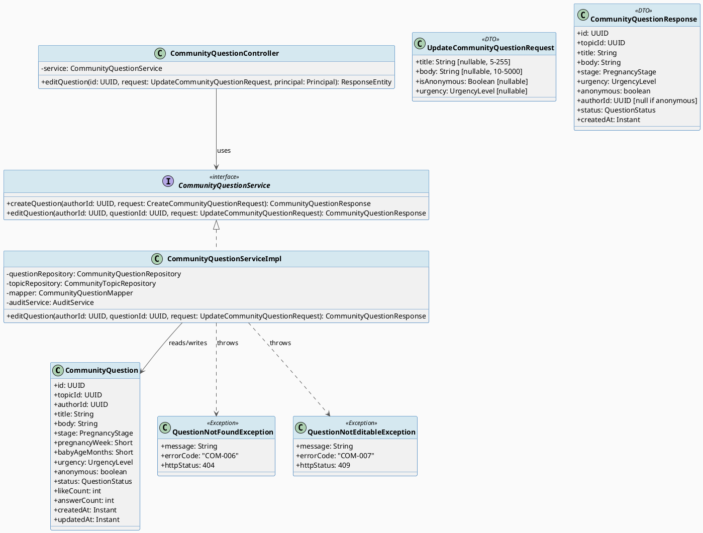
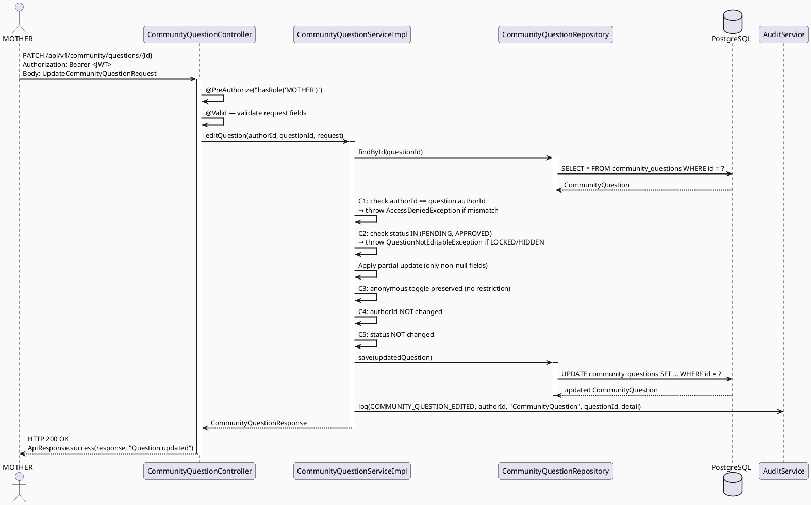
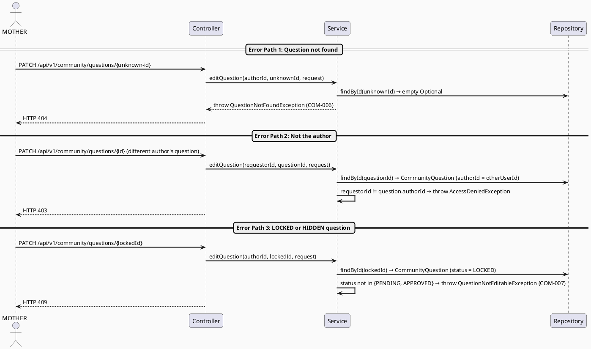
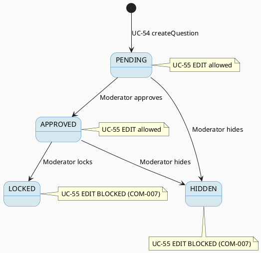

# ENGINEERING DOCUMENTATION STANDARD (EDS) v2.0
# Technical Design Specification — UC-55 Edit Community Post

| Field              | Value                                   |
| ------------------ | --------------------------------------- |
| **Document ID**    | `CB-COMMUNITY-IMP-005`                  |
| **Version**        | `1.0`                                   |
| **Date**           | `2026-06-29`                            |
| **Status**         | `Approved`                              |
| **Document Owner** | `HuyND`                                 |
| **Author**         | `AI Agent`                              |
| **Reviewed by**    | `[Tech Lead]`                           |
| **DPO Sign-off**   | `[ ] Pending`                           |
| **Approved by**    | `[Principal Architect]`                 |
| **Last Review**    | `2026-06-29`                            |
| **Based on EDS**   | `v2.0`                                  |

---

## CHANGELOG

| Ngày       | Người thực hiện | Nội dung thay đổi                                          |
| ---------- | --------------- | ---------------------------------------------------------- |
| 2026-06-29 | AI Agent        | Tạo tài liệu lần đầu cho UC-55 Edit Community Post (Draft) |
| 2026-06-29 | AI Agent — Amelia (Dev Agent) | Implemented PATCH /api/v1/community/questions/{id}, editQuestion service, UpdateCommunityQuestionRequest DTO, QuestionNotFoundException (COM-006), QuestionNotEditableException (COM-010), AuditAction.COMMUNITY_QUESTION_EDITED; 11 tests passing | Implemented |

---

## MUC LUC

1. [Tong quan Module](#1-tong-quan-module)
2. [Ma tran Truy vet (Traceability Matrix)](#2-ma-tran-truy-vet-traceability-matrix)
3. [Architecture Decision Records (ADR)](#3-architecture-decision-records-adr)
4. [Non-Functional Requirements & SLA](#4-non-functional-requirements--sla)
5. [Static Modeling (Mo hinh Tinh)](#5-static-modeling-mo-hinh-tinh)
6. [Dynamic Modeling (Mo hinh Dong)](#6-dynamic-modeling-mo-hinh-dong)
7. [Domain Event Catalog](#7-domain-event-catalog)
8. [Interface Specification (Dac ta Giao dien)](#8-interface-specification-dac-ta-giao-dien)
9. [API Specification](#9-api-specification)
10. [Bang ma loi (Error Codes)](#10-bang-ma-loi-error-codes)
11. [Quy trinh Trien khai (Step-by-Step)](#11-quy-trinh-trien-khai-step-by-step)
12. [Rollback & Incident Runbook](#12-rollback--incident-runbook)
13. [Kich ban Kiem thu Chi tiet](#13-kich-ban-kiem-thu-chi-tiet)
14. [Phuong phap Xac minh](#14-phuong-phap-xac-minh)
15. [Mau thu thuc te (API Verification Samples)](#15-mau-thu-thuc-te-api-verification-samples)
16. [Bang tong hop phan quyen (Authorization Matrix)](#16-bang-tong-hop-phan-quyen-authorization-matrix)
17. [AI Prompt Constraints (CASE 2.0)](#17-ai-prompt-constraints-case-20)

---

## 1. Tong quan Module

| Field                     | Value                                                                         |
| ------------------------- | ----------------------------------------------------------------------------- |
| **Module Name**           | `EditCommunityPost`                                                           |
| **Bounded Context**       | `community`                                                                   |
| **UC ID**                 | `UC-55`                                                                       |
| **SRS Reference**         | `3.3.1.32`                                                                    |
| **Primary Actor**         | `Mother (ROLE_MOTHER — authenticated, question author)`                       |
| **Platform**              | `Mobile App (Flutter) / Web`                                                  |
| **Data Classification**   | `Internal`                                                                    |
| **Compliance Scope**      | `BR-RBAC, BR-COM`                                                             |
| **Upstream Dependencies** | `security (JWT auth), community.CommunityQuestion, community.CommunityTopic` |
| **Downstream Consumers**  | `community (feed, search), audit (AuditLog)`                                  |

**Description:** Allows an authenticated MOTHER to edit her own community question. Only the original author may update the question. Only questions with status PENDING or APPROVED can be edited. Fields that can be changed: title, body, urgency, isAnonymous. The question status and authorId are never changed by this endpoint.

---

## 2. Ma tran Truy vet (Traceability Matrix)

| Requirement ID | Loai (BR/ADR/US) | Mo ta yeu cau                                           | Thanh phan Code                                                       | Compliance Target | ADR lien quan |
| -------------- | ---------------- | ------------------------------------------------------- | --------------------------------------------------------------------- | ----------------- | ------------- |
| UC-55          | Use Case         | Mother edits her own community question                 | `CommunityQuestionController.editQuestion()`                          | BR-RBAC           | ADR-COM-001   |
| BR-RBAC        | Business Rule    | Only ROLE_MOTHER can edit questions via this endpoint   | `@PreAuthorize("hasRole('MOTHER')")`                                  | RBAC              | ADR-COM-001   |
| BR-COM-005     | Business Rule    | Only the author of the question may edit it             | `CommunityQuestionServiceImpl.editQuestion()` ownership check         | Integrity         | ADR-COM-008   |
| BR-COM-006     | Business Rule    | Only PENDING or APPROVED questions are editable         | `CommunityQuestionServiceImpl.editQuestion()` status check            | Moderation        | ADR-COM-009   |
| BR-COM-007     | Business Rule    | authorId is immutable — never changed by edit           | Service never modifies `question.authorId`                            | Data integrity    | ADR-COM-008   |
| BR-COM-008     | Business Rule    | Status is immutable via edit endpoint                   | Service never modifies `question.status`                              | Moderation        | ADR-COM-009   |
| BR-PRIVACY     | Business Rule    | isAnonymous toggle masks authorId in response           | `CommunityQuestionMapper.toResponse()` anonymous check                | Privacy           | ADR-COM-002   |
| BR-AUDIT-001   | Business Rule    | Every successful edit must produce an audit log entry   | `AuditService.log(AuditAction.COMMUNITY_QUESTION_EDITED, ...)`        | Audit             | —             |

---

## 3. Architecture Decision Records (ADR)

### ADR-COM-008 — Edit Ownership Check: Only the original author may edit

| Field          | Value                      |
| -------------- | -------------------------- |
| **Status**     | `Accepted`                 |
| **Deciders**   | `HuyND — System Architect` |
| **Date**       | `2026-06-29`               |
| **Supersedes** | `—`                        |

#### Boi canh (Context)
A community question is authored by a specific MOTHER. Other MOTHERs or roles must not be able to modify it. The JWT subject (userId) must equal the `authorId` stored on the question entity. This check must happen inside the service layer after the question is fetched, not in the controller, to prevent IDOR attacks.

#### Cac phuong an da xem xet (Options Considered)

| Phuong an | Mo ta                                          | Uu diem                         | Nhuoc diem                                      |
| --------- | ---------------------------------------------- | ------------------------------- | ----------------------------------------------- |
| A         | Service compares JWT userId with question.authorId | Secure, enforced at domain layer | Requires fetching entity before auth check      |
| B         | Add `authorId` as a query param                | Simpler controller code         | Insecure — client-supplied, trivially forgeable |

#### Quyet dinh (Decision)
Choose **Option A** — the service fetches the question, compares `authorId` with the authenticated userId from JWT, and throws `AccessDeniedException` (HTTP 403) if they do not match.

#### He qua (Consequences)

**Tich cuc:**
- IDOR attack prevented at the domain layer
- Consistent with how other ownership checks work in the codebase

**Tieu cuc / Trade-offs:**
- One extra DB read before the ownership check; acceptable at this scale

**Compliance Impact:**
- Enforces least-privilege — only the resource owner can mutate it

---

### ADR-COM-009 — Editable Status Restriction: Only PENDING and APPROVED are mutable

| Field          | Value                      |
| -------------- | -------------------------- |
| **Status**     | `Accepted`                 |
| **Deciders**   | `HuyND — System Architect` |
| **Date**       | `2026-06-29`               |
| **Supersedes** | `—`                        |

#### Boi canh (Context)
A LOCKED question has been closed by a moderator; an HIDDEN question has been removed from public view. Allowing edits on these statuses would undermine moderator decisions. Once a moderator takes action, the content must be frozen from author-side modifications.

#### Cac phuong an da xem xet (Options Considered)

| Phuong an | Mo ta                                     | Uu diem                         | Nhuoc diem                                      |
| --------- | ----------------------------------------- | ------------------------------- | ----------------------------------------------- |
| A         | Reject edits on LOCKED and HIDDEN         | Respects moderator authority    | Author cannot self-correct HIDDEN questions     |
| B         | Allow edit regardless of status           | More author flexibility         | Undermines moderation workflow                  |

#### Quyet dinh (Decision)
Choose **Option A** — throw `QuestionNotEditableException` (HTTP 409, code COM-007) when question.status is LOCKED or HIDDEN.

#### He qua (Consequences)

**Tich cuc:**
- Moderator decisions are not bypassed
- Simpler state machine — edit is a PENDING/APPROVED-only action

**Tieu cuc / Trade-offs:**
- Author must contact a moderator to unlock before re-editing — acceptable UX trade-off

**Compliance Impact:**
- Supports content moderation integrity (community safety)

---

## 4. Non-Functional Requirements & SLA

### 4.1. Performance & Availability

| Category     | Requirement          | Target SLA | Measurement Method | Compliance Basis |
| ------------ | -------------------- | ---------- | ------------------- | ---------------- |
| Latency      | API response (p99)   | `< 300ms`  | k6 load test        | —                |
| Availability | Uptime (monthly)     | `99.9%`    | Uptime monitor      | —                |

### 4.2. Data Integrity & Retention

| Category    | Requirement               | Target  | Verification Method | Compliance Basis |
| ----------- | ------------------------- | ------- | ------------------- | ---------------- |
| Audit trail | Every edit logged         | 100%    | Audit log query     | BR-AUDIT-001     |
| Immutability | authorId never mutated   | 100%    | DB inspection       | BR-COM-007       |

### 4.3. Security

| Category       | Requirement              | Target         | Verification Method | Compliance Basis |
| -------------- | ------------------------ | -------------- | ------------------- | ---------------- |
| Authorization  | Ownership enforced       | 100% IDOR-free | Security test TC-003 | ADR-COM-008     |
| Access control | Role-based (MOTHER only) | Least privilege | Auth Matrix (§16)  | BR-RBAC          |

---

## 5. Static Modeling (Mo hinh Tinh)

### 5.1. Class Diagram (PlantUML)



### 5.2. Data Structure (Flyway SQL Migration)

No new migration is required for UC-55. All fields being edited (`title`, `body`, `urgency`, `is_anonymous`) already exist on the `community_questions` table from `V5__community_schema.sql`. The `updated_at` column is updated automatically via a trigger or JPA `@UpdateTimestamp`.

> **Note:** If `AuditAction.COMMUNITY_QUESTION_EDITED` does not yet exist in the `AuditAction` enum, adding it is a pure Java change (no migration needed).

---

## 6. Dynamic Modeling (Mo hinh Dong)

### 6.1. Sequence Diagram — Happy Path (PlantUML)



### 6.2. Sequence Diagram — Error Paths (PlantUML)



### 6.3. State Machine — QuestionStatus transitions relevant to UC-55



---

## 7. Domain Event Catalog

### 7.1. Events Published (Phat ra)

| Event Name               | Trigger                          | Publisher                         | Subscriber(s)  | Payload Schema | Async? |
| ------------------------ | -------------------------------- | --------------------------------- | -------------- | -------------- | ------ |
| `CommunityQuestionEdited` | Successful edit via UC-55        | `CommunityQuestionServiceImpl`    | `AuditService` | AuditLog entry | No     |

### 7.2. Events Consumed (Tieu thu)

None — UC-55 does not consume domain events from other modules.

---

## 8. Interface Specification (Dac ta Giao dien)

### 8.1. Service Interface

```java
// UpdateCommunityQuestionRequest.java — Input DTO
// @version 1.0
public class UpdateCommunityQuestionRequest {

    @Size(min = 5, max = 255, message = "Title must be between 5 and 255 characters")
    private String title;          // Optional — update title if present

    @Size(min = 10, max = 5000, message = "Body must be between 10 and 5000 characters")
    private String body;           // Optional — update body if present

    private Boolean isAnonymous;   // Optional — toggle anonymous flag

    private UrgencyLevel urgency;  // Optional — update urgency level

    // getters / setters
}

// CommunityQuestionService.java (updated interface)
// @version 1.1 — adds editQuestion
public interface CommunityQuestionService {

    CommunityQuestionResponse createQuestion(UUID authorId, CreateCommunityQuestionRequest request);

    /**
     * Edit an existing community question authored by the given user.
     *
     * @throws QuestionNotFoundException   (COM-006) when questionId does not exist
     * @throws AccessDeniedException       (HTTP 403) when authorId != question.authorId
     * @throws QuestionNotEditableException (COM-007) when question.status is LOCKED or HIDDEN
     */
    CommunityQuestionResponse editQuestion(UUID authorId, UUID questionId, UpdateCommunityQuestionRequest request);
}
```

### 8.2. New Exception Classes

```java
// QuestionNotFoundException.java
// HTTP 404 — thrown when the question ID does not exist in the DB
public class QuestionNotFoundException extends RuntimeException {
    public static final String ERROR_CODE = "COM-006";
    public QuestionNotFoundException(UUID questionId) {
        super("Community question not found: " + questionId);
    }
}

// QuestionNotEditableException.java
// HTTP 409 — thrown when question status is LOCKED or HIDDEN
public class QuestionNotEditableException extends RuntimeException {
    public static final String ERROR_CODE = "COM-007";
    public QuestionNotEditableException(UUID questionId, QuestionStatus status) {
        super("Question " + questionId + " is not editable in status: " + status);
    }
}
```

### 8.3. Repository Interface (no new methods needed)

The existing `CommunityQuestionRepository.findById(UUID id)` (inherited from `JpaRepository`) is sufficient for this use case. No new repository methods are required.

### 8.4. AuditAction Enum Addition

```java
// AuditAction.java — add new constant
public enum AuditAction {
    // ... existing constants ...
    COMMUNITY_QUESTION_EDITED   // UC-55: author edited own question
}
```

---

## 9. API Specification

### 9.1. Endpoints Table

| Method  | Path                                    | Auth Level  | Required Roles | Rate Limit | Idempotent? |
| ------- | --------------------------------------- | ----------- | -------------- | ---------- | ----------- |
| `PATCH` | `/api/v1/community/questions/{id}`      | JWT Bearer  | `ROLE_MOTHER`  | 60/min     | Yes         |

### 9.2. Request / Response Schemas

#### `PATCH /api/v1/community/questions/{id}` — Edit question

**Path Parameter:** `id` — UUID of the question to edit

**Request Body (all fields optional):**
```json
{
  "title": "Updated question title",
  "body": "Updated body with more detail about the symptom",
  "isAnonymous": true,
  "urgency": "HIGH"
}
```

**Response — 200 OK (Happy Path):**
```json
{
  "success": true,
  "message": "Question updated",
  "data": {
    "id": "550e8400-e29b-41d4-a716-446655440000",
    "topicId": "660e8400-e29b-41d4-a716-446655440001",
    "title": "Updated question title",
    "body": "Updated body with more detail about the symptom",
    "stage": "THIRD_TRIMESTER",
    "urgency": "HIGH",
    "anonymous": true,
    "authorId": null,
    "status": "APPROVED",
    "createdAt": "2026-06-20T10:00:00.000Z"
  }
}
```

**Response — 400 Bad Request (Validation Error):**
```json
{
  "success": false,
  "error": {
    "code": "VALIDATION-001",
    "message": "Validation failed",
    "details": [
      { "field": "title", "message": "Title must be between 5 and 255 characters" }
    ]
  }
}
```

**Response — 403 Forbidden (Not the author):**
```json
{
  "success": false,
  "error": {
    "code": "COM-005",
    "message": "Access denied — you are not the author of this question"
  }
}
```

**Response — 404 Not Found:**
```json
{
  "success": false,
  "error": {
    "code": "COM-006",
    "message": "Community question not found"
  }
}
```

**Response — 409 Conflict (Not editable):**
```json
{
  "success": false,
  "error": {
    "code": "COM-007",
    "message": "Question is not editable in its current status"
  }
}
```

---

## 10. Bang ma loi (Error Codes)

| Code      | HTTP Status | Message (EN)                                | Trigger Condition                                              |
| --------- | ----------- | ------------------------------------------- | -------------------------------------------------------------- |
| `COM-005` | 403         | Access denied — not the question author     | JWT userId != question.authorId                               |
| `COM-006` | 404         | Community question not found                | No question with the given UUID exists in DB                  |
| `COM-007` | 409         | Question is not editable in current status  | question.status is LOCKED or HIDDEN                           |

> Note: COM-001 through COM-004 are defined in earlier community TDS documents (UC-54, UC-198).

---

## 11. Quy trinh Trien khai (Step-by-Step)

### 11.1. Prerequisites

- [ ] ADR-COM-008 and ADR-COM-009 accepted (see §3)
- [ ] No DPO sign-off required (Internal data classification, no new PII storage)
- [ ] Blueprint reviewed by Tech Lead

### 11.2. Pre-Migration Checklist

No schema migration is required for UC-55.

### 11.3. Implementation Steps

#### Step 1 — Add new exception classes

Create:
- `src/main/java/com/carebridge/backend/community/exception/QuestionNotFoundException.java`
- `src/main/java/com/carebridge/backend/community/exception/QuestionNotEditableException.java`

#### Step 2 — Add `COMMUNITY_QUESTION_EDITED` to AuditAction enum

File: `src/main/java/com/carebridge/backend/audit/domain/AuditAction.java` (or wherever the enum lives)

#### Step 3 — Create `UpdateCommunityQuestionRequest` DTO

File: `src/main/java/com/carebridge/backend/community/dto/UpdateCommunityQuestionRequest.java`

#### Step 4 — Add `editQuestion()` to `CommunityQuestionService` interface and implement in `CommunityQuestionServiceImpl`

Business logic sequence:
1. `findById(questionId)` — throw `QuestionNotFoundException` if empty
2. Check `authorId == question.getAuthorId()` — throw `AccessDeniedException` if not
3. Check `question.getStatus() IN {PENDING, APPROVED}` — throw `QuestionNotEditableException` if not
4. Apply partial updates: only set non-null fields from request
5. `questionRepository.save(question)`
6. `auditService.log(AuditAction.COMMUNITY_QUESTION_EDITED, authorId, "CommunityQuestion", questionId, detail)`
7. Return `mapper.toResponse(question)`

#### Step 5 — Add `editQuestion()` endpoint to `CommunityQuestionController`

```java
@PatchMapping("/{id}")
@PreAuthorize("hasRole('MOTHER')")
public ResponseEntity<ApiResponse<CommunityQuestionResponse>> editQuestion(
    @PathVariable UUID id,
    @Valid @RequestBody UpdateCommunityQuestionRequest request,
    Principal principal
) {
    UUID authorId = SecurityUtils.requireCurrentUserId(principal);
    CommunityQuestionResponse response = service.editQuestion(authorId, id, request);
    return ResponseEntity.ok(ApiResponse.success(response, "Question updated"));
}
```

#### Step 6 — Register exception handlers (if not already global)

Ensure `GlobalExceptionHandler` maps:
- `QuestionNotFoundException` → 404
- `QuestionNotEditableException` → 409
- `AccessDeniedException` → 403

### 11.4. Deployment Checklist

- [ ] All 9 test cases pass (`./mvnw test`)
- [ ] Health check endpoint returns 200
- [ ] Error rate < 1% in first 10 minutes
- [ ] Audit log producing `COMMUNITY_QUESTION_EDITED` entries

---

## 12. Rollback & Incident Runbook

No schema migration — rollback is a pure code revert:

```bash
# Revert implementation files
git checkout -- src/main/java/com/carebridge/backend/community/
git checkout -- src/test/java/com/carebridge/backend/community/
```

If the `COMMUNITY_QUESTION_EDITED` enum value causes issues:
- Remove the enum constant and any references
- No DB migration rollback needed

### 12.1. Rollback Trigger Conditions

| Condition               | Threshold              | Decision Maker     |
| ----------------------- | ---------------------- | ------------------ |
| Error rate spike        | > 5% in 5 minutes      | On-call Engineer   |
| Unexpected 403/409 rate | > 1% of PATCH requests | Tech Lead          |
| Audit log silent        | > 1 minute             | On-call Engineer   |

---

## 13. Kich ban Kiem thu Chi tiet

See the companion Test-Spec document: `UC55_EditCommunityPost_Test-Spec.md` (Document ID: `CB-COMMUNITY-TDD-005`).

---

## 14. Phuong phap Xac minh

### 14.1. Database Inspection

```sql
-- Verify question was updated
SELECT id, title, body, urgency, is_anonymous, status, updated_at
FROM community_questions
WHERE id = '<question-uuid>';

-- Verify authorId was NOT changed
SELECT author_id FROM community_questions WHERE id = '<question-uuid>';
-- Expected: same UUID as original author

-- Verify status was NOT changed
SELECT status FROM community_questions WHERE id = '<question-uuid>';
-- Expected: same status as before PATCH
```

### 14.2. Audit Log Verification

```sql
-- Verify audit entry was created
SELECT * FROM audit_logs
WHERE entity_type = 'CommunityQuestion'
  AND entity_id = '<question-uuid>'
  AND action = 'COMMUNITY_QUESTION_EDITED'
ORDER BY created_at DESC
LIMIT 1;
```

---

## 15. Mau thu thuc te (API Verification Samples)

### 15.1. Happy Path

```bash
# PATCH — Edit own APPROVED question
curl -X PATCH http://localhost:8080/api/v1/community/questions/<question-uuid> \
  -H "Authorization: Bearer <MOTHER_JWT>" \
  -H "Content-Type: application/json" \
  -d '{
    "title": "Updated: What vitamins should I take at week 28?",
    "isAnonymous": true
  }'
```

**Expected Response (200):**
```json
{
  "success": true,
  "message": "Question updated",
  "data": {
    "id": "<question-uuid>",
    "title": "Updated: What vitamins should I take at week 28?",
    "anonymous": true,
    "authorId": null,
    "status": "APPROVED"
  }
}
```

### 15.2. Error Paths

```bash
# PATCH — Attempt to edit another mother's question → 403
curl -X PATCH http://localhost:8080/api/v1/community/questions/<other-uuid> \
  -H "Authorization: Bearer <MOTHER_JWT>" \
  -H "Content-Type: application/json" \
  -d '{ "title": "Trying to edit someone else question" }'
```

**Expected Response (403):**
```json
{
  "success": false,
  "error": { "code": "COM-005", "message": "Access denied — you are not the author of this question" }
}
```

```bash
# PATCH — Attempt to edit a LOCKED question → 409
curl -X PATCH http://localhost:8080/api/v1/community/questions/<locked-uuid> \
  -H "Authorization: Bearer <MOTHER_JWT>" \
  -H "Content-Type: application/json" \
  -d '{ "title": "Trying to edit locked question" }'
```

**Expected Response (409):**
```json
{
  "success": false,
  "error": { "code": "COM-007", "message": "Question is not editable in its current status" }
}
```

---

## 16. Bang tong hop phan quyen (Authorization Matrix)

| Endpoint                                    | `GUEST` | `MOTHER (author)` | `MOTHER (non-author)` | `EXPERT` | `MODERATOR` | `SYSTEM_ADMIN` |
| ------------------------------------------- | ------- | ----------------- | --------------------- | -------- | ----------- | -------------- |
| `PATCH /api/v1/community/questions/{id}`    | No      | Yes               | No (403)              | No       | No          | No             |

**Notes:**
- `GUEST` / unauthenticated → 401
- `MOTHER (non-author)` → 403 (passes role check, fails ownership check)
- `EXPERT`, `MODERATOR`, `SYSTEM_ADMIN` → 403 (fails `@PreAuthorize("hasRole('MOTHER')")`)

---

## 17. AI Prompt Constraints (CASE 2.0)

### 17.1 Constraint Summary Table

| # | Constraint                                                                                                   | Source (ADR/BR)  | Last Verified |
| - | ------------------------------------------------------------------------------------------------------------ | ---------------- | ------------- |
| C1 | Only the question author (JWT userId == question.authorId) may edit; throw AccessDeniedException (403) otherwise | ADR-COM-008      | 2026-06-29    |
| C2 | Only PENDING or APPROVED questions are editable; throw QuestionNotEditableException (COM-007, 409) for LOCKED/HIDDEN | ADR-COM-009  | 2026-06-29    |
| C3 | isAnonymous flag may be toggled freely; when true, authorId MUST be null in response (not in DB)             | ADR-COM-002      | 2026-06-29    |
| C4 | authorId is immutable — never read from request, never written by editQuestion()                             | BR-COM-007       | 2026-06-29    |
| C5 | question.status is immutable via this endpoint — editQuestion() never modifies it                            | BR-COM-008       | 2026-06-29    |
| C6 | AuditService.log(COMMUNITY_QUESTION_EDITED, authorId, "CommunityQuestion", questionId, detail) on every success | BR-AUDIT-001  | 2026-06-29    |

### 17.2 Constraint Injection Block (Copy-Paste into AI Prompt)

```
[CONSTRAINT BLOCK — Module: EditCommunityPost]
Per TDS CB-COMMUNITY-IMP-005 and the ADRs listed:

1. C1: Only the question's original author (JWT userId == question.authorId) may edit it.
   Throw Spring's AccessDeniedException (HTTP 403) if they do not match. Do this INSIDE the
   service after fetching the entity — never rely on the client to supply authorId.

2. C2: Only questions with status PENDING or APPROVED are editable. Throw
   QuestionNotEditableException (error code COM-007, HTTP 409) when status is LOCKED or HIDDEN.

3. C3: isAnonymous may be toggled freely. When isAnonymous=true, CommunityQuestionMapper.toResponse()
   MUST return authorId=null in the response. The real authorId stays in the DB.

4. C4: authorId field on CommunityQuestion is IMMUTABLE. editQuestion() must NEVER read
   authorId from the request DTO or write it to the entity.

5. C5: question.status is IMMUTABLE via this endpoint. editQuestion() must NEVER modify it.

6. C6: Call AuditService.log(AuditAction.COMMUNITY_QUESTION_EDITED, authorId, "CommunityQuestion",
   questionId, detail) on every successful edit.

[CONTEXT BLOCK]
- Bounded Context: community
- Data Classification: Internal
- Existing interfaces: §8 Service Interface + §8.2 Exception Classes
- Error codes: §10 Error Codes Table
- Auth matrix: §16 Authorization Matrix
- UpdateCommunityQuestionRequest: all fields Optional — only non-null fields applied (partial update)

[TASK BLOCK]
Implement editQuestion(UUID authorId, UUID questionId, UpdateCommunityQuestionRequest) in
CommunityQuestionServiceImpl. Add PATCH /{id} endpoint to CommunityQuestionController.
Tests must cover §13 Test Scenarios (8 unit + 1 integration).
```

### 17.3 Constraint Quality Checklist

- [x] Each constraint is traceable to an ADR or BR
- [x] No generic constraints ("use best practices")
- [x] Each constraint has a Last Verified date within 2 sprints
- [x] Constraint block has >= 3 specific constraints (has 6)
- [x] Constraint block references §8 Interface
- [x] Constraint block references §16 Auth Matrix

### 17.4 Anti-Pattern Detection

| AP-ID     | Anti-Pattern            | Signal                                                     | Action                              |
| --------- | ----------------------- | ---------------------------------------------------------- | ----------------------------------- |
| AP-AI-001 | Unconstrained Gen       | Code does not reference any C1-C6 constraint               | Reject — re-inject constraints      |
| AP-AI-003 | Implicit Decision       | Code assumes authorId from request body                    | Reject — C4 forbids this explicitly |
| AP-AI-005 | Hallucinated Contract   | Code imports UpdateCommunityQuestionRequest before it exists | Reject — create DTO first (§8.1)  |

---

## APPENDIX

### A. Glossary

| Term                       | Definition                                                                         |
| -------------------------- | ---------------------------------------------------------------------------------- |
| Partial Update             | Only fields explicitly set in UpdateCommunityQuestionRequest are applied; null fields leave the entity field unchanged |
| IDOR                       | Insecure Direct Object Reference — accessing another user's resource via guessed ID |
| Ownership Check            | Service-layer comparison of authenticated userId with entity.authorId              |
| QuestionNotEditableException | Domain exception thrown when status is LOCKED or HIDDEN; maps to HTTP 409        |
| QuestionNotFoundException  | Domain exception thrown when no question with the given UUID exists; maps to HTTP 404 |

### B. Reference Documents

| Document                              | Path                                                                        |
| ------------------------------------- | --------------------------------------------------------------------------- |
| UC-54 Create Community Question TDS   | `04_Implement/UC54_CreateCommunityQuestion/UC54_CreateCommunityQuestion_TDS.md` |
| UC-57 Anonymous Display TDS           | `04_Implement/UC57_UseAnonymousDisplay/UC57_UseAnonymousDisplay_TDS.md`     |
| UC-198 View Community Feed TDS        | `04_Implement/UC198_ViewCommunityFeed/UC198_ViewCommunityFeed_TDS.md`       |
| EDS v2.0 Template                     | `08_References/Template/PHASE-3_TDS.md`                                     |
| TDD Template v1.0                     | `08_References/Template/PHASE-4_Test-Spec.md`                               |
