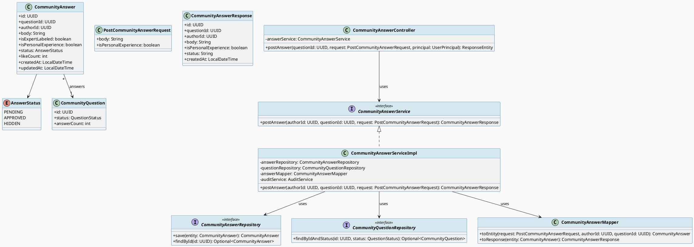
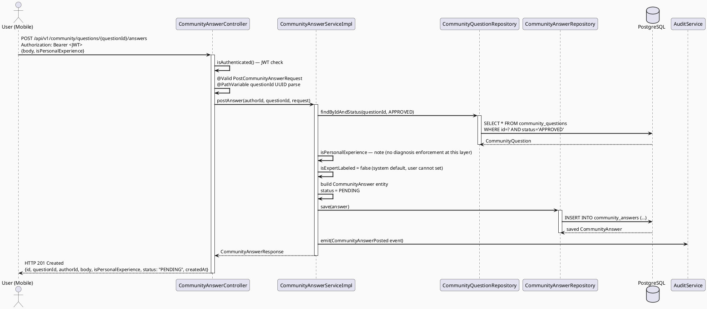
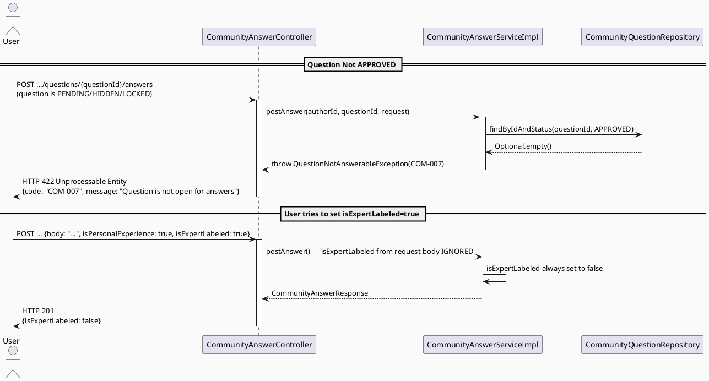
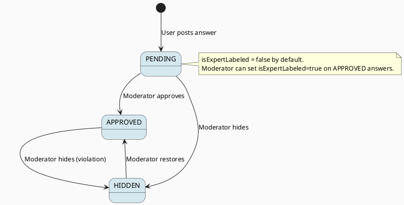

# ENGINEERING DOCUMENTATION STANDARD (EDS) v2.0
# Technical Design Specification — UC-56 Post Community Answer

| Field              | Value                                   |
| ------------------ | --------------------------------------- |
| **Document ID**    | `CB-COMMUNITY-IMP-002`                  |
| **Version**        | `1.0`                                   |
| **Date**           | `2026-06-23`                            |
| **Status**         | `Approved`                              |
| **Document Owner** | `HuyND`                                 |
| **Author**         | `AI Agent — Winston (System Architect)` |
| **Reviewed by**    | `[Tech Lead]`                           |
| **DPO Sign-off**   | `[ ] Pending`                           |
| **Approved by**    | `[Principal Architect]`                 |
| **Last Review**    | `2026-06-23`                            |
| **Based on EDS**   | `v2.0`                                  |

---

## CHANGELOG

| Ngày       | Người thực hiện    | Nội dung thay đổi                                    |
| ---------- | ------------------ | ---------------------------------------------------- |
| 2026-06-23 | AI Agent — Winston | Tạo tài liệu lần đầu cho UC-56 Post Community Answer |

---

## MỤC LỤC

1. [Tổng quan Module](#1-tổng-quan-module)
2. [Ma trận Truy vết (Traceability Matrix)](#2-ma-trận-truy-vết-traceability-matrix)
3. [Architecture Decision Records (ADR)](#3-architecture-decision-records-adr)
4. [Non-Functional Requirements & SLA](#4-non-functional-requirements--sla)
5. [Static Modeling (Mô hình Tĩnh)](#5-static-modeling-mô-hình-tĩnh)
6. [Dynamic Modeling (Mô hình Động)](#6-dynamic-modeling-mô-hình-động)
7. [Domain Event Catalog](#7-domain-event-catalog)
8. [Interface Specification (Đặc tả Giao diện)](#8-interface-specification-đặc-tả-giao-diện)
9. [API Specification](#9-api-specification)
10. [Bảng mã lỗi (Error Codes)](#10-bảng-mã-lỗi-error-codes)
11. [Quy trình Triển khai (Step-by-Step)](#11-quy-trình-triển-khai-step-by-step)
12. [Rollback & Incident Runbook](#12-rollback--incident-runbook)
13. [Kịch bản Kiểm thử Chi tiết](#13-kịch-bản-kiểm-thử-chi-tiết)
14. [Phương pháp Xác minh](#14-phương-pháp-xác-minh)
15. [Mẫu thử thực tế (API Verification Samples)](#15-mẫu-thử-thực-tế-api-verification-samples)
16. [Bảng tổng hợp phân quyền (Authorization Matrix)](#16-bảng-tổng-hợp-phân-quyền-authorization-matrix)
17. [AI Prompt Constraints (CASE 2.0)](#17-ai-prompt-constraints-case-20)

---

## 1. Tổng quan Module

| Field                     | Value                                                                        |
| ------------------------- | ---------------------------------------------------------------------------- |
| **Module Name**           | `PostCommunityAnswer`                                                        |
| **Bounded Context**       | `community`                                                                  |
| **UC ID**                 | `UC-56`                                                                      |
| **SRS Reference**         | `3.3.1.33`                                                                   |
| **Primary Actor**         | `User (any authenticated role)`                                              |
| **Platform**              | `Mobile App (Flutter)`                                                       |
| **Data Classification**   | `Internal`                                                                   |
| **Compliance Scope**      | `BR-RBAC, BR-SAFETY`                                                         |
| **Upstream Dependencies** | `security (JWT), community.CommunityQuestion (must be APPROVED)`             |
| **Downstream Consumers**  | `community (feed, question detail), audit (AuditLog), expert (expert label)` |

**Mô tả:** Cho phép bất kỳ người dùng đã đăng nhập chia sẻ trải nghiệm cá nhân dưới dạng câu trả lời trong cộng đồng. Câu trả lời phải được gắn nhãn `isPersonalExperience=true` khi chia sẻ kinh nghiệm cá nhân và TUYỆT ĐỐI KHÔNG được đưa ra chẩn đoán hoặc kê đơn thuốc (BR-SAFETY). Câu trả lời mới được tạo với trạng thái `PENDING`.

---

## 2. Ma trận Truy vết (Traceability Matrix)

| Requirement ID | Loại          | Mô tả yêu cầu                                               | Thành phần Code                                      | Compliance Target | ADR liên quan |
| -------------- | ------------- | ----------------------------------------------------------- | ---------------------------------------------------- | ----------------- | ------------- |
| UC-56          | Use Case      | User đăng câu trả lời cộng đồng                             | `CommunityAnswerController.postAnswer()`             | BR-RBAC           | ADR-COM-004   |
| BR-RBAC        | Business Rule | Bất kỳ authenticated user đều được trả lời                  | `@PreAuthorize("isAuthenticated()")`                 | RBAC              | ADR-COM-004   |
| BR-SAFETY      | Business Rule | Câu trả lời KHÔNG được là chẩn đoán/kê đơn                  | `CommunityAnswerPolicy.enforceSafetyLabel()`         | Healthcare Safety | ADR-COM-005   |
| BR-COM-005     | Business Rule | questionId phải tồn tại và status=APPROVED                  | `CommunityAnswerService.validateQuestion()`          | Data integrity    | ADR-COM-006   |
| BR-COM-006     | Business Rule | Answer mới luôn ở status PENDING                            | `CommunityAnswer.status = PENDING`                   | Moderation        | ADR-COM-006   |
| BR-COM-007     | Business Rule | body không rỗng, tối đa 3000 ký tự                          | `@NotBlank @Size(max=3000)`                          | —                 | —             |
| BR-COM-008     | Business Rule | Khi submit, answerCount của question tăng +1 sau moderation | `CommunityQuestionRepository.incrementAnswerCount()` | Consistency       | —             |

---

## 3. Architecture Decision Records (ADR)

### ADR-COM-004 — Mọi authenticated user đều được post answer

| Field        | Value                      |
| ------------ | -------------------------- |
| **Status**   | `Accepted`                 |
| **Deciders** | `HuyND — System Architect` |
| **Date**     | `2026-06-23`               |

#### Bối cảnh (Context)
Cộng đồng CareBridge khuyến khích chia sẻ kinh nghiệm từ tất cả thành viên: bà mẹ, chuyên gia, đối tác. Expert có thêm trường `isExpertLabeled=true` do Moderator gán — không do user tự gán.

#### Quyết định (Decision)
Chọn `@PreAuthorize("isAuthenticated()")` — bất kỳ authenticated user đều có thể post answer. Role không giới hạn ở đây.

#### Hệ quả (Consequences)
**Tích cực:** Mở rộng tham gia cộng đồng, nhiều góc nhìn hơn.
**Tiêu cực:** Cần moderation chặt để đảm bảo chất lượng. Đã có BR-SAFETY và status=PENDING.

---

### ADR-COM-005 — BR-SAFETY: Câu trả lời không được là chẩn đoán/kê đơn

| Field        | Value                      |
| ------------ | -------------------------- |
| **Status**   | `Accepted`                 |
| **Deciders** | `HuyND — System Architect` |
| **Date**     | `2026-06-23`               |

#### Bối cảnh (Context)
CareBridge là nền tảng hỗ trợ, không phải y tế. Câu trả lời trong cộng đồng phải là chia sẻ kinh nghiệm, không phải chẩn đoán bệnh hoặc tư vấn thuốc. Vi phạm điều này có rủi ro pháp lý và an toàn người dùng.

#### Quyết định (Decision)
Áp dụng field `isPersonalExperience` bắt buộc. `CommunityAnswerPolicy` validate rằng câu trả lời không chứa các pattern chẩn đoán rõ ràng (client-side disclosure + server-side audit). `isExpertLabeled` chỉ được set bởi Moderator/System, KHÔNG phải người dùng.

#### Hệ quả (Consequences)
**Tích cực:** Bảo vệ người dùng và platform khỏi rủi ro tư vấn y tế không phép.
**Trade-offs:** Không thể ngăn chặn 100% bằng server-side — cần Moderator review.
**Compliance Impact:** Phù hợp với chiến lược an toàn healthcare của CareBridge.

---

### ADR-COM-006 — Answer chỉ được post vào APPROVED question

| Field        | Value                      |
| ------------ | -------------------------- |
| **Status**   | `Accepted`                 |
| **Deciders** | `HuyND — System Architect` |
| **Date**     | `2026-06-23`               |

#### Quyết định (Decision)
Service validate `question.status == APPROVED` trước khi cho phép post answer. PENDING/HIDDEN/LOCKED questions không nhận answer.

---

## 4. Non-Functional Requirements & SLA

### 4.1. Performance & Availability

| Category     | Requirement             | Target SLA  | Measurement Method | Compliance Basis |
| ------------ | ----------------------- | ----------- | ------------------ | ---------------- |
| Latency      | API response (p99)      | `< 300ms`   | k6 load test       | —                |
| Availability | Uptime (monthly)        | `99.9%`     | Uptime monitor     | —                |
| Throughput   | Concurrent POST answers | `300 req/s` | Load test          | —                |

### 4.2. Data Integrity & Retention

| Category    | Requirement                       | Target  | Verification Method         | Compliance Basis |
| ----------- | --------------------------------- | ------- | --------------------------- | ---------------- |
| Durability  | Zero answer loss                  | RPO = 0 | Transaction log             | —                |
| Consistency | answerCount sync với actual count | 99.9%   | Periodic reconciliation job | —                |

### 4.3. Security

| Category        | Requirement                      | Target                  | Verification Method | Compliance Basis |
| --------------- | -------------------------------- | ----------------------- | ------------------- | ---------------- |
| Auth            | JWT required                     | 401 without token       | Security test       | BR-RBAC          |
| isExpertLabeled | User cannot self-label as expert | Server-side enforcement | Security test       | BR-SAFETY        |

---

## 5. Static Modeling (Mô hình Tĩnh)

### 5.1. Class Diagram (PlantUML)



### 5.2. JPA Entity (Java)

```java
package com.carebridge.backend.community.entity;

import jakarta.persistence.*;
import lombok.*;
import org.hibernate.annotations.CreationTimestamp;
import org.hibernate.annotations.UpdateTimestamp;

import java.time.LocalDateTime;
import java.util.UUID;

@Entity
@Table(name = "community_answers", indexes = {
    @Index(name = "idx_community_answers_question_id", columnList = "question_id"),
    @Index(name = "idx_community_answers_author_id", columnList = "author_id"),
    @Index(name = "idx_community_answers_status", columnList = "status")
})
@Getter @Setter @NoArgsConstructor @AllArgsConstructor @Builder
public class CommunityAnswer {

    @Id
    @GeneratedValue(strategy = GenerationType.UUID)
    @Column(name = "id", updatable = false, nullable = false)
    private UUID id;

    @Column(name = "question_id", nullable = false)
    private UUID questionId;

    @Column(name = "author_id", nullable = false)
    private UUID authorId;

    @Column(name = "body", nullable = false, columnDefinition = "TEXT")
    private String body;

    @Column(name = "is_expert_labeled", nullable = false)
    @Builder.Default
    private boolean isExpertLabeled = false;  // Only set by Moderator/System

    @Column(name = "is_personal_experience", nullable = false)
    private boolean isPersonalExperience;

    @Enumerated(EnumType.STRING)
    @Column(name = "status", nullable = false, length = 20)
    @Builder.Default
    private AnswerStatus status = AnswerStatus.PENDING;

    @Column(name = "like_count", nullable = false)
    @Builder.Default
    private int likeCount = 0;

    @CreationTimestamp
    @Column(name = "created_at", updatable = false)
    private LocalDateTime createdAt;

    @UpdateTimestamp
    @Column(name = "updated_at")
    private LocalDateTime updatedAt;
}
```

```java
package com.carebridge.backend.community.entity;

public enum AnswerStatus { PENDING, APPROVED, HIDDEN }
```

---

## 6. Dynamic Modeling (Mô hình Động)

### 6.1. Sequence Diagram — Happy Path (PlantUML)



### 6.2. Sequence Diagram — Error Path (PlantUML)



### 6.3. State Machine — CommunityAnswer Status



---

## 7. Domain Event Catalog

### 7.1. Events Published (Phát ra)

| Event Name              | Trigger                    | Publisher                    | Subscriber(s)  | Payload Schema | Async?    |
| ----------------------- | -------------------------- | ---------------------------- | -------------- | -------------- | --------- |
| `CommunityAnswerPosted` | Answer được tạo thành công | `CommunityAnswerServiceImpl` | `AuditService` | See §7.3       | No (sync) |

### 7.3. Payload Schema

```java
public record CommunityAnswerPostedEvent(
    String eventId,
    String eventType,      // "CommunityAnswerPosted"
    String occurredAt,
    String version,        // "1.0"
    Payload payload,
    Metadata metadata
) {
    public record Payload(
        UUID answerId,
        UUID questionId,
        UUID authorId,
        boolean isPersonalExperience
    ) {}

    public record Metadata(
        String correlationId,
        String causedBy
    ) {}
}
```

---

## 8. Interface Specification (Đặc tả Giao diện)

### 8.1. Service Interface

```java
package com.carebridge.backend.community.service;

import com.carebridge.backend.community.dto.request.PostCommunityAnswerRequest;
import com.carebridge.backend.community.dto.response.CommunityAnswerResponse;
import java.util.UUID;

/**
 * @version 1.0
 */
public interface CommunityAnswerService {

    /**
     * Posts a new community answer to an APPROVED question.
     * @param authorId   UUID of the authenticated user
     * @param questionId UUID of the target question (must be APPROVED)
     * @param request    validated PostCommunityAnswerRequest DTO
     * @return CommunityAnswerResponse with status=PENDING, isExpertLabeled=false
     * @throws com.carebridge.backend.community.exception.QuestionNotAnswerableException (COM-007) when question is not APPROVED
     * @throws com.carebridge.backend.common.exception.ResourceNotFoundException (COM-008) when questionId not found
     */
    CommunityAnswerResponse postAnswer(UUID authorId, UUID questionId, PostCommunityAnswerRequest request);
}
```

### 8.2. Repository Interface

```java
package com.carebridge.backend.community.repository;

import com.carebridge.backend.community.entity.CommunityAnswer;
import org.springframework.data.jpa.repository.JpaRepository;
import java.util.UUID;

/**
 * @version 1.0
 */
public interface CommunityAnswerRepository extends JpaRepository<CommunityAnswer, UUID> {
    // Inherited: save(), findById()
}
```

### 8.3. Request/Response DTOs

```java
package com.carebridge.backend.community.dto.request;

import jakarta.validation.constraints.*;
import lombok.Data;

@Data
public class PostCommunityAnswerRequest {

    @NotBlank(message = "body is required")
    @Size(min = 10, max = 3000, message = "body must be between 10 and 3000 characters")
    private String body;

    @NotNull(message = "isPersonalExperience is required")
    private Boolean isPersonalExperience;

    // Note: isExpertLabeled is NOT in the request — set by system only
}
```

---

## 9. API Specification

### 9.1. Endpoints Table

| Method | Path                                               | Auth Level | Required Roles    | Rate Limit | Idempotent? |
| ------ | -------------------------------------------------- | ---------- | ----------------- | ---------- | ----------- |
| `POST` | `/api/v1/community/questions/{questionId}/answers` | JWT Bearer | Any authenticated | 60/min     | No          |

### 9.2. Request / Response Schemas

#### `POST /api/v1/community/questions/{questionId}/answers`

**Request Headers:**
```
Authorization: Bearer <JWT_TOKEN>
Content-Type: application/json
X-Correlation-Id: <uuid>
```

**Request Body:**
```json
{
  "body": "Mình cũng từng trải qua điều này ở tuần 28. Bé đạp nhiều vào ban đêm là bình thường vì bé đang phát triển. Mình đã thử nghe nhạc nhẹ và nằm nghiêng trái thì bé bớt đạp hơn.",
  "isPersonalExperience": true
}
```

**Response — 201 Created:**
```json
{
  "id": "660e8400-e29b-41d4-a716-446655440001",
  "questionId": "550e8400-e29b-41d4-a716-446655440000",
  "authorId": "770e8400-e29b-41d4-a716-446655440002",
  "body": "Mình cũng từng trải qua điều này...",
  "isPersonalExperience": true,
  "isExpertLabeled": false,
  "status": "PENDING",
  "createdAt": "2026-06-23T10:05:00.000Z"
}
```

**Response — 422 Unprocessable Entity (Question not open):**
```json
{
  "error": {
    "code": "COM-007",
    "message": "Question is not open for answers — must be APPROVED status"
  }
}
```

---

## 10. Bảng mã lỗi (Error Codes)

| Code      | HTTP Status | Message (EN)                  | Message (VI)                       | Trigger Condition                      |
| --------- | ----------- | ----------------------------- | ---------------------------------- | -------------------------------------- |
| `COM-001` | 400         | Validation failed             | Dữ liệu không hợp lệ               | body vi phạm size/blank validation     |
| `COM-004` | 403         | Insufficient permissions      | Không đủ quyền                     | Chưa đăng nhập (token missing/invalid) |
| `COM-005` | 500         | Internal server error         | Lỗi hệ thống                       | Lỗi không xác định                     |
| `COM-007` | 422         | Question not open for answers | Câu hỏi không còn nhận câu trả lời | question.status != APPROVED            |
| `COM-008` | 404         | Question not found            | Câu hỏi không tồn tại              | questionId không tồn tại trong DB      |

---

## 11. Quy trình Triển khai (Step-by-Step)

### 11.1. Prerequisites

- [ ] ADR-COM-004, ADR-COM-005, ADR-COM-006 đã được Accepted
- [ ] UC-54 (community_questions table) đã được deployed
- [ ] Môi trường staging sẵn sàng

### 11.2. Implementation Steps

#### Chặng 1 — Database Migration

```sql
-- V003__create_community_answers.sql
CREATE TABLE community_answers (
    id UUID PRIMARY KEY DEFAULT gen_random_uuid(),
    question_id UUID NOT NULL REFERENCES community_questions(id),
    author_id UUID NOT NULL REFERENCES users(id),
    body TEXT NOT NULL,
    is_expert_labeled BOOLEAN NOT NULL DEFAULT FALSE,
    is_personal_experience BOOLEAN NOT NULL,
    status VARCHAR(20) NOT NULL DEFAULT 'PENDING' CHECK (status IN ('PENDING','APPROVED','HIDDEN')),
    like_count INT NOT NULL DEFAULT 0,
    created_at TIMESTAMPTZ NOT NULL DEFAULT NOW(),
    updated_at TIMESTAMPTZ NOT NULL DEFAULT NOW()
);

CREATE INDEX idx_community_answers_question_id ON community_answers(question_id);
CREATE INDEX idx_community_answers_author_id ON community_answers(author_id);
CREATE INDEX idx_community_answers_status ON community_answers(status);
```

#### Chặng 2 — Verification sau deploy

```bash
curl -X POST https://[host]/api/v1/community/questions/[approved-question-id]/answers \
  -H "Authorization: Bearer [USER_JWT]" \
  -H "Content-Type: application/json" \
  -d '{"body":"Test answer body with enough characters","isPersonalExperience":true}'
# Expected: 201, status=PENDING, isExpertLabeled=false
```

---

## 12. Rollback & Incident Runbook

### 12.1. Điều kiện kích hoạt Rollback

| Điều kiện                       | Ngưỡng      | Người quyết định |
| ------------------------------- | ----------- | ---------------- |
| Error rate > 5%                 | 5 phút      | On-call Engineer |
| isExpertLabeled bị set bởi user | Bất kỳ case | Tech Lead        |

### 12.2. Rollback Procedure

```bash
# Revert migration
psql -h [host] -U carebridge carebridge_db \
  -c "DROP TABLE IF EXISTS community_answers;"

kubectl rollout undo deployment/carebridge-api
```

---

## 13. Kịch bản Kiểm thử Chi tiết

### 13.1. Unit Tests

#### TC-UNIT-001 — Trả lời thành công, isExpertLabeled luôn false

```gherkin
Feature: UC-56 Post Community Answer
  Background:
    Given test data classification: SYNTHETIC
    And CommunityQuestionRepository mock returns APPROVED question

  Scenario: Authenticated user posts valid personal experience answer
    Given authorId = "user-001", questionId = "question-approved-001"
    And request có body="Valid answer body 10+ chars", isPersonalExperience=true
    When CommunityAnswerServiceImpl.postAnswer() được gọi
    Then CommunityAnswerRepository.save() được gọi đúng 1 lần
    And saved entity.status = PENDING
    And saved entity.isExpertLabeled = false (NOT settable by user)
    And response.status = "PENDING"
    And response.isExpertLabeled = false

  Scenario: User cố set isExpertLabeled=true bị ignore
    Given request có isPersonalExperience=false (non-expert sharing general info)
    When postAnswer() được gọi
    Then saved entity.isExpertLabeled = false (always)
    And response.isExpertLabeled = false
```

#### TC-UNIT-002 — Question không APPROVED → COM-007

```gherkin
  Scenario: Question ở trạng thái PENDING không nhận answer
    Given CommunityQuestionRepository.findByIdAndStatus(questionId, APPROVED) returns Optional.empty()
    When postAnswer() được gọi
    Then QuestionNotAnswerableException được ném với code COM-007
    And answerRepository.save() KHÔNG được gọi
```

### 13.2. Integration Tests

#### TC-INT-001 — Full stack: POST answer → DB assertion

```gherkin
  Scenario: User gọi POST API, answer xuất hiện trong DB
    Given community_questions có record với id="q-001", status='APPROVED'
    And authenticated user JWT (any role)
    When POST /api/v1/community/questions/q-001/answers với valid body
    Then response status = 201
    And community_answers có record mới với status='PENDING', is_expert_labeled=false
    And audit_logs có event CommunityAnswerPosted
```

### 13.3. Security Tests

#### TC-SEC-001 — isExpertLabeled không thể set từ request

```gherkin
  Scenario: Attacker thêm isExpertLabeled=true trong request body
    Given valid authenticated JWT
    And request body chứa "isExpertLabeled": true
    When POST /api/v1/community/questions/{id}/answers
    Then response status = 201
    And response.isExpertLabeled = false (field ignored từ request)
    And DB record is_expert_labeled = false
```

---

## 14. Phương pháp Xác minh

### 14.1. Database Inspection

```sql
-- Verify answer created with correct defaults
SELECT id, status, is_expert_labeled, is_personal_experience, author_id, question_id
FROM community_answers
WHERE id = '[uuid]';
-- Expected: status='PENDING', is_expert_labeled=false

-- Verify question exists and is APPROVED
SELECT id, status FROM community_questions WHERE id = '[questionId]';
```

---

## 15. Mẫu thử thực tế (API Verification Samples)

### 15.1. Happy Path

```bash
curl -X POST https://[host]/api/v1/community/questions/[QUESTION_ID]/answers \
  -H "Authorization: Bearer [USER_JWT]" \
  -H "Content-Type: application/json" \
  -H "X-Correlation-Id: $(uuidgen)" \
  -d '{
    "body": "Mình cũng từng trải qua. Bé đạp nhiều là dấu hiệu bé đang phát triển tốt. Mình được bác sĩ tư vấn là bình thường.",
    "isPersonalExperience": true
  }'
```

### 15.2. Error Paths

```bash
# Question không APPROVED → 422
curl -X POST https://[host]/api/v1/community/questions/[PENDING_QUESTION_ID]/answers \
  -H "Authorization: Bearer [USER_JWT]" \
  -H "Content-Type: application/json" \
  -d '{"body":"Valid body content","isPersonalExperience":true}'
```

---

## 16. Bảng tổng hợp phân quyền (Authorization Matrix)

| Endpoint                                        | `UNAUTHENTICATED` | `MOTHER` | `EXPERT` | `MODERATOR` | `ADMIN` |
| ----------------------------------------------- | ----------------- | -------- | -------- | ----------- | ------- |
| `POST /api/v1/community/questions/{id}/answers` | ❌ (401)           | ✅        | ✅        | ✅           | ✅       |

**Chú thích:**
- ✅ = Được phép (bất kỳ authenticated role)
- ❌ = 401 Unauthorized (no JWT)

---

## 17. AI Prompt Constraints (CASE 2.0)

### 17.1 Constraint Summary Table

| #   | Constraint                                                                                                         | Source                    | Last Verified |
| --- | ------------------------------------------------------------------------------------------------------------------ | ------------------------- | ------------- |
| C1  | `isExpertLabeled` PHẢI luôn = false khi service tạo answer — KHÔNG đọc từ request body                             | `ADR-COM-005`             | `2026-06-23`  |
| C2  | `status` PHẢI = PENDING khi tạo answer — KHÔNG allow auto-approve                                                  | `ADR-COM-006`             | `2026-06-23`  |
| C3  | Service PHẢI gọi `CommunityQuestionRepository.findByIdAndStatus(questionId, APPROVED)` — reject nếu không APPROVED | `ADR-COM-006, BR-COM-005` | `2026-06-23`  |
| C4  | `@PreAuthorize("isAuthenticated()")` tại controller — bất kỳ role nào đều được                                     | `ADR-COM-004, BR-RBAC`    | `2026-06-23`  |
| C5  | authorId lấy từ `UserPrincipal` — KHÔNG nhận từ request body                                                       | `ADR-COM-004`             | `2026-06-23`  |

### 17.2 Constraint Injection Block

```
[CONSTRAINT BLOCK — Module: PostCommunityAnswer]
Theo TDS CB-COMMUNITY-IMP-002:

1. isExpertLabeled PHẢI được hard-code = false trong service layer. Bỏ qua bất kỳ field nào trong request body.
2. status PHẢI = PENDING khi tạo. Không auto-approve.
3. Trước khi save, PHẢI validate question.status == APPROVED. Nếu không → QuestionNotAnswerableException (COM-007).
4. @PreAuthorize("isAuthenticated()") tại controller. Không cần role cụ thể.
5. authorId từ UserPrincipal (JWT), không từ request body.
```

### 17.3 Constraint Quality Checklist

- [x] Mỗi constraint traceable về ADR/BR
- [x] C1 ngăn privilege escalation (expert self-labeling)
- [x] Constraint block reference §8 Interface và §16 Auth Matrix

### 17.4 Anti-Pattern Detection

| AP-ID     | Anti-Pattern          | Dấu hiệu                                       | Hành động            |
| --------- | --------------------- | ---------------------------------------------- | -------------------- |
| AP-AI-001 | Unconstrained Gen     | Code đọc isExpertLabeled từ request            | Reject — inject C1   |
| AP-AI-003 | Implicit Decision     | Code auto-approve answer                       | Reject — ADR-COM-006 |
| AP-AI-005 | Hallucinated Contract | Code gọi AnswerSafetyService không có trong §8 | Reject               |

---

*EDS v2.0 — CB-COMMUNITY-IMP-002 — UC-56 Post Community Answer*
