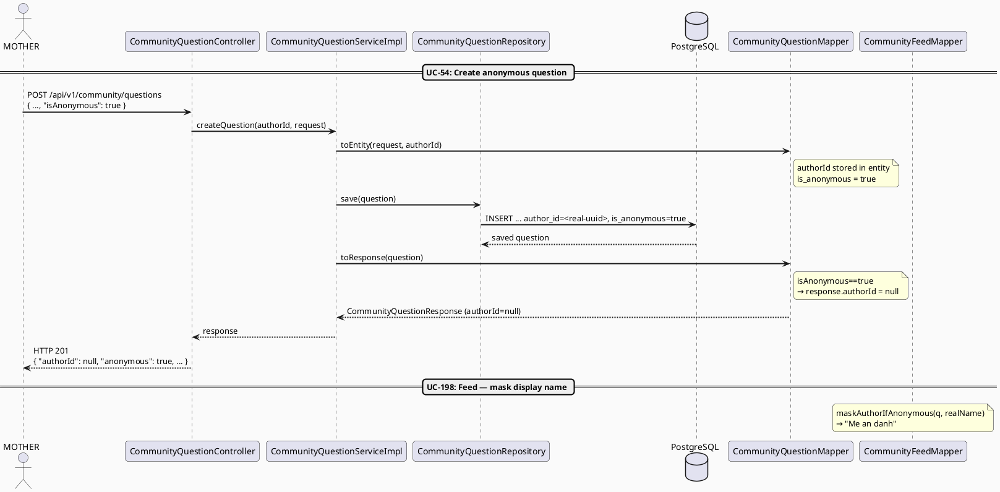

# ENGINEERING DOCUMENTATION STANDARD (EDS) v2.0
# Technical Design Specification — UC-57 Use Anonymous Display

| Field              | Value                                   |
| ------------------ | --------------------------------------- |
| **Document ID**    | `CB-COMMUNITY-IMP-006`                  |
| **Version**        | `1.0`                                   |
| **Date**           | `2026-06-29`                            |
| **Status**         | `Implemented ✅`                         |
| **Document Owner** | `HuyND`                                 |
| **Author**         | `AI Agent`                              |
| **Reviewed by**    | `[Tech Lead]`                           |
| **DPO Sign-off**   | `[ ] Pending`                           |
| **Approved by**    | `[Principal Architect]`                 |
| **Last Review**    | `2026-06-29`                            |
| **Based on EDS**   | `v2.0`                                  |

---

## CHANGELOG

| Ngay       | Nguoi thuc hien | Noi dung thay doi                                                          |
| ---------- | --------------- | -------------------------------------------------------------------------- |
| 2026-06-29 | AI Agent        | Tao tai lieu lan dau — document existing behavior implemented in UC-54 and UC-198 |

---

## MUC LUC

1. [Tong quan Module](#1-tong-quan-module)
2. [Ma tran Truy vet (Traceability Matrix)](#2-ma-tran-truy-vet-traceability-matrix)
3. [Architecture Decision Records (ADR)](#3-architecture-decision-records-adr)
4. [Non-Functional Requirements & SLA](#4-non-functional-requirements--sla)
5. [Static Modeling (Mo hinh Tinh)](#5-static-modeling-mo-hinh-tinh)
6. [Dynamic Modeling (Mo hinh Dong)](#6-dynamic-modeling-mo-hinh-dong)
7. [Domain Event Catalog](#7-domain-event-catalog)
8. [Interface Specification (Dac ta Giao dien)](#8-interface-specification-dac-ta-giao-dien)
9. [API Specification](#9-api-specification)
10. [Bang ma loi (Error Codes)](#10-bang-ma-loi-error-codes)
11. [Quy trinh Trien khai (Step-by-Step)](#11-quy-trinh-trien-khai-step-by-step)
12. [Rollback & Incident Runbook](#12-rollback--incident-runbook)
13. [Kich ban Kiem thu Chi tiet](#13-kich-ban-kiem-thu-chi-tiet)
14. [Phuong phap Xac minh](#14-phuong-phap-xac-minh)
15. [Mau thu thuc te (API Verification Samples)](#15-mau-thu-thuc-te-api-verification-samples)
16. [Bang tong hop phan quyen (Authorization Matrix)](#16-bang-tong-hop-phan-quyen-authorization-matrix)
17. [AI Prompt Constraints (CASE 2.0)](#17-ai-prompt-constraints-case-20)

---

## 1. Tong quan Module

| Field                     | Value                                                                           |
| ------------------------- | ------------------------------------------------------------------------------- |
| **Module Name**           | `UseAnonymousDisplay`                                                           |
| **Bounded Context**       | `community`                                                                     |
| **UC ID**                 | `UC-57`                                                                         |
| **SRS Reference**         | `3.3.1.34`                                                                      |
| **Primary Actor**         | `Mother (ROLE_MOTHER — authenticated)`                                          |
| **Platform**              | `Mobile App (Flutter) / Web`                                                    |
| **Data Classification**   | `Internal` (anonymous display is a privacy feature, not PII storage)           |
| **Compliance Scope**      | `BR-PRIVACY`                                                                    |
| **Upstream Dependencies** | `UC-54 CreateCommunityQuestion` (where isAnonymous flag is set)                 |
| **Downstream Consumers**  | `UC-198 ViewCommunityFeed`, any endpoint returning `CommunityQuestionResponse`  |

**Description:** UC-57 defines the anonymous display behavior for community questions. This behavior is **already implemented** as part of UC-54 (CreateCommunityQuestion) and UC-198 (ViewCommunityFeed). No new code is required for UC-57.

When a Mother creates a question with `isAnonymous: true`:
1. The real `authorId` is stored in the `community_questions.author_id` column (never erased).
2. All API responses mask the `authorId` field to `null` (handled by `CommunityQuestionMapper.toResponse()`).
3. All feed/display contexts show the display name as `"Me an danh"` (handled by `CommunityFeedMapper.maskAuthorIfAnonymous()`).
4. The `anonymous: boolean` field is always returned in every response, allowing the UI to show the appropriate indicator.

---

## 2. Ma tran Truy vet (Traceability Matrix)

| Requirement ID | Loai          | Mo ta yeu cau                                                      | Thanh phan Code                                                        | Compliance Target | ADR lien quan |
| -------------- | ------------- | ------------------------------------------------------------------ | ---------------------------------------------------------------------- | ----------------- | ------------- |
| UC-57          | Use Case      | Mother can choose to post anonymously                              | `CreateCommunityQuestionRequest.isAnonymous` (UC-54 input)             | BR-PRIVACY        | ADR-COM-002   |
| BR-PRIVACY     | Business Rule | Real authorId MUST NOT be exposed in any response when anonymous   | `CommunityQuestionMapper.toResponse()` — sets authorId=null            | Privacy           | ADR-COM-002   |
| BR-COM-009     | Business Rule | Anonymous display name is "Me an danh" (immutable constant)        | `CommunityFeedMapper.ANONYMOUS_AUTHOR = "Me an danh"`                  | Privacy           | ADR-COM-002   |
| BR-COM-010     | Business Rule | The `anonymous` boolean is always present in every response        | `CommunityQuestionResponse.anonymous` field (non-nullable boolean)     | Transparency      | —             |
| BR-COM-011     | Business Rule | The real authorId is always stored in the DB regardless of flag    | DB column `author_id NOT NULL` constraint                              | Data integrity    | ADR-COM-002   |

---

## 3. Architecture Decision Records (ADR)

### ADR-COM-002 — Anonymous Question: Store real authorId in DB, mask in response

> This ADR was originally recorded in the UC-54 TDS (`CB-COMMUNITY-IMP-001`). It is re-referenced here for UC-57 traceability.

| Field          | Value                      |
| -------------- | -------------------------- |
| **Status**     | `Accepted`                 |
| **Deciders**   | `HuyND — System Architect` |
| **Date**       | `2026-06-23`               |
| **Supersedes** | `—`                        |

#### Boi canh (Context)
Mothers want to ask sensitive health questions without revealing their identity. However, the platform needs to retain the real `authorId` for moderation purposes (to deactivate abusive accounts, enforce one-post-per-user limits, etc.). A purely anonymous posting model (no stored author) would prevent moderation.

#### Cac phuong an da xem xet (Options Considered)

| Phuong an | Mo ta                                                  | Uu diem                                    | Nhuoc diem                                         |
| --------- | ------------------------------------------------------ | ------------------------------------------ | -------------------------------------------------- |
| A         | Store real authorId in DB; mask to null in API response | Enables moderation; preserves privacy in public API | Requires masking in every response path   |
| B         | Do not store authorId at all for anonymous posts        | Fully anonymous                            | Prevents moderation; violates data integrity needs |
| C         | Store a hashed/pseudonymous token instead of UUID       | Partial traceability                        | Complex; extra schema; harder to reconcile         |

#### Quyet dinh (Decision)
Choose **Option A** — store real authorId in DB, mask it to `null` in all API responses when `isAnonymous=true`. The display name is standardized to the constant `"Me an danh"` in the feed mapper.

#### He qua (Consequences)

**Tich cuc:**
- Moderators can identify and action authors of abusive anonymous posts via admin tools
- Privacy respected in all public-facing API responses
- Simple implementation — one masking point per response path

**Tieu cuc / Trade-offs:**
- Every new response mapper that exposes author info must implement the masking check
- Internal admin endpoints must be carefully guarded to prevent authorId leak

**Compliance Impact:**
- BR-PRIVACY: authorId never exposed to non-admin consumers when isAnonymous=true
- Data retained for moderation as required by platform safety obligations

---

## 4. Non-Functional Requirements & SLA

### 4.1. Performance & Availability

| Category | Requirement              | Target SLA | Measurement Method | Compliance Basis |
| -------- | ------------------------ | ---------- | ------------------- | ---------------- |
| Latency  | Masking adds zero latency | 0ms        | Unit test timing    | —                |

> The masking is a pure in-memory conditional — no DB query, no async call. No SLA impact.

### 4.2. Security

| Category       | Requirement                                          | Target       | Verification Method    | Compliance Basis |
| -------------- | ---------------------------------------------------- | ------------ | ---------------------- | ---------------- |
| Privacy        | authorId null in all responses when isAnonymous=true | 100%         | Unit tests TC-001/TC-003 | BR-PRIVACY     |
| Data retention | Real authorId always stored in DB                    | 100%         | Integration test       | BR-COM-011       |

---

## 5. Static Modeling (Mo hinh Tinh)

### 5.1. Class Diagram (PlantUML)

```plantuml
@startuml UC57_UseAnonymousDisplay_ClassDiagram
skinparam classAttributeIconSize 0
skinparam classFontStyle bold
skinparam backgroundColor #FAFAFA
skinparam ArrowColor #555555
skinparam ClassBorderColor #2E75B6
skinparam ClassHeaderBackgroundColor #D5E8F0

' === ENTITY ===
class CommunityQuestion {
  + id: UUID
  + authorId: UUID
  + anonymous: boolean    ' stored as is_anonymous in DB
  ' ... other fields ...
}

' === RESPONSE DTO ===
class CommunityQuestionResponse <<DTO>> {
  + id: UUID
  + authorId: UUID     ' null when anonymous=true
  + anonymous: boolean ' always present, never null
  ' ... other fields ...
}

' === MAPPER: response masking ===
class CommunityQuestionMapper <<Mapper>> {
  + toEntity(request: CreateCommunityQuestionRequest, authorId: UUID): CommunityQuestion
  + toResponse(entity: CommunityQuestion): CommunityQuestionResponse
  ' toResponse contract:
  '   when entity.isAnonymous() == true → response.setAuthorId(null)
  '   when entity.isAnonymous() == false → response.setAuthorId(entity.getAuthorId())
}

' === FEED MAPPER: display name masking ===
class CommunityFeedMapper <<Mapper>> {
  + ANONYMOUS_AUTHOR: String = "Me an danh"
  + maskAuthorIfAnonymous(q: CommunityQuestion, displayName: String): String
  ' contract:
  '   when q.isAnonymous() == true → return "Me an danh"
  '   when q.isAnonymous() == false → return displayName
}

' === RELATIONSHIPS ===
CommunityQuestionMapper ..> CommunityQuestion : reads
CommunityQuestionMapper ..> CommunityQuestionResponse : produces
CommunityFeedMapper ..> CommunityQuestion : reads

note right of CommunityQuestionMapper
  ADR-COM-002: authorId masked to null
  when isAnonymous=true
end note

note right of CommunityFeedMapper
  ADR-COM-002: display name masked to
  "Me an danh" when isAnonymous=true
end note

@enduml
```



### 5.2. Data Structure

No new migration. The `is_anonymous` column and `author_id` column already exist in `community_questions` from the schema applied in UC-54.

Relevant columns:
```sql
-- From V5__community_schema.sql (or equivalent)
is_anonymous  BOOLEAN      NOT NULL DEFAULT FALSE,
author_id     UUID         NOT NULL  -- NEVER nullable — stores real author always
```

---

## 6. Dynamic Modeling (Mo hinh Dong)

### 6.1. Sequence Diagram — Anonymous Question Creation and Display



---

## 7. Domain Event Catalog

### 7.1. Events Published

None — UC-57 is a response-masking concern, not an event-publishing feature.

### 7.2. Events Consumed

None.

---

## 8. Interface Specification (Dac ta Giao dien)

### 8.1. Existing Interfaces (Already Implemented)

```java
// CreateCommunityQuestionRequest.java — existing field
@NotNull(message = "isAnonymous is required")
private Boolean isAnonymous;    // true = hide author in public response

// CommunityQuestionResponse.java — existing fields
private UUID    authorId;       // null when anonymous=true; real UUID when false
private boolean anonymous;      // always present — true or false

// CommunityQuestionMapper.java — existing method contract
public CommunityQuestionResponse toResponse(CommunityQuestion entity) {
    // ... map all fields ...
    response.setAnonymous(entity.isAnonymous());
    response.setAuthorId(entity.isAnonymous() ? null : entity.getAuthorId());
    return response;
}

// CommunityFeedMapper.java — existing constant and method
public static final String ANONYMOUS_AUTHOR = "Me an danh";

public String maskAuthorIfAnonymous(CommunityQuestion q, String displayName) {
    return q.isAnonymous() ? ANONYMOUS_AUTHOR : displayName;
}
```

### 8.2. Repository Interface

No new repository methods. The `is_anonymous` column is persisted via JPA through `CommunityQuestion.anonymous` field.

---

## 9. API Specification

### 9.1. Notes — No Dedicated UC-57 Endpoint

UC-57 does not introduce a new API endpoint. The anonymous display behavior is:

1. **Input** — the `isAnonymous` field in `POST /api/v1/community/questions` (UC-54)
2. **Output** — the `authorId: null` and `anonymous: true` fields in every `CommunityQuestionResponse`
3. **Feed output** — the display name `"Me an danh"` in feed responses (UC-198)

Consumers should always check the `anonymous` boolean field to determine how to render the author section in the UI.

### 9.2. Response Schema (CommunityQuestionResponse — anonymous case)

```json
{
  "id": "550e8400-e29b-41d4-a716-446655440000",
  "topicId": "660e8400-e29b-41d4-a716-446655440001",
  "title": "Is this symptom normal at week 30?",
  "body": "I have been experiencing ...",
  "stage": "THIRD_TRIMESTER",
  "urgency": "MEDIUM",
  "anonymous": true,
  "authorId": null,
  "status": "PENDING",
  "createdAt": "2026-06-20T10:00:00.000Z"
}
```

---

## 10. Bang ma loi (Error Codes)

No new error codes for UC-57. The anonymous flag is validated as part of UC-54's DTO validation:

| Code      | HTTP Status | Message (EN)                   | Trigger Condition                                |
| --------- | ----------- | ------------------------------ | ------------------------------------------------ |
| `COM-001` | 400         | isAnonymous is required        | `isAnonymous` missing from create request (UC-54) |

---

## 11. Quy trinh Trien khai (Step-by-Step)

**UC-57 is already implemented.** No new implementation steps are required.

The behavior was delivered in:
- **UC-54 implementation** (commit that introduced `CommunityQuestionMapper.toResponse()` with anonymous masking)
- **UC-198 implementation** (commit that introduced `CommunityFeedMapper.maskAuthorIfAnonymous()`)

Verification of existing behavior: run the existing test suites:
```bash
./mvnw test -pl 05_Development/CareBridgeAPI \
  -Dtest="CommunityQuestionServiceImplTest,CommunityQuestionControllerTest,CommunityFeedServiceImplTest"
```
All tests must pass. UC-57 behavior is covered by UC-54 and UC-198 test cases.

---

## 12. Rollback & Incident Runbook

No rollback applicable — this is documentation of existing, implemented, and passing behavior.

If the anonymous masking logic were to regress, the fix would be:
1. Restore `CommunityQuestionMapper.toResponse()` anonymous check
2. Restore `CommunityFeedMapper.ANONYMOUS_AUTHOR` constant and `maskAuthorIfAnonymous()` method
3. Ensure `is_anonymous` column and `author_id NOT NULL` constraint on `community_questions` are intact

---

## 13. Kich ban Kiem thu Chi tiet

See companion Test-Spec: `UC57_UseAnonymousDisplay_Test-Spec.md` (Document ID: `CB-COMMUNITY-TDD-006`).

The 4 documented test cases are **already passing** via UC-54 and UC-198 test suites. They are documented here for traceability of UC-57 coverage.

---

## 14. Phuong phap Xac minh

### 14.1. Database Inspection

```sql
-- Verify: anonymous question stores real authorId in DB (not null)
SELECT id, author_id, is_anonymous
FROM community_questions
WHERE is_anonymous = TRUE
LIMIT 5;
-- Expected: author_id is a real UUID (NOT NULL) for all rows

-- Verify: non-anonymous question also stores real authorId
SELECT id, author_id, is_anonymous
FROM community_questions
WHERE is_anonymous = FALSE
LIMIT 5;
-- Expected: author_id is a real UUID
```

### 14.2. API Verification

```bash
# Create anonymous question and verify authorId is null in response
curl -X POST http://localhost:8080/api/v1/community/questions \
  -H "Authorization: Bearer <MOTHER_JWT>" \
  -H "Content-Type: application/json" \
  -d '{ "title": "Test anonymous question", "body": "Body content here for testing", "topicId": "<topic-uuid>", "isAnonymous": true }'
# Expected: response.authorId = null, response.anonymous = true
```

---

## 15. Mau thu thuc te (API Verification Samples)

### 15.1. Anonymous Create (isAnonymous = true)

**Request:**
```json
{
  "title": "Is cramping normal at 8 weeks?",
  "body": "I have been experiencing mild cramping ...",
  "topicId": "<topic-uuid>",
  "isAnonymous": true,
  "urgency": "MEDIUM"
}
```

**Expected Response (201):**
```json
{
  "success": true,
  "data": {
    "id": "<uuid>",
    "anonymous": true,
    "authorId": null,
    "status": "PENDING"
  }
}
```

### 15.2. Non-Anonymous Create (isAnonymous = false)

**Expected Response (201):**
```json
{
  "success": true,
  "data": {
    "id": "<uuid>",
    "anonymous": false,
    "authorId": "<author-uuid>",
    "status": "PENDING"
  }
}
```

---

## 16. Bang tong hop phan quyen (Authorization Matrix)

| Endpoint                               | `GUEST`   | `MOTHER`  | `EXPERT`  | `MODERATOR` | `SYSTEM_ADMIN` |
| -------------------------------------- | --------- | --------- | --------- | ----------- | -------------- |
| `POST /api/v1/community/questions` (with isAnonymous) | No | Yes | No | No | No |

> Anonymous flag control is available only to the MOTHER role (question creator). Moderators and admins have internal tools to de-anonymize if needed (not covered by this UC).

---

## 17. AI Prompt Constraints (CASE 2.0)

### 17.1 Constraint Summary Table

| # | Constraint                                                                                                                       | Source (ADR/BR)  | Last Verified |
| - | -------------------------------------------------------------------------------------------------------------------------------- | ---------------- | ------------- |
| C1 | When `isAnonymous=true`, the response MUST set `authorId=null`. The DB column `author_id` is NEVER nullable — it always stores the real UUID | ADR-COM-002 | 2026-06-29 |
| C2 | The display name for an anonymous author MUST be the constant `"Me an danh"` (from `CommunityFeedMapper.ANONYMOUS_AUTHOR`). No other string is allowed | ADR-COM-002, BR-COM-009 | 2026-06-29 |
| C3 | The `anonymous` boolean field MUST always be present in `CommunityQuestionResponse` — never omitted, never null                  | BR-COM-010       | 2026-06-29    |
| C4 | Masking is applied at the mapper layer only (`CommunityQuestionMapper.toResponse()`, `CommunityFeedMapper.maskAuthorIfAnonymous()`). The service layer never decides masking | ADR-COM-002 | 2026-06-29 |

### 17.2 Constraint Injection Block (Copy-Paste into AI Prompt)

```
[CONSTRAINT BLOCK — Module: UseAnonymousDisplay]
Per TDS CB-COMMUNITY-IMP-006 and ADR-COM-002:

1. C1: When question.isAnonymous() == true, CommunityQuestionMapper.toResponse()
   MUST set response.authorId = null. The DB column author_id is NEVER null — it always
   stores the real authorId regardless of the anonymous flag.

2. C2: The ONLY allowed display name for an anonymous author is the constant
   CommunityFeedMapper.ANONYMOUS_AUTHOR = "Me an danh". No variant spellings or
   dynamic strings are permitted.

3. C3: CommunityQuestionResponse.anonymous (boolean) MUST be present in every response,
   including 200 OK edit responses. It is never omitted or set to null.

4. C4: Masking logic lives EXCLUSIVELY in the mapper layer. Services must not make
   masking decisions — they call the mapper and return the result as-is.

[CONTEXT BLOCK]
- Bounded Context: community
- Data Classification: Internal
- Behavior fully implemented in UC-54 and UC-198
- No new endpoint or migration needed
```

### 17.3 Anti-Pattern Detection

| AP-ID     | Anti-Pattern        | Signal                                                              | Action                             |
| --------- | ------------------- | ------------------------------------------------------------------- | ---------------------------------- |
| AP-AI-001 | Unconstrained Gen   | Code nulls out author_id column in DB when isAnonymous=true         | Reject — C1 strictly forbids this  |
| AP-AI-003 | Implicit Decision   | Service conditionally returns authorId without calling mapper       | Reject — C4 requires mapper layer  |

---

## APPENDIX

### A. Glossary

| Term             | Definition                                                                                       |
| ---------------- | ------------------------------------------------------------------------------------------------ |
| Anonymous display | Presentation mode where the author's identity (authorId, display name) is hidden from public API consumers |
| "Me an danh"      | The fixed Vietnamese display string for an anonymous author in all community feed contexts       |
| Masking          | Setting `authorId=null` in the API response (does not affect DB storage)                        |
| is_anonymous     | The DB column storing the anonymous flag for a community question                                |

### B. Reference Documents

| Document                               | Path                                                                             |
| -------------------------------------- | -------------------------------------------------------------------------------- |
| UC-54 Create Community Question TDS    | `04_Implement/UC54_CreateCommunityQuestion/UC54_CreateCommunityQuestion_TDS.md`  |
| UC-198 View Community Feed TDS         | `04_Implement/UC198_ViewCommunityFeed/UC198_ViewCommunityFeed_TDS.md`            |
| UC-55 Edit Community Post TDS          | `04_Implement/UC55_EditCommunityPost/UC55_EditCommunityPost_TDS.md`              |
| EDS v2.0 Template                      | `08_References/Template/PHASE-3_TDS.md`                                          |
