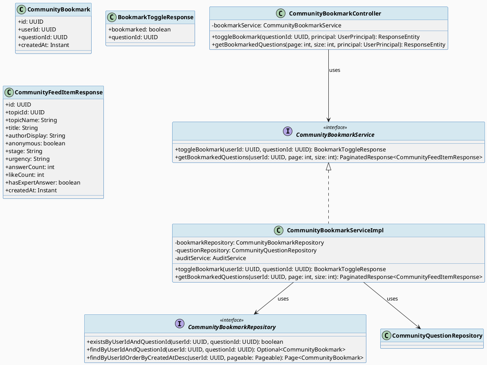
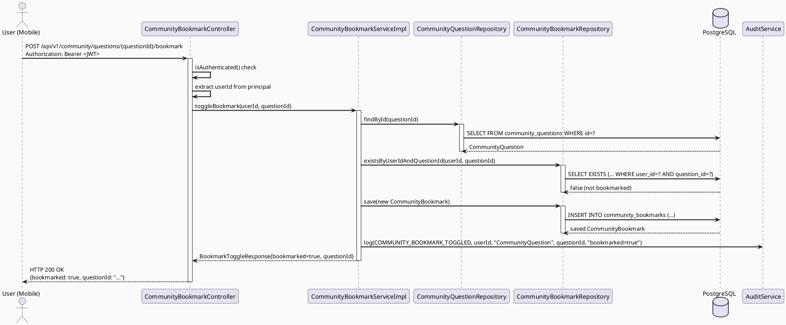
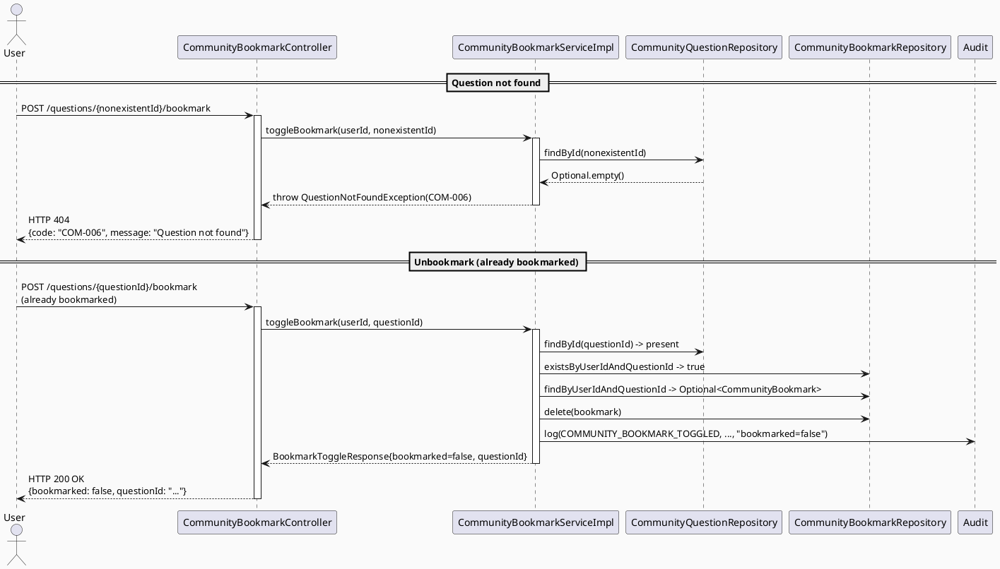

# ENGINEERING DOCUMENTATION STANDARD (EDS) v2.0
# Technical Design Specification — UC-58 Bookmark Community Post

| Field              | Value                            |
| ------------------ | -------------------------------- |
| **Document ID**    | `CB-COMMUNITY-IMP-007`           |
| **Version**        | `1.0`                            |
| **Date**           | `2026-06-29`                     |
| **Status**         | `Approved`                       |
| **Document Owner** | `HuyND`                          |
| **Author**         | `AI Agent`                       |
| **Reviewed by**    | `[Tech Lead]`                    |
| **DPO Sign-off**   | `[ ] Pending`                    |
| **Approved by**    | `[Principal Architect]`          |
| **Last Review**    | `2026-06-29`                     |
| **Based on EDS**   | `v2.0`                           |

---

## CHANGELOG

| Ngày       | Người thực hiện | Nội dung thay đổi                                          |
| ---------- | --------------- | ---------------------------------------------------------- |
| 2026-06-29 | AI Agent        | Tạo tài liệu lần đầu cho UC-58 Bookmark Community Post    |
| 2026-06-29 | AI Agent — Amelia (Dev Agent) | Implemented CommunityBookmark entity, Flyway migration V20260629000001, toggle/get bookmark endpoints, AuditAction.COMMUNITY_BOOKMARK_TOGGLED; 5 tests passing | Implemented |
| 2026-07-03 | AI Agent — Claude (Audit Pass) | Fixed hydration gap: feed/detail responses never carried the viewer's bookmark state, so the bookmark icon always rendered "not bookmarked" on load regardless of real DB state. Added `bookmarked`/`isBookmarked` to `CommunityFeedItemResponse`/`CommunityQuestionDetailResponse` (batch-checked via new `CommunityBookmarkRepository.findBookmarkedQuestionIds()`), threaded through `CommunityFeedServiceImpl`/`CommunityQuestionServiceImpl`, and updated the Flutter `CommunityFeedItem`/`QuestionDetail` models + `community_feed_screen.dart`/`question_detail_screen.dart` to read the real value instead of a local-only `Set`. All existing + new tests GREEN. |

---

## MUC LUC

1. [Tổng quan Module](#1-tổng-quan-module)
2. [Ma trận Truy vết (Traceability Matrix)](#2-ma-trận-truy-vết-traceability-matrix)
3. [Architecture Decision Records (ADR)](#3-architecture-decision-records-adr)
4. [Non-Functional Requirements & SLA](#4-non-functional-requirements--sla)
5. [Static Modeling (Mô hình Tĩnh)](#5-static-modeling-mô-hình-tĩnh)
6. [Dynamic Modeling (Mô hình Động)](#6-dynamic-modeling-mô-hình-động)
7. [Domain Event Catalog](#7-domain-event-catalog)
8. [Interface Specification (Đặc tả Giao diện)](#8-interface-specification-đặc-tả-giao-diện)
9. [API Specification](#9-api-specification)
10. [Bảng mã lỗi (Error Codes)](#10-bảng-mã-lỗi-error-codes)
11. [Quy trình Triển khai (Step-by-Step)](#11-quy-trình-triển-khai-step-by-step)
12. [Rollback & Incident Runbook](#12-rollback--incident-runbook)
13. [Kịch bản Kiểm thử Chi tiết](#13-kịch-bản-kiểm-thử-chi-tiết)
14. [Phương pháp Xác minh](#14-phương-pháp-xác-minh)
15. [Mẫu thử thực tế (API Verification Samples)](#15-mẫu-thử-thực-tế-api-verification-samples)
16. [Bảng tổng hợp phân quyền (Authorization Matrix)](#16-bảng-tổng-hợp-phân-quyền-authorization-matrix)
17. [AI Prompt Constraints (CASE 2.0)](#17-ai-prompt-constraints-case-20)

---

## 1. Tổng quan Module

| Field                     | Value                                                                                     |
| ------------------------- | ----------------------------------------------------------------------------------------- |
| **Module Name**           | `BookmarkCommunityPost`                                                                   |
| **Bounded Context**       | `community`                                                                               |
| **UC ID**                 | `UC-58`                                                                                   |
| **SRS Reference**         | `3.3.1.35`                                                                                |
| **Primary Actor**         | `User (any authenticated role)`                                                           |
| **Platform**              | `Mobile App (Flutter) + Web`                                                              |
| **Data Classification**   | `Internal`                                                                                |
| **Compliance Scope**      | `BR-RBAC`                                                                                 |
| **Upstream Dependencies** | `security (JWT), community.CommunityQuestion (must exist)`                                |
| **Downstream Consumers**  | `community (bookmark feed), audit (AuditLog)`                                             |

**Mô tả:** Cho phép bất kỳ người dùng đã đăng nhập lưu (bookmark) một câu hỏi cộng đồng để xem lại sau. Thao tác là toggle: gọi endpoint một lần để bookmark, gọi lại để bỏ bookmark. Endpoint riêng biệt trả về danh sách câu hỏi đã bookmark của người dùng hiện tại (chỉ trả về questions có status=APPROVED).

---

## 2. Ma trận Truy vết (Traceability Matrix)

| Requirement ID | Loại          | Mô tả yêu cầu                                                  | Thành phần Code                                                | Compliance Target | ADR liên quan |
| -------------- | ------------- | --------------------------------------------------------------- | -------------------------------------------------------------- | ----------------- | ------------- |
| UC-58          | Use Case      | User bookmark/unbookmark một câu hỏi cộng đồng                  | `CommunityBookmarkController.toggleBookmark()`                 | BR-RBAC           | ADR-COM-010   |
| BR-RBAC        | Business Rule | Chỉ authenticated user mới được bookmark                        | `@PreAuthorize("isAuthenticated()")`                           | RBAC              | ADR-COM-010   |
| BR-COM-010     | Business Rule | questionId phải tồn tại trong DB                                | `CommunityBookmarkServiceImpl.validateQuestion()`              | Data integrity    | ADR-COM-010   |
| BR-COM-011     | Business Rule | Toggle logic: thêm nếu chưa bookmark, xóa nếu đã bookmark       | `CommunityBookmarkServiceImpl.toggleBookmark()`                | —                 | ADR-COM-011   |
| BR-COM-012     | Business Rule | `getBookmarkedQuestions` chỉ trả về APPROVED questions          | `CommunityBookmarkServiceImpl.getBookmarkedQuestions()`        | Content safety    | ADR-COM-012   |
| BR-COM-013     | Business Rule | Audit log khi toggle bookmark                                   | `AuditService.log(AuditAction.COMMUNITY_BOOKMARK_TOGGLED, ...)` | Auditability      | —             |

---

## 3. Architecture Decision Records (ADR)

### ADR-COM-010 — Toggle bookmark thay vì separate add/remove endpoints

| Field        | Value                      |
| ------------ | -------------------------- |
| **Status**   | `Accepted`                 |
| **Deciders** | `HuyND — System Architect` |
| **Date**     | `2026-06-29`               |

#### Bối cảnh (Context)
Bookmark là thao tác user thực hiện từ UI (nút bookmark trên card). UI không cần biết trạng thái bookmark trước khi gọi API — toggle là UX pattern phổ biến cho loại thao tác này.

#### Các phương án đã xem xét (Options Considered)

| Phương án | Mô tả                           | Ưu điểm                    | Nhược điểm                              |
| --------- | ------------------------------- | -------------------------- | --------------------------------------- |
| A         | Toggle: POST /bookmark          | 1 endpoint, UI đơn giản    | Response phải nói rõ trạng thái mới     |
| B         | POST /bookmark + DELETE /bookmark | Semantic rõ ràng (REST)  | UI cần query trạng thái trước khi gọi   |

#### Quyết định (Decision)
Chọn **Phương án A** — toggle với response `{bookmarked: boolean, questionId: UUID}` để UI biết trạng thái kết quả ngay lập tức. Đơn giản hơn và phù hợp với mobile UX.

#### Hệ quả (Consequences)

**Tích cực:**
- Ít roundtrip hơn: UI không cần GET trạng thái trước khi POST.
- Response rõ ràng: `bookmarked: true/false` truyền đạt trạng thái mới.

**Tiêu cực / Trade-offs:**
- Không hoàn toàn idempotent theo nghĩa REST thuần túy — gọi 2 lần cho kết quả khác nhau. Chấp nhận được vì đây là feature toggle.

---

### ADR-COM-011 — Bookmark chỉ yêu cầu question tồn tại, không cần APPROVED

| Field        | Value                      |
| ------------ | -------------------------- |
| **Status**   | `Accepted`                 |
| **Deciders** | `HuyND — System Architect` |
| **Date**     | `2026-06-29`               |

#### Quyết định (Decision)
Khi toggle bookmark, chỉ cần question tồn tại (bất kỳ status). User có thể đã thấy question khi nó APPROVED rồi bookmark; sau đó moderator ẩn câu hỏi. Bookmark record vẫn hợp lệ. Tuy nhiên, `getBookmarkedQuestions` lọc và chỉ trả về APPROVED questions để đảm bảo nội dung hiển thị không vi phạm moderation.

---

### ADR-COM-012 — getBookmarkedQuestions chỉ trả về APPROVED questions

| Field        | Value                      |
| ------------ | -------------------------- |
| **Status**   | `Accepted`                 |
| **Deciders** | `HuyND — System Architect` |
| **Date**     | `2026-06-29`               |

#### Quyết định (Decision)
Mặc dù bookmark record vẫn tồn tại cho questions bị ẩn/khóa, danh sách bookmark feed chỉ hiển thị questions có status=APPROVED. Điều này ngăn người dùng xem nội dung đã bị moderator ẩn thông qua bookmark feed. Bookmark record không bị xóa — nếu question được duyệt lại, nó sẽ xuất hiện lại trong feed.

---

## 4. Non-Functional Requirements & SLA

### 4.1. Performance & Availability

| Category     | Requirement                   | Target SLA  | Measurement Method | Compliance Basis |
| ------------ | ----------------------------- | ----------- | ------------------ | ---------------- |
| Latency      | Toggle bookmark (p99)         | `< 200ms`   | k6 load test       | —                |
| Latency      | List bookmarks (p99)          | `< 300ms`   | k6 load test       | —                |
| Availability | Uptime (monthly)              | `99.9%`     | Uptime monitor     | —                |
| Throughput   | Concurrent bookmark toggles   | `300 req/s` | Load test          | —                |

### 4.2. Data Integrity & Retention

| Category    | Requirement                              | Target  | Verification Method         | Compliance Basis |
| ----------- | ---------------------------------------- | ------- | --------------------------- | ---------------- |
| Uniqueness  | 1 bookmark per (user, question)          | 100%    | UNIQUE constraint in DB     | —                |
| Consistency | Bookmark record ↔ toggle response sync  | 100%    | Integration test             | —                |

### 4.3. Security

| Category | Requirement              | Target              | Verification Method | Compliance Basis |
| -------- | ------------------------ | ------------------- | ------------------- | ---------------- |
| Auth     | JWT required             | 401 without token   | Security test       | BR-RBAC          |
| Isolation | User sees only own bookmarks | Enforced by userId from JWT | Service test | BR-RBAC |

---

## 5. Static Modeling (Mô hình Tĩnh)

### 5.1. Class Diagram (PlantUML)



### 5.2. New Entity — CommunityBookmark (Java)

```java
package com.carebridge.backend.community.entity;

import jakarta.persistence.*;
import lombok.*;
import org.hibernate.annotations.CreationTimestamp;

import java.time.Instant;
import java.util.UUID;

@Entity
@Table(name = "community_bookmarks",
    uniqueConstraints = @UniqueConstraint(
        name = "uq_bookmark",
        columnNames = {"user_id", "question_id"}
    ),
    indexes = {
        @Index(name = "idx_community_bookmarks_user",     columnList = "user_id"),
        @Index(name = "idx_community_bookmarks_question", columnList = "question_id")
    }
)
@Getter @Setter @NoArgsConstructor @AllArgsConstructor @Builder
public class CommunityBookmark {

    @Id
    @GeneratedValue(strategy = GenerationType.UUID)
    @Column(name = "id", updatable = false, nullable = false)
    private UUID id;

    @Column(name = "user_id", nullable = false)
    private UUID userId;

    @Column(name = "question_id", nullable = false)
    private UUID questionId;

    @CreationTimestamp
    @Column(name = "created_at", updatable = false, nullable = false)
    private Instant createdAt;
}
```

### 5.3. Flyway Migration

File: `src/main/resources/db/migration/V20260629000001__create_community_bookmarks.sql`

```sql
-- === COMMUNITY BOOKMARKS SCHEMA ===

CREATE TABLE community_bookmarks (
    id          UUID        PRIMARY KEY DEFAULT gen_random_uuid(),
    user_id     UUID        NOT NULL,
    question_id UUID        NOT NULL,
    created_at  TIMESTAMPTZ NOT NULL DEFAULT NOW(),
    CONSTRAINT fk_bookmark_user     FOREIGN KEY (user_id)     REFERENCES users(id)              ON DELETE CASCADE,
    CONSTRAINT fk_bookmark_question FOREIGN KEY (question_id) REFERENCES community_questions(id) ON DELETE CASCADE,
    CONSTRAINT uq_bookmark          UNIQUE (user_id, question_id)
);

CREATE INDEX idx_community_bookmarks_user     ON community_bookmarks(user_id);
CREATE INDEX idx_community_bookmarks_question ON community_bookmarks(question_id);
```

---

## 6. Dynamic Modeling (Mô hình Động)

### 6.1. Sequence Diagram — Toggle Bookmark (Happy Path)



### 6.2. Sequence Diagram — Error Paths



---

## 7. Domain Event Catalog

### 7.1. Events Published (Phát ra)

| Event Name                       | Trigger                            | Publisher                        | Subscriber(s)  | Payload Schema | Async? |
| -------------------------------- | ---------------------------------- | -------------------------------- | -------------- | -------------- | ------ |
| `COMMUNITY_BOOKMARK_TOGGLED`     | Toggle bookmark thành công         | `CommunityBookmarkServiceImpl`   | `AuditService` | AuditLog entry | No     |

### 7.2. Payload — Audit Log Entry

```
entityType: "CommunityQuestion"
entityId:   <questionId>
detail:     "bookmarked=true" OR "bookmarked=false"
userId:     <acting userId>
action:     AuditAction.COMMUNITY_BOOKMARK_TOGGLED
```

---

## 8. Interface Specification (Đặc tả Giao diện)

### 8.1. Service Interface

```java
package com.carebridge.backend.community.service;

import com.carebridge.backend.community.dto.response.BookmarkToggleResponse;
import com.carebridge.backend.community.dto.response.CommunityFeedItemResponse;
import com.carebridge.backend.common.dto.PaginatedResponse;
import java.util.UUID;

/**
 * @version 1.0
 */
public interface CommunityBookmarkService {

    /**
     * Toggles the bookmark state for a question.
     * Adds bookmark if not exists; removes if already exists.
     *
     * @param userId     UUID of the authenticated user (from JWT)
     * @param questionId UUID of the question to bookmark/unbookmark
     * @return BookmarkToggleResponse indicating the new state
     * @throws com.carebridge.backend.community.exception.QuestionNotFoundException (COM-006)
     *         when questionId does not exist in DB
     */
    BookmarkToggleResponse toggleBookmark(UUID userId, UUID questionId);

    /**
     * Returns a paginated list of questions bookmarked by the user.
     * Only returns questions with status=APPROVED.
     *
     * @param userId UUID of the authenticated user (from JWT)
     * @param page   zero-based page index
     * @param size   page size (default 20)
     * @return PaginatedResponse of CommunityFeedItemResponse
     */
    PaginatedResponse<CommunityFeedItemResponse> getBookmarkedQuestions(UUID userId, int page, int size);
}
```

### 8.2. Repository Interface

```java
package com.carebridge.backend.community.repository;

import com.carebridge.backend.community.entity.CommunityBookmark;
import org.springframework.data.domain.Page;
import org.springframework.data.domain.Pageable;
import org.springframework.data.jpa.repository.JpaRepository;

import java.util.Optional;
import java.util.UUID;

/**
 * @version 1.0
 */
public interface CommunityBookmarkRepository extends JpaRepository<CommunityBookmark, UUID> {

    boolean existsByUserIdAndQuestionId(UUID userId, UUID questionId);

    Optional<CommunityBookmark> findByUserIdAndQuestionId(UUID userId, UUID questionId);

    Page<CommunityBookmark> findByUserIdOrderByCreatedAtDesc(UUID userId, Pageable pageable);
}
```

### 8.3. Response DTOs

```java
package com.carebridge.backend.community.dto.response;

import lombok.AllArgsConstructor;
import lombok.Data;
import java.util.UUID;

@Data
@AllArgsConstructor
public class BookmarkToggleResponse {
    private boolean bookmarked;
    private UUID questionId;
}
```

---

## 9. API Specification

### 9.1. Endpoints Table

| Method | Path                                               | Auth Level | Required Roles    | Rate Limit | Idempotent? |
| ------ | -------------------------------------------------- | ---------- | ----------------- | ---------- | ----------- |
| `POST` | `/api/v1/community/questions/{questionId}/bookmark`| JWT Bearer | Any authenticated | 60/min     | No (toggle) |
| `GET`  | `/api/v1/community/me/bookmarks`                   | JWT Bearer | Any authenticated | 120/min    | Yes         |

**Controller base mapping:** `@RequestMapping("/api/v1/community")`

### 9.2. Request / Response Schemas

#### `POST /api/v1/community/questions/{questionId}/bookmark`

**Request Headers:**
```
Authorization: Bearer <JWT_TOKEN>
```

**Request Body:** _(none — questionId is path variable)_

**Response — 200 OK (Bookmarked):**
```json
{
  "success": true,
  "message": "Bookmark toggled successfully",
  "data": {
    "bookmarked": true,
    "questionId": "550e8400-e29b-41d4-a716-446655440000"
  }
}
```

**Response — 200 OK (Unbookmarked):**
```json
{
  "success": true,
  "message": "Bookmark toggled successfully",
  "data": {
    "bookmarked": false,
    "questionId": "550e8400-e29b-41d4-a716-446655440000"
  }
}
```

**Response — 404 Not Found (Question does not exist):**
```json
{
  "error": {
    "code": "COM-006",
    "message": "Question not found"
  }
}
```

#### `GET /api/v1/community/me/bookmarks`

**Query Parameters:**

| Param | Type    | Default | Description        |
| ----- | ------- | ------- | ------------------ |
| page  | integer | 0       | Zero-based page    |
| size  | integer | 20      | Items per page     |

**Response — 200 OK:**
```json
{
  "success": true,
  "data": {
    "content": [
      {
        "id": "550e8400-...",
        "topicId": "...",
        "topicName": "Nutrition",
        "title": "Is it safe to eat sushi during pregnancy?",
        "authorDisplay": "Anonymous",
        "anonymous": true,
        "stage": "SECOND_TRIMESTER",
        "urgency": "LOW",
        "answerCount": 3,
        "likeCount": 12,
        "hasExpertAnswer": true,
        "createdAt": "2026-06-20T08:00:00Z"
      }
    ],
    "page": 0,
    "size": 20,
    "totalElements": 1,
    "totalPages": 1
  }
}
```

---

## 10. Bảng mã lỗi (Error Codes)

| Code      | HTTP Status | Message (EN)          | Message (VI)                  | Trigger Condition                           |
| --------- | ----------- | --------------------- | ----------------------------- | ------------------------------------------- |
| `COM-006` | 404         | Question not found    | Câu hỏi không tồn tại         | questionId không tồn tại trong DB           |
| `COM-008` | 401         | Authentication required | Yêu cầu đăng nhập            | Không có JWT token (handled by Spring Security) |

---

## 11. Quy trình Triển khai (Step-by-Step)

### 11.1. Prerequisites

- [ ] ADR-COM-010, ADR-COM-011, ADR-COM-012 đã được Accepted
- [ ] community_questions table đã tồn tại (UC-54 deployed)
- [ ] users table đã tồn tại
- [ ] AuditAction.COMMUNITY_BOOKMARK_TOGGLED đã được thêm vào enum

### 11.2. Implementation Steps

#### Chặng 1 — Flyway Migration

Tạo file: `src/main/resources/db/migration/V20260629000001__create_community_bookmarks.sql`

Chạy migration:
```bash
./mvnw flyway:migrate
```

#### Chặng 2 — Entity + Repository

1. Tạo `CommunityBookmark.java` entity (xem §5.2)
2. Tạo `CommunityBookmarkRepository.java` (xem §8.2)

#### Chặng 3 — Service

1. Tạo `CommunityBookmarkService.java` interface (xem §8.1)
2. Tạo `CommunityBookmarkServiceImpl.java` — stub phase (throws UnsupportedOperationException)
3. Implement toggle logic:
   - `questionRepository.findById(questionId)` → throw `QuestionNotFoundException` nếu empty
   - `bookmarkRepository.existsByUserIdAndQuestionId(userId, questionId)`
   - If exists: `findByUserIdAndQuestionId()` → `delete()` → return `{bookmarked: false}`
   - If not: `save(new CommunityBookmark)` → return `{bookmarked: true}`
   - `auditService.log(AuditAction.COMMUNITY_BOOKMARK_TOGGLED, userId, "CommunityQuestion", questionId, "bookmarked="+result)`

#### Chặng 4 — Controller

1. Tạo `CommunityBookmarkController.java` tại `@RequestMapping("/api/v1/community")`
2. `@PostMapping("/questions/{questionId}/bookmark")` — `@PreAuthorize("isAuthenticated()")`
3. `@GetMapping("/me/bookmarks")` — `@PreAuthorize("isAuthenticated()")`

#### Chặng 5 — Verification

```bash
# Toggle bookmark
curl -X POST http://localhost:8080/api/v1/community/questions/[QUESTION_ID]/bookmark \
  -H "Authorization: Bearer [USER_JWT]"
# Expected: 200, bookmarked: true

# Gọi lại — unbookmark
curl -X POST http://localhost:8080/api/v1/community/questions/[QUESTION_ID]/bookmark \
  -H "Authorization: Bearer [USER_JWT]"
# Expected: 200, bookmarked: false
```

### 11.3. Deployment Checklist

- [ ] Migration `V20260629000001` chạy thành công
- [ ] `existsByUserIdAndQuestionId` trả về đúng
- [ ] Toggle từ false→true→false hoạt động đúng
- [ ] `getBookmarkedQuestions` chỉ trả APPROVED questions
- [ ] Audit log sinh ra event COMMUNITY_BOOKMARK_TOGGLED

---

## 12. Rollback & Incident Runbook

### 12.1. Điều kiện kích hoạt Rollback

| Điều kiện                          | Ngưỡng      | Người quyết định |
| ---------------------------------- | ----------- | ---------------- |
| Error rate > 5% trong 5 phút       | 5 phút      | On-call Engineer |
| User thấy bookmarks của người khác | Bất kỳ case | Tech Lead        |

### 12.2. Rollback Procedure

```bash
# Revert migration
psql -h $DB_HOST -U $DB_USER -d $DB_NAME \
  -c "DROP TABLE IF EXISTS community_bookmarks CASCADE;"
psql -h $DB_HOST -U $DB_USER -d $DB_NAME \
  -c "DELETE FROM flyway_schema_history WHERE version = '20260629000001';"

# Revert code
git checkout -- src/main/java/com/carebridge/backend/community/
git checkout -- src/main/resources/db/migration/V20260629000001__create_community_bookmarks.sql
```

---

## 13. Kịch bản Kiểm thử Chi tiết

### 13.1. Unit Tests

#### TC-UNIT-001 — User bookmarks un-bookmarked question → bookmarked=true

```gherkin
Feature: UC-58 Bookmark Community Post
  Background:
    Given test data classification: SYNTHETIC
    And questionRepository.findById(QUESTION_ID) returns CommunityQuestion

  Scenario: First-time bookmark
    Given bookmarkRepository.existsByUserIdAndQuestionId(userId, questionId) = false
    When CommunityBookmarkServiceImpl.toggleBookmark(userId, questionId) is called
    Then bookmarkRepository.save() is called once
    And response.bookmarked = true
    And auditService.log is called with COMMUNITY_BOOKMARK_TOGGLED
```

#### TC-UNIT-002 — User toggles again (was bookmarked) → bookmarked=false

```gherkin
  Scenario: Unbookmark already-bookmarked question
    Given bookmarkRepository.existsByUserIdAndQuestionId = true
    And bookmarkRepository.findByUserIdAndQuestionId returns existing bookmark
    When toggleBookmark(userId, questionId) is called
    Then bookmarkRepository.delete(existingBookmark) is called
    And response.bookmarked = false
```

#### TC-UNIT-003 — Bookmark non-existent question → QuestionNotFoundException (COM-006)

```gherkin
  Scenario: Question does not exist
    Given questionRepository.findById(unknownId) returns Optional.empty()
    When toggleBookmark(userId, unknownId) is called
    Then QuestionNotFoundException is thrown with code COM-006
    And bookmarkRepository.save() is NOT called
```

#### TC-UNIT-004 — getBookmarkedQuestions returns paginated APPROVED questions

```gherkin
  Scenario: User has 2 bookmarks on APPROVED questions
    Given bookmarkRepository returns Page with 2 CommunityBookmark records
    And both questions have status=APPROVED
    When getBookmarkedQuestions(userId, 0, 20) is called
    Then response contains 2 items
    And response is paginated
```

#### TC-UNIT-005 — getBookmarkedQuestions with no bookmarks → empty page

```gherkin
  Scenario: User has no bookmarks
    Given bookmarkRepository returns empty Page
    When getBookmarkedQuestions(userId, 0, 20) is called
    Then response.content is empty
    And totalElements = 0
```

### 13.2. Integration Tests

#### TC-INT-001 — Full toggle flow: bookmark → list → unbookmark → list

```gherkin
  Scenario: End-to-end bookmark lifecycle
    Given community_questions has APPROVED question with id=Q1
    And authenticated user JWT (userId=U1)
    When POST /api/v1/community/questions/Q1/bookmark
    Then response.bookmarked = true
    When GET /api/v1/community/me/bookmarks
    Then response.content contains Q1
    When POST /api/v1/community/questions/Q1/bookmark (again)
    Then response.bookmarked = false
    When GET /api/v1/community/me/bookmarks
    Then response.content does NOT contain Q1
```

### 13.3. Security Tests

#### TC-SEC-001 — Unauthenticated user → 401

```gherkin
  Scenario: No JWT token
    When POST /api/v1/community/questions/{id}/bookmark (no Authorization header)
    Then response status = 401
```

#### TC-SEC-002 — User cannot see another user's bookmarks

```gherkin
  Scenario: userId always taken from JWT principal, not from request
    Given user U1 JWT and user U2 has bookmarks
    When GET /api/v1/community/me/bookmarks with U1's JWT
    Then response only contains U1's bookmarks (not U2's)
```

---

## 14. Phương pháp Xác minh

### 14.1. Database Inspection

```sql
-- Verify bookmark created
SELECT id, user_id, question_id, created_at
FROM community_bookmarks
WHERE user_id = '[userId]' AND question_id = '[questionId]';

-- Verify UNIQUE constraint works (should fail on duplicate insert)
INSERT INTO community_bookmarks (user_id, question_id)
VALUES ('[userId]', '[questionId]');
-- Expected: ERROR:  duplicate key value violates unique constraint "uq_bookmark"

-- Verify bookmark deleted after unbookmark
SELECT COUNT(*) FROM community_bookmarks
WHERE user_id = '[userId]' AND question_id = '[questionId]';
-- Expected: 0
```

---

## 15. Mẫu thử thực tế (API Verification Samples)

### 15.1. Toggle Bookmark

```bash
# Bookmark
curl -X POST http://localhost:8080/api/v1/community/questions/[QUESTION_ID]/bookmark \
  -H "Authorization: Bearer [USER_JWT]"
# Expected: 200, {bookmarked: true, questionId: "..."}

# Unbookmark (call again)
curl -X POST http://localhost:8080/api/v1/community/questions/[QUESTION_ID]/bookmark \
  -H "Authorization: Bearer [USER_JWT]"
# Expected: 200, {bookmarked: false, questionId: "..."}
```

### 15.2. List Bookmarks

```bash
curl -X GET "http://localhost:8080/api/v1/community/me/bookmarks?page=0&size=20" \
  -H "Authorization: Bearer [USER_JWT]"
# Expected: 200, paginated list of CommunityFeedItemResponse
```

### 15.3. Error Paths

```bash
# Non-existent question → 404
curl -X POST http://localhost:8080/api/v1/community/questions/00000000-0000-0000-0000-000000000000/bookmark \
  -H "Authorization: Bearer [USER_JWT]"
# Expected: 404, {code: "COM-006"}

# No JWT → 401
curl -X POST http://localhost:8080/api/v1/community/questions/[ID]/bookmark
# Expected: 401
```

---

## 16. Bảng tổng hợp phân quyền (Authorization Matrix)

| Endpoint                                                | `UNAUTHENTICATED` | `MOTHER` | `EXPERT` | `PARTNER` | `MODERATOR` | `ADMIN` |
| ------------------------------------------------------- | ----------------- | -------- | -------- | --------- | ----------- | ------- |
| `POST /api/v1/community/questions/{id}/bookmark`        | ❌ (401)           | ✅        | ✅        | ✅         | ✅           | ✅       |
| `GET /api/v1/community/me/bookmarks`                    | ❌ (401)           | ✅ Own    | ✅ Own    | ✅ Own     | ✅ Own       | ✅ Own   |

**Chú thích:**
- ✅ = Được phép (bất kỳ authenticated role)
- ✅ Own = Chỉ xem bookmarks của chính mình (userId taken from JWT)
- ❌ = 401 Unauthorized

---

## 17. AI Prompt Constraints (CASE 2.0)

### 17.1 Constraint Summary Table

| #  | Constraint                                                                                               | Source            | Last Verified |
| -- | -------------------------------------------------------------------------------------------------------- | ----------------- | ------------- |
| C1 | userId PHẢI lấy từ JWT principal — KHÔNG nhận từ request body hoặc path variable                         | `ADR-COM-010`     | `2026-06-29`  |
| C2 | Toggle: nếu bookmark tồn tại → delete; nếu không → create. KHÔNG thể add 2 lần (DB UNIQUE constraint)   | `ADR-COM-011`     | `2026-06-29`  |
| C3 | `toggleBookmark` PHẢI validate questionId tồn tại trước khi thao tác — throw QuestionNotFoundException  | `BR-COM-010`      | `2026-06-29`  |
| C4 | `getBookmarkedQuestions` PHẢI chỉ trả về questions có status=APPROVED — KHÔNG trả về HIDDEN/LOCKED questions | `ADR-COM-012` | `2026-06-29`  |
| C5 | Audit log PHẢI được gọi sau mỗi toggle với detail chứa trạng thái mới ("bookmarked=true/false")          | `BR-COM-013`      | `2026-06-29`  |

### 17.2 Constraint Injection Block

```
[CONSTRAINT BLOCK — Module: BookmarkCommunityPost]
Theo TDS CB-COMMUNITY-IMP-007:

1. userId PHẢI lấy từ SecurityUtils.requireCurrentUserId(principal). Không đọc từ request.
2. Toggle logic: existsByUserIdAndQuestionId → if true: delete; if false: save new CommunityBookmark.
3. Trước khi toggle, PHẢI gọi questionRepository.findById(questionId). Nếu empty → QuestionNotFoundException(COM-006).
4. getBookmarkedQuestions: sau khi lấy bookmark page, map sang CommunityFeedItemResponse, chỉ include questions với status=APPROVED.
5. AuditService.log(AuditAction.COMMUNITY_BOOKMARK_TOGGLED, userId, "CommunityQuestion", questionId, "bookmarked="+result) sau mỗi toggle.

[CONTEXT BLOCK]
- Bounded Context: community
- Data Classification: Internal
- Existing interfaces: §8 Service + Repository Interface
- Error codes: §10 Error Codes Table
- Auth matrix: §16 Authorization Matrix
```

### 17.3 Constraint Quality Checklist

- [ ] Mỗi constraint traceable về ADR/BR
- [ ] Không có constraint generic
- [ ] Constraint block reference §8 Interface và §16 Auth Matrix
- [ ] C1 ngăn user xem bookmarks của người khác
- [ ] C3 ngăn bookmark ghost questions

### 17.4 Anti-Pattern Detection

| AP-ID     | Anti-Pattern          | Dấu hiệu                                                        | Hành động                  |
| --------- | --------------------- | --------------------------------------------------------------- | -------------------------- |
| AP-AI-001 | Unconstrained Gen     | userId lấy từ request param thay vì principal                   | Reject — inject C1         |
| AP-AI-002 | Green-from-Birth      | Test PASS với empty stub                                        | Reject — Red Gate §5.1     |
| AP-AI-003 | Implicit Decision     | Code assume duplicate bookmark throws exception thay vì toggle  | Reject — ADR-COM-011       |
| AP-AI-005 | Hallucinated Contract | Code gọi BookmarkCacheService không có trong §8                 | Reject                     |

---

## PHU LUC

### A. Glossary (Thuật ngữ)

| Thuật ngữ              | Định nghĩa                                                                        |
| ---------------------- | --------------------------------------------------------------------------------- |
| Bookmark               | Lưu một câu hỏi cộng đồng để xem lại sau — không ảnh hưởng đến nội dung câu hỏi |
| Toggle                 | Thao tác thêm nếu chưa có, xóa nếu đã có — một endpoint cho cả hai trường hợp   |
| APPROVED filter        | getBookmarkedQuestions chỉ trả câu hỏi đã được moderator duyệt                   |

### B. Tài liệu tham chiếu

| Document             | Path                                           |
| -------------------- | ---------------------------------------------- |
| EDS v2.0 Template    | `08_References/Template/PHASE-3_TDS.md`        |
| UC-54 TDS (Questions) | `04_Implement/UC54_CreateCommunityQuestion/`  |
| UC-56 TDS (Answers)  | `04_Implement/UC56_PostCommunityAnswer/`        |

---

*EDS v2.1 — Tích hợp CASE 2.0 AI Prompt Constraints (§17).*
