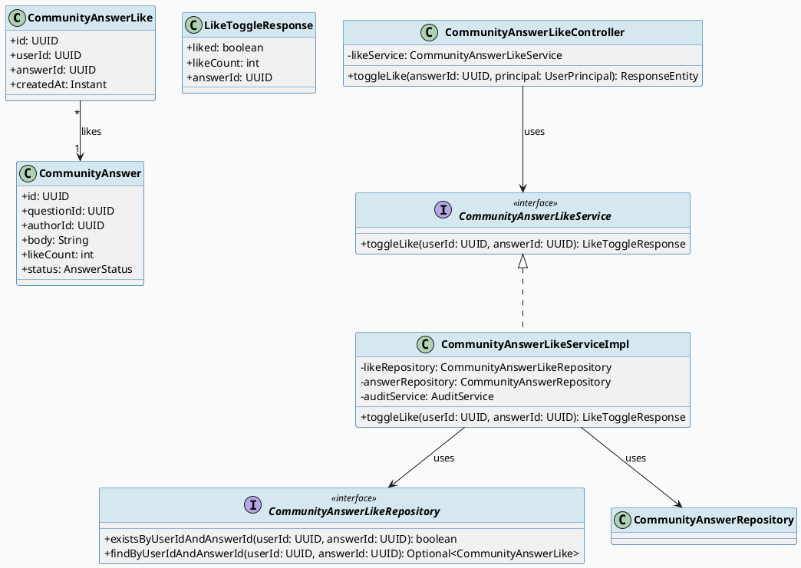
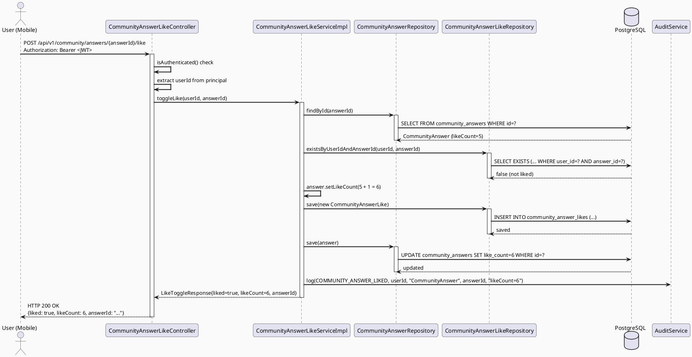
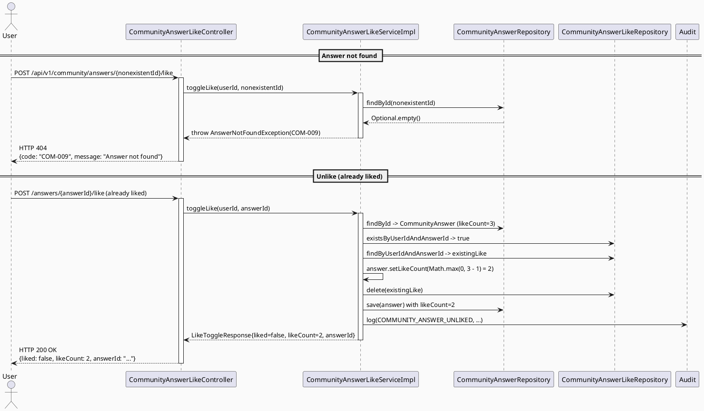

# ENGINEERING DOCUMENTATION STANDARD (EDS) v2.0
# Technical Design Specification — UC-59 Like Answer

| Field              | Value                            |
| ------------------ | -------------------------------- |
| **Document ID**    | `CB-COMMUNITY-IMP-008`           |
| **Version**        | `1.0`                            |
| **Date**           | `2026-06-29`                     |
| **Status**         | `Approved`                       |
| **Document Owner** | `HuyND`                          |
| **Author**         | `AI Agent`                       |
| **Reviewed by**    | `[Tech Lead]`                    |
| **DPO Sign-off**   | `[ ] Pending`                    |
| **Approved by**    | `[Principal Architect]`          |
| **Last Review**    | `2026-06-29`                     |
| **Based on EDS**   | `v2.0`                           |

---

## CHANGELOG

| Ngày       | Người thực hiện | Nội dung thay đổi                                |
| ---------- | --------------- | ------------------------------------------------ |
| 2026-06-29 | AI Agent        | Tạo tài liệu lần đầu cho UC-59 Like Answer      |
| 2026-06-29 | AI Agent — Amelia (Dev Agent) | Implemented CommunityAnswerLike entity, Flyway migration V20260629000002, toggle like endpoint, AnswerNotFoundException (COM-011), Math.max(0, count-1) floor, AuditAction.COMMUNITY_ANSWER_LIKED/UNLIKED; 5 tests passing | Implemented |
| 2026-07-03 | AI Agent — Claude (Audit Pass) | Fixed hydration gap: `CommunityAnswerResponse` never exposed `likeCount`/`liked` (even though the entity already had `likeCount`), so every answer showed "0, not liked" on load regardless of real state. Added both fields, batch-hydrated via new `CommunityAnswerLikeRepository.findLikedAnswerIds()` inside `CommunityQuestionServiceImpl.getQuestionDetail()`, and updated the Flutter `CommunityAnswer` model + `question_detail_screen.dart` to seed `_likedAnswers`/`_answerLikeCounts` from the loaded detail instead of only tracking in-session toggles. All existing + new tests GREEN. |

---

## MUC LUC

1. [Tổng quan Module](#1-tổng-quan-module)
2. [Ma trận Truy vết (Traceability Matrix)](#2-ma-trận-truy-vết-traceability-matrix)
3. [Architecture Decision Records (ADR)](#3-architecture-decision-records-adr)
4. [Non-Functional Requirements & SLA](#4-non-functional-requirements--sla)
5. [Static Modeling (Mô hình Tĩnh)](#5-static-modeling-mô-hình-tĩnh)
6. [Dynamic Modeling (Mô hình Động)](#6-dynamic-modeling-mô-hình-động)
7. [Domain Event Catalog](#7-domain-event-catalog)
8. [Interface Specification (Đặc tả Giao diện)](#8-interface-specification-đặc-tả-giao-diện)
9. [API Specification](#9-api-specification)
10. [Bảng mã lỗi (Error Codes)](#10-bảng-mã-lỗi-error-codes)
11. [Quy trình Triển khai (Step-by-Step)](#11-quy-trình-triển-khai-step-by-step)
12. [Rollback & Incident Runbook](#12-rollback--incident-runbook)
13. [Kịch bản Kiểm thử Chi tiết](#13-kịch-bản-kiểm-thử-chi-tiết)
14. [Phương pháp Xác minh](#14-phương-pháp-xác-minh)
15. [Mẫu thử thực tế (API Verification Samples)](#15-mẫu-thử-thực-tế-api-verification-samples)
16. [Bảng tổng hợp phân quyền (Authorization Matrix)](#16-bảng-tổng-hợp-phân-quyền-authorization-matrix)
17. [AI Prompt Constraints (CASE 2.0)](#17-ai-prompt-constraints-case-20)

---

## 1. Tổng quan Module

| Field                     | Value                                                                              |
| ------------------------- | ---------------------------------------------------------------------------------- |
| **Module Name**           | `LikeAnswer`                                                                       |
| **Bounded Context**       | `community`                                                                        |
| **UC ID**                 | `UC-59`                                                                            |
| **SRS Reference**         | `3.3.1.36`                                                                         |
| **Primary Actor**         | `User (any authenticated role)`                                                    |
| **Platform**              | `Mobile App (Flutter) + Web`                                                       |
| **Data Classification**   | `Internal`                                                                         |
| **Compliance Scope**      | `BR-RBAC`                                                                          |
| **Upstream Dependencies** | `security (JWT), community.CommunityAnswer (must exist)`                           |
| **Downstream Consumers**  | `community (answer feed), audit (AuditLog)`                                        |

**Mô tả:** Cho phép bất kỳ người dùng đã đăng nhập thích (like) một câu trả lời cộng đồng. Thao tác là idempotent toggle: gọi một lần để like, gọi lại để unlike. Để đảm bảo tính nhất quán và hiệu năng, `like_count` trên `community_answers` được cập nhật atomically cùng với thao tác insert/delete trên bảng `community_answer_likes`. Không có giới hạn tự-like: tác giả có thể like câu trả lời của chính mình ở MVP.

---

## 2. Ma trận Truy vết (Traceability Matrix)

| Requirement ID | Loại          | Mô tả yêu cầu                                                      | Thành phần Code                                                          | Compliance Target | ADR liên quan |
| -------------- | ------------- | ------------------------------------------------------------------- | ------------------------------------------------------------------------ | ----------------- | ------------- |
| UC-59          | Use Case      | User like/unlike câu trả lời cộng đồng                              | `CommunityAnswerLikeController.toggleLike()`                             | BR-RBAC           | ADR-COM-013   |
| BR-RBAC        | Business Rule | Chỉ authenticated user mới được like                                | `@PreAuthorize("isAuthenticated()")`                                     | RBAC              | ADR-COM-013   |
| BR-COM-014     | Business Rule | answerId phải tồn tại trong DB                                      | `CommunityAnswerLikeServiceImpl.validateAnswer()`                        | Data integrity    | ADR-COM-013   |
| BR-COM-015     | Business Rule | Toggle: nếu đã like → remove + decrement; nếu chưa → add + increment | `CommunityAnswerLikeServiceImpl.toggleLike()`                          | —                 | ADR-COM-014   |
| BR-COM-016     | Business Rule | like_count không được âm (defensive guard)                          | `CommunityAnswerLikeServiceImpl` — check likeCount > 0 before decrement  | Data integrity    | ADR-COM-014   |
| BR-COM-017     | Business Rule | like_count PHẢI được update atomic cùng với like record             | `@Transactional` trên `toggleLike`                                       | Consistency       | ADR-COM-015   |
| BR-COM-018     | Business Rule | Audit log khi toggle like/unlike                                    | `AuditService.log(AuditAction.COMMUNITY_ANSWER_LIKED/UNLIKED, ...)`      | Auditability      | —             |

---

## 3. Architecture Decision Records (ADR)

### ADR-COM-013 — Toggle like thay vì separate like/unlike endpoints

| Field        | Value                      |
| ------------ | -------------------------- |
| **Status**   | `Accepted`                 |
| **Deciders** | `HuyND — System Architect` |
| **Date**     | `2026-06-29`               |

#### Bối cảnh (Context)
Tương tự bookmark, like là thao tác toggle từ UI (nút heart/thumb). Toggle endpoint đơn giản hóa client code và tránh race condition từ double-tap.

#### Quyết định (Decision)
Chọn `POST /api/v1/community/answers/{answerId}/like` là toggle endpoint. Response trả về `{liked: boolean, likeCount: int, answerId: UUID}` để client cập nhật UI ngay.

---

### ADR-COM-014 — Denormalized like_count counter trên community_answers

| Field        | Value                      |
| ------------ | -------------------------- |
| **Status**   | `Accepted`                 |
| **Deciders** | `HuyND — System Architect` |
| **Date**     | `2026-06-29`               |

#### Bối cảnh (Context)
Mỗi lần render answer feed cần hiển thị `like_count`. Nếu COUNT(*) từ `community_answer_likes` mỗi lần → N+1 query problem và latency tăng với số lượng answers lớn.

#### Các phương án đã xem xét (Options Considered)

| Phương án | Mô tả                                      | Ưu điểm                  | Nhược điểm                           |
| --------- | ------------------------------------------ | ------------------------ | ------------------------------------ |
| A         | Denormalized counter trên `community_answers` | Fast read, O(1)        | Counter có thể drift nếu không sync  |
| B         | COUNT(*) on demand from `community_answer_likes` | Always accurate     | Slow at scale, N+1 on feed           |

#### Quyết định (Decision)
Chọn **Phương án A** — denormalized `like_count` column đã tồn tại trên `community_answers`. Cập nhật atomically trong `@Transactional` cùng với insert/delete trên `community_answer_likes`.

#### Hệ quả (Consequences)

**Tích cực:**
- Feed render fast — `like_count` có sẵn trực tiếp trên answer entity.
- Single roundtrip per like toggle.

**Tiêu cực / Trade-offs:**
- Counter có thể drift nếu `@Transactional` không bảo vệ đúng. Giảm thiểu bằng cách đảm bảo mọi insert/delete `community_answer_likes` đều nằm trong cùng transaction với `answerRepository.save()`.
- `like_count` có thể âm nếu có bug — defensive guard: `Math.max(0, likeCount - 1)` khi decrement.

---

### ADR-COM-015 — @Transactional bắt buộc cho toggleLike

| Field        | Value                      |
| ------------ | -------------------------- |
| **Status**   | `Accepted`                 |
| **Deciders** | `HuyND — System Architect` |
| **Date**     | `2026-06-29`               |

#### Quyết định (Decision)
`CommunityAnswerLikeServiceImpl.toggleLike()` PHẢI được annotate `@Transactional`. Điều này đảm bảo: nếu `answerRepository.save()` thất bại, `likeRepository.save()/delete()` cũng rollback và ngược lại. Không được phép có trạng thái partial update.

---

## 4. Non-Functional Requirements & SLA

### 4.1. Performance & Availability

| Category     | Requirement                   | Target SLA  | Measurement Method | Compliance Basis |
| ------------ | ----------------------------- | ----------- | ------------------ | ---------------- |
| Latency      | Toggle like (p99)             | `< 200ms`   | k6 load test       | —                |
| Availability | Uptime (monthly)              | `99.9%`     | Uptime monitor     | —                |
| Throughput   | Concurrent like toggles       | `500 req/s` | Load test          | —                |

### 4.2. Data Integrity & Retention

| Category      | Requirement                                        | Target  | Verification Method        | Compliance Basis |
| ------------- | -------------------------------------------------- | ------- | -------------------------- | ---------------- |
| Uniqueness    | 1 like record per (user, answer)                   | 100%    | UNIQUE constraint in DB    | —                |
| Consistency   | like_count on answer == count(*) from likes table  | 100%    | @Transactional + unit test | ADR-COM-015      |
| Non-negative  | like_count >= 0 always                             | 100%    | Defensive guard + test     | BR-COM-016       |

### 4.3. Security

| Category | Requirement          | Target            | Verification Method | Compliance Basis |
| -------- | -------------------- | ----------------- | ------------------- | ---------------- |
| Auth     | JWT required         | 401 without token | Security test       | BR-RBAC          |

---

## 5. Static Modeling (Mô hình Tĩnh)

### 5.1. Class Diagram (PlantUML)



### 5.2. New Entity — CommunityAnswerLike (Java)

```java
package com.carebridge.backend.community.entity;

import jakarta.persistence.*;
import lombok.*;
import org.hibernate.annotations.CreationTimestamp;

import java.time.Instant;
import java.util.UUID;

@Entity
@Table(name = "community_answer_likes",
    uniqueConstraints = @UniqueConstraint(
        name = "uq_answer_like",
        columnNames = {"user_id", "answer_id"}
    ),
    indexes = {
        @Index(name = "idx_community_answer_likes_answer", columnList = "answer_id"),
        @Index(name = "idx_community_answer_likes_user",   columnList = "user_id")
    }
)
@Getter @Setter @NoArgsConstructor @AllArgsConstructor @Builder
public class CommunityAnswerLike {

    @Id
    @GeneratedValue(strategy = GenerationType.UUID)
    @Column(name = "id", updatable = false, nullable = false)
    private UUID id;

    @Column(name = "user_id", nullable = false)
    private UUID userId;

    @Column(name = "answer_id", nullable = false)
    private UUID answerId;

    @CreationTimestamp
    @Column(name = "created_at", updatable = false, nullable = false)
    private Instant createdAt;
}
```

### 5.3. Flyway Migration

File: `src/main/resources/db/migration/V20260629000002__create_community_answer_likes.sql`

```sql
-- === COMMUNITY ANSWER LIKES SCHEMA ===

CREATE TABLE community_answer_likes (
    id         UUID        PRIMARY KEY DEFAULT gen_random_uuid(),
    user_id    UUID        NOT NULL,
    answer_id  UUID        NOT NULL,
    created_at TIMESTAMPTZ NOT NULL DEFAULT NOW(),
    CONSTRAINT fk_like_user   FOREIGN KEY (user_id)   REFERENCES users(id)            ON DELETE CASCADE,
    CONSTRAINT fk_like_answer FOREIGN KEY (answer_id) REFERENCES community_answers(id) ON DELETE CASCADE,
    CONSTRAINT uq_answer_like UNIQUE (user_id, answer_id)
);

CREATE INDEX idx_community_answer_likes_answer ON community_answer_likes(answer_id);
CREATE INDEX idx_community_answer_likes_user   ON community_answer_likes(user_id);
```

---

## 6. Dynamic Modeling (Mô hình Động)

### 6.1. Sequence Diagram — Like Answer (Happy Path)



### 6.2. Sequence Diagram — Error Paths



---

## 7. Domain Event Catalog

### 7.1. Events Published (Phát ra)

| Event Name                   | Trigger                       | Publisher                          | Subscriber(s)  | Payload Schema | Async? |
| ---------------------------- | ----------------------------- | ---------------------------------- | -------------- | -------------- | ------ |
| `COMMUNITY_ANSWER_LIKED`     | Like added successfully       | `CommunityAnswerLikeServiceImpl`   | `AuditService` | AuditLog entry | No     |
| `COMMUNITY_ANSWER_UNLIKED`   | Like removed successfully     | `CommunityAnswerLikeServiceImpl`   | `AuditService` | AuditLog entry | No     |

### 7.2. Payload — Audit Log Entry

```
entityType: "CommunityAnswer"
entityId:   <answerId>
detail:     "likeCount=<newCount>" (include whether liked or unliked)
userId:     <acting userId>
action:     AuditAction.COMMUNITY_ANSWER_LIKED  OR  AuditAction.COMMUNITY_ANSWER_UNLIKED
```

---

## 8. Interface Specification (Đặc tả Giao diện)

### 8.1. Service Interface

```java
package com.carebridge.backend.community.service;

import com.carebridge.backend.community.dto.response.LikeToggleResponse;
import java.util.UUID;

/**
 * @version 1.0
 */
public interface CommunityAnswerLikeService {

    /**
     * Toggles the like state for a community answer.
     * Adds like and increments like_count if not yet liked.
     * Removes like and decrements like_count if already liked.
     * Both the like record and answer.likeCount are updated atomically (@Transactional).
     *
     * @param userId   UUID of the authenticated user (from JWT)
     * @param answerId UUID of the target answer
     * @return LikeToggleResponse with the new like state and updated likeCount
     * @throws com.carebridge.backend.community.exception.AnswerNotFoundException (COM-009)
     *         when answerId does not exist in DB
     */
    LikeToggleResponse toggleLike(UUID userId, UUID answerId);
}
```

### 8.2. Repository Interface

```java
package com.carebridge.backend.community.repository;

import com.carebridge.backend.community.entity.CommunityAnswerLike;
import org.springframework.data.jpa.repository.JpaRepository;

import java.util.Optional;
import java.util.UUID;

/**
 * @version 1.0
 */
public interface CommunityAnswerLikeRepository extends JpaRepository<CommunityAnswerLike, UUID> {

    boolean existsByUserIdAndAnswerId(UUID userId, UUID answerId);

    Optional<CommunityAnswerLike> findByUserIdAndAnswerId(UUID userId, UUID answerId);
}
```

### 8.3. Response DTO + Exception

```java
package com.carebridge.backend.community.dto.response;

import lombok.AllArgsConstructor;
import lombok.Data;
import java.util.UUID;

@Data
@AllArgsConstructor
public class LikeToggleResponse {
    private boolean liked;
    private int likeCount;
    private UUID answerId;
}
```

```java
package com.carebridge.backend.community.exception;

import com.carebridge.backend.common.exception.BaseException;
import org.springframework.http.HttpStatus;

public class AnswerNotFoundException extends BaseException {
    public AnswerNotFoundException() {
        super("COM-009", "Answer not found", HttpStatus.NOT_FOUND);
    }
}
```

---

## 9. API Specification

### 9.1. Endpoints Table

| Method | Path                                          | Auth Level | Required Roles    | Rate Limit  | Idempotent? |
| ------ | --------------------------------------------- | ---------- | ----------------- | ----------- | ----------- |
| `POST` | `/api/v1/community/answers/{answerId}/like`   | JWT Bearer | Any authenticated | 120/min     | No (toggle) |

**Controller base mapping:** `@RequestMapping("/api/v1/community/answers")`

### 9.2. Request / Response Schemas

#### `POST /api/v1/community/answers/{answerId}/like`

**Request Headers:**
```
Authorization: Bearer <JWT_TOKEN>
```

**Request Body:** _(none — answerId is path variable)_

**Response — 200 OK (Liked):**
```json
{
  "success": true,
  "message": "Like toggled successfully",
  "data": {
    "liked": true,
    "likeCount": 6,
    "answerId": "660e8400-e29b-41d4-a716-446655440001"
  }
}
```

**Response — 200 OK (Unliked):**
```json
{
  "success": true,
  "message": "Like toggled successfully",
  "data": {
    "liked": false,
    "likeCount": 5,
    "answerId": "660e8400-e29b-41d4-a716-446655440001"
  }
}
```

**Response — 404 Not Found:**
```json
{
  "error": {
    "code": "COM-009",
    "message": "Answer not found"
  }
}
```

---

## 10. Bảng mã lỗi (Error Codes)

| Code      | HTTP Status | Message (EN)            | Message (VI)                  | Trigger Condition                            |
| --------- | ----------- | ----------------------- | ----------------------------- | -------------------------------------------- |
| `COM-009` | 404         | Answer not found        | Câu trả lời không tồn tại     | answerId không tồn tại trong DB              |
| `COM-008` | 401         | Authentication required | Yêu cầu đăng nhập             | Không có JWT token (handled by Spring Security) |

---

## 11. Quy trình Triển khai (Step-by-Step)

### 11.1. Prerequisites

- [ ] ADR-COM-013, ADR-COM-014, ADR-COM-015 đã được Accepted
- [ ] `community_answers` table đã tồn tại (UC-56 deployed)
- [ ] `AuditAction.COMMUNITY_ANSWER_LIKED` và `COMMUNITY_ANSWER_UNLIKED` đã được thêm vào enum

### 11.2. Implementation Steps

#### Chặng 1 — Flyway Migration

Tạo file: `src/main/resources/db/migration/V20260629000002__create_community_answer_likes.sql`

```bash
./mvnw flyway:migrate
```

#### Chặng 2 — Entity + Repository

1. Tạo `CommunityAnswerLike.java` entity (xem §5.2)
2. Tạo `CommunityAnswerLikeRepository.java` (xem §8.2)

#### Chặng 3 — Exception

Tạo `AnswerNotFoundException.java` (xem §8.3)

#### Chặng 4 — Service

1. Tạo `CommunityAnswerLikeService.java` interface (xem §8.1)
2. Tạo `CommunityAnswerLikeServiceImpl.java` — stub phase (throws `UnsupportedOperationException`)
3. Implement `@Transactional toggleLike()`:
   - `answerRepository.findById(answerId)` → throw `AnswerNotFoundException` nếu empty
   - `likeRepository.existsByUserIdAndAnswerId(userId, answerId)` → boolean check
   - If liked: `findByUserIdAndAnswerId()` → `delete(like)` → `answer.setLikeCount(Math.max(0, count-1))` → `answerRepository.save(answer)` → `auditService.log(COMMUNITY_ANSWER_UNLIKED, ...)` → return `{liked: false, likeCount, answerId}`
   - If not liked: `likeRepository.save(new CommunityAnswerLike(...))` → `answer.setLikeCount(count+1)` → `answerRepository.save(answer)` → `auditService.log(COMMUNITY_ANSWER_LIKED, ...)` → return `{liked: true, likeCount, answerId}`

#### Chặng 5 — Controller

1. Tạo `CommunityAnswerLikeController.java` at `@RequestMapping("/api/v1/community/answers")`
2. `@PostMapping("/{answerId}/like")` — `@PreAuthorize("isAuthenticated()")`

#### Chặng 6 — Verification

```bash
# Like answer
curl -X POST http://localhost:8080/api/v1/community/answers/[ANSWER_ID]/like \
  -H "Authorization: Bearer [USER_JWT]"
# Expected: 200, liked: true, likeCount: N+1

# Unlike (call again)
curl -X POST http://localhost:8080/api/v1/community/answers/[ANSWER_ID]/like \
  -H "Authorization: Bearer [USER_JWT]"
# Expected: 200, liked: false, likeCount: N
```

### 11.3. Deployment Checklist

- [ ] Migration `V20260629000002` chạy thành công
- [ ] `@Transactional` đúng trên `toggleLike()`
- [ ] `like_count` không âm sau unlock (Math.max guard)
- [ ] Response trả về `likeCount` chính xác sau toggle
- [ ] Audit log sinh ra COMMUNITY_ANSWER_LIKED / COMMUNITY_ANSWER_UNLIKED

---

## 12. Rollback & Incident Runbook

### 12.1. Điều kiện kích hoạt Rollback

| Điều kiện                               | Ngưỡng      | Người quyết định |
| --------------------------------------- | ----------- | ---------------- |
| like_count drift (counter > actual)     | Bất kỳ case | Tech Lead        |
| Error rate > 5% trong 5 phút            | 5 phút      | On-call Engineer |
| @Transactional failure → partial state  | Bất kỳ case | Tech Lead        |

### 12.2. Rollback Procedure

```bash
# Revert migration
psql -h $DB_HOST -U $DB_USER -d $DB_NAME \
  -c "DROP TABLE IF EXISTS community_answer_likes CASCADE;"
psql -h $DB_HOST -U $DB_USER -d $DB_NAME \
  -c "DELETE FROM flyway_schema_history WHERE version = '20260629000002';"

# Revert code
git checkout -- src/main/java/com/carebridge/backend/community/entity/CommunityAnswerLike.java
git checkout -- src/main/java/com/carebridge/backend/community/repository/CommunityAnswerLikeRepository.java
git checkout -- src/main/java/com/carebridge/backend/community/service/CommunityAnswerLikeService.java
git checkout -- src/main/java/com/carebridge/backend/community/service/CommunityAnswerLikeServiceImpl.java
git checkout -- src/main/java/com/carebridge/backend/community/controller/CommunityAnswerLikeController.java
git checkout -- src/main/resources/db/migration/V20260629000002__create_community_answer_likes.sql
```

---

## 13. Kịch bản Kiểm thử Chi tiết

### 13.1. Unit Tests

#### TC-UNIT-001 — User likes answer (not yet liked) → liked=true, likeCount incremented

```gherkin
Feature: UC-59 Like Answer
  Background:
    Given test data classification: SYNTHETIC
    And answerRepository.findById(ANSWER_ID) returns CommunityAnswer with likeCount=5

  Scenario: First-time like
    Given likeRepository.existsByUserIdAndAnswerId(userId, answerId) = false
    When CommunityAnswerLikeServiceImpl.toggleLike(userId, answerId) is called
    Then likeRepository.save(newLike) is called once
    And answerRepository.save(answer with likeCount=6) is called once
    And response.liked = true
    And response.likeCount = 6
    And auditService.log called with COMMUNITY_ANSWER_LIKED
```

#### TC-UNIT-002 — User unlikes (already liked) → liked=false, likeCount decremented

```gherkin
  Scenario: Unlike already-liked answer
    Given likeRepository.existsByUserIdAndAnswerId = true
    And likeRepository.findByUserIdAndAnswerId returns existing like
    And answer.likeCount = 3
    When toggleLike(userId, answerId) is called
    Then likeRepository.delete(existingLike) is called
    And answerRepository.save(answer with likeCount=2) is called
    And response.liked = false
    And response.likeCount = 2
    And auditService.log called with COMMUNITY_ANSWER_UNLIKED
```

#### TC-UNIT-003 — Like non-existent answer → AnswerNotFoundException (COM-009)

```gherkin
  Scenario: Answer does not exist
    Given answerRepository.findById(UNKNOWN_ID) returns Optional.empty()
    When toggleLike(userId, UNKNOWN_ID) is called
    Then AnswerNotFoundException is thrown with code COM-009
    And likeRepository.save() is NOT called
    And answerRepository.save() is NOT called
```

#### TC-UNIT-004 — like_count cannot go below 0 (defensive guard)

```gherkin
  Scenario: Unlike answer with likeCount=0 (defensive)
    Given answer.likeCount = 0
    And likeRepository.existsByUserIdAndAnswerId = true
    When toggleLike(userId, answerId) is called (unlike)
    Then answerRepository.save called with likeCount = Math.max(0, 0-1) = 0
    And response.likeCount = 0 (not -1)
```

### 13.2. Integration Tests

#### TC-INT-001 — Full lifecycle: like → verify DB count=1 → unlike → verify DB count=0

```gherkin
  Scenario: End-to-end like lifecycle
    Given community_answers has APPROVED answer A1 with likeCount=0
    And authenticated user JWT (userId=U1)
    When POST /api/v1/community/answers/A1/like
    Then response.liked = true AND response.likeCount = 1
    And community_answer_likes has 1 row (user_id=U1, answer_id=A1)
    And community_answers.like_count = 1 WHERE id=A1
    When POST /api/v1/community/answers/A1/like (again — unlike)
    Then response.liked = false AND response.likeCount = 0
    And community_answer_likes has 0 rows for (U1, A1)
    And community_answers.like_count = 0 WHERE id=A1
```

### 13.3. Security Tests

#### TC-SEC-001 — Unauthenticated user → 401

```gherkin
  Scenario: No JWT token
    When POST /api/v1/community/answers/{id}/like (no Authorization header)
    Then response status = 401
    And likeService.toggleLike() NOT called
```

---

## 14. Phương pháp Xác minh

### 14.1. Database Inspection

```sql
-- Verify like_count matches actual row count
SELECT a.id, a.like_count, COUNT(l.id) AS actual_count
FROM community_answers a
LEFT JOIN community_answer_likes l ON l.answer_id = a.id
WHERE a.id = '[answerId]'
GROUP BY a.id, a.like_count;
-- Expected: like_count == actual_count

-- Verify UNIQUE constraint
INSERT INTO community_answer_likes (user_id, answer_id)
VALUES ('[userId]', '[answerId]');
-- Expected: ERROR: duplicate key value violates unique constraint "uq_answer_like"

-- Verify like_count never negative
SELECT id, like_count FROM community_answers WHERE like_count < 0;
-- Expected: 0 rows
```

---

## 15. Mẫu thử thực tế (API Verification Samples)

### 15.1. Toggle Like

```bash
# Like
curl -X POST http://localhost:8080/api/v1/community/answers/[ANSWER_ID]/like \
  -H "Authorization: Bearer [USER_JWT]"
# Expected: 200, {liked: true, likeCount: N+1}

# Unlike (call again)
curl -X POST http://localhost:8080/api/v1/community/answers/[ANSWER_ID]/like \
  -H "Authorization: Bearer [USER_JWT]"
# Expected: 200, {liked: false, likeCount: N}
```

### 15.2. Error Paths

```bash
# Non-existent answer → 404
curl -X POST http://localhost:8080/api/v1/community/answers/00000000-0000-0000-0000-000000000000/like \
  -H "Authorization: Bearer [USER_JWT]"
# Expected: 404, {code: "COM-009"}

# No JWT → 401
curl -X POST http://localhost:8080/api/v1/community/answers/[ID]/like
# Expected: 401
```

---

## 16. Bảng tổng hợp phân quyền (Authorization Matrix)

| Endpoint                                             | `UNAUTHENTICATED` | `MOTHER` | `EXPERT` | `PARTNER` | `MODERATOR` | `ADMIN` |
| ---------------------------------------------------- | ----------------- | -------- | -------- | --------- | ----------- | ------- |
| `POST /api/v1/community/answers/{answerId}/like`     | ❌ (401)           | ✅        | ✅        | ✅         | ✅           | ✅       |

**Chú thích:**
- ✅ = Được phép (bất kỳ authenticated role, kể cả tác giả của answer)
- ❌ = 401 Unauthorized
- Không có self-like restriction ở MVP

---

## 17. AI Prompt Constraints (CASE 2.0)

### 17.1 Constraint Summary Table

| #  | Constraint                                                                                                          | Source            | Last Verified |
| -- | ------------------------------------------------------------------------------------------------------------------- | ----------------- | ------------- |
| C1 | userId PHẢI lấy từ JWT principal — KHÔNG nhận từ request body                                                       | `ADR-COM-013`     | `2026-06-29`  |
| C2 | `@Transactional` PHẢI annotate `toggleLike()` — like record và answer.likeCount PHẢI update trong cùng transaction | `ADR-COM-015`     | `2026-06-29`  |
| C3 | `toggleLike` PHẢI validate answerId tồn tại trước khi thao tác — throw `AnswerNotFoundException(COM-009)`           | `BR-COM-014`      | `2026-06-29`  |
| C4 | Decrement PHẢI dùng `Math.max(0, likeCount - 1)` — không để likeCount âm                                            | `BR-COM-016`      | `2026-06-29`  |
| C5 | Audit PHẢI phân biệt COMMUNITY_ANSWER_LIKED vs COMMUNITY_ANSWER_UNLIKED — 2 actions riêng biệt                     | `BR-COM-018`      | `2026-06-29`  |

### 17.2 Constraint Injection Block

```
[CONSTRAINT BLOCK — Module: LikeAnswer]
Theo TDS CB-COMMUNITY-IMP-008:

1. userId từ SecurityUtils.requireCurrentUserId(principal). Không từ request body.
2. toggleLike() PHẢI @Transactional — likeRepository.save()/delete() và answerRepository.save() trong cùng transaction.
3. Trước khi toggle, PHẢI answerRepository.findById(answerId). Nếu empty → AnswerNotFoundException(COM-009).
4. Khi unlike: answer.setLikeCount(Math.max(0, answer.getLikeCount() - 1)). Không dùng answer.getLikeCount() - 1 trực tiếp.
5. Audit: COMMUNITY_ANSWER_LIKED khi like; COMMUNITY_ANSWER_UNLIKED khi unlike.

[CONTEXT BLOCK]
- Bounded Context: community
- Data Classification: Internal
- Existing interfaces: §8 Service + Repository Interface
- Error codes: §10 Error Codes Table
- Auth matrix: §16 Authorization Matrix
```

### 17.3 Constraint Quality Checklist

- [ ] Mỗi constraint traceable về ADR/BR
- [ ] Không có constraint generic
- [ ] C2 ngăn partial update (like record without counter update)
- [ ] C4 ngăn negative likeCount
- [ ] Constraint block reference §8 và §16

### 17.4 Anti-Pattern Detection

| AP-ID     | Anti-Pattern          | Dấu hiệu                                                             | Hành động                  |
| --------- | --------------------- | -------------------------------------------------------------------- | -------------------------- |
| AP-AI-001 | Unconstrained Gen     | toggleLike không có @Transactional                                   | Reject — inject C2         |
| AP-AI-002 | Green-from-Birth      | Test PASS với empty stub (§5.1)                                      | Reject — Red Gate §5.1     |
| AP-AI-003 | Implicit Decision     | Code throws 409 Conflict on double-like instead of toggle            | Reject — ADR-COM-014       |
| AP-AI-004 | Layer Violation       | Controller increments likeCount directly                             | Reject — move to Service   |
| AP-AI-005 | Hallucinated Contract | Code calls `LikeEventPublisher` not defined in §8                   | Reject                     |

---

## PHU LUC

### A. Glossary (Thuật ngữ)

| Thuật ngữ         | Định nghĩa                                                                           |
| ----------------- | ------------------------------------------------------------------------------------ |
| like_count        | Denormalized counter trên community_answers — số lượt like hiện tại của câu trả lời |
| Toggle            | Thêm nếu chưa có, xóa nếu đã có — một endpoint cho cả hai trường hợp                |
| Atomic update     | like record và like_count được cập nhật trong cùng @Transactional — không có partial state |
| Defensive guard   | Math.max(0, count-1) đảm bảo likeCount >= 0 ngay cả khi có race condition edge case |

### B. Tài liệu tham chiếu

| Document              | Path                                               |
| --------------------- | -------------------------------------------------- |
| EDS v2.0 Template     | `08_References/Template/PHASE-3_TDS.md`            |
| UC-56 TDS (Answers)   | `04_Implement/UC56_PostCommunityAnswer/`            |
| UC-58 TDS (Bookmarks) | `04_Implement/UC58_BookmarkCommunityPost/`          |

---

*EDS v2.1 — Tích hợp CASE 2.0 AI Prompt Constraints (§17).*
