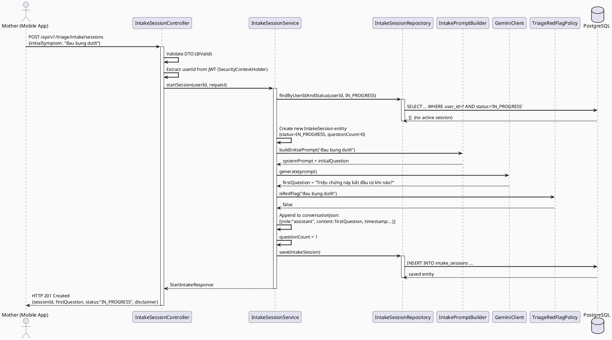
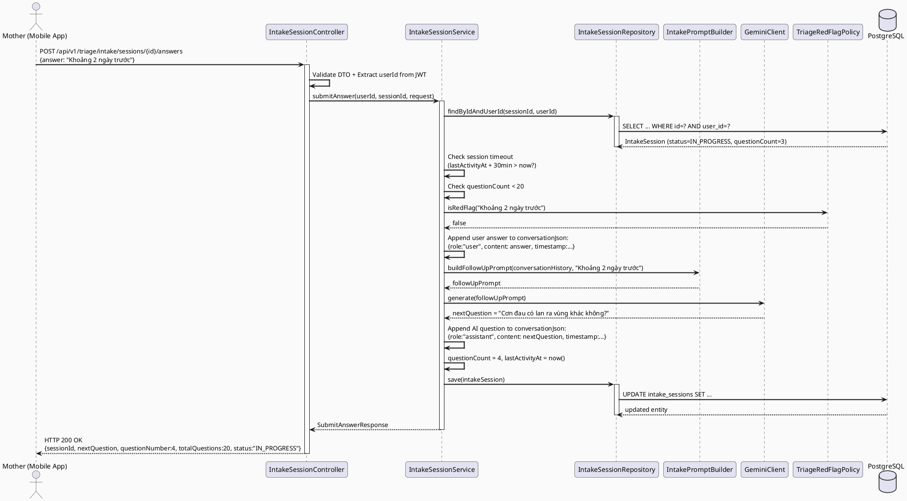
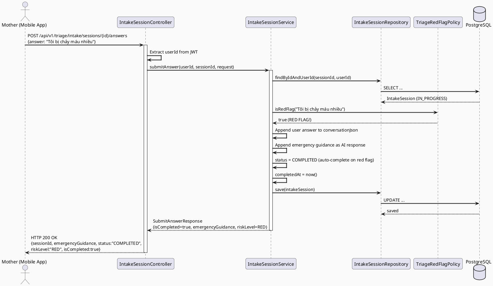
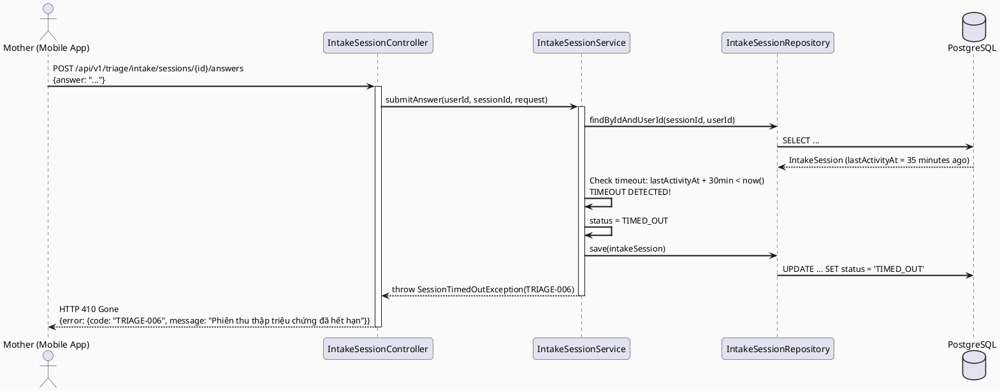
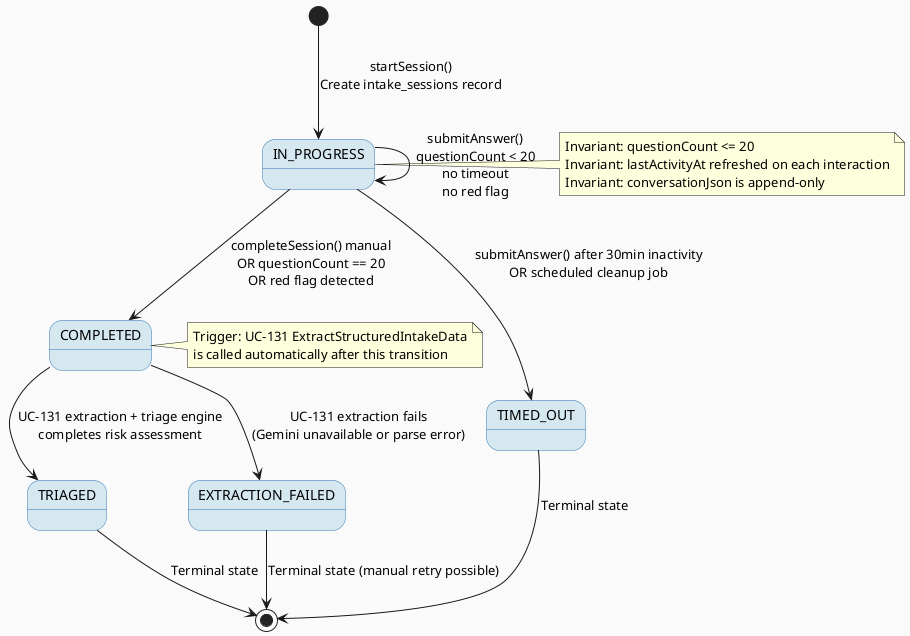

# ENGINEERING DOCUMENTATION STANDARD (EDS) v2.0
# Technical Design Specification — UC-60: Run AI Symptom Intake

| Field              | Value                                          |
| ------------------ | ---------------------------------------------- |
| **Document ID**    | `CB-TRIAGE-IMP-001`                            |
| **Version**        | `1.0`                                          |
| **Date**           | `2026-06-26`                                   |
| **Status**         | `Draft`                                        |
| **Document Owner** | `PhuongNT`                                     |
| **Author**         | `AI Agent`                                     |
| **Reviewed by**    | `[ ] Pending`                                  |
| **DPO Sign-off**   | `[ ] Pending — bắt buộc (module Sensitive-PII)` |
| **Approved by**    | `[ ] Pending`                                  |
| **Last Review**    | `2026-06-26`                                   |
| **Based on EDS**   | `v2.0`                                         |

---

## CHANGELOG

> **Policy 4.4 — Immutable History:** Không bao giờ xóa thông tin cũ. Mọi thay đổi phải ghi vào bảng này.

| Ngày       | Người thực hiện | Nội dung thay đổi                                      |
| ---------- | --------------- | ------------------------------------------------------- |
| 2026-06-26 | AI Agent        | Tạo tài liệu lần đầu — TDS cho UC-60 Run AI Symptom Intake |

---

## MỤC LỤC

1. [Tổng quan Module](#1-tổng-quan-module)
2. [Ma trận Truy vết](#2-ma-trận-truy-vết-traceability-matrix)
3. [Architecture Decision Records (ADR)](#3-architecture-decision-records-adr)
4. [Non-Functional Requirements & SLA](#4-non-functional-requirements--sla)
5. [Static Modeling](#5-static-modeling-mô-hình-tĩnh)
6. [Dynamic Modeling](#6-dynamic-modeling-mô-hình-động)
7. [Domain Event Catalog](#7-domain-event-catalog)
8. [Interface Specification](#8-interface-specification-đặc-tả-giao-diện)
9. [API Specification](#9-api-specification)
10. [Bảng mã lỗi](#10-bảng-mã-lỗi-error-codes)
11. [Quy trình Triển khai](#11-quy-trình-triển-khai-step-by-step)
12. [Rollback & Incident Runbook](#12-rollback--incident-runbook)
13. [Kịch bản Kiểm thử Chi tiết](#13-kịch-bản-kiểm-thử-chi-tiết)
14. [Phương pháp Xác minh](#14-phương-pháp-xác-minh)
15. [API Verification Samples](#15-mẫu-thử-thực-tế-api-verification-samples)
16. [Authorization Matrix](#16-bảng-tổng-hợp-phân-quyền-authorization-matrix)
17. [AI Prompt Constraints (CASE 2.0)](#17-ai-prompt-constraints-case-20)

---

## 1. Tổng quan Module

| Field                     | Value                                                                                                       |
| ------------------------- | ----------------------------------------------------------------------------------------------------------- |
| **UC ID**                 | `UC-60`                                                                                                     |
| **Module Name**           | `Run AI Symptom Intake`                                                                                     |
| **Bounded Context**       | `triage`                                                                                                    |
| **Primary Actor**         | `Mother (authenticated user with ROLE_MOTHER)`                                                              |
| **Secondary Actor**       | `Gemini AI Service`                                                                                         |
| **Platform**              | `Backend REST API — called by Mobile App`                                                                   |
| **Priority**              | `High`                                                                                                      |
| **Data Classification**   | `Sensitive-PII (health symptoms)`                                                                           |
| **Compliance Scope**      | `BR-RBAC, BR-PRIVACY, BR-SAFETY`                                                                           |
| **Upstream Dependencies** | `security (JWT auth)`, `integration.gemini (GeminiClient)`, `identity (User entity)`                        |
| **Downstream Consumers**  | `UC-131 (ExtractStructuredIntakeData)`, `UC-61 (ViewRiskTriageResult)`, `triage_assessments (triage engine)` |

**Mô tả:**
UC-60 cho phep nguoi me thuc hien quy trinh thu thap trieu chung qua AI. He thong:
1. Tao phien intake moi (intake_sessions record)
2. AI dat cau hoi tung buoc (step-by-step conversation)
3. Nguoi me tra loi, AI phan tich va dat cau hoi tiep theo
4. Raw conversation duoc luu duoi dang JSON
5. Sau khi hoan thanh, session chuyen trang thai COMPLETED va trigger UC-131

**Quan trong:**
- AI chi cung cap huong dan — TUYET DOI KHONG chan doan hoac ke don (BR-SAFETY)
- Moi phien toi da 20 cau hoi
- Timeout sau 30 phut khong hoat dong
- accountId lay tu JWT token, khong bao gio tu request body

---

## 2. Ma trận Truy vết (Traceability Matrix)

| Requirement ID | Loại          | Mô tả yêu cầu                                                  | Thành phần Code                               | Compliance Target    | ADR liên quan |
| -------------- | ------------- | --------------------------------------------------------------- | ---------------------------------------------- | -------------------- | ------------- |
| UC-60          | Use Case      | Thu thap trieu chung qua AI conversation                        | `IntakeSessionController.startSession()`       | —                    | ADR-001       |
| SRS-3.3.1.37   | Functional    | AI Symptom Intake conversation flow                             | `IntakeSessionService`                         | —                    | ADR-001       |
| BR-SAFETY-001  | Business Rule | AI chi huong dan — khong chan doan, khong ke don                 | `IntakePromptBuilder.buildPrompt()`            | Healthcare safety    | ADR-002       |
| BR-SAFETY-002  | Business Rule | Red-flag keywords kich hoat emergency routing                   | `TriageRedFlagPolicy.isRedFlag()`              | Healthcare safety    | ADR-002       |
| BR-RBAC-001    | Business Rule | Chi MOTHER moi duoc tao intake session                          | `@PreAuthorize("hasRole('MOTHER')")`           | BR-RBAC              | ADR-003       |
| BR-PRIVACY-001 | Business Rule | accountId lay tu JWT, khong tu request body                     | `SecurityContextHolder`                        | BR-PRIVACY           | ADR-003       |
| BR-TRIAGE-001  | Business Rule | Toi da 20 cau hoi moi phien                                    | `IntakeSessionService.submitAnswer()`          | —                    | ADR-004       |
| BR-TRIAGE-002  | Business Rule | Timeout 30 phut khong hoat dong                                 | `IntakeSessionService.checkTimeout()`          | —                    | ADR-004       |
| BR-TRIAGE-003  | Business Rule | Session states: IN_PROGRESS → COMPLETED → TRIAGED               | `IntakeSessionStatus` enum                     | —                    | ADR-001       |
| BR-TRIAGE-004  | Business Rule | Raw conversation luu dang JSON                                  | `IntakeSession.conversationJson`               | —                    | ADR-001       |

---

## 3. Architecture Decision Records (ADR)

### ADR-001 — Conversational Intake via Gemini AI

| Field          | Value                         |
| -------------- | ----------------------------- |
| **Status**     | `Proposed`                    |
| **Deciders**   | `PhuongNT — Tech Lead`        |
| **Date**       | `2026-06-26`                  |
| **Supersedes** | —                             |

#### Bối cảnh (Context)
Cần thu thập triệu chứng từ người mẹ một cách tự nhiên thay vì form cứng. AI conversation cho phép hỏi follow-up questions dựa trên câu trả lời trước đó, giúp thu thập thông tin chính xác hơn. Cần lưu trữ toàn bộ conversation để truy vết và extract structured data sau (UC-131).

#### Các phương án đã xem xét (Options Considered)

| Phương án | Mô tả                                        | Ưu điểm                            | Nhược điểm                                       |
| --------- | --------------------------------------------- | ----------------------------------- | ------------------------------------------------- |
| A         | Static questionnaire (fixed questions)         | + Đơn giản, deterministic           | - Không linh hoạt, thiếu follow-up                |
| B         | AI conversational intake via Gemini            | + Tự nhiên, follow-up thông minh    | - Phụ thuộc Gemini API, cần safety constraints    |
| C         | Hybrid: fixed core + AI follow-up             | + Đảm bảo coverage + linh hoạt      | - Phức tạp implementation                         |

#### Quyết định (Decision)
Chọn **Phương án B** — AI conversational intake via Gemini. Lý do: trải nghiệm người dùng tốt nhất, khả năng thu thập thông tin chi tiết nhất. Safety constraints được enforce qua prompt engineering và TriageRedFlagPolicy.

#### Hệ quả (Consequences)

**Tích cực:**
- Thu thập triệu chứng tự nhiên, chi tiết hơn static form
- AI có thể hỏi follow-up dựa trên context

**Tiêu cực / Trade-offs:**
- Phụ thuộc Gemini API availability — giảm thiểu bằng timeout handling và fallback message
- Cần strict prompt constraints để tránh AI đưa ra chẩn đoán

**Compliance Impact:**
- Conversation chứa health symptoms (Sensitive-PII) — cần encryption at rest
- Audit trail bắt buộc cho mỗi phiên intake

### ADR-002 — Safety-First AI Prompt Design

| Field          | Value                         |
| -------------- | ----------------------------- |
| **Status**     | `Proposed`                    |
| **Deciders**   | `PhuongNT — Tech Lead`        |
| **Date**       | `2026-06-26`                  |

#### Bối cảnh (Context)
AI system trong healthcare PHẢI tuân thủ nguyên tắc an toàn: không chẩn đoán, không kê đơn, không trì hoãn emergency routing. Gemini prompt cần constraint block rõ ràng.

#### Quyết định (Decision)
Mọi Gemini prompt trong intake flow PHẢI bao gồm constraint block: "Bạn là trợ lý thu thập triệu chứng. KHÔNG được chẩn đoán, kê đơn, hoặc đề xuất thuốc. Nếu phát hiện triệu chứng nguy hiểm, hướng dẫn gọi 115 ngay."

#### Hệ quả (Consequences)

**Tích cực:**
- Đảm bảo an toàn cho người dùng
- Tuân thủ BR-SAFETY

**Tiêu cực / Trade-offs:**
- AI response có thể ít chi tiết hơn — chấp nhận được vì an toàn là ưu tiên số 1

### ADR-003 — JWT-Only Identity Resolution

| Field          | Value                         |
| -------------- | ----------------------------- |
| **Status**     | `Proposed`                    |
| **Deciders**   | `PhuongNT — Tech Lead`        |
| **Date**       | `2026-06-26`                  |

#### Bối cảnh (Context)
Cần xác định chính xác người dùng tạo intake session. Có 2 lựa chọn: lấy userId từ request body hoặc từ JWT token.

#### Quyết định (Decision)
accountId LUÔN lấy từ JWT token qua SecurityContextHolder. Không bao giờ chấp nhận userId từ request body — tránh IDOR vulnerability.

#### Hệ quả (Consequences)

**Tích cực:**
- Ngăn IDOR attacks
- Đảm bảo data ownership

**Compliance Impact:**
- Phù hợp BR-PRIVACY, BR-RBAC

### ADR-004 — Session Limits and Timeout

| Field          | Value                         |
| -------------- | ----------------------------- |
| **Status**     | `Proposed`                    |
| **Deciders**   | `PhuongNT — Tech Lead`        |
| **Date**       | `2026-06-26`                  |

#### Bối cảnh (Context)
Cần giới hạn phiên intake để tránh lạm dụng API và đảm bảo trải nghiệm tốt. Quá nhiều câu hỏi gây mệt mỏi, quá ít thì thiếu thông tin.

#### Quyết định (Decision)
Tối đa 20 câu hỏi mỗi phiên. Timeout sau 30 phút không hoạt động — session tự động chuyển TIMED_OUT.

#### Hệ quả (Consequences)

**Tích cực:**
- Giới hạn chi phí Gemini API calls
- Trải nghiệm người dùng hợp lý

**Tiêu cực / Trade-offs:**
- Một số trường hợp phức tạp có thể cần > 20 câu hỏi — chấp nhận vì có thể tạo phiên mới

---

## 4. Non-Functional Requirements & SLA

### 4.1. Performance & Availability

| Category     | Requirement              | Target SLA | Measurement Method | Compliance Basis |
| ------------ | ------------------------ | ---------- | ------------------- | ---------------- |
| Latency      | Start session (p99)      | `< 500ms`  | k6 load test       | —                |
| Latency      | Submit answer + AI (p99) | `< 3000ms` | k6 load test       | —                |
| Availability | Uptime (monthly)         | `99.5%`    | Uptime monitor     | —                |
| Throughput   | Concurrent sessions      | `100 /s`   | Load test          | —                |

### 4.2. Data Integrity & Retention

| Category    | Requirement               | Target      | Verification Method | Compliance Basis |
| ----------- | ------------------------- | ----------- | ------------------- | ---------------- |
| Durability  | Zero intake session loss  | RPO = 0     | Transaction log     | BR-PRIVACY       |
| Retention   | Intake data retention     | 3 nam       | DB backup policy    | BR-PRIVACY       |
| Consistency | Session ↔ Conversation    | 100%        | Reconciliation      | —                |

### 4.3. Security

| Category             | Requirement    | Target          | Verification Method | Compliance Basis |
| -------------------- | -------------- | --------------- | ------------------- | ---------------- |
| Encryption at rest   | Conversation   | AES-256         | DB encryption check | BR-PRIVACY       |
| Encryption in transit | All endpoints | TLS 1.3+        | SSL Labs scan       | BR-PRIVACY       |
| Access control       | Role-based     | Least privilege | Auth Matrix (§16)   | BR-RBAC          |
| Identity             | JWT-only       | No IDOR         | Penetration test    | BR-PRIVACY       |

### 4.4. Scalability & Capacity Planning

Dự kiến tải 12 tháng tới: 10,000 mothers, ~500 intake sessions/day. Conversation JSON trung bình 5KB/session. Giải pháp scale: horizontal scaling via stateless service design, conversation stored in PostgreSQL JSONB column.

---

## 5. Static Modeling (Mô hình Tĩnh)

### 5.1. Class Diagram (PlantUML)

```plantuml
@startuml UC60_ClassDiagram
skinparam classAttributeIconSize 0
skinparam classFontStyle bold
skinparam backgroundColor #FAFAFA
skinparam ArrowColor #555555
skinparam ClassBorderColor #2E75B6
skinparam ClassHeaderBackgroundColor #D5E8F0

' === ENUMS ===
enum IntakeSessionStatus {
  IN_PROGRESS
  COMPLETED
  TIMED_OUT
  EXTRACTION_FAILED
  TRIAGED
}

' === ENTITIES ===
class IntakeSession {
  + id: UUID
  + userId: UUID
  + status: IntakeSessionStatus
  + conversationJson: String (JSONB)
  + questionCount: Integer
  + startedAt: OffsetDateTime
  + lastActivityAt: OffsetDateTime
  + completedAt: OffsetDateTime
  + createdAt: OffsetDateTime
  + updatedAt: OffsetDateTime
}

' === DTOs ===
class StartIntakeRequest {
  + initialSymptom: String (optional, max 500 chars)
}

class StartIntakeResponse {
  + sessionId: UUID
  + firstQuestion: String
  + status: String
  + disclaimer: String
}

class SubmitAnswerRequest {
  + answer: String (required, max 1000 chars)
}

class SubmitAnswerResponse {
  + sessionId: UUID
  + nextQuestion: String (null if completed)
  + questionNumber: Integer
  + totalQuestions: Integer (max 20)
  + status: String
  + isCompleted: Boolean
  + disclaimer: String
}

class CompleteIntakeResponse {
  + sessionId: UUID
  + status: String
  + message: String
}

' === SERVICES ===
interface IIntakeSessionService <<interface>> {
  + startSession(userId: UUID, request: StartIntakeRequest): StartIntakeResponse
  + submitAnswer(userId: UUID, sessionId: UUID, request: SubmitAnswerRequest): SubmitAnswerResponse
  + completeSession(userId: UUID, sessionId: UUID): CompleteIntakeResponse
  + getSessionStatus(userId: UUID, sessionId: UUID): IntakeSessionStatusResponse
}

class IntakeSessionService implements IIntakeSessionService {
  - intakeSessionRepository: IntakeSessionRepository
  - geminiClient: GeminiClient
  - intakePromptBuilder: IntakePromptBuilder
  - triageRedFlagPolicy: TriageRedFlagPolicy
  + startSession(userId: UUID, request: StartIntakeRequest): StartIntakeResponse
  + submitAnswer(userId: UUID, sessionId: UUID, request: SubmitAnswerRequest): SubmitAnswerResponse
  + completeSession(userId: UUID, sessionId: UUID): CompleteIntakeResponse
  + getSessionStatus(userId: UUID, sessionId: UUID): IntakeSessionStatusResponse
}

class IntakePromptBuilder {
  + buildInitialPrompt(initialSymptom: String): String
  + buildFollowUpPrompt(conversationHistory: String, latestAnswer: String): String
  + buildCompletionCheckPrompt(conversationHistory: String): String
}

' === REPOSITORIES ===
interface IntakeSessionRepository <<interface>> {
  + findById(id: UUID): Optional<IntakeSession>
  + findByIdAndUserId(id: UUID, userId: UUID): Optional<IntakeSession>
  + findByUserIdAndStatus(userId: UUID, status: IntakeSessionStatus): List<IntakeSession>
  + save(session: IntakeSession): IntakeSession
}

' === MAPPER ===
class IntakeSessionMapper {
  + toStartResponse(session: IntakeSession, firstQuestion: String): StartIntakeResponse
  + toSubmitResponse(session: IntakeSession, nextQuestion: String): SubmitAnswerResponse
  + toCompleteResponse(session: IntakeSession): CompleteIntakeResponse
}

' === CONTROLLER ===
class IntakeSessionController {
  - intakeSessionService: IIntakeSessionService
  + startSession(request: StartIntakeRequest): ResponseEntity<StartIntakeResponse>
  + submitAnswer(sessionId: UUID, request: SubmitAnswerRequest): ResponseEntity<SubmitAnswerResponse>
  + completeSession(sessionId: UUID): ResponseEntity<CompleteIntakeResponse>
  + getSessionStatus(sessionId: UUID): ResponseEntity<IntakeSessionStatusResponse>
}

' === RELATIONSHIPS ===
IntakeSessionController --> IIntakeSessionService : uses
IntakeSessionService --> IntakeSessionRepository : uses
IntakeSessionService --> IntakePromptBuilder : uses
IntakeSessionService --> TriageRedFlagPolicy : uses
IntakeSessionService ..> GeminiClient : uses
IntakeSession --> IntakeSessionStatus : has
IntakeSessionMapper ..> StartIntakeResponse : creates
IntakeSessionMapper ..> SubmitAnswerResponse : creates

@enduml
```



### 5.2. Data Structure (Flyway SQL Migration)

Tạo file: `src/main/resources/db/migration/V35__create_intake_sessions.sql`

```sql
-- === INTAKE SESSIONS SCHEMA ===
-- UC-60: Run AI Symptom Intake
-- Stores AI-driven symptom intake conversation sessions

CREATE TYPE intake_session_status AS ENUM (
    'IN_PROGRESS',
    'COMPLETED',
    'TIMED_OUT',
    'EXTRACTION_FAILED',
    'TRIAGED'
);

CREATE TABLE public.intake_sessions (
    id               UUID                    PRIMARY KEY DEFAULT gen_random_uuid(),
    user_id          UUID                    NOT NULL,          -- FK to users.user_id (Mother)
    status           intake_session_status   NOT NULL DEFAULT 'IN_PROGRESS',
    conversation_json JSONB                  NOT NULL DEFAULT '[]'::jsonb,  -- Array of {role, content, timestamp}
    question_count   INTEGER                 NOT NULL DEFAULT 0,
    started_at       TIMESTAMPTZ             NOT NULL DEFAULT NOW(),
    last_activity_at TIMESTAMPTZ             NOT NULL DEFAULT NOW(),
    completed_at     TIMESTAMPTZ,            -- Set when status transitions to COMPLETED
    created_at       TIMESTAMPTZ             NOT NULL DEFAULT NOW(),
    updated_at       TIMESTAMPTZ             NOT NULL DEFAULT NOW(),

    CONSTRAINT fk_intake_session_user FOREIGN KEY (user_id) REFERENCES public.users(user_id),
    CONSTRAINT chk_question_count CHECK (question_count >= 0 AND question_count <= 20)
);

-- Indexes for common queries
CREATE INDEX idx_intake_sessions_user_id ON public.intake_sessions(user_id);
CREATE INDEX idx_intake_sessions_status ON public.intake_sessions(status);
CREATE INDEX idx_intake_sessions_user_status ON public.intake_sessions(user_id, status);
CREATE INDEX idx_intake_sessions_last_activity ON public.intake_sessions(last_activity_at);

COMMENT ON TABLE public.intake_sessions IS 'AI-driven symptom intake conversation sessions (UC-60)';
COMMENT ON COLUMN public.intake_sessions.conversation_json IS 'JSONB array of {role: "system"|"user"|"assistant", content: string, timestamp: ISO8601}';
COMMENT ON COLUMN public.intake_sessions.question_count IS 'Number of AI questions asked in this session (max 20)';
```

---

## 6. Dynamic Modeling (Mô hình Động)

### 6.1. Sequence Diagram — Happy Path: Start Session



### 6.2. Sequence Diagram — Happy Path: Submit Answer



### 6.3. Sequence Diagram — Error Path: Red Flag Detected



### 6.4. Sequence Diagram — Error Path: Session Timeout



### 6.5. State Machine



---

## 7. Domain Event Catalog

### 7.1. Events Published (Phát ra)

| Event Name                | Trigger                             | Publisher              | Subscriber(s)                | Payload Schema                | Async? |
| ------------------------- | ----------------------------------- | ---------------------- | ---------------------------- | ----------------------------- | ------ |
| `IntakeSessionStarted`    | New intake session created          | `IntakeSessionService` | `AuditService`               | `IntakeSessionStarted.java`   | Yes    |
| `IntakeSessionCompleted`  | Session transitions to COMPLETED    | `IntakeSessionService` | `StructuredIntakeExtractor`, `AuditService` | `IntakeSessionCompleted.java` | Yes    |
| `IntakeRedFlagTriggered`  | Red flag keyword detected in answer | `IntakeSessionService` | `EmergencyAlertService`, `AuditService` | `IntakeRedFlagTriggered.java` | Yes    |
| `IntakeSessionTimedOut`   | Session exceeds 30min inactivity    | `IntakeSessionService` | `AuditService`               | `IntakeSessionTimedOut.java`  | Yes    |

### 7.2. Events Consumed (Tiêu thụ)

| Event Name | Source | Handler | Action thực hiện |
| ---------- | ------ | ------- | ---------------- |
| — | — | — | UC-60 does not consume external events |

### 7.3. Payload Schema

```java
// IntakeSessionCompleted.java
public record IntakeSessionCompleted(
    UUID    eventId,
    String  eventType,       // "IntakeSessionCompleted"
    Instant occurredAt,
    String  version,         // "1.0"
    Payload payload,
    Metadata metadata
) {
    public record Payload(
        UUID   sessionId,
        UUID   userId,
        int    questionCount,
        String conversationJson   // Raw JSON for UC-131 extraction
    ) {}

    public record Metadata(
        UUID   correlationId,
        String causedBy           // userId
    ) {}
}

// IntakeRedFlagTriggered.java
public record IntakeRedFlagTriggered(
    UUID    eventId,
    String  eventType,       // "IntakeRedFlagTriggered"
    Instant occurredAt,
    String  version,         // "1.0"
    Payload payload,
    Metadata metadata
) {
    public record Payload(
        UUID   sessionId,
        UUID   userId,
        String triggerKeyword,
        String emergencyGuidance
    ) {}

    public record Metadata(
        UUID   correlationId,
        String causedBy
    ) {}
}
```

---

## 8. Interface Specification (Đặc tả Giao diện)

### 8.1. Service Interface

```java
// StartIntakeRequest.java — Input DTO
// @version 1.0
public class StartIntakeRequest {
    @Size(max = 500, message = "Initial symptom must not exceed 500 characters")
    private String initialSymptom;   // Optional — triệu chứng ban đầu mô tả tự do
    // getters / setters
}

// StartIntakeResponse.java — Output DTO
// @version 1.0
public class StartIntakeResponse {
    private UUID sessionId;
    private String firstQuestion;
    private String status;           // "IN_PROGRESS"
    private String disclaimer;       // "Đây không phải chẩn đoán y tế..."
    // getters / setters
}

// SubmitAnswerRequest.java — Input DTO
// @version 1.0
public class SubmitAnswerRequest {
    @NotBlank(message = "Answer is required")
    @Size(max = 1000, message = "Answer must not exceed 1000 characters")
    private String answer;
    // getters / setters
}

// SubmitAnswerResponse.java — Output DTO
// @version 1.0
public class SubmitAnswerResponse {
    private UUID sessionId;
    private String nextQuestion;       // null if session completed
    private Integer questionNumber;
    private Integer totalQuestions;     // always 20
    private String status;
    private Boolean isCompleted;
    private String disclaimer;
    private String riskLevel;          // "RED" only if red flag detected, null otherwise
    private String emergencyGuidance;  // only if riskLevel=RED
    // getters / setters
}

// CompleteIntakeResponse.java — Output DTO
// @version 1.0
public class CompleteIntakeResponse {
    private UUID sessionId;
    private String status;            // "COMPLETED"
    private String message;
    // getters / setters
}

// IIntakeSessionService.java — Service Contract
// @version 1.0
public interface IIntakeSessionService {
    /**
     * Starts a new AI symptom intake session for the authenticated mother.
     * @throws ActiveSessionExistsException (TRIAGE-007) when user already has IN_PROGRESS session
     */
    StartIntakeResponse startSession(UUID userId, StartIntakeRequest request);

    /**
     * Submits mother's answer and gets next AI question.
     * @throws ResourceNotFoundException (TRIAGE-002) when session not found or not owned by user
     * @throws SessionTimedOutException (TRIAGE-006) when session inactive > 30 minutes
     * @throws SessionAlreadyCompletedException (TRIAGE-008) when session not IN_PROGRESS
     * @throws MaxQuestionsReachedException (TRIAGE-009) when questionCount >= 20
     */
    SubmitAnswerResponse submitAnswer(UUID userId, UUID sessionId, SubmitAnswerRequest request);

    /**
     * Manually completes the intake session before reaching 20 questions.
     * @throws ResourceNotFoundException (TRIAGE-002) when session not found or not owned
     * @throws SessionAlreadyCompletedException (TRIAGE-008) when session not IN_PROGRESS
     */
    CompleteIntakeResponse completeSession(UUID userId, UUID sessionId);

    /**
     * Gets the current status of an intake session.
     * @throws ResourceNotFoundException (TRIAGE-002) when session not found or not owned
     */
    IntakeSessionStatusResponse getSessionStatus(UUID userId, UUID sessionId);
}
```

### 8.2. Repository Interface

```java
// IntakeSessionRepository.java
// @version 1.0
public interface IntakeSessionRepository extends JpaRepository<IntakeSession, UUID> {

    Optional<IntakeSession> findByIdAndUserId(UUID id, UUID userId);

    List<IntakeSession> findByUserIdAndStatus(UUID userId, IntakeSessionStatus status);

    @Query("SELECT COUNT(s) FROM IntakeSession s WHERE s.userId = :userId AND s.status = 'IN_PROGRESS'")
    long countActiveSessionsByUserId(@Param("userId") UUID userId);

    // No delete — append-only for PII audit trail
}
```

---

## 9. API Specification

### 9.1. Endpoints Table

| Method | Path                                              | Auth Level  | Required Roles | Rate Limit | Idempotent? |
| ------ | ------------------------------------------------- | ----------- | -------------- | ---------- | ----------- |
| `POST` | `/api/v1/triage/intake/sessions`                  | JWT Bearer  | `MOTHER`       | 10/min     | No          |
| `POST` | `/api/v1/triage/intake/sessions/{id}/answers`     | JWT Bearer  | `MOTHER`       | 30/min     | No          |
| `POST` | `/api/v1/triage/intake/sessions/{id}/complete`    | JWT Bearer  | `MOTHER`       | 10/min     | Yes         |
| `GET`  | `/api/v1/triage/intake/sessions/{id}`             | JWT Bearer  | `MOTHER`       | 60/min     | Yes         |

### 9.2. Request / Response Schemas

#### `POST /api/v1/triage/intake/sessions` — Start New Intake Session

**Request Body:**
```json
{
  "initialSymptom": "Tôi bị đau bụng dưới từ sáng nay"
}
```

**Response — 201 Created (Happy Path):**
```json
{
  "sessionId": "a1b2c3d4-e5f6-7890-abcd-ef1234567890",
  "firstQuestion": "Xin chào! Tôi sẽ giúp bạn ghi nhận triệu chứng. Cơn đau bụng dưới bắt đầu từ khi nào?",
  "status": "IN_PROGRESS",
  "disclaimer": "Đây không phải chẩn đoán y tế. Thông tin chỉ mang tính tham khảo. Nếu có triệu chứng nghiêm trọng, hãy đến cơ sở y tế ngay."
}
```

#### `POST /api/v1/triage/intake/sessions/{id}/answers` — Submit Answer

**Request Body:**
```json
{
  "answer": "Từ sáng nay, khoảng 6 tiếng trước"
}
```

**Response — 200 OK (Normal flow):**
```json
{
  "sessionId": "a1b2c3d4-e5f6-7890-abcd-ef1234567890",
  "nextQuestion": "Cơn đau có tính chất như thế nào? Đau âm ỉ, đau quặn, hay đau nhói?",
  "questionNumber": 2,
  "totalQuestions": 20,
  "status": "IN_PROGRESS",
  "isCompleted": false,
  "disclaimer": "Đây không phải chẩn đoán y tế.",
  "riskLevel": null,
  "emergencyGuidance": null
}
```

**Response — 200 OK (Red flag detected):**
```json
{
  "sessionId": "a1b2c3d4-e5f6-7890-abcd-ef1234567890",
  "nextQuestion": null,
  "questionNumber": 3,
  "totalQuestions": 20,
  "status": "COMPLETED",
  "isCompleted": true,
  "disclaimer": "Đây không phải chẩn đoán y tế.",
  "riskLevel": "RED",
  "emergencyGuidance": "Đây có thể là tình huống khẩn cấp y tế. Hãy gọi 115 hoặc đến cơ sở y tế gần nhất ngay lập tức. Đừng chờ đợi."
}
```

#### `POST /api/v1/triage/intake/sessions/{id}/complete` — Complete Session Manually

**Response — 200 OK:**
```json
{
  "sessionId": "a1b2c3d4-e5f6-7890-abcd-ef1234567890",
  "status": "COMPLETED",
  "message": "Phiên thu thập triệu chứng đã hoàn thành. Kết quả đánh giá sẽ sẵn sàng trong giây lát."
}
```

#### `GET /api/v1/triage/intake/sessions/{id}` — Get Session Status

**Response — 200 OK:**
```json
{
  "sessionId": "a1b2c3d4-e5f6-7890-abcd-ef1234567890",
  "status": "IN_PROGRESS",
  "questionCount": 5,
  "startedAt": "2026-06-26T10:00:00.000+07:00",
  "lastActivityAt": "2026-06-26T10:15:00.000+07:00"
}
```

---

## 10. Bảng mã lỗi (Error Codes)

| Code        | HTTP Status | Message (EN)                          | Message (VI)                                       | Trigger Condition                                     |
| ----------- | ----------- | ------------------------------------- | -------------------------------------------------- | ----------------------------------------------------- |
| `TRIAGE-001` | 400        | Validation failed                     | Dữ liệu không hợp lệ                               | Missing or invalid request fields                     |
| `TRIAGE-002` | 404        | Session not found                     | Không tìm thấy phiên thu thập triệu chứng          | sessionId does not exist or not owned by user          |
| `TRIAGE-003` | 403        | Insufficient permissions              | Không đủ quyền truy cập                             | User role is not MOTHER                                |
| `TRIAGE-004` | 401        | Authentication required               | Yêu cầu xác thực                                    | No JWT or invalid JWT                                  |
| `TRIAGE-005` | 500        | AI service unavailable                | Dịch vụ AI tạm thời không khả dụng                  | Gemini API timeout or error                            |
| `TRIAGE-006` | 410        | Session timed out                     | Phiên thu thập triệu chứng đã hết hạn (30 phút)    | lastActivityAt + 30min < now()                         |
| `TRIAGE-007` | 409        | Active session exists                 | Bạn đã có phiên thu thập đang diễn ra               | User already has session with status=IN_PROGRESS       |
| `TRIAGE-008` | 409        | Session already completed             | Phiên thu thập đã hoàn thành                         | Attempt to submit to non-IN_PROGRESS session           |
| `TRIAGE-009` | 422        | Maximum questions reached             | Đã đạt số câu hỏi tối đa (20)                       | questionCount >= 20                                    |
| `TRIAGE-010` | 429        | Rate limit exceeded                   | Vượt quá giới hạn yêu cầu                           | Too many requests per minute                           |

---

## 11. Quy trình Triển khai (Step-by-Step)

### 11.1. Prerequisites

- [ ] ADR-001 to ADR-004 đã được Accepted (xem §3)
- [ ] DPO đã sign-off (module xử lý Sensitive-PII)
- [ ] Blueprint đã được Principal Architect approve
- [ ] Môi trường staging đã sẵn sàng

### 11.2. Pre-Migration Checklist

- [ ] Đã backup DB production: `pg_dump -h $DB_HOST -U $DB_USER $DB_NAME > backup_20260626.sql`
- [ ] Migration đã chạy thành công trên staging >= 24 giờ
- [ ] Rollback script đã được test trên staging (xem §12)
- [ ] DPO đã sign-off vì migration tạo bảng lưu PII (health symptoms)

### 11.3. Implementation Steps

#### Chặng 1 — Tạo Flyway migration

Tạo file: `src/main/resources/db/migration/V35__create_intake_sessions.sql`

```sql
-- Xem §5.2 cho schema đầy đủ
```

Chạy migration:

```bash
./mvnw flyway:migrate
```

> Lưu ý: Tạo ENUM type `intake_session_status` trước bảng. Nếu DB chưa hỗ trợ ENUM, dùng VARCHAR + CHECK constraint.

#### Chặng 2 — Entity và Repository

```java
// IntakeSession.java - JPA Entity
// IntakeSessionRepository.java - Spring Data JPA
// IntakeSessionStatus.java - Enum
```

#### Chặng 3 — DTOs và Mapper

```java
// StartIntakeRequest.java, StartIntakeResponse.java
// SubmitAnswerRequest.java, SubmitAnswerResponse.java
// CompleteIntakeResponse.java
// IntakeSessionMapper.java
```

#### Chặng 4 — Service

```java
// IIntakeSessionService.java - Interface
// IntakeSessionService.java - Implementation
// IntakePromptBuilder.java - Gemini prompt construction
```

#### Chặng 5 — Controller

```java
// IntakeSessionController.java
// Endpoints: POST sessions, POST answers, POST complete, GET status
```

#### Chặng 6 — Verification sau deploy

```bash
curl -X GET https://[host]/api/v1/health
# Expected: {"status": "ok"}
```

### 11.4. Deployment Checklist

- [ ] Migration chạy thành công
- [ ] Health check endpoint trả về 200
- [ ] Error rate < 1% trong 10 phút đầu
- [ ] Audit log đang sinh ra đúng format cho IntakeSessionStarted event
- [ ] Thông báo DPO vì deploy ảnh hưởng đến PII processing

---

## 12. Rollback & Incident Runbook

### 12.1. Điều kiện kích hoạt Rollback (Trigger Conditions)

| Điều kiện                       | Ngưỡng                 | Người quyết định     |
| ------------------------------- | ---------------------- | -------------------- |
| Error rate tăng đột biến        | > 5% trong 5 phút     | On-call Engineer     |
| Latency p99 vượt ngưỡng         | > 2x baseline (6s)     | On-call Engineer     |
| Dữ liệu PII bị lộ trong logs   | Bất kỳ case nào        | Tech Lead + DPO      |
| Gemini API down kéo dài         | > 10 phút              | On-call Engineer     |
| Audit log ngừng hoạt động       | > 1 phút               | On-call Engineer     |

### 12.2. Rollback Procedure

```bash
# Bước 1: Revert migration
psql -h $DB_HOST -U $DB_USER -d $DB_NAME \
  -c "DROP TABLE IF EXISTS intake_sessions CASCADE;"
psql -h $DB_HOST -U $DB_USER -d $DB_NAME \
  -c "DROP TYPE IF EXISTS intake_session_status CASCADE;"
psql -h $DB_HOST -U $DB_USER -d $DB_NAME \
  -c "DELETE FROM flyway_schema_history WHERE version = '35';"

# Bước 2: Re-deploy phiên bản cũ
kubectl rollout undo deployment/carebridge-api

# Bước 3: Verify rollback thành công
kubectl rollout status deployment/carebridge-api
curl -X GET https://[host]/api/v1/health

# Bước 4: Smoke test
curl -X GET https://[host]/api/v1/triage/intake/sessions/test-nonexistent \
  -H "Authorization: Bearer [JWT]"
# Expected: 404 (endpoint not found after rollback)
```

### 12.3. Notification Protocol

| Thời điểm         | Người nhận    | Kênh           | Template                                                          |
| ------------------ | ------------- | -------------- | ----------------------------------------------------------------- |
| Ngay khi phát hiện | On-call team  | Slack #incident | "CAREBRIDGE-API incident: Intake session endpoint degradation"     |
| Trong 30 phút      | DPO           | Email          | Bắt buộc nếu PII bị ảnh hưởng (health symptom data)              |
| Trong 72 giờ       | DPA           | Email          | Bắt buộc nếu có data breach                                      |

### 12.4. Post-Incident Review (PIR)

**PIR Template:**
- **Timeline:** Diễn biến từng bước theo thứ tự thời gian
- **Root Cause:** Nguyên nhân gốc rễ (5 Whys)
- **Impact:** Số users ảnh hưởng, thời gian downtime, PII exposure?
- **Remediation:** Các bước đã thực hiện để khắc phục
- **Prevention:** Action items để tránh tái diễn

---

## 13. Kịch bản Kiểm thử Chi tiết

### 13.1. Unit Tests

#### TC-UNIT-001 — Start session successfully

```gherkin
Feature: Start AI Symptom Intake Session
  Background:
    Given test data classification: SYNTHETIC
    And user is authenticated Mother with userId "user-001"
    And no active intake session exists for this user

  Scenario: Start new intake session with initial symptom
    Given initialSymptom is "đau bụng dưới"
    When startSession() is called
    Then a new IntakeSession is created with status IN_PROGRESS
    And questionCount is 0
    And conversationJson contains the first AI question
    And response contains disclaimer "Đây không phải chẩn đoán y tế"

  Scenario: Start session without initial symptom
    Given initialSymptom is null
    When startSession() is called
    Then a new IntakeSession is created with status IN_PROGRESS
    And AI generates a general opening question
```

**Hàm được test:** `IntakeSessionService.startSession()`
**Invariant kiểm tra:** Session luôn bắt đầu ở trạng thái IN_PROGRESS với questionCount=0

#### TC-UNIT-002 — Submit answer and receive next question

```gherkin
Feature: Submit Answer to Intake Session
  Background:
    Given test data classification: SYNTHETIC
    And active IntakeSession exists with id "session-001", userId "user-001", questionCount=3

  Scenario: Submit answer within limits
    Given answer is "Khoảng 2 ngày trước"
    When submitAnswer() is called
    Then conversationJson is appended with user answer and AI next question
    And questionCount becomes 4
    And lastActivityAt is updated to now()
    And response contains nextQuestion (not null)
    And response contains isCompleted = false
```

**Hàm được test:** `IntakeSessionService.submitAnswer()`
**Invariant kiểm tra:** questionCount tăng chính xác 1 mỗi lần submit

#### TC-UNIT-003 — Red flag detection in answer

```gherkin
Feature: Red Flag Detection During Intake
  Background:
    Given test data classification: SYNTHETIC
    And active IntakeSession exists

  Scenario: Answer contains red flag keyword
    Given answer is "Tôi bị chảy máu nhiều"
    When submitAnswer() is called
    Then TriageRedFlagPolicy.isRedFlag() returns true
    And session status transitions to COMPLETED
    And response riskLevel is "RED"
    And response emergencyGuidance contains emergency instructions
    And IntakeRedFlagTriggered event is published
```

**Hàm được test:** `IntakeSessionService.submitAnswer()` + `TriageRedFlagPolicy.isRedFlag()`
**Invariant kiểm tra:** Red flag ALWAYS triggers session completion and emergency response

#### TC-UNIT-004 — Session timeout detection

```gherkin
Feature: Session Timeout
  Background:
    Given test data classification: SYNTHETIC
    And IntakeSession exists with lastActivityAt = 35 minutes ago

  Scenario: Submit answer after timeout
    When submitAnswer() is called
    Then session status transitions to TIMED_OUT
    And SessionTimedOutException is thrown with code TRIAGE-006
```

**Hàm được test:** `IntakeSessionService.submitAnswer()`
**Invariant kiểm tra:** Session inactive > 30 minutes ALWAYS results in TIMED_OUT

#### TC-UNIT-005 — Maximum questions reached

```gherkin
Feature: Maximum Questions Limit
  Background:
    Given test data classification: SYNTHETIC
    And IntakeSession exists with questionCount = 20

  Scenario: Submit answer when max questions reached
    When submitAnswer() is called
    Then session auto-completes with status COMPLETED
    And response isCompleted = true
```

**Hàm được test:** `IntakeSessionService.submitAnswer()`
**Invariant kiểm tra:** questionCount NEVER exceeds 20

### 13.2. Integration Tests

#### TC-INT-001 — Full intake flow end-to-end

```gherkin
  Scenario: Complete intake session from start to finish
    Given test data classification: SYNTHETIC
    And PostgreSQL container is running with Flyway migrations applied
    And Mother user exists in database with role MOTHER
    When POST /api/v1/triage/intake/sessions is called with valid JWT
    Then 201 response with sessionId and firstQuestion
    When POST /api/v1/triage/intake/sessions/{id}/answers is called 3 times
    Then each response contains nextQuestion and incrementing questionNumber
    When POST /api/v1/triage/intake/sessions/{id}/complete is called
    Then session status in DB is COMPLETED
    And conversationJson contains 3 user answers and 4 AI questions (1 initial + 3 follow-up)
```

**External dependencies:** `GeminiClient (mocked)`, `PostgreSQL (Testcontainers)`
**Mock strategy:** GeminiClient mocked to return deterministic questions

### 13.3. E2E / Security Tests

#### TC-E2E-001 — Unauthorized access prevention

```gherkin
  Scenario: Non-MOTHER role cannot start intake
    Given test data classification: SYNTHETIC
    And user is authenticated EXPERT
    When POST /api/v1/triage/intake/sessions is called
    Then response status is 403
    And response body contains error code TRIAGE-003

  Scenario: No JWT token
    Given no Authorization header
    When POST /api/v1/triage/intake/sessions is called
    Then response status is 401
    And response body contains error code TRIAGE-004

  Scenario: IDOR attempt — accessing another user's session
    Given Mother A has session "session-A"
    And Mother B is authenticated
    When Mother B calls POST /api/v1/triage/intake/sessions/session-A/answers
    Then response status is 404
    And response body contains error code TRIAGE-002
```

---

## 14. Phương pháp Xác minh

### 14.1. Database Inspection

```sql
-- Verify intake_sessions table exists
SELECT column_name, data_type, is_nullable
FROM information_schema.columns
WHERE table_name = 'intake_sessions'
ORDER BY ordinal_position;

-- Verify session created with correct status
SELECT id, user_id, status, question_count, started_at, last_activity_at
FROM intake_sessions
WHERE id = '{session_uuid}';

-- Verify conversation JSON structure
SELECT id, jsonb_array_length(conversation_json) AS message_count
FROM intake_sessions
WHERE id = '{session_uuid}';

-- Verify no orphan sessions (all sessions have valid user)
SELECT is.id FROM intake_sessions is
LEFT JOIN users u ON is.user_id = u.user_id
WHERE u.user_id IS NULL;
-- Expected: empty result
```

### 14.2. Log / Audit Verification

```bash
# Verify IntakeSessionStarted event logged
kubectl logs -l app=carebridge-api | grep '"eventType":"IntakeSessionStarted"' | head -5

# Verify no PII (symptom text) in plain logs
kubectl logs -l app=carebridge-api | grep -i "đau bụng\|chảy máu\|co giật"
# Expected: No output (PII must not appear in logs)

# Verify correlation ID present
kubectl logs -l app=carebridge-api | jq 'select(.eventType == "IntakeSessionStarted") | {eventId, correlationId}'
```

### 14.3. Tool-based Verification

```bash
# Verify JWT claims for MOTHER role
echo "[JWT_TOKEN]" | cut -d'.' -f2 | base64 -d | jq .
# Expected: {"sub": "user-id", "role": "MOTHER", ...}

# Verify TLS
openssl s_client -connect [host]:443 -tls1_3 2>&1 | grep "Protocol"
# Expected: Protocol  : TLSv1.3
```

---

## 15. Mẫu thử thực tế (API Verification Samples)

### 15.1. Happy Path — Start Session

```bash
curl -X POST https://[host]/api/v1/triage/intake/sessions \
  -H "Authorization: Bearer [MOTHER_JWT_TOKEN]" \
  -H "Content-Type: application/json" \
  -H "X-Correlation-Id: $(uuidgen)" \
  -d '{
    "initialSymptom": "Tôi bị đau đầu từ sáng nay"
  }'
```

**Expected Response (201):**
```json
{
  "sessionId": "550e8400-e29b-41d4-a716-446655440000",
  "firstQuestion": "Xin chào! Tôi sẽ giúp bạn ghi nhận triệu chứng. Cơn đau đầu bắt đầu từ khi nào chính xác?",
  "status": "IN_PROGRESS",
  "disclaimer": "Đây không phải chẩn đoán y tế. Thông tin chỉ mang tính tham khảo."
}
```

### 15.2. Happy Path — Submit Answer

```bash
curl -X POST https://[host]/api/v1/triage/intake/sessions/550e8400-e29b-41d4-a716-446655440000/answers \
  -H "Authorization: Bearer [MOTHER_JWT_TOKEN]" \
  -H "Content-Type: application/json" \
  -d '{
    "answer": "Từ khoảng 6 giờ sáng, đau ở vùng trán"
  }'
```

**Expected Response (200):**
```json
{
  "sessionId": "550e8400-e29b-41d4-a716-446655440000",
  "nextQuestion": "Cơn đau có tính chất như thế nào? Đau nhói, đau âm ỉ, hay đau giật từng cơn?",
  "questionNumber": 2,
  "totalQuestions": 20,
  "status": "IN_PROGRESS",
  "isCompleted": false,
  "disclaimer": "Đây không phải chẩn đoán y tế."
}
```

### 15.3. Error Paths

```bash
# Missing answer field → 400
curl -X POST https://[host]/api/v1/triage/intake/sessions/[id]/answers \
  -H "Authorization: Bearer [MOTHER_JWT_TOKEN]" \
  -H "Content-Type: application/json" \
  -d '{}'
```

**Expected Response (400):**
```json
{
  "error": {
    "code": "TRIAGE-001",
    "message": "Dữ liệu không hợp lệ",
    "details": [{ "field": "answer", "message": "Answer is required" }]
  }
}
```

```bash
# No JWT → 401
curl -X POST https://[host]/api/v1/triage/intake/sessions
```

**Expected Response (401):**
```json
{
  "error": {
    "code": "TRIAGE-004",
    "message": "Yêu cầu xác thực"
  }
}
```

```bash
# EXPERT role → 403
curl -X POST https://[host]/api/v1/triage/intake/sessions \
  -H "Authorization: Bearer [EXPERT_JWT_TOKEN]" \
  -H "Content-Type: application/json" \
  -d '{"initialSymptom": "test"}'
```

**Expected Response (403):**
```json
{
  "error": {
    "code": "TRIAGE-003",
    "message": "Không đủ quyền truy cập"
  }
}
```

---

## 16. Bảng tổng hợp phân quyền (Authorization Matrix)

| Endpoint                                          | `GUEST` | `MOTHER` | `EXPERT` | `ADMIN` | `SYSTEM` |
| ------------------------------------------------- | ------- | -------- | -------- | ------- | -------- |
| `POST /api/v1/triage/intake/sessions`             | ---     | Own      | ---      | ---     | ---      |
| `POST /api/v1/triage/intake/sessions/{id}/answers`| ---     | Own      | ---      | ---     | ---      |
| `POST /api/v1/triage/intake/sessions/{id}/complete`| ---    | Own      | ---      | ---     | ---      |
| `GET /api/v1/triage/intake/sessions/{id}`         | ---     | Own      | ---      | All     | All      |

**Chú thích:**
- Own = Chỉ được phép với resource của chính mình (userId from JWT must match session.userId)
- --- = Bị từ chối (403)
- All = Được phép với tất cả resources

---

## 17. AI Prompt Constraints (CASE 2.0)

### 17.1 Constraint Summary Table

| #  | Constraint                                                                                       | Source (ADR/BR)   | Last Verified |
| -- | ------------------------------------------------------------------------------------------------ | ----------------- | ------------- |
| C1 | AI prompt PHẢI bao gồm constraint block: "KHÔNG chẩn đoán, KHÔNG kê đơn, KHÔNG đề xuất thuốc"  | ADR-002, BR-SAFETY | 2026-06-26    |
| C2 | accountId PHẢI lấy từ JWT SecurityContextHolder, KHÔNG từ request body                           | ADR-003, BR-PRIVACY | 2026-06-26   |
| C3 | conversationJson là append-only JSONB — chỉ INSERT thêm messages, KHÔNG sửa/xóa messages cũ     | ADR-001, BR-TRIAGE-004 | 2026-06-26 |
| C4 | questionCount KHÔNG ĐƯỢC vượt quá 20. Khi đạt 20, session auto-complete                          | ADR-004, BR-TRIAGE-001 | 2026-06-26 |
| C5 | Mọi response PHẢI kèm disclaimer field: "Đây không phải chẩn đoán y tế"                         | BR-SAFETY-001     | 2026-06-26    |
| C6 | Red flag keywords PHẢI kích hoạt emergency routing ngay lập tức, không hỏi thêm                  | BR-SAFETY-002     | 2026-06-26    |
| C7 | Session timeout = 30 phút không hoạt động → TIMED_OUT                                            | ADR-004, BR-TRIAGE-002 | 2026-06-26 |

### 17.2 Constraint Injection Block (Copy-Paste vào AI Prompt)

```
[CONSTRAINT BLOCK — Module: Triage Intake Session]
Theo TDS CB-TRIAGE-IMP-001 và các ADR liên quan:

1. AI prompt PHẢI bao gồm constraint block: "Bạn là trợ lý thu thập triệu chứng. KHÔNG được chẩn đoán bệnh, KHÔNG kê đơn thuốc, KHÔNG đề xuất thuốc cụ thể. Nếu phát hiện triệu chứng nguy hiểm, hướng dẫn gọi 115 ngay."
2. accountId (userId) LUÔN lấy từ JWT SecurityContextHolder. KHÔNG BAO GIỜ chấp nhận userId từ request body hoặc query param.
3. conversationJson (JSONB) là append-only: chỉ thêm messages mới, TUYỆT ĐỐI KHÔNG sửa/xóa messages đã có.
4. questionCount KHÔNG VƯỢT QUÁ 20. Khi questionCount == 20, session tự động chuyển COMPLETED.
5. Mọi API response (StartIntakeResponse, SubmitAnswerResponse) PHẢI chứa field disclaimer với nội dung "Đây không phải chẩn đoán y tế."
6. Khi TriageRedFlagPolicy.isRedFlag() trả về true, session PHẢI chuyển COMPLETED ngay lập tức kèm emergencyGuidance. KHÔNG hỏi thêm câu hỏi.
7. Nếu lastActivityAt + 30 phút < now(), session chuyển TIMED_OUT. Trả về lỗi TRIAGE-006 (HTTP 410).

[CONTEXT BLOCK]
- Bounded Context: triage
- Data Classification: Sensitive-PII (health symptoms)
- Compliance: BR-RBAC, BR-PRIVACY, BR-SAFETY
- Existing interfaces: §8 Service Interface + §8.2 Repository Interface
- Error codes: §10 Error Codes Table
- Auth matrix: §16 Authorization Matrix

[TASK BLOCK]
Implement IntakeSessionService thỏa mãn constraints trên.
Output phải tuân thủ §8 Interface Specification.
Tests phải cover §13 Test Scenarios.
```

### 17.3 Constraint Quality Checklist

- [x] Mỗi constraint traceable về ADR hoặc BR cụ thể
- [x] Không có constraint generic (tất cả đều specific và actionable)
- [x] Mỗi constraint có `Last Verified` date = 2026-06-26 (current sprint)
- [x] Constraint block có 7 constraints cụ thể (>= 3)
- [x] Constraint block reference §8 Interface
- [x] Constraint block reference §16 Auth Matrix

### 17.4 Anti-Pattern Detection (cho AI-Generated Code từ Block này)

| AP-ID     | Anti-Pattern            | Dấu hiệu                                                            | Hành động                                      |
| --------- | ----------------------- | -------------------------------------------------------------------- | ---------------------------------------------- |
| AP-AI-001 | Unconstrained Gen       | Code không check red flag trước khi gọi Gemini                       | Reject — add TriageRedFlagPolicy check          |
| AP-AI-002 | Missing Disclaimer      | Response DTO không có disclaimer field                                | Reject — add disclaimer to all response DTOs    |
| AP-AI-003 | Implicit Decision       | Code accepts userId from request body instead of JWT                  | Reject — use SecurityContextHolder only         |
| AP-AI-004 | Mutable Conversation    | Code modifies existing entries in conversationJson                    | Reject — conversationJson is append-only        |
| AP-AI-005 | Hallucinated Contract   | Code imports service/type không có trong §8                           | Reject — verify contract existence              |
| AP-AI-006 | No Question Limit       | Code does not enforce questionCount <= 20                             | Reject — add limit check in submitAnswer()      |
| AP-AI-007 | No Timeout Check        | Code does not check lastActivityAt before processing                  | Reject — add timeout check                      |
| AP-AI-008 | Business in Controller  | Controller contains AI call logic or status transitions               | Reject — move to Service layer                  |

---

## PHỤ LỤC

### A. Glossary (Thuật ngữ)

| Thuật ngữ              | Định nghĩa                                                                            |
| ---------------------- | -------------------------------------------------------------------------------------- |
| Intake Session         | Phiên thu thập triệu chứng qua AI conversation                                        |
| Red Flag               | Triệu chứng nguy hiểm cần hành động khẩn cấp ngay lập tức                             |
| Conversation JSON      | Mảng JSON chứa toàn bộ hội thoại giữa AI và người dùng                                |
| PII                    | Personally Identifiable Information                                                    |
| Sensitive-PII          | PII liên quan đến sức khỏe — mức bảo vệ cao nhất                                     |
| Append-only            | Chiến lược lưu trữ chỉ cho phép INSERT, không UPDATE/DELETE                           |
| IDOR                   | Insecure Direct Object Reference — lỗ hổng cho phép truy cập resource không thuộc sở hữu |
| Constraint Injection   | Kỹ thuật inject specification vào AI prompt trước khi generate code                     |
| Emergency Routing      | Chuyển hướng người dùng đến quy trình khẩn cấp khi phát hiện red flag                  |

### B. Tài liệu tham chiếu

| Document                                    | Link / Path                                                                |
| ------------------------------------------- | -------------------------------------------------------------------------- |
| SRS 3.3.1.37 — AI Symptom Intake            | `01_Requirements/SRS.md`                                                   |
| TriageRedFlagPolicy (existing)               | `05_Development/CareBridgeAPI/src/main/java/com/carebridge/backend/triage/policy/TriageRedFlagPolicy.java` |
| GeminiClient interface                       | `05_Development/CareBridgeAPI/src/main/java/com/carebridge/backend/integration/gemini/client/GeminiClient.java` |
| UC-131 ExtractStructuredIntakeData TDS       | `04_Implement/UC131_ExtractStructuredIntakeData/UC131_ExtractStructuredIntakeData_TDS.md` |
| UC-61 ViewRiskTriageResult TDS               | `04_Implement/UC61_ViewRiskTriageResult/UC61_ViewRiskTriageResult_TDS.md` |
| V35 Migration                                | `05_Development/CareBridgeAPI/src/main/resources/db/migration/V35__create_intake_sessions.sql` |
| CASE 2.0 Methodology                        | `vii_reports/FPT-EDU-REP-METH-002_CASE_AI_METHODOLOGY_v1.1.md`           |

---

*EDS v2.0 — Tích hợp CASE 2.0 AI Prompt Constraints (§17).*
*Sections đánh dấu ⭐ là bổ sung EDS v2.0.*
