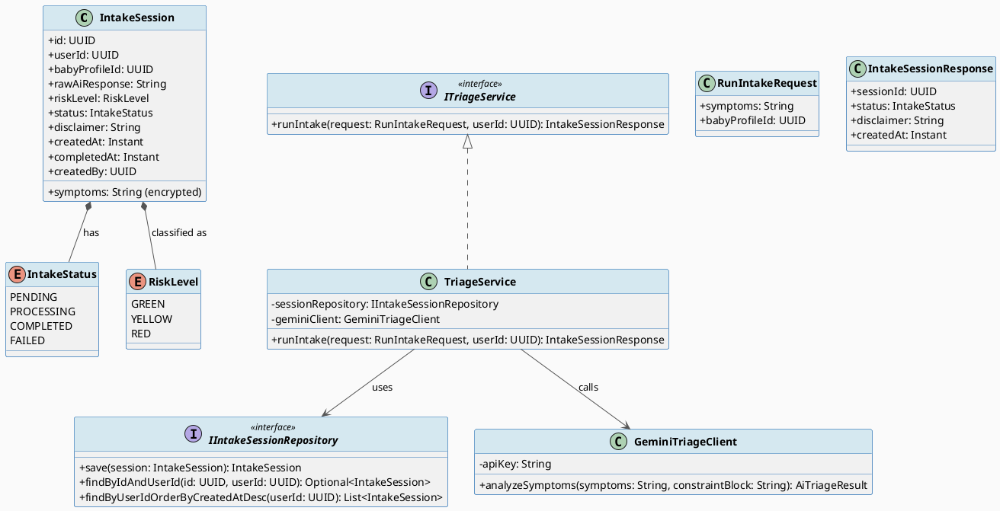
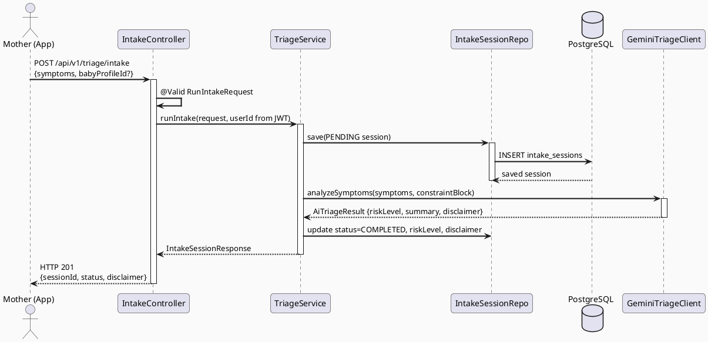
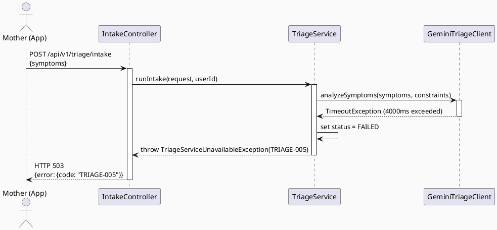
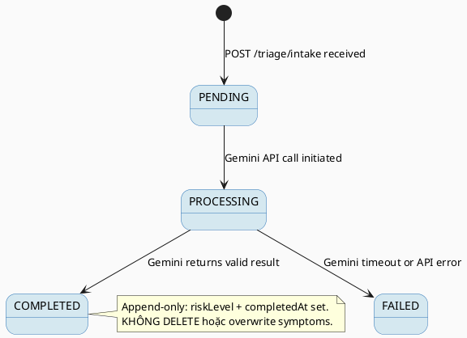

# ENGINEERING DOCUMENTATION STANDARD (EDS) v2.0
# UC60 — Run AI Symptom Intake

| Field | Value |
|-------|-------|
| **Document ID** | `CB-TRIAGE-IMP-001` |
| **Version** | `1.0` |
| **Date** | `2026-06-26` |
| **Status** | `Implemented` |
| **Document Owner** | `AI Agent` |
| **Author** | `AI Agent — Tech Lead` |
| **Reviewed by** | `[ ] Pending` |
| **DPO Sign-off** | `[ ] Pending` *(bắt buộc — module PII: health symptom data)* |
| **Approved by** | `[ ] Pending` |
| **Last Review** | `2026-06-26` |
| **Based on EDS** | `v2.0` |

---

## CHANGELOG

| Ngày | Người thực hiện | Nội dung thay đổi |
|------|-----------------|-------------------|
| 2026-06-26 | AI Agent — Tech Lead | Tạo tài liệu lần đầu — TDS cho UC60 Run AI Symptom Intake |

---

## MỤC LỤC

1. [Tổng quan Module](#1-tổng-quan-module)
2. [Ma trận Truy vết (Traceability Matrix)](#2-ma-trận-truy-vết-traceability-matrix)
3. [Architecture Decision Records (ADR)](#3-architecture-decision-records-adr)
4. [Non-Functional Requirements & SLA](#4-non-functional-requirements--sla)
5. [Static Modeling (Mô hình Tĩnh)](#5-static-modeling-mô-hình-tĩnh)
6. [Dynamic Modeling (Mô hình Động)](#6-dynamic-modeling-mô-hình-động)
7. [Domain Event Catalog](#7-domain-event-catalog)
8. [Interface Specification (Đặc tả Giao diện)](#8-interface-specification-đặc-tả-giao-diện)
9. [API Specification](#9-api-specification)
10. [Bảng mã lỗi (Error Codes)](#10-bảng-mã-lỗi-error-codes)
11. [Quy trình Triển khai (Step-by-Step)](#11-quy-trình-triển-khai-step-by-step)
12. [Rollback & Incident Runbook](#12-rollback--incident-runbook)
13. [Kịch bản Kiểm thử Chi tiết](#13-kịch-bản-kiểm-thử-chi-tiết)
14. [Phương pháp Xác minh](#14-phương-pháp-xác-minh)
15. [Mẫu thử thực tế (API Verification Samples)](#15-mẫu-thử-thực-tế-api-verification-samples)
16. [Bảng tổng hợp phân quyền (Authorization Matrix)](#16-bảng-tổng-hợp-phân-quyền-authorization-matrix)
17. [AI Prompt Constraints (CASE 2.0)](#17-ai-prompt-constraints-case-20)

---

## 1. Tổng quan Module

> UC60 cho phép người dùng (Mother) gửi triệu chứng sức khỏe qua giao diện nhập liệu; hệ thống gọi Gemini AI để phân tích và tạo phiên triage (`intake_sessions`). AI chỉ phân loại rủi ro — KHÔNG chẩn đoán bệnh.

| Field | Value |
|-------|-------|
| **Module Name** | `AI Symptom Intake` |
| **Bounded Context** | `triage` |
| **Data Classification** | `Sensitive-PII` *(health symptom data)* |
| **Compliance Scope** | `PDPA / Luật 91/2025` |
| **Upstream Dependencies** | `IAM (JWT auth), User Profile` |
| **Downstream Consumers** | `UC61 View Risk Triage Result, UC131 Extract Structured Intake Data` |

---

## 2. Ma trận Truy vết (Traceability Matrix)

| Requirement ID | Loại (BR/ADR/US) | Mô tả yêu cầu | Thành phần Code | Compliance Target | ADR liên quan |
|----------------|------------------|---------------|-----------------|-------------------|---------------|
| SRS-3.3.1.37 | User Story | Mother nhập triệu chứng; AI phân tích và trả kết quả triage | `IntakeController.POST /triage/intake` | — | ADR-TRIAGE-001 |
| BR-AI-001 | Business Rule | AI KHÔNG được chẩn đoán bệnh — chỉ phân loại rủi ro | `TriageService.runIntake()` | BR-SAFETY | ADR-TRIAGE-001 |
| BR-AI-002 | Business Rule | Kết quả AI phải có disclaimer "Không thay thế tư vấn y tế" | `IntakeSessionResponse.disclaimer` | PDPA | ADR-TRIAGE-001 |
| BR-PRIVACY-001 | Business Rule | Triệu chứng là PII — không log plaintext | `TriageService` | Luật 91/2025 | ADR-TRIAGE-002 |
| ADR-TRIAGE-001 | Decision | Dùng Gemini AI với constraint injection cho triage | `GeminiTriageClient` | — | — |
| ADR-TRIAGE-002 | Decision | Lưu intake session append-only, không UPDATE/DELETE | `IntakeSessionRepository` | PDPA | — |

---

## 3. Architecture Decision Records (ADR)

### ADR-TRIAGE-001 — Dùng Gemini AI với constraint injection cho triage

| Field | Value |
|-------|-------|
| **Status** | `Accepted` |
| **Deciders** | `AI Agent — Tech Lead` |
| **Date** | `2026-06-26` |
| **Supersedes** | `—` |

#### Bối cảnh (Context)
Cần phân tích triệu chứng sức khỏe của bà mẹ nhưng hệ thống KHÔNG được phép chẩn đoán bệnh hoặc trễ hoá tuyến cấp cứu. AI chỉ được phân loại rủi ro (GREEN/YELLOW/RED).

#### Các phương án đã xem xét (Options Considered)

| Phương án | Mô tả | Ưu điểm | Nhược điểm |
|-----------|-------|----------|------------|
| A | Rule-based triage engine | Deterministic, không cần AI | Cứng nhắc, khó mở rộng |
| B | Gemini AI với CASE 2.0 constraint injection | Linh hoạt, mở rộng tốt | Cần kiểm soát để tránh hallucination |

#### Quyết định (Decision)
Chọn **Phương án B** vì dự án đã tích hợp Gemini AI; constraint injection (§17) đảm bảo AI không vượt khỏi phạm vi phân loại rủi ro.

#### Hệ quả (Consequences)

**Tích cực:**
- Linh hoạt với triệu chứng đa dạng
- Tái sử dụng hạ tầng Gemini AI đã có

**Tiêu cực / Trade-offs:**
- Phụ thuộc độ sẵn sàng của Gemini API — cần fallback `TRIAGE-005`

**Compliance Impact:**
- BR-SAFETY: Constraint block phải include "KHÔNG chẩn đoán, KHÔNG delay emergency routing"

---

### ADR-TRIAGE-002 — Append-only storage cho intake sessions

| Field | Value |
|-------|-------|
| **Status** | `Accepted` |
| **Deciders** | `AI Agent — Tech Lead` |
| **Date** | `2026-06-26` |
| **Supersedes** | `—` |

#### Bối cảnh (Context)
Health symptom data là Sensitive-PII. Cần audit trail đầy đủ — không được xoá hoặc cập nhật.

#### Quyết định (Decision)
Append-only: không UPDATE/DELETE trên `intake_sessions`. Trạng thái chỉ thay đổi qua `completed_at` timestamp.

#### Hệ quả (Consequences)

**Tích cực:**
- Audit trail đầy đủ cho cơ quan quản lý

**Tiêu cực / Trade-offs:**
- Tăng dung lượng DB — giảm thiểu bằng retention policy (5 năm) + archiving

**Compliance Impact:**
- PDPA: Đảm bảo tính toàn vẹn dữ liệu y tế

---

## 4. Non-Functional Requirements & SLA

### 4.1. Performance & Availability

| Category | Requirement | Target SLA | Measurement Method | Compliance Basis |
|----------|-------------|------------|---------------------|------------------|
| Latency | API response (p99) | `< 5000ms` *(AI processing)* | k6 load test | — |
| Availability | Uptime (monthly) | `99.5%` | Uptime monitor | — |
| Throughput | Concurrent requests | `50 req/s` | Load test | — |
| AI Timeout | Gemini API call | `< 4000ms` | APM trace | — |

### 4.2. Data Integrity & Retention

| Category | Requirement | Target | Verification Method | Compliance Basis |
|----------|-------------|--------|---------------------|------------------|
| Durability | Zero session loss | RPO = 0 | Transaction log | PDPA |
| Retention | Intake session data | 5 năm | DB backup policy | Luật 91/2025 |
| Consistency | Session ↔ AI response sync | 100% | Reconciliation | — |

### 4.3. Security

| Category | Requirement | Target | Verification Method | Compliance Basis |
|----------|-------------|--------|---------------------|------------------|
| Encryption at rest | Symptom text (PII) | AES-256 | `openssl` CLI check | PDPA |
| Encryption in transit | All endpoints | TLS 1.3+ | SSL Labs scan | PDPA |
| Access control | Role-based | `ROLE_MOTHER` only | Auth Matrix (§16) | Luật 91/2025 |
| PII masking | No symptom text in logs | 100% | Log scan | PDPA |

### 4.4. Scalability & Capacity Planning

> Dự kiến 500 sessions/day trong 12 tháng đầu. Scale: horizontal pod scaling + Gemini API quota management.

---

## 5. Static Modeling (Mô hình Tĩnh)

### 5.1. Class Diagram (PlantUML)



### 5.2. Data Structure (Flyway SQL Migration)

Tạo file: `src/main/resources/db/migration/V35__create_intake_sessions.sql`

```sql
-- === TRIAGE: INTAKE SESSIONS SCHEMA ===

CREATE TABLE intake_sessions (
  id              UUID          PRIMARY KEY DEFAULT gen_random_uuid(),
  user_id         UUID          NOT NULL,                    -- FK to users(id)
  baby_profile_id UUID,                                      -- optional baby context
  symptoms        TEXT          NOT NULL,                    -- encrypted PII
  raw_ai_response TEXT,                                      -- Gemini raw output
  risk_level      VARCHAR(10),                               -- GREEN / YELLOW / RED
  status          VARCHAR(20)   NOT NULL DEFAULT 'PENDING',  -- IntakeStatus enum
  disclaimer      TEXT,                                      -- AI disclaimer text
  created_at      TIMESTAMPTZ   NOT NULL DEFAULT NOW(),
  completed_at    TIMESTAMPTZ,                               -- NULL until COMPLETED
  created_by      UUID          NOT NULL,

  CONSTRAINT fk_intake_user FOREIGN KEY (user_id) REFERENCES users(id),
  CONSTRAINT chk_intake_status CHECK (status IN ('PENDING','PROCESSING','COMPLETED','FAILED')),
  CONSTRAINT chk_risk_level CHECK (risk_level IN ('GREEN','YELLOW','RED') OR risk_level IS NULL)
);

CREATE INDEX idx_intake_sessions_user_id ON intake_sessions(user_id);
CREATE INDEX idx_intake_sessions_created_at ON intake_sessions(created_at DESC);
```

---

## 6. Dynamic Modeling (Mô hình Động)

### 6.1. Sequence Diagram — Happy Path (PlantUML)



### 6.2. Sequence Diagram — Error Path (PlantUML)



### 6.3. State Machine



---

## 7. Domain Event Catalog

### 7.1. Events Published (Phát ra)

| Event Name | Trigger | Publisher | Subscriber(s) | Payload Schema | Async? |
|------------|---------|-----------|---------------|----------------|--------|
| `IntakeSessionCompleted` | status = COMPLETED | `TriageService` | `UC61 ViewRiskTriageResult, UC131 ExtractStructuredIntakeData` | `IntakeSessionCompleted.java` | Yes |
| `IntakeSessionFailed` | status = FAILED | `TriageService` | `NotificationService` | `IntakeSessionFailed.java` | Yes |

### 7.2. Events Consumed (Tiêu thụ)

| Event Name | Source | Handler | Action thực hiện |
|------------|--------|---------|------------------|
| `UserProfileUpdated` | `IAM` | `TriageService` | Refresh user context for next intake |

### 7.3. Payload Schema

```java
// IntakeSessionCompleted.java
public record IntakeSessionCompleted(
    UUID    eventId,
    String  eventType,      // "IntakeSessionCompleted"
    Instant occurredAt,
    String  version,        // "1.0"
    Payload payload,
    Metadata metadata
) implements ApplicationEvent {

    public record Payload(
        UUID   sessionId,
        UUID   userId,
        String riskLevel,   // GREEN / YELLOW / RED
        String disclaimer
    ) {}

    public record Metadata(
        UUID   correlationId,
        String causedBy     // userId
    ) {}
}
```

---

## 8. Interface Specification (Đặc tả Giao diện)

### 8.1. Service Interface

```java
// RunIntakeRequest.java
// @version 1.0
public class RunIntakeRequest {
    @NotBlank
    @Size(max = 2000)
    private String symptoms;

    private UUID babyProfileId; // optional

    // getters / setters
}

// IntakeSessionResponse.java
public class IntakeSessionResponse {
    private UUID    sessionId;
    private String  status;       // IntakeStatus enum value
    private String  disclaimer;   // AI-generated disclaimer
    private Instant createdAt;
    // getters / setters
}

// ITriageService.java
// @version 1.0
public interface ITriageService {
    /**
     * Run AI symptom intake for a mother user.
     * @throws TriageServiceUnavailableException (TRIAGE-005) when Gemini API unavailable
     * @throws AccessDeniedException (TRIAGE-004) if userId does not have ROLE_MOTHER
     */
    IntakeSessionResponse runIntake(RunIntakeRequest request, UUID userId);
}
```

### 8.2. Repository Interface

```java
// IIntakeSessionRepository.java
// @version 1.0
public interface IIntakeSessionRepository extends JpaRepository<IntakeSession, UUID> {
    Optional<IntakeSession> findByIdAndUserId(UUID id, UUID userId);
    List<IntakeSession> findByUserIdOrderByCreatedAtDesc(UUID userId);
    // Không có delete() — Append-only
}
```

---

## 9. API Specification

### 9.1. Endpoints Table

| Method | Path | Auth Level | Required Roles | Rate Limit | Idempotent? |
|--------|------|------------|----------------|------------|-------------|
| `POST` | `/api/v1/triage/intake` | JWT Bearer | `ROLE_MOTHER` | 10/min | No |
| `GET` | `/api/v1/triage/intake/{sessionId}` | JWT Bearer | `ROLE_MOTHER` | 60/min | Yes |

### 9.2. Request / Response Schemas

#### `POST /api/v1/triage/intake` — Gửi triệu chứng

**Request Body:**
```json
{
  "symptoms": "Đau đầu, sốt nhẹ 37.8°C, mệt mỏi từ sáng",
  "babyProfileId": "uuid-baby-optional"
}
```

**Response — 201 Created:**
```json
{
  "sessionId": "uuid-v4",
  "status": "COMPLETED",
  "disclaimer": "Kết quả này KHÔNG phải chẩn đoán y tế. Vui lòng tham khảo bác sĩ nếu triệu chứng nghiêm trọng hoặc kéo dài.",
  "createdAt": "2026-06-26T08:00:00.000Z"
}
```

**Response — 400 Bad Request:**
```json
{
  "error": {
    "code": "TRIAGE-001",
    "message": "Validation failed",
    "details": [{ "field": "symptoms", "message": "symptoms is required" }]
  }
}
```

**Response — 503 Service Unavailable:**
```json
{
  "error": {
    "code": "TRIAGE-005",
    "message": "AI service temporarily unavailable. Please try again later."
  }
}
```

---

## 10. Bảng mã lỗi (Error Codes)

| Code | HTTP Status | Message (EN) | Message (VI) | Trigger Condition |
|------|-------------|--------------|--------------|-------------------|
| `TRIAGE-001` | 400 | Validation failed | Dữ liệu không hợp lệ | symptoms blank hoặc > 2000 chars |
| `TRIAGE-002` | 409 | Duplicate intake session | Phiên nhập liệu trùng lặp | Session đang PROCESSING cho user này |
| `TRIAGE-003` | 404 | Session not found | Không tìm thấy phiên | sessionId không tồn tại hoặc không thuộc user |
| `TRIAGE-004` | 403 | Insufficient permissions | Không đủ quyền | User không có role ROLE_MOTHER |
| `TRIAGE-005` | 503 | AI service unavailable | Dịch vụ AI tạm thời không khả dụng | Gemini API timeout hoặc lỗi |

---

## 11. Quy trình Triển khai (Step-by-Step)

### 11.1. Prerequisites

- [ ] ADR-TRIAGE-001 và ADR-TRIAGE-002 đã được Accepted
- [ ] DPO đã sign-off (module PII: health symptoms)
- [ ] Môi trường staging đã sẵn sàng
- [ ] Gemini API key đã được cấu hình trong env

### 11.2. Pre-Migration Checklist

- [ ] Đã backup DB: `pg_dump -h $DB_HOST -U $DB_USER carebridge > backup_$(date +%Y%m%d).sql`
- [ ] Migration V35 đã chạy thành công trên staging ≥ 24 giờ
- [ ] Rollback script đã được test trên staging (xem §12)
- [ ] DPO sign-off vì migration thêm column lưu health PII

### 11.3. Implementation Steps

#### Chặng 1 — Tạo Flyway migration V35

```bash
# Tạo file migration
touch src/main/resources/db/migration/V35__create_intake_sessions.sql
# Nội dung xem §5.2
./mvnw flyway:migrate
```

> ⚠️ **Chú ý:** Migration thêm table mới — không lock table hiện có, an toàn để chạy.

#### Chặng 2 — Implement Entity + Repository

```java
// IntakeSession.java entity trong package com.carebridge.triage.entity
// IIntakeSessionRepository.java trong package com.carebridge.triage.repository
```

#### Chặng 3 — Implement GeminiTriageClient

```java
// GeminiTriageClient.java trong package com.carebridge.triage.service
// Inject constraint block từ §17.2 vào mỗi Gemini API call
// Timeout: 4000ms — throw TriageServiceUnavailableException nếu quá hạn
```

#### Chặng 4 — Implement TriageService + IntakeController

```java
// TriageService.java trong package com.carebridge.triage.service
// IntakeController.java trong package com.carebridge.triage.controller
```

#### Chặng 5 — Verification sau deploy

```bash
curl -X GET https://$HOST/api/v1/health
# Expected: {"status": "ok"}
```

### 11.4. Deployment Checklist

- [ ] Migration V35 chạy thành công
- [ ] Health check endpoint trả về 200
- [ ] Error rate < 1% trong 10 phút đầu
- [ ] Audit log đang sinh đúng format
- [ ] Không có symptom text trong application logs

---

## 12. Rollback & Incident Runbook

### 12.1. Điều kiện kích hoạt Rollback

| Điều kiện | Ngưỡng | Người quyết định |
|-----------|--------|------------------|
| Error rate tăng đột biến | > 5% trong 5 phút | On-call Engineer |
| Gemini API liên tục timeout | > 10 lần/phút | On-call Engineer |
| Symptom data bị log plaintext | Bất kỳ case nào | Tech Lead + DPO |
| Audit log ngừng hoạt động | > 1 phút | On-call Engineer |

### 12.2. Rollback Procedure

```bash
# Bước 1: Revert migration V35
psql -h $DB_HOST -U $DB_USER -d carebridge \
  -c "DROP TABLE IF EXISTS intake_sessions CASCADE;"
psql -h $DB_HOST -U $DB_USER -d carebridge \
  -c "DELETE FROM flyway_schema_history WHERE version = '35';"

# Bước 2: Re-deploy phiên bản cũ
kubectl rollout undo deployment/carebridge-api

# Bước 3: Verify rollback
kubectl rollout status deployment/carebridge-api
curl -X GET https://$HOST/api/v1/health
```

### 12.3. Notification Protocol

| Thời điểm | Người nhận | Kênh | Template |
|-----------|------------|------|----------|
| Ngay khi phát hiện | On-call team | Slack `#incident` | "🚨 TRIAGE incident: [mô tả]" |
| Trong 30 phút | DPO | Email | Bắt buộc nếu health PII bị ảnh hưởng |
| Trong 72 giờ | DPA | Email | Nếu có data breach (PDPA requirement) |

### 12.4. Post-Incident Review (PIR)

- **Timeline:** Diễn biến từng bước theo thứ tự thời gian
- **Root Cause:** Nguyên nhân gốc rễ (5 Whys)
- **Impact:** Số users ảnh hưởng, thời gian downtime, PII exposure?
- **Remediation:** Các bước đã thực hiện để khắc phục
- **Prevention:** Action items để tránh tái diễn

---

## 13. Kịch bản Kiểm thử Chi tiết

### 13.1. Unit Tests

#### TC-UNIT-001 — Gửi triệu chứng hợp lệ, nhận sessionId

```gherkin
Feature: Run AI Symptom Intake
  Background:
    Given test data classification: SYNTHETIC
    And user với role ROLE_MOTHER đã xác thực

  Scenario: Happy path — triệu chứng hợp lệ
    Given symptoms = "Đau đầu nhẹ, sốt 37.5°C"
    When POST /api/v1/triage/intake được gọi
    Then response status là 201
    And response body chứa sessionId (UUID)
    And response body chứa status = "COMPLETED"
    And response body chứa disclaimer không rỗng
    And IntakeSession được lưu với status COMPLETED trong DB

  Scenario: Symptoms quá dài — validation fail
    Given symptoms = [chuỗi 2001 ký tự]
    When POST /api/v1/triage/intake được gọi
    Then response status là 400
    And error.code = "TRIAGE-001"

  Scenario: Symptoms rỗng — validation fail
    Given symptoms = ""
    When POST /api/v1/triage/intake được gọi
    Then response status là 400
    And error.code = "TRIAGE-001"
```

**Hàm được test:** `TriageService.runIntake()`
**Invariant kiểm tra:** Session status phải là COMPLETED sau khi Gemini trả kết quả; KHÔNG expose symptom text trong log

### 13.2. Integration Tests

#### TC-INT-001 — Luồng đầy đủ với Gemini mock

```gherkin
  Scenario: Full intake flow với Gemini mock
    Given test data classification: SYNTHETIC
    And database đang chạy với user seed data (FX-001)
    And GeminiTriageClient được mock trả về riskLevel = "GREEN"
    When TriageService.runIntake() được gọi với symptoms hợp lệ
    Then intake_sessions table chứa 1 record mới
    And record.status = "COMPLETED"
    And record.risk_level = "GREEN"
    And event IntakeSessionCompleted được publish

  Scenario: Gemini API timeout → session FAILED
    Given GeminiTriageClient được mock throw TimeoutException
    When TriageService.runIntake() được gọi
    Then intake_sessions table chứa record với status = "FAILED"
    And TriageServiceUnavailableException được throw
```

**External dependencies:** `GeminiTriageClient (mock), PostgreSQL (Testcontainers)`

### 13.3. E2E / Security Tests

#### TC-E2E-001 — Unauthorized user bị từ chối

```gherkin
  Scenario: User không có ROLE_MOTHER bị từ chối
    Given test data classification: SYNTHETIC
    And user với role ROLE_PARTNER đã xác thực
    When POST /api/v1/triage/intake được gọi
    Then response status là 403
    And error.code = "TRIAGE-004"

  Scenario: JWT không hợp lệ
    Given request không có Authorization header
    When POST /api/v1/triage/intake được gọi
    Then response status là 401
```

---

## 14. Phương pháp Xác minh

### 14.1. Database Inspection

```sql
-- Verify session tồn tại sau khi tạo
SELECT id, status, risk_level, created_at, completed_at
FROM intake_sessions
WHERE id = '[uuid]';

-- Verify append-only (không có UPDATE sau COMPLETED)
SELECT count(*) FROM audit_log
WHERE entity_id = '[uuid]' AND action = 'UPDATE';
-- Expected: 0

-- Verify không có PII plaintext trong pg_stat_activity
SELECT query FROM pg_stat_activity
WHERE query ILIKE '%symptoms%' LIMIT 5;
```

### 14.2. Log / Audit Verification

```bash
# Kiểm tra IntakeSessionCompleted event
kubectl logs -l app=carebridge-api | grep '"eventType":"IntakeSessionCompleted"' | head -5

# Verify không có symptom text trong logs (PDPA requirement)
kubectl logs -l app=carebridge-api | grep -i "symptom\|triệu chứng"
# Expected: No plaintext symptom output
```

### 14.3. Tool-based Verification

```bash
# Verify JWT claims
echo "[JWT_TOKEN]" | cut -d'.' -f2 | base64 -d | jq '.roles'
# Expected: ["ROLE_MOTHER"]

# Verify TLS
openssl s_client -connect $HOST:443 -tls1_3 2>&1 | grep "Protocol"
# Expected: Protocol  : TLSv1.3
```

---

## 15. Mẫu thử thực tế (API Verification Samples)

### 15.1. Happy Path

```bash
# POST — Gửi triệu chứng
curl -X POST https://$HOST/api/v1/triage/intake \
  -H "Authorization: Bearer $MOTHER_JWT" \
  -H "Content-Type: application/json" \
  -H "X-Correlation-Id: $(uuidgen)" \
  -d '{
    "symptoms": "Đau đầu nhẹ, sốt 37.5°C từ buổi sáng"
  }'
```

**Expected Response (201):**
```json
{
  "sessionId": "550e8400-e29b-41d4-a716-446655440000",
  "status": "COMPLETED",
  "disclaimer": "Kết quả này KHÔNG phải chẩn đoán y tế. Vui lòng tham khảo bác sĩ nếu triệu chứng nghiêm trọng.",
  "createdAt": "2026-06-26T08:00:00.000Z"
}
```

### 15.2. Error Paths

```bash
# POST — Symptoms rỗng → 400
curl -X POST https://$HOST/api/v1/triage/intake \
  -H "Authorization: Bearer $MOTHER_JWT" \
  -H "Content-Type: application/json" \
  -d '{"symptoms": ""}'
```

**Expected (400):**
```json
{
  "error": { "code": "TRIAGE-001", "message": "Validation failed" }
}
```

```bash
# POST — Không có JWT → 401
curl -X POST https://$HOST/api/v1/triage/intake \
  -H "Content-Type: application/json" \
  -d '{"symptoms": "test"}'
```

---

## 16. Bảng tổng hợp phân quyền (Authorization Matrix)

| Endpoint | `GUEST` | `ROLE_MOTHER` | `ROLE_PARTNER` | `ROLE_EXPERT` | `ROLE_ADMIN` |
|----------|---------|---------------|----------------|---------------|--------------|
| `POST /api/v1/triage/intake` | ❌ | ✅ Own | ❌ | ❌ | ❌ |
| `GET /api/v1/triage/intake/{id}` | ❌ | ✅ Own | ❌ | ❌ | ✅ All |

**Chú thích:**
- ✅ = Được phép | ❌ = Bị từ chối (403) | `Own` = Chỉ được phép với session của chính mình

---

## 17. AI Prompt Constraints (CASE 2.0)

### 17.1 Constraint Summary Table

| # | Constraint | Source (ADR/BR) | Last Verified |
|---|-----------|-----------------|---------------|
| C1 | AI KHÔNG được chẩn đoán bệnh — chỉ phân loại rủi ro GREEN/YELLOW/RED | `BR-AI-001` | `2026-06-26` |
| C2 | Kết quả AI PHẢI kèm disclaimer "Không thay thế tư vấn y tế" | `BR-AI-002` | `2026-06-26` |
| C3 | Symptom text KHÔNG được log plaintext — mask trước khi ghi log | `BR-PRIVACY-001` | `2026-06-26` |
| C4 | userId lấy từ JWT SecurityContext — KHÔNG nhận từ request body | `ADR-TRIAGE-002` | `2026-06-26` |
| C5 | Business logic trong Service; Controller chỉ validate + map DTO | `CLAUDE.md Architecture` | `2026-06-26` |
| C6 | Gemini timeout → status = FAILED + throw TRIAGE-005; KHÔNG retry vô hạn | `ADR-TRIAGE-001` | `2026-06-26` |

### 17.2 Constraint Injection Block (Copy-Paste vào AI Prompt)

```
[CONSTRAINT BLOCK — Module: AI Symptom Intake — CB-TRIAGE-IMP-001]
Theo TDS CB-TRIAGE-IMP-001 và các ADR liên quan:

1. AI KHÔNG được chẩn đoán bệnh — chỉ phân loại rủi ro GREEN/YELLOW/RED (BR-AI-001)
2. Mọi response PHẢI kèm disclaimer "Kết quả này KHÔNG phải chẩn đoán y tế" (BR-AI-002)
3. Symptom text KHÔNG được ghi vào application log dưới dạng plaintext (BR-PRIVACY-001)
4. userId luôn lấy từ JWT SecurityContext — KHÔNG nhận từ request body (ADR-TRIAGE-002)
5. Business logic trong Service; Controller chỉ validate + map DTO (CLAUDE.md)
6. Gemini timeout → status = FAILED + throw TriageServiceUnavailableException(TRIAGE-005) (ADR-TRIAGE-001)

[CONTEXT BLOCK]
- Bounded Context: triage
- Data Classification: Sensitive-PII (health symptoms)
- Compliance: PDPA / Luật 91/2025
- Existing interfaces: §8 Service Interface + §8.2 Repository Interface
- Error codes: §10 Error Codes Table
- Auth matrix: §16 Authorization Matrix

[TASK BLOCK]
Implement TriageService.runIntake() thỏa mãn constraints trên.
Output phải tuân thủ §8 Interface Specification.
Tests phải cover §13 Test Scenarios.
```

### 17.3 Constraint Quality Checklist

- [x] Mỗi constraint traceable về ADR hoặc BR cụ thể
- [x] Không có constraint generic
- [x] Mỗi constraint có `Last Verified` date ≤ 2 sprints
- [x] Constraint block có ≥ 3 constraints cụ thể (có 6)
- [x] Constraint block reference §8 Interface
- [x] Constraint block reference §16 Auth Matrix

### 17.4 Anti-Pattern Detection

| AP-ID | Anti-Pattern | Dấu hiệu | Hành động |
|-------|-------------|-----------|----------|
| AP-AI-001 | Unconstrained Gen | Code không match C1-C6 | Reject — inject lại constraints |
| AP-AI-003 | Implicit Decision | Code assume architecture không có trong §3 ADR | Reject — viết ADR trước |
| AP-AI-005 | Hallucinated Contract | Code import service/type không có trong §8 | Reject — verify contract existence |

---

## PHỤ LỤC

### A. Glossary (Thuật ngữ)

| Thuật ngữ | Định nghĩa |
|-----------|------------|
| Triage | Phân loại mức độ ưu tiên y tế dựa trên triệu chứng |
| Intake Session | Phiên nhập triệu chứng của người dùng |
| Risk Level | Mức rủi ro: GREEN (thấp), YELLOW (trung bình), RED (cao — cần gặp bác sĩ ngay) |
| BR-SAFETY | Business rule: AI KHÔNG chẩn đoán, KHÔNG delay emergency routing |
| Constraint Injection | Kỹ thuật inject specification vào AI prompt trước khi generate code |
| Append-only | Chiến lược không UPDATE/DELETE intake_sessions — chỉ INSERT |
| DPO | Data Protection Officer |

### B. Tài liệu tham chiếu

| Document | Link / Path |
|----------|-------------|
| SRS UC-60 | `02_Requirements/SRS/Functional_Specifications.md §3.3.1.37` |
| CASE 2.0 Methodology | `08_References/CASE_AI_METHODOLOGY.md` |
| EDS v2.0 Template | `08_References/Template/PHASE-3_TDS.md` |
| PDPA Compliance | Luật 91/2025 |

## Story 6.10 OV-01 Maternal Safety Addendum

Stories 6.6/6.7 bind UC60 intake to canonical PRECONCEPTION, PREGNANCY, POSTPARTUM, INFANT and TODDLER origins. Universal maternal danger signs and Java fallback remain deterministic; unreviewed clinical thresholds stay inactive.

| OV-01 branch | Decision | Test-Spec contract | Executable evidence |
| --- | --- | --- | --- |
| `OV01-B07` | GREEN/NEED_MORE_INFO retains the typed origin and creates no emergency | `OV01-TS-60-001` | `TriageServiceTest`, `story_6_7_lifecycle_origin_contract_test.dart` |
| `OV01-B09/B10` | RED is authoritative and exactly-once; AI unavailable/timeout cannot downgrade deterministic maternal RED | `OV01-TS-60-002` | `TriageServiceTest`, `EmergencyTriageLinkPostgresIntegrationTest`, AI-service maternal/postpartum regression |
| `OV01-B10` | POSTPARTUM is executable; evaluator disclaimer accepts canonical “bác sĩ” or “nhân viên y tế” boundary wording | `OV01-TS-60-003` | CareBridge AI Evaluation official catalog and `test_assertions.py` |

Medical-review metadata remains `PENDING_MEDICAL_REVIEW`; this technical trace addendum is not clinical approval.
