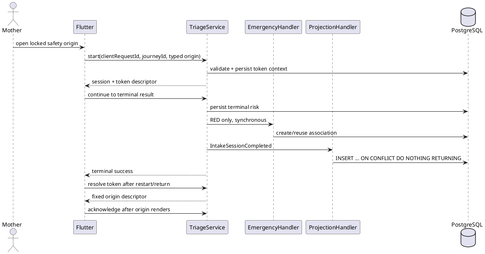
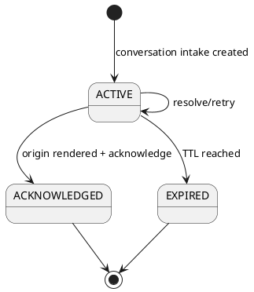

# ENGINEERING DOCUMENTATION STANDARD (EDS) v2.0
# Technical Design Specification — UC61 Persist Safety Outcomes and Return to Origin

| Field | Value |
|---|---|
| **Document ID** | `CB-OV01-IMP-061` |
| **Version** | `1.1` |
| **Date** | `2026-07-22` |
| **Status** | `Approved` |
| **Document Owner** | `BachNQ — Care Journey owner` |
| **Author** | `Codex — specification author` |
| **Reviewed by** | `Story 6.7 independent specification verifier` |
| **DPO Sign-off** | `[ ] Required before production release; not a development gate` |
| **Approved by** | `User — implementation approval granted 2026-07-22` |
| **Last Review** | `2026-07-22` |
| **Based on EDS** | `v2.0` |

> Identity note: the SRS canonical name is **UC-61 View Risk Triage Result**. The existing Function workspace and Story 6.7 extend that use case with persisted safety outcomes and return-to-origin. This document retains UC61 traceability; it does not renumber the SRS.

---

## CHANGELOG

| Date | Author | Change |
|---|---|---|
| 2026-07-22 | Codex — specification author | Initial Draft for Story 6.7; not approved for production implementation. |
| 2026-07-22 | Codex — implementation agent | Approved after independent specification verification and user implementation approval. |
| 2026-07-22 | Codex — implementation agent | Synchronized accepted ADRs, implemented contracts, prerequisites, and verification evidence after Story 6.7 implementation. |

---

## TABLE OF CONTENTS

1. Module Overview
2. Traceability Matrix
3. Architecture Decision Records
4. Non-Functional Requirements & SLA
5. Static Modeling
6. Dynamic Modeling
7. Domain Event Catalog
8. Interface Specification
9. API Specification
10. Error Codes
11. Step-by-Step Implementation
12. Rollback & Incident Runbook
13. Detailed Test Scenarios
14. Verification Methods
15. API Verification Samples
16. Authorization Matrix
17. AI Prompt Constraints

---

## 1. Module Overview

| Field | Value |
|---|---|
| **Module Name** | UC61 Persist Safety Outcomes and Return to Origin |
| **Bounded Context** | `triage` source, `emergency` source, `journey` projection/read model, Flutter Mobile |
| **Primary Actor** | Authenticated Mother |
| **Platforms** | Backend + PostgreSQL + Mobile; Web is not in scope |
| **Priority** | P1; OV-01 safety-integrity release gate |
| **Data Classification** | Sensitive-PII references; projection is minimum-necessary |
| **Compliance Scope** | CareBridge BR-PRIVACY, BR-SAFETY, BR-RBAC, consent and immutable audit rules; formal legal citations are Open |
| **Upstream Dependencies** | Stories 6.1–6.6, lifecycle consent, canonical journey, standalone baby origin, triage completion, RED emergency association |
| **Downstream Consumers** | Mother Journey timeline, result/emergency return navigation, OV-01 tests |

### 1.1 Intended Outcome

A validated lifecycle-bound conversation intake produces exactly one append-only safety projection before terminal success. GREEN/YELLOW and restart-safe RED continuation return to a server-validated Mother Journey or an owned active standalone baby origin through an owner-bound opaque token.

### 1.2 In Scope

- Conversation start/continue lifecycle binding; one-shot/direct intake remains legacy and non-projecting.
- GREEN/YELLOW/RED terminal projection, with RED referencing Story 6.6's emergency association.
- Unified paginated lifecycle timeline containing transition and safety item types.
- Owner-bound continuation issue, resolve, acknowledge, expiry, encrypted account-scoped Mobile persistence, restart recovery, and account cleanup.
- Backend/PostgreSQL/Mobile automated evidence and OV01-MAN-023/028/031 evidence.

### 1.3 Out of Scope

- Risk reclassification, new AI or clinical thresholds, a second RED interpretation, emergency creation redesign, provider-delivery exactly-once, verified-expert YELLOW handoff, checklist/content approval, Web UI, and legacy record backfill.
- New INFANT/TODDLER age thresholds. Story 6.7 preserves the Story 6.6 production classifier.

### 1.4 Baseline versus Implemented State

| Concern | Pre-Story 6.7 Baseline | Implemented and Verified State |
|---|---|---|
| Intake context | stage/profile only | conversation start/continue persists canonical journey, locked stage, typed origin, and stable continuation; direct/one-shot remains unprojected |
| Safety persistence | triage/emergency source rows only | append-only `lifecycle_safety_outcomes`, exactly one minimum row per terminal lifecycle-bound intake; RED references the authoritative emergency association |
| Lifecycle history | transition-only `/history` | backward-compatible `/history` plus database-paginated `/timeline` ordered by `occurredAt`, `recordedAt`, then `itemId`, all descending |
| Return state | in-memory `GoRouter.extra` | encrypted account-scoped token resolved to an allowlisted Mother Journey or Baby Profile descriptor and acknowledged after destination render |
| Failure behavior | process death loses origin | authenticated app-start restore, retry-safe resolution, late-response/account-generation guards, and neutral fail-closed fallback |

---

## 2. Traceability Matrix

| Requirement | Type | Requirement / Oracle | Implemented Component | Test Conditions |
|---|---|---|---|---|
| FR51 | PRD | Project triage/emergency outcomes and preserve return continuation | projection handler, timeline API, continuation service | `S67-C01..C12` |
| Story 6.7 AC1 | AC | validated lifecycle/origin/token | conversation DTO/service + origin policy | `S67-C01..C04` |
| Story 6.7 AC2 | AC | one minimum projection per terminal intake | `LifecycleSafetyOutcomeProjector` + DB unique key | `S67-C05..C07` |
| Story 6.7 AC3 | AC | RED references authoritative emergency without side effects | projection handler + escalation repository | `S67-C08` |
| Story 6.7 AC4 | AC | GREEN/YELLOW/restart RED exact-origin return | continuation resolver/store/coordinator | `S67-C09..C11` |
| Story 6.7 AC5 | AC | retry, consent, partial failure, account isolation | transaction boundary + Mobile generation guards | `S67-C06,C10,C12` |
| Story 6.7 AC6 | AC | automated + Android evidence | Test-Spec and evidence folders | `S67-C13..C16` |
| BR-RBAC | SRS BR | actor accesses only permitted owned resources | controller auth + domain ownership checks | `S67-C03,C12` |
| BR-PRIVACY | SRS BR | consent, purpose, minimum necessary | consent validator, DTO allowlist, log redaction | `S67-C03,C07,C12` |
| BR-SAFETY | SRS BR | non-diagnostic and red-flag safe | preserve Story 6.6 risk/emergency authority | `S67-C08,C15` |
| R-OV01-06 | Risk | no lost/duplicate projection or wrong origin | DB idempotency + restart tests | `S67-C05,C06,C10` |

Sources: `_bmad-output/planning-artifacts/{prd,epics,architecture,ux}.md`, approved Story 6.7, Story 6.6, UC-61 SRS, and the OV-01 manual/test-design artifacts.

---

## 3. Architecture Decision Records (ADR)

### ADR-061-01 — Separate append-only safety projection

| Field | Value |
|---|---|
| **Status** | Approved |
| **Deciders** | User — implementation approver |
| **Date** | 2026-07-22 |
| **Approval basis** | Approved UC61 TDS/Test-Spec and explicit authorization to implement Story 6.7 through `done` |

**Context.** `mother_journey_transitions` is immutable and unique by journey version; multiple safety events may occur without a version change.

**Options.** (A) insert safety rows into transitions; (B) copy health records; (C) add a journey-owned projection keyed by intake.

**Decision.** Choose C. One projection represents one terminal intake; RED additionally references an emergency source. Sources remain authoritative.

**Consequences.** Clear idempotency and privacy boundaries; a new migration/read model and unified timeline query are required.

### ADR-061-02 — Synchronous terminal projection

| Field | Value |
|---|---|
| **Status** | Approved |
| **Deciders** | User — implementation approver |
| **Date** | 2026-07-22 |
| **Approval basis** | Approved UC61 contract and Story 6.7 implementation authorization |

The ordinary `IntakeSessionCompleted` listener joins the triage transaction. Story 6.6 publishes RED escalation first. The existing structured-intake AFTER_COMMIT listener remains unchanged. A projection exception rolls back terminal persistence so retry cannot lose the timeline record; infrastructure failures are not reclassified as eligibility conflicts.

### ADR-061-03 — Owner-bound opaque UUID continuation

| Field | Value |
|---|---|
| **Status** | Approved |
| **Deciders** | User — implementation approver |
| **Date** | 2026-07-22 |
| **Approval basis** | Approved seven-day default TTL and continuation contract in UC61 implementation approval |

Conversation intake receives a random UUID (about 122 random bits), `expires_at` (default seven days, configurable), and `acknowledged_at`. It is not an authorization credential: JWT ownership, consent, typed origin identity, locked stage, and dashboard/action pairing are revalidated. Maternal origins require an owned active `journeyId`; `BABY_PROFILE` origins require `journeyId == null`, an owned active baby, and `originReferenceId` equal to that baby identity. Malformed, unknown, foreign, expired, or acknowledged values resolve as neutral `TRIAGE-014`; owned but ineligible consent/origin resolves as `TRIAGE-015`. Same-owner acknowledgement replay returns 200. Token bodies are redacted from telemetry and never appear in URL, audit, logs, projection, or screenshots.

### ADR-061-04 — Unified globally paginated timeline

| Field | Value |
|---|---|
| **Status** | Approved |
| **Deciders** | User — implementation approver |
| **Date** | 2026-07-22 |
| **Approval basis** | Approved UC61 timeline contract and Story 6.7 implementation authorization |

`GET /api/v1/journeys/{journeyId}/timeline` returns discriminated transition/safety items ordered in PostgreSQL by `occurredAt DESC, recordedAt DESC, itemId DESC`. Existing `/history` remains compatible. Flutter consumes every server page in that order and does not merge independent transition/outcome page streams; its explicit legacy-history fallback remains a compatibility warning path only.

---

## 4. Non-Functional Requirements & SLA

### 4.1 Performance & Availability

| Category | Requirement | Target | Verification |
|---|---|---|---|
| Timeline pagination | bounded query/page | size 1–100; default 20 | PostgreSQL integration/query-plan inspection |
| Projection cardinality | no duplicates | exactly 1 per terminal intake | concurrent Testcontainers test |
| API latency | Product threshold | Open — no Story 6.7 SLA is approved | capture baseline only; no PASS claim |
| Availability | Product threshold | Open | report environment evidence only |

### 4.2 Data Integrity & Retention

- Projection commit and terminal conversation result are atomic.
- `ON DELETE RESTRICT` protects journey/intake/emergency evidence; lifecycle archival does not delete projections.
- Continuation expires after the approved configurable TTL or is retired by acknowledgement. Projection retention follows lifecycle/audit retention; exact duration is Open.
- No legacy backfill because trustworthy origin data is unavailable.

### 4.3 Security & Privacy

- JWT authentication and MOTHER role for resolve/ack/timeline; domain ownership is mandatory.
- Consent fails closed at bound start and resolution.
- Minimum projection fields only; no raw symptoms, AI response, recommendation, citation, coordinates, token, or arbitrary route.
- Neutral 404/409 prevents cross-resource disclosure; request/response bodies on token endpoints are not logged.

### 4.4 Scalability & Capacity Planning

No forecast is approved. The design uses indexed keyset-compatible ordering and uniqueness; capacity/load thresholds remain Open for Story 6.10 NFR assessment.

---

## 5. Static Modeling

### 5.1 Class Diagram

```plantuml
@startuml UC61_ClassDiagram
class IntakeSession { UUID id; UUID userId; UUID journeyId; OriginDashboard originDashboard; UUID originReferenceId; UUID continuationToken; Instant continuationExpiresAt; Instant continuationAcknowledgedAt }
class LifecycleSafetyOutcome { UUID id; UUID ownerUserId; UUID journeyId; UUID intakeSessionId; UUID emergencySessionId; RiskLevel riskLevel; TriageStage stage; OriginDashboard originDashboard; OriginAction originAction; Instant occurredAt; Instant recordedAt }
interface LifecycleSafetyOutcomeRepository
interface LifecycleSafetyOutcomeProjector
class IntakeSafetyOutcomeProjectionHandler
class TriageContinuationService
class JourneyTimelineService
IntakeSafetyOutcomeProjectionHandler --> LifecycleSafetyOutcomeProjector
LifecycleSafetyOutcomeProjector --> LifecycleSafetyOutcomeRepository
LifecycleSafetyOutcome --> IntakeSession : source
TriageContinuationService --> IntakeSession : resolves/acknowledges
JourneyTimelineService --> LifecycleSafetyOutcomeRepository
@enduml
```

### 5.2 Data Structure and Migration Plan

Implemented by `V20260722210000__persist_lifecycle_safety_outcomes_and_continuations.sql`.

```sql
CREATE UNIQUE INDEX uq_mother_journeys_id_owner
  ON mother_journeys(journey_id, owner_user_id);

ALTER TABLE intake_sessions
  ADD COLUMN journey_id uuid,
  ADD COLUMN origin_dashboard varchar(30),
  ADD COLUMN origin_reference_id uuid,
  ADD COLUMN continuation_token uuid,
  ADD COLUMN continuation_expires_at timestamptz,
  ADD COLUMN continuation_acknowledged_at timestamptz;

ALTER TABLE intake_sessions
  ADD CONSTRAINT fk_intake_journey_owner
  FOREIGN KEY (journey_id, user_id)
  REFERENCES mother_journeys(journey_id, owner_user_id)
  ON DELETE RESTRICT;

CREATE UNIQUE INDEX uq_intake_sessions_continuation_token
  ON intake_sessions(continuation_token) WHERE continuation_token IS NOT NULL;

CREATE TABLE lifecycle_safety_outcomes (
  outcome_id uuid PRIMARY KEY DEFAULT gen_random_uuid(),
  owner_user_id uuid NOT NULL,
  journey_id uuid,
  intake_session_id uuid NOT NULL UNIQUE,
  emergency_session_id uuid,
  risk_level varchar(10) NOT NULL,
  stage varchar(20) NOT NULL,
  origin_dashboard varchar(30) NOT NULL,
  origin_reference_id uuid NOT NULL,
  origin_action varchar(40) NOT NULL,
  occurred_at timestamptz NOT NULL,
  recorded_at timestamptz NOT NULL DEFAULT now(),
  CONSTRAINT fk_safety_journey_owner FOREIGN KEY (journey_id, owner_user_id) REFERENCES mother_journeys(journey_id, owner_user_id) ON DELETE RESTRICT,
  CONSTRAINT fk_safety_intake_owner FOREIGN KEY (intake_session_id, owner_user_id) REFERENCES intake_sessions(id, user_id) ON DELETE RESTRICT,
  CONSTRAINT fk_safety_emergency_owner FOREIGN KEY (emergency_session_id, owner_user_id) REFERENCES emergency_sessions(id, user_id) ON DELETE RESTRICT,
  CONSTRAINT chk_safety_risk CHECK (risk_level IN ('GREEN','YELLOW','RED')),
  CONSTRAINT chk_safety_origin CHECK (origin_dashboard IN ('MOTHER_JOURNEY','BABY_PROFILE')),
  CONSTRAINT chk_safety_action CHECK (origin_action IN ('RETURN_TO_MOTHER_JOURNEY','RETURN_TO_BABY_PROFILE')),
  CONSTRAINT chk_safety_origin_journey CHECK (
    (origin_dashboard = 'MOTHER_JOURNEY' AND journey_id IS NOT NULL)
    OR (origin_dashboard = 'BABY_PROFILE' AND journey_id IS NULL)
  )
);

CREATE INDEX idx_safety_journey_timeline
  ON lifecycle_safety_outcomes(journey_id, occurred_at DESC, recorded_at DESC, outcome_id DESC);
```

The migration adds the exact five-stage check using the current `TriageStage` values, conditional origin/reference checks, owner-aware composite keys/FKs, and an UPDATE/DELETE rejection trigger.

**V1 baseline synchronization rule:** `V1__init_schema.sql` is an applied Flyway migration and was not edited because doing so changes its checksum. The forward migration above is now part of the authoritative clean-install chain `V1 ... V20260722210000`. `Story67SafetyOutcomePostgresRedTest` starts from disposable PostgreSQL with the Flyway chain and asserts the intake columns, owner-aware keys/FKs, projection table, checks, indexes, and append-only trigger. The TDS and migration test are the explicit V1-to-current synchronization record; no checksum-changing V1 edit or undocumented baseline exception is permitted.

### 5.3 Ownership and Enums

- `OriginDashboard`: `MOTHER_JOURNEY`, `BABY_PROFILE`.
- `OriginAction`: `RETURN_TO_MOTHER_JOURNEY`, `RETURN_TO_BABY_PROFILE`.
- Maternal mapping: PRECONCEPTION↔PRE_PREGNANCY, PREGNANCY↔PREGNANCY, POSTPARTUM↔POSTPARTUM.
- Pediatric mapping reuses Story 6.6's production classifier. `BABY_PROFILE` origins require INFANT/TODDLER, `journeyId == null`, an owned active baby, and matching `originReferenceId`; this TDS adds no age threshold.

---

## 6. Dynamic Modeling

### 6.1 Happy Path



### 6.2 Error and Retry Path

- Projection failure throws within the transaction; terminal success is not returned.
- Retried start with the same owner/key/intent returns the same token; changed intent returns conflict.
- Duplicate completion inserts zero new rows and zero new creation audits.
- Invalid/foreign/expired/acknowledged token returns neutral 404. Owned but no-longer-eligible origin/consent returns neutral 409; Mobile loads `/me/dashboard`.

### 6.3 Continuation State Machine



Invariants: token owner never changes; acknowledgement is monotonic; projection is append-only; no token controls an arbitrary route.

---

## 7. Domain Event Catalog

### 7.1 Events Published

No new cross-process event is required. Existing `EmergencyEscalationTriggered` and `IntakeSessionCompleted` publication order is preserved.

### 7.2 Events Consumed

| Event | Source | Handler | Action |
|---|---|---|---|
| `IntakeSessionCompleted` | `triage` | `IntakeSafetyOutcomeProjectionHandler` | synchronous, transaction-participating exact-once projection |
| `IntakeSessionCompleted` | `triage` | existing structured-intake handler | unchanged AFTER_COMMIT side work; not the projection guarantee |

### 7.3 Payload Schema

Prefer loading trusted context from the persisted intake by `sessionId`. If the record is extended, it may add only journey/origin identifiers; never add raw token or health payload to the event.

---

## 8. Interface Specification

### 8.1 Service Interfaces

```java
interface ILifecycleSafetyOutcomeProjector {
    ProjectionResult ensureProjected(UUID intakeSessionId, UUID ownerUserId);
}

interface ITriageContinuationService {
    ContinuationDescriptor resolve(UUID ownerUserId, String token);
    void acknowledge(UUID ownerUserId, String token);
}

interface IJourneyTimelineService {
    JourneyTimelinePage getTimeline(UUID ownerUserId, UUID journeyId, Pageable pageable);
}
```

`ProjectionResult.created()` controls creation audit cardinality. Controllers contain only auth, validation, mapping, and response wrapping.

### 8.2 Repository Interfaces

- `IIntakeSessionRepository`: idempotent owner/key lookup and token lookup scoped by owner.
- `LifecycleSafetyOutcomeRepository`: conflict-safe insert returning whether created; paged timeline query support; no update/delete API.
- Existing journey, baby, and escalation repositories remain authoritative for ownership, typed-origin, and source checks. Baby-origin validation never requires or creates a Mother Journey relation.

### 8.3 Mobile Interfaces

- `TriageEntryContext`: stage, lockStage, origin enum, nullable journeyId, originReferenceId. For `BABY_PROFILE`, journeyId is always null and originReferenceId is the owned active baby ID.
- `TriageContinuationStore`: encrypted per-user save/load/clear with generation guard.
- `TriageContinuationRestoreCoordinator`: resolve after auth restoration, require status/risk/stage/action, verify the exact dashboard/action pair, and map only fixed routes.
- `TriageContinuationArrival`: destination-owned marker that presents the recording confirmation and acknowledges only after the exact Mother Journey/Baby Profile destination renders.

---

## 9. API Specification

### 9.1 Endpoints

| Method | Path | Auth / Role | Rate Limit | Idempotent |
|---|---|---|---|---|
| POST | `/api/v1/triage/intake/conversation/start` | JWT / MOTHER | existing triage policy | Yes by owner + `clientRequestId` |
| POST | `/api/v1/triage/intake/continuations/resolve` | JWT / MOTHER | existing authenticated policy; threshold Open | Yes |
| POST | `/api/v1/triage/intake/continuations/acknowledge` | JWT / MOTHER | existing authenticated policy; threshold Open | Yes |
| GET | `/api/v1/journeys/{journeyId}/timeline?page=0&size=20` | JWT / MOTHER owner | existing authenticated policy | Yes |

### 9.2 Conversation Start Additions

```json
{
  "clientRequestId": "32-safe-chars",
  "initialText": "synthetic test input",
  "stage": "POSTPARTUM",
  "journeyId": "uuid",
  "originDashboard": "MOTHER_JOURNEY",
  "originReferenceId": "same-journey-uuid",
  "currentIntake": { "stage": "POSTPARTUM" }
}
```

Response additions: `journeyId`, `originDashboard`, `originReferenceId`, `continuationToken`, `continuationExpiresAt`. Server values always come from persistence.

### 9.3 Resolve / Acknowledge

Request: `{ "token": "uuid-string" }`; the request DTO retains a string so malformed values can map to neutral `TRIAGE-014` instead of generic deserialization 400. Resolve response contains `intakeSessionId`, `status`, terminal `riskLevel`, `stage`, `journeyId`, `originDashboard`, `originReferenceId`, and `originAction`. It contains no URL, symptom, prose, citation, or emergency location. Acknowledge returns 200 for first and same-owner replay.

### 9.4 Timeline Response

```json
{
  "items": [{
    "itemType": "SAFETY_OUTCOME",
    "itemId": "uuid",
    "occurredAt": "2026-07-22T12:00:00Z",
    "recordedAt": "2026-07-22T12:00:01Z",
    "riskLevel": "GREEN",
    "stage": "POSTPARTUM",
    "sourceIntakeId": "uuid",
    "sourceEmergencyId": null,
    "originAction": "RETURN_TO_MOTHER_JOURNEY"
  }],
  "page": 0, "size": 20, "totalElements": 1, "totalPages": 1
}
```

---

## 10. Error Codes

| Code | HTTP | English Message | Vietnamese Message | Trigger |
|---|---:|---|---|---|
| `TRIAGE-012` | 400 | Stage/profile mismatch | Giai đoạn và hồ sơ không phù hợp | existing stage/profile contract |
| `TRIAGE-014` | 404 | Continuation unavailable | Không thể tiếp tục phiên an toàn này | malformed, unknown, foreign, expired, acknowledged token |
| `TRIAGE-015` | 409 | Continuation origin unavailable | Điểm quay lại không còn khả dụng | owned token but consent/origin no longer eligible |
| `TRIAGE-016` | 409 | Intake context conflict | Ngữ cảnh phiên đánh giá bị xung đột | same idempotency key, changed journey/origin intent |
| `JOURNEY-002` | 404 | Journey not found | Không tìm thấy hành trình | neutral non-owner/missing journey behavior |
| `INTERNAL_ERROR` | 500 | An unexpected error occurred | Not localized by the existing generic handler | unexpected projection infrastructure failure propagated from the synchronous listener; terminal transaction rolls back |

Existing `ApiResponse<T>` / `ErrorResponse` envelopes remain mandatory. UC61 introduces no projection-specific public error code: `JOURNEY-017` remains reserved for Mother Journey optimistic-concurrency conflicts and is not reused by the safety projection path.

---

## 11. Step-by-Step Implementation

### 11.1 Prerequisites

- [x] Story, this TDS, and Test-Spec approved by the user/approver.
- [x] Dirty-worktree baseline manifest captured before production edits at `_bmad-output/implementation-artifacts/6-7-dirty-baseline-manifest.md`.
- [x] ADR-061-01 through ADR-061-04 and the seven-day default TTL accepted for Story 6.7 implementation.
- [x] Migration name confirmed unoccupied; disposable PostgreSQL/Testcontainers applied Flyway through `20260722210000`.
- [ ] Privacy/DPO production-release review remains required; it is not an unresolved Story 6.7 implementation decision.

### 11.2 Pre-Migration Checklist

- Run migration in disposable PostgreSQL/Testcontainers first.
- Verify Story 6.6 migration and untracked dirty work are preserved.
- Validate restrictive FK targets and clean-install history.
- No production rollback SQL is executed as part of development.

### 11.3 Implementation Order

- [x] Capture baseline manifest and establish failing Story 6.7 contracts.
- [x] Add the forward Flyway migration, entities, repositories, owner-aware constraints, and append-only trigger.
- [x] Extend conversation start persistence and trusted DTO mapping while keeping one-shot/direct outside scope.
- [x] Add continuation resolve/ack service and endpoints with telemetry redaction and neutral malformed-token handling.
- [x] Add the synchronous projection handler and authoritative RED association lookup.
- [x] Add the unified timeline query/API and stable global pagination.
- [x] Add Flutter context, encrypted storage, authenticated restore coordinator, destination-owned arrival, fixed routes, all-page timeline, and accessible confirmation.
- [x] Complete Android MAN-023/MAN-028 reruns with sanitized UI/PostgreSQL evidence and pass final graph-backed independent verification with no unresolved High/Medium findings.

### 11.4 Deployment Checklist

- Flyway validation/package pass; no Story 6.6 regression.
- Feature remains backward-compatible for direct/one-shot clients.
- New Mobile must tolerate older backend missing descriptor by showing a recoverable error; coordinated rollout is preferred.
- Observe sanitized projection failure/retry and continuation rejection metrics. Numeric alert thresholds are Open.

---

## 12. Rollback & Incident Runbook

### 12.1 Triggers

Any lost/duplicate projection, wrong-account/wrong-baby return, RED emergency regression, token/health payload leak, migration constraint failure, or unexplained Story 6.6 side-effect increase is a release blocker.

### 12.2 Procedure

- Stop rollout and deploy the prior application build; do not rewrite or delete applied Flyway history.
- Keep additive nullable intake columns and append-only projection rows intact. Disable new route exposure by application rollback; perform a forward corrective migration if schema repair is required.
- Re-run Story 6.6 emergency and owner-isolation smoke suites before reopening traffic.
- Preserve logs/evidence in sanitized form and open a corrective-course review for any contract change.

### 12.3 Notification and PIR

Use the project's incident process. Product/Tech Lead/Privacy reviewer are notified for safety, ownership, or payload leakage. Exact response-time SLA is Open; no unsupported legal deadline is asserted here.

---

## 13. Detailed Test Scenarios

Detailed executable cases are in `UC61 - Persist Safety Outcomes and Return to Origin_Test-Spec.md`.

| Scenario Group | Test-Spec Conditions |
|---|---|
| Lifecycle/origin validation and one-shot exclusion | `S67-C01..C04` |
| Projection exact-once/minimum data/RED source | `S67-C05..C08` |
| Resolve/ack/restart/account isolation | `S67-C09..C12` |
| Timeline/security/accessibility/manual evidence | `S67-C13..C16` |

All test data is synthetic. The companion Test-Spec records the implemented RED/GREEN/refactor evidence and the still-open manual/final-review gates.

---

## 14. Verification Methods

### 14.1 Database

- Assert schema/check/FK/unique/index/trigger metadata on PostgreSQL, including `(journey_id, owner_user_id)` integrity for both intake and projection.
- Concurrent duplicate callback results in one projection and one creation audit.
- UPDATE/DELETE is rejected; archive does not remove outcome.

### 14.2 Logs and Audit

- Capture structured event names/counts only; scan for token, synthetic symptom, AI payload, coordinates, and raw owner UUID.
- Creation audit exists only when `INSERT ... RETURNING` indicates a new projection.

### 14.3 Tool Commands

Backend: `./mvnw.cmd test` and `./mvnw.cmd clean package` from `05_Development/CareBridgeAPI`.

Mobile: `flutter test`, `flutter analyze`, and `dart format` for modified Dart files from `05_Development/CareBridgeMobileApp`.

Graph: refresh, `detect_changes`, affected flows, impact radius, and `tests_for` after implementation.

Current evidence (2026-07-22):

| Verification | Result | Scope / qualification |
|---|---|---|
| Backend Story 6.7 | PASS `20/20` | `Story67LifecycleContractRedTest` 10 + `TriageContinuationServiceTest` 4 + `Story67SafetyOutcomePostgresRedTest` 6 |
| Backend affected regressions | PASS `117/117` | triage/controller/emergency/journey safety regressions; combined final run `137/137` |
| Backend post-review findings/regressions | PASS `80/80` | terminal gating, retired-token redaction, exact created/replay metrics, TTL/request validation, acknowledge telemetry, and affected triage/controller regressions |
| Flutter focused Story 6.7 + affected | PASS `85/85` baseline + `70/70` final post-review | lifecycle origin, continuation storage/restore, secure-store failures, transient retry, account-bound emergency responses, auth-log redaction, router, and same-route `HomeShell` regressions |
| Flutter full suite | PASS `342/342` | full `flutter test` after all independent-review fixes |
| Flutter analyze | Story 6.7 clean; full analyze has 2 unrelated warnings | warnings are baseline/out-of-scope and are not represented as Story 6.7 failures |
| Maven package / full suite | `clean package -DskipTests` PASS; Story 6.7 focused/affected suites PASS; repository-wide Maven tests retain unrelated baseline failures | do not claim repository-wide test GREEN |
| Android `OV01-MAN-031` Story 6.7 slice | PASS | sanitized offline/retry UI and PostgreSQL exact-one evidence |
| Android `OV01-MAN-023`, `OV01-MAN-028` | PASS | five-origin GREEN return plus POSTPARTUM RED restart/exact-once evidence is recorded under `_bmad-output/test-artifacts/story-6-7-manual/` |

---

## 15. API Verification Samples

Use synthetic IDs/tokens only and prevent shell history/log capture in shared environments.

```powershell
$body = @{ token = '00000000-0000-4000-8000-000000000061' } | ConvertTo-Json
Invoke-RestMethod -Method Post -Uri "$apiBase/api/v1/triage/intake/continuations/resolve" -Headers @{ Authorization = "Bearer $testJwt" } -ContentType 'application/json' -Body $body
```

Expected: 200 with an allowlisted descriptor for the owner, or the neutral `TRIAGE-014/015` envelope. The response never contains a URL or health payload.

```powershell
Invoke-RestMethod -Method Get -Uri "$apiBase/api/v1/journeys/$journeyId/timeline?page=0&size=20" -Headers @{ Authorization = "Bearer $testJwt" }
```

Expected: owner-scoped, globally ordered discriminated timeline page.

---

## 16. Authorization Matrix

| Operation | Guest | Mother (owner) | Mother (non-owner) | Family/Member | Admin/System |
|---|---|---|---|---|---|
| Start bound intake | 401 | Allowed with valid consent/origin | Neutral deny | Denied | Denied unless separately approved |
| Resolve/ack token | 401 | Allowed for own token | Neutral 404 | Denied | Denied by default |
| Read journey timeline | 401 | Allowed for own journey | Neutral 404 | Existing family policy is not expanded | Existing admin policy is not expanded |
| Mutate/delete projection | Denied | Denied | Denied | Denied | Denied through application |

---

## 17. AI Prompt Constraints (CASE 2.0)

### 17.1 Constraint Summary

| ID | Constraint | Source | Verified |
|---|---|---|---|
| C1 | Never replace Story 6.6 RED authority or make a second AI decision. | Story 6.6 / AC3 | 2026-07-22 |
| C2 | Project one minimum row per lifecycle-bound conversation intake; direct/one-shot does not project. | ADR-061-01 / AC2 | 2026-07-22 |
| C3 | Use ordinary synchronous completion listener; preserve existing AFTER_COMMIT structured side work. | ADR-061-02 | 2026-07-22 |
| C4 | Resolve only JWT-owner-bound typed origins; never accept arbitrary URL or log token/body. | ADR-061-03 / AC1/5 | 2026-07-22 |
| C5 | Preserve Story 6.6 pediatric classifier; add no toddler cutoff. | Story 6.6 regression boundary | 2026-07-22 |
| C6 | Use unified database-paginated `/timeline`; keep `/history` compatible. | ADR-061-04 | 2026-07-22 |

### 17.2 Constraint Injection Block

```text
[CONSTRAINT BLOCK — UC61 Story 6.7]
Implement only the approved contracts in CB-OV01-IMP-061 §§5–10.
Preserve Story 6.6 RED ordering, association, outbox, current-session return and 115 fallback.
Do not project one-shot/direct intake, copy health payloads, accept client URLs, merge independent timeline pages, or add pediatric age rules.
All endpoints follow §16 and errors follow §10. Tests must satisfy the companion Test-Spec Red Gate.
```

### 17.3 Quality Checklist

- [x] Every generated Story 6.7 change maps to C1–C6 and a Story task in the implementation record.
- [x] New symbols/paths are represented in §§8/11 and mapped to actual tests in the companion Test-Spec.
- [x] Auth, privacy, retry, concurrency, malformed-token, account-isolation, pagination, and Story 6.6 regressions have automated evidence.
- [x] No generic “best practice” replaces an explicit oracle in the synchronized contract.

This checklist is the specification/authoring review only. The final graph-backed independent code-review gate remains open in the companion Test-Spec.

### 17.4 Anti-Patterns

Reject code that creates a second emergency, catches uniqueness inside an aborted transaction, logs tokens/payloads, trusts Flutter origin IDs without server checks, mixes page streams client-side, updates/deletes projections, or modifies unrelated dirty Story 6.5/6.6 work.

---

## APPENDICES

### A. Glossary

| Term | Definition |
|---|---|
| Projection | Minimum journey-owned reference to an authoritative triage/emergency outcome |
| Continuation | Owner-bound server record used to restore a fixed origin after restart |
| Origin descriptor | Allowlisted `MOTHER_JOURNEY` or `BABY_PROFILE` destination data |
| Exact-once | One committed projection per intake enforced by database uniqueness; delivery may retry |

### B. References

- `02_Requirements/SRS/3_Functional_Specification.md` — UC-61 legacy/canonical use case.
- `_bmad-output/planning-artifacts/{prd,epics,architecture,ux}.md` — FR51 and Story 6.7.
- `_bmad-output/planning-artifacts/sprint-change-proposal-2026-07-22.md` — Story 6.6/6.7 boundary.
- `_bmad-output/implementation-artifacts/6-6-guarantee-deterministic-safety-escalation-and-postpartum-triage.md` — source invariants.
- `05_Development/CareBridgeAPI/src/main/resources/db/migration/V1__init_schema.sql` plus approved forward migrations — persistence oracle.
- `08_References/Template/PHASE-3_TDS.md` — required skeleton.

### C. Open Human Decisions

No human decision remains open for Story 6.7 implementation: ADR-061-01 through ADR-061-04, the seven-day default TTL, UC61 remediation traceability, and checksum-stable forward migration were approved on 2026-07-22.

Future production/release governance remains open and does not alter the implemented Story 6.7 contract:

1. Complete named Privacy/DPO and migration-release approval before production deployment.
2. Define product performance, availability, capacity, and lifecycle/audit retention thresholds. No threshold is claimed as PASS by Story 6.7.
