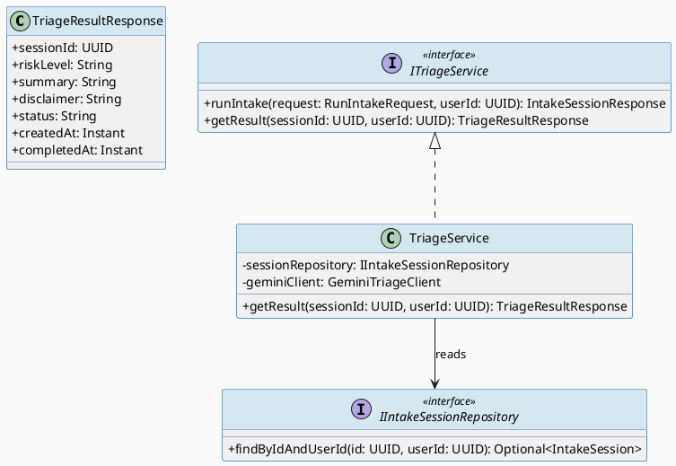
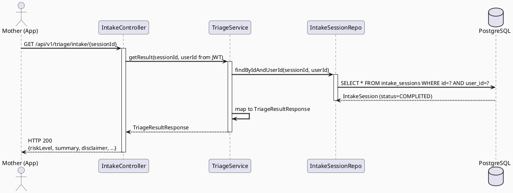
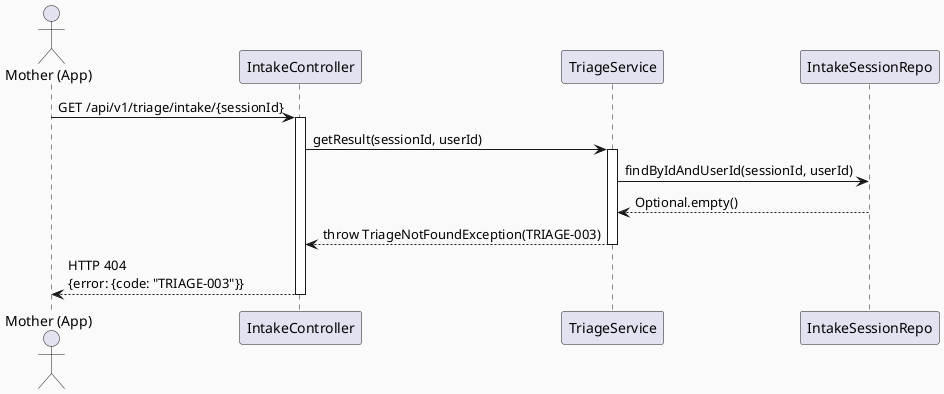

# ENGINEERING DOCUMENTATION STANDARD (EDS) v2.0
# UC61 — View Risk Triage Result

| Field | Value |
|-------|-------|
| **Document ID** | `CB-TRIAGE-IMP-002` |
| **Version** | `1.0` |
| **Date** | `2026-06-26` |
| **Status** | `Implemented` |
| **Document Owner** | `AI Agent` |
| **Author** | `AI Agent — Tech Lead` |
| **Reviewed by** | `[ ] Pending` |
| **DPO Sign-off** | `[ ] Pending` *(bắt buộc — module đọc PII: health risk data)* |
| **Approved by** | `[ ] Pending` |
| **Last Review** | `2026-06-26` |
| **Based on EDS** | `v2.0` |

---

## CHANGELOG

| Ngày | Người thực hiện | Nội dung thay đổi |
|------|-----------------|-------------------|
| 2026-06-26 | AI Agent — Tech Lead | Tạo tài liệu lần đầu — TDS cho UC61 View Risk Triage Result |

---

## MỤC LỤC

1. [Tổng quan Module](#1-tổng-quan-module)
2. [Ma trận Truy vết (Traceability Matrix)](#2-ma-trận-truy-vết-traceability-matrix)
3. [Architecture Decision Records (ADR)](#3-architecture-decision-records-adr)
4. [Non-Functional Requirements & SLA](#4-non-functional-requirements--sla)
5. [Static Modeling (Mô hình Tĩnh)](#5-static-modeling-mô-hình-tĩnh)
6. [Dynamic Modeling (Mô hình Động)](#6-dynamic-modeling-mô-hình-động)
7. [Domain Event Catalog](#7-domain-event-catalog)
8. [Interface Specification (Đặc tả Giao diện)](#8-interface-specification-đặc-tả-giao-diện)
9. [API Specification](#9-api-specification)
10. [Bảng mã lỗi (Error Codes)](#10-bảng-mã-lỗi-error-codes)
11. [Quy trình Triển khai (Step-by-Step)](#11-quy-trình-triển-khai-step-by-step)
12. [Rollback & Incident Runbook](#12-rollback--incident-runbook)
13. [Kịch bản Kiểm thử Chi tiết](#13-kịch-bản-kiểm-thử-chi-tiết)
14. [Phương pháp Xác minh](#14-phương-pháp-xác-minh)
15. [Mẫu thử thực tế (API Verification Samples)](#15-mẫu-thử-thực-tế-api-verification-samples)
16. [Bảng tổng hợp phân quyền (Authorization Matrix)](#16-bảng-tổng-hợp-phân-quyền-authorization-matrix)
17. [AI Prompt Constraints (CASE 2.0)](#17-ai-prompt-constraints-case-20)

---

## 1. Tổng quan Module

> UC61 cho phép người dùng (Mother) xem kết quả triage của phiên nhập liệu đã hoàn thành. Đây là use case **read-only** — hiển thị riskLevel (GREEN/YELLOW/RED), summary và disclaimer từ `intake_sessions`. Phụ thuộc vào UC60 đã tạo session.

| Field | Value |
|-------|-------|
| **Module Name** | `View Risk Triage Result` |
| **Bounded Context** | `triage` |
| **Data Classification** | `Sensitive-PII` *(health risk classification)* |
| **Compliance Scope** | `PDPA / Luật 91/2025` |
| **Upstream Dependencies** | `UC60 Run AI Symptom Intake (intake_sessions table), IAM (JWT auth)` |
| **Downstream Consumers** | `Mobile App UI (Flutter), Web App UI (React)` |

---

## 2. Ma trận Truy vết (Traceability Matrix)

| Requirement ID | Loại (BR/ADR/US) | Mô tả yêu cầu | Thành phần Code | Compliance Target | ADR liên quan |
|----------------|------------------|---------------|-----------------|-------------------|---------------|
| SRS-3.3.1.38 | User Story | Mother xem kết quả triage (riskLevel + summary + disclaimer) | `IntakeController.GET /triage/intake/{id}` | — | ADR-TRIAGE-003 |
| BR-AI-003 | Business Rule | Hiển thị đầy đủ disclaimer trong kết quả | `TriageResultResponse.disclaimer` | PDPA | — |
| BR-AI-004 | Business Rule | Chỉ owner của session được xem kết quả | `TriageService.getResult()` authorization | Luật 91/2025 | ADR-TRIAGE-003 |
| BR-TRIAGE-001 | Business Rule | Chỉ hiển thị session có status = COMPLETED | `TriageService.getResult()` | — | — |
| ADR-TRIAGE-003 | Decision | Read-only endpoint — không cần transaction, dùng @Transactional(readOnly=true) | `TriageService` | — | — |

---

## 3. Architecture Decision Records (ADR)

### ADR-TRIAGE-003 — Read-only endpoint với @Transactional(readOnly=true)

| Field | Value |
|-------|-------|
| **Status** | `Accepted` |
| **Deciders** | `AI Agent — Tech Lead` |
| **Date** | `2026-06-26` |
| **Supersedes** | `—` |

#### Bối cảnh (Context)
UC61 là read-only — chỉ đọc kết quả từ `intake_sessions`. Không cần write transaction, không cần lock.

#### Các phương án đã xem xét (Options Considered)

| Phương án | Mô tả | Ưu điểm | Nhược điểm |
|-----------|-------|----------|------------|
| A | @Transactional mặc định | Simple | Tốn tài nguyên không cần thiết |
| B | @Transactional(readOnly=true) | Performance tốt hơn, JPA optimization | Cần nhớ annotation |

#### Quyết định (Decision)
Chọn **Phương án B** — `@Transactional(readOnly=true)` trên service method; Hibernate có thể tối ưu flush mode.

#### Hệ quả (Consequences)

**Tích cực:**
- Performance tốt hơn cho read-heavy workload
- Rõ ràng ý định của code

**Tiêu cực / Trade-offs:**
- Không thể write trong cùng transaction (acceptable vì đây là read-only)

**Compliance Impact:**
- Không ảnh hưởng compliance; chỉ là optimization

---

## 4. Non-Functional Requirements & SLA

### 4.1. Performance & Availability

| Category | Requirement | Target SLA | Measurement Method | Compliance Basis |
|----------|-------------|------------|---------------------|------------------|
| Latency | API response (p99) | `< 300ms` | k6 load test | — |
| Availability | Uptime (monthly) | `99.9%` | Uptime monitor | — |
| Throughput | Concurrent requests | `200 req/s` | Load test | — |

### 4.2. Data Integrity & Retention

| Category | Requirement | Target | Verification Method | Compliance Basis |
|----------|-------------|--------|---------------------|------------------|
| Consistency | Read reflects latest COMPLETED status | 100% | Integration test | — |
| Retention | Không xóa dữ liệu đang hiển thị | Append-only | DB audit | PDPA |

### 4.3. Security

| Category | Requirement | Target | Verification Method | Compliance Basis |
|----------|-------------|--------|---------------------|------------------|
| Encryption in transit | All endpoints | TLS 1.3+ | SSL Labs scan | PDPA |
| Access control | Owner-only read | Least privilege | Auth Matrix (§16) | Luật 91/2025 |

### 4.4. Scalability & Capacity Planning

> Read-heavy endpoint. Scale: read replica DB + response caching (TTL 60s) khi phù hợp.

---

## 5. Static Modeling (Mô hình Tĩnh)

### 5.1. Class Diagram (PlantUML)



### 5.2. Data Structure (Flyway SQL Migration)

> **Không có migration mới cho UC61.** Sử dụng table `intake_sessions` đã tạo bởi V35 (UC60).

---

## 6. Dynamic Modeling (Mô hình Động)

### 6.1. Sequence Diagram — Happy Path (PlantUML)



### 6.2. Sequence Diagram — Error Path (PlantUML)



### 6.3. State Machine

> UC61 là read-only — không thay đổi trạng thái `intake_sessions`. State machine áp dụng từ UC60.

---

## 7. Domain Event Catalog

### 7.1. Events Published (Phát ra)

> UC61 không publish events — read-only operation.

| Event Name | Trigger | Publisher | Subscriber(s) | Payload Schema | Async? |
|------------|---------|-----------|---------------|----------------|--------|
| — | — | — | — | — | — |

### 7.2. Events Consumed (Tiêu thụ)

| Event Name | Source | Handler | Action thực hiện |
|------------|--------|---------|------------------|
| `IntakeSessionCompleted` | `UC60 TriageService` | — | Trigger cho client biết kết quả đã sẵn sàng để GET |

### 7.3. Payload Schema

> Không có domain event mới — UC61 chỉ đọc.

---

## 8. Interface Specification (Đặc tả Giao diện)

### 8.1. Service Interface

```java
// TriageResultResponse.java
// @version 1.0
public class TriageResultResponse {
    private UUID    sessionId;
    private String  riskLevel;    // GREEN / YELLOW / RED
    private String  summary;      // AI-generated summary
    private String  disclaimer;   // Bắt buộc (BR-AI-003)
    private String  status;       // COMPLETED
    private Instant createdAt;
    private Instant completedAt;
    // getters / setters
}

// ITriageService.java (bổ sung method getResult)
// @version 1.0
public interface ITriageService {
    IntakeSessionResponse runIntake(RunIntakeRequest request, UUID userId);

    /**
     * Get completed triage result for a specific session.
     * @throws TriageNotFoundException (TRIAGE-003) nếu sessionId không tồn tại hoặc không thuộc userId
     * @throws TriageSessionNotCompletedException (TRIAGE-006) nếu session chưa COMPLETED
     * @throws AccessDeniedException (TRIAGE-004) nếu không có ROLE_MOTHER
     */
    @Transactional(readOnly = true)
    TriageResultResponse getResult(UUID sessionId, UUID userId);
}
```

### 8.2. Repository Interface

```java
// IIntakeSessionRepository.java (không thay đổi từ UC60)
// @version 1.0
public interface IIntakeSessionRepository extends JpaRepository<IntakeSession, UUID> {
    Optional<IntakeSession> findByIdAndUserId(UUID id, UUID userId);
    List<IntakeSession> findByUserIdOrderByCreatedAtDesc(UUID userId);
}
```

---

## 9. API Specification

### 9.1. Endpoints Table

| Method | Path | Auth Level | Required Roles | Rate Limit | Idempotent? |
|--------|------|------------|----------------|------------|-------------|
| `GET` | `/api/v1/triage/intake/{sessionId}` | JWT Bearer | `ROLE_MOTHER` | 60/min | Yes |
| `GET` | `/api/v1/triage/intake` | JWT Bearer | `ROLE_MOTHER` | 30/min | Yes |

### 9.2. Request / Response Schemas

#### `GET /api/v1/triage/intake/{sessionId}` — Xem kết quả

**Response — 200 OK:**
```json
{
  "sessionId": "uuid-v4",
  "riskLevel": "GREEN",
  "summary": "Triệu chứng của bạn cho thấy mức rủi ro thấp. Tiếp tục theo dõi và nghỉ ngơi.",
  "disclaimer": "Kết quả này KHÔNG phải chẩn đoán y tế. Vui lòng tham khảo bác sĩ nếu triệu chứng nghiêm trọng.",
  "status": "COMPLETED",
  "createdAt": "2026-06-26T08:00:00.000Z",
  "completedAt": "2026-06-26T08:00:05.000Z"
}
```

**Response — 404 Not Found:**
```json
{
  "error": {
    "code": "TRIAGE-003",
    "message": "Triage session not found"
  }
}
```

**Response — 422 Unprocessable (session not COMPLETED):**
```json
{
  "error": {
    "code": "TRIAGE-006",
    "message": "Triage session is not completed yet"
  }
}
```

---

## 10. Bảng mã lỗi (Error Codes)

| Code | HTTP Status | Message (EN) | Message (VI) | Trigger Condition |
|------|-------------|--------------|--------------|-------------------|
| `TRIAGE-003` | 404 | Session not found | Không tìm thấy phiên triage | sessionId không tồn tại hoặc không thuộc user |
| `TRIAGE-004` | 403 | Insufficient permissions | Không đủ quyền | User không có ROLE_MOTHER |
| `TRIAGE-006` | 422 | Session not completed | Phiên chưa hoàn thành | Session đang PENDING hoặc PROCESSING hoặc FAILED |

---

## 11. Quy trình Triển khai (Step-by-Step)

### 11.1. Prerequisites

- [ ] UC60 đã được deploy (migration V35 đã chạy)
- [ ] `intake_sessions` table tồn tại với data
- [ ] ADR-TRIAGE-003 đã được Accepted

### 11.2. Pre-Migration Checklist

> **Không có migration mới.** UC61 chỉ thêm read endpoint trên infrastructure đã có.

- [ ] Verify V35 migration đã applied: `SELECT * FROM flyway_schema_history WHERE version = '35';`

### 11.3. Implementation Steps

#### Chặng 1 — Thêm getResult() vào TriageService

```java
// Thêm method getResult() trong TriageService.java
// @Transactional(readOnly = true)
```

#### Chặng 2 — Thêm GET endpoint vào IntakeController

```java
// @GetMapping("/{sessionId}")
// public ResponseEntity<TriageResultResponse> getResult(@PathVariable UUID sessionId, ...)
```

#### Chặng 3 — Verification sau deploy

```bash
curl -X GET https://$HOST/api/v1/triage/intake/$SESSION_ID \
  -H "Authorization: Bearer $MOTHER_JWT"
# Expected: 200 với riskLevel
```

### 11.4. Deployment Checklist

- [ ] GET endpoint trả về 200 cho session COMPLETED
- [ ] GET endpoint trả về 404 cho sessionId không tồn tại
- [ ] disclaimer luôn có trong response

---

## 12. Rollback & Incident Runbook

### 12.1. Điều kiện kích hoạt Rollback

| Điều kiện | Ngưỡng | Người quyết định |
|-----------|--------|------------------|
| Error rate tăng đột biến | > 5% trong 5 phút | On-call Engineer |
| Latency p99 vượt ngưỡng | > 2x baseline (> 600ms) | On-call Engineer |
| Risk data bị expose sai user | Bất kỳ case nào | Tech Lead + DPO |

### 12.2. Rollback Procedure

```bash
# Không có migration để rollback — chỉ revert code
kubectl rollout undo deployment/carebridge-api
kubectl rollout status deployment/carebridge-api
curl -X GET https://$HOST/api/v1/health
```

### 12.3. Notification Protocol

| Thời điểm | Người nhận | Kênh | Template |
|-----------|------------|------|----------|
| Ngay khi phát hiện | On-call team | Slack `#incident` | "🚨 TRIAGE-READ incident: [mô tả]" |
| Trong 30 phút | DPO | Email | Bắt buộc nếu risk data bị expose sai user |

### 12.4. Post-Incident Review (PIR)

- **Timeline:** Diễn biến từng bước
- **Root Cause:** 5 Whys
- **Impact:** Số users, PII exposure?
- **Remediation:** Các bước khắc phục
- **Prevention:** Action items

---

## 13. Kịch bản Kiểm thử Chi tiết

### 13.1. Unit Tests

#### TC-UNIT-001 — Lấy kết quả triage COMPLETED thành công

```gherkin
Feature: View Risk Triage Result
  Background:
    Given test data classification: SYNTHETIC
    And user với role ROLE_MOTHER đã xác thực
    And tồn tại intake session với status = COMPLETED, riskLevel = "GREEN"

  Scenario: Happy path — xem kết quả COMPLETED
    When GET /api/v1/triage/intake/{sessionId} được gọi
    Then response status là 200
    And response body chứa riskLevel = "GREEN"
    And response body chứa disclaimer không rỗng
    And response body chứa status = "COMPLETED"

  Scenario: Session không tồn tại hoặc không thuộc user
    Given sessionId không tồn tại trong DB
    When GET /api/v1/triage/intake/{sessionId} được gọi
    Then response status là 404
    And error.code = "TRIAGE-003"

  Scenario: Session chưa COMPLETED (đang PROCESSING)
    Given session có status = "PROCESSING"
    When GET /api/v1/triage/intake/{sessionId} được gọi
    Then response status là 422
    And error.code = "TRIAGE-006"
```

**Hàm được test:** `TriageService.getResult()`
**Invariant kiểm tra:** User chỉ thấy session của chính mình; disclaimer luôn có trong response

### 13.2. Integration Tests

#### TC-INT-001 — Read từ DB thực

```gherkin
  Scenario: Đọc kết quả từ Testcontainers PostgreSQL
    Given test data classification: SYNTHETIC
    And intake_sessions table chứa record COMPLETED với riskLevel = "YELLOW"
    When GET /api/v1/triage/intake/{sessionId} được gọi với JWT đúng user
    Then response 200
    And riskLevel = "YELLOW"
    And completedAt không null
```

### 13.3. E2E / Security Tests

#### TC-E2E-001 — Không được xem session của người khác

```gherkin
  Scenario: Cross-user access bị từ chối
    Given test data classification: SYNTHETIC
    And tồn tại session thuộc userA
    And userB đã đăng nhập với ROLE_MOTHER
    When GET /api/v1/triage/intake/{sessionId của userA} được gọi với JWT của userB
    Then response status là 404
    And KHÔNG trả về data của userA
```

---

## 14. Phương pháp Xác minh

### 14.1. Database Inspection

```sql
-- Verify session data
SELECT id, risk_level, status, disclaimer, completed_at
FROM intake_sessions
WHERE id = '[uuid]' AND user_id = '[user_uuid]';

-- Verify cross-user isolation
SELECT count(*) FROM intake_sessions
WHERE id = '[uuid]' AND user_id != '[expected_user_uuid]';
-- Expected: 0
```

### 14.2. Log / Audit Verification

```bash
# Verify GET request logging không expose health data
kubectl logs -l app=carebridge-api | grep "GET.*triage/intake" | head -5
# Phải không chứa riskLevel, summary, symptom text trong log
```

### 14.3. Tool-based Verification

```bash
# Test GET endpoint
curl -X GET https://$HOST/api/v1/triage/intake/$SESSION_ID \
  -H "Authorization: Bearer $MOTHER_JWT" | jq '.riskLevel'
# Expected: "GREEN" hoặc "YELLOW" hoặc "RED"
```

---

## 15. Mẫu thử thực tế (API Verification Samples)

### 15.1. Happy Path

```bash
# GET — Xem kết quả triage
curl -X GET https://$HOST/api/v1/triage/intake/$SESSION_ID \
  -H "Authorization: Bearer $MOTHER_JWT" \
  -H "X-Correlation-Id: $(uuidgen)"
```

**Expected (200):**
```json
{
  "sessionId": "550e8400-e29b-41d4-a716-446655440000",
  "riskLevel": "GREEN",
  "summary": "Triệu chứng mức thấp. Theo dõi và nghỉ ngơi.",
  "disclaimer": "Kết quả này KHÔNG phải chẩn đoán y tế.",
  "status": "COMPLETED",
  "createdAt": "2026-06-26T08:00:00.000Z",
  "completedAt": "2026-06-26T08:00:05.000Z"
}
```

### 15.2. Error Paths

```bash
# Session không tồn tại → 404
curl -X GET https://$HOST/api/v1/triage/intake/non-existent-uuid \
  -H "Authorization: Bearer $MOTHER_JWT"
```

**Expected (404):**
```json
{ "error": { "code": "TRIAGE-003", "message": "Triage session not found" } }
```

---

## 16. Bảng tổng hợp phân quyền (Authorization Matrix)

| Endpoint | `GUEST` | `ROLE_MOTHER` | `ROLE_PARTNER` | `ROLE_EXPERT` | `ROLE_ADMIN` |
|----------|---------|---------------|----------------|---------------|--------------|
| `GET /api/v1/triage/intake/{id}` | ❌ | ✅ Own | ❌ | ❌ | ✅ All |
| `GET /api/v1/triage/intake` | ❌ | ✅ Own list | ❌ | ❌ | ✅ All |

**Chú thích:**
- ✅ = Được phép | ❌ = Bị từ chối (403) | `Own` = Chỉ session của chính mình

---

## 17. AI Prompt Constraints (CASE 2.0)

### 17.1 Constraint Summary Table

| # | Constraint | Source (ADR/BR) | Last Verified |
|---|-----------|-----------------|---------------|
| C1 | getResult() chỉ trả data của session thuộc chính userId trong JWT | `BR-AI-004` | `2026-06-26` |
| C2 | disclaimer PHẢI có trong response — không được null hoặc rỗng | `BR-AI-003` | `2026-06-26` |
| C3 | Chỉ trả session có status = COMPLETED — FAILED/PROCESSING trả TRIAGE-006 | `BR-TRIAGE-001` | `2026-06-26` |
| C4 | @Transactional(readOnly=true) trên getResult() | `ADR-TRIAGE-003` | `2026-06-26` |
| C5 | userId từ JWT SecurityContext — không từ path param hoặc body | `ADR-TRIAGE-002` | `2026-06-26` |

### 17.2 Constraint Injection Block (Copy-Paste vào AI Prompt)

```
[CONSTRAINT BLOCK — Module: View Risk Triage Result — CB-TRIAGE-IMP-002]
Theo TDS CB-TRIAGE-IMP-002 và các ADR liên quan:

1. getResult() chỉ trả data thuộc userId từ JWT — KHÔNG trả data của user khác (BR-AI-004)
2. disclaimer PHẢI có trong mọi successful response (BR-AI-003)
3. Chỉ trả session COMPLETED — PENDING/PROCESSING/FAILED → TRIAGE-006 (BR-TRIAGE-001)
4. @Transactional(readOnly=true) trên service method (ADR-TRIAGE-003)
5. userId từ JWT SecurityContext — KHÔNG từ path param (ADR-TRIAGE-002)

[CONTEXT BLOCK]
- Bounded Context: triage (read-only)
- Data Classification: Sensitive-PII (health risk classification)
- Compliance: PDPA / Luật 91/2025
- Existing interfaces: §8 Service Interface + §8.2 Repository Interface
- Error codes: §10 Error Codes Table
- Auth matrix: §16 Authorization Matrix

[TASK BLOCK]
Implement TriageService.getResult() thỏa mãn constraints trên.
Output phải tuân thủ §8 Interface Specification.
Tests phải cover §13 Test Scenarios.
```

### 17.3 Constraint Quality Checklist

- [x] Mỗi constraint traceable về ADR hoặc BR cụ thể
- [x] Không có constraint generic
- [x] Mỗi constraint có `Last Verified` date ≤ 2 sprints
- [x] Constraint block có ≥ 3 constraints cụ thể (có 5)
- [x] Constraint block reference §8 Interface
- [x] Constraint block reference §16 Auth Matrix

### 17.4 Anti-Pattern Detection

| AP-ID | Anti-Pattern | Dấu hiệu | Hành động |
|-------|-------------|-----------|----------|
| AP-AI-001 | Unconstrained Gen | Code không check userId ownership | Reject — enforce BR-AI-004 |
| AP-AI-003 | Implicit Decision | Code trả FAILED session mà không throw TRIAGE-006 | Reject — enforce BR-TRIAGE-001 |
| AP-AI-005 | Hallucinated Contract | Code import TriageResultRepository không có trong §8 | Reject — verify contract |

---

## PHỤ LỤC

### A. Glossary

| Thuật ngữ | Định nghĩa |
|-----------|------------|
| Risk Level | GREEN (thấp), YELLOW (trung bình), RED (cao — cần bác sĩ ngay) |
| Triage Result | Kết quả phân loại rủi ro từ phiên UC60 |
| Owner-only | Chỉ người tạo session mới được xem kết quả của session đó |

### B. Tài liệu tham chiếu

| Document | Link / Path |
|----------|-------------|
| SRS UC-61 | `02_Requirements/SRS/Functional_Specifications.md §3.3.1.38` |
| UC60 TDS | `04_Implement/UC60_RunAISymptomIntake/UC60_RunAISymptomIntake_TDS.md` |
| EDS v2.0 Template | `08_References/Template/PHASE-3_TDS.md` |
