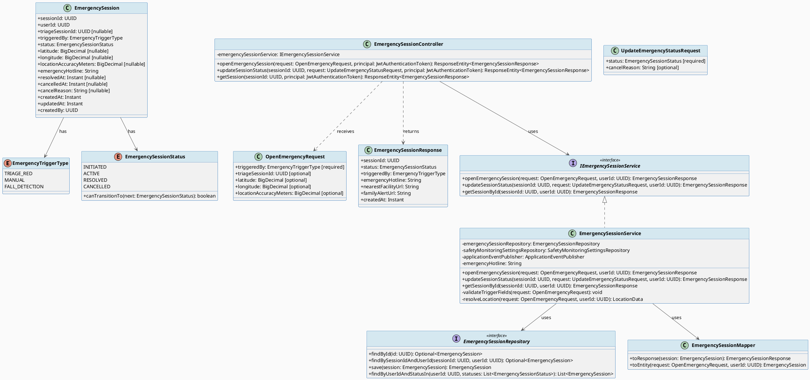
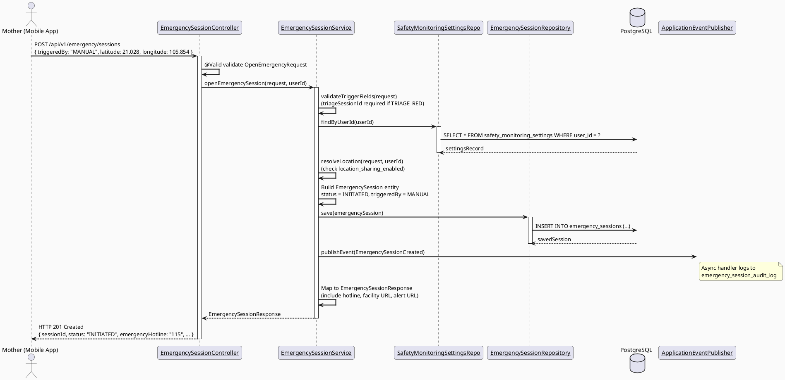
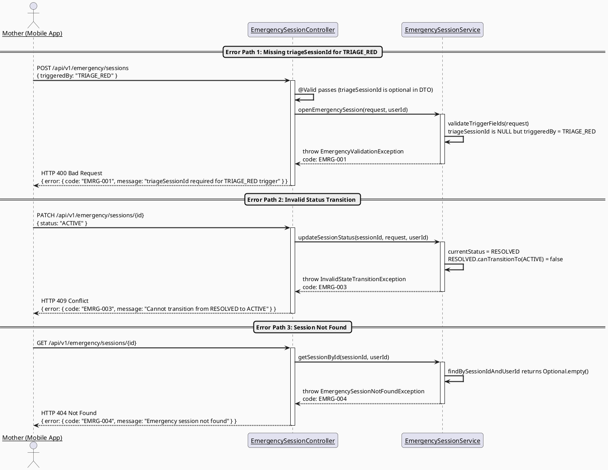
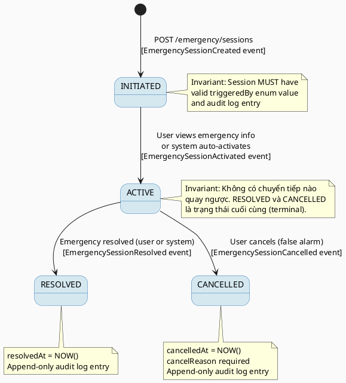

# ENGINEERING DOCUMENTATION STANDARD (EDS) v2.0
# Technical Design Specification — UC-62 Open Emergency Flow

| Field              | Value                                          |
|--------------------|------------------------------------------------|
| **Document ID**    | `CB-EMERG-IMP-001`                             |
| **Version**        | `1.0`                                          |
| **Date**           | `2026-06-26`                                   |
| **Status**         | `Draft`                                        |
| **Document Owner** | `PhuongNT`                                     |
| **Author**         | `AI Agent`                                     |
| **Reviewed by**    | `[Tech Lead]`                                  |
| **DPO Sign-off**   | `[ ] Pending` *(bắt buộc — module PII)*        |
| **Approved by**    | `[Principal Architect]`                        |
| **Last Review**    | `2026-06-26`                                   |
| **Based on EDS**   | `v2.0`                                         |

> **PRIORITY:** CRITICAL — Emergency flow involves user safety. This module requires Principal Architect and DPO sign-off before implementation.

---

## CHANGELOG

| Ngày       | Người thực hiện | Nội dung thay đổi                                        |
|------------|-----------------|----------------------------------------------------------|
| 2026-06-26 | AI Agent        | Tạo tài liệu lần đầu cho UC-62 Open Emergency Flow      |

---

## MỤC LỤC

1. [Tổng quan Module](#1-tổng-quan-module)
2. [Ma trận Truy vết](#2-ma-trận-truy-vết-traceability-matrix)
3. [Architecture Decision Records (ADR)](#3-architecture-decision-records-adr)
4. [Non-Functional Requirements & SLA](#4-non-functional-requirements--sla)
5. [Static Modeling](#5-static-modeling-mô-hình-tĩnh)
6. [Dynamic Modeling](#6-dynamic-modeling-mô-hình-động)
7. [Domain Event Catalog](#7-domain-event-catalog)
8. [Interface Specification](#8-interface-specification-đặc-tả-giao-diện)
9. [API Specification](#9-api-specification)
10. [Bảng mã lỗi](#10-bảng-mã-lỗi-error-codes)
11. [Quy trình Triển khai](#11-quy-trình-triển-khai-step-by-step)
12. [Rollback & Incident Runbook](#12-rollback--incident-runbook)
13. [Kịch bản Kiểm thử Chi tiết](#13-kịch-bản-kiểm-thử-chi-tiết)
14. [Phương pháp Xác minh](#14-phương-pháp-xác-minh)
15. [Mẫu thử thực tế](#15-mẫu-thử-thực-tế-api-verification-samples)
16. [Bảng tổng hợp phân quyền](#16-bảng-tổng-hợp-phân-quyền-authorization-matrix)
17. [AI Prompt Constraints (CASE 2.0)](#17-ai-prompt-constraints-case-20)

---

## 1. Tổng quan Module

| Field                     | Value                                                                                                       |
|---------------------------|-------------------------------------------------------------------------------------------------------------|
| **Module Name**           | `OpenEmergencyFlow`                                                                                         |
| **Bounded Context**       | `emergency`                                                                                                 |
| **UC ID**                 | `UC-62`                                                                                                     |
| **SRS Reference**         | `3.3.1.39`                                                                                                  |
| **Primary Actor**         | `Mother (ROLE_MOTHER)`                                                                                      |
| **Secondary Actors**      | `Triage Service (UC-61), Fall Detection Sensor, Location Service`                                           |
| **Platform**              | `Mobile App (Flutter) + Backend API (Spring Boot)`                                                          |
| **Data Classification**   | `Sensitive-PII` (location coordinates, user identity in emergency context)                                  |
| **Compliance Scope**      | `BR-RBAC, BR-PRIVACY, BR-SAFETY`                                                                           |
| **Upstream Dependencies** | `identity (User, JWT), triage (TriageSession UC-61), location (LocationSnapshot), safety (SafetyEvent)`     |
| **Downstream Consumers**  | `emergency.sendFamilyAlert (UC-65), emergency.findNearestFacility (UC-63), audit (AuditLog), notification`  |

**Mô tả:** Khi hệ thống triage trả về kết quả RED (UC-61), hoặc cảm biến phát hiện ngã (fall detection), hoặc người dùng bấm nút khẩn cấp thủ công, module này khởi tạo một phiên khẩn cấp (`emergency_sessions`). Phiên khẩn cấp ghi nhận nguồn kích hoạt (TRIAGE_RED / MANUAL / FALL_DETECTION), vị trí GPS (nếu người dùng đã đồng ý chia sẻ), và liên kết đến triageSessionId (nếu có). Phiên khẩn cấp đi qua các trạng thái: INITIATED -> ACTIVE -> RESOLVED / CANCELLED. Giao diện hiển thị: số hotline khẩn cấp, link tìm cơ sở y tế gần nhất (UC-63), nút gửi cảnh báo gia đình (UC-65). SLA phản hồi < 200ms. Mọi hành động trong phiên khẩn cấp được ghi audit log append-only.

---

## 2. Ma trận Truy vết (Traceability Matrix)

| Requirement ID   | Loại          | Mô tả yêu cầu                                                              | Thành phần Code                                              | Compliance Target | ADR liên quan   |
|------------------|---------------|-----------------------------------------------------------------------------|--------------------------------------------------------------|-------------------|-----------------|
| UC-62            | Use Case      | Mở luồng hỗ trợ khẩn cấp khi phát hiện red flag hoặc người dùng bấm thủ công | `EmergencySessionService.openEmergencySession()`             | BR-SAFETY         | ADR-EMRG-001    |
| BR-EMRG-001      | Business Rule | Phiên KK được trigger bởi TRIAGE_RED, MANUAL, hoặc FALL_DETECTION          | `EmergencyTriggerType` enum                                  | BR-SAFETY         | ADR-EMRG-001    |
| BR-EMRG-002      | Business Rule | Tạo record `emergency_sessions` với status INITIATED                        | `EmergencySessionRepository.save()`                          | BR-SAFETY         | ADR-EMRG-002    |
| BR-EMRG-003      | Business Rule | Ghi nhận triageSessionId (optional), triggeredBy, location (if consented)   | `OpenEmergencyRequest` DTO                                   | BR-PRIVACY        | ADR-EMRG-003    |
| BR-EMRG-004      | Business Rule | Trạng thái: INITIATED -> ACTIVE -> RESOLVED / CANCELLED                    | `EmergencySessionStatus` enum + state machine                | BR-SAFETY         | ADR-EMRG-002    |
| BR-EMRG-005      | Business Rule | Hiển thị hotline, nearest facility link (UC-63), family alert button (UC-65)| `EmergencySessionResponse` DTO                               | BR-SAFETY         | —               |
| BR-EMRG-006      | Business Rule | Không có authentication wall cho emergency, nhưng cần JWT cho audit         | `SecurityConfig` + Controller                                | BR-RBAC           | ADR-EMRG-004    |
| BR-EMRG-007      | Business Rule | SLA response time < 200ms (critical path)                                  | Performance tuning, DB indexing                              | BR-SAFETY         | ADR-EMRG-005    |
| BR-EMRG-008      | Business Rule | Mọi emergency action ghi append-only audit log                             | `EmergencyAuditService.logAction()`                          | BR-PRIVACY        | ADR-EMRG-003    |
| BR-EMRG-009      | Business Rule | Location chỉ lưu khi user đã đồng ý (location consent)                    | `SafetyMonitoringSettings.location_sharing_enabled`          | BR-PRIVACY        | ADR-EMRG-003    |

---

## 3. Architecture Decision Records (ADR)

### ADR-EMRG-001 — Emergency Trigger Strategy

| Field       | Value                        |
|-------------|------------------------------|
| **Status**  | `Accepted`                   |
| **Deciders**| `PhuongNT, Tech Lead, DPO`   |
| **Date**    | `2026-06-26`                 |

#### Bối cảnh (Context)
Emergency flow có thể được kích hoạt từ nhiều nguồn khác nhau: kết quả triage RED (UC-61), cảm biến phát hiện ngã (fall detection), hoặc người dùng bấm nút SOS thủ công. Cần thiết kế một entry point thống nhất xử lý mọi trigger source mà vẫn ghi nhận được nguồn kích hoạt cho mục đích audit và analytics.

#### Các phương án đã xem xét (Options Considered)

| Phương án | Mô tả                                              | Ưu điểm                                   | Nhược điểm                                   |
|-----------|-----------------------------------------------------|--------------------------------------------|-----------------------------------------------|
| A         | Mỗi trigger source có API endpoint riêng            | + Tách biệt rõ ràng logic từng source      | - Duplicate code, khó maintain                |
| B         | Một API endpoint duy nhất với `triggeredBy` enum    | + DRY, dễ mở rộng thêm trigger source      | - Controller phải validate enum phức tạp hơn  |

#### Quyết định (Decision)
Chọn **Phương án B** — Một endpoint `POST /api/v1/emergency/sessions` nhận `triggeredBy` enum (`TRIAGE_RED`, `MANUAL`, `FALL_DETECTION`). Service layer xử lý logic chung (tạo session, audit log, location capture) và logic riêng theo trigger type (vd: link `triageSessionId` nếu `TRIAGE_RED`).

#### Hệ quả (Consequences)

**Tích cực:**
- Dễ mở rộng thêm trigger type mới (vd: PANIC_BUTTON, VOICE_COMMAND) chỉ cần thêm enum value
- Single entry point cho monitoring và alerting

**Tiêu cực / Trade-offs:**
- Cần validation logic trong service để xử lý optional fields theo trigger type (vd: `triageSessionId` chỉ bắt buộc khi `triggeredBy = TRIAGE_RED`)

**Compliance Impact:**
- BR-SAFETY: Mọi trigger đều được ghi nhận trong audit log, đảm bảo traceability

---

### ADR-EMRG-002 — Emergency Session State Machine

| Field       | Value                        |
|-------------|------------------------------|
| **Status**  | `Accepted`                   |
| **Deciders**| `PhuongNT, Tech Lead`        |
| **Date**    | `2026-06-26`                 |

#### Bối cảnh (Context)
Emergency session cần theo dõi trạng thái từ lúc được khởi tạo đến khi kết thúc. Cần đảm bảo chuyển trạng thái hợp lệ, không cho phép quay ngược (vd: RESOLVED không thể quay lại ACTIVE).

#### Các phương án đã xem xét (Options Considered)

| Phương án | Mô tả                                  | Ưu điểm                                  | Nhược điểm                                   |
|-----------|-----------------------------------------|-------------------------------------------|-----------------------------------------------|
| A         | Simple status column, validate in code  | + Đơn giản, không cần state machine lib   | - Logic chuyển trạng thái nằm rải rác         |
| B         | State Machine pattern trong domain      | + Invariant rõ ràng, tập trung logic      | - Phức tạp hơn                                |

#### Quyết định (Decision)
Chọn **Phương án B** — Enum `EmergencySessionStatus` chứa method `canTransitionTo(nextStatus)` để enforce valid transitions. State transitions: INITIATED -> ACTIVE, ACTIVE -> RESOLVED, ACTIVE -> CANCELLED. Không có transition quay ngược.

#### Hệ quả (Consequences)

**Tích cực:**
- Invariant bất biến được kiểm tra tại domain level, không phụ thuộc vào caller
- Dễ test state transitions

**Tiêu cực / Trade-offs:**
- Cần tạo thêm domain enum method thay vì chỉ dùng String

---

### ADR-EMRG-003 — Append-Only Audit + Location Consent

| Field       | Value                        |
|-------------|------------------------------|
| **Status**  | `Accepted`                   |
| **Deciders**| `PhuongNT, DPO`              |
| **Date**    | `2026-06-26`                 |

#### Bối cảnh (Context)
Emergency events chứa Sensitive-PII (location, user identity). Cần đảm bảo: (1) mọi action được ghi audit log append-only, (2) location chỉ được lưu khi user đã consent, (3) audit records không bao giờ bị xóa hay sửa.

#### Quyết định (Decision)
- Audit log ghi vào bảng riêng `emergency_session_audit_log` (append-only, no UPDATE/DELETE)
- Location lấy từ `location_snapshots` chỉ khi `safety_monitoring_settings.location_sharing_enabled = true`
- Nếu user chưa consent location -> session vẫn tạo thành công nhưng `latitude/longitude = NULL`

#### Hệ quả (Consequences)

**Compliance Impact:**
- BR-PRIVACY: Location PII chỉ lưu khi có consent, đảm bảo tuân thủ privacy policy
- BR-SAFETY: Append-only audit log đảm bảo integrity cho investigation

---

### ADR-EMRG-004 — JWT Required but No Authentication Wall

| Field       | Value                        |
|-------------|------------------------------|
| **Status**  | `Accepted`                   |
| **Deciders**| `PhuongNT, Tech Lead`        |
| **Date**    | `2026-06-26`                 |

#### Bối cảnh (Context)
Emergency flow cần phản hồi nhanh nhất có thể. Không nên bắt user phải login lại nếu token đã expired. Tuy nhiên, cần JWT để xác định userId cho audit trail.

#### Quyết định (Decision)
- Emergency endpoint chấp nhận JWT nhưng không block khi token sắp hết hạn (grace period). Nếu user đã authenticated (JWT hợp lệ), ghi userId vào session. Nếu JWT expired nhưng vẫn decode được -> vẫn tạo session với userId từ expired token, flag `tokenExpired = true` trong audit. Nếu không có JWT -> reject (401) vì không thể audit.

#### Hệ quả (Consequences)

**Tích cực:**
- User không bị chặn bởi token expiration trong tình huống khẩn cấp
- Vẫn duy trì audit trail thông qua JWT payload

**Tiêu cực / Trade-offs:**
- Cần custom security filter cho emergency endpoints

---

### ADR-EMRG-005 — Response Time SLA < 200ms

| Field       | Value                        |
|-------------|------------------------------|
| **Status**  | `Accepted`                   |
| **Deciders**| `PhuongNT, Tech Lead`        |
| **Date**    | `2026-06-26`                 |

#### Bối cảnh (Context)
Emergency response time là critical cho user safety. Target SLA p99 < 200ms.

#### Quyết định (Decision)
- DB query tối ưu: index trên `user_id`, `status`
- Audit log ghi asynchronous (via `@Async` hoặc event-based) để không block critical path
- Location lookup là synchronous nhưng có timeout 100ms — nếu location service chậm, tạo session không có location
- Không thực hiện bất kỳ external API call nào trong synchronous path (FCM, external services đều deferred)

#### Hệ quả (Consequences)

**Tích cực:**
- Critical path chỉ gồm: validate -> insert -> return, đảm bảo < 200ms
- Audit log và notification xử lý async, không ảnh hưởng UX

---

## 4. Non-Functional Requirements & SLA

### 4.1. Performance & Availability

| Category    | Requirement                | Target SLA  | Measurement Method   | Compliance Basis |
|-------------|----------------------------|-------------|----------------------|------------------|
| Latency     | API response (p99)         | `< 200ms`   | k6 load test         | BR-SAFETY        |
| Latency     | Session creation (p50)     | `< 100ms`   | APM tracing          | BR-SAFETY        |
| Availability| Emergency endpoint uptime  | `99.95%`    | Uptime monitor       | BR-SAFETY        |
| Throughput  | Concurrent session creates | `200 req/s`  | k6 load test         | —                |

### 4.2. Data Integrity & Retention

| Category    | Requirement                     | Target    | Verification Method   | Compliance Basis |
|-------------|----------------------------------|-----------|-----------------------|------------------|
| Durability  | Zero session record loss         | RPO = 0   | Transaction log       | BR-SAFETY        |
| Retention   | Emergency session retention      | 7 years   | DB backup policy      | BR-PRIVACY       |
| Retention   | Audit log retention              | 7 years   | DB backup policy      | BR-PRIVACY       |
| Consistency | Session status <-> audit sync    | 100%      | Reconciliation job    | BR-SAFETY        |

### 4.3. Security

| Category             | Requirement     | Target          | Verification Method | Compliance Basis |
|----------------------|-----------------|-----------------|---------------------|------------------|
| Encryption at rest   | PII fields      | AES-256         | DB encryption check | BR-PRIVACY       |
| Encryption in transit| All endpoints   | TLS 1.3+        | SSL Labs scan       | BR-PRIVACY       |
| Access control       | Role-based      | Least privilege | Auth Matrix (§16)   | BR-RBAC          |
| Input validation     | All inputs      | Sanitized       | OWASP test suite    | BR-SAFETY        |

### 4.4. Scalability & Capacity Planning

> Dự kiến tải trong 12 tháng tới: 50,000 mothers, ~100 emergency sessions/day (worst case). Giải pháp: vertical scaling cho DB, connection pooling (HikariCP), async audit logging để giảm write contention.

---

## 5. Static Modeling (Mô hình Tĩnh)

### 5.1. Class Diagram (PlantUML)



### 5.2. Data Structure (Flyway SQL Migration)

Tạo file: `src/main/resources/db/migration/V37__create_emergency_sessions.sql`

```sql
-- === EMERGENCY SESSION SCHEMA ===
-- UC-62: Open Emergency Flow
-- Creates emergency_sessions table for tracking emergency support sessions
-- and emergency_session_audit_log for append-only action logging

CREATE TABLE public.emergency_sessions (
    session_id              UUID          PRIMARY KEY DEFAULT gen_random_uuid(),
    user_id                 UUID          NOT NULL,                -- Mother who triggered emergency
    triage_session_id       UUID,                                  -- Link to triage session (UC-61), NULL if MANUAL/FALL_DETECTION
    triggered_by            VARCHAR(30)   NOT NULL,                -- TRIAGE_RED | MANUAL | FALL_DETECTION
    status                  VARCHAR(20)   NOT NULL DEFAULT 'INITIATED', -- INITIATED | ACTIVE | RESOLVED | CANCELLED
    latitude                NUMERIC,                               -- GPS latitude (NULL if no location consent)
    longitude               NUMERIC,                               -- GPS longitude (NULL if no location consent)
    location_accuracy_meters NUMERIC,                              -- GPS accuracy in meters
    emergency_hotline       VARCHAR(30)   NOT NULL DEFAULT '115',  -- Emergency hotline number
    resolved_at             TIMESTAMPTZ,                           -- When session was resolved
    cancelled_at            TIMESTAMPTZ,                           -- When session was cancelled
    cancel_reason           VARCHAR(500),                          -- Reason for cancellation
    created_at              TIMESTAMPTZ   NOT NULL DEFAULT NOW(),
    updated_at              TIMESTAMPTZ   NOT NULL DEFAULT NOW(),
    created_by              UUID          NOT NULL,                -- userId who created (same as user_id normally)

    CONSTRAINT fk_emerg_session_user FOREIGN KEY (user_id) REFERENCES public.users(user_id),
    CONSTRAINT fk_emerg_session_created_by FOREIGN KEY (created_by) REFERENCES public.users(user_id),
    CONSTRAINT chk_emerg_triggered_by CHECK (triggered_by IN ('TRIAGE_RED', 'MANUAL', 'FALL_DETECTION')),
    CONSTRAINT chk_emerg_status CHECK (status IN ('INITIATED', 'ACTIVE', 'RESOLVED', 'CANCELLED'))
);

-- Performance indexes for SLA < 200ms
CREATE INDEX idx_emerg_sessions_user_id ON public.emergency_sessions(user_id);
CREATE INDEX idx_emerg_sessions_status ON public.emergency_sessions(status);
CREATE INDEX idx_emerg_sessions_user_status ON public.emergency_sessions(user_id, status);
CREATE INDEX idx_emerg_sessions_created_at ON public.emergency_sessions(created_at DESC);

-- Append-only audit log for emergency actions
CREATE TABLE public.emergency_session_audit_log (
    audit_id                UUID          PRIMARY KEY DEFAULT gen_random_uuid(),
    session_id              UUID          NOT NULL,
    action                  VARCHAR(50)   NOT NULL,                -- SESSION_CREATED | STATUS_CHANGED | LOCATION_CAPTURED | etc.
    old_status              VARCHAR(20),                           -- Previous status (NULL for creation)
    new_status              VARCHAR(20),                           -- New status
    actor_user_id           UUID          NOT NULL,                -- Who performed the action
    token_expired           BOOLEAN       NOT NULL DEFAULT FALSE,  -- Was JWT expired at time of action?
    metadata_json           JSONB,                                 -- Additional context
    occurred_at             TIMESTAMPTZ   NOT NULL DEFAULT NOW(),

    CONSTRAINT fk_emerg_audit_session FOREIGN KEY (session_id) REFERENCES public.emergency_sessions(session_id),
    CONSTRAINT fk_emerg_audit_actor FOREIGN KEY (actor_user_id) REFERENCES public.users(user_id)
);

CREATE INDEX idx_emerg_audit_session_id ON public.emergency_session_audit_log(session_id);
CREATE INDEX idx_emerg_audit_occurred_at ON public.emergency_session_audit_log(occurred_at DESC);

-- IMPORTANT: No UPDATE or DELETE operations allowed on emergency_session_audit_log
-- This is enforced at application layer (no update/delete repository methods)
```

---

## 6. Dynamic Modeling (Mô hình Động)

### 6.1. Sequence Diagram — Happy Path (PlantUML)



### 6.2. Sequence Diagram — Error Path (PlantUML)



### 6.3. State Machine



> **Invariant bất biến:**
> 1. Không có transition quay ngược (RESOLVED/CANCELLED -> bất kỳ trạng thái nào)
> 2. INITIATED chỉ có thể chuyển sang ACTIVE
> 3. CANCELLED bắt buộc phải có `cancelReason`
> 4. Mỗi transition tạo một audit log entry mới (append-only)

---

## 7. Domain Event Catalog

### 7.1. Events Published (Phát ra)

| Event Name                    | Trigger                                | Publisher                    | Subscriber(s)                                | Payload Schema                     | Async? |
|-------------------------------|----------------------------------------|------------------------------|----------------------------------------------|------------------------------------|--------|
| `EmergencySessionCreated`     | Session tạo thành công                 | `EmergencySessionService`    | `EmergencyAuditHandler, NotificationService` | `EmergencySessionCreated.java`     | Yes    |
| `EmergencySessionActivated`   | Session chuyển sang ACTIVE             | `EmergencySessionService`    | `EmergencyAuditHandler`                      | `EmergencySessionActivated.java`   | Yes    |
| `EmergencySessionResolved`    | Session chuyển sang RESOLVED           | `EmergencySessionService`    | `EmergencyAuditHandler`                      | `EmergencySessionResolved.java`    | Yes    |
| `EmergencySessionCancelled`   | Session chuyển sang CANCELLED          | `EmergencySessionService`    | `EmergencyAuditHandler`                      | `EmergencySessionCancelled.java`   | Yes    |

### 7.2. Events Consumed (Tiêu thụ)

| Event Name           | Source            | Handler                      | Action thực hiện                                   |
|----------------------|-------------------|------------------------------|----------------------------------------------------|
| `TriageRedDetected`  | `TriageService`   | `EmergencyTriggerHandler`    | Auto-create emergency session with TRIAGE_RED      |
| `FallDetected`       | `SafetyService`   | `EmergencyTriggerHandler`    | Auto-create emergency session with FALL_DETECTION  |

### 7.3. Payload Schema

```java
// EmergencySessionCreated.java
public record EmergencySessionCreated(
    UUID    eventId,          // UUID.randomUUID()
    String  eventType,        // "EmergencySessionCreated"
    Instant occurredAt,       // Instant.now()
    String  version,          // "1.0"
    Payload payload,
    Metadata metadata
) {

    public record Payload(
        UUID                    sessionId,
        UUID                    userId,
        EmergencyTriggerType    triggeredBy,
        UUID                    triageSessionId,    // nullable
        EmergencySessionStatus  status,             // INITIATED
        BigDecimal              latitude,           // nullable
        BigDecimal              longitude,          // nullable
        String                  emergencyHotline
    ) {}

    public record Metadata(
        UUID   correlationId,   // From X-Correlation-Id header
        String causedBy         // userId
    ) {}
}
```

---

## 8. Interface Specification (Đặc tả Giao diện)

### 8.1. Service Interface

```java
// OpenEmergencyRequest.java — Input DTO
// @version 1.0
public class OpenEmergencyRequest {
    @NotNull(message = "triggeredBy is required")
    private EmergencyTriggerType triggeredBy;  // TRIAGE_RED | MANUAL | FALL_DETECTION

    private UUID triageSessionId;              // Required when triggeredBy = TRIAGE_RED

    @DecimalMin(value = "-90.0", message = "Latitude must be >= -90")
    @DecimalMax(value = "90.0", message = "Latitude must be <= 90")
    private BigDecimal latitude;               // Optional — only if location consent granted

    @DecimalMin(value = "-180.0", message = "Longitude must be >= -180")
    @DecimalMax(value = "180.0", message = "Longitude must be <= 180")
    private BigDecimal longitude;              // Optional — only if location consent granted

    @DecimalMin(value = "0.0")
    private BigDecimal locationAccuracyMeters; // Optional — GPS accuracy
}

// EmergencySessionResponse.java — Output DTO
// @version 1.0
public class EmergencySessionResponse {
    private UUID sessionId;
    private EmergencySessionStatus status;
    private EmergencyTriggerType triggeredBy;
    private String emergencyHotline;           // "115" or configured value
    private String nearestFacilityUrl;         // Link to UC-63 nearest facility search
    private String familyAlertUrl;             // Link to UC-65 family alert action
    private Instant createdAt;
}

// UpdateEmergencyStatusRequest.java — Status transition DTO
// @version 1.0
public class UpdateEmergencyStatusRequest {
    @NotNull(message = "status is required")
    private EmergencySessionStatus status;     // Target status

    @Size(max = 500, message = "cancelReason must be <= 500 characters")
    private String cancelReason;               // Required when status = CANCELLED
}

// IEmergencySessionService.java — Service Contract
// @version 1.0
public interface IEmergencySessionService {
    /**
     * Opens a new emergency session.
     * @throws EmergencyValidationException (EMRG-001) when triageSessionId missing for TRIAGE_RED
     * @throws EmergencyValidationException (EMRG-002) when location provided without consent
     */
    EmergencySessionResponse openEmergencySession(OpenEmergencyRequest request, UUID userId);

    /**
     * Updates emergency session status (state machine transition).
     * @throws InvalidStateTransitionException (EMRG-003) when transition is invalid
     * @throws EmergencySessionNotFoundException (EMRG-004) when session not found
     */
    EmergencySessionResponse updateSessionStatus(UUID sessionId, UpdateEmergencyStatusRequest request, UUID userId);

    /**
     * Retrieves emergency session by ID (owner only).
     * @throws EmergencySessionNotFoundException (EMRG-004) when session not found
     */
    EmergencySessionResponse getSessionById(UUID sessionId, UUID userId);
}
```

### 8.2. Repository Interface

```java
// EmergencySessionRepository.java
// @version 1.0
public interface EmergencySessionRepository extends JpaRepository<EmergencySession, UUID> {

    Optional<EmergencySession> findBySessionIdAndUserId(UUID sessionId, UUID userId);

    List<EmergencySession> findByUserIdAndStatusIn(UUID userId, List<EmergencySessionStatus> statuses);

    // No delete() — Append-only for PII module
    // No update methods for audit_log table — handled by separate repository
}

// EmergencySessionAuditLogRepository.java
// @version 1.0
public interface EmergencySessionAuditLogRepository extends JpaRepository<EmergencySessionAuditLog, UUID> {

    List<EmergencySessionAuditLog> findBySessionIdOrderByOccurredAtDesc(UUID sessionId);

    // Append-only: no UPDATE or DELETE methods
}
```

---

## 9. API Specification

### 9.1. Endpoints Table

| Method  | Path                                   | Auth Level  | Required Roles  | Rate Limit | Idempotent? |
|---------|----------------------------------------|-------------|-----------------|------------|-------------|
| `POST`  | `/api/v1/emergency/sessions`           | JWT Bearer  | `ROLE_MOTHER`   | 30/min     | No          |
| `GET`   | `/api/v1/emergency/sessions/:sessionId`| JWT Bearer  | `ROLE_MOTHER`   | 100/min    | Yes         |
| `PATCH` | `/api/v1/emergency/sessions/:sessionId`| JWT Bearer  | `ROLE_MOTHER`   | 30/min     | Yes         |

### 9.2. Request / Response Schemas

#### `POST /api/v1/emergency/sessions` — Tạo phiên khẩn cấp

**Request Body:**
```json
{
  "triggeredBy": "MANUAL",
  "triageSessionId": null,
  "latitude": 21.028511,
  "longitude": 105.854444,
  "locationAccuracyMeters": 15.0
}
```

**Response — 201 Created (Happy Path):**
```json
{
  "sessionId": "550e8400-e29b-41d4-a716-446655440000",
  "status": "INITIATED",
  "triggeredBy": "MANUAL",
  "emergencyHotline": "115",
  "nearestFacilityUrl": "/api/v1/emergency/facilities/nearest?lat=21.028511&lng=105.854444",
  "familyAlertUrl": "/api/v1/emergency/sessions/550e8400-e29b-41d4-a716-446655440000/family-alert",
  "createdAt": "2026-06-26T10:30:00.000Z"
}
```

**Response — 400 Bad Request (Validation Error):**
```json
{
  "error": {
    "code": "EMRG-001",
    "message": "triageSessionId is required when triggeredBy is TRIAGE_RED",
    "details": [
      { "field": "triageSessionId", "message": "must not be null for TRIAGE_RED trigger" }
    ]
  }
}
```

#### `PATCH /api/v1/emergency/sessions/:sessionId` — Cập nhật trạng thái

**Request Body:**
```json
{
  "status": "RESOLVED"
}
```

**Response — 200 OK:**
```json
{
  "sessionId": "550e8400-e29b-41d4-a716-446655440000",
  "status": "RESOLVED",
  "triggeredBy": "MANUAL",
  "emergencyHotline": "115",
  "nearestFacilityUrl": "/api/v1/emergency/facilities/nearest",
  "familyAlertUrl": "/api/v1/emergency/sessions/550e8400-e29b-41d4-a716-446655440000/family-alert",
  "createdAt": "2026-06-26T10:30:00.000Z"
}
```

**Response — 409 Conflict (Invalid Transition):**
```json
{
  "error": {
    "code": "EMRG-003",
    "message": "Cannot transition from RESOLVED to ACTIVE"
  }
}
```

#### `GET /api/v1/emergency/sessions/:sessionId` — Lấy thông tin phiên

**Response — 200 OK:** (same shape as 201 above)

**Response — 404 Not Found:**
```json
{
  "error": {
    "code": "EMRG-004",
    "message": "Emergency session not found"
  }
}
```

---

## 10. Bảng mã lỗi (Error Codes)

| Code      | HTTP Status | Message (EN)                                                 | Message (VI)                                                   | Trigger Condition                                              |
|-----------|-------------|--------------------------------------------------------------|----------------------------------------------------------------|----------------------------------------------------------------|
| `EMRG-001`| 400         | triageSessionId required for TRIAGE_RED trigger              | triageSessionId bắt buộc khi trigger là TRIAGE_RED             | `triggeredBy = TRIAGE_RED` và `triageSessionId = null`         |
| `EMRG-002`| 400         | Location provided without user consent                       | Vị trí được gửi nhưng người dùng chưa đồng ý chia sẻ          | Latitude/longitude sent but `location_sharing_enabled = false` |
| `EMRG-003`| 409         | Invalid state transition                                     | Chuyển trạng thái không hợp lệ                                 | `currentStatus.canTransitionTo(targetStatus) = false`          |
| `EMRG-004`| 404         | Emergency session not found                                  | Không tìm thấy phiên khẩn cấp                                  | Session does not exist or does not belong to user              |
| `EMRG-005`| 403         | Insufficient permissions for emergency operations            | Không đủ quyền thực hiện thao tác khẩn cấp                     | User role is not ROLE_MOTHER                                   |
| `EMRG-006`| 400         | cancelReason required when cancelling                        | Lý do hủy bắt buộc khi hủy phiên khẩn cấp                     | `status = CANCELLED` and `cancelReason = null/empty`           |
| `EMRG-007`| 500         | Emergency session creation failed                            | Lỗi hệ thống khi tạo phiên khẩn cấp                            | Unexpected DB error during session creation                    |

---

## 11. Quy trình Triển khai (Step-by-Step)

### 11.1. Prerequisites

- [ ] ADR-EMRG-001 to ADR-EMRG-005 đã được Accepted (xem §3)
- [ ] DPO đã sign-off (module xử lý Sensitive-PII)
- [ ] Blueprint đã được Principal Architect approve
- [ ] Môi trường staging đã sẵn sàng

### 11.2. Pre-Migration Checklist

- [ ] Đã backup DB production: `pg_dump -h [host] -U [user] [db] > backup_20260626.sql`
- [ ] Migration `V37__create_emergency_sessions.sql` đã chạy thành công trên staging >= 24 giờ
- [ ] Rollback script đã được test trên staging (xem §12)
- [ ] DPO đã sign-off vì migration tạo bảng lưu PII (location)

### 11.3. Implementation Steps

#### Chặng 1 — Tạo Flyway migration

Tạo file: `src/main/resources/db/migration/V37__create_emergency_sessions.sql`

```sql
-- Nội dung: xem §5.2 cho schema đầy đủ
```

Chạy migration:

```bash
./mvnw flyway:migrate
```

> Chú ý: Bảng `emergency_sessions` có index composite trên `(user_id, status)` — nếu DB có nhiều data, index build có thể mất vài giây.

#### Chặng 2 — Domain Layer (Entity + Enum)

```java
// EmergencyTriggerType.java
public enum EmergencyTriggerType {
    TRIAGE_RED,
    MANUAL,
    FALL_DETECTION
}

// EmergencySessionStatus.java
public enum EmergencySessionStatus {
    INITIATED,
    ACTIVE,
    RESOLVED,
    CANCELLED;

    public boolean canTransitionTo(EmergencySessionStatus next) {
        return switch (this) {
            case INITIATED -> next == ACTIVE;
            case ACTIVE -> next == RESOLVED || next == CANCELLED;
            case RESOLVED, CANCELLED -> false; // terminal states
        };
    }
}
```

#### Chặng 3 — Repository + Service + Controller

Implement theo interfaces defined in §8. Key implementation notes:
- Service: validate trigger fields, check location consent, create session, publish event
- Controller: validate DTO, delegate to service, return response
- Repository: extend JpaRepository, no custom queries beyond §8.2

#### Chặng 4 — Verification sau deploy

```bash
# Kiểm tra health check
curl -X GET https://[host]/api/v1/health
# Expected: {"status": "ok"}

# Kiểm tra emergency endpoint accessible
curl -X POST https://[host]/api/v1/emergency/sessions \
  -H "Authorization: Bearer [JWT_TOKEN]" \
  -H "Content-Type: application/json" \
  -d '{"triggeredBy": "MANUAL"}'
# Expected: 201 Created
```

### 11.4. Deployment Checklist

- [ ] Migration chạy thành công
- [ ] Health check endpoint trả về 200
- [ ] Error rate < 1% trong 10 phút đầu
- [ ] Audit log đang sinh ra đúng format (check `emergency_session_audit_log`)
- [ ] p99 latency < 200ms (check APM)
- [ ] Thông báo DPO deploy ảnh hưởng đến PII processing (location)

---

## 12. Rollback & Incident Runbook

### 12.1. Điều kiện kích hoạt Rollback (Trigger Conditions)

| Điều kiện                       | Ngưỡng                  | Người quyết định     |
|---------------------------------|--------------------------|----------------------|
| Error rate tăng đột biến        | > 5% trong 5 phút       | On-call Engineer     |
| Latency p99 vượt ngưỡng         | > 400ms (2x SLA 200ms)  | On-call Engineer     |
| Dữ liệu không nhất quán         | Bất kỳ case nào          | Tech Lead + DPO      |
| Audit log ngừng hoạt động        | > 1 phút                 | On-call Engineer     |
| Emergency session create fails  | > 0 failures             | On-call Engineer     |

### 12.2. Rollback Procedure

```sql
-- Bước 1: Drop audit log table first (FK dependency)
DROP TABLE IF EXISTS public.emergency_session_audit_log CASCADE;

-- Bước 2: Drop emergency sessions table
DROP TABLE IF EXISTS public.emergency_sessions CASCADE;

-- Bước 3: Clean Flyway history
DELETE FROM flyway_schema_history WHERE version = '37';
```

```bash
# Bước 4: Re-deploy phiên bản cũ
kubectl rollout undo deployment/carebridge-api

# Bước 5: Verify rollback thành công
kubectl rollout status deployment/carebridge-api
curl -X GET https://[host]/api/v1/health
```

### 12.3. Notification Protocol

| Thời điểm        | Người nhận     | Kênh            | Template                                                   |
|-------------------|----------------|-----------------|-------------------------------------------------------------|
| Ngay khi phát hiện| On-call team   | Slack `#incident`| "EMERGENCY MODULE incident detected: [mô tả]"              |
| Trong 30 phút     | DPO            | Email           | *(Bắt buộc vì module xử lý Sensitive-PII)*                  |
| Trong 72 giờ      | DPA            | Email           | *(Bắt buộc nếu có data breach)*                             |

### 12.4. Post-Incident Review (PIR)

> Bắt buộc hoàn thành PIR trong vòng **24 giờ** (rút ngắn từ 48h vì đây là safety-critical module).

**PIR Template:**
- **Timeline:** Diễn biến từng bước theo thứ tự thời gian
- **Root Cause:** Nguyên nhân gốc rễ (5 Whys)
- **Impact:** Số users ảnh hưởng, thời gian emergency flow bị gián đoạn
- **Remediation:** Các bước đã thực hiện để khắc phục
- **Prevention:** Action items để tránh tái diễn

---

## 13. Kịch bản Kiểm thử Chi tiết

### 13.1. Unit Tests

#### TC-UNIT-001 — Open Emergency Session (MANUAL trigger)

```gherkin
Feature: Open Emergency Session
  Background:
    Given test data classification: SYNTHETIC
    And user "mother-001" has role ROLE_MOTHER with valid JWT
    And safety_monitoring_settings has location_sharing_enabled = true for user "mother-001"

  Scenario: Successfully open MANUAL emergency session
    Given no active emergency session exists for user "mother-001"
    When POST /api/v1/emergency/sessions is called with:
      | triggeredBy | MANUAL |
      | latitude    | 21.028511 |
      | longitude   | 105.854444 |
    Then response status is 201
    And response body contains sessionId as UUID
    And response body contains status = "INITIATED"
    And response body contains triggeredBy = "MANUAL"
    And response body contains emergencyHotline = "115"
    And response body contains nearestFacilityUrl as non-empty string
    And response body contains familyAlertUrl as non-empty string

  Scenario: Open TRIAGE_RED session without triageSessionId
    Given triggeredBy = "TRIAGE_RED"
    When POST /api/v1/emergency/sessions is called without triageSessionId
    Then response status is 400
    And response error code is "EMRG-001"
    And no emergency_sessions record is created
```

**Hàm được test:** `EmergencySessionService.openEmergencySession()`
**Invariant kiểm tra:** Session tạo thành công với status INITIATED, audit log entry created

#### TC-UNIT-002 — State Transition Validation

```gherkin
Feature: Emergency Session State Machine
  Background:
    Given test data classification: SYNTHETIC

  Scenario: Valid transition INITIATED -> ACTIVE
    Given EmergencySessionStatus = INITIATED
    When canTransitionTo(ACTIVE) is called
    Then result is true

  Scenario: Valid transition ACTIVE -> RESOLVED
    Given EmergencySessionStatus = ACTIVE
    When canTransitionTo(RESOLVED) is called
    Then result is true

  Scenario: Valid transition ACTIVE -> CANCELLED
    Given EmergencySessionStatus = ACTIVE
    When canTransitionTo(CANCELLED) is called
    Then result is true

  Scenario: Invalid transition RESOLVED -> ACTIVE
    Given EmergencySessionStatus = RESOLVED
    When canTransitionTo(ACTIVE) is called
    Then result is false

  Scenario: Invalid transition CANCELLED -> any state
    Given EmergencySessionStatus = CANCELLED
    When canTransitionTo(INITIATED) is called
    Then result is false
    When canTransitionTo(ACTIVE) is called
    Then result is false
```

**Hàm được test:** `EmergencySessionStatus.canTransitionTo()`
**Invariant kiểm tra:** Terminal states (RESOLVED, CANCELLED) cannot transition to any other state

### 13.2. Integration Tests

#### TC-INT-001 — Full Emergency Session Lifecycle

```gherkin
Feature: Emergency Session Lifecycle (Integration)
  Background:
    Given test data classification: SYNTHETIC
    And database is running with Testcontainers PostgreSQL
    And Flyway migration V37 is applied
    And user "mother-001" exists in users table with role ROLE_MOTHER
    And safety_monitoring_settings exists with location_sharing_enabled = true

  Scenario: Create -> Activate -> Resolve lifecycle
    Given user "mother-001" has valid JWT
    When POST /api/v1/emergency/sessions with triggeredBy = "MANUAL"
    Then response status is 201
    And database contains emergency_sessions record with status = "INITIATED"
    And database contains emergency_session_audit_log with action = "SESSION_CREATED"

    When PATCH /api/v1/emergency/sessions/{sessionId} with status = "ACTIVE"
    Then response status is 200
    And database emergency_sessions.status = "ACTIVE"
    And database contains new audit_log entry with action = "STATUS_CHANGED"

    When PATCH /api/v1/emergency/sessions/{sessionId} with status = "RESOLVED"
    Then response status is 200
    And database emergency_sessions.status = "RESOLVED"
    And database emergency_sessions.resolved_at is not null
```

**External dependencies:** PostgreSQL (Testcontainers)
**Mock strategy:** Testcontainers for DB, no external service mocks needed

### 13.3. E2E / Security Tests

#### TC-E2E-001 — Emergency Session Access Control

```gherkin
Feature: Emergency Session Security
  Background:
    Given test data classification: SYNTHETIC

  Scenario: Unauthorized access without JWT
    When POST /api/v1/emergency/sessions is called without Authorization header
    Then response status is 401
    And response error code is "IAM-001"

  Scenario: Wrong role access
    Given user "expert-001" has role ROLE_EXPERT
    When POST /api/v1/emergency/sessions is called with expert JWT
    Then response status is 403
    And response error code is "EMRG-005"

  Scenario: Access another user's session
    Given session belongs to user "mother-001"
    When user "mother-002" calls GET /api/v1/emergency/sessions/{sessionId}
    Then response status is 404
    And response error code is "EMRG-004"
```

---

## 14. Phương pháp Xác minh

### 14.1. Database Inspection

```sql
-- Verify emergency session created
SELECT session_id, user_id, triggered_by, status, latitude, longitude, created_at
FROM emergency_sessions
WHERE user_id = '[uuid]'
ORDER BY created_at DESC
LIMIT 1;

-- Verify audit log append-only
SELECT audit_id, session_id, action, old_status, new_status, actor_user_id, occurred_at
FROM emergency_session_audit_log
WHERE session_id = '[session-uuid]'
ORDER BY occurred_at ASC;

-- Verify no UPDATE/DELETE on audit log (check pg_stat_user_tables)
SELECT n_tup_upd, n_tup_del
FROM pg_stat_user_tables
WHERE relname = 'emergency_session_audit_log';
-- Expected: n_tup_upd = 0, n_tup_del = 0

-- Verify location consent check
SELECT es.session_id, es.latitude, es.longitude, sms.location_sharing_enabled
FROM emergency_sessions es
JOIN safety_monitoring_settings sms ON sms.user_id = es.user_id
WHERE es.session_id = '[session-uuid]';
-- If location_sharing_enabled = false, latitude/longitude should be NULL
```

### 14.2. Log / Audit Verification

```bash
# Kiểm tra audit event format
kubectl logs -l app=carebridge-api | grep '"eventType":"EmergencySessionCreated"' | head -5

# Verify log chứa đủ fields bắt buộc
kubectl logs -l app=carebridge-api | jq 'select(.eventType == "EmergencySessionCreated") | {eventId, occurredAt, correlationId, sessionId}'

# Kiểm tra không có PII trong log
kubectl logs -l app=carebridge-api | grep -i "latitude\|longitude\|location"
# Expected: Only in structured event payload, not in free text
```

### 14.3. Performance Verification

```bash
# Verify response time SLA < 200ms
k6 run --vus 50 --duration 30s emergency-load-test.js
# Check p99 < 200ms in results

# Verify DB query performance
EXPLAIN ANALYZE
SELECT session_id, status, created_at
FROM emergency_sessions
WHERE user_id = '[uuid]' AND status IN ('INITIATED', 'ACTIVE');
-- Expected: Index Scan using idx_emerg_sessions_user_status
```

---

## 15. Mẫu thử thực tế (API Verification Samples)

### 15.1. Happy Path

```bash
# [POST] Create emergency session (MANUAL trigger)
curl -X POST https://[host]/api/v1/emergency/sessions \
  -H "Authorization: Bearer [JWT_TOKEN]" \
  -H "Content-Type: application/json" \
  -H "X-Correlation-Id: $(uuidgen)" \
  -d '{
    "triggeredBy": "MANUAL",
    "latitude": 21.028511,
    "longitude": 105.854444,
    "locationAccuracyMeters": 15.0
  }'
```

**Expected Response (201):**
```json
{
  "sessionId": "550e8400-e29b-41d4-a716-446655440000",
  "status": "INITIATED",
  "triggeredBy": "MANUAL",
  "emergencyHotline": "115",
  "nearestFacilityUrl": "/api/v1/emergency/facilities/nearest?lat=21.028511&lng=105.854444",
  "familyAlertUrl": "/api/v1/emergency/sessions/550e8400-e29b-41d4-a716-446655440000/family-alert",
  "createdAt": "2026-06-26T10:30:00.000Z"
}
```

```bash
# [PATCH] Update session status to RESOLVED
curl -X PATCH https://[host]/api/v1/emergency/sessions/550e8400-e29b-41d4-a716-446655440000 \
  -H "Authorization: Bearer [JWT_TOKEN]" \
  -H "Content-Type: application/json" \
  -d '{
    "status": "RESOLVED"
  }'
```

**Expected Response (200):**
```json
{
  "sessionId": "550e8400-e29b-41d4-a716-446655440000",
  "status": "RESOLVED",
  "triggeredBy": "MANUAL",
  "emergencyHotline": "115",
  "nearestFacilityUrl": "/api/v1/emergency/facilities/nearest",
  "familyAlertUrl": "/api/v1/emergency/sessions/550e8400-e29b-41d4-a716-446655440000/family-alert",
  "createdAt": "2026-06-26T10:30:00.000Z"
}
```

### 15.2. Error Paths

```bash
# [POST] TRIAGE_RED without triageSessionId -> 400
curl -X POST https://[host]/api/v1/emergency/sessions \
  -H "Authorization: Bearer [JWT_TOKEN]" \
  -H "Content-Type: application/json" \
  -d '{
    "triggeredBy": "TRIAGE_RED"
  }'
```

**Expected Response (400):**
```json
{
  "error": {
    "code": "EMRG-001",
    "message": "triageSessionId is required when triggeredBy is TRIAGE_RED",
    "details": [{ "field": "triageSessionId", "message": "must not be null for TRIAGE_RED trigger" }]
  }
}
```

```bash
# [PATCH] Invalid state transition RESOLVED -> ACTIVE -> 409
curl -X PATCH https://[host]/api/v1/emergency/sessions/[resolved-session-id] \
  -H "Authorization: Bearer [JWT_TOKEN]" \
  -H "Content-Type: application/json" \
  -d '{"status": "ACTIVE"}'
```

**Expected Response (409):**
```json
{
  "error": {
    "code": "EMRG-003",
    "message": "Cannot transition from RESOLVED to ACTIVE"
  }
}
```

```bash
# [GET] Without JWT -> 401
curl -X GET https://[host]/api/v1/emergency/sessions/[session-id]
```

**Expected Response (401):**
```json
{
  "error": {
    "code": "IAM-001",
    "message": "Authentication required"
  }
}
```

---

## 16. Bảng tổng hợp phân quyền (Authorization Matrix)

| Endpoint                                      | `GUEST` | `ROLE_MOTHER` | `ROLE_EXPERT` | `ROLE_ADMIN` | `SYSTEM` |
|-----------------------------------------------|---------|---------------|---------------|--------------|----------|
| `POST /api/v1/emergency/sessions`             | ---     | Own           | ---           | ---          | Yes      |
| `GET /api/v1/emergency/sessions/:sessionId`   | ---     | Own           | ---           | All          | Yes      |
| `PATCH /api/v1/emergency/sessions/:sessionId` | ---     | Own           | ---           | All          | Yes      |

**Chú thích:**
- `Own` = Chỉ được phép với session của chính mình (userId match)
- `All` = Truy cập mọi session (admin monitoring)
- `---` = Bị từ chối (401 hoặc 403)
- `SYSTEM` = Internal service calls (event handlers)

---

## 17. AI Prompt Constraints (CASE 2.0)

### 17.1 Constraint Summary Table

| # | Constraint | Source (ADR/BR) | Last Verified |
|---|-----------|-----------------|---------------|
| C1 | Emergency session MUST be created with status INITIATED, NEVER directly as ACTIVE/RESOLVED/CANCELLED | `ADR-EMRG-002` / `BR-EMRG-002` | `2026-06-26` |
| C2 | `triggeredBy` field MUST be a valid `EmergencyTriggerType` enum (TRIAGE_RED, MANUAL, FALL_DETECTION). No other values accepted | `ADR-EMRG-001` / `BR-EMRG-001` | `2026-06-26` |
| C3 | Location (latitude/longitude) MUST only be stored when `safety_monitoring_settings.location_sharing_enabled = true`. If false or unchecked, set location fields to NULL | `ADR-EMRG-003` / `BR-EMRG-009` | `2026-06-26` |
| C4 | State transitions MUST be validated by `EmergencySessionStatus.canTransitionTo()`. Never bypass the state machine. Terminal states (RESOLVED, CANCELLED) have no outgoing transitions | `ADR-EMRG-002` / `BR-EMRG-004` | `2026-06-26` |
| C5 | Controller MUST NOT contain business logic. Only DTO validation (@Valid) and delegation to IEmergencySessionService. All invariant checks live in Service layer | `BR-RBAC` / Architecture rules | `2026-06-26` |
| C6 | Every state change MUST produce an append-only audit log entry in `emergency_session_audit_log`. Never UPDATE or DELETE audit records | `ADR-EMRG-003` / `BR-EMRG-008` | `2026-06-26` |
| C7 | API response time p99 MUST be < 200ms. Audit logging MUST be async. No synchronous external API calls in the critical path | `ADR-EMRG-005` / `BR-EMRG-007` | `2026-06-26` |
| C8 | `triageSessionId` MUST be non-null when `triggeredBy = TRIAGE_RED`. For MANUAL and FALL_DETECTION, it MAY be null | `ADR-EMRG-001` / `BR-EMRG-003` | `2026-06-26` |
| C9 | `cancelReason` MUST be non-null and non-empty when transitioning to CANCELLED status | `BR-EMRG-004` | `2026-06-26` |

### 17.2 Constraint Injection Block (Copy-Paste vào AI Prompt)

```
[CONSTRAINT BLOCK — Module: OpenEmergencyFlow]
Theo TDS CB-EMERG-IMP-001 và các ADR liên quan:

1. Session khởi tạo luôn ở status INITIATED. Không bao giờ tạo trực tiếp ở trạng thái khác.
2. triggeredBy chỉ chấp nhận enum: TRIAGE_RED, MANUAL, FALL_DETECTION.
3. Location (lat/lng) chỉ lưu khi safety_monitoring_settings.location_sharing_enabled = true.
4. State machine: INITIATED->ACTIVE, ACTIVE->RESOLVED|CANCELLED. Terminal states không có outgoing transition.
5. Controller chỉ validate DTO và delegate. Business logic ở Service layer.
6. Mỗi state change tạo append-only audit log entry. Không UPDATE/DELETE audit records.
7. Response time p99 < 200ms. Audit log ghi async.
8. triageSessionId bắt buộc khi triggeredBy = TRIAGE_RED.
9. cancelReason bắt buộc khi chuyển sang CANCELLED.

[CONTEXT BLOCK]
- Bounded Context: emergency
- Data Classification: Sensitive-PII
- Compliance: BR-RBAC, BR-PRIVACY, BR-SAFETY
- Existing interfaces: §8 Service Interface + §8.2 Repository Interface
- Error codes: §10 Error Codes Table
- Auth matrix: §16 Authorization Matrix

[TASK BLOCK]
Implement OpenEmergencyFlow thỏa mãn constraints trên.
Output phải tuân thủ §8 Interface Specification.
Tests phải cover §13 Test Scenarios.
```

### 17.3 Constraint Quality Checklist

- [x] Mỗi constraint traceable về ADR hoặc BR cụ thể
- [x] Không có constraint generic (không dùng "best practices")
- [x] Mỗi constraint có `Last Verified` date <= 2 sprints
- [x] Constraint block có >= 3 constraints cụ thể (có 9)
- [x] Constraint block reference §8 Interface
- [x] Constraint block reference §16 Auth Matrix

### 17.4 Anti-Pattern Detection (cho AI-Generated Code từ Block này)

| AP-ID     | Anti-Pattern          | Dấu hiệu                                                                 | Hành động                             |
|-----------|-----------------------|---------------------------------------------------------------------------|---------------------------------------|
| AP-AI-001 | Unconstrained Gen     | Code không check `canTransitionTo()` trước khi set status                 | Reject — inject C4 constraint         |
| AP-AI-002 | Green-from-Birth      | Test cho state machine PASS mà không implement `canTransitionTo()`        | Reject — verify Red Gate (§5.1)       |
| AP-AI-003 | Implicit Decision     | Code gọi external service synchronously trong critical path               | Reject — violates C7 (async audit)    |
| AP-AI-004 | Layer Violation        | Controller chứa if/else business logic thay vì delegate to Service       | Reject — violates C5                  |
| AP-AI-005 | Hallucinated Contract | Code import service không có trong §8 (vd: `EmergencyNotificationService`)| Reject — verify §8 contract existence |
| AP-AI-006 | Privacy Violation     | Code lưu location mà không check `location_sharing_enabled`              | Reject — violates C3                  |

---

## PHỤ LỤC

### A. Glossary (Thuật ngữ)

| Thuật ngữ                | Định nghĩa                                                                                    |
|--------------------------|-----------------------------------------------------------------------------------------------|
| Emergency Session        | Phiên hỗ trợ khẩn cấp, được tạo khi phát hiện red flag hoặc người dùng kích hoạt thủ công    |
| TRIAGE_RED               | Kết quả triage nghiêm trọng từ UC-61, yêu cầu hỗ trợ khẩn cấp ngay lập tức                   |
| FALL_DETECTION           | Cảm biến phát hiện ngã/va đập mạnh từ thiết bị                                                |
| State Machine            | Pattern quản lý chuyển trạng thái hợp lệ, đảm bảo invariant                                   |
| Append-only              | Chiến lược lưu trữ không cho phép UPDATE/DELETE, chỉ INSERT                                   |
| PII                      | Personally Identifiable Information                                                            |
| Sensitive-PII            | PII mức cao — bao gồm location coordinates trong context khẩn cấp                             |
| SLA                      | Service Level Agreement — cam kết về thời gian phản hồi                                       |
| DPO                      | Data Protection Officer                                                                        |
| Constraint Injection     | Kỹ thuật inject specification vào AI prompt trước khi generate code                            |
| Red Gate                 | Gate xác minh test sensitivity — tests phải FAIL trước khi implement                           |

### B. Tài liệu tham chiếu

| Document                              | Link / Path                                                              |
|---------------------------------------|--------------------------------------------------------------------------|
| SRS 3.3.1.39 — Open Emergency Flow    | `02_Requirements/SRS/`                                                   |
| UC-61 Triage Session                  | `04_Implement/UC61_TriageSession/`                                       |
| UC-63 Find Nearest Facility           | `04_Implement/UC63_FindNearestFacility/`                                 |
| UC-65 Send Family Emergency Alert     | `04_Implement/UC65_SendFamilyEmergencyAlert/`                            |
| V1 Init Schema (emergency_events)     | `05_Development/CareBridgeAPI/src/main/resources/db/migration/V1__init_schema.sql` |
| CASE 2.0 Methodology                  | `08_References/Template/PHASE-3_TDS.md`                                  |
| TDD Template (CASE 2.0)               | `08_References/Template/PHASE-4_Test-Spec.md`                            |
| CareBridge ERD                        | `03_Design/Database/CareBridge_ERD.drawio`                               |

---

*EDS v2.1 — Tích hợp CASE 2.0 AI Prompt Constraints (§17).*
*Sections đánh dấu ADR là bổ sung EDS v2.0. Section §17 là bổ sung CASE 2.0.*
