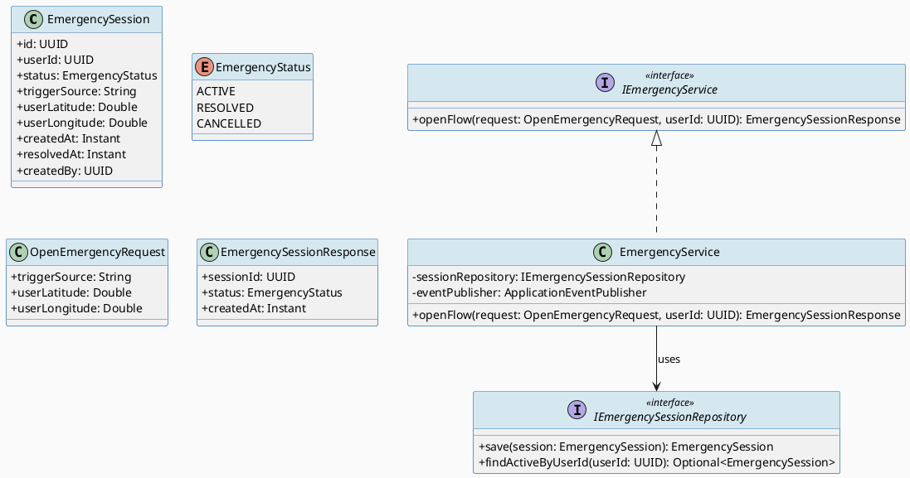
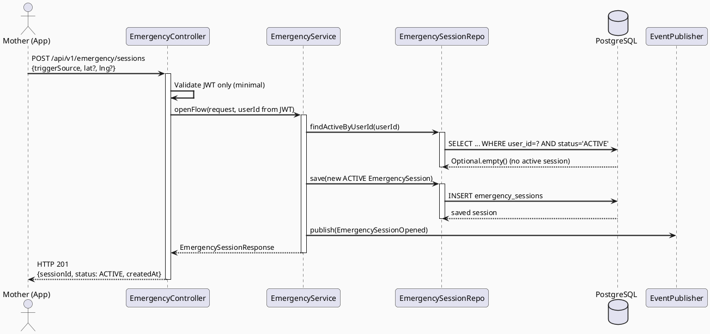
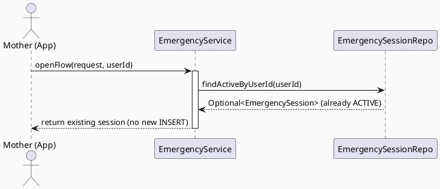
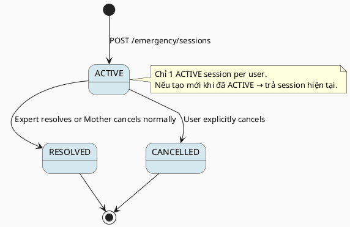

# ENGINEERING DOCUMENTATION STANDARD (EDS) v2.0
# UC62 — Open Emergency Flow

| Field | Value |
|-------|-------|
| **Document ID** | `CB-EMERG-IMP-001` |
| **Version** | `1.0` |
| **Date** | `2026-06-26` |
| **Status** | `Draft` |
| **Document Owner** | `AI Agent` |
| **Author** | `AI Agent — Tech Lead` |
| **Reviewed by** | `[ ] Pending` |
| **DPO Sign-off** | `[ ] Pending` *(bắt buộc — module PII: location + health emergency data)* |
| **Approved by** | `[ ] Pending` |
| **Last Review** | `2026-06-26` |
| **Based on EDS** | `v2.0` |

---

## CHANGELOG

| Ngày | Người thực hiện | Nội dung thay đổi |
|------|-----------------|-------------------|
| 2026-06-26 | AI Agent — Tech Lead | Tạo tài liệu lần đầu — TDS cho UC62 Open Emergency Flow |

---

## MỤC LỤC

1. [Tổng quan Module](#1-tổng-quan-module)
2. [Ma trận Truy vết (Traceability Matrix)](#2-ma-trận-truy-vết-traceability-matrix)
3. [Architecture Decision Records (ADR)](#3-architecture-decision-records-adr)
4. [Non-Functional Requirements & SLA](#4-non-functional-requirements--sla)
5. [Static Modeling (Mô hình Tĩnh)](#5-static-modeling-mô-hình-tĩnh)
6. [Dynamic Modeling (Mô hình Động)](#6-dynamic-modeling-mô-hình-động)
7. [Domain Event Catalog](#7-domain-event-catalog)
8. [Interface Specification (Đặc tả Giao diện)](#8-interface-specification-đặc-tả-giao-diện)
9. [API Specification](#9-api-specification)
10. [Bảng mã lỗi (Error Codes)](#10-bảng-mã-lỗi-error-codes)
11. [Quy trình Triển khai (Step-by-Step)](#11-quy-trình-triển-khai-step-by-step)
12. [Rollback & Incident Runbook](#12-rollback--incident-runbook)
13. [Kịch bản Kiểm thử Chi tiết](#13-kịch-bản-kiểm-thử-chi-tiết)
14. [Phương pháp Xác minh](#14-phương-pháp-xác-minh)
15. [Mẫu thử thực tế (API Verification Samples)](#15-mẫu-thử-thực-tế-api-verification-samples)
16. [Bảng tổng hợp phân quyền (Authorization Matrix)](#16-bảng-tổng-hợp-phân-quyền-authorization-matrix)
17. [AI Prompt Constraints (CASE 2.0)](#17-ai-prompt-constraints-case-20)

---

## 1. Tổng quan Module

> UC62 cho phép người dùng (Mother) kích hoạt luồng khẩn cấp thủ công hoặc tự động (từ UC131 emergencyFlag). Tạo `emergency_sessions` với SLA < 200ms end-to-end. **Critical priority** — KHÔNG được delay bất kỳ bước nào.

| Field | Value |
|-------|-------|
| **Module Name** | `Open Emergency Flow` |
| **Bounded Context** | `emergency` |
| **Data Classification** | `Sensitive-PII` *(location + health emergency data)* |
| **Compliance Scope** | `PDPA / Luật 91/2025` |
| **Upstream Dependencies** | `IAM (JWT), UC131 EmergencyEscalationTriggered event, Location Service` |
| **Downstream Consumers** | `UC65 Send Family Emergency Alert, Expert notification` |

---

## 2. Ma trận Truy vết (Traceability Matrix)

| Requirement ID | Loại (BR/ADR/US) | Mô tả yêu cầu | Thành phần Code | Compliance Target | ADR liên quan |
|----------------|------------------|---------------|-----------------|-------------------|---------------|
| SRS-3.3.1.39 | User Story | Mother kích hoạt khẩn cấp, hệ thống tạo emergency session | `EmergencyController.POST /emergency/sessions` | — | ADR-EMERG-001 |
| BR-EMERG-001 | Business Rule | API response < 200ms — CRITICAL latency requirement | `EmergencyService.openFlow()` | — | ADR-EMERG-001 |
| BR-EMERG-002 | Business Rule | Emergency session phải được tạo ngay cả khi location unavailable | `EmergencyService.openFlow()` | — | ADR-EMERG-002 |
| BR-SAFETY-001 | Business Rule | KHÔNG có business validation delay emergency creation | `EmergencyController` | BR-SAFETY | ADR-EMERG-001 |
| BR-EMERG-003 | Business Rule | Một user chỉ có 1 ACTIVE emergency session tại 1 thời điểm | `EmergencyService` | — | ADR-EMERG-003 |
| ADR-EMERG-001 | Decision | Emergency endpoint có SLA < 200ms — minimal validation, no AI call | `EmergencyController` | — | — |
| ADR-EMERG-002 | Decision | Location optional — không block emergency nếu location unavailable | `EmergencyService` | — | — |
| ADR-EMERG-003 | Decision | Idempotent creation — nếu đã có ACTIVE session, trả session hiện tại | `EmergencyService` | — | — |

---

## 3. Architecture Decision Records (ADR)

### ADR-EMERG-001 — Minimal validation để đảm bảo < 200ms SLA

| Field | Value |
|-------|-------|
| **Status** | `Accepted` |
| **Deciders** | `AI Agent — Tech Lead` |
| **Date** | `2026-06-26` |
| **Supersedes** | `—` |

#### Bối cảnh (Context)
Emergency flow là Critical path — 200ms latency SLA. Không thể có AI call, không thể có complex business validation.

#### Quyết định (Decision)
Emergency endpoint chỉ validate: JWT valid + ROLE_MOTHER. Tạo session ngay. Location optional. Không AI.

#### Hệ quả (Consequences)

**Tích cực:**
- < 200ms SLA đạt được
- Không block user trong tình huống khẩn cấp

**Tiêu cực / Trade-offs:**
- Session có thể được tạo với minimal data — bổ sung qua UC65

**Compliance Impact:**
- BR-SAFETY: KHÔNG delay emergency routing

---

### ADR-EMERG-002 — Location optional cho emergency session

| Field | Value |
|-------|-------|
| **Status** | `Accepted` |
| **Deciders** | `AI Agent — Tech Lead` |
| **Date** | `2026-06-26` |
| **Supersedes** | `—` |

#### Quyết định (Decision)
`userLatitude`, `userLongitude` là optional. Emergency session được tạo ngay cả khi location service unavailable.

---

### ADR-EMERG-003 — Idempotent emergency session creation

| Field | Value |
|-------|-------|
| **Status** | `Accepted` |
| **Deciders** | `AI Agent — Tech Lead` |
| **Date** | `2026-06-26` |
| **Supersedes** | `—` |

#### Quyết định (Decision)
Nếu user đã có ACTIVE emergency session, trả session hiện tại (không tạo mới). Tránh spam session trong tình huống hoảng loạn.

---

## 4. Non-Functional Requirements & SLA

### 4.1. Performance & Availability

| Category | Requirement | Target SLA | Measurement Method | Compliance Basis |
|----------|-------------|------------|---------------------|------------------|
| Latency | API response (p99) | **`< 200ms`** ⚠️ CRITICAL | k6 load test | ADR-EMERG-001 |
| Availability | Uptime (monthly) | `99.99%` | Uptime monitor | — |
| Throughput | Concurrent requests | `100 req/s` | Load test | — |

### 4.2. Data Integrity & Retention

| Category | Requirement | Target | Verification Method | Compliance Basis |
|----------|-------------|--------|---------------------|------------------|
| Durability | Zero session loss | RPO = 0 | Transaction log | PDPA |
| Retention | Emergency session data | 7 năm (medical record) | DB backup policy | Luật 91/2025 |

### 4.3. Security

| Category | Requirement | Target | Verification Method | Compliance Basis |
|----------|-------------|--------|---------------------|------------------|
| Encryption at rest | Location PII | AES-256 | `openssl` check | PDPA |
| Encryption in transit | All endpoints | TLS 1.3+ | SSL Labs scan | PDPA |
| Access control | ROLE_MOTHER only | Least privilege | Auth Matrix (§16) | Luật 91/2025 |

### 4.4. Scalability & Capacity Planning

> Emergency flow must be available even under peak load. Dedicated connection pool. Priority queue.

---

## 5. Static Modeling (Mô hình Tĩnh)

### 5.1. Class Diagram (PlantUML)



### 5.2. Data Structure (Flyway SQL Migration)

Tạo file: `src/main/resources/db/migration/V37__create_emergency_sessions.sql`

```sql
-- === EMERGENCY: SESSIONS SCHEMA ===

CREATE TABLE emergency_sessions (
  id              UUID          PRIMARY KEY DEFAULT gen_random_uuid(),
  user_id         UUID          NOT NULL,                     -- FK to users(id)
  status          VARCHAR(20)   NOT NULL DEFAULT 'ACTIVE',    -- EmergencyStatus enum
  trigger_source  VARCHAR(50)   NOT NULL,                     -- MANUAL / AUTO_TRIAGE / FALL_DETECTION
  user_latitude   DECIMAL(10,7),                              -- optional location
  user_longitude  DECIMAL(10,7),                              -- optional location
  created_at      TIMESTAMPTZ   NOT NULL DEFAULT NOW(),
  resolved_at     TIMESTAMPTZ,                                -- NULL until resolved
  created_by      UUID          NOT NULL,

  CONSTRAINT fk_emergency_user FOREIGN KEY (user_id) REFERENCES users(id),
  CONSTRAINT chk_emergency_status CHECK (status IN ('ACTIVE','RESOLVED','CANCELLED')),
  CONSTRAINT chk_trigger_source CHECK (trigger_source IN ('MANUAL','AUTO_TRIAGE','FALL_DETECTION'))
);

CREATE INDEX idx_emergency_sessions_user_id ON emergency_sessions(user_id);
CREATE INDEX idx_emergency_sessions_status ON emergency_sessions(status) WHERE status = 'ACTIVE';
CREATE INDEX idx_emergency_sessions_created_at ON emergency_sessions(created_at DESC);
```

---

## 6. Dynamic Modeling (Mô hình Động)

### 6.1. Sequence Diagram — Happy Path (PlantUML)



### 6.2. Sequence Diagram — Idempotent (existing active session)



### 6.3. State Machine



---

## 7. Domain Event Catalog

### 7.1. Events Published (Phát ra)

| Event Name | Trigger | Publisher | Subscriber(s) | Payload Schema | Async? |
|------------|---------|-----------|---------------|----------------|--------|
| `EmergencySessionOpened` | ACTIVE session created | `EmergencyService` | `UC65 SendFamilyAlert, Expert notification` | `EmergencySessionOpened.java` | Yes |

### 7.2. Events Consumed (Tiêu thụ)

| Event Name | Source | Handler | Action thực hiện |
|------------|--------|---------|------------------|
| `EmergencyEscalationTriggered` | `UC131 StructuredIntakeService` | `EmergencyEscalationHandler` | Auto-open emergency session |

### 7.3. Payload Schema

```java
// EmergencySessionOpened.java
public record EmergencySessionOpened(
    UUID    eventId,
    String  eventType,       // "EmergencySessionOpened"
    Instant occurredAt,
    String  version,         // "1.0"
    Payload payload,
    Metadata metadata
) implements ApplicationEvent {

    public record Payload(
        UUID   sessionId,
        UUID   userId,
        String triggerSource,  // MANUAL / AUTO_TRIAGE / FALL_DETECTION
        Double latitude,       // nullable
        Double longitude       // nullable
    ) {}

    public record Metadata(UUID correlationId, String causedBy) {}
}
```

---

## 8. Interface Specification (Đặc tả Giao diện)

### 8.1. Service Interface

```java
// OpenEmergencyRequest.java
// @version 1.0
public class OpenEmergencyRequest {
    @NotBlank
    private String triggerSource;   // MANUAL / AUTO_TRIAGE / FALL_DETECTION

    private Double userLatitude;    // optional
    private Double userLongitude;   // optional
    // getters / setters
}

// EmergencySessionResponse.java
public class EmergencySessionResponse {
    private UUID            sessionId;
    private EmergencyStatus status;
    private Instant         createdAt;
    // getters / setters
}

// IEmergencyService.java
// @version 1.0
public interface IEmergencyService {
    /**
     * Open or return existing emergency session for a user.
     * SLA: < 200ms (ADR-EMERG-001).
     * Idempotent: returns existing ACTIVE session if one exists.
     * @throws AccessDeniedException (EMERG-004) if not ROLE_MOTHER
     */
    EmergencySessionResponse openFlow(OpenEmergencyRequest request, UUID userId);
}
```

### 8.2. Repository Interface

```java
// IEmergencySessionRepository.java
// @version 1.0
public interface IEmergencySessionRepository extends JpaRepository<EmergencySession, UUID> {
    Optional<EmergencySession> findActiveByUserId(UUID userId);
    // Custom query: WHERE user_id = :userId AND status = 'ACTIVE'
    @Query("SELECT e FROM EmergencySession e WHERE e.userId = :userId AND e.status = 'ACTIVE'")
    Optional<EmergencySession> findActiveByUserId(@Param("userId") UUID userId);
}
```

---

## 9. API Specification

### 9.1. Endpoints Table

| Method | Path | Auth Level | Required Roles | Rate Limit | Idempotent? |
|--------|------|------------|----------------|------------|-------------|
| `POST` | `/api/v1/emergency/sessions` | JWT Bearer | `ROLE_MOTHER` | 5/min | Yes (idempotent) |
| `GET` | `/api/v1/emergency/sessions/active` | JWT Bearer | `ROLE_MOTHER` | 60/min | Yes |
| `PATCH` | `/api/v1/emergency/sessions/{id}/resolve` | JWT Bearer | `ROLE_MOTHER, ROLE_EXPERT` | 10/min | Yes |

### 9.2. Request / Response Schemas

#### `POST /api/v1/emergency/sessions`

**Request Body:**
```json
{
  "triggerSource": "MANUAL",
  "userLatitude": 10.7769,
  "userLongitude": 106.7009
}
```

**Response — 201 Created (new session):**
```json
{
  "sessionId": "uuid-v4",
  "status": "ACTIVE",
  "createdAt": "2026-06-26T08:00:00.000Z"
}
```

**Response — 200 OK (existing active session returned):**
```json
{
  "sessionId": "existing-uuid",
  "status": "ACTIVE",
  "createdAt": "2026-06-26T07:55:00.000Z"
}
```

**Response — 400 Bad Request:**
```json
{
  "error": {
    "code": "EMERG-001",
    "message": "triggerSource is required"
  }
}
```

---

## 10. Bảng mã lỗi (Error Codes)

| Code | HTTP Status | Message (EN) | Message (VI) | Trigger Condition |
|------|-------------|--------------|--------------|-------------------|
| `EMERG-001` | 400 | Validation failed | Dữ liệu không hợp lệ | triggerSource blank hoặc invalid |
| `EMERG-003` | 404 | Session not found | Không tìm thấy phiên khẩn cấp | sessionId không tồn tại |
| `EMERG-004` | 403 | Insufficient permissions | Không đủ quyền | User không có ROLE_MOTHER |
| `EMERG-005` | 503 | Emergency service unavailable | Dịch vụ khẩn cấp không khả dụng | DB temporarily unavailable |

---

## 11. Quy trình Triển khai (Step-by-Step)

### 11.1. Prerequisites

- [ ] ADR-EMERG-001, 002, 003 đã Accepted
- [ ] DPO đã sign-off (location PII)
- [ ] Staging environment với performance monitoring

### 11.2. Pre-Migration Checklist

- [ ] Đã backup DB
- [ ] Migration V37 chạy thành công trên staging ≥ 24 giờ
- [ ] Performance test V37 migration thời gian < 1s

### 11.3. Implementation Steps

#### Chặng 1 — Migration V37

```bash
./mvnw flyway:migrate
# Verify: SELECT count(*) FROM emergency_sessions; → 0
```

#### Chặng 2 — Implement EmergencySession entity + Repository

```java
// EmergencySession.java trong package com.carebridge.emergency.entity
```

#### Chặng 3 — Implement EmergencyService + Controller

```java
// EmergencyService.java trong package com.carebridge.emergency.service
// EmergencyController.java trong package com.carebridge.emergency.controller
// ⚠️ Target: < 200ms p99
```

#### Chặng 4 — Implement EmergencyEscalationHandler (consume UC131 event)

```java
// EmergencyEscalationHandler.java trong package com.carebridge.emergency.service
// @EventListener(EmergencyEscalationTriggered.class)
```

#### Chặng 5 — Performance verification

```bash
k6 run --vus 50 --duration 30s emergency-load-test.js
# Target: p99 < 200ms
```

### 11.4. Deployment Checklist

- [ ] Migration V37 chạy thành công
- [ ] p99 latency < 200ms verified
- [ ] Idempotency test passed
- [ ] EmergencySessionOpened event being published

---

## 12. Rollback & Incident Runbook

### 12.1. Điều kiện kích hoạt Rollback

| Điều kiện | Ngưỡng | Người quyết định |
|-----------|--------|------------------|
| Latency p99 > 200ms | Ngay lập tức | Tech Lead |
| Emergency session không được tạo | Bất kỳ case nào | Tech Lead + DPO |
| Location data bị expose sai user | Bất kỳ case nào | Tech Lead + DPO |

### 12.2. Rollback Procedure

```bash
psql -h $DB_HOST -U $DB_USER -d carebridge \
  -c "DROP TABLE IF EXISTS emergency_sessions CASCADE;"
psql -h $DB_HOST -U $DB_USER -d carebridge \
  -c "DELETE FROM flyway_schema_history WHERE version = '37';"

kubectl rollout undo deployment/carebridge-api
kubectl rollout status deployment/carebridge-api
```

### 12.3. Notification Protocol

| Thời điểm | Người nhận | Kênh | Template |
|-----------|------------|------|----------|
| Ngay khi phát hiện | On-call team | Slack `#incident` | "🚨 EMERGENCY-FLOW DOWN: [mô tả]" |
| Trong 15 phút | DPO + Management | Email | CRITICAL — Emergency system down |

### 12.4. Post-Incident Review (PIR)

- **Timeline:** Diễn biến từng bước
- **Root Cause:** 5 Whys
- **Impact:** Có user nào không tạo được emergency session không?
- **Remediation + Prevention**

---

## 13. Kịch bản Kiểm thử Chi tiết

### 13.1. Unit Tests

#### TC-UNIT-001 — Tạo emergency session mới thành công

```gherkin
Feature: Open Emergency Flow
  Background:
    Given test data classification: SYNTHETIC
    And user với ROLE_MOTHER, không có ACTIVE session hiện tại

  Scenario: Happy path — tạo session mới
    Given triggerSource = "MANUAL"
    And userLatitude = 10.7769, userLongitude = 106.7009
    When POST /api/v1/emergency/sessions
    Then response 201 với sessionId
    And EmergencySession status = ACTIVE trong DB
    And EmergencySessionOpened event published

  Scenario: Location không có — session vẫn được tạo
    Given triggerSource = "MANUAL", no location
    When POST /api/v1/emergency/sessions
    Then response 201 với sessionId
    And session.userLatitude = NULL

  Scenario: Idempotent — đã có ACTIVE session
    Given đã có EmergencySession ACTIVE cho user này
    When POST /api/v1/emergency/sessions lần 2
    Then response 200 với sessionId của session cũ
    And KHÔNG tạo session mới trong DB
```

**Hàm được test:** `EmergencyService.openFlow()`
**Invariant kiểm tra:** < 200ms; location optional; idempotent

### 13.2. Integration Tests

#### TC-INT-001 — Luồng đầy đủ

```gherkin
  Scenario: Full flow từ POST đến DB persistence
    Given Testcontainers PostgreSQL running
    And V37 migration applied
    When POST /api/v1/emergency/sessions với JWT ROLE_MOTHER
    Then emergency_sessions table có 1 record ACTIVE
    And EmergencySessionOpened event published
```

### 13.3. E2E / Security Tests

#### TC-E2E-001 — Performance: < 200ms

```gherkin
  Scenario: Latency requirement < 200ms
    Given 50 concurrent users
    When POST /api/v1/emergency/sessions 100 lần
    Then p99 latency < 200ms
```

#### TC-E2E-002 — Unauthorized access

```gherkin
  Scenario: ROLE_PARTNER không được tạo emergency session
    Given JWT với ROLE_PARTNER
    When POST /api/v1/emergency/sessions
    Then response 403 EMERG-004
```

---

## 14. Phương pháp Xác minh

### 14.1. Database Inspection

```sql
-- Verify emergency session tạo thành công
SELECT id, status, trigger_source, user_latitude, created_at
FROM emergency_sessions
WHERE user_id = '[uuid]' AND status = 'ACTIVE';

-- Verify chỉ có 1 ACTIVE session per user
SELECT user_id, count(*) FROM emergency_sessions
WHERE status = 'ACTIVE'
GROUP BY user_id HAVING count(*) > 1;
-- Expected: 0 rows
```

### 14.2. Log / Audit Verification

```bash
kubectl logs -l app=carebridge-api | grep '"eventType":"EmergencySessionOpened"' | head -5

# Verify latency
kubectl logs -l app=carebridge-api | grep "POST /api/v1/emergency/sessions" | awk '{print $NF}' | sort -n | tail -5
# Expected: < 200ms
```

### 14.3. Tool-based Verification

```bash
# Performance test
time curl -X POST https://$HOST/api/v1/emergency/sessions \
  -H "Authorization: Bearer $MOTHER_JWT" \
  -H "Content-Type: application/json" \
  -d '{"triggerSource": "MANUAL"}'
# Expected: < 200ms total
```

---

## 15. Mẫu thử thực tế (API Verification Samples)

### 15.1. Happy Path

```bash
curl -X POST https://$HOST/api/v1/emergency/sessions \
  -H "Authorization: Bearer $MOTHER_JWT" \
  -H "Content-Type: application/json" \
  -H "X-Correlation-Id: $(uuidgen)" \
  -d '{
    "triggerSource": "MANUAL",
    "userLatitude": 10.7769,
    "userLongitude": 106.7009
  }'
```

**Expected (201):**
```json
{
  "sessionId": "uuid-v4",
  "status": "ACTIVE",
  "createdAt": "2026-06-26T08:00:00.000Z"
}
```

### 15.2. Error Paths

```bash
# Không có JWT → 401
curl -X POST https://$HOST/api/v1/emergency/sessions \
  -d '{"triggerSource": "MANUAL"}'
```

---

## 16. Bảng tổng hợp phân quyền (Authorization Matrix)

| Endpoint | `GUEST` | `ROLE_MOTHER` | `ROLE_PARTNER` | `ROLE_EXPERT` | `ROLE_ADMIN` |
|----------|---------|---------------|----------------|---------------|--------------|
| `POST /api/v1/emergency/sessions` | ❌ | ✅ Own | ❌ | ❌ | ❌ |
| `GET /api/v1/emergency/sessions/active` | ❌ | ✅ Own | ❌ | ✅ Assigned | ✅ All |
| `PATCH /api/v1/emergency/sessions/{id}/resolve` | ❌ | ✅ Own | ❌ | ✅ Assigned | ✅ All |

---

## 17. AI Prompt Constraints (CASE 2.0)

### 17.1 Constraint Summary Table

| # | Constraint | Source (ADR/BR) | Last Verified |
|---|-----------|-----------------|---------------|
| C1 | API response PHẢI < 200ms p99 — minimal validation, no AI call | `ADR-EMERG-001 / BR-EMERG-001` | `2026-06-26` |
| C2 | Location (latitude, longitude) là optional — KHÔNG block emergency nếu null | `ADR-EMERG-002 / BR-EMERG-002` | `2026-06-26` |
| C3 | Idempotent: nếu ACTIVE session đã tồn tại → trả session đó, KHÔNG tạo mới | `ADR-EMERG-003 / BR-EMERG-003` | `2026-06-26` |
| C4 | userId từ JWT SecurityContext — KHÔNG từ request body | `ADR-EMERG-001` | `2026-06-26` |
| C5 | EmergencySessionOpened event PHẢI được publish ngay sau khi session được tạo | `UC65 upstream requirement` | `2026-06-26` |

### 17.2 Constraint Injection Block (Copy-Paste vào AI Prompt)

```
[CONSTRAINT BLOCK — Module: Open Emergency Flow — CB-EMERG-IMP-001]
Theo TDS CB-EMERG-IMP-001 và các ADR liên quan:

1. API response PHẢI < 200ms p99 — no AI call, minimal validation (ADR-EMERG-001/BR-EMERG-001)
2. Location là OPTIONAL — KHÔNG reject request nếu lat/lng null (ADR-EMERG-002/BR-EMERG-002)
3. Idempotent: nếu ACTIVE session tồn tại → trả session đó, không INSERT mới (ADR-EMERG-003)
4. userId từ JWT SecurityContext — KHÔNG từ request body (ADR-EMERG-001)
5. EmergencySessionOpened event published ngay sau INSERT (UC65 requirement)

[CONTEXT BLOCK]
- Bounded Context: emergency (CRITICAL priority)
- Data Classification: Sensitive-PII (location + emergency data)
- Compliance: PDPA / Luật 91/2025
- Existing interfaces: §8 Service Interface + §8.2 Repository Interface
- Error codes: §10 Error Codes Table
- Auth matrix: §16 Authorization Matrix

[TASK BLOCK]
Implement EmergencyService.openFlow() thỏa mãn constraints trên.
Output phải tuân thủ §8 Interface Specification.
Tests phải cover §13 Test Scenarios.
```

### 17.3 Constraint Quality Checklist

- [x] Mỗi constraint traceable về ADR hoặc BR cụ thể
- [x] Không có constraint generic
- [x] Mỗi constraint có `Last Verified` date ≤ 2 sprints
- [x] Constraint block có ≥ 3 constraints cụ thể (có 5)
- [x] Constraint block reference §8 Interface
- [x] Constraint block reference §16 Auth Matrix

### 17.4 Anti-Pattern Detection

| AP-ID | Anti-Pattern | Dấu hiệu | Hành động |
|-------|-------------|-----------|----------|
| AP-AI-001 | Unconstrained Gen | Code có AI call trong emergency path | Reject — enforce C1 |
| AP-AI-003 | Implicit Decision | Code require location — không có ADR | Reject — enforce C2 |
| AP-AI-005 | Hallucinated Contract | Code import EmergencyRepository không có trong §8 | Reject — verify |

---

## PHỤ LỤC

### A. Glossary

| Thuật ngữ | Định nghĩa |
|-----------|------------|
| Emergency Session | Phiên khẩn cấp được tạo khi người dùng cần trợ giúp y tế khẩn cấp |
| triggerSource | Nguồn kích hoạt: MANUAL (tay), AUTO_TRIAGE (UC131), FALL_DETECTION (UC136) |
| Idempotent | Gọi nhiều lần với cùng input → trả cùng kết quả, không tạo duplicate |
| SLA | Service Level Agreement — cam kết về hiệu suất dịch vụ |

### B. Tài liệu tham chiếu

| Document | Link / Path |
|----------|-------------|
| SRS UC-62 | `02_Requirements/SRS/Functional_Specifications.md §3.3.1.39` |
| UC65 TDS | `04_Implement/UC65_SendFamilyEmergencyAlert/UC65_SendFamilyEmergencyAlert_TDS.md` |
| EDS v2.0 Template | `08_References/Template/PHASE-3_TDS.md` |
