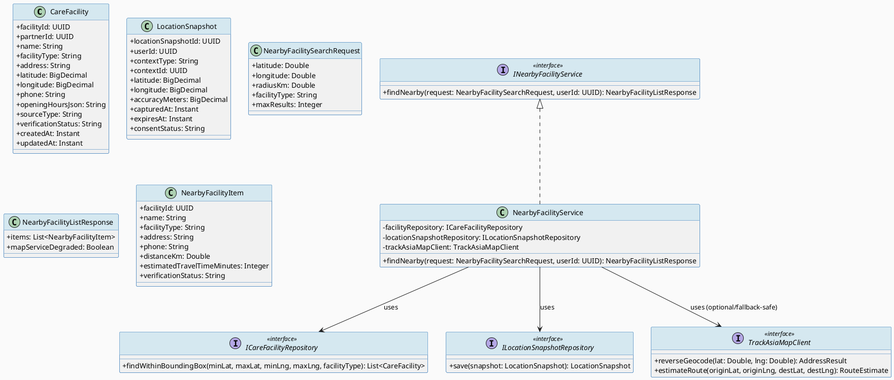
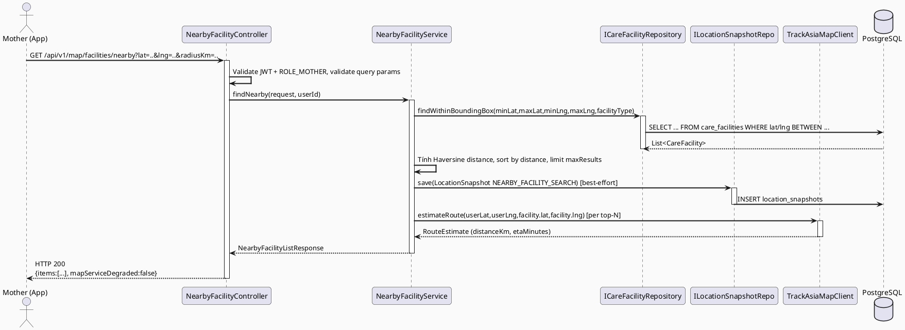
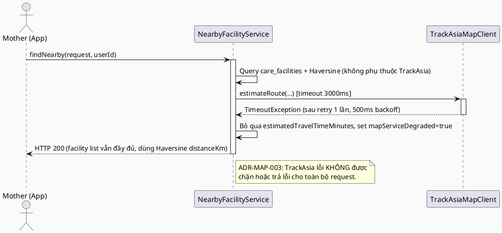
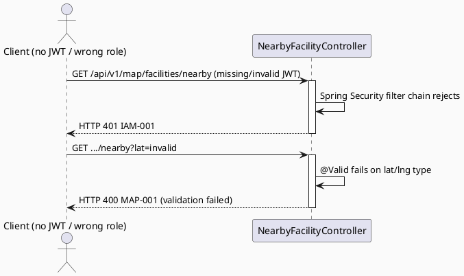

# ENGINEERING DOCUMENTATION STANDARD (EDS) v2.0
# UC63 — Find Nearby Care Facility

| Field | Value |
|-------|-------|
| **Document ID** | `CB-MAP-IMP-001` |
| **Version** | `1.0` |
| **Date** | `2026-07-01` |
| **Status** | `Draft` |
| **Document Owner** | `TV4 - Lâm` |
| **Author** | `AI Agent — Tech Lead` |
| **Reviewed by** | `[ ] Pending` |
| **DPO Sign-off** | `[ ] Pending` *(module xử lý location PII — bắt buộc)* |
| **Approved by** | `[ ] Pending` |
| **Last Review** | `2026-07-01` |
| **Based on EDS** | `v2.0` |

---

## CHANGELOG

| Ngày | Người thực hiện | Nội dung thay đổi |
|------|-----------------|-------------------|
| 2026-07-01 | AI Agent — Tech Lead | Tạo tài liệu lần đầu — TDS cho UC63 Find Nearby Care Facility |

---

## MỤC LỤC

1. [Tổng quan Module](#1-tổng-quan-module)
2. [Ma trận Truy vết (Traceability Matrix)](#2-ma-trận-truy-vết-traceability-matrix)
3. [Architecture Decision Records (ADR)](#3-architecture-decision-records-adr)
4. [Non-Functional Requirements & SLA](#4-non-functional-requirements--sla)
5. [Static Modeling (Mô hình Tĩnh)](#5-static-modeling-mô-hình-tĩnh)
6. [Dynamic Modeling (Mô hình Động)](#6-dynamic-modeling-mô-hình-động)
7. [Domain Event Catalog](#7-domain-event-catalog)
8. [Interface Specification (Đặc tả Giao diện)](#8-interface-specification-đặc-tả-giao-diện)
9. [API Specification](#9-api-specification)
10. [Bảng mã lỗi (Error Codes)](#10-bảng-mã-lỗi-error-codes)
11. [Quy trình Triển khai (Step-by-Step)](#11-quy-trình-triển-khai-step-by-step)
12. [Rollback & Incident Runbook](#12-rollback--incident-runbook)
13. [Kịch bản Kiểm thử Chi tiết](#13-kịch-bản-kiểm-thử-chi-tiết)
14. [Phương pháp Xác minh](#14-phương-pháp-xác-minh)
15. [Mẫu thử thực tế (API Verification Samples)](#15-mẫu-thử-thực-tế-api-verification-samples)
16. [Bảng tổng hợp phân quyền (Authorization Matrix)](#16-bảng-tổng-hợp-phân-quyền-authorization-matrix)
17. [AI Prompt Constraints (CASE 2.0)](#17-ai-prompt-constraints-case-20)

---

## 1. Tổng quan Module

> UC63 cho phép Mother tìm các cơ sở y tế (bệnh viện/phòng khám) gần vị trí hiện tại, sử dụng TrackAsia Map Service để tính khoảng cách/geocode và bảng `care_facilities` làm nguồn dữ liệu cơ sở. Đây là chức năng hỗ trợ (không phải luồng khẩn cấp chính thức UC62 — không tạo `emergency_events`), nhưng nằm trong nhóm Emergency/Map module nên **không được có AI-mediated delay** khi hiển thị kết quả tìm kiếm.

| Field | Value |
|-------|-------|
| **Module Name** | `Find Nearby Care Facility` |
| **Bounded Context** | `map` (theo phân công TV4-Lâm — "Location/map/nearby care domain", xem `function-spec-task-allocation.md`) |
| **Data Classification** | `Sensitive-PII` *(vị trí hiện tại của Mother = location PII)* |
| **Compliance Scope** | `PDPA / Luật 91/2025` |
| **Upstream Dependencies** | `IAM (JWT ROLE_MOTHER)`, `TrackAsia Map Service (external)`, `care_facilities` reference table (đã có sẵn trong `V1__init_schema.sql`) |
| **Downstream Consumers** | `UC64 Quick Call or Navigate (chọn 1 facility để gọi/chỉ đường)`, Mobile `emergencyMap` feature |

---

## 2. Ma trận Truy vết (Traceability Matrix)

| Requirement ID | Loại (BR/ADR/US) | Mô tả yêu cầu | Thành phần Code | Compliance Target | ADR liên quan |
|----------------|------------------|---------------|-----------------|-------------------|---------------|
| SRS-3.3.1.40 (UC-63) | User Story | Mother dùng vị trí hiện tại để tìm bệnh viện/phòng khám gần nhất | `NearbyFacilityController.GET /api/v1/map/facilities/nearby` | — | ADR-MAP-001 |
| SRS-3.1.3.1 (UC-129) | User Story | Cung cấp khả năng tính khoảng cách/route/ETA dùng chung cho facility, expert, nearby support | `TrackAsiaMapClient` | — | ADR-MAP-001 |
| BR-RBAC | Business Rule | Chỉ ROLE_MOTHER (đã auth) được gọi endpoint tìm cơ sở gần | `NearbyFacilityController` | BR-RBAC | ADR-MAP-004 |
| BR-PRIVACY | Business Rule | Vị trí hiện tại của Mother chỉ dùng cho tính khoảng cách, KHÔNG lưu trữ lâu dài ngoài `location_snapshots` với TTL | `NearbyFacilityService`, `location_snapshots` | PDPA | ADR-MAP-002 |
| BR-CONSULTATION | Business Rule | Không áp dụng trực tiếp (UC63 không có booking/payment/refund) — ghi nhận N/A | — | — | — |
| E3 (SRS Exceptions) | Exception | TrackAsia service/network lỗi → trả lỗi rõ ràng kèm hướng dẫn retry, không có duplicate/unsafe action | `TrackAsiaMapClient`, `NearbyFacilityService` | BR-SAFETY (no delay to routing) | ADR-MAP-003 |
| ADR-MAP-001 | Decision | Tìm kiếm nearby dùng bounding-box + Haversine trên `care_facilities.latitude/longitude`, KHÔNG gọi TrackAsia Places API cho search (TrackAsia chỉ dùng cho geocode/ETA khi cần) | `NearbyFacilityService` | — | — |
| ADR-MAP-002 | Decision | Vị trí hiện tại của Mother được ghi vào `location_snapshots` (context_type=`NEARBY_FACILITY_SEARCH`) với `expires_at` ngắn hạn, không phải trường bắt buộc để trả kết quả | `NearbyFacilityService` | PDPA | — |
| ADR-MAP-003 | Decision | TrackAsia timeout 3s + 1 retry; nếu vẫn lỗi → fallback trả facility list từ DB (không cần ETA), không block response | `TrackAsiaMapClient` | BR-SAFETY | — |
| ADR-MAP-004 | Decision | Endpoint yêu cầu JWT + ROLE_MOTHER; `userId` lấy từ SecurityContext, không nhận từ query param | `NearbyFacilityController` | BR-RBAC | — |

> **Open (RG-2):** SRS §3.3.1.40 là văn bản template chung (không có số cụ thể cho bán kính tìm kiếm, số lượng kết quả tối đa, hay định dạng dữ liệu trả về). Các giá trị số trong TDS này (bán kính mặc định, giới hạn kết quả, timeout) là **đề xuất kỹ thuật hợp lý dựa trên hội thoại emergency-adjacent** (xem §4, §17) — KHÔNG có nguồn BR/AC cụ thể. Đánh dấu **Open** — cần Product Owner / TV4-Lâm xác nhận trước khi Approve.

---

## 3. Architecture Decision Records (ADR)

### ADR-MAP-001 — Chiến lược tìm kiếm cơ sở gần: DB bounding-box + Haversine, TrackAsia chỉ hỗ trợ ETA/geocode

| Field | Value |
|-------|-------|
| **Status** | `Proposed` |
| **Deciders** | `AI Agent — Tech Lead` (chờ TV4-Lâm confirm) |
| **Date** | `2026-07-01` |
| **Supersedes** | `—` |

#### Bối cảnh (Context)
`care_facilities` đã tồn tại trong `V1__init_schema.sql` với `latitude`, `longitude`, `facility_type`, `verification_status`. Không có bảng `care_facilities` nào khác trong các migration sau V1. SRS chỉ mô tả UC63 dùng TrackAsia Map Service làm secondary actor nhưng không nêu rõ TrackAsia có API "search nearby POI" độc lập hay không — CareBridge không sở hữu dữ liệu POI của TrackAsia, chỉ sở hữu `care_facilities` do partner/admin nhập.

#### Các phương án đã xem xét (Options Considered)

| Phương án | Mô tả | Ưu điểm | Nhược điểm |
|-----------|-------|----------|------------|
| A | Query `care_facilities` trong DB bằng bounding-box (lat/lng range) + tính khoảng cách Haversine trong application layer, sort by distance | Không phụ thuộc external API cho bước search chính; nhanh, không có network timeout risk; tận dụng dữ liệu đã verify (`verification_status`) | Chỉ tìm được facility đã có trong `care_facilities` (không tìm được POI bên ngoài chưa nhập) |
| B | Gọi TrackAsia Places/Nearby Search API trực tiếp để tìm tất cả bệnh viện/phòng khám xung quanh | Có thể tìm được nhiều POI hơn kể cả chưa có trong DB | Phụ thuộc hoàn toàn vào external service cho luồng chính — vi phạm nguyên tắc "no AI/external delay cho emergency-adjacent flow"; TrackAsia chưa có tích hợp thực tế nào trong repo (không có evidence pattern để tái sử dụng) |

#### Quyết định (Decision)
Chọn **Phương án A** — search chính dựa trên `care_facilities` trong DB. TrackAsia Map Service được dùng ở lớp bổ sung: geocode địa chỉ hiển thị và (tùy chọn) tính ETA/route khi Mother chọn 1 facility cụ thể (chuẩn bị dữ liệu cho UC64 navigate). Không có TrackAsia call nào trên critical path trả danh sách facility.

#### Hệ quả (Consequences)

**Tích cực:**
- Latency thấp, không phụ thuộc external service ở bước search chính.
- Dữ liệu facility đã qua `verification_status` kiểm duyệt nội bộ.

**Tiêu cực / Trade-offs:**
- Danh sách facility giới hạn theo dữ liệu CareBridge đã nhập — cần quy trình vận hành (partner/admin) để mở rộng `care_facilities`. Ghi nhận **Open** — ngoài phạm vi TDS này.

**Compliance Impact:**
- Không phát sinh thêm rủi ro PII vì không gửi vị trí Mother ra ngoài hệ thống (trừ khi cần TrackAsia ETA — xem ADR-MAP-003).

---

### ADR-MAP-002 — Vị trí hiện tại lưu tạm trong `location_snapshots`, không bắt buộc

| Field | Value |
|-------|-------|
| **Status** | `Proposed` |
| **Deciders** | `AI Agent — Tech Lead` |
| **Date** | `2026-07-01` |
| **Supersedes** | `—` |

#### Bối cảnh (Context)
Bảng `location_snapshots` đã tồn tại (`V1__init_schema.sql`) với `context_type`, `context_id`, `latitude`, `longitude`, `accuracy_meters`, `expires_at`, `consent_status`. Đây đúng là cơ chế được thiết kế sẵn cho việc lưu vị trí tạm thời theo ngữ cảnh.

#### Quyết định (Decision)
Mỗi lần Mother gọi API tìm cơ sở gần, hệ thống **có thể** ghi 1 `location_snapshots` record với `context_type = 'NEARBY_FACILITY_SEARCH'`, `expires_at = now() + 1 hour`. Việc ghi snapshot là **best-effort** — lỗi khi ghi snapshot KHÔNG được làm fail request tìm kiếm (theo nguyên tắc "AI/location xử lý không được delay hoặc chặn hành trình chính").

#### Hệ quả (Consequences)

**Tích cực:**
- Có audit trail vị trí phục vụ tra cứu/khiếu nại theo PDPA, tái sử dụng bảng có sẵn — không cần migration mới.

**Tiêu cực / Trade-offs:**
- Cần background job dọn dẹp `location_snapshots` hết hạn — đã có index `idx_location_snapshots_expires_at`, cơ chế dọn dẹp cụ thể đánh dấu **Open** (ngoài phạm vi UC63, thuộc về housekeeping chung toàn hệ thống).

**Compliance Impact:**
- PDPA — cần đảm bảo TTL được thực thi (job dọn dẹp) để không giữ vị trí quá thời hạn tối thiểu cần thiết.

---

### ADR-MAP-003 — Timeout/Retry/Fallback khi TrackAsia không khả dụng

| Field | Value |
|-------|-------|
| **Status** | `Proposed` |
| **Deciders** | `AI Agent — Tech Lead` |
| **Date** | `2026-07-01` |
| **Supersedes** | `—` |

#### Bối cảnh (Context)
SRS Exception E3: "External service, network, or server failure is handled with retry guidance and no duplicate unsafe action." Không có timeout cụ thể (số giây) trong SRS — đây là giá trị kỹ thuật đề xuất, đánh dấu **Open** cho việc xác nhận SLA cuối cùng.

#### Quyết định (Decision)
- `TrackAsiaMapClient` (geocode/ETA phụ trợ) dùng timeout **3000ms**, tối đa **1 retry** (exponential backoff 500ms).
- Nếu TrackAsia vẫn lỗi sau retry: response vẫn trả **200 OK** với danh sách facility (không có `estimatedTravelTimeMinutes`/`distanceKm` chính xác từ TrackAsia — dùng Haversine distance đã tính sẵn ở ADR-MAP-001 làm fallback), kèm field `mapServiceDegraded: true` để client hiển thị cảnh báo nhẹ.
- KHÔNG trả lỗi 5xx cho toàn bộ request chỉ vì TrackAsia (bổ sung) lỗi — vì search chính không phụ thuộc TrackAsia (ADR-MAP-001).

#### Hệ quả (Consequences)

**Tích cực:**
- Mother luôn nhận được danh sách facility ngay cả khi TrackAsia down — phù hợp yêu cầu "never delay emergency-adjacent routing" trong CLAUDE.md.

**Tiêu cực / Trade-offs:**
- ETA/route hiển thị có thể kém chính xác hơn (dùng haversine thay vì route thực) khi degraded.

**Compliance Impact:** Không có.

---

### ADR-MAP-004 — Authorization: ROLE_MOTHER only, userId từ JWT

| Field | Value |
|-------|-------|
| **Status** | `Proposed` |
| **Deciders** | `AI Agent — Tech Lead` |
| **Date** | `2026-07-01` |
| **Supersedes** | `—` |

#### Quyết định (Decision)
Endpoint `GET /api/v1/map/facilities/nearby` yêu cầu JWT hợp lệ với `ROLE_MOTHER` (mirror pattern `@PreAuthorize("hasRole('MOTHER')")` đã dùng trong `EmergencyController`). `userId` dùng để ghi `location_snapshots.user_id`, KHÔNG dùng để giới hạn dữ liệu facility trả về (facility là dữ liệu công khai theo phạm vi hệ thống).

---

## 4. Non-Functional Requirements & SLA

### 4.1. Performance & Availability

| Category | Requirement | Target SLA | Measurement Method | Compliance Basis |
|----------|-------------|------------|---------------------|------------------|
| Latency | API response (p99), DB-only path | `< 500ms` ⚠️ *(Open — đề xuất kỹ thuật, chưa có BR/AC nguồn; cần confirm)* | k6 load test | ADR-MAP-001 |
| Latency | API response khi TrackAsia bổ sung ETA thành công | `< 1500ms` *(Open)* | k6 load test | ADR-MAP-003 |
| Availability | Uptime (monthly) | `99.9%` *(Open — theo baseline chung dự án, chưa có SLA riêng)* | Uptime monitor | — |
| Throughput | Concurrent requests | `50 req/s` *(Open)* | Load test | — |

### 4.2. Data Integrity & Retention

| Category | Requirement | Target | Verification Method | Compliance Basis |
|----------|-------------|--------|---------------------|------------------|
| Retention | `location_snapshots` cho NEARBY_FACILITY_SEARCH | `expires_at = created_at + 1h` | Query kiểm tra `expires_at` | PDPA (minimum necessary) |
| Consistency | `care_facilities.verification_status != 'UNVERIFIED'` ưu tiên hiển thị trước | 100% sort order | Unit test | BR-PRIVACY (chất lượng thông tin y tế) |

### 4.3. Security

| Category | Requirement | Target | Verification Method | Compliance Basis |
|----------|-------------|--------|---------------------|------------------|
| Encryption in transit | Endpoint + TrackAsia call | TLS 1.3+ | SSL Labs scan | PDPA |
| Access control | ROLE_MOTHER only | Least privilege | Auth Matrix (§16) | BR-RBAC |
| Secret management | TrackAsia API key | Env var, không hardcode | Code review | — |

### 4.4. Scalability & Capacity Planning

> Tải dự kiến thấp/trung bình (tính năng phụ trợ, không phải core booking). Horizontal scale theo cấu hình chung Spring Boot hiện có — không cần cơ chế riêng.

---

## 5. Static Modeling (Mô hình Tĩnh)

### 5.1. Class Diagram (PlantUML)



### 5.2. Data Structure (Flyway SQL Migration)

> **Không cần migration mới.** `care_facilities` và `location_snapshots` đã tồn tại đầy đủ trong `V1__init_schema.sql` (dòng 1065-1108, PK/FK/index tại dòng 1458-1465, 1652-1657, 1911-1924). Không phát hiện thay đổi cấu trúc bảng nào cần thiết cho UC63.

**Xác nhận cấu trúc hiện có (nguồn: `V1__init_schema.sql`):**

```sql
-- Đã tồn tại — KHÔNG tạo lại, chỉ tham chiếu
-- care_facilities: facility_id (PK), partner_id (FK -> partner_organizations), name, facility_type,
--                   address, latitude, longitude, phone, opening_hours_json, source_type,
--                   verification_status, created_at, updated_at
-- Index có sẵn: idx_care_facilities_partner_id, idx_care_facilities_facility_type
--
-- location_snapshots: location_snapshot_id (PK), user_id (FK -> users), context_type, context_id,
--                      latitude, longitude, accuracy_meters, captured_at, expires_at, consent_status
-- Index có sẵn: idx_location_snapshots_user_id, idx_location_snapshots_expires_at
```

**Đề xuất index bổ sung (Open — cần đánh giá hiệu năng thực tế trước khi approve):**

Nếu bounding-box query trên `care_facilities.latitude/longitude` chậm khi dữ liệu lớn, cân nhắc migration mới `V{next}__add_care_facilities_geo_index.sql` với composite index `(latitude, longitude)`. **Chưa tạo migration này trong Draft — chỉ ghi nhận Open**, vì hiện tại chưa có dữ liệu thực tế để đánh giá cardinality. Version tiếp theo khả dụng tại thời điểm viết TDS: `V20260629000003` trở đi hoặc `V11` (tuỳ dev chọn theo namespace đang dùng — xem `05_Development/CareBridgeAPI/src/main/resources/db/migration/` để lấy số mới nhất tại thời điểm implement).

---

## 6. Dynamic Modeling (Mô hình Động)

### 6.1. Sequence Diagram — Happy Path (PlantUML)



### 6.2. Sequence Diagram — TrackAsia Timeout / Fallback Path (PlantUML)



### 6.3. Sequence Diagram — Error Path (Unauthorized / Invalid Params)



> Không có state machine cho UC63 — đây là một read-only query, không có entity trạng thái (facility không đổi trạng thái do việc search).

---

## 7. Domain Event Catalog

> UC63 là read-only query — **không phát ra domain event nào**. Việc ghi `location_snapshots` là side-effect ghi log/audit trực tiếp qua repository, không qua event bus (khác với UC62/UC65 vốn là luồng khẩn cấp chính thức có event-driven downstream).

### 7.1. Events Published (Phát ra)

_Không có._

### 7.2. Events Consumed (Tiêu thụ)

_Không có._

---

## 8. Interface Specification (Đặc tả Giao diện)

### 8.1. Service Interface

```java
// NearbyFacilitySearchRequest.java — Input DTO
// @version 1.0
public class NearbyFacilitySearchRequest {
    @NotNull
    @DecimalMin("-90.0") @DecimalMax("90.0")
    private Double latitude;

    @NotNull
    @DecimalMin("-180.0") @DecimalMax("180.0")
    private Double longitude;

    @DecimalMin("0.1") @DecimalMax("50.0")
    private Double radiusKm = 5.0;          // default — Open: chưa có BR nguồn cho giá trị mặc định

    private String facilityType;             // optional filter: HOSPITAL / CLINIC / MATERNITY (tham chiếu care_facilities.facility_type — free text trong schema hiện tại)

    @Min(1) @Max(50)
    private Integer maxResults = 20;         // default — Open

    // getters / setters
}

// NearbyFacilityListResponse.java — Output DTO
public class NearbyFacilityListResponse {
    private List<NearbyFacilityItem> items;
    private Boolean mapServiceDegraded;      // true nếu TrackAsia ETA lookup thất bại (ADR-MAP-003)
    // getters / setters
}

public class NearbyFacilityItem {
    private UUID facilityId;
    private String name;
    private String facilityType;
    private String address;
    private String phone;
    private Double distanceKm;               // Haversine — luôn có
    private Integer estimatedTravelTimeMinutes; // nullable nếu mapServiceDegraded=true
    private String verificationStatus;
    // getters / setters
}

// INearbyFacilityService.java — Service Contract
// @version 1.0
public interface INearbyFacilityService {
    /**
     * Tìm care_facilities gần vị trí (latitude, longitude) trong bán kính radiusKm.
     * Không phụ thuộc TrackAsia cho kết quả chính (ADR-MAP-001).
     * TrackAsia timeout/lỗi không làm fail request (ADR-MAP-003).
     * @throws AccessDeniedException (MAP-004) nếu không có ROLE_MOTHER
     */
    NearbyFacilityListResponse findNearby(NearbyFacilitySearchRequest request, UUID userId);
}
```

### 8.2. Repository Interface

```java
// ICareFacilityRepository.java
// @version 1.0
public interface ICareFacilityRepository extends JpaRepository<CareFacility, UUID> {

    @Query("SELECT f FROM CareFacility f WHERE f.latitude BETWEEN :minLat AND :maxLat " +
           "AND f.longitude BETWEEN :minLng AND :maxLng " +
           "AND (:facilityType IS NULL OR f.facilityType = :facilityType)")
    List<CareFacility> findWithinBoundingBox(
        @Param("minLat") BigDecimal minLat, @Param("maxLat") BigDecimal maxLat,
        @Param("minLng") BigDecimal minLng, @Param("maxLng") BigDecimal maxLng,
        @Param("facilityType") String facilityType);
}

// ILocationSnapshotRepository.java
// @version 1.0
public interface ILocationSnapshotRepository extends JpaRepository<LocationSnapshot, UUID> {
    // save() kế thừa từ JpaRepository — dùng cho ghi snapshot best-effort
}
```

### 8.3. External Client Interface (TrackAsia)

```java
// TrackAsiaMapClient.java — External Service Adapter
// @version 1.0
// Package: com.carebridge.backend.map.adapter (theo pattern adapter/ đã dùng ở emergency/adapter)
public interface TrackAsiaMapClient {
    /**
     * @throws TrackAsiaTimeoutException sau timeout 3000ms + 1 retry (ADR-MAP-003)
     */
    RouteEstimate estimateRoute(double originLat, double originLng, double destLat, double destLng);
}

public record RouteEstimate(double distanceKm, int etaMinutes) {}
```

---

## 9. API Specification

### 9.1. Endpoints Table

| Method | Path | Auth Level | Required Roles | Rate Limit | Idempotent? |
|--------|------|------------|----------------|------------|-------------|
| `GET` | `/api/v1/map/facilities/nearby` | JWT Bearer | `ROLE_MOTHER` | 30/min *(Open — đề xuất)* | Yes |

### 9.2. Request / Response Schemas

#### `GET /api/v1/map/facilities/nearby?latitude=10.7769&longitude=106.7009&radiusKm=5&facilityType=HOSPITAL&maxResults=20`

**Response — 200 OK (Happy Path):**
```json
{
  "items": [
    {
      "facilityId": "uuid-v4",
      "name": "Bệnh viện Từ Dũ",
      "facilityType": "HOSPITAL",
      "address": "284 Cống Quỳnh, Q1, TP.HCM",
      "phone": "+842854042829",
      "distanceKm": 1.8,
      "estimatedTravelTimeMinutes": 7,
      "verificationStatus": "VERIFIED"
    }
  ],
  "mapServiceDegraded": false
}
```

**Response — 200 OK (TrackAsia degraded — ADR-MAP-003):**
```json
{
  "items": [
    {
      "facilityId": "uuid-v4",
      "name": "Bệnh viện Từ Dũ",
      "facilityType": "HOSPITAL",
      "address": "284 Cống Quỳnh, Q1, TP.HCM",
      "phone": "+842854042829",
      "distanceKm": 1.8,
      "estimatedTravelTimeMinutes": null,
      "verificationStatus": "VERIFIED"
    }
  ],
  "mapServiceDegraded": true
}
```

**Response — 200 OK (Empty state — AF2):**
```json
{
  "items": [],
  "mapServiceDegraded": false
}
```

**Response — 400 Bad Request:**
```json
{
  "error": {
    "code": "MAP-001",
    "message": "latitude and longitude are required and must be valid coordinates",
    "details": [{ "field": "latitude", "message": "must be between -90 and 90" }]
  }
}
```

**Response — 401 Unauthorized:**
```json
{
  "error": { "code": "IAM-001", "message": "Authentication required" }
}
```

**Response — 403 Forbidden:**
```json
{
  "error": { "code": "MAP-004", "message": "Insufficient permissions" }
}
```

---

## 10. Bảng mã lỗi (Error Codes)

| Code | HTTP Status | Message (EN) | Message (VI) | Trigger Condition |
|------|-------------|--------------|--------------|-------------------|
| `MAP-001` | 400 | Validation failed | Dữ liệu không hợp lệ | latitude/longitude thiếu hoặc ngoài phạm vi hợp lệ |
| `MAP-002` | 200 (không phải lỗi cứng) | Map service degraded | Dịch vụ bản đồ tạm thời không khả dụng | TrackAsia timeout/lỗi — vẫn trả 200 kèm `mapServiceDegraded:true` (ADR-MAP-003), KHÔNG dùng mã lỗi HTTP riêng |
| `MAP-003` | 404 | No facility reference data | Không có dữ liệu cơ sở y tế | `care_facilities` rỗng trong bounding-box (AF2 empty state — vẫn trả 200 với `items: []`, không phải 404, xem §9.2) |
| `MAP-004` | 403 | Insufficient permissions | Không đủ quyền | User không có ROLE_MOTHER |
| `MAP-005` | 503 | Map facility service unavailable | Dịch vụ tìm cơ sở không khả dụng | DB (care_facilities) không truy vấn được |

> **Lưu ý:** `MAP-003` được liệt kê cho đầy đủ bảng mã lỗi theo template nhưng KHÔNG áp dụng làm HTTP 404 thực tế — theo SRS AF2 "empty state" phải trả 200 với danh sách rỗng, không phải lỗi. Ghi chú này để tránh nhầm lẫn khi implement.

---

## 11. Quy trình Triển khai (Step-by-Step)

### 11.1. Prerequisites

- [ ] ADR-MAP-001 → 004 được Accepted (hiện tại `Proposed` — cần TV4-Lâm + Tech Lead review)
- [ ] DPO sign-off cho việc dùng `location_snapshots` (location PII)
- [ ] TrackAsia API key/credentials có sẵn trong env (`TRACKASIA_API_KEY` — tên biến đề xuất, Open)

### 11.2. Pre-Migration Checklist

- [ ] Không cần migration mới (§5.2) — bước này N/A cho UC63
- [ ] Nếu sau này cần composite geo-index, tuân thủ Flyway version tiếp theo hiện có tại thời điểm implement

### 11.3. Implementation Steps

#### Chặng 1 — Tạo package `map` theo convention hiện có (mirror `emergency` package)

```
com.carebridge.backend.map/
├── controller/NearbyFacilityController.java
├── dto/request/NearbyFacilitySearchRequest.java
├── dto/response/NearbyFacilityListResponse.java
├── dto/response/NearbyFacilityItem.java
├── entity/CareFacility.java          (map tới bảng care_facilities đã có)
├── entity/LocationSnapshot.java      (map tới bảng location_snapshots đã có — có thể tái sử dụng nếu emergency package định nghĩa trước; kiểm tra trùng lặp khi implement)
├── repository/ICareFacilityRepository.java
├── repository/ILocationSnapshotRepository.java
├── adapter/TrackAsiaMapClient.java (interface)
├── adapter/TrackAsiaMapClientImpl.java (hoặc Mock/Sandbox impl ban đầu)
├── service/INearbyFacilityService.java
├── service/impl/NearbyFacilityService.java
├── mapper/NearbyFacilityMapper.java
└── policy/ (để trống .gitkeep nếu chưa cần policy riêng)
```

#### Chặng 2 — Implement Repository queries + Haversine util

```java
// Haversine tính trong Service hoặc Util class dùng chung (kiểm tra xem đã có util nào tương tự trong common/ chưa trước khi tạo mới)
```

#### Chặng 3 — Implement TrackAsiaMapClient với timeout/retry (Resilience4j hoặc RestTemplate timeout config — theo pattern hiện có của project nếu có; nếu chưa có, dùng `RestClient` timeout Spring Boot 3.5 mặc định)

#### Chặng 4 — Implement Controller + Security config

```java
// @PreAuthorize("hasRole('MOTHER')") — mirror EmergencyController pattern
```

#### Chặng 5 — Mobile: implement `emergencyMap` feature (screens/services/repositories/widgets hiện đang `.gitkeep`)

```
lib/features/emergencyMap/
├── models/care_facility_model.dart
├── repositories/nearby_facility_repository.dart
├── services/nearby_facility_api_service.dart
├── screens/nearby_facility_list_screen.dart
└── widgets/facility_list_item.dart
```

### 11.4. Deployment Checklist

- [ ] Endpoint trả 200 với dữ liệu seed `care_facilities`
- [ ] TrackAsia timeout test xác nhận fallback hoạt động (không 5xx)
- [ ] p99 latency đạt target §4.1 (nếu đã confirm — hiện Open)

---

## 12. Rollback & Incident Runbook

### 12.1. Điều kiện kích hoạt Rollback

| Điều kiện | Ngưỡng | Người quyết định |
|-----------|--------|------------------|
| Error rate tăng đột biến | > 5% trong 5 phút | On-call Engineer |
| TrackAsia degraded kéo dài gây UX kém | > 30 phút liên tục | Tech Lead |
| Location PII bị lộ sai user (nếu phát hiện leak trong log) | Bất kỳ case nào | Tech Lead + DPO |

### 12.2. Rollback Procedure

```bash
# Không có migration mới để rollback (§5.2) — chỉ cần revert code deploy
kubectl rollout undo deployment/carebridge-api
kubectl rollout status deployment/carebridge-api
```

### 12.3. Notification Protocol

| Thời điểm | Người nhận | Kênh | Template |
|-----------|------------|------|----------|
| Ngay khi phát hiện | On-call team | Slack `#incident` | "Map/Facility search degraded/down: [mô tả]" |
| Trong 30 phút (nếu PII liên quan) | DPO | Email | Bắt buộc nếu location PII bị ảnh hưởng |

### 12.4. Post-Incident Review (PIR)

- **Timeline:** Diễn biến từng bước
- **Root Cause:** 5 Whys
- **Impact:** Có Mother nào không tìm được cơ sở gần trong tình huống cần thiết?
- **Remediation + Prevention**

---

## 13. Kịch bản Kiểm thử Chi tiết

> Chi tiết đầy đủ nằm trong `UC63_FindNearbyCareFacility_Test-Spec.md`. Bảng dưới đây tóm tắt liên kết điều kiện kiểm thử chính.

| TDS Concern | Test-Spec Condition Ref |
|-------------|--------------------------|
| ADR-MAP-001 (bounding-box + Haversine, TrackAsia not on critical path) | `TC-COND-001, 002` |
| ADR-MAP-002 (location snapshot best-effort) | `TC-COND-003` |
| ADR-MAP-003 (timeout/retry/fallback) | `TC-COND-004, 005` |
| ADR-MAP-004 (RBAC) | `TC-COND-006` |
| SRS AF2 (empty state) | `TC-COND-007` |
| SRS E2 (invalid params) | `TC-COND-008` |

---

## 14. Phương pháp Xác minh

### 14.1. Database Inspection

```sql
-- Verify care_facilities data returned matches bounding box
SELECT facility_id, name, latitude, longitude, verification_status
FROM care_facilities
WHERE latitude BETWEEN :minLat AND :maxLat
  AND longitude BETWEEN :minLng AND :maxLng;

-- Verify location_snapshots TTL respected
SELECT location_snapshot_id, user_id, context_type, expires_at
FROM location_snapshots
WHERE context_type = 'NEARBY_FACILITY_SEARCH'
ORDER BY captured_at DESC LIMIT 5;
```

### 14.2. Log / Audit Verification

```bash
kubectl logs -l app=carebridge-api | grep "GET /api/v1/map/facilities/nearby" | tail -20
kubectl logs -l app=carebridge-api | grep -i "trackasia" | grep -i "timeout\|error"
```

### 14.3. Tool-based Verification

```bash
curl -X GET "https://$HOST/api/v1/map/facilities/nearby?latitude=10.7769&longitude=106.7009&radiusKm=5" \
  -H "Authorization: Bearer $MOTHER_JWT"
```

---

## 15. Mẫu thử thực tế (API Verification Samples)

### 15.1. Happy Path

```bash
curl -X GET "https://$HOST/api/v1/map/facilities/nearby?latitude=10.7769&longitude=106.7009&radiusKm=5&facilityType=HOSPITAL&maxResults=10" \
  -H "Authorization: Bearer $MOTHER_JWT" \
  -H "X-Correlation-Id: $(uuidgen)"
```

### 15.2. Error Paths

```bash
# Thiếu latitude/longitude → 400 MAP-001
curl -X GET "https://$HOST/api/v1/map/facilities/nearby" \
  -H "Authorization: Bearer $MOTHER_JWT"

# Không có JWT → 401
curl -X GET "https://$HOST/api/v1/map/facilities/nearby?latitude=10.77&longitude=106.70"
```

---

## 16. Bảng tổng hợp phân quyền (Authorization Matrix)

| Endpoint | `GUEST` | `ROLE_MOTHER` | `ROLE_PARTNER` | `ROLE_EXPERT` | `ROLE_ADMIN` |
|----------|---------|---------------|----------------|---------------|--------------|
| `GET /api/v1/map/facilities/nearby` | ❌ | ✅ | ❌ | ❌ | ❌ |

**Chú thích:** Facility là dữ liệu tham chiếu chung, không có "Own" scope — quyền truy cập chỉ giới hạn theo Role (Mother), không theo ownership của record.

> **Open:** SRS không xác nhận rõ liệu ROLE_FAMILY hoặc ROLE_EXPERT có được phép gọi tính năng này (ví dụ Family member cũng cần tìm cơ sở gần cho Mother). TDS này giữ nguyên phạm vi hẹp nhất theo SRS Primary Actor = Mother; mở rộng role cần quyết định bổ sung của Product Owner.

---

## 17. AI Prompt Constraints (CASE 2.0)

### 17.1 Constraint Summary Table

| # | Constraint | Source (ADR/BR) | Last Verified |
|---|-----------|-----------------|---------------|
| C1 | Search chính PHẢI dựa trên `care_facilities` trong DB (bounding-box + Haversine) — KHÔNG gọi TrackAsia trên critical path trả kết quả | `ADR-MAP-001` | `2026-07-01` |
| C2 | TrackAsia timeout 3000ms + 1 retry; lỗi TrackAsia KHÔNG được làm fail toàn bộ request — set `mapServiceDegraded=true` và trả 200 | `ADR-MAP-003` | `2026-07-01` |
| C3 | Ghi `location_snapshots` là best-effort — lỗi ghi snapshot KHÔNG được chặn response | `ADR-MAP-002` | `2026-07-01` |
| C4 | `userId` PHẢI lấy từ JWT SecurityContext — KHÔNG từ query param | `ADR-MAP-004` | `2026-07-01` |
| C5 | Danh sách rỗng (AF2) PHẢI trả HTTP 200 với `items: []`, KHÔNG trả 404 | `SRS AF2` | `2026-07-01` |

### 17.2 Constraint Injection Block (Copy-Paste vào AI Prompt)

```
[CONSTRAINT BLOCK — Module: Find Nearby Care Facility — CB-MAP-IMP-001]
Theo TDS CB-MAP-IMP-001 và các ADR liên quan:

1. Search chính dựa trên care_facilities DB (bounding-box + Haversine) — KHÔNG gọi TrackAsia trên critical path (ADR-MAP-001)
2. TrackAsia timeout 3000ms + 1 retry; lỗi TrackAsia → set mapServiceDegraded=true, vẫn trả 200 (ADR-MAP-003)
3. Ghi location_snapshots là best-effort, lỗi ghi KHÔNG chặn response (ADR-MAP-002)
4. userId từ JWT SecurityContext — KHÔNG từ query param (ADR-MAP-004)
5. Danh sách rỗng → HTTP 200 với items:[], KHÔNG 404 (SRS AF2)

[CONTEXT BLOCK]
- Bounded Context: map
- Data Classification: Sensitive-PII (vị trí Mother)
- Compliance: PDPA / Luật 91/2025
- Existing interfaces: §8 Service Interface + §8.2 Repository Interface + §8.3 TrackAsiaMapClient
- Error codes: §10 Error Codes Table
- Auth matrix: §16 Authorization Matrix

[TASK BLOCK]
Implement NearbyFacilityService.findNearby() thỏa mãn constraints trên.
Output phải tuân thủ §8 Interface Specification.
Tests phải cover §13 Test Scenarios (xem Test-Spec).
```

### 17.3 Constraint Quality Checklist

- [x] Mỗi constraint traceable về ADR hoặc BR cụ thể
- [x] Không có constraint generic
- [x] Mỗi constraint có `Last Verified` date ≤ 2 sprints
- [x] Constraint block có ≥ 3 constraints cụ thể (có 5)
- [x] Constraint block reference §8 Interface
- [x] Constraint block reference §16 Auth Matrix

### 17.4 Anti-Pattern Detection

| AP-ID | Anti-Pattern | Dấu hiệu | Hành động |
|-------|-------------|-----------|----------|
| AP-AI-001 | Unconstrained Gen | Code gọi TrackAsia làm nguồn search chính, không có bounding-box query trước | Reject — enforce C1 |
| AP-AI-003 | Implicit Decision | Code chặn response chờ TrackAsia mà không có timeout | Reject — enforce C2 |
| AP-AI-005 | Hallucinated Contract | Code import repository/entity không có trong §8 | Reject — verify contract existence |

---

## PHỤ LỤC

### A. Glossary

| Thuật ngữ | Định nghĩa |
|-----------|------------|
| Care Facility | Cơ sở y tế (bệnh viện, phòng khám, cơ sở sản khoa) trong bảng `care_facilities` |
| Bounding Box | Vùng hình chữ nhật lat/lng dùng để lọc sơ bộ trước khi tính khoảng cách chính xác |
| Haversine | Công thức tính khoảng cách giữa 2 điểm trên mặt cầu (Trái Đất) từ lat/lng |
| mapServiceDegraded | Cờ báo hiệu TrackAsia không khả dụng, kết quả vẫn trả về nhưng thiếu ETA chính xác |
| Location Snapshot | Bản ghi vị trí tạm thời có TTL, dùng cho audit/context tracking (bảng `location_snapshots`) |

### B. Tài liệu tham chiếu

| Document | Link / Path |
|----------|-------------|
| SRS UC-63 | `02_Requirements/SRS/3_Functional_Specification.md §3.3.1.40` |
| SRS UC-129 (Calculate Distance/Route/ETA — shared map capability) | `02_Requirements/SRS/3_Functional_Specification.md §3.1.3.1` |
| Task Allocation (TV4-Lâm ownership) | `04_Implement/implement_artifacts/function-spec-task-allocation.md` (dòng ~177-178, ~733-734) |
| DB Schema Source of Truth | `05_Development/CareBridgeAPI/src/main/resources/db/migration/V1__init_schema.sql` |
| UC62 Open Emergency Flow TDS (style reference, package convention) | `04_Implement/UC62_OpenEmergencyFlow/UC62_OpenEmergencyFlow_TDS.md` |
| UC154 Establish Realtime Communication Session TDS (external service ADR pattern reference) | `04_Implement/UC154_EstablishRealtimeCommunicationSession/UC154_EstablishRealtimeCommunicationSession_TDS.md` |
| EDS v2.0 Template | `08_References/Template/PHASE-3_TDS.md` |

---

*EDS v2.0 — Draft. Chưa Approved. Xem §2, §4, §16 cho danh sách Open Items cần Product Owner / TV4-Lâm xác nhận trước khi chuyển Status sang `Approved`.*
