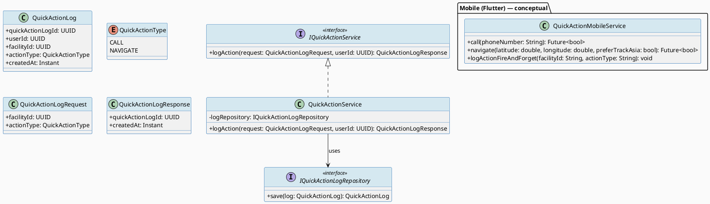
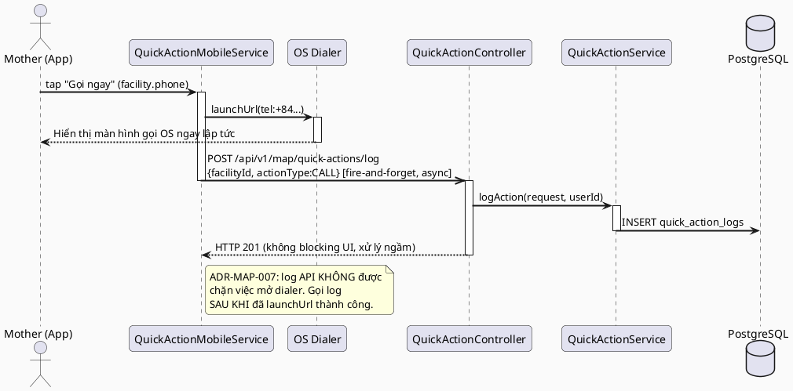
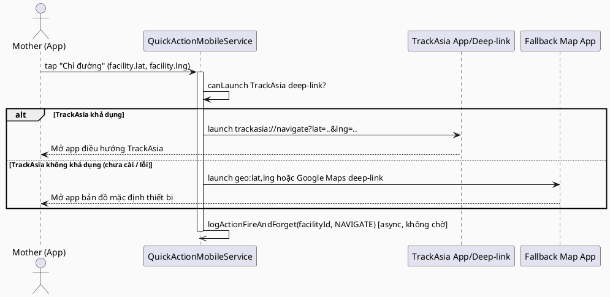
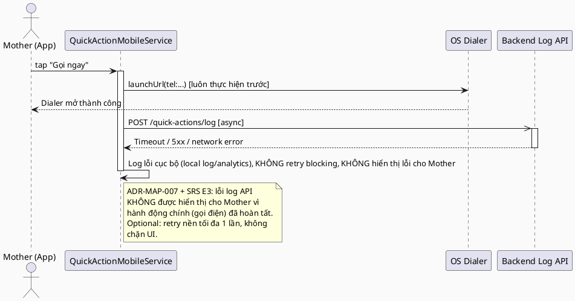

# ENGINEERING DOCUMENTATION STANDARD (EDS) v2.0
# UC64 — Quick Call or Navigate

| Field | Value |
|-------|-------|
| **Document ID** | `CB-MAP-IMP-002` |
| **Version** | `1.0` |
| **Date** | `2026-07-01` |
| **Status** | `Draft` |
| **Document Owner** | `TV4 - Lâm` |
| **Author** | `AI Agent — Tech Lead` |
| **Reviewed by** | `[ ] Pending` |
| **DPO Sign-off** | `[ ] Pending` *(module xử lý location PII + call metadata)* |
| **Approved by** | `[ ] Pending` |
| **Last Review** | `2026-07-01` |
| **Based on EDS** | `v2.0` |

---

## CHANGELOG

| Ngày | Người thực hiện | Nội dung thay đổi |
|------|-----------------|-------------------|
| 2026-07-01 | AI Agent — Tech Lead | Tạo tài liệu lần đầu — TDS cho UC64 Quick Call or Navigate |

---

## MỤC LỤC

1. [Tổng quan Module](#1-tổng-quan-module)
2. [Ma trận Truy vết (Traceability Matrix)](#2-ma-trận-truy-vết-traceability-matrix)
3. [Architecture Decision Records (ADR)](#3-architecture-decision-records-adr)
4. [Non-Functional Requirements & SLA](#4-non-functional-requirements--sla)
5. [Static Modeling (Mô hình Tĩnh)](#5-static-modeling-mô-hình-tĩnh)
6. [Dynamic Modeling (Mô hình Động)](#6-dynamic-modeling-mô-hình-động)
7. [Domain Event Catalog](#7-domain-event-catalog)
8. [Interface Specification (Đặc tả Giao diện)](#8-interface-specification-đặc-tả-giao-diện)
9. [API Specification](#9-api-specification)
10. [Bảng mã lỗi (Error Codes)](#10-bảng-mã-lỗi-error-codes)
11. [Quy trình Triển khai (Step-by-Step)](#11-quy-trình-triển-khai-step-by-step)
12. [Rollback & Incident Runbook](#12-rollback--incident-runbook)
13. [Kịch bản Kiểm thử Chi tiết](#13-kịch-bản-kiểm-thử-chi-tiết)
14. [Phương pháp Xác minh](#14-phương-pháp-xác-minh)
15. [Mẫu thử thực tế (API Verification Samples)](#15-mẫu-thử-thực-tế-api-verification-samples)
16. [Bảng tổng hợp phân quyền (Authorization Matrix)](#16-bảng-tổng-hợp-phân-quyền-authorization-matrix)
17. [AI Prompt Constraints (CASE 2.0)](#17-ai-prompt-constraints-case-20)

---

## 1. Tổng quan Module

> UC64 cho phép Mother, từ một `care_facility` đã tìm thấy (UC63) hoặc một hotline đã cấu hình, thực hiện: (a) gọi điện thoại trực tiếp (native dialer, KHÔNG phải ZegoCloud voice call — xem ADR-MAP-005 để hiểu lý do), hoặc (b) mở điều hướng bản đồ đến địa điểm đó qua TrackAsia. Đây là chức năng **điều hướng nhanh** — KHÔNG được có bất kỳ AI xử lý hay bước xác nhận nghiệp vụ nào gây chậm trễ trước khi mở app gọi/bản đồ.

| Field | Value |
|-------|-------|
| **Module Name** | `Quick Call or Navigate` |
| **Bounded Context** | `map` (theo phân công TV4-Lâm — "Map/navigation domain", xem `function-spec-task-allocation.md`) |
| **Data Classification** | `Sensitive-PII` *(vị trí đích + số điện thoại liên hệ)* |
| **Compliance Scope** | `PDPA / Luật 91/2025` |
| **Upstream Dependencies** | `UC63 Find Nearby Care Facility (chọn facility)`, `care_facilities.phone` (nguồn số hotline), `TrackAsia Map Service (external)`, `IAM (JWT ROLE_MOTHER)` |
| **Downstream Consumers** | Không có consumer trực tiếp — hành động terminal (mở app ngoài); có thể ghi audit log cho UC161-style tracking |

---

## 2. Ma trận Truy vết (Traceability Matrix)

| Requirement ID | Loại (BR/ADR/US) | Mô tả yêu cầu | Thành phần Code | Compliance Target | ADR liên quan |
|----------------|------------------|---------------|-----------------|-------------------|---------------|
| SRS-3.3.1.41 (UC-64) | User Story | Mother gọi hotline/cơ sở y tế hoặc mở điều hướng bản đồ | `QuickActionController.POST /api/v1/map/quick-actions/log`, Mobile client-side native call/navigate | — | ADR-MAP-005, ADR-MAP-006 |
| SRS-3.1.3.1 (UC-129) | User Story | Cung cấp route/ETA dùng chung cho quick navigate | `TrackAsiaMapClient.estimateRoute()` (tái sử dụng từ UC63, xem `CB-MAP-IMP-001 §8.3`) | — | ADR-MAP-006 |
| BR-RBAC | Business Rule | Chỉ ROLE_MOTHER (đã auth) được ghi log quick action | `QuickActionController` | BR-RBAC | ADR-MAP-008 |
| BR-PRIVACY | Business Rule | Log quick-action KHÔNG lưu nội dung cuộc gọi, chỉ lưu metadata tối thiểu (facilityId, actionType, timestamp) | `QuickActionLog` entity | PDPA | ADR-MAP-007 |
| BR-CONSULTATION | Business Rule | Không áp dụng — UC64 không có booking/payment/refund lifecycle | — | N/A | — |
| E3 (SRS Exceptions) | Exception | TrackAsia lỗi khi mở điều hướng → vẫn cho phép mở app bản đồ với tọa độ thô (không chặn hành động) | Mobile client (`NearbyFacilityRepository`/`QuickActionService`) | BR-SAFETY (no delay) | ADR-MAP-006 |
| ADR-MAP-005 | Decision | "Gọi điện" dùng native dialer (`tel:` URI) qua OS — KHÔNG dùng ZegoCloud cho cuộc gọi hotline/cơ sở y tế | Mobile: `QuickActionService.call()` | — | — |
| ADR-MAP-006 | Decision | "Điều hướng" ưu tiên mở TrackAsia app/deep-link nếu có; fallback sang tọa độ thô cho map app mặc định của thiết bị nếu TrackAsia không khả dụng | Mobile: `QuickActionService.navigate()` | — | — |
| ADR-MAP-007 | Decision | Backend chỉ ghi audit log tối thiểu (không lưu số điện thoại đã gọi hay bản ghi cuộc gọi) khi client gọi API log quick-action (best-effort, optional) | `QuickActionService` (backend) | PDPA | — |
| ADR-MAP-008 | Decision | Log API yêu cầu JWT + ROLE_MOTHER; endpoint KHÔNG bắt buộc phải gọi trước khi thực hiện call/navigate (client-side action không phụ thuộc network) | `QuickActionController` | BR-RBAC | — |

> **Open (RG-2, RG-5 — Conflict cần user quyết định):** SRS §3.3.1.41 liệt kê "Secondary Actors: TrackAsia Map Service, ZegoCloud Realtime Service" cho UC-64. Tuy nhiên:
> - ZegoCloud trong codebase (UC154 TDS, `CB-CON-IMP-004`) được thiết kế riêng cho **phiên tư vấn đã CONFIRMED** giữa Mother và Expert (`consultations` table, roomId = consultation UUID) — không có khái niệm "gọi hotline/cơ sở y tế qua ZegoCloud" trong bất kỳ tài liệu nào khác.
> - Gọi điện thoại đến hotline/số cơ sở y tế bên ngoài hệ thống (số điện thoại thật, PSTN) về bản chất KHÔNG THỂ thực hiện qua ZegoCloud (ZegoCloud là RTC platform nội bộ giữa 2 user đã đăng nhập CareBridge, không kết nối được tới số điện thoại công cộng).
> - Do đó TDS này giả định: ZegoCloud chỉ liên quan nếu Mother "gọi" một **Expert đã liên kết qua Nearby Expert/Consultation** (ngoài phạm vi UC64 theo Description "Calls a hotline or care facility, or opens map navigation"). Với phạm vi UC64 hiện tại (hotline/care facility + map navigation), TDS chọn **native dialer (`tel:`)** làm cơ chế gọi, KHÔNG dùng ZegoCloud.
> - **Đây là quyết định kỹ thuật đề xuất (Proposed), KHÔNG phải quyết định đã confirm.** Đánh dấu **Open — cần Product Owner/TV4-Lâm xác nhận** liệu ZegoCloud secondary actor trong SRS có nghĩa là (a) lỗi soạn thảo SRS (copy từ UC-154 khác), hay (b) UC64 thực sự cần mở rộng để hỗ trợ gọi Expert qua ZegoCloud trong một luồng riêng.

---

## 3. Architecture Decision Records (ADR)

### ADR-MAP-005 — Gọi điện dùng native dialer (`tel:` URI), không dùng ZegoCloud

| Field | Value |
|-------|-------|
| **Status** | `Proposed` |
| **Deciders** | `AI Agent — Tech Lead` (chờ TV4-Lâm confirm — xem Open item §2) |
| **Date** | `2026-07-01` |
| **Supersedes** | `—` |

#### Bối cảnh (Context)
UC64 Description: "Calls a hotline or care facility, or opens map navigation." Đây là số điện thoại thật (PSTN) của hotline y tế hoặc `care_facilities.phone`, không phải cuộc gọi giữa 2 user CareBridge. Mobile app đã có tiền lệ (`emergency_alert_detail_screen.dart`, hàm `_makeCall()`) dùng `url_launcher` package với `Uri.parse('tel:$phone')` — đây là pattern hiện có, mặc dù thuộc UC161-adjacent context (Receive Emergency Alert), không phải UC64 chính thức.

#### Các phương án đã xem xét (Options Considered)

| Phương án | Mô tả | Ưu điểm | Nhược điểm |
|-----------|-------|----------|------------|
| A | Native `tel:` URI qua `url_launcher`, mở dialer OS | Không phụ thuộc backend/network; tức thời; đã có pattern tương tự trong repo | Không track được trạng thái cuộc gọi (answered/failed) từ app |
| B | ZegoCloud voice call tới số ngoài | Có thể track call session | ZegoCloud không hỗ trợ gọi PSTN thông thường trong tích hợp hiện tại (chỉ user-to-user trong platform); không có ADR/evidence nào hỗ trợ phương án này |

#### Quyết định (Decision)
Chọn **Phương án A** — native `tel:` dialer. Backend chỉ nhận log tối thiểu (optional, best-effort) để phục vụ audit, KHÔNG chặn hoặc yêu cầu network round-trip trước khi mở dialer.

#### Hệ quả (Consequences)

**Tích cực:**
- Không có external service dependency hay latency trên critical path của hành động gọi khẩn cấp.

**Tiêu cực / Trade-offs:**
- Không track được kết quả cuộc gọi (answered/declined) — chấp nhận được vì đây là hành động client-side terminal.

**Compliance Impact:**
- Không lưu nội dung/thời lượng cuộc gọi qua telecom — giảm rủi ro PII so với phương án tích hợp RTC.

---

### ADR-MAP-006 — Điều hướng ưu tiên TrackAsia, fallback map app mặc định thiết bị

| Field | Value |
|-------|-------|
| **Status** | `Proposed` |
| **Deciders** | `AI Agent — Tech Lead` |
| **Date** | `2026-07-01` |
| **Supersedes** | `—` |

#### Bối cảnh (Context)
SRS xác nhận TrackAsia Map Service là secondary actor cho UC64. Không tìm thấy TrackAsia SDK/dependency nào trong `pubspec.yaml` hoặc backend `pom.xml` tại thời điểm viết TDS — đây là tích hợp **greenfield**, chưa có pattern code để tái sử dụng (khác với kỳ vọng ban đầu; xem RG-3 trong báo cáo).

#### Quyết định (Decision)
- Nếu TrackAsia SDK/deep-link khả dụng trên thiết bị: mở TrackAsia app/webview với tọa độ đích (`latitude`, `longitude` của `care_facilities` đã chọn).
- Nếu không: fallback mở generic map intent (`geo:lat,lng` trên Android / Apple Maps trên iOS, hoặc Google Maps deep-link như pattern đã có trong `_openDirections()`) — đảm bảo hành động luôn thực hiện được.
- Việc chọn TrackAsia vs fallback xảy ra **hoàn toàn ở client (Mobile)**, không qua backend — vì đây là external URI launch, backend không cần tham gia vào critical path.

#### Hệ quả (Consequences)

**Tích cực:**
- Đảm bảo tính năng luôn hoạt động (never fail hoàn toàn) kể cả khi TrackAsia app chưa cài hoặc lỗi.

**Tiêu cực / Trade-offs:**
- Trải nghiệm không nhất quán giữa TrackAsia và fallback map — chấp nhận được cho MVP.

**Compliance Impact:** Không có.

---

### ADR-MAP-007 — Backend log quick-action tối thiểu, best-effort

| Field | Value |
|-------|-------|
| **Status** | `Proposed` |
| **Deciders** | `AI Agent — Tech Lead` |
| **Date** | `2026-07-01` |
| **Supersedes** | `—` |

#### Bối cảnh (Context)
SRS Postcondition POST-3: "Sensitive actions are recorded for audit, safety, or privacy review where required." Gọi điện/điều hướng có thể được xem là sensitive action liên quan đến an toàn (emergency-adjacent).

#### Quyết định (Decision)
Backend cung cấp 1 endpoint ghi log tối thiểu: `facilityId` (hoặc `hotlineId`), `actionType` (`CALL`/`NAVIGATE`), `userId` (từ JWT), `createdAt`. **Không lưu** số điện thoại thực tế đã gọi, không lưu polyline route. Việc gọi log API là **optional từ phía Mobile** — Mobile app PHẢI thực hiện `tel:`/map intent NGAY LẬP TỨC, gọi log API có thể chạy song song hoặc sau đó (fire-and-forget), KHÔNG chờ log API trả về trước khi mở dialer/map.

#### Hệ quả (Consequences)

**Tích cực:**
- Có audit trail tối thiểu phục vụ compliance mà không tăng thêm PII lưu trữ không cần thiết.

**Tiêu cực / Trade-offs:**
- Nếu Mobile app crash trước khi gọi log API, audit trail bị thiếu — chấp nhận được vì đây không phải nguồn dữ liệu chính cho quyết định nghiệp vụ.

**Compliance Impact:**
- Giảm thiểu dữ liệu theo nguyên tắc minimum-necessary (PDPA/BR-PRIVACY).

---

### ADR-MAP-008 — Authorization: ROLE_MOTHER only cho log API

| Field | Value |
|-------|-------|
| **Status** | `Proposed` |
| **Deciders** | `AI Agent — Tech Lead` |
| **Date** | `2026-07-01` |
| **Supersedes** | `—` |

#### Quyết định (Decision)
`POST /api/v1/map/quick-actions/log` yêu cầu JWT `ROLE_MOTHER` (mirror pattern `EmergencyController`). `userId` lấy từ SecurityContext.

---

## 4. Non-Functional Requirements & SLA

### 4.1. Performance & Availability

| Category | Requirement | Target SLA | Measurement Method | Compliance Basis |
|----------|-------------|------------|---------------------|------------------|
| Latency (Client-side) | Thời gian từ tap "Gọi ngay"/"Chỉ đường" đến khi OS dialer/map app mở | `< 300ms` ⚠️ *(Open — đề xuất, không có BR nguồn cụ thể; nhất quán tinh thần "no delay" với ADR-EMERG-001 của UC62)* | Manual/instrumented UI test | ADR-MAP-005/006 |
| Latency (Backend log API) | API response (p99), không nằm trên critical path của hành động | `< 500ms` *(Open)* | k6 load test | ADR-MAP-007 |
| Availability | Log API uptime (monthly) | `99.9%` *(Open)* | Uptime monitor | — |

### 4.2. Data Integrity & Retention

| Category | Requirement | Target | Verification Method | Compliance Basis |
|----------|-------------|--------|---------------------|------------------|
| Data minimization | Không lưu nội dung cuộc gọi/route polyline | 0 field liên quan trong schema | Code review + schema review | PDPA (minimum necessary) |
| Retention | `quick_action_logs` | Theo chính sách audit chung dự án — *(Open, chưa có retention policy riêng xác nhận)* | DB backup policy | Luật 91/2025 |

### 4.3. Security

| Category | Requirement | Target | Verification Method | Compliance Basis |
|----------|-------------|--------|---------------------|------------------|
| Encryption in transit | Log API endpoint | TLS 1.3+ | SSL Labs scan | PDPA |
| Access control | ROLE_MOTHER only cho log API | Least privilege | Auth Matrix (§16) | BR-RBAC |
| No PII in logs | Không log số điện thoại/tọa độ chi tiết ở application log level INFO | Grep kiểm tra | Log audit | PDPA |

### 4.4. Scalability & Capacity Planning

> Log API có tải rất thấp (best-effort, fire-and-forget từ 1 hành động UI). Không cần cơ chế scale đặc biệt.

---

## 5. Static Modeling (Mô hình Tĩnh)

### 5.1. Class Diagram (PlantUML)



### 5.2. Data Structure (Flyway SQL Migration)

> **Cần migration mới** — không có bảng nào trong `V1__init_schema.sql` hoặc các migration sau đó lưu "quick action log" (đã kiểm tra toàn bộ `05_Development/CareBridgeAPI/src/main/resources/db/migration/`). `emergency_events.action_type` là trường gần nhất về mặt ngữ nghĩa nhưng thuộc bounded context `emergency` (dùng cho `emergency_events` lifecycle, không phù hợp để tái sử dụng cho hành động UI đơn giản call/navigate không liên quan tới 1 `emergency_events` record cụ thể).

**Migration đề xuất:** `V20260701093000__create_quick_action_logs.sql`

> **Xác nhận version tiếp theo:** Tại thời điểm viết TDS, migration mới nhất theo timestamp là `V20260629000002__create_community_answer_likes.sql`. Version `V20260701093000` tuân thủ namespace timestamp `V{yyyyMMdd}{seq}` đã dùng cho các migration gần đây (`V20260629...`, `V20260628...`). **Open — xác nhận với dev team version cuối cùng chưa merge trước khi tạo file thật**, vì có thể có migration khác đang song song phát triển trên branch khác.

```sql
-- === MAP: QUICK ACTION LOG SCHEMA ===
-- Ghi log tối thiểu cho hành động "Gọi ngay" / "Chỉ đường" (UC64).
-- KHÔNG lưu số điện thoại, route polyline, hay nội dung cuộc gọi (BR-PRIVACY / ADR-MAP-007).

CREATE TABLE quick_action_logs (
  quick_action_log_id  UUID          PRIMARY KEY DEFAULT gen_random_uuid(),
  user_id              UUID          NOT NULL,                    -- FK to users(user_id) — Mother thực hiện hành động
  facility_id          UUID,                                      -- FK to care_facilities(facility_id), nullable nếu action nhắm tới hotline không có facility record
  action_type          VARCHAR(20)   NOT NULL,                    -- CALL / NAVIGATE
  created_at           TIMESTAMPTZ   NOT NULL DEFAULT NOW(),

  CONSTRAINT fk_quick_action_logs_user FOREIGN KEY (user_id) REFERENCES users(user_id),
  CONSTRAINT fk_quick_action_logs_facility FOREIGN KEY (facility_id) REFERENCES care_facilities(facility_id),
  CONSTRAINT chk_quick_action_logs_action_type CHECK (action_type IN ('CALL', 'NAVIGATE'))
);

CREATE INDEX idx_quick_action_logs_user_id ON quick_action_logs(user_id);
CREATE INDEX idx_quick_action_logs_created_at ON quick_action_logs(created_at DESC);
```

> **V1__init_schema.sql sync action:** Theo quy tắc dự án ("Never modify an applied migration"), KHÔNG chỉnh sửa `V1__init_schema.sql`. File `V1` giữ nguyên. Migration mới `V20260701093000` được thêm độc lập; tài liệu tổng hợp schema (nếu có ERD tool tự sinh) cần re-generate sau khi migration này chạy — ghi nhận là bước vận hành, ngoài phạm vi code.

**Quy tắc đặt tên:** cột dùng snake_case, đúng theo Flyway convention hiện tại.

---

## 6. Dynamic Modeling (Mô hình Động)

### 6.1. Sequence Diagram — Happy Path: Quick Call (PlantUML)



### 6.2. Sequence Diagram — Happy Path: Quick Navigate (PlantUML)



### 6.3. Sequence Diagram — Error/Retry Path: Log API lỗi mạng



### 6.4. State Machine

> UC64 không có entity trạng thái phức tạp — `QuickActionLog` là append-only record (không có trạng thái chuyển đổi). Bỏ qua state machine theo template (chỉ bắt buộc nếu module có trạng thái).

---

## 7. Domain Event Catalog

> UC64 là hành động client-side terminal + audit log tối thiểu. **Không phát ra domain event nào** ảnh hưởng tới downstream service khác trong phạm vi TDS này.

### 7.1. Events Published (Phát ra)

_Không có._

### 7.2. Events Consumed (Tiêu thụ)

_Không có._

---

## 8. Interface Specification (Đặc tả Giao diện)

### 8.1. Service Interface (Backend)

```java
// QuickActionLogRequest.java — Input DTO
// @version 1.0
public class QuickActionLogRequest {
    private UUID facilityId;         // nullable — null nếu action nhắm tới hotline không gắn với care_facilities record

    @NotNull
    private QuickActionType actionType; // CALL / NAVIGATE

    // getters / setters
}

public enum QuickActionType { CALL, NAVIGATE }

// QuickActionLogResponse.java — Output DTO
public class QuickActionLogResponse {
    private UUID quickActionLogId;
    private Instant createdAt;
    // getters / setters
}

// IQuickActionService.java — Service Contract
// @version 1.0
public interface IQuickActionService {
    /**
     * Ghi log tối thiểu cho hành động Quick Call/Navigate.
     * KHÔNG lưu số điện thoại/route. Best-effort, không throw cho lỗi non-critical.
     * @throws AccessDeniedException (MAP-104) nếu không có ROLE_MOTHER
     */
    QuickActionLogResponse logAction(QuickActionLogRequest request, UUID userId);
}
```

### 8.2. Repository Interface

```java
// IQuickActionLogRepository.java
// @version 1.0
public interface IQuickActionLogRepository extends JpaRepository<QuickActionLog, UUID> {
    // save() kế thừa từ JpaRepository
}
```

### 8.3. Mobile Service Interface (Dart — conceptual contract)

```dart
// quick_action_service.dart
// Package: lib/features/emergencyMap/services/
abstract class QuickActionService {
  /// Mở native dialer với số điện thoại. Trả về true nếu launch thành công.
  /// KHÔNG dùng ZegoCloud (ADR-MAP-005).
  Future<bool> call(String phoneNumber);

  /// Mở TrackAsia deep-link nếu khả dụng, fallback map app mặc định nếu không (ADR-MAP-006).
  Future<bool> navigate({
    required double latitude,
    required double longitude,
    String? label,
  });

  /// Gọi backend log API — fire-and-forget, KHÔNG await trước khi gọi call()/navigate().
  void logActionFireAndForget({
    required String? facilityId,
    required String actionType, // 'CALL' | 'NAVIGATE'
  });
}
```

---

## 9. API Specification

### 9.1. Endpoints Table

| Method | Path | Auth Level | Required Roles | Rate Limit | Idempotent? |
|--------|------|------------|----------------|------------|-------------|
| `POST` | `/api/v1/map/quick-actions/log` | JWT Bearer | `ROLE_MOTHER` | 60/min *(Open — đề xuất)* | No *(mỗi lần gọi tạo 1 log record mới — không cần idempotency vì đây là audit log, không phải state resource)* |

### 9.2. Request / Response Schemas

#### `POST /api/v1/map/quick-actions/log`

**Request Body:**
```json
{
  "facilityId": "uuid-v4",
  "actionType": "CALL"
}
```

**Response — 201 Created:**
```json
{
  "quickActionLogId": "uuid-v4",
  "createdAt": "2026-07-01T08:00:00.000Z"
}
```

**Response — 400 Bad Request:**
```json
{
  "error": {
    "code": "MAP-101",
    "message": "actionType is required and must be CALL or NAVIGATE",
    "details": [{ "field": "actionType", "message": "must be one of [CALL, NAVIGATE]" }]
  }
}
```

**Response — 403 Forbidden:**
```json
{
  "error": { "code": "MAP-104", "message": "Insufficient permissions" }
}
```

**Response — 404 Not Found (facilityId không tồn tại):**
```json
{
  "error": { "code": "MAP-103", "message": "care facility not found for given facilityId" }
}
```

> **Lưu ý quan trọng:** API này KHÔNG nằm trên critical path của hành động gọi/điều hướng thực tế (đã xảy ra ở client trước khi gọi API này — xem §6.1/6.2). Lỗi 4xx/5xx từ API này KHÔNG được hiển thị cho Mother như một lỗi chặn tính năng (ADR-MAP-007).

---

## 10. Bảng mã lỗi (Error Codes)

| Code | HTTP Status | Message (EN) | Message (VI) | Trigger Condition |
|------|-------------|--------------|--------------|-------------------|
| `MAP-101` | 400 | Validation failed | Dữ liệu không hợp lệ | `actionType` thiếu hoặc không phải CALL/NAVIGATE |
| `MAP-102` | 409 | Duplicate log ignored (không áp dụng — mỗi lần là 1 record mới) | Không áp dụng | *(Reserved — không dùng, vì log API không có idempotency constraint)* |
| `MAP-103` | 404 | Care facility not found | Không tìm thấy cơ sở y tế | `facilityId` không tồn tại trong `care_facilities` (chỉ validate nếu `facilityId` không null) |
| `MAP-104` | 403 | Insufficient permissions | Không đủ quyền | User không có ROLE_MOTHER |
| `MAP-105` | 503 | Quick action log service unavailable | Dịch vụ ghi log không khả dụng | DB không truy vấn được — KHÔNG được hiển thị cho Mother như lỗi chặn tính năng (client vẫn đã gọi/điều hướng thành công) |

---

## 11. Quy trình Triển khai (Step-by-Step)

### 11.1. Prerequisites

- [ ] ADR-MAP-005 → 008 được Accepted (hiện tại `Proposed` — đặc biệt ADR-MAP-005 cần xác nhận rõ với TV4-Lâm về việc KHÔNG dùng ZegoCloud, xem Open item §2)
- [ ] DPO sign-off cho `quick_action_logs` (location + facility PII liên quan gián tiếp)
- [ ] `url_launcher` package đã có trong `pubspec.yaml` (đã xác nhận CÓ SẴN — dùng trong `emergency_alert_detail_screen.dart`)
- [ ] TrackAsia SDK/deep-link scheme xác nhận với TV4-Lâm (chưa có trong repo — cần added dependency, ngoài phạm vi "no new dependencies without approval" của CLAUDE.md — **cần approval trước khi thêm**)

### 11.2. Pre-Migration Checklist

- [ ] Backup DB trước khi chạy `V20260701093000__create_quick_action_logs.sql`
- [ ] Xác nhận version migration mới nhất tại thời điểm thực thi (tránh trùng version với migration khác đang song song phát triển)
- [ ] Migration test trên staging ≥ 24 giờ

### 11.3. Implementation Steps

#### Chặng 1 — Migration

```bash
./mvnw flyway:migrate
# Verify: SELECT count(*) FROM quick_action_logs; → 0
```

#### Chặng 2 — Backend package `map` (mở rộng từ UC63, mirror `emergency` package convention)

```
com.carebridge.backend.map/
├── controller/QuickActionController.java
├── dto/request/QuickActionLogRequest.java
├── dto/response/QuickActionLogResponse.java
├── entity/QuickActionLog.java
├── entity/QuickActionType.java (enum)
├── repository/IQuickActionLogRepository.java
├── service/IQuickActionService.java
└── service/impl/QuickActionService.java
```

#### Chặng 3 — Mobile: implement `emergencyMap` services (song song với UC63)

```
lib/features/emergencyMap/services/quick_action_service.dart
lib/features/emergencyMap/services/quick_action_service_impl.dart
```

> **Lưu ý implementation:** KHÔNG chỉnh sửa `emergency_alert_detail_screen.dart` (thuộc UC161-adjacent, đã có logic `_makeCall()`/`_openDirections()` MOCK riêng) — theo nguyên tắc "smallest scoped change, không refactor code không liên quan". UC64 tạo service riêng trong `emergencyMap/`, có thể tái sử dụng pattern `url_launcher` nhưng viết code mới, độc lập.

#### Chặng 4 — Verification

```bash
curl -X POST https://$HOST/api/v1/map/quick-actions/log \
  -H "Authorization: Bearer $MOTHER_JWT" \
  -d '{"facilityId": "...", "actionType": "CALL"}'
```

### 11.4. Deployment Checklist

- [ ] Migration V20260701093000 chạy thành công
- [ ] Log API trả 201, không chặn client action
- [ ] Mobile: `tel:` launch test trên thiết bị thật (giả lập không hỗ trợ dialer thật)
- [ ] Mobile: navigate deep-link test với và không có TrackAsia app cài đặt

---

## 12. Rollback & Incident Runbook

### 12.1. Điều kiện kích hoạt Rollback

| Điều kiện | Ngưỡng | Người quyết định |
|-----------|--------|------------------|
| Log API gây chặn UI (vi phạm ADR-MAP-007) | Bất kỳ case nào phát hiện | Tech Lead |
| Dữ liệu nhạy cảm (số điện thoại thật) bị lưu nhầm vào `quick_action_logs` | Bất kỳ case nào | Tech Lead + DPO |

### 12.2. Rollback Procedure

```bash
psql -h $DB_HOST -U $DB_USER -d carebridge \
  -c "DROP TABLE IF EXISTS quick_action_logs CASCADE;"
psql -h $DB_HOST -U $DB_USER -d carebridge \
  -c "DELETE FROM flyway_schema_history WHERE version = '20260701000001';"

kubectl rollout undo deployment/carebridge-api
kubectl rollout status deployment/carebridge-api
```

### 12.3. Notification Protocol

| Thời điểm | Người nhận | Kênh | Template |
|-----------|------------|------|----------|
| Ngay khi phát hiện | On-call team | Slack `#incident` | "Quick Call/Navigate log path down: [mô tả]. LƯU Ý: hành động chính (call/navigate) là client-side, KHÔNG bị ảnh hưởng." |
| Trong 30 phút (nếu PII sai) | DPO | Email | Bắt buộc nếu phát hiện lưu sai số điện thoại/nội dung nhạy cảm |

### 12.4. Post-Incident Review (PIR)

- **Timeline, Root Cause (5 Whys), Impact, Remediation, Prevention** — theo template chung.

---

## 13. Kịch bản Kiểm thử Chi tiết

> Chi tiết đầy đủ nằm trong `UC64_QuickCallOrNavigate_Test-Spec.md`.

| TDS Concern | Test-Spec Condition Ref |
|-------------|--------------------------|
| ADR-MAP-005 (native dialer, không ZegoCloud) | `TC-COND-001, 002` |
| ADR-MAP-006 (TrackAsia ưu tiên, fallback map) | `TC-COND-003, 004` |
| ADR-MAP-007 (log best-effort, không chặn UI) | `TC-COND-005, 006` |
| ADR-MAP-008 (RBAC) | `TC-COND-007` |
| SRS E2 (invalid actionType) | `TC-COND-008` |
| SRS E3 (external/log service failure) | `TC-COND-009` |

---

## 14. Phương pháp Xác minh

### 14.1. Database Inspection

```sql
SELECT quick_action_log_id, user_id, facility_id, action_type, created_at
FROM quick_action_logs
ORDER BY created_at DESC LIMIT 10;

-- Verify không có cột nào lưu số điện thoại/route
-- (kiểm tra bằng cách xem schema — cột chỉ gồm id, user_id, facility_id, action_type, created_at)
```

### 14.2. Log / Audit Verification

```bash
kubectl logs -l app=carebridge-api | grep "POST /api/v1/map/quick-actions/log"
kubectl logs -l app=carebridge-api | grep -i "phoneNumber\|tel:" 
# Expected: No output — số điện thoại KHÔNG được log ở backend
```

### 14.3. Tool-based Verification

```bash
time curl -X POST https://$HOST/api/v1/map/quick-actions/log \
  -H "Authorization: Bearer $MOTHER_JWT" \
  -H "Content-Type: application/json" \
  -d '{"facilityId": "uuid", "actionType": "NAVIGATE"}'
```

---

## 15. Mẫu thử thực tế (API Verification Samples)

### 15.1. Happy Path

```bash
curl -X POST https://$HOST/api/v1/map/quick-actions/log \
  -H "Authorization: Bearer $MOTHER_JWT" \
  -H "Content-Type: application/json" \
  -H "X-Correlation-Id: $(uuidgen)" \
  -d '{"facilityId": "550e8400-e29b-41d4-a716-446655440000", "actionType": "CALL"}'
```

**Expected (201):**
```json
{
  "quickActionLogId": "uuid-v4",
  "createdAt": "2026-07-01T08:00:00.000Z"
}
```

### 15.2. Error Paths

```bash
# actionType không hợp lệ → 400
curl -X POST https://$HOST/api/v1/map/quick-actions/log \
  -H "Authorization: Bearer $MOTHER_JWT" \
  -d '{"facilityId": "uuid", "actionType": "SMS"}'

# Không có JWT → 401
curl -X POST https://$HOST/api/v1/map/quick-actions/log \
  -d '{"actionType": "CALL"}'
```

---

## 16. Bảng tổng hợp phân quyền (Authorization Matrix)

| Endpoint | `GUEST` | `ROLE_MOTHER` | `ROLE_PARTNER` | `ROLE_EXPERT` | `ROLE_ADMIN` |
|----------|---------|---------------|----------------|---------------|--------------|
| `POST /api/v1/map/quick-actions/log` | ❌ | ✅ Own | ❌ | ❌ | ✅ All *(audit review only, read access — Open: chưa có GET endpoint trong scope hiện tại)* |

> **Open:** Chưa có endpoint `GET /api/v1/map/quick-actions` cho ADMIN xem log — nếu cần cho compliance review, đây là bổ sung ngoài phạm vi Draft này.

---

## 17. AI Prompt Constraints (CASE 2.0)

### 17.1 Constraint Summary Table

| # | Constraint | Source (ADR/BR) | Last Verified |
|---|-----------|-----------------|---------------|
| C1 | "Gọi điện" PHẢI dùng native `tel:` dialer — KHÔNG dùng ZegoCloud cho cuộc gọi hotline/care facility | `ADR-MAP-005` | `2026-07-01` |
| C2 | Client PHẢI launch dialer/map app TRƯỚC, gọi log API SAU (fire-and-forget) — log API KHÔNG được chặn hành động chính | `ADR-MAP-007` | `2026-07-01` |
| C3 | Backend KHÔNG được lưu số điện thoại thực tế hay route polyline trong `quick_action_logs` | `ADR-MAP-007 / BR-PRIVACY` | `2026-07-01` |
| C4 | `userId` PHẢI lấy từ JWT SecurityContext — KHÔNG từ request body | `ADR-MAP-008` | `2026-07-01` |
| C5 | Lỗi log API (4xx/5xx) KHÔNG được hiển thị cho Mother như lỗi chặn tính năng | `ADR-MAP-007 / SRS E3` | `2026-07-01` |

### 17.2 Constraint Injection Block (Copy-Paste vào AI Prompt)

```
[CONSTRAINT BLOCK — Module: Quick Call or Navigate — CB-MAP-IMP-002]
Theo TDS CB-MAP-IMP-002 và các ADR liên quan:

1. "Gọi điện" dùng native tel: dialer — KHÔNG dùng ZegoCloud (ADR-MAP-005)
2. Client launch dialer/map app TRƯỚC, gọi log API SAU (fire-and-forget), KHÔNG chặn UI (ADR-MAP-007)
3. Backend KHÔNG lưu số điện thoại/route polyline trong quick_action_logs (ADR-MAP-007/BR-PRIVACY)
4. userId từ JWT SecurityContext — KHÔNG từ request body (ADR-MAP-008)
5. Lỗi log API KHÔNG hiển thị cho Mother như lỗi chặn tính năng (ADR-MAP-007/SRS E3)

[CONTEXT BLOCK]
- Bounded Context: map
- Data Classification: Sensitive-PII
- Compliance: PDPA / Luật 91/2025
- Existing interfaces: §8 Service Interface + §8.2 Repository Interface + §8.3 Mobile Service Interface
- Error codes: §10 Error Codes Table
- Auth matrix: §16 Authorization Matrix

[TASK BLOCK]
Implement QuickActionService.logAction() (backend) và QuickActionService (mobile Dart) thỏa mãn constraints trên.
Output phải tuân thủ §8 Interface Specification.
Tests phải cover §13 Test Scenarios (xem Test-Spec).
```

### 17.3 Constraint Quality Checklist

- [x] Mỗi constraint traceable về ADR hoặc BR cụ thể
- [x] Không có constraint generic
- [x] Mỗi constraint có `Last Verified` date ≤ 2 sprints
- [x] Constraint block có ≥ 3 constraints cụ thể (có 5)
- [x] Constraint block reference §8 Interface
- [x] Constraint block reference §16 Auth Matrix

### 17.4 Anti-Pattern Detection

| AP-ID | Anti-Pattern | Dấu hiệu | Hành động |
|-------|-------------|-----------|----------|
| AP-AI-001 | Unconstrained Gen | Code implement gọi điện qua ZegoCloud thay vì `tel:` | Reject — enforce C1 |
| AP-AI-003 | Implicit Decision | Code chờ (`await`) log API trước khi launch dialer/map | Reject — enforce C2 |
| AP-AI-005 | Hallucinated Contract | Code import `ZegoCloudService`/`RealtimeSessionController` không liên quan vào UC64 | Reject — verify contract scope |

---

## PHỤ LỤC

### A. Glossary

| Thuật ngữ | Định nghĩa |
|-----------|------------|
| Quick Action | Hành động nhanh: gọi điện hoặc mở điều hướng bản đồ từ 1 facility/hotline |
| Fire-and-forget | Gọi API bất đồng bộ mà không chờ (await) kết quả trước khi tiếp tục luồng chính |
| Native Dialer | Ứng dụng gọi điện mặc định của hệ điều hành (mở qua `tel:` URI) |
| Deep-link | URI scheme mở trực tiếp 1 app khác (vd: TrackAsia app) kèm tham số |

### B. Tài liệu tham chiếu

| Document | Link / Path |
|----------|-------------|
| SRS UC-64 | `02_Requirements/SRS/3_Functional_Specification.md §3.3.1.41` |
| SRS UC-129 (Calculate Distance/Route/ETA) | `02_Requirements/SRS/3_Functional_Specification.md §3.1.3.1` |
| SRS UC-154 (Establish Realtime Communication Session — ZegoCloud, tại sao KHÔNG áp dụng cho UC64) | `02_Requirements/SRS/3_Functional_Specification.md §3.1.2.7` |
| Task Allocation (TV4-Lâm ownership) | `04_Implement/implement_artifacts/function-spec-task-allocation.md` (dòng ~177-178, ~733-734) |
| UC63 Find Nearby Care Facility TDS (facility source + TrackAsiaMapClient reuse) | `04_Implement/UC63_FindNearbyCareFacility/UC63_FindNearbyCareFacility_TDS.md` |
| UC154 Establish Realtime Communication Session TDS (ZegoCloud pattern — for comparison only) | `04_Implement/UC154_EstablishRealtimeCommunicationSession/UC154_EstablishRealtimeCommunicationSession_TDS.md` |
| Existing mobile mock pattern (reference only — NOT modified by this feature) | `05_Development/CareBridgeMobileApp/lib/features/emergency/screens/emergency_alert_detail_screen.dart` |
| DB Schema Source of Truth | `05_Development/CareBridgeAPI/src/main/resources/db/migration/V1__init_schema.sql` |
| EDS v2.0 Template | `08_References/Template/PHASE-3_TDS.md` |

---

*EDS v2.0 — Draft. Chưa Approved. Xem §2 (Open — ZegoCloud secondary actor conflict) và §11.1 (TrackAsia SDK dependency approval) trước khi chuyển Status sang `Approved`.*
