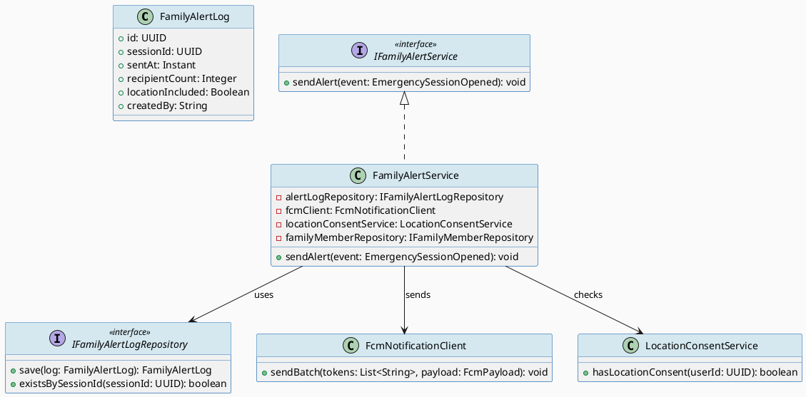
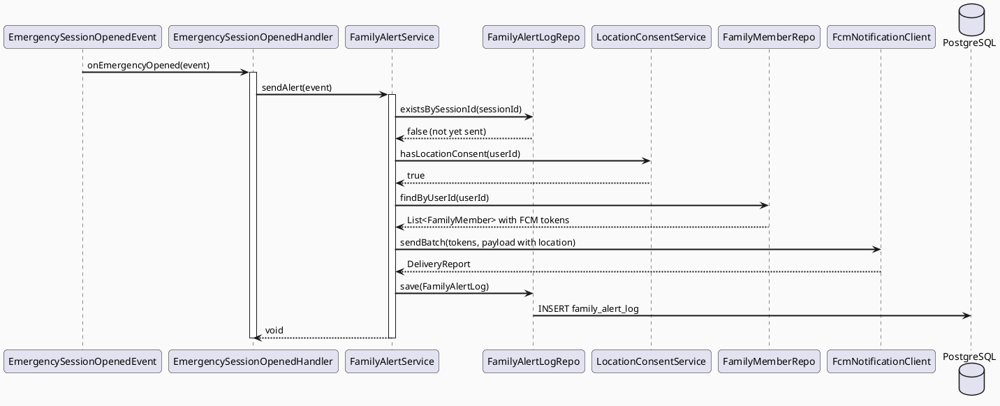
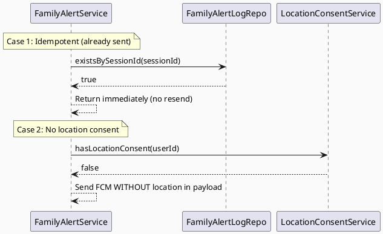

# ENGINEERING DOCUMENTATION STANDARD (EDS) v2.0
# UC65 — Send Family Emergency Alert

| Field | Value |
|-------|-------|
| **Document ID** | `CB-EMERG-IMP-002` |
| **Version** | `1.0` |
| **Date** | `2026-06-26` |
| **Status** | `Draft` |
| **Document Owner** | `AI Agent` |
| **Author** | `AI Agent — Tech Lead` |
| **Reviewed by** | `[ ] Pending` |
| **DPO Sign-off** | `[ ] Pending` *(bắt buộc — module PII: location sharing + FCM notification)* |
| **Approved by** | `[ ] Pending` |
| **Last Review** | `2026-06-26` |
| **Based on EDS** | `v2.0` |

---

## CHANGELOG

| Ngày | Người thực hiện | Nội dung thay đổi |
|------|-----------------|-------------------|
| 2026-06-26 | AI Agent — Tech Lead | Tạo tài liệu lần đầu — TDS cho UC65 Send Family Emergency Alert |

---

## MỤC LỤC

1. [Tổng quan Module](#1-tổng-quan-module)
2. [Ma trận Truy vết (Traceability Matrix)](#2-ma-trận-truy-vết-traceability-matrix)
3. [Architecture Decision Records (ADR)](#3-architecture-decision-records-adr)
4. [Non-Functional Requirements & SLA](#4-non-functional-requirements--sla)
5. [Static Modeling (Mô hình Tĩnh)](#5-static-modeling-mô-hình-tĩnh)
6. [Dynamic Modeling (Mô hình Động)](#6-dynamic-modeling-mô-hình-động)
7. [Domain Event Catalog](#7-domain-event-catalog)
8. [Interface Specification (Đặc tả Giao diện)](#8-interface-specification-đặc-tả-giao-diện)
9. [API Specification](#9-api-specification)
10. [Bảng mã lỗi (Error Codes)](#10-bảng-mã-lỗi-error-codes)
11. [Quy trình Triển khai (Step-by-Step)](#11-quy-trình-triển-khai-step-by-step)
12. [Rollback & Incident Runbook](#12-rollback--incident-runbook)
13. [Kịch bản Kiểm thử Chi tiết](#13-kịch-bản-kiểm-thử-chi-tiết)
14. [Phương pháp Xác minh](#14-phương-pháp-xác-minh)
15. [Mẫu thử thực tế (API Verification Samples)](#15-mẫu-thử-thực-tế-api-verification-samples)
16. [Bảng tổng hợp phân quyền (Authorization Matrix)](#16-bảng-tổng-hợp-phân-quyền-authorization-matrix)
17. [AI Prompt Constraints (CASE 2.0)](#17-ai-prompt-constraints-case-20)

---

## 1. Tổng quan Module

> UC65 gửi thông báo khẩn cấp đến các thành viên gia đình đã đăng ký qua FCM (Firebase Cloud Messaging), bao gồm vị trí của người dùng (nếu có consent). **Idempotent** — cùng `emergencySessionId` chỉ gửi alert 1 lần. Phụ thuộc vào UC62 EmergencySessionOpened event.

| Field | Value |
|-------|-------|
| **Module Name** | `Send Family Emergency Alert` |
| **Bounded Context** | `emergency` |
| **Data Classification** | `Sensitive-PII` *(location data shared với family members)* |
| **Compliance Scope** | `PDPA / Luật 91/2025` |
| **Upstream Dependencies** | `UC62 EmergencySessionOpened event, FCM (Firebase), Location consent` |
| **Downstream Consumers** | `Family member mobile apps (FCM push notification)` |

---

## 2. Ma trận Truy vết (Traceability Matrix)

| Requirement ID | Loại (BR/ADR/US) | Mô tả yêu cầu | Thành phần Code | Compliance Target | ADR liên quan |
|----------------|------------------|---------------|-----------------|-------------------|---------------|
| SRS-3.3.1.42 | User Story | Gửi FCM alert đến family members khi emergency | `FamilyAlertService.sendAlert()` | — | ADR-EMERG-004 |
| BR-EMERG-004 | Business Rule | Chỉ chia sẻ location nếu user đã cấp consent | `FamilyAlertService` | PDPA | ADR-EMERG-005 |
| BR-EMERG-005 | Business Rule | Idempotent: cùng sessionId chỉ gửi 1 alert | `FamilyAlertRepository` | — | ADR-EMERG-004 |
| BR-EMERG-006 | Business Rule | Alert gửi đến TẤT CẢ family members đã đăng ký | `FamilyAlertService` | — | — |
| ADR-EMERG-004 | Decision | Event-driven: trigger từ EmergencySessionOpened | `EmergencySessionOpenedHandler` | — | — |
| ADR-EMERG-005 | Decision | Location sharing: check consent trước khi include lat/lng | `FamilyAlertService` | PDPA | — |

---

## 3. Architecture Decision Records (ADR)

### ADR-EMERG-004 — Event-driven: trigger từ EmergencySessionOpened

| Field | Value |
|-------|-------|
| **Status** | `Accepted` |
| **Deciders** | `AI Agent — Tech Lead` |
| **Date** | `2026-06-26` |
| **Supersedes** | `—` |

#### Bối cảnh (Context)
UC65 nên trigger tự động khi UC62 tạo emergency session — không cần user action thêm.

#### Quyết định (Decision)
`@EventListener(EmergencySessionOpened)` → `FamilyAlertService.sendAlert()`. Không có HTTP endpoint riêng cho UC65.

#### Hệ quả (Consequences)

**Tích cực:**
- Tự động — không cần user thêm bước
- Decoupled từ UC62

**Tiêu cực / Trade-offs:**
- FCM failure không block UC62; cần retry/dead letter queue

---

### ADR-EMERG-005 — Location consent check trước khi share

| Field | Value |
|-------|-------|
| **Status** | `Accepted` |
| **Deciders** | `AI Agent — Tech Lead` |
| **Date** | `2026-06-26` |
| **Supersedes** | `—` |

#### Quyết định (Decision)
Trước khi include `latitude/longitude` trong FCM payload, service phải check `LocationConsentService.hasConsent(userId)`. Nếu không có consent → gửi alert WITHOUT location.

---

## 4. Non-Functional Requirements & SLA

### 4.1. Performance & Availability

| Category | Requirement | Target SLA | Measurement Method | Compliance Basis |
|----------|-------------|------------|---------------------|------------------|
| Alert delivery | FCM delivery | `< 5000ms` after event | FCM delivery report | — |
| Reliability | Alert không bị bỏ sót | 99.9% | Dead letter queue monitoring | — |
| Idempotency | Cùng sessionId chỉ gửi 1 lần | 100% | DB dedup check | — |

### 4.2. Data Integrity & Retention

| Category | Requirement | Target | Verification Method | Compliance Basis |
|----------|-------------|--------|---------------------|------------------|
| Audit | Alert sent record | Append-only | `family_alert_log` table | PDPA |
| Retention | Alert log | 7 năm | DB backup | Luật 91/2025 |

### 4.3. Security

| Category | Requirement | Target | Verification Method | Compliance Basis |
|----------|-------------|--------|---------------------|------------------|
| Consent check | Location KHÔNG share nếu no consent | 100% | Test + log audit | PDPA |
| FCM token security | FCM tokens stored encrypted | AES-256 | DB inspection | PDPA |

### 4.4. Scalability & Capacity Planning

> 1 emergency → N FCM notifications (N = số family members). Scale: async FCM batch send.

---

## 5. Static Modeling (Mô hình Tĩnh)

### 5.1. Class Diagram (PlantUML)



### 5.2. Data Structure (Flyway SQL Migration)

> **Không có migration mới.** UC65 log alerts vào existing `notification_log` hoặc tạo lightweight log table.
> Nếu cần bảng riêng, sử dụng migration **không có số V mới** vì UC65 là part of emergency infrastructure.

Tùy quyết định của architect: nếu cần `family_alert_log`:

```sql
-- Có thể thêm vào V37 hoặc V37b nếu approved
-- family_alert_log table (lightweight)
CREATE TABLE family_alert_log (
  id               UUID          PRIMARY KEY DEFAULT gen_random_uuid(),
  session_id       UUID          NOT NULL UNIQUE,     -- FK to emergency_sessions
  sent_at          TIMESTAMPTZ   NOT NULL DEFAULT NOW(),
  recipient_count  INTEGER       NOT NULL DEFAULT 0,
  location_included BOOLEAN      NOT NULL DEFAULT FALSE,
  created_by       VARCHAR(50)   NOT NULL DEFAULT 'SYSTEM',

  CONSTRAINT fk_alert_session FOREIGN KEY (session_id) REFERENCES emergency_sessions(id)
);
```

---

## 6. Dynamic Modeling (Mô hình Động)

### 6.1. Sequence Diagram — Happy Path (PlantUML)



### 6.2. Sequence Diagram — No Consent / Idempotent Error Path



### 6.3. State Machine

> UC65 là single-shot event processing — không có trạng thái phức tạp. Xử lý xong → ghi log → done.

---

## 7. Domain Event Catalog

### 7.1. Events Published (Phát ra)

| Event Name | Trigger | Publisher | Subscriber(s) | Payload Schema | Async? |
|------------|---------|-----------|---------------|----------------|--------|
| `FamilyAlertSent` | FCM batch gửi thành công | `FamilyAlertService` | `Audit log` | `FamilyAlertSent.java` | Yes |

### 7.2. Events Consumed (Tiêu thụ)

| Event Name | Source | Handler | Action thực hiện |
|------------|--------|---------|------------------|
| `EmergencySessionOpened` | `UC62 EmergencyService` | `EmergencySessionOpenedHandler` | Trigger send family alert |

### 7.3. Payload Schema

```java
// FamilyAlertSent.java
public record FamilyAlertSent(
    UUID    eventId,
    String  eventType,           // "FamilyAlertSent"
    Instant occurredAt,
    String  version,             // "1.0"
    Payload payload,
    Metadata metadata
) implements ApplicationEvent {

    public record Payload(
        UUID    sessionId,
        Integer recipientCount,
        boolean locationIncluded
    ) {}

    public record Metadata(UUID correlationId, String causedBy) {}
}
```

---

## 8. Interface Specification (Đặc tả Giao diện)

### 8.1. Service Interface

```java
// IFamilyAlertService.java
// @version 1.0
public interface IFamilyAlertService {
    /**
     * Send emergency alert to all registered family members via FCM.
     * Idempotent: same sessionId triggers only one send.
     * Location included only if user has location consent.
     * @throws FcmDeliveryException (EMERG-007) khi FCM batch fails
     */
    void sendAlert(EmergencySessionOpened event);
}
```

### 8.2. Repository Interface

```java
// IFamilyAlertLogRepository.java
// @version 1.0
public interface IFamilyAlertLogRepository extends JpaRepository<FamilyAlertLog, UUID> {
    boolean existsBySessionId(UUID sessionId);
    // Không có delete() — Append-only audit log
}
```

---

## 9. API Specification

### 9.1. Endpoints Table

> **UC65 không có user-facing HTTP endpoints.** Triggered by event listener only.

| Method | Path | Auth Level | Note |
|--------|------|------------|------|
| — | — | — | Event-driven via @EventListener |

---

## 10. Bảng mã lỗi (Error Codes)

| Code | HTTP Status | Message (EN) | Message (VI) | Trigger Condition |
|------|-------------|--------------|--------------|-------------------|
| `EMERG-006` | — | Duplicate alert | Alert đã gửi cho session này | `existsBySessionId()` = true |
| `EMERG-007` | — | FCM delivery failed | Gửi thông báo FCM thất bại | FCM batch API lỗi |
| `EMERG-008` | — | No family members found | Không có thành viên gia đình | `findByUserId()` trả empty list |

> Internal error codes — không expose qua HTTP.

---

## 11. Quy trình Triển khai (Step-by-Step)

### 11.1. Prerequisites

- [ ] UC62 emergency_sessions table tồn tại
- [ ] ADR-EMERG-004 và ADR-EMERG-005 đã Accepted
- [ ] FCM credentials configured trong env (FIREBASE_CREDENTIALS)
- [ ] LocationConsentService đã được implement

### 11.2. Pre-Migration Checklist

> Nếu sử dụng `family_alert_log` table riêng: migration cần DPO approval.
- [ ] Quyết định: dùng `family_alert_log` table riêng hay log vào `notification_log`?

### 11.3. Implementation Steps

#### Chặng 1 — Implement FamilyAlertLog entity + Repository

```java
// FamilyAlertLog.java trong package com.carebridge.emergency.entity
```

#### Chặng 2 — Implement FamilyAlertService

```java
// FamilyAlertService.java trong package com.carebridge.emergency.service
// 1. Check existsBySessionId → idempotency
// 2. Check LocationConsentService.hasConsent → location inclusion
// 3. findByUserId family members → FCM tokens
// 4. FCM batch send
// 5. Log FamilyAlertLog
```

#### Chặng 3 — Implement EmergencySessionOpenedHandler

```java
// EmergencySessionOpenedHandler.java
// @EventListener(EmergencySessionOpened.class)
// → familyAlertService.sendAlert(event)
```

### 11.4. Deployment Checklist

- [ ] FCM credentials valid
- [ ] Handler wired (log: "Registered EmergencySessionOpenedHandler")
- [ ] family_alert_log populated after test emergency
- [ ] Location consent check working (no location if no consent)

---

## 12. Rollback & Incident Runbook

### 12.1. Điều kiện kích hoạt Rollback

| Điều kiện | Ngưỡng | Người quyết định |
|-----------|--------|------------------|
| FCM fails > 10% của alerts | > 5 phút | On-call Engineer |
| Location shared without consent | Bất kỳ case nào | Tech Lead + DPO |
| Duplicate alerts sent | > 2 lần cho cùng session | On-call Engineer |

### 12.2. Rollback Procedure

```bash
# Không có migration cần rollback cho UC65 (nếu không có separate table)
kubectl rollout undo deployment/carebridge-api
kubectl rollout status deployment/carebridge-api
```

### 12.3. Notification Protocol

| Thời điểm | Người nhận | Kênh | Template |
|-----------|------------|------|----------|
| Location without consent | DPO ngay lập tức | Email | CRITICAL PDPA violation |
| FCM failure | On-call team | Slack `#incident` | "🚨 FAMILY-ALERT FCM: [mô tả]" |

### 12.4. Post-Incident Review (PIR)

- **Timeline / Root Cause / Impact / Remediation / Prevention**

---

## 13. Kịch bản Kiểm thử Chi tiết

### 13.1. Unit Tests

#### TC-UNIT-001 — Happy path: alert gửi đến family members với location

```gherkin
Feature: Send Family Emergency Alert
  Background:
    Given test data classification: SYNTHETIC
    And user có 2 family members đã đăng ký FCM tokens
    And user đã cấp location consent

  Scenario: Happy path — alert với location
    Given EmergencySessionOpened event với lat=10.7769, lng=106.7009
    And existsBySessionId() = false
    When FamilyAlertService.sendAlert() được gọi
    Then FCM batch gửi tới 2 family members
    And FCM payload chứa lat, lng
    And FamilyAlertLog được ghi với locationIncluded = true

  Scenario: No location consent — alert không có location
    Given user KHÔNG có location consent
    When FamilyAlertService.sendAlert() được gọi
    Then FCM payload KHÔNG chứa lat, lng
    And FamilyAlertLog.locationIncluded = false

  Scenario: Idempotent — sessionId đã gửi
    Given existsBySessionId() = true
    When FamilyAlertService.sendAlert() được gọi lần 2
    Then FCM KHÔNG được gọi
    And KHÔNG log FamilyAlertLog mới
```

**Hàm được test:** `FamilyAlertService.sendAlert()`
**Invariant kiểm tra:** Location consent check; idempotency; FCM called once per session

### 13.2. Integration Tests

#### TC-INT-001 — Event listener trigger

```gherkin
  Scenario: EmergencySessionOpened → alert triggered
    Given Spring context loaded, Testcontainers PostgreSQL
    And FCM mocked
    And family members seeded
    When EmergencySessionOpened event published
    Then family_alert_log has new record with session_id
```

### 13.3. E2E / Security Tests

#### TC-E2E-001 — PDPA: location NOT shared without consent

```gherkin
  Scenario: Location consent check — PDPA compliance
    Given user với NO location consent
    And emergency session với lat=10.7769, lng=106.7009
    When FamilyAlertService.sendAlert()
    Then FCM payload lat = null, lng = null
    And FamilyAlertLog.locationIncluded = false
```

---

## 14. Phương pháp Xác minh

### 14.1. Database Inspection

```sql
-- Verify alert log
SELECT session_id, recipient_count, location_included, sent_at
FROM family_alert_log
WHERE session_id = '[uuid]';

-- Verify no duplicate
SELECT count(*) FROM family_alert_log
WHERE session_id = '[uuid]';
-- Expected: 1
```

### 14.2. Log / Audit Verification

```bash
# Verify FCM sent
kubectl logs -l app=carebridge-api | grep '"eventType":"FamilyAlertSent"' | head -5

# PDPA check: no location in logs when no consent
kubectl logs -l app=carebridge-api | grep "location" | grep "consent=false"
# Expected: "location omitted due to no consent"
```

---

## 15. Mẫu thử thực tế (API Verification Samples)

> UC65 không có HTTP endpoint. Verification qua DB và FCM delivery report.

```bash
# Verify family_alert_log
psql -h $DB_HOST -U $DB_USER -d carebridge \
  -c "SELECT * FROM family_alert_log WHERE session_id = '$EMERGENCY_SESSION_ID';"
```

---

## 16. Bảng tổng hợp phân quyền (Authorization Matrix)

> UC65 là event-driven internal service — không có HTTP authorization matrix.

| Component | Access | Description |
|-----------|--------|-------------|
| `FamilyAlertService` | SYSTEM only | Event-driven — no HTTP |
| `family_alert_log` | SYSTEM write / ADMIN read | Audit log |
| FCM | SYSTEM | Firebase credentials SYSTEM-only |

---

## 17. AI Prompt Constraints (CASE 2.0)

### 17.1 Constraint Summary Table

| # | Constraint | Source (ADR/BR) | Last Verified |
|---|-----------|-----------------|---------------|
| C1 | Idempotent: check `existsBySessionId()` trước khi gửi — skip nếu đã có | `ADR-EMERG-004 / BR-EMERG-005` | `2026-06-26` |
| C2 | Location CHỈ include trong FCM payload nếu `LocationConsentService.hasConsent() = true` | `ADR-EMERG-005 / BR-EMERG-004 / PDPA` | `2026-06-26` |
| C3 | Trigger CHỈ qua @EventListener(EmergencySessionOpened) — KHÔNG có HTTP endpoint | `ADR-EMERG-004` | `2026-06-26` |
| C4 | FCM failure KHÔNG block emergency session — log error, continue | `ADR-EMERG-004` | `2026-06-26` |
| C5 | Gửi đến TẤT CẢ family members đã đăng ký — không chọn lọc | `BR-EMERG-006` | `2026-06-26` |

### 17.2 Constraint Injection Block (Copy-Paste vào AI Prompt)

```
[CONSTRAINT BLOCK — Module: Send Family Emergency Alert — CB-EMERG-IMP-002]
Theo TDS CB-EMERG-IMP-002 và các ADR liên quan:

1. Check existsBySessionId() TRƯỚC khi gửi — nếu true → skip (idempotent) (ADR-EMERG-004/BR-EMERG-005)
2. Location CHỈ include trong FCM nếu hasLocationConsent(userId)=true — else omit (ADR-EMERG-005/PDPA)
3. Trigger CHỈ qua @EventListener — không HTTP endpoint (ADR-EMERG-004)
4. FCM failure → log + continue; KHÔNG throw exception block emergency flow (ADR-EMERG-004)
5. Gửi đến TẤT CẢ family members từ findByUserId() — không filter (BR-EMERG-006)

[CONTEXT BLOCK]
- Bounded Context: emergency (CRITICAL)
- Data Classification: Sensitive-PII (location sharing)
- Compliance: PDPA / Luật 91/2025
- Existing interfaces: §8 Service Interface + §8.2 Repository Interface
- Error codes: §10 Error Codes Table
- Auth matrix: §16 (SYSTEM-only)

[TASK BLOCK]
Implement FamilyAlertService.sendAlert() thỏa mãn constraints trên.
Output phải tuân thủ §8 Interface Specification.
Tests phải cover §13 Test Scenarios.
```

### 17.3 Constraint Quality Checklist

- [x] Mỗi constraint traceable về ADR hoặc BR cụ thể
- [x] Không có constraint generic
- [x] Mỗi constraint có `Last Verified` date ≤ 2 sprints
- [x] Constraint block có ≥ 3 constraints cụ thể (có 5)
- [x] Constraint block reference §8 Interface
- [x] Constraint block reference §16 Auth Matrix

### 17.4 Anti-Pattern Detection

| AP-ID | Anti-Pattern | Dấu hiệu | Hành động |
|-------|-------------|-----------|----------|
| AP-AI-001 | Unconstrained Gen | Code không check location consent | Reject — enforce C2 |
| AP-AI-003 | Implicit Decision | Code thêm HTTP endpoint không có ADR | Reject — enforce C3 |
| AP-AI-005 | Hallucinated Contract | Code import FcmService không có trong §8 | Reject — verify |

---

## PHỤ LỤC

### A. Glossary

| Thuật ngữ | Định nghĩa |
|-----------|------------|
| FCM | Firebase Cloud Messaging — push notification service |
| Location Consent | Sự đồng ý của người dùng để chia sẻ vị trí địa lý |
| Idempotent | Gọi nhiều lần với cùng sessionId → chỉ gửi 1 alert |
| Family Member | Thành viên gia đình đã đăng ký nhận thông báo khẩn cấp |

### B. Tài liệu tham chiếu

| Document | Link / Path |
|----------|-------------|
| SRS UC-65 | `02_Requirements/SRS/Functional_Specifications.md §3.3.1.42` |
| UC62 TDS | `04_Implement/UC62_OpenEmergencyFlow/UC62_OpenEmergencyFlow_TDS.md` |
| EDS v2.0 Template | `08_References/Template/PHASE-3_TDS.md` |
