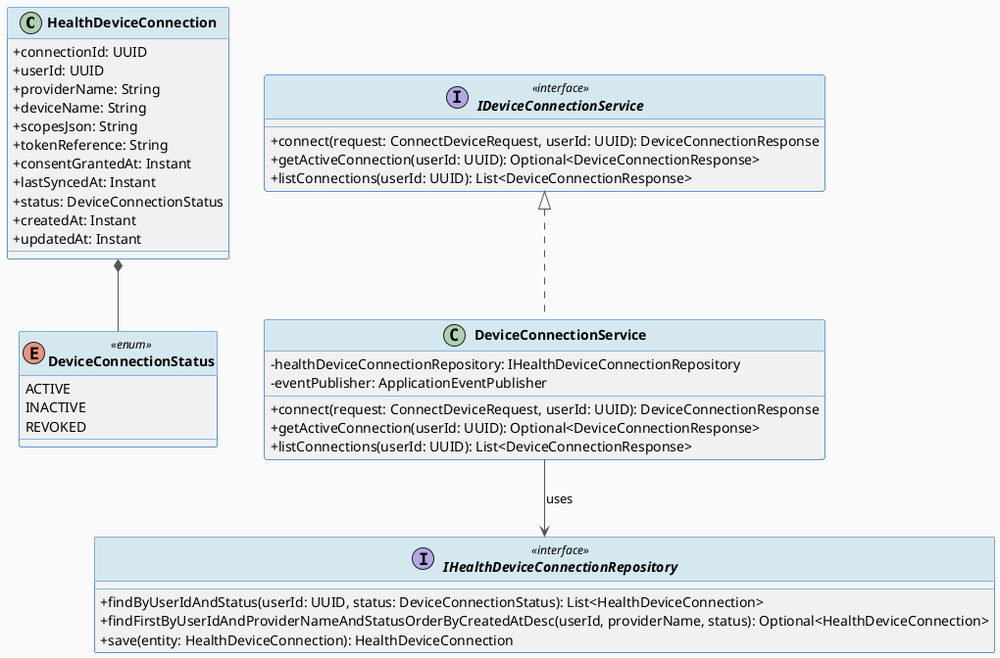
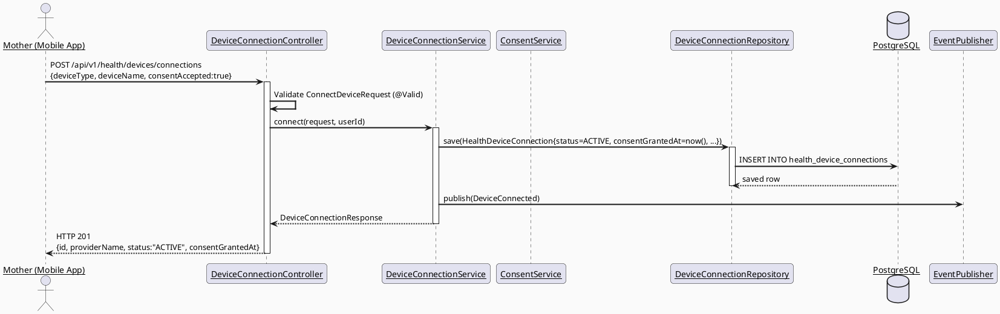
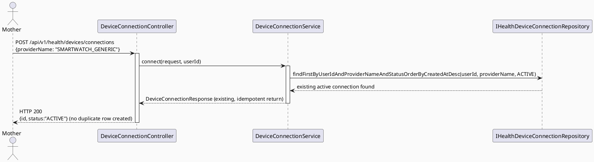
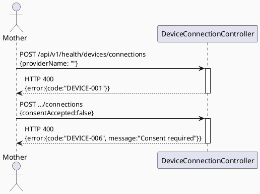
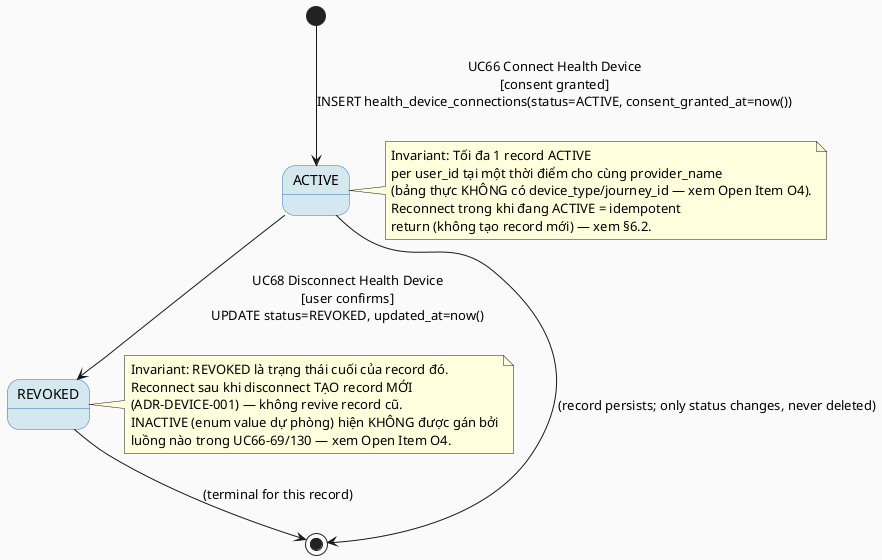

# ENGINEERING DOCUMENTATION STANDARD (EDS) v2.0
# UC66 — Connect Health Device

| Field | Value |
|-------|-------|
| **Document ID** | `CB-DEVICE-IMP-001` |
| **Version** | `1.0` |
| **Date** | `2026-07-01` |
| **Status** | `Draft` |
| **Document Owner** | `TV2-Bách` |
| **Author** | `AI Agent — Technical Architect` |
| **Reviewed by** | `[ ] Pending` |
| **DPO Sign-off** | `[ ] Pending` *(bắt buộc — module xử lý health/wearable data + consent)* |
| **Approved by** | `[ ] Pending` |
| **Last Review** | `2026-07-01` |
| **Based on EDS** | `v2.0` |

---

## CHANGELOG

> **Policy 4.4 — Immutable History:** Không bao giờ xóa thông tin cũ. Mọi thay đổi phải ghi vào bảng này.

| Ngày | Người thực hiện | Nội dung thay đổi |
|------|-----------------|-------------------|
| 2026-07-01 | AI Agent — Technical Architect | Tạo tài liệu lần đầu — TDS cho UC66 Connect Health Device (Draft) |
| 2026-07-02 | AI Agent — Technical Architect (reconciliation) | **Corrected schema reference:** `device_connections` (invented, did not exist) → `health_device_connections` (real, `V1__init_schema.sql` L1115) — reconciled with UC130's independently-verified schema research (see `UC130_SyncHealthDeviceData_TDS.md` ADR-SYNC-001). Retracted proposed migration `V20260701140000__create_device_connections.sql` — no migration needed. Entity renamed `DeviceConnection` → `HealthDeviceConnection` with fields matching real columns (`connectionId`, `userId`, `providerName`, `deviceName`, `scopesJson`, `tokenReference`, `consentGrantedAt`, `lastSyncedAt`, `status`, `createdAt`, `updatedAt`). Removed invented `journeyId` FK (real table has no such column — see new Open Item O4) and invented `consentGrantId` FK to `consent_grants` (real table has no such FK — uses its own `consent_granted_at` column instead, simplest option per BR-PRIVACY, consistent with UC130 ADR-SYNC-004). `DeviceConnectionStatus` enum changed from `CONNECTED/DISCONNECTED` to `ACTIVE/INACTIVE/REVOKED` to match real column `status varchar(20) DEFAULT 'ACTIVE'` (no DB CHECK constraint) — aligned with UC130's class diagram. `DeviceType` enum (with CHECK constraint) dropped — real schema has free-text `provider_name varchar(80)` instead, no enum enforcement at DB level. |

---

## MỤC LỤC

1. [Tổng quan Module](#1-tổng-quan-module)
2. [Ma trận Truy vết (Traceability Matrix)](#2-ma-trận-truy-vết-traceability-matrix)
3. [Architecture Decision Records (ADR)](#3-architecture-decision-records-adr)
4. [Non-Functional Requirements & SLA](#4-non-functional-requirements--sla)
5. [Static Modeling (Mô hình Tĩnh)](#5-static-modeling-mô-hình-tĩnh)
6. [Dynamic Modeling (Mô hình Động)](#6-dynamic-modeling-mô-hình-động)
7. [Domain Event Catalog](#7-domain-event-catalog)
8. [Interface Specification (Đặc tả Giao diện)](#8-interface-specification-đặc-tả-giao-diện)
9. [API Specification](#9-api-specification)
10. [Bảng mã lỗi (Error Codes)](#10-bảng-mã-lỗi-error-codes)
11. [Quy trình Triển khai (Step-by-Step)](#11-quy-trình-triển-khai-step-by-step)
12. [Rollback & Incident Runbook](#12-rollback--incident-runbook)
13. [Kịch bản Kiểm thử Chi tiết](#13-kịch-bản-kiểm-thử-chi-tiết)
14. [Phương pháp Xác minh](#14-phương-pháp-xác-minh)
15. [Mẫu thử thực tế (API Verification Samples)](#15-mẫu-thử-thực-tế-api-verification-samples)
16. [Bảng tổng hợp phân quyền (Authorization Matrix)](#16-bảng-tổng-hợp-phân-quyền-authorization-matrix)
17. [AI Prompt Constraints (CASE 2.0)](#17-ai-prompt-constraints-case-20)

---

## 1. Tổng quan Module

> UC66 cho phép Mother kết nối một wearable/health platform (smartwatch, health app) với CareBridge sau khi cấp consent tường minh. Đây là bước khởi đầu của vòng đời "Device Sync" chung cho UC66 (Connect) → UC67 (Import/Sync data) → UC68 (Disconnect) → UC69 (View Trend). Bốn UC này chia sẻ một entity trạng thái kết nối duy nhất: `HealthDeviceConnection` (map trực tiếp vào bảng **thực đã tồn tại** `health_device_connections`, `V1__init_schema.sql` dòng 1115 — xem CHANGELOG 2026-07-02 và §5.2).

| Field | Value |
|-------|-------|
| **Module Name** | `Connect Health Device` |
| **Bounded Context** | `health` (sub-package `health.device`) |
| **Data Classification** | `Sensitive-PII` *(liên kết thiết bị sức khỏe cá nhân + health data provenance)* |
| **Compliance Scope** | `PDPA / Luật 91/2025` |
| **Upstream Dependencies** | `IAM (JWT)`, `consent` module (`ConsentGrant`, `ConsentService`), `carejourney` (`mother_journeys`) |
| **Downstream Consumers** | `UC67 ImportDeviceDataManually`, `UC68 DisconnectHealthDevice`, `UC69 ViewDeviceDataTrend`, `health.MaternalHealthMetric` (provenance link) |

**Nguồn gốc & phạm vi:**
- Function spec: `02_Requirements/SRS/3_Functional_Specification.md §3.3.1.43` (dòng 2662-2679), UC-66.
- Task allocation: `04_Implement/implement_artifacts/function-spec-task-allocation.md` dòng 676-677 — owner TV2-Bách, sprint "Device Sync And Care Edge Cases".
- Primary Actor: Mother. Secondary Actor: Smartwatch/Wearable Device. Platform: Mobile App (Health module). Priority: High.
- **In-scope:** Khởi tạo kết nối thiết bị (chọn loại/nguồn thiết bị), capture consent cho việc truy cập dữ liệu sức khỏe từ thiết bị, lưu trạng thái kết nối (`CONNECTED`), phát sự kiện `DeviceConnected`.
- **Out-of-scope:** Đồng bộ dữ liệu thực từ thiết bị theo thời gian thực (real-time sync qua SDK) — đây là `3.1.2.4 Sync Health Device Data` (task riêng, KHÔNG thuộc 4 UC này); nhập dữ liệu thủ công (UC67); ngắt kết nối (UC68); xem xu hướng (UC69).
- **Preconditions/Postconditions:** Theo bảng UC-66 gốc (PRE-1..4, POST-1..3) — xem §2 Traceability.

---

## 2. Ma trận Truy vết (Traceability Matrix)

| Requirement ID | Loại (BR/ADR/US) | Mô tả yêu cầu | Thành phần Code | Compliance Target | ADR liên quan |
|----------------|------------------|---------------|-----------------|-------------------|---------------|
| UC-66 (SRS §3.3.1.43) | User Story | Mother kết nối wearable/health platform sau khi consent | `DeviceConnectionController.POST /api/v1/health/devices/connections` | — | ADR-DEVICE-001 |
| PRE-3 / BR-RBAC | Business Rule | Chỉ actor đã xác thực với role phù hợp (MOTHER) mới connect | `DeviceConnectionService.connect()` + `@PreAuthorize` | — | — |
| BR-PRIVACY | Business Rule | Kết nối thiết bị bắt buộc capture consent (`consent_granted_at`) trước khi lưu trạng thái ACTIVE | `DeviceConnectionService` (set `consent_granted_at` trực tiếp — không dual-write `ConsentGrant`, xem ADR-DEVICE-002) | PDPA / Luật 91/2025 | ADR-DEVICE-002 |
| BR-CONSULTATION | Business Rule | Vòng đời kết nối phải auditable (trạng thái + audit trail) | `HealthDeviceConnection.status`, `created_at/updated_at`, `DeviceConnected` event | — | ADR-DEVICE-001 |
| POST-3 | Postcondition | Sensitive actions (connect) phải được ghi nhận cho audit | `DeviceConnected` event + `created_by` | PDPA | ADR-DEVICE-003 |
| E1 (Exceptions) | Exception Flow | Access denied khi actor không auth hoặc không đúng ownership | `DeviceConnectionController` (403) | — | — |
| E2 (Exceptions) | Exception Flow | Dữ liệu thiếu/invalid (providerName/deviceName) bị reject | `ConnectDeviceRequest` validation | — | — |
| ADR-DEVICE-001 | Decision | State machine dùng chung cho UC66/UC68, trên bảng thực `health_device_connections`: `ACTIVE → REVOKED` (mapped từ `status varchar(20) DEFAULT 'ACTIVE'`, không CHECK constraint) | `HealthDeviceConnection.status` enum `DeviceConnectionStatus{ACTIVE,INACTIVE,REVOKED}` | — | — |
| ADR-DEVICE-002 | Decision | Consent bắt buộc trước khi transition sang ACTIVE; dùng cột thực `consent_granted_at` trên `health_device_connections` (KHÔNG dual-write sang `consent_grants` — xem Decision đã sửa) | `DeviceConnectionService.connect()` | PDPA Art. (Luật 91/2025 Đ.13) | — |
| ADR-DEVICE-003 | Decision | Không hard-delete kết nối — append-only lifecycle, dùng trạng thái + cột thực (không có `disconnected_at` riêng — dùng `updated_at`, xem Open Item O5) | `HealthDeviceConnection` (không có phương thức `delete()`) | GDPR-equivalent Art. 5.1(e) | — |

---

## 3. Architecture Decision Records (ADR)

### ADR-DEVICE-001 — Device Connection Lifecycle State Machine on Real Schema `health_device_connections` (dùng chung UC66/UC68)

| Field | Value |
|-------|-------|
| **Status** | `Accepted` (re-affirmed after schema correction — see CHANGELOG 2026-07-02) |
| **Deciders** | `AI Agent — Technical Architect` |
| **Date** | `2026-07-01` (original) / `2026-07-02` (corrected) |
| **Supersedes** | Original version of this ADR, which assumed an invented table `device_connections` — see CHANGELOG. |

#### Bối cảnh (Context)
UC66 (Connect) và UC68 (Disconnect) thao tác trên cùng một thực thể kết nối thiết bị. **Xác minh trực tiếp `V1__init_schema.sql` dòng 1115-1127 xác nhận bảng `health_device_connections` đã tồn tại sẵn** (baseline schema), với cột `status varchar(20) NOT NULL DEFAULT 'ACTIVE'` — KHÔNG có CHECK constraint giới hạn giá trị. Bản gốc của TDS này (2026-07-01) tuyên bố sai rằng schema là "greenfield" và đề xuất tạo bảng mới `device_connections` — đây là lỗi nghiên cứu đã được UC130's TDS phát hiện độc lập (xem ADR-SYNC-001 trong `UC130_SyncHealthDeviceData_TDS.md`) và xác nhận lại ở đây.

#### Các phương án đã xem xét (Options Considered)

| Phương án | Mô tả | Ưu điểm | Nhược điểm |
|-----------|-------|----------|------------|
| A | Dùng bảng thực `health_device_connections`, ánh xạ trạng thái sang enum `ACTIVE / INACTIVE / REVOKED` (khớp `DEFAULT 'ACTIVE'`, không CHECK constraint) | Không tạo bảng dư thừa, tận dụng đúng cột đã có (`token_reference`, `scopes_json`, `last_synced_at` — vốn được thiết kế cho auto-sync/UC130), nhất quán với UC130 | Cần bỏ state name `CONNECTED/DISCONNECTED` cũ, đổi sang `ACTIVE/REVOKED` |
| B (đã loại bỏ) | Tạo bảng mới `device_connections` riêng cho UC66-69 | — | Vi phạm CLAUDE.md ("current code/migrations là nguồn sự thật"); tạo bảng trùng chức năng với `health_device_connections` đã có sẵn — nợ kỹ thuật nghiêm trọng nếu implement |

#### Quyết định (Decision)
Chọn **Phương án A**. Bảng `health_device_connections` (đã tồn tại, KHÔNG tạo mới) là append-only theo nghĩa không xóa record — disconnect chỉ set `status = 'REVOKED'` (UC68 dùng `REVOKED` thay vì `DISCONNECTED` cũ — xem UC68 TDS CHANGELOG). Kết nối lại tạo **record mới** (không tái sử dụng record cũ) để giữ lịch sử đầy đủ mỗi lần connect/disconnect. `INACTIVE` được giữ trong enum (dự phòng cho trạng thái tạm ngưng không do user chủ động — hiện KHÔNG có luồng nào trong UC66-69/130 gán giá trị này, đánh dấu Open — xem Open Item O4).

#### Hệ quả (Consequences)

**Tích cực:**
- Không tạo bảng dư thừa — nhất quán tuyệt đối với UC130 (đã dùng `health_device_connections`/`device_measurements`).
- Lịch sử kết nối/ngắt kết nối được giữ nguyên vẹn cho audit (POST-3, BR-CONSULTATION).
- UC66 và UC68 dùng chung 1 entity (`HealthDeviceConnection`), 1 repository, tránh trùng lặp logic.

**Tiêu cực / Trade-offs:**
- Có thể có nhiều record `REVOKED` lịch sử cho cùng 1 `user_id` — cần index + query "current active connection" (`status = 'ACTIVE'`) để tránh nhầm lẫn. Vì bảng thực chỉ có `user_id` (không có `device_type`/`journey_id` — xem Open Item O4), việc phân biệt "nhiều connection cùng loại thiết bị" của cùng 1 user phải dựa vào `provider_name`/`device_name` (free-text, không enum) thay vì unique constraint chặt.

**Compliance Impact:**
- Hỗ trợ yêu cầu audit trail của BR-CONSULTATION và PDPA (chứng minh được thời điểm consent/kết nối) — dùng cột thực `consent_granted_at`.

---

### ADR-DEVICE-002 — Consent Capture Required Before ACTIVE Transition (Uses Real `consent_granted_at` Column, No Dual-Write)

| Field | Value |
|-------|-------|
| **Status** | `Accepted` (re-affirmed after schema correction — see CHANGELOG 2026-07-02) |
| **Deciders** | `AI Agent — Technical Architect` |
| **Date** | `2026-07-01` (original) / `2026-07-02` (corrected) |
| **Supersedes** | Original version of this ADR (dual-write to `consent_grants` + `consent_grant_id` FK — dropped, see below). |

#### Bối cảnh (Context)
BR-PRIVACY yêu cầu dữ liệu sức khỏe/gia đình phải theo "consent, purpose, and minimum-necessary access rules". SRS UC-66 Description ghi rõ: "Connects a wearable or health platform **after user consent**". Bản gốc của ADR này (2026-07-01) đề xuất dual-write: gọi `ConsentService.grant()` tạo `ConsentGrant` record, VÀ lưu thêm `consent_grant_id` (FK) trên bảng tự-đề-xuất `device_connections`. Xác minh lại trên bảng thực `health_device_connections`: cột duy nhất liên quan đến consent là `consent_granted_at timestamptz` — KHÔNG có cột `consent_grant_id`, KHÔNG có FK tới `consent_grants`.

#### Các phương án đã xem xét (Options Considered)

| Phương án | Mô tả | Ưu điểm | Nhược điểm |
|-----------|-------|----------|------------|
| A | Dual-write: vẫn gọi `ConsentService.grant()` để tạo `ConsentGrant` audit record CHÍNH THỨC, đồng thời set `consent_granted_at` trên `health_device_connections` (không có cột FK để lưu `consent_grant_id` — chỉ lưu timestamp) | Audit tập trung qua `consent_grants` (nhất quán module khác) + timestamp nhanh không cần join | Yêu cầu thêm 1 write phụ mỗi lần connect; không thể trace ngược từ `health_device_connections` về `consent_grants.id` cụ thể (không có FK column) — giảm giá trị của dual-write |
| B (chọn — đơn giản nhất, khớp UC130) | CHỈ dùng cột thực `consent_granted_at` trên `health_device_connections` — KHÔNG gọi `ConsentService.grant()`/không tạo `ConsentGrant` record riêng cho device data | Đơn giản nhất, khớp chính xác schema thực, nhất quán với UC130 ADR-SYNC-004 (chỉ kiểm tra `consent_granted_at IS NOT NULL`), không cần ALTER TABLE thêm cột | Mất tính năng audit tập trung qua `consent_grants` cho riêng device consent — nhưng `health_device_connections` tự nó đã là audit trail đầy đủ (có `created_at`/`updated_at`/`consent_granted_at`) |

#### Quyết định (Decision)
Chọn **Phương án B** — phương án đơn giản nhất thỏa mãn BR-PRIVACY mà không cần invent schema mới, nhất quán với quyết định của UC130 (ADR-SYNC-004: chỉ re-check `consent_granted_at IS NOT NULL` mỗi lần, không phụ thuộc bảng `consent_grants`). `DeviceConnectionService.connect()` set `consent_granted_at = now()` trực tiếp trên `health_device_connections` khi `consentAccepted=true`; KHÔNG gọi `ConsentService.grant()`, KHÔNG tạo `ConsentGrant` record cho luồng này.

#### Hệ quả (Consequences)

**Tích cực:**
- Khớp chính xác với schema thực — không cần migration ALTER thêm cột `consent_grant_id`.
- Nhất quán với UC130 (cùng đọc/ghi `consent_granted_at`).
- Đơn giản hóa: không phải đồng bộ 2 nơi (`ConsentGrant.revokedAt` và `health_device_connections.status`) khi disconnect — chỉ 1 nơi duy nhất (xem UC68 TDS ADR-DEVICE-007, cũng được sửa tương ứng).

**Tiêu cực / Trade-offs:**
- Device consent KHÔNG xuất hiện trong `consent_grants` audit table dùng chung cho các module khác — nếu về sau cần báo cáo tổng hợp "tất cả consent của user" xuyên suốt hệ thống, cần query riêng `health_device_connections.consent_granted_at` thay vì join `consent_grants`. Đánh dấu Open (xem Open Item O5) nếu Tech Lead muốn audit tập trung sau này.

**Compliance Impact:**
- Đáp ứng PDPA/Luật 91/2025 yêu cầu ghi nhận thời điểm cấp quyền truy cập dữ liệu sức khỏe qua `consent_granted_at`.

> **Open Item đã đóng (trước đây RG-4):** `ConsentDataType.DEVICE_DATA` không còn cần thiết — Phương án B không dùng `ConsentGrant`/`ConsentDataType` cho luồng connect device nữa.

---

### ADR-DEVICE-003 — Wearable SDK / Provider Integration: Deferred to ADR, Mock-first

| Field | Value |
|-------|-------|
| **Status** | `Proposed` *(chưa Accepted — cần quyết định bổ sung)* |
| **Deciders** | `[ ] Pending — Tech Lead / TV2-Bách` |
| **Date** | `2026-07-01` |
| **Supersedes** | `—` |

#### Bối cảnh (Context)
SRS UC-66 chỉ mô tả "Connects a wearable or health platform after user consent" — không chỉ định vendor SDK (Apple HealthKit, Google Fit/Health Connect, Fitbit API, v.v.). Task allocation (`function-spec-task-allocation.md` dòng 698) ghi: "Device sync works through real provider if available, **otherwise manual import plus stable mock remains**." Mobile app hiện chỉ có placeholder `lib/integrations/wearable/.gitkeep` — chưa có implementation nào.

#### Các phương án đã xem xét (Options Considered)

| Phương án | Mô tả | Ưu điểm | Nhược điểm |
|-----------|-------|----------|------------|
| A | Mock-first: `HealthDeviceConnection` lưu `providerName` (free-text do người dùng chọn/nhập thủ công từ danh sách hỗ trợ ở tầng UI, không CHECK constraint ở DB), không tích hợp SDK thật ở giai đoạn này | Không block delivery bởi quyết định vendor, phù hợp "manual import plus stable mock" | Không có dữ liệu tự động thật — chỉ đáp ứng UC66 (connect) + UC67 (manual import), KHÔNG đáp ứng `3.1.2.4 Sync Health Device Data` (auto-sync) |
| B | Tích hợp ngay 1 SDK cụ thể (vd Google Health Connect) | Trải nghiệm thật hơn | Không có cơ sở nguồn (SRS không chỉ định), rủi ro invent architecture decision không có approval |

#### Quyết định (Decision)
Chọn **Phương án A** cho phạm vi 4 UC này (UC66/67/68/69). Việc tích hợp SDK thật (native platform channel Flutter, ví dụ `health` package hoặc vendor-specific plugin) thuộc phạm vi `3.1.2.4 Sync Health Device Data` — **KHÔNG thuộc 4 TDS này** và cần ADR riêng khi được giao.

#### Hệ quả (Consequences)

**Tích cực:** Không trì hoãn UC66/67/68/69 vì thiếu quyết định vendor.

**Tiêu cực / Trade-offs:** Mobile "Connect Device" flow ở giai đoạn này thực chất là "đăng ký ý định kết nối + chọn loại thiết bị" chứ chưa pair thật với hardware qua Bluetooth/SDK.

> **Open Item (RG-4/RG-6):** Wearable SDK vendor choice là **Open** — cần quyết định của Tech Lead/Product Owner trước khi implement `3.1.2.4 Sync Health Device Data`. TDS này không tự ý chọn vendor.

---

## 4. Non-Functional Requirements & SLA

### 4.1. Performance & Availability

| Category | Requirement | Target SLA | Measurement Method | Compliance Basis |
|----------|-------------|------------|---------------------|------------------|
| Latency | API response (p99) | `< 300ms` | k6 load test | — |
| Availability | Uptime (monthly) | `99.9%` | Uptime monitor | — |

### 4.2. Data Integrity & Retention

| Category | Requirement | Target | Verification Method | Compliance Basis |
|----------|-------------|--------|---------------------|------------------|
| Durability | Không mất record kết nối | RPO = 0 | Transaction log | PDPA |
| Retention | `health_device_connections` (bao gồm `consent_granted_at`, không dùng bảng `consent_grants` riêng — xem ADR-DEVICE-002) | Theo vòng đời tài khoản user | DB policy | PDPA / Luật 91/2025 |
| Consistency | `consent_granted_at` ↔ `HealthDeviceConnection.status` đồng bộ | 100% | Transactional service method | PDPA |

### 4.3. Security

| Category | Requirement | Target | Verification Method | Compliance Basis |
|----------|-------------|--------|---------------------|------------------|
| Encryption in transit | TLS 1.3+ | Tất cả endpoints | SSL Labs scan | PDPA |
| Access control | Role-based, ownership-scoped (chỉ Mother sở hữu record) | Least privilege | Auth Matrix (§16) | BR-RBAC |
| Audit | Mọi connect/disconnect action phát domain event | 100% | Log/event assertion | BR-CONSULTATION |

### 4.4. Scalability & Capacity Planning

> Chưa có số liệu tải cụ thể từ nguồn — **Open**. Giả định tải thấp (1 thao tác connect/user/session), không cần thiết kế đặc biệt cho throughput cao ở giai đoạn này.

---

## 5. Static Modeling (Mô hình Tĩnh)

### 5.1. Class Diagram (PlantUML)



### 5.2. Data Structure (Flyway SQL Migration)

> **CORRECTED (2026-07-02 — xem CHANGELOG):** Tuyên bố gốc của mục này ("Không có bảng `device_connections`, `wearable`, hoặc `device` nào tồn tại trong schema hiện tại — đã xác minh — greenfield") là **SAI**. Xác minh trực tiếp `V1__init_schema.sql` xác nhận bảng `health_device_connections` **ĐÃ TỒN TẠI SẴN** (dòng 1115-1127), với PK `connection_id` (dòng 1467-1468), FK `user_id → users.user_id` (dòng 1927-1928), và index `idx_health_device_connections_user_id` (dòng 1660). Phát hiện này được UC130's TDS xác nhận độc lập (`UC130_SyncHealthDeviceData_TDS.md` ADR-SYNC-001).
>
> **No migration needed — `health_device_connections` already exists in `V1__init_schema.sql`, verified [line 1115].** Migration `V20260701140000__create_device_connections.sql` được đề xuất trước đây bị **rút lại hoàn toàn** — KHÔNG tạo bảng dư thừa.

```sql
-- Bảng thực đã tồn tại (V1__init_schema.sql, dòng 1115-1127) — chỉ liệt kê để tham chiếu, KHÔNG cần chạy lại:
-- CREATE TABLE public.health_device_connections (
--     connection_id      uuid         NOT NULL DEFAULT gen_random_uuid(),
--     user_id            uuid         NOT NULL,
--     provider_name      varchar(80)  NOT NULL,
--     device_name        varchar(150),
--     scopes_json        jsonb,
--     token_reference    text,
--     consent_granted_at timestamptz,
--     last_synced_at     timestamptz,
--     status             varchar(20)  NOT NULL DEFAULT 'ACTIVE',
--     created_at         timestamptz  NOT NULL DEFAULT now(),
--     updated_at         timestamptz  NOT NULL DEFAULT now()
-- );
```

**Gap review — schema thực so với entity Java cần thiết:**
- Không có cột `journey_id` — UC66 gốc giả định 1 FK tới `mother_journeys` không tồn tại trên bảng thực. Xem Open Item O4.
- Không có cột `consent_grant_id`/`disconnected_at`/`connected_at` riêng — dùng `consent_granted_at` (consent), `created_at` (thời điểm connect), `updated_at` (thời điểm thay đổi trạng thái gần nhất, bao gồm disconnect). Xem Open Item O5.
- `provider_name varchar(80) NOT NULL` thay thế cho `device_type` enum tự-đề-xuất trước đây — free-text, KHÔNG có CHECK constraint ở DB. Validation danh sách provider hợp lệ (nếu cần) thực hiện ở tầng Java/DTO, không phải DB CHECK.
- `status varchar(20) NOT NULL DEFAULT 'ACTIVE'` — KHÔNG có CHECK constraint. Enum Java `ACTIVE/INACTIVE/REVOKED` là quy ước tầng ứng dụng (nhất quán với UC130's class diagram).

**V1__init_schema.sql sync action:** KHÔNG chỉnh sửa `V1__init_schema.sql`. Không có migration mới nào được tạo cho UC66 — bảng đã sẵn sàng để dùng ngay.

---

## 6. Dynamic Modeling (Mô hình Động)

### 6.1. Sequence Diagram — Happy Path (PlantUML)



### 6.2. Sequence Diagram — Alternative Flow: Already Connected (Reconnect)



### 6.3. Sequence Diagram — Error Path (PlantUML)



### 6.4. State Machine — Device Connection Lifecycle (spans UC66 + UC68)



> **⚠️ Invariant bất biến:**
> 1. Không bao giờ xóa record `health_device_connections` (append-only theo trạng thái).
> 2. Tối đa 1 record `ACTIVE` cho mỗi `(user_id, provider_name)` tại một thời điểm — enforced ở service layer (kiểm tra trước khi INSERT) vì không có UNIQUE constraint composite trên bảng thực (và không có device_type/journey_id để scope thêm — xem Open Item O4).
> 3. Consent phải tồn tại (`consent_granted_at` NOT NULL khi status=ACTIVE) trước khi transition sang ACTIVE.

---

## 7. Domain Event Catalog

### 7.1. Events Published (Phát ra)

| Event Name | Trigger | Publisher | Subscriber(s) | Payload Schema | Async? |
|------------|---------|-----------|---------------|----------------|--------|
| `DeviceConnected` | Kết nối thiết bị thành công (consent granted + record ACTIVE) | `DeviceConnectionService` | `UC69 ViewDeviceDataTrend` (hiển thị badge "connected"), Audit log sink | `DeviceConnected.java` | Yes |

### 7.2. Events Consumed (Tiêu thụ)

> UC66 không consume events từ module khác.

### 7.3. Payload Schema

```java
// DeviceConnected.java
package com.carebridge.backend.health.device.event;

public record DeviceConnected(
    UUID    eventId,
    String  eventType,        // "DeviceConnected"
    Instant occurredAt,
    String  version,          // "1.0"
    Payload payload,
    Metadata metadata
) implements ApplicationEvent {

    public record Payload(
        UUID   deviceConnectionId,  // health_device_connections.connection_id
        UUID   userId,
        String providerName,        // health_device_connections.provider_name (free-text)
        String deviceName
    ) {}

    public record Metadata(
        UUID   correlationId,
        String causedBy        // userId as string
    ) {}
}
```

---

## 8. Interface Specification (Đặc tả Giao diện)

### 8.1. Service Interface

```java
// ConnectDeviceRequest.java — Input DTO
// @version 1.0
package com.carebridge.backend.health.device.dto;

public class ConnectDeviceRequest {
    @NotBlank
    @Size(max = 80)
    private String providerName;        // required — free-text, maps to health_device_connections.provider_name varchar(80)

    @Size(max = 150)
    private String deviceName;          // optional — user-friendly label, maps to varchar(150)

    @NotNull
    @AssertTrue(message = "Consent must be explicitly accepted before connecting a device")
    private Boolean consentAccepted;    // required — must be true (BR-PRIVACY / ADR-DEVICE-002)

    // NOTE: journeyId field REMOVED — health_device_connections has no journey_id column.
    // See Open Item O4 (no source-of-truth link between a connection and a specific care journey).
    // getters / setters
}

// DeviceConnectionResponse.java — Output DTO
public class DeviceConnectionResponse {
    private UUID   id;                  // connection_id
    private String providerName;
    private String deviceName;
    private String status;              // "ACTIVE" | "INACTIVE" | "REVOKED"
    private Instant consentGrantedAt;
    private Instant createdAt;
    // getters / setters
}

// IDeviceConnectionService.java — Service Contract
// @version 1.0
package com.carebridge.backend.health.device.service;

public interface IDeviceConnectionService {
    /**
     * Connects a wearable/health platform for the authenticated Mother after consent capture.
     * Idempotent: if an active ACTIVE record already exists for the same (userId, providerName),
     * returns the existing record instead of creating a duplicate.
     * @throws DeviceConnectionException (DEVICE-001) if providerName missing/blank
     * @throws DeviceConnectionException (DEVICE-006) if consentAccepted is false
     * @throws AccessDeniedException (DEVICE-004) if caller is not ROLE_MOTHER
     */
    DeviceConnectionResponse connect(ConnectDeviceRequest request, UUID userId);

    /**
     * Returns the active (status=ACTIVE) connections for the given user.
     */
    List<DeviceConnectionResponse> listActiveConnections(UUID userId);
}
```

### 8.2. Repository Interface

```java
// IHealthDeviceConnectionRepository.java (maps to existing table health_device_connections — shared naming with UC130)
// @version 1.0
package com.carebridge.backend.health.device.repository;

public interface IHealthDeviceConnectionRepository extends JpaRepository<HealthDeviceConnection, UUID> {

    List<HealthDeviceConnection> findByUserIdAndStatus(UUID userId, DeviceConnectionStatus status);

    Optional<HealthDeviceConnection> findFirstByUserIdAndProviderNameAndStatusOrderByCreatedAtDesc(
        UUID userId, String providerName, DeviceConnectionStatus status);

    // Append-only: no delete() method exposed for this entity (ADR-DEVICE-001/003)
}
```

---

## 9. API Specification

### 9.1. Endpoints Table

| Method | Path | Auth Level | Required Roles | Rate Limit | Idempotent? |
|--------|------|------------|----------------|------------|-------------|
| `POST` | `/api/v1/health/devices/connections` | JWT Bearer | `ROLE_MOTHER` | 30/min | Yes (returns existing active connection) |
| `GET` | `/api/v1/health/devices/connections` | JWT Bearer | `ROLE_MOTHER` | 60/min | Yes |

### 9.2. Request / Response Schemas

#### `POST /api/v1/health/devices/connections` — Connect a device

**Request Body:**
```json
{
  "providerName": "SMARTWATCH_GENERIC",
  "deviceName": "Mi Band 8",
  "consentAccepted": true
}
```

**Response — 201 Created (Happy Path):**
```json
{
  "id": "550e8400-e29b-41d4-a716-446655440000",
  "providerName": "SMARTWATCH_GENERIC",
  "deviceName": "Mi Band 8",
  "status": "ACTIVE",
  "consentGrantedAt": "2026-07-01T08:00:00.000Z",
  "createdAt": "2026-07-01T08:00:00.000Z"
}
```

**Response — 400 Bad Request (Validation Error):**
```json
{
  "error": {
    "code": "DEVICE-001",
    "message": "Validation failed",
    "details": [
      { "field": "providerName", "message": "providerName is required" }
    ]
  }
}
```

**Response — 400 Bad Request (Consent Not Accepted):**
```json
{
  "error": {
    "code": "DEVICE-006",
    "message": "Consent must be accepted before connecting a device"
  }
}
```

#### `GET /api/v1/health/devices/connections` — List active connections

**Response — 200 OK:**
```json
[
  {
    "id": "550e8400-e29b-41d4-a716-446655440000",
    "providerName": "SMARTWATCH_GENERIC",
    "deviceName": "Mi Band 8",
    "status": "ACTIVE",
    "consentGrantedAt": "2026-07-01T08:00:00.000Z"
  }
]
```

---

## 10. Bảng mã lỗi (Error Codes)

| Code | HTTP Status | Message (EN) | Message (VI) | Trigger Condition |
|------|-------------|--------------|--------------|-------------------|
| `DEVICE-001` | 400 | Validation failed | Dữ liệu không hợp lệ | `providerName` missing/blank |
| `DEVICE-002` | 409 | Device connection conflict | Xung đột trạng thái kết nối | (reserved — not expected in normal connect flow since idempotent; used if concurrent race detected) |
| `DEVICE-003` | 404 | Device connection not found | Không tìm thấy kết nối | Referenced connection id does not belong to caller |
| `DEVICE-004` | 403 | Insufficient permissions | Không đủ quyền | Caller is not `ROLE_MOTHER`, or accessing another user's connection |
| `DEVICE-005` | 500 | Internal error | Lỗi hệ thống | Unexpected failure (DB unavailable) |
| `DEVICE-006` | 400 | Consent required | Yêu cầu phải có sự đồng ý | `consentAccepted` is false or missing |

---

## 11. Quy trình Triển khai (Step-by-Step)

### 11.1. Prerequisites

- [ ] ADR-DEVICE-001, ADR-DEVICE-002 đã Accepted (re-affirmed sau khi sửa schema — xem CHANGELOG 2026-07-02)
- [ ] ADR-DEVICE-003 (SDK vendor) — chưa cần Accepted cho phạm vi UC66 (mock-first), nhưng phải Accepted trước khi triển khai `3.1.2.4 Sync Health Device Data`
- [ ] DPO sign-off (module xử lý health/wearable consent data)
- [ ] ~~Quyết định về `ConsentDataType.DEVICE_DATA`~~ — Open Item đã đóng, không còn áp dụng (Phương án B của ADR-DEVICE-002 không dùng `ConsentGrant`/`ConsentDataType`)

### 11.2. Pre-Migration Checklist

- [x] **Không áp dụng — không có migration mới.** Bảng `health_device_connections` đã tồn tại sẵn từ `V1__init_schema.sql`.

### 11.3. Implementation Steps

#### Chặng 1 — Không có migration mới

> **Bỏ qua** — bảng `health_device_connections` đã tồn tại từ `V1__init_schema.sql` (dòng 1115). Migration `V20260701140000__create_device_connections.sql` đề xuất trước đây đã bị rút lại hoàn toàn (xem §5.2, CHANGELOG).

**Bảng tổng hợp version migration (áp dụng chung 4 UC66/67/68/69 — không trùng lặp, corrected 2026-07-02):**

| UC | Migration file | Mục đích |
|----|----------------|----------|
| UC66 | ~~`V20260701140000__create_device_connections.sql`~~ **RETRACTED** | Không cần migration — `health_device_connections` đã tồn tại (`V1__init_schema.sql` L1115) |
| UC67 | `V20260701140100__extend_metric_type_and_source.sql` | Mở rộng `MetricType` (SLEEP/STEPS/SPO2), thêm FK `source_reference_id → health_device_connections(connection_id)` vào `maternal_health_metrics` |
| UC68 | *(không cần migration riêng — tái sử dụng bảng `health_device_connections` từ UC66, chỉ UPDATE status)* | — |
| UC69 | *(không cần migration riêng — chỉ đọc dữ liệu từ `maternal_health_metrics` + `health_device_connections`)* | — |

#### Chặng 2 — Implement entity + repository

```java
// package com.carebridge.backend.health.device.entity.HealthDeviceConnection
// package com.carebridge.backend.health.device.entity.DeviceConnectionStatus
// package com.carebridge.backend.health.device.repository.IHealthDeviceConnectionRepository
```

#### Chặng 3 — Implement service + controller

```java
// package com.carebridge.backend.health.device.service.DeviceConnectionService
// package com.carebridge.backend.health.device.controller.DeviceConnectionController
```

### 11.4. Deployment Checklist

- [ ] `POST /api/v1/health/devices/connections` trả 201 với record `status=ACTIVE` mới trong `health_device_connections`
- [ ] `DeviceConnected` event được publish và log đúng format
- [ ] Reconnect (idempotent) không tạo duplicate record ACTIVE

---

## 12. Rollback & Incident Runbook

### 12.1. Điều kiện kích hoạt Rollback (Trigger Conditions)

| Điều kiện | Ngưỡng | Người quyết định |
|-----------|--------|------------------|
| Error rate tăng đột biến | > 5% trong 5 phút | On-call Engineer |
| Consent không được ghi nhận trước khi ACTIVE | Bất kỳ case nào | Tech Lead + DPO |
| Duplicate ACTIVE record cho cùng (user, providerName) | Bất kỳ case nào | Tech Lead |

### 12.2. Rollback Procedure

```bash
# Không có migration để revert — health_device_connections đã tồn tại từ V1__init_schema.sql,
# UC66 không tạo/thay đổi schema nào. Rollback chỉ cần revert code deploy.
kubectl rollout undo deployment/carebridge-api

# Verify
kubectl rollout status deployment/carebridge-api
curl -X GET https://$HOST/api/v1/health
```

### 12.3. Notification Protocol

| Thời điểm | Người nhận | Kênh | Template |
|-----------|------------|------|----------|
| Ngay khi phát hiện | On-call team | Slack `#incident` | "🚨 DEVICE-CONNECTION incident: [mô tả]" |
| Trong 30 phút | DPO | Email | *(bắt buộc nếu consent/health data bị ảnh hưởng)* |

### 12.4. Post-Incident Review (PIR)

- **Timeline / Root Cause / Impact / Remediation / Prevention** — theo template chuẩn EDS §12.4.

---

## 13. Kịch bản Kiểm thử Chi tiết

> Chi tiết đầy đủ nằm trong `UC66_ConnectHealthDevice_Test-Spec.md`. Section này tóm tắt chiến lược xác minh — tham chiếu Test Condition IDs.

### 13.1. Unit Tests
- `DEVICE-TC-001`..`005`: connect happy path, idempotent reconnect, invalid providerName, consent not accepted, wrong role.

### 13.2. Integration Tests
- `DEVICE-TC-INT-001`: full connect flow qua Testcontainers PostgreSQL — verify persisted row in `health_device_connections` + `consent_granted_at` set.

### 13.3. E2E / Security Tests
- `DEVICE-TC-E2E-001`: ROLE_PARTNER attempts connect → 403.
- `DEVICE-TC-SEC-001`: injection attempt trong `deviceName` field.

---

## 14. Phương pháp Xác minh

### 14.1. Database Inspection

```sql
SELECT connection_id, user_id, provider_name, status, consent_granted_at, created_at
FROM health_device_connections
WHERE user_id = '[uuid]'
ORDER BY created_at DESC;

-- Verify no duplicate active connections
SELECT user_id, provider_name, count(*) FROM health_device_connections
WHERE status = 'ACTIVE'
GROUP BY user_id, provider_name
HAVING count(*) > 1;
-- Expected: 0 rows
```

### 14.2. Log / Audit Verification

```bash
kubectl logs -l app=carebridge-api | grep '"eventType":"DeviceConnected"' | head -5
```

---

## 15. Mẫu thử thực tế (API Verification Samples)

### 15.1. Happy Path

```bash
curl -X POST https://$HOST/api/v1/health/devices/connections \
  -H "Authorization: Bearer $MOTHER_JWT" \
  -H "Content-Type: application/json" \
  -d '{"providerName":"SMARTWATCH_GENERIC","deviceName":"Mi Band 8","consentAccepted":true}'
```

### 15.2. Error Paths

```bash
# Missing consent
curl -X POST https://$HOST/api/v1/health/devices/connections \
  -H "Authorization: Bearer $MOTHER_JWT" \
  -H "Content-Type: application/json" \
  -d '{"providerName":"SMARTWATCH_GENERIC","consentAccepted":false}'
```
**Expected Response (400):**
```json
{"error":{"code":"DEVICE-006","message":"Consent must be accepted before connecting a device"}}
```

---

## 16. Bảng tổng hợp phân quyền (Authorization Matrix)

| Endpoint | `GUEST` | `ROLE_MOTHER` | `ROLE_PARTNER` | `ROLE_FAMILY` | `ROLE_EXPERT` | `ROLE_SYSTEM_ADMIN` |
|----------|---------|---------------|----------------|---------------|---------------|---------------------|
| `POST /api/v1/health/devices/connections` | ❌ | ✅ Own | ❌ | ❌ | ❌ | ✅ All (admin support) |
| `GET /api/v1/health/devices/connections` | ❌ | ✅ Own | ❌ | ❌ | ❌ | ✅ All |

**Chú thích:** `Own` = chỉ thao tác trên `health_device_connections` mà `user_id` khớp với JWT `sub` (strict ownership per BR-RBAC).

---

## 17. AI Prompt Constraints (CASE 2.0)

### 17.1 Constraint Summary Table

| # | Constraint | Source (ADR/BR) | Last Verified |
|---|-----------|-----------------|---------------|
| C1 | Consent PHẢI được capture (set `consent_granted_at`) trước khi tạo record `status=ACTIVE` — KHÔNG gọi `ConsentService.grant()` (Phương án B, không dual-write) | `ADR-DEVICE-002 / BR-PRIVACY` | `2026-07-02` |
| C2 | Reconnect khi đã có active ACTIVE record cùng (userId, providerName) → idempotent, KHÔNG tạo record mới | `ADR-DEVICE-001` | `2026-07-02` |
| C3 | userId lấy từ JWT SecurityContext — KHÔNG lấy từ request body | `BR-RBAC` | `2026-07-01` |
| C4 | KHÔNG bao giờ xóa (`DELETE`) record `health_device_connections` — chỉ đổi status | `ADR-DEVICE-001/003` | `2026-07-02` |
| C5 | `DeviceConnected` event PHẢI publish sau mỗi connect thành công | `§7.1 Domain Event Catalog` | `2026-07-01` |

### 17.2 Constraint Injection Block (Copy-Paste vào AI Prompt)

```
[CONSTRAINT BLOCK — Module: Connect Health Device — CB-DEVICE-IMP-001]
Theo TDS CB-DEVICE-IMP-001 và các ADR liên quan:

1. Consent PHẢI capture (set health_device_connections.consent_granted_at) TRƯỚC khi set status=ACTIVE — KHÔNG dual-write ConsentGrant (ADR-DEVICE-002/BR-PRIVACY)
2. Reconnect với active ACTIVE record cùng (userId, providerName) => trả về record hiện có, KHÔNG tạo duplicate (ADR-DEVICE-001)
3. userId từ JWT SecurityContext (BR-RBAC)
4. KHÔNG implement delete() cho HealthDeviceConnection — append-only (ADR-DEVICE-001/003)
5. Publish DeviceConnected event sau mỗi connect thành công (§7.1)

[CONTEXT BLOCK]
- Bounded Context: health.device
- Data Classification: Sensitive-PII
- Compliance: PDPA / Luật 91/2025
- Existing interfaces: §8 Service Interface + §8.2 Repository Interface
- Error codes: §10 Error Codes Table
- Auth matrix: §16 Authorization Matrix
- Real schema table: health_device_connections (V1__init_schema.sql L1115) — NOT device_connections

[TASK BLOCK]
Implement DeviceConnectionService.connect() và listActiveConnections() thỏa mãn constraints trên.
Output phải tuân thủ §8 Interface Specification. Tests phải cover §13 Test Scenarios.
```

### 17.3 Constraint Quality Checklist

- [x] Mỗi constraint traceable về ADR hoặc BR cụ thể
- [x] Không có constraint generic
- [x] Mỗi constraint có `Last Verified` ≤ 2 sprints
- [x] Constraint block có ≥ 3 constraints (có 5)
- [x] Constraint block reference §8 và §16

### 17.4 Anti-Pattern Detection (cho AI-Generated Code từ Block này)

| AP-ID | Anti-Pattern | Dấu hiệu | Hành động |
|-------|-------------|-----------|----------|
| AP-AI-001 | Unconstrained Gen | Code không match bất kỳ constraint C1-C5 nào | Reject — inject lại constraints |
| AP-AI-003 | Implicit Decision | Code assume có SDK vendor cụ thể không có trong ADR-DEVICE-003 | Reject — ADR-DEVICE-003 còn Proposed, không được assume |
| AP-AI-005 | Hallucinated Contract | Code import service/type không có trong §8 | Reject — verify contract existence |
| AP-DEVICE-006 | Schema Drift | Code hoặc migration target bảng `device_connections` (không tồn tại) thay vì `health_device_connections` thực | Reject — enforce ADR-DEVICE-001 corrected version |

---

## PHỤ LỤC

### A. Glossary (Thuật ngữ)

| Thuật ngữ | Định nghĩa |
|-----------|------------|
| HealthDeviceConnection | Entity đại diện cho 1 lần kết nối thiết bị sức khỏe của Mother, map bảng thực `health_device_connections` |
| Append-only | Chiến lược lưu trữ không cho phép UPDATE trạng thái xóa/DELETE, chỉ thay đổi status |
| Idempotent Connect | Gọi connect() nhiều lần với cùng input không tạo duplicate record |
| DPO | Data Protection Officer |

### B. Tài liệu tham chiếu

| Document | Link / Path |
|----------|-------------|
| SRS UC-66 | `02_Requirements/SRS/3_Functional_Specification.md §3.3.1.43` |
| Task Allocation | `04_Implement/implement_artifacts/function-spec-task-allocation.md` (dòng 676-680) |
| EDS v2.0 Template | `08_References/Template/PHASE-3_TDS.md` |
| Real schema table | `05_Development/CareBridgeAPI/src/main/resources/db/migration/V1__init_schema.sql` (dòng 1115-1127 `health_device_connections`) |
| Existing health metric entity | `05_Development/CareBridgeAPI/src/main/java/com/carebridge/backend/health/entity/MaternalHealthMetric.java` |
| Related sibling TDS | `04_Implement/UC67_ImportDeviceDataManually/`, `UC68_DisconnectHealthDevice/`, `UC69_ViewDeviceDataTrend/`, `UC130_SyncHealthDeviceData/` (schema research source of correction) |

---

## OPEN ITEMS (chưa resolve — cần quyết định của user/Tech Lead/DPO)

| # | Open Item | Impact nếu không resolve | Đề xuất tạm thời |
|---|-----------|---------------------------|-------------------|
| O1 | ~~`ConsentDataType` chưa có giá trị `DEVICE_DATA` chuyên biệt~~ | Đã đóng — ADR-DEVICE-002 (corrected) không còn dùng `ConsentGrant`/`ConsentDataType` cho luồng connect device | Không áp dụng |
| O2 | Wearable SDK vendor (Apple HealthKit / Google Health Connect / Fitbit / khác) | Không thể triển khai `3.1.2.4 Sync Health Device Data` thật | Mock-first (ADR-DEVICE-003) — connect chỉ là "đăng ký ý định", không pair phần cứng thật |
| O3 | SRS flows (Normal/Alt/Exception) là template chung, không có business logic cụ thể theo field cho UC66 | Một số hành vi field-level (vd giới hạn số lượng thiết bị/user) không có nguồn rõ ràng | Giả định không giới hạn số lượng `providerName` khác nhau/user; chỉ giới hạn 1 active ACTIVE per (user, providerName) theo ADR-DEVICE-001 |
| O4 (MỚI — 2026-07-02) | **Bảng thực `health_device_connections` KHÔNG có cột `journey_id`** — UC66 gốc giả định 1 FK tới `mother_journeys` không tồn tại trên schema thực. Không có cách nào để scope 1 connection vào 1 care journey cụ thể ở cấp DB. | Không thể liên kết trực tiếp 1 device connection với 1 journey cụ thể của Mother (Mother có thể có nhiều journey theo thời gian) — chỉ scope theo `user_id` | Đánh dấu **Open — cần Tech Lead quyết định**: (a) chấp nhận connection chỉ scope theo `user_id` (không theo journey), hoặc (b) đề xuất migration ALTER thêm `journey_id` (ngoài phạm vi 4 TDS này, cần approval riêng). TDS này KHÔNG tự ý thêm cột mới — giữ nguyên schema thực, chọn phương án (a) tạm thời. |
| O5 (MỚI — 2026-07-02) | Bảng thực không có cột `disconnected_at`/`connected_at` riêng biệt — chỉ có `created_at`/`updated_at`/`consent_granted_at`/`last_synced_at`. Không có audit trail tập trung qua `consent_grants` (theo quyết định Phương án B của ADR-DEVICE-002). | Nếu cần báo cáo "tất cả consent của user xuyên suốt hệ thống" sau này, sẽ cần query riêng `health_device_connections` thay vì join `consent_grants` — không phải blocker hiện tại | Dùng `created_at` = thời điểm connect, `updated_at` = thời điểm thay đổi trạng thái gần nhất (bao gồm disconnect). Nếu Tech Lead sau này muốn audit tập trung, cân nhắc lại Phương án A của ADR-DEVICE-002 (dual-write) qua migration bổ sung — ngoài phạm vi hiện tại. |

---

*TDS Draft — chờ review và approval. KHÔNG tự set Status = Approved.*
