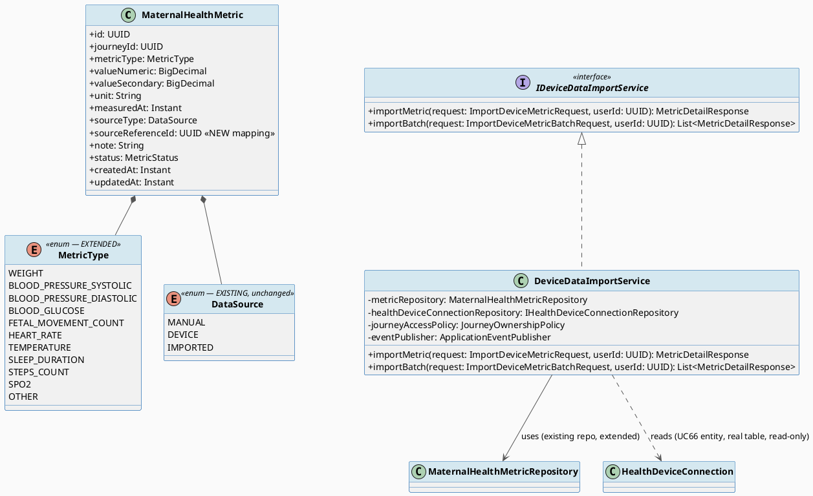
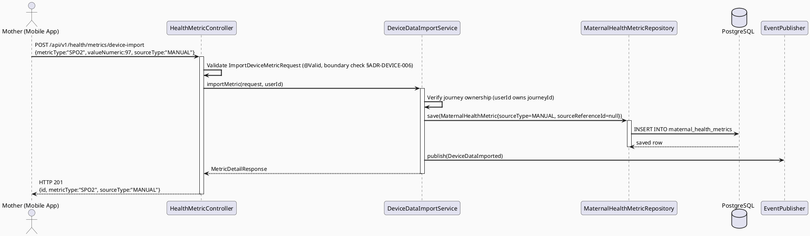
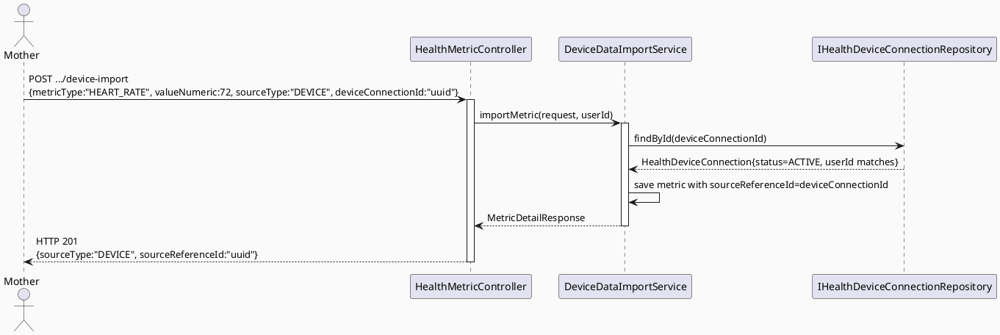
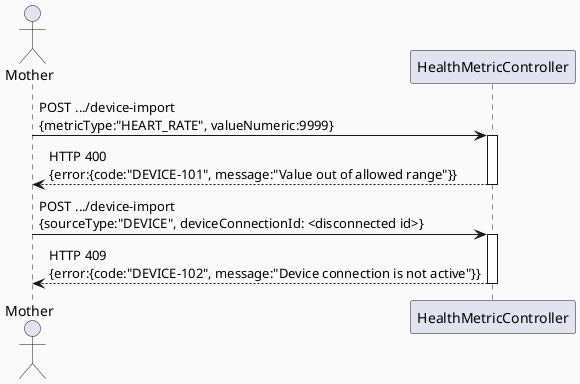

# ENGINEERING DOCUMENTATION STANDARD (EDS) v2.0
# UC67 — Import Device Data Manually

| Field | Value |
|-------|-------|
| **Document ID** | `CB-DEVICE-IMP-002` |
| **Version** | `1.0` |
| **Date** | `2026-07-01` |
| **Status** | `Draft` |
| **Document Owner** | `TV2-Bách` |
| **Author** | `AI Agent — Technical Architect` |
| **Reviewed by** | `[ ] Pending` |
| **DPO Sign-off** | `[ ] Pending` *(bắt buộc — module ghi nhận health metrics)* |
| **Approved by** | `[ ] Pending` |
| **Last Review** | `2026-07-01` |
| **Based on EDS** | `v2.0` |

---

## CHANGELOG

| Ngày | Người thực hiện | Nội dung thay đổi |
|------|-----------------|-------------------|
| 2026-07-01 | AI Agent — Technical Architect | Tạo tài liệu lần đầu — TDS cho UC67 Import Device Data Manually (Draft) |
| 2026-07-02 | AI Agent — Technical Architect (reconciliation) | **Corrected schema reference:** `device_connections` (invented, did not exist) → `health_device_connections` (real, `V1__init_schema.sql` L1115) — reconciled with UC130's independently-verified schema research. UC67 already correctly used `maternal_health_metrics` (unaffected) — only the read-only dependency on UC66's connection table needed correction: `deviceConnectionId` request field and `sourceReferenceId` FK now point to `health_device_connections.connection_id`; the `IDeviceConnectionRepository`/`DeviceConnection` read-only reference is renamed `IHealthDeviceConnectionRepository`/`HealthDeviceConnection`; the migration that added the FK (`V20260701140100`) is corrected to target `health_device_connections` (no dependency on the now-retracted `V20260701140000`); device status check now uses `status='ACTIVE'` instead of `status='CONNECTED'`. |

---

## MỤC LỤC

1. [Tổng quan Module](#1-tổng-quan-module)
2. [Ma trận Truy vết (Traceability Matrix)](#2-ma-trận-truy-vết-traceability-matrix)
3. [Architecture Decision Records (ADR)](#3-architecture-decision-records-adr)
4. [Non-Functional Requirements & SLA](#4-non-functional-requirements--sla)
5. [Static Modeling (Mô hình Tĩnh)](#5-static-modeling-mô-hình-tĩnh)
6. [Dynamic Modeling (Mô hình Động)](#6-dynamic-modeling-mô-hình-động)
7. [Domain Event Catalog](#7-domain-event-catalog)
8. [Interface Specification (Đặc tả Giao diện)](#8-interface-specification-đặc-tả-giao-diện)
9. [API Specification](#9-api-specification)
10. [Bảng mã lỗi (Error Codes)](#10-bảng-mã-lỗi-error-codes)
11. [Quy trình Triển khai (Step-by-Step)](#11-quy-trình-triển-khai-step-by-step)
12. [Rollback & Incident Runbook](#12-rollback--incident-runbook)
13. [Kịch bản Kiểm thử Chi tiết](#13-kịch-bản-kiểm-thử-chi-tiết)
14. [Phương pháp Xác minh](#14-phương-pháp-xác-minh)
15. [Mẫu thử thực tế (API Verification Samples)](#15-mẫu-thử-thực-tế-api-verification-samples)
16. [Bảng tổng hợp phân quyền (Authorization Matrix)](#16-bảng-tổng-hợp-phân-quyền-authorization-matrix)
17. [AI Prompt Constraints (CASE 2.0)](#17-ai-prompt-constraints-case-20)

---

## 1. Tổng quan Module

> UC67 cho phép Mother nhập (mock/manual entry) dữ liệu heart rate, sleep, steps, SpO2, hoặc blood pressure — hoặc khi thiết bị đã kết nối (UC66) nhưng chưa có auto-sync thật (xem ADR-DEVICE-003 ở UC66 TDS), đây là con đường chính để dữ liệu đi vào hệ thống. UC67 **mở rộng** entity `MaternalHealthMetric` đã tồn tại thay vì tạo bảng mới, đồng thời gắn "data provenance" (nguồn dữ liệu: MANUAL vs DEVICE) để phục vụ UC69 (View Trend) hiển thị source label.

| Field | Value |
|-------|-------|
| **Module Name** | `Import Device Data Manually` |
| **Bounded Context** | `health` (mở rộng package hiện có `health.entity.MaternalHealthMetric`) |
| **Data Classification** | `Sensitive-PII` *(sinh hiệu — heart rate, SpO2, blood pressure là dữ liệu sức khỏe nhạy cảm)* |
| **Compliance Scope** | `PDPA / Luật 91/2025` |
| **Upstream Dependencies** | `UC66 ConnectHealthDevice` (`health_device_connections`, optional), `carejourney` (`mother_journeys`), `IAM (JWT)` |
| **Downstream Consumers** | `UC69 ViewDeviceDataTrend`, `health.HealthMetricController` (existing detail view), possibly future safety-monitoring (see Open Item) |

**Nguồn gốc & phạm vi:**
- Function spec: `02_Requirements/SRS/3_Functional_Specification.md §3.3.1.44` (dòng 2683-2700), UC-67.
- Task allocation: dòng 678.
- Description gốc: "Imports or mocks heart rate, sleep, steps, SpO2, or blood pressure data."
- **In-scope:** API/UI cho phép Mother nhập giá trị các metric trên thủ công, gắn `sourceType` (MANUAL hoặc DEVICE nếu liên kết với 1 `health_device_connections` record đang ACTIVE), validate biên giá trị hợp lý, lưu vào `maternal_health_metrics` (mở rộng).
- **Out-of-scope:** Auto-sync thật từ SDK thiết bị (thuộc `3.1.2.4 Sync Health Device Data`); xem xu hướng (UC69); xóa/sửa metric đã có (thuộc `3.3.11.2 Delete Maternal Health Metric` — task khác của cùng owner TV2-Bách nhưng KHÔNG thuộc 4 UC này).

---

## 2. Ma trận Truy vết (Traceability Matrix)

| Requirement ID | Loại (BR/ADR/US) | Mô tả yêu cầu | Thành phần Code | Compliance Target | ADR liên quan |
|----------------|------------------|---------------|-----------------|-------------------|---------------|
| UC-67 (SRS §3.3.1.44) | User Story | Mother nhập/mock heart rate, sleep, steps, SpO2, blood pressure | `HealthMetricController.POST /api/v1/health/metrics/device-import` | — | ADR-DEVICE-004 |
| PRE-3 / BR-RBAC | Business Rule | Chỉ actor ROLE_MOTHER đã xác thực mới import | `HealthMetricServiceImpl` (mở rộng) + `@PreAuthorize` | — | — |
| BR-PRIVACY | Business Rule | Dữ liệu sức khỏe theo consent/minimum-necessary | Tái sử dụng consent đã capture ở UC66, hoặc consent `HEALTH_RECORD` độc lập nếu không có device kết nối | PDPA | — |
| BR-CONSULTATION | Business Rule | Metric có nguồn gốc (provenance) rõ ràng, auditable | `MaternalHealthMetric.sourceType` + `sourceReferenceId` | — | ADR-DEVICE-005 |
| E2 (Exceptions) | Exception Flow | Giá trị invalid/thiếu/xung đột bị reject theo field | `ImportDeviceMetricRequest` validation | — | ADR-DEVICE-006 |
| ADR-DEVICE-004 | Decision | Tái sử dụng `MaternalHealthMetric` + mở rộng `MetricType` (SLEEP/STEPS/SPO2) thay vì bảng mới | `MaternalHealthMetric`, `MetricType` enum | — | — |
| ADR-DEVICE-005 | Decision | `source_reference_id` (đã có trong schema, chưa map ở entity) map tới `health_device_connections.connection_id` khi `sourceType=DEVICE` | `MaternalHealthMetric.sourceReferenceId` | — | — |
| ADR-DEVICE-006 | Decision | Boundary validation theo metric type (heuristic ranges) — KHÔNG phải chẩn đoán y khoa | `ImportDeviceMetricRequest` validators | BR-SAFETY (per CLAUDE.md: AI/system không chẩn đoán) | — |

---

## 3. Architecture Decision Records (ADR)

### ADR-DEVICE-004 — Reuse and Extend MaternalHealthMetric (No New Table)

| Field | Value |
|-------|-------|
| **Status** | `Accepted` |
| **Deciders** | `AI Agent — Technical Architect` |
| **Date** | `2026-07-01` |
| **Supersedes** | `—` |

#### Bối cảnh (Context)
Codebase đã có `maternal_health_metrics` table + `MaternalHealthMetric` entity + `MetricType` enum (`WEIGHT, BLOOD_PRESSURE_SYSTOLIC, BLOOD_PRESSURE_DIASTOLIC, BLOOD_GLUCOSE, FETAL_MOVEMENT_COUNT, HEART_RATE, TEMPERATURE, OTHER`) + `DataSource` enum (`MANUAL, DEVICE, IMPORTED`). UC-67 yêu cầu heart rate (đã có), sleep, steps, SpO2, blood pressure (đã có qua systolic/diastolic) — chỉ thiếu `SLEEP`, `STEPS`, `SPO2`.

#### Các phương án đã xem xét (Options Considered)

| Phương án | Mô tả | Ưu điểm | Nhược điểm |
|-----------|-------|----------|------------|
| A | Mở rộng `MetricType` enum thêm `SLEEP_DURATION`, `STEPS_COUNT`, `SPO2` + migration ALTER; tái sử dụng bảng hiện có | Không phân mảnh dữ liệu sức khỏe, UC69 trend view đơn giản (1 nguồn truy vấn) | Cần migration mở rộng CHECK constraint nếu có (kiểm tra: schema V1 KHÔNG có CHECK constraint cho metric_type — chỉ enum ở tầng Java) |
| B | Tạo bảng mới `device_readings` riêng cho dữ liệu từ thiết bị | Tách biệt rõ ràng "device data" khỏi "manual maternal metrics" | Trùng lặp mô hình, UC69 phải join 2 bảng, vi phạm nguyên tắc "integrate consistently with existing health entities" trong yêu cầu gốc |

#### Quyết định (Decision)
Chọn **Phương án A**. Mở rộng `MetricType` thêm `SLEEP_DURATION`, `STEPS_COUNT`, `SPO2`. Giữ nguyên bảng `maternal_health_metrics`, chỉ thêm migration ALTER cho các cột còn thiếu mapping (`source_reference_id` đã tồn tại trong schema — chỉ cần map vào entity Java, KHÔNG cần ALTER TABLE cho cột này).

#### Hệ quả (Consequences)

**Tích cực:** Không phân mảnh dữ liệu; UC69 (trend) chỉ cần query 1 bảng theo `journeyId` + `metricType IN (...)`.

**Tiêu cực / Trade-offs:** `MaternalHealthMetric.valueNumeric`/`valueSecondary` (kiểu `numeric`) phải đủ biểu diễn các đơn vị mới: `SLEEP_DURATION` (giờ, decimal), `STEPS_COUNT` (số nguyên, dùng `valueNumeric` không cần `valueSecondary`), `SPO2` (%, decimal 0-100). Không cần thay đổi kiểu cột vì `numeric` đã đủ tổng quát.

**Compliance Impact:** Không ảnh hưởng thêm — vẫn cùng 1 bảng đã có audit/retention policy.

---

### ADR-DEVICE-005 — Provenance Field: source_reference_id maps to health_device_connections

| Field | Value |
|-------|-------|
| **Status** | `Accepted` (re-affirmed after schema correction — see CHANGELOG 2026-07-02) |
| **Deciders** | `AI Agent — Technical Architect` |
| **Date** | `2026-07-01` (original) / `2026-07-02` (corrected) |
| **Supersedes** | Original version of this ADR, which assumed the FK target was UC66's invented `device_connections` table — see CHANGELOG. |

#### Bối cảnh (Context)
Schema `V1__init_schema.sql` dòng 582 đã có cột `source_reference_id uuid` trong `maternal_health_metrics`, nhưng **entity Java `MaternalHealthMetric.java` hiện KHÔNG map cột này** (gap phát hiện trong quá trình research — xác nhận qua đọc trực tiếp file entity). UC69 cần biết metric nào đến từ thiết bị nào để hiển thị "source label" (yêu cầu SRS UC-69: "Displays device data trends with source labels"). Bản gốc của ADR này (2026-07-01) giả định FK target là bảng tự-đề-xuất `device_connections` của UC66 — đã được UC66 TDS sửa lại thành bảng thực `health_device_connections` (xem `UC66_ConnectHealthDevice_TDS.md` CHANGELOG 2026-07-02, xác nhận độc lập bởi UC130).

#### Quyết định (Decision)
Map `source_reference_id` vào entity `MaternalHealthMetric.sourceReferenceId: UUID`, dùng để lưu `health_device_connections.connection_id` khi `sourceType=DEVICE`. Khi `sourceType=MANUAL`, để `NULL`. Đây là thay đổi trên entity Java hiện có (KHÔNG phải bảng mới), cần migration ALTER thêm FK constraint (schema hiện tại có cột nhưng **chưa có FK constraint** tới bảng nào — cần thêm FK tới `health_device_connections`, bảng ĐÃ TỒN TẠI từ `V1__init_schema.sql`, KHÔNG phải bảng UC66 tạo mới).

#### Hệ quả (Consequences)

**Tích cực:** Provenance rõ ràng, UC69 join được `health_device_connections.provider_name`/`device_name` để hiển thị "Nguồn: Mi Band 8" thay vì chỉ "DEVICE".

**Tiêu cực / Trade-offs:** Cần migration ALTER TABLE thêm FK tới bảng `health_device_connections` đã tồn tại sẵn (không phụ thuộc thứ tự với migration UC66 nữa, vì UC66 không còn tạo migration nào — xem CHANGELOG).

**Compliance Impact:** Không ảnh hưởng thêm.

---

### ADR-DEVICE-006 — Boundary Validation is Heuristic-Only, Not Diagnostic

| Field | Value |
|-------|-------|
| **Status** | `Accepted` |
| **Deciders** | `AI Agent — Technical Architect` |
| **Date** | `2026-07-01` |
| **Supersedes** | `—` |

#### Bối cảnh (Context)
CLAUDE.md quy định: "AI provides guidance only; never diagnose, prescribe, or delay emergency routing." UC67 nhập dữ liệu sinh hiệu (heart rate, SpO2, blood pressure) — cần validation biên (vd heart rate 30-250 bpm) để bắt lỗi nhập liệu rõ ràng (vd nhập "9999"), nhưng KHÔNG được diễn giải giá trị đó là "bất thường về mặt y khoa" hay tự động chẩn đoán.

#### Quyết định (Decision)
Validation ở tầng `ImportDeviceMetricRequest` chỉ kiểm tra **biên giá trị vật lý hợp lý** (sanity range) để chặn lỗi nhập liệu, KHÔNG phải ngưỡng y khoa. Message lỗi dùng ngôn ngữ trung tính: "Giá trị nằm ngoài khoảng cho phép" — KHÔNG dùng "bất thường"/"nguy hiểm". Việc phân loại "accuracy warning" / cảnh báo lâm sàng thuộc UC69 (xem UC69 TDS ADR — cũng được ghi nhận là Open Item nếu không có nguồn cụ thể).

#### Hệ quả (Consequences)

**Tích cực:** Tuân thủ CLAUDE.md — không lấn sang vai trò chẩn đoán/an toàn khẩn cấp.

**Tiêu cực / Trade-offs:** Sanity ranges là **Open** — SRS không cung cấp số liệu cụ thể; TDS này đề xuất range tạm thời dựa trên thông lệ y tế phổ biến (KHÔNG phải nguồn chính thức CareBridge) — cần Tech Lead/chuyên gia y tế xác nhận trước khi Approved.

> **Open Item (RG-2/RG-6):** Ngưỡng biên cụ thể cho từng metric type (heart rate, SpO2, blood pressure, sleep, steps) chưa có nguồn chính thức trong SRS. Bảng đề xuất tạm thời tại §8.1 — đánh dấu rõ "Proposed, pending clinical/product review".

---

## 4. Non-Functional Requirements & SLA

### 4.1. Performance & Availability

| Category | Requirement | Target SLA | Measurement Method | Compliance Basis |
|----------|-------------|------------|---------------------|------------------|
| Latency | API response (p99) | `< 300ms` | k6 load test | — |
| Availability | Uptime (monthly) | `99.9%` | Uptime monitor | — |

### 4.2. Data Integrity & Retention

| Category | Requirement | Target | Verification Method | Compliance Basis |
|----------|-------------|--------|---------------------|------------------|
| Durability | Không mất metric record | RPO = 0 | Transaction log | PDPA |
| Retention | Health metrics | Theo vòng đời journey/tài khoản | DB policy (existing) | PDPA |
| Consistency | `sourceReferenceId` chỉ set khi `sourceType=DEVICE` và trỏ tới connection hợp lệ | 100% | Service-layer invariant check | — |

### 4.3. Security

| Category | Requirement | Target | Verification Method | Compliance Basis |
|----------|-------------|--------|---------------------|------------------|
| Encryption in transit | TLS 1.3+ | Tất cả endpoints | SSL Labs scan | PDPA |
| Access control | Ownership-scoped (chỉ owner journey) | Least privilege | Auth Matrix (§16) | BR-RBAC |

### 4.4. Scalability & Capacity Planning

> Không có số liệu tải cụ thể — **Open**. Metric import tần suất thấp-trung bình (manual entry), không cần thiết kế đặc biệt.

---

## 5. Static Modeling (Mô hình Tĩnh)

### 5.1. Class Diagram (PlantUML)



### 5.2. Data Structure (Flyway SQL Migration)

> `MetricType` là Java enum lưu dưới dạng `VARCHAR(50)` (`@Enumerated(EnumType.STRING)`) — KHÔNG có DB-level CHECK constraint trong `V1__init_schema.sql` cho `metric_type`, nên thêm giá trị enum mới KHÔNG yêu cầu ALTER CHECK. Chỉ cần: (1) thêm FK cho `source_reference_id` (chưa có), (2) update Java enum.
>
> **CORRECTED (2026-07-02):** FK target sửa từ bảng tự-đề-xuất `device_connections` (UC66, không tồn tại) sang bảng thực `health_device_connections` (`V1__init_schema.sql` dòng 1115, PK `connection_id`). Migration này KHÔNG còn phụ thuộc migration nào của UC66 (UC66 không tạo migration — bảng đã sẵn có).

Tạo file: `05_Development/CareBridgeAPI/src/main/resources/db/migration/V20260701140100__extend_metric_type_and_source.sql`

```sql
-- === HEALTH: EXTEND MATERNAL_HEALTH_METRICS FOR DEVICE DATA PROVENANCE (UC67) ===
-- health_device_connections already exists in V1__init_schema.sql (L1115) — no dependency
-- on any UC66 migration (UC66 retracted its previously-proposed migration, see UC66 TDS CHANGELOG).

-- 1. Add FK constraint for source_reference_id -> health_device_connections(connection_id)
--    Column already exists in V1__init_schema.sql (source_reference_id uuid) but has no FK.
--    Only add FK when source_reference_id points to a device connection (nullable, no FK enforcement
--    issue since NULL values are exempt from FK checks in PostgreSQL).
ALTER TABLE maternal_health_metrics
  ADD CONSTRAINT fk_mhm_source_device_connection
  FOREIGN KEY (source_reference_id) REFERENCES health_device_connections(connection_id);

-- 2. No ALTER needed for metric_type — it's VARCHAR(50) with no CHECK constraint;
--    new enum values (SLEEP_DURATION, STEPS_COUNT, SPO2) are enforced at Java application layer only.

CREATE INDEX IF NOT EXISTS idx_mhm_source_reference_id ON maternal_health_metrics(source_reference_id);
CREATE INDEX IF NOT EXISTS idx_mhm_metric_type ON maternal_health_metrics(metric_type);
```

**Quy tắc đặt tên:** snake_case. Version: `V20260701140100` — không trùng với bất kỳ version hiện có.

**V1__init_schema.sql sync action:** KHÔNG chỉnh sửa `V1__init_schema.sql` trực tiếp (theo pattern dự án hiện tại — xem UC66 TDS §5.2). Migration `V20260701140100` là incremental, độc lập (không còn phụ thuộc migration UC66 — xem correction note trên).

---

## 6. Dynamic Modeling (Mô hình Động)

### 6.1. Sequence Diagram — Happy Path: Manual Import (No Device)



### 6.2. Sequence Diagram — Alt Path: Import Tagged to Connected Device



### 6.3. Sequence Diagram — Error Path



### 6.4. State Machine

> UC67 không có state machine riêng — thao tác là "create" đơn thuần vào bảng metric hiện có (append model, mỗi lần import = 1 row mới, không update). Trạng thái `MetricStatus` (`ACTIVE`/`DELETED`) đã tồn tại và KHÔNG thuộc phạm vi UC67 (delete thuộc `3.3.11.2` — task khác).

---

## 7. Domain Event Catalog

### 7.1. Events Published (Phát ra)

| Event Name | Trigger | Publisher | Subscriber(s) | Payload Schema | Async? |
|------------|---------|-----------|---------------|----------------|--------|
| `DeviceDataImported` | Metric mới được import (manual hoặc device-tagged) thành công | `DeviceDataImportService` | `UC69 ViewDeviceDataTrend` (cache invalidation nếu có), Audit log sink | `DeviceDataImported.java` | Yes |

### 7.2. Events Consumed (Tiêu thụ)

> UC67 không consume events từ module khác. (Không tự động consume `DeviceConnected` — import vẫn yêu cầu request tường minh từ Mother mỗi lần, theo SRS Normal Flow "actor enters information... confirms").

### 7.3. Payload Schema

```java
// DeviceDataImported.java
package com.carebridge.backend.health.device.event;

public record DeviceDataImported(
    UUID    eventId,
    String  eventType,        // "DeviceDataImported"
    Instant occurredAt,
    String  version,          // "1.0"
    Payload payload,
    Metadata metadata
) implements ApplicationEvent {

    public record Payload(
        UUID    metricId,
        UUID    journeyId,
        String  metricType,       // MetricType enum name
        String  sourceType,       // DataSource enum name: MANUAL | DEVICE | IMPORTED
        UUID    sourceReferenceId // nullable — health_device_connections.connection_id if sourceType=DEVICE
    ) {}

    public record Metadata(UUID correlationId, String causedBy) {}
}
```

---

## 8. Interface Specification (Đặc tả Giao diện)

### 8.1. Service Interface

```java
// ImportDeviceMetricRequest.java — Input DTO
// @version 1.0
package com.carebridge.backend.health.device.dto;

public class ImportDeviceMetricRequest {
    @NotNull
    private UUID journeyId;

    @NotNull
    private MetricType metricType;         // HEART_RATE | SLEEP_DURATION | STEPS_COUNT | SPO2 | BLOOD_PRESSURE_SYSTOLIC | BLOOD_PRESSURE_DIASTOLIC | ...

    @NotNull
    @DecimalMin(value = "0")
    private BigDecimal valueNumeric;       // primary value (see boundary table below)

    private BigDecimal valueSecondary;     // used for BLOOD_PRESSURE_DIASTOLIC pairing (optional)

    @NotBlank
    private String unit;                   // e.g. "bpm", "%", "hours", "steps", "mmHg"

    @NotNull
    @PastOrPresent
    private Instant measuredAt;

    @NotNull
    private DataSource sourceType;         // MANUAL | DEVICE (IMPORTED reserved for future bulk import)

    private UUID deviceConnectionId;       // required if sourceType=DEVICE; must reference an active ACTIVE (health_device_connections.status) device owned by caller

    @Size(max = 500)
    private String note;
    // getters / setters
}

// Sanity Range Table — PROPOSED, pending clinical/product review (Open Item, ADR-DEVICE-006)
// | metricType               | min   | max   | unit  |
// |--------------------------|-------|-------|-------|
// | HEART_RATE               | 30    | 250   | bpm   |
// | SPO2                     | 50    | 100   | %     |
// | BLOOD_PRESSURE_SYSTOLIC  | 60    | 250   | mmHg  |
// | BLOOD_PRESSURE_DIASTOLIC | 30    | 150   | mmHg  |
// | SLEEP_DURATION           | 0     | 24    | hours |
// | STEPS_COUNT              | 0     | 100000| steps |

// IDeviceDataImportService.java — Service Contract
// @version 1.0
package com.carebridge.backend.health.device.service;

public interface IDeviceDataImportService {
    /**
     * Imports (manually enters or tags device-sourced) a single health metric reading.
     * @throws DeviceDataImportException (DEVICE-101) if value out of sanity range
     * @throws DeviceDataImportException (DEVICE-102) if sourceType=DEVICE but deviceConnectionId
     *         does not reference an active ACTIVE device (health_device_connections.status) owned by the caller
     * @throws AccessDeniedException (DEVICE-004) if caller does not own journeyId
     */
    MetricDetailResponse importMetric(ImportDeviceMetricRequest request, UUID userId);
}
```

### 8.2. Repository Interface

```java
// Reuses existing MaternalHealthMetricRepository (health.repository package) — no new repository interface,
// only extend usage. IHealthDeviceConnectionRepository (from UC66, maps real table health_device_connections)
// is a read-only dependency here.

// MaternalHealthMetricRepository.java (EXISTING — no interface change required for UC67;
// save() via JpaRepository default is sufficient)
public interface MaternalHealthMetricRepository extends JpaRepository<MaternalHealthMetric, UUID> {
    Optional<MaternalHealthMetric> findByIdAndStatus(UUID id, MetricStatus status);
    // UC67 only needs save() (inherited) — no new query method required.
}
```

---

## 9. API Specification

### 9.1. Endpoints Table

| Method | Path | Auth Level | Required Roles | Rate Limit | Idempotent? |
|--------|------|------------|----------------|------------|-------------|
| `POST` | `/api/v1/health/metrics/device-import` | JWT Bearer | `ROLE_MOTHER` | 60/min | No (each call creates a new metric record) |

### 9.2. Request / Response Schemas

#### `POST /api/v1/health/metrics/device-import`

**Request Body (Manual):**
```json
{
  "journeyId": "uuid-v4",
  "metricType": "SPO2",
  "valueNumeric": 97,
  "unit": "%",
  "measuredAt": "2026-07-01T07:30:00.000Z",
  "sourceType": "MANUAL"
}
```

**Request Body (Device-tagged):**
```json
{
  "journeyId": "uuid-v4",
  "metricType": "HEART_RATE",
  "valueNumeric": 72,
  "unit": "bpm",
  "measuredAt": "2026-07-01T07:30:00.000Z",
  "sourceType": "DEVICE",
  "deviceConnectionId": "uuid-of-connected-device"
}
```

**Response — 201 Created:**
```json
{
  "id": "uuid-v4",
  "journeyId": "uuid-v4",
  "metricType": "SPO2",
  "valueNumeric": 97,
  "unit": "%",
  "measuredAt": "2026-07-01T07:30:00.000Z",
  "sourceType": "MANUAL",
  "sourceReferenceId": null,
  "createdAt": "2026-07-01T07:31:00.000Z"
}
```

**Response — 400 Bad Request (Out of Range):**
```json
{
  "error": {
    "code": "DEVICE-101",
    "message": "Value out of allowed range",
    "details": [{ "field": "valueNumeric", "message": "HEART_RATE must be between 30 and 250 bpm" }]
  }
}
```

**Response — 409 Conflict (Device Not Active):**
```json
{
  "error": {
    "code": "DEVICE-102",
    "message": "Referenced device connection is not active"
  }
}
```

---

## 10. Bảng mã lỗi (Error Codes)

| Code | HTTP Status | Message (EN) | Message (VI) | Trigger Condition |
|------|-------------|--------------|--------------|-------------------|
| `DEVICE-100` | 400 | Validation failed | Dữ liệu không hợp lệ | Missing required field (metricType, valueNumeric, measuredAt) |
| `DEVICE-101` | 400 | Value out of allowed range | Giá trị nằm ngoài khoảng cho phép | `valueNumeric` outside sanity range for metricType (§8.1) |
| `DEVICE-102` | 409 | Device connection not active | Kết nối thiết bị không còn hoạt động | `sourceType=DEVICE` but `deviceConnectionId` refers to a non-ACTIVE (`health_device_connections.status != 'ACTIVE'`) or non-existent connection |
| `DEVICE-103` | 403 | Insufficient permissions | Không đủ quyền | Caller does not own `journeyId`, or not ROLE_MOTHER |
| `DEVICE-104` | 404 | Journey not found | Không tìm thấy hành trình | `journeyId` does not exist |
| `DEVICE-105` | 500 | Internal error | Lỗi hệ thống | Unexpected failure |

---

## 11. Quy trình Triển khai (Step-by-Step)

### 11.1. Prerequisites

- [ ] ADR-DEVICE-004, ADR-DEVICE-005, ADR-DEVICE-006 đã Accepted
- [ ] Sanity range table (§8.1) đã được xác nhận bởi Tech Lead/chuyên gia y tế (Open Item)
- [x] ~~UC66 migration `V20260701140000` đã chạy thành công~~ — **Không áp dụng.** `health_device_connections` đã tồn tại sẵn từ `V1__init_schema.sql`; UC66 không tạo migration nào (xem UC66 TDS CHANGELOG 2026-07-02).
- [ ] DPO sign-off

### 11.2. Pre-Migration Checklist

- [ ] Backup DB
- [ ] Migration `V20260701140100` chạy thành công trên staging ≥ 24 giờ
- [ ] Rollback script đã test

### 11.3. Implementation Steps

#### Chặng 1 — Migration V20260701140100
```bash
./mvnw flyway:migrate
```
> ⚠️ **Chú ý:** Migration này thêm FK tới bảng `health_device_connections`, bảng đã tồn tại sẵn từ `V1__init_schema.sql` (không phụ thuộc migration nào của UC66 — UC66 không tạo migration mới).

#### Chặng 2 — Mở rộng MetricType enum + map sourceReferenceId

```java
// health/entity/MetricType.java — thêm SLEEP_DURATION, STEPS_COUNT, SPO2
// health/entity/MaternalHealthMetric.java — thêm field sourceReferenceId: UUID (map cột đã có)
```

#### Chặng 3 — Implement DeviceDataImportService + endpoint

```java
// package com.carebridge.backend.health.device.service.DeviceDataImportService
// Controller: thêm endpoint mới vào HealthMetricController (existing) hoặc controller riêng
// package com.carebridge.backend.health.device.controller (theo package-by-domain convention)
```

### 11.4. Deployment Checklist

- [ ] Migration V20260701140100 chạy thành công (sau V20260701140000)
- [ ] `POST /api/v1/health/metrics/device-import` trả 201 cho cả MANUAL và DEVICE sourceType
- [ ] `DeviceDataImported` event published
- [ ] Boundary validation hoạt động đúng cho tất cả metricType mới

---

## 12. Rollback & Incident Runbook

### 12.1. Điều kiện kích hoạt Rollback

| Điều kiện | Ngưỡng | Người quyết định |
|-----------|--------|------------------|
| Error rate tăng đột biến | > 5% trong 5 phút | On-call Engineer |
| Metric lưu sai sourceReferenceId (trỏ tới connection không thuộc user) | Bất kỳ case nào | Tech Lead + DPO |

### 12.2. Rollback Procedure

```bash
psql -h $DB_HOST -U $DB_USER -d carebridge \
  -c "ALTER TABLE maternal_health_metrics DROP CONSTRAINT IF EXISTS fk_mhm_source_device_connection;"
psql -h $DB_HOST -U $DB_USER -d carebridge \
  -c "DELETE FROM flyway_schema_history WHERE version = '20260701000002';"
kubectl rollout undo deployment/carebridge-api
```

### 12.3. Notification Protocol

| Thời điểm | Người nhận | Kênh | Template |
|-----------|------------|------|----------|
| Ngay khi phát hiện | On-call team | Slack `#incident` | "🚨 DEVICE-IMPORT incident: [mô tả]" |
| Trong 30 phút | DPO | Email | *(nếu health data leak/cross-user)* |

### 12.4. Post-Incident Review (PIR)

- Theo template chuẩn EDS §12.4.

---

## 13. Kịch bản Kiểm thử Chi tiết

> Chi tiết trong `UC67_ImportDeviceDataManually_Test-Spec.md`.

### 13.1. Unit Tests
- `IMPORT-TC-001`..`006`: happy path manual, happy path device-tagged, out-of-range value, disconnected device reference, wrong journey ownership, missing required field.

### 13.2. Integration Tests
- `IMPORT-TC-INT-001`: persisted metric with correct `sourceType`/`sourceReferenceId` via Testcontainers.

### 13.3. E2E / Security Tests
- `IMPORT-TC-E2E-001`: cross-user journeyId access attempt → 403.

---

## 14. Phương pháp Xác minh

### 14.1. Database Inspection

```sql
SELECT metric_id, journey_id, metric_type, value_numeric, source_type, source_reference_id, measured_at
FROM maternal_health_metrics
WHERE journey_id = '[uuid]'
ORDER BY measured_at DESC;

-- Verify FK integrity for device-sourced metrics
SELECT m.metric_id FROM maternal_health_metrics m
LEFT JOIN health_device_connections d ON m.source_reference_id = d.connection_id
WHERE m.source_type = 'DEVICE' AND d.connection_id IS NULL;
-- Expected: 0 rows
```

### 14.2. Log / Audit Verification

```bash
kubectl logs -l app=carebridge-api | grep '"eventType":"DeviceDataImported"' | head -5
```

---

## 15. Mẫu thử thực tế (API Verification Samples)

### 15.1. Happy Path

```bash
curl -X POST https://$HOST/api/v1/health/metrics/device-import \
  -H "Authorization: Bearer $MOTHER_JWT" \
  -H "Content-Type: application/json" \
  -d '{"journeyId":"<uuid>","metricType":"SPO2","valueNumeric":97,"unit":"%","measuredAt":"2026-07-01T07:30:00Z","sourceType":"MANUAL"}'
```

### 15.2. Error Paths

```bash
curl -X POST https://$HOST/api/v1/health/metrics/device-import \
  -H "Authorization: Bearer $MOTHER_JWT" \
  -H "Content-Type: application/json" \
  -d '{"journeyId":"<uuid>","metricType":"HEART_RATE","valueNumeric":9999,"unit":"bpm","measuredAt":"2026-07-01T07:30:00Z","sourceType":"MANUAL"}'
```
**Expected Response (400):**
```json
{"error":{"code":"DEVICE-101","message":"Value out of allowed range"}}
```

---

## 16. Bảng tổng hợp phân quyền (Authorization Matrix)

| Endpoint | `GUEST` | `ROLE_MOTHER` | `ROLE_PARTNER` | `ROLE_FAMILY` | `ROLE_EXPERT` | `ROLE_SYSTEM_ADMIN` |
|----------|---------|---------------|----------------|---------------|---------------|---------------------|
| `POST /api/v1/health/metrics/device-import` | ❌ | ✅ Own journey | ❌ | ❌ | ❌ | ✅ All (support only) |

**Chú thích:** `Own journey` = `journeyId.owner_user_id` phải khớp với JWT `sub`.

---

## 17. AI Prompt Constraints (CASE 2.0)

### 17.1 Constraint Summary Table

| # | Constraint | Source (ADR/BR) | Last Verified |
|---|-----------|-----------------|---------------|
| C1 | Tái sử dụng `MaternalHealthMetric`/`MetricType`/`DataSource` hiện có — KHÔNG tạo bảng mới | `ADR-DEVICE-004` | `2026-07-01` |
| C2 | `sourceReferenceId` chỉ set khi `sourceType=DEVICE` và phải trỏ tới `health_device_connections` đang ACTIVE, thuộc sở hữu của caller | `ADR-DEVICE-005 / DEVICE-102` | `2026-07-02` |
| C3 | Validation biên giá trị là heuristic sanity check — KHÔNG diễn giải y khoa, KHÔNG dùng ngôn ngữ "bất thường/nguy hiểm" | `ADR-DEVICE-006 / CLAUDE.md BR-SAFETY` | `2026-07-01` |
| C4 | userId từ JWT; ownership của `journeyId` PHẢI verify trước khi lưu | `BR-RBAC` | `2026-07-01` |
| C5 | `DeviceDataImported` event PHẢI publish sau mỗi import thành công | `§7.1 Domain Event Catalog` | `2026-07-01` |

### 17.2 Constraint Injection Block (Copy-Paste vào AI Prompt)

```
[CONSTRAINT BLOCK — Module: Import Device Data Manually — CB-DEVICE-IMP-002]
Theo TDS CB-DEVICE-IMP-002 và các ADR liên quan:

1. Dùng lại MaternalHealthMetric/MetricType/DataSource hiện có — KHÔNG tạo bảng mới (ADR-DEVICE-004)
2. sourceReferenceId chỉ set khi sourceType=DEVICE, PHẢI verify health_device_connections.status=ACTIVE và userId khớp (ADR-DEVICE-005, DEVICE-102)
3. Validation range là sanity-check kỹ thuật, KHÔNG phải chẩn đoán — dùng message trung tính (ADR-DEVICE-006)
4. Verify ownership journeyId trước khi lưu (BR-RBAC)
5. Publish DeviceDataImported event sau mỗi import thành công (§7.1)

[CONTEXT BLOCK]
- Bounded Context: health.device
- Data Classification: Sensitive-PII
- Compliance: PDPA / Luật 91/2025
- Existing interfaces: §8 Service Interface + §8.2 Repository Interface
- Error codes: §10 Error Codes Table
- Auth matrix: §16 Authorization Matrix

[TASK BLOCK]
Implement DeviceDataImportService.importMetric() thỏa mãn constraints trên.
Output phải tuân thủ §8 Interface Specification. Tests phải cover §13 Test Scenarios.
```

### 17.3 Constraint Quality Checklist

- [x] Mỗi constraint traceable về ADR hoặc BR cụ thể
- [x] Không có constraint generic
- [x] Mỗi constraint có `Last Verified` ≤ 2 sprints
- [x] Constraint block có ≥ 3 constraints (có 5)
- [x] Constraint block reference §8 và §16

### 17.4 Anti-Pattern Detection

| AP-ID | Anti-Pattern | Dấu hiệu | Hành động |
|-------|-------------|-----------|----------|
| AP-AI-001 | Unconstrained Gen | Code tạo bảng mới thay vì mở rộng `maternal_health_metrics` | Reject — enforce C1 |
| AP-AI-003 | Implicit Decision | Code dùng ngưỡng y khoa cụ thể không có trong bảng sanity range đã duyệt | Reject — chờ Open Item resolve |
| AP-AI-005 | Hallucinated Contract | Code import repository/type không có trong §8 | Reject |

---

## PHỤ LỤC

### A. Glossary

| Thuật ngữ | Định nghĩa |
|-----------|------------|
| Provenance | Nguồn gốc dữ liệu (MANUAL vs DEVICE) gắn với mỗi metric |
| Sanity Range | Khoảng giá trị hợp lý dùng để bắt lỗi nhập liệu, KHÔNG phải ngưỡng chẩn đoán |
| Metric | Bản ghi 1 lần đo (heart rate, SpO2, sleep, steps, blood pressure...) |

### B. Tài liệu tham chiếu

| Document | Link / Path |
|----------|-------------|
| SRS UC-67 | `02_Requirements/SRS/3_Functional_Specification.md §3.3.1.44` |
| Existing entity | `05_Development/CareBridgeAPI/src/main/java/com/carebridge/backend/health/entity/MaternalHealthMetric.java` |
| Sibling TDS | `04_Implement/UC66_ConnectHealthDevice/`, `UC68_DisconnectHealthDevice/`, `UC69_ViewDeviceDataTrend/` |

---

## OPEN ITEMS

| # | Open Item | Impact nếu không resolve | Đề xuất tạm thời |
|---|-----------|---------------------------|-------------------|
| O1 | Sanity range cụ thể cho mỗi metricType (§8.1) chưa có nguồn chính thức | Có thể chặn nhầm hoặc bỏ sót giá trị bất hợp lý | Dùng bảng đề xuất §8.1, đánh dấu Proposed — cần Tech Lead/chuyên gia y tế duyệt |
| O2 | Có nên trigger safety-monitoring (UC133-136) khi giá trị import "cực đoan" (vd heart rate 250) không? SRS UC67 không đề cập liên kết này | Nếu Approved sau này cần thiết kế thêm — không tự ý thêm | KHÔNG implement liên kết tự động tới safety module trong phạm vi UC67; chỉ áp dụng sanity validation (ADR-DEVICE-006) |
| O3 | `IMPORTED` giá trị trong `DataSource` enum chưa có use case rõ trong 4 UC này (có thể dành cho bulk import tương lai) | Không ảnh hưởng UC67 hiện tại | Không sử dụng `IMPORTED` trong `ImportDeviceMetricRequest.sourceType` (chỉ MANUAL/DEVICE) cho đến khi có yêu cầu rõ ràng |

---

*TDS Draft — chờ review và approval. KHÔNG tự set Status = Approved.*
