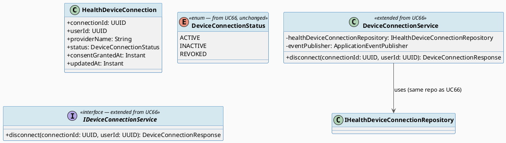
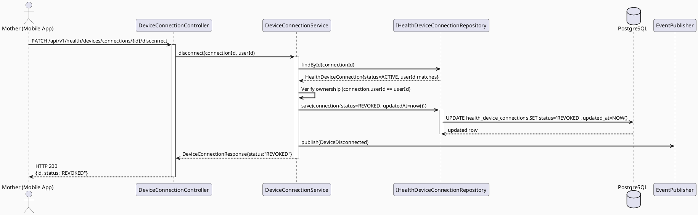
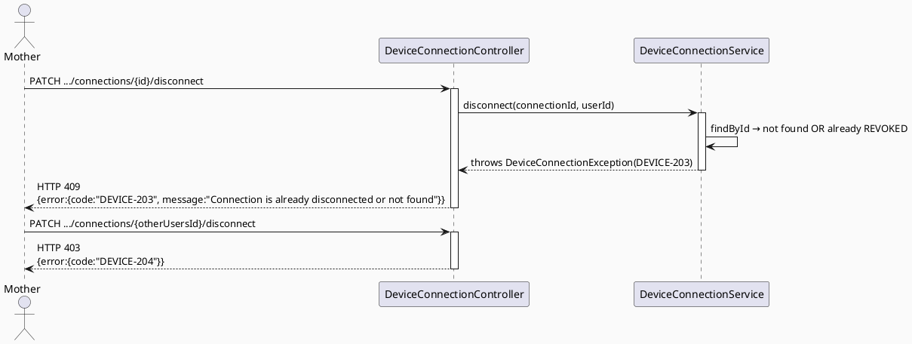

# ENGINEERING DOCUMENTATION STANDARD (EDS) v2.0
# UC68 — Disconnect Health Device

| Field | Value |
|-------|-------|
| **Document ID** | `CB-DEVICE-IMP-003` |
| **Version** | `1.0` |
| **Date** | `2026-07-01` |
| **Status** | `Draft` |
| **Document Owner** | `TV2-Bách` |
| **Author** | `AI Agent — Technical Architect` |
| **Reviewed by** | `[ ] Pending` |
| **DPO Sign-off** | `[ ] Pending` *(bắt buộc — module xử lý consent revocation)* |
| **Approved by** | `[ ] Pending` |
| **Last Review** | `2026-07-01` |
| **Based on EDS** | `v2.0` |

---

## CHANGELOG

| Ngày | Người thực hiện | Nội dung thay đổi |
|------|-----------------|-------------------|
| 2026-07-01 | AI Agent — Technical Architect | Tạo tài liệu lần đầu — TDS cho UC68 Disconnect Health Device (Draft) |
| 2026-07-02 | AI Agent — Technical Architect (reconciliation) | **Corrected schema reference:** `device_connections` (invented, did not exist) → `health_device_connections` (real, `V1__init_schema.sql` L1115) — reconciled with UC130's independently-verified schema research and UC66 TDS's corrected schema (see `UC66_ConnectHealthDevice_TDS.md` CHANGELOG). Entity renamed `DeviceConnection` → `HealthDeviceConnection`. State transition changed from `CONNECTED → DISCONNECTED` to `ACTIVE → REVOKED` (matching real `status varchar(20) DEFAULT 'ACTIVE'` column). **ADR-DEVICE-007 fully rewritten:** since UC66's corrected ADR-DEVICE-002 no longer dual-writes to `ConsentGrant`/`consent_grants` (uses only the real `consent_granted_at` column), UC68's disconnect no longer calls `ConsentService.revoke()` — it is a single-table UPDATE (`status='REVOKED'`), removing the `@Transactional` dual-write concern entirely. No migration needed — retracted proposed dependency on UC66's non-existent migration. |

---

## MỤC LỤC

1. [Tổng quan Module](#1-tổng-quan-module)
2. [Ma trận Truy vết (Traceability Matrix)](#2-ma-trận-truy-vết-traceability-matrix)
3. [Architecture Decision Records (ADR)](#3-architecture-decision-records-adr)
4. [Non-Functional Requirements & SLA](#4-non-functional-requirements--sla)
5. [Static Modeling (Mô hình Tĩnh)](#5-static-modeling-mô-hình-tĩnh)
6. [Dynamic Modeling (Mô hình Động)](#6-dynamic-modeling-mô-hình-động)
7. [Domain Event Catalog](#7-domain-event-catalog)
8. [Interface Specification (Đặc tả Giao diện)](#8-interface-specification-đặc-tả-giao-diện)
9. [API Specification](#9-api-specification)
10. [Bảng mã lỗi (Error Codes)](#10-bảng-mã-lỗi-error-codes)
11. [Quy trình Triển khai (Step-by-Step)](#11-quy-trình-triển-khai-step-by-step)
12. [Rollback & Incident Runbook](#12-rollback--incident-runbook)
13. [Kịch bản Kiểm thử Chi tiết](#13-kịch-bản-kiểm-thử-chi-tiết)
14. [Phương pháp Xác minh](#14-phương-pháp-xác-minh)
15. [Mẫu thử thực tế (API Verification Samples)](#15-mẫu-thử-thực-tế-api-verification-samples)
16. [Bảng tổng hợp phân quyền (Authorization Matrix)](#16-bảng-tổng-hợp-phân-quyền-authorization-matrix)
17. [AI Prompt Constraints (CASE 2.0)](#17-ai-prompt-constraints-case-20)

---

## 1. Tổng quan Module

> UC68 cho phép Mother ngắt kết nối một thiết bị đang `ACTIVE` (được tạo bởi UC66) và dừng đồng bộ dữ liệu sức khỏe từ thiết bị đó. UC68 tái sử dụng **hoàn toàn** entity `HealthDeviceConnection` từ UC66 (bảng thực `health_device_connections`) — KHÔNG tạo bảng mới. Đây là nửa còn lại của state machine `ACTIVE → REVOKED` đã định nghĩa trong UC66 TDS (ADR-DEVICE-001, corrected).

| Field | Value |
|-------|-------|
| **Module Name** | `Disconnect Health Device` |
| **Bounded Context** | `health.device` (dùng chung entity/repository với UC66) |
| **Data Classification** | `Sensitive-PII` |
| **Compliance Scope** | `PDPA / Luật 91/2025` |
| **Upstream Dependencies** | `UC66 ConnectHealthDevice` (bảng thực `health_device_connections`), `IAM (JWT)` |
| **Downstream Consumers** | `UC69 ViewDeviceDataTrend` (ẩn/đánh dấu thiết bị đã ngắt), audit trail |

**Nguồn gốc & phạm vi:**
- Function spec: `02_Requirements/SRS/3_Functional_Specification.md §3.3.1.45` (dòng 2704-2721), UC-68.
- Description gốc: "Disconnects the device and stops health device synchronization."
- **In-scope:** Chuyển trạng thái 1 `health_device_connections` record từ `ACTIVE` → `REVOKED`, phát `DeviceDisconnected` event để dừng mọi tác vụ sync liên quan.
- **Out-of-scope:** Xóa lịch sử `maternal_health_metrics` đã import từ thiết bị đó (dữ liệu lịch sử KHÔNG bị xóa khi disconnect — chỉ dừng sync tương lai); kết nối lại (thuộc UC66 lần nữa, tạo record mới theo ADR-DEVICE-001).

---

## 2. Ma trận Truy vết (Traceability Matrix)

| Requirement ID | Loại (BR/ADR/US) | Mô tả yêu cầu | Thành phần Code | Compliance Target | ADR liên quan |
|----------------|------------------|---------------|-----------------|-------------------|---------------|
| UC-68 (SRS §3.3.1.45) | User Story | Mother ngắt kết nối thiết bị, dừng đồng bộ | `DeviceConnectionController.PATCH /api/v1/health/devices/connections/{id}/disconnect` | — | ADR-DEVICE-007 |
| PRE-3 / BR-RBAC | Business Rule | Chỉ owner (Mother sở hữu record) mới disconnect được | `DeviceConnectionService.disconnect()` | — | — |
| BR-PRIVACY | Business Rule | Ngắt kết nối phải chấm dứt hiệu lực truy cập dữ liệu thiết bị (đổi status → REVOKED) | `DeviceConnectionService.disconnect()` — single-table UPDATE trên `health_device_connections` | PDPA | ADR-DEVICE-007 |
| BR-CONSULTATION | Business Rule | Vòng đời kết nối auditable — disconnect ghi nhận thời điểm | `HealthDeviceConnection.updatedAt` + `DeviceDisconnected` event | — | ADR-DEVICE-001 (UC66) |
| E1 (Exceptions) | Exception Flow | Access denied khi không sở hữu record | `DeviceConnectionController` (403) | — | — |
| E2 (Exceptions) | Exception Flow | Disconnect trên record đã REVOKED hoặc không tồn tại | `DeviceConnectionService.disconnect()` | — | — |
| ADR-DEVICE-007 | Decision | Disconnect = single-table UPDATE `status=REVOKED` trên `health_device_connections`; KHÔNG xóa record hay lịch sử metric; KHÔNG gọi `ConsentService.revoke()` (không có `ConsentGrant` liên kết — xem UC66 ADR-DEVICE-002 corrected) | `DeviceConnectionService.disconnect()` | GDPR-equivalent Art. 17 (right to restrict, not necessarily erase) | ADR-DEVICE-001/002 (UC66) |

---

## 3. Architecture Decision Records (ADR)

### ADR-DEVICE-007 — Disconnect is a Single-Table Status UPDATE (No Consent Dual-Write to Revoke)

| Field | Value |
|-------|-------|
| **Status** | `Accepted` (re-affirmed after schema correction — see CHANGELOG 2026-07-02) |
| **Deciders** | `AI Agent — Technical Architect` |
| **Date** | `2026-07-01` (original) / `2026-07-02` (corrected) |
| **Supersedes** | Original version of this ADR (transactional dual-write: UPDATE status + `ConsentService.revoke(consentGrantId)`) — dropped, see below. |

#### Bối cảnh (Context)
Bản gốc của ADR này (2026-07-01) giả định UC66 lưu `consent_grant_id` trên bảng tự-đề-xuất `device_connections`, và disconnect phải đồng thời UPDATE status VÀ gọi `ConsentService.revoke(consentGrantId)` trong 1 `@Transactional` method để tránh "lệch state" giữa kết nối và consent. UC66's ADR-DEVICE-002 đã được sửa lại (2026-07-02, xem `UC66_ConnectHealthDevice_TDS.md` CHANGELOG): bảng thực `health_device_connections` KHÔNG có cột `consent_grant_id`, và connect KHÔNG còn dual-write vào `ConsentGrant`/`consent_grants` — chỉ set trực tiếp `consent_granted_at` trên chính bảng `health_device_connections`. Do đó, khái niệm "revoke consent ở bảng khác" không còn áp dụng cho luồng disconnect.

#### Các phương án đã xem xét (Options Considered)

| Phương án | Mô tả | Ưu điểm | Nhược điểm |
|-----------|-------|----------|------------|
| A (chọn) | Disconnect là 1 UPDATE đơn giản trên `health_device_connections`: `status = 'REVOKED', updated_at = now()`. KHÔNG có bảng thứ 2 để đồng bộ — không cần `@Transactional` đa-bảng nào ngoài transaction mặc định của 1 UPDATE. `consent_granted_at` giữ nguyên giá trị lịch sử (bằng chứng consent đã từng được cấp tại thời điểm connect) — không set về NULL, vì đó là audit trail, không phải "trạng thái hiệu lực hiện tại" (trạng thái hiệu lực hiện tại được xác định bởi `status`) | Đơn giản tối đa, khớp chính xác schema thực, không có rủi ro "lệch state" giữa 2 bảng vì chỉ còn 1 bảng | Không có bản ghi `revoked_at` riêng biệt tách khỏi `consent_granted_at` — nhưng `updated_at` đã đóng vai trò đó |
| B (đã loại bỏ) | Giữ nguyên dual-write cũ: UPDATE status + gọi `ConsentService.revoke()` | — | Dựa trên tiền đề sai (UC66 dùng `consent_grant_id` FK) — không còn khớp corrected ADR-DEVICE-002 của UC66; sẽ gọi 1 service method không có input hợp lệ (`consentGrantId` không tồn tại trên entity) |

#### Quyết định (Decision)
Chọn **Phương án A**. `DeviceConnectionService.disconnect()` thực hiện: `findById(connectionId)` → verify ownership + `status == ACTIVE` → `UPDATE health_device_connections SET status='REVOKED', updated_at=now() WHERE connection_id=...` → publish `DeviceDisconnected`. Không còn phụ thuộc `ConsentService`.

#### Hệ quả (Consequences)

**Tích cực:** Đơn giản hóa đáng kể so với thiết kế gốc — loại bỏ hoàn toàn rủi ro "lệch state" 2 bảng vì chỉ còn 1 bảng duy nhất tham gia. Giảm coupling giữa `health.device` và `consent` module (module `consent` không còn bị gọi từ luồng disconnect thiết bị).

**Tiêu cực / Trade-offs:** `consent_granted_at` không tự động "hết hiệu lực" theo nghĩa field-level khi disconnect — ứng dụng PHẢI luôn kiểm tra `status='ACTIVE'` TRƯỚC KHI coi `consent_granted_at` là còn hiệu lực (không được chỉ check `consent_granted_at IS NOT NULL` một mình). Đây là invariant quan trọng cần test rõ (xem Test-Spec DISCONNECT-TC-001).

**Compliance Impact:** Vẫn hỗ trợ PDPA/Luật 91/2025 về quyền rút lại sự đồng ý — việc `status=REVOKED` chính là tín hiệu "quyền truy cập dữ liệu thiết bị đã chấm dứt", đọc được ngay lập tức bởi mọi luồng khác (UC67 kiểm tra `status=ACTIVE` trước khi cho phép import, UC130 kiểm tra tương tự trước khi sync).

---

## 4. Non-Functional Requirements & SLA

### 4.1. Performance & Availability

| Category | Requirement | Target SLA | Measurement Method | Compliance Basis |
|----------|-------------|------------|---------------------|------------------|
| Latency | API response (p99) | `< 300ms` | k6 load test | — |
| Availability | Uptime (monthly) | `99.9%` | Uptime monitor | — |

### 4.2. Data Integrity & Retention

| Category | Requirement | Target | Verification Method | Compliance Basis |
|----------|-------------|--------|---------------------|------------------|
| Consistency | disconnect là single-table UPDATE trên `health_device_connections` — không còn multi-table dual-write nào cần đồng bộ | 100% | Unit + integration test | PDPA |
| Retention | Lịch sử metric đã import KHÔNG bị xóa khi disconnect | 100% giữ nguyên | DB assertion (metric count unchanged) | PDPA — data minimization áp dụng cho consent scope, không phải xóa lịch sử y tế |

### 4.3. Security

| Category | Requirement | Target | Verification Method | Compliance Basis |
|----------|-------------|--------|---------------------|------------------|
| Access control | Chỉ owner mới disconnect được record của mình | Least privilege | Auth Matrix (§16) | BR-RBAC |
| Audit | Disconnect action ghi nhận qua event + `updated_at` | 100% | Log/event assertion | BR-CONSULTATION |

### 4.4. Scalability & Capacity Planning

> Không có số liệu tải cụ thể — Open, giả định tải thấp.

---

## 5. Static Modeling (Mô hình Tĩnh)

### 5.1. Class Diagram (PlantUML)



### 5.2. Data Structure (Flyway SQL Migration)

> **Không cần migration mới cho UC68.** Bảng `health_device_connections` đã tồn tại sẵn trong `V1__init_schema.sql` (dòng 1115) với đầy đủ cột `status`, `updated_at` cần thiết cho disconnect. UC68 chỉ thực hiện `UPDATE`, không cần `ALTER TABLE`. (Corrected 2026-07-02 — bản gốc tham chiếu migration `V20260701140000` của UC66, migration đó đã bị rút lại vì bảng vốn đã tồn tại — xem UC66 TDS CHANGELOG.)

**V1__init_schema.sql sync action:** Không áp dụng — không có thay đổi schema cho UC68.

---

## 6. Dynamic Modeling (Mô hình Động)

### 6.1. Sequence Diagram — Happy Path (PlantUML)



### 6.2. Sequence Diagram — Error Path (PlantUML)



### 6.3. State Machine (Reference — full definition owned by UC66 TDS §6.4)

> UC68 thực hiện transition `ACTIVE → REVOKED` đã được định nghĩa đầy đủ trong `UC66_ConnectHealthDevice_TDS.md §6.4` (ADR-DEVICE-001, corrected). UC68 KHÔNG định nghĩa lại state machine — chỉ tham chiếu và tuân thủ invariant đã có:
> 1. Không xóa record.
> 2. `REVOKED` là trạng thái cuối của record đó (terminal).
> 3. Reconnect sau disconnect tạo record MỚI qua UC66 (không revive record cũ).

---

## 7. Domain Event Catalog

### 7.1. Events Published (Phát ra)

| Event Name | Trigger | Publisher | Subscriber(s) | Payload Schema | Async? |
|------------|---------|-----------|---------------|----------------|--------|
| `DeviceDisconnected` | Ngắt kết nối thành công (status → REVOKED) | `DeviceConnectionService` | `UC69 ViewDeviceDataTrend` (đánh dấu nguồn "disconnected" trong trend view), Audit log sink | `DeviceDisconnected.java` | Yes |

### 7.2. Events Consumed (Tiêu thụ)

> UC68 không consume events từ module khác.

### 7.3. Payload Schema

```java
// DeviceDisconnected.java
package com.carebridge.backend.health.device.event;

public record DeviceDisconnected(
    UUID    eventId,
    String  eventType,        // "DeviceDisconnected"
    Instant occurredAt,
    String  version,          // "1.0"
    Payload payload,
    Metadata metadata
) implements ApplicationEvent {

    public record Payload(
        UUID   deviceConnectionId,  // health_device_connections.connection_id
        UUID   userId,
        String providerName
    ) {}

    public record Metadata(UUID correlationId, String causedBy) {}
}
```

---

## 8. Interface Specification (Đặc tả Giao diện)

### 8.1. Service Interface

```java
// DeviceConnectionResponse.java — reused from UC66 (§8.1), no change

// IDeviceConnectionService.java — EXTENDED interface (adds disconnect() to UC66's contract)
// @version 1.1
// @breaking-change None — additive method only
package com.carebridge.backend.health.device.service;

public interface IDeviceConnectionService {
    // ... connect(), listActiveConnections() from UC66 (§8.1 there) ...

    /**
     * Disconnects an active device connection owned by the caller.
     * Single-table UPDATE: sets status to REVOKED on health_device_connections.
     * No longer calls any ConsentService — see ADR-DEVICE-007 (corrected).
     * @throws DeviceConnectionException (DEVICE-203) if connection not found or already REVOKED
     * @throws AccessDeniedException (DEVICE-204) if connection does not belong to caller
     */
    DeviceConnectionResponse disconnect(UUID connectionId, UUID userId);
}
```

### 8.2. Repository Interface

```java
// IHealthDeviceConnectionRepository.java — reused from UC66 (§8.2), no new method required.
// disconnect() uses existing findById() (inherited from JpaRepository) + save().
```

---

## 9. API Specification

### 9.1. Endpoints Table

| Method | Path | Auth Level | Required Roles | Rate Limit | Idempotent? |
|--------|------|------------|----------------|------------|-------------|
| `PATCH` | `/api/v1/health/devices/connections/{id}/disconnect` | JWT Bearer | `ROLE_MOTHER` | 30/min | No (second call on already-REVOKED returns 409) |

### 9.2. Request / Response Schemas

#### `PATCH /api/v1/health/devices/connections/{id}/disconnect`

**Request Body:** *(empty — action endpoint)*

**Response — 200 OK (Happy Path):**
```json
{
  "id": "550e8400-e29b-41d4-a716-446655440000",
  "providerName": "SMARTWATCH_GENERIC",
  "status": "REVOKED"
}
```

**Response — 409 Conflict (Already Disconnected / Not Found):**
```json
{
  "error": {
    "code": "DEVICE-203",
    "message": "Connection is already disconnected or not found"
  }
}
```

**Response — 403 Forbidden (Not Owner):**
```json
{
  "error": {
    "code": "DEVICE-204",
    "message": "You do not have permission to disconnect this device"
  }
}
```

---

## 10. Bảng mã lỗi (Error Codes)

| Code | HTTP Status | Message (EN) | Message (VI) | Trigger Condition |
|------|-------------|--------------|--------------|-------------------|
| `DEVICE-200` | 400 | Validation failed | Dữ liệu không hợp lệ | Malformed `id` path param (not a valid UUID) |
| `DEVICE-203` | 409 | Connection is already disconnected or not found | Kết nối đã ngắt hoặc không tồn tại | Record `status != ACTIVE`, or `id` does not exist |
| `DEVICE-204` | 403 | Insufficient permissions | Không đủ quyền | `connection.userId != caller userId`, or not `ROLE_MOTHER` |
| `DEVICE-205` | 500 | Internal error | Lỗi hệ thống | Unexpected failure (e.g., DB unavailable) |

---

## 11. Quy trình Triển khai (Step-by-Step)

### 11.1. Prerequisites

- [ ] ADR-DEVICE-007 đã Accepted (corrected — no longer requires ConsentService)
- [ ] UC66 đã implement (bảng `health_device_connections` đã tồn tại sẵn từ `V1__init_schema.sql`, không cần migration)
- [x] ~~`ConsentService.revoke()` tồn tại và hoạt động đúng~~ — **Không còn cần thiết.** ADR-DEVICE-007 (corrected) loại bỏ hoàn toàn dependency vào `ConsentService` cho luồng disconnect.
- [ ] DPO sign-off

### 11.2. Pre-Migration Checklist

- [ ] **Không áp dụng** — UC68 không có migration mới (xem §5.2)

### 11.3. Implementation Steps

#### Chặng 1 — Không có migration mới
> Bỏ qua — dùng bảng đã có từ UC66 (`health_device_connections`, tồn tại sẵn trong `V1__init_schema.sql`).

#### Chặng 2 — Implement disconnect() trong DeviceConnectionService (mở rộng từ UC66)

```java
// Thêm method disconnect() vào DeviceConnectionService.java (đã tạo ở UC66)
// package com.carebridge.backend.health.device.service.DeviceConnectionService
```

#### Chặng 3 — Thêm endpoint vào DeviceConnectionController

```java
// Thêm @PatchMapping("/{id}/disconnect") vào DeviceConnectionController.java (đã tạo ở UC66)
```

### 11.4. Deployment Checklist

- [ ] `PATCH /connections/{id}/disconnect` trả 200 với status REVOKED
- [ ] `DeviceDisconnected` event published
- [ ] Metric lịch sử KHÔNG bị xóa (kiểm tra `maternal_health_metrics` count không đổi)

---

## 12. Rollback & Incident Runbook

### 12.1. Điều kiện kích hoạt Rollback

| Điều kiện | Ngưỡng | Người quyết định |
|-----------|--------|------------------|
| Disconnect xóa nhầm lịch sử metric | Bất kỳ case nào | Tech Lead + DPO (nghiêm trọng) |
| Consent không được revoke sau disconnect | Bất kỳ case nào | Tech Lead + DPO |

### 12.2. Rollback Procedure

```bash
# Không có migration để revert. Rollback chỉ cần revert code deploy.
kubectl rollout undo deployment/carebridge-api
kubectl rollout status deployment/carebridge-api
curl -X GET https://$HOST/api/v1/health
```

### 12.3. Notification Protocol

| Thời điểm | Người nhận | Kênh | Template |
|-----------|------------|------|----------|
| Ngay khi phát hiện | On-call team | Slack `#incident` | "🚨 DEVICE-DISCONNECT incident: [mô tả]" |
| Trong 30 phút | DPO | Email | *(bắt buộc nếu consent revoke thất bại — ảnh hưởng quyền riêng tư)* |

### 12.4. Post-Incident Review (PIR)

- Theo template chuẩn EDS §12.4.

---

## 13. Kịch bản Kiểm thử Chi tiết

> Chi tiết trong `UC68_DisconnectHealthDevice_Test-Spec.md`.

### 13.1. Unit Tests
- `DISCONNECT-TC-001`..`005`: happy path, already disconnected, not found, not owner, consent revoke called.

### 13.2. Integration Tests
- `DISCONNECT-TC-INT-001`: transactional atomicity (status + consent revoke) via Testcontainers.

### 13.3. E2E / Security Tests
- `DISCONNECT-TC-E2E-001`: cross-user disconnect attempt → 403.

---

## 14. Phương pháp Xác minh

### 14.1. Database Inspection

```sql
SELECT connection_id, status, updated_at, consent_granted_at FROM health_device_connections WHERE connection_id = '[uuid]';
-- Expected: status = 'REVOKED' after disconnect (consent_granted_at unchanged — historical audit value, see ADR-DEVICE-007)

-- Verify metric history untouched
SELECT count(*) FROM maternal_health_metrics WHERE source_reference_id = '[uuid]';
-- Expected: unchanged before/after disconnect
```

### 14.2. Log / Audit Verification

```bash
kubectl logs -l app=carebridge-api | grep '"eventType":"DeviceDisconnected"' | head -5
```

---

## 15. Mẫu thử thực tế (API Verification Samples)

### 15.1. Happy Path

```bash
curl -X PATCH https://$HOST/api/v1/health/devices/connections/$CONN_ID/disconnect \
  -H "Authorization: Bearer $MOTHER_JWT"
```

### 15.2. Error Paths

```bash
# Already disconnected
curl -X PATCH https://$HOST/api/v1/health/devices/connections/$CONN_ID/disconnect \
  -H "Authorization: Bearer $MOTHER_JWT"
```
**Expected Response (409):**
```json
{"error":{"code":"DEVICE-203","message":"Connection is already disconnected or not found"}}
```

---

## 16. Bảng tổng hợp phân quyền (Authorization Matrix)

| Endpoint | `GUEST` | `ROLE_MOTHER` | `ROLE_PARTNER` | `ROLE_FAMILY` | `ROLE_EXPERT` | `ROLE_SYSTEM_ADMIN` |
|----------|---------|---------------|----------------|---------------|---------------|---------------------|
| `PATCH /api/v1/health/devices/connections/{id}/disconnect` | ❌ | ✅ Own | ❌ | ❌ | ❌ | ✅ All (support only) |

---

## 17. AI Prompt Constraints (CASE 2.0)

### 17.1 Constraint Summary Table

| # | Constraint | Source (ADR/BR) | Last Verified |
|---|-----------|-----------------|---------------|
| C1 | disconnect() là single-table UPDATE trên `health_device_connections` (status=REVOKED) — KHÔNG còn gọi `ConsentService` (xem ADR-DEVICE-007 corrected) | `ADR-DEVICE-007` | `2026-07-02` |
| C2 | KHÔNG xóa record `health_device_connections` khi disconnect — chỉ UPDATE status/updated_at | `ADR-DEVICE-001 (UC66)` | `2026-07-02` |
| C3 | KHÔNG xóa lịch sử `maternal_health_metrics` liên kết với device đã disconnect | `TDS §1 Out-of-scope` | `2026-07-01` |
| C4 | Chỉ owner (`connection.userId == callerUserId`) mới disconnect được | `BR-RBAC` | `2026-07-01` |
| C5 | `DeviceDisconnected` event PHẢI publish sau mỗi disconnect thành công | `§7.1 Domain Event Catalog` | `2026-07-01` |

### 17.2 Constraint Injection Block (Copy-Paste vào AI Prompt)

```
[CONSTRAINT BLOCK — Module: Disconnect Health Device — CB-DEVICE-IMP-003]
Theo TDS CB-DEVICE-IMP-003 và các ADR liên quan:

1. disconnect() là single-table UPDATE: health_device_connections.status=REVOKED, updated_at=now() — KHÔNG gọi ConsentService (ADR-DEVICE-007 corrected)
2. KHÔNG xóa record health_device_connections — chỉ update status (ADR-DEVICE-001)
3. KHÔNG xóa maternal_health_metrics lịch sử của device đã disconnect (TDS §1)
4. Chỉ owner mới disconnect (BR-RBAC)
5. Publish DeviceDisconnected event sau khi thành công (§7.1)

[CONTEXT BLOCK]
- Bounded Context: health.device
- Data Classification: Sensitive-PII
- Compliance: PDPA / Luật 91/2025
- Existing interfaces: §8 Service Interface (extends UC66's IDeviceConnectionService)
- Error codes: §10 Error Codes Table
- Auth matrix: §16 Authorization Matrix
- Real schema table: health_device_connections (V1__init_schema.sql L1115) — NOT device_connections

[TASK BLOCK]
Implement DeviceConnectionService.disconnect() thỏa mãn constraints trên.
Output phải tuân thủ §8 Interface Specification. Tests phải cover §13 Test Scenarios.
```

### 17.3 Constraint Quality Checklist

- [x] Mỗi constraint traceable về ADR hoặc BR cụ thể
- [x] Không có constraint generic
- [x] Mỗi constraint có `Last Verified` ≤ 2 sprints
- [x] Constraint block có ≥ 3 constraints (có 5)
- [x] Constraint block reference §8 và §16

### 17.4 Anti-Pattern Detection

| AP-ID | Anti-Pattern | Dấu hiệu | Hành động |
|-------|-------------|-----------|----------|
| AP-AI-001 | Unconstrained Gen | Code xóa record thay vì update status | Reject — enforce C2 |
| AP-AI-003 | Implicit Decision | Code xóa metric lịch sử khi disconnect | Reject — enforce C3, không có ADR nào cho phép xóa |
| AP-AI-005 | Hallucinated Contract | Code import service/type không có trong §8, hoặc gọi `ConsentService` (đã bị loại bỏ khỏi luồng này) | Reject |
| AP-DEVICE-007 | Schema Drift | Code hoặc migration target bảng `device_connections` (không tồn tại) thay vì `health_device_connections` thực | Reject — enforce ADR-DEVICE-001/007 corrected version |

---

## PHỤ LỤC

### A. Glossary

| Thuật ngữ | Định nghĩa |
|-----------|------------|
| Terminal State | Trạng thái cuối của 1 record — không transition tiếp (`REVOKED` cho `health_device_connections`) |

### B. Tài liệu tham chiếu

| Document | Link / Path |
|----------|-------------|
| SRS UC-68 | `02_Requirements/SRS/3_Functional_Specification.md §3.3.1.45` |
| UC66 TDS (state machine gốc) | `04_Implement/UC66_ConnectHealthDevice/UC66_ConnectHealthDevice_TDS.md §6.4` |
| Real schema table | `05_Development/CareBridgeAPI/src/main/resources/db/migration/V1__init_schema.sql` (dòng 1115-1127 `health_device_connections`) |

---

## OPEN ITEMS

| # | Open Item | Impact nếu không resolve | Đề xuất tạm thời |
|---|-----------|---------------------------|-------------------|
| O1 | SRS UC-68 flows là generic template — không có business rule cụ thể về việc có cho phép "tạm ngắt rồi tự động dừng background sync job" hay không (vì auto-sync thật thuộc `3.1.2.4`, ngoài phạm vi) | Không ảnh hưởng phạm vi UC68 hiện tại (mock-first, không có sync job thật) | Ghi rõ: disconnect chỉ đổi trạng thái DB; không có background job nào cần dừng ở giai đoạn này |
| O2 | Không rõ có cần thông báo (notification) cho Mother xác nhận disconnect thành công hay không (SRS không đặc tả UI/UX chi tiết) | UX polish — không block backend logic | Backend trả response 200 đầy đủ thông tin; UI/UX decision để mobile team quyết định khi build màn hình |

---

*TDS Draft — chờ review và approval. KHÔNG tự set Status = Approved.*
