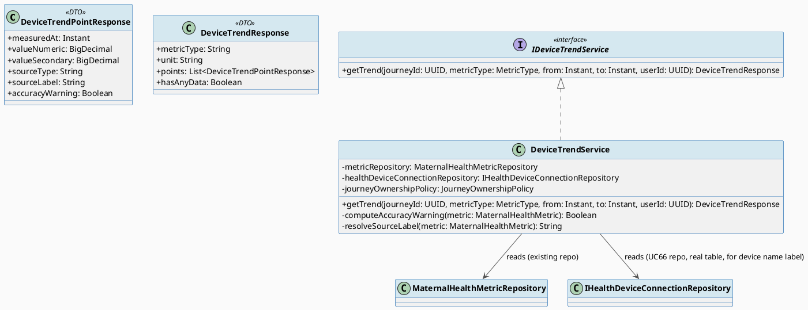
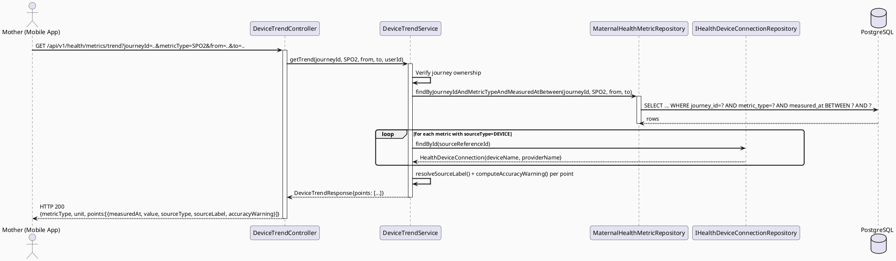
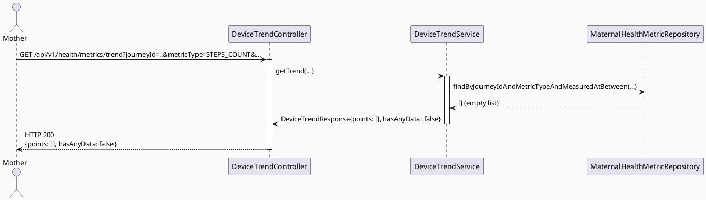
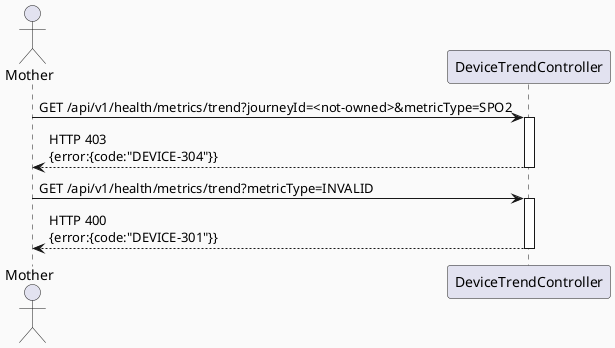

# ENGINEERING DOCUMENTATION STANDARD (EDS) v2.0
# UC69 — View Device Data Trend

| Field | Value |
|-------|-------|
| **Document ID** | `CB-DEVICE-IMP-004` |
| **Version** | `1.0` |
| **Date** | `2026-07-01` |
| **Status** | `Draft` |
| **Document Owner** | `TV2-Bách` |
| **Author** | `AI Agent — Technical Architect` |
| **Reviewed by** | `[ ] Pending` |
| **DPO Sign-off** | `[ ] Pending` *(bắt buộc — module hiển thị dữ liệu sức khỏe tổng hợp)* |
| **Approved by** | `[ ] Pending` |
| **Last Review** | `2026-07-01` |
| **Based on EDS** | `v2.0` |

---

## CHANGELOG

| Ngày | Người thực hiện | Nội dung thay đổi |
|------|-----------------|-------------------|
| 2026-07-01 | AI Agent — Technical Architect | Tạo tài liệu lần đầu — TDS cho UC69 View Device Data Trend (Draft) |
| 2026-07-02 | AI Agent — Technical Architect (reconciliation) | **Corrected schema reference:** `device_connections` (invented, did not exist) → `health_device_connections` (real, `V1__init_schema.sql` L1115) — reconciled with UC130's independently-verified schema research. `sourceLabel` resolution now reads `health_device_connections.provider_name`/`device_name` instead of the invented `device_type`. Read-only repository dependency renamed `IDeviceConnectionRepository` → `IHealthDeviceConnectionRepository`. |

---

## MỤC LỤC

1. [Tổng quan Module](#1-tổng-quan-module)
2. [Ma trận Truy vết (Traceability Matrix)](#2-ma-trận-truy-vết-traceability-matrix)
3. [Architecture Decision Records (ADR)](#3-architecture-decision-records-adr)
4. [Non-Functional Requirements & SLA](#4-non-functional-requirements--sla)
5. [Static Modeling (Mô hình Tĩnh)](#5-static-modeling-mô-hình-tĩnh)
6. [Dynamic Modeling (Mô hình Động)](#6-dynamic-modeling-mô-hình-động)
7. [Domain Event Catalog](#7-domain-event-catalog)
8. [Interface Specification (Đặc tả Giao diện)](#8-interface-specification-đặc-tả-giao-diện)
9. [API Specification](#9-api-specification)
10. [Bảng mã lỗi (Error Codes)](#10-bảng-mã-lỗi-error-codes)
11. [Quy trình Triển khai (Step-by-Step)](#11-quy-trình-triển-khai-step-by-step)
12. [Rollback & Incident Runbook](#12-rollback--incident-runbook)
13. [Kịch bản Kiểm thử Chi tiết](#13-kịch-bản-kiểm-thử-chi-tiết)
14. [Phương pháp Xác minh](#14-phương-pháp-xác-minh)
15. [Mẫu thử thực tế (API Verification Samples)](#15-mẫu-thử-thực-tế-api-verification-samples)
16. [Bảng tổng hợp phân quyền (Authorization Matrix)](#16-bảng-tổng-hợp-phân-quyền-authorization-matrix)
17. [AI Prompt Constraints (CASE 2.0)](#17-ai-prompt-constraints-case-20)

---

## 1. Tổng quan Module

> UC69 hiển thị xu hướng (trend) dữ liệu thiết bị sức khỏe (heart rate, sleep, steps, SpO2, blood pressure) đã được nhập qua UC67, kèm **source label** (MANUAL vs DEVICE, và tên thiết bị nếu có qua join với `health_device_connections` từ UC66) và **accuracy warning** khi phù hợp. Đây là module đọc-thuần (read-only), KHÔNG ghi dữ liệu mới — chỉ truy vấn `maternal_health_metrics` + `health_device_connections` đã tồn tại từ UC66/67/68.

| Field | Value |
|-------|-------|
| **Module Name** | `View Device Data Trend` |
| **Bounded Context** | `health.device` (đọc từ `MaternalHealthMetric` + `HealthDeviceConnection`) |
| **Data Classification** | `Sensitive-PII` |
| **Compliance Scope** | `PDPA / Luật 91/2025` |
| **Upstream Dependencies** | `UC66 health_device_connections`, `UC67 maternal_health_metrics` (dữ liệu đã import), `IAM (JWT)` |
| **Downstream Consumers** | Mobile Health module UI (biểu đồ trend) |

**Nguồn gốc & phạm vi:**
- Function spec: `02_Requirements/SRS/3_Functional_Specification.md §3.3.1.46` (dòng 2725-2742), UC-69.
- Description gốc: "Displays device data trends with source labels and accuracy warnings."
- **In-scope:** Query metric theo `journeyId` + `metricType` + khoảng thời gian, trả về time-series kèm `sourceType`/`sourceLabel` (tên thiết bị nếu DEVICE), và cờ `accuracyWarning` (xem ADR-DEVICE-008 — Open Item vì SRS không có ngưỡng cụ thể).
- **Out-of-scope:** Ghi/sửa dữ liệu (UC67); kết nối/ngắt kết nối thiết bị (UC66/68); phân tích/chẩn đoán y khoa (ngoài phạm vi CareBridge theo CLAUDE.md).

---

## 2. Ma trận Truy vết (Traceability Matrix)

| Requirement ID | Loại (BR/ADR/US) | Mô tả yêu cầu | Thành phần Code | Compliance Target | ADR liên quan |
|----------------|------------------|---------------|-----------------|-------------------|---------------|
| UC-69 (SRS §3.3.1.46) | User Story | Mother xem xu hướng dữ liệu thiết bị kèm source label + accuracy warning | `DeviceTrendController.GET /api/v1/health/metrics/trend` | — | ADR-DEVICE-008 |
| PRE-3 / BR-RBAC | Business Rule | Chỉ owner journey mới xem trend của chính mình | `DeviceTrendService.getTrend()` | — | — |
| BR-PRIVACY | Business Rule | Trend view chỉ trả dữ liệu của user gọi request (minimum necessary) | `DeviceTrendService` (filter theo `journeyId` sở hữu bởi userId) | PDPA | — |
| AF2 (Alternative Flow) | Alt Flow | Không có dữ liệu → empty state kèm next action | `DeviceTrendResponse.items = []` | — | — |
| ADR-DEVICE-008 | Decision | Accuracy warning là rule-based heuristic (không phải AI/ML) dựa trên nguồn dữ liệu (MANUAL thiếu context đo lường chuẩn) — KHÔNG có ngưỡng lâm sàng cụ thể trong SRS | `DeviceTrendService.computeAccuracyWarning()` | BR-SAFETY (CLAUDE.md — không chẩn đoán) | — |
| ADR-DEVICE-009 | Decision | Trend aggregation theo khoảng thời gian (day/week) thực hiện ở Service layer bằng SQL group-by hoặc in-memory, không dùng job nền riêng | `DeviceTrendService.getTrend()` | — | — |

---

## 3. Architecture Decision Records (ADR)

### ADR-DEVICE-008 — Accuracy Warning is Rule-Based on Data Source, Not AI/Clinical Threshold

| Field | Value |
|-------|-------|
| **Status** | `Proposed` *(chưa Accepted — cần xác nhận thêm)* |
| **Deciders** | `[ ] Pending — Tech Lead / Product` |
| **Date** | `2026-07-01` |
| **Supersedes** | `—` |

#### Bối cảnh (Context)
SRS UC-69 Description: "Displays device data trends with source labels **and accuracy warnings**." SRS không định nghĩa "accuracy warning" là gì cụ thể — không có ngưỡng lâm sàng, không có model AI nào được nhắc tới trong bất kỳ UC66-69. CLAUDE.md quy định rõ: "AI provides guidance only; never diagnose, prescribe, or delay emergency routing." Do đó accuracy warning KHÔNG được là 1 chẩn đoán y khoa hay dự đoán AI.

#### Các phương án đã xem xét (Options Considered)

| Phương án | Mô tả | Ưu điểm | Nhược điểm |
|-----------|-------|----------|------------|
| A | Rule-based: `accuracyWarning=true` khi `sourceType=MANUAL` (dữ liệu tự nhập, có khả năng sai số cao hơn thiết bị đo tự động) HOẶC khi có khoảng trống dữ liệu bất thường (gap detection đơn giản, vd không có dữ liệu > 7 ngày liên tục trong khoảng xem) | Đơn giản, không đụng đến chẩn đoán y khoa, dễ audit và giải thích cho Mother | Không phản ánh được "độ chính xác" thực sự của phép đo — chỉ phản ánh nguồn gốc dữ liệu |
| B | AI/ML-based anomaly detection trên giá trị đo | "Thông minh" hơn | Vi phạm CLAUDE.md nếu bị hiểu là chẩn đoán; không có cơ sở yêu cầu nào trong SRS; rủi ro pháp lý cao |

#### Quyết định (Decision)
Đề xuất **Phương án A** — rule-based, dựa trên `sourceType` và tính liên tục của dữ liệu, KHÔNG dựa trên giá trị đo có "bất thường" hay không (tránh nhầm lẫn với chẩn đoán). **Trạng thái: Proposed, chưa Accepted** — cần Tech Lead/Product Owner xác nhận logic cụ thể trước khi implement.

#### Hệ quả (Consequences)

**Tích cực:** Tuân thủ chặt CLAUDE.md — accuracy warning chỉ nói về "nguồn dữ liệu có đáng tin bằng thiết bị đo chuẩn không", không nói về "chỉ số có đáng lo không".

**Tiêu cực / Trade-offs:** Nếu Product Owner mong muốn accuracy warning phản ánh chất lượng tín hiệu thực (vd device pin yếu, kết nối chập chờn), Phương án A chưa đáp ứng — nhưng dữ liệu đó (device signal quality) không tồn tại trong hệ thống hiện tại (mock-first theo ADR-DEVICE-003 của UC66).

> **Open Item (RG-6 — Architecture-changing unknown):** Logic accuracy warning là **Open**, chỉ có đề xuất tạm thời (Phương án A). KHÔNG implement cho đến khi ADR-DEVICE-008 được Accepted chính thức.

---

### ADR-DEVICE-009 — Trend Aggregation Computed On-Demand (No Background Job)

| Field | Value |
|-------|-------|
| **Status** | `Accepted` |
| **Deciders** | `AI Agent — Technical Architect` |
| **Date** | `2026-07-01` |
| **Supersedes** | `—` |

#### Bối cảnh (Context)
UC69 cần hiển thị trend theo ngày/tuần. Với volume dữ liệu thấp (manual entry, không phải streaming thật — xem ADR-DEVICE-003 ở UC66), không cần pre-aggregation/background job.

#### Quyết định (Decision)
`DeviceTrendService.getTrend()` query trực tiếp `maternal_health_metrics` theo `journeyId + metricType + [from, to]`, group theo ngày ở tầng Service (Java) hoặc SQL `date_trunc`, trả về danh sách điểm dữ liệu sắp xếp theo `measuredAt`. Không cần bảng cache/aggregate riêng.

#### Hệ quả (Consequences)

**Tích cực:** Đơn giản, không cần đồng bộ cache, luôn phản ánh dữ liệu mới nhất.

**Tiêu cực / Trade-offs:** Nếu dữ liệu tăng rất lớn trong tương lai, cần đánh giá lại (index đã có ở UC67 `idx_mhm_metric_type` hỗ trợ phần nào).

---

## 4. Non-Functional Requirements & SLA

### 4.1. Performance & Availability

| Category | Requirement | Target SLA | Measurement Method | Compliance Basis |
|----------|-------------|------------|---------------------|------------------|
| Latency | API response (p99) | `< 500ms` (aggregation query, cao hơn CRUD thường một chút) | k6 load test | — |
| Availability | Uptime (monthly) | `99.9%` | Uptime monitor | — |

### 4.2. Data Integrity & Retention

| Category | Requirement | Target | Verification Method | Compliance Basis |
|----------|-------------|--------|---------------------|------------------|
| Consistency | Trend view chỉ hiển thị dữ liệu thuộc journey của caller | 100% | Query filter assertion | BR-RBAC |
| Read-only | UC69 không được có bất kỳ write nào tới `maternal_health_metrics`/`health_device_connections` | 100% | Code review + test (no `save()` call) | — |

### 4.3. Security

| Category | Requirement | Target | Verification Method | Compliance Basis |
|----------|-------------|--------|---------------------|------------------|
| Access control | Ownership-scoped | Least privilege | Auth Matrix (§16) | BR-RBAC |
| Data exposure | Không trả dữ liệu của journey không thuộc caller kể cả qua query param injection | 100% | Security test | PDPA |

### 4.4. Scalability & Capacity Planning

> Không có số liệu tải cụ thể — Open. Query có index hỗ trợ (`idx_maternal_health_metrics_measured_at`, `idx_mhm_metric_type` từ UC67).

---

## 5. Static Modeling (Mô hình Tĩnh)

### 5.1. Class Diagram (PlantUML)



### 5.2. Data Structure (Flyway SQL Migration)

> **Không cần migration mới cho UC69.** Đây là module đọc-thuần, dùng lại toàn bộ schema từ UC66 (`health_device_connections`, đã tồn tại sẵn từ `V1__init_schema.sql`) và UC67 (`maternal_health_metrics` mở rộng). Không có bảng/cột mới.

**V1__init_schema.sql sync action:** Không áp dụng.

---

## 6. Dynamic Modeling (Mô hình Động)

### 6.1. Sequence Diagram — Happy Path (PlantUML)



### 6.2. Sequence Diagram — Alt Path: No Data (Empty State)



### 6.3. Sequence Diagram — Error Path



### 6.4. State Machine

> Không áp dụng — UC69 là read-only, không có state transition.

---

## 7. Domain Event Catalog

### 7.1. Events Published (Phát ra)

> UC69 KHÔNG publish domain event nào — thao tác đọc thuần không tạo side effect nghiệp vụ.

### 7.2. Events Consumed (Tiêu thụ)

| Event Name | Source | Handler | Action thực hiện |
|------------|--------|---------|------------------|
| `DeviceConnected` (UC66) | `health.device` | *(không cần handler riêng — UC69 query trực tiếp DB mỗi lần, không cache)* | Không cần xử lý — trend view luôn đọc trạng thái mới nhất |
| `DeviceDisconnected` (UC68) | `health.device` | *(tương tự — không cần handler)* | Không cần xử lý |
| `DeviceDataImported` (UC67) | `health.device` | *(tương tự — không cần handler)* | Không cần xử lý |

> **Ghi chú:** Do ADR-DEVICE-009 (query on-demand, không cache), UC69 không thực sự cần subscribe các event trên. Bảng trên liệt kê để thể hiện tính nhất quán tên event xuyên suốt 4 TDS (không phải để implement event handler thật).

### 7.3. Payload Schema

> Không áp dụng — UC69 không publish event.

---

## 8. Interface Specification (Đặc tả Giao diện)

### 8.1. Service Interface

```java
// DeviceTrendQuery.java — Input (query params, not request body since GET)
// @version 1.0
package com.carebridge.backend.health.device.dto;

public class DeviceTrendQuery {
    @NotNull
    private UUID journeyId;

    @NotNull
    private MetricType metricType;

    @NotNull
    private Instant from;

    @NotNull
    private Instant to;
    // getters / setters
}

// DeviceTrendPointResponse.java / DeviceTrendResponse.java — see §5.1 Class Diagram

// IDeviceTrendService.java — Service Contract
// @version 1.0
package com.carebridge.backend.health.device.service;

public interface IDeviceTrendService {
    /**
     * Returns the time-series trend for a given metric type within a date range,
     * with source labels (MANUAL / device name) and accuracy warning flags.
     * Read-only — no side effects.
     * @throws AccessDeniedException (DEVICE-304) if caller does not own journeyId
     * @throws DeviceTrendException (DEVICE-301) if metricType invalid or from > to
     */
    DeviceTrendResponse getTrend(DeviceTrendQuery query, UUID userId);
}
```

### 8.2. Repository Interface

```java
// MaternalHealthMetricRepository.java — EXTENDED with new query method for UC69
// (existing repository from health.repository package, extended, not replaced)
public interface MaternalHealthMetricRepository extends JpaRepository<MaternalHealthMetric, UUID> {
    Optional<MaternalHealthMetric> findByIdAndStatus(UUID id, MetricStatus status); // existing

    // NEW for UC69:
    List<MaternalHealthMetric> findByJourneyIdAndMetricTypeAndMeasuredAtBetweenAndStatusOrderByMeasuredAtAsc(
        UUID journeyId, MetricType metricType, Instant from, Instant to, MetricStatus status);
}

// IHealthDeviceConnectionRepository.java — reused read-only from UC66 (findById()), maps real table health_device_connections
```

---

## 9. API Specification

### 9.1. Endpoints Table

| Method | Path | Auth Level | Required Roles | Rate Limit | Idempotent? |
|--------|------|------------|----------------|------------|-------------|
| `GET` | `/api/v1/health/metrics/trend` | JWT Bearer | `ROLE_MOTHER` | 120/min | Yes |

### 9.2. Request / Response Schemas

#### `GET /api/v1/health/metrics/trend?journeyId={uuid}&metricType=SPO2&from={iso}&to={iso}`

**Response — 200 OK (Happy Path):**
```json
{
  "metricType": "SPO2",
  "unit": "%",
  "hasAnyData": true,
  "points": [
    {
      "measuredAt": "2026-06-28T07:00:00.000Z",
      "valueNumeric": 97,
      "sourceType": "MANUAL",
      "sourceLabel": "Manual entry",
      "accuracyWarning": true
    },
    {
      "measuredAt": "2026-06-29T07:00:00.000Z",
      "valueNumeric": 98,
      "sourceType": "DEVICE",
      "sourceLabel": "Mi Band 8",
      "accuracyWarning": false
    }
  ]
}
```

**Response — 200 OK (Empty State — AF2):**
```json
{
  "metricType": "STEPS_COUNT",
  "unit": "steps",
  "hasAnyData": false,
  "points": []
}
```

**Response — 400 Bad Request:**
```json
{
  "error": {
    "code": "DEVICE-301",
    "message": "Invalid trend query parameters",
    "details": [{ "field": "metricType", "message": "must be a valid MetricType" }]
  }
}
```

**Response — 403 Forbidden:**
```json
{
  "error": {
    "code": "DEVICE-304",
    "message": "You do not have permission to view this journey's data"
  }
}
```

---

## 10. Bảng mã lỗi (Error Codes)

| Code | HTTP Status | Message (EN) | Message (VI) | Trigger Condition |
|------|-------------|--------------|--------------|-------------------|
| `DEVICE-301` | 400 | Invalid trend query parameters | Tham số truy vấn không hợp lệ | `metricType` invalid, or `from > to` |
| `DEVICE-302` | 404 | Journey not found | Không tìm thấy hành trình | `journeyId` does not exist |
| `DEVICE-304` | 403 | Insufficient permissions | Không đủ quyền | Caller does not own `journeyId`, or not ROLE_MOTHER |
| `DEVICE-305` | 500 | Internal error | Lỗi hệ thống | Unexpected failure |

---

## 11. Quy trình Triển khai (Step-by-Step)

### 11.1. Prerequisites

- [ ] UC66, UC67, UC68 đã implement (dependencies)
- [ ] ADR-DEVICE-008 (accuracy warning logic) đã Accepted — **BLOCKER**, hiện đang Proposed
- [ ] ADR-DEVICE-009 đã Accepted
- [ ] DPO sign-off

### 11.2. Pre-Migration Checklist

- [ ] **Không áp dụng** — không có migration mới cho UC69

### 11.3. Implementation Steps

#### Chặng 1 — Không có migration
> Bỏ qua.

#### Chặng 2 — Thêm query method vào MaternalHealthMetricRepository

```java
// health/repository/MaternalHealthMetricRepository.java — thêm method mới (§8.2)
```

#### Chặng 3 — Implement DeviceTrendService + Controller

```java
// package com.carebridge.backend.health.device.service.DeviceTrendService
// package com.carebridge.backend.health.device.controller.DeviceTrendController
```

> ⚠️ **Chú ý:** KHÔNG implement `computeAccuracyWarning()` với logic cụ thể cho đến khi ADR-DEVICE-008 được Accepted. Nếu buộc phải deliver trước khi ADR Accepted, dùng stub trả `accuracyWarning=false` luôn kèm TODO comment tham chiếu ADR-DEVICE-008, KHÔNG tự bịa ngưỡng.

### 11.4. Deployment Checklist

- [ ] `GET /trend` trả đúng points sắp xếp theo `measuredAt` tăng dần
- [ ] `sourceLabel` hiển thị đúng tên thiết bị khi `sourceType=DEVICE`
- [ ] Empty state trả `hasAnyData=false, points=[]` (không lỗi 404)
- [ ] Accuracy warning logic đã được Product/Tech Lead xác nhận trước khi bật thật (không phải stub false cố định)

---

## 12. Rollback & Incident Runbook

### 12.1. Điều kiện kích hoạt Rollback

| Điều kiện | Ngưỡng | Người quyết định |
|-----------|--------|------------------|
| Trend trả dữ liệu của journey không thuộc caller | Bất kỳ case nào (nghiêm trọng — PDPA) | Tech Lead + DPO |
| Latency vượt ngưỡng | > 2x baseline | On-call Engineer |

### 12.2. Rollback Procedure

```bash
# Không có migration để revert.
git checkout -- src/main/java/com/carebridge/backend/health/device/service/DeviceTrendService.java
git checkout -- src/main/java/com/carebridge/backend/health/device/controller/DeviceTrendController.java
kubectl rollout undo deployment/carebridge-api
```

### 12.3. Notification Protocol

| Thời điểm | Người nhận | Kênh | Template |
|-----------|------------|------|----------|
| Ngay khi phát hiện | On-call team | Slack `#incident` | "🚨 DEVICE-TREND incident: [mô tả]" |
| Trong 30 phút | DPO | Email | *(nếu cross-user data leak)* |

### 12.4. Post-Incident Review (PIR)

- Theo template chuẩn EDS §12.4.

---

## 13. Kịch bản Kiểm thử Chi tiết

> Chi tiết trong `UC69_ViewDeviceDataTrend_Test-Spec.md`.

### 13.1. Unit Tests
- `TREND-TC-001`..`006`: happy path, empty state, invalid metricType, from>to, cross-journey rejection, source label resolution.

### 13.2. Integration Tests
- `TREND-TC-INT-001`: full trend query via Testcontainers with mixed MANUAL/DEVICE sources.

### 13.3. E2E / Security Tests
- `TREND-TC-E2E-001`: cross-user journeyId query param manipulation → 403.

---

## 14. Phương pháp Xác minh

### 14.1. Database Inspection

```sql
SELECT metric_id, metric_type, value_numeric, source_type, source_reference_id, measured_at
FROM maternal_health_metrics
WHERE journey_id = '[uuid]' AND metric_type = 'SPO2'
  AND measured_at BETWEEN '[from]' AND '[to]'
ORDER BY measured_at ASC;
```

### 14.2. Log / Audit Verification

```bash
# Read-only endpoint — verify no unexpected write queries logged
kubectl logs -l app=carebridge-api | grep "INSERT INTO maternal_health_metrics" | grep "GET /trend"
# Expected: no output (read-only enforcement)
```

---

## 15. Mẫu thử thực tế (API Verification Samples)

### 15.1. Happy Path

```bash
curl -X GET "https://$HOST/api/v1/health/metrics/trend?journeyId=<uuid>&metricType=SPO2&from=2026-06-01T00:00:00Z&to=2026-07-01T00:00:00Z" \
  -H "Authorization: Bearer $MOTHER_JWT"
```

### 15.2. Error Paths

```bash
curl -X GET "https://$HOST/api/v1/health/metrics/trend?journeyId=<other-users-journey>&metricType=SPO2&from=..&to=.." \
  -H "Authorization: Bearer $MOTHER_JWT"
```
**Expected Response (403):**
```json
{"error":{"code":"DEVICE-304","message":"You do not have permission to view this journey's data"}}
```

---

## 16. Bảng tổng hợp phân quyền (Authorization Matrix)

| Endpoint | `GUEST` | `ROLE_MOTHER` | `ROLE_PARTNER` | `ROLE_FAMILY` | `ROLE_EXPERT` | `ROLE_SYSTEM_ADMIN` |
|----------|---------|---------------|----------------|---------------|---------------|---------------------|
| `GET /api/v1/health/metrics/trend` | ❌ | ✅ Own journey | ❌ | ❌ *(Open — see O1)* | ❌ *(Open — see O2)* | ✅ All (support only) |

**Chú thích:** `Own journey` = `journeyId.owner_user_id` khớp JWT `sub`.

---

## 17. AI Prompt Constraints (CASE 2.0)

### 17.1 Constraint Summary Table

| # | Constraint | Source (ADR/BR) | Last Verified |
|---|-----------|-----------------|---------------|
| C1 | `getTrend()` PHẢI read-only — KHÔNG gọi bất kỳ `save()`/`delete()` nào | `TDS §4.2 Data Integrity` | `2026-07-01` |
| C2 | Accuracy warning logic KHÔNG được implement với ngưỡng cụ thể cho đến khi ADR-DEVICE-008 Accepted — dùng stub `false` + TODO nếu bắt buộc deliver sớm | `ADR-DEVICE-008 (Proposed, Open)` | `2026-07-01` |
| C3 | Ownership của `journeyId` PHẢI verify trước khi trả bất kỳ dữ liệu nào | `BR-RBAC` | `2026-07-01` |
| C4 | Empty result trả `200 {points:[], hasAnyData:false}` — KHÔNG trả 404 | `SRS UC-69 AF2` | `2026-07-01` |
| C5 | `sourceLabel` resolve qua join `health_device_connections` khi `sourceType=DEVICE`, fallback "Manual entry" khi MANUAL | `TDS §5.1/§9.2` | `2026-07-02` |

### 17.2 Constraint Injection Block (Copy-Paste vào AI Prompt)

```
[CONSTRAINT BLOCK — Module: View Device Data Trend — CB-DEVICE-IMP-004]
Theo TDS CB-DEVICE-IMP-004 và các ADR liên quan:

1. getTrend() là read-only — KHÔNG có bất kỳ write nào (TDS §4.2)
2. KHÔNG implement accuracy warning với ngưỡng cụ thể — ADR-DEVICE-008 còn Proposed; dùng stub false + TODO nếu cần deliver sớm
3. Verify ownership journeyId trước khi trả dữ liệu (BR-RBAC)
4. Empty result -> 200 {points:[], hasAnyData:false}, KHÔNG 404 (SRS AF2)
5. sourceLabel: "Manual entry" nếu MANUAL, tên device nếu DEVICE (join health_device_connections)

[CONTEXT BLOCK]
- Bounded Context: health.device
- Data Classification: Sensitive-PII
- Compliance: PDPA / Luật 91/2025
- Existing interfaces: §8 Service Interface + §8.2 Repository Interface
- Error codes: §10 Error Codes Table
- Auth matrix: §16 Authorization Matrix

[TASK BLOCK]
Implement DeviceTrendService.getTrend() thỏa mãn constraints trên.
Output phải tuân thủ §8 Interface Specification. Tests phải cover §13 Test Scenarios.
```

### 17.3 Constraint Quality Checklist

- [x] Mỗi constraint traceable về ADR hoặc BR cụ thể
- [x] Không có constraint generic
- [x] Mỗi constraint có `Last Verified` ≤ 2 sprints
- [x] Constraint block có ≥ 3 constraints (có 5)
- [x] Constraint block reference §8 và §16

### 17.4 Anti-Pattern Detection

| AP-ID | Anti-Pattern | Dấu hiệu | Hành động |
|-------|-------------|-----------|----------|
| AP-AI-001 | Unconstrained Gen | Code implement accuracy warning với ngưỡng y khoa tự bịa | Reject — ADR-DEVICE-008 chưa Accepted |
| AP-AI-003 | Implicit Decision | Code trả 404 khi không có dữ liệu (vi phạm C4) | Reject |
| AP-AI-005 | Hallucinated Contract | Code import service/type không có trong §8 | Reject |

**Kết quả review CASE 2.0 (đặc thù UC69):** ADR-DEVICE-008 (accuracy warning) là **Proposed**, không phải Accepted — đây là tín hiệu cảnh báo cao nhất trong 4 TDS này. Bất kỳ AI-generated code nào implement accuracy warning với logic "chắc chắn" phải được review kỹ vì có khả năng cao rơi vào AP-AI-001/003.

---

## PHỤ LỤC

### A. Glossary

| Thuật ngữ | Định nghĩa |
|-----------|------------|
| Source Label | Nhãn hiển thị nguồn gốc dữ liệu — "Manual entry" hoặc tên thiết bị |
| Accuracy Warning | Cờ cảnh báo về độ tin cậy của nguồn dữ liệu (KHÔNG phải cảnh báo y khoa) |
| Trend | Chuỗi dữ liệu theo thời gian của 1 metric type |

### B. Tài liệu tham chiếu

| Document | Link / Path |
|----------|-------------|
| SRS UC-69 | `02_Requirements/SRS/3_Functional_Specification.md §3.3.1.46` |
| CLAUDE.md (AI guidance constraint) | `d:\SEP490\CareBridge_SEP490_G79\CLAUDE.md` |
| Sibling TDS | `04_Implement/UC66_ConnectHealthDevice/`, `UC67_ImportDeviceDataManually/`, `UC68_DisconnectHealthDevice/` |

---

## OPEN ITEMS

| # | Open Item | Impact nếu không resolve | Đề xuất tạm thời |
|---|-----------|---------------------------|-------------------|
| O1 | Accuracy warning logic (ADR-DEVICE-008) chưa Accepted — không có ngưỡng/logic chính thức | Không thể implement chính xác feature "accuracy warning" theo yêu cầu SRS | Deliver với stub `accuracyWarning=false` cố định + TODO reference ADR-DEVICE-008, hoặc trì hoãn phần này đến khi ADR Accepted |
| O2 | Có nên cho phép FAMILY/PARTNER xem trend của Mother (qua consent chia sẻ) không? SRS UC-69 chỉ ghi Primary Actor=Mother, không đề cập chia sẻ | Auth Matrix hiện tại chỉ cho Mother — nếu Product muốn mở rộng share cho Family cần thêm ADR + consent check riêng | Giữ strict Mother-only cho đến khi có yêu cầu rõ ràng (nhất quán với BR-RBAC "ownership") |
| O3 | Aggregation granularity (theo ngày/tuần/tháng) không được SRS đặc tả cụ thể — hiện tại TDS trả raw data points, không tự aggregate theo bucket thời gian | UI có thể cần tự xử lý bucket hóa phía client, hoặc cần thêm param `granularity` sau này | API hiện tại (`from`/`to` filter, không có `granularity` param) — nếu cần bucket hóa, đây là thay đổi API cần ADR bổ sung |

---

*TDS Draft — chờ review và approval. KHÔNG tự set Status = Approved.*
