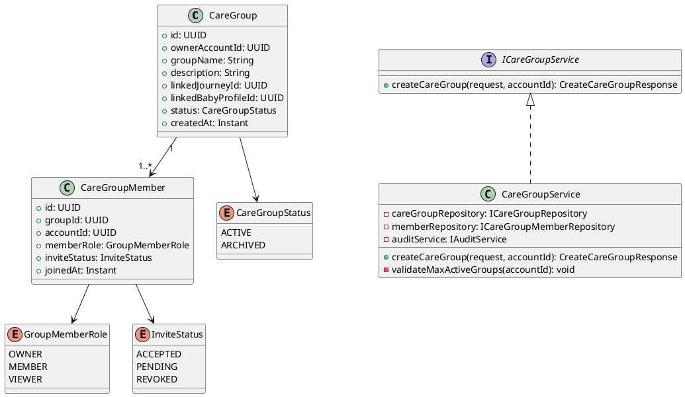
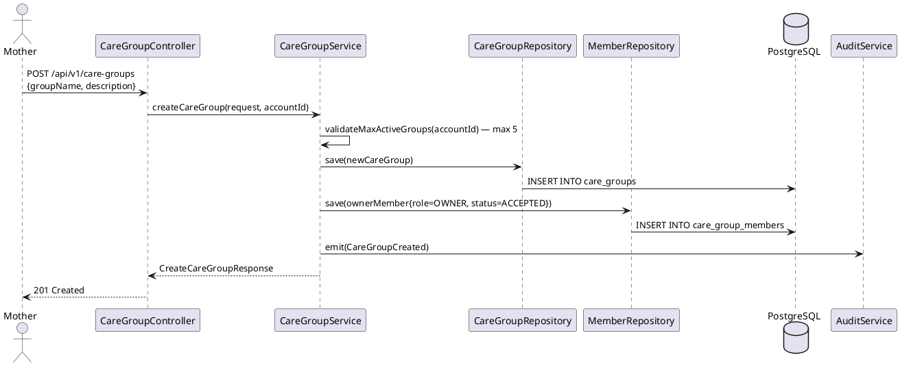

# ENGINEERING DOCUMENTATION STANDARD (EDS) v2.0
# Technical Design Specification — UC-70 Create Care Group

| Field | Value |
|-------|-------|
| **Document ID** | `CB-FAM-IMP-001` |
| **Version** | `1.0` |
| **Date** | `2026-06-26` |
| **Status** | `Approved` |
| **Document Owner** | `PhuongNT` |
| **Author** | `AI Agent` |
| **Reviewed by** | `[Tech Lead]` |
| **DPO Sign-off** | `[ ] Pending` |
| **Approved by** | `[Principal Architect]` |
| **Last Review** | `2026-06-26` |
| **Based on EDS** | `v2.0` |

---

## CHANGELOG

| Ngày | Người thực hiện | Nội dung thay đổi |
|------|-----------------|-------------------|
| 2026-06-27 | AI Agent — Amelia (Dev Agent) | Implementation completed — service, controller, tests 🟢 GREEN (45/45) |
| 2026-06-26 | AI Agent | Tạo tài liệu lần đầu cho UC-70 Create Care Group |

---

## MỤC LỤC

1. [Tổng quan Module](#1-tổng-quan-module)
2. [Ma trận Truy vết](#2-ma-trận-truy-vết)
3. [Architecture Decision Records](#3-architecture-decision-records)
4. [Non-Functional Requirements & SLA](#4-non-functional-requirements--sla)
5. [Static Modeling](#5-static-modeling)
6. [Dynamic Modeling](#6-dynamic-modeling)
7. [Domain Event Catalog](#7-domain-event-catalog)
8. [Interface Specification](#8-interface-specification)
9. [API Specification](#9-api-specification)
10. [Bảng mã lỗi](#10-bảng-mã-lỗi)
11. [Quy trình Triển khai](#11-quy-trình-triển-khai)
12. [Rollback & Incident Runbook](#12-rollback--incident-runbook)
13. [Kịch bản Kiểm thử](#13-kịch-bản-kiểm-thử)
14. [Phương pháp Xác minh](#14-phương-pháp-xác-minh)
15. [Mẫu thử thực tế](#15-mẫu-thử-thực-tế)
16. [Authorization Matrix](#16-authorization-matrix)
17. [AI Prompt Constraints](#17-ai-prompt-constraints-case-20)

---

## 1. Tổng quan Module

| Field | Value |
|-------|-------|
| **Module Name** | `CreateCareGroup` |
| **Bounded Context** | `family` |
| **UC ID** | `UC-70` |
| **SRS Reference** | `3.3.1.47` |
| **Primary Actor** | `Mother (ROLE_MOTHER)` |
| **Platform** | `Mobile App` |
| **Data Classification** | `PII` |
| **Compliance Scope** | `BR-RBAC, BR-PRIVACY` |
| **Upstream Dependencies** | `auth, journey (optional link), baby (optional link)` |
| **Downstream Consumers** | `care group members (UC-216), family invitation, audit` |

**Mô tả:** Mother tạo nhóm chăm sóc (care group) cho mẹ hoặc bé. Mother là Owner của group. Group có thể được liên kết với một journey hoặc baby profile. Sau khi tạo, Mother có thể mời thành viên gia đình.

---

## 2. Ma trận Truy vết

| Requirement ID | Loại | Mô tả | Thành phần Code | Compliance Target | ADR liên quan |
|----------------|------|-------|-----------------|-------------------|---------------|
| UC-70 | Use Case | Mother tạo care group | `CareGroupController.createCareGroup()` | BR-RBAC | ADR-FAM-001 |
| BR-FAM-001 | Business Rule | Mỗi account tối đa 5 care groups ACTIVE | `CareGroupService.validateMaxActiveGroups()` | Data Integrity | ADR-FAM-001 |
| BR-FAM-002 | Business Rule | groupName ≤ 100 ký tự, không trống | `@NotBlank @Size(max=100)` | Data Integrity | — |
| BR-FAM-003 | Business Rule | Người tạo tự động là OWNER của group | `CareGroupService` adds creator as OWNER | BR-RBAC | ADR-FAM-001 |
| BR-FAM-004 | Business Rule | Ghi audit event `CareGroupCreated` | `AuditService` | PDPA | — |
| BR-PRIVACY-001 | Business Rule | Group data chỉ visible cho members | `@PreAuthorize member check` | PDPA | — |

---

## 3. Architecture Decision Records

### ADR-FAM-001 — Mother là Owner, giới hạn 5 active groups

| Field | Value |
|-------|-------|
| **Status** | `Accepted` |
| **Date** | `2026-06-26` |

#### Quyết định
Mother tạo group tự động trở thành OWNER. Giới hạn 5 ACTIVE groups để tránh spam. Creator được thêm vào `care_group_members` với role `OWNER` ngay khi group được tạo.

---

## 4. Non-Functional Requirements & SLA

| Category | Requirement | Target |
|----------|-------------|--------|
| Latency (p99) | API response | `< 300ms` |
| Max members per group | Giới hạn | 20 members |

---

## 5. Static Modeling

### 5.1. Class Diagram



### 5.2. Data Structure

```sql
-- V24__create_care_groups.sql
CREATE TYPE care_group_status AS ENUM ('ACTIVE', 'ARCHIVED');
CREATE TYPE group_member_role AS ENUM ('OWNER', 'MEMBER', 'VIEWER');
CREATE TYPE invite_status AS ENUM ('ACCEPTED', 'PENDING', 'REVOKED');

CREATE TABLE care_groups (
  id                      UUID               PRIMARY KEY DEFAULT gen_random_uuid(),
  owner_account_id        UUID               NOT NULL,
  group_name              VARCHAR(100)       NOT NULL,
  description             VARCHAR(500),
  linked_journey_id       UUID,
  linked_baby_profile_id  UUID,
  status                  care_group_status  NOT NULL DEFAULT 'ACTIVE',
  created_at              TIMESTAMPTZ        NOT NULL DEFAULT NOW(),
  updated_at              TIMESTAMPTZ        NOT NULL DEFAULT NOW(),
  created_by              UUID               NOT NULL,

  CONSTRAINT fk_cg_owner FOREIGN KEY (owner_account_id) REFERENCES accounts(id)
);

CREATE TABLE care_group_members (
  id            UUID               PRIMARY KEY DEFAULT gen_random_uuid(),
  group_id      UUID               NOT NULL REFERENCES care_groups(id),
  account_id    UUID               NOT NULL REFERENCES accounts(id),
  member_role   group_member_role  NOT NULL DEFAULT 'MEMBER',
  invite_status invite_status      NOT NULL DEFAULT 'ACCEPTED',
  joined_at     TIMESTAMPTZ,
  created_at    TIMESTAMPTZ        NOT NULL DEFAULT NOW(),

  CONSTRAINT uq_member_group UNIQUE (group_id, account_id)
);

CREATE INDEX idx_cg_owner ON care_groups(owner_account_id);
CREATE INDEX idx_cgm_group_id ON care_group_members(group_id);
CREATE INDEX idx_cgm_account_id ON care_group_members(account_id);
```

---

## 6. Dynamic Modeling

### 6.1. Sequence Diagram — Happy Path



---

## 7. Domain Event Catalog

| Event Name | Trigger | Publisher | Subscriber(s) | Async? |
|------------|---------|-----------|---------------|--------|
| `CareGroupCreated` | Group saved | `CareGroupService` | `AuditService` | No |

---

## 8. Interface Specification

```java
// CreateCareGroupRequest.java
public class CreateCareGroupRequest {
    @NotBlank @Size(max = 100)
    private String groupName;

    @Size(max = 500)
    private String description;

    private UUID linkedJourneyId;       // optional
    private UUID linkedBabyProfileId;   // optional
}

// CreateCareGroupResponse.java
public class CreateCareGroupResponse {
    private UUID id;
    private String groupName;
    private String status;
    private Integer memberCount;
    private Instant createdAt;
}

// ICareGroupService.java
public interface ICareGroupService {
    /**
     * @throws MaxActiveGroupsException (FAM-002) when account has >= 5 active groups
     */
    CreateCareGroupResponse createCareGroup(CreateCareGroupRequest request, UUID accountId);
}
```

---

## 9. API Specification

| Method | Path | Auth Level | Required Roles | Rate Limit |
|--------|------|------------|----------------|------------|
| `POST` | `/api/v1/care-groups` | JWT Bearer | `ROLE_MOTHER` | 10/min |

**Request:**
```json
{
  "groupName": "My Pregnancy Team",
  "description": "Support group for pregnancy journey"
}
```

**Response 201:**
```json
{
  "id": "uuid-v4",
  "groupName": "My Pregnancy Team",
  "status": "ACTIVE",
  "memberCount": 1,
  "createdAt": "2026-06-26T00:00:00.000Z"
}
```

---

## 10. Bảng mã lỗi

| Code | HTTP | Message (EN) | Trigger Condition |
|------|------|--------------|-------------------|
| `FAM-001` | 400 | Validation failed | Missing groupName |
| `FAM-002` | 409 | Max active groups reached | Account has >= 5 ACTIVE groups |
| `FAM-003` | 403 | Insufficient permissions | Non-MOTHER role |
| `FAM-004` | 500 | Internal error | DB error |

---

## 11. Quy trình Triển khai

1. Flyway `V24__create_care_groups.sql`
2. `CareGroup` + `CareGroupMember` entities
3. `ICareGroupRepository`, `ICareGroupMemberRepository`
4. `CareGroupService.createCareGroup()` với max group check
5. `CareGroupController.POST /api/v1/care-groups`

---

## 12. Rollback & Incident Runbook

```bash
psql -h $DB_HOST -U $DB_USER -d $DB_NAME \
  -c "DROP TABLE IF EXISTS care_group_members CASCADE;"
psql -h $DB_HOST -U $DB_USER -d $DB_NAME \
  -c "DROP TABLE IF EXISTS care_groups CASCADE;"
psql -h $DB_HOST -U $DB_USER -d $DB_NAME \
  -c "DELETE FROM flyway_schema_history WHERE version = '24';"
```

---

## 13. Kịch bản Kiểm thử

```gherkin
Feature: Create Care Group
  Scenario: Happy path
    Given Mother authenticated, has < 5 active groups
    When POST /api/v1/care-groups with valid groupName
    Then 201, group in DB, creator added as OWNER member
    And audit log contains CareGroupCreated

  Scenario: Already has 5 active groups → 409
    Given Mother has exactly 5 ACTIVE groups
    When POST /api/v1/care-groups
    Then response 409, error FAM-002

  Scenario: Empty groupName → 400
    When POST with empty groupName
    Then response 400, error FAM-001
```

---

## 14. Phương pháp Xác minh

```sql
SELECT id, group_name, status FROM care_groups WHERE owner_account_id = '[uuid]';
SELECT member_role, invite_status FROM care_group_members WHERE group_id = '[uuid]';
```

---

## 15. Mẫu thử thực tế

```bash
curl -X POST https://[host]/api/v1/care-groups \
  -H "Authorization: Bearer [JWT_MOTHER_TOKEN]" \
  -H "Content-Type: application/json" \
  -d '{"groupName":"My Team","description":"Support group"}'
```

---

## 16. Authorization Matrix

| Endpoint | `GUEST` | `MOTHER` | `EXPERT` | `ADMIN` |
|----------|---------|----------|----------|---------|
| `POST /api/v1/care-groups` | ❌ | ✅ Own | ❌ | ✅ All |
| `GET /api/v1/care-groups` | ❌ | ✅ Member | ❌ | ✅ All |

---

## 17. AI Prompt Constraints (CASE 2.0)

### 17.1 Constraint Summary Table

| # | Constraint | Source | Last Verified |
|---|-----------|--------|---------------|
| C1 | validateMaxActiveGroups() PHẢI chạy trước save() | ADR-FAM-001 | 2026-06-26 |
| C2 | Creator PHẢI được add vào care_group_members với role OWNER | ADR-FAM-001 | 2026-06-26 |
| C3 | Emit CareGroupCreated event sau thành công | BR-PRIVACY | 2026-06-26 |
| C4 | accountId từ JWT — không từ body | BR-RBAC | 2026-06-26 |
| C5 | ROLE_MOTHER only | BR-RBAC | 2026-06-26 |

### 17.2 Constraint Injection Block

```
[CONSTRAINT BLOCK — Module: CreateCareGroup (CB-FAM-IMP-001)]
1. validateMaxActiveGroups() PHẢI chạy TRƯỚC save() — reject nếu >= 5 active groups — ADR-FAM-001
2. Creator PHẢI được auto-add vào care_group_members với role=OWNER, invite_status=ACCEPTED — ADR-FAM-001
3. Emit CareGroupCreated event sau save thành công — BR-PRIVACY
4. accountId từ JWT SecurityContext, KHÔNG từ request body — BR-RBAC
5. @PreAuthorize("hasRole('MOTHER')") — chỉ Mother tạo group — BR-RBAC

[CONTEXT BLOCK]
- Bounded Context: family
- Data Classification: Internal
- Error codes: §10 Error Codes Table
- Auth matrix: §16 Authorization Matrix
```

### 17.3 Constraint Quality Checklist

- [x] Mỗi constraint traceable về ADR hoặc BR cụ thể
- [x] Không có constraint generic
- [x] Constraint block có ≥ 3 constraints cụ thể

### 17.4 Anti-Pattern Detection

| AP-ID | Anti-Pattern | Dấu hiệu | Hành động |
|-------|-------------|-----------|----------|
| AP-AI-001 | Unconstrained Gen | Code không match constraint C1-C5 | Reject — inject lại constraints |
| AP-AI-003 | Implicit Decision | Code assume architecture không có ADR | Reject — viết ADR trước |
| AP-AI-005 | Hallucinated Contract | Code import không có trong §8 | Reject — verify contract |

---

## PHỤ LỤC

### A. Glossary (Thuật ngữ)

| Thuật ngữ | Định nghĩa |
|-----------|------------|
| CareGroup | Nhóm chăm sóc — cho phép chia sẻ thông tin thai kỳ/bé với người thân |
| CareGroupMember | Thành viên nhóm — có role (OWNER, MEMBER) và invite_status |
| MaxActiveGroups | Giới hạn số nhóm active tối đa mỗi tài khoản (5) |

### B. Tài liệu tham chiếu

| Document | Path |
|----------|------|
| EDS v2.0 Template | `08_References/Template/PHASE-3_TDS.md` |

---

*EDS v2.1 — Tích hợp CASE 2.0 AI Prompt Constraints (§17).*
