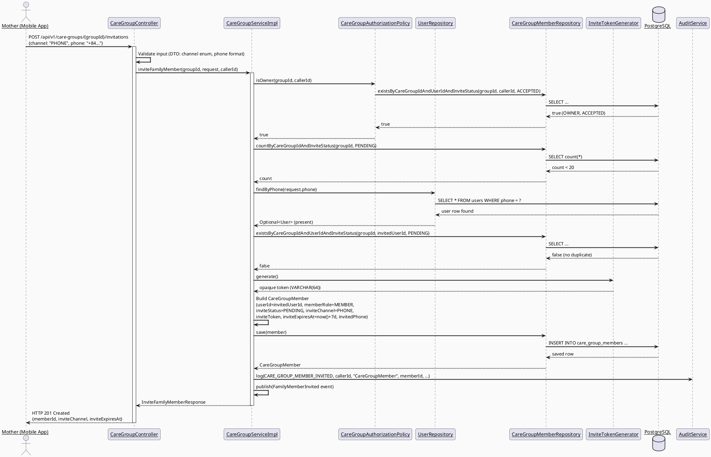
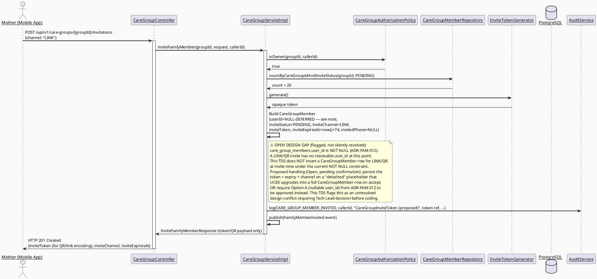
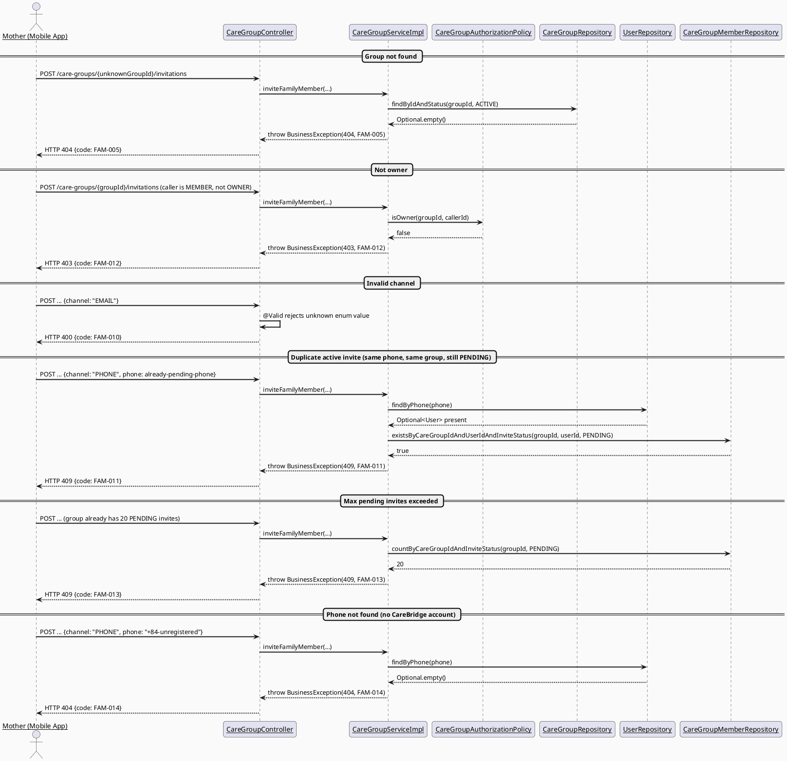
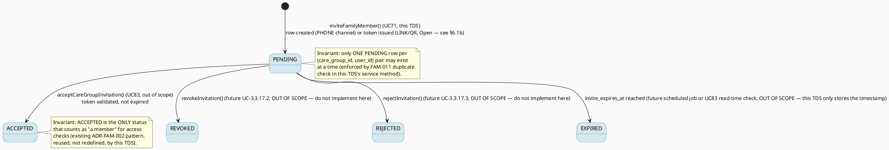

# UC71 — Invite Family Member — Technical Design Specification

| Field | Value |
|-------|-------|
| **Document ID** | `CB-FAM-IMP-071` |
| **Version** | `1.0` |
| **Date** | `2026-07-02` |
| **Status** | `Approved` |
| **Document Owner** | `TV2-Bách` |
| **Author** | `AI Agent (Technical Architect + Test Designer role)` |
| **Reviewed by** | `[ ] Pending` |
| **DPO Sign-off** | `[ ] Pending` *(module touches phone number / PII — see §1)* |
| **Approved by** | `[ ] Pending` |
| **Last Review** | `2026-07-02` |
| **Based on EDS** | `v2.0` |

---

## CHANGELOG

> **Policy 4.4 — Immutable History:** Never delete prior entries. All changes are appended below.

| Ngày | Người thực hiện | Nội dung thay đổi |
|------|-----------------|-------------------|
| 2026-07-02 | AI Agent — Technical Architect | Initial draft — TDS for UC71 Invite Family Member |
| 2026-07-07 | AI Agent — Amelia (Dev Agent) | Phase GREEN complete — 24/24 unit tests PASS; added Flyway migration `V20260707190000__add_care_group_invite_token.sql`, `InviteChannel` enum, `InviteStatus` extended (REJECTED/EXPIRED), `InviteTokenGenerator`, `CareGroupAuthorizationPolicy`, UC71 service + controller endpoint; integration tests (TC-014, TC-023, TC-024, TC-INT-001, TC-INT-002) deferred pending Docker runtime |

---

## MỤC LỤC

1. [Tổng quan Module](#1-tổng-quan-module)
2. [Ma trận Truy vết (Traceability Matrix)](#2-ma-trận-truy-vết-traceability-matrix)
3. [Architecture Decision Records (ADR)](#3-architecture-decision-records-adr)
4. [Non-Functional Requirements & SLA](#4-non-functional-requirements--sla)
5. [Static Modeling (Mô hình Tĩnh)](#5-static-modeling-mô-hình-tĩnh)
6. [Dynamic Modeling (Mô hình Động)](#6-dynamic-modeling-mô-hình-động)
7. [Domain Event Catalog](#7-domain-event-catalog)
8. [Interface Specification (Đặc tả Giao diện)](#8-interface-specification-đặc-tả-giao-diện)
9. [API Specification](#9-api-specification)
10. [Bảng mã lỗi (Error Codes)](#10-bảng-mã-lỗi-error-codes)
11. [Quy trình Triển khai (Step-by-Step)](#11-quy-trình-triển-khai-step-by-step)
12. [Rollback & Incident Runbook](#12-rollback--incident-runbook)
13. [Kịch bản Kiểm thử Chi tiết](#13-kịch-bản-kiểm-thử-chi-tiết)
14. [Phương pháp Xác minh](#14-phương-pháp-xác-minh)
15. [Mẫu thử thực tế (API Verification Samples)](#15-mẫu-thử-thực-tế-api-verification-samples)
16. [Bảng tổng hợp phân quyền (Authorization Matrix)](#16-bảng-tổng-hợp-phân-quyền-authorization-matrix)
17. [AI Prompt Constraints (CASE 2.0)](#17-ai-prompt-constraints-case-20)

---

## 1. Tổng quan Module

UC71 "Invite Family Member" lets a Mother (primary actor, no secondary actor per SRS) invite a
family member into an existing `CareGroup` via one of three channels: LINK, QR, or PHONE
number. The result of a successful invite is a new `care_group_members` row in `PENDING` status
carrying an opaque invite token and an expiry timestamp. This TDS covers ONLY the creation and
issuance of the invite (server-side generation, persistence, and returning enough data to the
Mobile client to render/share a link or QR payload). It does NOT cover the recipient's
acceptance flow (that is UC83, a separate TDS which depends on the schema this TDS introduces).

| Field | Value |
|-------|-------|
| **Module Name** | `Family Sync — Care Group Invitation` |
| **Bounded Context** | `family` (package `com.carebridge.backend.family`) |
| **Data Classification** | `PII` (invited phone number, invite token) |
| **Compliance Scope** | `PDPA` (Vietnam) — BR-PRIVACY per SRS; no GDPR/CCPA scope asserted (CareBridge is a VN-market product; do not invent EU legal basis) |
| **Upstream Dependencies** | `CareGroupRepository`, `CareGroupMemberRepository`, `UserRepository` (phone lookup, see ADR-FAM-012), `AuditService` |
| **Downstream Consumers** | UC83 Accept Care Group Invitation (reads `invite_token`/`invite_expires_at`/`invited_phone`); future UC-3.3.17.2 Revoke Family Invitation (reads/updates same row, out of scope here) |

---

## 2. Ma trận Truy vết (Traceability Matrix)

| Requirement ID | Loại (BR/ADR/US) | Mô tả yêu cầu | Thành phần Code | Compliance Target | ADR liên quan |
|----------------|------------------|---------------|-----------------|-------------------|---------------|
| SRS-UC71-PRE-1 | Precondition | System/external services available | `CareGroupServiceImpl.inviteFamilyMember()` (fails fast via repository exceptions) | — | — |
| SRS-UC71-PRE-2 | Precondition | Actor on relevant screen (mobile) | `invite_family_member_screen.dart` | — | — |
| SRS-UC71-PRE-3 | Precondition | Actor authenticated with required role/permission | `@PreAuthorize("hasRole('MOTHER')")` + `CareGroupAuthorizationPolicy.isOwner()` | — | ADR-FAM-011 |
| SRS-UC71-PRE-4 | Precondition | Required reference data exists (care group, invitee reference) | `CareGroupRepository.findByIdAndStatus()`, `UserRepository.findByPhone()` | — | ADR-FAM-012 |
| SRS-UC71-POST-1 | Postcondition | Operation completed / clear result shown | `InviteFamilyMemberResponse` (201) | — | — |
| SRS-UC71-POST-2 | Postcondition | Related records/statuses/notifications updated | New `CareGroupMember` row `PENDING`, `FamilyMemberInvited` event | — | — |
| SRS-UC71-POST-3 | Postcondition | Sensitive actions recorded for audit/safety/privacy | `AuditService.log(CARE_GROUP_MEMBER_INVITED, ...)` | PDPA audit trail | — |
| SRS-UC71-NF1 | Normal Flow step 1-2 | Open screen, validate access/context | Controller `@PreAuthorize` + `isOwner()` check | — | ADR-FAM-011 |
| SRS-UC71-NF2 | Normal Flow step 3-4 | Enter/select channel, confirm, apply business rules | `inviteFamilyMember()` service method | — | ADR-FAM-010 |
| SRS-UC71-NF3 | Normal Flow step 5 | Display result + update records/notifications | Response DTO + `FamilyMemberInvited` event | — | — |
| SRS-UC71-AF1 | Alt Flow | Cancel-safe-state | Mobile screen cancel button (no server call, no side effect) | — | — |
| SRS-UC71-AF2 | Alt Flow | Empty-state (no members yet) | Mobile screen — display empty list before first invite | — | — |
| SRS-UC71-AF3 | Alt Flow | Optional filters/attachments (channel selection) | `InviteChannel` enum {LINK, QR, PHONE} | — | ADR-FAM-010 |
| SRS-UC71-E1 | Exception | Access denied (unauthenticated/unauthorized/out of scope) | `FAM-012` (403 not owner), `FAM-003` (403 not accepted member), `FAM-005` (404 group not found) | — | ADR-FAM-011 |
| SRS-UC71-E2 | Exception | Invalid/missing/expired/conflicting data rejected | `FAM-010` (invalid channel), `FAM-011` (duplicate active invite), `FAM-013` (max invites exceeded), `FAM-014` (phone not found — see ADR-FAM-012) | — | ADR-FAM-012 |
| SRS-UC71-E3 | Exception | External/network/server failure handled, no duplicate unsafe action | Unique index `uq_care_group_members_invite_token` prevents duplicate token; service is transactional | — | — |
| BR-RBAC | Business Rule | Role/permission scope only | `@PreAuthorize("hasRole('MOTHER')")` + `CareGroupAuthorizationPolicy.isOwner()` | — | ADR-FAM-011 |
| BR-PRIVACY | Business Rule | Health/family data needs consent/purpose/minimum-necessary access | `invited_phone` stored only when channel=PHONE; token never logged in plaintext (see §14.2); `CareGroupMemberDto`/response never leaks other members' phone | — | — |
| BR-CONSULTATION | Business Rule | Booking/payment/dispute/refund/pricing auditable lifecycle | **Not applicable** — UC71 has no booking/payment/pricing/dispute/refund concept. Listed per SRS generic BR template only. | — | — |
| OPEN-1 | Open Item | Token algorithm/length/expiry duration | `InviteTokenGenerator` (§8.1), migration `invite_expires_at` | — | ADR-FAM-010 |
| OPEN-2 | Open Item | Invite-by-unregistered-phone resolution | `UserRepository.findByPhone()` lookup, `FAM-014` | — | ADR-FAM-012 |
| OPEN-3 | Open Item | Max concurrent PENDING invites per group | `FAM-013`, `MAX_PENDING_INVITES_PER_GROUP = 20` constant | — | ADR-FAM-013 |

---

## 3. Architecture Decision Records (ADR)

### ADR-FAM-010 — Invite Token Generation, Format, and Expiry

| Field | Value |
|-------|-------|
| **Status** | `Proposed` (Open — pending security/user review, see OPEN-1) |
| **Deciders** | `AI Agent (proposed)` — pending Tech Lead + Security review |
| **Date** | `2026-07-02` |

#### Bối cảnh (Context)
UC71 must generate a shareable invite artifact (link/QR/phone reference) that UC83 can later
redeem exactly once (or until it expires/is revoked). SRS gives no algorithm, length, or expiry
duration — this is not specified anywhere in `3_Functional_Specification.md` §3.3.1.48. A
concrete, unguessable token is required so that possession of the link/QR is sufficient proof
of invitation, without exposing any internal IDs.

#### Các phương án đã xem xét (Options Considered)

| Phương án | Mô tả | Ưu điểm | Nhược điểm |
|-----------|-------|----------|------------|
| A | JWT-signed token embedding `careGroupMemberId` + expiry claim | Self-contained, no DB round-trip to validate | Cannot be revoked without a blocklist; adds JWT dependency complexity for a single-use token |
| B | Random opaque token, `SecureRandom`-backed, Base62-encoded, stored in `invite_token` column, `VARCHAR(64)`, single-use, checked via unique index | Simple, revocable by DB update, no extra crypto dependency, consistent with existing pattern of DB-backed lookups (e.g. OTP flows) | Requires a DB read on redemption (acceptable — same cost as existing OTP verification flow) |
| C | UUID v4 as token | Simple to generate | Lower entropy per character than random Base62; also collides conceptually with `care_group_member_id` naming, risks confusion in logs |

#### Quyết định (Decision)
Chọn **Phương án B** — random opaque token, `SecureRandom` 256-bit entropy encoded as
Base62/Base64URL-safe string (≤ 64 chars), persisted in `care_group_members.invite_token
VARCHAR(64)`, with `invite_expires_at` = `now() + 7 days` (default). Reason: consistent with
CareBridge's existing DB-backed verification pattern (OTP), avoids introducing a new JWT
signing/verification path for a single-purpose token, and is trivially revocable (future
UC-3.3.17.2 just needs to null the column or flip `invitation_status` to `REVOKED`).

**⚠️ This decision (exact algorithm, byte length, and 7-day expiry) is Open — proposed default
only. Requires explicit user/security review sign-off before implementation (OPEN-1).**

#### Hệ quả (Consequences)

**Tích cực:**
- No new crypto/signing infrastructure needed.
- Token is trivially invalidated (set `invite_token = NULL` or status change) — supports future
  revoke/reject use cases without redesign.

**Tiêu cực / Trade-offs:**
- Requires a DB lookup (`findByInviteToken`) on redemption by UC83 — acceptable, single indexed
  query.
- 7-day default expiry is an unverified business assumption — flagged Open.

**Compliance Impact:**
- Token itself is not classified PII, but MUST NOT be written to application logs in plaintext
  (see §14.2) since it functions as a bearer credential for joining a family's private care
  group.

---

### ADR-FAM-011 — Invite Authorization: Owner-Only

| Field | Value |
|-------|-------|
| **Status** | `Proposed` (Open — pending user confirmation, see shared-context Authorization section) |
| **Deciders** | `AI Agent (proposed)` — pending Product/Tech Lead |
| **Date** | `2026-07-02` |

#### Bối cảnh (Context)
SRS BR-RBAC only states "role/permission scope only" generically; it does not specify whether
any `ACCEPTED` member may invite others, or only the group `OWNER`. This decision has direct
consequences on `CareGroupAuthorizationPolicy` and the Authorization Matrix (§16).

#### Các phương án đã xem xét (Options Considered)

| Phương án | Mô tả | Ưu điểm | Nhược điểm |
|-----------|-------|----------|------------|
| A | Any `ACCEPTED` member (any `GroupMemberRole`) may invite | More flexible for large families | Risks uncontrolled group growth; conflicts with existing `ADR-FAM-002`-style ownership gating already used for `listMembers` |
| B | Only `memberRole == OWNER` AND `inviteStatus == ACCEPTED` may invite | Matches existing UC70 pattern (creator = sole OWNER), simplest to reason about for a PII-adjacent action | Less flexible — co-parents with `MEMBER` role cannot invite without a future permission-delegation feature (UC72) |

#### Quyết định (Decision)
Chọn **Phương án B** — OWNER-only, ACCEPTED-only. Reason: consistent with the existing informal
"ADR-FAM-002" pattern already encoded in `CareGroupServiceImpl.listMembers()` (ACCEPTED-only
gating), and keeps the authorization surface minimal until UC72 (Manage Family Permission)
formally introduces delegated permissions.

**⚠️ Open — requires explicit user confirmation.** If a future decision allows non-owner
members to invite, this ADR must be superseded, not silently reinterpreted.

#### Hệ quả (Consequences)

**Tích cực:**
- Minimal authorization surface — single boolean check (`CareGroupAuthorizationPolicy.isOwner`).
- Matches Least Privilege principle (§16).

**Tiêu cực / Trade-offs:**
- Restrictive for families wanting multiple inviters — deferred to UC72 as a follow-up
  enhancement (not part of this scope).

**Compliance Impact:**
- Reduces the blast radius of who can introduce a new PII holder (invited phone number) into
  the group — favorable for BR-PRIVACY.

---

### ADR-FAM-012 — Phone-Number Invite Resolution for Unregistered Users

| Field | Value |
|-------|-------|
| **Status** | `Proposed` (Open — pending user confirmation, see OPEN-2) |
| **Deciders** | `AI Agent (proposed)` — pending Product/Tech Lead + DPO |
| **Date** | `2026-07-02` |

#### Bối cảnh (Context)
`care_group_members.user_id` is `NOT NULL` per `V1__init_schema.sql` line 140 (verified ground
truth). SRS allows inviting "by ... phone number," which implies the invited person may not yet
have a CareBridge account. This is a real schema conflict: a `CareGroupMember` row cannot be
created without a `user_id`, but there is no account to reference for an unregistered phone
number.

#### Các phương án đã xem xét (Options Considered)

| Phương án | Mô tả | Ưu điểm | Nhược điểm |
|-----------|-------|----------|------------|
| A | Make `care_group_members.user_id` nullable via new migration; defer `user_id` assignment until UC83 accept-time (using `invited_phone` as the interim key) | Directly supports "invite anyone by phone" per literal SRS wording | Changes a NOT NULL constraint used by 2 existing features (UC70/UC216) and by `existsByCareGroupIdAndUserIdAndInviteStatus` queries — every consumer of `user_id` must now null-check; higher regression risk; requires re-verifying UC70/UC216 code paths |
| B | Require the invited phone number to correspond to an **existing** registered user account (looked up via `UserRepository.findByPhone(phone)` at invite time). If no match, fail with a clear, actionable error (`FAM-014`); true "invite a not-yet-registered phone number" support (SMS-based onboarding) is deferred to a future feature | Zero schema risk to `user_id` NOT NULL semantics; keeps `care_group_members` fully consistent for all 4 sibling features (UC71/72/73/83); smallest scoped change per CLAUDE.md delivery rules | Narrower than literal SRS wording — a Mother cannot invite a family member who has never installed/registered on CareBridge via phone number alone; LINK/QR channel still works for anyone with the link even if unregistered? — see note below |

#### Quyết định (Decision)
Chọn **Phương án B**. Reason: CLAUDE.md explicitly instructs "make the smallest scoped change"
and forbids changing existing NOT NULL semantics without approval; widening `user_id` to
nullable has ripple effects across UC70/UC216 (already-shipped code) and UC72/UC73/UC83 (sibling
specs in this same batch) that would need to be redesigned in lockstep. Phone-channel invites
therefore require an existing account; if none is found, the API returns `FAM-014` (404-class,
"no CareBridge account found for this phone number") with guidance to use LINK or QR channel
instead, or to ask the invitee to register first.

**Note on LINK/QR channels:** LINK and QR channels do NOT require a pre-resolved `user_id` at
invite-creation time under Option B either — this TDS's Option B decision means: for ALL three
channels, the invited person must resolve to a `user_id` before a `CareGroupMember` row can be
inserted. For LINK/QR this means the row is only created once UC83 completes the accept flow
and supplies the accepting user's `user_id`. **This changes UC71's own POST-2 semantics:** UC71
creates the row eagerly ONLY for the PHONE channel (since the user_id is resolvable up front via
phone lookup); for LINK/QR, UC71 issues a **standalone invite token** without an associated
`CareGroupMember` row yet, and UC83 is responsible for creating the row on accept. **This is a
second-order design decision this TDS makes explicit and flags Open — it deviates from the
shared-context's original framing that assumed a `CareGroupMember` PENDING row is always created
by UC71 for all channels.** See §5.2/§6.1 for the two distinct sequence paths and §8.1 for the
two distinct response shapes.

**⚠️ This entire resolution (Option B, and the LINK/QR-vs-PHONE row-creation-timing split it
implies) is Open — requires explicit user/product confirmation before implementation.
Alternative: user may instead approve Option A (nullable `user_id`) if "invite truly unregistered
users" is a hard product requirement; that would require a superseding ADR and re-opens
UC70/UC216/UC72/UC73/UC83 for review.**

#### Hệ quả (Consequences)

**Tích cực:**
- No NOT NULL constraint change; zero regression risk to UC70/UC216/UC72/UC73.
- `care_group_members` remains a strict "current/prospective member with resolved identity"
  table, not a mixed identity/contact table.

**Tiêu cực / Trade-offs:**
- PHONE-channel invite to a non-registered number fails immediately (`FAM-014`) rather than
  silently queuing an SMS-based onboarding invite — SRS's literal "invite by phone number" wording
  is only partially satisfied (phone number becomes a *lookup key* for an existing account, not
  a raw invitation target for a stranger). Flagged Open for product sign-off.
- LINK/QR invites do not have a `CareGroupMember` row until UC83 runs — any UI that lists
  "pending invites for this group" (out of scope here, potentially part of UC-3.3.17.1 View
  Members) must account for PENDING rows only existing for PHONE-channel invites; LINK/QR
  pending invites must be tracked by a separate lightweight mechanism if a "view pending
  invites" feature is later required (out of scope, flagged for future TDS).

**Compliance Impact:**
- Avoids storing a phone number as a "shadow identity" without a linked account, reducing
  BR-PRIVACY exposure (no dangling PII-only rows for people who never verify possession of the
  phone number via login).

---

### ADR-FAM-013 — Maximum Concurrent PENDING Invites per Group

| Field | Value |
|-------|-------|
| **Status** | `Proposed` (Open — pending user confirmation, see OPEN-3) |
| **Deciders** | `AI Agent (proposed)` |
| **Date** | `2026-07-02` |

#### Bối cảnh (Context)
Without a cap, a compromised or careless OWNER account could spam-generate invite tokens
(especially LINK/QR, which per ADR-FAM-012 do not even require a resolvable phone number),
creating unbounded token rows or abuse vectors. SRS specifies no numeric limit.

#### Các phương án đã xem xét (Options Considered)

| Phương án | Mô tả | Ưu điểm | Nhược điểm |
|-----------|-------|----------|------------|
| A | No limit | Simplest | Abuse/spam vector, unbounded resource growth |
| B | Cap at 20 PENDING invites per group (spirit-reuse of existing "max 5 active groups per owner" pattern from UC70) | Bounded resource usage, consistent precedent with existing C1 rule shape | Arbitrary number — Open, needs product confirmation |

#### Quyết định (Decision)
Chọn **Phương án B** — max 20 PENDING invites per `care_group_id` (counting PHONE-channel
`CareGroupMember` rows in `PENDING` plus any LINK/QR outstanding tokens tracked the same way,
see §5.2 note on unified counting). Enforced via `FAM-013` (409 Conflict) before token
generation.

**⚠️ Open — the number 20 and whether LINK/QR-only tokens count toward the same cap both need
explicit user/product confirmation (OPEN-3).**

#### Hệ quả (Consequences)

**Tích cực:** Bounded, auditable resource usage; consistent precedent with UC70's C1 rule.

**Tiêu cực / Trade-offs:** Arbitrary threshold may need tuning after real usage data; large
extended families (esp. multi-generational care groups) could hit the cap legitimately — no
override mechanism specified (Open).

**Compliance Impact:** None beyond general abuse-prevention posture.

---

## 4. Non-Functional Requirements & SLA

> No source in SRS or existing TDS docs specifies numeric SLAs for this feature. All targets
> below are **Open — placeholder defaults**, not sourced commitments, and must be confirmed by
> Tech Lead before being treated as binding.

### 4.1. Performance & Availability

| Category | Requirement | Target SLA | Measurement Method | Compliance Basis |
|----------|-------------|------------|---------------------|------------------|
| Latency | `POST /care-groups/{groupId}/invitations` (p99) | `< 300ms` (Open — no sourced SLA, reused CareBridge default) | k6 load test | — |
| Availability | Uptime (monthly) | `99.9%` (Open — platform-wide default, not feature-specific) | Uptime monitor | — |
| Throughput | Concurrent requests | Not benchmarked — Open | — | — |

### 4.2. Data Integrity & Retention

| Category | Requirement | Target | Verification Method | Compliance Basis |
|----------|-------------|--------|---------------------|------------------|
| Durability | Zero record loss for issued invites | RPO = 0 (same as rest of transactional DB) | Transaction log | — |
| Retention | Audit log retention | Reuse platform default (Open — no feature-specific retention period specified in SRS) | DB backup policy | — |
| Consistency | Invite token uniqueness | 100% enforced by `uq_care_group_members_invite_token` | Unique index constraint | — |

### 4.3. Security

| Category | Requirement | Target | Verification Method | Compliance Basis |
|----------|-------------|--------|---------------------|------------------|
| Token entropy | `invite_token` unguessable | ≥ 256-bit `SecureRandom` source (ADR-FAM-010, Open) | Code review of `InviteTokenGenerator` | — |
| Token exposure | Never logged in plaintext | 0 occurrences in app logs | Log grep (§14.2) | BR-PRIVACY |
| Access control | Role-based, owner-only invite | Least privilege | Auth Matrix (§16) | BR-RBAC |

### 4.4. Scalability & Capacity Planning

No load projection exists for this feature in current SRS/design docs — **Open**. Given the cap
of 20 PENDING invites per group (ADR-FAM-013) and existing cap of 5 active groups per owner
(UC70 C1), worst-case invite row growth per owner is bounded (100 pending invite rows max), which
is negligible at current expected scale. No caching or horizontal-scaling strategy is proposed
as none is currently warranted.

---

## 5. Static Modeling (Mô hình Tĩnh)

### 5.1. Class Diagram (PlantUML)

```plantuml
@startuml UC71_InviteFamilyMember_ClassDiagram
skinparam classAttributeIconSize 0
skinparam classFontStyle bold
skinparam backgroundColor #FAFAFA
skinparam ArrowColor #555555
skinparam ClassBorderColor #2E75B6
skinparam ClassHeaderBackgroundColor #D5E8F0

' === ENTITIES (existing, extended) ===
class CareGroup {
  + id: UUID
  + ownerUserId: UUID
  + groupName: String
  + description: String
  + linkedJourneyId: UUID
  + linkedBabyProfileId: UUID
  + status: CareGroupStatus
  + createdAt: Instant
  + updatedAt: Instant
}

class CareGroupMember {
  + id: UUID
  + careGroupId: UUID
  + userId: UUID
  + memberRole: GroupMemberRole
  + inviteStatus: InviteStatus
  + joinedAt: Instant
  + inviteToken: String
  + inviteChannel: InviteChannel
  + inviteExpiresAt: Instant
  + invitedPhone: String
  + createdAt: Instant
  + updatedAt: Instant
  ' NEW fields (this TDS's migration V20260702090000):
  ' inviteToken, inviteChannel, inviteExpiresAt, invitedPhone
}

enum CareGroupStatus {
  ACTIVE
  ARCHIVED
}

enum GroupMemberRole {
  OWNER
  MEMBER
  VIEWER
}

enum InviteStatus {
  ACCEPTED
  PENDING
  REVOKED
  REJECTED
  ' NEW — Open, proposed extension, see shared-context
  EXPIRED
  ' NEW — Open, proposed extension, see shared-context
}

enum InviteChannel <<NEW>> {
  LINK
  QR
  PHONE
}

' === SERVICES ===
interface ICareGroupService <<interface>> {
  + createCareGroup(request: CreateCareGroupRequest, callerId: UUID): CreateCareGroupResponse
  + listMembers(groupId: UUID, callerId: UUID): CareGroupMembersResponse
  + inviteFamilyMember(groupId: UUID, request: InviteFamilyMemberRequest, callerId: UUID): InviteFamilyMemberResponse
}

class CareGroupServiceImpl implements ICareGroupService {
  - groupRepository: CareGroupRepository
  - memberRepository: CareGroupMemberRepository
  - userRepository: UserRepository
  - authorizationPolicy: CareGroupAuthorizationPolicy
  - tokenGenerator: InviteTokenGenerator
  - auditService: AuditService
  - eventPublisher: ApplicationEventPublisher
  + inviteFamilyMember(groupId, request, callerId): InviteFamilyMemberResponse
}

class InviteTokenGenerator <<NEW>> {
  + generate(): String
}

class CareGroupAuthorizationPolicy {
  + isOwner(groupId: UUID, userId: UUID): boolean
}

' === REPOSITORIES ===
interface CareGroupRepository <<interface>> {
  + countByOwnerUserIdAndStatus(ownerUserId: UUID, status: CareGroupStatus): long
  + findByIdAndStatus(id: UUID, status: CareGroupStatus): Optional<CareGroup>
}

interface CareGroupMemberRepository <<interface>> {
  + existsByCareGroupIdAndUserIdAndInviteStatus(groupId: UUID, userId: UUID, status: InviteStatus): boolean
  + findByCareGroupIdAndInviteStatusIn(groupId: UUID, statuses: List<InviteStatus>): List<CareGroupMember>
  + countByCareGroupId(groupId: UUID): long
  + findByInviteToken(token: String): Optional<CareGroupMember>
  + countByCareGroupIdAndInviteStatus(groupId: UUID, status: InviteStatus): long
  + findByCareGroupIdAndUserId(groupId: UUID, userId: UUID): Optional<CareGroupMember>
}

' === RELATIONSHIPS ===
CareGroupServiceImpl --> CareGroupRepository : uses
CareGroupServiceImpl --> CareGroupMemberRepository : uses
CareGroupServiceImpl --> CareGroupAuthorizationPolicy : uses
CareGroupServiceImpl --> InviteTokenGenerator : uses
CareGroup "1" *-- "many" CareGroupMember : contains
CareGroupMember --> GroupMemberRole
CareGroupMember --> InviteStatus
CareGroupMember --> InviteChannel

@enduml
```



### 5.2. Data Structure (Flyway SQL Migration)

> **CareBridge rule:** `V1__init_schema.sql` is the schema baseline. Never modify an applied
> migration — only add new ones.

**New migration (owned by UC71; UC83 depends on it as a read-only consumer, does not redefine
it):**

Tạo file: `05_Development/CareBridgeAPI/src/main/resources/db/migration/V20260702090000__add_care_group_invite_token.sql`

```sql
-- === UC71 Invite Family Member — invite token support ===
-- Adds invite issuance columns to care_group_members. No existing column is altered/dropped.

ALTER TABLE care_group_members
    ADD COLUMN IF NOT EXISTS invite_token       VARCHAR(64),   -- opaque bearer token (ADR-FAM-010), NULL once consumed/not applicable
    ADD COLUMN IF NOT EXISTS invite_channel     VARCHAR(20),   -- LINK | QR | PHONE (ADR-FAM-010)
    ADD COLUMN IF NOT EXISTS invite_expires_at  TIMESTAMPTZ,   -- default now() + 7 days at insert time (ADR-FAM-010, Open)
    ADD COLUMN IF NOT EXISTS invited_phone      VARCHAR(20);   -- phone-based invite target lookup key, nullable (ADR-FAM-012)

CREATE UNIQUE INDEX IF NOT EXISTS uq_care_group_members_invite_token
    ON care_group_members (invite_token) WHERE invite_token IS NOT NULL;
```

**Sync note re: `V1__init_schema.sql` (do NOT edit V1 — this is a documentation note only):**
`V1__init_schema.sql` lines 137-147 define `care_group_members` without the four new columns
above. Per CLAUDE.md "never modify an applied migration," V1 is left untouched; this TDS's
migration `V20260702090000` is purely additive (`ADD COLUMN IF NOT EXISTS`). No `NOT NULL`
constraint on `care_group_members.user_id` (V1 line 140) is touched — see ADR-FAM-012 for why
this constraint is deliberately preserved rather than relaxed.

**Java enum change accompanying this migration (code change, not DDL — `invitation_status` is
`VARCHAR(20)` with no CHECK constraint per verified schema):**

```java
// com.carebridge.backend.family.entity.InviteStatus — EXTEND existing enum
public enum InviteStatus { ACCEPTED, PENDING, REVOKED, REJECTED, EXPIRED }
// REJECTED, EXPIRED are NEW values (Open, proposed — see shared batch context and ADR-FAM-010).
// REJECTED is not set by any code in this TDS's scope (UC-3.3.17.3 will use it); EXPIRED is
// also not actively transitioned to by UC71 (a future scheduled job or UC83's read-time check
// would do so) — both values exist now so the state machine (§6.3) is complete without a second
// migration/enum change later.

// NEW enum — com.carebridge.backend.family.entity.InviteChannel
public enum InviteChannel { LINK, QR, PHONE }
```

**Rollback:** see §12.2 / §7 (Test-Spec) — `DROP` the four columns and unique index; no data
migration/backfill needed since all four columns are nullable additions.

---

## 6. Dynamic Modeling (Mô hình Động)

### 6.1. Sequence Diagram — Happy Path: PHONE channel (row created eagerly) (PlantUML)



### 6.1b. Sequence Diagram — Happy Path: LINK/QR channel (token-only, row deferred to UC83)



### 6.2. Sequence Diagram — Error Paths (PlantUML)



### 6.3. State Machine — `InviteStatus`



**⚠️ Invariant bất biến:**
- No transition in this diagram deletes a `CareGroupMember` row (append-only status transitions).
- `PENDING -> ACCEPTED/REVOKED/REJECTED/EXPIRED` transitions are NOT implemented by this TDS
  (UC71 only creates the initial `PENDING` state) — they belong to UC83 and future
  UC-3.3.17.2/3.3.17.3 TDS files respectively. This TDS's Test-Spec verifies only the creation of
  `PENDING`, not any outbound transition.

---

## 7. Domain Event Catalog

### 7.1. Events Published (Phát ra)

| Event Name | Trigger | Publisher | Subscriber(s) | Payload Schema | Async? |
|------------|---------|-----------|---------------|-----------------|--------|
| `FamilyMemberInvited` | Successful `inviteFamilyMember()` call (PHONE row created, or LINK/QR token issued) | `CareGroupServiceImpl` | Audit/log listener only (Open — per SRS "Secondary Actors: None," no FCM push is triggered by this event; see note below) | `FamilyMemberInvited.java` | Yes |

**Note on FCM:** Per shared-context and SRS UC71 secondary actor = "None," this event is NOT
consumed by `FcmService` within UC71's scope. UC83's accept flow (out of scope here) is where
FCM consumption is proposed (SRS UC83 lists FCM as secondary actor), to notify the Mother that
her invite was accepted — that listener is defined in UC83's own TDS, not here. Whether the
invited person receives ANY push/SMS notification of the invite itself (as opposed to a
share-only link/QR the Mother manually sends) is an **edge case left Open** — this TDS assumes
manual out-of-band sharing (the Mother sends the link/QR/tells the phone number owner herself),
consistent with "Secondary Actors: None."

### 7.2. Events Consumed (Tiêu thụ)

| Event Name | Source | Handler | Action thực hiện |
|------------|--------|---------|------------------|
| _(none)_ | — | — | UC71 does not consume any domain event from other modules. |

### 7.3. Payload Schema

```java
// FamilyMemberInvited.java
public record FamilyMemberInvited(
    UUID    eventId,          // UUID.randomUUID() — used to deduplicate
    String  eventType,        // "FamilyMemberInvited"
    Instant occurredAt,       // Instant.now()
    String  version,          // "1.0"
    Payload payload,
    Metadata metadata
) implements ApplicationEvent {

    public record Payload(
        UUID careGroupId,
        UUID careGroupMemberId,     // nullable for LINK/QR under the Open design gap in §6.1b
        UUID inviterId,
        InviteChannel channel,      // LINK | QR | PHONE
        String inviteTokenHash,     // SHA-256 hash of the raw token — RAW TOKEN MUST NEVER be logged/published in plaintext (BR-PRIVACY)
        String invitedPhone,        // nullable — only present for PHONE channel
        Instant expiresAt
    ) {}

    public record Metadata(
        UUID   correlationId,
        String causedBy            // callerId as string
    ) {}
}
```

---

## 8. Interface Specification (Đặc tả Giao diện)

### 8.1. Service Interface

```java
// InviteFamilyMemberRequest.java — Input DTO
// @version 1.0
public class InviteFamilyMemberRequest {
    @NotNull
    private InviteChannel channel;   // LINK | QR | PHONE — required

    @Pattern(regexp = "^\\+?[0-9]{8,15}$", message = "Invalid phone number format")
    private String phone;            // required IFF channel == PHONE; validated in service, not just DTO (cross-field rule)
}

// InviteFamilyMemberResponse.java — Output DTO
public class InviteFamilyMemberResponse {
    private UUID careGroupMemberId;   // nullable for LINK/QR under ADR-FAM-012's Open design gap (see §6.1b)
    private InviteChannel channel;
    private String inviteToken;       // returned ONLY to the inviting Mother's own response (not exposed to any other member listing) — used by mobile client to build the shareable link/QR payload
    private Instant inviteExpiresAt;
    private String invitedPhone;      // echoed back only for PHONE channel; null otherwise
}

// ICareGroupService.java — Service Contract (EXTENDS existing interface, does not replace it)
// @version 1.1
// @breaking-change None — additive method only
public interface ICareGroupService {

    /** @throws com.carebridge.backend.common.exception.BusinessException (FAM-002/409) if >= 5 active groups */
    CreateCareGroupResponse createCareGroup(CreateCareGroupRequest request, UUID callerId);

    /** @throws com.carebridge.backend.common.exception.BusinessException (FAM-003/403) if not ACCEPTED member */
    CareGroupMembersResponse listMembers(UUID groupId, UUID callerId);

    /**
     * Invites a family member into an existing care group via LINK, QR, or PHONE channel.
     * @throws BusinessException (FAM-005/404) if care group not found or not ACTIVE
     * @throws BusinessException (FAM-012/403) if callerId is not the OWNER (ACCEPTED) of the group
     * @throws BusinessException (FAM-010/400) if channel is invalid or phone missing for PHONE channel
     * @throws BusinessException (FAM-013/409) if group already has 20 PENDING invites (ADR-FAM-013, Open)
     * @throws BusinessException (FAM-014/404) if channel == PHONE and no user account matches the phone (ADR-FAM-012, Open)
     * @throws BusinessException (FAM-011/409) if a PENDING invite already exists for the same (group, resolved user) pair
     */
    InviteFamilyMemberResponse inviteFamilyMember(UUID groupId, InviteFamilyMemberRequest request, UUID callerId);
}
```

### 8.2. Repository Interface

```java
// CareGroupMemberRepository.java — EXTEND existing interface with new methods
// @version 1.1
public interface CareGroupMemberRepository extends JpaRepository<CareGroupMember, UUID> {

    // --- existing methods (unchanged) ---
    boolean existsByCareGroupIdAndUserIdAndInviteStatus(UUID careGroupId, UUID userId, InviteStatus status);
    List<CareGroupMember> findByCareGroupIdAndInviteStatusIn(UUID careGroupId, List<InviteStatus> statuses);
    long countByCareGroupId(UUID careGroupId);

    // --- NEW methods (this TDS) ---
    Optional<CareGroupMember> findByInviteToken(String inviteToken);
    long countByCareGroupIdAndInviteStatus(UUID careGroupId, InviteStatus status);
    Optional<CareGroupMember> findByCareGroupIdAndUserId(UUID careGroupId, UUID userId);
}

// UserRepository — assumed existing (used by ADR-FAM-012 phone lookup; if a method
// findByPhone(String) does not yet exist on the actual UserRepository, it must be added as
// part of this feature's implementation — verify against actual codebase before coding).
public interface UserRepository extends JpaRepository<User, UUID> {
    Optional<User> findByPhone(String phone);
}
```

---

## 9. API Specification

### 9.1. Endpoints Table

| Method | Path | Auth Level | Required Roles | Rate Limit | Idempotent? |
|--------|------|------------|----------------|------------|-------------|
| `POST` | `/api/v1/care-groups/{groupId}/invitations` | JWT Bearer | `MOTHER` (+ must be group OWNER, checked in service) | Not specified — Open, propose reuse of platform default 60/min | No (each call issues a new token) |

### 9.2. Request / Response Schemas

#### `POST /api/v1/care-groups/{groupId}/invitations` — Create invite (PHONE channel example)

**Request Body:**
```json
{
  "channel": "PHONE",
  "phone": "+84912345678"
}
```

**Response — 201 Created (Happy Path, PHONE channel):**
```json
{
  "success": true,
  "data": {
    "careGroupMemberId": "550e8400-e29b-41d4-a716-446655440000",
    "channel": "PHONE",
    "inviteToken": "aZ3kP9x...redacted-in-docs-only-not-in-real-response",
    "inviteExpiresAt": "2026-07-09T09:00:00.000Z",
    "invitedPhone": "+84912345678"
  },
  "timestamp": "2026-07-02T09:00:00.000Z"
}
```

**Response — 201 Created (Happy Path, LINK/QR channel — Open shape per §6.1b design gap):**
```json
{
  "success": true,
  "data": {
    "careGroupMemberId": null,
    "channel": "LINK",
    "inviteToken": "aZ3kP9x...",
    "inviteExpiresAt": "2026-07-09T09:00:00.000Z",
    "invitedPhone": null
  },
  "timestamp": "2026-07-02T09:00:00.000Z"
}
```

**Response — 400 Bad Request (Invalid channel):**
```json
{
  "error": {
    "code": "FAM-010",
    "message": "Invalid invite channel. Must be one of LINK, QR, PHONE.",
    "details": [{ "field": "channel", "message": "must be one of LINK, QR, PHONE" }]
  }
}
```

**Response — 409 Conflict (Duplicate active invite):**
```json
{
  "error": {
    "code": "FAM-011",
    "message": "A pending invite already exists for this person in this care group."
  }
}
```

**Response — 403 Forbidden (Not owner):**
```json
{
  "error": {
    "code": "FAM-012",
    "message": "Only the care group owner may invite new members."
  }
}
```

**Response — 409 Conflict (Max pending invites exceeded):**
```json
{
  "error": {
    "code": "FAM-013",
    "message": "This care group already has the maximum number of pending invites (20)."
  }
}
```

**Response — 404 Not Found (Phone not registered):**
```json
{
  "error": {
    "code": "FAM-014",
    "message": "No CareBridge account was found for this phone number. Try LINK or QR instead, or ask them to register first."
  }
}
```

---

## 10. Bảng mã lỗi (Error Codes)

> `FAM-` prefix reused from existing family module codes (FAM-002/003/005 already in use by
> UC70/UC216 — NOT redefined here, only referenced).

| Code | HTTP Status | Message (EN) | Message (VI) | Trigger Condition |
|------|-------------|--------------|--------------|-------------------|
| `FAM-005` | 404 | Care group not found | Không tìm thấy nhóm chăm sóc | `groupId` does not match an `ACTIVE` `CareGroup` (reused from UC70/UC216, not redefined) |
| `FAM-003` | 403 | Not an accepted member | Không phải thành viên đã xác nhận | Caller is not an `ACCEPTED` member of the group at all (reused where relevant to "not authorized caller") |
| `FAM-010` | 400 | Invalid invite channel | Kênh mời không hợp lệ | `channel` is not one of `LINK`/`QR`/`PHONE`, or `phone` missing when `channel == PHONE` |
| `FAM-011` | 409 | Duplicate active invite | Đã tồn tại lời mời đang chờ | A `PENDING` `CareGroupMember` already exists for the same `(care_group_id, resolved user_id)` pair |
| `FAM-012` | 403 | Not group owner | Không phải chủ nhóm | Caller is an `ACCEPTED` member but `memberRole != OWNER` (ADR-FAM-011, Open) |
| `FAM-013` | 409 | Max pending invites exceeded | Vượt quá số lời mời đang chờ tối đa | Group already has 20 `PENDING` invites (ADR-FAM-013, Open) |
| `FAM-014` | 404 | Phone number not registered | Số điện thoại chưa đăng ký | `channel == PHONE` and `UserRepository.findByPhone()` returns empty (ADR-FAM-012, Open) |

---

## 11. Quy trình Triển khai (Step-by-Step)

### 11.1. Prerequisites

- [ ] ADR-FAM-010, ADR-FAM-011, ADR-FAM-012, ADR-FAM-013 reviewed and formally `Accepted` (all
      currently `Proposed`/Open in this draft)
- [ ] DPO sign-off obtained given `invited_phone`/`invite_token` PII handling
- [ ] Blueprint approved by Principal Architect
- [ ] Staging environment ready

### 11.2. Pre-Migration Checklist

- [ ] Production DB backup taken: `pg_dump -h $DB_HOST -U $DB_USER $DB_NAME > backup_YYYYMMDD.sql`
- [ ] Migration `V20260702090000__add_care_group_invite_token.sql` run successfully on staging ≥ 24h
- [ ] Rollback script (§12.2) tested on staging
- [ ] DPO sign-off confirmed (PII-adjacent column addition)

### 11.3. Implementation Steps

#### Chặng 1 — Flyway migration

Tạo file: `src/main/resources/db/migration/V20260702090000__add_care_group_invite_token.sql`
(see §5.2 for full content).

```bash
./mvnw flyway:migrate
```

> ⚠️ **Chú ý:** Additive `ADD COLUMN IF NOT EXISTS` on a low-row-count table (`care_group_members`)
> — no lock/downtime risk expected, but verify row count on production before running.

#### Chặng 2 — Entity + enum updates

```java
// CareGroupMember.java — add 4 new @Column-mapped fields (inviteToken, inviteChannel as
// @Enumerated(EnumType.STRING), inviteExpiresAt, invitedPhone)
// InviteStatus.java — add REJECTED, EXPIRED constants
// NEW: InviteChannel.java enum { LINK, QR, PHONE }
```

#### Chặng 3 — Policy, token generator, repository, service, controller, DTOs

Implement in order: `CareGroupAuthorizationPolicy.isOwner()` → `InviteTokenGenerator` → new
`CareGroupMemberRepository` methods → `ICareGroupService.inviteFamilyMember()` contract →
`CareGroupServiceImpl` implementation → `CareGroupController` new endpoint → DTOs (§8.1).

#### Chặng 4 — Verification sau deploy

```bash
curl -X GET https://[host]/api/v1/health
# Expected: {"status": "ok"}
```

### 11.4. Deployment Checklist

- [ ] Migration ran successfully
- [ ] Health check endpoint returns 200
- [ ] Error rate < 1% in first 10 minutes
- [ ] Audit log producing `CARE_GROUP_MEMBER_INVITED` entries in expected format
- [ ] DPO notified (PII-adjacent deploy — invited phone numbers, invite tokens)

---

## 12. Rollback & Incident Runbook

### 12.1. Điều kiện kích hoạt Rollback (Trigger Conditions)

| Điều kiện | Ngưỡng | Người quyết định |
|-----------|--------|------------------|
| Error rate spike | > 5% in 5 minutes | On-call Engineer |
| Latency p99 exceeds threshold | > 2x baseline | On-call Engineer |
| Data inconsistency (e.g. duplicate tokens bypassing unique index) | Any case | Tech Lead + DPO |
| Audit log stops producing `CARE_GROUP_MEMBER_INVITED` | > 1 minute | On-call Engineer |

### 12.2. Rollback Procedure

```bash
# Step 1: Revert migration manually (Flyway has no auto-rollback)
psql -h $DB_HOST -U $DB_USER -d $DB_NAME \
  -c "ALTER TABLE care_group_members DROP COLUMN IF EXISTS invite_token, DROP COLUMN IF EXISTS invite_channel, DROP COLUMN IF EXISTS invite_expires_at, DROP COLUMN IF EXISTS invited_phone;"
psql -h $DB_HOST -U $DB_USER -d $DB_NAME \
  -c "DROP INDEX IF EXISTS uq_care_group_members_invite_token;"
psql -h $DB_HOST -U $DB_USER -d $DB_NAME \
  -c "DELETE FROM flyway_schema_history WHERE version = '20260702090000';"

# Step 2: Re-deploy previous version
kubectl rollout undo deployment/carebridge-api

# Step 3: Verify rollback
kubectl rollout status deployment/carebridge-api
curl -X GET https://[host]/api/v1/health

# Step 4: Smoke test — confirm listMembers (UC216) and createCareGroup (UC70) unaffected
curl -X GET https://[host]/api/v1/care-groups/{groupId}/members -H "Authorization: Bearer $TOKEN"
```

### 12.3. Notification Protocol

| Thời điểm | Người nhận | Kênh | Template |
|-----------|------------|------|----------|
| Immediately on detection | On-call team | Slack `#incident` | "CareBridge API incident detected: [description]" |
| Within 30 minutes | DPO | Email | Required if PII (phone/token) affected |
| Within 72 hours | Relevant authority (if data breach) | Email | Required only if a genuine breach occurred — Open, no PDPA-specific timeline sourced in this repo |

### 12.4. Post-Incident Review (PIR)

Required within 48 hours of incident resolution, using: Timeline, Root Cause (5 Whys), Impact
(users affected, downtime, PII exposure), Remediation, Prevention action items.

---

## 13. Kịch bản Kiểm thử Chi tiết

Detailed test cases live in the companion Test-Spec document:
`04_Implement/UC71_InviteFamilyMember/UC71_InviteFamilyMember_Test-Spec.md`. This TDS section
cross-references that document rather than duplicating test case bodies (per template intent —
TDS defines what to test at a high level; Test-Spec is the executable detail).

Summary of coverage areas (full detail in Test-Spec §4):
- Happy path: PHONE-channel invite creates `PENDING` `CareGroupMember` row.
- Happy path: LINK/QR-channel invite issues token without a row (Open design gap, §6.1b).
- Authorization: non-owner attempts invite (`FAM-012`).
- Validation: invalid channel (`FAM-010`), missing phone for PHONE channel (`FAM-010`).
- Conflict: duplicate pending invite (`FAM-011`), max invites exceeded (`FAM-013`).
- Not found: group not found (`FAM-005`), phone not registered (`FAM-014`).
- Boundary: exactly 20 pending invites (19th succeeds, 20th triggers `FAM-013` on the 21st
  attempt — boundary value analysis, see Test-Spec TDS-04).
- Integration boundary only (NOT implemented here): token later read by UC83 — Test-Spec notes
  this is a downstream contract, not a UC71 test obligation.

---

## 14. Phương pháp Xác minh

### 14.1. Database Inspection

> **Oracle rule:** every expected column/constraint traces to `V1__init_schema.sql` or this
> TDS's approved migration `V20260702090000`, not to any ERD document.

```sql
-- Verify a PHONE-channel invite row exists after creation
SELECT care_group_member_id, care_group_id, user_id, invitation_status, invite_channel,
       invite_token, invite_expires_at, invited_phone
FROM care_group_members
WHERE care_group_member_id = '[uuid]';

-- Verify unique index prevents duplicate active tokens
SELECT indexname, indexdef FROM pg_indexes
WHERE tablename = 'care_group_members' AND indexname = 'uq_care_group_members_invite_token';

-- Verify no PII (phone/token) leak in query logs
SELECT query FROM pg_stat_activity WHERE query ILIKE '%invited_phone%';
```

### 14.2. Log / Audit Verification

```bash
# Verify audit log format for CARE_GROUP_MEMBER_INVITED
kubectl logs -l app=carebridge-api | grep '"eventType":"FamilyMemberInvited"' | head -5

# Verify raw invite_token NEVER appears in plaintext in logs (BR-PRIVACY / ADR-FAM-010)
kubectl logs -l app=carebridge-api | grep -i "inviteToken\":\"[A-Za-z0-9]" 
# Expected: No output (only inviteTokenHash should ever appear in structured logs, per §7.3)

# Verify no PII (phone) in logs beyond the structured audit entry
kubectl logs -l app=carebridge-api | grep -i "invitedPhone"
# Expected: only appears inside the intended AuditService audit trail entries, not ad-hoc debug logs
```

### 14.3. Tool-based Verification

```bash
# Verify JWT claims used for @PreAuthorize("hasRole('MOTHER')")
echo "$JWT_TOKEN" | cut -d'.' -f2 | base64 -d | jq .

# Verify TLS in transit (platform-wide, not feature-specific)
openssl s_client -connect [host]:443 -tls1_3 2>&1 | grep "Protocol"
```

---

## 15. Mẫu thử thực tế (API Verification Samples)

### 15.1. Happy Path

```bash
# [POST] Invite family member by PHONE
curl -X POST https://[host]/api/v1/care-groups/550e8400-e29b-41d4-a716-446655440000/invitations \
  -H "Authorization: Bearer $JWT_TOKEN" \
  -H "Content-Type: application/json" \
  -H "X-Correlation-Id: $(uuidgen)" \
  -d '{
    "channel": "PHONE",
    "phone": "+84912345678"
  }'
```

**Expected Response (201):**
```json
{
  "success": true,
  "data": {
    "careGroupMemberId": "6f1b1f7e-....",
    "channel": "PHONE",
    "inviteToken": "<opaque-token>",
    "inviteExpiresAt": "2026-07-09T09:00:00.000Z",
    "invitedPhone": "+84912345678"
  }
}
```

### 15.2. Error Paths

```bash
# [POST] Invalid channel → 400
curl -X POST https://[host]/api/v1/care-groups/550e8400-e29b-41d4-a716-446655440000/invitations \
  -H "Authorization: Bearer $JWT_TOKEN" \
  -H "Content-Type: application/json" \
  -d '{"channel": "EMAIL"}'
```

**Expected Response (400):**
```json
{
  "error": {
    "code": "FAM-010",
    "message": "Invalid invite channel. Must be one of LINK, QR, PHONE.",
    "details": [{ "field": "channel", "message": "must be one of LINK, QR, PHONE" }]
  }
}
```

```bash
# [POST] Non-owner attempts invite → 403
curl -X POST https://[host]/api/v1/care-groups/550e8400-e29b-41d4-a716-446655440000/invitations \
  -H "Authorization: Bearer $MEMBER_JWT_TOKEN" \
  -H "Content-Type: application/json" \
  -d '{"channel": "LINK"}'
```

**Expected Response (403):**
```json
{
  "error": { "code": "FAM-012", "message": "Only the care group owner may invite new members." }
}
```

```bash
# [GET] No JWT → 401 (platform-wide, not feature-specific)
curl -X POST https://[host]/api/v1/care-groups/550e8400-e29b-41d4-a716-446655440000/invitations
```

**Expected Response (401):**
```json
{
  "error": { "code": "IAM-001", "message": "Authentication required" }
}
```

---

## 16. Bảng tổng hợp phân quyền (Authorization Matrix)

> Nguyên tắc **Least Privilege**. `OWNER`-only decision per ADR-FAM-011 — **Open, pending user
> confirmation.**

| Endpoint | `GUEST` | `MOTHER (non-member)` | `MOTHER (ACCEPTED, MEMBER role)` | `MOTHER (ACCEPTED, OWNER role)` | `SYSTEM_ADMIN` |
|----------|---------|------------------------|-----------------------------------|-----------------------------------|----------------|
| `POST /api/v1/care-groups/{groupId}/invitations` | ❌ (401) | ❌ (403 `FAM-003`) | ❌ (403 `FAM-012` — Open, ADR-FAM-011) | ✅ | ❌ (Open — SYSTEM_ADMIN not granted a bypass in this TDS; if support/admin override is needed, that is a separate future feature, not assumed here) |

**Chú thích:**
- ✅ = Allowed
- ❌ = Denied (403/401 as noted)
- `MOTHER (ACCEPTED, MEMBER role)` denial is the direct consequence of ADR-FAM-011's Open
  owner-only decision — if that ADR is superseded, this row changes.

---

## 17. AI Prompt Constraints (CASE 2.0)

### 17.1 Constraint Summary Table

| # | Constraint | Source (ADR/BR) | Last Verified |
|---|-----------|-----------------|---------------|
| C1 | MUST generate `invite_token` via `InviteTokenGenerator` using `SecureRandom`-backed entropy (≥256-bit), Base62/Base64URL-safe, ≤ 64 chars; MUST NOT use `UUID.randomUUID()` or a JWT for this token. | `ADR-FAM-010` | `2026-07-02` |
| C2 | MUST NOT log the raw `invite_token` value anywhere (application logs, audit trail, exceptions) — only a SHA-256 hash may appear in structured logs/events (§7.3). | `BR-PRIVACY` | `2026-07-02` |
| C3 | MUST check `CareGroupAuthorizationPolicy.isOwner(groupId, callerId)` before any invite is created; MUST NOT invent a different authorization rule (e.g. "any ACCEPTED member") without superseding ADR-FAM-011. | `ADR-FAM-011` | `2026-07-02` |
| C4 | MUST resolve PHONE-channel invites via `UserRepository.findByPhone()` against an EXISTING account; MUST NOT create a `CareGroupMember` row with a null/placeholder `user_id` — the NOT NULL constraint on `care_group_members.user_id` (`V1__init_schema.sql` line 140) is NOT to be altered by this feature. | `ADR-FAM-012` | `2026-07-02` |
| C5 | MUST enforce max 20 `PENDING` invites per `care_group_id` (`FAM-013`) before generating a token; Controller layer MUST remain validation/mapping-only — all counting/authorization/token logic belongs in `CareGroupServiceImpl`, never in `CareGroupController`. | `ADR-FAM-013`, CLAUDE.md layering rule | `2026-07-02` |

> ⚠️ **`Last Verified` is today's date for this initial draft — must be re-verified if this TDS
> is not implemented within 2 sprints of 2026-07-02.**

### 17.2 Constraint Injection Block (Copy-Paste vào AI Prompt)

```
[CONSTRAINT BLOCK — Module: Family Sync / UC71 Invite Family Member]
Theo TDS CB-FAM-IMP-071 và các ADR liên quan:

1. Generate invite_token via InviteTokenGenerator (SecureRandom, >=256-bit entropy, Base62/
   Base64URL-safe, <=64 chars). Do NOT use UUID.randomUUID() or JWT for this token (ADR-FAM-010).
2. NEVER log the raw invite_token in plaintext anywhere; only log a SHA-256 hash (BR-PRIVACY).
3. Authorization: only callers where CareGroupAuthorizationPolicy.isOwner(groupId, callerId) is
   true may invite (ADR-FAM-011, Open pending confirmation — do not invent alternative rule).
4. For channel=PHONE, resolve the invitee via UserRepository.findByPhone(phone) against an
   EXISTING account only. Do NOT alter the NOT NULL constraint on care_group_members.user_id
   (ADR-FAM-012). If no account found, throw BusinessException(404, "FAM-014").
5. Enforce max 20 PENDING invites per care_group_id (FAM-013) before token generation. All
   business logic in CareGroupServiceImpl — Controller stays validation/mapping-only.

[CONTEXT BLOCK]
- Bounded Context: family (com.carebridge.backend.family)
- Data Classification: PII (invited phone number, invite token)
- Compliance: PDPA (Vietnam) — no GDPR/CCPA scope
- Existing interfaces: §8 Service Interface + §8.2 Repository Interface
- Error codes: §10 Error Codes Table
- Auth matrix: §16 Authorization Matrix

[TASK BLOCK]
Implement inviteFamilyMember() satisfying the constraints above.
Output must comply with §8 Interface Specification.
Tests must cover §13 Test Scenarios (see companion Test-Spec).
```

### 17.3 Constraint Quality Checklist

- [x] Mỗi constraint traceable về ADR hoặc BR cụ thể
- [x] Không có constraint generic
- [x] Mỗi constraint có `Last Verified` date ≤ 2 sprints (as of this draft's date)
- [x] Constraint block có ≥ 3 constraints cụ thể (5 provided)
- [x] Constraint block reference §8 Interface
- [x] Constraint block reference §16 Auth Matrix

### 17.4 Anti-Pattern Detection (cho AI-Generated Code từ Block này)

| AP-ID | Anti-Pattern | Dấu hiệu | Hành động |
|-------|-------------|-----------|----------|
| AP-AI-001 | Unconstrained Gen | Code không match bất kỳ constraint C1-C5 nào | Reject — inject lại constraints |
| AP-AI-003 | Implicit Decision | Code assume architecture không có trong §3 ADR (e.g. silently allows non-owner invites, or silently makes `user_id` nullable) | Reject — viết ADR trước (or get ADR-FAM-011/012 formally Accepted) |
| AP-AI-005 | Hallucinated Contract | Code import service/type không có trong §8 (e.g. a non-existent `SmsService` for unregistered-phone invites) | Reject — verify contract existence |

---

## PHỤ LỤC

### A. Glossary (Thuật ngữ)

| Thuật ngữ | Định nghĩa |
|-----------|------------|
| PENDING | `InviteStatus` value meaning an invite has been issued but not yet accepted/rejected/revoked/expired |
| Opaque token | A random string carrying no decodable meaning, verified only via DB lookup |
| PII | Personally Identifiable Information |
| DPO | Data Protection Officer |
| Open | Marks a design decision proposed by this TDS but not yet confirmed by a human reviewer |

### B. Tài liệu tham chiếu

| Document | Link / Path |
|----------|-------------|
| SRS UC71 | `02_Requirements/SRS/3_Functional_Specification.md` §3.3.1.48 (lines 2767-2786) |
| Function spec / ownership | `04_Implement/implement_artifacts/function-spec-task-allocation.md` lines 476-509 |
| DB schema baseline | `05_Development/CareBridgeAPI/src/main/resources/db/migration/V1__init_schema.sql` |
| Companion Test-Spec | `04_Implement/UC71_InviteFamilyMember/UC71_InviteFamilyMember_Test-Spec.md` |
| Sibling TDS (same batch) | UC72 Manage Family Permission, UC73 Assign Family Task, UC83 Accept Care Group Invitation (all Draft, not yet created/approved as of this writing) |

---

*TDS drafted per EDS v2.0 template. All headings from `PHASE-3_TDS.md` preserved. Status: Draft.
Not approved for implementation. Multiple Open items require explicit user/Tech Lead/DPO
decision before Phase 2/3 (see project's `implement-flow` rule) may proceed.*
