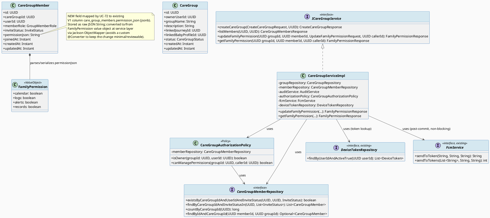
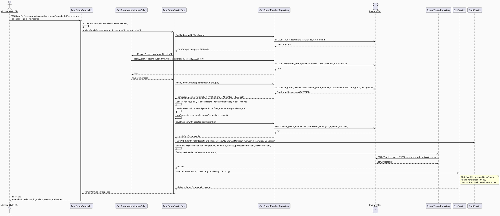
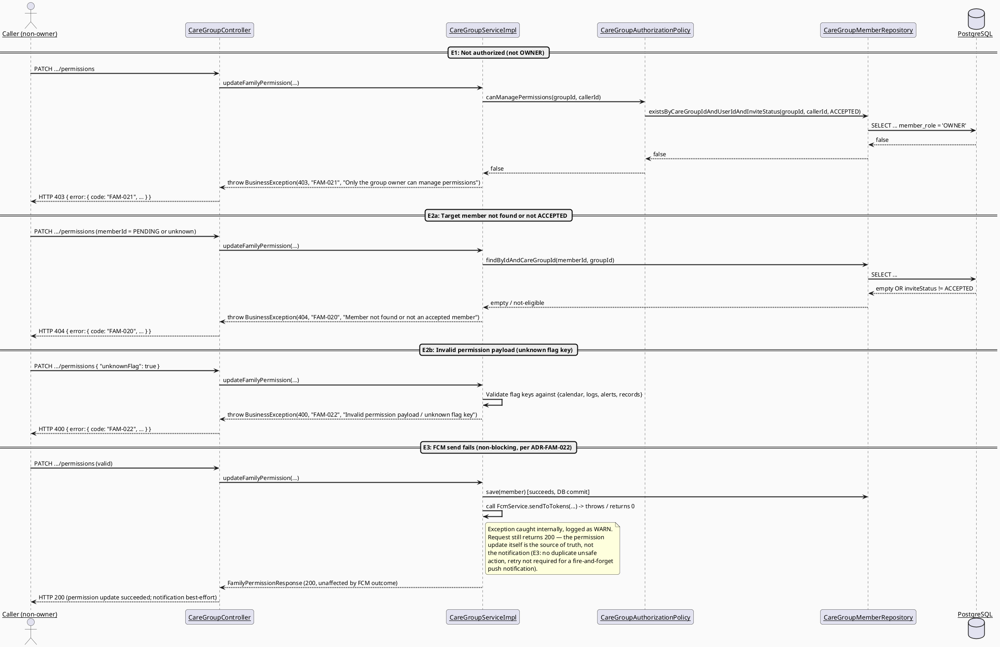

# ENGINEERING DOCUMENTATION STANDARD (EDS) v2.0
# UC-72 — Manage Family Permission — Technical Design Specification

| Field | Value |
|-------|-------|
| **Document ID** | `CB-FAMILY-IMP-072` |
| **Version** | `1.0` |
| **Date** | `2026-07-02` |
| **Status** | `Draft` |
| **Document Owner** | `BachNQ (TV2-Bách)` |
| **Author** | `AI Agent (Technical Architect + Test Designer)` |
| **Reviewed by** | `[ ] Pending — Tech Lead` |
| **DPO Sign-off** | `[ ] Pending` *(required — module touches family/health-adjacent PII exposure flags, BR-PRIVACY)* |
| **Approved by** | `[ ] Pending — Principal Architect` |
| **Last Review** | `2026-07-02` |
| **Based on EDS** | `v2.0` |

---

## CHANGELOG

> **Policy 4.4 — Immutable History:** Never delete prior information. All changes must be logged here.

| Ngày | Người thực hiện | Nội dung thay đổi |
|------|-----------------|-------------------|
| 2026-07-02 | AI Agent — Technical Architect | Initial draft — TDS for UC-72 Manage Family Permission |

---

## MỤC LỤC

1. [Tổng quan Module](#1-tổng-quan-module)
2. [Ma trận Truy vết (Traceability Matrix)](#2-ma-trận-truy-vết-traceability-matrix)
3. [Architecture Decision Records (ADR)](#3-architecture-decision-records-adr)
4. [Non-Functional Requirements & SLA](#4-non-functional-requirements--sla)
5. [Static Modeling (Mô hình Tĩnh)](#5-static-modeling-mô-hình-tĩnh)
6. [Dynamic Modeling (Mô hình Động)](#6-dynamic-modeling-mô-hình-động)
7. [Domain Event Catalog](#7-domain-event-catalog)
8. [Interface Specification (Đặc tả Giao diện)](#8-interface-specification-đặc-tả-giao-diện)
9. [API Specification](#9-api-specification)
10. [Bảng mã lỗi (Error Codes)](#10-bảng-mã-lỗi-error-codes)
11. [Quy trình Triển khai (Step-by-Step)](#11-quy-trình-triển-khai-step-by-step)
12. [Rollback & Incident Runbook](#12-rollback--incident-runbook)
13. [Kịch bản Kiểm thử Chi tiết](#13-kịch-bản-kiểm-thử-chi-tiết)
14. [Phương pháp Xác minh](#14-phương-pháp-xác-minh)
15. [Mẫu thử thực tế (API Verification Samples)](#15-mẫu-thử-thực-tế-api-verification-samples)
16. [Bảng tổng hợp phân quyền (Authorization Matrix)](#16-bảng-tổng-hợp-phân-quyền-authorization-matrix)
17. [AI Prompt Constraints (CASE 2.0)](#17-ai-prompt-constraints-case-20)

---

## 1. Tổng quan Module

UC-72 "Manage Family Permission" lets a care group **OWNER** (the Mother, per SRS Primary
Actor) grant or update which data categories another **ACCEPTED** family member can access:
**calendar, logs, alerts, records**. On successful update, CareBridge sends a push notification
(Firebase Cloud Messaging — SRS Secondary Actor) to the affected member informing them their
permissions changed, records an audit entry, and publishes a `FamilyPermissionUpdated` domain
event. A read endpoint lets a member view their own current permission grant (own scope
addition — see §1.1).

| Field | Value |
|-------|-------|
| **Module Name** | Family Sync — Care Group Permission Management |
| **Bounded Context** | `family` (Care Group / Family Sync bounded context) |
| **Data Classification** | `PII` — permission flags gate access to health-adjacent family data (calendar, logs, alerts, records); indirectly privacy-relevant per BR-PRIVACY, not itself Sensitive-PII |
| **Compliance Scope** | `PDPA` (Vietnam) — data minimization / access-control principle; `N/A` for GDPR/CCPA (CareBridge is a VN-market product; kept per template convention only) |
| **Upstream Dependencies** | `family.entity.CareGroup`, `family.entity.CareGroupMember` (UC-70 Create Care Group), `notification.service.FcmService`, `notification.repository.DeviceTokenRepository`, `audit.service.AuditService` |
| **Downstream Consumers** | Future UC-3.3.1.51 "View Shared Care Calendar", future UC-3.3.3.2 "View Shared Data", future UC-3.3.3.4 "View Family Alert" — these will read (not write) the `permission_json` produced here to gate their own responses. **This TDS does NOT implement that gating** (see §1.2 Out of Scope). |

### 1.1 In Scope

- Updating `permission_json` on an existing **ACCEPTED** `care_group_members` row: 4 boolean
  flags — `calendar`, `logs`, `alerts`, `records` (SRS wording verbatim: "Grants or updates
  family access to calendar, logs, alerts, and records").
- Authorization: only the care group **OWNER** (role `OWNER`, `inviteStatus == ACCEPTED`) may
  update another member's permissions — **Open**, see ADR-FAM-021.
- FCM push notification to the affected member on successful update (SRS lists FCM as Secondary
  Actor for UC-72 specifically).
- Audit logging via `AuditService`.
- `FamilyPermissionUpdated` domain event.
- **Own scope decision (not an invented SRS requirement):** a `GET` read endpoint so a member
  can view their own current permission grant. Justification: POST-1 states "the requested
  operation is completed or a clear result state is shown" — without a read path there is no
  way for the mobile UI to display "a clear result state" after the grant, nor can the Mother's
  permission-management screen show current state before editing it. Marked explicitly as a
  scope decision, not a re-reading of the SRS table.

### 1.2 Out of Scope (explicitly deferred — do NOT implement here)

| Deferred capability | Actual owner UC |
|---|---|
| Inviting new family members | UC-71 Invite Family Member |
| Accepting a care group invitation | UC-83 Accept Care Group Invitation |
| Assigning care tasks | UC-73 Assign Family Task |
| Viewing the care group members list | UC-216 (already implemented, `GET /api/v1/care-groups/{groupId}/members`) |
| Removing a member from a group | Future UC-3.3.17.4 Remove Family Member |
| Leaving a care group | Future UC-3.3.17.5 Leave Care Group |
| **Enforcing** the `calendar`/`logs`/`alerts`/`records` flags inside OTHER features' read endpoints (e.g. gating UC-3.3.1.51 View Shared Care Calendar by the `calendar` flag) | Future UC-3.3.1.51, UC-3.3.3.2, UC-3.3.3.4 — this TDS only builds the grant/update/read of the permission record itself; consuming/enforcing it elsewhere is explicitly future work and MUST NOT be implemented as part of this feature |

---

## 2. Ma trận Truy vết (Traceability Matrix)

| Requirement ID | Loại (BR/ADR/US) | Mô tả yêu cầu | Thành phần Code | Compliance Target | ADR liên quan |
|----------------|------------------|---------------|-----------------|-------------------|---------------|
| SRS UC-72 (§3.3.1.49) | User Story | Grant/update family access to calendar, logs, alerts, records | `CareGroupServiceImpl.updateFamilyPermission()` | — | ADR-FAM-020 |
| SRS UC-72 POST-1 | Postcondition | Clear result state shown after operation | `GET .../permissions` read endpoint | — | ADR-FAM-020 |
| SRS UC-72 POST-2 | Postcondition | Related notifications updated | `FcmService.sendToToken()` call after update | — | — |
| SRS UC-72 POST-3 | Postcondition | Sensitive actions recorded for audit/privacy review | `AuditService.log(CARE_GROUP_PERMISSION_UPDATED, ...)` | PDPA data-minimization audit trail | — |
| SRS UC-72 E1 | Exception | Access denied when unauthenticated/unauthorized/out of scope | `CareGroupAuthorizationPolicy.canManagePermissions()`, `FAM-021` (403) | — | ADR-FAM-021 |
| SRS UC-72 E2 | Exception | Invalid/missing/conflicting data rejected with field-level message | `FAM-022` invalid permission payload, `FAM-020` member not found | — | ADR-FAM-020 |
| SRS UC-72 E3 | Exception | External/network/server failure handled with retry guidance, no duplicate unsafe action | FCM send failure does not roll back DB write (§6.2 alt flow) | — | ADR-FAM-022 |
| BR-RBAC | Business Rule | Users may access only functions allowed by role/permission scope | `@PreAuthorize`, `CareGroupAuthorizationPolicy` | — | ADR-FAM-021 |
| BR-PRIVACY | Business Rule | Health/family data access needs consent/purpose/minimum-necessary scope | 4-boolean-flag permission model; ACCEPTED-only target invariant | PDPA data minimization | ADR-FAM-020, ADR-FAM-023 |
| BR-CONSULTATION | Business Rule | Booking/payment/dispute/refund/pricing keep auditable lifecycle state | **Not applicable** — UC-72 has no booking/payment/consultation lifecycle; listed per SRS generic template only | — | — |
| ADR-FAM-002 (existing code evidence, formalized here) | Decision | Membership check must use `InviteStatus.ACCEPTED` only | `CareGroupMemberRepository.existsByCareGroupIdAndUserIdAndInviteStatus(...)` reused pattern | — | ADR-FAM-002 |
| ADR-FAM-020 | Decision | Permission scope model = 4 boolean flags in `permission_json` | `FamilyPermission` value object | PDPA | — |
| ADR-FAM-021 | Decision | Authorization model = OWNER-only for managing another member's permissions | `CareGroupAuthorizationPolicy.canManagePermissions()` | — | — |
| ADR-FAM-022 | Decision | FCM failure is non-blocking (fire-and-forget, logged, no rollback) | try/catch around `FcmService` call in service layer | — | — |
| ADR-FAM-023 | Decision | Target member eligibility = ACCEPTED status only (reuses ADR-FAM-002 invariant) | `updateFamilyPermission()` precondition check | PDPA | ADR-FAM-002 |

---

## 3. Architecture Decision Records (ADR)

### ADR-FAM-002 — Membership check must use ACCEPTED status only (formalized from existing code)

| Field | Value |
|-------|-------|
| **Status** | `Accepted` (already implemented in `listMembers()`, formalized as ADR here) |
| **Deciders** | `BachNQ (TV2-Bách)` |
| **Date** | `2026-07-02` |
| **Supersedes** | — |

#### Bối cảnh (Context)
`CareGroupServiceImpl.listMembers()` already treats `InviteStatus.ACCEPTED` as the sole bar for
"is a member" for access-control purposes; `PENDING` members exist in the row set but are not
granted membership rights. This informal rule (referenced only in a code comment as
"ADR-FAM-002") needs a first-class write-up so UC-72 (and future UC-73) can reuse the same
invariant consistently instead of re-deriving it.

#### Các phương án đã xem xét (Options Considered)

| Phương án | Mô tả | Ưu điểm | Nhược điểm |
|-----------|-------|----------|------------|
| A | Treat ACCEPTED only as "member" | Consistent with existing `listMembers` code; simple invariant | PENDING members cannot self-view before accepting |
| B | Treat ACCEPTED + PENDING as "member" | Allows pre-configuring permissions before accept | Contradicts existing code pattern; risk of granting access before consent given |

#### Quyết định (Decision)
Chọn **Phương án A** — reuse `InviteStatus.ACCEPTED` as the sole membership bar, consistent with
existing `listMembers()` code evidence.

#### Hệ quả (Consequences)

**Tích cực:**
- Single consistent invariant reused across UC-216 (existing), UC-72, and future UC-73.

**Tiêu cực / Trade-offs:**
- A `PENDING` member cannot have permissions configured until they accept (see ADR-FAM-023).

**Compliance Impact:**
- Reduces risk of granting data-access permissions to a user who has not yet consented to join
  the group (BR-PRIVACY minimum-necessary-access support).

---

### ADR-FAM-020 — Permission scope model: 4 boolean flags in `permission_json`

| Field | Value |
|-------|-------|
| **Status** | `Proposed` — **Open**, pending DPO/user confirmation (BR-PRIVACY implication) |
| **Deciders** | `BachNQ (TV2-Bách)` (proposed), pending DPO sign-off |
| **Date** | `2026-07-02` |
| **Supersedes** | — |

#### Bối cảnh (Context)
SRS UC-72 description text is generic: "Grants or updates family access to calendar, logs,
alerts, and records." It does not specify the granularity of the permission model (single
boolean per category vs. per-category read/write split vs. a numeric access level). The
existing `care_group_members.permission_json` column (jsonb, nullable) already exists in
`V1__init_schema.sql` line 747 but is unused by any entity/service today — its shape is
undefined.

#### Các phương án đã xem xét (Options Considered)

| Phương án | Mô tả | Ưu điểm | Nhược điểm |
|-----------|-------|----------|------------|
| A | 4 boolean flags: `calendar`, `logs`, `alerts`, `records` | Matches SRS wording exactly; simplest to implement/test; matches jsonb column shape trivially | No read/write distinction; no per-item granularity (e.g. can't share only today's log) |
| B | Per-category object `{ calendar: {read,write}, ... }` | Finer-grained control | Over-engineers beyond what SRS specifies; invents a requirement not in SRS |
| C | Single numeric access level (0-3) per category | Compact | Ambiguous mapping to SRS's plain-language description; harder to reason about for DPO review |

#### Quyết định (Decision)
Chọn **Phương án A** — 4 boolean flags, because it maps 1:1 onto the SRS description's literal
wording and requires no invented semantics. **This decision is marked Open** and requires
DPO/user confirmation before implementation, given BR-PRIVACY governs family/health data
exposure.

#### Hệ quả (Consequences)

**Tích cực:**
- Directly traceable to SRS text; minimal design surface; easy DPO review (4 flags, plain
  language).

**Tiêu cực / Trade-offs:**
- All-or-nothing per category (e.g. cannot grant "view only, not edit" for calendar) — if a
  finer model is later required, this becomes a breaking schema/API change (mitigation: jsonb
  column allows additive keys without migration, so evolution is possible without a new
  Flyway version, only a `FamilyPermission` value-object/DTO change).

**Compliance Impact:**
- BR-PRIVACY minimum-necessary-access: DPO must confirm 4 broad category flags are an
  acceptable minimum-necessary granularity, or require finer splitting (Option B) before this
  ADR can move from `Proposed` to `Accepted`.

---

### ADR-FAM-021 — Authorization model: OWNER-only permission management

| Field | Value |
|-------|-------|
| **Status** | `Proposed` — **Open**, pending user/product confirmation |
| **Deciders** | `BachNQ (TV2-Bách)` (proposed) |
| **Date** | `2026-07-02` |
| **Supersedes** | — |

#### Bối cảnh (Context)
SRS text is generic ("the actor is authenticated and has the required role or permission") and
does not explicitly state who may change ANOTHER member's permissions — the group OWNER only,
or can a member request/adjust their own visibility (self-service)?

#### Các phương án đã xem xét (Options Considered)

| Phương án | Mô tả | Ưu điểm | Nhược điểm |
|-----------|-------|----------|------------|
| A | OWNER-only can update ANY member's permissions (including their own, trivially, since OWNER already has ACCEPTED membership) | Least privilege; single source of truth (the Mother controls family data exposure); matches UC-70's existing pattern of OWNER-centric care group control | Non-owner members cannot self-adjust their own visibility, must ask OWNER |
| B | Self-service — a member can adjust their own permission flags | More flexible for the member | Contradicts the primary-actor framing of UC-72 (Primary Actor = Mother, not the member); risks a member self-granting access to sensitive family data without Mother's oversight — conflicts with BR-PRIVACY intent that the Mother controls family data sharing |

#### Quyết định (Decision)
Chọn **Phương án A** (OWNER-only) as the default, least-privilege posture, consistent with UC-70
where the creator is auto-assigned `OWNER` and is the sole administrator of care-group-level
settings. **Marked Open** — requires explicit user/product confirmation before `Accepted`.

#### Hệ quả (Consequences)

**Tích cực:**
- Single authority for family data exposure decisions, matching the Mother-as-primary-actor
  framing throughout SRS §3.3.1.

**Tiêu cực / Trade-offs:**
- If the OWNER account is unavailable (e.g. temporarily locked out), no member can adjust their
  own visibility — accepted trade-off pending product confirmation.

**Compliance Impact:**
- Supports BR-PRIVACY "minimum necessary access" by centralizing the grant decision in the
  actor identified by SRS as primary (Mother/OWNER).

---

### ADR-FAM-022 — FCM notification failure must not roll back the permission update

| Field | Value |
|-------|-------|
| **Status** | `Accepted` |
| **Deciders** | `BachNQ (TV2-Bách)` |
| **Date** | `2026-07-02` |
| **Supersedes** | — |

#### Bối cảnh (Context)
SRS Exception E3 requires "external service, network, or server failure is handled with retry
guidance and no duplicate unsafe action." FCM is an external service (Firebase). If FCM send
fails, the underlying business fact (permission was updated) has already legitimately
occurred and must persist — the notification is a side effect, not the source of truth.

#### Các phương án đã xem xét (Options Considered)

| Phương án | Mô tả | Ưu điểm | Nhược điểm |
|-----------|-------|----------|------------|
| A | Wrap `FcmService` call in try/catch inside the service method; log failure; do not roll back the DB transaction; return success to caller | Matches E3 "no duplicate unsafe action"; DB write already committed is not undone by a downstream notification failure | Member may not immediately learn their permissions changed if push fails (mitigated: they can still see current state via the new GET read endpoint) |
| B | Wrap the whole operation (DB write + FCM) in one atomic unit that fails together | Guarantees notification always succeeds if DB write succeeds | Couples an internal data change to an unreliable external dependency; violates E3 intent; would force retries of an already-completed safe operation |

#### Quyết định (Decision)
Chọn **Phương án A**. FCM send happens **after** the DB transaction's business logic completes
(same request, but the exception is caught and logged, not propagated as a request failure).

#### Hệ quả (Consequences)

**Tích cực:**
- Permission update is durable regardless of FCM availability; conforms to E3.

**Tiêu cực / Trade-offs:**
- No automatic retry queue for the missed notification in this iteration — acceptable since the
  member can still view current permissions via `GET .../permissions` (§1.1 own scope decision).

**Compliance Impact:**
- None negative; audit log (`AuditService`) still records the permission change independent of
  FCM delivery outcome, satisfying POST-3.

---

### ADR-FAM-023 — Target member eligibility: ACCEPTED status only

| Field | Value |
|-------|-------|
| **Status** | `Proposed` — Open, strongly recommended default (mirrors ADR-FAM-002) |
| **Deciders** | `BachNQ (TV2-Bách)` (proposed) |
| **Date** | `2026-07-02` |
| **Supersedes** | — |

#### Bối cảnh (Context)
Can permissions be updated only for members already in `ACCEPTED` status, or can `PENDING`
members also have permissions pre-configured before they accept an invitation?

#### Các phương án đã xem xét (Options Considered)

| Phương án | Mô tả | Ưu điểm | Nhược điểm |
|-----------|-------|----------|------------|
| A | Only `ACCEPTED` members are eligible targets | Consistent with ADR-FAM-002's existing invariant ("is a member" = ACCEPTED); avoids granting data-access rights before the invitee has consented to join | Cannot pre-stage permissions for a not-yet-accepted invite |
| B | `PENDING` members also eligible | Convenience — permissions ready at accept time | Grants a conceptual "permission" to someone who hasn't yet joined/consented; inconsistent with ADR-FAM-002 |

#### Quyết định (Decision)
Chọn **Phương án A** — reuse the exact same invariant as `listMembers()` (ADR-FAM-002) for
consistency across the codebase. **Marked Open** pending confirmation, but strongly recommended.

#### Hệ quả (Consequences)

**Tích cực:**
- One invariant, reused everywhere "is this user actually a member" is asked.

**Tiêu cực / Trade-offs:**
- Owner must wait until a member accepts before configuring their access — acceptable given
  UC-71/UC-83 already exist as separate, sequential use cases.

**Compliance Impact:**
- Reinforces BR-PRIVACY: no access rights configured before consent to join is given.

---

## 4. Non-Functional Requirements & SLA

### 4.1. Performance & Availability

| Category | Requirement | Target SLA | Measurement Method | Compliance Basis |
|----------|-------------|------------|---------------------|------------------|
| Latency | `PATCH .../permissions` API response (p99) | `< 300ms` (excluding FCM send, which is fire-and-forget/non-blocking per ADR-FAM-022) | k6 load test | — |
| Latency | `GET .../permissions` API response (p99) | `< 150ms` | k6 load test | — |
| Availability | Uptime (monthly) | `99.9%` | Uptime monitor | — |

### 4.2. Data Integrity & Retention

| Category | Requirement | Target | Verification Method | Compliance Basis |
|----------|-------------|--------|---------------------|------------------|
| Durability | Zero record loss on permission update | RPO = 0 | Transaction log | — |
| Retention | Audit log retention for permission changes | 7 năm (existing `AuditService` retention policy, reused) | DB backup policy | PDPA |
| Consistency | permission_json ↔ Audit log sync | 100% — every successful update produces exactly one audit entry | Reconciliation query (§14.1) | PDPA |

### 4.3. Security

| Category | Requirement | Target | Verification Method | Compliance Basis |
|----------|-------------|--------|---------------------|------------------|
| Access control | Role-based, OWNER-only mutation (§ADR-FAM-021, Open) | Least privilege | Auth Matrix (§16) | BR-RBAC |
| Encryption in transit | All endpoints | TLS 1.3+ (existing infra-level control, not feature-specific) | SSL Labs scan | — |
| Input validation | Reject unknown permission flag keys | 100% rejection of unrecognized keys → `FAM-022` | Unit test (§13) | BR-PRIVACY |

### 4.4. Scalability & Capacity Planning

Expected load: bounded by care-group size (max 5 active groups/owner per existing C1 rule,
typically ≤ 10 members per group). No dedicated scaling plan required beyond existing Spring
Boot/PostgreSQL capacity; feature reuses existing connection pool and FCM batching
(`sendToTokens`) infra.

---

## 5. Static Modeling (Mô hình Tĩnh)

### 5.1. Class Diagram (PlantUML)



### 5.2. Data Structure (Flyway SQL Migration)

> **No migration required for UC-72.** The `permission_json` column already exists on
> `care_group_members` — see `05_Development/CareBridgeAPI/src/main/resources/db/migration/V1__init_schema.sql`
> line 747: `permission_json jsonb`. This TDS only (a) maps that existing column into the
> `CareGroupMember` entity as a new field, and (b) defines its JSON shape via ADR-FAM-020
> (Open). No `CREATE TABLE`/`ALTER TABLE` is needed.
>
> The `device_tokens` table (used for FCM token lookup, see §8.2) already exists per
> `V2__spec_sync_from_tds.sql` lines 100-120 (`device_tokens(id, user_id, token, platform,
> active, created_at, updated_at)`), with `findByUserIdAndActiveTrue(UUID)` already available on
> the existing `DeviceTokenRepository`. **This resolves the FCM-token-storage dependency that
> was flagged as a possible Open item — the table and repository method already exist and are
> reused as-is, no new schema work required.**

---

## 6. Dynamic Modeling (Mô hình Động)

### 6.1. Sequence Diagram — Happy Path (PlantUML)



### 6.2. Sequence Diagram — Error Path (PlantUML)



### 6.3. State Machine

> UC-72 does not introduce a new entity-level state machine. It operates on the EXISTING
> `InviteStatus` state machine of `CareGroupMember` (owned by UC-70/UC-71/UC-83), reading but
> never writing `inviteStatus`. `permission_json` itself is not a state machine — it is a
> mutable value object that can be updated any number of times by the OWNER while the target
> member remains `ACCEPTED`. No PlantUML state diagram is added here to avoid duplicating the
> `InviteStatus` diagram that belongs to UC-71's TDS.

> **⚠️ Invariant bất biến:**
> - `updateFamilyPermission()` MUST NOT be callable against a member whose `inviteStatus !=
>   ACCEPTED` (ADR-FAM-023).
> - `permission_json` updates are idempotent overwrites of the 4 known keys only — never merge
>   in unknown keys (ADR-FAM-020 / FAM-022 validation).

---

## 7. Domain Event Catalog

### 7.1. Events Published (Phát ra)

| Event Name | Trigger | Publisher | Subscriber(s) | Payload Schema | Async? |
|------------|---------|-----------|---------------|----------------|--------|
| `FamilyPermissionUpdated` | Successful `updateFamilyPermission()` DB commit | `CareGroupServiceImpl` | (proposed) `FamilyNotificationListener` (drives the FCM send in §6.1); `AuditService` (already invoked synchronously, not via event) | `FamilyPermissionUpdated.java` | Yes (notification side effect only; audit log write itself is synchronous within the same service call, not event-driven, matching existing `createCareGroup()` pattern) |

### 7.2. Events Consumed (Tiêu thụ)

> UC-72 does not consume any domain events published by other features in this batch.
> `FamilyMemberInvited` (UC-71) and `CareGroupInvitationAccepted` (UC-83) are unrelated to
> permission management and are not consumed here.

| Event Name | Source | Handler | Action thực hiện |
|------------|--------|---------|------------------|
| _(none)_ | — | — | — |

### 7.3. Payload Schema

```java
// FamilyPermissionUpdated.java
public record FamilyPermissionUpdated(
    UUID    eventId,          // UUID.randomUUID() — used to deduplicate
    String  eventType,        // "FamilyPermissionUpdated"
    Instant occurredAt,       // Instant.now()
    String  version,          // "1.0"
    Payload payload,
    Metadata metadata
) implements ApplicationEvent {

    public record Payload(
        UUID careGroupId,
        UUID careGroupMemberId,
        UUID updatedBy,               // caller (OWNER) userId
        FamilyPermission previousPermissions,
        FamilyPermission newPermissions
    ) {}

    public record Metadata(
        UUID   correlationId,
        String causedBy      // updatedBy userId as String, or "system"
    ) {}
}
```

---

## 8. Interface Specification (Đặc tả Giao diện)

### 8.1. Service Interface

```java
// UpdateFamilyPermissionRequest.java — Input DTO
// @version 1.0
public class UpdateFamilyPermissionRequest {
    private Boolean calendar;  // nullable = "leave unchanged"; explicit true/false = set flag
    private Boolean logs;
    private Boolean alerts;
    private Boolean records;
    // getters / setters; @AssertTrue custom validator rejects payload with zero non-null fields (FAM-022)
}

// FamilyPermissionResponse.java — Output DTO (used by both PATCH and GET)
public class FamilyPermissionResponse {
    private UUID memberId;
    private UUID careGroupId;
    private boolean calendar;
    private boolean logs;
    private boolean alerts;
    private boolean records;
    private Instant updatedAt;
    // getters / builder
}

// ICareGroupService.java — Service Contract (EXTENDS existing interface, does not replace it)
// @version 1.1
// @breaking-change None — additive methods only
public interface ICareGroupService {

    // --- existing methods (UC-70, UC-216), unchanged ---
    CreateCareGroupResponse createCareGroup(CreateCareGroupRequest request, UUID callerId);
    CareGroupMembersResponse listMembers(UUID groupId, UUID callerId);

    /**
     * Grants or updates a family member's permission flags (calendar/logs/alerts/records).
     * @throws BusinessException (FAM-005) if care group not found
     * @throws BusinessException (FAM-021) if caller is not the group OWNER (ADR-FAM-021, Open)
     * @throws BusinessException (FAM-020) if target member not found or not ACCEPTED (ADR-FAM-023, Open)
     * @throws BusinessException (FAM-022) if payload has no recognized flag keys / all null
     */
    FamilyPermissionResponse updateFamilyPermission(
        UUID careGroupId, UUID memberId, UpdateFamilyPermissionRequest request, UUID callerId);

    /**
     * Returns the current permission grant for a given member.
     * Caller must be either the target member themselves or the group OWNER (§16 Auth Matrix).
     * @throws BusinessException (FAM-005) if care group not found
     * @throws BusinessException (FAM-020) if target member not found or not ACCEPTED
     * @throws BusinessException (FAM-003) if caller is neither the target member nor an accepted OWNER
     */
    FamilyPermissionResponse getFamilyPermission(UUID careGroupId, UUID memberId, UUID callerId);
}
```

### 8.2. Repository Interface

```java
// CareGroupMemberRepository.java — EXTENDS existing interface additively
// @version 1.1
public interface CareGroupMemberRepository extends JpaRepository<CareGroupMember, UUID> {

    // --- existing methods (UC-70/UC-216), unchanged ---
    boolean existsByCareGroupIdAndUserIdAndInviteStatus(UUID careGroupId, UUID userId, InviteStatus status);
    List<CareGroupMember> findByCareGroupIdAndInviteStatusIn(UUID careGroupId, List<InviteStatus> statuses);
    long countByCareGroupId(UUID careGroupId);

    // --- NEW for UC-72 ---
    Optional<CareGroupMember> findByIdAndCareGroupId(UUID memberId, UUID careGroupId);
}

// DeviceTokenRepository.java — EXISTING, reused as-is, no changes needed
// (package com.carebridge.backend.notification.repository)
public interface DeviceTokenRepository extends JpaRepository<DeviceToken, UUID> {
    List<DeviceToken> findByUserIdAndActiveTrue(UUID userId);
    // ... other existing methods unchanged
}

// CareGroupAuthorizationPolicy.java — NEW policy class
// @version 1.0
// package com.carebridge.backend.family.policy
@Component
@RequiredArgsConstructor
public class CareGroupAuthorizationPolicy {
    private final CareGroupMemberRepository memberRepository;

    /** True if userId is an ACCEPTED OWNER-role member of groupId. */
    public boolean isOwner(UUID groupId, UUID userId) {
        return memberRepository.existsByCareGroupIdAndUserIdAndInviteStatus(groupId, userId, InviteStatus.ACCEPTED)
            // NOTE: existing exists-by-status method does not filter by role; UC-72 impl must
            // additionally verify memberRole == OWNER, e.g. via a new
            // existsByCareGroupIdAndUserIdAndInviteStatusAndMemberRole(...) repository method,
            // OR by loading the row and checking memberRole in-code. Exact mechanism left to
            // implementer; both are consistent with existing repository conventions.
            ;
    }

    /** True if callerId may manage (create/update) permissions for members of groupId. */
    public boolean canManagePermissions(UUID groupId, UUID callerId) {
        return isOwner(groupId, callerId); // ADR-FAM-021 (Open): OWNER-only
    }
}
```

---

## 9. API Specification

### 9.1. Endpoints Table

| Method | Path | Auth Level | Required Roles | Rate Limit | Idempotent? |
|--------|------|------------|----------------|------------|-------------|
| `PATCH` | `/api/v1/care-groups/{groupId}/members/{memberId}/permissions` | JWT Bearer | `MOTHER` (must additionally be group `OWNER`, enforced in service per ADR-FAM-021) | 60/min | Yes (same payload -> same resulting state) |
| `GET` | `/api/v1/care-groups/{groupId}/members/{memberId}/permissions` | JWT Bearer | Any authenticated user; service-layer check restricts to target member themselves or group OWNER (§16) | 300/min | Yes |

### 9.2. Request / Response Schemas

#### `PATCH /api/v1/care-groups/{groupId}/members/{memberId}/permissions` — Update permission

**Request Body:**
```json
{
  "calendar": true,
  "logs": false,
  "alerts": true,
  "records": false
}
```
> All 4 fields optional individually (nullable = unchanged), but **at least one non-null field
> is required** — see FAM-022.

**Response — 200 OK (Happy Path):**
```json
{
  "success": true,
  "message": "Family permission updated successfully",
  "data": {
    "memberId": "9f2c1e10-...",
    "careGroupId": "3ab6f210-...",
    "calendar": true,
    "logs": false,
    "alerts": true,
    "records": false,
    "updatedAt": "2026-07-02T09:00:00.000Z"
  }
}
```

**Response — 400 Bad Request (Invalid payload):**
```json
{
  "error": {
    "code": "FAM-022",
    "message": "Invalid permission payload: no recognized flag provided",
    "details": [{ "field": "permissions", "message": "At least one of calendar, logs, alerts, records must be set" }]
  }
}
```

**Response — 403 Forbidden (Not owner):**
```json
{
  "error": {
    "code": "FAM-021",
    "message": "Only the group owner can manage member permissions"
  }
}
```

**Response — 404 Not Found (Member not found / not accepted):**
```json
{
  "error": {
    "code": "FAM-020",
    "message": "Member not found or not an accepted member of this group"
  }
}
```

#### `GET /api/v1/care-groups/{groupId}/members/{memberId}/permissions` — View current permission

**Response — 200 OK:**
```json
{
  "success": true,
  "data": {
    "memberId": "9f2c1e10-...",
    "careGroupId": "3ab6f210-...",
    "calendar": true,
    "logs": false,
    "alerts": true,
    "records": false,
    "updatedAt": "2026-07-02T09:00:00.000Z"
  }
}
```

---

## 10. Bảng mã lỗi (Error Codes)

> Prefix `FAM-` reused from existing UC-70/UC-216 code (`FAM-002`, `FAM-003`, `FAM-005`). This
> TDS defines ONLY its own new codes (`FAM-020`-`FAM-022`) per the shared batch numbering
> convention; other features' codes (`FAM-010`-`FAM-013`, `FAM-030`-`FAM-033`, `FAM-040`-`FAM-043`)
> are owned by sibling UC-71/UC-73/UC-83 TDS files respectively and are NOT redefined here.

| Code | HTTP Status | Message (EN) | Message (VI) | Trigger Condition |
|------|-------------|--------------|--------------|-------------------|
| `FAM-005` | 404 | Care group not found | Không tìm thấy nhóm chăm sóc | *(reused from UC-70/UC-216)* `groupId` does not exist |
| `FAM-003` | 403 | You are not an accepted member of this group | Bạn không phải thành viên đã xác nhận của nhóm | *(reused from UC-216)* Applied to `GET .../permissions` when caller is neither the target member nor group OWNER |
| `FAM-020` | 404 | Member not found or not an accepted member | Không tìm thấy thành viên hoặc thành viên chưa xác nhận | Target `memberId` does not exist in `groupId`, OR exists but `inviteStatus != ACCEPTED` (ADR-FAM-023) |
| `FAM-021` | 403 | Only the group owner can manage member permissions | Chỉ chủ nhóm mới có thể quản lý quyền thành viên | Caller is not an ACCEPTED `OWNER`-role member of `groupId` (ADR-FAM-021) — applies to `PATCH` only |
| `FAM-022` | 400 | Invalid permission payload / unknown flag key | Dữ liệu quyền không hợp lệ | Request body has zero non-null recognized fields, OR (if a raw JSON body with extra keys is accepted at a lower layer) contains a key outside `{calendar, logs, alerts, records}` |

---

## 11. Quy trình Triển khai (Step-by-Step)

### 11.1. Prerequisites

- [ ] ADR-FAM-020 (permission scope model) — currently `Proposed`/Open — needs DPO/user confirm before `Accepted`
- [ ] ADR-FAM-021 (authorization model) — currently `Proposed`/Open — needs user/product confirm
- [ ] ADR-FAM-023 (ACCEPTED-only target) — currently `Proposed`/Open — strongly recommended default
- [ ] DPO sign-off pending (header) — module governs family data exposure flags (BR-PRIVACY)
- [ ] Blueprint approved by Principal Architect
- [ ] Staging environment ready

### 11.2. Pre-Migration Checklist

- [ ] **Not applicable** — no schema migration required for UC-72 (§5.2). `permission_json` and
      `device_tokens` already exist in applied migrations.

### 11.3. Implementation Steps

#### Chặng 1 — Entity mapping (no migration)

```java
// Add to CareGroupMember.java (existing entity, additive field only)
@Column(name = "permission_json", columnDefinition = "jsonb")
private String permissionJson; // raw JSON string; parsed via FamilyPermission.fromJson()
```

> ⚠️ **Chú ý:** Do not add `@Convert` with a custom AttributeConverter unless the team already
> has a jsonb converter pattern elsewhere in the codebase — none was found during research;
> keep as raw `String` + explicit parse/serialize in the service layer to minimize new
> infrastructure (smallest scoped change per CLAUDE.md delivery rules).

#### Chặng 2 — Policy, service, controller, repository additions

```java
// CareGroupMemberRepository — add:
Optional<CareGroupMember> findByIdAndCareGroupId(UUID memberId, UUID careGroupId);

// CareGroupAuthorizationPolicy — new class (see §8.2)

// CareGroupServiceImpl — add updateFamilyPermission() / getFamilyPermission() (see §8.1)
// Inject additionally: CareGroupAuthorizationPolicy, FcmService, DeviceTokenRepository

// CareGroupController — add PATCH + GET endpoints under existing @RequestMapping("/api/v1/care-groups")
```

#### Chặng 3 — Verification sau deploy

```bash
curl -X GET https://{host}/api/v1/health
# Expected: {"status": "ok"}
```

### 11.4. Deployment Checklist

- [ ] No migration to run (confirmed §5.2)
- [ ] Health check endpoint returns 200
- [ ] Error rate < 1% in first 10 minutes
- [ ] Audit log producing `CARE_GROUP_PERMISSION_UPDATED` entries in correct format
- [ ] DPO notified given PII/family-data exposure impact (header sign-off pending)

---

## 12. Rollback & Incident Runbook

### 12.1. Điều kiện kích hoạt Rollback (Trigger Conditions)

| Điều kiện | Ngưỡng | Người quyết định |
|-----------|--------|------------------|
| Error rate tăng đột biến | > 5% trong 5 phút | On-call Engineer |
| Latency p99 vượt ngưỡng | > 2x baseline | On-call Engineer |
| Permission data không nhất quán (e.g. flags flip unexpectedly) | Bất kỳ case nào | Tech Lead + DPO |
| Audit log ngừng ghi nhận `CARE_GROUP_PERMISSION_UPDATED` | > 1 phút | On-call Engineer |

### 12.2. Rollback Procedure

```bash
# No schema rollback needed (no migration was run — §5.2).
# Step 1: Revert application code only
git checkout -- 05_Development/CareBridgeAPI/src/main/java/com/carebridge/backend/family/
git checkout -- 05_Development/CareBridgeAPI/src/test/java/com/carebridge/backend/family/

# Step 2: Re-deploy previous version
kubectl rollout undo deployment/carebridge-api

# Step 3: Verify rollback
kubectl rollout status deployment/carebridge-api
curl -X GET https://{host}/api/v1/health

# Step 4: Data note — existing permission_json values written during the incident window
# remain in the DB (column pre-existed); no destructive cleanup needed since the column
# itself is not new. If bad data was written, a manual UPDATE to null/reset is the only
# remediation, NOT a DROP COLUMN (column predates this feature).
```

### 12.3. Notification Protocol

| Thời điểm | Người nhận | Kênh | Template |
|-----------|------------|------|----------|
| Ngay khi phát hiện | On-call team | Slack `#incident` | "CareBridge Family Permission incident detected: [mô tả]" |
| Trong 30 phút | DPO | Email | Bắt buộc — family/PII-adjacent data exposure flags affected |

### 12.4. Post-Incident Review (PIR)

Standard PIR template (Timeline / Root Cause / Impact / Remediation / Prevention) applies,
completed within 48 hours per EDS policy.

---

## 13. Kịch bản Kiểm thử Chi tiết

> See companion file `UC72_ManageFamilyPermission_Test-Spec.md` for the full ISO/IEC/IEEE
> 29119-3 test design, test cases (`FAM72-TC-NNN`), Red-Green-Refactor tracker, and CASE 2.0
> Anti-Pattern checks. This TDS section intentionally cross-references rather than duplicates
> that file, per the two-document EDS/TDD split used by sibling UC-70/UC-216 (informal
> precedent) and UC-71/73/83 (same batch).

---

## 14. Phương pháp Xác minh

### 14.1. Database Inspection

```sql
-- Verify permission_json updated correctly
SELECT care_group_member_id, care_group_id, invitation_status, permission_json, updated_at
FROM care_group_members
WHERE care_group_member_id = '{memberId}';

-- Verify audit log entry created
SELECT * FROM audit_logs
WHERE entity_type = 'CareGroupMember' AND entity_id = '{memberId}'
ORDER BY created_at DESC
LIMIT 5;

-- Verify no PII/token leak in logs
SELECT query FROM pg_stat_activity WHERE query ILIKE '%device_tokens.token%';
```

### 14.2. Log / Audit Verification

```bash
kubectl logs -l app=carebridge-api | grep '"eventType":"FamilyPermissionUpdated"' | head -5
kubectl logs -l app=carebridge-api | grep -i "fcm.*fail\|sendToTokens.*error"
```

### 14.3. Tool-based Verification

```bash
echo "{JWT_TOKEN}" | cut -d'.' -f2 | base64 -d | jq .
```

---

## 15. Mẫu thử thực tế (API Verification Samples)

### 15.1. Happy Path

```bash
curl -X PATCH https://{host}/api/v1/care-groups/{groupId}/members/{memberId}/permissions \
  -H "Authorization: Bearer {JWT_TOKEN}" \
  -H "Content-Type: application/json" \
  -H "X-Correlation-Id: $(uuidgen)" \
  -d '{ "calendar": true, "logs": false, "alerts": true, "records": false }'
```

**Expected Response (200):**
```json
{
  "success": true,
  "data": {
    "memberId": "9f2c1e10-0000-0000-0000-000000000001",
    "careGroupId": "3ab6f210-0000-0000-0000-000000000002",
    "calendar": true, "logs": false, "alerts": true, "records": false,
    "updatedAt": "2026-07-02T09:00:00.000Z"
  }
}
```

### 15.2. Error Paths

```bash
# Non-owner attempts update -> 403
curl -X PATCH https://{host}/api/v1/care-groups/{groupId}/members/{memberId}/permissions \
  -H "Authorization: Bearer {NON_OWNER_JWT}" \
  -H "Content-Type: application/json" \
  -d '{ "calendar": true }'
```

**Expected Response (403):**
```json
{ "error": { "code": "FAM-021", "message": "Only the group owner can manage member permissions" } }
```

```bash
# Unrecognized/empty payload -> 400
curl -X PATCH https://{host}/api/v1/care-groups/{groupId}/members/{memberId}/permissions \
  -H "Authorization: Bearer {OWNER_JWT}" \
  -H "Content-Type: application/json" \
  -d '{}'
```

**Expected Response (400):**
```json
{ "error": { "code": "FAM-022", "message": "Invalid permission payload: no recognized flag provided" } }
```

---

## 16. Bảng tổng hợp phân quyền (Authorization Matrix)

| Endpoint | `GUEST` | `FAMILY` (non-owner, ACCEPTED) | `MOTHER` (group OWNER) | `SYSTEM_ADMIN` |
|----------|---------|-------------------------------|-------------------------|----------------|
| `PATCH /api/v1/care-groups/{groupId}/members/{memberId}/permissions` | ❌ | ❌ (FAM-021, ADR-FAM-021 Open) | ✅ Own group only | ✅ All (existing global admin override pattern, if applicable — verify against existing `@PreAuthorize` conventions before implementing) |
| `GET /api/v1/care-groups/{groupId}/members/{memberId}/permissions` | ❌ | ✅ Own permission record only | ✅ Any member's record in own group | ✅ All |

**Chú thích:**
- ✅ = Allowed  ❌ = Denied (403)
- `Own` = restricted to the caller's own care group (OWNER) or own membership record (FAMILY, GET only)
- The `SYSTEM_ADMIN` row is a template placeholder for consistency with EDS §16 — **Open**:
  no existing evidence in `CareGroupController`/`CareGroupServiceImpl` of a system-admin
  override for care-group endpoints; do not implement an admin bypass unless explicitly
  requested, since CLAUDE.md requires smallest-scoped change and existing UC-70/UC-216 code has
  no such override today.

---

## 17. AI Prompt Constraints (CASE 2.0)

### 17.1 Constraint Summary Table

| # | Constraint | Source (ADR/BR) | Last Verified |
|---|-----------|-----------------|---------------|
| C1 | Only an ACCEPTED `OWNER`-role member of `groupId` may call `PATCH .../permissions`; enforce via `CareGroupAuthorizationPolicy.canManagePermissions()`, never inline role checks in controller | `ADR-FAM-021` (Open) | `2026-07-02` |
| C2 | Never write to `permission_json` for a target member whose `inviteStatus != ACCEPTED`; check via `findByIdAndCareGroupId` then `inviteStatus` guard, throw `FAM-020` otherwise | `ADR-FAM-023` (Open) | `2026-07-02` |
| C3 | Use `FamilyPermission` value object (4 booleans: calendar/logs/alerts/records) for all reads/writes of `permission_json`; never accept/persist unrecognized keys — reject with `FAM-022` | `ADR-FAM-020` (Open) | `2026-07-02` |
| C4 | Caller identity comes ONLY from `SecurityUtils.requireCurrentUserId(principal)` in the controller layer, passed down as `callerId` — never trust a `userId` field in the request body | Existing code convention (`createCareGroup`, `listMembers`) | `2026-07-02` |
| C5 | Controller: validation/mapping only. Service: authorization + business rules + transaction + audit + event publish. Repository: persistence only, no business decisions | CLAUDE.md architecture rules | `2026-07-02` |
| C6 | FCM send (`FcmService.sendToTokens`) MUST be wrapped in try/catch; failure must NOT roll back the already-committed permission update | `ADR-FAM-022` | `2026-07-02` |
| C7 | No new Flyway migration file may be created for this feature — `permission_json` and `device_tokens` already exist | §5.2 (verified against `V1__init_schema.sql` line 747, `V2__spec_sync_from_tds.sql` lines 100-120) | `2026-07-02` |

> ⚠️ **`Last Verified` > 2 sprints → constraint cần được re-verify trước khi inject.**

### 17.2 Constraint Injection Block (Copy-Paste vào AI Prompt)

```
[CONSTRAINT BLOCK — Module: Family Sync / Manage Family Permission (UC-72)]
Theo TDS CB-FAMILY-IMP-072 và các ADR liên quan:

1. Only an ACCEPTED OWNER-role member may call PATCH .../permissions — enforce via
   CareGroupAuthorizationPolicy.canManagePermissions(), never inline (ADR-FAM-021, Open).
2. Target member must be ACCEPTED — reject with FAM-020 otherwise (ADR-FAM-023, Open).
3. permission_json = exactly {calendar, logs, alerts, records} booleans — reject unknown keys
   with FAM-022 (ADR-FAM-020, Open).
4. Caller identity ONLY from SecurityUtils.requireCurrentUserId(principal) — never trust
   request body userId.
5. Controller = validation/mapping only; Service = authorization + business rules + audit +
   event publish; Repository = persistence only.

[CONTEXT BLOCK]
- Bounded Context: family (Care Group / Family Sync)
- Data Classification: PII (permission flags gate family-data exposure)
- Compliance: PDPA (data minimization)
- Existing interfaces: §8 Service Interface + §8.2 Repository Interface
- Error codes: §10 Error Codes Table (FAM-020, FAM-021, FAM-022; reuses FAM-003, FAM-005)
- Auth matrix: §16 Authorization Matrix

[TASK BLOCK]
Implement updateFamilyPermission()/getFamilyPermission() satisfying constraints above.
Output must conform to §8 Interface Specification.
Tests must cover §13 Test Scenarios (see companion Test-Spec file, FAM72-TC-NNN).
```

### 17.3 Constraint Quality Checklist

- [x] Mỗi constraint traceable về ADR hoặc BR cụ thể
- [x] Không có constraint generic
- [x] Mỗi constraint có `Last Verified` date ≤ 2 sprints (2026-07-02)
- [x] Constraint block có ≥ 3 constraints cụ thể (7 provided)
- [x] Constraint block reference §8 Interface
- [x] Constraint block reference §16 Auth Matrix

### 17.4 Anti-Pattern Detection (cho AI-Generated Code từ Block này)

| AP-ID | Anti-Pattern | Dấu hiệu | Hành động |
|-------|-------------|-----------|----------|
| AP-AI-001 | Unconstrained Gen | Code không match bất kỳ constraint C1-C7 nào | Reject — inject lại constraints |
| AP-AI-003 | Implicit Decision | Code assumes a permission granularity/model other than the 4-boolean shape without a new ADR | Reject — viết ADR trước |
| AP-AI-005 | Hallucinated Contract | Code imports a service/type not in §8 (e.g. an invented `PermissionRepository`) | Reject — verify contract existence |

---

## PHỤ LỤC

### A. Glossary (Thuật ngữ)

| Thuật ngữ | Định nghĩa |
|-----------|------------|
| Care Group | A family/support group linked to a Mother's journey/baby profile, containing members with roles OWNER/MEMBER/VIEWER |
| `permission_json` | Existing jsonb column on `care_group_members`, storing the 4-boolean `FamilyPermission` shape defined by this TDS |
| PII | Personally Identifiable Information |
| PDPA | Personal Data Protection Act (Vietnam data-protection compliance scope for CareBridge) |
| DPO | Data Protection Officer |
| ADR | Architecture Decision Record |

### B. Tài liệu tham chiếu

| Document | Link / Path |
|----------|-------------|
| SRS §3.3.1.49 Manage Family Permission | `02_Requirements/SRS/3_Functional_Specification.md` lines 2788-2807 |
| V1 schema (care_group_members.permission_json) | `05_Development/CareBridgeAPI/src/main/resources/db/migration/V1__init_schema.sql` line 747 |
| V2 schema (device_tokens) | `05_Development/CareBridgeAPI/src/main/resources/db/migration/V2__spec_sync_from_tds.sql` lines 100-120 |
| Existing CareGroupController/Service/Repository | `05_Development/CareBridgeAPI/src/main/java/com/carebridge/backend/family/` |
| Sibling batch TDS (shared naming) | UC-71 Invite Family Member, UC-73 Assign Family Task, UC-83 Accept Care Group Invitation (same `04_Implement/` batch) |

---

*TDS drafted per EDS v2.0 / CASE 2.0. All ADRs affecting permission scope, authorization, and
target eligibility are marked Open per explicit instruction — DO NOT treat as Accepted until
DPO/user/product confirmation is recorded in the CHANGELOG.*
