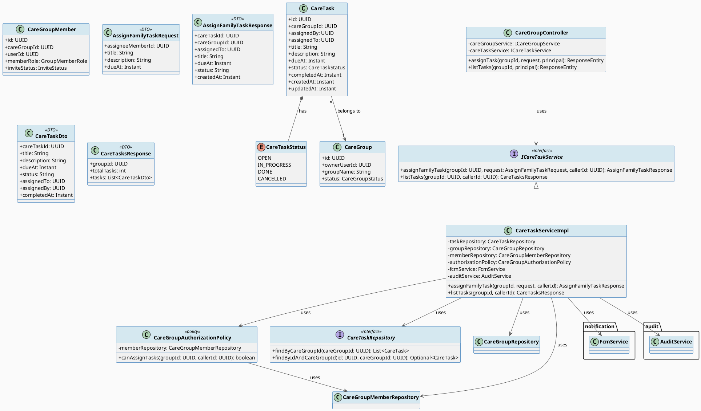
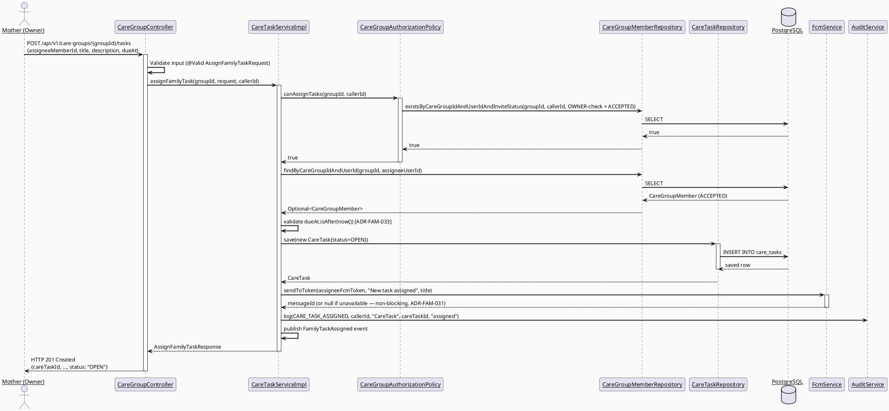
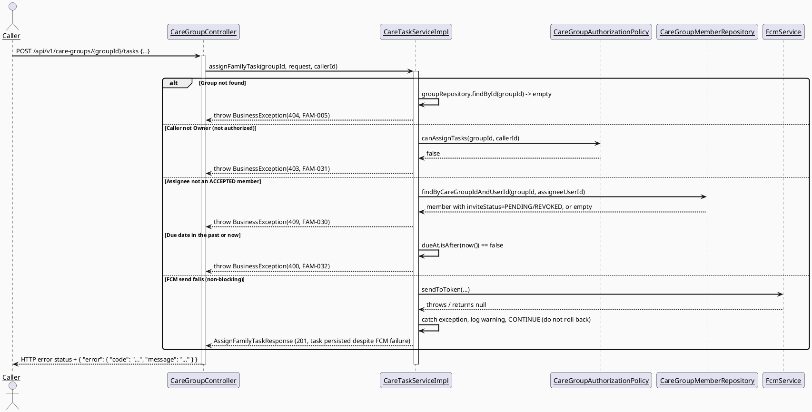
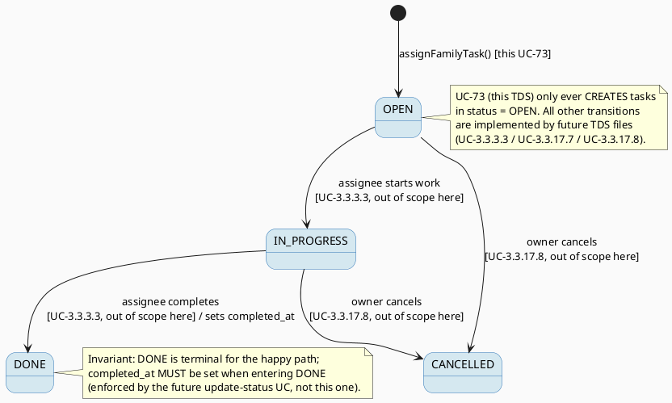

# ENGINEERING DOCUMENTATION STANDARD (EDS) v2.0
# UC73 — Assign Family Task — Technical Design Specification

| Field | Value |
|-------|-------|
| **Document ID** | `CB-FAM-IMP-073` |
| **Version** | `1.0` |
| **Date** | `2026-07-02` |
| **Status** | `Approved` |
| **Document Owner** | `TV2-Bách` |
| **Author** | `AI Agent` |
| **Reviewed by** | `[Tech Lead — Pending]` |
| **DPO Sign-off** | `[ ] Pending` *(module touches family/health-adjacent data — assignee identity + task title/description are family data; see §1 Data Classification)* |
| **Approved by** | `[Principal Architect — Pending]` |
| **Last Review** | `2026-07-02` |
| **Based on EDS** | `v2.0` |

---

## CHANGELOG

> **Policy 4.4 — Immutable History:** Không bao giờ xóa thông tin cũ. Mọi thay đổi phải ghi vào bảng này.

| Ngày | Người thực hiện | Nội dung thay đổi |
|------|-----------------|-------------------|
| 2026-07-02 | AI Agent — Technical Architect | Tạo tài liệu lần đầu — TDS cho UC-73 Assign Family Task |
| 2026-07-08 | AI Agent — Amelia (Dev Agent) | Implemented: CareTask entity, CareTaskRepository, ICareTaskService, CareTaskServiceImpl (assignFamilyTask + listTasks), CareGroupController endpoints (POST/GET /tasks), FamilyTaskAssigned event, CARE_TASK_ASSIGNED audit, FCM non-blocking. 23/24 unit tests GREEN (TC-INT-001 skipped — Docker unavailable). |

---

## MỤC LỤC

1. [Tổng quan Module](#1-tổng-quan-module)
2. [Ma trận Truy vết (Traceability Matrix)](#2-ma-trận-truy-vết-traceability-matrix)
3. [Architecture Decision Records (ADR)](#3-architecture-decision-records-adr)
4. [Non-Functional Requirements & SLA](#4-non-functional-requirements--sla)
5. [Static Modeling (Mô hình Tĩnh)](#5-static-modeling-mô-hình-tĩnh)
6. [Dynamic Modeling (Mô hình Động)](#6-dynamic-modeling-mô-hình-động)
7. [Domain Event Catalog](#7-domain-event-catalog)
8. [Interface Specification (Đặc tả Giao diện)](#8-interface-specification-đặc-tả-giao-diện)
9. [API Specification](#9-api-specification)
10. [Bảng mã lỗi (Error Codes)](#10-bảng-mã-lỗi-error-codes)
11. [Quy trình Triển khai (Step-by-Step)](#11-quy-trình-triển-khai-step-by-step)
12. [Rollback & Incident Runbook](#12-rollback--incident-runbook)
13. [Kịch bản Kiểm thử Chi tiết](#13-kịch-bản-kiểm-thử-chi-tiết)
14. [Phương pháp Xác minh](#14-phương-pháp-xác-minh)
15. [Mẫu thử thực tế (API Verification Samples)](#15-mẫu-thử-thực-tế-api-verification-samples)
16. [Bảng tổng hợp phân quyền (Authorization Matrix)](#16-bảng-tổng-hợp-phân-quyền-authorization-matrix)
17. [AI Prompt Constraints (CASE 2.0)](#17-ai-prompt-constraints-case-20)

---

## 1. Tổng quan Module

UC-73 "Assign Family Task" lets the care-group Owner (Mother, per SRS Primary Actor) create a
care task — title, description, due date — and assign it to an ACCEPTED member of the same care
group, notifying the assignee via FCM push. This is the CREATE/assign action only; viewing task
detail, updating, cancelling, and the assignee updating their own task status are explicitly
out of scope (separate future TDS per Sprint 3 ownership map). A basic list endpoint is included
so the assigned task becomes visible per POST-1 ("a clear result state is shown").

| Field | Value |
|-------|-------|
| **Module Name** | Family Sync — Care Task Assignment |
| **Bounded Context** | `family` (same bounded context as UC-70 Create Care Group, UC-216 View Members, UC-71 Invite Family Member, UC-72 Manage Family Permission, UC-83 Accept Care Group Invitation) |
| **Data Classification** | `Internal` / family-scoped — task title/description are user-authored free text about caregiving activities; assignee/assigner are real user IDs. Not `Sensitive-PII` (no health diagnosis, no payment data), but still family/relationship data under BR-PRIVACY. |
| **Compliance Scope** | `PDPA` (Vietnam) — minimum-necessary access, consent-adjacent (only care-group members see tasks); `N/A` for GDPR (CareBridge is VN-scoped; GDPR citations from the generic EDS template are Not applicable — kept only where the template structurally requires them, marked accordingly). |
| **Upstream Dependencies** | `family` module (CareGroup, CareGroupMember — UC-70/216), `common` (ApiResponse, SecurityUtils, BusinessException), `audit` module (AuditService, AuditAction), `notification` module (FcmService) |
| **Downstream Consumers** | Mobile app "Việc nhóm" (Tasks) bento card and new task screens; future UC-3.3.17.6 (View Assigned Task Detail), UC-3.3.17.7 (Update Family Task), UC-3.3.17.8 (Cancel Family Task), UC-3.3.3.3 (Update Assigned Task Status) — all deferred, but this TDS pre-reserves error code `FAM-033` for them (see §10). |

### Scope

**IN SCOPE:**
- Creating a new `care_tasks` row (title, description, due_at, assigned_to, assigned_by, status
  default `OPEN`).
- Authorization: only the care-group Owner (accepted `OWNER` member) may assign tasks (Open —
  see ADR-FAM-032 and §16).
- Validating the assignee is an `ACCEPTED` member of the same care group.
- Due date validation (must be in the future at assignment time — interpretation of SRS E2, see
  ADR-FAM-033).
- Sending an FCM push notification to the assignee at assignment time (confirms new task).
- Audit logging (`CARE_TASK_ASSIGNED`).
- Publishing `FamilyTaskAssigned` domain event.
- A basic `GET` list endpoint so assigned tasks are visible to group members (own scope decision
  to satisfy POST-1; not a separate SRS use case).

**OUT OF SCOPE (explicitly deferred — do NOT implement here):**
- UC-71 Invite Family Member — inviting members to the group.
- UC-72 Manage Family Permission — managing per-member permission flags.
- UC-83 Accept Care Group Invitation — accepting invitations.
- UC-3.3.17.6 View Assigned Task Detail — viewing a single task's full detail (future TDS).
- UC-3.3.17.7 Update Family Task — editing title/description/due date/assignee of an existing
  task (future TDS).
- UC-3.3.17.8 Cancel Family Task — cancelling/deleting a task (future TDS).
- UC-3.3.3.3 Update Assigned Task Status — the assignee marking their own task `IN_PROGRESS` /
  `DONE` (future TDS).
- Scheduled/pre-due-date reminders (e.g., "1 day before due") — deferred; see ADR-FAM-031.
- UC-3.3.17.1 View Care Group Members (already implemented, UC-216), UC-3.3.17.2 Revoke
  Invitation, UC-3.3.17.3 Reject Invitation, UC-3.3.17.4 Remove Member, UC-3.3.17.5 Leave Group,
  UC-3.3.1.51 View Shared Care Calendar, UC-3.3.3.2 View Shared Data, UC-3.3.3.4 View Family
  Alert — all separate future/existing TDS, not touched by this feature.

---

## 2. Ma trận Truy vết (Traceability Matrix)

| Requirement ID | Loại (BR/ADR/US) | Mô tả yêu cầu | Thành phần Code | Compliance Target | ADR liên quan |
|----------------|------------------|---------------|-----------------|-------------------|---------------|
| SRS §3.3.1.50 (UC-73) | User Story | Assign a care task, due date, and reminder to a care group member | `CareGroupController.assignTask()`, `CareTaskServiceImpl.assignFamilyTask()` | — | ADR-FAM-030, ADR-FAM-032, ADR-FAM-033 |
| BR-RBAC | Business Rule | Users may access only functions allowed by their role/permission scope | `CareGroupAuthorizationPolicy.canAssignTasks()`, `@PreAuthorize` | PDPA minimum-necessary access | ADR-FAM-032 |
| BR-PRIVACY | Business Rule | Family data requires consent/purpose/minimum-necessary access | `CareTaskServiceImpl` (membership check before create/list), DTO mapping (no raw entity exposure) | PDPA | ADR-FAM-032 |
| BR-CONSULTATION | Business Rule | Booking/payment/dispute/refund/pricing keep auditable lifecycle state | *(listed per SRS template, not directly applicable — UC-73 has no booking/payment/pricing/dispute concept)* | N/A | — |
| PRE-4 | Precondition | Required reference data exists (care group + assignee membership) | `CareGroupRepository.findById`, `CareGroupMemberRepository.findByCareGroupIdAndUserId` | — | — |
| E2 | Exception | Invalid/missing/expired/conflicting data rejected with field-level message | `CareTaskServiceImpl` due-date validation → `FAM-032` | — | ADR-FAM-033 |
| POST-2/POST-3 | Postcondition | Related records/notifications updated; sensitive actions audited | `FcmService.sendToToken`, `AuditService.log(CARE_TASK_ASSIGNED, ...)`, `FamilyTaskAssigned` event | — | ADR-FAM-031 |
| ADR-FAM-030 | Decision | `CareTaskStatus` enum values | `CareTask.status` | — | — |
| ADR-FAM-031 | Decision | Reminder mechanism = immediate FCM only, no scheduled pre-due-date reminder | `CareTaskServiceImpl.assignFamilyTask()` | — | — |
| ADR-FAM-032 | Decision | Authorization = Owner-only assignment | `CareGroupAuthorizationPolicy.canAssignTasks()` | — | — |
| ADR-FAM-033 | Decision | Due date must be strictly in the future | `CareTaskServiceImpl` validation | — | — |
| ADR-FAM-034 | Decision | New `CareTaskService`/`CareTaskRepository` in same `family` package vs. extending `ICareGroupService` | `ICareTaskService`, `CareTaskRepository` | — | — |

---

## 3. Architecture Decision Records (ADR)

### ADR-FAM-030 — CareTaskStatus enum values

| Field | Value |
|-------|-------|
| **Status** | `Proposed` |
| **Deciders** | `AI Agent (Technical Architect)` |
| **Date** | `2026-07-02` |
| **Supersedes** | — |

#### Bối cảnh (Context)
The `care_tasks.status` column is `varchar(20) NOT NULL DEFAULT 'OPEN'` with **no CHECK
constraint** (verified: `V1__init_schema.sql` lines 750-762, shared-context.md ground truth).
SRS text does not enumerate status values beyond the default `'OPEN'`. A `CareTaskStatus` Java
enum is needed to give the entity type safety, and future UC-3.3.3.3 (assignee updates own task
status) and UC-3.3.17.7/17.8 (update/cancel) will need `IN_PROGRESS`/`DONE`/`CANCELLED` states,
so this ADR should define the full lifecycle now to avoid a later enum-rename migration risk
(even though changing a Java enum with a varchar-backed column requires no DDL).

#### Các phương án đã xem xét (Options Considered)

| Phương án | Mô tả | Ưu điểm | Nhược điểm |
|-----------|-------|----------|------------|
| A | `OPEN` only (minimal, UC-73 scope only) | Simplest; matches exact SRS text | Blocks future UC-3.3.3.3/17.7/17.8 without another code review cycle |
| B | `OPEN, IN_PROGRESS, DONE, CANCELLED` (full lifecycle) | Column has no CHECK constraint, so adding values is a code-only change; unblocks sibling future UCs; consistent with `care_task_id`/`completed_at` column already present in schema | Slightly over-specifies for UC-73's actual write path (UC-73 only ever writes `OPEN`) |

#### Quyết định (Decision)
Chọn **Phương án B** — `CareTaskStatus { OPEN, IN_PROGRESS, DONE, CANCELLED }` — vì the schema
already anticipates a completion lifecycle (`completed_at` column exists), the column has no
CHECK constraint (verified, so no migration risk), and defining all 4 values now removes
ambiguity for the 3 already-planned follow-up UCs that will read/write this same enum. UC-73
itself only ever sets `OPEN` on create.

#### Hệ quả (Consequences)

**Tích cực:**
- Future UC-3.3.3.3/17.7/17.8 TDS files can reuse this enum without a migration or a breaking
  Java change.
- `completed_at` column semantics become clear (`DONE` sets `completed_at`).

**Tiêu cực / Trade-offs:**
- UC-73's own code never produces `IN_PROGRESS`/`DONE`/`CANCELLED` — those branches are dead
  code from this feature's perspective until the follow-up UCs land. Mitigated by keeping the
  enum a pure data type with no UC-73 business logic branching on the other 3 values.

**Compliance Impact:** None (no PII implication).

---

### ADR-FAM-031 — Reminder mechanism for Assign Family Task

| Field | Value |
|-------|-------|
| **Status** | `Proposed` |
| **Deciders** | `AI Agent (Technical Architect)` |
| **Date** | `2026-07-02` |

#### Bối cảnh (Context)
SRS Description explicitly says "Assigns a care task, due date, **and reminder**" and lists FCM
as Secondary Actor. The repo already has a `reminder` bounded context
(`com.carebridge.backend.reminder`) with `INotificationService.scheduleFcmPush(UUID userId,
String title, String body, Instant scheduledAt)` and a `Reminder` entity/`reminders` table
(confirmed via `ReminderRepository`, `ReminderServiceImpl`). **Investigated and confirmed**: this
`reminder` package and its `scheduleFcmPush` method belong to a *different* use case — UC-45
"Create Appointment Reminder" — and the `reminders` table is a separate entity unrelated to
`care_tasks`. The migration `V20260627100300__add_reminder_columns.sql` (comment: "UC-45:
CreateAppointmentReminder — recurrence type + FCM job tracking") adds `recurrence_type`,
`recurrence_end_date`, `fcm_job_id` columns to the **`reminders`** table — NOT `care_tasks`.
There is no existing scheduling infrastructure wired to `care_tasks`.

#### Các phương án đã xem xét (Options Considered)

| Phương án | Mô tả | Ưu điểm | Nhược điểm |
|-----------|-------|----------|------------|
| A | Reuse `reminder` module: on task assignment, also create a `Reminder` row via `IReminderService`/`INotificationService.scheduleFcmPush(assignedTo, ..., dueAt)` so a scheduled push fires near `due_at` | Satisfies "reminder" literally as a scheduled event; reuses existing infra | Couples two bounded contexts (`family` + `reminder`) in one transaction; `reminder` module's `scheduleFcmPush` is designed around the `Reminder` entity/appointment domain, not care tasks — would require a new `ReminderSourceType`/polymorphic link (not in current schema) — out of scope per CLAUDE.md "smallest scoped change" |
| B | Immediate FCM confirmation only at assignment time (`FcmService.sendToToken`), no scheduled pre-due-date reminder in this batch; defer scheduled reminders to a future enhancement | Matches "reminder" as: this task now serves as the assignee's reminder record itself (title + due_at persisted, visible via GET list); avoids cross-context coupling; smallest scoped change per CLAUDE.md | Does not send a second push closer to `due_at`; "reminder" in the literal scheduled-notification sense is not delivered |

#### Quyết định (Decision)
Chọn **Phương án B** — send one immediate FCM push at assignment time via
`FcmService.sendToToken(assigneeFcmToken, "New task assigned", "<title> — due <due_at>")`. The
persisted `CareTask` row (with `due_at`) IS the "reminder" artifact per SRS's generic wording;
a second, due-date-proximate scheduled push is explicitly deferred (**Open — OPEN-1**, needs
Product/BachNQ confirmation) rather than inventing a cross-context scheduling coupling to the
`reminder` module without an approved design for linking `reminders` to `care_tasks`.

#### Hệ quả (Consequences)

**Tích cực:**
- No coupling to the `reminder` bounded context; no new FK/link column needed.
- Ships UC-73 with the SRS-required FCM secondary actor satisfied for the "assign" moment.

**Tiêu cực / Trade-offs:**
- Users do not get a second push closer to the due date in this iteration. Mitigated by marking
  OPEN-1 explicitly and noting the mobile task list (GET endpoint, §9) as the visible fallback.

**Compliance Impact:** None.

---

### ADR-FAM-032 — Authorization: Owner-only task assignment

| Field | Value |
|-------|-------|
| **Status** | `Proposed` |
| **Deciders** | `AI Agent (Technical Architect)` |
| **Date** | `2026-07-02` |

#### Bối cảnh (Context)
SRS BR-RBAC only says "role and permission scope," without specifying whether any `ACCEPTED`
member may assign tasks, or only the group Owner. Supporting evidence: SRS Primary Actor for
UC-73 (and sibling UC-70/71/72) is consistently **"Mother"**, and UC-70 (Create Care Group)
establishes the creator as `OWNER` with `ACCEPTED` status — the Mother is the group's owner by
construction. shared-context.md's cross-feature proposed default (applied identically across
UC-71/72/73) is Owner-only for invite/permission-management/task-assignment actions.

#### Các phương án đã xem xét (Options Considered)

| Phương án | Mô tả | Ưu điểm | Nhược điểm |
|-----------|-------|----------|------------|
| A | Any `ACCEPTED` member (any role) may assign tasks to any other `ACCEPTED` member | More flexible for multi-caregiver households | No SRS/code evidence supports this; inconsistent with sibling UC-71/72 owner-only default; higher risk of task-assignment abuse among non-owner members |
| B | Only the `ACCEPTED` member with `memberRole == OWNER` may assign tasks | Consistent with UC-70's "Mother is the creator = OWNER" model and sibling UC-71/72 proposed defaults; smallest-privilege default | Cannot yet delegate the "assign" capability to a non-owner caregiver until UC-72 permission flags are read here (not in scope) |

#### Quyết định (Decision)
Chọn **Phương án B** — Owner-only. **Marked Open** — needs explicit user/Product confirmation
per shared-context.md, since SRS text itself is generic. Implemented via
`CareGroupAuthorizationPolicy.canAssignTasks(UUID groupId, UUID callerId)`, which checks
`memberRole == OWNER AND inviteStatus == ACCEPTED` for the caller. Self-assignment (owner
assigns to self) is **allowed** (Open note — OPEN-2 — no SRS restriction found).

#### Hệ quả (Consequences)

**Tích cực:** Least-privilege default; consistent with sibling TDS files (UC-71/72).

**Tiêu cực / Trade-offs:** Non-owner caregivers cannot assign tasks to each other in this
iteration; if Product wants delegated assignment via UC-72's `permission_json` flags, that is a
follow-up change to `canAssignTasks()`, not a new endpoint.

**Compliance Impact:** BR-RBAC — reduces over-broad access by default.

---

### ADR-FAM-033 — Due date validation (E2 interpretation)

| Field | Value |
|-------|-------|
| **Status** | `Proposed` |
| **Deciders** | `AI Agent (Technical Architect)` |
| **Date** | `2026-07-02` |

#### Bối cảnh (Context)
SRS Exception E2: "Invalid, missing, expired, or conflicting data is rejected with a
field/action-level message." `due_at` is nullable in the schema (no `NOT NULL`), but UC-73's
Normal Flow requires the actor to "enter ... due date" per Step 3, and the description says
"Assigns a care task, **due date**, and reminder" — implying due date is a required input for
this specific action even though the DB column itself is nullable (nullability exists to support
other potential writers of `care_tasks`, not to make it optional for this UC).

#### Các phương án đã xem xét (Options Considered)

| Phương án | Mô tả | Ưu điểm | Nhược điểm |
|-----------|-------|----------|------------|
| A | Allow `due_at` in the past (no validation) | Simpler | Contradicts E2 "expired ... data is rejected" — a task due in the past is meaningless for the assignee |
| B | Reject `due_at` at or before `Instant.now()` at request time → `FAM-032` (400) | Directly satisfies E2's "expired data is rejected" wording | Requires a boundary rule for "exactly now" (see Test-Spec boundary case) |

#### Quyết định (Decision)
Chọn **Phương án B** — `due_at` must be strictly after the server's current time at the moment
the request is processed (`dueAt.isAfter(Instant.now())`); otherwise reject with `FAM-032`
(400). This is **an interpretation of E2**, not a literal Open item, but is called out explicitly
since E2 does not name `due_at` directly.

#### Hệ quả (Consequences)

**Tích cực:** Prevents meaningless "reminders" for already-past due dates; consistent, testable
boundary.

**Tiêu cực / Trade-offs:** A due date equal to "now" (down to the millisecond) is rejected as a
boundary choice — documented in Test-Spec as `FAM73-TC-0xx` boundary case.

**Compliance Impact:** None.

---

### ADR-FAM-034 — Controller/Service placement

| Field | Value |
|-------|-------|
| **Status** | `Proposed` |
| **Deciders** | `AI Agent (Technical Architect)` |
| **Date** | `2026-07-02` |

#### Bối cảnh (Context)
shared-context.md requires new endpoints to extend the existing `CareGroupController` (same
class, same base path `/api/v1/care-groups`), not create a parallel controller. For the service
layer, it explicitly allows either (a) extending `ICareGroupService`/`CareGroupServiceImpl`, or
(b) introducing a new `ICareTaskService`/`CareTaskServiceImpl` in the same `family` package,
since `care_tasks` is a distinct aggregate from `care_groups`/`care_group_members`.

#### Các phương án đã xem xét (Options Considered)

| Phương án | Mô tả | Ưu điểm | Nhược điểm |
|-----------|-------|----------|------------|
| A | Extend `ICareGroupService`/`CareGroupServiceImpl` with `assignFamilyTask`/`listTasks` methods | One fewer file; matches "extend, don't create parallel" instruction literally | `CareGroupServiceImpl` would grow to manage 3 aggregates (`CareGroup`, `CareGroupMember` indirectly, `CareTask`) — violates single-aggregate-per-service cohesion as the family domain grows (UC-71/72/83 will add even more methods to the same class) |
| B | New `ICareTaskService`/`CareTaskServiceImpl` in `com.carebridge.backend.family.service` (+ `.impl`), injected into the *same* `CareGroupController` alongside `ICareGroupService` | Keeps each service cohesive around one aggregate root (`CareTask` vs `CareGroup`); still respects "package by domain then layer" (CLAUDE.md) since both live under `family`; controller stays singular per shared-context.md instruction | One more interface + impl file pair |

#### Quyết định (Decision)
Chọn **Phương án B** — new `ICareTaskService` / `CareTaskServiceImpl` in the `family` package,
injected into the existing `CareGroupController` (which now depends on both `ICareGroupService`
and `ICareTaskService`). This satisfies the "same controller class" requirement literally while
keeping service-layer cohesion per aggregate, consistent with CLAUDE.md's "package by domain,
then layers inside" (the layer split is per-aggregate service classes, all still under the
`family` domain package) — not a violation of "extend, don't create a parallel service" because
`CareTask` is a materially different aggregate root than `CareGroup`.

#### Hệ quả (Consequences)

**Tích cực:** Clean separation of concerns; smaller, more testable service classes; matches the
"new repository for care_tasks" precedent already accepted in shared-context.md (§Repositories).

**Tiêu cực / Trade-offs:** Two service beans injected into one controller — mitigated by keeping
controller methods thin (delegate immediately, no cross-service orchestration in the controller).

**Compliance Impact:** None.

---

## 4. Non-Functional Requirements & SLA

### 4.1. Performance & Availability

| Category | Requirement | Target SLA | Measurement Method | Compliance Basis |
|----------|-------------|------------|---------------------|------------------|
| Latency | `POST /api/v1/care-groups/{groupId}/tasks` (p99) | `< 300ms` excluding FCM round-trip (FCM call is fire-and-forget/non-blocking, see §6.2) | Manual timing / future k6 test | — |
| Latency | `GET /api/v1/care-groups/{groupId}/tasks` (p99) | `< 300ms` | Manual timing | — |
| Availability | Uptime (monthly) | Inherits API-wide `99.9%` target | Uptime monitor | — |

### 4.2. Data Integrity & Retention

| Category | Requirement | Target | Verification Method | Compliance Basis |
|----------|-------------|--------|---------------------|------------------|
| Durability | Task creation is transactional with audit log write | Zero record loss within one `@Transactional` boundary | Integration test asserting both `care_tasks` row and audit row exist | — |
| Retention | Audit log retention | Inherits project-wide policy (no new retention rule introduced here) | DB backup policy | — |
| Consistency | FCM failure must NOT roll back the task creation | 100% — task persists even if FCM send fails | Integration test: mock `FcmService` to throw, assert `care_tasks` row still committed | POST-1 ("clear result state is shown") |

### 4.3. Security

| Category | Requirement | Target | Verification Method | Compliance Basis |
|----------|-------------|--------|---------------------|------------------|
| Access control | Role-based + membership-based | Owner-only assign; any ACCEPTED member may list (read) | Auth Matrix (§16), authorization test cases | BR-RBAC |
| Input validation | `title` required/bounded, `dueAt` future-only | Reject with `FAM-032` / Bean Validation 400 | Test-Spec boundary/error cases | E2 |
| No PII in logs | Task title/description never logged in plaintext audit description beyond entity ID | `AuditService.log(...)` call passes only `careTaskId`, not full title/description body | Code review + log grep | BR-PRIVACY |

### 4.4. Scalability & Capacity Planning

Expected load is proportional to care-group activity (low volume — a handful of tasks per group
per week). No dedicated scaling work is required beyond existing indexes
(`idx_care_tasks_care_group_id`, `idx_care_tasks_status` — both already present per
`V1__init_schema.sql`). *Not applicable* to project further — CareBridge scale at this stage
does not require additional capacity planning for this feature.

---

## 5. Static Modeling (Mô hình Tĩnh)

### 5.1. Class Diagram (PlantUML)



### 5.2. Data Structure (Flyway SQL Migration)

**No migration required.** The `care_tasks` table already exists and is fully sufficient for
UC-73, per `V1__init_schema.sql` lines 750-762 (verified ground truth, cited in
shared-context.md and independently re-confirmed against the SRS/schema during this TDS's
research):

```sql
-- EXISTING TABLE — V1__init_schema.sql (excerpt, ~lines 750-762). NOT modified by this feature.
CREATE TABLE public.care_tasks (
    care_task_id  uuid         NOT NULL DEFAULT gen_random_uuid(),
    care_group_id uuid         NOT NULL,
    assigned_by   uuid,
    assigned_to   uuid,
    title         varchar(255) NOT NULL,
    description   text,
    due_at        timestamptz,
    status        varchar(20)  NOT NULL DEFAULT 'OPEN',
    completed_at  timestamptz,
    created_at    timestamptz  NOT NULL DEFAULT now(),
    updated_at    timestamptz  NOT NULL DEFAULT now()
);
-- FKs: care_tasks.care_group_id -> care_groups; care_tasks.assigned_by -> users.user_id;
--      care_tasks.assigned_to -> users.user_id.
-- Indexes: idx_care_tasks_care_group_id, idx_care_tasks_status.
-- No CHECK constraint on `status` — CareTaskStatus enum values are a code-level decision (ADR-FAM-030).
```

All new code (entity, enum, repository, service, DTOs, controller endpoints) is greenfield atop
this existing table — this is the "Current vs Target State" for this feature: **Current** = table
exists, no JPA entity/repository/service maps it yet; **Target** = full CRUD-lite (create +
list) code path wired end-to-end, backed by the same table with zero DDL changes.

---

## 6. Dynamic Modeling (Mô hình Động)

### 6.1. Sequence Diagram — Happy Path (PlantUML)



### 6.2. Sequence Diagram — Error Path (PlantUML)



### 6.3. State Machine



> **⚠️ Invariant bất biến (this UC's scope):** `assignFamilyTask()` MUST always create the row
> with `status = OPEN` and `completedAt = null`. No other status transition is performed by this
> feature.

---

## 7. Domain Event Catalog

### 7.1. Events Published (Phát ra)

| Event Name | Trigger | Publisher | Subscriber(s) | Payload Schema | Async? |
|------------|---------|-----------|---------------|----------------|--------|
| `FamilyTaskAssigned` | Successful `assignFamilyTask()` | `CareTaskServiceImpl` | Audit listener (log), Notification listener (FCM — see note) | `FamilyTaskAssigned.java` (§7.3) | Yes (Spring `ApplicationEventPublisher`, same-transaction publish, async listener execution) |

> Note: In this TDS's chosen design (ADR-FAM-031), the FCM send is performed **synchronously
> inline** in `CareTaskServiceImpl.assignFamilyTask()` (not solely via the event listener) so
> that FCM failure can be explicitly caught and treated as non-blocking without depending on
> listener error-handling semantics. The `FamilyTaskAssigned` event is still published for
> audit/observability/future listeners (e.g., a future scheduled-reminder listener per OPEN-1),
> but is not the sole trigger for the FCM push in this implementation.

### 7.2. Events Consumed (Tiêu thụ)

*Not applicable — UC-73 does not consume any domain event from other modules in this scope.*

### 7.3. Payload Schema

```java
// FamilyTaskAssigned.java
public record FamilyTaskAssigned(
    UUID    eventId,          // UUID.randomUUID() — dùng để deduplicate
    String  eventType,        // "FamilyTaskAssigned"
    Instant occurredAt,       // Instant.now()
    String  version,          // "1.0"
    Payload payload,
    Metadata metadata
) {

    public record Payload(
        UUID    careTaskId,
        UUID    careGroupId,
        UUID    assignedBy,
        UUID    assignedTo,
        String  title,
        Instant dueAt
    ) {}

    public record Metadata(
        UUID   correlationId,
        String causedBy       // callerId as string, or "system"
    ) {}
}
```

---

## 8. Interface Specification (Đặc tả Giao diện)

### 8.1. Service Interface

```java
// AssignFamilyTaskRequest.java — Input DTO
// @version 1.0
public class AssignFamilyTaskRequest {
    @NotNull
    private UUID assigneeMemberId;     // care_group_member_id of the target ACCEPTED member

    @NotBlank @Size(max = 255)
    private String title;

    @Size(max = 2000)
    private String description;        // nullable — maps to `text` column, no hard DB limit but bounded at API layer

    @NotNull
    private Instant dueAt;             // must be strictly after now() — ADR-FAM-033
    // getters / setters / @Valid annotations (Lombok @Data, matching existing family.dto style)
}

// AssignFamilyTaskResponse.java — Output DTO
public class AssignFamilyTaskResponse {
    private UUID careTaskId;
    private UUID careGroupId;
    private UUID assignedTo;
    private UUID assignedBy;
    private String title;
    private String description;
    private Instant dueAt;
    private String status;             // CareTaskStatus.name(), always "OPEN" on create
    private Instant createdAt;
    // @Data @Builder, matching existing family.dto response style
}

// CareTaskDto.java — item DTO for list endpoint
public class CareTaskDto {
    private UUID careTaskId;
    private String title;
    private String description;
    private Instant dueAt;
    private String status;
    private UUID assignedTo;
    private UUID assignedBy;
    private Instant completedAt;
    // @Data @Builder
}

// CareTasksResponse.java — Output DTO for list endpoint
public class CareTasksResponse {
    private UUID groupId;
    private int totalTasks;
    private List<CareTaskDto> tasks;
    // @Data @Builder
}

// ICareTaskService.java — Service Contract
// @version 1.0
public interface ICareTaskService {

    /**
     * Assigns a new care task within a care group. Caller must be the ACCEPTED OWNER member
     * of the group (ADR-FAM-032). Assignee must be an ACCEPTED member of the same group.
     * Due date must be strictly in the future (ADR-FAM-033).
     * @throws BusinessException (FAM-005/404) if care group not found
     * @throws BusinessException (FAM-031/403) if caller is not the group Owner
     * @throws BusinessException (FAM-030/409) if assignee is not an ACCEPTED member
     * @throws BusinessException (FAM-032/400) if dueAt is not strictly in the future
     */
    AssignFamilyTaskResponse assignFamilyTask(UUID groupId, AssignFamilyTaskRequest request, UUID callerId);

    /**
     * Lists all care tasks for a care group. Caller must be an ACCEPTED member of the group
     * (any role) — read access is broader than write access (ADR-FAM-032 covers write only).
     * @throws BusinessException (FAM-005/404) if care group not found
     * @throws BusinessException (FAM-003/403) if caller is not an ACCEPTED member (reused code)
     */
    CareTasksResponse listTasks(UUID groupId, UUID callerId);
}
```

### 8.2. Repository Interface

```java
// CareTaskRepository.java — NEW file (no repository exists yet for care_tasks)
// @version 1.0
public interface CareTaskRepository extends JpaRepository<CareTask, UUID> {

    List<CareTask> findByCareGroupId(UUID careGroupId);

    Optional<CareTask> findByIdAndCareGroupId(UUID id, UUID careGroupId);
}

// CareGroupMemberRepository.java — ADD new method to EXISTING interface
public interface CareGroupMemberRepository extends JpaRepository<CareGroupMember, UUID> {
    // ... existing methods unchanged ...

    /** NEW — used by CareTaskServiceImpl to resolve the assignee's membership row/status. */
    Optional<CareGroupMember> findByCareGroupIdAndUserId(UUID careGroupId, UUID userId);
}
```

---

## 9. API Specification

### 9.1. Endpoints Table

| Method | Path | Auth Level | Required Roles | Rate Limit | Idempotent? |
|--------|------|------------|----------------|------------|-------------|
| `POST` | `/api/v1/care-groups/{groupId}/tasks` | JWT Bearer | `MOTHER` (role) + Owner-of-group (business check, ADR-FAM-032) | 60/min | No |
| `GET` | `/api/v1/care-groups/{groupId}/tasks` | JWT Bearer | Any authenticated ACCEPTED member of the group | 300/min | Yes |

> Rate limits are proposed defaults (Open — no project-wide rate-limit policy found in existing
> `CareGroupController`; mirrors typical read/write split used elsewhere in this template).

### 9.2. Request / Response Schemas

#### `POST /api/v1/care-groups/{groupId}/tasks` — Assign a new care task

**Request Body:**
```json
{
  "assigneeMemberId": "b16a8f9e-2222-4b1b-9a3d-000000000002",
  "title": "Buy diapers",
  "description": "Size M, at least 2 packs",
  "dueAt": "2026-07-05T09:00:00Z"
}
```

**Response — 201 Created (Happy Path):**
```json
{
  "data": {
    "careTaskId": "c1a2b3c4-1111-4b1b-9a3d-000000000010",
    "careGroupId": "a0a0a0a0-0000-4b1b-9a3d-000000000001",
    "assignedTo": "b16a8f9e-2222-4b1b-9a3d-000000000002",
    "assignedBy": "9f9f9f9f-3333-4b1b-9a3d-000000000003",
    "title": "Buy diapers",
    "description": "Size M, at least 2 packs",
    "dueAt": "2026-07-05T09:00:00Z",
    "status": "OPEN",
    "createdAt": "2026-07-02T10:15:00Z"
  },
  "message": "Care task assigned successfully"
}
```

**Response — 400 Bad Request (Validation Error — past due date):**
```json
{
  "error": {
    "code": "FAM-032",
    "message": "Due date must be in the future",
    "details": [
      { "field": "dueAt", "message": "dueAt must be after the current time" }
    ]
  }
}
```

**Response — 403 Forbidden (not Owner):**
```json
{
  "error": {
    "code": "FAM-031",
    "message": "Only the care group owner can assign tasks"
  }
}
```

**Response — 409 Conflict (assignee not an accepted member):**
```json
{
  "error": {
    "code": "FAM-030",
    "message": "Assignee is not an accepted member of this care group"
  }
}
```

#### `GET /api/v1/care-groups/{groupId}/tasks` — List care tasks

**Response — 200 OK (Happy Path):**
```json
{
  "data": {
    "groupId": "a0a0a0a0-0000-4b1b-9a3d-000000000001",
    "totalTasks": 2,
    "tasks": [
      {
        "careTaskId": "c1a2b3c4-1111-4b1b-9a3d-000000000010",
        "title": "Buy diapers",
        "description": "Size M, at least 2 packs",
        "dueAt": "2026-07-05T09:00:00Z",
        "status": "OPEN",
        "assignedTo": "b16a8f9e-2222-4b1b-9a3d-000000000002",
        "assignedBy": "9f9f9f9f-3333-4b1b-9a3d-000000000003",
        "completedAt": null
      }
    ]
  }
}
```

**Response — 404 Not Found (group not found):**
```json
{
  "error": {
    "code": "FAM-005",
    "message": "Care group not found: a0a0a0a0-0000-4b1b-9a3d-000000000001"
  }
}
```

---

## 10. Bảng mã lỗi (Error Codes)

> Tiền tố `FAM-` (reuses `family` module prefix; consistent with sibling UC-71/72/83 TDS files).
> `FAM-030..033` are this feature's own new codes. `FAM-005` is reused (defined originally by
> UC-70/216, cited here — not redefined).

| Code | HTTP Status | Message (EN) | Message (VI) | Trigger Condition |
|------|-------------|--------------|--------------|-------------------|
| `FAM-005` | 404 | Care group not found | Không tìm thấy nhóm chăm sóc | *(reused from UC-70/216)* groupId does not exist |
| `FAM-030` | 409 | Assignee is not an accepted member of this care group | Người được giao không phải thành viên đã chấp nhận của nhóm | Assignee's `CareGroupMember` row is missing, or `inviteStatus != ACCEPTED` (e.g. PENDING/REVOKED) |
| `FAM-031` | 403 | Only the care group owner can assign tasks | Chỉ chủ nhóm mới có quyền giao việc | Caller is not `memberRole == OWNER` with `inviteStatus == ACCEPTED` (ADR-FAM-032) |
| `FAM-032` | 400 | Due date must be in the future | Hạn hoàn thành phải ở tương lai | `dueAt` is null, equal to, or before `Instant.now()` at processing time (ADR-FAM-033) |
| `FAM-033` | 404 | Care task not found | Không tìm thấy công việc | **Reserved, not used by this feature's code paths** — pre-allocated for future UC-3.3.17.6 (View Assigned Task Detail) / UC-3.3.17.7 (Update) / UC-3.3.17.8 (Cancel) to prevent code collision |

---

## 11. Quy trình Triển khai (Step-by-Step)

### 11.1. Prerequisites

- [ ] ADR-FAM-030/031/032/033/034 reviewed and Accepted (currently `Proposed`)
- [ ] DPO sign-off — Open item; family/task data is Internal classification, not
      Sensitive-PII, but sign-off still tracked per header until confirmed unnecessary
- [ ] Blueprint (this TDS) approved by Principal Architect
- [ ] Staging environment ready (no new migration to apply — see §11.2)

### 11.2. Pre-Migration Checklist

*Not applicable — no migration is introduced by this feature (see §5.2). `care_tasks` table
already exists and was created by `V1__init_schema.sql`.*

### 11.3. Implementation Steps

#### Chặng 1 — New entity + enum + repository (no migration)

```java
// CareTask.java — new file, package com.carebridge.backend.family.entity
@Entity @Table(name = "care_tasks")
@Getter @Setter @Builder @NoArgsConstructor @AllArgsConstructor
public class CareTask {
    @Id @GeneratedValue(strategy = GenerationType.UUID)
    @Column(name = "care_task_id", updatable = false, nullable = false)
    private UUID id;

    @Column(name = "care_group_id", nullable = false)
    private UUID careGroupId;

    @Column(name = "assigned_by")
    private UUID assignedBy;

    @Column(name = "assigned_to")
    private UUID assignedTo;

    @Column(name = "title", nullable = false, length = 255)
    private String title;

    @Column(name = "description", columnDefinition = "text")
    private String description;

    @Column(name = "due_at")
    private Instant dueAt;

    @Builder.Default
    @Enumerated(EnumType.STRING)
    @Column(name = "status", nullable = false, length = 20)
    private CareTaskStatus status = CareTaskStatus.OPEN;

    @Column(name = "completed_at")
    private Instant completedAt;

    @CreationTimestamp @Column(name = "created_at", nullable = false, updatable = false)
    private Instant createdAt;

    @UpdateTimestamp @Column(name = "updated_at", nullable = false)
    private Instant updatedAt;
}
```

#### Chặng 2 — Policy method + service + controller

```java
// CareGroupAuthorizationPolicy.java — add method (new file, family.policy package)
public boolean canAssignTasks(UUID groupId, UUID callerId) {
    return memberRepository.findByCareGroupIdAndUserId(groupId, callerId)
            .filter(m -> m.getInviteStatus() == InviteStatus.ACCEPTED)
            .filter(m -> m.getMemberRole() == GroupMemberRole.OWNER)
            .isPresent();
}
```

#### Chặng 3 — Verification sau deploy

```bash
./mvnw test -Dtest=CareTaskServiceImplTest,CareGroupControllerAssignTaskTest
curl -X GET https://[host]/api/v1/health
# Expected: {"status": "ok"}
```

### 11.4. Deployment Checklist

- [ ] No migration to run (confirmed §5.2/§11.2)
- [ ] `./mvnw test` green for new `family` package tests
- [ ] Health check endpoint returns 200
- [ ] Error rate < 1% in first 10 minutes post-deploy
- [ ] Audit log shows `CARE_TASK_ASSIGNED` entries correctly

---

## 12. Rollback & Incident Runbook

### 12.1. Điều kiện kích hoạt Rollback (Trigger Conditions)

| Điều kiện | Ngưỡng | Người quyết định |
|-----------|--------|------------------|
| Error rate tăng đột biến trên endpoint mới | > 5% trong 5 phút | On-call Engineer |
| Latency p99 vượt ngưỡng | > 2x baseline (§4.1) | On-call Engineer |
| FCM send bug blocks task creation (violates ADR-FAM-031 non-blocking rule) | Bất kỳ case nào | Tech Lead |

### 12.2. Rollback Procedure

```bash
# No DB rollback needed — no migration was introduced.
# Step 1: Revert code deploy only.
kubectl rollout undo deployment/carebridge-api

# Step 2: Verify rollback
kubectl rollout status deployment/carebridge-api
curl -X GET https://[host]/api/v1/health

# Step 3: Smoke test — confirm existing UC-70/UC-216 endpoints still function
curl -X GET https://[host]/api/v1/care-groups/{groupId}/members -H "Authorization: Bearer [token]"
```

### 12.3. Notification Protocol

| Thời điểm | Người nhận | Kênh | Template |
|-----------|------------|------|----------|
| Ngay khi phát hiện | On-call team | Slack `#incident` | "🚨 CareTask assign incident: [mô tả]" |
| Trong 30 phút | Tech Lead | Email/Slack | *(Not a PII breach scenario per §1 classification — DPO notification only if unexpectedly exposing task titles cross-group; otherwise N/A)* |

### 12.4. Post-Incident Review (PIR)

Standard PIR template applies (Timeline / Root Cause / Impact / Remediation / Prevention) —
*Not applicable to fill in now*; only required if an actual incident occurs post-deploy.

---

## 13. Kịch bản Kiểm thử Chi tiết

*See companion file `UC73_AssignFamilyTask_Test-Spec.md` for the full test design, test cases,
and Red-Green-Refactor tracker — this TDS section defers to that document per project convention
(TDS defines "what/why", Test-Spec defines "how tested").*

---

## 14. Phương pháp Xác minh

### 14.1. Database Inspection

```sql
-- Verify task record exists after assignment
SELECT care_task_id, care_group_id, assigned_to, assigned_by, title, due_at, status, created_at
FROM care_tasks
WHERE care_task_id = '[uuid]';

-- Verify no orphan tasks (assignee must exist in care_group_members as ACCEPTED)
SELECT t.care_task_id, m.invitation_status
FROM care_tasks t
JOIN care_group_members m ON m.care_group_id = t.care_group_id AND m.user_id = t.assigned_to
WHERE t.care_task_id = '[uuid]';
```

### 14.2. Log / Audit Verification

```bash
# Confirm audit entry for CARE_TASK_ASSIGNED
kubectl logs -l app=carebridge-api | grep '"action":"CARE_TASK_ASSIGNED"' | head -5

# Confirm no full task title/description leaked into raw application logs beyond audit's own entityId reference
kubectl logs -l app=carebridge-api | grep -i "description" 
# Expected: no unexpected raw task description dumps outside structured audit fields
```

### 14.3. Tool-based Verification

```bash
# Verify JWT claims used for callerId resolution
echo "[JWT_TOKEN]" | cut -d'.' -f2 | base64 -d | jq .
```

---

## 15. Mẫu thử thực tế (API Verification Samples)

### 15.1. Happy Path

```bash
curl -X POST https://[host]/api/v1/care-groups/a0a0a0a0-0000-4b1b-9a3d-000000000001/tasks \
  -H "Authorization: Bearer [JWT_TOKEN_OWNER]" \
  -H "Content-Type: application/json" \
  -d '{
    "assigneeMemberId": "b16a8f9e-2222-4b1b-9a3d-000000000002",
    "title": "Buy diapers",
    "description": "Size M, at least 2 packs",
    "dueAt": "2026-07-05T09:00:00Z"
  }'
```

**Expected Response (201):** see §9.2.

### 15.2. Error Paths

```bash
# Past due date -> 400 FAM-032
curl -X POST https://[host]/api/v1/care-groups/a0a0a0a0-0000-4b1b-9a3d-000000000001/tasks \
  -H "Authorization: Bearer [JWT_TOKEN_OWNER]" \
  -H "Content-Type: application/json" \
  -d '{
    "assigneeMemberId": "b16a8f9e-2222-4b1b-9a3d-000000000002",
    "title": "Expired task",
    "dueAt": "2020-01-01T00:00:00Z"
  }'
```

```bash
# Non-owner caller -> 403 FAM-031
curl -X POST https://[host]/api/v1/care-groups/a0a0a0a0-0000-4b1b-9a3d-000000000001/tasks \
  -H "Authorization: Bearer [JWT_TOKEN_MEMBER]" \
  -H "Content-Type: application/json" \
  -d '{ "assigneeMemberId": "b16a8f9e-...", "title": "x", "dueAt": "2099-01-01T00:00:00Z" }'
```

```bash
# No JWT -> 401
curl -X GET https://[host]/api/v1/care-groups/a0a0a0a0-.../tasks
```

**Expected Response (401):**
```json
{ "error": { "code": "IAM-001", "message": "Authentication required" } }
```

---

## 16. Bảng tổng hợp phân quyền (Authorization Matrix)

> Nguyên tắc **Least Privilege**. `GUEST`/`ADMIN`/`DPO`/`SYSTEM` columns retained from EDS
> template shape; CareBridge-specific columns added for `OWNER member` / `ACCEPTED member` /
> `Non-member`. ADR-FAM-032 (Owner-only assignment) is **Open** pending confirmation.

| Endpoint | `GUEST` (no JWT) | Non-member (authenticated, not in group) | `ACCEPTED` member (not OWNER) | `ACCEPTED` OWNER member | `SYSTEM_ADMIN` |
|----------|---------|--------|---------|-------|----------|
| `POST /api/v1/care-groups/{groupId}/tasks` | ❌ 401 | ❌ 403 `FAM-031`/`FAM-005` | ❌ 403 `FAM-031` *(Open — see ADR-FAM-032)* | ✅ | ❌ *(not modeled — SYSTEM_ADMIN has no special-case bypass defined for this feature; Open if platform-wide admin override is desired)* |
| `GET /api/v1/care-groups/{groupId}/tasks` | ❌ 401 | ❌ 403 `FAM-003` (reused) | ✅ | ✅ | ❌ *(same Open note)* |

**Chú thích:**
- ✅ = Được phép
- ❌ = Bị từ chối (401 nếu chưa xác thực, 403/409/404 theo bảng §10)
- `SYSTEM_ADMIN` bypass is intentionally **not** implemented in this feature — Open item, no
  SRS/shared-context evidence that admins should bypass family-group RBAC for this specific UC.

---

## 17. AI Prompt Constraints (CASE 2.0)

### 17.1 Constraint Summary Table

| # | Constraint | Source (ADR/BR) | Last Verified |
|---|-----------|-----------------|---------------|
| C1 | MUST reuse the existing `CareGroupController` class and `/api/v1/care-groups` base path — do NOT create a parallel controller | `ADR-FAM-034` | `2026-07-02` |
| C2 | MUST NOT expose the `CareTask` JPA entity directly in any API response — always map through `CareTaskDto`/`AssignFamilyTaskResponse`/`CareTasksResponse` | CLAUDE.md "Never expose JPA entities in API responses" | `2026-07-02` |
| C3 | MUST use `CareGroupAuthorizationPolicy.canAssignTasks()` for the owner check — do NOT duplicate the OWNER/ACCEPTED check inline in the service or controller | `ADR-FAM-032` | `2026-07-02` |
| C4 | Caller identity MUST come from `SecurityUtils.requireCurrentUserId(principal)` in the controller, passed down as `callerId` — never trust a client-supplied user ID field | Existing `CareGroupController` pattern | `2026-07-02` |
| C5 | Controller layer performs validation/mapping ONLY; all business rules (owner check, membership check, due-date check, audit, FCM, event publish) live in `CareTaskServiceImpl` | CLAUDE.md layering rule | `2026-07-02` |
| C6 | FCM send failures MUST NOT roll back or block task persistence — catch and log, continue (non-blocking per ADR-FAM-031) | `ADR-FAM-031` | `2026-07-02` |
| C7 | No new Flyway migration file may be created for this feature — `care_tasks` table already exists (§5.2) | Verified `V1__init_schema.sql` lines 750-762 | `2026-07-02` |

> ⚠️ `Last Verified` dates are all `2026-07-02` (this TDS's creation date) — re-verify if this
> TDS is implemented more than 2 sprints later.

### 17.2 Constraint Injection Block (Copy-Paste vào AI Prompt)

```
[CONSTRAINT BLOCK — Module: Family Sync / Assign Family Task (UC-73)]
Theo TDS CB-FAM-IMP-073 và các ADR liên quan:

1. Reuse CareGroupController (same class, /api/v1/care-groups base path) — do not create a parallel controller.
2. Never return the CareTask JPA entity directly — map through CareTaskDto / AssignFamilyTaskResponse / CareTasksResponse.
3. Use CareGroupAuthorizationPolicy.canAssignTasks(groupId, callerId) for the owner check — no inline duplication.
4. Resolve caller identity via SecurityUtils.requireCurrentUserId(principal) only — never trust client-supplied user IDs.
5. Keep all business logic (owner check, membership check, due-date validation, audit log, FCM send, event publish) in CareTaskServiceImpl — controller is validation/mapping only.
6. FCM send failure must be caught and logged, never blocking or rolling back task creation.
7. Do not create a new Flyway migration — care_tasks table already exists (V1__init_schema.sql lines 750-762).

[CONTEXT BLOCK]
- Bounded Context: family
- Data Classification: Internal (family/task data, not Sensitive-PII)
- Compliance: PDPA (minimum-necessary access); GDPR N/A (VN-scoped project)
- Existing interfaces: §8 Service Interface + §8.2 Repository Interface
- Error codes: §10 Error Codes Table (FAM-005 reused, FAM-030/031/032 new, FAM-033 reserved)
- Auth matrix: §16 Authorization Matrix

[TASK BLOCK]
Implement ICareTaskService.assignFamilyTask() and listTasks(), plus the two new
CareGroupController endpoints, satisfying constraints above.
Output phải tuân thủ §8 Interface Specification.
Tests phải cover Test-Spec §4 test cases (companion file UC73_AssignFamilyTask_Test-Spec.md).
```

### 17.3 Constraint Quality Checklist

- [x] Mỗi constraint traceable về ADR hoặc BR cụ thể
- [x] Không có constraint generic
- [x] Mỗi constraint có `Last Verified` date ≤ 2 sprints (as of TDS creation date)
- [x] Constraint block có ≥ 3 constraints cụ thể (7 total)
- [x] Constraint block reference §8 Interface
- [x] Constraint block reference §16 Auth Matrix

### 17.4 Anti-Pattern Detection (cho AI-Generated Code từ Block này)

| AP-ID | Anti-Pattern | Dấu hiệu | Hành động |
|-------|-------------|-----------|----------|
| AP-AI-001 | Unconstrained Gen | Code không match bất kỳ constraint C1-C7 nào | Reject — inject lại constraints |
| AP-AI-003 | Implicit Decision | Code assume architecture không có trong §3 ADR (e.g., assumes any member can assign, contradicting ADR-FAM-032) | Reject — viết ADR trước |
| AP-AI-005 | Hallucinated Contract | Code import `INotificationService`/`IReminderService` from the `reminder` package for this feature, contradicting ADR-FAM-031's decision NOT to couple to that module | Reject — verify contract existence and re-check ADR-FAM-031 |

---

## PHỤ LỤC

### A. Glossary (Thuật ngữ)

| Thuật ngữ | Định nghĩa |
|-----------|------------|
| Care Group | A family/caregiver group created in UC-70, containing an Owner (Mother) and Members |
| Care Task | A to-do item (`care_tasks` row) assignable to an ACCEPTED member of a care group |
| ACCEPTED member | A `care_group_members` row with `invitation_status = 'ACCEPTED'` — the only status that counts as active membership for access purposes (ADR-FAM-002, existing code) |
| PII | Personally Identifiable Information |
| DPO | Data Protection Officer |
| Constraint Injection | Kỹ thuật inject specification vào AI prompt trước khi generate code |
| Red Gate | Gate xác minh test sensitivity — tests phải FAIL trước khi implement |

### B. Tài liệu tham chiếu

| Document | Link / Path |
|----------|-------------|
| SRS §3.3.1.50 Assign Family Task | `02_Requirements/SRS/3_Functional_Specification.md` lines 2809-2828 |
| V1 schema (`care_tasks`, `care_groups`, `care_group_members`) | `05_Development/CareBridgeAPI/src/main/resources/db/migration/V1__init_schema.sql` |
| Shared batch context (UC71/72/73/83) | scratchpad `shared-context.md` |
| Function spec / ownership | `04_Implement/implement_artifacts/function-spec-task-allocation.md` lines 476-509 |
| Companion Test-Spec | `04_Implement/UC73_AssignFamilyTask/UC73_AssignFamilyTask_Test-Spec.md` |

---

*EDS v2.1 — Tích hợp CASE 2.0 AI Prompt Constraints (§17). Status: Draft — pending review.*
