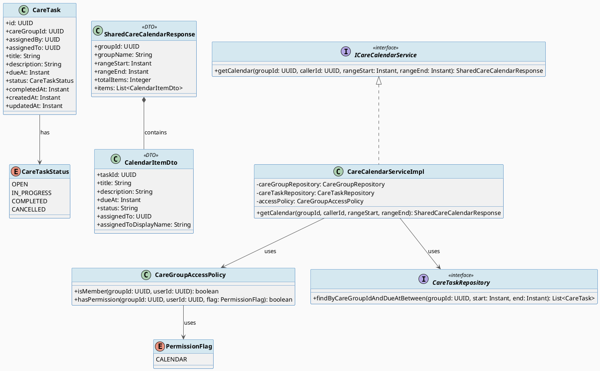
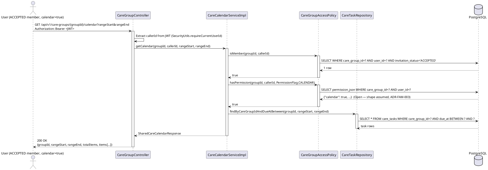
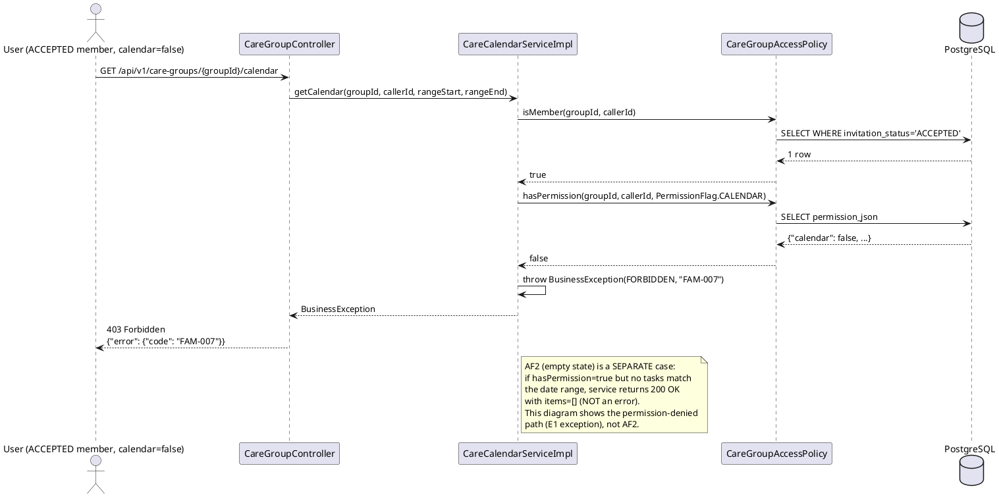

# ENGINEERING DOCUMENTATION STANDARD (EDS) v2.0
# Technical Design Specification — UC-74 View Shared Care Calendar

| Field | Value |
|-------|-------|
| **Document ID** | `CB-FAM-IMP-003` |
| **Version** | `1.0` |
| **Date** | `2026-07-02` |
| **Status** | `Draft` |
| **Document Owner** | `TV2-Bach` |
| **Author** | `AI Agent` |
| **Reviewed by** | `[Tech Lead]` |
| **DPO Sign-off** | `[ ] Pending` |
| **Approved by** | `[Principal Architect]` |
| **Last Review** | `2026-07-02` |
| **Based on EDS** | `v2.0` |

---

## CHANGELOG

> **Policy 4.4 — Immutable History:** Không bao giờ xóa thông tin cũ. Mọi thay đổi phải ghi vào bảng này.

| Ngày | Người thực hiện | Nội dung thay đổi |
|------|-----------------|-------------------|
| 2026-07-02 | AI Agent | Tạo tài liệu lần đầu cho UC-74 View Shared Care Calendar |

---

## MỤC LỤC

1. [Tổng quan Module](#1-tổng-quan-module)
2. [Ma trận Truy vết (Traceability Matrix)](#2-ma-trận-truy-vết-traceability-matrix)
3. [Architecture Decision Records (ADR)](#3-architecture-decision-records-adr)
4. [Non-Functional Requirements & SLA](#4-non-functional-requirements--sla)
5. [Static Modeling (Mô hình Tĩnh)](#5-static-modeling-mô-hình-tĩnh)
6. [Dynamic Modeling (Mô hình Động)](#6-dynamic-modeling-mô-hình-động)
7. [Domain Event Catalog](#7-domain-event-catalog)
8. [Interface Specification (Đặc tả Giao diện)](#8-interface-specification-đặc-tả-giao-diện)
9. [API Specification](#9-api-specification)
10. [Bảng mã lỗi (Error Codes)](#10-bảng-mã-lỗi-error-codes)
11. [Quy trình Triển khai (Step-by-Step)](#11-quy-trình-triển-khai-step-by-step)
12. [Rollback & Incident Runbook](#12-rollback--incident-runbook)
13. [Kịch bản Kiểm thử Chi tiết](#13-kịch-bản-kiểm-thử-chi-tiết)
14. [Phương pháp Xác minh](#14-phương-pháp-xác-minh)
15. [Mẫu thử thực tế (API Verification Samples)](#15-mẫu-thử-thực-tế-api-verification-samples)
16. [Bảng tổng hợp phân quyền (Authorization Matrix)](#16-bảng-tổng-hợp-phân-quyền-authorization-matrix)
17. [AI Prompt Constraints (CASE 2.0)](#17-ai-prompt-constraints-case-20)

---

## 1. Tổng quan Module

| Field | Value |
|-------|-------|
| **Module Name** | `ViewSharedCareCalendar` |
| **Bounded Context** | `family` |
| **UC ID** | `UC-74` |
| **SRS Reference** | `3.3.1.51`, `02_Requirements/SRS/3_Functional_Specification.md` lines 2830-2849 |
| **Primary Actor** | `User` |
| **Secondary Actors** | `None` |
| **Platform** | `Mobile App` |
| **Source group** | `Mobile App - Care Journey, Community, Health & Consultation` |
| **Priority / Frequency** | `High / Frequent` (per SRS) |
| **Sprint / Owner** | `Sprint 3 "Cross-Domain Integration"` — `TV2-Bach` (`04_Implement/implement_artifacts/function-spec-task-allocation.md` lines 476-518) |
| **Data Classification** | `PII` (task titles/descriptions may reference baby/family health context) |
| **Compliance Scope** | `BR-RBAC, BR-PRIVACY, BR-CONSULTATION, PDPA` |
| **Upstream Dependencies** | `care_groups`, `care_group_members` (incl. `permission_json`), `care_tasks` tables — written by parallel workstream UC71/UC72/UC73/UC83 |
| **Downstream Consumers** | Mobile calendar/task widgets; potentially UC84_ViewSharedData (general-purpose multi-category viewer) |

**Mô tả:** Hiển thị một danh sách/lịch (calendar-like view) các care task được chia sẻ trong một care group, lọc theo quyền hạn của người xem (permission-filtered). Đây là bản đọc (read-only), tổng hợp (aggregated) trên dữ liệu đã tồn tại — không có bảng "calendar" riêng trong schema.

**Current State vs Target State:**

| Aspect | Current State | Target State (this TDS) |
|--------|---------------|--------------------------|
| Dedicated calendar table | ❌ Does not exist — verified against `V1__init_schema.sql`, no `calendar` or `care_calendar` table | Still does not exist by design — calendar is a DERIVED read view, not a new table |
| `care_tasks` JPA entity | ❌ Not implemented in `com.carebridge.backend.family` (only DB table exists, no Java entity/repository found — verified via code search) | New `CareTask` entity + `CareTaskRepository` added (read-side only for this UC) |
| Calendar endpoint | ❌ Does not exist | New `GET /api/v1/care-groups/{groupId}/calendar` endpoint |
| Permission filtering | ❌ `permission_json` has zero consumers/producers anywhere in codebase (verified via grep across `family` package and mobile `familySync` — confirmed no references) | New `CareGroupAccessPolicy.hasPermission(groupId, userId, PermissionFlag.CALENDAR)` method, built on an **assumed, explicitly-flagged-as-Open** JSON shape |
| Mobile calendar screen | ❌ `screens/` folder has no calendar screen | New `shared_care_calendar_screen.dart` + `calendar_item_tile.dart` widget |

**CRITICAL SCOPE DECISION (Open Item — see §3 ADR-FAM-004):** UC-74 v1 scope = **`care_tasks` only** (due_at-based task list). Joining `reminders` and `vaccination_records` into the same calendar view is explicitly deferred — see ADR-FAM-004 for rationale.

---

## 2. Ma trận Truy vết (Traceability Matrix)

| Requirement ID | Loại | Mô tả | Thành phần Code | Compliance Target | ADR liên quan |
|----------------|------|-------|-----------------|-------------------|---------------|
| UC-74 | Use Case | View shared care calendar theo quyền hạn (SRS §3.3.1.51, lines 2830-2849) | `CareGroupController.getCalendar()` | BR-RBAC | ADR-FAM-003 |
| BR-RBAC | Business Rule | User chỉ truy cập chức năng được role/permission cho phép (SRS line 2847) | `CareGroupAccessPolicy.isMember()` + `hasPermission()` | BR-RBAC | ADR-FAM-003 |
| BR-PRIVACY | Business Rule | Dữ liệu gia đình/sức khỏe phải theo consent, purpose, minimum-necessary access (SRS line 2847) | Permission-flag filter trên `permission_json` | PDPA | ADR-FAM-003 |
| BR-CONSULTATION | Business Rule | Booking/payment/dispute/refund/pricing actions phải giữ auditable lifecycle state (SRS line 2847) | `care_tasks.status` lifecycle (OPEN/…); N/A for read-only view but documented per SRS text applying to UC-74 verbatim | — | Open — see §3 ADR-FAM-004 note |
| E1 (Exception) | Exception | Access denied khi unauthenticated/unauthorized/out of scope (SRS line 2837) | `CareGroupAccessPolicy` → `FAM-003`/`FAM-007` | BR-RBAC | ADR-FAM-003 |
| AF2 (Alt Flow) | Alternative Flow | No matching data → empty state (SRS line 2836) | `CareCalendarServiceImpl.getCalendar()` returns empty list, not error | — | — |
| Schema Fact | DB Constraint | `care_tasks.status` has no CHECK constraint — app-level enum decision only | `CareTaskStatus` enum (Java) | — | ADR-FAM-004 |

---

## 3. Architecture Decision Records (ADR)

### ADR-FAM-003 — Permission-filtered query design for shared calendar

| Field | Value |
|-------|-------|
| **Status** | `Proposed` |
| **Deciders** | `Tech Lead` (pending) |
| **Date** | `2026-07-02` |

#### Bối cảnh
UC-74 yêu cầu hiển thị calendar items "theo permissions" (SRS: "Displays shared calendar items and tasks according to permissions"). Bảng `care_group_members.permission_json` (jsonb) tồn tại trong schema (`V1__init_schema.sql`) nhưng **chưa có bất kỳ consumer hoặc producer nào trong codebase** (verified: grep across `family` package backend + `familySync` mobile — no references to `permission_json`, `permissionJson`, hoặc bất kỳ permission-flag enum/constant nào). Cột này thuộc sở hữu của sibling workstream **UC72_ManageFamilyPermission**, đang được thiết kế song song. TDS này không được quyền tự ý định nghĩa contract của UC72.

#### Các phương án đã xem xét

| Phương án | Mô tả | Ưu điểm | Nhược điểm |
|-----------|-------|----------|------------|
| A | Chờ UC72 hoàn thành và định nghĩa `permission_json` shape trước khi code UC-74 | An toàn, không đoán mò | Block toàn bộ Sprint 3 cross-domain work |
| B | Định nghĩa RECOMMENDED contract giả định (boolean flags theo data category), rõ ràng đánh dấu Open, và code UC-74 dựa trên đó — reconcile khi UC72 lands | Không block sprint; contract point rõ ràng | Có rủi ro rework nếu UC72 chọn shape khác |

#### Quyết định
Chọn **Phương án B**: Giả định `permission_json` có dạng boolean flags theo category, ví dụ:
```json
{"calendar": true, "tasks": true, "logs": false, "checklists": false, "alerts": true}
```
Đây là **RECOMMENDED contract assumption**, KHÔNG phải fact đã xác nhận. Integration point: `CareGroupAccessPolicy.hasPermission(groupId, userId, PermissionFlag.CALENDAR)` đọc field `"calendar"` từ `permission_json`. Nếu cột NULL hoặc thiếu key `"calendar"` → default an toàn: **deny (return false)**, cho đến khi UC72 xác nhận default policy.

#### Hệ quả

**Tích cực:**
- UC-74 có thể tiến hành thiết kế song song với UC72 mà không cần chờ.
- Contract point rõ ràng: `care_group_members.permission_json jsonb`, key `"calendar"` (boolean).

**Tiêu cực / Trade-offs:**
- **Open Item (BLOCKING before implementation):** Exact key names/shape của `permission_json` là do UC72 (sibling workstream) quyết định. Phải reconcile khi UC72 lands — có thể cần đổi tên field `hasPermission()` đọc, hoặc đổi cấu trúc jsonb (nested vs flat).
- Nếu UC72 chọn shape khác (vd: array of enum strings thay vì boolean map), `CareGroupAccessPolicy.hasPermission()` phải được viết lại.

**Compliance Impact:**
- Default-deny khi permission không rõ ràng phù hợp với BR-PRIVACY (minimum-necessary access) và PDPA.

---

### ADR-FAM-004 — On-demand query scope: care_tasks only (v1), reminders/vaccination joins deferred

| Field | Value |
|-------|-------|
| **Status** | `Proposed` |
| **Deciders** | `Tech Lead` (pending) |
| **Date** | `2026-07-02` |

#### Bối cảnh
"Shared Care Calendar" không phải là một bảng thật trong schema (verified: không có bảng `calendar`/`care_calendar` nào trong `V1__init_schema.sql` hay migrations tiếp theo). Calendar phải được tổng hợp (derive) từ:
- `care_tasks` (due_at) — có FK trực tiếp `care_group_id` → group.
- `reminders` (scheduled_at) — chỉ có `owner_user_id`/`journey_id`/`baby_id`, **KHÔNG có FK tới `care_group_id`**.
- `vaccination_records` (scheduled_date) — chỉ có `baby_id`, cũng **KHÔNG có FK trực tiếp tới `care_group_id`** (chỉ join được gián tiếp qua `care_groups.baby_id`/`linked_baby_profile_id`).

Join path duy nhất khả thi cho reminders/vaccination là `care_group → baby_id → reminders/vaccination_records`, và join này phụ thuộc vào việc `care_groups.baby_id` (hoặc `linked_baby_profile_id`) đã được populate — không đảm bảo cho mọi group. Kết hợp với việc `permission_json` shape chưa xác nhận (ADR-FAM-003), việc mở rộng join sang reminders/vaccination sẽ tạo ra một cross-table join chưa được kiểm định và permission model chưa rõ ràng.

#### Các phương án đã xem xét

| Phương án | Mô tả | Ưu điểm | Nhược điểm |
|-----------|-------|----------|------------|
| A | v1 = chỉ `care_tasks` (due_at-based); reminders/vaccination join = Phase 2 | An toàn, scope rõ ràng, không phụ thuộc `baby_id` optional | Calendar "thiếu" reminder/vaccination items trong v1 |
| B | v1 = join cả 3 bảng ngay | Đầy đủ hơn cho user | Rủi ro cao: join path phụ thuộc dữ liệu optional (`baby_id`), permission model chưa rõ, không có test coverage cho join logic |
| C | Materialized view thay vì on-demand query | Tối ưu performance nếu volume lớn | Không cần thiết ở v1 (volume thấp), không có caching layer sẵn có trong hệ thống, thêm complexity vận hành |

#### Quyết định
Chọn **Phương án A** kết hợp với **on-demand query** (không phải Phương án C — không tạo materialized view). v1 = `care_tasks` filtered by `care_group_id` + `due_at`, query trực tiếp mỗi request. Reminders/vaccination join là **Open Item — cần quyết định product/architecture riêng**, không silently implement trong TDS này.

#### Hệ quả

**Tích cực:**
- Scope rõ ràng, không phụ thuộc vào dữ liệu optional (`baby_id`) hoặc contract chưa xác nhận.
- On-demand query phù hợp với volume thấp dự kiến ở v1; không cần invalidation logic của materialized view.

**Tiêu cực / Trade-offs:**
- Calendar view "chưa đầy đủ" — không hiển thị reminders/vaccination schedule cùng lúc. Cần communicate rõ với product/UX.
- **Open Item:** Quyết định có mở rộng join sang reminders/vaccination trong Phase 2 hay không, và permission model cho các category đó, cần được sibling UC72 + product xác nhận.

**Compliance Impact:**
- Không phát sinh thêm rủi ro PDPA vì phạm vi dữ liệu hẹp hơn (chỉ care_tasks).

---

### ADR-FAM-005 — Relationship to UC84_ViewSharedData (superset use case)

| Field | Value |
|-------|-------|
| **Status** | `Proposed` |
| **Deciders** | `Tech Lead` (pending) |
| **Date** | `2026-07-02` |

#### Bối cảnh
UC84_ViewSharedData (đang được thiết kế song song bởi agent khác — KHÔNG available cho TDS này) là use case tổng quát hơn: "Displays shared calendar, logs, checklists, or alerts according to granted permissions" (actor: Family Member, secondary actor: Firebase Cloud Messaging). UC-74 là bản calendar/task-specific (actor: User, có BR-CONSULTATION). Có khả năng trùng lặp scope giữa calendar output của UC-74 và calendar category của UC84.

#### Quyết định
KHÔNG merge hai use case. Giữ UC-74 là artifact riêng biệt, chỉ cross-reference. **Đề xuất (Open Item, không phải quyết định cuối):** UC-74's endpoint nên được reuse/là một specialization filtered của UC84's underlying query engine để tránh duplicate implementation, HOẶC UC84 delegate calendar category của nó cho UC-74's service. Quyết định merge/delegation cụ thể được **defer đến implementation-time architecture review** khi cả hai TDS đã Approved.

#### Hệ quả
**Tích cực:** Tránh việc một agent tự ý quyết định kiến trúc thay cho sibling workstream.
**Tiêu cực / Trade-offs:** Có khả năng có 2 endpoint tương tự nhau tạm thời (`/care-groups/{id}/calendar` từ UC-74 và một endpoint tổng quát hơn từ UC84) cho đến khi được reconcile.

---

## 4. Non-Functional Requirements & SLA

### 4.1. Performance & Availability

| Category | Requirement | Target SLA | Measurement Method | Compliance Basis |
|----------|-------------|------------|---------------------|------------------|
| Latency | API response (p99) | `< 300ms` | k6 load test | Consistent with similar read endpoints (UC-216: `<200ms`; calendar aggregation slightly heavier, so `<300ms`) |
| Availability | Uptime (monthly) | `99.9%` | Uptime monitor | — |
| Result size | Max tasks returned per request | 100 tasks (paginate/filter by date range if exceeded) | Product requirement — Open if not confirmed | Open |

### 4.2. Data Integrity & Retention

| Category | Requirement | Target | Verification Method | Compliance Basis |
|----------|-------------|--------|---------------------|------------------|
| Durability | Read-only endpoint, no write | N/A | — | — |
| Retention | Care group / task audit trail | 7 năm (theo pattern UC216/UC70) | DB backup | PDPA |

### 4.3. Security

| Category | Requirement | Target | Verification Method | Compliance Basis |
|----------|-------------|--------|---------------------|------------------|
| Access control | ACCEPTED-member-only + calendar permission flag | 100% | Auth Matrix §16 | BR-RBAC |
| PII minimization | Task title/description shown only to authorized members | 100% | Response schema review | BR-PRIVACY |

### 4.4. Scalability & Capacity Planning

Dự kiến tải v1 thấp (calendar aggregation on-demand, không cần caching layer — hệ thống hiện chưa có Redis/cache cho module family). Nếu volume tăng đáng kể ở Phase 2 (khi mở rộng join reminders/vaccination), cân nhắc lại Phương án C (materialized view) trong ADR-FAM-004 — hiện tại **không** áp dụng.

---

## 5. Static Modeling (Mô hình Tĩnh)

### 5.1. Class Diagram (PlantUML)



### 5.2. Data Structure (Flyway SQL Migration)

> **CareBridge rule:** `V1__init_schema.sql` là nguồn sự thật (source of truth) duy nhất cho DB structure. ERD chỉ là supporting context.

**NO NEW MIGRATION REQUIRED** — UC-74 là read-only aggregation trên bảng `care_tasks` đã tồn tại trong `V1__init_schema.sql`:

```sql
-- Reference — ALREADY EXISTS in V1__init_schema.sql (no changes needed)
-- CREATE TABLE public.care_tasks (
--     care_task_id uuid NOT NULL DEFAULT gen_random_uuid(),
--     care_group_id uuid NOT NULL,
--     assigned_by uuid,
--     assigned_to uuid,
--     title varchar(255) NOT NULL,
--     description text,
--     due_at timestamptz,
--     status varchar(20) NOT NULL DEFAULT 'OPEN',   -- no CHECK constraint (verified)
--     completed_at timestamptz,
--     created_at timestamptz NOT NULL DEFAULT now(),
--     updated_at timestamptz NOT NULL DEFAULT now()
-- );
-- idx_care_tasks_status already exists per schema comment

-- Query pattern used by CareTaskRepository:
SELECT ct.care_task_id, ct.care_group_id, ct.assigned_by, ct.assigned_to,
       ct.title, ct.description, ct.due_at, ct.status, ct.completed_at
FROM care_tasks ct
WHERE ct.care_group_id = :groupId
  AND ct.due_at BETWEEN :rangeStart AND :rangeEnd
ORDER BY ct.due_at ASC;
```

**Open Item (schema, not v1 scope):** If Phase 2 decides to join `reminders`/`vaccination_records` into the calendar, a new Flyway migration MAY be required to add `care_group_id` FK columns to those tables (they currently only have `owner_user_id`/`journey_id`/`baby_id` and `baby_id` respectively — no direct FK to `care_group_id`). This is **NOT proposed in v1** — recorded here only as a forward-looking Open Item. If pursued, next available migration version is `V20260702100000` (per numbering convention reserved for this workstream), incrementing by `00100`.

**V1__init_schema.sql sync action:** None required — no schema change in this TDS.

---

## 6. Dynamic Modeling (Mô hình Động)

### 6.1. Sequence Diagram — Happy Path, Permission Granted (PlantUML)



### 6.2. Sequence Diagram — Alternative Path, No Permission / Empty (PlantUML)



### 6.3. State Machine

> Không applicable trực tiếp cho UC-74 (read-only view không thay đổi state). `CareTaskStatus` state machine thuộc scope của UC73_AssignFamilyTask (write-side, sibling workstream) — không được định nghĩa lại ở đây để tránh xung đột ownership. UC-74 chỉ ĐỌC giá trị `status` hiện có, hiển thị nguyên văn (pass-through), không transition state.

**Invariant:** UC-74 KHÔNG BAO GIỜ ghi (INSERT/UPDATE/DELETE) vào `care_tasks` — read-only.

---

## 7. Domain Event Catalog

### 7.1. Events Published (Phát ra)

| Event Name | Trigger | Publisher | Subscriber(s) | Payload Schema | Async? |
|------------|---------|-----------|---------------|-----------------|--------|
| — | Read-only endpoint — không phát sự kiện | — | — | — | — |

### 7.2. Events Consumed (Tiêu thụ)

| Event Name | Source | Handler | Action thực hiện |
|------------|--------|---------|------------------|
| — | — | — | UC-74 không consume event trực tiếp nào ở v1. |

**Open Item:** UC-74 phụ thuộc gián tiếp vào dữ liệu được ghi bởi sibling events tương lai (chưa có event contract nào được định nghĩa cho các workstream này tại thời điểm viết TDS này):
- `MemberPermissionUpdated` (từ UC72_ManageFamilyPermission) — sẽ ảnh hưởng đến kết quả `hasPermission()` check ở lần request tiếp theo. Vì UC-74 là on-demand query (ADR-FAM-004), KHÔNG cần cache invalidation — mỗi request đọc `permission_json` mới nhất.
- `TaskAssigned`/`TaskUpdated` (từ UC73_AssignFamilyTask) — tương tự, on-demand query tự động phản ánh thay đổi mới nhất, không cần event handler.

Vì kiến trúc on-demand (không cache), UC-74 không cần đăng ký consumer cho các event này — nhưng ghi nhận ở đây để traceability cho sibling teams.

### 7.3. Payload Schema

Không áp dụng — UC-74 không publish event nào ở v1.

---

## 8. Interface Specification (Đặc tả Giao diện)

> **Policy (EDS v2.0):** Mỗi interface phải khai báo `@version`.

### 8.1. Service Interface

```java
// GetSharedCalendarRequest.java — Input (query params, not request body since GET)
// @version 1.0
public class GetSharedCalendarRequest {
    private UUID groupId;        // path variable
    private Instant rangeStart;  // optional query param — defaults to now() if absent (Open: exact default policy TBD)
    private Instant rangeEnd;    // optional query param — defaults to now()+30 days if absent (Open: exact default policy TBD)
}

// CalendarItemDto.java — Output DTO
public class CalendarItemDto {
    private UUID taskId;               // care_tasks.care_task_id
    private String title;              // care_tasks.title
    private String description;        // care_tasks.description
    private Instant dueAt;             // care_tasks.due_at
    private String status;             // care_tasks.status (pass-through, app-level enum — see CareTaskStatus Open Item)
    private UUID assignedTo;           // care_tasks.assigned_to
    private String assignedToDisplayName; // resolved from accounts table — NOT raw PII beyond display name (BR-PRIVACY pattern from UC-216)
    // getters / setters
}

// SharedCareCalendarResponse.java — Output DTO
public class SharedCareCalendarResponse {
    private UUID groupId;
    private String groupName;
    private Instant rangeStart;
    private Instant rangeEnd;
    private Integer totalItems;
    private List<CalendarItemDto> items;
    // getters / setters
}

// ICareCalendarService.java — Service Contract
// @version 1.0
public interface ICareCalendarService {
    /**
     * Lấy danh sách care task trong khoảng thời gian, filtered theo quyền hạn của caller.
     * @throws BusinessException (FAM-005, 404) khi group không tồn tại
     * @throws BusinessException (FAM-003, 403) khi caller không phải ACCEPTED member
     * @throws BusinessException (FAM-007, 403) khi caller là ACCEPTED member nhưng
     *         permission_json không cho phép xem calendar (calendar flag = false hoặc thiếu)
     */
    SharedCareCalendarResponse getCalendar(UUID groupId, UUID callerId, Instant rangeStart, Instant rangeEnd);
}
```

### 8.2. Repository Interface

```java
// CareTaskRepository.java
// @version 1.0
public interface CareTaskRepository extends JpaRepository<CareTask, UUID> {

    List<CareTask> findByCareGroupIdAndDueAtBetween(
        UUID careGroupId, Instant rangeStart, Instant rangeEnd
    );

    // Read-only for UC-74 — no save/delete methods added by this TDS.
    // Write-side methods (create/assign/update status) belong to UC73's TDS (sibling workstream, not defined here).
}
```

### 8.3. CareGroupAccessPolicy Extension

```java
// CareGroupAccessPolicy.java — EXTENDING existing class from UC216 (ADR-FAM-002)
// @version 1.1
// @breaking-change none — additive method only
public class CareGroupAccessPolicy {

    // EXISTING (from UC216) — unchanged
    public boolean isMember(UUID groupId, UUID userId) { /* existing impl */ }

    // NEW for UC-74
    /**
     * Checks permission_json flag for a specific data category.
     * @implNote Open — permission_json shape is OWNED by sibling UC72_ManageFamilyPermission.
     *           This method assumes a boolean map keyed by category name (ADR-FAM-003).
     *           MUST be reconciled when UC72 lands.
     * Default behavior when permission_json is NULL or key missing: return false (deny).
     */
    public boolean hasPermission(UUID groupId, UUID userId, PermissionFlag flag) { /* to be implemented */ }
}

// PermissionFlag.java — NEW enum
// @version 1.0
public enum PermissionFlag {
    CALENDAR
    // Other values (TASKS, LOGS, CHECKLISTS, ALERTS) reserved for UC72/UC84 —
    // NOT defined here to avoid inventing sibling workstream's contract.
}
```

---

## 9. API Specification

### 9.1. Endpoints Table

| Method | Path | Auth Level | Required Roles | Rate Limit | Idempotent? |
|--------|------|------------|-----------------|------------|-------------|
| `GET` | `/api/v1/care-groups/{groupId}/calendar` | JWT Bearer | Any authenticated role (`isAuthenticated()` — actor is generic `User` per SRS, not role-restricted like UC70's `MOTHER`) | 60/min | Yes |

> **Naming Note (Open Item, ADR-FAM-005):** This path may later be superseded/aliased by UC84_ViewSharedData's general-purpose endpoint (e.g., `/api/v1/care-groups/{groupId}/shared-data?category=calendar`). Not renamed here to avoid pre-empting the sibling agent's design.

### 9.2. Request / Response Schemas

#### `GET /api/v1/care-groups/{groupId}/calendar?rangeStart={ISO8601}&rangeEnd={ISO8601}`

**Response — 200 OK (Happy Path):**
```json
{
  "success": true,
  "data": {
    "groupId": "550e8400-e29b-41d4-a716-446655440000",
    "groupName": "My Pregnancy Team",
    "rangeStart": "2026-07-01T00:00:00.000Z",
    "rangeEnd": "2026-07-31T23:59:59.000Z",
    "totalItems": 2,
    "items": [
      {
        "taskId": "task-uuid-1",
        "title": "Vaccination reminder call",
        "description": "Call clinic to confirm dose 2 slot",
        "dueAt": "2026-07-05T09:00:00.000Z",
        "status": "OPEN",
        "assignedTo": "account-uuid-1",
        "assignedToDisplayName": "Nguyen Thi A"
      },
      {
        "taskId": "task-uuid-2",
        "title": "Buy prenatal vitamins",
        "description": null,
        "dueAt": "2026-07-10T00:00:00.000Z",
        "status": "OPEN",
        "assignedTo": "account-uuid-2",
        "assignedToDisplayName": "Tran Van B"
      }
    ]
  }
}
```

**Response — 200 OK (Empty State, AF2):**
```json
{
  "success": true,
  "data": {
    "groupId": "550e8400-e29b-41d4-a716-446655440000",
    "groupName": "My Pregnancy Team",
    "rangeStart": "2026-08-01T00:00:00.000Z",
    "rangeEnd": "2026-08-31T23:59:59.000Z",
    "totalItems": 0,
    "items": []
  }
}
```

**Response — 403 Forbidden (Not a member — E1):**
```json
{
  "error": {
    "code": "FAM-003",
    "message": "You are not an accepted member of this group"
  }
}
```

**Response — 403 Forbidden (Member but no calendar permission — E1):**
```json
{
  "error": {
    "code": "FAM-007",
    "message": "You do not have permission to view this group's calendar"
  }
}
```

**Response — 404 Not Found:**
```json
{
  "error": {
    "code": "FAM-005",
    "message": "Care group not found"
  }
}
```

---

## 10. Bảng mã lỗi (Error Codes)

> Tiếp tục prefix `FAM-` đã dùng (FAM-002, FAM-003, FAM-005, FAM-006 confirmed used bởi UC70/UC216). UC-74 dùng `FAM-007` (mới, không trùng).

| Code | HTTP Status | Message (EN) | Message (VI) | Trigger Condition |
|------|-------------|--------------|--------------|-------------------|
| `FAM-003` | 403 | Not a group member | Không phải thành viên của nhóm | Caller không có `invitation_status=ACCEPTED` (reused from UC-216) |
| `FAM-005` | 404 | Care group not found | Không tìm thấy nhóm | `groupId` không tồn tại trong DB (reused from UC-216) |
| `FAM-007` | 403 | Calendar permission denied | Không đủ quyền xem lịch chia sẻ | Caller là ACCEPTED member nhưng `permission_json.calendar` = false hoặc key thiếu (NEW — UC-74) |
| `FAM-006` | 500 | Internal error | Lỗi hệ thống | Lỗi DB không xác định (reused from UC-216) |

---

## 11. Quy trình Triển khai (Step-by-Step)

### 11.1. Prerequisites

- [ ] `care_tasks` table đã tồn tại trong DB (đã xác nhận, `V1__init_schema.sql`)
- [ ] `CareGroupAccessPolicy.isMember()` đã tồn tại (từ UC-216, ADR-FAM-002) — reuse nguyên trạng
- [ ] JWT filter đã configured trong Spring Security (đã tồn tại)
- [ ] **Blocking dependency (Open Item):** `permission_json` shape từ UC72 nên được reconcile trước khi implement `hasPermission()` production-ready — có thể implement với assumed shape (ADR-FAM-003) trước, nhưng phải re-verify khi UC72 lands
- [ ] Không cần migration mới cho UC-74

### 11.2. Pre-Migration Checklist

Không áp dụng — UC-74 không có migration mới (read-only aggregation).

### 11.3. Implementation Steps

#### Chặng 1 — Tạo `CareTask` JPA entity + `CareTaskStatus` enum (mới, chưa tồn tại trong code)

Planned file paths:
```
src/main/java/com/carebridge/backend/family/entity/CareTask.java
src/main/java/com/carebridge/backend/family/entity/CareTaskStatus.java
```

```java
@Entity
@Table(name = "care_tasks")
public class CareTask {
    @Id
    @GeneratedValue(strategy = GenerationType.UUID)
    @Column(name = "care_task_id", updatable = false, nullable = false)
    private UUID id;

    @Column(name = "care_group_id", nullable = false)
    private UUID careGroupId;

    @Column(name = "assigned_by")
    private UUID assignedBy;

    @Column(name = "assigned_to")
    private UUID assignedTo;

    @Column(name = "title", nullable = false, length = 255)
    private String title;

    @Column(name = "description")
    private String description;

    @Column(name = "due_at")
    private Instant dueAt;

    // Open: status stored as varchar(20) in DB, no CHECK constraint.
    // Mapped as String (not @Enumerated) here to avoid inventing an
    // authoritative enum that conflicts with UC73/UC85 write-side decisions.
    @Column(name = "status", nullable = false, length = 20)
    private String status;

    @Column(name = "completed_at")
    private Instant completedAt;
    // createdAt / updatedAt per existing pattern
}
```

#### Chặng 2 — Tạo `CareTaskRepository`

```
src/main/java/com/carebridge/backend/family/repository/CareTaskRepository.java
```

```java
public interface CareTaskRepository extends JpaRepository<CareTask, UUID> {
    List<CareTask> findByCareGroupIdAndDueAtBetween(UUID careGroupId, Instant rangeStart, Instant rangeEnd);
}
```

#### Chặng 3 — Mở rộng `CareGroupAccessPolicy` (nếu class đã tồn tại — verify path trước khi implement)

```
src/main/java/com/carebridge/backend/family/policy/CareGroupAccessPolicy.java  (assumed path — verify actual location at implementation time; UC-216 TDS reused this class but exact package not confirmed in this research pass)
src/main/java/com/carebridge/backend/family/entity/PermissionFlag.java  (new enum)
```

```java
public boolean hasPermission(UUID groupId, UUID userId, PermissionFlag flag) {
    // Read permission_json for (groupId, userId), default deny if null/missing key
    // Exact JSON parsing approach TBD — Open Item pending UC72 contract
}
```

#### Chặng 4 — Tạo DTOs

```
src/main/java/com/carebridge/backend/family/dto/CalendarItemDto.java
src/main/java/com/carebridge/backend/family/dto/SharedCareCalendarResponse.java
```

#### Chặng 5 — Tạo `ICareCalendarService` / `CareCalendarServiceImpl`

```
src/main/java/com/carebridge/backend/family/service/ICareCalendarService.java
src/main/java/com/carebridge/backend/family/service/impl/CareCalendarServiceImpl.java
```

#### Chặng 6 — Thêm endpoint vào `CareGroupController` (reuse existing controller, add new method)

```java
// Added to existing CareGroupController.java
@GetMapping("/{groupId}/calendar")
@PreAuthorize("isAuthenticated()")
public ResponseEntity<ApiResponse<SharedCareCalendarResponse>> getCalendar(
        @PathVariable UUID groupId,
        @RequestParam(required = false) Instant rangeStart,
        @RequestParam(required = false) Instant rangeEnd,
        Principal principal) {
    var callerId = SecurityUtils.requireCurrentUserId(principal);
    var response = careCalendarService.getCalendar(groupId, callerId, rangeStart, rangeEnd);
    return ResponseEntity.ok(ApiResponse.success(response));
}
```

#### Chặng 7 — Mobile: service method + model + screen + widget

```
lib/features/familySync/services/care_group_service.dart   (add getSharedCalendar() method)
lib/features/familySync/models/care_calendar_model.dart      (new model file)
lib/features/familySync/screens/shared_care_calendar_screen.dart  (new screen)
lib/features/familySync/widgets/calendar_item_tile.dart      (new widget)
```

```dart
// Added to care_group_service.dart, following existing apiGet convention
Future<Map<String, dynamic>> getSharedCalendar(String groupId, {DateTime? rangeStart, DateTime? rangeEnd}) async {
  final query = <String, String>{};
  if (rangeStart != null) query['rangeStart'] = rangeStart.toIso8601String();
  if (rangeEnd != null) query['rangeEnd'] = rangeEnd.toIso8601String();
  final data = await apiGet('/api/v1/care-groups/$groupId/calendar', query: query);
  return data['data'] as Map<String, dynamic>;
}
```

#### Chặng 8 — Verification sau deploy

```bash
curl -X GET https://[host]/api/v1/health
# Expected: {"status": "ok"}
```

### 11.4. Deployment Checklist

- [ ] Health check endpoint trả về 200
- [ ] Không có migration mới cần chạy
- [ ] `hasPermission()` default-deny khi `permission_json` NULL — verify với test case
- [ ] Thử GET với PENDING invitee → 403 FAM-003
- [ ] Thử GET với ACCEPTED member, calendar=false → 403 FAM-007
- [ ] Thử GET với date range không có task nào → 200 empty list (AF2)

---

## 12. Rollback & Incident Runbook

### 12.1. Điều kiện kích hoạt Rollback

| Điều kiện | Ngưỡng | Người quyết định |
|-----------|--------|------------------|
| Error rate tăng đột biến | > 5% trong 5 phút | On-call Engineer |
| Latency p99 vượt ngưỡng | > 600ms (2x baseline) | On-call Engineer |
| Permission filter bypass (member thấy calendar dù calendar=false) | Bất kỳ case nào | Tech Lead + DPO |

### 12.2. Rollback Procedure

Không có DB migration cho UC-74 → rollback chỉ cần revert code:

```bash
# Bước 1: Re-deploy phiên bản cũ
kubectl rollout undo deployment/carebridge-api

# Bước 2: Verify rollback thành công
kubectl rollout status deployment/carebridge-api
curl -X GET https://[host]/api/v1/health

# Bước 3: Smoke test
curl -X GET https://[host]/api/v1/care-groups/{groupId}/calendar \
  -H "Authorization: Bearer <valid_member_token>"
# Expected: 200 OK hoặc trước-rollback 404 nếu endpoint chưa tồn tại ở bản cũ
```

### 12.3. Notification Protocol

| Thời điểm | Người nhận | Kênh | Template |
|-----------|------------|------|----------|
| Ngay khi phát hiện | On-call team | Slack `#incident` | "🚨 UC-74 incident: [mô tả]" |
| Nếu permission bypass phát hiện | DPO | Email | Bắt buộc — PDPA |

### 12.4. Post-Incident Review (PIR)

> Bắt buộc hoàn thành trong vòng 48 giờ sau khi resolve incident.

- **Timeline:** Diễn biến chi tiết
- **Root Cause:** 5 Whys analysis
- **Impact:** Số users bị ảnh hưởng, có permission bypass không?
- **Prevention:** Action items để tránh tái diễn

---

## 13. Kịch bản Kiểm thử Chi tiết

> Chi tiết đầy đủ nằm trong Test-Spec (`UC74_ViewSharedCareCalendar_Test-Spec.md`). Section này chỉ tóm tắt scenario nhóm.

### 13.1. Unit Tests (summary — see Test-Spec §4 for full TCs)

- ACCEPTED member + calendar=true → 200 with tasks in range
- ACCEPTED member + calendar=false → 403 FAM-007
- PENDING/REVOKED member → 403 FAM-003
- No tasks in range → 200 empty list (AF2)
- Group not found → 404 FAM-005
- `permission_json` NULL → default-deny (403 FAM-007)

### 13.2. Integration Tests (summary)

- Service + Repository + DB coordination: verify `findByCareGroupIdAndDueAtBetween` query bounds

### 13.3. E2E / Security Tests (summary)

- Full API flow with valid JWT → 200
- No JWT → 401
- Cross-group access attempt (member of group A tries group B's calendar) → 403

---

## 14. Phương pháp Xác minh

### 14.1. Database Inspection

```sql
-- Verify task exists in expected range
SELECT care_task_id, care_group_id, due_at, status
FROM care_tasks
WHERE care_group_id = '<groupId>'
  AND due_at BETWEEN '<rangeStart>' AND '<rangeEnd>'
ORDER BY due_at ASC;

-- Verify permission_json shape (informational — shape not yet confirmed)
SELECT user_id, permission_json
FROM care_group_members
WHERE care_group_id = '<groupId>';
```

### 14.2. Log / Audit Verification

```bash
# Verify access denial logs contain FAM-007 (permission denied), not silent bypass
kubectl logs -l app=carebridge-api | grep "FAM-007" | head -5

# Verify no PII leak (task description could contain sensitive family notes)
kubectl logs -l app=carebridge-api | grep -i "description.*:" 
# Expected: task descriptions should not appear in plaintext logs
```

### 14.3. Tool-based Verification

```bash
# Verify JWT claims
echo "<JWT_TOKEN>" | cut -d'.' -f2 | base64 -d | jq '.sub, .roles'

# Verify TLS
openssl s_client -connect [host]:443 -tls1_3 2>&1 | grep "Protocol"
```

---

## 15. Mẫu thử thực tế (API Verification Samples)

### 15.1. Happy Path

```bash
curl -X GET "https://[host]/api/v1/care-groups/CG-001/calendar?rangeStart=2026-07-01T00:00:00Z&rangeEnd=2026-07-31T23:59:59Z" \
  -H "Authorization: Bearer <ACCEPTED_MEMBER_CALENDAR_TRUE_JWT>" \
  -H "X-Correlation-Id: $(uuidgen)"
```

**Expected Response (200):**
```json
{
  "success": true,
  "data": {
    "groupId": "CG-001",
    "groupName": "My Pregnancy Team",
    "rangeStart": "2026-07-01T00:00:00.000Z",
    "rangeEnd": "2026-07-31T23:59:59.000Z",
    "totalItems": 1,
    "items": [
      {
        "taskId": "task-uuid-1",
        "title": "Vaccination reminder call",
        "description": "Call clinic to confirm dose 2 slot",
        "dueAt": "2026-07-05T09:00:00.000Z",
        "status": "OPEN",
        "assignedTo": "account-uuid-1",
        "assignedToDisplayName": "Nguyen Thi A"
      }
    ]
  }
}
```

### 15.2. Error Paths

```bash
# ACCEPTED member but calendar permission = false → 403 FAM-007
curl -X GET "https://[host]/api/v1/care-groups/CG-001/calendar" \
  -H "Authorization: Bearer <ACCEPTED_MEMBER_CALENDAR_FALSE_JWT>"
```

**Expected Response (403):**
```json
{
  "error": {
    "code": "FAM-007",
    "message": "You do not have permission to view this group's calendar"
  }
}
```

```bash
# Non-member → 403 FAM-003
curl -X GET "https://[host]/api/v1/care-groups/CG-001/calendar" \
  -H "Authorization: Bearer <NON_MEMBER_JWT>"
```

**Expected Response (403):**
```json
{
  "error": {
    "code": "FAM-003",
    "message": "You are not an accepted member of this group"
  }
}
```

```bash
# Group not found → 404 FAM-005
curl -X GET "https://[host]/api/v1/care-groups/NONEXISTENT/calendar" \
  -H "Authorization: Bearer <VALID_JWT>"
```

**Expected Response (404):**
```json
{
  "error": {
    "code": "FAM-005",
    "message": "Care group not found"
  }
}
```

---

## 16. Bảng tổng hợp phân quyền (Authorization Matrix)

> Nguyên tắc **Least Privilege**. **Decision (Open — justified below):** ACCEPTED member + calendar=false → **403 Forbidden** (NOT empty result). Rationale: consistent with UC-216's ADR-FAM-002 pattern (deny access rather than silently show empty data, to make permission-denial explicit and auditable) — but this is a recommendation, not confirmed by UC72; **flagged as Open for reconciliation.**

| Endpoint | `GUEST` | `Member (PENDING)` | `Member (REVOKED)` | `Member (ACCEPTED, calendar=true)` | `Member (ACCEPTED, calendar=false)` | `ADMIN` |
|----------|---------|---------------------|----------------------|--------------------------------------|-----------------------------------------|---------|
| `GET /api/v1/care-groups/:id/calendar` | ❌ 401 | ❌ 403 FAM-003 | ❌ 403 FAM-003 | ✅ 200 (own group) | ❌ 403 FAM-007 (Open — see rationale above) | ✅ All (assumed — Open, not explicitly scoped by SRS) |

**Chú thích:**
- ✅ = Được phép
- ❌ = Bị từ chối
- `Own group` = Chỉ group mà họ là ACCEPTED member
- **Open Item:** ADMIN/SYSTEM_ADMIN bypass of `hasPermission()` check is NOT confirmed by any source — recorded as assumed-but-unconfirmed. Must be verified against BR-RBAC's actual role hierarchy before implementation.

---

## 17. AI Prompt Constraints (CASE 2.0)

### 17.1 Constraint Summary Table

| # | Constraint | Source (ADR/BR) | Last Verified |
|---|-----------|-----------------|---------------|
| C1 | `getCalendar()` PHẢI check `isMember()` (ACCEPTED status) TRƯỚC KHI check `hasPermission()` — hai bước riêng biệt, không gộp | ADR-FAM-002, ADR-FAM-003 | 2026-07-02 |
| C2 | `hasPermission()` PHẢI default-deny (`return false`) khi `permission_json` là NULL hoặc thiếu key `"calendar"` — KHÔNG default-allow | ADR-FAM-003 | 2026-07-02 |
| C3 | Query PHẢI dùng `care_tasks.care_group_id` trực tiếp — KHÔNG join `reminders`/`vaccination_records` trong v1 (Open Item, deferred to Phase 2) | ADR-FAM-004 | 2026-07-02 |
| C4 | `callerId` lấy từ JWT SecurityContext (`SecurityUtils.requireCurrentUserId`) — KHÔNG từ URL path hay request body | BR-RBAC | 2026-07-02 |
| C5 | Read-only endpoint — KHÔNG có side effects, KHÔNG ghi/update `care_tasks`, KHÔNG emit domain event | — | 2026-07-02 |
| C6 | Khi không có task nào trong range → trả về `200 OK` với `items: []` (AF2 empty state) — KHÔNG trả về 404 | SRS AF2 (line 2836) | 2026-07-02 |
| C7 | `permission_json` shape trong code PHẢI đánh dấu comment `Open — owned by UC72` — KHÔNG assume nó là final contract | ADR-FAM-003 | 2026-07-02 |

### 17.2 Constraint Injection Block (Copy-Paste vào AI Prompt)

```
[CONSTRAINT BLOCK — Module: ViewSharedCareCalendar (CB-FAM-IMP-003)]
Theo TDS CB-FAM-IMP-003 và các ADR liên quan:

1. (C1 — ADR-FAM-002/003) getCalendar() phải check isMember() TRƯỚC, sau đó hasPermission() riêng biệt — hai lỗi khác nhau (FAM-003 vs FAM-007).
2. (C2 — ADR-FAM-003) hasPermission() default-deny khi permission_json NULL/thiếu key "calendar".
3. (C3 — ADR-FAM-004) KHÔNG join reminders/vaccination_records trong v1 — chỉ care_tasks.
4. (C4 — BR-RBAC) callerId lấy từ SecurityUtils.requireCurrentUserId(principal), không từ URL/body.
5. (C5) Read-only — không ghi DB, không emit event.
6. (C6 — SRS AF2) Empty result → 200 OK với items=[], không phải 404.
7. (C7 — ADR-FAM-003) permission_json parsing code phải có comment "Open — owned by UC72" để tránh assume shape là final.

[CONTEXT BLOCK]
- Bounded Context: family
- Data Classification: PII
- Compliance: BR-RBAC, BR-PRIVACY, BR-CONSULTATION, PDPA
- Existing interfaces: §8 Service Interface + Repository Interface + CareGroupAccessPolicy Extension
- Error codes: FAM-003 (403), FAM-005 (404), FAM-007 (403, NEW), FAM-006 (500)
- Auth matrix: §16

[TASK BLOCK]
Implement CareCalendarServiceImpl.getCalendar() và CareGroupAccessPolicy.hasPermission() thỏa mãn constraints trên.
Output phải tuân thủ §8 Interface Specification.
Tests phải cover §13 Test Scenarios (chi tiết trong Test-Spec).
```

### 17.3 Constraint Quality Checklist

- [x] Mỗi constraint traceable về ADR hoặc BR cụ thể
- [x] Không có constraint generic
- [x] Mỗi constraint có `Last Verified` date
- [x] Constraint block có ≥ 5 constraints cụ thể (7 constraints)
- [x] Constraint block reference §8 Interface
- [x] Constraint block reference §16 Auth Matrix

### 17.4 Anti-Pattern Detection (cho AI-Generated Code từ Block này)

| AP-ID | Anti-Pattern | Dấu hiệu | Hành động |
|-------|-------------|-----------|----------|
| AP-AI-001 | Unconstrained Gen | Code không phân biệt isMember() vs hasPermission() thành 2 lỗi khác nhau | Reject — inject lại C1 |
| AP-AI-003 | Implicit Decision | Code tự ý assume `permission_json` shape mà không comment "Open" | Reject — inject lại C7 |
| AP-AI-003b | Implicit Decision | Code tự ý join `reminders`/`vaccination_records` vào query mà không có ADR mới | Reject — vi phạm C3/ADR-FAM-004 |
| AP-AI-005 | Hallucinated Contract | Code import service/type không có trong §8 (vd: tự bịa `IReminderService`) | Reject — verify contract existence |

---

## PHỤ LỤC

### A. Glossary (Thuật ngữ)

| Thuật ngữ | Định nghĩa |
|-----------|------------|
| Care Group | Nhóm gia đình gồm mẹ và các thành viên hỗ trợ |
| Care Task | Một task được assign trong care group, có due_at, status, assigned_to |
| Shared Care Calendar | View tổng hợp (derived) các care task theo due_at, filtered theo quyền hạn — KHÔNG phải bảng DB riêng |
| `permission_json` | Cột jsonb trên `care_group_members`, owned bởi UC72, shape hiện chưa xác nhận |
| PII | Personally Identifiable Information |
| Least Privilege | Nguyên tắc cấp quyền tối thiểu cần thiết |
| Open Item | Quyết định chưa được xác nhận, cần product/architecture review trước khi implement production-ready |

### B. Tài liệu tham chiếu

| Document | Link / Path |
|----------|-------------|
| SRS UC-74 | `02_Requirements/SRS/3_Functional_Specification.md` §3.3.1.51 (lines 2830-2849) |
| Task Allocation | `04_Implement/implement_artifacts/function-spec-task-allocation.md` lines 476-518 |
| UC216 TDS (reference pattern) | `04_Implement/UC216_ViewCareGroupMembers/UC216_ViewCareGroupMembers_TDS.md` |
| V1 Schema | `05_Development/CareBridgeAPI/src/main/resources/db/migration/V1__init_schema.sql` |
| EDS v2.0 Template | `08_References/Template/PHASE-3_TDS.md` |
| UC84_ViewSharedData (sibling, not available) | Cross-referenced only — not read |

---

*EDS v2.1 — Tích hợp CASE 2.0 AI Prompt Constraints (§17).*
