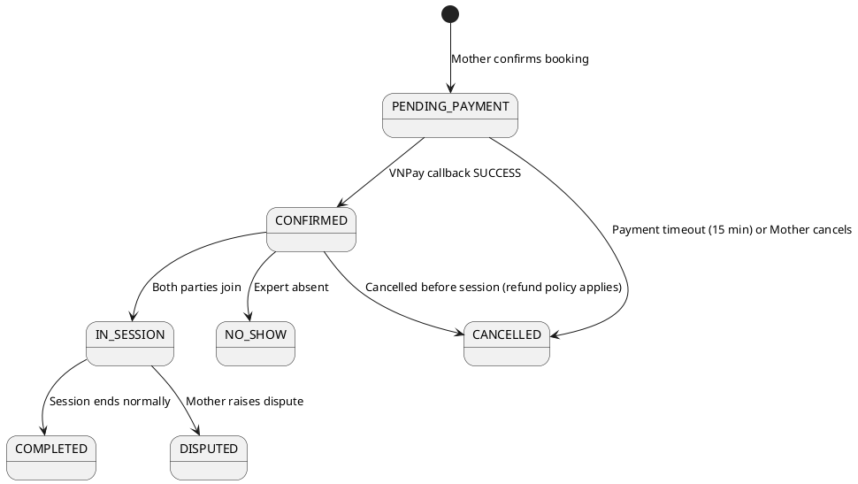

# ENGINEERING DOCUMENTATION STANDARD (EDS) v2.0
# UC-75 Book Private Consultation

| Field | Value |
|-------|-------|
| **Document ID** | `CB-CON-IMP-001` |
| **Version** | `1.0` |
| **Date** | `2026-06-26` |
| **Status** | `Draft` |
| **Author** | `AI Agent` |
| **Based on EDS** | `v2.0` |

---

## CHANGELOG

| Ngày | Người thực hiện | Nội dung thay đổi |
|------|-----------------|-------------------|
| 2026-06-26 | AI Agent | Khởi tạo TDS cho UC-75 |

---

## MỤC LỤC

1. [Tổng quan Module](#1-tổng-quan-module)
2. [Ma trận Truy vết](#2-ma-trận-truy-vết-traceability-matrix)
3. [Architecture Decision Records (ADR)](#3-architecture-decision-records-adr)
4. [Non-Functional Requirements & SLA](#4-non-functional-requirements--sla)
5. [Static Modeling](#5-static-modeling)
6. [Dynamic Modeling](#6-dynamic-modeling)
7. [Domain Event Catalog](#7-domain-event-catalog)
8. [Interface Specification](#8-interface-specification)
9. [API Specification](#9-api-specification)
10. [Bảng mã lỗi](#10-bảng-mã-lỗi)
11. [Quy trình Triển khai](#11-quy-trình-triển-khai-step-by-step)
12. [Rollback & Incident Runbook](#12-rollback--incident-runbook)
13. [Kịch bản Kiểm thử Chi tiết](#13-kịch-bản-kiểm-thử-chi-tiết)
14. [Phương pháp Xác minh](#14-phương-pháp-xác-minh)
15. [Mẫu thử thực tế](#15-mẫu-thử-thực-tế-api-verification-samples)
16. [Bảng tổng hợp phân quyền](#16-bảng-tổng-hợp-phân-quyền-authorization-matrix)
17. [AI Prompt Constraints](#17-ai-prompt-constraints-case-20)

---

## 1. Tổng quan Module

| Field | Value |
|-------|-------|
| **Module Name** | `BookPrivateConsultation` |
| **Bounded Context** | `consultation` |
| **Data Classification** | `Sensitive-PII` |
| **Compliance Scope** | `PDPA` |
| **Upstream Dependencies** | `expert (profile + availability), auth` |
| **Downstream Consumers** | `payment (UC-76), notification, audit` |

**Mô tả:** Mother chọn chuyên gia, chủ đề, loại tư vấn (chat/voice/video), slot thời gian, và xác nhận booking. Tạo `consultation` record ở trạng thái `PENDING_PAYMENT`. Slot được giữ (pessimistic lock) trong 15 phút chờ thanh toán.

## 2. Ma trận Truy vết (Traceability Matrix)

| Requirement ID | Loại | Mô tả | Thành phần Code | Compliance Target | ADR liên quan |
|----------------|------|-------|-----------------|-------------------|---------------|
| UC-75 | Use Case | Mother đặt lịch tư vấn riêng với chuyên gia | `ConsultationController`, `ConsultationService` | BR-RBAC | ADR-CON-001 |
| BR-SLOT-LOCK | Business Rule | Pessimistic lock slot bằng SELECT FOR UPDATE | `ConsultationService.bookSlot()` | BR-CONSISTENCY | ADR-CON-002 |
| BR-CONSENT | Business Rule | Health data sharing yêu cầu consent | `ConsultationService` | BR-PRIVACY | ADR-CON-003 |
| BR-TIMEOUT | Business Rule | Slot release sau 15 phút không thanh toán | `PaymentTimeoutJob` | BR-AVAILABILITY | ADR-CON-002 |

---

## 3. Architecture Decision Records (ADR)

### ADR-CON-001 — Consultation lifecycle state machine

| Field | Value |
|-------|-------|
| **Status** | `Accepted` |
| **Date** | `2026-06-26` |

#### Quyết định
State machine: `PENDING_PAYMENT → CONFIRMED → IN_SESSION → COMPLETED`. Alternative exits: `CANCELLED`, `NO_SHOW`, `DISPUTED`. Mỗi transition phải được audit. Payment gateway callback kích hoạt `PENDING_PAYMENT → CONFIRMED`.

### ADR-CON-002 — Slot locking to prevent double-booking

| Field | Value |
|-------|-------|
| **Status** | `Accepted` |
| **Date** | `2026-06-26` |

#### Quyết định
Khi Mother book slot: `SELECT ... FOR UPDATE` trên `expert_availability_slots` để đảm bảo atomicity. Slot chuyển sang `status=BOOKED` ngay khi consultation tạo thành công. Nếu Mother không thanh toán trong 15 phút, slot được trả lại `AVAILABLE` qua scheduled job.

### ADR-CON-003 — Health data sharing consent

| Field | Value |
|-------|-------|
| **Status** | `Accepted` |
| **Date** | `2026-06-26` |

#### Quyết định
Mother có thể chọn chia sẻ tóm tắt sức khỏe với Expert. Dữ liệu chia sẻ được ghi vào `consultation_shared_data` với `consent_given=true`. Expert chỉ thấy dữ liệu trong phạm vi này. Tuân thủ BR-PRIVACY.

---

## 4. Non-Functional Requirements & SLA

### 4.1. Performance & Availability

| Category | Requirement | Target SLA |
|----------|-------------|------------|
| Latency | API response — book consultation (p99) | < 500ms |
| Availability | Uptime (monthly) | 99.9% |
| Concurrency | Simultaneous slot bookings | Handled via SELECT FOR UPDATE |
| Timeout | Payment timeout → slot release | 15 minutes |

### 4.2. Security

| Category | Requirement | Target |
|----------|-------------|--------|
| Access control | Role-based — Mother only | Least privilege (§16) |
| Data protection | Health data consent required | BR-PRIVACY |

---

## 5. Static Modeling

### 5.2. Flyway SQL Migration

```sql
-- V31__create_consultations.sql

CREATE TYPE consultation_status AS ENUM (
  'PENDING_PAYMENT', 'CONFIRMED', 'IN_SESSION',
  'COMPLETED', 'CANCELLED', 'NO_SHOW', 'DISPUTED'
);
CREATE TYPE consultation_modality_type AS ENUM ('CHAT', 'VOICE', 'VIDEO');

CREATE TABLE consultations (
  id                  UUID          PRIMARY KEY DEFAULT gen_random_uuid(),
  mother_account_id   UUID          NOT NULL REFERENCES accounts(id),
  expert_profile_id   UUID          NOT NULL REFERENCES expert_profiles(id),
  slot_id             UUID          NOT NULL REFERENCES expert_availability_slots(id),
  topic               VARCHAR(500)  NOT NULL,
  modality            consultation_modality_type NOT NULL,
  status              consultation_status NOT NULL DEFAULT 'PENDING_PAYMENT',
  fee_vnd             BIGINT        NOT NULL,
  scheduled_at        TIMESTAMPTZ   NOT NULL,
  duration_minutes    INTEGER       NOT NULL,
  health_data_shared  BOOLEAN       NOT NULL DEFAULT FALSE,
  notes               TEXT,
  payment_ref         VARCHAR(200),               -- VNPay transaction reference
  zego_room_id        VARCHAR(200),
  created_at          TIMESTAMPTZ   NOT NULL DEFAULT NOW(),
  updated_at          TIMESTAMPTZ   NOT NULL DEFAULT NOW()
);

CREATE INDEX idx_cons_mother ON consultations(mother_account_id, status);
CREATE INDEX idx_cons_expert ON consultations(expert_profile_id, status);
CREATE INDEX idx_cons_slot ON consultations(slot_id);
CREATE INDEX idx_cons_scheduled ON consultations(scheduled_at);
```

---

## 6. Dynamic Modeling

### 6.3. State Machine



---

## 7. Domain Event Catalog

### 7.1. Events Published

| Event Name | Trigger | Publisher | Async? |
|------------|---------|-----------|--------|
| ConsultationBooked | Consultation created with PENDING_PAYMENT | ConsultationService | No |
| SlotReserved | Availability slot locked for booking | ConsultationService | No |

### 7.2. Events Consumed

| Event Name | Source | Handler | Action |
|------------|--------|---------|--------|
| PaymentConfirmed | PaymentService (UC-76) | ConsultationService | Update status → CONFIRMED |
| PaymentTimeout | PaymentTimeoutJob | ConsultationService | Cancel booking, release slot |

---

## 8. Interface Specification

```java
public class BookConsultationRequest {
    @NotNull
    private UUID expertProfileId;
    @NotNull
    private UUID slotId;
    @NotBlank @Size(max = 500)
    private String topic;
    @NotNull
    private ConsultationModalityType modality;
    private Boolean shareHealthData; // default false
    private String notes;
}

public interface IConsultationService {
    ConsultationResponse bookConsultation(BookConsultationRequest request, UUID motherAccountId);
}
```

---

## 9. API Specification

| Method | Path | Auth | Required Roles |
|--------|------|------|----------------|
| `POST` | `/api/v1/consultations` | JWT Bearer | `ROLE_MOTHER` |

**POST — 201 Created:**
```json
{
  "id": "uuid",
  "expertProfileId": "uuid",
  "status": "PENDING_PAYMENT",
  "feeVnd": 200000,
  "scheduledAt": "2026-07-01T10:00:00Z",
  "paymentDeadlineAt": "2026-07-01T08:15:00Z"
}
```

---

## 10. Bảng mã lỗi

| Code | HTTP | Trigger |
|------|------|---------|
| `CON-001` | 400 | Validation failed |
| `CON-002` | 409 | Slot already booked |
| `CON-003` | 404 | Expert profile not found |
| `CON-004` | 403 | Non-MOTHER role |
| `CON-005` | 404 | Slot not found or not AVAILABLE |
| `CON-006` | 400 | Modality not supported by expert |

---

## 11. Quy trình Triển khai (Step-by-Step)

### 11.1. Prerequisites

- [ ] expert_profiles (V28) và expert_availability_slots (V30) đã tồn tại
- [ ] ADR-CON-002 đã Accepted (SELECT FOR UPDATE)

### 11.2. Pre-Migration Checklist

- [ ] Backup DB trước V31
- [ ] V31 test trên staging ≥ 24 giờ

### 11.3. Implementation Steps

#### Chặng 1 — Migration V31

```bash
./mvnw flyway:migrate
# V31__create_consultations.sql
```

#### Chặng 2 — Implement booking với SELECT FOR UPDATE

```java
@Transactional
public ConsultationResponse bookConsultation(BookRequest req, UUID motherAccountId) {
    // 1. Lock slot để tránh double-booking (ADR-CON-002)
    ExpertAvailabilitySlot slot = slotRepo.findByIdForUpdate(req.getSlotId())
        .orElseThrow(() -> new NotFoundException("CON-005"));
    if (slot.getStatus() != SlotStatus.AVAILABLE) throw new ConflictException("CON-002");
    // 2. Verify expert và modality
    ExpertProfile expert = profileRepo.findById(req.getExpertProfileId())
        .orElseThrow(() -> new NotFoundException("CON-003"));
    if (!expert.getConsultationModalities().contains(req.getModality()))
        throw new ValidationException("CON-006");
    // 3. Create consultation với PENDING_PAYMENT
    Consultation c = new Consultation(motherAccountId, req.getExpertProfileId(),
        req.getSlotId(), ConsultationStatus.PENDING_PAYMENT, ...);
    slot.setStatus(SlotStatus.BOOKED);
    Consultation saved = consultationRepo.save(c);
    slotRepo.save(slot);
    return mapper.toResponse(saved);
}
```

### 11.4. Deployment Checklist

- [ ] V31 migration thành công
- [ ] Test book → 201 PENDING_PAYMENT
- [ ] Test double-book same slot → 409 CON-002
- [ ] Test ROLE_EXPERT → 403
- [ ] Verify slot.status = BOOKED after booking

---

## 12. Rollback & Incident Runbook

### 12.1. Điều kiện kích hoạt Rollback

| Điều kiện | Ngưỡng | Người quyết định |
|-----------|--------|------------------|
| Double-booking xảy ra | Bất kỳ case | Tech Lead |
| Consultation tạo với status CONFIRMED ngay | Bất kỳ case | Tech Lead |

### 12.2. Rollback Procedure

```bash
psql -h $DB_HOST -U $DB_USER -d $DB_NAME \
  -c "DROP TABLE IF EXISTS consultations CASCADE;"
psql -h $DB_HOST -U $DB_USER -d $DB_NAME \
  -c "DELETE FROM flyway_schema_history WHERE version = '31';"
kubectl rollout undo deployment/carebridge-api
```

---

## 13. Kịch bản Kiểm thử Chi tiết

```gherkin
Feature: Book Private Consultation
  Background:
    Given test data classification: SYNTHETIC
    And MOTHER-001 có ROLE_MOTHER

  Scenario: Successful booking → 201 PENDING_PAYMENT
    Given AVAILABLE slot SLOT-001 của EXPERT-001
    When bookConsultation(req, MOTHER-001)
    Then response.status == PENDING_PAYMENT
    And SLOT-001.status == BOOKED

  Scenario: Slot already BOOKED → 409 CON-002
    Given SLOT-001 đã có status=BOOKED
    When bookConsultation(req, MOTHER-001)
    Then throws ConflictException CON-002

  Scenario: ROLE_EXPERT → 403 CON-004
    When bookConsultation với EXPERT account
    Then throws ForbiddenException CON-004

  Scenario: Expert not found → 404 CON-003
    When req.expertProfileId = NONEXISTENT
    Then throws NotFoundException CON-003

  Scenario: Modality VIDEO không supported → 400 CON-006
    Given expert chỉ hỗ trợ CHAT
    When req.modality = VIDEO
    Then throws ValidationException CON-006
```

---

## 14. Phương pháp Xác minh

```sql
-- Verify consultation status after booking
SELECT id, status, mother_account_id FROM consultations WHERE id = '<uuid>';
-- Expected: status = 'PENDING_PAYMENT'

-- Verify slot locked
SELECT id, status FROM expert_availability_slots WHERE id = '<slot_uuid>';
-- Expected: status = 'BOOKED'
```

---

## 15. Mẫu thử thực tế (API Verification Samples)

```bash
curl -X POST https://[host]/api/v1/consultations \
  -H "Authorization: Bearer <MOTHER_JWT>" \
  -H "Content-Type: application/json" \
  -d '{"expertProfileId":"EXP-UUID","slotId":"SLOT-UUID","topic":"Prenatal questions","modality":"VIDEO","shareHealthData":false}'
```
**Expected (201):** `{"id":"...","status":"PENDING_PAYMENT","expertProfileId":"EXP-UUID"}`

---

## 16. Bảng tổng hợp phân quyền (Authorization Matrix)

| Endpoint | `ROLE_MOTHER` | `ROLE_EXPERT` | `ROLE_ADMIN` |
|----------|---------------|---------------|--------------|
| `POST /consultations` | ✅ | ❌ | ✅ |

---

## 17. AI Prompt Constraints (CASE 2.0)

### 17.1 Constraint Summary Table

| # | Constraint | Source |
|---|-----------|--------|
| C1 | motherAccountId from JWT SecurityContext only | BR-RBAC |
| C2 | SELECT FOR UPDATE on slot before creating consultation | ADR-CON-002 |
| C3 | Slot status = BOOKED immediately after successful INSERT | ADR-CON-002 |
| C4 | Initial consultation status = PENDING_PAYMENT | ADR-CON-001 |
| C5 | If shareHealthData=true, write consent record to consultation_shared_data | ADR-CON-003 |

### 17.2 Constraint Injection Block

```
[CONSTRAINT BLOCK — Module: BookPrivateConsultation (CB-CON-IMP-001)]
1. (C1) motherAccountId từ JWT SecurityContext.
2. (C2) slotRepo.findByIdForUpdate() (SELECT FOR UPDATE) trước bất kỳ write nào.
3. (C3) Sau save consultation: slot.status = BOOKED trong cùng @Transactional.
4. (C4) consultation.status = PENDING_PAYMENT — KHÔNG phải CONFIRMED.
5. (C5) shareHealthData=true → tạo consent record, không bỏ qua.
```

### 17.3 Constraint Quality Checklist

- [x] Mỗi constraint traceable về ADR
- [x] Constraint block có ≥ 5 constraints cụ thể

### 17.4 Anti-Pattern Detection

| AP-ID | Anti-Pattern | Hành động |
|-------|-------------|----------|
| AP-AI-001 | Không dùng SELECT FOR UPDATE → race condition | Reject — C2 |
| AP-AI-003 | Status = CONFIRMED ngay sau booking | Reject — C4 violation |

---

## PHỤ LỤC

### A. Glossary

| Thuật ngữ | Định nghĩa |
|-----------|------------|
| SELECT FOR UPDATE | Pessimistic lock: ngăn transaction khác đọc và sửa row cho đến khi commit |
| PENDING_PAYMENT | Trạng thái consultation: đã đặt lịch, chưa thanh toán |

### B. Tài liệu tham chiếu

| Document | Path |
|----------|------|
| EDS v2.0 Template | `08_References/Template/PHASE-3_TDS.md` |

---

*EDS v2.1 — Tích hợp CASE 2.0 AI Prompt Constraints (§17).*
