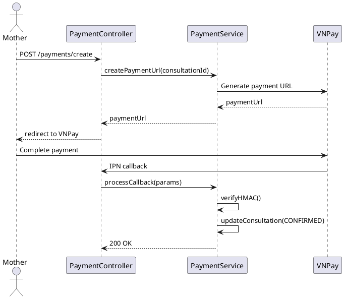

# ENGINEERING DOCUMENTATION STANDARD (EDS) v2.0
# UC-76 Pay Consultation Fee

| Field | Value |
|-------|-------|
| **Document ID** | `CB-PAY-IMP-001` |
| **Version** | `1.0` |
| **Date** | `2026-06-26` |
| **Status** | `Draft` |
| **Author** | `AI Agent` |
| **Based on EDS** | `v2.0` |

---

## CHANGELOG

| Ngày | Người thực hiện | Nội dung thay đổi |
|------|-----------------|-------------------|
| 2026-06-26 | AI Agent | Khởi tạo TDS cho UC-76 |

---

## MỤC LỤC

1. [Tổng quan Module](#1-tổng-quan-module)
2. [Ma trận Truy vết](#2-ma-trận-truy-vết-traceability-matrix)
3. [Architecture Decision Records (ADR)](#3-architecture-decision-records-adr)
4. [Non-Functional Requirements & SLA](#4-non-functional-requirements--sla)
5. [Static Modeling](#5-static-modeling)
6. [Dynamic Modeling](#6-dynamic-modeling)
7. [Domain Event Catalog](#7-domain-event-catalog)
8. [Interface Specification](#8-interface-specification)
9. [API Specification](#9-api-specification)
10. [Bảng mã lỗi](#10-bảng-mã-lỗi)
11. [Quy trình Triển khai](#11-quy-trình-triển-khai-step-by-step)
12. [Rollback & Incident Runbook](#12-rollback--incident-runbook)
13. [Kịch bản Kiểm thử Chi tiết](#13-kịch-bản-kiểm-thử-chi-tiết)
14. [Phương pháp Xác minh](#14-phương-pháp-xác-minh)
15. [Mẫu thử thực tế](#15-mẫu-thử-thực-tế-api-verification-samples)
16. [Bảng tổng hợp phân quyền](#16-bảng-tổng-hợp-phân-quyền-authorization-matrix)
17. [AI Prompt Constraints](#17-ai-prompt-constraints-case-20)

---

## 1. Tổng quan Module

| Field | Value |
|-------|-------|
| **Module Name** | `PayConsultationFee` |
| **Bounded Context** | `payment` |
| **Data Classification** | `Confidential` |
| **Compliance Scope** | `PDPA` |
| **Upstream Dependencies** | `consultation (UC-75), VNPay gateway` |
| **Downstream Consumers** | `consultation (status update), commission (UC-127)` |

**Mô tả:** Mother thanh toán phí tư vấn qua VNPay. Hệ thống tạo payment URL → redirect Mother → nhận VNPay callback → verify signature → cập nhật consultation sang `CONFIRMED`.

## 2. Ma trận Truy vết (Traceability Matrix)

| Requirement ID | Loại | Mô tả | Thành phần Code | Compliance Target | ADR liên quan |
|----------------|------|-------|-----------------|-------------------|---------------|
| UC-76 | Use Case | Mother thanh toán phí tư vấn qua VNPay | `PaymentController`, `PaymentService` | BR-RBAC | ADR-PAY-001 |
| BR-HMAC | Business Rule | HMAC-SHA512 signature verification | `PaymentService.verifyCallback()` | BR-SECURITY | ADR-PAY-001 |
| BR-IDEMPOTENT | Business Rule | Idempotent payment processing | `PaymentService` | BR-CONSISTENCY | ADR-PAY-002 |
| BR-TIMEOUT | Business Rule | Payment timeout 15 min → cancel | `PaymentTimeoutJob` | BR-AVAILABILITY | ADR-PAY-003 |

---

## 3. Architecture Decision Records (ADR)

### ADR-PAY-001 — VNPay HMAC-SHA512 signature verification

| Field | Value |
|-------|-------|
| **Status** | `Accepted` |
| **Date** | `2026-06-26` |

#### Quyết định
Mọi VNPay callback phải được verify bằng HMAC-SHA512 với `VNPAY_HASH_SECRET` từ environment variable. Nếu signature không khớp → reject callback với HTTP 400 và log cảnh báo. Không bao giờ cập nhật consultation status mà không có valid signature.

### ADR-PAY-002 — Idempotent payment processing

| Field | Value |
|-------|-------|
| **Status** | `Accepted` |
| **Date** | `2026-06-26` |

#### Quyết định
VNPay có thể gọi callback nhiều lần với cùng `vnp_TxnRef`. Kiểm tra `payment_ref` trong consultations trước khi update. Nếu đã xử lý → return `200 OK` (VNPay yêu cầu) mà không update lại.

### ADR-PAY-003 — Payment timeout and slot release

| Field | Value |
|-------|-------|
| **Status** | `Accepted` |
| **Date** | `2026-06-26` |

#### Quyết định
Nếu không nhận callback trong 15 phút sau booking → scheduled job chạy mỗi 5 phút: query `consultations WHERE status='PENDING_PAYMENT' AND created_at < NOW()-15min` → set status=CANCELLED, release slot về AVAILABLE.

---

## 4. Non-Functional Requirements & SLA

### 4.1. Performance & Availability

| Category | Requirement | Target SLA |
|----------|-------------|------------|
| Latency | VNPay URL generation (p99) | < 300ms |
| Availability | Uptime (monthly) | 99.9% |
| Callback | VNPay IPN processing | < 1000ms |
| Timeout | Payment window expiry | 15 minutes |

### 4.2. Security

| Category | Requirement | Target |
|----------|-------------|--------|
| Signature | HMAC-SHA512 verification | Every callback |
| Secret management | VNPAY_HASH_SECRET from env | Never hardcoded |

---

## 5. Static Modeling

### 5.2. Flyway SQL Migration

```sql
-- V32__create_consultation_payments.sql

CREATE TYPE payment_status AS ENUM (
  'INITIATED', 'PENDING', 'SUCCESS', 'FAILED', 'REFUNDED'
);

CREATE TABLE consultation_payments (
  id                  UUID          PRIMARY KEY DEFAULT gen_random_uuid(),
  consultation_id     UUID          NOT NULL UNIQUE REFERENCES consultations(id),
  vnpay_txn_ref       VARCHAR(200)  NOT NULL UNIQUE,  -- vnp_TxnRef from VNPay
  amount_vnd          BIGINT        NOT NULL,
  status              payment_status NOT NULL DEFAULT 'INITIATED',
  vnpay_response_code VARCHAR(10),                    -- vnp_ResponseCode
  vnpay_bank_code     VARCHAR(20),
  paid_at             TIMESTAMPTZ,
  refunded_at         TIMESTAMPTZ,
  created_at          TIMESTAMPTZ   NOT NULL DEFAULT NOW(),
  updated_at          TIMESTAMPTZ   NOT NULL DEFAULT NOW()
);

CREATE INDEX idx_payment_consultation ON consultation_payments(consultation_id);
CREATE INDEX idx_payment_txn ON consultation_payments(vnpay_txn_ref);
```

---

## 6. Dynamic Modeling

### 6.1. Payment Flow Sequence



---

## 7. Domain Event Catalog

### 7.1. Events Published

| Event Name | Trigger | Publisher | Async? |
|------------|---------|-----------|--------|
| PaymentConfirmed | VNPay callback verified, status=SUCCESS | PaymentService | No |
| PaymentFailed | VNPay callback with error code | PaymentService | No |

### 7.2. Events Consumed

| Event Name | Source | Handler | Action |
|------------|--------|---------|--------|
| ConsultationBooked | ConsultationService (UC-75) | PaymentService | Create payment URL |

---

## 8. Interface Specification

```java
public interface IPaymentService {
    /**
     * Generate VNPay redirect URL for consultation payment.
     */
    PaymentInitResponse initiatePayment(UUID consultationId, UUID motherAccountId);

    /**
     * Process VNPay IPN callback. Verifies HMAC-SHA512 signature.
     * @throws SecurityException (PAY-003) when signature invalid
     */
    void processVnpayCallback(Map<String, String> vnpayParams);
}
```

---

## 9. API Specification

| Method | Path | Auth | Required Roles |
|--------|------|------|----------------|
| `POST` | `/api/v1/consultations/{id}/payment/initiate` | JWT Bearer | `ROLE_MOTHER` |
| `GET` | `/api/v1/payment/vnpay/callback` | None (VNPay webhook) | IP whitelist |

**POST initiate — 200 OK:**
```json
{
  "consultationId": "uuid",
  "paymentUrl": "https://sandbox.vnpayment.vn/paymentv2/...",
  "expiresAt": "2026-06-26T08:15:00Z"
}
```

---

## 10. Bảng mã lỗi

| Code | HTTP | Trigger |
|------|------|---------|
| `PAY-001` | 404 | Consultation not found |
| `PAY-002` | 409 | Consultation not in PENDING_PAYMENT status |
| `PAY-003` | 400 | VNPay HMAC signature mismatch |
| `PAY-004` | 403 | Not owner of consultation |
| `PAY-005` | 409 | Payment already processed (idempotent check) |

---

## 11. Quy trình Triển khai (Step-by-Step)

### 11.1. Prerequisites

- [ ] consultations table tồn tại (V31)
- [ ] VNPay account + VNPAY_HASH_SECRET đã config trong env
- [ ] ADR-PAY-001/002 đã Accepted

### 11.2. Pre-Migration Checklist

- [ ] Backup DB trước V32
- [ ] V32 test trên staging ≥ 24 giờ
- [ ] VNPAY_HASH_SECRET env var đã set trên staging

### 11.3. Implementation Steps

#### Chặng 1 — Migration V32

```bash
./mvnw flyway:migrate
# V32__create_consultation_payments.sql
```

#### Chặng 2 — Implement Payment Initiation

```java
public InitiatePaymentResponse initiatePayment(UUID consultationId, UUID motherAccountId) {
    Consultation c = consultationRepo.findById(consultationId)
        .orElseThrow(() -> new NotFoundException("PAY-001"));
    if (!c.getMotherAccountId().equals(motherAccountId)) throw new ForbiddenException("PAY-004");
    if (c.getStatus() != ConsultationStatus.PENDING_PAYMENT) throw new ConflictException("PAY-002");
    String txnRef = UUID.randomUUID().toString();
    String paymentUrl = vnpayService.buildPaymentUrl(txnRef, c.getConsultationFeeVnd());
    Instant expiresAt = Instant.now().plus(Duration.ofMinutes(15));
    return new InitiatePaymentResponse(paymentUrl, expiresAt);
}
```

#### Chặng 3 — Implement VNPay Callback (HMAC first)

```java
public void processCallback(Map<String, String> params) {
    String receivedHash = params.remove("vnp_SecureHash");
    if (!vnpayService.verifyHmac(params, receivedHash)) {
        throw new PaymentSecurityException("PAY-003");
    }
    String txnRef = params.get("vnp_TxnRef");
    if (paymentRepo.existsByVnpayTxnRef(txnRef)) return; // idempotent
    String responseCode = params.get("vnp_ResponseCode");
    updateConsultationStatus(txnRef, "00".equals(responseCode));
}
```

### 11.4. Deployment Checklist

- [ ] V32 migration thành công
- [ ] Test initiate → 200 với paymentUrl
- [ ] Test SUCCESS callback → consultation CONFIRMED
- [ ] Test invalid HMAC → rejected, consultation NOT updated
- [ ] Test duplicate callback → idempotent (no error)

---

## 12. Rollback & Incident Runbook

### 12.1. Điều kiện kích hoạt Rollback

| Điều kiện | Ngưỡng | Người quyết định |
|-----------|--------|------------------|
| HMAC verify bị bypass | Bất kỳ case | Tech Lead + DPO |
| Double payment | Bất kỳ case | Tech Lead |

### 12.2. Rollback Procedure

```bash
psql -h $DB_HOST -U $DB_USER -d $DB_NAME \
  -c "DROP TABLE IF EXISTS consultation_payments CASCADE;"
psql -h $DB_HOST -U $DB_USER -d $DB_NAME \
  -c "DELETE FROM flyway_schema_history WHERE version = '32';"
kubectl rollout undo deployment/carebridge-api
```

---

## 13. Kịch bản Kiểm thử Chi tiết

```gherkin
Feature: Pay Consultation Fee
  Scenario: Initiate payment → 200 với paymentUrl
    Given consultation PENDING_PAYMENT, owned by MOTHER-001
    When initiatePayment(consultationId, MOTHER-001)
    Then response có paymentUrl không null
    And expiresAt = now + 15 min

  Scenario: SUCCESS callback → consultation CONFIRMED
    Given valid HMAC signature, ResponseCode=00
    When processCallback(params)
    Then consultation.status = CONFIRMED
    And payment.status = SUCCESS

  Scenario: Invalid HMAC → rejected
    Given tampered vnp_SecureHash
    When processCallback(params)
    Then PaymentSecurityException
    And consultation.status NOT CHANGED

  Scenario: Duplicate callback → idempotent
    Given txnRef đã được xử lý
    When processCallback(same txnRef)
    Then không có error, không có re-update
```

---

## 14. Phương pháp Xác minh

```sql
-- Verify payment sau SUCCESS callback
SELECT id, status, vnpay_txn_ref FROM consultation_payments WHERE consultation_id = '<uuid>';
-- Expected: status = 'SUCCESS'

-- Verify consultation CONFIRMED
SELECT id, status FROM consultations WHERE id = '<uuid>';
-- Expected: status = 'CONFIRMED'
```

---

## 15. Mẫu thử thực tế (API Verification Samples)

```bash
# Initiate payment
curl -X POST https://[host]/api/v1/consultations/CON-UUID/payment/initiate \
  -H "Authorization: Bearer <MOTHER_JWT>"
# Expected: { "paymentUrl": "https://sandbox.vnpayment.vn/...", "expiresAt": "..." }
```

---

## 16. Bảng tổng hợp phân quyền (Authorization Matrix)

| Endpoint | `ROLE_MOTHER` | `ROLE_EXPERT` | `ROLE_ADMIN` |
|----------|---------------|---------------|--------------|
| `POST /consultations/{id}/payment/initiate` | ✅ Own | ❌ | ✅ |
| `GET /payment/vnpay/callback` | N/A (VNPay) | N/A | N/A |

---

## 17. AI Prompt Constraints (CASE 2.0)

### 17.1 Constraint Summary Table

| # | Constraint | Source |
|---|-----------|--------|
| C1 | VNPAY_HASH_SECRET MUST come from environment variable only, never hardcoded | ADR-PAY-001 |
| C2 | Verify HMAC-SHA512 signature BEFORE any DB update | ADR-PAY-001 |
| C3 | Idempotency check: if `payment_ref` already processed → return 200 without re-update | ADR-PAY-002 |
| C4 | On SUCCESS callback: update consultation.status=CONFIRMED, payment.status=SUCCESS | ADR-CON-001 |
| C5 | Slot must remain BOOKED during payment window; released on timeout by job | ADR-PAY-003 |

### 17.2 Constraint Injection Block

```
[CONSTRAINT BLOCK — Module: PayConsultationFee (CB-PAY-IMP-001)]
1. (C1) VNPAY_HASH_SECRET từ env var — KHÔNG hardcode trong code hay config file.
2. (C2) verifyHmac() PHẢI được gọi TRƯỚC bất kỳ DB write nào.
3. (C3) existsByVnpayTxnRef() check trước update — return silently nếu đã xử lý.
4. (C4) SUCCESS callback: consultation → CONFIRMED, payment → SUCCESS trong @Transactional.
5. (C5) Slot BOOKED không được release trong callback — chỉ job timeout mới release.
```

### 17.3 Constraint Quality Checklist

- [x] VNPAY_HASH_SECRET traceable về ADR-PAY-001
- [x] Constraint block có ≥ 5 constraints cụ thể

### 17.4 Anti-Pattern Detection

| AP-ID | Anti-Pattern | Hành động |
|-------|-------------|----------|
| AP-AI-001 | HMAC secret hardcoded | Reject — C1 violation, security risk |
| AP-AI-003 | DB update trước HMAC verify | Reject — C2 violation |

---

## PHỤ LỤC

### A. Glossary

| Thuật ngữ | Định nghĩa |
|-----------|------------|
| HMAC-SHA512 | Hash-based Message Authentication Code — dùng để verify VNPay callback |
| Idempotent | Callback có thể được gọi nhiều lần mà không gây side effect bổ sung |
| vnp_TxnRef | Unique transaction reference từ VNPay |

### B. Tài liệu tham chiếu

| Document | Path |
|----------|------|
| VNPay API Docs | https://sandbox.vnpayment.vn/apis/ |
| EDS v2.0 Template | `08_References/Template/PHASE-3_TDS.md` |

---

*EDS v2.1 — Tích hợp CASE 2.0 AI Prompt Constraints (§17).*
