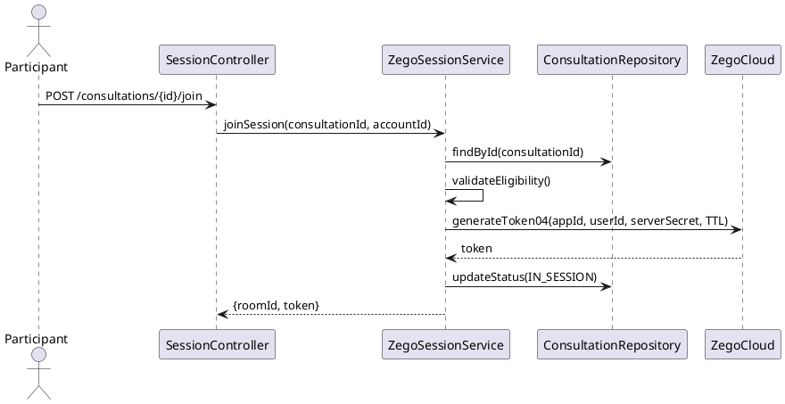

# ENGINEERING DOCUMENTATION STANDARD (EDS) v2.0
# UC-77 Join Consultation Session

| Field | Value |
|-------|-------|
| **Document ID** | `CB-CON-IMP-002` |
| **Version** | `1.0` |
| **Date** | `2026-06-26` |
| **Status** | `Draft` |
| **Author** | `AI Agent` |
| **Based on EDS** | `v2.0` |

---

## CHANGELOG

| Ngày | Người thực hiện | Nội dung thay đổi |
|------|-----------------|-------------------|
| 2026-06-26 | AI Agent | Khởi tạo TDS cho UC-77 |

---

## MỤC LỤC

1. [Tổng quan Module](#1-tổng-quan-module)
2. [Ma trận Truy vết](#2-ma-trận-truy-vết-traceability-matrix)
3. [Architecture Decision Records (ADR)](#3-architecture-decision-records-adr)
4. [Non-Functional Requirements & SLA](#4-non-functional-requirements--sla)
5. [Static Modeling](#5-static-modeling)
6. [Dynamic Modeling](#6-dynamic-modeling)
7. [Domain Event Catalog](#7-domain-event-catalog)
8. [Interface Specification](#8-interface-specification)
9. [API Specification](#9-api-specification)
10. [Bảng mã lỗi](#10-bảng-mã-lỗi)
11. [Quy trình Triển khai](#11-quy-trình-triển-khai-step-by-step)
12. [Rollback & Incident Runbook](#12-rollback--incident-runbook)
13. [Kịch bản Kiểm thử Chi tiết](#13-kịch-bản-kiểm-thử-chi-tiết)
14. [Phương pháp Xác minh](#14-phương-pháp-xác-minh)
15. [Mẫu thử thực tế](#15-mẫu-thử-thực-tế-api-verification-samples)
16. [Bảng tổng hợp phân quyền](#16-bảng-tổng-hợp-phân-quyền-authorization-matrix)
17. [AI Prompt Constraints](#17-ai-prompt-constraints-case-20)

---

## 1. Tổng quan Module

| Field | Value |
|-------|-------|
| **Module Name** | `JoinConsultationSession` |
| **Bounded Context** | `consultation` |
| **Data Classification** | `Confidential` |
| **Upstream Dependencies** | `consultation (UC-75), ZegoCloud` |
| **Downstream Consumers** | `audit` |

**Mô tả:** Mother hoặc Expert join phiên tư vấn đã được `CONFIRMED`. Hệ thống generate ZegoCloud token server-side, trả về `roomId` và `token`. Consultation chuyển sang `IN_SESSION` khi cả hai bên join.

## 2. Ma trận Truy vết (Traceability Matrix)

| Requirement ID | Loại | Mô tả | Thành phần Code | Compliance Target | ADR liên quan |
|----------------|------|-------|-----------------|-------------------|---------------|
| UC-77 | Use Case | Mother/Expert join phiên tư vấn realtime | `ConsultationSessionController`, `ZegoSessionService` | BR-RBAC | ADR-CON-004 |
| BR-ELIGIBILITY | Business Rule | Chỉ join khi CONFIRMED/IN_SESSION và đúng participant | `ZegoSessionService` | BR-SECURITY | ADR-CON-005 |
| BR-TOKEN | Business Rule | ZegoCloud token generated server-side, TTL 1h | `ZegoSessionService` | BR-SECURITY | ADR-CON-004 |

---

## 3. Architecture Decision Records (ADR)

### ADR-CON-004 — ZegoCloud token generation

| Field | Value |
|-------|-------|
| **Status** | `Accepted` |
| **Date** | `2026-06-26` |

#### Quyết định
ZegoCloud token được generate server-side bằng ZegoCloud Server SDK với `appId` và `serverSecret` từ environment. Token TTL: **1 hour**. Không lưu token vào DB — regenerate on each join request. `roomId` = `consultation.id` (UUID). `userId` = JWT `accountId`.

### ADR-CON-005 — Session eligibility

| Field | Value |
|-------|-------|
| **Status** | `Accepted` |
| **Date** | `2026-06-26` |

#### Quyết định
Chỉ cho phép join khi:
1. Consultation status = `CONFIRMED` hoặc `IN_SESSION`
2. Caller là `mother_account_id` HOẶC `expert_profile.account_id`
3. `scheduled_at` trong khoảng `[now-15min, now+duration+30min]` (join window)

---

## 4. Non-Functional Requirements & SLA

### 4.1. Performance & Availability

| Category | Requirement | Target SLA |
|----------|-------------|------------|
| Latency | Token generation (p99) | < 200ms |
| Availability | Uptime (monthly) | 99.9% |
| Token TTL | ZegoCloud session token | 1 hour |
| Join window | Before/after scheduled time | -15min to +duration+30min |

### 4.2. Security

| Category | Requirement | Target |
|----------|-------------|--------|
| Access control | Participant verification | Only mother/expert of consultation |
| Token security | Server-side generation only | Token NOT stored in DB |

---

## 5. Static Modeling

### 5.2. Flyway SQL Migration

```sql
-- V33__create_zego_sessions.sql

CREATE TYPE zego_session_status AS ENUM ('ACTIVE', 'ENDED');

CREATE TABLE zego_sessions (
  id                UUID        PRIMARY KEY DEFAULT gen_random_uuid(),
  consultation_id   UUID        NOT NULL UNIQUE REFERENCES consultations(id),
  room_id           VARCHAR(200) NOT NULL,     -- = consultation.id
  session_status    zego_session_status NOT NULL DEFAULT 'ACTIVE',
  started_at        TIMESTAMPTZ NOT NULL DEFAULT NOW(),
  ended_at          TIMESTAMPTZ,
  mother_joined_at  TIMESTAMPTZ,
  expert_joined_at  TIMESTAMPTZ
);

CREATE INDEX idx_zego_consultation ON zego_sessions(consultation_id);
```

---

## 6. Dynamic Modeling

### 6.1. Join Session Sequence



---

## 7. Domain Event Catalog

### 7.1. Events Published

| Event Name | Trigger | Publisher | Async? |
|------------|---------|-----------|--------|
| SessionJoined | Participant joins consultation | ZegoSessionService | No |
| SessionStarted | Both participants joined | ZegoSessionService | No |

### 7.2. Events Consumed

| Event Name | Source | Handler | Action |
|------------|--------|---------|--------|
| PaymentConfirmed | PaymentService (UC-76) | — | Consultation becomes joinable (CONFIRMED) |

---

## 8. Interface Specification

```java
public interface IZegoSessionService {
    /**
     * Generates ZegoCloud token and returns join credentials.
     * @throws BusinessException (SES-001) when not eligible to join
     * @throws BusinessException (SES-002) when ZegoCloud service unavailable
     */
    JoinSessionResponse joinSession(UUID consultationId, UUID callerAccountId);
}

public class JoinSessionResponse {
    private UUID consultationId;
    private String roomId;
    private String zegoToken;   // 1-hour TTL, not persisted
    private Instant tokenExpiresAt;
    private ConsultationStatus consultationStatus;
}
```

---

## 9. API Specification

| Method | Path | Auth | Required Roles |
|--------|------|------|----------------|
| `POST` | `/api/v1/consultations/{id}/join` | JWT Bearer | `ROLE_MOTHER`, `ROLE_EXPERT` |

**POST — 200 OK:**
```json
{
  "consultationId": "uuid",
  "roomId": "uuid",
  "zegoToken": "04AAAAAGxxxxxxxx...",
  "tokenExpiresAt": "2026-06-26T11:00:00Z"
}
```

---

## 10. Bảng mã lỗi

| Code | HTTP | Trigger |
|------|------|---------|
| `SES-001` | 403 | Caller not a participant of this consultation |
| `SES-002` | 503 | ZegoCloud service unavailable |
| `SES-003` | 409 | Consultation not in CONFIRMED/IN_SESSION status |
| `SES-004` | 400 | Outside join window (too early or too late) |
| `SES-005` | 404 | Consultation not found |

---

## 11. Quy trình Triển khai (Step-by-Step)

### 11.1. Prerequisites

- [ ] consultations table tồn tại (V31)
- [ ] ZEGO_APP_ID và ZEGO_SERVER_SECRET đã config trong env

### 11.2. Pre-Migration Checklist

Không có migration mới — UC-77 dùng V33 (consultation_sessions) nếu cần, hoặc thêm cột vào consultations.

### 11.3. Implementation Steps

#### Chặng 1 — Implement participant check

```java
private boolean isParticipant(Consultation c, UUID accountId) {
    if (c.getMotherAccountId().equals(accountId)) return true;
    ExpertProfile expert = profileRepo.findById(c.getExpertProfileId())
        .orElseThrow();
    return expert.getAccountId().equals(accountId);
}
```

#### Chặng 2 — Generate ZegoCloud token (NOT persisted)

```java
public JoinSessionResponse joinSession(UUID consultationId, UUID accountId) {
    Consultation c = consultationRepo.findById(consultationId)
        .orElseThrow(() -> new NotFoundException("SES-005"));
    if (!isParticipant(c, accountId)) throw new ForbiddenException("SES-001");
    if (!Set.of(CONFIRMED, IN_SESSION).contains(c.getStatus())) throw new ConflictException("SES-003");
    String roomId = consultationId.toString(); // ADR-CON-004
    String zegoToken = zegoService.generateToken(roomId, accountId.toString());
    // zegoToken NOT saved to DB — ADR-CON-004
    if (c.getStatus() == ConsultationStatus.CONFIRMED) {
        c.setStatus(ConsultationStatus.IN_SESSION);
        c.setMotherJoinedAt(Instant.now());
        consultationRepo.save(c);
    }
    return new JoinSessionResponse(consultationId, roomId, zegoToken, Instant.now().plus(1, ChronoUnit.HOURS));
}
```

### 11.4. Deployment Checklist

- [ ] Test join với MOTHER_JWT → 200 với zegoToken
- [ ] Verify zegoToken NOT in DB
- [ ] Verify roomId == consultationId
- [ ] Test non-participant → 403 SES-001
- [ ] Test PENDING_PAYMENT → 409 SES-003

---

## 12. Rollback & Incident Runbook

### 12.1. Điều kiện kích hoạt Rollback

| Điều kiện | Ngưỡng | Người quyết định |
|-----------|--------|------------------|
| zegoToken bị persist vào DB | Bất kỳ case | Tech Lead + DPO |
| Non-participant có thể join | Bất kỳ case | Tech Lead |

### 12.2. Rollback Procedure

```bash
# Code-only rollback (không có migration mới)
kubectl rollout undo deployment/carebridge-api
kubectl rollout status deployment/carebridge-api
```

---

## 13. Kịch bản Kiểm thử Chi tiết

```gherkin
Feature: Join Consultation Session
  Scenario: Mother joins CONFIRMED consultation → 200
    Given CON-001 status=CONFIRMED, mother=MOTHER-001
    When joinSession(CON-001, MOTHER-001)
    Then response có zegoToken, roomId=CON-001
    And CON-001.status = IN_SESSION

  Scenario: Token NOT persisted
    When joinSession() thành công
    Then verify zegoToken không có trong DB consultations

  Scenario: Non-participant → 403 SES-001
    Given ACC-OTHER không phải mother hay expert của CON-001
    When joinSession(CON-001, ACC-OTHER)
    Then throws ForbiddenException SES-001

  Scenario: PENDING_PAYMENT → 409 SES-003
    Given CON-001.status=PENDING_PAYMENT
    When joinSession(CON-001, MOTHER-001)
    Then throws ConflictException SES-003

  Scenario: ZegoCloud down → 503
    Given zegoService throws exception
    When joinSession()
    Then response 503, CON-001.status KHÔNG thay đổi
```

---

## 14. Phương pháp Xác minh

```sql
-- Verify consultation status after join
SELECT id, status, mother_joined_at FROM consultations WHERE id = '<uuid>';

-- Verify no zego token in DB
SELECT column_name FROM information_schema.columns
WHERE table_name='consultations' AND column_name LIKE '%zego%';
-- Expected: 0 rows
```

---

## 15. Mẫu thử thực tế (API Verification Samples)

```bash
curl -X POST https://[host]/api/v1/consultations/CON-UUID/join \
  -H "Authorization: Bearer <MOTHER_JWT>"
# Expected 200: {"consultationId":"CON-UUID","roomId":"CON-UUID","zegoToken":"04A...","tokenExpiresAt":"..."}
```

---

## 16. Bảng tổng hợp phân quyền (Authorization Matrix)

| Endpoint | `ROLE_MOTHER` | `ROLE_EXPERT` | `ROLE_ADMIN` |
|----------|---------------|---------------|--------------|
| `POST /consultations/{id}/join` | ✅ Participant | ✅ Participant | ✅ |

---

## 17. AI Prompt Constraints (CASE 2.0)

### 17.1 Constraint Summary Table

| # | Constraint | Source |
|---|-----------|--------|
| C1 | ZEGO_APP_ID and ZEGO_SERVER_SECRET from environment variables only | ADR-CON-004 |
| C2 | Verify caller is a participant (mother_account_id OR expert profile accountId) | ADR-CON-005 |
| C3 | Token NOT persisted to DB — generated on each call | ADR-CON-004 |
| C4 | roomId = consultation.id (UUID string) | ADR-CON-004 |
| C5 | Update consultation.status = IN_SESSION when first participant joins | ADR-CON-001 |

### 17.2 Constraint Injection Block

```
[CONSTRAINT BLOCK — Module: JoinConsultationSession (CB-CON-IMP-002)]
1. (C1) ZEGO_APP_ID/ZEGO_SERVER_SECRET từ env — KHÔNG hardcode.
2. (C2) isParticipant(): motherAccountId == accountId OR expert.accountId == accountId.
3. (C3) zegoToken KHÔNG được lưu vào DB — chỉ return trong response.
4. (C4) roomId = consultationId.toString() — KHÔNG tạo ID riêng.
5. (C5) Lần join đầu tiên: setStatus(IN_SESSION) trong @Transactional.
```

### 17.3 Constraint Quality Checklist

- [x] Mỗi constraint traceable về ADR-CON
- [x] Constraint block có ≥ 5 constraints cụ thể

### 17.4 Anti-Pattern Detection

| AP-ID | Anti-Pattern | Hành động |
|-------|-------------|----------|
| AP-AI-001 | zegoToken saved to DB | Reject — C3 violation, privacy risk |
| AP-AI-003 | roomId = UUID.randomUUID() thay vì consultationId | Reject — C4 violation |

---

## PHỤ LỤC

### A. Glossary

| Thuật ngữ | Định nghĩa |
|-----------|------------|
| ZegoCloud | Video conferencing SDK — token generated server-side |
| roomId | ID phòng ZegoCloud = consultationId |
| IN_SESSION | Trạng thái consultation khi ít nhất 1 participant đã join |

### B. Tài liệu tham chiếu

| Document | Path |
|----------|------|
| ZegoCloud Server SDK | [link] |
| EDS v2.0 Template | `08_References/Template/PHASE-3_TDS.md` |

---

*EDS v2.1 — Tích hợp CASE 2.0 AI Prompt Constraints (§17).*
