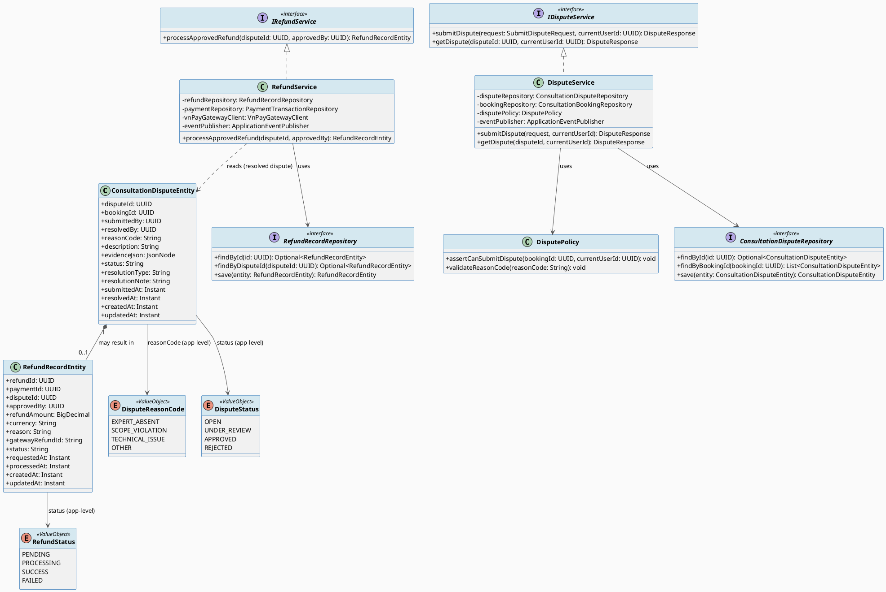
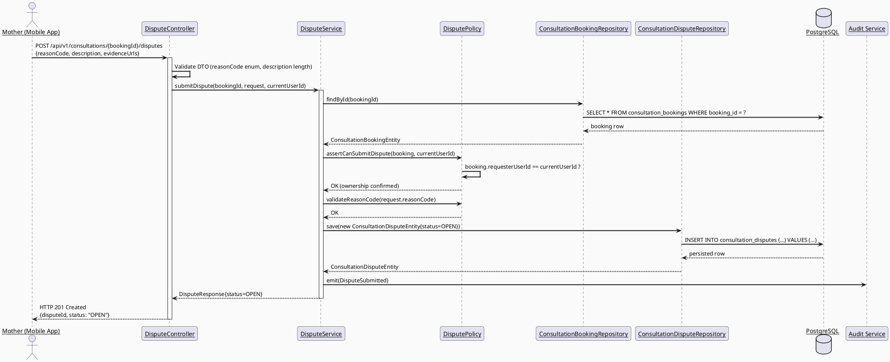
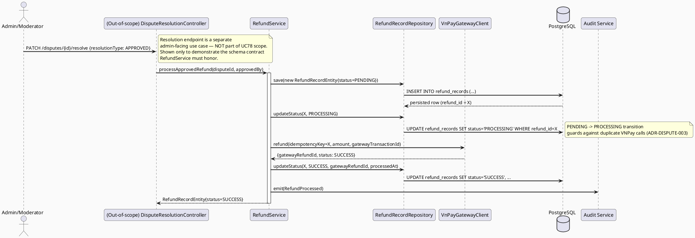
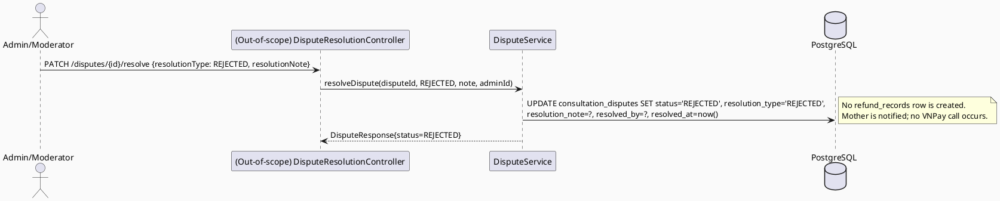
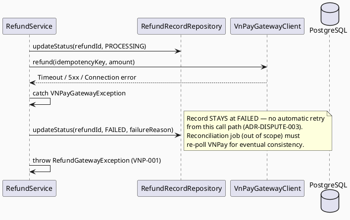
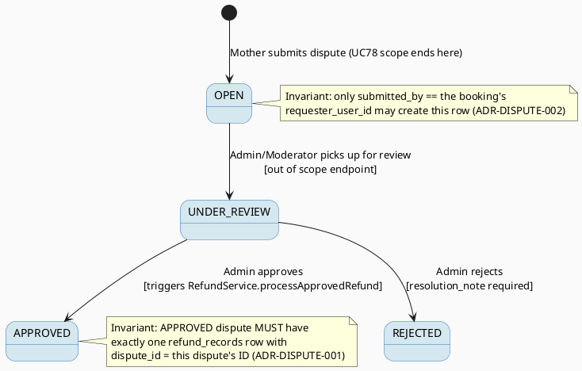
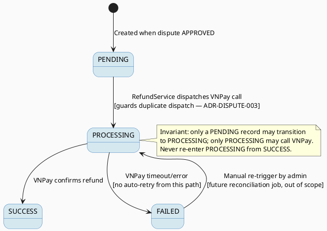

# ENGINEERING DOCUMENTATION STANDARD (EDS) v2.0
# UC78 — Submit Dispute or Refund Request — Technical Design Specification

| Field | Value |
|-------|-------|
| **Document ID** | `CB-CONSULTATION-IMP-078` |
| **Version** | `1.0` |
| **Date** | `2026-07-02` |
| **Status** | `Draft` |
| **Document Owner** | `TV4-Lâm` |
| **Author** | `AI Agent (Technical Architect)` |
| **Reviewed by** | `[Tech Lead — Pending]` |
| **DPO Sign-off** | `[ ] Pending` *(payment/dispute data touches financial + PII scope — see §1)* |
| **Approved by** | `[Principal Architect — Pending]` |
| **Last Review** | `2026-07-02` |
| **Based on EDS** | `v2.0` |

---

## CHANGELOG

| Ngày | Người thực hiện | Nội dung thay đổi |
|------|-----------------|-------------------|
| 2026-07-02 | AI Agent — Technical Architect | Tạo tài liệu lần đầu (Draft) cho UC78 |

---

## MỤC LỤC

1. [Tổng quan Module](#1-tổng-quan-module)
2. [Ma trận Truy vết (Traceability Matrix)](#2-ma-trận-truy-vết-traceability-matrix)
3. [Architecture Decision Records (ADR)](#3-architecture-decision-records-adr)
4. [Non-Functional Requirements & SLA](#4-non-functional-requirements--sla)
5. [Static Modeling (Mô hình Tĩnh)](#5-static-modeling-mô-hình-tĩnh)
6. [Dynamic Modeling (Mô hình Động)](#6-dynamic-modeling-mô-hình-động)
7. [Domain Event Catalog](#7-domain-event-catalog)
8. [Interface Specification (Đặc tả Giao diện)](#8-interface-specification-đặc-tả-giao-diện)
9. [API Specification](#9-api-specification)
10. [Bảng mã lỗi (Error Codes)](#10-bảng-mã-lỗi-error-codes)
11. [Quy trình Triển khai (Step-by-Step)](#11-quy-trình-triển-khai-step-by-step)
12. [Rollback & Incident Runbook](#12-rollback--incident-runbook)
13. [Kịch bản Kiểm thử Chi tiết](#13-kịch-bản-kiểm-thử-chi-tiết)
14. [Phương pháp Xác minh](#14-phương-pháp-xác-minh)
15. [Mẫu thử thực tế (API Verification Samples)](#15-mẫu-thử-thực-tế-api-verification-samples)
16. [Bảng tổng hợp phân quyền (Authorization Matrix)](#16-bảng-tổng-hợp-phân-quyền-authorization-matrix)
17. [AI Prompt Constraints (CASE 2.0)](#17-ai-prompt-constraints-case-20)

---

## 1. Tổng quan Module

| Field | Value |
|-------|-------|
| **Module Name** | `Consultation — Dispute & Refund` |
| **Bounded Context** | `Consultation` (package `com.carebridge.backend.consultation`) |
| **Function ID / UC** | `3.3.1.55 Submit Dispute or Refund Request` / `UC-78` |
| **Primary Actor** | Mother (booking owner) |
| **Secondary Actor** | VNPay Payment Gateway |
| **Platform** | Mobile App (Flutter) |
| **Priority** | High |
| **Sprint / Owner** | Sprint 2 "Complete Core CRUD And UI Wiring" — TV4-Lâm |
| **Data Classification** | `Sensitive-PII` (payment amount, dispute description, evidence attachments; indirectly linked to health-consultation context) |
| **Compliance Scope** | `PDPA (Luật 91/2025)`, internal `BR-RBAC`, `BR-PRIVACY`, `BR-CONSULTATION` |
| **Upstream Dependencies** | `Book Private Consultation (UC-75/3.3.1.52)`, `Pay Consultation Fee (UC-76/3.3.1.53)`, `Join Consultation Session (UC-77/3.3.1.54)`, `Process Payment Transaction (3.1.2.1)` — **ALL OUT OF SCOPE for this TDS and currently unimplemented (placeholder-only package)** |
| **Downstream Consumers** | Admin/Moderator dispute-review workspace (not yet specced), Commission/Settlement recalculation (`commission_records`, `settlement_records` — out of scope), Notification service |

### 1.1 Scope Statement — Greenfield within an existing schema contract

This module is **100% greenfield at the code level**. The backend package
`com.carebridge.backend.consultation` contains only `.gitkeep` placeholders in
`controller/dto/entity/mapper/policy/repository/service`; the mobile package
`lib/features/consultation/` is likewise placeholder-only
(`models/repositories/screens/services/widgets`, all `.gitkeep`).

However, the **PostgreSQL schema already models the full domain** in
`V1__init_schema.sql` (`consultation_bookings`, `consultation_sessions`,
`payment_transactions`, `consultation_disputes`, `refund_records`). This TDS
therefore designs UC78 **as if** the booking/payment/session domain model
described by the schema already exists, without inventing how those
prerequisite services will be implemented (that is explicitly out of scope —
see §1.2 Entry-Criteria Blocker below).

### 1.2 Entry-Criteria Blocker (Open — MUST be resolved before implementation)

> ⚠️ **UC78 CANNOT be implemented standalone.** It requires the following
> prerequisite services to exist and expose stable contracts first:
> - Booking creation/lifecycle service (`consultation_bookings` write path — UC-75/UC-76, likely `TV4-Lâm` scope, NOT covered by this TDS)
> - Payment capture service that populates `payment_transactions` with a
>   `PAID`/`SUCCESS`-equivalent state via VNPay (UC-76/`3.1.2.1 Process Payment Transaction`)
> - Session lifecycle service that can mark `consultation_sessions.session_status`
>   (UC-77)
>
> This TDS defines UC78 against the **schema contract only**. It does **not**
> assume a specific implementation shape for those prerequisite services beyond
> what the schema enforces (table/column names, FKs, defaults). Any mismatch
> discovered when those services are implemented must trigger a TDS revision
> before UC78 code is written. **Marked `Open` — Product/Tech Lead must confirm
> booking/payment/session services are implemented and stable before UC78
> Sprint work starts.**

---

## 2. Ma trận Truy vết (Traceability Matrix)

| Requirement ID | Loại (BR/ADR/US) | Mô tả yêu cầu | Thành phần Code | Compliance Target | ADR liên quan |
|----------------|------------------|---------------|-----------------|-------------------|---------------|
| UC-78 (SRS §3.3.1.55) | Use Case | Submit dispute when expert absent / scope violated / technical issue | `DisputeController.POST /disputes`, `DisputeService.submitDispute()` | BR-CONSULTATION | ADR-DISPUTE-001 |
| BR-RBAC | Business Rule | Users may access only functions allowed by role/permission scope | `DisputePolicy.assertOwnership()` | Authorization | ADR-DISPUTE-002 |
| BR-PRIVACY | Business Rule | Health/family data must follow consent, purpose, minimum-necessary access | `DisputeMapper` (DTO projection, no entity leakage) | PDPA | — |
| BR-CONSULTATION | Business Rule | Booking, payment, dispute, refund, pricing actions keep auditable lifecycle state | `ConsultationDisputeEntity.status`, `RefundRecordEntity.status`, audit log emission | PDPA / BR-AUDIT | ADR-DISPUTE-001, ADR-DISPUTE-003 |
| SRS E3 (external service/network/server failure — retry guidance, no duplicate unsafe action) | Exception Flow | VNPay refund API failure/timeout must not double-refund | `RefundService.processApprovedRefund()` idempotency key | BR-CONSULTATION | ADR-DISPUTE-003 |
| Schema: `consultation_disputes`, `refund_records` (`V1__init_schema.sql` L969-1000) | Schema Contract | Dispute/refund lifecycle persistence | `ConsultationDisputeEntity`, `RefundRecordEntity` | — | — |
| Entry-Criteria Blocker (§1.2) | Open Item | Booking/Payment/Session services must exist first | N/A — blocking dependency | — | — |

---

## 3. Architecture Decision Records (ADR)

### ADR-DISPUTE-001 — Dispute resolution requires manual admin/moderator approval before any refund is issued

| Field | Value |
|-------|-------|
| **Status** | `Proposed` *(requires Product/Tech Lead sign-off — SRS text is silent on approval workflow)* |
| **Deciders** | `AI Agent (proposal only) — pending TV4-Lâm / Tech Lead confirmation` |
| **Date** | `2026-07-02` |
| **Supersedes** | — |

#### Bối cảnh (Context)
The SRS UC-78 text (§3.3.1.55) is generic boilerplate shared across many use
cases — it does **not** specify whether a submitted dispute triggers an
automatic VNPay refund or requires human review first. The schema, however,
models this explicitly: `consultation_disputes.status` defaults to `'OPEN'`
and has a separate `resolved_by` (nullable `uuid` FK to `users`), plus
`refund_records.approved_by` (nullable `uuid` FK to `users`). This schema
shape strongly implies a two-step human-gated workflow: dispute is opened,
then a moderator/admin resolves it (approve/reject), and only on approval is
a `refund_records` row created and submitted to VNPay.

#### Các phương án đã xem xét (Options Considered)

| Phương án | Mô tả | Ưu điểm | Nhược điểm |
|-----------|-------|----------|------------|
| A | Auto-approve refund immediately on dispute submission (no human gate) | Fast Mother-facing UX | Financial fraud risk; violates "financial safety > convenience" default mandated by this task; no admin review of expert-absence/scope-violation claims |
| B | **Manual admin/moderator approval required before any VNPay refund call is made** | Matches `resolved_by`/`approved_by` schema shape; auditable; prevents fraudulent or mistaken refunds; aligns with BR-CONSULTATION auditable lifecycle | Slower for the Mother (dispute stays `OPEN`/`UNDER_REVIEW` until an admin acts) |
| C | Auto-approve only below a monetary threshold, manual above | Balances speed and safety | No threshold value exists in SRS/BR — would be invented; rejected to avoid inventing an unapproved business rule |

#### Quyết định (Decision)
Chọn **Phương án B** — refunds require manual admin/moderator approval before
any VNPay refund API call, because (1) the schema's `resolved_by`/`approved_by`
columns model a human-gated workflow, (2) `CLAUDE.md` requires "existing RBAC,
consent scope/expiry, and audit requirements" for payment-adjacent workflows,
and (3) the task's explicit safe-default instruction is "manual admin approval
required before actual VNPay refund call, since financial safety > convenience."
**This is a proposal — it must be confirmed by Product/Tech Lead before Sprint
implementation**, since the SRS itself does not state this explicitly (see
Open Items in Consistency Gate report).

#### Hệ quả (Consequences)

**Tích cực:**
- No dispute can result in money leaving the platform without a human-authorized action, satisfying `BR-CONSULTATION` auditable lifecycle.
- Clear separation of concerns: `DisputeService` (submission/triage) vs. a future `DisputeResolutionService` (admin action — **out of scope for this TDS**, since UC78's actor is the Mother, not the admin/moderator).

**Tiêu cực / Trade-offs:**
- The Mother does not get an instant refund; UX must clearly communicate "Pending review" state.
- The actual **admin-side resolve/approve endpoint** is a separate use case, not covered by UC78 (UC78's actor = Mother = submission only). This TDS defines the **submission side only** and the **schema contract** the resolution side must honor; the resolution-side controller/service is explicitly out of scope and should be tracked as a follow-up spec (e.g., a future `UC-Admin-ResolveDispute`).

**Compliance Impact:**
- Reduces payment fraud/chargeback risk; supports BR-CONSULTATION audit trail requirement.

---

### ADR-DISPUTE-002 — Ownership authorization: only the booking's requester may submit a dispute for that booking

| Field | Value |
|-------|-------|
| **Status** | `Accepted` |
| **Deciders** | `AI Agent — derived directly from schema + BR-RBAC` |
| **Date** | `2026-07-02` |

#### Bối cảnh (Context)
`consultation_disputes.submitted_by` is a `uuid NOT NULL` FK to `users`, and
`consultation_bookings.requester_user_id` identifies the Mother who made the
booking. BR-RBAC requires role/permission scoped access.

#### Các phương án đã xem xét (Options Considered)

| Phương án | Mô tả | Ưu điểm | Nhược điểm |
|-----------|-------|----------|------------|
| A | Any authenticated Mother can dispute any booking | Simple | Violates ownership/BR-RBAC; allows cross-account abuse |
| B | **Only `requester_user_id` of the target booking may submit; enforced server-side in `DisputePolicy`** | Matches schema FK semantics; prevents IDOR | Requires a policy check on every submission (negligible cost) |

#### Quyết định (Decision)
Chọn **Phương án B**. `DisputePolicy.assertCanSubmitDispute(bookingId, currentUserId)`
must verify `consultation_bookings.requester_user_id == currentUserId` before
allowing dispute creation. Non-owners receive `403 Forbidden` (`DISP-004`).

#### Hệ quả (Consequences)

**Tích cực:** Prevents IDOR / cross-tenant dispute submission.
**Tiêu cực / Trade-offs:** None material — this is a mandatory RBAC control, not a trade-off.
**Compliance Impact:** Satisfies BR-RBAC; supports minimum-necessary access under BR-PRIVACY.

---

### ADR-DISPUTE-003 — Refund transaction safety: idempotent VNPay refund calls keyed by `refund_records.refund_id`

| Field | Value |
|-------|-------|
| **Status** | `Accepted` |
| **Deciders** | `AI Agent — derived from SRS Exception E3 + CLAUDE.md payment-safety mandate` |
| **Date** | `2026-07-02` |

#### Bối cảnh (Context)
SRS Exception E3 requires "External service, network, or server failure is
handled with retry guidance and no duplicate unsafe action." A VNPay refund
API timeout/retry must never result in two refunds for one dispute.

#### Các phương án đã xem xét (Options Considered)

| Phương án | Mô tả | Ưu điểm | Nhược điểm |
|-----------|-------|----------|------------|
| A | Re-call VNPay refund on every retry without a guard | Simple | Double-refund risk on network flakiness |
| B | **Use `refund_records.refund_id` (UUID) as the VNPay idempotency/request key; guard state transitions so a refund already `PROCESSING`/`SUCCESS` cannot be re-submitted** | Prevents double refund; matches existing `refund_records.status` state column | Requires state-machine discipline in `RefundService` |

#### Quyết định (Decision)
Chọn **Phương án B**. Before calling VNPay's refund API, `RefundService` must
check `refund_records.status` is `PENDING`; transition to `PROCESSING` in the
same transaction that dispatches the VNPay call; only a `PENDING`→`PROCESSING`
transition may trigger a VNPay call. On VNPay timeout, the record stays
`PROCESSING` and a reconciliation job (out of scope, follow-up item) must poll
VNPay for final status — **do not blindly retry** from the client-facing
endpoint.

#### Hệ quả (Consequences)

**Tích cực:** No duplicate refunds on retry; auditable state machine.
**Tiêu cực / Trade-offs:** A stuck `PROCESSING` record requires a reconciliation mechanism not designed in this TDS (flagged as Open follow-up, not blocking UC78 submission-side scope).
**Compliance Impact:** Reduces financial-safety incident risk (CLAUDE.md payment workflow mandate).

---

### ADR-DISPUTE-004 — Dispute reason taxonomy: fixed enum-like set of `reason_code` values (application-level, not DB CHECK constraint)

| Field | Value |
|-------|-------|
| **Status** | `Proposed` *(taxonomy values are an AI-derived proposal from SRS description text — needs Product sign-off)* |
| **Deciders** | `AI Agent (proposal only)` |
| **Date** | `2026-07-02` |

#### Bối cảnh (Context)
`consultation_disputes.reason_code` is `varchar(50)` with **no CHECK
constraint** in `V1__init_schema.sql` (verified — only `audit_logs`,
`community_answers`, `community_questions`, `consent_grants`,
`otp_verifications`, `security_events` have `CHECK` constraints in the
schema; `consultation_disputes` has none). The SRS description says: "Submits
a dispute when the **expert is absent**, **scope is violated**, or a
**technical issue** occurs" — this gives exactly 3 named categories.

#### Các phương án đã xem xét (Options Considered)

| Phương án | Mô tả | Ưu điểm | Nhược điểm |
|-----------|-------|----------|------------|
| A | Free-text `reason_code`, no validation | Flexible | No consistent reporting/analytics; typo-prone |
| B | **Application-level enum validated in DTO/service, DB column stays free `varchar(50)` (no new migration)** | Matches SRS 3 categories; no schema change needed; still allows future extension without migration | Enum enforcement only at app layer, not DB — acceptable since DB is schema-of-record for existence, not full domain validation in this codebase's style (no CHECK constraints already exist on any consultation-domain table) |
| C | Add a DB CHECK constraint via new migration | Strong DB-level guarantee | Genuinely optional — no existing gap forces this; adds migration risk for a Sprint 2 CRUD-wiring task |

#### Quyết định (Decision)
Chọn **Phương án B**. Proposed taxonomy (values are an AI-derived proposal
from SRS wording — **flag for Product sign-off**):
- `EXPERT_ABSENT` — expert did not join / no-show
- `SCOPE_VIOLATION` — expert conduct/content outside agreed consultation scope
- `TECHNICAL_ISSUE` — session technical failure not attributable to the Mother
- `OTHER` — fallback for anything not covered above (needed so `description` free-text can carry detail without blocking submission)

No new Flyway migration is required for this decision (validated in DTO
`@Pattern`/enum layer, matching CareBridge's existing pattern of app-level
enum validation on similarly free `varchar` schema columns).

#### Hệ quả (Consequences)

**Tích cực:** Consistent dispute categorization for admin triage/reporting without a schema change.
**Tiêu cực / Trade-offs:** DB does not enforce the taxonomy; a bad row could theoretically bypass validation via direct SQL (accepted risk — same posture as many other free-text schema columns in this codebase).
**Compliance Impact:** None material.

---

## 4. Non-Functional Requirements & SLA

> No SRS/BR source specifies numeric SLA targets for UC78. Values below are
> **Open — proposed defaults**, consistent with the TDS template's baseline
> targets; must be confirmed by Tech Lead before being treated as binding.

### 4.1. Performance & Availability

| Category | Requirement | Target SLA | Measurement Method | Compliance Basis |
|----------|-------------|------------|---------------------|------------------|
| Latency | `POST /disputes` p99 (submission only, excludes VNPay call which is async post-approval) | `< 500ms` *(Open — proposed)* | Manual/API test timing | — |
| Availability | Dependent on booking/payment services (§1.2 blocker) | N/A until dependencies implemented | — | — |

### 4.2. Data Integrity & Retention

| Category | Requirement | Target | Verification Method | Compliance Basis |
|----------|-------------|--------|---------------------|------------------|
| Durability | No dispute/refund record loss | RPO = 0 (standard PostgreSQL transaction) | Transaction log | BR-CONSULTATION |
| Retention | Dispute/refund audit trail | Indefinite (append lifecycle, status-only updates) | DB inspection — no DELETE path exposed | PDPA |
| Consistency | Refund only linked to a `resolved`/approved dispute | 100% (enforced by `refund_records.dispute_id` FK + service-layer state check) | Reconciliation query | BR-CONSULTATION |

### 4.3. Security

| Category | Requirement | Target | Verification Method | Compliance Basis |
|----------|-------------|--------|---------------------|------------------|
| Access control | Role-based, ownership-scoped | Least privilege (Mother = own booking only) | Auth Matrix (§16) | BR-RBAC |
| Transport | All endpoints over TLS | TLS 1.2+ (platform default) | Existing infra config | — |
| Secrets | VNPay merchant secret/API key | Never logged, stored in `.env`/secret manager per existing CareBridge pattern | Log grep for secret patterns | BR-PRIVACY |

### 4.4. Scalability & Capacity Planning

Dispute submission volume is expected to be low relative to booking volume
(SRS marks UC78 "Frequency of Use: Occasional"). No special scaling design
needed beyond standard Spring Boot request handling.

---

## 5. Static Modeling (Mô hình Tĩnh)

### 5.1. Component Responsibilities & Planned File Paths

| Layer | File Path | Responsibility |
|-------|-----------|----------------|
| Controller | `src/main/java/com/carebridge/backend/consultation/controller/DisputeController.java` | HTTP mapping, DTO validation only |
| Service | `src/main/java/com/carebridge/backend/consultation/service/DisputeService.java` | Submission workflow, ownership check delegation, event emission |
| Service | `src/main/java/com/carebridge/backend/consultation/service/RefundService.java` | Refund state machine, VNPay call orchestration (invoked by future admin-resolution flow — interface defined here for contract stability) |
| Repository | `src/main/java/com/carebridge/backend/consultation/repository/ConsultationDisputeRepository.java` | Persistence for `consultation_disputes` |
| Repository | `src/main/java/com/carebridge/backend/consultation/repository/RefundRecordRepository.java` | Persistence for `refund_records` |
| Repository | `src/main/java/com/carebridge/backend/consultation/repository/ConsultationBookingRepository.java` | Read-only lookups needed for ownership/status checks (shared with prerequisite booking module — **interface only, implementation owned by booking feature**) |
| Entity | `src/main/java/com/carebridge/backend/consultation/entity/ConsultationDisputeEntity.java` | JPA mapping for `consultation_disputes` |
| Entity | `src/main/java/com/carebridge/backend/consultation/entity/RefundRecordEntity.java` | JPA mapping for `refund_records` |
| DTO | `src/main/java/com/carebridge/backend/consultation/dto/request/SubmitDisputeRequest.java` | Inbound payload |
| DTO | `src/main/java/com/carebridge/backend/consultation/dto/response/DisputeResponse.java` | Outbound payload |
| Mapper | `src/main/java/com/carebridge/backend/consultation/mapper/DisputeMapper.java` | Entity ↔ DTO, never expose entity |
| Policy | `src/main/java/com/carebridge/backend/consultation/policy/DisputePolicy.java` | Ownership check (ADR-DISPUTE-002), reason-code taxonomy validation (ADR-DISPUTE-004) |
| Mobile Model | `05_Development/CareBridgeMobileApp/lib/features/consultation/models/dispute.dart` | Dispute DTO mirror |
| Mobile Repository | `05_Development/CareBridgeMobileApp/lib/features/consultation/repositories/dispute_repository.dart` | API client for dispute submission |
| Mobile Service | `05_Development/CareBridgeMobileApp/lib/features/consultation/services/dispute_service.dart` | Client-side orchestration/state |
| Mobile Screen | `05_Development/CareBridgeMobileApp/lib/features/consultation/screens/submit_dispute_screen.dart` | Mother-facing submission UI |

### 5.2. Class Diagram (PlantUML)



### 5.3. Data Structure — Schema/Migration Details

> **CareBridge rule:** `V1__init_schema.sql` and approved Flyway migrations are
> primary source of truth. ERD is supporting context only.

**No new migration is required for the core dispute/refund submission flow.**
The following tables already exist and are sufficient for UC78's Mother-facing
submission scope (`V1__init_schema.sql`, verified line numbers):

```sql
-- consultation_disputes (V1__init_schema.sql L969-984)
CREATE TABLE public.consultation_disputes (
    dispute_id      uuid        NOT NULL DEFAULT gen_random_uuid(),
    booking_id      uuid        NOT NULL,
    submitted_by    uuid        NOT NULL,
    resolved_by     uuid,
    reason_code     varchar(50),
    description     text,
    evidence_json   jsonb,
    status          varchar(30) NOT NULL DEFAULT 'OPEN',
    resolution_type varchar(30),
    resolution_note text,
    submitted_at    timestamptz NOT NULL DEFAULT now(),
    resolved_at     timestamptz,
    created_at      timestamptz NOT NULL DEFAULT now(),
    updated_at      timestamptz NOT NULL DEFAULT now()
);
-- PK: dispute_id (L1440-1441); FK: booking_id -> consultation_bookings (L1868-1869),
-- submitted_by -> users (L1871-1872), resolved_by -> users (L1874-1875)
-- Index: idx_consultation_disputes_booking_id (L1646)

-- refund_records (V1__init_schema.sql L986-1000)
CREATE TABLE public.refund_records (
    refund_id         uuid        NOT NULL DEFAULT gen_random_uuid(),
    payment_id        uuid        NOT NULL,
    dispute_id        uuid,
    approved_by       uuid,
    refund_amount     numeric     NOT NULL,
    currency          varchar(10) NOT NULL DEFAULT 'VND',
    reason            text,
    gateway_refund_id varchar(255),
    status            varchar(30) NOT NULL DEFAULT 'PENDING',
    requested_at      timestamptz NOT NULL DEFAULT now(),
    processed_at      timestamptz,
    created_at        timestamptz NOT NULL DEFAULT now(),
    updated_at        timestamptz NOT NULL DEFAULT now()
);
-- PK: refund_id (L1443-1444); FK: payment_id -> payment_transactions (L1877-1878),
-- dispute_id -> consultation_disputes (L1880-1881)
```

**Genuine gap identified (Open — flag for confirmation, non-blocking for
submission-side scope):** No unique/partial index exists to prevent a booking
from accumulating multiple simultaneous `OPEN`/`UNDER_REVIEW` disputes, and no
index exists on `refund_records.payment_id` or `refund_records.dispute_id`
(only the FK exists, no explicit `CREATE INDEX`). This is a **performance/data-
quality gap, not a submission-blocking one** — recommend a follow-up migration
(NOT created in this TDS since it is an optimization, not a functional gap):

```sql
-- PROPOSED (Open — not created by this TDS; requires Tech Lead approval)
-- Migration file (IF approved): V20260702110000__add_dispute_refund_indexes.sql
CREATE INDEX idx_refund_records_payment_id ON public.refund_records(payment_id);
CREATE INDEX idx_refund_records_dispute_id ON public.refund_records(dispute_id);
-- Optional: partial unique index to prevent duplicate open disputes per booking
-- CREATE UNIQUE INDEX uq_consultation_disputes_open_booking
--   ON public.consultation_disputes(booking_id)
--   WHERE status IN ('OPEN','UNDER_REVIEW');
```

No sync action needed for `V1__init_schema.sql` since no migration is created
in this TDS iteration.

---

## 6. Dynamic Modeling (Mô hình Động)

### 6.1. Sequence Diagram — Happy Path: Submit Dispute (PlantUML)



### 6.2. Sequence Diagram — Happy Path: Admin Approves → VNPay Refund (context only — resolution endpoint is out of scope, shown to validate the schema contract UC78 emits into)



### 6.3. Sequence Diagram — Alternative: Dispute Rejected (PlantUML)



### 6.4. Sequence Diagram — Error Path: VNPay Refund API Failure/Timeout (PlantUML)



### 6.5. State Machine — Dispute Status (bắt buộc)





**⚠️ Invariant bất biến:**
1. A `refund_records` row may only exist for a dispute whose `status = APPROVED`.
2. A `refund_records.status` transition to `PROCESSING` may only occur once per `PENDING` state (idempotency guard, ADR-DISPUTE-003).
3. `consultation_disputes.submitted_by` must equal the target booking's `requester_user_id` at submission time (ADR-DISPUTE-002) — never mutated after creation.

---

## 7. Domain Event Catalog

### 7.1. Events Published (Phát ra)

| Event Name | Trigger | Publisher | Subscriber(s) | Payload Schema | Async? |
|------------|---------|-----------|---------------|----------------|--------|
| `DisputeSubmitted` | Mother successfully submits a dispute | `DisputeService` | Notification service (Admin alert — out of scope consumer), Audit log | `DisputeSubmitted.java` | Yes |
| `DisputeResolved` | Admin sets dispute to `APPROVED` or `REJECTED` (resolution endpoint out of scope, but event contract owned here since UC78 defines the dispute lifecycle) | `DisputeService`/future `DisputeResolutionService` | `RefundService` (on APPROVED), Notification service, Audit log | `DisputeResolved.java` | Yes |
| `RefundProcessed` | `RefundService` receives a terminal VNPay result (`SUCCESS`/`FAILED`) | `RefundService` | Commission/Settlement recalculation (out of scope consumer), Notification service, Audit log | `RefundProcessed.java` | Yes |

### 7.2. Events Consumed (Tiêu thụ)

| Event Name | Source | Handler | Action thực hiện |
|------------|--------|---------|------------------|
| `DisputeResolved` (payload.resolutionType = APPROVED) | Internal (same module, in-process for MVP) | `RefundService.onDisputeApproved()` | Create `refund_records` row with `status=PENDING`, kick off refund workflow (§6.2) |

### 7.3. Payload Schema

```java
// DisputeSubmitted.java
public record DisputeSubmitted(
    UUID    eventId,
    String  eventType,       // "DisputeSubmitted"
    Instant occurredAt,
    String  version,         // "1.0"
    Payload payload,
    Metadata metadata
) implements ApplicationEvent {

    public record Payload(
        UUID   disputeId,
        UUID   bookingId,
        UUID   submittedBy,
        String reasonCode     // EXPERT_ABSENT | SCOPE_VIOLATION | TECHNICAL_ISSUE | OTHER
    ) {}

    public record Metadata(
        UUID   correlationId,
        String causedBy       // userId
    ) {}
}

// DisputeResolved.java
public record DisputeResolved(
    UUID    eventId,
    String  eventType,       // "DisputeResolved"
    Instant occurredAt,
    String  version,
    Payload payload,
    Metadata metadata
) implements ApplicationEvent {

    public record Payload(
        UUID   disputeId,
        UUID   bookingId,
        UUID   resolvedBy,
        String resolutionType, // APPROVED | REJECTED
        String resolutionNote
    ) {}

    public record Metadata(
        UUID   correlationId,
        String causedBy
    ) {}
}

// RefundProcessed.java
public record RefundProcessed(
    UUID    eventId,
    String  eventType,       // "RefundProcessed"
    Instant occurredAt,
    String  version,
    Payload payload,
    Metadata metadata
) implements ApplicationEvent {

    public record Payload(
        UUID       refundId,
        UUID       disputeId,
        UUID       paymentId,
        BigDecimal refundAmount,
        String     status,        // SUCCESS | FAILED
        String     gatewayRefundId
    ) {}

    public record Metadata(
        UUID   correlationId,
        String causedBy           // "system" (VNPay callback/response handler)
    ) {}
}
```

---

## 8. Interface Specification (Đặc tả Giao diện)

### 8.1. Service Interface

```java
// SubmitDisputeRequest.java — Input DTO
// @version 1.0
public class SubmitDisputeRequest {
    @NotNull
    private UUID bookingId;

    @NotBlank
    @Pattern(regexp = "EXPERT_ABSENT|SCOPE_VIOLATION|TECHNICAL_ISSUE|OTHER")
    private String reasonCode;      // ADR-DISPUTE-004 taxonomy (app-level validation)

    @NotBlank
    @Size(max = 2000)
    private String description;

    private List<String> evidenceUrls; // Optional — persisted into evidence_json (jsonb)
    // getters / setters / @Valid annotations
}

// DisputeResponse.java — Output DTO
public class DisputeResponse {
    private UUID disputeId;
    private UUID bookingId;
    private String reasonCode;
    private String description;
    private String status;          // OPEN | UNDER_REVIEW | APPROVED | REJECTED
    private Instant submittedAt;
    private Instant resolvedAt;
    // getters / setters — NEVER expose submittedBy/resolvedBy raw user rows, only IDs already owned by caller context
}

// IDisputeService.java — Service Contract
// @version 1.0
public interface IDisputeService {
    /**
     * Submits a new dispute for a booking owned by the current user.
     * @throws DisputeAuthorizationException (DISP-004) if currentUserId is not the booking's requester
     * @throws DisputeValidationException (DISP-001) if reasonCode/description invalid
     * @throws DisputeConflictException (DISP-002) if booking already has an OPEN/UNDER_REVIEW dispute
     * @throws BookingNotFoundException (DISP-003) if bookingId does not exist
     */
    DisputeResponse submitDispute(SubmitDisputeRequest request, UUID currentUserId);

    /**
     * Retrieves a dispute — only the submitter or an admin/moderator may view it.
     * @throws DisputeAuthorizationException (DISP-004) if unauthorized
     * @throws DisputeNotFoundException (DISP-003) if not found
     */
    DisputeResponse getDispute(UUID disputeId, UUID currentUserId);
}

// IRefundService.java — Service Contract (invoked by future admin-resolution flow; interface stabilized here)
// @version 1.0
public interface IRefundService {
    /**
     * Creates and dispatches a refund for an APPROVED dispute. Idempotent per dispute
     * (ADR-DISPUTE-003) — a second call for an already-PROCESSING/SUCCESS refund is a no-op
     * that returns the existing record rather than re-calling VNPay.
     * @throws RefundGatewayException (VNP-001) on VNPay call failure/timeout
     * @throws RefundConflictException (DISP-005) if dispute is not APPROVED
     */
    RefundRecordEntity processApprovedRefund(UUID disputeId, UUID approvedBy);
}
```

### 8.2. Repository Interface

```java
// ConsultationDisputeRepository.java
// @version 1.0
public interface ConsultationDisputeRepository extends JpaRepository<ConsultationDisputeEntity, UUID> {

    Optional<ConsultationDisputeEntity> findById(UUID disputeId);

    List<ConsultationDisputeEntity> findByBookingId(UUID bookingId);

    @Query("SELECT d FROM ConsultationDisputeEntity d WHERE d.bookingId = :bookingId AND d.status IN ('OPEN','UNDER_REVIEW')")
    List<ConsultationDisputeEntity> findOpenDisputesByBookingId(UUID bookingId);

    // Append-mostly: no delete() exposed. Status transitions via @Modifying UPDATE only.
}

// RefundRecordRepository.java
// @version 1.0
public interface RefundRecordRepository extends JpaRepository<RefundRecordEntity, UUID> {

    Optional<RefundRecordEntity> findById(UUID refundId);

    Optional<RefundRecordEntity> findByDisputeId(UUID disputeId);

    // No delete() — refund records are immutable audit trail once created.
}
```

---

## 9. API Specification

### 9.1. Endpoints Table

| Method | Path | Auth Level | Required Roles | Rate Limit | Idempotent? |
|--------|------|------------|----------------|------------|-------------|
| `POST` | `/api/v1/consultations/bookings/{bookingId}/disputes` | JWT Bearer | `MOTHER` (booking owner only) | 20/min | No |
| `GET` | `/api/v1/consultations/disputes/{disputeId}` | JWT Bearer | `MOTHER` (own), `MODERATOR`, `SYSTEM_ADMIN` | 300/min | Yes |
| `GET` | `/api/v1/consultations/bookings/{bookingId}/disputes` | JWT Bearer | `MOTHER` (own), `MODERATOR`, `SYSTEM_ADMIN` | 300/min | Yes |

> Resolution/approval endpoints (`PATCH /disputes/{id}/resolve`) are **out of
> scope for UC78** (admin-actor use case) — listed in §6.2/§6.3 sequence
> diagrams only to validate the schema contract, not specified here as an API.

### 9.2. Request / Response Schemas

#### `POST /api/v1/consultations/bookings/{bookingId}/disputes` — Submit dispute

**Request Body:**
```json
{
  "reasonCode": "EXPERT_ABSENT",
  "description": "Expert did not join the scheduled video session after 15 minutes.",
  "evidenceUrls": ["https://storage.carebridge.dev/evidence/abc123.png"]
}
```

**Response — 201 Created (Happy Path):**
```json
{
  "disputeId": "550e8400-e29b-41d4-a716-446655440000",
  "bookingId": "3fa85f64-5717-4562-b3fc-2c963f66afa6",
  "reasonCode": "EXPERT_ABSENT",
  "description": "Expert did not join the scheduled video session after 15 minutes.",
  "status": "OPEN",
  "submittedAt": "2026-07-02T08:00:00.000Z",
  "resolvedAt": null
}
```

**Response — 400 Bad Request (Validation Error):**
```json
{
  "error": {
    "code": "DISP-001",
    "message": "reasonCode must be one of EXPERT_ABSENT, SCOPE_VIOLATION, TECHNICAL_ISSUE, OTHER",
    "details": [
      { "field": "reasonCode", "message": "invalid enum value" }
    ]
  }
}
```

**Response — 403 Forbidden (Not booking owner):**
```json
{
  "error": {
    "code": "DISP-004",
    "message": "You are not authorized to submit a dispute for this booking"
  }
}
```

**Response — 409 Conflict (Duplicate open dispute):**
```json
{
  "error": {
    "code": "DISP-002",
    "message": "An open dispute already exists for this booking"
  }
}
```

---

## 10. Bảng mã lỗi (Error Codes)

| Code | HTTP Status | Message (EN) | Message (VI) | Trigger Condition |
|------|-------------|--------------|--------------|-------------------|
| `DISP-001` | 400 | Validation failed | Dữ liệu không hợp lệ | `reasonCode` not in taxonomy, `description` blank/too long |
| `DISP-002` | 409 | An open dispute already exists for this booking | Đã tồn tại khiếu nại đang mở cho booking này | Booking already has `OPEN`/`UNDER_REVIEW` dispute |
| `DISP-003` | 404 | Booking or dispute not found | Không tìm thấy booking hoặc khiếu nại | `bookingId`/`disputeId` does not exist |
| `DISP-004` | 403 | Insufficient permissions | Không đủ quyền | Current user is not the booking's `requester_user_id` (or not admin/moderator for `GET`) |
| `DISP-005` | 409 | Refund cannot be processed — dispute not approved | Không thể xử lý hoàn tiền — khiếu nại chưa được duyệt | `RefundService.processApprovedRefund` called on a non-`APPROVED` dispute |
| `DISP-006` | 400 | Consultation not eligible for dispute (wrong booking status) | Booking chưa đủ điều kiện khiếu nại | Booking status is not in an eligible state (e.g., still `PENDING_PAYMENT`) — **Open: exact eligible-status set pending confirmation from booking/payment TDS** |
| `VNP-001` | 503 | VNPay refund gateway unavailable or timed out | Cổng thanh toán VNPay không khả dụng hoặc quá thời gian chờ | VNPay refund API call fails/times out (ADR-DISPUTE-003) |
| `DISP-500` | 500 | Internal error | Lỗi hệ thống | Unexpected failure |

---

## 11. Quy trình Triển khai (Step-by-Step)

### 11.1. Prerequisites

- [ ] **BLOCKING:** Booking creation service (UC-75/UC-76) implemented and `consultation_bookings` rows exist with real `requester_user_id`/`status`
- [ ] **BLOCKING:** Payment capture service populates `payment_transactions` with a paid state (UC-76/`3.1.2.1`)
- [ ] ADR-DISPUTE-001, ADR-DISPUTE-004 confirmed by Product/Tech Lead (currently `Proposed`)
- [ ] DPO review for dispute evidence attachments (may contain PII/media) — sign-off pending
- [ ] Principal Architect approves this TDS

### 11.2. Pre-Migration Checklist

- [ ] **N/A for core flow** — no new migration required (see §5.3)
- [ ] IF the optional index migration (§5.3) is approved: back up DB, test on staging ≥ 24h, verify rollback script

### 11.3. Implementation Steps

#### Chặng 1 — Entities + Repositories
Create `ConsultationDisputeEntity`, `RefundRecordEntity` JPA entities mapped
1:1 to existing schema (§5.3). No migration needed.

#### Chặng 2 — Policy + Service
Implement `DisputePolicy` (ownership + taxonomy validation), `DisputeService`
(submission workflow), `RefundService` (interface + state machine, VNPay
integration stubbed behind `VnPayGatewayClient` interface — pending real VNPay
SDK wiring since no existing VNPay integration pattern exists in the repo yet).

#### Chặng 3 — Controller + Mobile
Wire `DisputeController`, then Mobile `dispute_repository.dart` +
`submit_dispute_screen.dart`.

#### Chặng 4 — Verification sau deploy

```bash
curl -X GET https://[host]/api/v1/health
# Expected: {"status": "ok"}
```

### 11.4. Deployment Checklist

- [ ] `./mvnw test` green
- [ ] Error rate < 1% in first 10 minutes
- [ ] Audit log emits `DisputeSubmitted` in correct format
- [ ] No PII/evidence URLs leaked in application logs

---

## 12. Rollback & Incident Runbook

### 12.1. Điều kiện kích hoạt Rollback

| Điều kiện | Ngưỡng | Người quyết định |
|-----------|--------|------------------|
| Error rate tăng đột biến | > 5% trong 5 phút | On-call Engineer |
| Duplicate refund detected | Any single occurrence | Tech Lead + DPO (financial incident) |
| Dữ liệu không nhất quán (dispute without booking) | Bất kỳ case nào | Tech Lead |

### 12.2. Rollback Procedure

```bash
# No new migration in baseline scope — code-only rollback:
git checkout -- 05_Development/CareBridgeAPI/src/main/java/com/carebridge/backend/consultation/
git checkout -- 05_Development/CareBridgeMobileApp/lib/features/consultation/

# IF optional index migration (§5.3) was applied:
psql -h $DB_HOST -U $DB_USER -d $DB_NAME \
  -c "DROP INDEX IF EXISTS idx_refund_records_payment_id, idx_refund_records_dispute_id;"
psql -h $DB_HOST -U $DB_USER -d $DB_NAME \
  -c "DELETE FROM flyway_schema_history WHERE version = '20260702110000';"
```

### 12.3. Notification Protocol

| Thời điểm | Người nhận | Kênh | Template |
|-----------|------------|------|----------|
| Ngay khi phát hiện duplicate refund | On-call + Finance + DPO | Slack `#incident` + Email | "🚨 Duplicate VNPay refund detected for dispute [id]" |

### 12.4. Post-Incident Review (PIR)

Standard PIR within 48h for any financial-safety incident (duplicate refund,
unauthorized dispute submission).

---

## 13. Kịch bản Kiểm thử Chi tiết

> Detailed test cases live in `UC78_SubmitDisputeOrRefundRequest_Test-Spec.md`.
> This section references condition IDs only.

| Condition Ref | Summary |
|----------------|---------|
| TC-COND-001 | Happy path — Mother submits valid dispute for own booking |
| TC-COND-002 | Ownership violation — non-owner submits dispute → 403 |
| TC-COND-003 | Duplicate open dispute → 409 |
| TC-COND-004 | Invalid reasonCode → 400 |
| TC-COND-005 | VNPay refund timeout/failure → 503, no duplicate refund record |
| TC-COND-006 | Refund idempotency — repeated approval call is a no-op |

---

## 14. Phương pháp Xác minh

### 14.1. Database Inspection

```sql
SELECT dispute_id, booking_id, submitted_by, status, reason_code
FROM consultation_disputes
WHERE dispute_id = '[uuid]';

SELECT refund_id, dispute_id, status, gateway_refund_id
FROM refund_records
WHERE dispute_id = '[uuid]';

-- Verify no duplicate refund per dispute
SELECT dispute_id, COUNT(*) FROM refund_records GROUP BY dispute_id HAVING COUNT(*) > 1;
-- Expected: no rows
```

### 14.2. Log / Audit Verification

```bash
kubectl logs -l app=carebridge-api | grep '"eventType":"DisputeSubmitted"' | head -5
kubectl logs -l app=carebridge-api | grep -i "vnpay" | grep -i "secret\|apikey"
# Expected: No secret values in logs
```

---

## 15. Mẫu thử thực tế (API Verification Samples)

### 15.1. Happy Path

```bash
curl -X POST https://[host]/api/v1/consultations/bookings/{bookingId}/disputes \
  -H "Authorization: Bearer [JWT_TOKEN — mother@carebridge.dev]" \
  -H "Content-Type: application/json" \
  -d '{
    "reasonCode": "EXPERT_ABSENT",
    "description": "Expert did not join within 15 minutes.",
    "evidenceUrls": []
  }'
```

**Expected Response (201):** see §9.2.

### 15.2. Error Paths

```bash
# Non-owner attempts dispute submission → 403
curl -X POST https://[host]/api/v1/consultations/bookings/{otherUsersBookingId}/disputes \
  -H "Authorization: Bearer [JWT_TOKEN — different mother]" \
  -H "Content-Type: application/json" \
  -d '{"reasonCode": "EXPERT_ABSENT", "description": "test"}'
```

**Expected Response (403):** see `DISP-004` in §10.

---

## 16. Bảng tổng hợp phân quyền (Authorization Matrix)

| Endpoint | `GUEST` | `MOTHER` (non-owner) | `MOTHER` (owner) | `MODERATOR` | `SYSTEM_ADMIN` |
|----------|---------|----------------------|-------------------|--------------|-----------------|
| `POST /consultations/bookings/{id}/disputes` | ❌ | ❌ (`DISP-004`) | ✅ | ❌ | ❌ |
| `GET /consultations/disputes/{id}` | ❌ | ❌ (`DISP-004`) | ✅ Own | ✅ All | ✅ All |
| `GET /consultations/bookings/{id}/disputes` | ❌ | ❌ (`DISP-004`) | ✅ Own | ✅ All | ✅ All |
| *(Out of scope)* `PATCH /disputes/{id}/resolve` | ❌ | ❌ | ❌ | ✅ *(future spec)* | ✅ *(future spec)* |

**Chú thích:**
- ✅ = Được phép; ❌ = Bị từ chối (403); `Own` = chỉ với booking của chính mình.
- Resolution endpoint role scope is **Open** — deferred to a future admin-side spec, not decided here.

---

## 17. AI Prompt Constraints (CASE 2.0)

### 17.1 Constraint Summary Table

| # | Constraint | Source (ADR/BR) | Last Verified |
|---|-----------|-----------------|---------------|
| C1 | Refunds MUST NOT be auto-approved or auto-dispatched to VNPay on dispute submission — a human admin/moderator approval step is mandatory before any `refund_records` row transitions past `PENDING` | `ADR-DISPUTE-001` | `2026-07-02` |
| C2 | Only the booking's `requester_user_id` may submit a dispute for that booking; enforced in `DisputePolicy`, never trust client-supplied user identity beyond the JWT `sub` claim | `ADR-DISPUTE-002` / `BR-RBAC` | `2026-07-02` |
| C3 | VNPay refund calls must be idempotent — guarded by `refund_records.status` PENDING→PROCESSING transition; never re-call VNPay for a record already `PROCESSING` or `SUCCESS` | `ADR-DISPUTE-003` | `2026-07-02` |
| C4 | Use `com.carebridge.backend.consultation` package layout exactly: `controller/service/repository/entity/dto/mapper/policy` per `CLAUDE.md` | `CLAUDE.md` Architecture | `2026-07-02` |
| C5 | Never expose `ConsultationDisputeEntity`/`RefundRecordEntity` directly in API responses — always map through `DisputeMapper`/DTOs | `CLAUDE.md` Delivery Rules | `2026-07-02` |

> ⚠️ **`Last Verified` > 2 sprints → constraint cần được re-verify trước khi inject.**

### 17.2 Constraint Injection Block (Copy-Paste vào AI Prompt)

```
[CONSTRAINT BLOCK — Module: Consultation Dispute & Refund (UC78)]
Theo TDS CB-CONSULTATION-IMP-078 và các ADR liên quan:

1. (C1) KHÔNG được tự động approve hoặc dispatch VNPay refund khi dispute được submit —
   BẮT BUỘC có bước duyệt thủ công của admin/moderator trước khi refund_records
   chuyển trạng thái quá PENDING.
2. (C2) CHỈ requester_user_id của booking mới được submit dispute cho booking đó —
   kiểm tra trong DisputePolicy, không tin danh tính client gửi lên ngoài JWT `sub`.
3. (C3) Lời gọi VNPay refund PHẢI idempotent — dùng chuyển trạng thái
   refund_records.status PENDING->PROCESSING làm guard; KHÔNG gọi lại VNPay
   cho record đã PROCESSING hoặc SUCCESS.
4. (C4) Dùng đúng cấu trúc package com.carebridge.backend.consultation:
   controller/service/repository/entity/dto/mapper/policy.
5. (C5) KHÔNG bao giờ trả JPA entity trực tiếp trong API response — luôn map qua DTO.

[CONTEXT BLOCK]
- Bounded Context: Consultation
- Data Classification: Sensitive-PII
- Compliance: PDPA (Luật 91/2025), BR-RBAC, BR-PRIVACY, BR-CONSULTATION
- Existing interfaces: §8 Service Interface + §8.2 Repository Interface
- Error codes: §10 Error Codes Table
- Auth matrix: §16 Authorization Matrix

[TASK BLOCK]
Implement {feature/method} thỏa mãn constraints trên.
Output phải tuân thủ §8 Interface Specification.
Tests phải cover §13 Test Scenarios (see Test-Spec document).
```

### 17.3 Constraint Quality Checklist

- [x] Mỗi constraint traceable về ADR hoặc BR cụ thể
- [x] Không có constraint generic
- [x] Mỗi constraint có `Last Verified` date ≤ 2 sprints
- [x] Constraint block có ≥ 3 constraints cụ thể
- [x] Constraint block reference §8 Interface
- [x] Constraint block reference §16 Auth Matrix

### 17.4 Anti-Pattern Detection (cho AI-Generated Code từ Block này)

| AP-ID | Anti-Pattern | Dấu hiệu | Hành động |
|-------|-------------|-----------|----------|
| AP-AI-001 | Unconstrained Gen | Code không match bất kỳ constraint C1-C5 nào | Reject — inject lại constraints |
| AP-AI-003 | Implicit Decision | Code assumes an auto-refund workflow not in §3 ADR | Reject — viết ADR trước |
| AP-AI-005 | Hallucinated Contract | Code imports a VNPay SDK class/service not declared in §8 | Reject — verify contract existence |
| AP-CB-001 *(project-specific)* | **Auto-approving refund without admin gate** | `RefundService` calls VNPay directly from `DisputeService.submitDispute()` without an intervening admin-approval state check | Reject — violates ADR-DISPUTE-001; must require `status=APPROVED` precondition |

---

## PHỤ LỤC

### A. Glossary

| Thuật ngữ | Định nghĩa |
|-----------|------------|
| IDOR | Insecure Direct Object Reference — accessing another user's resource by guessing/manipulating an ID |
| Idempotent | An operation that produces the same result no matter how many times it is safely repeated |
| PDPA | Vietnam Personal Data Protection regulation (Luật 91/2025 context in this repo) |

### B. Tài liệu tham chiếu

| Document | Link / Path |
|----------|-------------|
| SRS §3.3.1.55 | `02_Requirements/SRS/3_Functional_Specification.md` L2914-2933 |
| Task allocation (TV4-Lâm) | `04_Implement/implement_artifacts/function-spec-task-allocation.md` L398-422 |
| Schema source of truth | `05_Development/CareBridgeAPI/src/main/resources/db/migration/V1__init_schema.sql` L969-1000, L1859-1882 |
| CareBridge project rules | `CLAUDE.md` |
| Related use case (out of scope, prerequisite) | `UC154_EstablishRealtimeCommunicationSession` (pattern reference only, not a dependency of UC78) |

---

*TDS UC78 v1.0 — Draft. Requires Product/Tech Lead sign-off on ADR-DISPUTE-001 and ADR-DISPUTE-004 before Status may change to Approved.*
