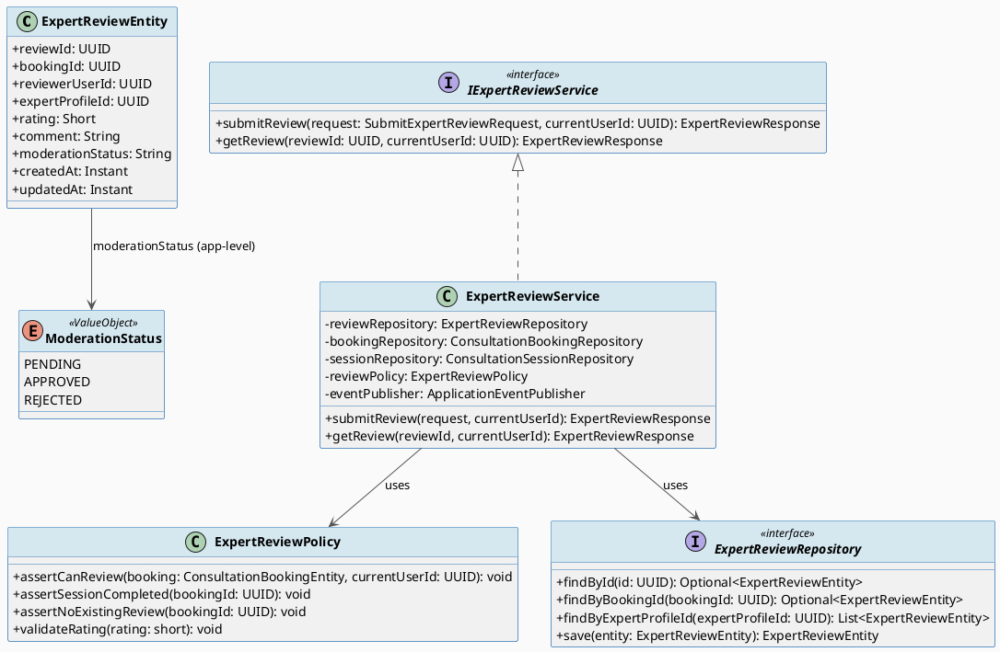
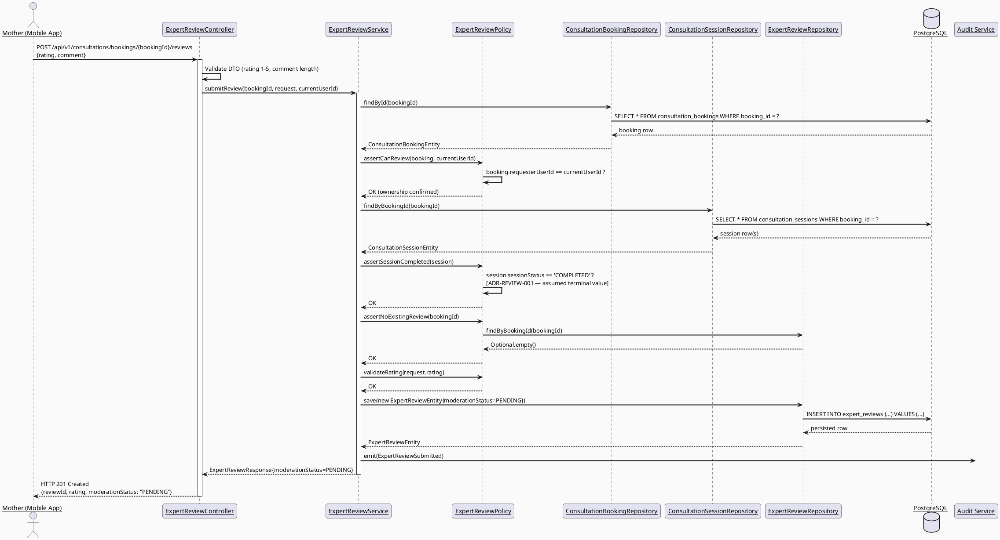
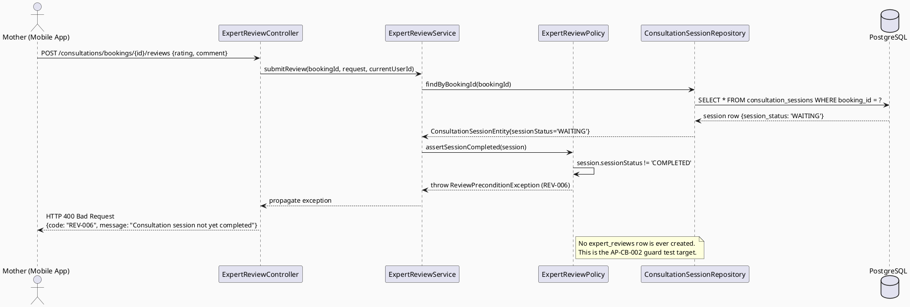
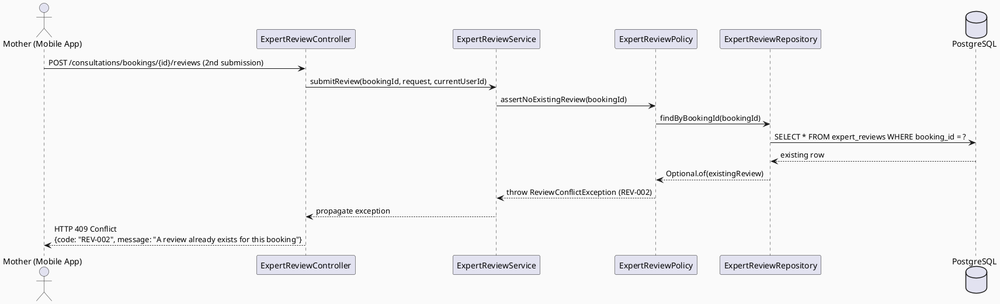
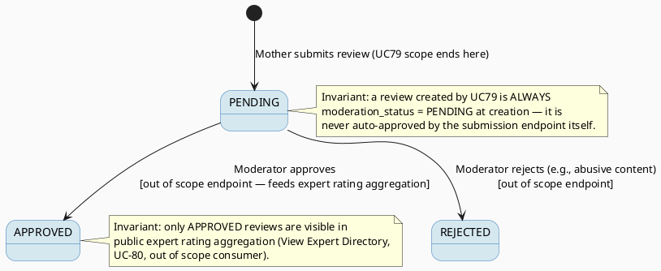

# ENGINEERING DOCUMENTATION STANDARD (EDS) v2.0
# UC79 — Review Expert After Consultation — Technical Design Specification

| Field | Value |
|-------|-------|
| **Document ID** | `CB-CONSULTATION-IMP-079` |
| **Version** | `1.0` |
| **Date** | `2026-07-02` |
| **Status** | `Draft` |
| **Document Owner** | `TV4-Lâm` |
| **Author** | `AI Agent (Technical Architect)` |
| **Reviewed by** | `[Tech Lead — Pending]` |
| **DPO Sign-off** | `[ ] Pending` *(review comment/rating text is user-generated content about an expert — moderation & PII-adjacent)* |
| **Approved by** | `[Principal Architect — Pending]` |
| **Last Review** | `2026-07-02` |
| **Based on EDS** | `v2.0` |

---

## CHANGELOG

| Ngày | Người thực hiện | Nội dung thay đổi |
|------|-----------------|-------------------|
| 2026-07-02 | AI Agent — Technical Architect | Tạo tài liệu lần đầu (Draft) cho UC79 |

---

## MỤC LỤC

1. [Tổng quan Module](#1-tổng-quan-module)
2. [Ma trận Truy vết (Traceability Matrix)](#2-ma-trận-truy-vết-traceability-matrix)
3. [Architecture Decision Records (ADR)](#3-architecture-decision-records-adr)
4. [Non-Functional Requirements & SLA](#4-non-functional-requirements--sla)
5. [Static Modeling (Mô hình Tĩnh)](#5-static-modeling-mô-hình-tĩnh)
6. [Dynamic Modeling (Mô hình Động)](#6-dynamic-modeling-mô-hình-động)
7. [Domain Event Catalog](#7-domain-event-catalog)
8. [Interface Specification (Đặc tả Giao diện)](#8-interface-specification-đặc-tả-giao-diện)
9. [API Specification](#9-api-specification)
10. [Bảng mã lỗi (Error Codes)](#10-bảng-mã-lỗi-error-codes)
11. [Quy trình Triển khai (Step-by-Step)](#11-quy-trình-triển-khai-step-by-step)
12. [Rollback & Incident Runbook](#12-rollback--incident-runbook)
13. [Kịch bản Kiểm thử Chi tiết](#13-kịch-bản-kiểm-thử-chi-tiết)
14. [Phương pháp Xác minh](#14-phương-pháp-xác-minh)
15. [Mẫu thử thực tế (API Verification Samples)](#15-mẫu-thử-thực-tế-api-verification-samples)
16. [Bảng tổng hợp phân quyền (Authorization Matrix)](#16-bảng-tổng-hợp-phân-quyền-authorization-matrix)
17. [AI Prompt Constraints (CASE 2.0)](#17-ai-prompt-constraints-case-20)

---

## 1. Tổng quan Module

| Field | Value |
|-------|-------|
| **Module Name** | `Consultation — Expert Review` |
| **Bounded Context** | `Consultation` (package `com.carebridge.backend.consultation`) |
| **Function ID / UC** | `3.3.1.56 Review Expert After Consultation` / `UC-79` |
| **Primary Actor** | Mother (booking owner) |
| **Secondary Actor** | ZegoCloud Realtime Service *(see §1.3 — verified NOT a direct runtime dependency of UC79 itself)* |
| **Platform** | Mobile App (Flutter) |
| **Priority** | High |
| **Sprint / Owner** | Sprint 2 "Complete Core CRUD And UI Wiring" — TV4-Lâm |
| **Data Classification** | `Internal` / `PII-adjacent` (rating + free-text comment about a named expert; moderatable user-generated content) |
| **Compliance Scope** | `PDPA (Luật 91/2025)`, internal `BR-RBAC`, `BR-PRIVACY`, `BR-CONSULTATION` |
| **Upstream Dependencies** | `Book Private Consultation (UC-75/3.3.1.52)`, `Join Consultation Session (UC-77/3.3.1.54)` — **OUT OF SCOPE, currently unimplemented (placeholder-only package)** |
| **Downstream Consumers** | Expert directory rating aggregation (`3.3.1.57 View Expert Directory` — out of scope), Content moderation workspace (existing community moderation pattern, see §1.4) |

### 1.1 Scope Statement — Greenfield within an existing schema contract

Same greenfield posture as UC78 (see sibling TDS `CB-CONSULTATION-IMP-078`
§1.1): backend `com.carebridge.backend.consultation` package and mobile
`lib/features/consultation/` are placeholder-only. The schema
(`expert_reviews` table, `V1__init_schema.sql` L957-967) already models the
review domain. This TDS designs UC79 against that schema contract.

### 1.2 Entry-Criteria Blocker (Open — MUST be resolved before implementation)

> ⚠️ **UC79 CANNOT be implemented standalone.** It requires:
> - Booking creation/lifecycle service (`consultation_bookings` — UC-75/76, out of scope here)
> - Session lifecycle service that marks `consultation_sessions.session_status`
>   as a terminal "completed" value (UC-77) — **the exact terminal status string
>   is not yet defined anywhere in the repo since UC-77 is unimplemented; this
>   TDS assumes a value of `COMPLETED` by analogy with other status columns in
>   the schema (e.g., `expert_credentials.review_status` uses `'PENDING'` as
>   default), but this is an assumption, not a confirmed contract — see
>   ADR-REVIEW-001.**
>
> **Marked `Open`** — Product/Tech Lead must confirm the exact
> `consultation_sessions.session_status` terminal value and the exact
> `consultation_bookings.status` value that gates review eligibility before
> UC79 Sprint work starts.

### 1.3 ZegoCloud Secondary Actor — Verified Non-Dependency

The SRS lists "ZegoCloud Realtime Service" as UC79's secondary actor. Cross-
checking against `UC154_EstablishRealtimeCommunicationSession` (the only
existing ZegoCloud-pattern reference in the repo, itself still a Draft TDS,
not implemented) confirms ZegoCloud's role is **establishing the realtime
session** (UC-77 territory), not reviewing. UC79's Normal Flow in the SRS
(§3.3.1.56, generic template) never mentions calling any realtime API. **This
TDS concludes UC79 does NOT call ZegoCloud APIs directly** — the "secondary
actor" designation exists only because the review's *precondition* (a
completed consultation session) was mediated by ZegoCloud in UC-77. UC79 only
needs to read `consultation_sessions.session_status` from the database, not
call ZegoCloud. This is stated explicitly to prevent an AI implementation from
hallucinating a ZegoCloud SDK call inside the review flow (see §17.4 AP-CB-002).

### 1.4 Moderation Pattern Reference

No existing content-moderation service code was found for community posts
either (community package also appears to be early-stage per repo structure).
`expert_reviews.moderation_status` defaults to `'PENDING'` in the schema
(`V1__init_schema.sql` L964), which is the same default-pending pattern used
elsewhere (e.g., `expert_credentials.review_status` defaults to `'PENDING'`,
`community_answers`/`community_questions` have `status` CHECK constraints
including `'PENDING'`). This TDS follows that established default-pending
convention: **a newly submitted review is `moderation_status='PENDING'`** and
is only shown in aggregate expert ratings once approved by moderation (actual
moderation action endpoint is a separate use case, out of scope for UC79,
analogous to UC78's dispute-resolution being out of scope).

---

## 2. Ma trận Truy vết (Traceability Matrix)

| Requirement ID | Loại (BR/ADR/US) | Mô tả yêu cầu | Thành phần Code | Compliance Target | ADR liên quan |
|----------------|------------------|---------------|-----------------|-------------------|---------------|
| UC-79 (SRS §3.3.1.56) | Use Case | Reviews the expert after a confirmed consultation session | `ExpertReviewController.POST /reviews`, `ExpertReviewService.submitReview()` | BR-CONSULTATION | ADR-REVIEW-001 |
| BR-RBAC | Business Rule | Users may access only functions allowed by role/permission scope | `ExpertReviewPolicy.assertCanReview()` | Authorization | ADR-REVIEW-002 |
| BR-PRIVACY | Business Rule | Health/family data must follow consent, purpose, minimum-necessary access | `ExpertReviewMapper` (DTO projection) | PDPA | — |
| BR-CONSULTATION | Business Rule | Booking/consultation actions keep auditable lifecycle state | `ExpertReviewEntity.moderationStatus`, audit log emission | PDPA / BR-AUDIT | ADR-REVIEW-003 |
| Schema: `expert_reviews` (`V1__init_schema.sql` L957-967) | Schema Contract | Review persistence — `rating`, `comment`, `moderation_status` | `ExpertReviewEntity` | — | — |
| Entry-Criteria Blocker (§1.2) | Open Item | Booking/Session services must exist first; terminal status value unconfirmed | N/A — blocking dependency | — | — |

---

## 3. Architecture Decision Records (ADR)

### ADR-REVIEW-001 — Review is only permitted after the linked session reaches a completed terminal state

| Field | Value |
|-------|-------|
| **Status** | `Proposed` *(terminal status string is an assumption pending UC-77 confirmation — see §1.2)* |
| **Deciders** | `AI Agent (proposal) — pending TV4-Lâm / Tech Lead confirmation` |
| **Date** | `2026-07-02` |

#### Bối cảnh (Context)
SRS UC-79 description: "Reviews the expert **after a confirmed consultation
session**." The schema has `consultation_sessions.session_status varchar(30)
NOT NULL DEFAULT 'WAITING'` (L904) and `consultation_bookings.status
varchar(30) NOT NULL DEFAULT 'PENDING_PAYMENT'` (L893) — both free-text status
columns with no CHECK constraint, so the exact terminal value naming
convention is not fixed by the DB. Since UC-77 (which would set this value) is
unimplemented, the exact string is unknown.

#### Các phương án đã xem xét (Options Considered)

| Phương án | Mô tả | Ưu điểm | Nhược điểm |
|-----------|-------|----------|------------|
| A | Allow review any time after booking creation (no session-state check) | Simple | Directly violates SRS wording "after a confirmed consultation session"; allows reviewing an expert never actually met |
| B | **Require `consultation_sessions.session_status == 'COMPLETED'` (assumed value) for the session linked to the booking before allowing a review** | Matches SRS intent; safest interpretation | Terminal value name is an assumption — must be reconciled with UC-77 TDS once written |
| C | Require `consultation_bookings.status == 'COMPLETED'` instead of checking the session | Simpler (avoids joining to `consultation_sessions`) | Booking status and session status may diverge (e.g., booking marked complete without session actually running) — schema models them as separate entities on purpose |

#### Quyết định (Decision)
Chọn **Phương án B**: check `consultation_sessions.session_status ==
'COMPLETED'` (assumed literal) for the session(s) linked to the target
`booking_id`. **This value is an assumption, not a confirmed contract — flagged
Open.** If UC-77's actual terminal value differs (e.g., `'ENDED'` or
`'FINISHED'`), this ADR and the corresponding policy check must be updated
before merge; do not silently implement against an assumed string without
Tech Lead sign-off once UC-77 is real.

#### Hệ quả (Consequences)

**Tích cực:** Directly encodes the SRS precondition; prevents premature/fake reviews.
**Tiêu cực / Trade-offs:** Coupling to an unconfirmed enum value in a sibling unimplemented module; must be revisited.
**Compliance Impact:** Supports BR-CONSULTATION auditable-lifecycle requirement (a review is evidence tied to a real completed session).

---

### ADR-REVIEW-002 — Ownership: only the booking's requester (Mother) may submit a review; the expert cannot review themselves

| Field | Value |
|-------|-------|
| **Status** | `Accepted` |
| **Deciders** | `AI Agent — derived directly from schema + BR-RBAC` |
| **Date** | `2026-07-02` |

#### Bối cảnh (Context)
`expert_reviews.reviewer_user_id` and `expert_reviews.expert_profile_id` are
separate `uuid NOT NULL` columns (L960-961). `consultation_bookings
.requester_user_id` identifies the Mother. `expert_profiles.user_id` (per
schema, not directly read here but implied) identifies the expert account.

#### Các phương án đã xem xét (Options Considered)

| Phương án | Mô tả | Ưu điểm | Nhược điểm |
|-----------|-------|----------|------------|
| A | Any authenticated user can review any expert | Simple | Violates ownership; allows fake reviews unrelated to a real booking |
| B | **Only `requester_user_id` of the target booking may submit; server-side check that `reviewer_user_id != expert's own user_id`** | Matches schema FK semantics; prevents self-review and cross-account abuse | Requires a policy check per submission (negligible cost) |

#### Quyết định (Decision)
Chọn **Phương án B**. `ExpertReviewPolicy.assertCanReview(booking, currentUserId)`
must verify `booking.requesterUserId == currentUserId`. As an additional
defense-in-depth check (not schema-enforced), verify the expert's own
`user_id` (via `expert_profiles.user_id`) never equals `currentUserId` —
though in practice this is already implied by `requester_user_id` being the
booking owner (a Mother), self-review would require an expert to book
themselves as a Mother, which is already prevented by role-based booking
eligibility (out of scope, assumed enforced by UC-75).

#### Hệ quả (Consequences)

**Tích cực:** Prevents IDOR / cross-tenant / self-review abuse.
**Tiêu cực / Trade-offs:** None material.
**Compliance Impact:** Satisfies BR-RBAC.

---

### ADR-REVIEW-003 — One review per booking — uniqueness enforced at application layer (schema gap flagged, no migration created)

| Field | Value |
|-------|-------|
| **Status** | `Proposed` *(schema gap — no unique constraint exists; app-level enforcement proposed as safe default)* |
| **Deciders** | `AI Agent (proposal)` |
| **Date** | `2026-07-02` |

#### Bối cảnh (Context)
`expert_reviews` has no unique constraint on `booking_id` in
`V1__init_schema.sql` (verified: only PK is `review_id`; the only index is
`idx_expert_reviews_expert_profile_id` on `expert_profile_id`, L1645 — no
index or unique constraint on `booking_id`). A Mother could otherwise submit
multiple reviews for the same booking.

#### Các phương án đã xem xét (Options Considered)

| Phương án | Mô tả | Ưu điểm | Nhược điểm |
|-----------|-------|----------|------------|
| A | Allow multiple reviews per booking (no uniqueness) | No schema/code change | Contradicts "review the expert after **a** consultation" (singular); rating aggregation would be skewed by repeat submissions |
| B | **Application-level check: reject a second review for a booking that already has one (409 Conflict), backed by a proposed (not yet created) DB unique constraint as defense-in-depth** | Matches natural one-review-per-consultation semantics; safe default | DB does not currently enforce this — a race condition (concurrent double-submit) could theoretically create two rows without the constraint |
| C | Add a new Flyway migration NOW to add `UNIQUE(booking_id)` | Strongest guarantee | Task instructions say "Default assumption: NO new migration needed... only propose one if you find a genuine gap" — this IS a genuine gap; but adding it requires Tech Lead approval since it changes schema, so this TDS proposes it rather than silently creating it |

#### Quyết định (Decision)
Chọn **Phương án B** as the immediate safe default (service-level check,
matching UC78's analogous duplicate-dispute handling in ADR-DISPUTE-004's
sibling reasoning). **Additionally propose** (Open — requires Tech Lead
approval before creation) a follow-up migration to add a DB-level unique
constraint as defense-in-depth against race conditions:

```sql
-- PROPOSED (Open — not created by this TDS; requires Tech Lead approval)
-- Migration file (IF approved): V20260702110100__add_expert_review_unique_booking.sql
ALTER TABLE public.expert_reviews
  ADD CONSTRAINT uq_expert_reviews_booking_id UNIQUE (booking_id);
CREATE INDEX idx_expert_reviews_booking_id ON public.expert_reviews(booking_id);
```

This uses migration version `V20260702110100` per the pre-assigned range
(`V20260702110000` + `00100` increment), confirmed no collision with the real
highest migration `V20260629000002` or with UC78's sibling proposed migration
(`V20260702110000`).

#### Hệ quả (Consequences)

**Tích cực:** Prevents duplicate reviews; supports fair rating aggregation.
**Tiêu cực / Trade-offs:** Without the DB constraint (until approved), a rare race condition could bypass the app-level check — acceptable initial risk, documented as Open.
**Compliance Impact:** None material beyond data-quality integrity.

---

## 4. Non-Functional Requirements & SLA

> No SRS/BR source specifies numeric SLA targets. Values below are **Open —
> proposed defaults**, must be confirmed by Tech Lead.

### 4.1. Performance & Availability

| Category | Requirement | Target SLA | Measurement Method | Compliance Basis |
|----------|-------------|------------|---------------------|------------------|
| Latency | `POST /reviews` p99 | `< 300ms` *(Open — proposed)* | Manual/API test timing | — |
| Availability | Dependent on booking/session services (§1.2 blocker) | N/A until dependencies implemented | — | — |

### 4.2. Data Integrity & Retention

| Category | Requirement | Target | Verification Method | Compliance Basis |
|----------|-------------|--------|---------------------|------------------|
| Durability | No review record loss | RPO = 0 | Transaction log | BR-CONSULTATION |
| Retention | Review audit trail (append lifecycle, moderation-status-only updates) | Indefinite | DB inspection — no DELETE path exposed to Mother | PDPA |
| Consistency | One review per booking | 100% (service-level check; DB constraint proposed) | Reconciliation query | ADR-REVIEW-003 |

### 4.3. Security

| Category | Requirement | Target | Verification Method | Compliance Basis |
|----------|-------------|--------|---------------------|------------------|
| Access control | Role-based, ownership-scoped | Least privilege (Mother = own booking only) | Auth Matrix (§16) | BR-RBAC |
| Content safety | Free-text `comment` must be moderatable | `moderation_status` defaults `PENDING`; not shown publicly until approved | Moderation workspace query (out of scope endpoint) | BR-PRIVACY |

### 4.4. Scalability & Capacity Planning

SRS marks UC79 "Frequency of Use: Frequent" (higher than UC78's
"Occasional") — expect review submission volume roughly proportional to
completed consultation volume. No special scaling design beyond standard
Spring Boot request handling is required at current expected scale.

---

## 5. Static Modeling (Mô hình Tĩnh)

### 5.1. Component Responsibilities & Planned File Paths

| Layer | File Path | Responsibility |
|-------|-----------|----------------|
| Controller | `src/main/java/com/carebridge/backend/consultation/controller/ExpertReviewController.java` | HTTP mapping, DTO validation only |
| Service | `src/main/java/com/carebridge/backend/consultation/service/ExpertReviewService.java` | Submission workflow, precondition + ownership checks, event emission |
| Repository | `src/main/java/com/carebridge/backend/consultation/repository/ExpertReviewRepository.java` | Persistence for `expert_reviews` |
| Repository | `src/main/java/com/carebridge/backend/consultation/repository/ConsultationSessionRepository.java` | Read-only lookup for session-completion precondition check (interface only — implementation shared/owned by session feature, out of scope) |
| Repository | `src/main/java/com/carebridge/backend/consultation/repository/ConsultationBookingRepository.java` | Read-only lookups for ownership check (shared with UC78, interface only) |
| Entity | `src/main/java/com/carebridge/backend/consultation/entity/ExpertReviewEntity.java` | JPA mapping for `expert_reviews` |
| DTO | `src/main/java/com/carebridge/backend/consultation/dto/request/SubmitExpertReviewRequest.java` | Inbound payload |
| DTO | `src/main/java/com/carebridge/backend/consultation/dto/response/ExpertReviewResponse.java` | Outbound payload |
| Mapper | `src/main/java/com/carebridge/backend/consultation/mapper/ExpertReviewMapper.java` | Entity ↔ DTO, never expose entity |
| Policy | `src/main/java/com/carebridge/backend/consultation/policy/ExpertReviewPolicy.java` | Ownership check (ADR-REVIEW-002), session-completion precondition (ADR-REVIEW-001), duplicate-review check (ADR-REVIEW-003) |
| Mobile Model | `05_Development/CareBridgeMobileApp/lib/features/consultation/models/expert_review.dart` | Review DTO mirror |
| Mobile Repository | `05_Development/CareBridgeMobileApp/lib/features/consultation/repositories/expert_review_repository.dart` | API client for review submission |
| Mobile Service | `05_Development/CareBridgeMobileApp/lib/features/consultation/services/expert_review_service.dart` | Client-side orchestration/state |
| Mobile Screen | `05_Development/CareBridgeMobileApp/lib/features/consultation/screens/review_expert_screen.dart` | Mother-facing rating/comment submission UI |

### 5.2. Class Diagram (PlantUML)



### 5.3. Data Structure — Schema/Migration Details

**No new migration is required for the core review submission flow.** The
following table already exists (`V1__init_schema.sql`, verified):

```sql
-- expert_reviews (V1__init_schema.sql L957-967)
CREATE TABLE public.expert_reviews (
    review_id         uuid        NOT NULL DEFAULT gen_random_uuid(),
    booking_id        uuid        NOT NULL,
    reviewer_user_id  uuid        NOT NULL,
    expert_profile_id uuid        NOT NULL,
    rating            smallint    NOT NULL,
    comment           text,
    moderation_status varchar(20) NOT NULL DEFAULT 'PENDING',
    created_at        timestamptz NOT NULL DEFAULT now(),
    updated_at        timestamptz NOT NULL DEFAULT now()
);
-- PK: review_id (L1437-1438); FK: booking_id -> consultation_bookings (L1859-1860),
-- reviewer_user_id -> users (L1862-1863), expert_profile_id -> expert_profiles (L1865-1866)
-- Index: idx_expert_reviews_expert_profile_id (L1645)
```

**Genuine gap identified (Open — flag for confirmation, non-blocking for
submission-side scope):**
1. No `CHECK` constraint on `rating` (e.g., `1..5` range) — application-level
   validation required (see ADR — folded into `ExpertReviewPolicy.validateRating`,
   no separate ADR number needed since it is a straightforward boundary rule,
   not an architecture decision).
2. No unique constraint on `booking_id` (ADR-REVIEW-003) — proposed migration
   `V20260702110100__add_expert_review_unique_booking.sql` (Open, not created
   by this TDS; requires Tech Lead approval).

No sync action needed for `V1__init_schema.sql` unless the proposed migration
in ADR-REVIEW-003 is approved and created.

---

## 6. Dynamic Modeling (Mô hình Động)

### 6.1. Sequence Diagram — Happy Path: Submit Review After Completed Session (PlantUML)



### 6.2. Sequence Diagram — Alternative: Attempt Review Before Session Complete → Rejected (PlantUML)



### 6.3. Sequence Diagram — Error: Duplicate Review Attempt → 409 (PlantUML)



### 6.4. State Machine — Review Moderation Status (bắt buộc)



**⚠️ Invariant bất biến:**
1. A review may only be created if the linked session's `session_status`
   equals the confirmed completed value (ADR-REVIEW-001) — never bypass this
   check from the API layer.
2. Exactly one `expert_reviews` row may exist per `booking_id`
   (ADR-REVIEW-003) — enforced at service layer, proposed at DB layer.
3. `expert_reviews.reviewer_user_id` must equal the booking's
   `requester_user_id` at submission time — never mutated after creation.
4. `moderation_status` is always `PENDING` immediately after UC79 submission
   — the submission endpoint itself must never set `APPROVED`/`REJECTED`.

---

## 7. Domain Event Catalog

### 7.1. Events Published (Phát ra)

| Event Name | Trigger | Publisher | Subscriber(s) | Payload Schema | Async? |
|------------|---------|-----------|---------------|----------------|--------|
| `ExpertReviewSubmitted` | Mother successfully submits a review | `ExpertReviewService` | Moderation workspace (out of scope consumer), Notification service, Audit log | `ExpertReviewSubmitted.java` | Yes |

### 7.2. Events Consumed (Tiêu thụ)

| Event Name | Source | Handler | Action thực hiện |
|------------|--------|---------|------------------|
| *(None)* | — | — | UC79 submission flow does not consume any external event; it only reads `consultation_sessions`/`consultation_bookings` state synchronously at request time. |

### 7.3. Payload Schema

```java
// ExpertReviewSubmitted.java
public record ExpertReviewSubmitted(
    UUID    eventId,
    String  eventType,       // "ExpertReviewSubmitted"
    Instant occurredAt,
    String  version,         // "1.0"
    Payload payload,
    Metadata metadata
) implements ApplicationEvent {

    public record Payload(
        UUID   reviewId,
        UUID   bookingId,
        UUID   reviewerUserId,
        UUID   expertProfileId,
        short  rating,
        String moderationStatus  // Always "PENDING" at emission time
    ) {}

    public record Metadata(
        UUID   correlationId,
        String causedBy          // userId
    ) {}
}
```

---

## 8. Interface Specification (Đặc tả Giao diện)

### 8.1. Service Interface

```java
// SubmitExpertReviewRequest.java — Input DTO
// @version 1.0
public class SubmitExpertReviewRequest {
    @NotNull
    private UUID bookingId;

    @NotNull
    @Min(1)
    @Max(5)
    private Short rating;           // Schema: expert_reviews.rating smallint NOT NULL — boundary 1..5 (app-level, no DB CHECK)

    @Size(max = 1000)
    private String comment;         // Nullable — schema: expert_reviews.comment text (nullable)
    // getters / setters / @Valid annotations
}

// ExpertReviewResponse.java — Output DTO
public class ExpertReviewResponse {
    private UUID reviewId;
    private UUID bookingId;
    private UUID expertProfileId;
    private Short rating;
    private String comment;
    private String moderationStatus; // PENDING | APPROVED | REJECTED
    private Instant createdAt;
    // getters / setters — NEVER expose reviewerUserId raw beyond caller's own context
}

// IExpertReviewService.java — Service Contract
// @version 1.0
public interface IExpertReviewService {
    /**
     * Submits a new review for a booking owned by the current user, only if
     * the linked session is completed and no review already exists.
     * @throws ReviewAuthorizationException (REV-004) if currentUserId is not the booking's requester
     * @throws ReviewConflictException (REV-002) if a review already exists for this booking
     * @throws ReviewPreconditionException (REV-006) if the linked session is not completed
     * @throws ReviewValidationException (REV-001) if rating/comment invalid
     * @throws BookingNotFoundException (REV-003) if bookingId does not exist
     */
    ExpertReviewResponse submitReview(SubmitExpertReviewRequest request, UUID currentUserId);

    /**
     * Retrieves a review — only the reviewer or an admin/moderator may view it
     * pre-moderation; public directory consumers see only APPROVED reviews
     * (out of scope for this interface — a separate read-model endpoint).
     * @throws ReviewAuthorizationException (REV-004) if unauthorized
     * @throws ReviewNotFoundException (REV-003) if not found
     */
    ExpertReviewResponse getReview(UUID reviewId, UUID currentUserId);
}
```

### 8.2. Repository Interface

```java
// ExpertReviewRepository.java
// @version 1.0
public interface ExpertReviewRepository extends JpaRepository<ExpertReviewEntity, UUID> {

    Optional<ExpertReviewEntity> findById(UUID reviewId);

    Optional<ExpertReviewEntity> findByBookingId(UUID bookingId);

    List<ExpertReviewEntity> findByExpertProfileIdAndModerationStatus(UUID expertProfileId, String moderationStatus);

    // Append-only: no delete() exposed. moderation_status transitions via
    // a separate out-of-scope moderation service, not this repository's consumer (UC79).
}
```

---

## 9. API Specification

### 9.1. Endpoints Table

| Method | Path | Auth Level | Required Roles | Rate Limit | Idempotent? |
|--------|------|------------|----------------|------------|-------------|
| `POST` | `/api/v1/consultations/bookings/{bookingId}/reviews` | JWT Bearer | `MOTHER` (booking owner only) | 20/min | No |
| `GET` | `/api/v1/consultations/reviews/{reviewId}` | JWT Bearer | `MOTHER` (own), `MODERATOR`, `SYSTEM_ADMIN` | 300/min | Yes |
| `GET` | `/api/v1/consultations/bookings/{bookingId}/reviews` | JWT Bearer | `MOTHER` (own), `MODERATOR`, `SYSTEM_ADMIN` | 300/min | Yes |

> Moderation approval/rejection endpoints are **out of scope for UC79**
> (moderator-actor use case) — referenced in §6.4 state machine only to
> validate the schema contract.

### 9.2. Request / Response Schemas

#### `POST /api/v1/consultations/bookings/{bookingId}/reviews` — Submit review

**Request Body:**
```json
{
  "rating": 5,
  "comment": "Very helpful and patient, explained everything clearly."
}
```

**Response — 201 Created (Happy Path):**
```json
{
  "reviewId": "660e8400-e29b-41d4-a716-446655440000",
  "bookingId": "3fa85f64-5717-4562-b3fc-2c963f66afa6",
  "expertProfileId": "7c9e6679-7425-40de-944b-e07fc1f90ae7",
  "rating": 5,
  "comment": "Very helpful and patient, explained everything clearly.",
  "moderationStatus": "PENDING",
  "createdAt": "2026-07-02T09:00:00.000Z"
}
```

**Response — 400 Bad Request (Validation Error):**
```json
{
  "error": {
    "code": "REV-001",
    "message": "rating must be between 1 and 5",
    "details": [
      { "field": "rating", "message": "must be between 1 and 5" }
    ]
  }
}
```

**Response — 400 Bad Request (Session Not Completed):**
```json
{
  "error": {
    "code": "REV-006",
    "message": "Consultation session has not been completed yet"
  }
}
```

**Response — 403 Forbidden (Not booking owner):**
```json
{
  "error": {
    "code": "REV-004",
    "message": "You are not authorized to review this booking"
  }
}
```

**Response — 409 Conflict (Duplicate review):**
```json
{
  "error": {
    "code": "REV-002",
    "message": "A review already exists for this booking"
  }
}
```

---

## 10. Bảng mã lỗi (Error Codes)

| Code | HTTP Status | Message (EN) | Message (VI) | Trigger Condition |
|------|-------------|--------------|--------------|-------------------|
| `REV-001` | 400 | Validation failed | Dữ liệu không hợp lệ | `rating` outside 1-5, `comment` too long |
| `REV-002` | 409 | A review already exists for this booking | Đã tồn tại đánh giá cho booking này | Duplicate review attempt (ADR-REVIEW-003) |
| `REV-003` | 404 | Booking or review not found | Không tìm thấy booking hoặc đánh giá | `bookingId`/`reviewId` does not exist |
| `REV-004` | 403 | Insufficient permissions | Không đủ quyền | Current user is not the booking's `requester_user_id` (or not admin/moderator for `GET`) |
| `REV-005` | 500 | Internal error | Lỗi hệ thống | Unexpected failure |
| `REV-006` | 400 | Consultation session has not been completed yet | Phiên tư vấn chưa hoàn thành | `consultation_sessions.session_status != 'COMPLETED'` (ADR-REVIEW-001) |

---

## 11. Quy trình Triển khai (Step-by-Step)

### 11.1. Prerequisites

- [ ] **BLOCKING:** Booking creation service (UC-75) implemented; `consultation_bookings` rows exist with real `requester_user_id`
- [ ] **BLOCKING:** Session lifecycle service (UC-77) implemented and its terminal "completed" `session_status` value confirmed (ADR-REVIEW-001 currently assumes `'COMPLETED'`)
- [ ] ADR-REVIEW-001 and ADR-REVIEW-003 confirmed by Product/Tech Lead (currently `Proposed`)
- [ ] DPO review for review comment content (user-generated text about a named expert) — sign-off pending
- [ ] Principal Architect approves this TDS

### 11.2. Pre-Migration Checklist

- [ ] **N/A for core flow** — no new migration required for baseline scope (see §5.3)
- [ ] IF the proposed unique-constraint migration (ADR-REVIEW-003) is approved: back up DB, verify no existing duplicate `booking_id` rows before applying `UNIQUE` constraint, test on staging ≥ 24h

### 11.3. Implementation Steps

#### Chặng 1 — Entity + Repository
Create `ExpertReviewEntity` mapped 1:1 to existing `expert_reviews` schema
(§5.3). No migration needed for baseline scope.

#### Chặng 2 — Policy + Service
Implement `ExpertReviewPolicy` (ownership, session-completion precondition,
duplicate check, rating boundary), `ExpertReviewService` (submission
workflow).

#### Chặng 3 — Controller + Mobile
Wire `ExpertReviewController`, then Mobile `expert_review_repository.dart` +
`review_expert_screen.dart`.

#### Chặng 4 — Verification sau deploy

```bash
curl -X GET https://[host]/api/v1/health
# Expected: {"status": "ok"}
```

### 11.4. Deployment Checklist

- [ ] `./mvnw test` green
- [ ] Error rate < 1% in first 10 minutes
- [ ] Audit log emits `ExpertReviewSubmitted` in correct format
- [ ] No PII leaked in application logs

---

## 12. Rollback & Incident Runbook

### 12.1. Điều kiện kích hoạt Rollback

| Điều kiện | Ngưỡng | Người quyết định |
|-----------|--------|------------------|
| Error rate tăng đột biến | > 5% trong 5 phút | On-call Engineer |
| Reviews submitted before session completion (precondition bypass) detected | Any single occurrence | Tech Lead (data-integrity incident) |
| Duplicate reviews detected for same booking | Any occurrence beyond expected race window | Tech Lead |

### 12.2. Rollback Procedure

```bash
# No new migration in baseline scope — code-only rollback:
git checkout -- 05_Development/CareBridgeAPI/src/main/java/com/carebridge/backend/consultation/
git checkout -- 05_Development/CareBridgeMobileApp/lib/features/consultation/

# IF the proposed unique-constraint migration (ADR-REVIEW-003) was applied:
psql -h $DB_HOST -U $DB_USER -d $DB_NAME \
  -c "ALTER TABLE public.expert_reviews DROP CONSTRAINT IF EXISTS uq_expert_reviews_booking_id;"
psql -h $DB_HOST -U $DB_USER -d $DB_NAME \
  -c "DROP INDEX IF EXISTS idx_expert_reviews_booking_id;"
psql -h $DB_HOST -U $DB_USER -d $DB_NAME \
  -c "DELETE FROM flyway_schema_history WHERE version = '20260702110100';"
```

### 12.3. Notification Protocol

| Thời điểm | Người nhận | Kênh | Template |
|-----------|------------|------|----------|
| Ngay khi phát hiện precondition bypass | On-call + Tech Lead | Slack `#incident` | "🚨 Review submitted before session completion for booking [id]" |

### 12.4. Post-Incident Review (PIR)

Standard PIR within 48h for any data-integrity incident (precondition
bypass, duplicate review beyond race-window tolerance).

---

## 13. Kịch bản Kiểm thử Chi tiết

> Detailed test cases live in `UC79_ReviewExpertAfterConsultation_Test-Spec.md`.

| Condition Ref | Summary |
|----------------|---------|
| TC-COND-001 | Happy path — Mother submits valid review after completed session |
| TC-COND-002 | Ownership violation — non-owner submits review → 403 |
| TC-COND-003 | Session not completed → 400 (`REV-006`) |
| TC-COND-004 | Duplicate review attempt → 409 (`REV-002`) |
| TC-COND-005 | Rating out of 1-5 boundary → 400 (`REV-001`) |
| TC-COND-006 | Booking not found → 404 (`REV-003`) |
| TC-COND-007 | New review always created with `moderationStatus=PENDING` (anti auto-approve) |

---

## 14. Phương pháp Xác minh

### 14.1. Database Inspection

```sql
SELECT review_id, booking_id, reviewer_user_id, expert_profile_id, rating, moderation_status
FROM expert_reviews
WHERE review_id = '[uuid]';

-- Verify no duplicate review per booking
SELECT booking_id, COUNT(*) FROM expert_reviews GROUP BY booking_id HAVING COUNT(*) > 1;
-- Expected: no rows

-- Verify all newly created reviews start PENDING
SELECT review_id, moderation_status FROM expert_reviews WHERE created_at > now() - interval '1 hour';
```

### 14.2. Log / Audit Verification

```bash
kubectl logs -l app=carebridge-api | grep '"eventType":"ExpertReviewSubmitted"' | head -5
```

---

## 15. Mẫu thử thực tế (API Verification Samples)

### 15.1. Happy Path

```bash
curl -X POST https://[host]/api/v1/consultations/bookings/{bookingId}/reviews \
  -H "Authorization: Bearer [JWT_TOKEN — mother@carebridge.dev]" \
  -H "Content-Type: application/json" \
  -d '{
    "rating": 5,
    "comment": "Very helpful and patient."
  }'
```

**Expected Response (201):** see §9.2.

### 15.2. Error Paths

```bash
# Session not completed → 400
curl -X POST https://[host]/api/v1/consultations/bookings/{incompleteBookingId}/reviews \
  -H "Authorization: Bearer [JWT_TOKEN]" \
  -H "Content-Type: application/json" \
  -d '{"rating": 5, "comment": "test"}'
```

**Expected Response (400):** see `REV-006` in §10.

---

## 16. Bảng tổng hợp phân quyền (Authorization Matrix)

| Endpoint | `GUEST` | `MOTHER` (non-owner) | `MOTHER` (owner) | `EXPERT` (reviewed expert) | `MODERATOR` | `SYSTEM_ADMIN` |
|----------|---------|----------------------|-------------------|------------------------------|--------------|-----------------|
| `POST /consultations/bookings/{id}/reviews` | ❌ | ❌ (`REV-004`) | ✅ | ❌ (`REV-004` — expert cannot review own consultation) | ❌ | ❌ |
| `GET /consultations/reviews/{id}` | ❌ | ❌ (`REV-004`) | ✅ Own | ❌ *(no read-your-own-review-as-expert path in UC79 scope)* | ✅ All | ✅ All |
| `GET /consultations/bookings/{id}/reviews` | ❌ | ❌ (`REV-004`) | ✅ Own | ❌ | ✅ All | ✅ All |
| *(Out of scope)* `PATCH /reviews/{id}/moderate` | ❌ | ❌ | ❌ | ❌ | ✅ *(future spec)* | ✅ *(future spec)* |

**Chú thích:**
- ✅ = Được phép; ❌ = Bị từ chối (403); `Own` = chỉ với booking của chính mình.
- Moderation endpoint role scope is **Open** — deferred to a future moderator-side spec.

---

## 17. AI Prompt Constraints (CASE 2.0)

### 17.1 Constraint Summary Table

| # | Constraint | Source (ADR/BR) | Last Verified |
|---|-----------|-----------------|---------------|
| C1 | A review MUST NOT be created unless the linked session's `session_status` equals the confirmed completed value — never allow review submission purely from booking existence | `ADR-REVIEW-001` | `2026-07-02` |
| C2 | Only the booking's `requester_user_id` may submit a review for that booking; never trust client-supplied identity beyond JWT `sub` claim; expert cannot review their own consultation | `ADR-REVIEW-002` / `BR-RBAC` | `2026-07-02` |
| C3 | Exactly one review per `booking_id` — reject a second submission with `REV-002` (409); DO NOT silently overwrite or allow duplicates | `ADR-REVIEW-003` | `2026-07-02` |
| C4 | A newly submitted review MUST always be persisted with `moderation_status='PENDING'` — the submission endpoint must never set `APPROVED`/`REJECTED` itself | `§1.4 Moderation Pattern Reference` | `2026-07-02` |
| C5 | UC79 does NOT call any ZegoCloud SDK/API directly — it only reads `consultation_sessions.session_status` from the database (§1.3) | `§1.3 ZegoCloud Secondary Actor — Verified Non-Dependency` | `2026-07-02` |
| C6 | Use `com.carebridge.backend.consultation` package layout exactly per `CLAUDE.md`; never expose `ExpertReviewEntity` directly in API responses | `CLAUDE.md` | `2026-07-02` |

### 17.2 Constraint Injection Block (Copy-Paste vào AI Prompt)

```
[CONSTRAINT BLOCK — Module: Consultation Expert Review (UC79)]
Theo TDS CB-CONSULTATION-IMP-079 và các ADR liên quan:

1. (C1) KHÔNG được tạo review nếu session liên kết chưa có session_status
   bằng giá trị "completed" đã xác nhận (giả định 'COMPLETED', xem ADR-REVIEW-001) —
   không được cho phép review chỉ dựa trên booking tồn tại.
2. (C2) CHỈ requester_user_id của booking mới được submit review cho booking đó;
   không tin danh tính client gửi lên ngoài JWT `sub`; expert không được tự review
   chính mình.
3. (C3) CHÍNH XÁC một review cho mỗi booking_id — từ chối submission thứ 2
   với REV-002 (409); KHÔNG được ghi đè âm thầm hoặc cho phép trùng lặp.
4. (C4) Review mới tạo LUÔN có moderation_status='PENDING' — endpoint submission
   KHÔNG được tự set APPROVED/REJECTED.
5. (C5) UC79 KHÔNG gọi bất kỳ ZegoCloud SDK/API nào trực tiếp — chỉ đọc
   consultation_sessions.session_status từ DB.
6. (C6) Dùng đúng cấu trúc package com.carebridge.backend.consultation;
   KHÔNG bao giờ trả JPA entity trực tiếp trong API response.

[CONTEXT BLOCK]
- Bounded Context: Consultation
- Data Classification: Internal / PII-adjacent
- Compliance: PDPA (Luật 91/2025), BR-RBAC, BR-PRIVACY, BR-CONSULTATION
- Existing interfaces: §8 Service Interface + §8.2 Repository Interface
- Error codes: §10 Error Codes Table
- Auth matrix: §16 Authorization Matrix

[TASK BLOCK]
Implement {feature/method} thỏa mãn constraints trên.
Output phải tuân thủ §8 Interface Specification.
Tests phải cover §13 Test Scenarios (see Test-Spec document).
```

### 17.3 Constraint Quality Checklist

- [x] Mỗi constraint traceable về ADR hoặc BR cụ thể
- [x] Không có constraint generic
- [x] Mỗi constraint có `Last Verified` date ≤ 2 sprints
- [x] Constraint block có ≥ 3 constraints cụ thể
- [x] Constraint block reference §8 Interface
- [x] Constraint block reference §16 Auth Matrix

### 17.4 Anti-Pattern Detection (cho AI-Generated Code từ Block này)

| AP-ID | Anti-Pattern | Dấu hiệu | Hành động |
|-------|-------------|-----------|----------|
| AP-AI-001 | Unconstrained Gen | Code không match bất kỳ constraint C1-C6 nào | Reject — inject lại constraints |
| AP-AI-003 | Implicit Decision | Code assumes a different session-completion contract not in §3 ADR | Reject — viết ADR trước, reconcile with UC-77 first |
| AP-AI-005 | Hallucinated Contract | Code imports a ZegoCloud SDK class into the review flow | Reject — violates C5; UC79 has no ZegoCloud dependency |
| AP-CB-002 *(project-specific)* | **Allowing review before session completion** | `ExpertReviewService.submitReview()` persists a row without calling `assertSessionCompleted()` first, or the check is bypassable | Reject — violates ADR-REVIEW-001; must require `session_status='COMPLETED'` precondition |

---

## PHỤ LỤC

### A. Glossary

| Thuật ngữ | Định nghĩa |
|-----------|------------|
| Precondition bypass | Allowing an action (here: review) before its required state (here: completed session) is reached |
| Moderation status | Content-review state gating whether user-generated content is publicly visible |
| PDPA | Vietnam Personal Data Protection regulation (Luật 91/2025 context in this repo) |

### B. Tài liệu tham chiếu

| Document | Link / Path |
|----------|-------------|
| SRS §3.3.1.56 | `02_Requirements/SRS/3_Functional_Specification.md` L2935-2954 |
| Task allocation (TV4-Lâm) | `04_Implement/implement_artifacts/function-spec-task-allocation.md` L398-422 |
| Schema source of truth | `05_Development/CareBridgeAPI/src/main/resources/db/migration/V1__init_schema.sql` L957-967, L1859-1866 |
| CareBridge project rules | `CLAUDE.md` |
| ZegoCloud pattern reference (non-dependency confirmation) | `04_Implement/UC154_EstablishRealtimeCommunicationSession/UC154_EstablishRealtimeCommunicationSession_TDS.md` |
| Sibling spec (same package, shared Entry-Criteria blocker) | `04_Implement/UC78_SubmitDisputeOrRefundRequest/UC78_SubmitDisputeOrRefundRequest_TDS.md` |

---

*TDS UC79 v1.0 — Draft. Requires Product/Tech Lead sign-off on ADR-REVIEW-001 (session-completion terminal value) and ADR-REVIEW-003 (unique constraint proposal) before Status may change to Approved.*
