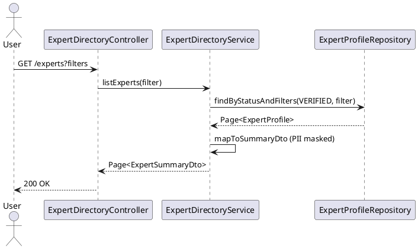

# ENGINEERING DOCUMENTATION STANDARD (EDS) v2.0
# UC-80 View Expert Directory

| Field | Value |
|-------|-------|
| **Document ID** | `CB-EXP-IMP-004` |
| **Version** | `1.0` |
| **Date** | `2026-06-26` |
| **Status** | `Draft` |
| **Author** | `AI Agent` |
| **Based on EDS** | `v2.0` |

---

## CHANGELOG

| Ngày | Người thực hiện | Nội dung thay đổi |
|------|-----------------|-------------------|
| 2026-06-26 | AI Agent | Khởi tạo TDS cho UC-80 |

---

## MỤC LỤC

1. [Tổng quan Module](#1-tổng-quan-module)
2. [Ma trận Truy vết](#2-ma-trận-truy-vết-traceability-matrix)
3. [Architecture Decision Records (ADR)](#3-architecture-decision-records-adr)
4. [Non-Functional Requirements & SLA](#4-non-functional-requirements--sla)
5. [Static Modeling](#5-static-modeling)
6. [Dynamic Modeling](#6-dynamic-modeling)
7. [Domain Event Catalog](#7-domain-event-catalog)
8. [Interface Specification](#8-interface-specification)
9. [API Specification](#9-api-specification)
10. [Bảng mã lỗi](#10-bảng-mã-lỗi)
11. [Quy trình Triển khai](#11-quy-trình-triển-khai-step-by-step)
12. [Rollback & Incident Runbook](#12-rollback--incident-runbook)
13. [Kịch bản Kiểm thử Chi tiết](#13-kịch-bản-kiểm-thử-chi-tiết)
14. [Phương pháp Xác minh](#14-phương-pháp-xác-minh)
15. [Mẫu thử thực tế](#15-mẫu-thử-thực-tế-api-verification-samples)
16. [Bảng tổng hợp phân quyền](#16-bảng-tổng-hợp-phân-quyền-authorization-matrix)
17. [AI Prompt Constraints](#17-ai-prompt-constraints-case-20)

---

## 1. Tổng quan Module

| Field | Value |
|-------|-------|
| **Module Name** | `ViewExpertDirectory` |
| **Bounded Context** | `expert` |
| **Data Classification** | `Public` |
| **Upstream Dependencies** | `expert_profiles, expert_availability_slots` |
| **Downstream Consumers** | `consultation (book flow)` |

**Mô tả:** Hiển thị danh sách chuyên gia đã được xác minh (`VERIFIED`), có thể lọc theo chuyên môn, huy hiệu, và khả dụng. Response không bao gồm thông tin riêng tư (không lộ email/số điện thoại).

---

## 2. Ma trận Truy vết (Traceability Matrix)

| Requirement ID | Loại | Mô tả | Thành phần Code | Compliance Target | ADR liên quan |
|----------------|------|-------|-----------------|-------------------|---------------|
| UC-80 | Use Case | Hiển thị danh sách chuyên gia đã xác minh | `ExpertDirectoryController`, `ExpertDirectoryService` | BR-RBAC | ADR-EXP-006 |
| BR-VERIFIED-ONLY | Business Rule | Chỉ hiển thị expert VERIFIED | `ExpertDirectoryService` | BR-SECURITY | ADR-EXP-006 |
| BR-PII-MASK | Business Rule | Không trả về email, phone, accountId | `ExpertDirectoryService` | BR-PRIVACY | ADR-EXP-006 |

---

## 3. Architecture Decision Records (ADR)

### ADR-EXP-006 — Directory shows only VERIFIED experts

| Field | Value |
|-------|-------|
| **Status** | `Accepted` |
| **Date** | `2026-06-26` |

#### Quyết định
Chỉ Expert với `status=VERIFIED` mới hiển thị trong directory. `PENDING_VERIFICATION`, `DRAFT`, `SUSPENDED` không hiển thị. Expert profile trả về: displayName, specialties, averageRating, consultationFeeVnd, isOnline, availableModalities. Không bao gồm accountId, email, phone.

---

## 4. Non-Functional Requirements & SLA

### 4.1. Performance & Availability

| Category | Requirement | Target SLA |
|----------|-------------|------------|
| Latency | API response — list experts (p99) | < 300ms |
| Availability | Uptime (monthly) | 99.9% |
| Pagination | Default page size / max | 20 / 50 |

### 4.2. Security

| Category | Requirement | Target |
|----------|-------------|--------|
| Access control | Public endpoint (authenticated users) | Least privilege (§16) |
| PII masking | No accountId, email, phone in response | BR-PRIVACY |

---

## 5. Static Modeling

> Class diagram tham chiếu §8 Interface Specification.

### 5.1. Key DTOs

- `ExpertDirectoryFilter` — query parameters (specialty, availableNow, modality, page, size)
- `ExpertSummaryDto` — response item (displayName, specialties, averageRating, consultationFeeVnd, isOnline, availableModalities)

---

## 6. Dynamic Modeling

### 6.1. List Experts Sequence



---

## 7. Domain Event Catalog

### 7.1. Events Published

| Event Name | Trigger | Publisher | Async? |
|------------|---------|-----------|--------|
| — | Read-only endpoint — no domain events | — | — |

### 7.2. Events Consumed

| Event Name | Source | Handler | Action |
|------------|--------|---------|--------|
| — | — | — | — |

---

## 8. Interface Specification

```java
public class ExpertDirectoryFilter {
    private String specialty;
    private Boolean availableNow;
    private ConsultationModality modality;
    private Integer page;   // default 0
    private Integer size;   // default 20, max 50
}

public interface IExpertDirectoryService {
    Page<ExpertDirectoryItemDto> listExperts(ExpertDirectoryFilter filter);
}

public class ExpertDirectoryItemDto {
    private UUID expertProfileId;
    private String displayName;
    private List<String> specialties;
    private Double averageRating;
    private Long consultationFeeVnd;
    private Boolean isOnline;
    private List<ConsultationModality> availableModalities;
    private Integer totalReviews;
}
```

---

## 9. API Specification

| Method | Path | Auth | Required Roles |
|--------|------|------|----------------|
| `GET` | `/api/v1/expert-directory` | JWT Bearer | Any authenticated |

**Query params:** `specialty`, `availableNow`, `modality`, `page`, `size`

**GET — 200 OK:**
```json
{
  "content": [
    {
      "expertProfileId": "uuid",
      "displayName": "Dr. Nguyen Van A",
      "specialties": ["obstetrics"],
      "averageRating": 4.8,
      "consultationFeeVnd": 200000,
      "isOnline": true
    }
  ],
  "totalElements": 42,
  "page": 0,
  "size": 20
}
```

---

## 10. Bảng mã lỗi

| Code | HTTP | Trigger |
|------|------|---------|
| `EXP-010` | 400 | Invalid filter (size > 50) |
| `EXP-011` | 401 | Unauthenticated |

---

## 11. Quy trình Triển khai (Step-by-Step)

### 11.1. Prerequisites

- [ ] expert_profiles table tồn tại (V28)
- [ ] expert_reviews table tồn tại (hoặc averageRating computed on-fly)

### 11.2. Pre-Migration Checklist

Không có migration mới — read-only endpoint.

### 11.3. Implementation Steps

#### Chặng 1 — Implement query (VERIFIED only)

```java
public Page<ExpertDirectoryItem> getExpertDirectory(ExpertFilter filter, Pageable pageable) {
    if (pageable.getPageSize() > 50) throw new ValidationException("EXP-010");
    Page<ExpertProfile> profiles = profileRepo.findByStatusAndFilters(
        ExpertProfileStatus.VERIFIED, filter, pageable);
    return profiles.map(p -> mapper.toDirectoryItem(p)); // no accountId, email, phone
}
```

#### Chặng 2 — Implement Mapper (PII masking)

```java
// ExpertDirectoryItem KHÔNG chứa: accountId, email, phone, personalAddress
public ExpertDirectoryItem toDirectoryItem(ExpertProfile p) {
    return ExpertDirectoryItem.builder()
        .id(p.getId())
        .displayName(p.getDisplayName())
        .specialties(p.getSpecialties())
        .consultationModalities(p.getConsultationModalities())
        // NO accountId, NO email, NO phone
        .build();
}
```

### 11.4. Deployment Checklist

- [ ] Test GET directory → only VERIFIED experts
- [ ] Test PENDING expert NOT in results
- [ ] Verify response không có accountId/email/phone
- [ ] Test page size > 50 → 400 EXP-010

---

## 12. Rollback & Incident Runbook

### 12.1. Điều kiện kích hoạt Rollback

| Điều kiện | Ngưỡng | Người quyết định |
|-----------|--------|------------------|
| PII trong response (email, phone) | Bất kỳ case | Tech Lead + DPO |
| PENDING expert xuất hiện trong directory | Bất kỳ case | Tech Lead |

### 12.2. Rollback Procedure

```bash
# Code-only rollback
kubectl rollout undo deployment/carebridge-api
```

---

## 13. Kịch bản Kiểm thử Chi tiết

```gherkin
Feature: View Expert Directory
  Scenario: Default listing → VERIFIED only
    Given EXPERT-001 status=VERIFIED, EXPERT-002 status=PENDING
    When getExpertDirectory(page=0, size=20)
    Then response chứa EXPERT-001, KHÔNG chứa EXPERT-002

  Scenario: PII masking
    When getExpertDirectory()
    Then response items KHÔNG chứa accountId, email, phone

  Scenario: Filter by specialty
    When getExpertDirectory(specialty="Cardiology")
    Then response chỉ chứa experts với specialty=Cardiology

  Scenario: Page size > 50 → 400 EXP-010
    When getExpertDirectory(size=51)
    Then throws ValidationException EXP-010

  Scenario: Empty result → 200 with empty list
    When không có VERIFIED expert
    Then response status 200, experts=[]
```

---

## 14. Phương pháp Xác minh

```sql
-- Verify only VERIFIED experts in DB
SELECT COUNT(*) FROM expert_profiles WHERE status = 'VERIFIED';

-- Verify no non-VERIFIED returned (check endpoint manually)
SELECT id, status FROM expert_profiles WHERE status != 'VERIFIED';
```

---

## 15. Mẫu thử thực tế (API Verification Samples)

```bash
curl -X GET "https://[host]/api/v1/expert-directory?page=0&size=20" \
  -H "Authorization: Bearer <MOTHER_JWT>"
# Expected 200: { "experts": [...], "totalElements": N, "page": 0, "size": 20 }

# Verify no PII in response
curl ... | jq '.[].accountId'  # Expected: null/undefined
```

---

## 16. Bảng tổng hợp phân quyền (Authorization Matrix)

| Endpoint | `GUEST` | `ROLE_MOTHER` | `ROLE_EXPERT` | `ROLE_ADMIN` |
|----------|---------|---------------|---------------|--------------|
| `GET /expert-directory` | ❌ | ✅ | ✅ | ✅ |

---

## 17. AI Prompt Constraints (CASE 2.0)

### 17.1 Constraint Summary Table

| # | Constraint | Source |
|---|-----------|--------|
| C1 | Only return experts with status=VERIFIED | ADR-EXP-006 |
| C2 | Response MUST NOT contain accountId, email, phone number | BR-PRIVACY |
| C3 | Default page size 20, max 50 — enforce server-side | ADR-EXP-006 |
| C4 | Response MUST NOT contain diagnosis/medical advice | BR-SAFETY |
| C5 | averageRating computed from reviews table, not stored on profile | ADR-EXP-006 |

### 17.2 Constraint Injection Block

```
[CONSTRAINT BLOCK — Module: ViewExpertDirectory (CB-EXP-IMP-004)]
1. (C1 — ADR-EXP-006) filter status=VERIFIED ở DB query — không filter trong Java.
2. (C2 — BR-PRIVACY) ExpertDirectoryItem KHÔNG có accountId, email, phone — mapper phải bỏ.
3. (C3 — ADR-EXP-006) size > 50 → throw ValidationException EXP-010.
4. (C4 — BR-SAFETY) Không có field diagnosis hay medical advice trong response.
5. (C5 — ADR-EXP-006) averageRating = AVG(reviews.rating) — không đọc từ profile.
```

### 17.3 Constraint Quality Checklist

- [x] Mỗi constraint traceable về ADR hoặc BR
- [x] Constraint block có ≥ 5 constraints cụ thể

### 17.4 Anti-Pattern Detection

| AP-ID | Anti-Pattern | Hành động |
|-------|-------------|----------|
| AP-AI-001 | Filter VERIFIED trong Java sau khi load all | Reject — C1, hiệu năng kém |
| AP-AI-003 | Include accountId trong response DTO | Reject — C2 violation |

---

## PHỤ LỤC

### A. Glossary

| Thuật ngữ | Định nghĩa |
|-----------|------------|
| VERIFIED | Trạng thái expert profile đã được Admin xác minh |
| PII masking | Loại bỏ thông tin nhận dạng cá nhân khỏi response |
| averageRating | Tính từ reviews — không lưu trên profile để tránh staleness |

### B. Tài liệu tham chiếu

| Document | Path |
|----------|------|
| EDS v2.0 Template | `08_References/Template/PHASE-3_TDS.md` |

---

*EDS v2.1 — Tích hợp CASE 2.0 AI Prompt Constraints (§17).*
