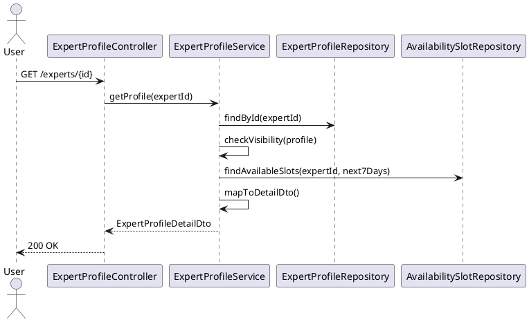

# ENGINEERING DOCUMENTATION STANDARD (EDS) v2.0
# UC-81 View Expert Profile

| Field | Value |
|-------|-------|
| **Document ID** | `CB-EXP-IMP-005` |
| **Version** | `1.0` |
| **Date** | `2026-06-26` |
| **Status** | `Draft` |
| **Author** | `AI Agent` |
| **Based on EDS** | `v2.0` |

---

## CHANGELOG

| Ngày | Người thực hiện | Nội dung thay đổi |
|------|-----------------|-------------------|
| 2026-06-26 | AI Agent | Khởi tạo TDS cho UC-81 |

---

## MỤC LỤC

1. [Tổng quan Module](#1-tổng-quan-module)
2. [Ma trận Truy vết](#2-ma-trận-truy-vết-traceability-matrix)
3. [Architecture Decision Records (ADR)](#3-architecture-decision-records-adr)
4. [Non-Functional Requirements & SLA](#4-non-functional-requirements--sla)
5. [Static Modeling](#5-static-modeling)
6. [Dynamic Modeling](#6-dynamic-modeling)
7. [Domain Event Catalog](#7-domain-event-catalog)
8. [Interface Specification](#8-interface-specification)
9. [API Specification](#9-api-specification)
10. [Bảng mã lỗi](#10-bảng-mã-lỗi)
11. [Quy trình Triển khai](#11-quy-trình-triển-khai-step-by-step)
12. [Rollback & Incident Runbook](#12-rollback--incident-runbook)
13. [Kịch bản Kiểm thử Chi tiết](#13-kịch-bản-kiểm-thử-chi-tiết)
14. [Phương pháp Xác minh](#14-phương-pháp-xác-minh)
15. [Mẫu thử thực tế](#15-mẫu-thử-thực-tế-api-verification-samples)
16. [Bảng tổng hợp phân quyền](#16-bảng-tổng-hợp-phân-quyền-authorization-matrix)
17. [AI Prompt Constraints](#17-ai-prompt-constraints-case-20)

---

## 1. Tổng quan Module

| Field | Value |
|-------|-------|
| **Module Name** | `ViewExpertProfile` |
| **Bounded Context** | `expert` |
| **Data Classification** | `Public` |
| **Upstream Dependencies** | `expert_profiles, expert_availability_slots` |
| **Downstream Consumers** | `consultation booking flow` |

**Mô tả:** Hiển thị chi tiết hồ sơ chuyên gia: bằng cấp, phạm vi tư vấn, huy hiệu xác minh, đánh giá, và lịch khả dụng. Chỉ expert `VERIFIED` có thể được xem. Response không chứa thông tin chẩn đoán.

---

## 2. Ma trận Truy vết (Traceability Matrix)

| Requirement ID | Loại | Mô tả | Thành phần Code | Compliance Target | ADR liên quan |
|----------------|------|-------|-----------------|-------------------|---------------|
| UC-81 | Use Case | Xem chi tiết hồ sơ chuyên gia | `ExpertProfileController`, `ExpertProfileService` | BR-RBAC | — |
| BR-VISIBILITY | Business Rule | Visibility rules theo trạng thái expert | `ExpertProfileService` | BR-SECURITY | — |
| BR-AVAIL-7DAY | Business Rule | Chỉ trả AVAILABLE slots trong 7 ngày tới | `ExpertProfileService` | BR-AVAILABILITY | — |

---

## 3. Architecture Decision Records (ADR)

### ADR-EXP-007 — Expert profile visibility rules

| Field | Value |
|-------|-------|
| **Status** | `Accepted` |
| **Date** | `2026-06-26` |

#### Quyết định
- `status=VERIFIED` → visible to any authenticated user.
- `status=SUSPENDED` → visible only to ROLE_ADMIN.
- `status=PENDING_VERIFICATION/DRAFT` → visible only to profile owner (ROLE_EXPERT) and ROLE_ADMIN.
- Availability slots returned: only `AVAILABLE` slots in the next 7 days.

---

## 4. Non-Functional Requirements & SLA

### 4.1. Performance & Availability

| Category | Requirement | Target SLA |
|----------|-------------|------------|
| Latency | API response — profile detail (p99) | < 300ms |
| Availability | Uptime (monthly) | 99.9% |
| Slot window | Available slots returned | Next 7 days |

### 4.2. Security

| Category | Requirement | Target |
|----------|-------------|--------|
| Access control | Authenticated users | Least privilege (§16) |
| PII masking | Sensitive fields hidden from public view | BR-PRIVACY |

---

## 5. Static Modeling

> Class diagram tham chiếu §8 Interface Specification.

### 5.1. Key DTOs

- `ExpertProfileDetailDto` — full expert profile (displayName, specialties, bio, averageRating, consultationFeeVnd, availableModalities, badges)
- `AvailabilitySlotDto` — slot info (slotDate, startTime, endTime, status=AVAILABLE)

---

## 6. Dynamic Modeling

### 6.1. View Profile Sequence



---

## 7. Domain Event Catalog

### 7.1. Events Published

| Event Name | Trigger | Publisher | Async? |
|------------|---------|-----------|--------|
| — | Read-only endpoint — no domain events | — | — |

### 7.2. Events Consumed

| Event Name | Source | Handler | Action |
|------------|--------|---------|--------|
| — | — | — | — |

---

## 8. Interface Specification

```java
public class ExpertProfileDetailDto {
    private UUID expertProfileId;
    private String displayName;
    private String bio;
    private List<String> specialties;
    private Integer yearsOfExperience;
    private Long consultationFeeVnd;
    private List<ConsultationModality> availableModalities;
    private Boolean isOnline;
    private Double averageRating;
    private Integer totalReviews;
    private ExpertProfileStatus status;
    private List<AvailabilitySlotDto> availableSlots;
    // NO email, NO phone, NO accountId
}
```

---

## 9. API Specification

| Method | Path | Auth | Required Roles |
|--------|------|------|----------------|
| `GET` | `/api/v1/expert-profiles/{expertProfileId}` | JWT Bearer | Any authenticated |

**GET — 200 OK:**
```json
{
  "expertProfileId": "uuid",
  "displayName": "Dr. Nguyen Van A",
  "bio": "10 years in obstetrics...",
  "specialties": ["obstetrics", "prenatal care"],
  "consultationFeeVnd": 200000,
  "averageRating": 4.8,
  "availableSlots": [
    { "slotId": "uuid", "dayOfWeek": "MON", "startTime": "09:00", "durationMinutes": 60 }
  ]
}
```

---

## 10. Bảng mã lỗi

| Code | HTTP | Trigger |
|------|------|---------|
| `EXP-012` | 404 | Expert profile not found |
| `EXP-013` | 403 | Profile SUSPENDED/DRAFT — caller not admin or owner |

---

## 11. Quy trình Triển khai (Step-by-Step)

### 11.1. Prerequisites

- [ ] expert_profiles table tồn tại (V28)
- [ ] expert_availability_slots table tồn tại (V30)

### 11.2. Pre-Migration Checklist

Không có migration mới — read-only endpoint.

### 11.3. Implementation Steps

#### Chặng 1 — Implement visibility rules (ADR-EXP-007)

```java
public ExpertProfileDetailResponse getExpertProfile(UUID expertId, UUID callerAccountId, String callerRole) {
    ExpertProfile profile = profileRepo.findById(expertId)
        .orElseThrow(() -> new NotFoundException("EXP-012"));
    // Visibility rules: ADR-EXP-007
    boolean isOwner = profile.getAccountId().equals(callerAccountId);
    boolean isAdmin = "ROLE_ADMIN".equals(callerRole);
    if (!isOwner && !isAdmin && profile.getStatus() != ExpertProfileStatus.VERIFIED) {
        throw new ForbiddenException("EXP-013");
    }
    // SUSPENDED: only owner or admin can see
    if (profile.getStatus() == ExpertProfileStatus.SUSPENDED && !isOwner && !isAdmin) {
        throw new ForbiddenException("EXP-013");
    }
    // Only AVAILABLE slots in next 7 days
    LocalDateTime cutoff = LocalDateTime.now().plusDays(7);
    List<SlotSummary> slots = slotRepo.findAvailableUntil(expertId, cutoff);
    return mapper.toDetailResponse(profile, slots); // no email, accountId
}
```

### 11.4. Deployment Checklist

- [ ] Test VERIFIED profile → 200
- [ ] Test SUSPENDED profile với ROLE_MOTHER → 403 EXP-013
- [ ] Test response không có email/accountId
- [ ] Test availableSlots chỉ trong 7 ngày tới

---

## 12. Rollback & Incident Runbook

### 12.1. Điều kiện kích hoạt Rollback

| Điều kiện | Ngưỡng | Người quyết định |
|-----------|--------|------------------|
| SUSPENDED profile visible cho Mother | Bất kỳ case | Tech Lead |
| PII (email, phone) trong response | Bất kỳ case | Tech Lead + DPO |

### 12.2. Rollback Procedure

```bash
kubectl rollout undo deployment/carebridge-api
```

---

## 13. Kịch bản Kiểm thử Chi tiết

```gherkin
Feature: View Expert Profile
  Scenario: VERIFIED profile → 200 for MOTHER
    Given EXPERT-001 status=VERIFIED
    When getExpertProfile(EXPERT-001, MOTHER-001, ROLE_MOTHER)
    Then response 200, profile có slots (AVAILABLE only, next 7 days)

  Scenario: SUSPENDED → 403 for MOTHER
    Given EXPERT-002 status=SUSPENDED
    When getExpertProfile(EXPERT-002, MOTHER-001, ROLE_MOTHER)
    Then throws ForbiddenException EXP-013

  Scenario: SUSPENDED → 200 for owner
    When getExpertProfile(EXPERT-002, EXPERT-002.accountId, ROLE_EXPERT)
    Then response 200

  Scenario: PII masking
    When getExpertProfile(EXPERT-001, ...)
    Then response KHÔNG chứa email, accountId, phone

  Scenario: availableSlots = AVAILABLE only, next 7 days
    Given EXPERT-001 có slot BOOKED trong 3 ngày, slot AVAILABLE trong 5 ngày
    When getExpertProfile()
    Then response chỉ có slot AVAILABLE trong 5 ngày
```

---

## 14. Phương pháp Xác minh

```sql
-- Verify slots filter
SELECT id, status, date FROM expert_availability_slots
WHERE expert_profile_id = '<uuid>' AND status = 'AVAILABLE'
AND date BETWEEN NOW() AND NOW() + INTERVAL '7 days';
```

---

## 15. Mẫu thử thực tế (API Verification Samples)

```bash
curl -X GET https://[host]/api/v1/expert-profiles/EXP-UUID \
  -H "Authorization: Bearer <MOTHER_JWT>"
# Expected 200: profile without email/accountId, slots in next 7 days only
```

---

## 16. Bảng tổng hợp phân quyền (Authorization Matrix)

| Endpoint | `GUEST` | `ROLE_MOTHER` | `ROLE_EXPERT` | `ROLE_ADMIN` |
|----------|---------|---------------|---------------|--------------|
| `GET /expert-profiles/{id}` | ❌ | ✅ VERIFIED only | ✅ Own all | ✅ All |

---

## 17. AI Prompt Constraints (CASE 2.0)

### 17.1 Constraint Summary Table

| # | Constraint | Source |
|---|-----------|--------|
| C1 | Apply ADR-EXP-007 visibility rules before returning profile | ADR-EXP-007 |
| C2 | Response MUST NOT contain email, phone, accountId | BR-PRIVACY |
| C3 | availableSlots: only AVAILABLE slots in next 7 days | ADR-EXP-007 |
| C4 | Response MUST NOT contain medical diagnosis or advice | BR-SAFETY |
| C5 | averageRating and totalReviews aggregated from reviews, not stored on profile | ADR-EXP-006 |

### 17.2 Constraint Injection Block

```
[CONSTRAINT BLOCK — Module: ViewExpertProfile (CB-EXP-IMP-005)]
1. (C1 — ADR-EXP-007) Visibility: SUSPENDED → 403 EXP-013 cho Mother; owner/admin xem được.
2. (C2 — BR-PRIVACY) Mapper bỏ email, phone, accountId khỏi ExpertProfileDetailResponse.
3. (C3 — ADR-EXP-007) slots = AVAILABLE only, date <= now + 7 days.
4. (C4 — BR-SAFETY) Response không có medical advice hay diagnosis.
5. (C5 — ADR-EXP-006) averageRating từ JOIN với reviews — không phải field trên profile.
```

### 17.3 Constraint Quality Checklist

- [x] Mỗi constraint traceable về ADR hoặc BR
- [x] Constraint block có ≥ 5 constraints cụ thể

### 17.4 Anti-Pattern Detection

| AP-ID | Anti-Pattern | Hành động |
|-------|-------------|----------|
| AP-AI-001 | Return all slots (including BOOKED) | Reject — C3 violation |
| AP-AI-003 | Include accountId trong response | Reject — C2/BR-PRIVACY |

---

## PHỤ LỤC

### A. Glossary

| Thuật ngữ | Định nghĩa |
|-----------|------------|
| VERIFIED | Profile đã được Admin xác minh |
| SUSPENDED | Profile bị tạm dừng — không visible cho Mother |
| availableSlots | Slots status=AVAILABLE trong 7 ngày tới |

### B. Tài liệu tham chiếu

| Document | Path |
|----------|------|
| EDS v2.0 Template | `08_References/Template/PHASE-3_TDS.md` |

---

*EDS v2.1 — Tích hợp CASE 2.0 AI Prompt Constraints (§17).*
