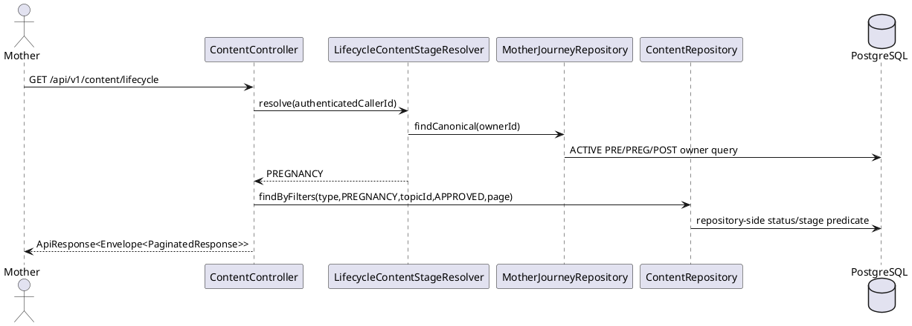
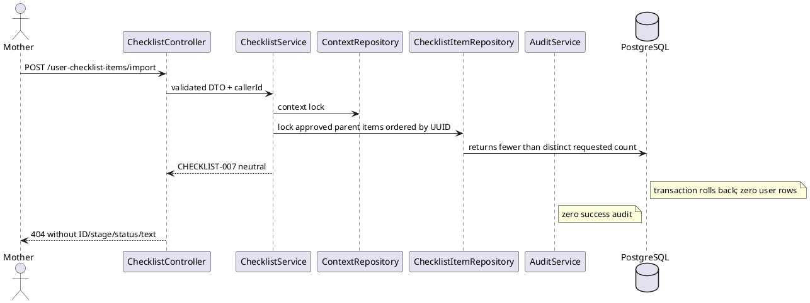

# ENGINEERING DOCUMENTATION STANDARD (EDS) v2.0
# Technical Design Specification — UC-82 View Content and Checklist / Story 6.9

| Field | Value |
|---|---|
| **Document ID** | `CB-CONTENT-IMP-009` |
| **Version** | `1.1` |
| **Date** | `2026-07-23` |
| **Status** | `Approved` |
| **Document Owner** | CareBridge Product/Engineering owner for Epic 6 |
| **Author** | Codex — Function specification author |
| **Reviewed by** | Independent final-binary evidence-sync review PASS (`0 High / 0 Medium / 0 Low`); prior amendment snapshot also PASS |
| **DPO Sign-off** | `Not requested by this document`; obtain legal/DPO approval separately if implementation changes the approved processing purpose |
| **Approved by** | User explicit pre-approval, effective after independent final-binary evidence-sync review PASS |
| **Last Review** | `2026-07-23` |
| **Based on EDS** | `v2.0`, adapted to the CareBridge Java/React/Flutter stack |

---

## CHANGELOG

| Date | Author | Change |
|---|---|---|
| 2026-07-23 | Codex — Function specification author | Initial Story 6.9 TDS using the mandatory Phase-3 skeleton; froze API, data, concurrency, RAG, Mobile, Web, migration, security, and verification contracts. |
| 2026-07-23 | Codex — Function specification author | Approved after independent review reached `0 High / 0 Medium / 0 Low`; closed RAG profile/policy, audit eligibility, 29-condition gate, and exact test-registry findings. |
| 2026-07-23 | Codex — development evidence sync | Recorded final implementation, PostgreSQL/no-migration decision, neutral 404/405 correction, Mobile/Web/manual evidence, and the preserved unrelated full-quality blockers; Story remains `in-progress`. |
| 2026-07-23 | Codex — minor course correction | v1.1 amendment under review: define a fail-closed, evidence-based dirty-baseline exception for Story 6.9 review readiness without relabeling failed repository-wide gates as PASS. |
| 2026-07-23 | Codex — fail-closed remediation | Rejected the coarse baseline after seven overlapping failures were proven; recorded minimal wiring/builder-invariant fixes, focused `6/6` and `67/67`, exact `2679 / 7 / 48 / 1` Maven test/package manifests, 55/55 fingerprint parity, Flutter warning hashes, and refreshed runtime JAR hash. |
| 2026-07-23 | Independent amendment review | v1.1 approved at `0 High / 0 Medium / 0 Low`; ADR-009 accepted for authorizing the subsequent independent implementation review only. |
| 2026-07-23 | Independent final-binary verifier | Re-ran OV01-MAN-009/029 on exact JAR `4983...3308` and APK `0141...EA73`; API/DB `48/48`, UI `5/5`, and 32-row evidence manifest verification passed with zero mismatch. |
| 2026-07-23 | Review-fix implementer/verifier | Closed `R69-001..008`: fail-closed evidence sanitization, deterministic admin/lifecycle ordering, Web latest-request-wins real DOM tests, explicit checklist-advice precedence, nullable admin metadata, and final JAR `122BAE2F...8F557` evidence (`58/58` API/DB, `5/5` UI, 40-row zero-mismatch manifest). |
| 2026-07-23 | Round-2 patch implementer/verifier | Closed `R69-009..020`; accepted the round-2 checkpoint. This row and all preceding binary/hash rows are historical only. |
| 2026-07-24 | Final round-3 implementer/verifier | Closed `R69-021..027`; accepted exact product/runtime fingerprints. |
| 2026-07-24 | Final tooling verifier | Closed `R69-028..047`; tooling `35/35`, parser matrix `12/12`, strong scans `0`, atomic pair/recovery locks and harness cleanup passed. Round4 template SHA-256 `351BE425...F1CA8` returned `Semantics/BinaryBinding/ClosedSet=true`, `36/36`, 13 critical files for exact B18D/7FC; historical manifests verified `32/32`, `40/40`, `41/41`. |
| 2026-07-24 | Final fixed-scope verifier | Closed `R69-048..089`; final tooling `76/76`, parser `7/7`, accepted-log scan `27/27`, and independent `R69-073..087` review `15/15 PASS — APPROVE`. Round4 SHA-256 `7470FD15...E419` returned semantics, binary binding, closed set, and authenticated byte snapshots true for immutable R3. |
| 2026-07-23 | Codex — final evidence sync | Reopened v1.1 to `In Review` while the independent reviewer validates the exact-final-binary manual artifacts and synchronized hashes. |
| 2026-07-23 | Independent final evidence review | v1.1 final-binary evidence sync approved at `0 High / 0 Medium / 0 Low`; ADR-009 accepted for authorizing the subsequent independent implementation review only. |

---

## MỤC LỤC

1. [Tổng quan Module](#1-tổng-quan-module)
2. [Ma trận Truy vết](#2-ma-trận-truy-vết-traceability-matrix)
3. [Architecture Decision Records](#3-architecture-decision-records-adr)
4. [Non-Functional Requirements & SLA](#4-non-functional-requirements--sla)
5. [Static Modeling](#5-static-modeling-mô-hình-tĩnh)
6. [Dynamic Modeling](#6-dynamic-modeling-mô-hình-động)
7. [Domain Event Catalog](#7-domain-event-catalog)
8. [Interface Specification](#8-interface-specification-đặc-tả-giao-diện)
9. [API Specification](#9-api-specification)
10. [Error Codes](#10-bảng-mã-lỗi-error-codes)
11. [Implementation Process](#11-quy-trình-triển-khai-step-by-step)
12. [Rollback & Incident Runbook](#12-rollback--incident-runbook)
13. [Detailed Test Scenarios](#13-kịch-bản-kiểm-thử-chi-tiết)
14. [Verification Methods](#14-phương-pháp-xác-minh)
15. [API Verification Samples](#15-mẫu-thử-thực-tế-api-verification-samples)
16. [Authorization Matrix](#16-bảng-tổng-hợp-phân-quyền-authorization-matrix)
17. [AI Prompt Constraints](#17-ai-prompt-constraints-case-20)

---

## 1. Tổng quan Module

Story 6.9 closes the reviewed-content boundary for the canonical Mother lifecycle. It makes lifecycle-personalized ARTICLE, FAQ, CHECKLIST, template-item import, and non-RED Mother RAG use one server-authoritative PRE_PREGNANCY/PREGNANCY/POSTPARTUM stage. It preserves deliberate generic cross-stage verified browsing, existing content approval semantics, already imported personal snapshots, and owned BABY_CARE imports.

| Field | Value |
|---|---|
| **Module Name** | `UC-82 View Content and Checklist / Story 6.9` |
| **Bounded Contexts** | Content, Checklist, Mother Journey, Baby, Gemini RAG; Mobile consumer and Web content-management adapters |
| **Primary Actor** | Mother for personalized routes/import; authenticated User for generic verified browse |
| **Trigger** | User opens lifecycle guidance, deliberately browses verified content, imports reviewed checklist items, or asks a non-RED RAG question |
| **Outcome** | Only APPROVED, context-compatible rows can enter personalized reads/imports/RAG; generic verified browse remains explicit and APPROVED-only |
| **Platforms** | Backend, Mobile, Web; PostgreSQL is the persistence oracle |
| **Priority / Estimate** | High / 8 story points (approved Story 6.9 rebaseline) |
| **Data Classification** | `PII` at the policy boundary because caller UUID and canonical lifecycle ownership are processed; response content itself is curated informational content |
| **Compliance Scope** | Repository-approved `BR-RBAC`, `BR-PRIVACY`, minimum-necessary logging; no unsupported statutory claim is introduced |
| **Upstream Dependencies** | UC-22 canonical Mother lifecycle, UC-50 personal checklist, UC-108 content approval, Spring Security authentication, PostgreSQL/Flyway |
| **Downstream Consumers** | Mother Mobile dashboards/content screen, generic UC-224/225 browse/detail, Gemini prompt construction, Web ChecklistListPage |

### 1.1 Scope

In scope:

- MOTHER-only lifecycle list, checklist, and detail routes with server-authored stage envelopes.
- APPROVED-only generic checklist reads, including when no stage filter is supplied.
- Atomic 1–50 item template import using canonical journey or owned active baby context.
- A dedicated `ChecklistTemplateStatus` enum mapped to the existing varchar column.
- Canonical-stage policy for non-RED Mother RAG, while safety filtering remains first.
- Typed lifecycle Mobile mode and real-status paginated Web admin checklist list.
- Automated coverage plus OV01-MAN-009 and OV01-MAN-029 manual evidence.

Out of scope:

- Creating/editing/approving/archiving content or checklist templates; changing UC-108 transitions; adding a template-detail endpoint.
- Reinterpreting Mother lifecycle as BABY_CARE, creating a second lifecycle, or using a client-selected stage as personalized truth.
- Revoking already imported personal snapshot rows after a source template changes status.
- Diagnosis, treatment, medication advice, emergency replacement, production deployment, or a new legal processing purpose.
- The experimental 121-UC catalogue. The authoritative Function identity is the fully documented 242-UC `UC-82 View Content and Checklist`.

### 1.2 Source hierarchy and conflicts

The canonical Story artifact is `_bmad-output/implementation-artifacts/6-9-enforce-reviewed-checklist-and-stage-aware-content-boundaries.md`. SHA-256 `5024B58C7FEA276F0FAA35F8BD00EC6BD0B44AC0574EEDEA982153B7475083B2` is the approved pre-implementation specification snapshot; the live Story hash is expected to change only in the workflow-permitted status, task, Dev Agent Record, File List, and Change Log fields. The legacy `04_Implement/UC82_ViewContentAndChecklist/` and related underscore folders are evidence only. Their claims that all checklist statuses may be read, that `REJECTED` belongs in `ContentStatus`, or that a client stage is personalized are superseded by Story 6.9. `V1__init_schema.sql` and the applied forward Flyway chain are authoritative for persistence.

Implementation evidence status on 2026-07-24: `47/47` registered cases PASS; backend trace `38/38 COVERED`, `0 PARTIAL`, `0 CONTRACT-ONLY`; behavior/RAG `118/118`; affected regressions `58/58`; review-fix unit/component `21/21`, real PostgreSQL `19/19`, and lifecycle/request-scoped SQL `11/11` with planner payload `0`; Mobile `388/388`; Web `19/19`, lint/build exit `0`; final evidence tooling `76/76`, parser `7/7`, accepted-log scan `27/27` with zero findings; OV01-MAN-009/029 PASS. Independent fixed-scope review is `15/15 PASS — APPROVE`, `0 High / 0 Medium`. Product hashes/counts remain the exact round-3 values below. Round4 verifier template SHA-256 `7470FD151E7C2DB91B02497B3F291309855B7B4C44283D2F1EA9BCBE6504E419` returns `Semantics=true`, `BinaryBinding=true`, `ClosedSet=true`, `AuthenticatedByteSnapshots=true`, `36/36` rows and 13 critical files for exact B18D/7FC binaries. Historical manifests verify final4983 `32/32`, final122 `40/40`, round2 `41/41`; current verifies `36/36`.

---

## 2. Ma trận Truy vết (Traceability Matrix)

| Requirement ID | Type | Requirement | Target component | Verification conditions | ADR |
|---|---|---|---|---|---|
| `SRS-3.3.1.59/UC-82` | UC | Display approved articles, FAQs, and checklists by stage; handle empty/error states | Content service/controller, Mobile lifecycle mode | `COND-01..06`, `COND-21..24` | ADR-001, ADR-005 |
| `FR53` | FR | Public lifecycle checklist/content access enforces approved publication status | Repository predicates and lifecycle policy | `COND-01..05`, `COND-15` | ADR-001 |
| `BR-RBAC` | BR | Role and ownership boundaries | Spring method security, journey/baby owner-scoped locks | `COND-10..12`, `COND-20` | ADR-003 |
| `BR-PRIVACY` | BR | Minimum-necessary responses/logs; no author/review/lifecycle leakage | DTOs, neutral errors, structured logs | `COND-04`, `COND-11`, `COND-19` | ADR-003 |
| `BR-CHECKLIST-001/004` | BR | Import source text/order from template; imported snapshot remains immutable | Checklist import service | `COND-07..09`, `COND-13` | ADR-002 |
| `Story-6.9-AC1` | AC | Approved, canonical-stage lifecycle checklist; generic checklist approved-only | Lifecycle/content checklist services | `COND-01..03` | ADR-001 |
| `Story-6.9-AC2` | AC | Direct IDs do not bypass status/stage | Lifecycle detail and import lookup | `COND-04`, `COND-08`, `COND-11` | ADR-001, ADR-003 |
| `Story-6.9-AC3` | AC | 1–50 item import is approved, stage-compatible, deduplicated, atomic | Import DTO/service/repositories | `COND-07..10`, `COND-13..14` | ADR-002, ADR-004 |
| `Story-6.9-AC4` | AC | List/checklist/detail/RAG share canonical stage | Stage resolver and RAG audience context | `COND-05`, `COND-15..18` | ADR-001, ADR-006 |
| `Story-6.9-AC5` | AC | Auth, isolation, generic browse, and admin paths preserved | Security/controller/admin API | `COND-06`, `COND-10..12`, `COND-20` | ADR-003, ADR-007 |
| `Story-6.9-AC6` | AC | PRE/PREG/POST UI is truthful, retry-safe, and non-diagnostic | Mobile lifecycle mode and dashboard links | `COND-21..24` | ADR-005 |
| `Story-6.9-AC7` | AC | Automated/manual/review evidence proves end-to-end behavior | Test suites, OV01 manual guide, graph review | all conditions | ADR-008 |

---

## 3. Architecture Decision Records (ADR)

### ADR-001 — Split personalized lifecycle guidance from deliberate generic browsing

| Field | Value |
|---|---|
| **Status** | `Accepted by Story 6.9 scope decision` |
| **Deciders** | User-approved Story 6.9 objective and canonical story review |
| **Date** | `2026-07-23` |

**Context.** Existing generic `/content`, `/search`, `/checklists`, and `/{id}` support explicit browsing. Reusing a client `stage` for “for you” guidance would make the client the lifecycle oracle.

**Options.** A: narrow all generic browse to canonical stage; B: add explicit lifecycle routes and preserve generic browse; C: infer from cache. **Decision:** B. The three lifecycle routes accept no `stage`, resolve `MotherJourneyRepository.findCanonical(ownerId)`, and return `LifecycleContentEnvelope<T>`. Generic endpoints remain authenticated and APPROVED-only. This prevents incompatible independent Mobile/API implementations while preserving UC-224/225.

### ADR-002 — Isolate checklist-template review status and validate imports before writes

| Field | Value |
|---|---|
| **Status** | `Accepted` |
| **Date** | `2026-07-23` |

`ChecklistTemplateStatus` is `DRAFT, PENDING_REVIEW, APPROVED, REJECTED, ARCHIVED`, mapped with `EnumType.STRING` to the existing varchar `checklist_templates.status`. `ContentStatus` remains `DRAFT, PENDING_REVIEW, APPROVED, ARCHIVED`; UC-108 REJECT still returns content to DRAFT. Consumer queries select APPROVED in SQL. Import resolves the complete deduplicated set through approved parents before any save/audit, copies database text/order, and leaves prior personal snapshots intact.

### ADR-003 — Neutral denial and least privilege

| Field | Value |
|---|---|
| **Status** | `Accepted` |
| **Date** | `2026-07-23` |

Lifecycle routes and checklist import are MOTHER-only. Missing/non-approved/wrong-stage content is `CNT-003`; missing/non-approved/wrong-stage template item or foreign/inactive context is `CHECKLIST-007`; missing canonical lifecycle is `CNT-013`. Denials never echo requested/canonical ID, stage, status, body, template name, item text, author, or review metadata. Logs allow correlation/request ID, caller UUID, operation, and outcome code only.

### ADR-004 — Context-first pessimistic lock order

| Field | Value |
|---|---|
| **Status** | `Accepted` |
| **Date** | `2026-07-23` |

For import, lock context first: canonical journey via `findCanonicalForUpdate`, or owned baby via `findOwnedByIdForUpdate`. Then load approved template items ordered by UUID under `PESSIMISTIC_WRITE`; persist items and success audits in one transaction. Both IDs are rejected before lookup; neither ID means canonical lifecycle. This fixed order prevents deadlocks between independently implemented import/lifecycle/baby transitions and serializes stage/archive races.

### ADR-005 — Typed lifecycle Mobile mode with Warm Claymorphism behavior

| Field | Value |
|---|---|
| **Status** | `Accepted` |
| **Date** | `2026-07-23` |

`ViewContentScreen` gains explicit generic and lifecycle modes. Lifecycle mode calls lifecycle routes, renders envelope stage text (not color alone), hides the editable stage selector, uses `PRE_PREGNANCY`, parses top-level paginated `data`, removes hard-coded pregnancy-week text, guards late responses by account/request generation, and separates deliberate generic search. PRE “not yet” returns to the same PRE dashboard without network mutation. Apply the repository `ui-skill-system`: canvas `#F6F1EC`, surface `#FFFFFF`/nested `#F2EAE4`, accent `#C98C7B` (hover/darker state `#B67868`), primary text `#5A463F`, secondary text `#9C857C`, Quicksand through the already installed `google_fonts` dependency, 32px primary cards, pill buttons/chips, soft warm shadows, minimum 48x48 targets, visible keyboard focus/TalkBack semantics, body text at least 16 logical pixels for critical guidance, and no clipping at 200% text scale. State/status meaning is never color-only.

### ADR-006 — Safety-first, audience-aware RAG retrieval

| Field | Value |
|---|---|
| **Status** | `Accepted` |
| **Date** | `2026-07-23` |

`RagController` constructs `RagAudienceContext(callerId,isMother)` from authentication and calls the single always-active `RagPolicyService`; it never injects a profile-specific generator directly. `RagPolicyServiceImpl` owns `RagSafetyFilter.check()` and executes it before lifecycle lookup or delegation. For a non-RED Mother it resolves the canonical stage, maps it exhaustively to `UserStage`, and then delegates with a server-authored `RagExecutionContext`; missing lifecycle fails with CNT-013 before every `RagService` implementation. For non-Mother authorized roles it skips lifecycle lookup and preserves `request.userStage`. `GeminiRagServiceImpl`, `FallbackRagServiceImpl`, and test-profile `MockRagServiceImpl` all implement only the downstream two-argument generator contract and therefore cannot become controller entry points that bypass the policy. No raw lifecycle record or caller ID is passed to a generator.

### ADR-007 — Separate Web admin checklist contract

| Field | Value |
|---|---|
| **Status** | `Accepted` |
| **Date** | `2026-07-23` |

The public checklist route cannot expose non-approved rows to preserve an admin screen. Add paginated `GET /api/v1/admin/content/checklists` for CONTENT_ADMIN/SYSTEM_ADMIN with true status and `itemCount`, no item bodies. Web consumes it and never infers status from item count.

### ADR-008 — Evidence-driven forward Flyway plan

| Field | Value |
|---|---|
| **Status** | `Accepted` |
| **Date** | `2026-07-23` |

No schema migration is required for the enum mapping because the column is varchar(20) without a status CHECK. `V1__init_schema.sql` must remain byte-for-byte unchanged. Before adding an index, measure distinct status values, cardinality, and PostgreSQL `EXPLAIN (ANALYZE, BUFFERS)` for stage/status queries. Default is no new migration. Only if the plan materially improves without unacceptable write cost may implementation create exactly `V20260723140000__optimize_approved_checklist_stage_lookup.sql`, containing one selected index strategy, with fresh and upgrade migration tests. The V1 synchronization action is checksum verification and explicit non-modification; forward history remains authoritative.

### ADR-009 — Evidence-based dirty-baseline exception for Story 6.9 review readiness

| Field | Value |
|---|---|
| **Status** | `Accepted` |
| **Date** | `2026-07-23` |

The full repository commands remain mandatory and truthful. From `05_Development/CareBridgeAPI` on Windows 11, Oracle JDK `21.0.10`, and Maven Wrapper `3.9.16`, the canonical commands are `.\mvnw.cmd "-Dcarebridge.zego.app-id=1" "-Dcarebridge.zego.server-secret=synthetic-test-secret" -l <raw-log> test` and the same invocation ending `clean package`. The synthetic properties are test-only; the no-Zego run is diagnostic only. Both round-3 canonical commands remain **FAILED — accepted baseline for Story 6.9 review readiness**, never PASS, only at `423` Surefire XML files, `2688 tests / 7 failures / 48 errors / 1 skipped`, 55 unique IDs, exact `55/55`, and shared set SHA-256 `34297985A24EC1B9D5A755DE33E5A67C2109AE1DA67F0CF5004DE24A280B3A34`. Only the four round-3 Maven files/hashes frozen in §14.3 are current acceptance evidence.

The first proposed baseline (`2678 / 8 / 54 / 1`, 62 IDs) was rejected because seven entries overlapped Story 6.9. `_bmad-output/test-artifacts/story-6-9/green-gate/story-overlap-remediation.md` records every test ID, pre-remediation fingerprint, root cause, ownership, fix, and fresh oracle. Post-remediation comparison removed exactly those seven IDs, added zero, and changed zero retained fingerprints. Any reappearance or unexplained overlap blocks.

The full Flutter analyzer is likewise **FAILED — accepted baseline**, not PASS, only for the exact two-row `unused_import` manifest at `family_member_home_screen.dart:4:8` and `:6:8`, raw/set/atomic-manifest SHA-256 `2FC4D82B8649F1E9E3B9CEF76E4FA6FA341F680BD660E0F54260140470C48BAE` / `04F45EE4F3547D539790E6CED5379E94AB82088D28FA529E56B81171FF11E677` / `EF90BF3C7FB152C3CCEF0222E0F37EFD90C74E5A1DBBF60BAE7692D0859414D0`. A fresh APK build exits `0` only with its exact 66-row classified inventory (41 dependency, 3 Zego, 2 KGP, 20 Java plugin/toolchain, zero Story paths), raw/set/atomic-manifest SHA-256 `6AFFE60DB0C001F1A609ABE355B0D63062358FC46BCD986C43ADBAAB854394F3` / `3825D9C48B931CE0F2E8AAF8974D65D57E4EDBD2FF7095B316E2A19A4C53635B` / `B2D3C3FD3C28FC3187ABA11F7C98995D14C64C43C02BD55E13D040D36454D224`; a second clean build has ordered-row delta `0` and identical APK hash. Any drift blocks.

The exception is fail-closed and requires all of the following: `47/47` Story cases; trace `38/38`; behavior/RAG `118/118`; lifecycle SQL `11/11` with planner payload `0`; affected `58/58`; Mobile `388/388`; Web `19/19`; tooling `76/76`; parser `7/7`; accepted-log scan `27/27` zero; atomic pair/recovery/identity locks and harness cleanup; Round4 semantic/binary/closed-set/authenticated-snapshot PASS; exact hashes; and independent final review `15/15 APPROVE` with no unresolved High/Medium finding. The exception does not authorize deployment, commit/push/PR, declare repository-wide quality green, or satisfy Story 6.10; Story 6.9 `done` is authorized only by the complete evidence set, not by the exception alone.

---

## 4. Non-Functional Requirements & SLA

### 4.1. Performance & Availability

| Category | Requirement | Target | Measurement |
|---|---|---|---|
| Lifecycle list/checklist | No regression from UC-82 list baseline | p99 `< 300 ms` on agreed synthetic dataset | PostgreSQL-backed k6/API profile; threshold inherited from legacy UC-82 evidence |
| Lifecycle detail | No regression from UC-225 detail baseline | p99 `< 200 ms` | PostgreSQL-backed profile |
| Import size | Bound work and locks | 1–50 distinct UUIDs; deterministic ordering | validation/unit and concurrency integration tests |
| Page size | Bound generic/lifecycle/admin list | 1–50; default 20 | controller tests |
| RAG external latency | Existing Gemini behavior unchanged | `Open`; do not invent an SLA | record retrieval and external-call timings separately |
| Availability | No approved repository target exists | `Open` | do not claim a release SLA until approved |

### 4.2. Data Integrity & Retention

| Requirement | Target | Verification |
|---|---|---|
| Import atomicity | all rows and success audits commit or none do | PostgreSQL transaction/failure-injection test |
| Stage transition serialization | import observes one locked canonical stage | barrier concurrency test |
| Existing snapshots | source status change does not delete/revoke imported owner row | regression test |
| Audit | success only after validated save; no success audit on denial/rollback | repository/audit assertions |
| Retention | no new retention policy in this story | existing UC-50/audit policy remains |

### 4.3. Security

| Requirement | Target | Verification |
|---|---|---|
| Authentication | all `/api/v1/**` endpoints remain JWT authenticated | 401 tests |
| Authorization | lifecycle/import MOTHER; admin checklist CONTENT_ADMIN or SYSTEM_ADMIN | method-security tests |
| Ownership | journey must be locked canonical owner; baby locked and owned/active | cross-account tests |
| Non-enumeration | status/stage/ownership failures share neutral response | contract and body-leak assertions |
| RAG minimization | only approved same-stage content enters Mother prompt; no lifecycle object externally | captor/fake Gemini tests |
| Logs | no body, notes, token, raw checklist payload, email, phone, stage/status on denial | sanitized log review |

### 4.4. Scalability & Capacity Planning

Current cardinality and 12-month load forecasts are not approved sources and remain `Open`. The bounded batch/page sizes and repository-side predicates prevent unbounded application memory. Index selection is measurement-gated by ADR-008; no cache or new dependency is introduced.

---

## 5. Static Modeling (Mô hình Tĩnh)

### 5.1. Class Diagram (PlantUML)

```plantuml
@startuml UC82_Story69_ClassDiagram
enum ChecklistTemplateStatus { DRAFT; PENDING_REVIEW; APPROVED; REJECTED; ARCHIVED }
enum ContentStage { PRE_PREGNANCY; PREGNANCY; POSTPARTUM; BABY_CARE }
class ChecklistTemplate { +id: UUID +stage: ContentStage +status: ChecklistTemplateStatus +versionNo: Integer }
class ChecklistItem { +id: UUID +itemText: String +order: Integer }
class LifecycleContentEnvelope<T> { +stage: ContentStage +payload: T }
class RagAudienceContext { +callerId: UUID +mother: boolean }
class AdminChecklistTemplateResponse { +id: UUID +name: String +stage: ContentStage +status: ChecklistTemplateStatus +description: String +versionNo: Integer +updatedAt: Instant +itemCount: long }
interface TemplateItemCount { +getTemplateId(): UUID +getItemCount(): long }
class ResolvedLifecycleContext { +journeyId: UUID +stage: ContentStage }
class LifecycleContentStageResolver { +resolve(ownerId: UUID): ContentStage +resolveForUpdate(ownerId: UUID): ResolvedLifecycleContext }
class ContentServiceImpl
class UserChecklistItemServiceImpl
class RagPolicyServiceImpl
class GeminiRagServiceImpl
class FallbackRagServiceImpl
class MockRagServiceImpl
ChecklistTemplate "1" *-- "0..*" ChecklistItem
ContentServiceImpl --> LifecycleContentStageResolver
UserChecklistItemServiceImpl --> LifecycleContentStageResolver
RagPolicyServiceImpl --> LifecycleContentStageResolver
RagPolicyServiceImpl --> GeminiRagServiceImpl
RagPolicyServiceImpl --> FallbackRagServiceImpl
RagPolicyServiceImpl --> MockRagServiceImpl
LifecycleContentStageResolver --> ResolvedLifecycleContext
@enduml
```

### 5.2. Data Structure (Flyway SQL Migration)

Authoritative baseline facts (authoring-time V1 SHA-256: `A1B20BB1B4ED6037E853C627D8A21E4369B4CBB96B412BF068AA0E4FAFE5D021`; latest migration observed at acceptance: `V20260723090000__create_consented_triage_expert_handoffs.sql`):

- `checklist_templates.status varchar(20) NOT NULL`, `stage varchar(30)`, `version_no integer`, and `idx_checklist_templates_stage(stage)` already exist in V1.
- `checklist_items` owns `checklist_template_id`, `item_text`, `item_order`; V3 owns `user_checklist_items` and its owner/journey/baby/template foreign keys.
- The enum refactor is Java-only. Do not edit V1, V3, or another applied migration.

Preflight, before implementation chooses any index:

```sql
SELECT status, count(*) FROM public.checklist_templates GROUP BY status ORDER BY status;
SELECT stage, status, count(*) FROM public.checklist_templates GROUP BY stage, status ORDER BY stage, status;
EXPLAIN (ANALYZE, BUFFERS, FORMAT TEXT)
SELECT checklist_template_id FROM public.checklist_templates
WHERE stage = 'PREGNANCY' AND status = 'APPROVED';
EXPLAIN (ANALYZE, BUFFERS, FORMAT TEXT)
SELECT checklist_template_id FROM public.checklist_templates
WHERE status = 'APPROVED';
```

Allowed status preflight set is exactly `DRAFT, PENDING_REVIEW, APPROVED, REJECTED, ARCHIVED`. Any other value blocks deployment and requires data remediation outside this migration. If ADR-008's evidence gate passes, create only the named forward migration with this exact index; it accelerates the approved subset for both stage-scoped and all-stage consumer reads while leaving the existing stage-only admin index intact:

```sql
CREATE INDEX IF NOT EXISTS idx_checklist_templates_approved_stage
  ON public.checklist_templates(stage) WHERE status = 'APPROVED';
```

The preflight must also show that ordinary index creation has an acceptable lock window for the measured table. If either query-plan benefit or lock safety is not proven, create no migration. `CREATE INDEX CONCURRENTLY` and a composite alternative are not permitted by this Story migration without amending this reviewed TDS. No migration is the default.

---

## 6. Dynamic Modeling (Mô hình Động)

### 6.1. Sequence Diagram — Happy Path



Import ordering is: validate request shape → lock canonical journey or owned active baby → deduplicate first-occurrence UUIDs → sort a copy for locked repository lookup → verify all rows/parents/status/stage → restore request order for output → save all → write success audits → commit.

### 6.2. Sequence Diagram — Error Path



### 6.3. State Machine

```plantuml
@startuml UC82_Availability_State
state "Template row status" as S
state "Consumer available" as A #lightgreen
state "Consumer unavailable" as U #pink
[*] --> S
S --> A : status == APPROVED
S --> U : status in DRAFT,
PENDING_REVIEW, REJECTED, ARCHIVED
note right of S
This is an availability decision, not a
template-management transition workflow.
Story 6.9 defines no admin status transitions.
ContentItem keeps the UC-108 state machine.
end note
@enduml
```

Invariants:

1. Personalized stage is one canonical ACTIVE PRE/PREG/POST journey, never a request/cache value.
2. BABY_CARE requires one owned active baby context and is never inferred from Mother stage.
3. Consumer checklist/content/RAG retrieval includes APPROVED at repository query time.
4. Known IDs cannot weaken list predicates.
5. Import denial produces no row and no success audit.
6. Generic verified browse is visibly deliberate and never labeled current-stage guidance.

---

## 7. Domain Event Catalog

### 7.1. Events Published

No new asynchronous domain event is introduced. Import continues to call the existing synchronous `AuditService.log(CHECKLIST_ITEM_ADDED, ...)` after each successful save inside the transaction. An audit entry is evidence, not a new cross-module event contract.

### 7.2. Events Consumed

Not applicable: lifecycle stage is read synchronously from the canonical repository. No new event listener or eventually consistent cache is permitted.

### 7.3. Payload Schema

Not applicable for new events. Existing audit payload must remain minimum necessary: action, caller UUID, entity type/id, and outcome text; never content/checklist body or lifecycle health fields.

---

## 8. Interface Specification (Đặc tả Giao diện)

### 8.1. Service Interface

Planned contracts, version 1.0:

```java
record LifecycleContentEnvelope<T>(ContentStage stage, T payload) {}
record RagAudienceContext(UUID callerId, boolean mother) {}
record RagExecutionContext(boolean mother, ContentStage canonicalStage, UserStage promptStage) {}
record ResolvedLifecycleContext(UUID journeyId, ContentStage stage) {}

interface LifecycleContentStageResolver {
    ContentStage resolve(UUID ownerId); // CNT-013 if absent
    ResolvedLifecycleContext resolveForUpdate(UUID ownerId); // locked canonical journey
}

interface ContentService {
    LifecycleContentEnvelope<Page<ContentListResponse>> getLifecycleContents(
        UUID ownerId, ContentType type, UUID topicId, Pageable pageable);
    LifecycleContentEnvelope<List<ChecklistTemplateResponse>> getLifecycleChecklists(UUID ownerId);
    LifecycleContentEnvelope<ContentDetailResponse> getLifecycleContentById(UUID ownerId, UUID id);
    List<ChecklistTemplateResponse> getChecklists(ContentStage stage); // APPROVED only
    Page<AdminChecklistTemplateResponse> getAdminChecklists(
        ContentStage stage, ChecklistTemplateStatus status, Pageable pageable);
}

interface RagPolicyService {
    RagAnswerResponse generateAnswer(RagAnswerRequest request, RagAudienceContext context);
}

interface RagService {
    // Downstream generator selected by the Story 6.9 profile/primary rules below.
    RagAnswerResponse generateAnswer(RagAnswerRequest request, RagExecutionContext context);
}

interface RagContextRetriever {
    // Existing generic path for authorized non-Mother roles.
    List<ContentItem> retrieveContext(String query, UUID topicId, int maxChunks);
    // Mother-only path; stage is server-resolved and non-null.
    List<ContentItem> retrieveContext(
        String query, UUID topicId, ContentStage canonicalStage, int maxChunks);
}
```

The concrete API adapter converts `Page<T>` inside a lifecycle list to the existing `PaginatedResponse<T>` before placing it in the envelope. No JPA entity crosses a controller boundary.

`ResolvedLifecycleContext` is created at `05_Development/CareBridgeAPI/src/main/java/com/carebridge/backend/content/policy/ResolvedLifecycleContext.java`. It contains only the locked canonical `journeyId` and mapped `ContentStage`; it contains no health dates/notes and is never serialized. `LifecycleContentStageResolver` maps all three allowed values explicitly. `RagPolicyServiceImpl.mapCanonicalStage(ContentStage)` maps a non-RED Mother's stage to the existing `UserStage` with an exhaustive switch for PRE_PREGNANCY/PREGNANCY/POSTPARTUM; BABY_CARE/default is rejected and no ordinal/reflection is used. `RagExecutionContext` contains only `mother`, optional canonical `ContentStage`, and the effective `UserStage`. `GeminiRagServiceImpl` uses the four-argument retriever only when `mother=true`, while fallback and mock generators return their deterministic response without retrieval; all three are reached only after the policy gate. `GeminiPromptBuilder` keeps its existing `UserStage` signature. The generic non-Mother path keeps `request.userStage` and the three-argument retriever method.

Generator bean selection is deterministic and is a Story 6.9 change. Add `@Profile("!test")` to both `GeminiRagServiceImpl` and `FallbackRagServiceImpl`; Gemini remains `@Primary`, so non-test application contexts select Gemini while retaining the conservative secondary bean. `MockRagServiceImpl` remains `@Profile("test") @Primary`, so test application contexts contain no competing primary. A fallback-only contract context is not a deployed profile: `RagImplementationContractTest` creates a minimal context that registers `FallbackRagServiceImpl` and the policy collaborators while deliberately omitting the Gemini bean, proving fallback still sits behind the policy. The same test starts normal `test` and non-test minimal contexts, asserts the selected downstream bean, and invokes each concrete generator through the two-argument contract. Existing `RagNoGeminiStartupTest` and `RagServiceTest` are updated for the new policy injection/signature and remain in the regression gate. `RagControllerTest` separately proves that the controller has only `RagPolicyService` as its RAG collaborator.

Cross-platform boundary types are also explicit: Flutter adds a generic/typed lifecycle envelope model with `stage` and `payload` and a `ContentBrowseMode.lifecycle` discriminator; TypeScript adds `ChecklistTemplateStatus = 'DRAFT' | 'PENDING_REVIEW' | 'APPROVED' | 'REJECTED' | 'ARCHIVED'` and `AdminChecklistTemplate` with exactly the §9.2 fields. Neither client derives a status or canonical stage.

```dart
enum ContentBrowseMode { generic, lifecycle }
class LifecycleEnvelope<T> {
  final String stage; // PRE_PREGNANCY | PREGNANCY | POSTPARTUM for Mother mode
  final T payload;
}
class PaginatedContent {
  final List<ContentListItem> data;
  final int page;
  final int size;
  final int totalElements;
  final int totalPages;
}
Future<LifecycleEnvelope<PaginatedContent>> getLifecycleContent({...});
Future<LifecycleEnvelope<List<ChecklistTemplate>>> getLifecycleChecklists();
Future<LifecycleEnvelope<ContentDetail>> getLifecycleContentDetail(String id);
```

`ViewContentScreen(mode: ContentBrowseMode.lifecycle)` passes the same mode into `VerifiedContentDetailScreen`. The detail screen compares `envelope.stage` with `payload.stage`; mismatch is rendered as the same unavailable/retry state and never displays the body. Generic mode calls only the existing generic service methods.

### 8.2. Repository Interface

```java
List<ChecklistTemplate> findByStatusOrderByUpdatedAtDesc(ChecklistTemplateStatus status);
List<ChecklistTemplate> findByStageAndStatusOrderByUpdatedAtDesc(
    ContentStage stage, ChecklistTemplateStatus status);

@Query("select i from ChecklistItem i join fetch i.template t " +
       "where t.id in :templateIds and t.status=:status " +
       "order by t.id, case when i.order is null then 1 else 0 end, i.order, i.id")
List<ChecklistItem> findAllByApprovedTemplateIds(templateIds, APPROVED);

@Lock(PESSIMISTIC_WRITE)
@Query("select i from ChecklistItem i join fetch i.template t " +
       "where i.id in :ids and t.status=:status and t.stage=:stage order by i.id")
List<ChecklistItem> findAllAvailableByIdInForUpdate(ids, APPROVED, contextStage);

Page<ChecklistTemplate> findAdminByOptionalStageAndStatus(stage, status, pageable);
List<TemplateItemCount> countByTemplateIds(Set<UUID> templateIds); // one grouped query
```

`findAdminByOptionalStageAndStatus` has repository-owned ordering `updatedAt DESC NULLS LAST, id DESC`; lifecycle `ContentRepository.findByFilters` has `publishedAt DESC NULLS LAST, id DESC`. Caller `Pageable` sorting must not replace these consistency tie-breaks. Equal/null timestamp adjacent-page PostgreSQL tests freeze both contracts.

`TemplateItemCount` is a Spring projection at `05_Development/CareBridgeAPI/src/main/java/com/carebridge/backend/content/repository/TemplateItemCount.java` with exactly `UUID getTemplateId()` and `long getItemCount()`. The JPQL uses the existing `ChecklistItem.template` `@ManyToOne` relation mapped to V1's `checklist_template_id`; no new relation or column is required. Consumer list flow is exactly two bounded queries: one APPROVED template query (optionally canonical stage) and one `findAllByApprovedTemplateIds` query, then grouping by already-approved parent ID solely for DTO shaping. Item order is `templateId`, nullable `item_order` last, then item UUID for a stable tie-break. No per-template repository call is permitted. Admin pages use one grouped count query for the page's template IDs and never load item bodies.

---

## 9. API Specification

### 9.1. Endpoints Table

| Method | Path | Auth | Roles | Parameters | Rate Limit | Idempotent |
|---|---|---|---|---|---|---|
| GET | `/api/v1/content/lifecycle` | JWT | MOTHER | optional `type,topicId,page=0,size=20`; no stage | no route-specific limiter exists; `Open` | Yes |
| GET | `/api/v1/content/lifecycle/checklists` | JWT | MOTHER | none | `Open` | Yes |
| GET | `/api/v1/content/lifecycle/{id}` | JWT | MOTHER | content UUID only | `Open` | Yes |
| GET | `/api/v1/content` | JWT | existing authenticated roles | existing optional filters/page; APPROVED only | unchanged | Yes |
| GET | `/api/v1/content/search` | JWT | existing authenticated roles | deliberate keyword/type/stage/topic/page | unchanged | Yes |
| GET | `/api/v1/content/checklists` | JWT | existing authenticated roles | optional stage; APPROVED only | unchanged | Yes |
| GET | `/api/v1/content/{id}` | JWT | existing authenticated roles | content UUID | unchanged | Yes |
| POST | `/api/v1/user-checklist-items/import` | JWT | MOTHER | body below | unchanged | No; duplicate IDs within one request are deduplicated |
| POST | `/api/v1/rag/answer` | JWT | MOTHER/FAMILY/EXPERT/MODERATOR/CONTENT_ADMIN/SYSTEM_ADMIN | existing body | unchanged | No |
| GET | `/api/v1/admin/content/checklists` | JWT | CONTENT_ADMIN/SYSTEM_ADMIN | optional `stage,status,page=0,size=20` | `Open` | Yes |

Path specificity must ensure `/lifecycle/checklists` and `/lifecycle/{id}` are resolved before generic `/{id}`. Invalid UUIDs/enum values use the existing global validation response; no lifecycle stage query parameter is declared, so supplied unknown `stage` is ignored by Spring only if global policy allows unknown params. Controller tests must assert it cannot influence results; the Mobile client must never send it.

### 9.2. Request / Response Schemas

Lifecycle list success (`ApiResponse<LifecycleContentEnvelope<PaginatedResponse<ContentListResponse>>>`):

```json
{
  "success": true,
  "data": {
    "stage": "PREGNANCY",
    "payload": {
      "success": true,
      "data": [{"id":"uuid","type":"ARTICLE","title":"Synthetic title","stage":"PREGNANCY","topicId":"uuid","publishedAt":"2026-07-23T00:00:00Z"}],
      "page": 0, "size": 20, "totalElements": 1, "totalPages": 1, "timestamp": "2026-07-23T00:00:00Z"
    }
  },
  "timestamp": "2026-07-23T00:00:00Z"
}
```

Lifecycle checklist uses the same envelope with `payload` as `ChecklistTemplateResponse[]`; consumer DTO excludes status/review metadata. Lifecycle detail payload is the existing `ContentDetailResponse` and must preserve author redaction.

Import request:

```json
{
  "journeyId": null,
  "babyId": null,
  "templateItemIds": ["uuid-1", "uuid-2"]
}
```

Validation: list required, 1–50 entries, every element non-null; both context IDs is `CHECKLIST-001`. Neither context ID selects locked canonical lifecycle. Journey-only must equal the locked canonical journey. Baby-only must satisfy `owner_user_id=caller`, `status=ACTIVE`, and `is_active=true` under lock, and selects BABY_CARE. Duplicates use first-occurrence response order and create one row.

Admin checklist response is `PaginatedResponse<AdminChecklistTemplateResponse>` (top-level `data` array plus page metadata). Historical rows may have `stage=null` and/or `updatedAt=null`; Java and TypeScript preserve null without coercion, and Web renders `Không xác định` / `Chưa cập nhật`. A populated element is:

```json
{"id":"uuid","name":"Synthetic","stage":"PREGNANCY","status":"PENDING_REVIEW","description":"Synthetic","versionNo":2,"updatedAt":"2026-07-23T00:00:00Z","itemCount":3}
```

No checklist item body is included.

Typed domain failures use the existing `ErrorResponse` rather than `ApiResponse`. Example missing canonical context:

```json
{
  "success": false,
  "status": 409,
  "error": "CNT-013",
  "message": "Lifecycle content context unavailable",
  "path": "/api/v1/content/lifecycle",
  "details": null,
  "timestamp": "2026-07-23T00:00:00Z"
}
```

For unavailable import items/context, status is 404, `error` is `CHECKLIST-007`, message is `Template item not found or unavailable`, and path is `/api/v1/user-checklist-items/import`. The message and details must never vary by missing/status/stage/ownership cause. Authentication remains the current bare 401 entry-point response; method-security 403 uses the current global access-denied behavior.

Import-body validation is scoped, not a global error-policy change. Add `05_Development/CareBridgeAPI/src/main/java/com/carebridge/backend/checklist/exception/ChecklistControllerExceptionHandler.java` as `@RestControllerAdvice(assignableTypes = UserChecklistItemController.class)` and `@Order(Ordered.HIGHEST_PRECEDENCE)` so the scoped advice deterministically wins over global advice. For `MethodArgumentNotValidException`, it extracts an explicit `CHECKLIST-001`/`CHECKLIST-002` prefix from the rejected field's existing validation message and returns the standard `ErrorResponse`; import list required/size/element violations all use CHECKLIST-001. For `HttpMessageNotReadableException` on this controller, it returns `400 CHECKLIST-001` with `Invalid checklist request` and no parser/raw body detail. Component and full-context tests freeze `CHECKLIST-001`. Other controllers retain existing `VALIDATION_ERROR`/`MOD-001`. Dual-context validation remains a service `BusinessException(400,CHECKLIST-001,...)` before repository access.

---

## 10. Bảng mã lỗi (Error Codes)

| Code | HTTP | Message (EN) | Trigger | Non-enumeration rule |
|---|---:|---|---|---|
| `CNT-001` | 400 | Validation failed | explicit page/size or other content business validation | existing ContentException shape |
| `CNT-003` | 404 | Content not found or not available | missing, non-approved, or wrong-stage lifecycle content ID | do not echo ID/stage/status/body |
| `CNT-013` | 409 | Lifecycle content context unavailable | MOTHER personalized route/RAG/import has no canonical lifecycle | do not disclose prior/other journeys |
| `CHECKLIST-001` | 400 | Invalid checklist import request | null/empty/>50/null element/both contexts/malformed request | no canonical context lookup details |
| `CHECKLIST-007` | 404 | Template item not found or unavailable | missing/non-approved/wrong-stage item; foreign/noncanonical journey; foreign/inactive baby | do not echo ID/template/status/stage/item text |
| `MOD-001` | 400 | Invalid value for parameter | malformed UUID or enum parsed by the existing global type-mismatch handler | parameter name only; no data lookup |
| `RAG-001` | 400 | existing invalid-query message | null/blank/<3/>500 query | before policy/retrieval/external call |
| `RAG-002` | 400 | existing context-chunk limit message | `maxContextChunks > 10` | before policy/retrieval/external call |
| authentication entry point | 401 | empty/bare response per current SecurityConfig | no/invalid JWT | no resource disclosure |
| method security | 403 | existing access-denied contract | authenticated wrong role | no lifecycle/resource disclosure |

Lifecycle and admin controllers explicitly validate `page >= 0` and `1 <= size <= 50` and use `CNT-001`; an unknown well-formed `topicId` produces an empty page, while malformed UUID/enum syntax remains `MOD-001`. Unexpected persistence/external errors use existing global handling. The implementation must not create a new error code merely to distinguish an enumeratable denial cause.

---

## 11. Quy trình Triển khai (Step-by-Step)

### 11.1. Prerequisites

- [x] This TDS and paired Test-Spec passed pre-implementation independent review with no High/Medium findings.
- [x] The approved Story specification snapshot SHA remains recorded in §1.2; permitted live execution fields are tracked separately.
- [x] Baseline tests and V1 checksum were captured before production edits.
- [x] Synthetic PostgreSQL fixtures cover all five template statuses and all four content stages across automated/manual gates.
- [x] No production deployment, destructive shared-data action, commit, push, or PR is part of this Function implementation session.

### 11.2. Pre-Migration Checklist

- [x] Run §5.2 status/cardinality/EXPLAIN preflight on PostgreSQL.
- [x] Confirm `V1__init_schema.sql` and applied migrations are byte-identical to baseline.
- [x] Default decision recorded as no migration; measured evidence did not justify ADR-008's optional index.
- [x] Not applicable — no Story 6.9 migration was created; fresh/upgrade migration proof is therefore not claimed.
- [x] Backups/staging/production authorization remain deployment-time gates, not claimed here.

### 11.3. Implementation Steps

1. Add RED tests from the paired Test-Spec before production changes.
2. Backend domain/repository: update `content/entity/ChecklistTemplate.java`; add `ChecklistTemplateStatus.java`; update checklist/content repositories and mapped parent loading.
3. Canonical policy/API: add `content/policy/LifecycleContentStageResolver.java`, `content/policy/ResolvedLifecycleContext.java`, `content/dto/response/LifecycleContentEnvelope.java`, `content/dto/response/AdminChecklistTemplateResponse.java`; update `ContentService.java`, `ContentServiceImpl.java`, `ContentController.java`, `AdminContentController.java`, and `ContentException.java` for `CNT-013`.
4. Import: update `checklist/dto/ImportFromTemplateRequest.java`, `checklist/service/impl/UserChecklistItemServiceImpl.java`, `journey/repository/MotherJourneyRepository.java` only if a required query is absent, `baby/repository/BabyProfileRepository.java`, and `audit/policy/AuditEligibilityPolicy.java`; the policy must return true for `CHECKLIST_ITEM_ADDED`, while the existing audit service remains transaction-participating so a failed batch rolls back both rows and success audits. Preserve UC-50 CRUD.
5. RAG: add `integration/gemini/dto/RagAudienceContext.java`, `integration/gemini/dto/RagExecutionContext.java`, `integration/gemini/service/RagPolicyService.java`, and `integration/gemini/service/RagPolicyServiceImpl.java`; update `RagController` to inject only the policy service; update `RagService`, `GeminiRagServiceImpl`, `FallbackRagServiceImpl`, `MockRagServiceImpl`, `RagContextRetriever`, and `ContentItemContextRetriever`. Apply the explicit test/non-test profile selection contract in §8.1; no profile-specific implementation may own or bypass safety/lifecycle policy.
6. Mobile: update `05_Development/CareBridgeMobileApp/lib/features/community/services/content_service.dart`, `lib/features/community/models/content_model.dart`, `lib/features/community/screens/view_content_screen.dart`, `lib/features/community/screens/verified_content_detail_screen.dart`, and `lib/features/journey/screens/mother_journey_screen.dart`; update `lib/core/routes/app_router.dart` only if typed mode cannot be passed safely by the current route. Both list and detail receive `ContentBrowseMode`; lifecycle cards must open detail with lifecycle mode, call `/api/v1/content/lifecycle/{id}`, parse the envelope stage, reject a payload whose stage differs from the envelope, use `PRE_PREGNANCY`, and guard late responses by account/request generation. Generic UC-225 search/detail continues to call `/api/v1/content/{id}`.
7. Web: update `05_Development/CareBridgeWebApp/src/features/contentManagement/services/contentApi.ts`, `src/features/contentManagement/models/content.ts`, `src/features/contentManagement/pages/ChecklistListPage.tsx`, and `05_Development/CareBridgeWebApp/package.json`; add `"test:run": "vitest run"` without removing the existing `test` script and add `src/features/contentManagement/pages/ChecklistListPage.test.tsx`.
8. If and only if ADR-008 passes, add `db/migration/V20260723140000__optimize_approved_checklist_stage_lookup.sql`; never edit V1.
9. Run focused tests, full module gates, manual OV01 cases, graph impact/review, and independent review. Full commands must be executed even when ADR-009 applies; preserve raw logs, normalize every non-passing test/warning, compare every ID/fingerprint and set hash, disposition every overlapping failure, and block on any new/signature-drift/Story-induced delta. Synchronize artifacts only after evidence.

Exact production-file inventory owned by this TDS:

| Action | Repository-relative path |
|---|---|
| UPDATE | `05_Development/CareBridgeAPI/src/main/java/com/carebridge/backend/common/exception/GlobalExceptionHandler.java` for neutral `NoResourceFoundException` 404 and `HttpRequestMethodNotSupportedException` 405 only |
| UPDATE | `05_Development/CareBridgeAPI/src/main/java/com/carebridge/backend/content/entity/ChecklistTemplate.java` |
| NEW | `05_Development/CareBridgeAPI/src/main/java/com/carebridge/backend/content/entity/ChecklistTemplateStatus.java` |
| UPDATE | `05_Development/CareBridgeAPI/src/main/java/com/carebridge/backend/content/repository/ChecklistTemplateRepository.java` |
| UPDATE | `05_Development/CareBridgeAPI/src/main/java/com/carebridge/backend/content/repository/ChecklistItemRepository.java` |
| UPDATE | `05_Development/CareBridgeAPI/src/main/java/com/carebridge/backend/content/repository/ContentRepository.java` only for an absent canonical-stage predicate; reuse current `findByFilters` when sufficient |
| NEW | `05_Development/CareBridgeAPI/src/main/java/com/carebridge/backend/content/policy/LifecycleContentStageResolver.java` |
| NEW | `05_Development/CareBridgeAPI/src/main/java/com/carebridge/backend/content/policy/ResolvedLifecycleContext.java` |
| NEW | `05_Development/CareBridgeAPI/src/main/java/com/carebridge/backend/content/dto/response/LifecycleContentEnvelope.java` |
| NEW | `05_Development/CareBridgeAPI/src/main/java/com/carebridge/backend/content/dto/response/AdminChecklistTemplateResponse.java` |
| NEW | `05_Development/CareBridgeAPI/src/main/java/com/carebridge/backend/content/repository/TemplateItemCount.java` |
| UPDATE | `05_Development/CareBridgeAPI/src/main/java/com/carebridge/backend/content/service/ContentService.java` |
| UPDATE | `05_Development/CareBridgeAPI/src/main/java/com/carebridge/backend/content/service/ContentServiceImpl.java` |
| UPDATE | `05_Development/CareBridgeAPI/src/main/java/com/carebridge/backend/content/controller/ContentController.java` |
| UPDATE | `05_Development/CareBridgeAPI/src/main/java/com/carebridge/backend/content/controller/AdminContentController.java` |
| UPDATE | `05_Development/CareBridgeAPI/src/main/java/com/carebridge/backend/content/exception/ContentException.java` |
| UPDATE | `05_Development/CareBridgeAPI/src/main/java/com/carebridge/backend/checklist/dto/ImportFromTemplateRequest.java` |
| NEW | `05_Development/CareBridgeAPI/src/main/java/com/carebridge/backend/checklist/exception/ChecklistControllerExceptionHandler.java` |
| PRESERVE | `05_Development/CareBridgeAPI/src/main/java/com/carebridge/backend/checklist/controller/UserChecklistItemController.java`; its `@Valid` import method is the target of the scoped advice |
| UPDATE | `05_Development/CareBridgeAPI/src/main/java/com/carebridge/backend/checklist/service/impl/UserChecklistItemServiceImpl.java` |
| UPDATE | `05_Development/CareBridgeAPI/src/main/java/com/carebridge/backend/audit/policy/AuditEligibilityPolicy.java` to admit `CHECKLIST_ITEM_ADDED`; do not broaden unrelated actions |
| UPDATE | `05_Development/CareBridgeAPI/src/main/java/com/carebridge/backend/journey/repository/MotherJourneyRepository.java` only if the existing `findCanonicalForUpdate` signature must be projected through the resolver; do not duplicate its query |
| UPDATE | `05_Development/CareBridgeAPI/src/main/java/com/carebridge/backend/baby/repository/BabyProfileRepository.java` by preserving the existing owner-only lock for Story 6.5 and adding a dedicated Story 6.9 lock that enforces owner, `status=ACTIVE`, and `active=true` in SQL |
| NEW | `05_Development/CareBridgeAPI/src/main/java/com/carebridge/backend/integration/gemini/dto/RagAudienceContext.java` |
| NEW | `05_Development/CareBridgeAPI/src/main/java/com/carebridge/backend/integration/gemini/dto/RagExecutionContext.java` |
| UPDATE | `05_Development/CareBridgeAPI/src/main/java/com/carebridge/backend/integration/gemini/controller/RagController.java` |
| NEW | `05_Development/CareBridgeAPI/src/main/java/com/carebridge/backend/integration/gemini/service/RagPolicyService.java` |
| NEW | `05_Development/CareBridgeAPI/src/main/java/com/carebridge/backend/integration/gemini/service/RagPolicyServiceImpl.java` |
| UPDATE | `05_Development/CareBridgeAPI/src/main/java/com/carebridge/backend/integration/gemini/service/RagService.java` |
| UPDATE | `05_Development/CareBridgeAPI/src/main/java/com/carebridge/backend/integration/gemini/service/GeminiRagServiceImpl.java` |
| UPDATE | `05_Development/CareBridgeAPI/src/main/java/com/carebridge/backend/integration/gemini/service/FallbackRagServiceImpl.java` |
| UPDATE | `05_Development/CareBridgeAPI/src/main/java/com/carebridge/backend/integration/gemini/service/MockRagServiceImpl.java` |
| UPDATE | `05_Development/CareBridgeAPI/src/main/java/com/carebridge/backend/integration/gemini/retriever/RagContextRetriever.java` |
| UPDATE | `05_Development/CareBridgeAPI/src/main/java/com/carebridge/backend/integration/gemini/retriever/ContentItemContextRetriever.java` |
| PRESERVE | `05_Development/CareBridgeAPI/src/main/java/com/carebridge/backend/integration/gemini/builder/GeminiPromptBuilder.java`; it continues to receive `UserStage`, while `RagPolicyServiceImpl` owns the exhaustive canonical conversion |
| UPDATE | `05_Development/CareBridgeMobileApp/lib/features/community/services/content_service.dart` |
| UPDATE | `05_Development/CareBridgeMobileApp/lib/features/community/models/content_model.dart` |
| UPDATE | `05_Development/CareBridgeMobileApp/lib/features/community/screens/view_content_screen.dart` |
| UPDATE | `05_Development/CareBridgeMobileApp/lib/features/community/screens/verified_content_detail_screen.dart` |
| UPDATE | `05_Development/CareBridgeMobileApp/lib/features/journey/screens/mother_journey_screen.dart` |
| CONDITIONAL UPDATE | `05_Development/CareBridgeMobileApp/lib/core/routes/app_router.dart` only when existing typed navigation cannot carry `ContentBrowseMode`; route behavior must still match ADR-005 |
| UPDATE | `05_Development/CareBridgeWebApp/src/features/contentManagement/services/contentApi.ts` |
| UPDATE | `05_Development/CareBridgeWebApp/src/features/contentManagement/models/content.ts` |
| UPDATE | `05_Development/CareBridgeWebApp/src/features/contentManagement/pages/ChecklistListPage.tsx` |
| UPDATE | `05_Development/CareBridgeWebApp/package.json` to add `test:run` |
| CONDITIONAL NEW | `05_Development/CareBridgeAPI/src/main/resources/db/migration/V20260723140000__optimize_approved_checklist_stage_lookup.sql` only after ADR-008 evidence |

### 11.4. Deployment Checklist

- [ ] Not executed by this specification session.
- [ ] When authorized: migration history validates, health check is green, error/latency are compared with baseline, and synthetic smoke checks pass.
- [ ] Roll back application if any non-approved/wrong-stage row appears, import partially commits, RAG sends wrong-stage data, or admin visibility is lost.

---

## 12. Rollback & Incident Runbook

### 12.1. Trigger Conditions

| Trigger | Threshold | Decision owner |
|---|---|---|
| Non-approved or wrong-stage consumer/RAG exposure | any confirmed case | Tech Lead + security/privacy owner |
| Partial import or success audit on rejected batch | any confirmed case | Tech Lead |
| Cross-account journey/baby acceptance | any confirmed case | Security owner |
| p99 regression | >2x captured baseline over a representative window | On-call/Tech Lead |
| Mobile stale/all-stage data after retry/account switch | reproducible case | Mobile lead |

### 12.2. Rollback Procedure

Redeploy the prior application build. Do not delete personal snapshots. If the optional index migration exists, an authorized forward repair migration may run `DROP INDEX CONCURRENTLY IF EXISTS public.idx_checklist_templates_approved_stage;`; do not delete Flyway history manually in production. Verify generic browse, admin list, and UC-50 owner rows after rollback.

### 12.3. Notification Protocol

Use the repository's incident channel/process; no specific Slack channel or statutory deadline is asserted by this TDS. Notify engineering/security/privacy owners immediately for exposure or cross-account access. Notify product/support for lifecycle guidance unavailability.

### 12.4. Post-Incident Review

Capture timeline, root cause, affected synthetic/real scope, whether content/checklist/lifecycle metadata left the trust boundary, transaction/audit cardinality, mitigation, prevention test, and artifact links. Do not place raw health/content/checklist payloads in the PIR.

---

## 13. Kịch bản Kiểm thử Chi tiết

Detailed cases and stable IDs live in `UC82 - View Content and Checklist_Test-Spec.md`. Required layers:

Bidirectional condition projection:

| TDS condition | Design element | Paired Test-Spec coverage |
|---|---|---|
| `COND-01` | generic approved same-stage checklist predicate | `TC-001/002` |
| `COND-02` | generic approved all-stage checklist when filter absent | `TC-003` |
| `COND-03` | lifecycle checklist envelope/canonical stage and fail-closed absence | `TC-004/005/016` |
| `COND-04` | neutral direct content denial, context-before-ID order, and absent template-detail route | `TC-006/016/017` |
| `COND-05` | exact PRE/PREG/POST mapping, absence, and transition refresh | `TC-007/016, INT-004` |
| `COND-06` | deliberate generic cross-stage compatibility | `TC-008, MOB-005` |
| `COND-07` | import input boundaries | `TC-009` |
| `COND-08` | item parent status/stage/missing denial | `TC-010, INT-001` |
| `COND-09` | deterministic deduplication/copy | `TC-011` |
| `COND-10` | exhaustive context matrix and missing-canonical import | `TC-012/013/023` |
| `COND-11` | foreign/noncanonical/inactive context isolation | `SEC-003` |
| `COND-12` | 401/403/allowed role matrix | `SEC-001/002` |
| `COND-13` | transaction and audit rollback | `INT-001/002` |
| `COND-14` | context-first lock serialization | `INT-003` |
| `COND-15` | RAG RED safety-first | `RAG-001` |
| `COND-16` | Mother canonical RAG retrieval | `RAG-002` |
| `COND-17` | missing lifecycle before external call | `RAG-003` |
| `COND-18` | non-Mother RAG compatibility | `RAG-004` |
| `COND-19` | response/log/prompt minimization | `SEC-004, RAG-005` |
| `COND-20` | paginated real-status admin list | `TC-014, WEB-001` |
| `COND-21` | Mobile pagination/envelope parsing | `MOB-001` |
| `COND-22` | truthful locked lifecycle UI states | `MOB-002` |
| `COND-23` | dashboard entry and PRE “not yet” | `MOB-003, MAN-009` |
| `COND-24` | generation guard/restart/accessibility/manual matrix | `MOB-004, MAN-029` |
| `COND-25` | V1/preflight/optional forward migration evidence | `INT-005` |
| `COND-26` | existing personal snapshot preservation | `TC-015` |
| `COND-27` | lifecycle content list filters, fields, pagination, and empty envelope | `TC-018/019, INT-004` |
| `COND-28` | positive approved same-stage lifecycle detail and typed Mobile detail | `TC-020, MOB-006` |
| `COND-29` | query/UUID/enum/page/size/maxChunks validation and sanitization regressions | `TC-021/022, RAG-006` |

### 13.1. Unit Tests

- `COND-01..10`: status/stage predicates, resolver mapping, batch bounds/dedup, context matrix, no save/audit on denial.
- `COND-15..19`: RAG safety-first, Mother canonical override, non-Mother compatibility, no external call/leak.

### 13.2. Integration Tests

- PostgreSQL mapping for REJECTED template status; repository APPROVED predicates; fresh/upgrade migration only if created.
- Transaction rollback and barrier-controlled import-versus-transition/baby-archive lock tests.
- Controller/security/API shapes and admin pagination.

### 13.3. E2E / Security Tests

- Mobile PRE/PREG/POST lifecycle mode, retry/restart/account switch, 200% text/TalkBack, PRE “not yet”.
- Web true status/itemCount admin regression.
- OV01-MAN-009 and OV01-MAN-029 with synthetic status/stage fixtures and neutral deep-link/direct-ID failures.

All evidence is `SYNTHETIC`; no production PII, token, email, phone, raw content body, health notes, or raw checklist text may be captured.

---

## 14. Phương pháp Xác minh

### 14.1. Database Inspection

Use count/status/stage/UUID-only sanitized queries. Compare requested distinct template IDs with created `user_checklist_items`; denied and injected-failure batches must have zero delta. Verify existing snapshots remain after source status changes. Use `pg_locks`/barriers only in isolated test databases.

### 14.2. Log / Audit Verification

Capture structured outcome codes and cardinalities. Search test logs for fixture content text, checklist text, token fragments, email/phone, and raw request JSON; expected result is no match. Verify success audit count equals successfully created distinct rows and is zero after rollback/denial.

### 14.3. Tool-based Verification

Backend: targeted Maven tests, then from `05_Development/CareBridgeAPI` run the canonical full commands `.\mvnw.cmd "-Dcarebridge.zego.app-id=1" "-Dcarebridge.zego.server-secret=synthetic-test-secret" -l <raw-test-log> test` and `.\mvnw.cmd "-Dcarebridge.zego.app-id=1" "-Dcarebridge.zego.server-secret=synthetic-test-secret" -l <raw-package-log> clean package`; a bare/no-Zego invocation is diagnostic only and cannot satisfy ADR-009. Web after §11.3 adds the alias: `npm run test:run -- src/features/contentManagement/pages/ChecklistListPage.test.tsx`, full `npm run test:run`, `npm run lint`, `npm run build`. Mobile: targeted/full `flutter test`, `flutter analyze`, `dart format --output=none --set-exit-if-changed` on changed Dart files, and `flutter build apk --debug`. Refresh the knowledge graph; run change detection, affected flows, impact radius, and `tests_for` queries, then independent review.

Execution truth and immutable evidence ledger:

| Gate | Result and evidence |
|---|---|
| Story-specific backend | PASS: `47/47`; trace `38/38 COVERED`, `0 PARTIAL`, `0 CONTRACT-ONLY`; behavior/RAG `118/118`; affected regressions `58/58`; review-fix unit/component `21/21`; review-fix real PostgreSQL `19/19` |
| Canonical full Maven test | FAILED, not PASS: exit `1`, `423` XML, `2688 / 7 / 48 / 1`, 55 IDs; accepted file `full-maven-test.round3.current.raw.log` SHA-256 `BF65A11B6FDF43BC998E5393BEFC20D623ED555AC426B0928CC1BBC04F01305A`; normalized SHA-256 `F19D538C80E56D150869D3A3CBEF4F3FB61BBE6246520A1BCC1FA4CD65BE0114`; set `34297985A24EC1B9D5A755DE33E5A67C2109AE1DA67F0CF5004DE24A280B3A34`; comparator missing/added/changed `0/0/0` |
| Exact test-inclusive `clean package` | FAILED / `BUILD FAILURE`, not PASS: same `423 / 2688 / 7 / 48 / 1`, exact `55/55`; accepted raw SHA-256 `B9A94256BB6A44E5E878FA6E8FFB078D7A7502D54A3D8D7251091C0DD8002934`; normalized SHA-256 `3D2BE2736E2D63307AADF1345082CE3A249B03995FE95DEE03BC89332F148D75`; same set hash; comparator `0/0/0` |
| Flutter full analyzer | FAILED, not PASS: exact two `unused_import` rows; raw/set/atomic-manifest SHA-256 `2FC4D82B8649F1E9E3B9CEF76E4FA6FA341F680BD660E0F54260140470C48BAE` / `04F45EE4F3547D539790E6CED5379E94AB82088D28FA529E56B81171FF11E677` / `EF90BF3C7FB152C3CCEF0222E0F37EFD90C74E5A1DBBF60BAE7692D0859414D0` |
| Flutter debug APK build | PASS WITH CLASSIFIED NOTICES: exit `0`; exactly 66 rows (41 dependency, 3 Zego, 2 KGP, 20 Java plugin/toolchain, 0 Story paths); raw/set/atomic-manifest SHA-256 `6AFFE60DB0C001F1A609ABE355B0D63062358FC46BCD986C43ADBAAB854394F3` / `3825D9C48B931CE0F2E8AAF8974D65D57E4EDBD2FF7095B316E2A19A4C53635B` / `B2D3C3FD3C28FC3187ABA11F7C98995D14C64C43C02BD55E13D040D36454D224`; APK `226838368` bytes / `7FC34F65EAD4566D83D5BEDD4C6D186249A238727F08C4513E9896B56B34A4D9`; second clean build ordered-row delta `0`, identical APK hash |
| Runtime-only restore | PASS compile/package with tests skipped, never test evidence: log SHA-256 `5F2D592ADF3E5F4276F35D878C8D6FB3ADA3109B928B21CFBF6B934D4FDD3558`; JAR `124081154` bytes, SHA-256 `B18DF0066E81EA896EA000E37F4661CD6DA9566DEE3B0749D8D4CBA5C06C5A4F` |
| Mobile/Web/tooling runtime | Mobile `388/388`, log SHA-256 `917D67E1FC627BD4183C72672F397F934CF06F611FC600E434ECC88E3F81EC37`; Web `19/19`, lint/build exit `0`; tooling `76/76`; parser `7/7`; accepted-log scan `27/27` zero; independent fixed-scope review `15/15 APPROVE`; lifecycle SQL `11/11`, planner payload `0` |
| Final manual/runtime verifier | Exact B18D JAR / 7FC APK; API/DB `55/55`, UI `5/5`; Round4 template SHA-256 `7470FD151E7C2DB91B02497B3F291309855B7B4C44283D2F1EA9BCBE6504E419` returns `Semantics/BinaryBinding/ClosedSet/AuthenticatedByteSnapshots=true`, `36/36`, 13 critical files. Historical manifests: final4983 `32/32`, final122 `40/40`, round2 `41/41`; current `36/36`. Accepted leak scan/runtime shutdown PASS. |
| Immutable baseline | HEAD `9caae2aa8d619c21bc8b1677ced239de607a618f`; V1 SHA-256 `A1B20BB1B4ED6037E853C627D8A21E4369B4CBB96B412BF068AA0E4FAFE5D021` |

Under ADR-009 the three repository-wide non-green commands remain failed-with-accepted-baseline only if every aggregate, ID, row fingerprint, set hash, warning/notice manifest, and artifact hash matches. Any new/signature-drift/Story-induced finding blocks. Independent amendment and implementation review remain mandatory.

---

## 15. Mẫu thử thực tế (API Verification Samples)

### 15.1. Happy Path

```bash
curl -H "Authorization: Bearer <synthetic-mother-token>" \
  "http://localhost:8080/api/v1/content/lifecycle?type=ARTICLE&page=0&size=20"

curl -X POST -H "Authorization: Bearer <synthetic-mother-token>" \
  -H "Content-Type: application/json" \
  -d '{"journeyId":null,"babyId":null,"templateItemIds":["<approved-item-uuid>"]}' \
  "http://localhost:8080/api/v1/user-checklist-items/import"
```

Expected: lifecycle envelope stage equals canonical DB stage; every returned/imported source parent is APPROVED and stage-compatible.

### 15.2. Error Paths

Call lifecycle detail with a known wrong-stage/non-approved UUID: expect `404 CNT-003` without identifying fields. Import a mixed approved/non-approved batch: expect `404 CHECKLIST-007`, zero user-row delta, zero success-audit delta. Remove canonical lifecycle and call lifecycle list or non-RED Mother RAG: expect `409 CNT-013` and zero Gemini invocations. No JWT returns 401; wrong role on lifecycle/import returns 403.

---

## 16. Bảng tổng hợp phân quyền (Authorization Matrix)

| Endpoint | GUEST | MOTHER | FAMILY | EXPERT | MODERATOR | CONTENT_ADMIN | SYSTEM_ADMIN | PARTNER |
|---|---|---|---|---|---|---|---|---|
| lifecycle list/checklist/detail | 401 | Yes, canonical owner | 403 | 403 | 403 | 403 | 403 | 403 |
| generic content/search/checklists/detail | 401 | Yes | Yes | Yes | Yes | Yes | Yes | Existing authenticated behavior; Story does not broaden it |
| checklist import | 401 | Yes, canonical/owned context | 403 | 403 | 403 | 403 | 403 | 403 |
| RAG answer | 401 | Yes, canonical rule | Yes, existing generic | Yes, existing generic | Yes, existing generic | Yes, existing generic | Yes, existing generic | 403 |
| admin checklist list | 401 | 403 | 403 | 403 | 403 | Yes | Yes | 403 |

Generic route authorization remains current `SecurityConfig` authenticated behavior. Lifecycle/admin constraints must also be expressed with `@PreAuthorize` so a broad matcher cannot weaken them.

---

## 17. AI Prompt Constraints (CASE 2.0)

### 17.1 Constraint Summary Table

| # | Constraint | Source | Last Verified |
|---|---|---|---|
| C1 | Resolve personalized Mother stage only from canonical ACTIVE PRE/PREG/POST journey | ADR-001, AC4 | 2026-07-23 |
| C2 | Consumer queries enforce parent/content APPROVED in SQL; no in-memory security filter | ADR-002, FR53 | 2026-07-23 |
| C3 | Validate/lock full import context and item set before any save/audit; fixed context→items lock order | ADR-004, AC3 | 2026-07-23 |
| C4 | Use neutral `CNT-003`, `CNT-013`, `CHECKLIST-001`, `CHECKLIST-007` without enumerating hidden data | ADR-003, AC2 | 2026-07-23 |
| C5 | RAG safety check stays first; non-RED Mother ignores client stage and retrieves approved canonical-stage rows | ADR-006, AC4 | 2026-07-23 |
| C6 | Preserve generic cross-stage browse and true-status admin path | ADR-001, ADR-007, AC5 | 2026-07-23 |
| C7 | V1 remains byte-identical; optional single forward index only after PostgreSQL evidence | ADR-008 | 2026-07-23 |
| C8 | Lifecycle UI uses envelope stage, no selector/hard-coded week/stale cross-account result; Warm Claymorphism and accessibility floor apply | ADR-005, AC6 | 2026-07-23 |

### 17.2 Constraint Injection Block

```text
[CONSTRAINT BLOCK — UC82 Story 6.9]
Implement only the interfaces and paths in §§8–9. Enforce C1–C8 above. Do not invent a lifecycle, template-detail endpoint, ContentStatus.REJECTED, client-authored personalized stage, new dependency, rate limit, legal claim, or V1 edit. Tests must implement the paired Test-Spec and prove RED sensitivity before production behavior is accepted.
```

### 17.3 Constraint Quality Checklist

- [x] Every constraint maps to an ADR/AC/FR/BR.
- [x] Interface, error, authorization, migration, UI, and test contracts are explicit.
- [x] No generic “best practices” placeholder remains.
- [x] Last-verified dates are recorded.
- [x] Independent final-binary evidence-sync review confirmed `0 High / 0 Medium / 0 Low` before v1.1 status promotion. Independent implementation review remains a separate Story gate.

### 17.4 Anti-Pattern Detection

| AP-ID | Anti-pattern | Detection | Action |
|---|---|---|---|
| AP-AI-001 | Unconstrained generation | implementation cannot map to C1–C8 | reject/rewrite |
| AP-AI-002 | Green-from-birth | boundary test passes against no-op/old insecure path | rewrite RED test |
| AP-AI-003 | Implicit decision | new route/status/migration/role not in ADRs | stop and amend reviewed spec |
| AP-AI-004 | Layer violation | controller filters entities or owns transaction logic | move to service/repository |
| AP-AI-005 | Hallucinated contract | path/symbol/tool absent and not listed as planned | correct before implementation |

---

## PHỤ LỤC

### A. Glossary

| Term | Definition |
|---|---|
| Canonical lifecycle | The single owner-scoped ACTIVE PRE_PREGNANCY/PREGNANCY/POSTPARTUM MotherJourney selected by the repository invariant |
| Deliberate generic browse | Authenticated UC-82/224/225 browsing where the user may explicitly choose stage and it is not labeled personalized |
| Personal snapshot | A copied owner checklist row whose text/order came from an approved template at import time |
| Neutral denial | One non-enumerating response shared by missing and policy-ineligible records |
| Red Gate | Proof that a planned test fails against an empty/no-op/old insecure implementation before production change |

### B. Tài liệu tham chiếu

| Document | Role |
|---|---|
| `_bmad-output/implementation-artifacts/6-9-enforce-reviewed-checklist-and-stage-aware-content-boundaries.md` | Canonical reviewed Story 6.9 contract |
| `02_Requirements/SRS/3_Functional_Specification.md` §3.3.1.59 | Authoritative 242-UC Function source |
| `_bmad-output/planning-artifacts/prd.md` FR53 | Approved-only lifecycle requirement |
| `04_Implement/UC82_ViewContentAndChecklist/` | Legacy input/evidence only |
| `04_Implement/UC50_ManagePreparationChecklist/` | Legacy import/snapshot evidence only |
| `04_Implement/UC108_ApproveContentVersion/` | ContentItem state-machine evidence only |
| `04_Implement/UC224_SearchVerifiedContent/`, `UC225_ViewVerifiedContentDetail/` | Generic browse/detail evidence only |
| `04_Implement/UC22 - Canonical Mother Lifecycle and Transition History/` | Canonical lifecycle invariant |
| `05_Development/CareBridgeAPI/src/main/resources/db/migration/V1__init_schema.sql` and applied migrations | Primary schema oracle |
| `06_Testing/TestCases/mobile/OV-01-Mother-Lifecycle-Orchestration-Manual-Test-Guide.md` | OV01-MAN-009/029 manual oracle |
| `08_References/Template/PHASE-3_TDS.md` | Mandatory skeleton |
