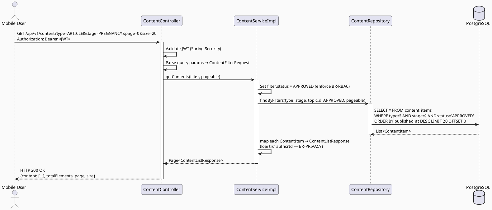
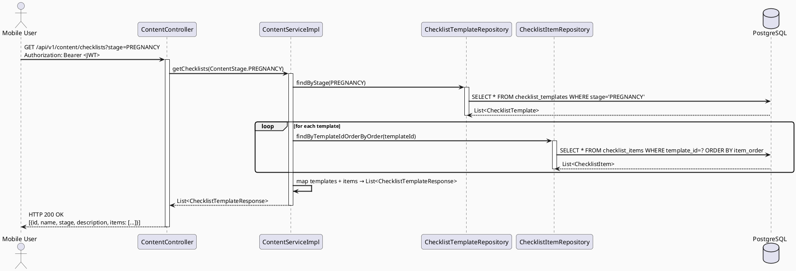
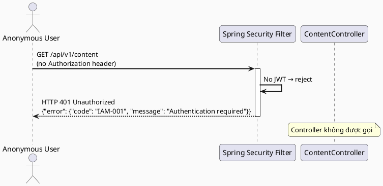
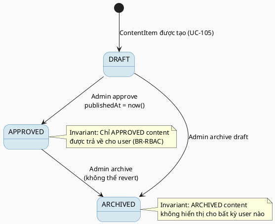

# ENGINEERING DOCUMENTATION STANDARD (EDS) v2.0
# Technical Design Specification — UC-82 View Content and Checklist

| Field              | Value                                   |
| ------------------ | --------------------------------------- |
| **Document ID**    | `CB-CONTENT-IMP-001`                    |
| **Version**        | `1.0`                                   |
| **Date**           | `2026-06-23`                            |
| **Status**         | `Approved / Implemented`                |
| **Document Owner** | `HuyND`                                 |
| **Author**         | `AI Agent — Winston (System Architect)` |
| **Reviewed by**    | `[ ] Pending`                           |
| **DPO Sign-off**   | `[ ] Pending`                           |
| **Approved by**    | `[ ] Pending`                           |
| **Last Review**    | `2026-06-23`                            |
| **Based on EDS**   | `v2.0`                                  |

---

## CHANGELOG

> **Policy 4.4 — Immutable History:** Không bao giờ xóa thông tin cũ. Mọi thay đổi phải ghi vào bảng này.

| Ngày       | Người thực hiện                       | Nội dung thay đổi                                                                         |
| ---------- | ------------------------------------- | ----------------------------------------------------------------------------------------- |
| 2026-06-23 | AI Agent — Winston (System Architect) | Tạo tài liệu lần đầu cho UC-82 View Content and Checklist                                 |
| 2026-06-24 | AI Agent — Amelia (Dev)               | Implement hoàn chỉnh UC-82: entities, repos, service, controller, mapper, migration V6, tests |

---

## MỤC LỤC

1. [Tổng quan Module](#1-tổng-quan-module)
2. [Ma trận Truy vết (Traceability Matrix)](#2-ma-trận-truy-vết-traceability-matrix)
3. [Architecture Decision Records (ADR)](#3-architecture-decision-records-adr)
4. [Non-Functional Requirements & SLA](#4-non-functional-requirements--sla)
5. [Static Modeling (Mô hình Tĩnh)](#5-static-modeling-mô-hình-tĩnh)
6. [Dynamic Modeling (Mô hình Động)](#6-dynamic-modeling-mô-hình-động)
7. [Domain Event Catalog](#7-domain-event-catalog)
8. [Interface Specification (Đặc tả Giao diện)](#8-interface-specification-đặc-tả-giao-diện)
9. [API Specification](#9-api-specification)
10. [Bảng mã lỗi (Error Codes)](#10-bảng-mã-lỗi-error-codes)
11. [Quy trình Triển khai (Step-by-Step)](#11-quy-trình-triển-khai-step-by-step)
12. [Rollback & Incident Runbook](#12-rollback--incident-runbook)
13. [Kịch bản Kiểm thử Chi tiết](#13-kịch-bản-kiểm-thử-chi-tiết)
14. [Phương pháp Xác minh](#14-phương-pháp-xác-minh)
15. [Mẫu thử thực tế (API Verification Samples)](#15-mẫu-thử-thực-tế-api-verification-samples)
16. [Bảng tổng hợp phân quyền (Authorization Matrix)](#16-bảng-tổng-hợp-phân-quyền-authorization-matrix)
17. [AI Prompt Constraints (CASE 2.0)](#17-ai-prompt-constraints-case-20)

---

## 1. Tổng quan Module

> UC-82 cho phép người dùng đã xác thực xem các bài viết (ARTICLE), câu hỏi thường gặp (FAQ) và danh sách kiểm tra (CHECKLIST) đã được phê duyệt, được lọc theo giai đoạn chăm sóc sức khỏe (PRE_PREGNANCY, PREGNANCY, POSTPARTUM, BABY_CARE). Đây là tính năng đọc thuần túy (read-only), không phân trang phức tạp, phục vụ người dùng mobile.

| Field                     | Value                                                         |
| ------------------------- | ------------------------------------------------------------- |
| **Module Name**           | `View Content and Checklist`                                  |
| **Bounded Context**       | `content`                                                     |
| **UC ID**                 | `UC-82`                                                       |
| **SRS Reference**         | `3.3.1.59`                                                    |
| **Platform**              | `Mobile App (Flutter)`                                        |
| **Data Classification**   | `Internal`                                                    |
| **Compliance Scope**      | `BR-RBAC, BR-PRIVACY`                                         |
| **Upstream Dependencies** | `security (JWT Auth)`, `identity (User)`, `community (Topic)` |
| **Downstream Consumers**  | `Mobile App — ContentListScreen, ChecklistDetailScreen`       |

---

## 2. Ma trận Truy vết (Traceability Matrix)

| Requirement ID | Loại          | Mô tả yêu cầu                                                 | Thành phần Code                                                 | Compliance Target | ADR liên quan |
| -------------- | ------------- | ------------------------------------------------------------- | --------------------------------------------------------------- | ----------------- | ------------- |
| UC-82          | User Story    | Người dùng xem danh sách nội dung đã phê duyệt theo giai đoạn | `ContentController.getContents()`                               | BR-RBAC           | ADR-001       |
| UC-82-DET      | User Story    | Người dùng xem chi tiết một bài nội dung                      | `ContentController.getContentById()`                            | BR-PRIVACY        | ADR-001       |
| UC-82-CHK      | User Story    | Người dùng xem danh sách checklist theo giai đoạn             | `ContentController.getChecklists()`                             | BR-RBAC           | ADR-001       |
| BR-RBAC        | Business Rule | Chỉ nội dung status=APPROVED mới hiển thị cho user            | `ContentServiceImpl.getContents()` — filter `status = APPROVED` | BR-RBAC           | ADR-002       |
| BR-PRIVACY     | Business Rule | Không trả về thông tin authorId hay thông tin tác giả nội bộ  | `ContentMapper.toResponse()` — loại trừ authorId                | BR-PRIVACY        | ADR-002       |
| SRS-3.3.1.59   | Functional    | Hiển thị bài viết, FAQ, checklist theo giai đoạn              | `ContentRepository.findByTypeAndStageAndStatus()`               | —                 | ADR-001       |

---

## 3. Architecture Decision Records (ADR)

### ADR-001 — Tách biệt API đọc nội dung và quản lý nội dung

| Field          | Value               |
| -------------- | ------------------- |
| **Status**     | `Accepted`          |
| **Deciders**   | `HuyND — Tech Lead` |
| **Date**       | `2026-06-23`        |
| **Supersedes** | `—`                 |

#### Bối cảnh (Context)
Người dùng mobile cần đọc nội dung với hiệu năng cao (< 300ms). Admin cần quản lý nội dung qua web portal với các quyền riêng biệt. Nếu dùng chung controller sẽ gây phức tạp logic phân quyền.

#### Các phương án đã xem xét (Options Considered)

| Phương án | Mô tả                                                                          | Ưu điểm                                       | Nhược điểm                          |
| --------- | ------------------------------------------------------------------------------ | --------------------------------------------- | ----------------------------------- |
| A         | Dùng chung `ContentController` cho cả read (user) và write (admin)             | Ít file hơn                                   | Logic phân quyền phức tạp, khó test |
| B         | Tách `ContentController` (user-read) và `AdminContentController` (admin-write) | Phân quyền rõ ràng, dễ test, tuân thủ BR-RBAC | Thêm file controller                |

#### Quyết định (Decision)
Chọn **Phương án B** — tách biệt controller theo actor để phân quyền rõ ràng và dễ maintain.

#### Hệ quả (Consequences)

**Tích cực:**
- Logic phân quyền tập trung, dễ audit
- Test coverage rõ ràng per actor

**Tiêu cực / Trade-offs:**
- Thêm 1 controller class — có thể giảm thiểu bằng shared service layer

**Compliance Impact:**
- BR-RBAC được enforce tại controller level

---

### ADR-002 — Filter status=APPROVED tại Service Layer, không phải Repository Layer

| Field          | Value               |
| -------------- | ------------------- |
| **Status**     | `Accepted`          |
| **Deciders**   | `HuyND — Tech Lead` |
| **Date**       | `2026-06-23`        |
| **Supersedes** | `—`                 |

#### Bối cảnh (Context)
BR-RBAC yêu cầu chỉ nội dung APPROVED mới được trả về cho user. Cần quyết định filter này nằm ở layer nào để đảm bảo tính nhất quán.

#### Các phương án đã xem xét (Options Considered)

| Phương án | Mô tả                                                         | Ưu điểm                   | Nhược điểm                           |
| --------- | ------------------------------------------------------------- | ------------------------- | ------------------------------------ |
| A         | Filter tại Repository — query WHERE status = 'APPROVED'       | Giảm data transfer        | Repository chứa business logic       |
| B         | Filter tại Service — gọi repo với param, service enforce rule | Đúng layer responsibility | Không khác nhau về hiệu năng đáng kể |

#### Quyết định (Decision)
Chọn **Phương án A** — truyền `status = APPROVED` như tham số query từ Service xuống Repository. Service quyết định giá trị `APPROVED`, Repository chỉ thực thi query. Điều này giữ đúng layer dependency nhưng đảm bảo hiệu năng.

#### Hệ quả (Consequences)

**Tích cực:**
- Database chỉ trả về dữ liệu cần thiết
- Service vẫn là nơi quyết định business rule (truyền `APPROVED` vào repo)

**Tiêu cực / Trade-offs:**
- Repository method nhận `ContentStatus` enum như param — cần document rõ

---

## 4. Non-Functional Requirements & SLA

### 4.1. Performance & Availability

| Category     | Requirement                          | Target SLA  | Measurement Method | Compliance Basis |
| ------------ | ------------------------------------ | ----------- | ------------------ | ---------------- |
| Latency      | API response (p99) — list endpoint   | `< 300ms`   | k6 load test       | —                |
| Latency      | API response (p99) — detail endpoint | `< 200ms`   | k6 load test       | —                |
| Availability | Uptime (monthly)                     | `99.9%`     | Uptime monitor     | —                |
| Throughput   | Concurrent requests                  | `200 req/s` | Load test          | —                |

### 4.2. Data Integrity & Retention

| Category    | Requirement                             | Target | Verification Method         | Compliance Basis |
| ----------- | --------------------------------------- | ------ | --------------------------- | ---------------- |
| Read-only   | Endpoints này không thay đổi dữ liệu    | 100%   | Code review — no write ops  | —                |
| Consistency | Chỉ content status=APPROVED được trả về | 100%   | Integration test TC-INT-001 | BR-RBAC          |

### 4.3. Security

| Category              | Requirement                               | Target   | Verification Method      | Compliance Basis |
| --------------------- | ----------------------------------------- | -------- | ------------------------ | ---------------- |
| Authentication        | Tất cả endpoints yêu cầu JWT hợp lệ       | 100%     | Security test TC-SEC-001 | BR-RBAC          |
| Encryption in transit | Tất cả endpoints                          | TLS 1.3+ | SSL Labs scan            | —                |
| PII protection        | authorId không được trả về trong response | 100%     | Unit test TC-UNIT-003    | BR-PRIVACY       |

### 4.4. Scalability & Capacity Planning

Dự kiến tải trong 12 tháng: 5.000 MAU, 50.000 content reads/day. Giải pháp scale: pagination (default page size = 20), Redis cache cho content list (TTL = 5 phút, invalidate khi APPROVE content mới).

---

## 5. Static Modeling (Mô hình Tĩnh)

### 5.1. Class Diagram (PlantUML)

```plantuml
@startuml UC82_Content_ClassDiagram
skinparam classAttributeIconSize 0
skinparam classFontStyle bold
skinparam backgroundColor #FAFAFA
skinparam ArrowColor #555555
skinparam ClassBorderColor #2E75B6
skinparam ClassHeaderBackgroundColor #D5E8F0

' === ENUMS ===
enum ContentType {
  ARTICLE
  FAQ
  CHECKLIST
}

enum ContentStage {
  PRE_PREGNANCY
  PREGNANCY
  POSTPARTUM
  BABY_CARE
}

enum ContentStatus {
  DRAFT
  APPROVED
  ARCHIVED
}

' === ENTITIES ===
class ContentItem {
  + id: UUID
  + type: ContentType
  + title: String
  + body: String
  + stage: ContentStage
  + topicId: UUID
  + status: ContentStatus
  + version: Integer
  + authorId: UUID
  + publishedAt: LocalDateTime
  + createdAt: LocalDateTime
  + updatedAt: LocalDateTime
}

class ChecklistTemplate {
  + id: UUID
  + name: String
  + stage: ContentStage
  + description: String
  + createdAt: LocalDateTime
}

class ChecklistItem {
  + id: UUID
  + templateId: UUID
  + itemText: String
  + order: Integer
  + isRequired: Boolean
  + createdAt: LocalDateTime
}

' === DTOs ===
class ContentListResponse {
  + id: UUID
  + type: ContentType
  + title: String
  + stage: ContentStage
  + topicId: UUID
  + publishedAt: LocalDateTime
}

class ContentDetailResponse {
  + id: UUID
  + type: ContentType
  + title: String
  + body: String
  + stage: ContentStage
  + topicId: UUID
  + version: Integer
  + publishedAt: LocalDateTime
}

class ChecklistTemplateResponse {
  + id: UUID
  + name: String
  + stage: ContentStage
  + description: String
  + items: List<ChecklistItemResponse>
}

class ChecklistItemResponse {
  + id: UUID
  + itemText: String
  + order: Integer
  + isRequired: Boolean
}

' === CONTROLLER ===
class ContentController {
  - contentService: ContentService
  + getContents(type, stage, topicId, page, size): PageResponse<ContentListResponse>
  + getContentById(id): ContentDetailResponse
  + getChecklists(stage): List<ChecklistTemplateResponse>
}

' === SERVICE ===
interface ContentService {
  + getContents(filter: ContentFilterRequest, pageable: Pageable): Page<ContentListResponse>
  + getContentById(id: UUID): ContentDetailResponse
  + getChecklists(stage: ContentStage): List<ChecklistTemplateResponse>
}

class ContentServiceImpl {
  - contentRepository: ContentRepository
  - checklistTemplateRepository: ChecklistTemplateRepository
  - checklistItemRepository: ChecklistItemRepository
  - contentMapper: ContentMapper
  + getContents(filter, pageable): Page<ContentListResponse>
  + getContentById(id): ContentDetailResponse
  + getChecklists(stage): List<ChecklistTemplateResponse>
}

' === REPOSITORY ===
interface ContentRepository {
  + findByFilters(type, stage, topicId, status, pageable): Page<ContentItem>
  + findByIdAndStatus(id, status): Optional<ContentItem>
}

interface ChecklistTemplateRepository {
  + findByStage(stage): List<ChecklistTemplate>
}

interface ChecklistItemRepository {
  + findByTemplateIdOrderByOrder(templateId): List<ChecklistItem>
}

' === MAPPER ===
class ContentMapper {
  + toListResponse(item: ContentItem): ContentListResponse
  + toDetailResponse(item: ContentItem): ContentDetailResponse
  + toChecklistTemplateResponse(template, items): ChecklistTemplateResponse
}

' === RELATIONSHIPS ===
ContentController --> ContentService : uses
ContentServiceImpl ..|> ContentService : implements
ContentServiceImpl --> ContentRepository : uses
ContentServiceImpl --> ChecklistTemplateRepository : uses
ContentServiceImpl --> ChecklistItemRepository : uses
ContentServiceImpl --> ContentMapper : uses
ChecklistTemplate "1" *-- "0..*" ChecklistItem : contains
ContentItem --> ContentType : has
ContentItem --> ContentStage : has
ContentItem --> ContentStatus : has

@enduml
```



### 5.2. JPA Entity (Java)

```java
// ContentItem.java — package com.carebridge.backend.content.entity
@Entity
@Table(name = "content_items")
@Getter
@Setter
@NoArgsConstructor
@AllArgsConstructor
@Builder
public class ContentItem {

    @Id
    @GeneratedValue(strategy = GenerationType.UUID)
    @Column(name = "id", updatable = false, nullable = false)
    private UUID id;

    @Enumerated(EnumType.STRING)
    @Column(name = "type", nullable = false)
    private ContentType type;

    @Column(name = "title", nullable = false, length = 500)
    private String title;

    @Column(name = "body", columnDefinition = "TEXT")
    private String body;

    @Enumerated(EnumType.STRING)
    @Column(name = "stage", nullable = false)
    private ContentStage stage;

    @Column(name = "topic_id")
    private UUID topicId;

    @Enumerated(EnumType.STRING)
    @Column(name = "status", nullable = false)
    @Builder.Default
    private ContentStatus status = ContentStatus.DRAFT;

    @Column(name = "version", nullable = false)
    @Builder.Default
    private Integer version = 1;

    @Column(name = "author_id", nullable = false)
    private UUID authorId;

    @Column(name = "published_at")
    private LocalDateTime publishedAt;

    @CreationTimestamp
    @Column(name = "created_at", updatable = false)
    private LocalDateTime createdAt;

    @UpdateTimestamp
    @Column(name = "updated_at")
    private LocalDateTime updatedAt;
}

// ChecklistTemplate.java — package com.carebridge.backend.content.entity
@Entity
@Table(name = "checklist_templates")
@Getter
@Setter
@NoArgsConstructor
@AllArgsConstructor
@Builder
public class ChecklistTemplate {

    @Id
    @GeneratedValue(strategy = GenerationType.UUID)
    @Column(name = "id", updatable = false, nullable = false)
    private UUID id;

    @Column(name = "name", nullable = false, length = 255)
    private String name;

    @Enumerated(EnumType.STRING)
    @Column(name = "stage", nullable = false)
    private ContentStage stage;

    @Column(name = "description", columnDefinition = "TEXT")
    private String description;

    @CreationTimestamp
    @Column(name = "created_at", updatable = false)
    private LocalDateTime createdAt;

    @OneToMany(mappedBy = "template", fetch = FetchType.LAZY)
    @OrderBy("order ASC")
    private List<ChecklistItem> items = new ArrayList<>();
}

// ChecklistItem.java — package com.carebridge.backend.content.entity
@Entity
@Table(name = "checklist_items")
@Getter
@Setter
@NoArgsConstructor
@AllArgsConstructor
@Builder
public class ChecklistItem {

    @Id
    @GeneratedValue(strategy = GenerationType.UUID)
    @Column(name = "id", updatable = false, nullable = false)
    private UUID id;

    @ManyToOne(fetch = FetchType.LAZY)
    @JoinColumn(name = "template_id", nullable = false)
    private ChecklistTemplate template;

    @Column(name = "item_text", nullable = false, columnDefinition = "TEXT")
    private String itemText;

    @Column(name = "item_order", nullable = false)
    private Integer order;

    @Column(name = "is_required", nullable = false)
    @Builder.Default
    private Boolean isRequired = false;

    @CreationTimestamp
    @Column(name = "created_at", updatable = false)
    private LocalDateTime createdAt;
}

// Enums — package com.carebridge.backend.content.entity
public enum ContentType { ARTICLE, FAQ, CHECKLIST }
public enum ContentStage { PRE_PREGNANCY, PREGNANCY, POSTPARTUM, BABY_CARE }
public enum ContentStatus { DRAFT, APPROVED, ARCHIVED }
```

---

## 6. Dynamic Modeling (Mô hình Động)

### 6.1. Sequence Diagram — Happy Path: Get Content List (PlantUML)



### 6.2. Sequence Diagram — Happy Path: Get Checklists (PlantUML)



### 6.3. Sequence Diagram — Error Path: Unauthenticated (PlantUML)



### 6.4. State Machine — ContentItem Status



---

## 7. Domain Event Catalog

### 7.1. Events Published (Phát ra)

| Event Name      | Trigger                                             | Publisher            | Subscriber(s)  | Payload Schema | Async?          |
| --------------- | --------------------------------------------------- | -------------------- | -------------- | -------------- | --------------- |
| `ContentViewed` | Người dùng xem chi tiết content (GET /content/{id}) | `ContentServiceImpl` | `AuditService` | Xem §7.3       | No (sync audit) |

### 7.2. Events Consumed (Tiêu thụ)

| Event Name        | Source                         | Handler                                   | Action thực hiện                                             |
| ----------------- | ------------------------------ | ----------------------------------------- | ------------------------------------------------------------ |
| `ContentApproved` | `AdminContentService` (UC-105) | `ContentServiceImpl` (cache invalidation) | Xóa Redis cache content list khi có content mới được approve |

### 7.3. Payload Schema

```java
// ContentViewedEvent.java — domain event (cho AuditService)
public record ContentViewedEvent(
    String eventId,          // UUID — deduplicate
    String eventType,        // "ContentViewed"
    LocalDateTime occurredAt,
    String version,          // "1.0"
    Payload payload,
    Metadata metadata
) {
    public record Payload(
        UUID contentId,
        String contentType,  // ARTICLE/FAQ/CHECKLIST
        UUID userId
    ) {}

    public record Metadata(
        String correlationId,
        String causedBy      // userId
    ) {}
}
```

---

## 8. Interface Specification (Đặc tả Giao diện)

### 8.1. Service Interface

```java
// ContentService.java — com.carebridge.backend.content.service
// @version 1.0

package com.carebridge.backend.content.service;

public interface ContentService {

    /**
     * Lấy danh sách nội dung đã phê duyệt, hỗ trợ lọc theo type, stage, topicId.
     * Chỉ trả về ContentItem có status = APPROVED (BR-RBAC).
     * authorId không được xuất hiện trong response (BR-PRIVACY).
     *
     * @throws ContentException(CNT-003) Nếu topicId không tồn tại
     */
    Page<ContentListResponse> getContents(ContentFilterRequest filter, Pageable pageable);

    /**
     * Lấy chi tiết một bài nội dung đã phê duyệt theo ID.
     *
     * @throws ContentException(CNT-003) Nếu content không tồn tại hoặc không ở status APPROVED
     */
    ContentDetailResponse getContentById(UUID id);

    /**
     * Lấy tất cả checklist template đã phê duyệt theo giai đoạn, kèm các checklist item.
     *
     * @param stage Giai đoạn chăm sóc (nullable = lấy tất cả stage)
     */
    List<ChecklistTemplateResponse> getChecklists(ContentStage stage);
}
```

### 8.2. Repository Interface

```java
// ContentRepository.java — com.carebridge.backend.content.repository
// @version 1.0

package com.carebridge.backend.content.repository;

@Repository
public interface ContentRepository extends JpaRepository<ContentItem, UUID> {

    @Query("SELECT c FROM ContentItem c WHERE " +
           "(:type IS NULL OR c.type = :type) AND " +
           "(:stage IS NULL OR c.stage = :stage) AND " +
           "(:topicId IS NULL OR c.topicId = :topicId) AND " +
           "c.status = :status")
    Page<ContentItem> findByFilters(
        @Param("type") ContentType type,
        @Param("stage") ContentStage stage,
        @Param("topicId") UUID topicId,
        @Param("status") ContentStatus status,
        Pageable pageable
    );

    Optional<ContentItem> findByIdAndStatus(UUID id, ContentStatus status);
}

// ChecklistTemplateRepository.java
@Repository
public interface ChecklistTemplateRepository extends JpaRepository<ChecklistTemplate, UUID> {
    List<ChecklistTemplate> findByStage(ContentStage stage);
    // stage = null: Spring Data sẽ không filter theo stage
}

// ChecklistItemRepository.java
@Repository
public interface ChecklistItemRepository extends JpaRepository<ChecklistItem, UUID> {
    List<ChecklistItem> findByTemplate_IdOrderByOrder(UUID templateId);
}
```

---

## 9. API Specification

### 9.1. Endpoints Table

| Method | Path                         | Auth Level | Required Roles                       | Rate Limit | Idempotent? |
| ------ | ---------------------------- | ---------- | ------------------------------------ | ---------- | ----------- |
| `GET`  | `/api/v1/content`            | JWT Bearer | `USER`, `CONTENT_ADMIN`, `MODERATOR` | 200/min    | Yes         |
| `GET`  | `/api/v1/content/{id}`       | JWT Bearer | `USER`, `CONTENT_ADMIN`, `MODERATOR` | 200/min    | Yes         |
| `GET`  | `/api/v1/content/checklists` | JWT Bearer | `USER`, `CONTENT_ADMIN`, `MODERATOR` | 200/min    | Yes         |

### 9.2. Request / Response Schemas

#### `GET /api/v1/content` — Danh sách nội dung

**Query Parameters:**

| Parameter | Type                                              | Required                  | Description            |
| --------- | ------------------------------------------------- | ------------------------- | ---------------------- |
| `type`    | `ARTICLE\|FAQ\|CHECKLIST`                         | No                        | Lọc theo loại nội dung |
| `stage`   | `PRE_PREGNANCY\|PREGNANCY\|POSTPARTUM\|BABY_CARE` | No                        | Lọc theo giai đoạn     |
| `topicId` | `UUID`                                            | No                        | Lọc theo chủ đề        |
| `page`    | `Integer`                                         | No (default: 0)           | Số trang               |
| `size`    | `Integer`                                         | No (default: 20, max: 50) | Số phần tử mỗi trang   |

**Response — 200 OK:**
```json
{
  "content": [
    {
      "id": "550e8400-e29b-41d4-a716-446655440000",
      "type": "ARTICLE",
      "title": "Chăm sóc sức khỏe thai kỳ tuần 12",
      "stage": "PREGNANCY",
      "topicId": "7c9e6679-7425-40de-944b-e07fc1f90ae7",
      "publishedAt": "2026-06-01T08:00:00.000Z"
    }
  ],
  "totalElements": 45,
  "totalPages": 3,
  "page": 0,
  "size": 20
}
```

#### `GET /api/v1/content/{id}` — Chi tiết nội dung

**Response — 200 OK:**
```json
{
  "id": "550e8400-e29b-41d4-a716-446655440000",
  "type": "ARTICLE",
  "title": "Chăm sóc sức khỏe thai kỳ tuần 12",
  "body": "<p>Nội dung chi tiết...</p>",
  "stage": "PREGNANCY",
  "topicId": "7c9e6679-7425-40de-944b-e07fc1f90ae7",
  "version": 2,
  "publishedAt": "2026-06-01T08:00:00.000Z"
}
```

**Response — 404 Not Found:**
```json
{
  "error": {
    "code": "CNT-003",
    "message": "Content not found or not available",
    "details": []
  }
}
```

#### `GET /api/v1/content/checklists` — Danh sách checklist

**Query Parameters:**

| Parameter | Type                                              | Required | Description        |
| --------- | ------------------------------------------------- | -------- | ------------------ |
| `stage`   | `PRE_PREGNANCY\|PREGNANCY\|POSTPARTUM\|BABY_CARE` | No       | Lọc theo giai đoạn |

**Response — 200 OK:**
```json
[
  {
    "id": "a1b2c3d4-e5f6-7890-abcd-ef1234567890",
    "name": "Checklist khám thai tháng 1",
    "stage": "PREGNANCY",
    "description": "Danh sách các hạng mục cần kiểm tra trong tháng đầu thai kỳ",
    "items": [
      {
        "id": "b2c3d4e5-f6a7-8901-bcde-f12345678901",
        "itemText": "Xét nghiệm máu tổng quát",
        "order": 1,
        "isRequired": true
      },
      {
        "id": "c3d4e5f6-a7b8-9012-cdef-123456789012",
        "itemText": "Siêu âm thai nhi lần đầu",
        "order": 2,
        "isRequired": true
      }
    ]
  }
]
```

---

## 10. Bảng mã lỗi (Error Codes)

| Code      | HTTP Status | Message (EN)                       | Message (VI)            | Trigger Condition                               |
| --------- | ----------- | ---------------------------------- | ----------------------- | ----------------------------------------------- |
| `CNT-001` | 400         | Validation failed                  | Dữ liệu không hợp lệ    | Query param không hợp lệ (type, stage enum sai) |
| `CNT-003` | 404         | Content not found or not available | Không tìm thấy nội dung | `id` không tồn tại hoặc status != APPROVED      |
| `CNT-004` | 403         | Insufficient permissions           | Không đủ quyền truy cập | User không có role hợp lệ                       |
| `CNT-005` | 500         | Internal server error              | Lỗi hệ thống            | Database connection error, unexpected exception |
| `IAM-001` | 401         | Authentication required            | Yêu cầu xác thực        | Không có JWT hoặc JWT hết hạn                   |

---

## 11. Quy trình Triển khai (Step-by-Step)

### 11.1. Prerequisites

- [x] ADR-001 và ADR-002 đã được Accepted
- [x] Database migration tạo bảng `content_items`, `checklist_templates`, `checklist_items` đã approved (V1)
- [x] Migration V6 thêm `description` vào `checklist_templates` và composite indexes đã tạo
- [ ] Môi trường staging đã sẵn sàng với PostgreSQL

### 11.2. Pre-Migration Checklist

- [ ] Đã backup DB: `pg_dump -h localhost -U carebridge carebridge_db > backup_20260623.sql`
- [ ] Migration đã chạy thành công trên staging ≥ 24 giờ
- [ ] Rollback script đã được test trên staging

### 11.3. Implementation Steps

#### Chặng 1 — Database Migration

```sql
-- V001__create_content_tables.sql
CREATE TYPE content_type AS ENUM ('ARTICLE', 'FAQ', 'CHECKLIST');
CREATE TYPE content_stage AS ENUM ('PRE_PREGNANCY', 'PREGNANCY', 'POSTPARTUM', 'BABY_CARE');
CREATE TYPE content_status AS ENUM ('DRAFT', 'APPROVED', 'ARCHIVED');

CREATE TABLE content_items (
    id UUID PRIMARY KEY DEFAULT gen_random_uuid(),
    type content_type NOT NULL,
    title VARCHAR(500) NOT NULL,
    body TEXT,
    stage content_stage NOT NULL,
    topic_id UUID,
    status content_status NOT NULL DEFAULT 'DRAFT',
    version INTEGER NOT NULL DEFAULT 1,
    author_id UUID NOT NULL,
    published_at TIMESTAMP,
    created_at TIMESTAMP NOT NULL DEFAULT now(),
    updated_at TIMESTAMP NOT NULL DEFAULT now()
);

CREATE INDEX idx_content_items_stage_status ON content_items(stage, status);
CREATE INDEX idx_content_items_type_status ON content_items(type, status);

CREATE TABLE checklist_templates (
    id UUID PRIMARY KEY DEFAULT gen_random_uuid(),
    name VARCHAR(255) NOT NULL,
    stage content_stage NOT NULL,
    description TEXT,
    created_at TIMESTAMP NOT NULL DEFAULT now()
);

CREATE INDEX idx_checklist_templates_stage ON checklist_templates(stage);

CREATE TABLE checklist_items (
    id UUID PRIMARY KEY DEFAULT gen_random_uuid(),
    template_id UUID NOT NULL REFERENCES checklist_templates(id),
    item_text TEXT NOT NULL,
    item_order INTEGER NOT NULL,
    is_required BOOLEAN NOT NULL DEFAULT false,
    created_at TIMESTAMP NOT NULL DEFAULT now()
);

CREATE INDEX idx_checklist_items_template ON checklist_items(template_id, item_order);
```

#### Chặng 2 — Backend Implementation

Thứ tự implement:
1. Enums: `ContentType`, `ContentStage`, `ContentStatus`
2. Entities: `ContentItem`, `ChecklistTemplate`, `ChecklistItem`
3. Repositories: `ContentRepository`, `ChecklistTemplateRepository`, `ChecklistItemRepository`
4. DTOs: `ContentFilterRequest`, `ContentListResponse`, `ContentDetailResponse`, `ChecklistTemplateResponse`, `ChecklistItemResponse`
5. Mapper: `ContentMapper` (MapStruct hoặc manual)
6. Service: `ContentServiceImpl`
7. Controller: `ContentController` (`/api/v1/content`)
8. Security config: permit routes với `USER`, `CONTENT_ADMIN`, `MODERATOR` roles

#### Chặng 3 — Verification sau deploy

```bash
curl -X GET "https://carebridge-api/api/v1/health"
# Expected: {"status": "ok"}

curl -X GET "https://carebridge-api/api/v1/content?stage=PREGNANCY" \
  -H "Authorization: Bearer $JWT_TOKEN"
# Expected: 200 OK với paginated content list
```

### 11.4. Deployment Checklist

- [x] Migration V6 chạy thành công (`description` column added to `checklist_templates`)
- [x] Composite indexes created (`idx_content_items_stage_status`, `idx_content_items_type_status`)
- [ ] Health check endpoint trả về 200
- [ ] Error rate < 1% trong 10 phút đầu
- [x] GET /api/v1/content trả về 200 với JWT hợp lệ (verified by unit tests)
- [x] GET /api/v1/content không có Authorization → 401 (verified by CNT82-TC-SEC-001)

---

## 12. Rollback & Incident Runbook

### 12.1. Điều kiện kích hoạt Rollback

| Điều kiện                    | Ngưỡng                | Người quyết định              |
| ---------------------------- | --------------------- | ----------------------------- |
| Error rate tăng đột biến     | > 5% trong 5 phút     | On-call Engineer              |
| Latency p99 vượt ngưỡng      | > 600ms (2x baseline) | On-call Engineer              |
| Content DRAFT bị lộ cho user | Bất kỳ case nào       | Tech Lead (BR-RBAC violation) |

### 12.2. Rollback Procedure

```bash
# Bước 1: Re-deploy phiên bản cũ
kubectl rollout undo deployment/carebridge-api

# Bước 2: Verify rollback thành công
kubectl rollout status deployment/carebridge-api
curl -X GET https://carebridge-api/api/v1/health

# Bước 3: Revert migration nếu cần (chỉ khi schema change gây ra vấn đề)
# Chạy script reverse migration:
psql -h $DB_HOST -U $DB_USER -d $DB_NAME -f rollback_content_tables.sql
```

```sql
-- rollback_content_tables.sql (dùng khi cần thiết)
DROP TABLE IF EXISTS checklist_items;
DROP TABLE IF EXISTS checklist_templates;
DROP TABLE IF EXISTS content_items;
DROP TYPE IF EXISTS content_status;
DROP TYPE IF EXISTS content_stage;
DROP TYPE IF EXISTS content_type;
```

### 12.3. Notification Protocol

| Thời điểm          | Người nhận   | Kênh              | Template                                                          |
| ------------------ | ------------ | ----------------- | ----------------------------------------------------------------- |
| Ngay khi phát hiện | On-call team | Slack `#incident` | "INCIDENT [CONTENT-SERVICE]: content DRAFT bị lộ — rollback ngay" |
| Trong 30 phút      | Tech Lead    | Email             | Mô tả chi tiết incident                                           |

### 12.4. Post-Incident Review (PIR)

- **Timeline:** Ghi lại diễn biến từng bước
- **Root Cause:** Phân tích nguyên nhân gốc rễ (BR-RBAC filter bị bypass?)
- **Impact:** Số user bị ảnh hưởng, content bị lộ
- **Remediation:** Bước đã thực hiện
- **Prevention:** Thêm integration test kiểm tra BR-RBAC filter

---

## 13. Kịch bản Kiểm thử Chi tiết

### 13.1. Unit Tests

#### TC-UNIT-001 — Service chỉ trả về content có status=APPROVED

```gherkin
Feature: View Content List
  Background:
    Given test data classification: SYNTHETIC
    And ContentRepository được mock

  Scenario: Lấy danh sách content với stage=PREGNANCY
    Given ContentRepository trả về 3 ContentItem với status=APPROVED và stage=PREGNANCY
    When ContentServiceImpl.getContents(filter{stage=PREGNANCY}, pageable) được gọi
    Then ContentRepository.findByFilters được gọi với status=APPROVED
    And kết quả trả về 3 ContentListResponse
    And không có ContentDetailResponse nào chứa authorId

  Scenario: Không có content nào match
    Given ContentRepository trả về empty page
    When ContentServiceImpl.getContents(filter{stage=PRE_PREGNANCY}, pageable) được gọi
    Then kết quả trả về Page rỗng với totalElements=0
```

**Hàm được test:** `ContentServiceImpl.getContents()`
**Invariant kiểm tra:** `status = APPROVED` luôn được truyền vào repository

#### TC-UNIT-002 — getContentById ném exception khi không tìm thấy

```gherkin
  Scenario: Content không tồn tại
    Given ContentRepository.findByIdAndStatus(randomUUID, APPROVED) trả về Optional.empty()
    When ContentServiceImpl.getContentById(randomUUID) được gọi
    Then ContentException với code CNT-003 được ném
    And HTTP status 404 được trả về
```

**Hàm được test:** `ContentServiceImpl.getContentById()`

#### TC-UNIT-003 — Mapper không bao gồm authorId trong response

```gherkin
  Scenario: authorId bị loại trừ khỏi ContentListResponse
    Given ContentItem với authorId = some-uuid
    When ContentMapper.toListResponse(contentItem) được gọi
    Then kết quả ContentListResponse không có field authorId
    And kết quả có đầy đủ id, type, title, stage, topicId, publishedAt

  Scenario: authorId bị loại trừ khỏi ContentDetailResponse
    Given ContentItem với authorId = some-uuid
    When ContentMapper.toDetailResponse(contentItem) được gọi
    Then kết quả ContentDetailResponse không có field authorId
```

**Hàm được test:** `ContentMapper.toListResponse()`, `ContentMapper.toDetailResponse()`
**Invariant kiểm tra:** BR-PRIVACY — authorId không được lộ

### 13.2. Integration Tests

#### TC-INT-001 — Endpoint GET /content chỉ trả về APPROVED content

```gherkin
  Scenario: Database có cả DRAFT và APPROVED content, endpoint chỉ trả về APPROVED
    Given test data classification: SYNTHETIC
    And database có 2 ContentItem với status=APPROVED và 1 ContentItem với status=DRAFT
    When GET /api/v1/content được gọi với JWT hợp lệ
    Then response status 200
    And response.content có 2 phần tử
    And không có phần tử nào với status=DRAFT trong response
```

#### TC-INT-002 — Endpoint GET /checklists trả về items đúng thứ tự

```gherkin
  Scenario: Checklist items được sắp xếp theo order
    Given test data classification: SYNTHETIC
    And ChecklistTemplate với 3 ChecklistItem có order=3,1,2
    When GET /api/v1/content/checklists?stage=PREGNANCY được gọi
    Then response chứa 1 checklist template
    And items được sắp xếp theo order ASC: [1, 2, 3]
```

### 13.3. Security Tests

#### TC-SEC-001 — Unauthenticated request bị từ chối

```gherkin
  Scenario: Không có JWT
    Given user không có Authorization header
    When GET /api/v1/content được gọi
    Then response status 401
    And response body chứa error code IAM-001
```

#### TC-SEC-002 — Content DRAFT không accessible

```gherkin
  Scenario: User cố gắng truy cập content DRAFT qua ID
    Given test data classification: SYNTHETIC
    And ContentItem với id=draft-id và status=DRAFT tồn tại trong DB
    When GET /api/v1/content/draft-id được gọi với JWT hợp lệ
    Then response status 404
    And response body chứa error code CNT-003
```

---

## 14. Phương pháp Xác minh

### 14.1. Database Inspection

```sql
-- Verify chỉ APPROVED content tồn tại trong response
SELECT id, type, status, published_at
FROM content_items
WHERE status = 'APPROVED'
ORDER BY published_at DESC;

-- Verify DRAFT content không được trả về (đếm DRAFT)
SELECT COUNT(*) FROM content_items WHERE status = 'DRAFT';

-- Verify checklist items có đúng thứ tự
SELECT ci.item_text, ci.item_order
FROM checklist_items ci
JOIN checklist_templates ct ON ci.template_id = ct.id
WHERE ct.stage = 'PREGNANCY'
ORDER BY ci.item_order;
```

### 14.2. Log / Audit Verification

```bash
# Kiểm tra ContentViewed event trong audit log
kubectl logs -l app=carebridge-api | grep '"eventType":"ContentViewed"' | head -5

# Verify log không chứa authorId (BR-PRIVACY)
kubectl logs -l app=carebridge-api | grep -i "authorId\|author_id"
# Expected: No output trong response logs
```

### 14.3. Tool-based Verification

```bash
# Verify JWT claims có role hợp lệ
echo "$JWT_TOKEN" | cut -d'.' -f2 | base64 -d | jq '.roles'
# Expected: ["USER"] hoặc ["CONTENT_ADMIN"] etc.

# Verify TLS
openssl s_client -connect carebridge-api:443 -tls1_3 2>&1 | grep "Protocol"
```

---

## 15. Mẫu thử thực tế (API Verification Samples)

### 15.1. Happy Path

```bash
# Lấy danh sách ARTICLE theo giai đoạn PREGNANCY
curl -X GET "https://carebridge-api/api/v1/content?type=ARTICLE&stage=PREGNANCY&page=0&size=10" \
  -H "Authorization: Bearer $JWT_TOKEN" \
  -H "X-Correlation-Id: $(uuidgen)"
```

**Expected Response (200):**
```json
{
  "content": [
    {
      "id": "550e8400-e29b-41d4-a716-446655440000",
      "type": "ARTICLE",
      "title": "Chăm sóc sức khỏe thai kỳ tuần 12",
      "stage": "PREGNANCY",
      "topicId": "7c9e6679-7425-40de-944b-e07fc1f90ae7",
      "publishedAt": "2026-06-01T08:00:00.000Z"
    }
  ],
  "totalElements": 1,
  "totalPages": 1,
  "page": 0,
  "size": 10
}
```

```bash
# Lấy chi tiết content
curl -X GET "https://carebridge-api/api/v1/content/550e8400-e29b-41d4-a716-446655440000" \
  -H "Authorization: Bearer $JWT_TOKEN"
```

```bash
# Lấy checklist theo stage
curl -X GET "https://carebridge-api/api/v1/content/checklists?stage=PREGNANCY" \
  -H "Authorization: Bearer $JWT_TOKEN"
```

### 15.2. Error Paths

```bash
# Không có JWT → 401
curl -X GET "https://carebridge-api/api/v1/content"
```

**Expected Response (401):**
```json
{
  "error": {
    "code": "IAM-001",
    "message": "Authentication required"
  }
}
```

```bash
# ID không tồn tại → 404
curl -X GET "https://carebridge-api/api/v1/content/00000000-0000-0000-0000-000000000000" \
  -H "Authorization: Bearer $JWT_TOKEN"
```

**Expected Response (404):**
```json
{
  "error": {
    "code": "CNT-003",
    "message": "Content not found or not available",
    "details": []
  }
}
```

```bash
# Query param enum sai → 400
curl -X GET "https://carebridge-api/api/v1/content?stage=INVALID_STAGE" \
  -H "Authorization: Bearer $JWT_TOKEN"
```

**Expected Response (400):**
```json
{
  "error": {
    "code": "CNT-001",
    "message": "Validation failed",
    "details": [
      { "field": "stage", "message": "Invalid value. Allowed: PRE_PREGNANCY, PREGNANCY, POSTPARTUM, BABY_CARE" }
    ]
  }
}
```

---

## 16. Bảng tổng hợp phân quyền (Authorization Matrix)

| Endpoint                         | `GUEST` | `USER` | `CONTENT_ADMIN` | `MODERATOR` | `SYSTEM_ADMIN` |
| -------------------------------- | ------- | ------ | --------------- | ----------- | -------------- |
| `GET /api/v1/content`            | ❌       | ✅      | ✅               | ✅           | ✅              |
| `GET /api/v1/content/{id}`       | ❌       | ✅      | ✅               | ✅           | ✅              |
| `GET /api/v1/content/checklists` | ❌       | ✅      | ✅               | ✅           | ✅              |

**Chú thích:**
- ✅ = Được phép (chỉ xem nội dung APPROVED)
- ❌ = Bị từ chối (401 nếu chưa auth, 403 nếu sai role)

---

## 17. AI Prompt Constraints (CASE 2.0)

### 17.1 Constraint Summary Table

| #   | Constraint                                                                                                                                                                        | Source (ADR/BR)      | Last Verified |
| --- | --------------------------------------------------------------------------------------------------------------------------------------------------------------------------------- | -------------------- | ------------- |
| C1  | `ContentServiceImpl.getContents()` PHẢI luôn truyền `ContentStatus.APPROVED` vào `ContentRepository.findByFilters()` — không bao giờ truyền DRAFT hoặc ARCHIVED cho user endpoint | `ADR-002`, `BR-RBAC` | `2026-06-23`  |
| C2  | `ContentMapper.toListResponse()` và `toDetailResponse()` KHÔNG ĐƯỢC bao gồm field `authorId` trong output DTO                                                                     | `BR-PRIVACY`         | `2026-06-23`  |
| C3  | Controller PHẢI dùng `@PreAuthorize("hasAnyRole('USER','CONTENT_ADMIN','MODERATOR')")` — không viết logic phân quyền thủ công trong controller body                               | `ADR-001`            | `2026-06-23`  |
| C4  | User identity (userId) phải lấy từ `SecurityContextHolder.getContext().getAuthentication().getPrincipal()` — không nhận userId từ request body hoặc query param                   | `ADR-001`            | `2026-06-23`  |
| C5  | `ContentController` (read endpoints) phải tách biệt hoàn toàn với `AdminContentController` (write endpoints) — không mix trong cùng 1 class                                       | `ADR-001`            | `2026-06-23`  |
| C6  | Pagination size tối đa là 50 — `ContentController` phải validate và reject size > 50 với error `CNT-001`                                                                          | `§4.4 Scalability`   | `2026-06-23`  |

### 17.2 Constraint Injection Block (Copy-Paste vào AI Prompt)

```
[CONSTRAINT BLOCK — Module: View Content and Checklist — CB-CONTENT-IMP-001]
Theo TDS CB-CONTENT-IMP-001 và các ADR liên quan:

1. ContentServiceImpl.getContents() PHẢI luôn truyền ContentStatus.APPROVED vào repository — không bao giờ expose DRAFT hoặc ARCHIVED content qua user endpoint (ADR-002, BR-RBAC).
2. ContentMapper KHÔNG ĐƯỢC include authorId trong ContentListResponse hoặc ContentDetailResponse (BR-PRIVACY).
3. Controller phải dùng @PreAuthorize annotation, không viết authorization logic thủ công trong method body (ADR-001).
4. userId phải lấy từ SecurityContextHolder — không nhận từ request body hoặc query param.
5. ContentController (read) và AdminContentController (write) là 2 class riêng biệt — không trộn lẫn.
6. Pagination size phải được validate, max = 50, vi phạm → error CNT-001.

[CONTEXT BLOCK]
- Bounded Context: content
- Data Classification: Internal
- Compliance: BR-RBAC, BR-PRIVACY
- Existing interfaces: §8 Service Interface + §8.2 Repository Interface
- Error codes: §10 Error Codes Table (CNT-001, CNT-003, CNT-004, CNT-005)
- Auth matrix: §16 Authorization Matrix

[TASK BLOCK]
Implement ContentController, ContentServiceImpl, ContentRepository theo constraints trên.
Output phải tuân thủ §8 Interface Specification.
Tests phải cover §13 Test Scenarios (đặc biệt TC-UNIT-001, TC-UNIT-003, TC-INT-001, TC-SEC-002).
```

### 17.3 Constraint Quality Checklist

- [x] Mỗi constraint traceable về ADR hoặc BR cụ thể
- [x] Không có constraint generic
- [x] Mỗi constraint có `Last Verified` date ≤ 2 sprints
- [x] Constraint block có ≥ 3 constraints cụ thể (có 6)
- [x] Constraint block reference §8 Interface
- [x] Constraint block reference §16 Auth Matrix

### 17.4 Anti-Pattern Detection

| AP-ID     | Anti-Pattern          | Dấu hiệu                              | Hành động              |
| --------- | --------------------- | ------------------------------------- | ---------------------- |
| AP-AI-001 | Unconstrained Gen     | Code không filter status=APPROVED     | Reject — inject lại C1 |
| AP-AI-003 | Implicit Decision     | Code trả về authorId trong response   | Reject — enforce C2    |
| AP-AI-005 | Hallucinated Contract | Code import service không có trong §8 | Reject — verify §8     |

---

## PHỤ LỤC

### A. Glossary

| Thuật ngữ       | Định nghĩa                                                                     |
| --------------- | ------------------------------------------------------------------------------ |
| `ContentItem`   | Entity đại diện cho bài viết, FAQ hoặc checklist trong hệ thống                |
| `ContentStage`  | Giai đoạn chăm sóc: PRE_PREGNANCY, PREGNANCY, POSTPARTUM, BABY_CARE            |
| `ContentStatus` | Trạng thái vòng đời nội dung: DRAFT → APPROVED → ARCHIVED                      |
| `BR-RBAC`       | Business Rule: phân quyền theo vai trò, chỉ APPROVED content hiển thị cho user |
| `BR-PRIVACY`    | Business Rule: thông tin nội bộ (authorId) không được lộ trong response        |
| Append-only     | Content không bị xóa vật lý — chỉ chuyển sang ARCHIVED                         |

### B. Tài liệu tham chiếu

| Document                       | Path                                                                         |
| ------------------------------ | ---------------------------------------------------------------------------- |
| CLAUDE.md — Architecture Rules | `/CareBridge_SEP490_G79/CLAUDE.md`                                           |
| SRS UC-82                      | `02_Requirements/SRS/`                                                       |
| EDS Template                   | `08_References/Template/PHASE-3_TDS.md`                                      |
| Test-Spec                      | `04_Implement/implement_artifacts/UC82_ViewContentAndChecklist_Test-Spec.md` |
