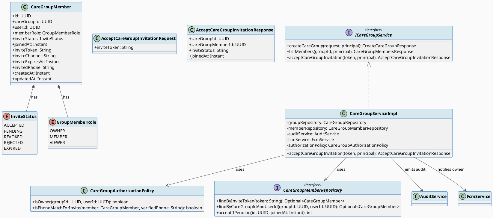
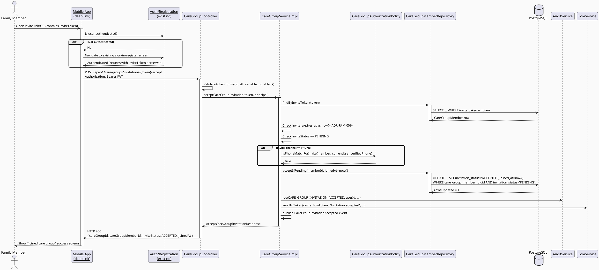
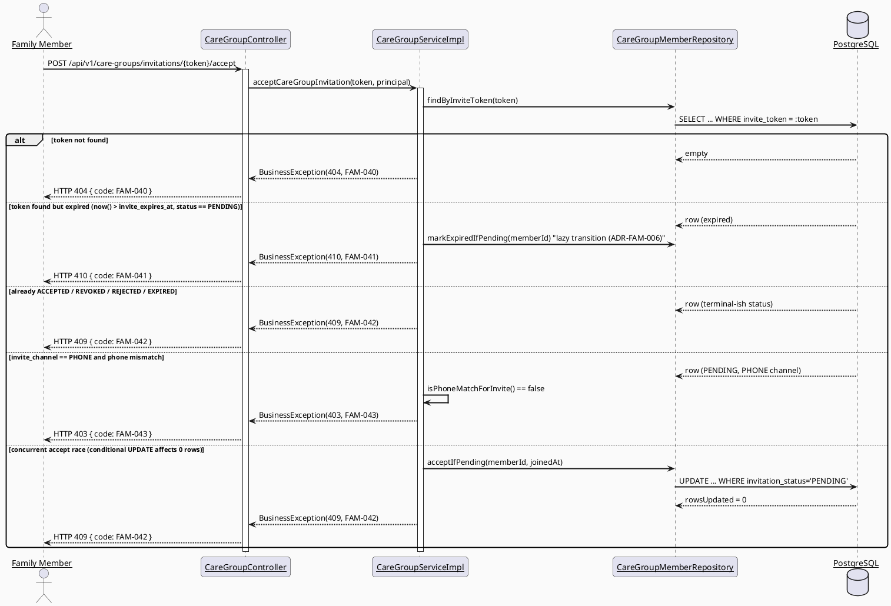
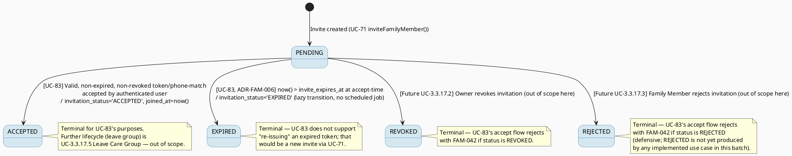

# ENGINEERING DOCUMENTATION STANDARD (EDS) v2.0
# Technical Design Specification — UC-83 Accept Care Group Invitation

| Field | Value |
|-------|-------|
| **Document ID** | `CB-FAM-IMP-006` |
| **Version** | `1.0` |
| **Date** | `2026-07-02` |
| **Status** | `Draft` |
| **Document Owner** | `TV2-Bách` |
| **Author** | `AI Agent` |
| **Reviewed by** | `[Tech Lead]` |
| **DPO Sign-off** | `[ ] Pending` |
| **Approved by** | `[Principal Architect]` |
| **Last Review** | `2026-07-02` |
| **Based on EDS** | `v2.0` |

> **Note on numbering:** `CB-FAM-IMP-006` assumes UC-71 Invite Family Member (`CB-FAM-IMP-003`),
> UC-72 Manage Family Permission (`CB-FAM-IMP-004`), and UC-73 Assign Family Task
> (`CB-FAM-IMP-005`) occupy the intervening slots in this same batch (see shared batch context).
> If those documents are assigned different numbers when finalized, renumber this document to
> match and record the change in CHANGELOG — do not silently leave a gap or collision.

---

## CHANGELOG

> **Policy 4.4 — Immutable History:** Không bao giờ xóa thông tin cũ. Mọi thay đổi phải ghi vào bảng này.

| Ngày | Người thực hiện | Nội dung thay đổi |
|------|-----------------|-------------------|
| 2026-07-02 | AI Agent | Tạo tài liệu lần đầu cho UC-83 Accept Care Group Invitation (Draft) |

---

## MỤC LỤC

1. [Tổng quan Module](#1-tổng-quan-module)
2. [Ma trận Truy vết (Traceability Matrix)](#2-ma-trận-truy-vết-traceability-matrix)
3. [Architecture Decision Records (ADR)](#3-architecture-decision-records-adr)
4. [Non-Functional Requirements & SLA](#4-non-functional-requirements--sla)
5. [Static Modeling (Mô hình Tĩnh)](#5-static-modeling-mô-hình-tĩnh)
6. [Dynamic Modeling (Mô hình Động)](#6-dynamic-modeling-mô-hình-động)
7. [Domain Event Catalog](#7-domain-event-catalog)
8. [Interface Specification (Đặc tả Giao diện)](#8-interface-specification-đặc-tả-giao-diện)
9. [API Specification](#9-api-specification)
10. [Bảng mã lỗi (Error Codes)](#10-bảng-mã-lỗi-error-codes)
11. [Quy trình Triển khai (Step-by-Step)](#11-quy-trình-triển-khai-step-by-step)
12. [Rollback & Incident Runbook](#12-rollback--incident-runbook)
13. [Kịch bản Kiểm thử Chi tiết](#13-kịch-bản-kiểm-thử-chi-tiết)
14. [Phương pháp Xác minh](#14-phương-pháp-xác-minh)
15. [Mẫu thử thực tế (API Verification Samples)](#15-mẫu-thử-thực-tế-api-verification-samples)
16. [Bảng tổng hợp phân quyền (Authorization Matrix)](#16-bảng-tổng-hợp-phân-quyền-authorization-matrix)
17. [AI Prompt Constraints (CASE 2.0)](#17-ai-prompt-constraints-case-20)

---

## 1. Tổng quan Module

| Field | Value |
|-------|-------|
| **Module Name** | `AcceptCareGroupInvitation` |
| **Bounded Context** | `family` |
| **UC ID** | `UC-83` |
| **SRS Reference** | `3.3.3.1` (lines 3233-3252) |
| **Primary Actor** | `Family Member` |
| **Secondary Actors** | `Firebase Cloud Messaging` |
| **Priority** | `Medium` |
| **Platform** | `Mobile App` |
| **Source group** | `Mobile App - Family Sync` |
| **Owner** | `TV2-Bách`, Sprint 3 "Cross-Domain Integration" |
| **Data Classification** | `PII` (family membership + phone number linkage) |
| **Compliance Scope** | `BR-RBAC, BR-PRIVACY, PDPA` |
| **Upstream Dependencies** | `UC-71 Invite Family Member (invite_token/invite_channel/invite_expires_at/invited_phone columns + InviteStatus enum extension)`, `auth/registration module`, `care_groups` table, `care_group_members` table |
| **Downstream Consumers** | `UC-3.3.17.1 View Care Group Members (already implemented, UC-216)`, `UC-3.3.3.2 View Shared Data (future)`, notification/audit listeners |

**Mô tả:** Cho phép một Family Member đăng nhập hoặc đăng ký tài khoản, sau đó chấp nhận lời mời tham gia care group thông qua một invite token (link/QR) hoặc một lời mời theo số điện thoại (phone-based invite). Sau khi chấp nhận, `care_group_members.invitation_status` chuyển từ `PENDING` sang `ACCEPTED`, `joined_at` được set, chủ sở hữu (Mother/inviter) được thông báo qua FCM, và sự kiện `CareGroupInvitationAccepted` được phát ra.

**SRS Business Rules (verbatim, verified against lines 3233-3252):** BR-RBAC, BR-PRIVACY.
> Xác nhận: Hàng SRS của UC-83 **không** liệt kê BR-CONSULTATION (khác với UC-71/72/73 trong
> cùng batch). Đây là khác biệt hợp lệ trong SRS gốc — TDS này **không** thêm BR-CONSULTATION
> một cách nhân tạo để khớp với các UC anh em.

---

## 2. Ma trận Truy vết (Traceability Matrix)

| Requirement ID | Loại (BR/ADR/US) | Mô tả yêu cầu | Thành phần Code | Compliance Target | ADR liên quan |
|----------------|------------------|---------------|-----------------|-------------------|---------------|
| UC-83 | Use Case | Chấp nhận lời mời care group | `CareGroupController.acceptInvitation()` | BR-RBAC | ADR-FAM-006 |
| BR-RBAC | Business Rule | Chỉ authenticated user mới gọi được endpoint | `SecurityUtils.requireCurrentUserId()` | BR-RBAC | ADR-FAM-006 |
| BR-PRIVACY | Business Rule | Phone-based invite chỉ chấp nhận được bởi đúng chủ số điện thoại đã verify | `CareGroupAuthorizationPolicy` (or service layer phone-match check) | PDPA / minimum-necessary access | ADR-FAM-007 |
| ADR-FAM-006 | Decision | Lazy expiry tại thời điểm accept (không có background job) | `CareGroupServiceImpl.acceptInvitation()` | Data Integrity | — |
| ADR-FAM-007 | Decision | Token-based invites không ràng buộc danh tính; phone-based invites có ràng buộc | `CareGroupServiceImpl.acceptInvitation()` | BR-PRIVACY | — |
| ADR-FAM-008 | Decision | Concurrency: conditional UPDATE ... WHERE invitation_status = 'PENDING' | `CareGroupMemberRepository` | Data Integrity | — |
| POST-2 (SRS) | Postcondition | Owner nhận FCM notification khi invite được accept | `FcmService.sendToToken()` | — | — |
| POST-3 (SRS) | Postcondition | Sensitive action ghi audit log | `AuditService.log(CARE_GROUP_INVITATION_ACCEPTED, ...)` | Audit/Privacy review | — |

---

## 3. Architecture Decision Records (ADR)

### ADR-FAM-006 — Lazy expiry của invite token tại thời điểm Accept

| Field | Value |
|-------|-------|
| **Status** | `Proposed` |
| **Deciders** | `AI Agent (proposed)` — cần Tech Lead confirm |
| **Date** | `2026-07-02` |
| **Supersedes** | — |

#### Bối cảnh (Context)
UC-71 thêm cột `invite_expires_at` cho `care_group_members`. Hệ thống hiện KHÔNG có scheduled
job nào chủ động quét và chuyển các invite hết hạn sang trạng thái `EXPIRED`. UC-83 là nơi
duy nhất đọc `invite_expires_at` tại thời điểm accept, nên cần quyết định: có transition
trạng thái ngay lúc phát hiện hết hạn (lazy) hay chờ một background job riêng?

#### Các phương án đã xem xét (Options Considered)

| Phương án | Mô tả | Ưu điểm | Nhược điểm |
|-----------|-------|----------|------------|
| A | Lazy expiry: khi accept phát hiện `now() > invite_expires_at` và status vẫn `PENDING`, service tự transition sang `EXPIRED` rồi trả lỗi `FAM-041` | Không cần thêm hạ tầng scheduler; đơn giản, đúng phạm vi UC-83 | Token đã hết hạn nhưng chưa từng được ai mở link sẽ mãi ở `PENDING` cho tới lần accept-attempt kế tiếp (chỉ là vấn đề hiển thị nội bộ, không ảnh hưởng bảo mật vì token vẫn bị từ chối) |
| B | Scheduled job (ví dụ Spring `@Scheduled`) quét định kỳ và chuyển `PENDING` quá hạn sang `EXPIRED` | Trạng thái DB luôn phản ánh đúng thời gian thực | Thêm thành phần hạ tầng mới, ngoài phạm vi UC-83/UC-71, cần thêm thiết kế (tần suất, khóa, giám sát) |

#### Quyết định (Decision)
Chọn **Phương án A** (lazy expiry tại thời điểm accept) vì nằm gọn trong phạm vi UC-83, không
đòi hỏi hạ tầng mới, và về mặt bảo mật/kết quả nghiệp vụ là tương đương phương án B (token hết
hạn luôn bị từ chối, bất kể được transition DB ngay hay chỉ tại thời điểm truy vấn).

#### Hệ quả (Consequences)

**Tích cực:**
- Không cần thêm thành phần hạ tầng (scheduler) ngoài phạm vi 2 TDS này.
- Logic đơn giản, dễ test (so sánh `now()` với `invite_expires_at` ngay trong service).

**Tiêu cực / Trade-offs:**
- Các invite hết hạn nhưng chưa ai từng thử accept sẽ hiển thị `PENDING` trong các báo cáo/
  admin view cho tới khi có người thử accept hoặc tới khi một job riêng (nếu được xây dựng sau
  này) dọn dẹp. Giảm thiểu: đây chỉ là vấn đề "độ tươi" của dữ liệu hiển thị, không phải lỗ
  hổng bảo mật.

**Compliance Impact:**
- Không ảnh hưởng PDPA/GDPR trực tiếp — không có dữ liệu nào bị giữ lại sai quy định.

> **Open — cần Tech Lead xác nhận:** Nếu nghiệp vụ cần báo cáo chính xác số lượng invite đang
> `PENDING` theo thời gian thực (ví dụ dashboard cho Mother), có thể cần một scheduled job bổ
> sung (Phương án B) như một ADR follow-up riêng — KHÔNG thuộc phạm vi UC-83 này.

---

### ADR-FAM-007 — Ràng buộc danh tính giữa Token-based và Phone-based invite

| Field | Value |
|-------|-------|
| **Status** | `Proposed` |
| **Deciders** | `AI Agent (proposed)` — cần Security/Tech Lead confirm |
| **Date** | `2026-07-02` |

#### Bối cảnh (Context)
UC-71 hỗ trợ 3 kênh mời: `LINK`, `QR`, `PHONE` (cột `invite_channel`). Câu hỏi mở: một invite
token gửi qua link/QR có ràng buộc với một danh tính cụ thể không? Và với invite theo số điện
thoại, làm sao xác nhận người accept đúng là chủ số điện thoại đó?

#### Các phương án đã xem xét (Options Considered)

| Phương án | Mô tả | Ưu điểm | Nhược điểm |
|-----------|-------|----------|------------|
| A | LINK/QR: bất kỳ authenticated user nào trình token hợp lệ, chưa hết hạn, chưa bị revoke/accept đều được accept. PHONE: bắt buộc `invited_phone` khớp với số điện thoại đã verify của user đang đăng nhập (tái sử dụng OTP/registration trust có sẵn), không xác thực lại | Khớp UX "invite link" thông thường; tái sử dụng cơ chế xác thực OTP đã có, không phát sinh scope OTP mới | LINK/QR có thể bị người khác (ngoài ý định của Mother) accept nếu link bị lộ — chấp nhận rủi ro này như hành vi chuẩn của link-based invite (tương tự Google Docs share-link) |
| B | Mọi loại invite đều ràng buộc danh tính (yêu cầu OTP xác thực số điện thoại tại thời điểm accept, kể cả LINK/QR) | An toàn hơn | Ngoài phạm vi UC-83 (yêu cầu OTP mới); phá vỡ trigger SRS "Lets a family member sign in or register and accept" vốn không đề cập xác thực bổ sung |

#### Quyết định (Decision)
Chọn **Phương án A**. Token-based (LINK/QR) invites không ràng buộc danh tính. Phone-based
invites ràng buộc: user đã authenticated phải có số điện thoại verified khớp `invited_phone`;
nếu không khớp, từ chối với `FAM-043`.

#### Hệ quả (Consequences)

**Tích cực:** Đơn giản, tận dụng cơ chế xác thực có sẵn, không tăng phạm vi.

**Tiêu cực / Trade-offs:** Rủi ro link bị chia sẻ ngoài ý muốn — giảm thiểu bằng cách token có
`invite_expires_at` (TTL) và single-use (xem ADR-FAM-008).

**Compliance Impact:** BR-PRIVACY — invite theo phone không tiết lộ thêm PII ngoài việc match
số điện thoại đã có sẵn trong tài khoản.

> **Open — cần Security/Tech Lead xác nhận trước khi Approved.**

---

### ADR-FAM-008 — Concurrency: Single-use Accept qua Conditional Update

| Field | Value |
|-------|-------|
| **Status** | `Proposed` |
| **Deciders** | `AI Agent (proposed)` — cần Tech Lead confirm cơ chế cụ thể |
| **Date** | `2026-07-02` |

#### Bối cảnh (Context)
Race condition: hai request accept cùng một `invite_token` gần như đồng thời (ví dụ 2 tab, 2
thiết bị, hoặc replay). `CareGroupMember` hiện không có cột `@Version` (optimistic locking).

#### Các phương án đã xem xét (Options Considered)

| Phương án | Mô tả | Ưu điểm | Nhược điểm |
|-----------|-------|----------|------------|
| A | Conditional `UPDATE care_group_members SET invitation_status='ACCEPTED', joined_at=now() WHERE care_group_member_id=:id AND invitation_status='PENDING'` (qua `@Modifying @Query`), kiểm tra số dòng bị ảnh hưởng == 1; nếu 0 dòng → coi như đã bị accept/revoke bởi request khác → `FAM-042` | Không cần thêm cột schema; đơn giản, đủ để đảm bảo single-winner | Không phát hiện được các race hiếm hơn ngoài phạm vi UPDATE (ví dụ đọc-rồi-ghi ở tầng service nếu viết sai) — yêu cầu implement đúng bằng 1 câu SQL nguyên tử |
| B | Thêm cột `@Version` (optimistic locking JPA chuẩn) | Idiomatic JPA, phát hiện mọi write-write conflict tự động | Thêm 1 cột migration mới ngoài phạm vi migration UC-71 đã định nghĩa — vi phạm "smallest scoped change" |

#### Quyết định (Decision)
Chọn **Phương án A** (conditional update) làm mặc định vì entity hiện tại không có `@Version`
và việc thêm cột là thay đổi schema bổ sung ngoài phạm vi UC-71's migration đã thống nhất. Nếu
reviewer muốn optimistic locking, đó là một ADR/migration follow-up riêng.

#### Hệ quả (Consequences)

**Tích cực:** Không cần migration bổ sung; đảm bảo đúng 1 accept thắng trong race.

**Tiêu cực / Trade-offs:** Cần review kỹ câu lệnh JPQL/native query để đảm bảo tính nguyên tử
(atomic) thực sự ở tầng DB, không phải "check-then-act" ở tầng application.

**Compliance Impact:** Không có.

> **Open — cần Tech Lead xác nhận cơ chế concurrency cụ thể (conditional SQL vs `@Version`).**

---

## 4. Non-Functional Requirements & SLA

### 4.1. Performance & Availability

| Category | Requirement | Target SLA | Measurement Method | Compliance Basis |
|----------|-------------|------------|---------------------|------------------|
| Latency | API response (p99) | `< 300ms` | k6 load test | — |
| Availability | Uptime (monthly) | `99.9%` | Uptime monitor | — |
| Throughput | Concurrent requests | `500 req/s` | Load test | — |

### 4.2. Data Integrity & Retention

| Category | Requirement | Target | Verification Method | Compliance Basis |
|----------|-------------|--------|---------------------|------------------|
| Durability | Zero record loss on accept transition | RPO = 0 | Transaction log | — |
| Retention | Audit log retention | 7 năm | DB backup policy | Internal policy |
| Consistency | invitation_status ↔ joined_at ↔ audit sync | 100% | Reconciliation job (future) | — |
| Single-use | Đúng 1 accept thắng trên mỗi token khi có race | 100% (see ADR-FAM-008) | Concurrency integration test | — |

### 4.3. Security

| Category | Requirement | Target | Verification Method | Compliance Basis |
|----------|-------------|--------|---------------------|------------------|
| Encryption at rest | `invite_token`, `invited_phone` | Standard DB-at-rest encryption (existing infra) | Infra baseline | — |
| Encryption in transit | All endpoints | TLS 1.3+ | SSL Labs scan | — |
| Access control | Authenticated-only, identity-matching (not role-based) | Least privilege | Auth Matrix (§16) | — |
| Token exposure | `invite_token` never logged in plaintext (only hashed/redacted) | 100% | Log grep verification | BR-PRIVACY |

### 4.4. Scalability & Capacity Planning

Dự kiến tải: thấp — accept-invitation là hành động một lần per invite, không phải endpoint có
tải cao. Không cần horizontal scale riêng biệt ngoài baseline hạ tầng hiện có.

---

## 5. Static Modeling (Mô hình Tĩnh)

### 5.1. Class Diagram (PlantUML)



### 5.2. Data Structure (Flyway SQL Migration)

> **No new migration required for UC-83.** This feature depends entirely on UC-71's migration
> `V20260702090000__add_care_group_invite_token.sql`, which adds `invite_token VARCHAR(64)`,
> `invite_channel VARCHAR(20)`, `invite_expires_at TIMESTAMPTZ`, `invited_phone VARCHAR(20)` to
> `care_group_members`, plus a unique index on `invite_token`. UC-83 only reads/validates these
> columns and updates `invitation_status` + `joined_at` (both already existing columns per
> `V1__init_schema.sql` lines 730-765 — verified ground truth, see shared batch context).
>
> `InviteStatus` Java enum extension (`REJECTED`, `EXPIRED`) is also owned/defined by UC-71's
> TDS as a code-only change (varchar(20) column, no DB CHECK constraint) — UC-83 consumes
> `EXPIRED` (transitions into it lazily, see ADR-FAM-006) and `PENDING`/`ACCEPTED`/`REVOKED`
> without redefining the enum.
>
> Entry criteria for this TDS's implementation: **UC-71 migration `V20260702090000` must be
> applied to the target environment before UC-83 code can be deployed.**

---

## 6. Dynamic Modeling (Mô hình Động)

### 6.1. Sequence Diagram — Happy Path (PlantUML)



### 6.2. Sequence Diagram — Error Path (PlantUML)



### 6.3. State Machine

> **Jointly owned across UC-71/UC-83.** UC-71 defines the initial `PENDING` creation and
> `REVOKED` transition (via future UC-3.3.17.2 Revoke Family Invitation). UC-83 defines only the
> `PENDING -> ACCEPTED` transition and the lazy `PENDING -> EXPIRED` transition. UC-83 does NOT
> implement `REJECTED` (reserved for future UC-3.3.17.3 Reject Care Group Invitation) — it is
> shown below only because the enum value must exist for the state machine to be complete, per
> UC-71's proposed enum extension. This diagram must not contradict UC-71's TDS state machine.



> **Invariant bất biến:**
> - `PENDING` là trạng thái khởi tạo duy nhất mà `acceptCareGroupInvitation()` chấp nhận xử lý
>   tiếp (mọi trạng thái khác dẫn tới `FAM-042` hoặc `FAM-041`).
> - Không bao giờ transition ngược từ `ACCEPTED`/`REVOKED`/`REJECTED`/`EXPIRED` về `PENDING`
>   trong phạm vi UC-83.
> - `joined_at` chỉ được set đúng một lần, tại thời điểm transition sang `ACCEPTED`.

---

## 7. Domain Event Catalog

### 7.1. Events Published (Phát ra)

| Event Name | Trigger | Publisher | Subscriber(s) | Payload Schema | Async? |
|------------|---------|-----------|---------------|----------------|--------|
| `CareGroupInvitationAccepted` | `acceptCareGroupInvitation()` succeeds (PENDING -> ACCEPTED) | `CareGroupServiceImpl` | Notification listener (FCM to owner), Audit listener | `CareGroupInvitationAccepted.java` | Yes |

### 7.2. Events Consumed (Tiêu thụ)

| Event Name | Source | Handler | Action thực hiện |
|------------|--------|---------|------------------|
| `CareGroupInvitationAccepted` | `CareGroupServiceImpl` (self-published, same transaction boundary for audit; async for FCM) | `(proposed) CareGroupNotificationListener` | Gửi FCM tới `ownerUserId`'s registered device token: "Your invitation to <name> was accepted" |

> Note: In the current codebase there is no pre-existing generic event bus/listener
> infrastructure evidenced in shared context beyond direct service calls. This TDS proposes
> `CareGroupServiceImpl` calls `FcmService.sendToToken()` directly (synchronously, in the same
> service method, mirroring the "Direct service call" style already used for `AuditService` in
> UC-70) rather than a separate async listener, UNLESS an existing `ApplicationEventPublisher`
> pattern is found elsewhere in the codebase — **Open**: if such infra is confirmed to exist,
> prefer publishing via `ApplicationEventPublisher` and a dedicated listener instead of a direct
> call, for consistency with the rest of the batch (UC71/72/73 make the same choice).

### 7.3. Payload Schema

```java
// CareGroupInvitationAccepted.java
public record CareGroupInvitationAccepted(
    UUID    eventId,          // UUID.randomUUID() — dùng để deduplicate
    String  eventType,        // "CareGroupInvitationAccepted"
    Instant occurredAt,       // Instant.now()
    String  version,          // "1.0"
    Payload payload,
    Metadata metadata
) {

    public record Payload(
        UUID careGroupId,
        UUID careGroupMemberId,
        UUID acceptedByUserId,
        Instant acceptedAt
    ) {}

    public record Metadata(
        UUID   correlationId,
        String causedBy       // acceptedByUserId as string
    ) {}
}
```

---

## 8. Interface Specification (Đặc tả Giao diện)

### 8.1. Service Interface

```java
// AcceptCareGroupInvitationRequest.java — Input DTO
// @version 1.0
public class AcceptCareGroupInvitationRequest {
    // inviteToken is taken from the path variable (see §9), not the body, so this DTO
    // is intentionally minimal / may be omitted in favor of a plain String parameter.
    // Kept here only if a request body is later needed (e.g. optional client metadata).
}

// AcceptCareGroupInvitationResponse.java — Output DTO
// @version 1.0
public class AcceptCareGroupInvitationResponse {
    private UUID careGroupId;
    private UUID careGroupMemberId;
    private String inviteStatus;   // "ACCEPTED"
    private Instant joinedAt;
    // getters / builder (@Data @Builder, matching existing DTO style)
}

// ICareGroupService.java — Service Contract (EXTEND existing interface, do not create new)
// @version 1.1
// @breaking-change None — additive method only.
public interface ICareGroupService {
    // ... existing methods: createCareGroup(...), listMembers(...)

    /**
     * Accepts a pending care group invitation identified by inviteToken on behalf of the
     * currently authenticated user.
     * @throws BusinessException (FAM-040) khi token không tồn tại
     * @throws BusinessException (FAM-041) khi token đã hết hạn (lazy-transitions to EXPIRED)
     * @throws BusinessException (FAM-042) khi invite đã ACCEPTED/REVOKED/REJECTED/EXPIRED, hoặc
     *         thua trong race condition (conditional update affected 0 rows)
     * @throws BusinessException (FAM-043) khi invite_channel=PHONE và invited_phone không khớp
     *         với số điện thoại đã verify của user đang đăng nhập
     */
    AcceptCareGroupInvitationResponse acceptCareGroupInvitation(String inviteToken, Principal principal);
}
```

### 8.2. Repository Interface

```java
// CareGroupMemberRepository.java — EXTEND existing interface, do not create new
// @version 1.1
public interface CareGroupMemberRepository extends JpaRepository<CareGroupMember, UUID> {

    // ... existing methods: existsByCareGroupIdAndUserIdAndInviteStatus(...),
    //     findByCareGroupIdAndInviteStatusIn(...), countByCareGroupId(...)

    Optional<CareGroupMember> findByInviteToken(String inviteToken);

    Optional<CareGroupMember> findByCareGroupIdAndUserId(UUID careGroupId, UUID userId);

    /**
     * Conditional single-use accept (ADR-FAM-008). Returns number of rows updated;
     * caller MUST treat 0 as a conflict (FAM-042), never as a silent no-op.
     */
    @Modifying
    @Query("UPDATE CareGroupMember m SET m.inviteStatus = 'ACCEPTED', m.joinedAt = :joinedAt, " +
           "m.updatedAt = :joinedAt WHERE m.id = :id AND m.inviteStatus = 'PENDING'")
    int acceptIfPending(@Param("id") UUID id, @Param("joinedAt") Instant joinedAt);

    /**
     * Lazy expiry transition (ADR-FAM-006). Returns number of rows updated (0 or 1).
     */
    @Modifying
    @Query("UPDATE CareGroupMember m SET m.inviteStatus = 'EXPIRED', m.updatedAt = :now " +
           "WHERE m.id = :id AND m.inviteStatus = 'PENDING' AND m.inviteExpiresAt < :now")
    int markExpiredIfPending(@Param("id") UUID id, @Param("now") Instant now);

    // Không có delete() — Append-only, không xoá lịch sử lời mời.
}
```

---

## 9. API Specification

### 9.1. Endpoints Table

| Method | Path | Auth Level | Required Roles | Rate Limit | Idempotent? |
|--------|------|------------|----------------|------------|-------------|
| `POST` | `/api/v1/care-groups/invitations/{token}/accept` | JWT Bearer | `isAuthenticated()` (no specific role — identity-matching only, see §16) | 30/min | Yes (retrying the same call after a successful accept returns `FAM-042` idempotently, not a duplicate accept) |

> **Path justification:** Reuses the existing base path `/api/v1/care-groups` per shared batch
> convention (extend `CareGroupController`, do not create a parallel controller). The invite
> token is scoped under `/invitations/{token}/accept` (rather than `/{groupId}/accept`) because
> the accepting client does not know `careGroupId` in advance — only the opaque `inviteToken`
> from the link/QR/phone-invite notification. The service resolves `careGroupId` internally via
> `findByInviteToken`.

### 9.2. Request / Response Schemas

#### `POST /api/v1/care-groups/invitations/{token}/accept` — Accept invitation

**Path Parameter:** `token` — the `invite_token` value (VARCHAR(64) per UC-71 migration).

**Request Body:** None (token is the only required input; identity comes from JWT principal).

**Response — 200 OK (Happy Path):**
```json
{
  "success": true,
  "data": {
    "careGroupId": "550e8400-e29b-41d4-a716-446655440000",
    "careGroupMemberId": "660e8400-e29b-41d4-a716-446655440111",
    "inviteStatus": "ACCEPTED",
    "joinedAt": "2026-07-02T08:15:00.000Z"
  }
}
```

**Response — 404 Not Found (token invalid/not found):**
```json
{
  "success": false,
  "error": {
    "code": "FAM-040",
    "message": "Invite token is invalid or does not exist."
  }
}
```

**Response — 410 Gone (token expired):**
```json
{
  "success": false,
  "error": {
    "code": "FAM-041",
    "message": "This invitation has expired."
  }
}
```

**Response — 409 Conflict (already accepted/revoked/rejected/expired, or lost concurrency race):**
```json
{
  "success": false,
  "error": {
    "code": "FAM-042",
    "message": "This invitation is no longer pending and cannot be accepted."
  }
}
```

**Response — 403 Forbidden (phone mismatch for PHONE-channel invite):**
```json
{
  "success": false,
  "error": {
    "code": "FAM-043",
    "message": "Your verified phone number does not match this invitation."
  }
}
```

---

## 10. Bảng mã lỗi (Error Codes)

> Prefix `FAM-` reused per shared batch convention. Range `FAM-040`–`FAM-043` reserved
> exclusively for UC-83 (see shared batch context error-code table) — do not reuse for other
> features in this batch.

| Code | HTTP Status | Message (EN) | Message (VI) | Trigger Condition |
|------|-------------|--------------|--------------|-------------------|
| `FAM-040` | 404 | Invite token is invalid or does not exist | Mã lời mời không hợp lệ hoặc không tồn tại | `findByInviteToken(token)` returns empty |
| `FAM-041` | 410 | This invitation has expired | Lời mời đã hết hạn | `invite_expires_at < now()` and status was `PENDING` (lazy-transitioned to `EXPIRED` per ADR-FAM-006) |
| `FAM-042` | 409 | This invitation is no longer pending and cannot be accepted | Lời mời không còn ở trạng thái chờ và không thể chấp nhận | Status already `ACCEPTED`/`REVOKED`/`REJECTED`/`EXPIRED`, OR conditional `acceptIfPending` affected 0 rows (concurrent race, ADR-FAM-008) |
| `FAM-043` | 403 | Your verified phone number does not match this invitation | Số điện thoại đã xác minh của bạn không khớp với lời mời này | `invite_channel == PHONE` and authenticated user's verified phone != `invited_phone` (ADR-FAM-007, Open) |

---

## 11. Quy trình Triển khai (Step-by-Step)

### 11.1. Prerequisites

- [ ] ADR-FAM-006, ADR-FAM-007, ADR-FAM-008 reviewed (currently `Proposed`, all 3 marked `Open`
      pending Tech Lead/Security confirmation — see §3)
- [ ] DPO sign-off pending (module handles PII: phone-number matching)
- [ ] UC-71's migration `V20260702090000__add_care_group_invite_token.sql` approved and applied
      to staging (hard prerequisite — this TDS defines no migration of its own)
- [ ] `InviteStatus` enum extended with `REJECTED`, `EXPIRED` (UC-71 code change, code-review
      dependency, not just schema)

### 11.2. Pre-Migration Checklist

> **Not applicable — no new migration in this TDS.** UC-83 depends entirely on UC-71's
> migration `V20260702090000__add_care_group_invite_token.sql`; see that TDS's own
> pre-migration checklist. UC-83's implementation steps below assume that migration is already
> applied.

### 11.3. Implementation Steps

#### Chặng 1 — Extend `InviteStatus` consumption (no migration, depends on UC-71 code)

Verify `com.carebridge.backend.family.entity.InviteStatus` already contains `EXPIRED` (added by
UC-71). Do not redefine the enum in this feature's code; if UC-71 has not landed yet, this
feature is BLOCKED (see Entry Criteria in Test-Spec).

#### Chặng 2 — Repository methods

```java
// Add to CareGroupMemberRepository (existing interface, family/repository package)
Optional<CareGroupMember> findByInviteToken(String inviteToken);
Optional<CareGroupMember> findByCareGroupIdAndUserId(UUID careGroupId, UUID userId);

@Modifying
@Query("UPDATE CareGroupMember m SET m.inviteStatus = 'ACCEPTED', m.joinedAt = :joinedAt, " +
       "m.updatedAt = :joinedAt WHERE m.id = :id AND m.inviteStatus = 'PENDING'")
int acceptIfPending(@Param("id") UUID id, @Param("joinedAt") Instant joinedAt);

@Modifying
@Query("UPDATE CareGroupMember m SET m.inviteStatus = 'EXPIRED', m.updatedAt = :now " +
       "WHERE m.id = :id AND m.inviteStatus = 'PENDING' AND m.inviteExpiresAt < :now")
int markExpiredIfPending(@Param("id") UUID id, @Param("now") Instant now);
```

#### Chặng 3 — Service method (`CareGroupServiceImpl`)

```java
// Extend CareGroupServiceImpl (existing class, family/service/impl package)
@Override
@Transactional
public AcceptCareGroupInvitationResponse acceptCareGroupInvitation(String inviteToken, Principal principal) {
    UUID currentUserId = SecurityUtils.requireCurrentUserId(principal);
    CareGroupMember member = memberRepository.findByInviteToken(inviteToken)
        .orElseThrow(() -> new BusinessException(HttpStatus.NOT_FOUND, "FAM-040", "Invite token is invalid or does not exist."));

    Instant now = Instant.now();
    if (member.getInviteStatus() == InviteStatus.PENDING
            && member.getInviteExpiresAt() != null
            && member.getInviteExpiresAt().isBefore(now)) {
        memberRepository.markExpiredIfPending(member.getId(), now);
        throw new BusinessException(HttpStatus.GONE, "FAM-041", "This invitation has expired.");
    }
    if (member.getInviteStatus() != InviteStatus.PENDING) {
        throw new BusinessException(HttpStatus.CONFLICT, "FAM-042", "This invitation is no longer pending and cannot be accepted.");
    }
    if ("PHONE".equals(member.getInviteChannel())) {
        boolean phoneMatches = authorizationPolicy.isPhoneMatchForInvite(member, currentUserId);
        if (!phoneMatches) {
            throw new BusinessException(HttpStatus.FORBIDDEN, "FAM-043", "Your verified phone number does not match this invitation.");
        }
    }

    int rows = memberRepository.acceptIfPending(member.getId(), now);
    if (rows == 0) {
        throw new BusinessException(HttpStatus.CONFLICT, "FAM-042", "This invitation is no longer pending and cannot be accepted.");
    }

    auditService.log(AuditAction.CARE_GROUP_INVITATION_ACCEPTED, currentUserId, "CareGroupMember", member.getId().toString(), "Invitation accepted");
    // notify owner via FCM (best-effort, does not fail the transaction on FCM error)
    // publish CareGroupInvitationAccepted event

    return AcceptCareGroupInvitationResponse.builder()
        .careGroupId(member.getCareGroupId())
        .careGroupMemberId(member.getId())
        .inviteStatus(InviteStatus.ACCEPTED.name())
        .joinedAt(now)
        .build();
}
```

#### Chặng 4 — Controller endpoint

```java
// Extend CareGroupController (existing class)
@PostMapping("/invitations/{token}/accept")
@PreAuthorize("isAuthenticated()")
public ResponseEntity<ApiResponse<AcceptCareGroupInvitationResponse>> acceptInvitation(
        @PathVariable("token") String token, Principal principal) {
    AcceptCareGroupInvitationResponse response = careGroupService.acceptCareGroupInvitation(token, principal);
    return ResponseEntity.ok(ApiResponse.success(response));
}
```

#### Chặng 5 — Mobile: Accept invitation screen + service method

- New screen: `lib/features/familySync/screens/accept_care_group_invitation_screen.dart` — deep
  link / QR-scan landing screen. Receives `inviteToken` as a route argument (via Flutter deep
  link route, e.g. `carebridge://invite/accept?token=<token>` — **Open**: exact deep-link scheme
  registration/route name not verified in this TDS; propose `AcceptCareGroupInvitationScreen`
  route name `/family/invitations/accept` with `token` as a query/extra argument, pending
  confirmation from whoever owns the app's `go_router`/route table).
  - On load: check auth state (existing auth session check, e.g. via existing
    `AuthProvider`/`AuthService` — **Open**, exact class name not verified in this TDS). If not
    authenticated, navigate to the existing sign-in/register screen (**Open**: exact existing
    route name, e.g. `/login` or `/register` — not verified in this TDS, propose passing
    `redirectAfterAuth: '/family/invitations/accept?token=<token>'` so the flow returns here).
    If authenticated, call `CareGroupService.acceptInvitation(token)` directly.
- New service method: `CareGroupService.acceptInvitation(String token)` in
  `care_group_service.dart`, calling `POST /api/v1/care-groups/invitations/{token}/accept` via
  the existing `apiPost` helper, returning a typed result (success -> navigate to care group
  detail screen `care_group_detail_screen.dart`; error -> show localized message per FAM-04x
  code).

### 11.4. Deployment Checklist

- [ ] UC-71 migration confirmed applied in target environment (hard prerequisite)
- [ ] New endpoint returns 200 on happy path smoke test
- [ ] Health check endpoint still returns 200 (no regression to existing `CareGroupController`
      endpoints)
- [ ] Error rate < 1% in first 10 minutes
- [ ] Audit log emits `CARE_GROUP_INVITATION_ACCEPTED` events in expected format
- [ ] FCM notification delivery verified in staging (manual test with a registered device token)

---

## 12. Rollback & Incident Runbook

### 12.1. Điều kiện kích hoạt Rollback (Trigger Conditions)

| Điều kiện | Ngưỡng | Người quyết định |
|-----------|--------|------------------|
| Error rate tăng đột biến trên endpoint accept | > 5% trong 5 phút | On-call Engineer |
| Latency p99 vượt ngưỡng | > 2x baseline (600ms) | On-call Engineer |
| Double-accept xảy ra (2 users cùng ACCEPTED cho 1 token) | Bất kỳ case nào | Tech Lead |
| FCM notification ngừng gửi | > 1 phút | On-call Engineer |

### 12.2. Rollback Procedure

```bash
# No schema to revert here (no migration owned by UC-83).
# Step 1: Revert application code (controller/service/repository additions)
git checkout -- src/main/java/com/carebridge/backend/family/controller/CareGroupController.java
git checkout -- src/main/java/com/carebridge/backend/family/service/
git checkout -- src/main/java/com/carebridge/backend/family/repository/CareGroupMemberRepository.java

# Step 2: Re-deploy previous version
kubectl rollout undo deployment/carebridge-api

# Step 3: Verify rollback
kubectl rollout status deployment/carebridge-api
curl -X GET https://[host]/api/v1/health

# Step 4: If UC-71's migration also needs rollback, follow UC-71's own runbook —
# do NOT drop invite_token/invite_channel/invite_expires_at/invited_phone columns from
# this TDS since UC-83 does not own that migration.
```

### 12.3. Notification Protocol

| Thời điểm | Người nhận | Kênh | Template |
|-----------|------------|------|----------|
| Ngay khi phát hiện | On-call team | Slack `#incident` | "🚨 UC-83 Accept Invitation incident detected: [mô tả]" |
| Trong 30 phút | DPO | Email | Bắt buộc nếu phone-matching PII logic bị lỗi/leak |

### 12.4. Post-Incident Review (PIR)

Bắt buộc hoàn thành PIR document trong vòng 48 giờ sau khi incident được resolve, theo template
chuẩn EDS §12.4 (Timeline / Root Cause / Impact / Remediation / Prevention).

---

## 13. Kịch bản Kiểm thử Chi tiết

> Chi tiết đầy đủ nằm trong `UC83_AcceptCareGroupInvitation_Test-Spec.md` (companion document,
> theo TDD Template). Tóm tắt các nhóm kịch bản chính:

### 13.1. Unit Tests

Covers: token not found, token expired (lazy transition), already accepted/revoked/rejected,
phone-channel mismatch, phone-channel match, LINK/QR channel accept (no identity binding),
successful accept updates `joined_at`, audit log call, FCM call (best-effort — does not fail
transaction).

### 13.2. Integration Tests

Covers: full HTTP flow with Testcontainers PostgreSQL — seed a `PENDING` member row with
`invite_token`, call the endpoint as an authenticated user, assert DB row transitions to
`ACCEPTED` with `joined_at` set, assert audit log row created.

### 13.3. E2E / Security Tests

Covers: unauthenticated request -> 401; concurrent double-accept race (two threads call
`acceptIfPending` for the same row) -> exactly one succeeds, the other gets `FAM-042`; token
guessing/enumeration attempt (random 64-char string) -> `FAM-040`, no information leak about
whether a similar token exists.

---

## 14. Phương pháp Xác minh

### 14.1. Database Inspection

```sql
-- Verify accept transition persisted correctly
SELECT care_group_member_id, invitation_status, joined_at, invite_token
FROM care_group_members
WHERE care_group_member_id = '[uuid]';
-- Expected: invitation_status = 'ACCEPTED', joined_at IS NOT NULL

-- Verify no PII leak of invite_token in plaintext application logs
-- (grep application log output, not a SQL query)
```

### 14.2. Log / Audit Verification

```bash
# Kiểm tra audit log format
kubectl logs -l app=carebridge-api | grep '"eventType":"CareGroupInvitationAccepted"' | head -5

# Kiểm tra invite_token không xuất hiện plaintext trong log (chỉ hash/redacted nếu log)
kubectl logs -l app=carebridge-api | grep -i "invite_token=" 
# Expected: No plaintext token values in output (only redacted/hashed representations, if any)
```

### 14.3. Tool-based Verification

```bash
# Verify JWT claims used for identity match
echo "[JWT_TOKEN]" | cut -d'.' -f2 | base64 -d | jq .

# Verify TLS version on the endpoint
openssl s_client -connect [host]:443 -tls1_3 2>&1 | grep "Protocol"
```

---

## 15. Mẫu thử thực tế (API Verification Samples)

### 15.1. Happy Path

```bash
curl -X POST https://[host]/api/v1/care-groups/invitations/abc123def456/accept \
  -H "Authorization: Bearer [JWT_TOKEN]" \
  -H "X-Correlation-Id: $(uuidgen)"
```

**Expected Response (200):**
```json
{
  "success": true,
  "data": {
    "careGroupId": "550e8400-e29b-41d4-a716-446655440000",
    "careGroupMemberId": "660e8400-e29b-41d4-a716-446655440111",
    "inviteStatus": "ACCEPTED",
    "joinedAt": "2026-07-02T08:15:00.000Z"
  }
}
```

### 15.2. Error Paths

```bash
# Token not found -> 404
curl -X POST https://[host]/api/v1/care-groups/invitations/nonexistent-token/accept \
  -H "Authorization: Bearer [JWT_TOKEN]"
```

**Expected Response (404):**
```json
{ "success": false, "error": { "code": "FAM-040", "message": "Invite token is invalid or does not exist." } }
```

```bash
# No JWT -> 401
curl -X POST https://[host]/api/v1/care-groups/invitations/abc123def456/accept
```

**Expected Response (401):**
```json
{ "success": false, "error": { "code": "IAM-001", "message": "Authentication required" } }
```

---

## 16. Bảng tổng hợp phân quyền (Authorization Matrix)

> **Lưu ý quan trọng:** Endpoint này KHÔNG dùng role-based authorization theo nghĩa thông
> thường. Bất kỳ authenticated user nào (không phân biệt role: MOTHER, FAMILY, v.v.) đều có thể
> gọi endpoint — check thực sự là **identity-matching** (does this user's context satisfy the
> invite's channel-specific rule?), không phải role check. Với LINK/QR channel, KHÔNG có ràng
> buộc danh tính nào cả (ADR-FAM-007, Open) — bất kỳ ai trình token hợp lệ cũng được accept, kể
> cả nếu họ không phải người mà Mother "định" mời (chấp nhận rủi ro này như hành vi chuẩn của
> link-based invite). Với PHONE channel, ràng buộc là so khớp verified phone, không phải role.

| Endpoint | `GUEST` | Any authenticated user (LINK/QR invite) | Any authenticated user (PHONE invite, phone matches) | Any authenticated user (PHONE invite, phone mismatch) |
|----------|---------|-------------------------------------------|---------------------------------------------------------|------------------------------------------------------------|
| `POST /api/v1/care-groups/invitations/{token}/accept` | ❌ 401 | ✅ Accept allowed | ✅ Accept allowed | ❌ 403 `FAM-043` |

**Chú thích:**
- ✅ = Được phép accept (subject to token status checks: PENDING, not expired — see §10)
- ❌ = Bị từ chối
- Không có cột riêng cho role (MOTHER/FAMILY/EXPERT/...) vì role không phải là điều kiện quyết
  định ở endpoint này — chỉ cần `isAuthenticated()` (Spring Security) cộng với identity-matching
  logic ở tầng service (§11.3 Chặng 3).

---

## 17. AI Prompt Constraints (CASE 2.0)

### 17.1 Constraint Summary Table

| # | Constraint | Source (ADR/BR) | Last Verified |
|---|-----------|-----------------|---------------|
| C1 | Extend `CareGroupController`/`ICareGroupService`/`CareGroupServiceImpl`/`CareGroupMemberRepository` — KHÔNG tạo class song song | Shared batch context | `2026-07-02` |
| C2 | KHÔNG tạo migration mới — chỉ đọc `invite_token`/`invite_channel`/`invite_expires_at`/`invited_phone` từ migration `V20260702090000` của UC-71 | §5.2 | `2026-07-02` |
| C3 | Dùng `acceptIfPending()` conditional UPDATE (ADR-FAM-008) để đảm bảo single-use accept, KHÔNG dùng check-then-act ở tầng service | ADR-FAM-008 | `2026-07-02` |
| C4 | Identity lấy từ `SecurityUtils.requireCurrentUserId(principal)` — KHÔNG tự parse JWT trong controller/service | Existing code pattern | `2026-07-02` |
| C5 | Controller: validation/mapping only. Service: workflow + phone-match check (via `CareGroupAuthorizationPolicy` hoặc inline) + transaction + audit + FCM call. Repository: persistence only | CLAUDE.md package-by-layer rule | `2026-07-02` |
| C6 | KHÔNG implement "reject invitation" — chỉ "accept" (out of scope, UC-3.3.17.3) | §Out of Scope | `2026-07-02` |
| C7 | Error codes CHỈ dùng `FAM-040`..`FAM-043` cho feature này — không tái sử dụng mã của UC71/72/73 | §10 | `2026-07-02` |

### 17.2 Constraint Injection Block (Copy-Paste vào AI Prompt)

```
[CONSTRAINT BLOCK — Module: AcceptCareGroupInvitation]
Theo TDS CB-FAM-IMP-006 và các ADR liên quan:

1. Extend CareGroupController / ICareGroupService / CareGroupServiceImpl /
   CareGroupMemberRepository — không tạo class song song.
2. Không tạo migration mới — chỉ đọc invite_token/invite_channel/invite_expires_at/
   invited_phone từ migration V20260702090000 (UC-71).
3. Dùng conditional UPDATE (acceptIfPending) để đảm bảo single-use accept — không
   check-then-act ở tầng service (ADR-FAM-008).
4. Identity lấy từ SecurityUtils.requireCurrentUserId(principal).
5. Controller chỉ validation/mapping; business logic (phone-match, expiry, transition,
   audit, FCM) nằm ở CareGroupServiceImpl.

[CONTEXT BLOCK]
- Bounded Context: family
- Data Classification: PII
- Compliance: BR-RBAC, BR-PRIVACY, PDPA
- Existing interfaces: §8 Service Interface + §8.2 Repository Interface
- Error codes: §10 Error Codes Table (FAM-040..FAM-043)
- Auth matrix: §16 Authorization Matrix (identity-matching, not role-based)

[TASK BLOCK]
Implement acceptCareGroupInvitation() thỏa mãn constraints trên.
Output phải tuân thủ §8 Interface Specification.
Tests phải cover §13 Test Scenarios (xem Test-Spec companion doc).
```

### 17.3 Constraint Quality Checklist

- [x] Mỗi constraint traceable về ADR hoặc BR cụ thể
- [x] Không có constraint generic
- [x] Mỗi constraint có `Last Verified` date ≤ 2 sprints
- [x] Constraint block có ≥ 3 constraints cụ thể
- [x] Constraint block reference §8 Interface
- [x] Constraint block reference §16 Auth Matrix

### 17.4 Anti-Pattern Detection (cho AI-Generated Code từ Block này)

| AP-ID | Anti-Pattern | Dấu hiệu | Hành động |
|-------|-------------|-----------|----------|
| AP-AI-001 | Unconstrained Gen | Code không match bất kỳ constraint C1-C7 nào | Reject — inject lại constraints |
| AP-AI-003 | Implicit Decision | Code assume architecture không có trong §3 ADR (ví dụ tự thêm `@Version` mà không có ADR follow-up) | Reject — viết ADR trước |
| AP-AI-005 | Hallucinated Contract | Code import service/type không có trong §8 (ví dụ `InviteTokenGenerator` không tồn tại) | Reject — verify contract existence |

---

## PHỤ LỤC

### A. Glossary (Thuật ngữ)

| Thuật ngữ | Định nghĩa |
|-----------|------------|
| Invite token | Chuỗi ký tự ngẫu nhiên (VARCHAR(64)) định danh một lời mời care group, do UC-71 sinh ra |
| Lazy expiry | Chiến lược transition trạng thái hết hạn chỉ khi có truy vấn/accept-attempt, không có job nền |
| Identity-matching | Kiểu authorization không dựa trên role mà dựa trên việc danh tính người gọi có khớp điều kiện cụ thể (vd. số điện thoại) hay không |
| PII | Personally Identifiable Information |
| DPO | Data Protection Officer |

### B. Tài liệu tham chiếu

| Document | Link / Path |
|----------|-------------|
| SRS UC-83 | `02_Requirements/SRS/3_Functional_Specification.md` §3.3.3.1 (lines 3233-3252) |
| UC-71 TDS (dependency) | `04_Implement/UC71_InviteFamilyMember/UC71_InviteFamilyMember_TDS.md` (may not exist yet at time of writing — see Dependency note) |
| UC-70 TDS (sibling, existing code reference) | `04_Implement/UC70_CreateCareGroup/UC70_CreateCareGroup_TDS.md` |
| UC-216 TDS (sibling, existing code reference) | `04_Implement/UC216_ViewCareGroupMembers/UC216_ViewCareGroupMembers_TDS.md` |
| V1 schema (ground truth) | `05_Development/CareBridgeAPI/src/main/resources/db/migration/V1__init_schema.sql` lines 730-765 |
| Shared batch context | Scratchpad shared-context.md (research artifact, not part of repo) |

---

*EDS v2.1 — Tích hợp CASE 2.0 AI Prompt Constraints (§17). Status: Draft — pending Tech Lead /
Security / DPO review of Open items OPEN-1/2/3 (see companion Test-Spec §Entry Criteria and
this document's ADR-FAM-006/007/008).*
