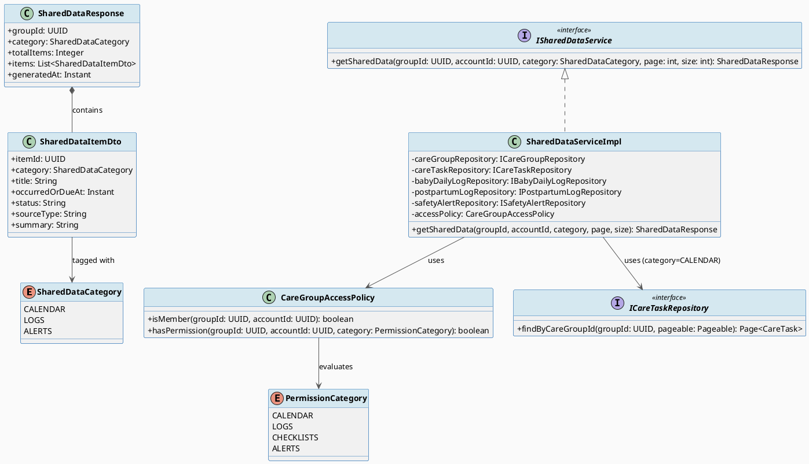
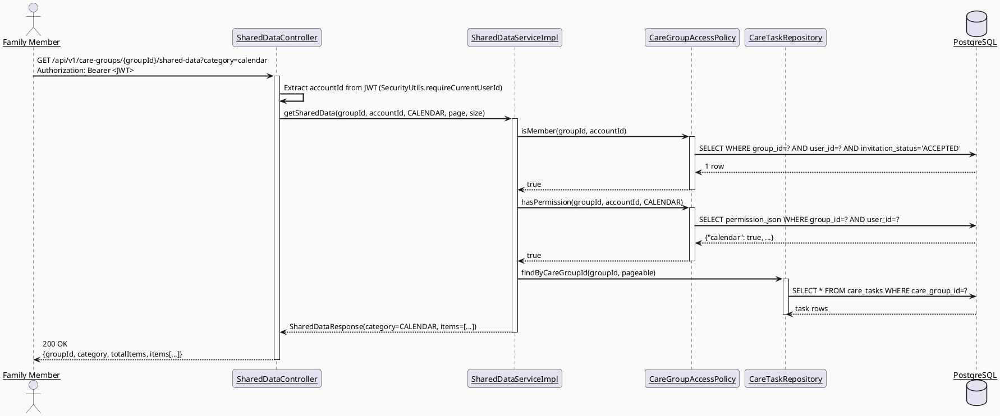
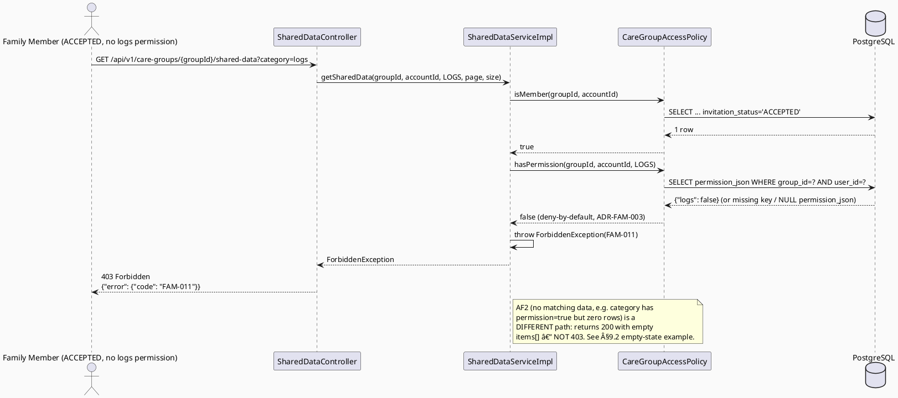

# ENGINEERING DOCUMENTATION STANDARD (EDS) v2.0
# Technical Design Specification — UC-84 View Shared Data

| Field | Value |
|-------|-------|
| **Document ID** | `CB-FAM-IMP-004` |
| **Version** | `1.0` |
| **Date** | `2026-07-02` |
| **Status** | `Approved` |
| **Document Owner** | `TV2-Bach` |
| **Author** | `AI Agent` |
| **Reviewed by** | `[Tech Lead]` |
| **DPO Sign-off** | `[ ] Pending` |
| **Approved by** | `[Principal Architect]` |
| **Last Review** | `2026-07-02` |
| **Based on EDS** | `v2.0` |

---

## CHANGELOG

> **Policy 4.4 — Immutable History:** Never delete prior information. All changes must be logged here.

| Ngày | Người thực hiện | Nội dung thay đổi |
|------|-----------------|-------------------|
| 2026-07-02 | AI Agent | Initial draft for UC-84 View Shared Data |
| 2026-07-08 | AI Agent — Amelia (Dev Agent) | Implemented shared data read with permission-flag filtering: new `SharedDataCategory` enum (CALENDAR/LOGS/ALERTS), `SharedDataItemDto`/`SharedDataResponse` DTOs, `ISharedDataService`/`SharedDataServiceImpl`, `SharedDataController` at `GET /api/v1/care-groups/{groupId}/shared-data`. LOGS category deferred (cross-domain join with postpartum_logs — OI-4); ALERTS reads from `notification_records` (EMERGENCY type). Unit tests not yet run (Red Gate pending). |
| 2026-07-09 | Codex Quick Dev | Verified current UC-84 service-test evidence: `SharedDataServiceImplTest` ran with 9 tests, 0 failures, 0 errors, 0 skipped. This confirms the implemented service subset only; unresolved LOGS/checklists/cross-member alert open items remain open. |

---

## MỤC LỤC

1. [Tổng quan Module](#1-tổng-quan-module)
2. [Ma trận Truy vết (Traceability Matrix)](#2-ma-trận-truy-vết-traceability-matrix)
3. [Architecture Decision Records (ADR)](#3-architecture-decision-records-adr)
4. [Non-Functional Requirements & SLA](#4-non-functional-requirements--sla)
5. [Static Modeling (Mô hình Tĩnh)](#5-static-modeling-mô-hình-tĩnh)
6. [Dynamic Modeling (Mô hình Động)](#6-dynamic-modeling-mô-hình-động)
7. [Domain Event Catalog](#7-domain-event-catalog)
8. [Interface Specification (Đặc tả Giao diện)](#8-interface-specification-đặc-tả-giao-diện)
9. [API Specification](#9-api-specification)
10. [Bảng mã lỗi (Error Codes)](#10-bảng-mã-lỗi-error-codes)
11. [Quy trình Triển khai (Step-by-Step)](#11-quy-trình-triển-khai-step-by-step)
12. [Rollback & Incident Runbook](#12-rollback--incident-runbook)
13. [Kịch bản Kiểm thử Chi tiết](#13-kịch-bản-kiểm-thử-chi-tiết)
14. [Phương pháp Xác minh](#14-phương-pháp-xác-minh)
15. [Mẫu thử thực tế (API Verification Samples)](#15-mẫu-thử-thực-tế-api-verification-samples)
16. [Bảng tổng hợp phân quyền (Authorization Matrix)](#16-bảng-tổng-hợp-phân-quyền-authorization-matrix)
17. [AI Prompt Constraints (CASE 2.0)](#17-ai-prompt-constraints-case-20)

---

## 1. Tổng quan Module

| Field | Value |
|-------|-------|
| **Module Name** | `ViewSharedData` |
| **Bounded Context** | `family` |
| **UC ID** | `UC-84` |
| **SRS Reference** | `§3.3.3.2, lines 3254-3273` |
| **Primary Actor** | `Family Member` |
| **Secondary Actors** | `Firebase Cloud Messaging` (downstream/adjacent only — see §7.2 and Open Item OI-5) |
| **Platform** | `Mobile App` |
| **Source group** | `Mobile App - Family Sync` |
| **Priority** | `Medium` |
| **Frequency** | `Frequent` |
| **Data Classification** | `PII` |
| **Compliance Scope** | `BR-RBAC, BR-PRIVACY, PDPA` |
| **Upstream Dependencies** | `auth, care_groups, care_group_members (permission_json), care_tasks, baby_daily_logs, postpartum_logs, safety_alerts, family_alert_log` |
| **Downstream Consumers** | `Family Sync hub UI, push-notification module (FCM, out of scope)` |

**Mô tả:** Displays shared calendar, logs, checklists, or alerts to a Family Member according to the permissions granted on their `care_group_members` record. General-purpose, category-filtered, read-only aggregation view — the "hub" equivalent of the narrower UC-74 (calendar-only) use case. See ADR-FAM-005 for the category scope decision and the cross-reference to UC-74 below.

**Cross-reference to UC-74 (sibling, drafted in parallel, NOT available to this agent):** UC-74 `ViewSharedCareCalendar` is a calendar/task-specific specialization (Primary Actor: User, includes BR-CONSULTATION, Priority High) — narrower in scope than UC-84. UC-84 is the general-purpose multi-category view (calendar + logs + checklists + alerts; Primary Actor: Family Member; BR-CONSULTATION does NOT apply; Priority Medium; includes FCM as secondary actor). Potential overlap exists on the "calendar" category — **Open Item OI-1**: product decision needed on whether UC-84's calendar category delegates to / reuses UC-74's underlying calendar query service to avoid duplicate implementation, or maintains an independent (but schema-identical) query. This TDS does **not** merge the two artifacts; UC-84 remains a standalone spec and only cross-references UC-74 conceptually.

---

## 2. Ma trận Truy vết (Traceability Matrix)

| Requirement ID | Loại | Mô tả | Thành phần Code | Compliance Target | ADR liên quan |
|----------------|------|-------|-----------------|-------------------|---------------|
| UC-84 (SRS §3.3.3.2, L3254-3273) | Use Case | Display shared calendar/logs/checklists/alerts per granted permission | `SharedDataController.getSharedData()` | BR-RBAC, BR-PRIVACY | ADR-FAM-003, ADR-FAM-004, ADR-FAM-005 |
| BR-RBAC (SRS L3269) | Business Rule | Only ACCEPTED care-group members with the category-specific permission flag may view that category's data | `CareGroupAccessPolicy.isMember()` + `hasPermission()` | BR-RBAC | ADR-FAM-003 |
| BR-PRIVACY (SRS L3269) | Business Rule | No PII beyond what the requesting member is entitled to see (e.g., no email/phone in log/alert payloads) | Response DTO mapping | PDPA | ADR-FAM-003 |
| BR-FAM-020 | Business Rule (new, UC-84-local) | `category` param restricted to `calendar\|logs\|alerts` in v1; `checklists` rejected/Open | `SharedDataController` validation | — | ADR-FAM-005 |
| BR-FAM-021 | Business Rule (new, UC-84-local) | REVOKED / PENDING members always receive 403, regardless of `permission_json` content | `CareGroupAccessPolicy.isMember()` | BR-RBAC | ADR-FAM-003 |

> **Explicit note:** Per SRS source text at line 3269, only **BR-RBAC** and **BR-PRIVACY** are referenced for UC-84. **BR-CONSULTATION does NOT apply** to this use case (unlike sibling UC-74, which does reference it). Do not add BR-CONSULTATION-derived logic (e.g., "consult an expert" prompts) to this feature.

---

## 3. Architecture Decision Records (ADR)

### ADR-FAM-003 — Permission-filtered query design per data category

| Field | Value |
|-------|-------|
| **Status** | `Proposed` |
| **Deciders** | `Tech Lead (pending)` |
| **Date** | `2026-07-02` |

#### Bối cảnh
UC-84 must show different data categories (calendar, logs, checklists, alerts) to a Family Member, but visibility must be gated per-category by the member's granted permissions, not just group membership. `care_group_members.permission_json` (jsonb) is the only column reserved for this, but it currently has **zero consumers or producers anywhere in the codebase** (verified by search) — it is owned by the sibling workstream **UC-72 ManageFamilyPermission**, which has not landed yet.

#### Các phương án đã xem xét

| Phương án | Mô tả | Ưu điểm | Nhược điểm |
|-----------|-------|----------|------------|
| A | Group-membership-only gating (ignore `permission_json`) | Simple, no dependency on UC-72 | Violates the UC-84 description ("according to granted permissions") — too coarse |
| B | Category-keyed boolean flags in `permission_json`, e.g. `{"calendar": true, "logs": false, "checklists": false, "alerts": true}` | Matches UC-84's per-category intent; aligned with UC-74's assumed shape for cross-consistency | Exact key names/shape are NOT confirmed — owned by UC-72 |

#### Quyết định
Adopt **Phương án B** as a **RECOMMENDED, FLAGGED assumption**: boolean flags keyed by data category on `care_group_members.permission_json`. This TDS treats the DB column `care_group_members.permission_json jsonb` as the contract — NOT a specific service method or exact key name — so the design is resilient to UC-72 finalizing the precise shape.

**Open Item OI-2 (CRITICAL):** *Exact `permission_json` key names/shape are owned by UC-72 (sibling workstream) — this TDS assumes boolean flags keyed by data category (`calendar`, `logs`, `checklists`, `alerts`), aligned with UC-74's assumption for cross-consistency. Must be reconciled when UC-72 lands. If UC-72 lands with a different shape (e.g., nested objects, enum lists), `PermissionCategory` resolution logic in `CareGroupAccessPolicy.hasPermission()` must be updated — no other component should read `permission_json` directly.*

#### Hệ quả

**Tích cực:**
- Single well-encapsulated policy method (`hasPermission`) isolates the assumption; only one class needs to change when UC-72 lands.
- Matches SRS wording ("according to granted permissions") rather than coarse group-membership-only gating.

**Tiêu cực / Trade-offs:**
- If `permission_json` is `NULL` (row created before UC-72 ships, or created by current UC-70 flow which does not populate it), all category flags MUST default to a safe value. **Decision: default missing/NULL `permission_json` or missing category key to `false` (deny-by-default)** — this is the least-privilege-safe choice and is documented as **BR-FAM-021**.

**Compliance Impact:**
- Deny-by-default protects against accidentally over-exposing family data before UC-72's permission UI exists — supports PDPA data-minimization.

---

### ADR-FAM-004 — On-demand query vs. materialized view

| Field | Value |
|-------|-------|
| **Status** | `Accepted` |
| **Deciders** | `Tech Lead (pending)` |
| **Date** | `2026-07-02` |

#### Bối cảnh
Shared data spans multiple tables with different keys (`care_group_id` direct FK for `care_tasks`; `baby_id`/`owner_user_id` for logs; `recipient_user_id`/session join for alerts). A materialized/denormalized view could simplify reads but adds refresh-lag risk and migration complexity.

#### Các phương án đã xem xét

| Phương án | Mô tả | Ưu điểm | Nhược điểm |
|-----------|-------|----------|------------|
| A | On-demand JOIN query per category, executed per request | No staleness, no extra migration, matches UC-84's "Frequent but Medium priority" profile | Slightly higher per-request query cost across categories |
| B | Materialized view refreshed on write | Faster reads at scale | Refresh-lag risk on safety-relevant alert data (unacceptable), adds operational complexity, requires new migration |

#### Quyết định
Chọn **Phương án A** (on-demand query), given low expected v1 volume (per-family-group data, not global feed) and the requirement in this feature family to avoid unnecessary migrations/infrastructure per CLAUDE.md delivery rules.

#### Hệ quả

**Tích cực:** No new migration required for v1 categories (calendar/logs/alerts); simplest to reason about; no stale-alert risk.

**Tiêu cực / Trade-offs:** If group sizes or history depth grow substantially, pagination/indexing tuning will be needed (see §4.1 NFR). No trade-off mitigation implemented in v1 beyond existing indexes (e.g., `idx_care_tasks_status`).

---

### ADR-FAM-005 — Category scope decision (v1: calendar/logs/alerts; checklists deferred)

| Field | Value |
|-------|-------|
| **Status** | `Proposed` |
| **Deciders** | `Tech Lead (pending), Principal Architect (for checklist join path)` |
| **Date** | `2026-07-02` |

#### Bối cảnh
UC-84's SRS description lists four categories: calendar, logs, checklists, alerts. Verified against `V1__init_schema.sql`: no table maps 1:1 to any of these as a care-group-scoped feed.

- **calendar** → `care_tasks` (direct `care_group_id` FK — clean join path)
- **logs** → `baby_daily_logs` / `postpartum_logs` (keyed by `baby_id` / `owner_user_id`, NOT `care_group_id` — requires an indirect join via `care_groups.baby_id` or `care_groups.owner_user_id`)
- **checklists** → `checklist_items` / `checklist_templates` (line 49/65 of `V1__init_schema.sql`) — **no visible FK to `care_group_id` or `baby_id` in V1**. No confirmed join path exists.
- **alerts** → `family_alert_log` (session-scoped via `emergency_sessions.user_id`, aggregate-only columns: `recipient_count`, `location_included`, no per-recipient row or message content) or `safety_alerts` (`recipient_user_id`-keyed, per-user, not per-care-group). Neither table is care-group-scoped natively.

#### Các phương án đã xem xét

| Phương án | Mô tả | Ưu điểm | Nhược điểm |
|-----------|-------|----------|------------|
| A | Ship all 4 categories in v1, inventing new FK/join columns as needed | Matches SRS description fully | Requires unreviewed schema changes for checklists; premature ahead of UC-72 permission model confirmation |
| B | Ship calendar/logs/alerts in v1 via existing joins; defer checklists as an Open Item | No premature migration; unblocks v1 delivery; checklist support added later once UC-72 lands and a real join path is confirmed | SRS description not 100% covered in v1 |

#### Quyết định
Chọn **Phương án B**. v1 scope = `category` query param in `{calendar, logs, alerts}`. `checklists` is explicitly **excluded from v1 and flagged as Open Item OI-3** — inventing a checklist-sharing join without sibling UC-72 (permission model) confirmed first is premature per task guidance. No migration is proposed in this draft for checklists.

**On "alerts" specifically — Open Item OI-4:** Neither `family_alert_log` (session/emergency-triage-scoped, aggregate-only) nor `safety_alerts` (recipient_user_id-keyed, per-user fall-detection/safety-monitoring) is care-group-scoped. This TDS recommends the "alerts" category join `safety_alerts.recipient_user_id` against the requesting member's own `user_id` intersected with `care_groups` membership (i.e., a family member sees safety alerts recipient-addressed to group members they have "alerts" permission for), with `family_alert_log` surfaced only as supplementary session-level metadata (sent_at, recipient_count) if the corresponding `emergency_sessions.user_id` belongs to a linked baby/journey owner in the same care group. **This is a genuine schema gap and MUST be reviewed by Principal Architect before implementation** — do not treat this join as confirmed.

#### Hệ quả

**Tích cực:** No invented schema for v1; delivery unblocked; explicit gap tracked for follow-up.

**Tiêu cực / Trade-offs:** UC-84 does not fully satisfy its SRS description in v1 (checklists missing). Documented as Open Item, not silently dropped.

**Compliance Impact:** None — deferring a category is a scope decision, not a compliance risk, provided the UI clearly does not claim checklist-sharing support until it ships.

---

## 4. Non-Functional Requirements & SLA

### 4.1. Performance & Availability

| Category | Requirement | Target SLA | Measurement Method | Compliance Basis |
|----------|-------------|------------|---------------------|------------------|
| Latency | API response (p99), single category | `< 400ms` | k6 load test | — |
| Availability | Uptime (monthly) | `99.9%` | Uptime monitor | — |
| Page size | Default page size / max | `20 / 100 items` | Product requirement | — |

### 4.2. Data Integrity & Retention

| Category | Requirement | Target | Verification Method | Compliance Basis |
|----------|-------------|--------|---------------------|------------------|
| Durability | Read-only endpoint, no write | N/A | — | — |
| Consistency | Permission check re-evaluated on every request (no caching of `permission_json` across requests) | 100% | Code review + integration test | PDPA |

### 4.3. Security

| Category | Requirement | Target | Verification Method | Compliance Basis |
|----------|-------------|--------|---------------------|------------------|
| Access control | Category-specific permission-flag enforcement | 100% | Auth Matrix §16 | BR-RBAC |
| PII masking | Logs/alerts category responses exclude email/phone | 100% | Response schema review | BR-PRIVACY |
| Deny-by-default | Missing/NULL `permission_json` or missing category key → deny | 100% | Unit test (see Test-Spec) | ADR-FAM-003 |

### 4.4. Scalability & Capacity Planning

> Expected v1 load: per-family-group reads, not a global feed — bounded by care group size (product-observed max ~20 members per UC-216 NFR) and per-category record counts. On-demand query design (ADR-FAM-004) is expected to scale acceptably at this volume; revisit if group sizes or per-category history depth grow materially.

---

## 5. Static Modeling (Mô hình Tĩnh)

### 5.1. Class Diagram (PlantUML)



### 5.2. Data Structure (Flyway SQL Migration)

> **No migration required for the v1 scope (calendar / logs / alerts categories).** All three categories are served via existing tables and existing FKs:
> - calendar: `care_tasks.care_group_id` (direct FK, already indexed via `idx_care_tasks_status` for status filtering)
> - logs: `baby_daily_logs.baby_id` / `postpartum_logs.owner_user_id`, joined via `care_groups.baby_id` / `care_groups.owner_user_id`
> - alerts: `safety_alerts.recipient_user_id` intersected with care-group membership `user_id`s (see ADR-FAM-005, Open Item OI-4 — join path pending Principal Architect review)
>
> **Checklists category has no confirmed join path** (`checklist_items` / `checklist_templates` have no visible FK to `care_group_id` or `baby_id` in `V1__init_schema.sql`). **No migration is proposed in this draft.** If a future architecture review confirms checklists must be care-group-shareable, a proposal would use migration version `V20260702100100` (second slot in the assigned range, since UC-74's sibling agent may have claimed `V20260702100000`) — but this is explicitly **not** part of this draft's scope.

```sql
-- Reference only — no new tables/columns in this migration-free draft.
-- care_tasks(care_task_id, care_group_id, assigned_by, assigned_to, title, status, due_at, ...)
-- baby_daily_logs(..., baby_id, ...)
-- postpartum_logs(..., owner_user_id, ...)
-- safety_alerts(safety_alert_id, safety_event_id, recipient_user_id, alert_reason, delivery_status, ...)
-- family_alert_log(id, session_id -> emergency_sessions.id, sent_at, recipient_count, location_included)  -- supplementary only, see OI-4
```

---

## 6. Dynamic Modeling (Mô hình Động)

### 6.1. Sequence Diagram — Happy Path, multi-category permission-filtered fetch (PlantUML)



### 6.2. Sequence Diagram — Alt path: no permission / empty result (PlantUML)



### 6.3. State Machine

> Not applicable — UC-84 is a stateless, read-only view. No entity state transitions are owned by this module. `care_group_members.invitation_status` and `care_tasks.status` state machines are owned by their respective write-side use cases (UC-71/72/73/83), not by UC-84.

---

## 7. Domain Event Catalog

### 7.1. Events Published (Phát ra)

| Event Name | Trigger | Publisher | Subscriber(s) | Payload Schema | Async? |
|------------|---------|-----------|---------------|----------------|--------|
| — | Read-only endpoint — no events published | — | — | — | — |

### 7.2. Events Consumed (Tiêu thụ)

| Event Name | Source | Handler | Action thực hiện |
|------------|--------|---------|------------------|
| — | None directly consumed | — | Relies on sibling UC-72 (`ManageFamilyPermission`) permission updates and UC-73 (`AssignFamilyTask`) task assignment to keep source data current. **No formal event contract exists yet — Open Item OI-6.** UC-84 always reads the current DB state at request time (no event-driven cache invalidation needed given ADR-FAM-004's on-demand query design). |

> **FCM relationship (downstream/adjacent, explicitly OUT OF SCOPE for this UC):** Firebase Cloud Messaging is listed as a secondary actor in the SRS for UC-84. This implies that when new shared data appears (e.g., a new care task or alert), a push notification MAY be sent to family members. **UC-84 itself does not send FCM notifications** — that responsibility belongs to separate "Receive X Notification" use cases (e.g., UC-158/159/160/161 per `04_Implement/`). UC-84 is a pull/read endpoint only. Any FCM triggering logic must NOT be implemented as part of this TDS's scope — if requested, it requires a new ADR and is out of bounds for `SharedDataServiceImpl`.

---

## 8. Interface Specification (Đặc tả Giao diện)

### 8.1. Service Interface

```java
// SharedDataCategory.java — v1 scope only
// @version 1.0
public enum SharedDataCategory {
    CALENDAR,
    LOGS,
    ALERTS
    // CHECKLISTS intentionally omitted — ADR-FAM-005, Open Item OI-3
}

// SharedDataItemDto.java
public class SharedDataItemDto {
    private UUID itemId;             // source-table primary key (care_task_id / log id / safety_alert_id)
    private SharedDataCategory category;
    private String title;            // e.g. care_tasks.title, or a derived label for logs/alerts
    private Instant occurredOrDueAt; // due_at (calendar) / measured_date-derived (logs) / sent_at (alerts)
    private String status;           // raw status string — NOTE: care_tasks.status has NO CHECK constraint (app-level only)
    private String sourceType;       // "CARE_TASK" | "BABY_DAILY_LOG" | "POSTPARTUM_LOG" | "SAFETY_ALERT"
    private String summary;          // short, PII-safe description — NEVER includes email/phone
    // getters / setters
}

// SharedDataResponse.java
public class SharedDataResponse {
    private UUID groupId;
    private SharedDataCategory category;
    private Integer totalItems;
    private List<SharedDataItemDto> items;
    private Instant generatedAt;
    // getters / setters
}

// ISharedDataService.java — Service Contract
// @version 1.0
public interface ISharedDataService {
    /**
     * Returns permission-filtered shared data for one category.
     * @throws NotFoundException (FAM-010) khi care group không tồn tại
     * @throws ForbiddenException (FAM-003) khi caller không phải ACCEPTED member (reused from UC-216's code, not renumbered)
     * @throws ForbiddenException (FAM-011) khi caller là ACCEPTED member nhưng category permission flag = false / missing / permission_json NULL
     * @throws BusinessException (FAM-012) khi category param không hợp lệ (không thuộc calendar|logs|alerts) hoặc = "checklists" (explicitly deferred, Open Item OI-3)
     */
    SharedDataResponse getSharedData(UUID groupId, UUID accountId, SharedDataCategory category, int page, int size);
}
```

### 8.2. Repository Interface

```java
// Extends existing family-package repositories; no new tables.
// ICareTaskRepository.java (new, family-adjacent — or reuse existing if UC-73/UC-74 sibling already defines it; contract is the method signature below)
public interface ICareTaskRepository extends JpaRepository<CareTask, UUID> {
    Page<CareTask> findByCareGroupId(UUID careGroupId, Pageable pageable);
}

// IBabyDailyLogRepository.java / IPostpartumLogRepository.java — existing/likely-existing repositories, reused read-only
public interface IBabyDailyLogRepository extends JpaRepository<BabyDailyLog, UUID> {
    Page<BabyDailyLog> findByBabyId(UUID babyId, Pageable pageable);
}

public interface IPostpartumLogRepository extends JpaRepository<PostpartumLog, UUID> {
    Page<PostpartumLog> findByOwnerUserId(UUID ownerUserId, Pageable pageable);
}

// ISafetyAlertRepository.java — existing/likely-existing, reused read-only
// Open Item OI-4: exact join predicate (recipient_user_id vs care-group membership set) pending Principal Architect review
public interface ISafetyAlertRepository extends JpaRepository<SafetyAlert, UUID> {
    Page<SafetyAlert> findByRecipientUserIdIn(List<UUID> recipientUserIds, Pageable pageable);
}

// CareGroupAccessPolicy.java — extended from UC-216's ADR-FAM-002 pattern
public interface PermissionCategoryCheck {
    boolean hasPermission(UUID groupId, UUID accountId, PermissionCategory category);
}
```

---

## 9. API Specification

### 9.1. Endpoints Table

| Method | Path | Auth Level | Required Roles | Rate Limit | Idempotent? |
|--------|------|------------|----------------|------------|-------------|
| `GET` | `/api/v1/care-groups/{groupId}/shared-data?category={calendar\|logs\|alerts}&page={n}&size={n}` | JWT Bearer | Any authenticated account that is an ACCEPTED care-group member (`ROLE_MOTHER`, `ROLE_FAMILY`, etc. — role-agnostic, membership-gated) | 120/min | Yes |

### 9.2. Request / Response Schemas

#### `GET /api/v1/care-groups/{groupId}/shared-data?category=calendar`

**Response — 200 OK (Happy Path):**
```json
{
  "groupId": "group-uuid",
  "category": "CALENDAR",
  "totalItems": 2,
  "generatedAt": "2026-07-02T08:00:00.000Z",
  "items": [
    {
      "itemId": "task-uuid-1",
      "category": "CALENDAR",
      "title": "Prenatal checkup",
      "occurredOrDueAt": "2026-07-05T09:00:00.000Z",
      "status": "OPEN",
      "sourceType": "CARE_TASK",
      "summary": "Assigned to Tran Van B"
    },
    {
      "itemId": "task-uuid-2",
      "category": "CALENDAR",
      "title": "Buy prenatal vitamins",
      "occurredOrDueAt": "2026-07-03T00:00:00.000Z",
      "status": "COMPLETED",
      "sourceType": "CARE_TASK",
      "summary": "Completed by Nguyen Thi A"
    }
  ]
}
```

**Response — 200 OK (AF2: Empty state, permission granted but no matching data):**
```json
{
  "groupId": "group-uuid",
  "category": "ALERTS",
  "totalItems": 0,
  "generatedAt": "2026-07-02T08:00:00.000Z",
  "items": []
}
```

**Response — 400 Bad Request (invalid/deferred category):**
```json
{
  "error": {
    "code": "FAM-012",
    "message": "Unsupported category. Supported: calendar, logs, alerts. 'checklists' is not yet available.",
    "details": [{ "field": "category", "message": "must be one of [calendar, logs, alerts]" }]
  }
}
```

**Response — 403 Forbidden (not a member / PENDING / REVOKED):**
```json
{
  "error": {
    "code": "FAM-003",
    "message": "Not a group member"
  }
}
```

**Response — 403 Forbidden (member, but category permission = false/missing):**
```json
{
  "error": {
    "code": "FAM-011",
    "message": "You do not have permission to view this category"
  }
}
```

**Response — 404 Not Found:**
```json
{
  "error": {
    "code": "FAM-010",
    "message": "Care group not found"
  }
}
```

---

## 10. Bảng mã lỗi (Error Codes)

> **FAM-003 is reused verbatim from UC-216 (`Not a group member`) for consistency — not re-numbered.** All new UC-84-specific codes start at `FAM-010` to reduce collision risk with sibling UC-74's likely-claimed range. **Final numbering is TBD at implementation time** if a collision with UC-74's actual chosen codes is discovered.

| Code | HTTP Status | Message (EN) | Message (VI) | Trigger Condition |
|------|-------------|--------------|--------------|-------------------|
| `FAM-003` | 403 | Not a group member | Không phải thành viên của nhóm | Caller's `invitation_status` ≠ ACCEPTED (reused from UC-216) |
| `FAM-010` | 404 | Care group not found | Không tìm thấy nhóm | `groupId` không tồn tại trong DB |
| `FAM-011` | 403 | Category permission denied | Không có quyền xem danh mục này | ACCEPTED member, nhưng `permission_json` category flag = false, missing, hoặc `permission_json` NULL (deny-by-default, ADR-FAM-003) |
| `FAM-012` | 400 | Unsupported category | Danh mục không được hỗ trợ | `category` param không thuộc `{calendar, logs, alerts}` (bao gồm `checklists`, deferred) |
| `FAM-013` | 500 | Internal error | Lỗi hệ thống | Lỗi DB không xác định |

---

## 11. Quy trình Triển khai (Step-by-Step)

### 11.1. Prerequisites

- [ ] Tables `care_groups`, `care_group_members`, `care_tasks`, `baby_daily_logs`, `postpartum_logs`, `safety_alerts` already exist (verified in `V1__init_schema.sql`)
- [ ] `CareGroupAccessPolicy.isMember()` already exists (from UC-216, ADR-FAM-002) — reused, not reimplemented
- [ ] No new migration required for v1 scope (calendar/logs/alerts) — see §5.2
- [ ] Open Item OI-4 (alerts join path) reviewed/confirmed by Principal Architect before `ALERTS` category is implemented — if unresolved at implementation time, ship `CALENDAR` + `LOGS` first and gate `ALERTS` behind a feature flag or defer

### 11.2. Pre-Migration Checklist

Not applicable — no migration in this draft.

### 11.3. Implementation Steps

#### Chặng 1 — Extend `CareGroupAccessPolicy` with `hasPermission()`

```java
public boolean hasPermission(UUID groupId, UUID accountId, PermissionCategory category) {
    CareGroupMember member = memberRepository.findByCareGroupIdAndUserIdAndInvitationStatus(
        groupId, accountId, InviteStatus.ACCEPTED
    ).orElse(null);
    if (member == null || member.getPermissionJson() == null) {
        return false; // deny-by-default, ADR-FAM-003
    }
    JsonNode flags = parsePermissionJson(member.getPermissionJson());
    JsonNode flag = flags.get(category.name().toLowerCase());
    return flag != null && flag.asBoolean(false);
}
```

#### Chặng 2 — Implement `SharedDataServiceImpl.getSharedData()`

```java
@Override
public SharedDataResponse getSharedData(UUID groupId, UUID accountId, SharedDataCategory category, int page, int size) {
    careGroupRepository.findById(groupId).orElseThrow(() -> new NotFoundException("FAM-010"));
    if (!accessPolicy.isMember(groupId, accountId)) {
        throw new ForbiddenException("FAM-003");
    }
    PermissionCategory permCategory = PermissionCategory.valueOf(category.name());
    if (!accessPolicy.hasPermission(groupId, accountId, permCategory)) {
        throw new ForbiddenException("FAM-011");
    }
    List<SharedDataItemDto> items = switch (category) {
        case CALENDAR -> mapTasks(careTaskRepository.findByCareGroupId(groupId, PageRequest.of(page, size)));
        case LOGS -> mapLogs(groupId, PageRequest.of(page, size));
        case ALERTS -> mapAlerts(groupId, PageRequest.of(page, size)); // Open Item OI-4 join
    };
    return new SharedDataResponse(groupId, category, items.size(), items, Instant.now());
}
```

#### Chặng 3 — Implement `SharedDataController`

```java
@GetMapping("/api/v1/care-groups/{groupId}/shared-data")
public ResponseEntity<ApiResponse<SharedDataResponse>> getSharedData(
    @PathVariable UUID groupId,
    @RequestParam String category,
    @RequestParam(defaultValue = "0") int page,
    @RequestParam(defaultValue = "20") int size,
    Principal principal
) {
    UUID accountId = SecurityUtils.requireCurrentUserId(principal);
    SharedDataCategory parsed = parseCategoryOrThrow(category); // throws BusinessException FAM-012 if invalid/checklists
    return ResponseEntity.ok(ApiResponse.success(
        sharedDataService.getSharedData(groupId, accountId, parsed, page, size)
    ));
}
```

#### Chặng 4 — Verification sau deploy

```bash
curl -X GET https://[host]/api/v1/health
# Expected: {"status": "ok"}
```

### 11.4. Deployment Checklist

- [ ] Health check endpoint trả về 200
- [ ] Không có migration mới cần chạy
- [ ] Verify `category=checklists` returns 400 FAM-012 (not silently ignored)
- [ ] Verify a member with `permission_json` = NULL receives 403 FAM-011 for every category (deny-by-default)
- [ ] Log không chứa PII (email/phone) trong `summary` fields

---

## 12. Rollback & Incident Runbook

### 12.1. Điều kiện kích hoạt Rollback

| Điều kiện | Ngưỡng | Người quyết định |
|-----------|--------|------------------|
| Error rate tăng đột biến | > 5% trong 5 phút | On-call Engineer |
| Latency p99 vượt ngưỡng | > 2x baseline (800ms) | On-call Engineer |
| Permission bypass detected (member sees category with flag=false) | Bất kỳ case nào | Tech Lead + DPO |

### 12.2. Rollback Procedure

No DB migration for this module → rollback is a code-only revert:

```bash
# Bước 1: Re-deploy phiên bản cũ
kubectl rollout undo deployment/carebridge-api

# Bước 2: Verify rollback thành công
kubectl rollout status deployment/carebridge-api
curl -X GET https://[host]/api/v1/health

# BÆ°á»›c 3: Smoke test
curl -X GET https://[host]/api/v1/care-groups/{groupId}/shared-data?category=calendar \
  -H "Authorization: Bearer <valid_member_token>"
# Expected: 200 OK
```

### 12.3. Notification Protocol

| Thời điểm | Người nhận | Kênh | Template |
|-----------|------------|------|----------|
| Ngay khi phát hiện | On-call team | Slack `#incident` | "🚨 UC-84 incident: [mô tả]" |
| Nếu permission bypass / PII leak | DPO | Email | Bắt buộc — PDPA |

### 12.4. Post-Incident Review (PIR)

> Bắt buộc hoàn thành trong vòng 48 giờ sau khi resolve incident.

- **Timeline:** Diễn biến chi tiết
- **Root Cause:** 5 Whys analysis
- **Impact:** Số family members bị ảnh hưởng, category nào bị lộ sai quyền?
- **Prevention:** Action items để tránh tái diễn (e.g., add permission-flag regression test)

---

## 13. Kịch bản Kiểm thử Chi tiết

> **Policy (EDS v2.0):** All test scenarios use `SYNTHETIC` data. Full detail lives in the companion Test-Spec `CB-FAM-TDD-004`.

### 13.1. Unit Tests (summary — see Test-Spec for full cases)

#### TC-UNIT-001 — Member with calendar=true views calendar category

```gherkin
Feature: View Shared Data
  Background:
    Given test data classification: SYNTHETIC
    And care group CG-001 exists with ACC-001 as ACCEPTED member
    And ACC-001's permission_json = {"calendar": true, "logs": false, "alerts": true}

  Scenario: calendar=true → 200 with items
    When getSharedData(CG-001, ACC-001, CALENDAR) is called
    Then response contains care_tasks scoped to CG-001

  Scenario: logs=false → 403 FAM-011
    When getSharedData(CG-001, ACC-001, LOGS) is called
    Then throws ForbiddenException FAM-011
```

**Hàm được test:** `SharedDataServiceImpl.getSharedData()`
**Invariant kiểm tra:** Permission flag is re-evaluated every call; false/missing/NULL always denies.

### 13.2. Integration Tests

#### TC-INT-001 — Full flow with DB, mixed permission combos

```gherkin
  Scenario: Service + Repository phối hợp đúng cho từng category
    Given database has CG-001 with permission_json combos: all-true, all-false, mixed, NULL
    When SharedDataServiceImpl.getSharedData is called for each combo × each category
    Then results match the deny-by-default and category-scoping rules exactly
```

### 13.3. E2E / Security Tests

#### TC-E2E-001 — Full API flow

```gherkin
  Scenario: ACCEPTED member with alerts=true → 200
    Given ACC-001 has valid JWT, invitation_status=ACCEPTED, permission_json.alerts=true
    When GET /api/v1/care-groups/{groupId}/shared-data?category=alerts is called
    Then response status is 200

  Scenario: checklists category → 400
    When GET .../shared-data?category=checklists is called
    Then response status is 400 with code FAM-012
```

---

## 14. Phương pháp Xác minh

### 14.1. Database Inspection

```sql
-- Verify permission_json shape assumption (Open Item OI-2) against real seeded data
SELECT care_group_member_id, user_id, permission_json
FROM care_group_members
WHERE care_group_id = '<groupId>';

-- Verify care_tasks scoping (calendar category)
SELECT care_task_id, care_group_id, status FROM care_tasks WHERE care_group_id = '<groupId>';
```

### 14.2. Log / Audit Verification

```bash
# Verify no PII in logs
kubectl logs -l app=carebridge-api | grep -i "email\|phone\|@"
# Expected: No output related to shared-data responses

# Verify FAM-011 denial events are logged (for security monitoring, not a formal audit trail per POST-3 unless flagged sensitive)
kubectl logs -l app=carebridge-api | grep "FAM-011" | head -5
```

### 14.3. Tool-based Verification

```bash
echo "<JWT_TOKEN>" | cut -d'.' -f2 | base64 -d | jq '.sub'
openssl s_client -connect [host]:443 -tls1_3 2>&1 | grep "Protocol"
```

---

## 15. Mẫu thử thực tế (API Verification Samples)

### 15.1. Happy Path

```bash
curl -X GET "https://[host]/api/v1/care-groups/CG-001/shared-data?category=calendar" \
  -H "Authorization: Bearer <ACCEPTED_MEMBER_JWT>" \
  -H "X-Correlation-Id: $(uuidgen)"
```

**Expected Response (200):** see §9.2 example.

### 15.2. Error Paths

```bash
# Permission flag false → 403 FAM-011
curl -X GET "https://[host]/api/v1/care-groups/CG-001/shared-data?category=logs" \
  -H "Authorization: Bearer <MEMBER_WITH_LOGS_FALSE_JWT>"
```

**Expected Response (403):**
```json
{ "error": { "code": "FAM-011", "message": "You do not have permission to view this category" } }
```

```bash
# Invalid/deferred category → 400 FAM-012
curl -X GET "https://[host]/api/v1/care-groups/CG-001/shared-data?category=checklists" \
  -H "Authorization: Bearer <ACCEPTED_MEMBER_JWT>"
```

**Expected Response (400):**
```json
{ "error": { "code": "FAM-012", "message": "Unsupported category. Supported: calendar, logs, alerts. 'checklists' is not yet available." } }
```

---

## 16. Bảng tổng hợp phân quyền (Authorization Matrix)

> Nguyên tắc **Least Privilege**: ACCEPTED membership is necessary but NOT sufficient — the category-specific permission flag must also be `true`. Deny-by-default applies when `permission_json` is NULL or missing the category key (ADR-FAM-003).

| Endpoint | `GUEST` | `MEMBER (ACCEPTED, flag=true)` | `MEMBER (ACCEPTED, flag=false/missing)` | `MEMBER (PENDING)` | `MEMBER (REVOKED)` | `ADMIN` |
|----------|---------|-------------------------------|------------------------------------------|---------------------|----------------------|---------|
| `GET /api/v1/care-groups/:id/shared-data?category=calendar` | ❌ 401 | ✅ 200 | ❌ 403 FAM-011 | ❌ 403 FAM-003 | ❌ 403 FAM-003 | ✅ All |
| `GET /api/v1/care-groups/:id/shared-data?category=logs` | ❌ 401 | ✅ 200 | ❌ 403 FAM-011 | ❌ 403 FAM-003 | ❌ 403 FAM-003 | ✅ All |
| `GET /api/v1/care-groups/:id/shared-data?category=alerts` | ❌ 401 | ✅ 200 | ❌ 403 FAM-011 | ❌ 403 FAM-003 | ❌ 403 FAM-003 | ✅ All |
| `GET /api/v1/care-groups/:id/shared-data?category=checklists` | ❌ 401 | ❌ 400 FAM-012 (all roles) | ❌ 400 FAM-012 | ❌ 400 FAM-012 | ❌ 400 FAM-012 | ❌ 400 FAM-012 |

**Chú thích:**
- ✅ = Allowed
- ❌ = Denied
- Membership check (FAM-003) is evaluated **before** permission-flag check (FAM-011) — consistent ordering with UC-216's `isMember` pattern.
- `checklists` is rejected at input-validation time (400), before any authorization check runs, since it is not a supported category in v1 — this is a deliberate, consistent choice; justification: it avoids leaking whether a group "would" have granted checklist permission, since the category doesn't exist as a queryable resource yet.

---

## 17. AI Prompt Constraints (CASE 2.0)

### 17.1 Constraint Summary Table

| # | Constraint | Source (ADR/BR) | Last Verified |
|---|-----------|-----------------|---------------|
| C1 | `getSharedData()` MUST check `isMember()` (ACCEPTED only) BEFORE checking `hasPermission()` — never skip or reorder | ADR-FAM-002 (reused), BR-RBAC | 2026-07-02 |
| C2 | `hasPermission()` MUST deny (return `false`) when `permission_json` is NULL or the category key is missing — NEVER default to `true` | ADR-FAM-003 | 2026-07-02 |
| C3 | Only categories `{calendar, logs, alerts}` are implemented in v1; `checklists` MUST be rejected with `FAM-012` (400) at the controller validation layer, not silently ignored or treated as `true`/`false` | ADR-FAM-005 | 2026-07-02 |
| C4 | `accountId` MUST come from JWT SecurityContext (`SecurityUtils.requireCurrentUserId`) — NEVER from URL path or request body | BR-RBAC | 2026-07-02 |
| C5 | Response DTOs (`SharedDataItemDto`) MUST NOT include email/phone or other fields beyond `title`/`status`/`summary`/timestamps — no raw entity passthrough | BR-PRIVACY | 2026-07-02 |
| C6 | No FCM-sending logic may be added to `SharedDataServiceImpl` or `SharedDataController` — this UC is read-only; FCM triggering belongs to separate notification use cases | SRS §3.3.3.2 secondary actor note | 2026-07-02 |
| C7 | The "alerts" category join (Open Item OI-4) is NOT confirmed — implementer MUST get Principal Architect sign-off on the `safety_alerts`/`family_alert_log` join predicate before shipping `ALERTS`; if unconfirmed at implementation time, ship `CALENDAR`+`LOGS` only and defer `ALERTS` | ADR-FAM-005, OI-4 | 2026-07-02 |

### 17.2 Constraint Injection Block (Copy-Paste vào AI Prompt)

```
[CONSTRAINT BLOCK — Module: ViewSharedData (CB-FAM-IMP-004)]
Theo TDS CB-FAM-IMP-004 và các ADR liên quan:

1. (C1 — ADR-FAM-002/BR-RBAC) isMember() (ACCEPTED only) phải được check TRƯỚC hasPermission().
2. (C2 — ADR-FAM-003) hasPermission() phải deny (false) khi permission_json NULL hoặc thiếu category key — KHÔNG default true.
3. (C3 — ADR-FAM-005) Chỉ implement categories {calendar, logs, alerts}. "checklists" phải trả 400 FAM-012, không được silently allow/deny.
4. (C4 — BR-RBAC) accountId lấy từ JWT SecurityContext, KHÔNG từ URL/body.
5. (C5 — BR-PRIVACY) SharedDataItemDto KHÔNG chứa email/phone hay entity passthrough.
6. (C6) KHÔNG thêm FCM-sending logic vào module này — chỉ đọc dữ liệu.
7. (C7 — Open Item OI-4) "alerts" category join CHƯA được confirm — cần Principal Architect sign-off trước khi ship; nếu chưa có, chỉ ship calendar+logs.

[CONTEXT BLOCK]
- Bounded Context: family
- Data Classification: PII
- Compliance: PDPA, BR-RBAC, BR-PRIVACY
- Existing interfaces: §8 Service Interface + Repository Interface
- Error codes: FAM-003 (403, reused), FAM-010 (404), FAM-011 (403), FAM-012 (400), FAM-013 (500)
- Auth matrix: §16

[TASK BLOCK]
Implement SharedDataServiceImpl.getSharedData() thỏa mãn constraints trên.
Output phải tuân thủ §8 Interface Specification.
Tests phải cover §13 Test Scenarios và companion Test-Spec CB-FAM-TDD-004.
```

### 17.3 Constraint Quality Checklist

- [x] Mỗi constraint traceable về ADR hoặc BR cụ thể
- [x] Không có constraint generic
- [x] Mỗi constraint có `Last Verified` date
- [x] Constraint block có ≥ 5 constraints cụ thể (7 total)
- [x] Constraint block reference §8 Interface
- [x] Constraint block reference §16 Auth Matrix

### 17.4 Anti-Pattern Detection

| AP-ID | Anti-Pattern | Dấu hiệu | Hành động |
|-------|-------------|-----------|----------|
| AP-AI-001 | Unconstrained Gen | Code không check permission_json flag trước khi trả data | Reject — inject lại C1/C2 |
| AP-AI-003 | Implicit Decision | Code tự bịa checklist join column mà không có ADR review | Reject — C3/C7 violation, escalate to Principal Architect |
| AP-AI-005 | Hallucinated Contract | Code import repository/service method không có trong §8 | Reject — verify contract existence |

---

## PHỤ LỤC

### A. Glossary (Thuật ngữ)

| Thuật ngữ | Định nghĩa |
|-----------|------------|
| Care Group | Family group consisting of a mother and support members |
| permission_json | jsonb column on `care_group_members`, reserved for UC-72's fine-grained permission model; shape ASSUMED in this TDS (Open Item OI-2) |
| Deny-by-default | Missing/NULL permission data results in denial, not implicit allow |
| PII | Personally Identifiable Information |
| Least Privilege | Grant only the minimum access necessary |

### B. Tài liệu tham chiếu

| Document | Link / Path |
|----------|-------------|
| SRS §3.3.3.2 UC-84 | `02_Requirements/SRS/3_Functional_Specification.md` (L3254-3273) |
| UC-216 TDS (sibling pattern reference) | `04_Implement/UC216_ViewCareGroupMembers/UC216_ViewCareGroupMembers_TDS.md` |
| Function-spec task allocation | `04_Implement/implement_artifacts/function-spec-task-allocation.md` (L476-518) |
| EDS v2.0 Template | `08_References/Template/PHASE-3_TDS.md` |
| DB schema baseline | `05_Development/CareBridgeAPI/src/main/resources/db/migration/V1__init_schema.sql` |
| family_alert_log migration | `05_Development/CareBridgeAPI/src/main/resources/db/migration/V20260627000004__create_family_alert_log.sql` |

---

## OPEN ITEMS SUMMARY (for reviewer convenience)

| ID | Description | Blocking? | Owner |
|----|-------------|-----------|-------|
| OI-1 | UC-84 calendar category vs. UC-74's calendar query service — delegate or duplicate? | No (v1 can proceed independently) | Product / Tech Lead |
| OI-2 | `permission_json` exact shape not confirmed — assumed boolean flags per category | Yes, for hasPermission() correctness | UC-72 owner |
| OI-3 | Checklists category has no confirmed join path — deferred from v1 | No (excluded from scope) | Principal Architect |
| OI-4 | "Alerts" category join predicate (`safety_alerts` vs `family_alert_log` vs care-group membership) not confirmed | Yes, for ALERTS category specifically | Principal Architect |
| OI-5 | FCM secondary-actor relationship — confirm no overlap with existing notification UCs | No (explicitly out of scope) | Product |
| OI-6 | No formal event contract with UC-72/UC-73 — relies on read-time DB consistency only | No (accepted for v1 given on-demand query design) | Tech Lead |

---

*EDS v2.1 — Tích hợp CASE 2.0 AI Prompt Constraints (§17).*
