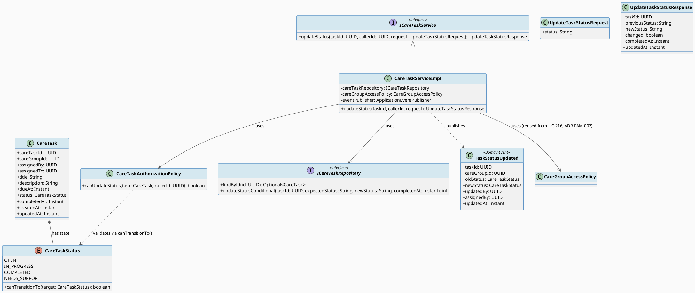
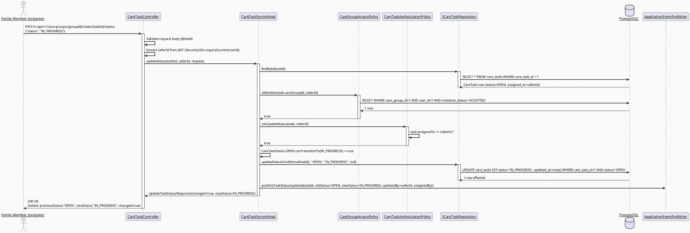
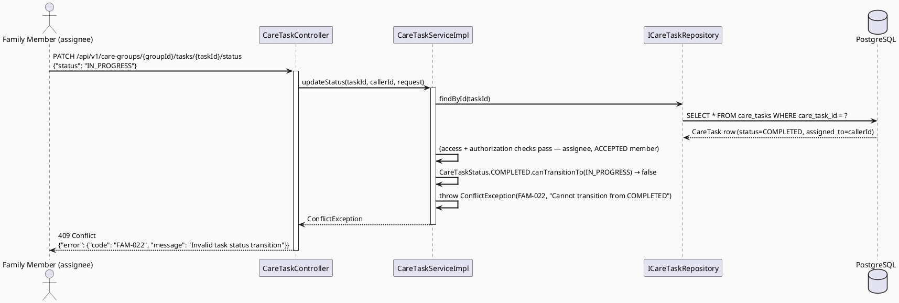
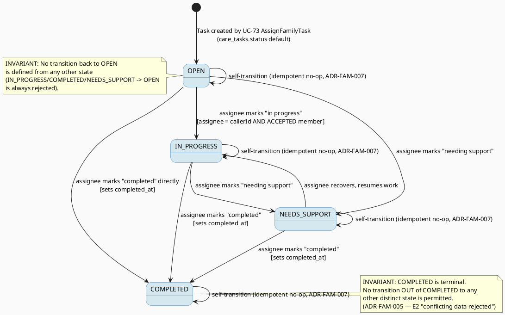

# ENGINEERING DOCUMENTATION STANDARD (EDS) v2.0
# Technical Design Specification — UC-85 Update Assigned Task Status

| Field | Value |
|-------|-------|
| **Document ID** | `CB-FAM-IMP-005` |
| **Version** | `1.0` |
| **Date** | `2026-07-02` |
| **Status** | `Draft` |
| **Document Owner** | `TV2-Bach` |
| **Author** | `AI Agent` |
| **Reviewed by** | `[Tech Lead]` |
| **DPO Sign-off** | `[ ] Pending` |
| **Approved by** | `[Principal Architect]` |
| **Last Review** | `2026-07-02` |
| **Based on EDS** | `v2.0` |

---

## CHANGELOG

> **Policy 4.4 — Immutable History:** Không bao giờ xóa thông tin cũ. Mọi thay đổi phải ghi vào bảng này.

| Ngày | Người thực hiện | Nội dung thay đổi |
|------|-----------------|-------------------|
| 2026-07-02 | AI Agent | Tạo tài liệu lần đầu cho UC-85 Update Assigned Task Status |

---

## MỤC LỤC

1. [Tổng quan Module](#1-tổng-quan-module)
2. [Ma trận Truy vết (Traceability Matrix)](#2-ma-trận-truy-vết-traceability-matrix)
3. [Architecture Decision Records (ADR)](#3-architecture-decision-records-adr)
4. [Non-Functional Requirements & SLA](#4-non-functional-requirements--sla)
5. [Static Modeling (Mô hình Tĩnh)](#5-static-modeling-mô-hình-tĩnh)
6. [Dynamic Modeling (Mô hình Động)](#6-dynamic-modeling-mô-hình-động)
7. [Domain Event Catalog](#7-domain-event-catalog)
8. [Interface Specification (Đặc tả Giao diện)](#8-interface-specification-đặc-tả-giao-diện)
9. [API Specification](#9-api-specification)
10. [Bảng mã lỗi (Error Codes)](#10-bảng-mã-lỗi-error-codes)
11. [Quy trình Triển khai (Step-by-Step)](#11-quy-trình-triển-khai-step-by-step)
12. [Rollback & Incident Runbook](#12-rollback--incident-runbook)
13. [Kịch bản Kiểm thử Chi tiết](#13-kịch-bản-kiểm-thử-chi-tiết)
14. [Phương pháp Xác minh](#14-phương-pháp-xác-minh)
15. [Mẫu thử thực tế (API Verification Samples)](#15-mẫu-thử-thực-tế-api-verification-samples)
16. [Bảng tổng hợp phân quyền (Authorization Matrix)](#16-bảng-tổng-hợp-phân-quyền-authorization-matrix)
17. [AI Prompt Constraints (CASE 2.0)](#17-ai-prompt-constraints-case-20)

---

## 1. Tổng quan Module

| Field | Value |
|-------|-------|
| **Module Name** | `UpdateAssignedTaskStatus` |
| **Bounded Context** | `family` (package `com.carebridge.backend.family`) |
| **UC ID** | `UC-85` |
| **SRS Reference** | `3.3.3.3 Update Assigned Task Status` (`02_Requirements/SRS/3_Functional_Specification.md` lines 3275-3294) |
| **Primary Actor** | `Family Member` |
| **Secondary Actors** | `None` (per SRS) |
| **Platform** | `Mobile App` |
| **Source Group** | `Mobile App - Family Sync` |
| **Priority** | `Medium` |
| **Frequency of Use** | `Regular` |
| **Data Classification** | `Internal` (task title/description/status — family-scoped operational data, not health-record PII, but subject to BR-PRIVACY minimum-necessary access) |
| **Compliance Scope** | `BR-RBAC, BR-PRIVACY` (BR-CONSULTATION does **NOT** apply — confirmed against SRS source text, `3.3.3.3` Business Rules line does not reference BR-CONSULTATION) |
| **Upstream Dependencies** | `care_group_members` table (membership/invitation state), `care_tasks` table rows created by **UC-73 AssignFamilyTask** (parallel/sibling workstream — UC-85 does NOT create tasks) |
| **Downstream Consumers** | Notification module (Open Item — see §7.2), Shared Care Calendar (UC-74, read-only consumer of `care_tasks.status`) |
| **Owner** | `TV2-Bach`, Sprint 3 "Cross-Domain Integration" (`04_Implement/implement_artifacts/function-spec-task-allocation.md` lines 476-518) |

**Mô tả:** Cho phép Family Member được giao một task (`care_tasks.assigned_to = caller`) cập nhật trạng thái task đó thành `IN_PROGRESS`, `COMPLETED`, hoặc `NEEDS_SUPPORT`, tuân theo một hữu hạn trạng thái (FSM) hợp lệ. Đây là **greenfield sub-feature** — chưa có `CareTask` entity, repository, service hay controller nào tồn tại trong package `family` (verified: chỉ có `CareGroup`/`CareGroupMember`-related code, không có bất kỳ `CareTask*` file nào).

---

## 2. Ma trận Truy vết (Traceability Matrix)

| Requirement ID | Loại (BR/ADR/US) | Mô tả yêu cầu | Thành phần Code | Compliance Target | ADR liên quan |
|----------------|------------------|---------------|-----------------|-------------------|---------------|
| UC-85 | Use Case | Family Member cập nhật trạng thái task được giao (SRS `3.3.3.3`, line 3277-3294) | `CareTaskController.updateStatus()` | — | ADR-FAM-005, ADR-FAM-006 |
| BR-RBAC | Business Rule | "users may access only functions allowed by their role and permission scope" (SRS line 3290) | `CareGroupAccessPolicy.isMember()` + `CareTaskAuthorizationPolicy.canUpdateStatus()` | BR-RBAC | ADR-FAM-006 |
| BR-PRIVACY | Business Rule | "health and family data must follow consent, purpose, and minimum-necessary access rules" (SRS line 3290) | `CareTaskService` only exposes DTO fields, no cross-member data leak | BR-PRIVACY | ADR-FAM-006 |
| E2 (Exception) | SRS Exception | "Invalid, missing, expired, or conflicting data is rejected with a field-level or action-level message" (SRS line 3287) | `CareTaskStatus` FSM validation → `FAM-023 InvalidTaskStatusTransition` (409) | Data Integrity | ADR-FAM-005 |
| E3 (Exception) | SRS Exception | "External service, network, or server failure is handled with retry guidance and **no duplicate unsafe action**" (SRS line 3287) | Idempotent self-transition handling in `CareTaskService.updateStatus()` | Reliability | ADR-FAM-007 |
| POST-2 | SRS Postcondition | "Related CareBridge records, statuses, or notifications are updated when applicable" (SRS line 3284) | `TaskStatusUpdated` domain event | — | — |
| POST-3 | SRS Postcondition | "Sensitive actions are recorded for audit ... where required" (SRS line 3284) | `updated_at` timestamp + `TaskStatusUpdated` event as audit trail | BR-PRIVACY | — |

**Explicitly confirmed NOT applicable:** `BR-CONSULTATION` — verified against SRS source text at line 3290; the Business Rules field for UC-85 lists only `BR-RBAC` and `BR-PRIVACY`. No consultation/booking/payment business rule applies to this UC.

---

## 3. Architecture Decision Records (ADR)

### ADR-FAM-005 — CareTaskStatus enum and transition FSM (NEW design decision)

| Field | Value |
|-------|-------|
| **Status** | `Proposed` |
| **Deciders** | `AI Agent (this TDS)` — pending Tech Lead / Product review |
| **Date** | `2026-07-02` |
| **Supersedes** | — |

#### Bối cảnh (Context)

`care_tasks.status varchar(20) NOT NULL DEFAULT 'OPEN'` exists in `V1__init_schema.sql` (line 761) with only `CREATE INDEX idx_care_tasks_status ON public.care_tasks USING btree (status)` (line 1627). **There is no `CHECK` constraint on this column anywhere in the migration history** (verified via grep across all files under `05_Development/CareBridgeAPI/src/main/resources/db/migration/` — no `care_tasks_status_check` found, unlike `community_answers_status_check`, `intake_sessions_status_check`, `emergency_sessions_status_check` which DO exist for other tables). This means the set of valid status values and the rules for transitioning between them are **not a pre-existing database fact** — they must be defined here, for the first time, as an application-level design decision.

SRS `3.3.3.3` states the actor "marks an assigned task as in progress, completed, or needing support" (Description, line 3282), which names three target states reachable via this UC. Combined with the schema default `'OPEN'` and the existing `completed_at` column (clearly intended to be set on completion), four states are implied: `OPEN`, `IN_PROGRESS`, `COMPLETED`, `NEEDS_SUPPORT`.

#### Các phương án đã xem xét

| Phương án | Mô tả | Ưu điểm | Nhược điểm |
|-----------|-------|----------|------------|
| A | Free-form status (any string accepted, no FSM) | Simplest to implement | Violates SRS E2 ("conflicting data is rejected"); no way to prevent nonsensical transitions (e.g., COMPLETED → OPEN) |
| B | Fixed 4-state enum with an explicit, restricted transition table (FSM), enforced in Service layer only | Matches SRS wording exactly; testable; avoids risky concurrent schema change while UC-73 is being developed in parallel | Requires careful FSM design since SRS does not specify exact transition rules — some transitions are a judgment call |
| C | Fixed enum + DB-level `CHECK` constraint enforcing FSM | Defense-in-depth at DB layer | High risk of migration collision with sibling UC-73/UC-74/UC-84 concurrently altering `care_tasks`; a `CHECK` constraint cannot easily express a full FSM (would require a trigger) |

#### Quyết định (Decision)

Chọn **Phương án B**: application-level `CareTaskStatus` enum `{OPEN, IN_PROGRESS, COMPLETED, NEEDS_SUPPORT}` with FSM validation enforced exclusively in `CareTaskServiceImpl` (never in the controller, never at the DB layer for v1). This is the safest option given concurrent schema evolution by sibling agents (UC-73/UC-74/UC-84) and is sufficient because the only writer of `status` transitions today is this UC.

**FSM Transition Table (settled, flagged as NEW decision — not sourced from an existing constraint):**

| From \ To | OPEN | IN_PROGRESS | COMPLETED | NEEDS_SUPPORT |
|-----------|------|--------------|-----------|-----------------|
| `OPEN` | — (see self-transition rule below) | ✅ Allowed | ✅ Allowed (direct completion per SRS wording "marks ... as ... completed") | ✅ Allowed |
| `IN_PROGRESS` | ❌ Rejected (no defined "revert to OPEN" in SRS) | — (self, see below) | ✅ Allowed → sets `completed_at` | ✅ Allowed |
| `COMPLETED` | ❌ Rejected (terminal — completed tasks are immutable status-wise) | ❌ Rejected | — (self, see below) | ❌ Rejected |
| `NEEDS_SUPPORT` | ❌ Rejected | ✅ Allowed (recovery) | ✅ Allowed → sets `completed_at` | — (self, see below) |

**Invariant:** `COMPLETED` is a terminal state. No transition out of `COMPLETED` is permitted (enforced by `CareTaskStatus.canTransitionTo()`). This is the primary oracle for SRS E2 "conflicting data is rejected."

### ADR-FAM-006 — Authorization model: assignee self-service only (NEW scope decision)

| Field | Value |
|-------|-------|
| **Status** | `Proposed` |
| **Deciders** | `AI Agent (this TDS)` — pending Tech Lead review |
| **Date** | `2026-07-02` |

#### Bối cảnh

SRS `3.3.3.3` names only `Family Member` as Primary Actor and does not distinguish "assignee" from "assigner/owner." The task allocation doc (`04_Implement/implement_artifacts/function-spec-task-allocation.md` lines 476-518) lists a **separate** function `3.3.17.7 Update Family Task` for reassignment/edit, confirming UC-85 is narrower in scope (status-only, not full task edit).

#### Các phương án đã xem xét

| Phương án | Mô tả | Ưu điểm | Nhược điểm |
|-----------|-------|----------|------------|
| A | Only `care_tasks.assigned_to = callerId` may update status | Matches literal SRS reading ("marks an **assigned** task") — the assignee owns the "did I do this" declaration | Assigner/OWNER cannot force-update on someone's behalf via this UC |
| B | `assigned_to` OR `assigned_by` OR group `OWNER` may update status | More flexible for group coordination | Not supported by SRS wording; blurs boundary with UC-73/`3.3.17.7 Update Family Task`; expands blast radius unnecessarily |

#### Quyết định

Chọn **Phương án A**: v1 scope restricts status transitions strictly to `care_tasks.assigned_to = callerId`. The assigner/OWNER does **not** get this permission through UC-85 — reassignment/edit is out of scope, belonging to a separate function (`3.3.17.7 Update Family Task`, not covered by this TDS). Additionally require caller to be an `ACCEPTED` member of `care_tasks.care_group_id` (defense in depth — even if `assigned_to` matches, a caller whose `invitation_status` is no longer `ACCEPTED` e.g. removed/left is rejected), reusing `CareGroupAccessPolicy.isMember()` (ADR-FAM-002 from UC-216).

#### Hệ quả

**Tích cực:**
- Narrow, auditable authorization boundary; matches least-privilege
- Reuses existing `CareGroupAccessPolicy` — no new membership-check code path

**Tiêu cực / Trade-offs:**
- Group OWNER cannot correct a stuck assignee's status via this endpoint (must use `3.3.17.7 Update Family Task`, out of scope here) — flagged as Open Item for Product to confirm is acceptable

**Compliance Impact:**
- Reinforces BR-RBAC (least privilege) and BR-PRIVACY (minimum-necessary access)

### ADR-FAM-007 — Idempotent self-transition handling (NEW decision)

| Field | Value |
|-------|-------|
| **Status** | `Proposed` |
| **Deciders** | `AI Agent (this TDS)` — pending Tech Lead review |
| **Date** | `2026-07-02` |

#### Bối cảnh

SRS E3 states "no duplicate unsafe action" should occur when handling retries after network/server failure. A self-transition (e.g., client retries `IN_PROGRESS → IN_PROGRESS` after a timed-out-but-successful first call) must not be treated as an error that blocks retry-based recovery.

#### Các phương án đã xem xét

| Phương án | Mô tả | Ưu điểm | Nhược điểm |
|-----------|-------|----------|------------|
| A | Reject same-status transition as `409 Conflict` (no-op treated as invalid) | Simple, explicit | Punishes safe client retries; contradicts E3's "no duplicate unsafe action" intent (retries should be safe, not rejected) |
| B | Treat same-status transition as idempotent success (`200 OK`, no state change, no new event) | Directly satisfies E3's retry-safety intent; standard idempotent-PATCH semantics | Requires explicit no-op branch in service logic |

#### Quyết định

Chọn **Phương án B**: self-transition (`X → X` for any status `X`) is treated as an **idempotent no-op**: returns `200 OK` with the current (unchanged) task state, does **not** update `updated_at`/`completed_at` again, and does **not** publish a duplicate `TaskStatusUpdated` event. This directly satisfies SRS E3's "no duplicate unsafe action" language for the safe-retry case, while `COMPLETED → COMPLETED` remains a no-op success (not an error) since re-declaring "already completed" is not itself unsafe.

#### Hệ quả

**Tích cực:**
- Safe for clients to retry PATCH calls after ambiguous network failures
- No duplicate notification spam to `assigned_by`

**Tiêu cực / Trade-offs:**
- Client cannot distinguish "no-op because already in that state" from "state changed" purely from HTTP status (both 200) — response body's `changed: boolean` field disambiguates (see §9.2)

**Compliance Impact:**
- None beyond BR-RBAC/BR-PRIVACY already covered

---

## 4. Non-Functional Requirements & SLA

### 4.1. Performance & Availability

| Category | Requirement | Target SLA | Measurement Method | Compliance Basis |
|----------|-------------|------------|---------------------|------------------|
| Latency | API response (p99) | `< 250ms` | k6 load test | — |
| Availability | Uptime (monthly) | `99.9%` | Uptime monitor | — |
| Throughput | Concurrent requests | `100 req/s` (family-scale write endpoint, not high-traffic) | Load test | — |

### 4.2. Data Integrity & Concurrency

> This is a WRITE endpoint on a row (`care_tasks`) that sibling UC-73 also writes to (task creation/reassignment). Concurrency strategy must be explicit.

| Category | Requirement | Target | Verification Method | Compliance Basis |
|----------|-------------|--------|---------------------|------------------|
| Durability | Zero record loss on successful transition | RPO = 0 | Transaction log | — |
| Concurrency | Two concurrent status-update requests for the same task | **Last-write-wins**, guarded by re-reading current status inside the same DB transaction (`SELECT ... FOR UPDATE` optional; minimum requirement: re-check `status` value read at write-time equals the value used for FSM validation before persisting, using JPA `@Version` optimistic locking on `care_tasks.updated_at`... **Decision: use JPA optimistic locking via a new `@Version` numeric column is OUT of scope for v1** (would require a schema change colliding with sibling UC-73/74/84 work-in-progress). Instead: re-read `status` inside the transaction immediately before the FSM check, and rely on row-level locking implicit in `UPDATE ... WHERE care_task_id = ? AND status = ?` (conditional update) — if 0 rows affected, treat as a transition conflict and return `FAM-024` (409). This avoids adding a `@Version` column while still preventing lost-update races. | Integration test with two concurrent calls | ADR-FAM-005 |
| Consistency | `completed_at` set if and only if new status is `COMPLETED` | 100% | Unit test | — |

### 4.3. Security

| Category | Requirement | Target | Verification Method | Compliance Basis |
|----------|-------------|--------|---------------------|------------------|
| Access control | Assignee-only + ACCEPTED membership | 100% | Auth Matrix §16 | BR-RBAC |
| Authorization source | `accountId` from JWT SecurityContext only | 100% | Code review + test | BR-RBAC |

---

## 5. Static Modeling (Mô hình Tĩnh)

### 5.1. Class Diagram (PlantUML)



### 5.2. Data Structure

**Decision: NO Flyway migration required for v1.** `care_tasks.status` remains `varchar(20)` with application-level enum validation only (see ADR-FAM-005, Option B). This avoids a risky `ALTER TABLE ADD CONSTRAINT` on a table that sibling UC-73 (parallel workstream) is concurrently developing against.

```sql
-- Reference only — table already exists (V1__init_schema.sql lines 753-765)
-- CREATE TABLE public.care_tasks (
--     care_task_id  uuid         NOT NULL DEFAULT gen_random_uuid(),
--     care_group_id uuid         NOT NULL,
--     assigned_by   uuid,
--     assigned_to   uuid,
--     title         varchar(255) NOT NULL,
--     description   text,
--     due_at        timestamptz,
--     status        varchar(20)  NOT NULL DEFAULT 'OPEN',  -- NO CHECK constraint (verified)
--     completed_at  timestamptz,
--     created_at    timestamptz  NOT NULL DEFAULT now(),
--     updated_at    timestamptz  NOT NULL DEFAULT now()
-- );
-- Existing index: idx_care_tasks_status (V1__init_schema.sql line 1627)

-- Conditional UPDATE pattern used by ICareTaskRepository.updateStatusConditional():
UPDATE public.care_tasks
SET status = :newStatus,
    completed_at = CASE WHEN :newStatus = 'COMPLETED' THEN now() ELSE completed_at END,
    updated_at = now()
WHERE care_task_id = :taskId
  AND status = :expectedStatus;
-- 0 rows affected => concurrent modification detected => FAM-024 (409)
```

**OPTIONAL (recommended-not-required) future migration:** If Tech Lead wants DB-level defense-in-depth after UC-73/74/84 schema work stabilizes, propose:

- Version: `V20260702100200__add_care_tasks_status_check.sql` (third slot in the assigned `2026-07-02` range, assuming UC-74 claims `100000` and UC-84 claims `100100` — **exact final numbering TBD/subject to reconciliation at implementation time**, do NOT assume these are reserved)
- Content (optional, NOT required for v1 approval):
  ```sql
  ALTER TABLE public.care_tasks
      ADD CONSTRAINT care_tasks_status_check
      CHECK (status IN ('OPEN', 'IN_PROGRESS', 'COMPLETED', 'NEEDS_SUPPORT'));
  ```
- This migration is marked **OPTIONAL** — application-level enum validation in `CareTaskServiceImpl` is sufficient for v1 sign-off.

**Sync action for `V1__init_schema.sql`:** None required for v1 since no migration is introduced. If the optional migration above is later approved, `V1__init_schema.sql` does NOT get retroactively edited (per CLAUDE.md: "Never modify an applied migration") — the CHECK constraint would only exist via the new versioned migration file.

---

## 6. Dynamic Modeling (Mô hình Động)

### 6.1. Sequence Diagram — Happy Path (PlantUML)



### 6.2. Sequence Diagram — Error Path: Invalid Transition (PlantUML)



### 6.3. State Machine — CareTaskStatus FSM (PlantUML, template §6.3 required)



> **⚠️ Invariant bất biến:**
> 1. `COMPLETED` → any distinct state is always rejected (terminal state).
> 2. No state → `OPEN` transition is ever allowed except the initial creation default (set by UC-73, not by this UC).
> 3. Self-transitions (`X → X`) are always accepted as idempotent no-ops (never rejected, never a state change).
> 4. `completed_at` is set if and only if the **new** status is `COMPLETED` and the transition is a real state change (not a self-transition already in `COMPLETED`, which leaves `completed_at` untouched).

---

## 7. Domain Event Catalog

### 7.1. Events Published (Phát ra)

| Event Name | Trigger | Publisher | Subscriber(s) | Payload Schema | Async? |
|------------|---------|-----------|---------------|----------------|--------|
| `TaskStatusUpdated` | Successful, non-self, status transition committed | `CareTaskServiceImpl.updateStatus()` | Notification module (Open Item — see §7.2), UC-74 ViewSharedCareCalendar (read-side refresh) | `TaskStatusUpdated.java` | Yes (Spring `ApplicationEventPublisher`, `@TransactionalEventListener` recommended for consumers to avoid acting on uncommitted state) |

**Note:** Self-transitions (ADR-FAM-007) do **NOT** publish `TaskStatusUpdated` — no duplicate event for a no-op.

### 7.2. Events Consumed (Tiêu thụ)

| Event Name | Source | Handler | Action thực hiện |
|------------|--------|---------|------------------|
| — | — | — | UC-85 does not consume any domain events. It depends on `care_tasks` rows already existing (written by UC-73), but this is a DB-level dependency, not an event-driven one. |

**Open Item — Notification Consumer Wiring:** The most plausible consumer of `TaskStatusUpdated` is the task's `assigned_by` user, notified that their assignee changed status (pattern similar to UC-160 "Receive Consultation Notification"). A generic `NotificationService`/`FcmService` class was **not found** in the codebase during this research pass (only `family`, `auth`, and other domain packages were inspected; no dedicated notification module currently exists under `com.carebridge.backend`). **This is recorded as an Open Item**: "Notification delivery mechanism (FCM topic/service class) not yet confirmed in codebase — `TaskStatusUpdated` event payload is defined here (§7.3); consumer wiring is an Open Item for the notification module owner, to be resolved before or during implementation of that module." UC-85's own scope ends at publishing the event.

### 7.3. Payload Schema

```java
// TaskStatusUpdated.java
public record TaskStatusUpdated(
    UUID    eventId,          // UUID.randomUUID() — dùng để deduplicate
    String  eventType,        // "TaskStatusUpdated"
    Instant occurredAt,       // Instant.now()
    String  version,          // "1.0"
    Payload payload,
    Metadata metadata
) implements ApplicationEvent {

    public record Payload(
        UUID taskId,           // care_tasks.care_task_id
        UUID careGroupId,      // care_tasks.care_group_id
        String oldStatus,      // CareTaskStatus name before transition
        String newStatus,      // CareTaskStatus name after transition
        UUID updatedBy,        // = assigned_to (the caller — always the assignee per ADR-FAM-006)
        UUID assignedBy,       // care_tasks.assigned_by — likely notification target
        Instant updatedAt      // care_tasks.updated_at after the write
    ) {}

    public record Metadata(
        UUID   correlationId, // Dùng để trace request xuyên suốt
        String causedBy       // = updatedBy.toString()
    ) {}
}
```

---

## 8. Interface Specification (Đặc tả Giao diện)

> **Policy (EDS v2.0):** Mỗi interface phải khai báo `@version`. Mọi breaking change phải tạo ADR mới.

### 8.1. Service Interface

```java
// UpdateTaskStatusRequest.java — Input DTO
// @version 1.0
public class UpdateTaskStatusRequest {
    @NotBlank
    private String status;   // Must be one of CareTaskStatus enum names; validated in service layer, NOT controller
    // getters / setters
}

// UpdateTaskStatusResponse.java — Output DTO
// @version 1.0
public class UpdateTaskStatusResponse {
    private UUID taskId;
    private String previousStatus;
    private String newStatus;
    private boolean changed;       // false when self-transition no-op (ADR-FAM-007)
    private Instant completedAt;   // null unless newStatus == COMPLETED
    private Instant updatedAt;
    // getters / setters
}

// CareTaskStatus.java — Enum + FSM logic
// @version 1.0
public enum CareTaskStatus {
    OPEN, IN_PROGRESS, COMPLETED, NEEDS_SUPPORT;

    /**
     * FSM validation per ADR-FAM-005. Self-transitions (this == target) always return true
     * (idempotent no-op per ADR-FAM-007) but callers must check `this == target` separately
     * to skip persistence/event side effects.
     */
    public boolean canTransitionTo(CareTaskStatus target) {
        if (this == target) return true; // idempotent no-op
        if (this == COMPLETED) return false; // terminal — no distinct-state transition out
        if (target == OPEN) return false; // no transition back to OPEN
        return true; // OPEN/IN_PROGRESS/NEEDS_SUPPORT -> {IN_PROGRESS, COMPLETED, NEEDS_SUPPORT} all allowed
    }
}

// ICareTaskService.java — Service Contract
// @version 1.0
public interface ICareTaskService {
    /**
     * Updates the status of a care task assigned to the caller.
     * FSM validation and authorization MUST happen in this Service layer, never in the Controller.
     * @throws NotFoundException (FAM-020) khi task hoặc group không tồn tại
     * @throws ForbiddenException (FAM-021) khi caller không phải assignee hoặc không phải ACCEPTED member
     * @throws ConflictException (FAM-022) khi transition không hợp lệ theo CareTaskStatus FSM
     * @throws ConflictException (FAM-024) khi concurrent modification detected (conditional UPDATE affected 0 rows)
     */
    UpdateTaskStatusResponse updateStatus(UUID taskId, UUID callerId, UpdateTaskStatusRequest request);
}
```

### 8.2. Repository Interface

```java
// ICareTaskRepository.java
// @version 1.0
public interface ICareTaskRepository extends JpaRepository<CareTask, UUID> {

    Optional<CareTask> findById(UUID taskId);

    /**
     * Conditional UPDATE guarding against lost-update races (§4.2 concurrency strategy).
     * Returns rows affected: 1 = success, 0 = concurrent modification (status changed since read).
     */
    @Modifying
    @Query(value = """
        UPDATE care_tasks
        SET status = :newStatus,
            completed_at = CASE WHEN :newStatus = 'COMPLETED' THEN now() ELSE completed_at END,
            updated_at = now()
        WHERE care_task_id = :taskId
          AND status = :expectedStatus
        """, nativeQuery = true)
    int updateStatusConditional(
        @Param("taskId") UUID taskId,
        @Param("expectedStatus") String expectedStatus,
        @Param("newStatus") String newStatus
    );
}
```

### 8.3. Authorization Policy Interface

```java
// CareTaskAuthorizationPolicy.java
// @version 1.0
@Component
public class CareTaskAuthorizationPolicy {
    /**
     * ADR-FAM-006: only the assignee (care_tasks.assigned_to) may update status.
     * Group OWNER / assigned_by are explicitly NOT authorized via this policy.
     */
    public boolean canUpdateStatus(CareTask task, UUID callerId) {
        return task.getAssignedTo() != null && task.getAssignedTo().equals(callerId);
    }
}
```

### 8.4. Mobile Interface (Flutter — planned, not implemented in this TDS)

```dart
// family_sync/services/care_task_service.dart (planned path)
// @version 1.0
class CareTaskService {
  Future<CareTaskStatusResult> updateTaskStatus(String groupId, String taskId, String newStatus);
}

// family_sync/models/care_task.dart (planned path)
class CareTask {
  final String taskId;
  final String status;      // one of: OPEN, IN_PROGRESS, COMPLETED, NEEDS_SUPPORT
  final DateTime? completedAt;
}
```

---

## 9. API Specification

### 9.1. Endpoints Table

| Method | Path | Auth Level | Required Roles | Rate Limit | Idempotent? |
|--------|------|------------|----------------|------------|-------------|
| `PATCH` | `/api/v1/care-groups/{groupId}/tasks/{taskId}/status` | JWT Bearer | `ROLE_FAMILY_MEMBER` (must additionally be `assigned_to` of the task, checked in service) | 60/min | Yes (self-transition = no-op success per ADR-FAM-007; genuinely repeated identical calls are safe) |

### 9.2. Request / Response Schemas

#### `PATCH /api/v1/care-groups/{groupId}/tasks/{taskId}/status` — Happy Path

**Request Body:**
```json
{
  "status": "IN_PROGRESS"
}
```

**Response — 200 OK (Happy Path — real transition):**
```json
{
  "taskId": "8f14e45f-ceea-4d67-9a63-000000000001",
  "previousStatus": "OPEN",
  "newStatus": "IN_PROGRESS",
  "changed": true,
  "completedAt": null,
  "updatedAt": "2026-07-02T09:15:00.000Z"
}
```

**Response — 200 OK (Self-transition — idempotent no-op, ADR-FAM-007):**
```json
{
  "taskId": "8f14e45f-ceea-4d67-9a63-000000000001",
  "previousStatus": "IN_PROGRESS",
  "newStatus": "IN_PROGRESS",
  "changed": false,
  "completedAt": null,
  "updatedAt": "2026-07-02T09:10:00.000Z"
}
```

**Response — 409 Conflict (Invalid Transition — CORE error case):**
```json
{
  "error": {
    "code": "FAM-022",
    "message": "Cannot transition task status from COMPLETED to IN_PROGRESS"
  }
}
```

**Response — 403 Forbidden (Not the assignee):**
```json
{
  "error": {
    "code": "FAM-021",
    "message": "Only the assigned Family Member can update this task's status"
  }
}
```

**Response — 404 Not Found:**
```json
{
  "error": {
    "code": "FAM-020",
    "message": "Care task not found"
  }
}
```

**Response — 400 Bad Request (invalid enum value in request):**
```json
{
  "error": {
    "code": "FAM-025",
    "message": "status must be one of: OPEN, IN_PROGRESS, COMPLETED, NEEDS_SUPPORT",
    "details": [
      { "field": "status", "message": "Unrecognized value 'DONE'" }
    ]
  }
}
```

---

## 10. Bảng mã lỗi (Error Codes)

> Tiền tố `FAM-` tiếp tục theo pattern sibling features (FAM-002/003/005 đã dùng bởi UC-70/UC-216). Dùng dải **FAM-020+** để giảm rủi ro trùng lặp với UC-74 (~FAM-007x) và UC-84 (~FAM-010x) đang được draft song song — **numbering cuối cùng cần reconciliation ở thời điểm implementation.**

| Code | HTTP Status | Message (EN) | Message (VI) | Trigger Condition |
|------|-------------|--------------|--------------|-------------------|
| `FAM-020` | 404 | Care task not found | Không tìm thấy công việc | `taskId` không tồn tại trong `care_tasks`, hoặc `care_group_id` không khớp `groupId` trên path |
| `FAM-021` | 403 | Not the assigned Family Member | Không phải người được giao việc | `care_tasks.assigned_to != callerId` (ADR-FAM-006) |
| `FAM-022` | 409 | Invalid task status transition | Chuyển trạng thái không hợp lệ | `CareTaskStatus.canTransitionTo()` trả về `false` — **CORE error case** (ADR-FAM-005) |
| `FAM-023` | 403 | Not an accepted group member | Không còn là thành viên nhóm | Caller's `invitation_status != ACCEPTED` trong `care_group_members` dù `assigned_to` khớp (defense-in-depth, ADR-FAM-006) |
| `FAM-024` | 409 | Concurrent modification detected | Xung đột cập nhật đồng thời | Conditional `UPDATE ... WHERE status = :expectedStatus` trả về 0 rows (§4.2 concurrency) |
| `FAM-025` | 400 | Validation failed | Dữ liệu không hợp lệ | `status` field thiếu, rỗng, hoặc không khớp bất kỳ `CareTaskStatus` enum value nào |
| `FAM-026` | 500 | Internal error | Lỗi hệ thống | Lỗi DB/hệ thống không xác định |

---

## 11. Quy trình Triển khai (Step-by-Step)

### 11.1. Prerequisites

- [ ] `care_groups`, `care_group_members`, `care_tasks` tables đã tồn tại (verified — `V1__init_schema.sql`)
- [ ] `InviteStatus`, `GroupMemberRole` enums đã tồn tại (`family/entity/`)
- [ ] `CareGroupAccessPolicy.isMember()` đã tồn tại và reusable (ADR-FAM-002)
- [ ] UC-73 AssignFamilyTask đã tạo được ít nhất 1 row trong `care_tasks` với `assigned_to` populated (dependency — sibling workstream, contract = DB schema only)
- [ ] Không cần migration mới cho v1 (§5.2 decision)

### 11.2. Pre-Migration Checklist

Không áp dụng cho v1 — không có schema change bắt buộc. Nếu Tech Lead sau này approve optional migration `V20260702100200__add_care_tasks_status_check.sql` (§5.2), áp dụng checklist chuẩn của template trước khi chạy trên production.

### 11.3. Implementation Steps

#### Chặng 1 — Tạo `CareTaskStatus` enum

File mới: `family/entity/CareTaskStatus.java` (nội dung §8.1)

#### Chặng 2 — Tạo `CareTask` entity

File mới: `family/entity/CareTask.java` — map 1:1 với `care_tasks` table (§5.2), field `status` dùng `@Enumerated(EnumType.STRING)` mapping to `CareTaskStatus`.

#### Chặng 3 — Tạo `ICareTaskRepository`

File mới: `family/repository/ICareTaskRepository.java` (nội dung §8.2), bao gồm `updateStatusConditional()`.

#### Chặng 4 — Tạo `CareTaskAuthorizationPolicy`

File mới: `family/policy/CareTaskAuthorizationPolicy.java` (nội dung §8.3).

#### Chặng 5 — Tạo `ICareTaskService` / `CareTaskServiceImpl`

Files mới: `family/service/ICareTaskService.java`, `family/service/impl/CareTaskServiceImpl.java`. FSM check + authorization check + conditional update + event publish theo sequence §6.1/§6.2. **FSM validation phải nằm trong Service, KHÔNG trong Controller (C5, §17).**

```java
@Override
@Transactional
public UpdateTaskStatusResponse updateStatus(UUID taskId, UUID callerId, UpdateTaskStatusRequest request) {
    CareTask task = careTaskRepository.findById(taskId)
        .orElseThrow(() -> new NotFoundException("FAM-020"));

    if (!careGroupAccessPolicy.isMember(task.getCareGroupId(), callerId)) {
        throw new ForbiddenException("FAM-023");
    }
    if (!authorizationPolicy.canUpdateStatus(task, callerId)) {
        throw new ForbiddenException("FAM-021");
    }

    CareTaskStatus targetStatus = CareTaskStatus.valueOf(request.getStatus()); // FAM-025 on invalid enum, mapped upstream
    CareTaskStatus currentStatus = task.getStatus();

    if (!currentStatus.canTransitionTo(targetStatus)) {
        throw new ConflictException("FAM-022");
    }
    if (currentStatus == targetStatus) {
        // ADR-FAM-007: idempotent no-op — no persistence, no event
        return mapper.toResponse(task, currentStatus, targetStatus, false);
    }

    int updated = careTaskRepository.updateStatusConditional(taskId, currentStatus.name(), targetStatus.name());
    if (updated == 0) {
        throw new ConflictException("FAM-024"); // concurrent modification
    }

    eventPublisher.publishEvent(new TaskStatusUpdated(/* ... payload per §7.3 ... */));

    CareTask refreshed = careTaskRepository.findById(taskId).orElseThrow();
    return mapper.toResponse(refreshed, currentStatus, targetStatus, true);
}
```

#### Chặng 6 — Tạo `CareTaskController` (hoặc bổ sung vào `CareGroupController`)

Recommend a new `CareTaskController.java` (nested resource path under `/api/v1/care-groups/{groupId}/tasks`) to keep `CareGroupController` focused on group/member concerns, following the existing package convention: controller does validation/mapping only, no business logic.

```java
@PatchMapping("/api/v1/care-groups/{groupId}/tasks/{taskId}/status")
public ResponseEntity<UpdateTaskStatusResponse> updateStatus(
    @PathVariable UUID groupId,
    @PathVariable UUID taskId,
    @Valid @RequestBody UpdateTaskStatusRequest request,
    @AuthenticationPrincipal JwtUser jwtUser
) {
    UUID callerId = SecurityUtils.requireCurrentUserId(jwtUser);
    return ResponseEntity.ok(careTaskService.updateStatus(taskId, callerId, request));
}
```

#### Chặng 7 — Mobile: service method + model + widget (planned, `familySync/`)

Add `CareTaskService.updateTaskStatus()` (Dart, §8.4) and a status-update widget under `familySync/` screens — implementation details deferred to mobile TDS review, out of backend scope for this document.

#### Chặng 8 — Verification sau deploy

```bash
curl -X GET https://[host]/api/v1/health
# Expected: {"status": "ok"}
```

### 11.4. Deployment Checklist

- [ ] `./mvnw clean package` thành công
- [ ] Health check endpoint trả về 200
- [ ] Error rate < 1% trong 10 phút đầu
- [ ] Thử PATCH với `COMPLETED → IN_PROGRESS` → phải nhận `409 FAM-022`
- [ ] Thử PATCH bởi non-assignee ACCEPTED member → phải nhận `403 FAM-021`
- [ ] Thử PATCH self-transition → phải nhận `200` với `changed: false`

---

## 12. Rollback & Incident Runbook

### 12.1. Điều kiện kích hoạt Rollback (Trigger Conditions)

| Điều kiện | Ngưỡng | Người quyết định |
|-----------|--------|------------------|
| Error rate tăng đột biến | > 5% trong 5 phút | On-call Engineer |
| Latency p99 vượt ngưỡng | > 2x baseline (> 500ms) | On-call Engineer |
| FSM invariant vi phạm (COMPLETED task bị đổi status) | Bất kỳ case nào phát hiện qua DB audit | Tech Lead |
| Duplicate `TaskStatusUpdated` events cho self-transition | > 0 events phát hiện | On-call Engineer |

### 12.2. Rollback Procedure

Không có migration mới cho v1 → rollback chỉ cần revert code:

```bash
# Bước 1: Re-deploy phiên bản cũ
kubectl rollout undo deployment/carebridge-api

# Bước 2: Verify rollback thành công
kubectl rollout status deployment/carebridge-api
curl -X GET https://[host]/api/v1/health

# Bước 3: Smoke test
curl -X PATCH https://[host]/api/v1/care-groups/{groupId}/tasks/{taskId}/status \
  -H "Authorization: Bearer <assignee_jwt>" \
  -H "Content-Type: application/json" \
  -d '{"status":"IN_PROGRESS"}'
# Expected: 200 OK or previous-version-consistent error
```

If the optional migration (`V20260702100200`) was applied, add:
```bash
psql -h $DB_HOST -U $DB_USER -d $DB_NAME \
  -c "ALTER TABLE public.care_tasks DROP CONSTRAINT IF EXISTS care_tasks_status_check;"
psql -h $DB_HOST -U $DB_USER -d $DB_NAME \
  -c "DELETE FROM flyway_schema_history WHERE version = '20260702100200';"
```

### 12.3. Notification Protocol

| Thời điểm | Người nhận | Kênh | Template |
|-----------|------------|------|----------|
| Ngay khi phát hiện | On-call team | Slack `#incident` | "🚨 UC-85 incident: [mô tả]" |
| Trong 30 phút nếu ảnh hưởng dữ liệu | Tech Lead | Email/Slack | Mô tả impact + rollback status |

### 12.4. Post-Incident Review (PIR)

> Bắt buộc hoàn thành trong vòng 48 giờ sau khi resolve incident.

- **Timeline:** Diễn biến chi tiết
- **Root Cause:** 5 Whys analysis
- **Impact:** Số tasks bị ảnh hưởng bởi FSM invariant violation (nếu có)
- **Prevention:** Action items để tránh tái diễn

---

## 13. Kịch bản Kiểm thử Chi tiết

> **Policy (EDS v2.0):** Mọi test scenario dùng dữ liệu `SYNTHETIC`. Chi tiết đầy đủ test cases nằm trong Test-Spec (`CB-FAM-TDD-005`) — section này chỉ tóm tắt scenario chính để traceability.

### 13.1. Unit Tests (tóm tắt — full detail ở Test-Spec)

- Mọi valid transition trong FSM (§6.3) → 1 test case / transition
- Mọi invalid transition → 1 test case / transition (đặc biệt `COMPLETED → *`)
- Self-transition cho mỗi trạng thái → idempotent no-op
- Authorization: assignee vs non-assignee vs OWNER-not-assignee vs PENDING/REVOKED member

### 13.2. Integration Tests (tóm tắt)

- Full flow qua Service + Repository với conditional UPDATE, kiểm tra `completed_at` set đúng
- Concurrent update race → `FAM-024`

### 13.3. E2E / Security Tests (tóm tắt)

- PATCH qua API với JWT hợp lệ (assignee) → 200
- PATCH bởi role không hợp lệ / không có JWT → 401/403
- Injection attempt vào `status` field (e.g. SQL-like string) → 400 `FAM-025`, không có DB side effect

*(Xem `04_Implement/UC85_UpdateAssignedTaskStatus/UC85_UpdateAssignedTaskStatus_Test-Spec.md` — `CB-FAM-TDD-005` — cho danh sách đầy đủ test case IDs, severity, oracle source theo ISO 29119-4 State Transition Testing.)*

---

## 14. Phương pháp Xác minh

### 14.1. Database Inspection

```sql
-- Verify status transition persisted correctly
SELECT care_task_id, status, completed_at, updated_at
FROM care_tasks
WHERE care_task_id = '<taskId>';

-- Verify COMPLETED tasks are never overwritten to a distinct status (invariant check)
SELECT care_task_id, status
FROM care_tasks
WHERE status != 'COMPLETED'
  AND care_task_id IN (
    -- cross-reference against application audit/event log for prior COMPLETED state
    SELECT task_id FROM task_status_updated_log WHERE new_status = 'COMPLETED' -- if such a log table exists downstream
  );

-- Verify no CHECK constraint dependency assumption (confirms v1 app-level-only design)
SELECT conname FROM pg_constraint WHERE conrelid = 'public.care_tasks'::regclass AND contype = 'c';
-- Expected (v1): no row named 'care_tasks_status_check'
```

### 14.2. Log / Audit Verification

```bash
# Verify TaskStatusUpdated event log format
kubectl logs -l app=carebridge-api | grep '"eventType":"TaskStatusUpdated"' | head -5

# Verify no duplicate event for self-transition
kubectl logs -l app=carebridge-api | jq 'select(.eventType == "TaskStatusUpdated") | select(.payload.oldStatus == .payload.newStatus)'
# Expected: No output (self-transitions must not publish events per ADR-FAM-007)
```

### 14.3. Tool-based Verification

```bash
# Verify JWT claims used for callerId
echo "<JWT_TOKEN>" | cut -d'.' -f2 | base64 -d | jq '.sub, .roles'
```

---

## 15. Mẫu thử thực tế (API Verification Samples)

### 15.1. Happy Path

```bash
curl -X PATCH https://[host]/api/v1/care-groups/{groupId}/tasks/{taskId}/status \
  -H "Authorization: Bearer <ASSIGNEE_JWT>" \
  -H "Content-Type: application/json" \
  -H "X-Correlation-Id: $(uuidgen)" \
  -d '{"status": "IN_PROGRESS"}'
```

**Expected Response (200):**
```json
{
  "taskId": "8f14e45f-ceea-4d67-9a63-000000000001",
  "previousStatus": "OPEN",
  "newStatus": "IN_PROGRESS",
  "changed": true,
  "completedAt": null,
  "updatedAt": "2026-07-02T09:15:00.000Z"
}
```

### 15.2. Error Paths

```bash
# Invalid transition: COMPLETED -> IN_PROGRESS
curl -X PATCH https://[host]/api/v1/care-groups/{groupId}/tasks/{completedTaskId}/status \
  -H "Authorization: Bearer <ASSIGNEE_JWT>" \
  -H "Content-Type: application/json" \
  -d '{"status": "IN_PROGRESS"}'
```

**Expected Response (409):**
```json
{
  "error": {
    "code": "FAM-022",
    "message": "Cannot transition task status from COMPLETED to IN_PROGRESS"
  }
}
```

```bash
# Non-assignee (group OWNER, but not assigned_to) attempts update
curl -X PATCH https://[host]/api/v1/care-groups/{groupId}/tasks/{taskId}/status \
  -H "Authorization: Bearer <OWNER_NOT_ASSIGNEE_JWT>" \
  -H "Content-Type: application/json" \
  -d '{"status": "COMPLETED"}'
```

**Expected Response (403):**
```json
{
  "error": {
    "code": "FAM-021",
    "message": "Only the assigned Family Member can update this task's status"
  }
}
```

---

## 16. Bảng tổng hợp phân quyền (Authorization Matrix)

> Nguyên tắc **Least Privilege**. Lưu ý: đây là trường hợp phân quyền **hẹp hơn group membership** — chỉ assignee mới được phép, kể cả OWNER cũng bị từ chối nếu không phải assignee.

| Endpoint | `GUEST` | `FAMILY_MEMBER (assignee, ACCEPTED)` | `FAMILY_MEMBER (non-assignee, ACCEPTED)` | `FAMILY_MEMBER (OWNER, not assignee)` | `FAMILY_MEMBER (PENDING/REVOKED, assignee)` | `ADMIN` |
|----------|---------|----------------------------------------|--------------------------------------------|------------------------------------------|-------------------------------------------------|---------|
| `PATCH /api/v1/care-groups/:id/tasks/:taskId/status` | ❌ (401) | ✅ Own assigned task only | ❌ 403 `FAM-021` | ❌ 403 `FAM-021` (group ownership does NOT grant this permission — scope decision, ADR-FAM-006) | ❌ 403 `FAM-023` (membership no longer ACCEPTED) | Not applicable — no ADMIN override defined for this UC (Open Item if Product wants one) |

**Chú thích:**
- ✅ = Được phép
- ❌ = Bị từ chối
- `Own assigned task only` = Chỉ task mà `care_tasks.assigned_to = callerId`
- **Notable narrowing:** group `OWNER` role does NOT bypass the assignee check — this is intentionally narrower than plain group membership (ADR-FAM-006).

---

## 17. AI Prompt Constraints (CASE 2.0)

### 17.1 Constraint Summary Table

| # | Constraint | Source (ADR/BR) | Last Verified |
|---|-----------|-----------------|---------------|
| C1 | `CareTaskStatus.canTransitionTo()` PHẢI implement chính xác FSM ở §6.3 — `COMPLETED` là terminal, không transition ra ngoài; self-transition luôn `true` | ADR-FAM-005 | 2026-07-02 |
| C2 | Chỉ `care_tasks.assigned_to == callerId` mới được update status — KHÔNG được phép cho `assigned_by`/group `OWNER` | ADR-FAM-006 | 2026-07-02 |
| C3 | Caller PHẢI đồng thời là `ACCEPTED` member của `care_group_id` (reuse `CareGroupAccessPolicy.isMember()`, ADR-FAM-002) — kiểm tra defense-in-depth dù `assigned_to` đã khớp | ADR-FAM-006 | 2026-07-02 |
| C4 | **FSM validation và authorization check PHẢI nằm trong `CareTaskServiceImpl` (Service layer) — TUYỆT ĐỐI KHÔNG được đặt trong `CareTaskController`** | ADR-FAM-005, CLAUDE.md (Controller: no business logic) | 2026-07-02 |
| C5 | Self-transition (`X → X`) PHẢI trả về `200` với `changed: false`, KHÔNG persist lại `updated_at`, KHÔNG publish `TaskStatusUpdated` event | ADR-FAM-007 | 2026-07-02 |
| C6 | `accountId`/`callerId` PHẢI lấy từ JWT SecurityContext (`SecurityUtils.requireCurrentUserId`) — KHÔNG từ request body hay path param | BR-RBAC | 2026-07-02 |
| C7 | KHÔNG được tạo Flyway migration mới cho v1 trừ khi Tech Lead approve optional `V20260702100200` — enum validation chỉ ở application layer | ADR-FAM-005 §5.2 | 2026-07-02 |

> ⚠️ **`Last Verified` > 2 sprints → constraint cần được re-verify trước khi inject.**

### 17.2 Constraint Injection Block (Copy-Paste vào AI Prompt)

```
[CONSTRAINT BLOCK — Module: UpdateAssignedTaskStatus (CB-FAM-IMP-005)]
Theo TDS CB-FAM-IMP-005 và các ADR liên quan:

1. (C1 — ADR-FAM-005) CareTaskStatus.canTransitionTo() phải implement đúng FSM: OPEN/IN_PROGRESS/NEEDS_SUPPORT có thể chuyển sang nhau và sang COMPLETED; COMPLETED là terminal (không ra ngoài); self-transition luôn hợp lệ (no-op).
2. (C2 — ADR-FAM-006) Chỉ care_tasks.assigned_to == callerId mới update được status. Group OWNER hoặc assigned_by KHÔNG có quyền này qua UC-85.
3. (C3 — ADR-FAM-006) Caller phải là ACCEPTED member của care_group_id (dùng lại CareGroupAccessPolicy.isMember()).
4. (C4 — ADR-FAM-005) FSM check và authorization check nằm trong CareTaskServiceImpl — KHÔNG đặt trong Controller.
5. (C5 — ADR-FAM-007) Self-transition trả 200/changed=false, không ghi lại updated_at, không publish event trùng lặp.
6. (C6 — BR-RBAC) callerId lấy từ JWT SecurityContext, không nhận từ body/path.
7. (C7 — ADR-FAM-005 §5.2) Không tạo migration mới cho v1 — validation enum chỉ ở Service layer.

[CONTEXT BLOCK]
- Bounded Context: family
- Data Classification: Internal (family-scoped operational data)
- Compliance: BR-RBAC, BR-PRIVACY
- Existing interfaces: §8 Service/Repository/Policy Interface
- Error codes: FAM-020 (404), FAM-021 (403), FAM-022 (409 — CORE), FAM-023 (403), FAM-024 (409), FAM-025 (400)
- Auth matrix: §16

[TASK BLOCK]
Implement CareTaskServiceImpl.updateStatus() và CareTaskController.updateStatus() thỏa mãn constraints trên.
Output phải tuân thủ §8 Interface Specification.
Tests phải cover Test-Spec CB-FAM-TDD-005 (state transition testing — mọi transition hợp lệ và không hợp lệ).
```

### 17.3 Constraint Quality Checklist

- [x] Mỗi constraint traceable về ADR hoặc BR cụ thể
- [x] Không có constraint generic (vd: "dùng best practices")
- [x] Mỗi constraint có `Last Verified` date ≤ 2 sprints
- [x] Constraint block có ≥ 3 constraints cụ thể (7 constraints)
- [x] Constraint block reference §8 Interface
- [x] Constraint block reference §16 Auth Matrix

### 17.4 Anti-Pattern Detection (cho AI-Generated Code từ Block này)

| AP-ID | Anti-Pattern | Dấu hiệu | Hành động |
|-------|-------------|-----------|----------|
| AP-AI-001 | Unconstrained Gen | Code không match bất kỳ constraint C1-C7 nào | Reject — inject lại constraints |
| AP-AI-003 | Implicit Decision | Code cho phép `assigned_by`/OWNER update status mà không có ADR mới | Reject — vi phạm ADR-FAM-006 |
| AP-AI-004 | Layer Violation | FSM check hoặc authorization check đặt trong `CareTaskController` thay vì Service | Reject — vi phạm C4 |
| AP-AI-005 | Hallucinated Contract | Code import service/type không có trong §8 (vd: tự tạo `NotificationService` không xác nhận tồn tại) | Reject — verify contract existence, giữ nguyên Open Item ở §7.2 |

---

## PHỤ LỤC

### A. Glossary (Thuật ngữ)

| Thuật ngữ | Định nghĩa |
|-----------|------------|
| FSM | Finite State Machine — hữu hạn trạng thái và các quy tắc chuyển tiếp hợp lệ |
| Terminal state | Trạng thái không có transition hợp lệ ra ngoài (COMPLETED trong UC-85) |
| Idempotent no-op | Thao tác lặp lại cho cùng kết quả, không có side effect bổ sung |
| Assignee | Người được giao task (`care_tasks.assigned_to`) |
| Assigner | Người tạo/giao task (`care_tasks.assigned_by`) |
| PII | Personally Identifiable Information |
| Least Privilege | Nguyên tắc cấp quyền tối thiểu cần thiết |

### B. Tài liệu tham chiếu

| Document | Link / Path |
|----------|-------------|
| SRS UC-85 | `02_Requirements/SRS/3_Functional_Specification.md` §3.3.3.3 (lines 3275-3294) |
| Task Allocation Doc | `04_Implement/implement_artifacts/function-spec-task-allocation.md` lines 476-518 |
| UC-216 TDS (structural analog) | `04_Implement/UC216_ViewCareGroupMembers/UC216_ViewCareGroupMembers_TDS.md` (CB-FAM-IMP-002) |
| DB Schema Source of Truth | `05_Development/CareBridgeAPI/src/main/resources/db/migration/V1__init_schema.sql` |
| EDS v2.0 Template | `08_References/Template/PHASE-3_TDS.md` |
| CareBridge project rules | `CLAUDE.md` |

---

*EDS v2.1 — Tích hợp CASE 2.0 AI Prompt Constraints (§17).*
*Status: Draft — pending Tech Lead / Product review, particularly ADR-FAM-005 (FSM), ADR-FAM-006 (authorization scope), and the Notification Consumer Open Item (§7.2).*
