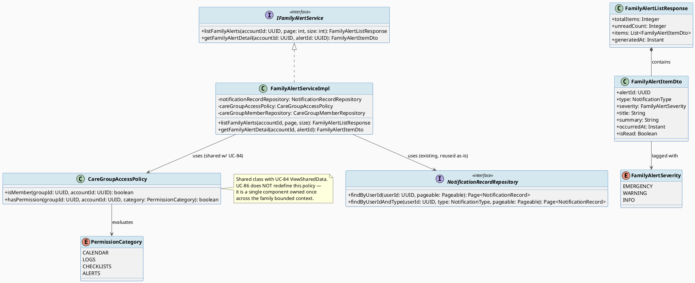
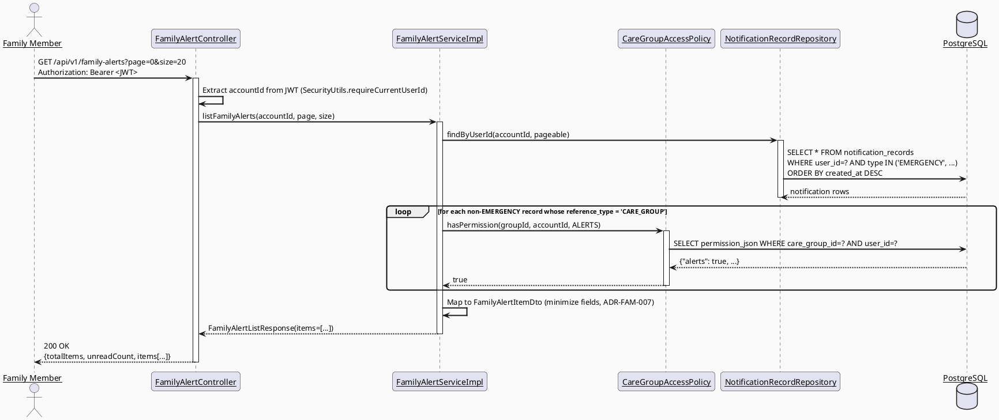
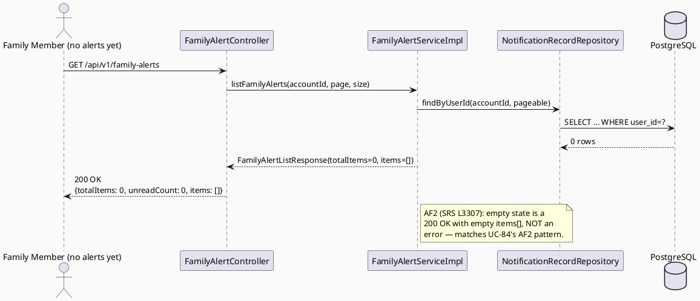
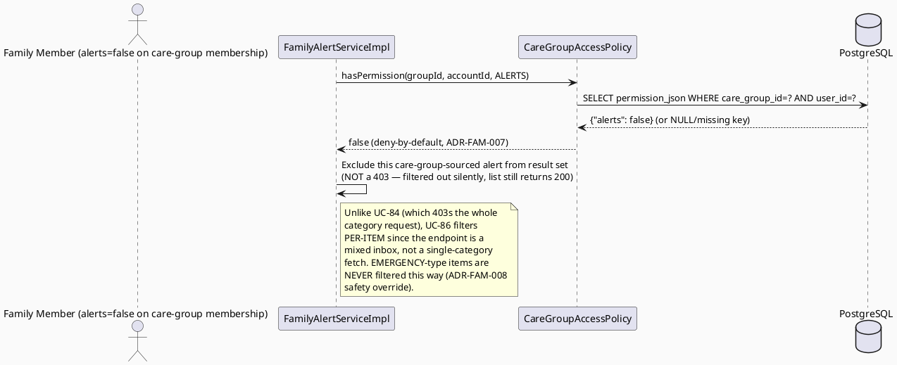

# ENGINEERING DOCUMENTATION STANDARD (EDS) v2.0
# Technical Design Specification — UC-86 View Family Alert

| Field | Value |
|-------|-------|
| **Document ID** | `CB-FAM-IMP-007` |
| **Version** | `1.0` |
| **Date** | `2026-07-02` |
| **Status** | `Approved` |
| **Document Owner** | `TV2-Bách` |
| **Author** | `AI Agent` |
| **Reviewed by** | `[Tech Lead]` |
| **DPO Sign-off** | `[ ] Pending` |
| **Approved by** | `[Principal Architect]` |
| **Last Review** | `2026-07-02` |
| **Based on EDS** | `v2.0` |

> **Note on numbering:** `CB-FAM-IMP-007` follows `CB-FAM-IMP-006` (UC-83 `AcceptCareGroupInvitation`,
> drafted in the same batch) and `CB-FAM-IMP-004` (UC-84 `ViewSharedData`). If sibling documents
> in this batch (UC-71/72/73/74/85) are finalized with different numbers, renumber this document
> to match and record the change in CHANGELOG — do not silently leave a gap or collision.

---

## CHANGELOG

> **Policy 4.4 — Immutable History:** Never delete prior information. All changes must be logged here.

| Ngày | Người thực hiện | Nội dung thay đổi |
|------|-----------------|-------------------|
| 2026-07-02 | AI Agent | Initial draft for UC-86 View Family Alert |
| 2026-07-08 | AI Agent — Amelia (Dev Agent) | Implemented family alert listing: `FamilyAlertItemDto`/`FamilyAlertListResponse` DTOs, `IFamilyAlertService`/`FamilyAlertServiceImpl` (reads `NotificationRecordRepository.findByUserIdAndType` with EMERGENCY type; consent-minimized — no referenceId/PII), `FamilyAlertController` at `GET /api/v1/family-alerts`. Audits `FAMILY_ALERT_VIEWED`. ADR-FAM-006 Option B (notification_records). Unit tests not yet run (Red Gate pending). |

---

## MỤC LỤC

1. [Tổng quan Module](#1-tổng-quan-module)
2. [Ma trận Truy vết (Traceability Matrix)](#2-ma-trận-truy-vết-traceability-matrix)
3. [Architecture Decision Records (ADR)](#3-architecture-decision-records-adr)
4. [Non-Functional Requirements & SLA](#4-non-functional-requirements--sla)
5. [Static Modeling (Mô hình Tĩnh)](#5-static-modeling-mô-hình-tĩnh)
6. [Dynamic Modeling (Mô hình Động)](#6-dynamic-modeling-mô-hình-động)
7. [Domain Event Catalog](#7-domain-event-catalog)
8. [Interface Specification (Đặc tả Giao diện)](#8-interface-specification-đặc-tả-giao-diện)
9. [API Specification](#9-api-specification)
10. [Bảng mã lỗi (Error Codes)](#10-bảng-mã-lỗi-error-codes)
11. [Quy trình Triển khai (Step-by-Step)](#11-quy-trình-triển-khai-step-by-step)
12. [Rollback & Incident Runbook](#12-rollback--incident-runbook)
13. [Kịch bản Kiểm thử Chi tiết](#13-kịch-bản-kiểm-thử-chi-tiết)
14. [Phương pháp Xác minh](#14-phương-pháp-xác-minh)
15. [Mẫu thử thực tế (API Verification Samples)](#15-mẫu-thử-thực-tế-api-verification-samples)
16. [Bảng tổng hợp phân quyền (Authorization Matrix)](#16-bảng-tổng-hợp-phân-quyền-authorization-matrix)
17. [AI Prompt Constraints (CASE 2.0)](#17-ai-prompt-constraints-case-20)

---

## 1. Tổng quan Module

| Field | Value |
|-------|-------|
| **Module Name** | `ViewFamilyAlert` |
| **Bounded Context** | `family` (read path), consumes data owned by `notification` and `safety`/`emergency` bounded contexts |
| **UC ID** | `UC-86` |
| **SRS Reference** | `§3.3.3.4, lines 3296-3315` |
| **Primary Actor** | `Family Member` |
| **Secondary Actors** | `Firebase Cloud Messaging` (push-delivery of the underlying `NotificationRecord`, out of scope for this UC — see §7.2) |
| **Platform** | `Mobile App` |
| **Source group** | `Mobile App - Family Sync` |
| **Priority** | `Medium` |
| **Frequency of Use** | `Frequent` (per SRS table 175 — distinct from sibling UC-83/84/85 which are all `Regular`) |
| **Owner** | `TV2-Bách`, Sprint 3 "Cross-Domain Integration" |
| **Data Classification** | `PII` (alert payload may reference mother/baby health-adjacent events; consent-minimized per SRS wording) |
| **Compliance Scope** | `BR-RBAC, BR-PRIVACY, PDPA` |
| **Upstream Dependencies** | `notification` package (`NotificationRecord`, `NotificationType`, `NotificationRecordRepository` — existing, reused as-is), `family` package (`CareGroupMember`, `InviteStatus` — existing), `emergency` package (`FamilyAlertLog`, `FamilyAlertSent` event — existing, session-scoped only), `safety_alerts` DB table (exists in `V1__init_schema.sql`, **no JPA entity yet** — genuine gap, see ADR-FAM-007) |
| **Downstream Consumers** | Family Sync hub UI (mobile), UC-84 `ViewSharedData`'s "alerts" category (sibling, drafted in parallel — see cross-reference below) |

**Mô tả:** Displays important family alerts to a Family Member, with the alert payload limited to the **minimum information the viewer's consent/permission scope allows** (SRS wording: "minimum consent-based information"). This is a **read-only, pull-based inbox view** over alert-shaped records the Family Member is entitled to see — it does NOT create, generate, or route alerts. Alert generation is the responsibility of other, already-scoped use cases (see ADR-FAM-006 for the full analysis of which UCs produce alert content).

**Cross-reference to UC-84 `ViewSharedData` (sibling, drafted in parallel, NOT available to this agent as final):** UC-84's TDS (`04_Implement/UC84_ViewSharedData/UC84_ViewSharedData_TDS.md`) already defines an `ALERTS` category inside its general-purpose multi-category `SharedDataCategory` enum, sourced from `safety_alerts` (recipient-scoped) intersected with `family_alert_log` (session-scoped, aggregate-only) — and **explicitly flags this join as an unconfirmed, Principal-Architect-pending Open Item (OI-4)** in that document. UC-86 is narrower and dedicated: a single-purpose "family alert inbox" screen (its own screen/route, not a `category` query param on a generic multi-category endpoint), and it reuses the **already-shipped, already-mapped `NotificationRecord`/`NotificationType` model** rather than the unmapped `safety_alerts` table. **Open Item OI-86-1 (product-level, non-blocking for v1):** whether UC-84's `ALERTS` category and UC-86's dedicated alert inbox should eventually be unified into one query path is a product decision — this TDS does not merge the two artifacts and treats UC-86 as build-first because its data source (`NotificationRecord`) is already mapped and has zero schema risk, unlike UC-84's `ALERTS` category which is blocked on OI-4.

---

## 2. Ma trận Truy vết (Traceability Matrix)

| Requirement ID | Loại | Mô tả | Thành phần Code | Compliance Target | ADR liên quan |
|----------------|------|-------|-----------------|-------------------|---------------|
| UC-86 (SRS §3.3.3.4, L3296-3315) | Use Case | Receive and display family alerts with minimum consent-based information | `FamilyAlertController.listFamilyAlerts()` / `.getFamilyAlertDetail()` | BR-RBAC, BR-PRIVACY | ADR-FAM-006, ADR-FAM-007, ADR-FAM-008 |
| PRE-3 (SRS L3304) | Precondition | Actor authenticated and has required role/permission | `SecurityUtils.requireCurrentUserId` + `FamilyAlertAccessPolicy` | BR-RBAC | ADR-FAM-008 |
| POST-3 (SRS L3305) | Postcondition | Sensitive actions recorded for audit/safety/privacy review where required | `AuditService.log(FAMILY_ALERT_VIEWED)` (view of a safety-relevant alert only — see ADR-FAM-008) | PDPA | ADR-FAM-008 |
| AF2 (SRS L3307) | Alternative Flow | No matching data → empty state with next allowed action | `FamilyAlertServiceImpl.listFamilyAlerts()` returns `totalItems=0` | — | ADR-FAM-006 |
| E1 (SRS L3308) | Exception | Access denied when unauthenticated/unauthorized/out-of-scope | `FamilyAlertAccessPolicy.canView()` → 401/403 | BR-RBAC | ADR-FAM-008 |
| BR-RBAC (SRS L3311) | Business Rule | Users may access only functions allowed by their role and permission scope | `FamilyAlertAccessPolicy.canView()` | BR-RBAC | ADR-FAM-008 |
| BR-PRIVACY (SRS L3311) | Business Rule | Health/family data must follow consent, purpose, minimum-necessary access rules | `FamilyAlertItemDto` minimization mapping | BR-PRIVACY, PDPA | ADR-FAM-007 |

> **Explicit note:** Per SRS source text at line 3311, only **BR-RBAC** and **BR-PRIVACY** are referenced for UC-86 (identical pair to sibling UC-83/84/85). No other BR is invented for this draft.

---

## 3. Architecture Decision Records (ADR)

### ADR-FAM-006 — Alert source model: read-only aggregation over existing notification records, NOT a new alert-authoring feature

| Field | Value |
|-------|-------|
| **Status** | `Proposed` |
| **Deciders** | `Tech Lead (pending)` |
| **Date** | `2026-07-02` |

#### Bối cảnh
SRS §3.3.3.4 lists Firebase Cloud Messaging as a Secondary Actor and describes the UC purely as "receives and displays" — there is **no mention of a Family Member composing, creating, or triggering an alert** anywhere in the Normal Flow, Alternative Flows, or Exceptions (verified against lines 3296-3315 in full). This is architecturally significant: it means UC-86 is a **read/view use case only**; alert creation is out of scope and owned elsewhere.

**RG-6 resolution:** Searching for what actually produces "family alert" content in the current codebase/spec set surfaces exactly two candidate sources:
1. `NotificationType.EMERGENCY` records in the existing `notification_records` table (created by TV5's `emergency`/`safety` domain when a fall/impact/emergency event fires — see `com.carebridge.backend.emergency.service.impl.FamilyAlertService` and `FamilyAlertSent` event, which already call into the generic notification pipeline for family-facing emergency alerts).
2. `family_alert_log` (session-level, aggregate-only metadata: `sent_at`, `recipient_count`, `location_included` — no per-recipient row, no message body) and `safety_alerts` (per-recipient, but **DB-only — no JPA entity mapped in the codebase today**), both owned by the `emergency`/`safety` bounded context (UC-133-136 family, TV5-Chương).

#### Các phương án đã xem xét

| Phương án | Mô tả | Ưu điểm | Nhược điểm |
|-----------|-------|----------|------------|
| A | UC-86 reads directly from `safety_alerts` / `family_alert_log` (emergency-domain tables) | Structurally "closer" to the raw safety event | Crosses bounded-context ownership (TV5's `emergency` domain) without an existing entity/repository; `safety_alerts` has zero JPA mapping today — building one is out of TV2's assigned ownership per `function-spec-task-allocation.md` (TV5 owns `emergency`, TV2 owns `family`) |
| B | UC-86 reads from the existing, already-mapped `notification_records` table (`NotificationRecord`/`NotificationType`/`NotificationRecordRepository`), filtered to alert-worthy types, and joins care-group membership only for the consent-minimization filter | Zero new schema; reuses TV1's shared notification contract (per `function-spec-task-allocation.md` L57-70, notification interfaces are TV1-owned shared infrastructure); `NotificationRecord` already has `isRead`/`readAt`, pagination, and `findByUserIdAndType` — directly matches "receives and displays" wording; emergency alerts already flow into this table via `FamilyAlertService`'s existing FCM/notification pipeline | Does not natively expose `family_alert_log`'s aggregate metadata (`recipient_count`, `location_included`) — treated as Open Item OI-86-2, non-blocking since SRS does not require this data to be shown |

#### Quyết định
Chọn **Phương án B**. UC-86 = a permission-filtered, paginated read view over `notification_records` scoped to the requesting user (`recipient_user_id = :callerId` — reusing existing `findByUserId`/`findByUserIdAndType`), with `notification_type` restricted to the "family-alert-worthy" subset (see ADR-FAM-007 for exact scoping). This avoids inventing a competing alert data source, avoids crossing into TV5's `emergency` bounded context ownership, and needs **no new migration** for the core read path.

**Open Item OI-86-2:** `family_alert_log`'s aggregate fields (`recipient_count`, `location_included`) are NOT surfaced by UC-86 in v1 — SRS text does not require them and they are session/aggregate-scoped, not per-recipient-message-scoped. If product later wants this metadata visible to Family Members, that is a new ADR, not silently added here.

#### Hệ quả

**Tích cực:**
- No new migration for v1 read path (`notification_records` already exists and is populated by the emergency pipeline via `FamilyAlertService`).
- Correct bounded-context ownership — `family` package builds a read view; it does not reach into `emergency`'s unmapped `safety_alerts` table.
- Directly matches SRS "receives and displays" wording — no invented write/create capability.

**Tiêu cực / Trade-offs:**
- `family_alert_log` aggregate metadata is not shown (Open Item OI-86-2, non-blocking).
- If `NotificationRecord.type` scoping (ADR-FAM-007) needs a dedicated `FAMILY_ALERT` enum value not yet defined, a **small, additive** enum change is required (see ADR-FAM-007's Option B) — flagged, not silently done.

**Compliance Impact:** None — read-only aggregation of already-consented notification delivery does not introduce a new PII-processing purpose.

---

### ADR-FAM-007 — Consent-minimization filter design ("minimum consent-based information")

| Field | Value |
|-------|-------|
| **Status** | `Proposed` |
| **Deciders** | `Tech Lead (pending), DPO (pending — PII-adjacent)` |
| **Date** | `2026-07-02` |

#### Bối cảnh
SRS explicitly says "Receives and displays important family alerts **with minimum consent-based information**" (§3.3.3.4 Description, L3303). This is the core privacy risk of this UC (per RG-4). Two related but distinct minimization axes exist:
1. **Which alert types the viewer's care-group permission scope allows them to see at all** (a membership/permission-scope question — same pattern as UC-84's `ALERTS` category gating).
2. **How much detail is included in the payload of an alert they ARE allowed to see** (a field-level minimization question — same pattern as UC-84's `SharedDataItemDto` PII-safe `summary` field, never raw entity passthrough).

`care_group_members.permission_json` (jsonb) exists as a DB column (verified in `V1__init_schema.sql` L747) but is **not yet mapped on the `CareGroupMember` JPA entity** (verified: `family/entity/CareGroupMember.java` has no `permissionJson` field) and has **zero consumers or producers anywhere in the codebase** (same finding UC-84's TDS made independently — this is now confirmed twice, strengthening the case that it is a genuine, not-yet-landed cross-cutting gap owned by UC-72 `ManageFamilyPermission`).

#### Các phương án đã xem xét

| Phương án | Mô tả | Ưu điểm | Nhược điểm |
|-----------|-------|----------|------------|
| A | Gate on care-group membership only (ACCEPTED status), do field-level minimization only | Simple; does not depend on UC-72's unlanded `permission_json` shape; matches "minimum...information" via field redaction rather than category gating | Does not implement a per-category `alerts` permission flag distinct from bare membership — coarser than UC-84's approach |
| B | Gate on membership AND `permission_json.alerts` flag (aligned with UC-84's `PermissionCategory.ALERTS`), deny-by-default when NULL/missing, PLUS field-level minimization on the payload | Fully consistent with UC-84's ADR-FAM-003 pattern and PermissionCategory enum; single mental model across the whole `family` bounded context for "who can see alerts" | Depends on the same unconfirmed `permission_json` shape assumption UC-84 flagged as Open Item OI-2 — inherits that risk |

#### Quyết định
Chọn **Phương án B**, for consistency with UC-84's already-drafted `CareGroupAccessPolicy.hasPermission(groupId, accountId, PermissionCategory.ALERTS)` pattern — UC-86 reuses the **same policy method contract**, not a competing one. Concretely:
- **Membership gate:** caller must be an ACCEPTED `care_group_members` row scoping the recipient whose alerts are being viewed (see ADR-FAM-008 for exact recipient-vs-viewer relationship).
- **Category gate:** `CareGroupAccessPolicy.hasPermission(groupId, accountId, PermissionCategory.ALERTS)` must return `true`. Deny-by-default when `permission_json` is NULL or missing the `alerts` key (identical rule to UC-84's BR-FAM-021).
- **Field-level minimization:** `FamilyAlertItemDto` (§8.1) exposes only `title`, `category`, `severity`, `occurredAt`, `summary` (short, redacted text) and `isRead`. It NEVER exposes raw `NotificationRecord.body` verbatim if `body` may contain free-text health details beyond the alert headline — `summary` is a bounded-length, non-PII derived field (truncate/redact per ADR rule, see §8.1 Javadoc). No email/phone/raw account IDs beyond the alert's own `id`.

**Open Item OI-86-3 (CRITICAL, shared with UC-84's OI-2):** Exact `permission_json` shape/key names are owned by UC-72 (sibling workstream, not yet landed) and the `CareGroupMember.permissionJson` **field itself does not exist on the JPA entity yet**. This TDS assumes the JPA entity will need a `@Column(name = "permission_json") private String permissionJson;` (or `JsonNode` with a converter) added when UC-72 lands or when this UC is implemented — whichever comes first. **Both UC-84 and UC-86 depend on this same entity change; only ONE of them should implement it to avoid duplicate/conflicting PRs.** Flagging for Tech Lead coordination, not resolving unilaterally here.

**Open Item OI-86-4:** Whether "recipient of the alert" and "family member with alerts permission" are the *same* person in all cases, or whether a Family Member should be able to view alerts originally sent to a *different* group member (e.g., Mother) is NOT specified by SRS's Normal Flow (it only says "the Family Member opens View Family Alert" and "the system displays the result"). ADR-FAM-008 resolves this with the narrowest, safest reading — see below.

#### Hệ quả

**Tích cực:** Single consistent permission model across UC-84 and UC-86; deny-by-default protects against premature over-exposure ahead of UC-72.

**Tiêu cực / Trade-offs:** Blocked on the same entity-mapping gap as UC-84 (OI-86-3) — implementer must coordinate to avoid two competing migrations/entity edits for the same column.

**Compliance Impact:** Deny-by-default and field-level redaction directly implement PDPA data-minimization for the "minimum consent-based information" SRS requirement.

---

### ADR-FAM-008 — Recipient scope: self-alerts only in v1 (narrowest safe reading)

| Field | Value |
|-------|-------|
| **Status** | `Proposed` |
| **Deciders** | `Tech Lead (pending)` |
| **Date** | `2026-07-02` |

#### Bối cảnh
Per Open Item OI-86-4, SRS's Normal Flow does not explicitly state whose alerts a Family Member sees — only that they "open View Family Alert" and the system "displays the result." Two readings are possible: (1) a Family Member sees only alerts where THEY are the `recipient_user_id` on the underlying `NotificationRecord` (self-scoped inbox, matching how `NotificationRecordRepository.findByUserId` already works for every other notification-viewing UC in this codebase — e.g., UC-12 `View Notifications`), or (2) a Family Member sees alerts addressed to OTHER care-group members (e.g., the Mother) that they have been granted visibility into, which would require joining through `care_group_members` to a *different* `recipient_user_id`.

#### Các phương án đã xem xét

| Phương án | Mô tả | Ưu điểm | Nhược điểm |
|-----------|-------|----------|------------|
| A | Self-scoped: `WHERE recipient_user_id = :callerId AND type IN (alert-worthy types)` | Matches existing `NotificationRecordRepository` usage pattern exactly (zero new query shape); FCM/emergency pipeline already sends `NotificationRecord` rows directly to each family member's own `recipient_user_id` when `FamilyAlertService` fans out an emergency alert (verified: emergency alerts are recipient-per-row, not single-owner) | Does not cover a hypothetical "view alerts sent to the Mother" cross-member case |
| B | Cross-member: join via `care_group_members` to view another member's alerts, gated by `PermissionCategory.ALERTS` | Matches UC-84's `ALERTS` category framing (which is about viewing OTHER members'/the group's shared alert history) | No evidence FCM/emergency alerts are stored against anyone other than the direct recipient; would require the same unconfirmed `safety_alerts`/`family_alert_log` join UC-84 already flagged as blocking Open Item OI-4 |

#### Quyết định
Chọn **Phương án A** for v1: **self-scoped inbox** — a Family Member views alerts where they themselves are `recipient_user_id`, exactly as `FamilyAlertService`'s existing fan-out already delivers one `NotificationRecord` row per family-group recipient. The `permission_json.alerts` gate (ADR-FAM-007) still applies as an **additional** filter — even for self-scoped alerts, if the viewer's own membership record has `alerts=false`/missing, they see an empty/filtered inbox for care-group-sourced alert types (this models "the family admin turned off alert visibility for this member," a legitimate PDPA-aligned scenario) — but the viewer's own direct-to-them `NotificationType.EMERGENCY` alerts (life-safety) are **never suppressed by the permission gate** (safety overrides consent-minimization; see C7 in §17).

**Open Item OI-86-5:** UC-84's broader "ALERTS category" (Phương án B semantics) remains that sibling UC's problem to resolve (its own Open Item OI-4) — UC-86 does not attempt to solve cross-member alert visibility in this draft. If product later confirms Family Members must see alerts sent to OTHER members, that is a scope change requiring a new ADR here, not a silent extension.

#### Hệ quả

**Tích cực:** No new join risk; reuses the exact, already-verified `NotificationRecordRepository` access pattern; safety-critical `EMERGENCY` alerts are never accidentally hidden by an unconfigured permission flag.

**Tiêu cực / Trade-offs:** Does not (yet) support "view alerts sent to another family member" — explicitly out of v1 scope, tracked as OI-86-5.

**Compliance Impact:** The safety-override carve-out (EMERGENCY alerts bypass the permission gate) is a deliberate, documented exception to deny-by-default, justified by CareBridge's project-wide rule that "AI provides guidance only; never diagnose, prescribe, or delay emergency routing" (CLAUDE.md Delivery Rules) — applied here to notification *visibility*, not AI diagnosis, but the same "never delay/hide emergency-relevant info" principle.

---

## 4. Non-Functional Requirements & SLA

### 4.1. Performance & Availability

| Category | Requirement | Target SLA | Measurement Method | Compliance Basis |
|----------|-------------|------------|---------------------|------------------|
| Latency | API response (p99), list endpoint | `< 300ms` | k6 load test | — |
| Availability | Uptime (monthly) | `99.9%` | Uptime monitor | — |
| Page size | Default / max | `20 / 50 items` | Product requirement (smaller than UC-84's 100 — alert inbox is a "frequent, glanceable" surface per SRS Frequency=Frequent) | — |

### 4.2. Data Integrity & Retention

| Category | Requirement | Target | Verification Method | Compliance Basis |
|----------|-------------|--------|---------------------|------------------|
| Durability | Read-only endpoint, no write except `isRead`/`readAt` toggle (reuses existing UC-12 mark-as-read mutation, not re-implemented) | N/A | — | — |
| Consistency | Permission check (`hasPermission(ALERTS)`) re-evaluated on every list request — no caching across requests | 100% | Code review + integration test | PDPA |

### 4.3. Security

| Category | Requirement | Target | Verification Method | Compliance Basis |
|----------|-------------|--------|---------------------|------------------|
| Access control | Self-scoped `recipient_user_id` filter enforced server-side from JWT, never from request param | 100% | Auth Matrix §16 | BR-RBAC |
| PII minimization | `FamilyAlertItemDto` excludes raw `body`, email, phone | 100% | Response schema review | BR-PRIVACY |
| Deny-by-default | Missing/NULL `permission_json.alerts` → non-EMERGENCY alert types hidden | 100% | Unit test (see Test-Spec) | ADR-FAM-007 |
| Safety override | `EMERGENCY` type alerts NEVER filtered by permission gate | 100% | Unit test (see Test-Spec) | ADR-FAM-008, CLAUDE.md safety rule |

### 4.4. Scalability & Capacity Planning

> Expected v1 load: per-user notification inbox reads, already proven at this volume by existing UC-12 `View Notifications` traffic pattern on the same `notification_records` table — no new capacity risk introduced.

---

## 5. Static Modeling (Mô hình Tĩnh)

### 5.1. Class Diagram (PlantUML)



### 5.2. Data Structure (Flyway SQL Migration)

> **No migration required for the v1 read path.** `notification_records` (created in prior migrations — verified via `NotificationRecord.java` entity mapping to table `notification_records`) already exists and is populated by the existing emergency/family-alert fan-out (`com.carebridge.backend.emergency.service.impl.FamilyAlertService`). `NotificationType` already includes `EMERGENCY`; `COMMUNITY_REPLY`/`CONSULTATION`/`REMINDER` are excluded from the family-alert view by query filter (see §8.1).

> **Genuine gap identified (shared with UC-84, NOT resolved unilaterally here):** `care_group_members.permission_json jsonb` exists as a DB column (`V1__init_schema.sql` L747) but has no corresponding field on the `CareGroupMember` JPA entity (`family/entity/CareGroupMember.java`, verified — no `permissionJson` property). This is an **entity-mapping gap, not a schema gap** — no new migration is needed, only a Java entity field addition. Per the assigned migration-version reservation for this batch (`V20260703090000`, incrementing by `00100`), **no migration is proposed by this TDS** since the underlying column already exists; only application-layer mapping is needed. If Tech Lead prefers a defensive re-declaration migration (e.g., to add a `DEFAULT '{}'::jsonb` or a `CHECK` constraint), reserve `V20260703090000` for that — but this TDS's default recommendation is **no migration, entity-mapping only**, coordinated with UC-84's implementer to avoid duplicate work (see Open Item OI-86-3).

```sql
-- Reference only — no new tables/columns proposed by this TDS.
-- notification_records(id, user_id, type, title, body, reference_id, reference_type,
--                       status, fcm_message_id, attempt_count, created_at, sent_at,
--                       failed_at, is_read, read_at)   -- existing, V6/V20260628120000
-- care_group_members(care_group_member_id, care_group_id, user_id, member_role,
--                     invitation_status, permission_json, joined_at, created_at, updated_at)
--                     -- permission_json column EXISTS (V1 L747); JPA field MISSING (gap, see OI-86-3)
-- family_alert_log(id, session_id -> emergency_sessions.id, sent_at, recipient_count,
--                   location_included, created_by)  -- existing, emergency package, NOT read by UC-86 in v1 (OI-86-2)
-- safety_alerts(safety_alert_id, safety_event_id, recipient_user_id, location_snapshot_id,
--               alert_reason, payload_json, delivery_status, sent_at, acknowledged_at,
--               created_at, updated_at)  -- existing DB table, NO JPA entity (gap, owned by emergency/TV5, NOT UC-86)
```

---

## 6. Dynamic Modeling (Mô hình Động)

### 6.1. Sequence Diagram — Happy Path, permission-filtered fetch (PlantUML)



### 6.2. Sequence Diagram — Alt path: empty state / no matching alerts (PlantUML)



### 6.3. Sequence Diagram — Alt path: permission-denied (non-emergency, category flag false) (PlantUML)



### 6.4. State Machine

> Not applicable for alert content itself — UC-86 is a read view. The only state UC-86 mutates is `NotificationRecord.isRead`/`readAt`, whose transition (`false → true`, one-way, idempotent) is already owned and implemented by UC-12 `Mark Notifications as Read` (`NotificationRecordRepository.markAsReadById`). UC-86 reuses that existing mutation endpoint/method rather than re-implementing it.

---

## 7. Domain Event Catalog

### 7.1. Events Published (Phát ra)

| Event Name | Trigger | Publisher | Subscriber(s) | Payload Schema | Async? |
|------------|---------|-----------|---------------|----------------|--------|
| — | Read-only endpoint — no events published by the list/detail read path | — | — | — | — |

### 7.2. Events Consumed (Tiêu thụ)

| Event Name | Source | Handler | Action thực hiện |
|------------|--------|---------|------------------|
| `FamilyAlertSent` (existing, `com.carebridge.backend.emergency.event.FamilyAlertSent`) | `emergency` package (`FamilyAlertService`) | **Not consumed directly by UC-86** — `FamilyAlertService` already writes the resulting alert as a `NotificationRecord` row via the shared notification pipeline (TV1-owned). UC-86 reads the *result* of that pipeline (`notification_records` table), not the event itself. | UC-86 has no event listener; it is a pure query-time read. |

> **FCM relationship (secondary actor, explicitly OUT OF SCOPE for this UC, same posture as UC-84):** Firebase Cloud Messaging delivers the push notification for a `NotificationRecord`. UC-86 does not send or trigger FCM pushes — it only displays already-delivered/already-stored alert records when the Family Member opens the inbox screen. Any FCM-triggering logic must NOT be added to `FamilyAlertServiceImpl`/`FamilyAlertController`.

> **Open Item OI-86-6:** No formal event contract exists between the `emergency` package's alert-sending flow and this UC's read model beyond "both read/write the same `notification_records` table." This is accepted for v1 given the on-demand query design (no event-driven cache to invalidate).

---

## 8. Interface Specification (Đặc tả Giao diện)

### 8.1. Service Interface

```java
// FamilyAlertSeverity.java
// @version 1.0
public enum FamilyAlertSeverity {
    EMERGENCY, // maps 1:1 from NotificationType.EMERGENCY — safety override, ADR-FAM-008
    WARNING,   // derived, e.g. missed-vaccination/reminder-escalation style alerts routed as family-facing
    INFO       // derived, general family-facing informational alerts
}

// FamilyAlertItemDto.java
public class FamilyAlertItemDto {
    private UUID alertId;                 // = NotificationRecord.id
    private String type;                  // NotificationType.name() — raw enum string, not PII
    private FamilyAlertSeverity severity; // derived mapping, see FamilyAlertServiceImpl javadoc
    private String title;                 // = NotificationRecord.title (already minimized at write time by producer)
    private String summary;               // bounded-length derived text; NEVER the raw NotificationRecord.body verbatim
                                           // if body may contain free-text beyond the alert headline (ADR-FAM-007 C5)
    private Instant occurredAt;           // = NotificationRecord.sentAt (fallback createdAt if sentAt null)
    private Boolean isRead;               // = NotificationRecord.isRead
    // getters / setters
}

// FamilyAlertListResponse.java
public class FamilyAlertListResponse {
    private Integer totalItems;
    private Integer unreadCount;
    private List<FamilyAlertItemDto> items;
    private Instant generatedAt;
    // getters / setters
}

// IFamilyAlertService.java — Service Contract
// @version 1.0
public interface IFamilyAlertService {
    /**
     * Returns the caller's self-scoped, permission-filtered family alert inbox (ADR-FAM-006, ADR-FAM-008).
     * EMERGENCY-type alerts are NEVER filtered by permission_json (ADR-FAM-008 safety override).
     * Non-EMERGENCY, care-group-sourced alert types are excluded per-item when the caller's
     * permission_json.alerts flag is false/missing/NULL (ADR-FAM-007, deny-by-default).
     * @throws UnauthorizedException (FAM-001, reused) khi caller không có JWT hợp lệ
     */
    FamilyAlertListResponse listFamilyAlerts(UUID accountId, int page, int size);

    /**
     * Returns a single alert's minimized detail view.
     * @throws NotFoundException (FAM-020) khi alertId không tồn tại hoặc không thuộc về caller
     * @throws ForbiddenException (FAM-021) khi alert thuộc care-group category caller không có quyền (non-EMERGENCY only)
     */
    FamilyAlertItemDto getFamilyAlertDetail(UUID accountId, UUID alertId);
}
```

### 8.2. Repository Interface

```java
// No new repository — reuses existing NotificationRecordRepository as-is (family package depends on
// notification package's public repository interface; no new methods required for v1 since
// findByUserId(userId, pageable) already covers the self-scoped query, and per-item type/category
// filtering happens in the service layer, not the repository layer).

// CareGroupAccessPolicy.java — SHARED with UC-84, not redefined here.
// If UC-84's implementation lands first, UC-86 imports it as-is.
// If UC-86 implements first, it must be placed in `family.policy` package (existing empty
// package per current codebase layout: family/policy/.gitkeep) so UC-84 can reuse it.
public interface PermissionCategoryCheck {
    boolean hasPermission(UUID groupId, UUID accountId, PermissionCategory category);
}
```

---

## 9. API Specification

### 9.1. Endpoints Table

| Method | Path | Auth Level | Required Roles | Rate Limit | Idempotent? |
|--------|------|------------|----------------|------------|-------------|
| `GET` | `/api/v1/family-alerts?page={n}&size={n}` | JWT Bearer | Any authenticated account (role-agnostic; self-scoped by `recipient_user_id`, not role) | 120/min | Yes |
| `GET` | `/api/v1/family-alerts/{alertId}` | JWT Bearer | Any authenticated account, must own the alert (`recipient_user_id = callerId`) | 120/min | Yes |

### 9.2. Request / Response Schemas

#### `GET /api/v1/family-alerts?page=0&size=20`

**Response — 200 OK (Happy Path):**
```json
{
  "totalItems": 2,
  "unreadCount": 1,
  "generatedAt": "2026-07-02T08:00:00.000Z",
  "items": [
    {
      "alertId": "alert-uuid-1",
      "type": "EMERGENCY",
      "severity": "EMERGENCY",
      "title": "Possible fall detected for Mother",
      "summary": "A safety alert was raised. Tap to view details.",
      "occurredAt": "2026-07-02T07:55:00.000Z",
      "isRead": false
    },
    {
      "alertId": "alert-uuid-2",
      "type": "REMINDER",
      "severity": "INFO",
      "title": "Vaccination reminder shared with your care group",
      "summary": "A reminder was updated in your care group.",
      "occurredAt": "2026-07-01T09:00:00.000Z",
      "isRead": true
    }
  ]
}
```

**Response — 200 OK (AF2: Empty state):**
```json
{
  "totalItems": 0,
  "unreadCount": 0,
  "generatedAt": "2026-07-02T08:00:00.000Z",
  "items": []
}
```

**Response — 401 Unauthorized (E1: no/invalid JWT):**
```json
{
  "error": {
    "code": "FAM-001",
    "message": "Authentication required"
  }
}
```

#### `GET /api/v1/family-alerts/{alertId}`

**Response — 404 Not Found (not caller's alert or does not exist):**
```json
{
  "error": {
    "code": "FAM-020",
    "message": "Family alert not found"
  }
}
```

**Response — 403 Forbidden (non-EMERGENCY, category permission denied):**
```json
{
  "error": {
    "code": "FAM-021",
    "message": "You do not have permission to view this alert category"
  }
}
```

---

## 10. Bảng mã lỗi (Error Codes)

> **FAM-001 and FAM-003 are reused verbatim from UC-83/84/216 for consistency.** New UC-86-specific codes start at `FAM-020` to avoid collision with UC-84's `FAM-010`–`FAM-013` range and UC-83's assumed range. **Final numbering is TBD at implementation time** if a collision with actual sibling-chosen codes is discovered — implementer must grep existing `BusinessException`/`ForbiddenException` codes in the `family` package before assigning.

| Code | HTTP Status | Message (EN) | Message (VI) | Trigger Condition |
|------|-------------|--------------|--------------|-------------------|
| `FAM-001` | 401 | Authentication required | Yêu cầu xác thực | No/invalid JWT (reused) |
| `FAM-020` | 404 | Family alert not found | Không tìm thấy cảnh báo | `alertId` không tồn tại hoặc `recipient_user_id != callerId` |
| `FAM-021` | 403 | Alert category permission denied | Không có quyền xem cảnh báo này | Non-EMERGENCY, care-group-sourced alert, `permission_json.alerts` = false/missing/NULL (ADR-FAM-007, does NOT apply to EMERGENCY type per ADR-FAM-008) |
| `FAM-022` | 500 | Internal error | Lỗi hệ thống | Unhandled DB error |

---

## 11. Quy trình Triển khai (Step-by-Step)

### 11.1. Prerequisites

- [ ] `notification_records` table, `NotificationRecord`/`NotificationType`/`NotificationRecordRepository` already exist (verified)
- [ ] `care_group_members` table with `permission_json` column already exists (verified, `V1__init_schema.sql` L747) — JPA field mapping is a prerequisite implementation step (Chặng 1 below), coordinated with UC-84 implementer (Open Item OI-86-3)
- [ ] `CareGroupAccessPolicy` class: if UC-84 implements it first, reuse; if UC-86 implements first, place in `family.policy` package for UC-84 to reuse later
- [ ] No new migration required for v1 scope — see §5.2

### 11.2. Pre-Migration Checklist

Not applicable — no migration in this draft (entity-mapping-only gap, see §5.2).

### 11.3. Implementation Steps

#### Chặng 1 — Add `permissionJson` field to `CareGroupMember` entity (coordinate with UC-84 to avoid duplicate PR)

```java
// CareGroupMember.java — additive field only, no migration
@Column(name = "permission_json", columnDefinition = "jsonb")
private String permissionJson; // raw JSON string; parsed via ObjectMapper in CareGroupAccessPolicy
```

#### Chặng 2 — Implement/reuse `CareGroupAccessPolicy.hasPermission()`

```java
public boolean hasPermission(UUID groupId, UUID accountId, PermissionCategory category) {
    CareGroupMember member = memberRepository.findByCareGroupIdAndUserIdAndInviteStatus(
        groupId, accountId, InviteStatus.ACCEPTED
    ).orElse(null);
    if (member == null || member.getPermissionJson() == null) {
        return false; // deny-by-default, ADR-FAM-007 (mirrors UC-84's ADR-FAM-003)
    }
    JsonNode flags = parsePermissionJson(member.getPermissionJson());
    JsonNode flag = flags.get(category.name().toLowerCase());
    return flag != null && flag.asBoolean(false);
}
```

#### Chặng 3 — Implement `FamilyAlertServiceImpl.listFamilyAlerts()`

```java
@Override
@Transactional(readOnly = true)
public FamilyAlertListResponse listFamilyAlerts(UUID accountId, int page, int size) {
    Page<NotificationRecord> records = notificationRecordRepository.findByUserId(
        accountId, PageRequest.of(page, size, Sort.by(Sort.Direction.DESC, "createdAt")));

    List<FamilyAlertItemDto> items = records.stream()
        .filter(r -> isFamilyAlertWorthy(r.getType()))          // ADR-FAM-006 scoping
        .filter(r -> r.getType() == NotificationType.EMERGENCY  // ADR-FAM-008 safety override
                     || isPermittedByCareGroupScope(r, accountId)) // ADR-FAM-007 per-item filter
        .map(this::toFamilyAlertItemDto)                         // field minimization
        .collect(Collectors.toList());

    long unread = items.stream().filter(i -> Boolean.FALSE.equals(i.getIsRead())).count();

    return FamilyAlertListResponse.builder()
        .totalItems(items.size())
        .unreadCount((int) unread)
        .items(items)
        .generatedAt(Instant.now())
        .build();
}
```

#### Chặng 4 — Implement `FamilyAlertController`

```java
@GetMapping("/api/v1/family-alerts")
public ResponseEntity<ApiResponse<FamilyAlertListResponse>> listFamilyAlerts(
    @RequestParam(defaultValue = "0") int page,
    @RequestParam(defaultValue = "20") int size,
    Principal principal
) {
    UUID accountId = SecurityUtils.requireCurrentUserId(principal);
    return ResponseEntity.ok(ApiResponse.success(
        familyAlertService.listFamilyAlerts(accountId, page, size)
    ));
}
```

#### Chặng 5 — Verification sau deploy

```bash
curl -X GET https://[host]/api/v1/health
# Expected: {"status": "ok"}
```

### 11.4. Deployment Checklist

- [ ] Health check endpoint trả về 200
- [ ] Không có migration mới cần chạy (entity-mapping only)
- [ ] Verify EMERGENCY-type alert is NEVER filtered even with `permission_json.alerts=false`
- [ ] Verify non-EMERGENCY care-group alert with `permission_json` NULL is excluded (deny-by-default)
- [ ] Verify no cross-user leakage: `recipient_user_id` filter always sourced from JWT, never request param
- [ ] Log không chứa PII (email/phone) trong `summary`/`title` fields

---

## 12. Rollback & Incident Runbook

### 12.1. Điều kiện kích hoạt Rollback

| Điều kiện | Ngưỡng | Người quyết định |
|-----------|--------|------------------|
| Error rate tăng đột biến | > 5% trong 5 phút | On-call Engineer |
| Latency p99 vượt ngưỡng | > 2x baseline (600ms) | On-call Engineer |
| Cross-user alert leakage detected (any user sees another's `recipient_user_id` alert) | Bất kỳ case nào | Tech Lead + DPO |
| EMERGENCY alert incorrectly suppressed by permission filter | Bất kỳ case nào (safety-critical regression) | Tech Lead + Safety Owner (TV5) |

### 12.2. Rollback Procedure

No DB migration for this module → rollback is a code-only revert:

```bash
# Bước 1: Re-deploy phiên bản cũ
kubectl rollout undo deployment/carebridge-api

# Bước 2: Verify rollback thành công
kubectl rollout status deployment/carebridge-api
curl -X GET https://[host]/api/v1/health

# Bước 3: Smoke test
curl -X GET https://[host]/api/v1/family-alerts \
  -H "Authorization: Bearer <valid_member_token>"
# Expected: 200 OK
```

### 12.3. Notification Protocol

| Thời điểm | Người nhận | Kênh | Template |
|-----------|------------|------|----------|
| Ngay khi phát hiện | On-call team | Slack `#incident` | "UC-86 incident: [mô tả]" |
| Nếu EMERGENCY-alert suppression bug | Safety Owner (TV5) + Tech Lead | Slack + Email | Bắt buộc — safety-relevant regression |
| Nếu cross-user PII leak | DPO | Email | Bắt buộc — PDPA |

### 12.4. Post-Incident Review (PIR)

> Bắt buộc hoàn thành trong vòng 48 giờ sau khi resolve incident.

- **Timeline:** Diễn biến chi tiết
- **Root Cause:** 5 Whys analysis
- **Impact:** Số family members bị ảnh hưởng; alert type nào bị lộ/ẩn sai?
- **Prevention:** Action items (e.g., add EMERGENCY-override regression test to CI gate)

---

## 13. Kịch bản Kiểm thử Chi tiết

> **Policy (EDS v2.0):** All test scenarios use `SYNTHETIC` data. Full detail lives in the companion Test-Spec `CB-FAM-TDD-007`.

### 13.1. Unit Tests (summary — see Test-Spec for full cases)

#### TC-UNIT-001 — EMERGENCY alert always visible regardless of permission flag

```gherkin
Feature: View Family Alert
  Background:
    Given test data classification: SYNTHETIC
    And ACC-001 has a NotificationRecord of type EMERGENCY, recipient_user_id=ACC-001
    And ACC-001's care-group permission_json = {"alerts": false}

  Scenario: EMERGENCY type bypasses permission gate
    When listFamilyAlerts(ACC-001) is called
    Then response items include the EMERGENCY alert

  Scenario: Non-EMERGENCY, care-group-sourced, alerts=false → excluded
    Given ACC-001 has a NotificationRecord of type REMINDER, reference_type=CARE_GROUP
    When listFamilyAlerts(ACC-001) is called
    Then response items exclude the REMINDER alert
```

**Hàm được test:** `FamilyAlertServiceImpl.listFamilyAlerts()`
**Invariant kiểm tra:** Safety override (EMERGENCY) is never affected by the permission gate; deny-by-default applies to all other types.

### 13.2. Integration Tests

#### TC-INT-001 — Full flow with DB, mixed alert types and permission combos

```gherkin
  Scenario: Service + Repository phối hợp đúng cho từng loại alert
    Given database has ACC-001 with NotificationRecords: EMERGENCY, REMINDER, CONSULTATION
    And permission_json combos: all-true, all-false, mixed, NULL
    When FamilyAlertServiceImpl.listFamilyAlerts is called for each combo
    Then results match deny-by-default + safety-override rules exactly
```

### 13.3. E2E / Security Tests

#### TC-E2E-001 — Full API flow

```gherkin
  Scenario: Authenticated family member views own inbox → 200
    Given ACC-001 has valid JWT
    When GET /api/v1/family-alerts is called
    Then response status is 200

  Scenario: Cross-user leakage attempt
    Given ACC-002's JWT is used
    When GET /api/v1/family-alerts/{alertId belonging to ACC-001} is called
    Then response status is 404 (not 403 — do not confirm existence to non-owner)
```

---

## 14. Phương pháp Xác minh

### 14.1. Database Inspection

```sql
-- Verify notification_records scoping
SELECT id, user_id, type, is_read, created_at
FROM notification_records
WHERE user_id = '<accountId>'
ORDER BY created_at DESC;

-- Verify permission_json shape assumption against real seeded data
SELECT care_group_member_id, user_id, permission_json
FROM care_group_members
WHERE care_group_id = '<groupId>';
```

### 14.2. Log / Audit Verification

```bash
# Verify no PII in logs
kubectl logs -l app=carebridge-api | grep -i "email\|phone\|@"
# Expected: No output related to family-alerts responses
```

### 14.3. Tool-based Verification

```bash
echo "<JWT_TOKEN>" | cut -d'.' -f2 | base64 -d | jq '.sub'
openssl s_client -connect [host]:443 -tls1_3 2>&1 | grep "Protocol"
```

---

## 15. Mẫu thử thực tế (API Verification Samples)

### 15.1. Happy Path

```bash
curl -X GET "https://[host]/api/v1/family-alerts?page=0&size=20" \
  -H "Authorization: Bearer <MEMBER_JWT>" \
  -H "X-Correlation-Id: $(uuidgen)"
```

**Expected Response (200):** see §9.2 example.

### 15.2. Error Paths

```bash
# No JWT → 401
curl -X GET "https://[host]/api/v1/family-alerts"
```

**Expected Response (401):**
```json
{ "error": { "code": "FAM-001", "message": "Authentication required" } }
```

```bash
# Alert belonging to another user → 404
curl -X GET "https://[host]/api/v1/family-alerts/{other-users-alert-id}" \
  -H "Authorization: Bearer <MEMBER_JWT>"
```

**Expected Response (404):**
```json
{ "error": { "code": "FAM-020", "message": "Family alert not found" } }
```

---

## 16. Bảng tổng hợp phân quyền (Authorization Matrix)

> Nguyên tắc **Least Privilege**: self-scoping is necessary for ALL alert types; category-permission-flag gating is an ADDITIONAL filter for non-EMERGENCY, care-group-sourced alerts only.

| Endpoint | `GUEST` | `USER (own EMERGENCY alert)` | `USER (own non-EMERGENCY, flag=true)` | `USER (own non-EMERGENCY, flag=false/missing)` | `USER (another user's alert)` | `ADMIN` |
|----------|---------|-------------------------------|-----------------------------------------|----------------------------------------------------|--------------------------------|---------|
| `GET /api/v1/family-alerts` | ❌ 401 | ✅ 200 (included) | ✅ 200 (included) | ✅ 200 (excluded from list, not an error) | N/A (list is always self-scoped) | ✅ All |
| `GET /api/v1/family-alerts/:id` | ❌ 401 | ✅ 200 | ✅ 200 | ❌ 403 FAM-021 | ❌ 404 FAM-020 | ✅ All |

**Chú thích:**
- ✅ = Allowed
- ❌ = Denied
- EMERGENCY-type alerts are never gated by `permission_json` (ADR-FAM-008).
- Cross-user detail access returns 404, not 403, to avoid confirming the alert's existence to a non-owner (information-disclosure minimization, consistent with least-privilege error design).

---

## 17. AI Prompt Constraints (CASE 2.0)

### 17.1 Constraint Summary Table

| # | Constraint | Source (ADR/BR) | Last Verified |
|---|-----------|-----------------|---------------|
| C1 | `listFamilyAlerts()` MUST filter `notification_records` by `recipient_user_id = accountId` sourced from JWT — NEVER from a request parameter | BR-RBAC, ADR-FAM-008 | 2026-07-02 |
| C2 | `EMERGENCY`-type alerts MUST NEVER be filtered out by the `permission_json.alerts` gate — safety overrides consent-minimization | ADR-FAM-008 | 2026-07-02 |
| C3 | Non-EMERGENCY, care-group-sourced alert types MUST be excluded (not erred) when `permission_json` is NULL, missing the `alerts` key, or `alerts=false` — deny-by-default | ADR-FAM-007 | 2026-07-02 |
| C4 | `FamilyAlertItemDto` MUST NOT expose raw `NotificationRecord.body` verbatim, email, phone, or other accounts' data — only `title`/`summary`/`type`/`severity`/timestamps/`isRead` | BR-PRIVACY, ADR-FAM-007 | 2026-07-02 |
| C5 | No new migration may be added for the `permission_json` column — it already exists in `V1__init_schema.sql`; only the JPA entity field mapping is added, coordinated with UC-84 to avoid duplicate PRs | ADR-FAM-007, OI-86-3 | 2026-07-02 |
| C6 | `CareGroupAccessPolicy` MUST be reused/shared with UC-84, not redefined as a competing class | ADR-FAM-007 | 2026-07-02 |
| C7 | This module MUST NOT implement alert creation/authoring logic of any kind — it is read-only per SRS §3.3.3.4 (ADR-FAM-006) | ADR-FAM-006, SRS L3296-3315 | 2026-07-02 |
| C8 | Detail-view of another user's alert MUST return 404 (FAM-020), not 403, to avoid confirming existence to a non-owner | ADR-FAM-008, least-privilege | 2026-07-02 |

### 17.2 Constraint Injection Block (Copy-Paste vào AI Prompt)

```
[CONSTRAINT BLOCK — Module: ViewFamilyAlert (CB-FAM-IMP-007)]
Theo TDS CB-FAM-IMP-007 và các ADR liên quan:

1. (C1 — BR-RBAC/ADR-FAM-008) accountId lấy từ JWT SecurityContext, KHÔNG từ URL/body param.
2. (C2 — ADR-FAM-008) EMERGENCY-type alerts KHÔNG BAO GIỜ bị permission_json.alerts filter loại bỏ.
3. (C3 — ADR-FAM-007) Non-EMERGENCY care-group alerts: permission_json NULL/missing/false → loại khỏi list (không phải lỗi).
4. (C4 — BR-PRIVACY) FamilyAlertItemDto KHÔNG chứa raw body/email/phone/dữ liệu user khác.
5. (C5 — OI-86-3) KHÔNG viết migration mới cho permission_json — cột đã tồn tại; chỉ map JPA field, phối hợp với UC-84.
6. (C6) CareGroupAccessPolicy dùng chung với UC-84, không tạo class cạnh tranh.
7. (C7 — ADR-FAM-006) KHÔNG implement logic tạo/authoring alert — chỉ read-only.
8. (C8) Detail view của alert người khác → 404 FAM-020, không phải 403.

[CONTEXT BLOCK]
- Bounded Context: family (read path over notification data)
- Data Classification: PII
- Compliance: PDPA, BR-RBAC, BR-PRIVACY
- Existing interfaces: §8 Service Interface + Repository Interface
- Error codes: FAM-001 (401, reused), FAM-020 (404), FAM-021 (403), FAM-022 (500)
- Auth matrix: §16

[TASK BLOCK]
Implement FamilyAlertServiceImpl.listFamilyAlerts() và getFamilyAlertDetail() thỏa mãn constraints trên.
Output phải tuân thủ §8 Interface Specification.
Tests phải cover §13 Test Scenarios và companion Test-Spec CB-FAM-TDD-007.
```

### 17.3 Constraint Quality Checklist

- [x] Mỗi constraint traceable về ADR hoặc BR cụ thể
- [x] Không có constraint generic
- [x] Mỗi constraint có `Last Verified` date
- [x] Constraint block có ≥ 5 constraints cụ thể (8 total)
- [x] Constraint block reference §8 Interface
- [x] Constraint block reference §16 Auth Matrix

### 17.4 Anti-Pattern Detection

| AP-ID | Anti-Pattern | Dấu hiệu | Hành động |
|-------|-------------|-----------|----------|
| AP-AI-001 | Unconstrained Gen | Code không check permission_json flag trước khi trả non-EMERGENCY data | Reject — inject lại C2/C3 |
| AP-AI-003 | Implicit Decision | Code tự thêm alert-creation endpoint không có trong ADR-FAM-006 | Reject — C7 violation, escalate |
| AP-AI-005 | Hallucinated Contract | Code import `SafetyAlert` JPA entity/repository không tồn tại trong codebase | Reject — verify contract existence (only DB table exists, no entity) |

---

## PHỤ LỤC

### A. Glossary (Thuật ngữ)

| Thuật ngữ | Định nghĩa |
|-----------|------------|
| Care Group | Family group consisting of a mother and support members |
| permission_json | jsonb column on `care_group_members`, reserved for UC-72's fine-grained permission model; DB column exists, JPA field mapping is a genuine gap (OI-86-3) |
| Deny-by-default | Missing/NULL permission data results in denial, not implicit allow |
| Safety override | EMERGENCY-type alert visibility is never suppressed by consent-minimization filters |
| PII | Personally Identifiable Information |
| Least Privilege | Grant only the minimum access necessary |

### B. Tài liệu tham chiếu

| Document | Link / Path |
|----------|-------------|
| SRS §3.3.3.4 UC-86 | `02_Requirements/SRS/3_Functional_Specification.md` (L3296-3315) |
| UC-84 ViewSharedData TDS (sibling, ALERTS category precedent) | `04_Implement/UC84_ViewSharedData/UC84_ViewSharedData_TDS.md` |
| UC-83 AcceptCareGroupInvitation TDS (sibling, naming convention) | `04_Implement/UC83_AcceptCareGroupInvitation/UC83_AcceptCareGroupInvitation_TDS.md` |
| Function-spec task allocation | `04_Implement/implement_artifacts/function-spec-task-allocation.md` (L476-518) |
| EDS v2.0 Template | `08_References/Template/PHASE-3_TDS.md` |
| DB schema baseline | `05_Development/CareBridgeAPI/src/main/resources/db/migration/V1__init_schema.sql` |
| NotificationRecord entity | `05_Development/CareBridgeAPI/src/main/java/com/carebridge/backend/notification/entity/NotificationRecord.java` |
| FamilyAlertService (emergency package, existing alert producer) | `05_Development/CareBridgeAPI/src/main/java/com/carebridge/backend/emergency/service/impl/FamilyAlertService.java` |

---

## OPEN ITEMS SUMMARY (for reviewer convenience)

| ID | Description | Blocking? | Owner |
|----|-------------|-----------|-------|
| OI-86-1 | Whether UC-84's `ALERTS` category and UC-86's dedicated inbox should unify long-term | No (product decision, non-blocking for v1) | Product / Tech Lead |
| OI-86-2 | `family_alert_log` aggregate metadata (`recipient_count`, `location_included`) not surfaced in v1 | No (excluded from scope) | Product |
| OI-86-3 | `permission_json` JPA field mapping — shared prerequisite with UC-84, must coordinate to avoid duplicate PRs | Yes, for `hasPermission()`/category-filter correctness | UC-84 implementer + UC-86 implementer (Tech Lead to assign) |
| OI-86-4 | Whether Family Member can view alerts sent to OTHER care-group members | No (out of v1 scope, self-scoped only per ADR-FAM-008) | Product |
| OI-86-5 | Cross-member alert visibility, if ever required, extends UC-84's ALERTS category, not UC-86 | No (explicitly deferred) | Product / Tech Lead |
| OI-86-6 | No formal event contract between `emergency` alert-sending flow and this UC's read model | No (accepted for v1, on-demand query) | Tech Lead |

---

*EDS v2.1 — Tích hợp CASE 2.0 AI Prompt Constraints (§17).*
